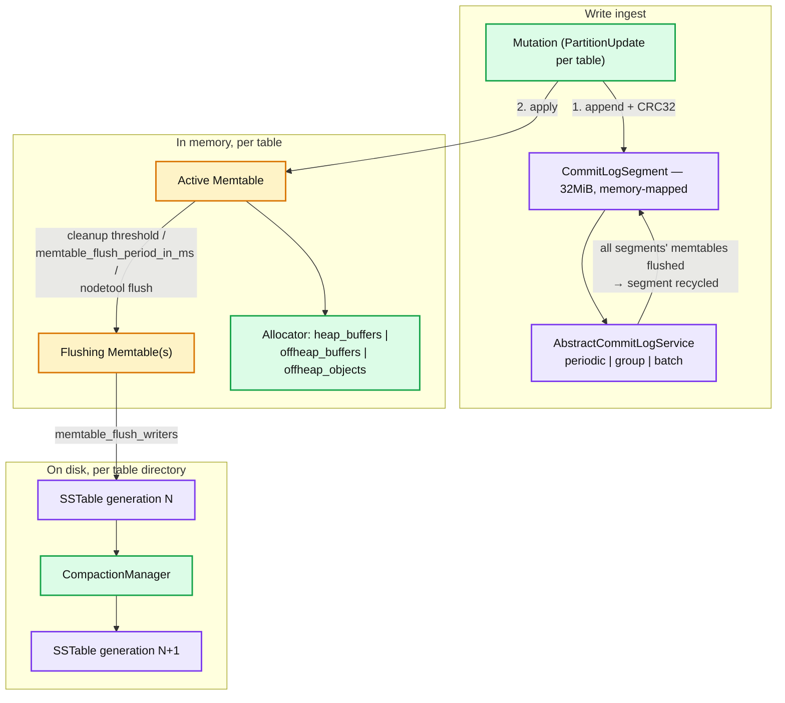
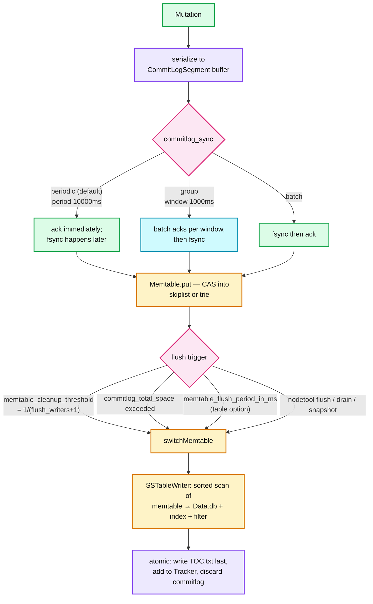
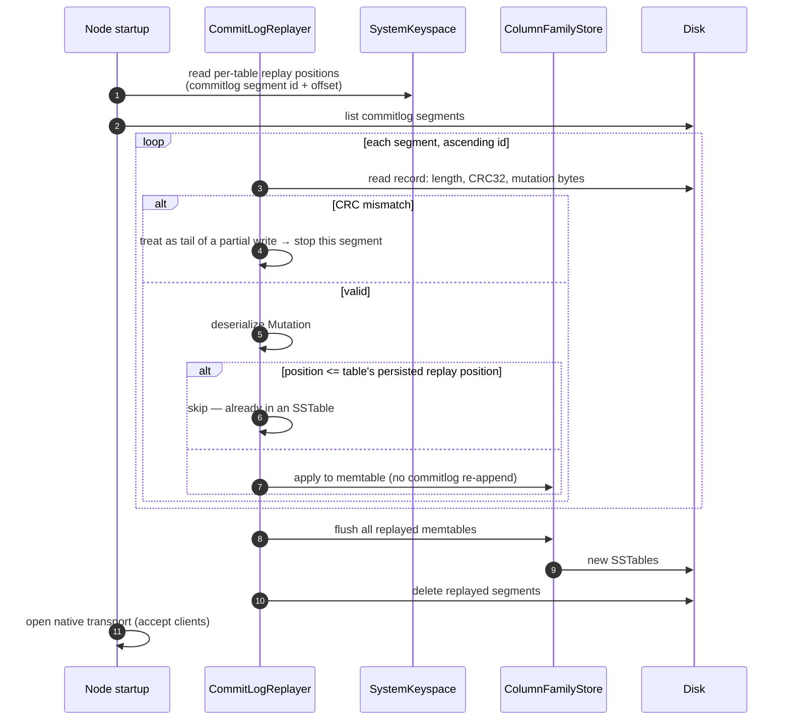
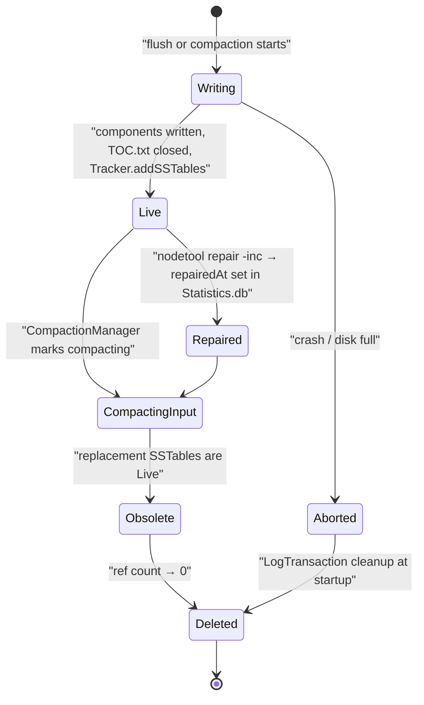
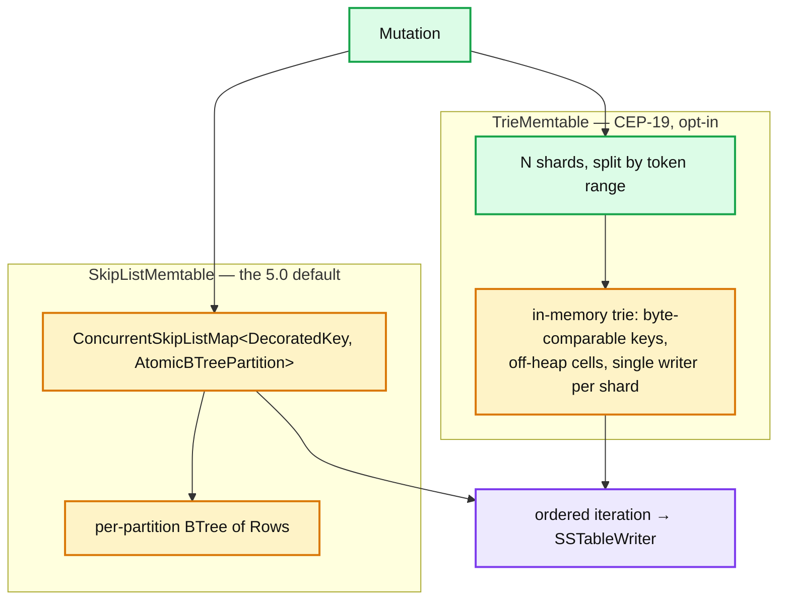

# Cassandra 01 — Storage Engine: CommitLog, Memtables, SSTable Formats

**Baseline: Apache Cassandra 5.0** (`cassandra-5.0` branch, 5.0.10-SNAPSHOT). Defaults read from `conf/cassandra.yaml` and `src/java/org/apache/cassandra/`. See [report 11](cassandra-11-delta-and-version-matrix.md) before quoting a number.

---

<!-- nav:start -->
[← 00 Overview](cassandra-00-overview.md) · **[Index](README.md)** · [02 Write Path →](cassandra-02-write-path.md)
<!-- nav:end -->

<!-- toc:start -->

<b>Sections in this report (12)</b>

- [1. Overview](#1-overview)
- [2. Architecture](#2-architecture)
- [3. Data flow — durability and flush](#3-data-flow--durability-and-flush)
- [4. Sequence — startup commitlog replay](#4-sequence--startup-commitlog-replay)
- [5. State machine — SSTable lifecycle](#5-state-machine--sstable-lifecycle)
- [6. Component deep dives](#6-component-deep-dives)
- [7. Guarantees](#7-guarantees)
- [8. Failure modes](#8-failure-modes)
- [9. Scalability & performance](#9-scalability--performance)
- [10. Trade-offs & alternatives](#10-trade-offs--alternatives)
- [11. Staff-level questions](#11-staff-level-questions)
- [12. Sources](#12-sources)

<!-- toc:end -->

## 1. Overview

- **What it is.** A per-node LSM tree. Nothing in this report knows about replication, consistency levels or the ring — a replica applies mutations identically whether it is the first or the third to see them.
- **Design bet.** Sequential writes only. The commitlog is an append-only file; memtables are in RAM; SSTables are written once and never modified. Every random-write cost is converted into a background merge cost.
- **Idempotence comes from data, not protocol.** Every cell carries `(timestamp, ttl, localDeletionTime)`. Applying the same mutation twice is a no-op because reconciliation is last-write-wins per cell. This is what makes hints, read repair and repair safe to replay blindly.
- **5.0's contribution is two *optional* new implementations**: `TrieMemtable` (CEP-19) alongside the default `SkipListMemtable`, and the `bti` SSTable format (CEP-25) alongside the default `big`. Both are opt-in — verified in `cassandra.yaml`.

---

## 2. Architecture

**What to notice**

- **The commitlog is shared across all tables; memtables are per-table.** A segment can only be discarded when *every* table with data in it has flushed. One rarely-written table can therefore pin gigabytes of commitlog — the mechanism behind `commitlog_total_space` (default `8192MiB` or 1/4 disk, whichever is smaller) forcing flushes of the oldest-dirty table.
- **Flushing memtables remain readable.** The read path merges the active memtable, all flushing memtables, and all SSTables. There is no window where a write is invisible.
- **`memtable_allocation_type: heap_buffers`** is the 5.0 default. `offheap_objects` moves cell data off heap and is the standard tuning for large memtables — it trades GC pressure for native memory accounting you must now do yourself.
- **The arrow from `CLA` back to `CLS` is the durability loop.** Data is only safe to drop from the commitlog once it exists in an SSTable, which is why an unflushable table blocks log recycling and eventually writes.

---

## 3. Data flow — durability and flush

**What to notice**

- **`periodic` is the default and it acks before fsync.** Up to `commitlog_sync_period: 10000ms` of acknowledged writes are lost on power failure. This is a deliberate, documented trade — and the single most common surprise in production post-mortems.
- **The memtable is already sorted, so flush is a sequential scan.** No sort step, no merge. This is why flush is cheap and why the memtable structure must be an ordered map (skiplist or trie), not a hash map.
- **`memtable_cleanup_threshold` is deprecated in 5.0 but its formula still governs**: `1 / (memtable_flush_writers + 1)`, i.e. ~0.33 with the default 2 writers. When the total memtable pool exceeds it, the largest memtable is flushed.
- **Flush is not atomic at the filesystem level; visibility is.** Components are written, then the SSTable is registered in the `Tracker`. A crash mid-flush leaves orphan components that are cleaned at startup, and the commitlog replays.

---

## 4. Sequence — startup commitlog replay

**What to notice**

- **Replay is idempotent twice over**: by replay position (skip what is already flushed) and by cell timestamp (re-applying loses to nothing). Correctness does not depend on the position bookkeeping being exact.
- **A CRC mismatch terminates the segment, it does not fail startup.** The assumption is that a torn record is the tail of an interrupted write. `commitlog_sync_period` bounds how much this can silently discard.
- **The node does not accept client traffic until replay completes.** Long replay = long restart. This is the reason to keep `commitlog_total_space` bounded and to `nodetool drain` before a planned restart — drain flushes everything and makes replay a no-op.
- **Replay writes to memtables, not back to the commitlog.** Otherwise restart would be non-terminating.

---

## 5. State machine — SSTable lifecycle

**What to notice**

- **Deletion is reference-counted, not immediate.** An SSTable obsoleted by compaction stays on disk until every in-flight read releases it. This is why `nodetool compact` can transiently need double the space and why `df` lags `nodetool cfstats`.
- **`LogTransaction` (the `*.log` files in the data directory) is the crash-consistency mechanism.** It records which files a compaction intends to create and remove, so startup can roll forward or back. Never delete these by hand.
- **`repairedAt` in `Statistics.db` partitions SSTables into repaired and unrepaired sets**, which incremental repair and compaction must keep separate — the source of the "incremental repair causes overlapping-set problems" folklore ([report 07](cassandra-07-repair-streaming.md)).
- **Immutability is what makes all of this simple.** No state transition ever modifies an SSTable's data; `Statistics.db` is the only mutable component (`MUTABLE_COMPONENTS = {STATS}`, verified in `BtiFormat.java`).

---

## 6. Component deep dives

### 6.1 CommitLog

- **Responsibility.** Make a mutation crash-durable before it is acknowledged. Nothing else — it is not read except at startup.
- **Structures.** A ring of `CommitLogSegment`s, default **`commitlog_segment_size: 32MiB`**, memory-mapped. Each records a per-table "dirty" set so a segment can be freed when all its tables have flushed. Records are `length | CRC32 | serialized Mutation`.
- **Threading.** Producers CAS a region out of the segment's buffer and serialise into it in parallel — allocation is contended, serialisation is not. A single `AbstractCommitLogService` thread performs the sync.
- **Config that matters.** `commitlog_sync: periodic` (default) with `commitlog_sync_period: 10000ms`; alternatives `group` (`commitlog_sync_group_window: 1000ms`) and `batch`. `commitlog_total_space: 8192MiB` (commented default; effective value is min(8192MiB, ¼ of the commitlog volume)). `commitlog_compression` is unset by default (LZ4/Snappy/Deflate available). `commitlog_directory` on a separate device is the classic spinning-disk optimisation and largely irrelevant on NVMe **[inferred]**.
- **Failure handling.** `commit_failure_policy` (`stop` default) governs behaviour on write failure: `stop` shuts down transports but keeps the JVM alive for JMX; `die`, `stop_commit` and `ignore` are the alternatives. `ignore` risks silent data loss.

### 6.2 Memtables

- **`SkipListMemtable`** — `ConcurrentSkipListMap` from decorated (token-prefixed) key to an `AtomicBTreePartition`. Lock-free for readers, CAS for writers. Cost is object count: every row and cell is a JVM object, which is the dominant source of old-gen GC pressure on write-heavy nodes.
- **`TrieMemtable`** — a byte-comparable trie sharded by token range, **single-writer per shard**. This moves metadata off heap, collapses shared key prefixes, and improves cache locality. `cassandra.yaml` states the trade explicitly: *"Because the trie memtable is a sharded single-writer solution, it can perform worse when the load is very unevenly distributed, e.g. when most of the writes access a very small number of partitions or with legacy secondary indexes."* That sentence is the whole adoption decision.
- **Selection is per-table.** `cassandra.yaml` defines named configurations (`skiplist`, `trie`, `default`) and `default: {inherits: skiplist}`; a table opts in with `WITH memtable = 'trie'`. Enabling trie globally means editing the `default` configuration.
- **Sizing.** `memtable_heap_space` / `memtable_offheap_space` both default to ¼ of heap when unset. `memtable_flush_writers` defaults to 2 for a single data directory. `memtable_allocation_type: heap_buffers`.

### 6.3 SSTable format — `big` (default) vs `bti` (opt-in)

| Component | `big` (default) | `bti` (CEP-25) | Purpose |
|---|---|---|---|
| `Data.db` | yes | yes | The rows, in partition-key (token) order, compressed in chunks |
| `Index.db` | yes | **no** | Per-partition offsets + in-partition row index |
| `Summary.db` | yes | **no** | Sampled, **heap-resident** index of `Index.db` |
| `Partitions.db` | no | **yes** | Trie mapping partition key → row-index position |
| `Rows.db` | no | **yes** | Trie mapping clustering prefix → `Data.db` offset |
| `Filter.db` | yes | yes | Bloom filter over partition keys |
| `CompressionInfo.db` | yes | yes | Chunk offsets for the compressed `Data.db` |
| `Statistics.db` | yes | yes | Metadata: min/max timestamps and clusterings, `repairedAt`, estimated histograms. **The only mutable component.** |
| `TOC.txt`, `Digest.crc32` | yes | yes | Component manifest and checksum |

*Component names verified in `io/sstable/format/bti/BtiFormat.java`: `PARTITION_INDEX → "Partitions.db"`, `ROW_INDEX → "Rows.db"`.*

- **Why BTI exists.** `Summary.db` must be held in heap and is *sampled*, so lookup is "binary search the summary, then scan `Index.db`". As SSTables grow, the summary either grows in heap or gets coarser and the scan gets longer. A trie is not sampled: lookup is O(key length) with no heap residency requirement, so it stays effective at large SSTable sizes. This is the enabling change for high node density ([report 10](cassandra-10-scale-operations.md)).
- **`column_index_size` — the granularity knob.** `cassandra.yaml` states: *"Leave undefined to use a default suitable for the SSTable format in use (64 KiB for BIG, 16KiB for BTI)."* The commented example line reads `column_index_size: 4KiB`, which is **not** the effective default — a common misreading. Smaller granularity means faster in-partition row lookup and a bigger index; the file explicitly warns against small granularity with `big` because large collation indexes cache badly.
- **Migration is per-SSTable and lazy.** Setting `sstable.selected_format: bti` makes *new* SSTables BTI; existing `big` SSTables remain readable and are converted only as compaction rewrites them. `nodetool upgradesstables -a` forces it. Both formats coexist in one table directory. Downgrade requires rewriting back, so treat BTI adoption as one-way in practice **[inferred]**.

### 6.4 Compression and the chunk cache

- `Data.db` is compressed in fixed **chunks** (`chunk_length_in_kb`, default **16 KiB**; LZ4 default, Snappy/Deflate/Zstd available). `CompressionInfo.db` maps logical offset → chunk.
- **The read unit is the chunk, not the row.** A 200-byte row read costs a 16 KiB chunk decompress. Lowering `chunk_length_in_kb` to 4 KiB cuts read amplification for small-row point-read workloads at the cost of compression ratio and a larger `CompressionInfo.db` — one of the highest-yield, least-used tunings.
- `file_cache_size` (commented default `512MiB`) bounds the off-heap buffer pool holding decompressed chunks. `disk_access_mode: mmap_index_only` is the commented default.
- `crc_check_chance` (table option, default 1.0) verifies chunk checksums on read.

### 6.5 Cell encoding and reconciliation

- A row is a set of cells; each cell carries value, **`timestamp` (microseconds)**, and optionally `ttl` + `localDeletionTime`.
- **Reconciliation is per-cell last-write-wins**, ties broken by comparing value bytes. This makes merge order-independent and therefore replay-safe.
- **Four kinds of tombstone**: cell, row, range, and partition. All are *data*: they occupy space, are returned by reads, and count toward `tombstone_warn_threshold: 1000` / `tombstone_failure_threshold: 100000`.
- **The clock is the client's or the coordinator's.** Timestamp skew between coordinators is a real data-loss vector — a write with a future timestamp shadows correct later writes until wall-clock catches up. NTP discipline is a correctness requirement, not hygiene.

---

## 7. Guarantees

| Guarantee | Mechanism | Limit |
|---|---|---|
| **Local durability of an acked write** | CommitLog append before memtable apply | Bounded by `commitlog_sync`: with `periodic`, up to 10s of acked writes lost on power failure |
| **Crash consistency of SSTables** | `LogTransaction` files + write-TOC-last + startup cleanup | Requires the data directory to survive; not a substitute for replication |
| **Read-your-write on a single replica** | Memtable is queried before SSTables, flushing memtables included | Says nothing across replicas — that is [report 05](cassandra-05-coordinator-consistency.md) |
| **Immutability of written data** | SSTables never modified; only `Statistics.db` mutates | Compaction rewrites, it does not edit |
| **Idempotent replay** | Per-cell timestamps + replay positions | Depends on clock sanity across coordinators |

---

## 8. Failure modes

| Failure | Detection | Recovery | Blast radius |
|---|---|---|---|
| Commitlog volume full | Write failure → `commit_failure_policy: stop` | Transports stop; node stays alive for JMX; free space and restart | One node down, cluster serves at RF−1 |
| Memtable pool exhausted (flush can't keep up) | Writes block; `MemtablePool` metrics; `PendingFlushes` climbs | Raise `memtable_flush_writers`, faster disk, reduce ingest | Node-local write stall → coordinator timeouts → cluster-wide p99 |
| Corrupt SSTable | Chunk CRC failure on read | `disk_failure_policy` (`stop` default) → `nodetool scrub` or delete and repair | Reads for affected ranges fail on that replica; other replicas cover |
| Slow commitlog replay on restart | Node not accepting clients for minutes | `nodetool drain` before planned restarts | Prolonged RF−1 window |
| Clock skew across coordinators | Silent — writes "disappear" | NTP; never set client timestamps by hand without a monotonic source | Silent data loss, cluster-wide, hardest class of incident here |

---

## 9. Scalability & performance

- **Write path bottleneck is commitlog fsync throughput, then flush throughput.** Neither is CPU-bound on modern NVMe; on cloud block storage, IOPS limits usually bind first.
- **The real ceiling is GC, not IO.** With `heap_buffers` and `SkipListMemtable`, every cell is a JVM object with a lifetime of one flush interval — a textbook old-gen promotion generator. `offheap_objects` plus `TrieMemtable` is the 5.0 answer, and it is the main reason to adopt trie memtables at all.
- **Partition size is the hard modelling limit.** A partition is the unit of storage locality, compaction and read; a multi-hundred-MB partition means multi-second reads and GC storms regardless of tuning. Guardrails: `partition_size_warn_threshold` and the 5.0 `sstablepartitions` offline tool.
- **`concurrent_writes: 32` / `concurrent_reads: 32`** bound the mutation and read stages. `concurrent_compactors` defaults to `min(disks, cores)` capped at 8 and `compaction_throughput: 64MiB/s`.

---

## 10. Trade-offs & alternatives

- **vs. RocksDB (and therefore TiKV, CockroachDB).** RocksDB is levelled by default with a block cache and no notion of partitions. Cassandra's SSTables are partition-ordered and its indexes are two-level (partition, then clustering) — which is what makes wide-row scans cheap and what makes large partitions catastrophic. RocksDB also does WAL-per-column-family; Cassandra's shared commitlog is simpler but couples table flush schedules.
- **vs. ScyllaDB.** Same on-disk model, C++ with a shard-per-core thread-per-core architecture and no JVM. Scylla's advantage is precisely the GC problem above; `TrieMemtable` + `offheap_objects` narrows but does not close it **[inferred]**.
- **vs. HBase.** HBase separates storage (HDFS) from serving (RegionServers) and needs a metadata table. Cassandra co-locates and computes placement — better availability, worse rebalancing.
- **Why not update in place?** Because random writes to replicated, unsynchronised nodes require either coordination or read-modify-write. LSM buys away both. The bill arrives as compaction ([report 04](cassandra-04-compaction.md)) and tombstones.

---

## 11. Staff-level questions

1. **A node's `PendingFlushes` is climbing and write latency is degrading, but disk IO is at 30%. What is happening?** Almost certainly flush parallelism, not throughput: `memtable_flush_writers` defaults to 2, so with many tables or one very large memtable the writers serialise. Check whether one table dominates the memtable pool (a hot table starves others via `memtable_cleanup_threshold`), and whether GC pause time correlates — with `heap_buffers` the flush is competing with the collector for the same heap it is trying to free.

2. **Why can't you just delete old commitlog segments to reclaim space?** A segment is retained because at least one table with mutations in it has not flushed. Deleting it discards the only durable copy of those mutations, and on restart the node silently comes up missing acknowledged writes. The correct action is `nodetool flush` on the dirty tables (`CommitLog` JMX exposes which they are), which lets the segment be recycled.

3. **You switch a table to `bti`. What actually changes on the read path, and what does not?** Changes: `Summary.db` + `Index.db` are replaced by `Partitions.db` + `Rows.db` tries, so partition lookup stops being "binary-search a sampled heap structure then scan" and becomes a trie descent with no heap residency requirement; default row-index granularity drops from 64 KiB to 16 KiB. Unchanged: the bloom filter, the chunk cache, the compression chunk size, the merge, and the SSTable count. BTI improves *index* cost per SSTable — it does nothing for read amplification across SSTables, which is compaction's job.

4. **Argue for and against `commitlog_sync: batch` for a payments workload.** For: it removes the 10-second acknowledged-write loss window, and "we acked and lost it" is unacceptable for money. Against: it fsyncs per group of writes, typically costing an order of magnitude in write throughput, and it only protects against *correlated* power loss across a quorum of replicas — with rack-diverse or AZ-diverse placement, that event is already rarer than the failure modes you accepted elsewhere. The strong version of the argument is to use `group` with a small window as the middle ground, and to spend the effort on replica placement instead.

5. **Two clients write different columns of the same row at the same instant with clock skew of 200ms between coordinators. What does the row look like afterwards?** Both columns survive, because reconciliation is per *cell*, not per row — skew is irrelevant when the cells don't overlap. Now change it to the same column: the write from the skewed-ahead coordinator wins regardless of real-time order, and the later real write is silently invisible. If the timestamps are byte-identical, the larger value's bytes win. This is why timestamp discipline is a correctness property and why client-supplied `USING TIMESTAMP` is dangerous unless it comes from a monotonic source.

---

## 12. Sources

- `conf/cassandra.yaml`, `NEWS.txt` — [`apache/cassandra@cassandra-5.0`](https://github.com/apache/cassandra/tree/cassandra-5.0)
- `src/java/org/apache/cassandra/db/memtable/Memtable_API.md`, `TrieMemtable.java`, `SkipListMemtable.java`
- `src/java/org/apache/cassandra/io/sstable/format/bti/BtiFormat.java`, `.../big/BigFormat.java`
- `src/java/org/apache/cassandra/db/commitlog/` — `CommitLogSegment`, `AbstractCommitLogService`, `CommitLogReplayer`
- [CEP-19: Trie memtable implementation](https://cwiki.apache.org/confluence/display/CASSANDRA/CEP-19%3A+Trie+memtable+implementation)
- [CEP-25: Trie-indexed SSTable format](https://cwiki.apache.org/confluence/display/CASSANDRA/CEP-25%3A+Trie-indexed+SSTable+format)
- [CEP-11: Pluggable memtable implementations](https://cwiki.apache.org/confluence/display/CASSANDRA/CEP-11%3A+Pluggable+memtable+implementations)
- Chang et al. — *Bigtable*, OSDI 2006 (the SSTable/memtable model)
- O'Neil et al. — *The Log-Structured Merge-Tree*, Acta Informatica 1996

---

---

<!-- nav:start -->
[← 00 Overview](cassandra-00-overview.md) · **[Index](README.md)** · [02 Write Path →](cassandra-02-write-path.md)
<!-- nav:end -->
