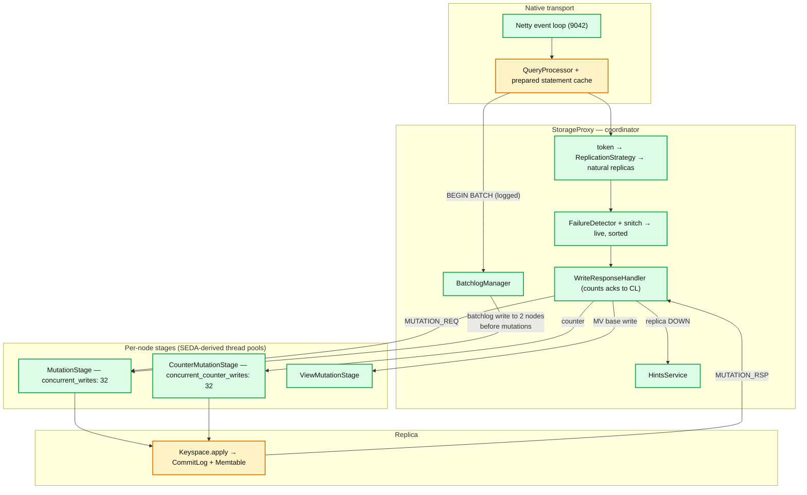
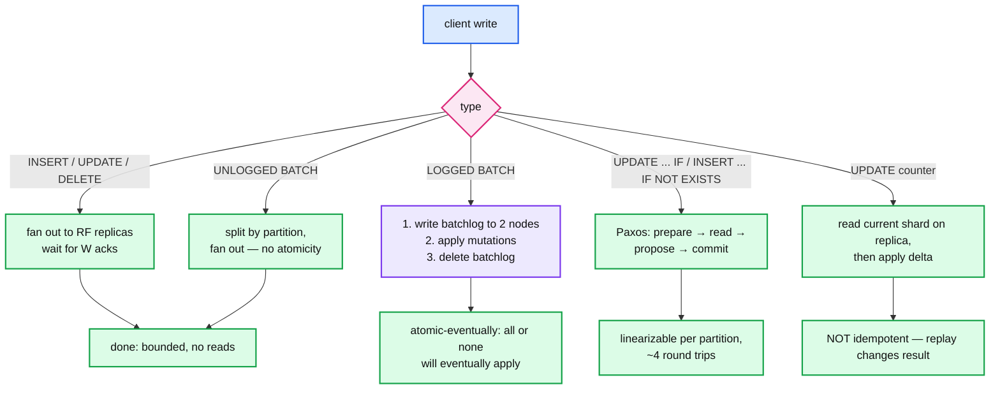
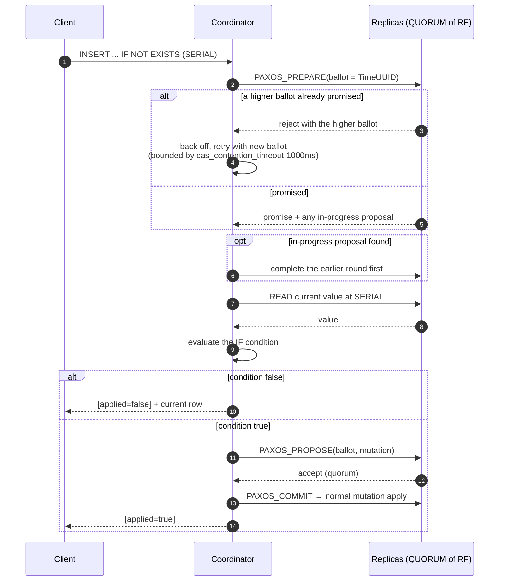
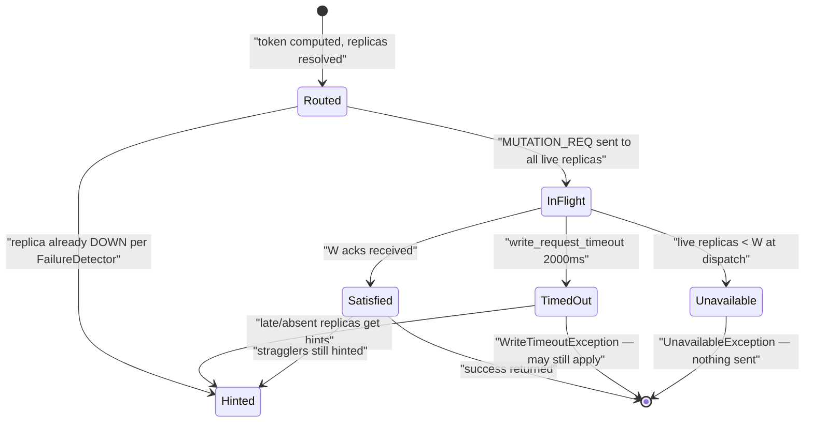
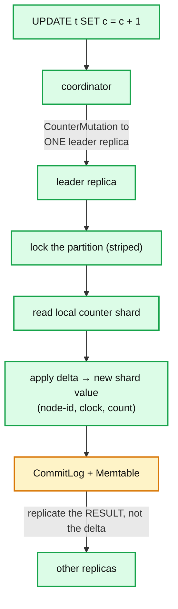

# Cassandra 02 — Write Path

**Baseline: Apache Cassandra 5.0** (`cassandra-5.0` branch). Defaults verified in `conf/cassandra.yaml`.

---

<!-- nav:start -->
[← 01 Storage Engine](cassandra-01-storage-engine.md) · **[Index](README.md)** · [03 Read Path →](cassandra-03-read-path.md)
<!-- nav:end -->

<!-- toc:start -->

<b>Sections in this report (12)</b>

- [1. Overview](#1-overview)
- [2. Architecture](#2-architecture)
- [3. Data flow — write types compared](#3-data-flow--write-types-compared)
- [4. Sequence — LWT (Paxos) `INSERT ... IF NOT EXISTS`](#4-sequence--lwt-paxos-insert--if-not-exists)
- [5. State machine — a mutation from the coordinator's view](#5-state-machine--a-mutation-from-the-coordinators-view)
- [6. Component deep dives](#6-component-deep-dives)
- [7. Guarantees](#7-guarantees)
- [8. Failure modes](#8-failure-modes)
- [9. Scalability & performance](#9-scalability--performance)
- [10. Trade-offs & alternatives](#10-trade-offs--alternatives)
- [11. Staff-level questions](#11-staff-level-questions)
- [12. Sources](#12-sources)

<!-- toc:end -->

## 1. Overview

- **What it is.** Everything between a `QUERY` frame arriving on port 9042 and the coordinator returning success: replica selection, fan-out, acknowledgement counting, hint recording.
- **Design bet.** The write path performs no reads and takes no locks. Its cost is a bounded number of parallel RPCs plus one local append. Latency is therefore the *W-th fastest* replica, not the slowest.
- **Four distinct write types with genuinely different mechanics**: normal mutations, logged batches, counters, and LWT/CAS. Conflating them is the most common source of production surprise.
- **The coordinator is stateless per request** except for hints and the batchlog. Nothing survives a coordinator crash mid-write except what replicas already applied.

---

## 2. Architecture

**What to notice**

- **The `WriteResponseHandler` is the consistency level.** CL is not enforced anywhere else — it is literally a countdown latch initialised to the required ack count, with `write_request_timeout: 2000ms` as its deadline.
- **Stages are separate thread pools with separate queues.** A saturated `MutationStage` does not block reads. `nodetool tpstats` showing `MutationStage` pending is the canonical write-overload signal; dropped mutations there are silently lost writes that only repair will fix.
- **Materialized views get their own stage and their own (much worse) semantics** — they require a read-before-write on the base replica and a batchlog for the view update. `materialized_views_enabled: false` by default in 5.0.
- **Hints are recorded by the coordinator at fan-out time**, based on the failure detector's opinion *before* sending, plus on timeout.

---

## 3. Data flow — write types compared

**What to notice**

- **A logged batch buys atomicity, not isolation.** It guarantees that if any mutation applies, all eventually will — via a replicated batchlog replayed by `BatchlogManager`. Readers can and do see partial batches. It costs an extra replicated write plus a delete.
- **An unlogged batch across partitions is almost always a performance bug.** It makes one coordinator responsible for fanning out to many token ranges, serialising what token-aware drivers would have parallelised. `unlogged_batch_across_partitions_warn_threshold: 10` exists to catch this. `batch_size_warn_threshold: 5KiB` / `batch_size_fail_threshold: 50KiB`.
- **Counters break the "writes never read" rule.** A counter update is a read-modify-write on the replica, which is why they are slower, why they use a separate stage, and why they are **not idempotent** — a replayed counter mutation double-counts. Hints and retries are therefore unsafe for counters in a way they are not for anything else.
- **LWT is a different protocol wearing CQL syntax.** Four round trips, `cas_contention_timeout: 1000ms`, and `SERIAL`/`LOCAL_SERIAL` consistency. It is per-partition only.

---

## 4. Sequence — LWT (Paxos) `INSERT ... IF NOT EXISTS`

**What to notice**

- **Four round trips minimum: prepare, read, propose, commit.** Roughly 4× the latency of a normal `QUORUM` write, and each round trip is a quorum. Cross-DC `SERIAL` multiplies this by WAN RTT — which is why `LOCAL_SERIAL` exists and why it silently gives you only per-DC linearizability.
- **Contention is quadratic-ish, not linear.** Competing ballots on the same partition cause mutual rejection and retry storms. LWT on a hot key is a well-known way to take a cluster down.
- **A `SERIAL` read is not free either.** To read linearizably you must run the prepare phase to complete any in-flight proposal — a `SERIAL` read is a Paxos round.
- **LWT does not compose.** Two `IF` statements are two independent Paxos instances. There is no multi-partition transaction in 5.0; that is exactly what Accord ([report 09](cassandra-09-tcm-accord.md)) is for.

---

## 5. State machine — a mutation from the coordinator's view

**What to notice**

- **`UnavailableException` and `WriteTimeoutException` mean opposite things and clients confuse them constantly.** `Unavailable` is a pre-flight check: not enough live replicas, nothing was written, safe to retry. `WriteTimeout` means the write *was* dispatched and may have partially applied — retrying is safe only because mutations are idempotent, which is exactly why it is *not* safe for counters.
- **A satisfied write still hints the stragglers.** Success at CL does not stop the coordinator from pursuing full replication.
- **There is no rollback state.** A write that reached one replica and timed out stays on that replica forever (or until repair/read-repair spreads it). Cassandra has no notion of undoing a partially applied mutation outside LWT.

---

## 6. Component deep dives

### 6.1 `StorageProxy.mutate` — replica selection

- Computes `token = Murmur3Partitioner.getToken(partitionKey)`; asks the keyspace's `AbstractReplicationStrategy` (`SimpleStrategy` or `NetworkTopologyStrategy`) for natural endpoints; the snitch supplies DC/rack.
- With `NetworkTopologyStrategy`, replicas walk the ring skipping racks already used, so RF=3 in a 3-rack DC gives one replica per rack — the property that makes rack-aware `QUORUM` survive a rack loss.
- Transient replication (`transient_replication_enabled: false` by default, experimental) allows replicas that store data only until repair.

### 6.2 Batchlog

- A logged batch writes a serialized blob to `system.batches` on **2 nodes in the local DC** (a different rack where possible), acknowledged at `ONE` each, before any mutation is sent.
- `BatchlogManager` replays undeleted batches on a timer. Replay is idempotent because the mutations are.
- **Cost model.** Two extra writes plus two deletes for every logged batch. A batch of 2 mutations doubles the write volume; the atomicity is rarely worth it unless the mutations are genuinely a unit.

### 6.3 Counters

- The leader replica converts a *delta* into an absolute per-node shard, then replicates the shard. Downstream replicas apply idempotently; only the leader step is non-idempotent.
- **Consequences.** Counters cannot be read-repaired the way normal data can, are slower (lock + read + write), do not support TTL or LWT, and a timed-out counter update is genuinely ambiguous. Treat counters as approximate unless the application can tolerate it.
- `concurrent_counter_writes: 32`, `counter_write_request_timeout: 5000ms`, `counter_cache_size` (auto-sized when unset).

### 6.4 CDC

- `cdc_enabled: false` by default. When on, commitlog segments for CDC-enabled tables are hard-linked into `cdc_raw_directory` on discard instead of being deleted.
- Consumption is the operator's problem — Cassandra provides the segments, not a stream API. `cdc_total_space` caps the directory; **when full, writes to CDC tables are rejected.** That failure mode surprises people: a stalled CDC consumer takes writes down.

### 6.5 Back-pressure and load shedding

- Each stage has a bounded queue; overflow drops messages and increments `Dropped MUTATION` in `nodetool tpstats`. **A dropped mutation is a silently lost write on that replica** — the coordinator may still have satisfied CL from others, and repair is the only cure.
- `native_transport_max_threads`, `native_transport_max_concurrent_requests_in_bytes` (default ~10% of heap) shed at the front door.
- Internode messaging in 4.0+ has explicit outbound queue capacity limits (`internode_application_send_queue_capacity`, default `4MiB` per link), which is a genuine back-pressure mechanism rather than a drop.

---

## 7. Guarantees

| Guarantee | Mechanism | Limit |
|---|---|---|
| Write acknowledged at CL W | `WriteResponseHandler` counts W acks | Says nothing about the other RF−W replicas |
| Row-level atomicity | A partition update applies as one unit per replica | No atomicity *across* partitions or replicas without a batch/LWT |
| Batch atomicity (logged) | Replicated batchlog + replay | Eventual, not isolated; readers see partial state |
| Linearizability per partition | Paxos (LWT) at `SERIAL`/`LOCAL_SERIAL` | Single partition only; `LOCAL_SERIAL` is per-DC only |
| Idempotence of replay | Per-cell timestamps | **Does not hold for counters** |

---

## 8. Failure modes

| Failure | Detection | Recovery | Blast radius |
|---|---|---|---|
| `MutationStage` saturated → dropped mutations | `nodetool tpstats` Dropped column; `WriteTimeout` at clients | Reduce ingest, add nodes; repair to heal lost copies | Silent divergence until repair |
| Coordinator dies mid-logged-batch | Batchlog rows outlive it | `BatchlogManager` on the batchlog nodes replays | Delay only, if ≥1 batchlog node survives |
| LWT contention storm on a hot key | `CasWriteTimeout`, rising `cas_contention_timeout` breaches | Remove LWT from the hot path; shard the key | Can consume the whole cluster's request budget |
| Counter update timeout | `WriteTimeout` on a counter | **Do not blind-retry** — may double count | Silent numeric drift |
| CDC directory full | Writes to CDC tables rejected | Drain the consumer, raise `cdc_total_space` | Write outage scoped to CDC tables |
| Clock skew on coordinators | None — silent | NTP | Silent data loss cluster-wide |

---

## 9. Scalability & performance

- **Write throughput scales linearly with nodes** for uniformly distributed keys — the headline property, and it holds in practice.
- **Latency is the W-th fastest replica.** Adding replicas beyond W does not slow the write; a *slow* replica only matters if it is in the fastest W. This is why `QUORUM` on RF=3 is remarkably tail-tolerant and `ALL` is not.
- **The dominant anti-patterns are all skew**: hot partitions (one replica set takes all traffic), large partitions (unbounded memtable growth), and unlogged multi-partition batches (one coordinator serialises fan-out).
- **Token-aware routing removes one hop from every write.** Verify the driver actually has it on; the difference is typically 20–40% of p99 **[inferred]**.

---

## 10. Trade-offs & alternatives

- **vs. a leader-based system (Kafka partition leader, Spanner Paxos group).** Cassandra's leaderless writes mean no failover pause and no leader hotspot, at the cost of no ordering and no cross-key atomicity. Kafka gets total order per partition precisely because it has one writer.
- **vs. DynamoDB.** Same Dynamo ancestry, but Dynamo hides consistency behind two options and provides real conditional writes and transactions server-side. Cassandra exposes more dials and fewer guarantees.
- **Why not make LWT the default?** Because 4 round trips per write would destroy the property the whole system exists for. The design deliberately makes the expensive thing opt-in and syntactically visible.

---

## 11. Staff-level questions

1. **A client sees `WriteTimeoutException` with `writeType=SIMPLE`. What do you tell them to do, and how does the answer change for `writeType=COUNTER` and `writeType=BATCH_LOG`?** `SIMPLE`: retry — mutations are idempotent, and the write may or may not have applied. `COUNTER`: do not retry blindly; the update may have applied and a retry double-counts. `BATCH_LOG`: the batchlog write itself failed, so nothing was applied — retry is safe and necessary. The `writeType` field exists precisely to make this decidable, and most client retry policies ignore it.

2. **When is a logged batch actually the right tool?** When several mutations *within the same partition* must apply together — but then they are already atomic without the batch, so no. The genuine case is denormalised writes to 2–3 tables that must not diverge (e.g. a record and its lookup index), where partial application is worse than delay. If the mutations all target one partition, drop the `LOGGED`. If there are more than a handful of partitions, drop the batch entirely and let the driver parallelise.

3. **Why does `materialized_views_enabled` default to `false` in 5.0?** MVs require the base replica to read the previous row to compute the view delta, then write the view update through a batchlog to a *different* partition on a *different* replica set. That is read-before-write plus cross-partition coordination on the write path — everything the design avoids. The consistency between base and view is best-effort and can diverge permanently with no repair mechanism that fixes it. The feature is not broken so much as unable to offer a guarantee worth relying on.

4. **Design an idempotent counter for a billing system on Cassandra 5.0.** Do not use the counter type. Write one row per event into a partition keyed by the aggregation window, with a unique event ID as the clustering key — writes become ordinary idempotent inserts, and duplicates collapse by primary key. Aggregate on read, or roll up into a summary table with a scheduled job. This trades read cost and storage for exact-once semantics, which is the right trade for money.

5. **You need write latency p99 under 10ms with RF=3 across three AZs. What CL do you use and what breaks it?** `LOCAL_QUORUM` (W=2) within one region, which needs the 2nd-fastest of 3 AZ-local replicas — intra-AZ RTT is sub-millisecond, so the budget goes to commitlog and GC, not network. What breaks it: a single slow replica *if* it is among the fastest two (GC pause, compaction saturating IO, or a degraded EBS volume); `speculative_retry` does not help writes, only reads. The mitigations are compaction throttling, GC tuning, and rack-aware placement so an AZ loss costs exactly one replica rather than two.

---

## 12. Sources

- `src/java/org/apache/cassandra/service/StorageProxy.java` — [`apache/cassandra@cassandra-5.0`](https://github.com/apache/cassandra/tree/cassandra-5.0)
- `src/java/org/apache/cassandra/service/paxos/` — `Paxos.java`, `PaxosPrepare/Propose/Commit`
- `src/java/org/apache/cassandra/batchlog/BatchlogManager.java`
- `src/java/org/apache/cassandra/db/CounterMutation.java`
- `conf/cassandra.yaml` — write timeouts, batch guardrails, concurrency, CDC
- [Cassandra docs — Data modelling and CQL](https://cassandra.apache.org/doc/latest/cassandra/developing/cql/)
- Lamport — *Paxos Made Simple*, 2001 (the LWT protocol's basis)

---

---

<!-- nav:start -->
[← 01 Storage Engine](cassandra-01-storage-engine.md) · **[Index](README.md)** · [03 Read Path →](cassandra-03-read-path.md)
<!-- nav:end -->
