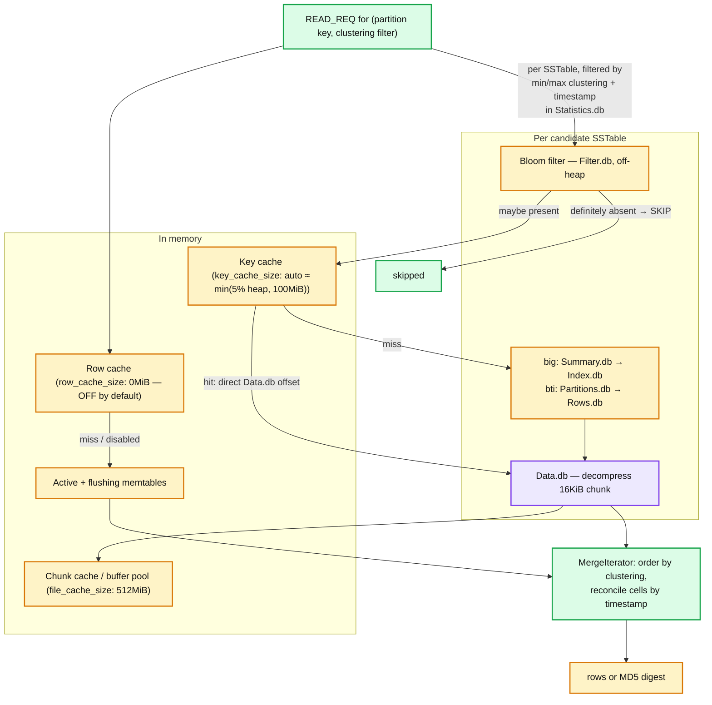
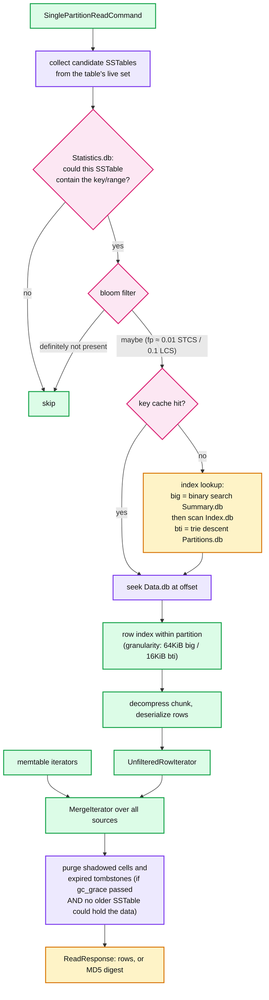
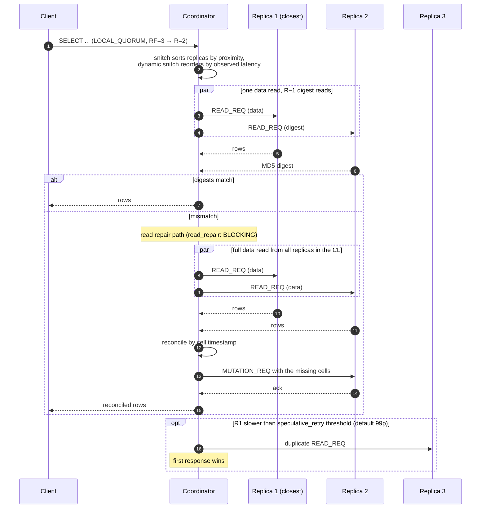
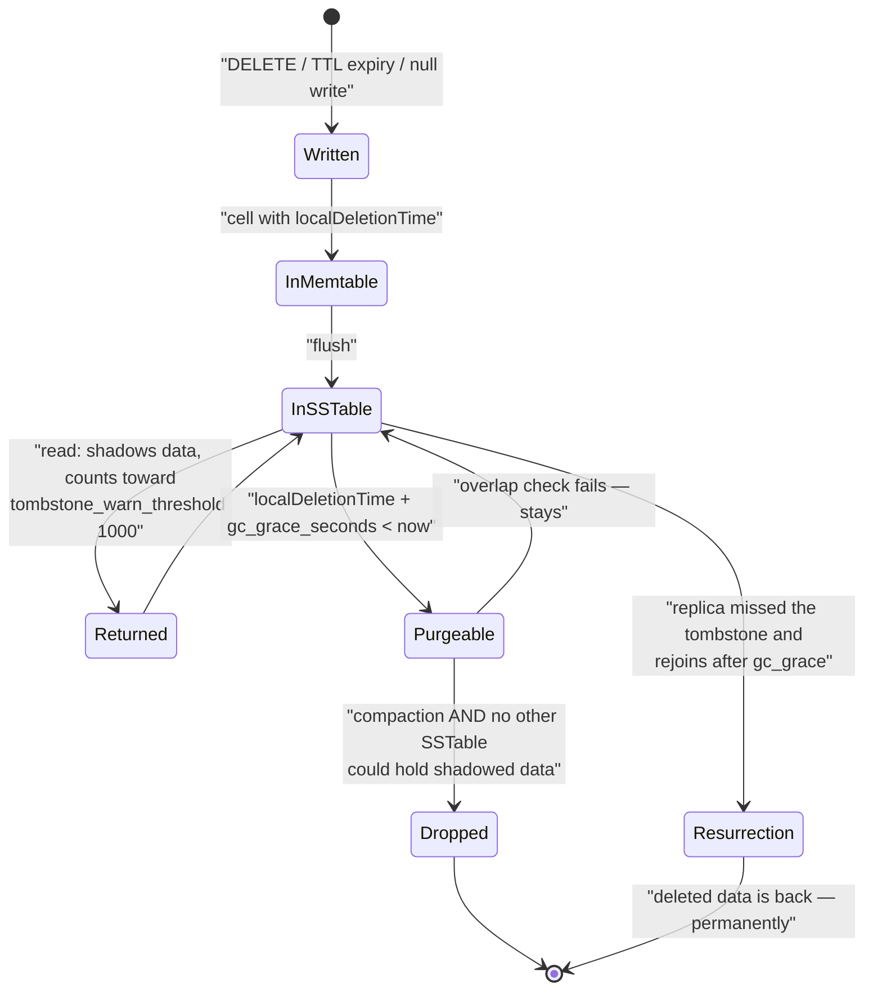

# Cassandra 03 — Read Path

**Baseline: Apache Cassandra 5.0** (`cassandra-5.0` branch). Defaults verified in `conf/cassandra.yaml`.

---

<!-- nav:start -->
[← 02 Write Path](cassandra-02-write-path.md) · **[Index](README.md)** · [04 Compaction →](cassandra-04-compaction.md)
<!-- nav:end -->

<!-- toc:start -->

<b>Sections in this report (12)</b>

- [1. Overview](#1-overview)
- [2. Architecture](#2-architecture)
- [3. Data flow — single-partition read](#3-data-flow--single-partition-read)
- [4. Sequence — coordinator read at `LOCAL_QUORUM` with digest mismatch](#4-sequence--coordinator-read-at-local_quorum-with-digest-mismatch)
- [5. State machine — a tombstone](#5-state-machine--a-tombstone)
- [6. Component deep dives](#6-component-deep-dives)
- [7. Guarantees](#7-guarantees)
- [8. Failure modes](#8-failure-modes)
- [9. Scalability & performance](#9-scalability--performance)
- [10. Trade-offs & alternatives](#10-trade-offs--alternatives)
- [11. Staff-level questions](#11-staff-level-questions)
- [12. Sources](#12-sources)

<!-- toc:end -->

## 1. Overview

- **What it is.** How a replica turns a partition key (plus optional clustering restriction) into rows: which SSTables to open, how to find the offset, how to merge.
- **Design bet.** Pay on read for the write path's refusal to read. The whole subsystem is a stack of filters that try to answer "can I skip this SSTable?" as cheaply as possible.
- **The governing metric is SSTables-per-read** (`nodetool tablehistograms`). Everything — compaction strategy, bloom filters, indexes, caches — exists to keep it small. A p99 of 1–2 is healthy; above ~10 the workload and the compaction strategy are mismatched.
- **Tombstones invert the model.** Deleted data makes reads *more* expensive, not less, until compaction purges it past `gc_grace_seconds` (default 864000).

---

## 2. Architecture

**What to notice**

- **The filter stack short-circuits in cost order**: `Statistics.db` min/max metadata (free, already in memory) → bloom filter (off-heap, ~1 cache miss) → key cache (hash lookup) → index (1 seek) → data (1 seek + decompress). Each layer's job is to avoid the next.
- **`row_cache_size: 0MiB` — the row cache is off by default and should usually stay off.** It caches an *entire partition*, so any write to that partition invalidates all of it. It is only correct for small, read-heavy, rarely-written partitions.
- **The key cache is the one that matters.** It maps `(sstable, partition key) → Data.db offset`, skipping the index entirely. Auto-sized to `min(5% of heap, 100MiB)` when `key_cache_size` is left blank, which it is by default.
- **`Statistics.db` filtering is underrated.** Min/max clustering values and min/max timestamps let a replica discard whole SSTables without touching the bloom filter — the mechanism that makes TWCS time-range queries fast.

---

## 3. Data flow — single-partition read

**What to notice**

- **A false positive from the bloom filter costs a full index + data lookup for nothing.** `bloom_filter_fp_chance` defaults to **0.01** for size-tiered/unified and **0.1** for levelled — levelled tolerates a worse filter because it guarantees far fewer overlapping SSTables per read.
- **The row index inside a partition is what saves wide-row reads.** Without it, reading one clustering row from a 100 MB partition would scan 100 MB. With it, you scan one granule. This is also why `column_index_size` matters more as partitions widen.
- **Merge is a k-way merge over sorted iterators**, streaming — the memory cost is O(number of sources), not O(rows). This is why a read of a huge partition doesn't OOM but *does* take forever.
- **Tombstone purging is conditional on more than gc_grace.** A tombstone can only be dropped if no *other* SSTable could still hold the data it shadows (checked via min/max timestamps and overlap). This is why tombstones survive gc_grace under STCS with big old SSTables, and why "I waited 10 days and they're still there" is the normal outcome, not a bug.

---

## 4. Sequence — coordinator read at `LOCAL_QUORUM` with digest mismatch

**What to notice**

- **`read_repair: BLOCKING` is the table default** (verified in `TableParams.java`). The client waits for the repair write to be acked before getting rows — that is what makes `R + W > RF` actually deliver monotonic reads. `read_repair: NONE` is faster and gives up that property.
- **A digest mismatch turns one cheap read into 2R expensive reads plus a write.** On an inconsistent cluster this is a latency cliff, not a gentle degradation, and it is self-inflicted by whatever caused the divergence (dropped mutations, expired hints, skipped repair).
- **`speculative_retry` (default `99p`) fires a duplicate read to an extra replica** when the original exceeds the table's 99th-percentile latency. It converts a slow-replica problem into extra load. `ALWAYS` doubles read traffic; `NEVER` exposes you fully to stragglers.
- **The dynamic snitch is the first line of defence against a slow replica**, updating every `dynamic_snitch_update_interval: 100ms`, resetting every `600000ms`, with `dynamic_snitch_badness_threshold: 1.0` (a replica must be 100% worse before the preferred order is overridden).

---

## 5. State machine — a tombstone

**What to notice**

- **`Purgeable → InSSTable` is the loop that surprises everyone.** Passing gc_grace makes a tombstone *eligible* for purging, not purged. Under STCS, a tombstone in a small recent SSTable cannot be dropped while a large old SSTable might hold the row it shadows — and that big SSTable may not compact for months.
- **`Resurrection` is the reason `gc_grace_seconds` and the repair interval are coupled.** Repair must complete within gc_grace on every node, or deleted data comes back. Lowering gc_grace to fix tombstone pressure without shortening the repair cycle is how teams cause data resurrection.
- **TTL expiry produces tombstones too.** A table with a 1-day TTL and a 10-day gc_grace stores 10 days of tombstones for 1 day of data. TWCS plus a lowered per-table `gc_grace_seconds` is the standard answer ([report 04](cassandra-04-compaction.md)).

---

## 6. Component deep dives

### 6.1 Bloom filter

- One per SSTable, in `Filter.db`, held **off-heap**. Sized from the SSTable's partition count and `bloom_filter_fp_chance`.
- **Partition-key only.** It cannot tell you whether a *clustering row* exists, which is why wide-partition point reads still touch the index.
- Defaults: **0.01** for STCS/UCS, **0.1** for LCS. Memory cost ≈ 1–2 GB per TB of data at 0.01 **[inferred, order-of-magnitude]**. Raising `bloom_filter_fp_chance` is the standard memory reclaim when a node holds many small partitions.
- Regenerated by `nodetool upgradesstables` after changing the table property; the existing SSTables keep their old filters until rewritten.

### 6.2 Partition index — `big` vs `bti`

```mermaid
flowchart TD
  subgraph bigf["big format"]
    S["Summary.db (sampled, ON HEAP)"] -->|"binary search →<br/>approximate Index.db position"| I["Index.db (all partitions,<br/>+ in-partition row index)"]
    I -->|"scan forward"| DB1["Data.db offset"]
  end
  subgraph btif["bti format"]
    P["Partitions.db (trie over<br/>byte-comparable keys)"] -->|"O(key length) descent"| R["Rows.db (trie over<br/>clustering prefixes)"]
    R --> DB2["Data.db offset"]
  end

  class I,DB1,DB2 store
  class S,P,R cache

  classDef client   fill:#dbeafe,stroke:#2563eb,stroke-width:2px,color:#111
  classDef service  fill:#dcfce7,stroke:#16a34a,stroke-width:2px,color:#111
  classDef store    fill:#ede9fe,stroke:#7c3aed,stroke-width:2px,color:#111
  classDef cache    fill:#fef3c7,stroke:#d97706,stroke-width:2px,color:#111
  classDef queue    fill:#cffafe,stroke:#0891b2,stroke-width:2px,color:#111
  classDef critical fill:#fee2e2,stroke:#dc2626,stroke-width:4px,color:#111
  classDef external fill:#e5e7eb,stroke:#6b7280,stroke-width:2px,color:#111,stroke-dasharray:4 3
  classDef decision fill:#fce7f3,stroke:#db2777,stroke-width:2px,color:#111
```

- **`big`**: `Summary.db` is sampled (`min_index_interval` 128 / `max_index_interval` 2048 table options) and must be resident in heap. Bigger SSTables → bigger summary or coarser sampling → longer `Index.db` scans. This is the structural ceiling on node density with `big`.
- **`bti`**: tries are not sampled and not heap-resident; lookup is a descent proportional to key length. This is why BTI is the enabler for the 5.0 density story, and why `column_index_size` defaults finer for BTI (16 KiB vs 64 KiB).
- **Neither format indexes column values.** Value-based lookup is SAI's job ([report 08](cassandra-08-cql-sai.md)).

### 6.3 Caches

| Cache | Default | Keyed by | Invalidation | Use when |
|---|---|---|---|---|
| **Key cache** | auto: `min(5% heap, 100MiB)` | (sstable, partition key) | SSTable obsolescence | Always. Cheapest win in the system. |
| **Row cache** | `row_cache_size: 0MiB` (off) | partition key | **Any write to the partition** | Small, hot, write-rarely partitions only |
| **Counter cache** | auto | counter cell | Write | Counter workloads (avoids the read in read-modify-write) |
| **Chunk cache / buffer pool** | `file_cache_size: 512MiB` (off-heap) | (file, chunk offset) | Nothing — immutable data | Always; raise it before raising heap |

- **The OS page cache is the real read cache.** Cassandra's own caches sit *in front of* it, and the standard sizing rule is to leave the majority of RAM to the OS rather than growing the JVM heap. Heap above ~31 GB also loses compressed oops.

### 6.4 Range reads and paging

- `SELECT` without a full partition key restriction becomes a `PartitionRangeReadCommand`, fanned out across token ranges — potentially every node. `range_request_timeout: 10000ms` (vs 5000ms for point reads) reflects the cost.
- Driver paging (`page_size`, default 5000 rows) streams via a paging state cursor. The coordinator re-issues per page, so a paged scan is many independent reads with no snapshot isolation between pages — rows written mid-scan may or may not appear.
- `ALLOW FILTERING` disables the guard against unbounded scans. It is almost always a modelling error announcing itself.

---

## 7. Guarantees

| Guarantee | Mechanism | Limit |
|---|---|---|
| Read sees the latest write at `R + W > RF` | Quorum intersection + blocking read repair | Only with `read_repair: BLOCKING` and no expired-hint gaps |
| Monotonic reads within a partition | Blocking read repair writes back before returning | Not guaranteed across coordinators with `read_repair: NONE` |
| Rows returned in clustering order | SSTables are clustering-sorted; merge preserves it | Ordering across partitions is token order, which is effectively random |
| Snapshot isolation | **None.** | A paged scan sees concurrent writes; there is no read snapshot at all |

---

## 8. Failure modes

| Failure | Detection | Recovery | Blast radius |
|---|---|---|---|
| Tombstone scan blowup | `TombstoneOverwhelmingException`; `tombstone_failure_threshold: 100000` | Model away queue patterns; TWCS; lower per-table gc_grace *with* matching repair cadence | Query fails; can OOM the replica before the guard fires |
| High SSTables-per-read | `nodetool tablehistograms` | Change compaction strategy; check for compaction backlog | Node-local p99 → cluster p99 via coordinator waits |
| Digest mismatch storms | Read repair metrics; latency cliff | Run repair; investigate dropped mutations | Read amplification 2R + a write per query |
| Large partition read | GC pause + `partition_size_warn_threshold` | Remodel with a bucketed partition key | Can stall the whole node's read stage |
| Slow replica in the read set | Dynamic snitch scores; speculative retry rate | Snitch demotes; operator ejects | Tail latency until demoted |
| Row cache thrash | High invalidation rate, no hit-rate gain | Turn it off (it is off by default for this reason) | Wasted heap |

---

## 9. Scalability & performance

- **Read latency is dominated by SSTables touched × (index seek + chunk decompress).** Reducing SSTable count (compaction) and chunk size (`chunk_length_in_kb`, default 16 KiB) attack the two terms directly.
- **Range reads do not scale with the cluster; they scale against it.** A full scan touches every token range, so adding nodes adds fan-out. Analytics belongs in Spark over SSTables or a separate DC.
- **Reads are the direction where multi-DC hurts.** `LOCAL_QUORUM` keeps reads in-DC; `QUORUM` on a 2-DC cluster means WAN round trips on every read, which is nearly always a misconfiguration.
- **Cache hit rate is the cheapest available lever** and is measurable per table in `nodetool info` / `tablestats`.

---

## 10. Trade-offs & alternatives

- **vs. B-tree stores (Postgres, InnoDB).** They pay on write for a single index probe on read. Cassandra pays nothing on write and merges k sources on read. The crossover is workload write ratio and how well compaction keeps k small.
- **vs. LCS-style universal levelling (RocksDB default).** Levelling bounds k tightly at high write amplification. Cassandra makes this a per-table choice ([report 04](cassandra-04-compaction.md)) instead of a global one.
- **Why no snapshot isolation?** It would require MVCC versions and a global ordering, i.e. coordination on the write path. The design's whole premise forbids it. Accord ([report 09](cassandra-09-tcm-accord.md)) reintroduces it selectively at transaction scope.

---

## 11. Staff-level questions

1. **`nodetool tablehistograms` shows p99 SSTables-per-read of 40 on an STCS table. What's happening and what do you do?** Either compaction is behind (check `nodetool compactionstats` and whether `compaction_throughput: 64MiB/s` is throttling below the ingest rate) or the workload overwrites the same partitions across many time-separated flushes, so every SSTable holds a fragment. STCS only merges similarly sized files, so fragments spread across size tiers never converge. The fix is LCS if the write rate can absorb the amplification, or UCS with a levelled-leaning scaling parameter; and separately, check whether the read is genuinely a point read or a range scan wearing a `SELECT`.

2. **Why does raising `bloom_filter_fp_chance` sometimes *improve* latency?** It shrinks `Filter.db`, which is off-heap but still competes for memory with the OS page cache. On a node with many small partitions the filters can be gigabytes; shrinking them lets more `Data.db` stay in page cache, and one avoided disk seek is worth many false positives. The trade is only sensible when the false-positive cost is a cached read rather than a real seek.

3. **A team lowers `gc_grace_seconds` from 10 days to 1 hour to fix tombstone pressure. What do you say?** That it will work and then cause silent data resurrection. Every replica must have received the tombstone before it is purged; the only mechanism that guarantees that is repair, so gc_grace must exceed the *worst-case* repair completion interval, including the time a node may be down. If tombstone pressure is the real problem, the answer is TWCS with `unchecked_tombstone_compaction`, remodelling away from queue/delete patterns, or per-table gc_grace *paired with* a subrange repair schedule that provably completes inside it.

4. **Explain why `read_repair: NONE` can break a `QUORUM`-read guarantee that `R + W > RF` seems to promise.** Quorum intersection guarantees that a `QUORUM` read *contacts* a replica holding the latest write — so the read returns correct data. What it does not guarantee is that the stale replicas get fixed. With blocking read repair off, a subsequent `ONE` read, or a `QUORUM` read whose quorum happens to consist of the two stale replicas after the fresh one dies, can go backwards. `R + W > RF` gives you correct *reads*; blocking read repair is what gives you *monotonic* reads.

5. **Design the read path for a table storing 90 days of per-device time-series, queried "last 24 hours for device X".** Partition key `(device_id, day_bucket)`, clustering by timestamp descending so the newest rows are first and the query is a bounded slice. TWCS with a 1-day window so each SSTable holds one day and `Statistics.db` min/max timestamps let the replica skip 89 of 90 SSTables for free — no bloom filter, no index. Table-level TTL of 90 days plus `gc_grace_seconds` low enough that expired windows drop whole SSTables rather than compacting them, and a repair schedule proven to fit inside it. `bloom_filter_fp_chance` can be raised, because min/max filtering is doing the selection.

---

## 12. Sources

- `src/java/org/apache/cassandra/db/SinglePartitionReadCommand.java`, `PartitionRangeReadCommand.java` — [`apache/cassandra@cassandra-5.0`](https://github.com/apache/cassandra/tree/cassandra-5.0)
- `src/java/org/apache/cassandra/io/sstable/format/bti/BtiFormat.java`, `.../big/BigTableReader.java`
- `src/java/org/apache/cassandra/schema/TableParams.java` — `readRepair = BLOCKING`, `gcGraceSeconds = 864000`
- `src/java/org/apache/cassandra/service/reads/SpeculativeRetryPolicy.java`
- `conf/cassandra.yaml` — caches, timeouts, tombstone thresholds, `column_index_size`
- [Cassandra docs — Reads and compaction](https://cassandra.apache.org/doc/latest/cassandra/managing/operating/compaction/)

---

---

<!-- nav:start -->
[← 02 Write Path](cassandra-02-write-path.md) · **[Index](README.md)** · [04 Compaction →](cassandra-04-compaction.md)
<!-- nav:end -->
