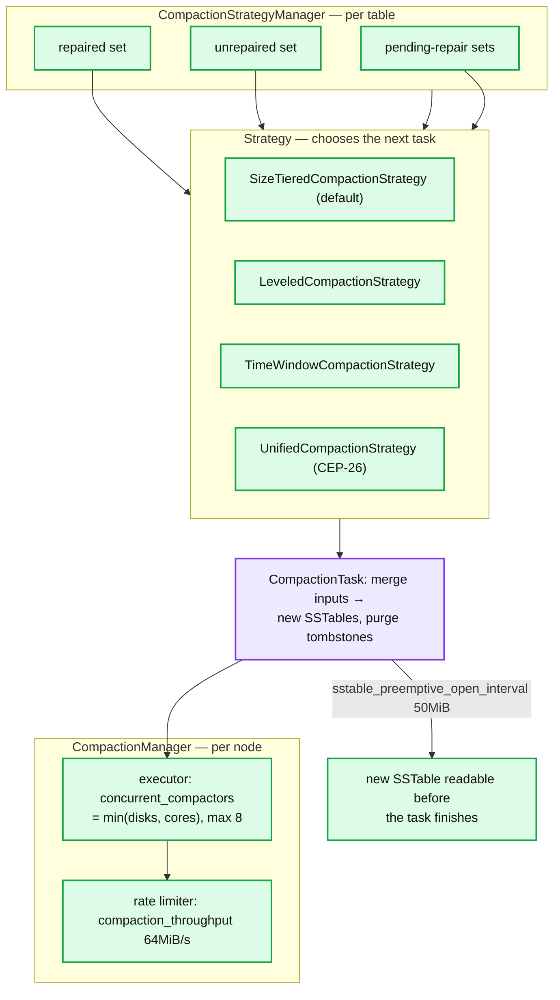
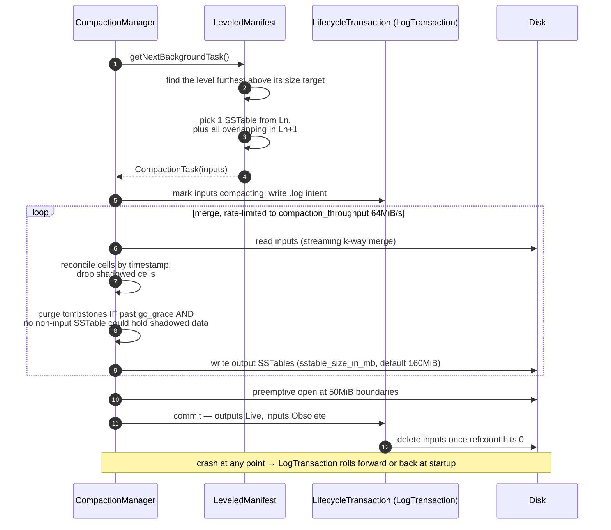
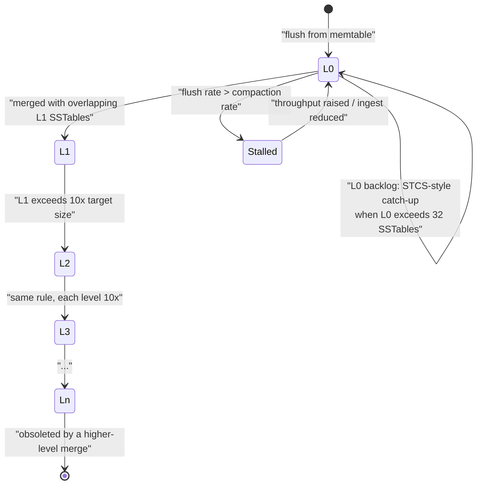

# Cassandra 04 — Compaction Strategies

**Baseline: Apache Cassandra 5.0** (`cassandra-5.0` branch). UCS defaults read from `db/compaction/unified/Controller.java` and `config/CassandraRelevantProperties.java`.

---

<!-- nav:start -->
[← 03 Read Path](cassandra-03-read-path.md) · **[Index](README.md)** · [05 Coordinator & Consistency →](cassandra-05-coordinator-consistency.md)
<!-- nav:end -->

<!-- toc:start -->

<b>Sections in this report (12)</b>

- [1. Overview](#1-overview)
- [2. Architecture](#2-architecture)
- [3. Data flow — how each strategy picks inputs](#3-data-flow--how-each-strategy-picks-inputs)
- [4. Sequence — an LCS compaction](#4-sequence--an-lcs-compaction)
- [5. State machine — SSTable through LCS levels](#5-state-machine--sstable-through-lcs-levels)
- [6. Component deep dives](#6-component-deep-dives)
- [7. Guarantees](#7-guarantees)
- [8. Failure modes](#8-failure-modes)
- [9. Scalability & performance](#9-scalability--performance)
- [10. Trade-offs & alternatives](#10-trade-offs--alternatives)
- [11. Staff-level questions](#11-staff-level-questions)
- [12. Sources](#12-sources)

<!-- toc:end -->

## 1. Overview

- **What it is.** The background process that merges SSTables, reconciles duplicate cells, and purges tombstones. It is the price of the write path and the determinant of the read path.
- **The three amplifications, and you can only pick two.** Write amplification (bytes rewritten per byte ingested), read amplification (SSTables touched per read), space amplification (disk used per byte of live data). STCS minimises write, LCS minimises read and space, TWCS minimises all three for a specific shape of data. UCS makes the choice a continuous parameter instead of a class name.
- **5.0's contribution: Unified Compaction Strategy (CEP-26)** — a single density-based strategy with a scaling parameter that spans tiered and levelled behaviour, plus sharding so SSTable size stays bounded as node density grows. **It is not the default.**
- **Verified default:** `default_compaction` is unset in `cassandra.yaml`, and the comment states *"If no value is specified, the default is to use SizeTieredCompactionStrategy"* with `min_threshold: 4`, `max_threshold: 32`.

---

## 2. Architecture

**What to notice**

- **Repaired and unrepaired SSTables are compacted separately and never merged together.** Incremental repair ([report 07](cassandra-07-repair-streaming.md)) marks `repairedAt` in `Statistics.db`; mixing the sets would lose the ability to say "this data is known-consistent". The consequence is that incremental repair permanently doubles the number of compaction pools for a table.
- **`concurrent_compactors` defaults to `min(number of disks, number of cores)`, capped at 8**, and `compaction_throughput: 64MiB/s` is a cluster-wide-per-node ceiling on merge IO. Under-provisioning it is the most common cause of a compaction backlog; over-provisioning it starves reads.
- **`sstable_preemptive_open_interval: 50MiB`** makes partially written output SSTables readable during a long compaction, so page cache is warmed progressively rather than cliff-edging at the swap.
- **Strategy is a per-table property, not a cluster setting.** Mixing STCS, LCS and TWCS across tables in one cluster is normal and correct.

---

## 3. Data flow — how each strategy picks inputs

```mermaid
flowchart TB
  subgraph s1["STCS — group by size"]
    A1["bucket SSTables into size tiers<br/>(within bucket_low 0.5 / bucket_high 1.5)"]
    A2["when a bucket has >= min_threshold (4),<br/>compact up to max_threshold (32)"]
    A1 --> A2
  end
  subgraph s2["LCS — non-overlapping levels"]
    B1["L0: newly flushed, overlapping"]
    B2["L1..Ln: non-overlapping, each 10x prior"]
    B3["pick 1 SSTable from Ln + overlapping from Ln+1"]
    B1 --> B2 --> B3
  end
  subgraph s3["TWCS — group by time window"]
    C1["STCS within the current window"]
    C2["at window close: one major compaction<br/>into a single SSTable per window"]
    C3["older windows never recompacted"]
    C1 --> C2 --> C3
  end
  subgraph s4["UCS — density levels + shards"]
    D1["level = f(density, scaling_parameters T4)"]
    D2["shard by token range: base_shard_count 4,<br/>growing with sstable_growth 0.333"]
    D3["compact within (level, shard)"]
    D1 --> D2 --> D3
  end

  class A2,B1,B2,C1,C3,D1,D3 service
  class A1,B3,C2,D2 store

  classDef client   fill:#dbeafe,stroke:#2563eb,stroke-width:2px,color:#111
  classDef service  fill:#dcfce7,stroke:#16a34a,stroke-width:2px,color:#111
  classDef store    fill:#ede9fe,stroke:#7c3aed,stroke-width:2px,color:#111
  classDef cache    fill:#fef3c7,stroke:#d97706,stroke-width:2px,color:#111
  classDef queue    fill:#cffafe,stroke:#0891b2,stroke-width:2px,color:#111
  classDef critical fill:#fee2e2,stroke:#dc2626,stroke-width:4px,color:#111
  classDef external fill:#e5e7eb,stroke:#6b7280,stroke-width:2px,color:#111,stroke-dasharray:4 3
  classDef decision fill:#fce7f3,stroke:#db2777,stroke-width:2px,color:#111
```

**What to notice**

- **STCS's flaw is that similar *size* does not mean similar *key range*.** Two 100 GB SSTables covering the whole token range get merged repeatedly, and a row overwritten across many tiers never converges. This is the mechanism behind chronic high SSTables-per-read.
- **LCS's guarantee is that within a level, SSTables do not overlap**, so a point read touches at most one SSTable per level plus all of L0 — typically ≤ 10 total. It pays with ~10× write amplification, which makes it unsuitable for write-heavy tables.
- **TWCS's power is that it never recompacts closed windows**, so a whole expired window drops as a file deletion rather than a merge. It is only correct if data arrives roughly in timestamp order and is deleted only by TTL. Out-of-order writes or explicit deletes break the model silently.
- **UCS unifies the axes**: `scaling_parameters` `T<n>` is tiered with fan factor n, `L<n>` is levelled, `N` is the neutral point, and integers interpolate. Sharding by token range keeps individual SSTables bounded regardless of node density — the property LCS and STCS both lack.

---

## 4. Sequence — an LCS compaction

**What to notice**

- **The tombstone-purge condition is the subtle part and it is the same in every strategy.** Past `gc_grace_seconds` is necessary but not sufficient: no SSTable *outside the compaction inputs* may be able to hold data the tombstone shadows, judged by min/max timestamp overlap. This is why tombstones accumulate under STCS with large untouched old SSTables.
- **The merge is streaming.** Memory is O(inputs), not O(data), which is why compacting a 500 GB table does not need 500 GB of RAM — but it does need the disk headroom.
- **`LogTransaction` is what makes compaction crash-safe.** It is the same mechanism as [report 01](cassandra-01-storage-engine.md)'s SSTable lifecycle, and it is why you must never hand-delete `*.log` files from a data directory.
- **Rate limiting applies to reads and writes of the compaction, not to the merge CPU.** A CPU-bound compaction (heavy compression, many tombstones) can saturate cores while sitting well under the IO throttle.

---

## 5. State machine — SSTable through LCS levels

**What to notice**

- **L0 is the pressure gauge.** In steady state L0 holds a handful of SSTables. A growing L0 means the write rate exceeds what LCS can absorb, and reads degrade because all of L0 must be consulted on every read (L0 SSTables overlap).
- **The `Stalled` state is where LCS clusters die.** Cassandra falls back to STCS-like compaction in L0 to catch up, which temporarily makes read amplification worse — the failure mode compounds itself.
- **Each level is 10× the previous** (`fanout_size`, default 10), so 7 levels covers ~1 TB per table. The number of levels bounds worst-case read amplification.
- **`sstable_size_in_mb` default 160MiB** determines file count per level; larger files mean fewer files but coarser compaction units.

---

## 6. Component deep dives

### 6.1 SizeTieredCompactionStrategy (default)

- **Options.** `min_threshold: 4`, `max_threshold: 32`, `bucket_low: 0.5`, `bucket_high: 1.5`, `min_sstable_size: 50MB`.
- **Amplification.** Write ~ low. Read ~ high and unbounded in the pathological case. **Space ~ up to 2× at the moment of a major compaction of the largest tier** — which is why the classic guidance is to keep disks below 50% full under STCS.
- **When it is right.** Write-heavy, insert-mostly, rarely-updated data where reads are by recent partition. The default because it is the safest under unknown load, not because it is the best.
- **Known failure.** Very large old SSTables that never meet the size-tier criteria again, holding tombstones hostage and inflating SSTables-per-read forever. `nodetool compact` (major compaction) fixes it once and creates one enormous SSTable that will never compact again — a cure that becomes the disease.

### 6.2 LeveledCompactionStrategy

- **Options.** `sstable_size_in_mb: 160`, `fanout_size: 10`.
- **Amplification.** Write ~10×. Read ~ bounded by level count (typically ≤ 10 SSTables). Space ~ ~1.1×, the best of the strategies.
- **When it is right.** Read-heavy tables with updates to existing rows, where a bounded read cost matters more than IO. Also the right choice when disk headroom is tight.
- **`bloom_filter_fp_chance` defaults to 0.1 for LCS** rather than 0.01, precisely because levelling already bounds the number of SSTables consulted.

### 6.3 TimeWindowCompactionStrategy

- **Options.** `compaction_window_unit` (MINUTES/HOURS/DAYS), `compaction_window_size`, `unsafe_aggressive_sstable_expiration` (default false).
- **Model.** Data is bucketed by *write timestamp* into windows. The current window uses STCS; on close, the window is compacted once into a single SSTable and never touched again.
- **When it is right.** Append-only time series with a table-level TTL and no explicit deletes. The payoff is that an expired window is deleted as a whole file — near-zero-cost expiry.
- **How it breaks.** Out-of-order writes (backfill, clock skew, hint replay, repair streaming) land in old windows and force recompaction. Explicit `DELETE`s create tombstones in one window shadowing data in another, so neither can be dropped. Both failures are silent and show up as disk not shrinking.
- **Rule of thumb.** Target 20–30 windows over the TTL — window size ≈ TTL/25 **[doc/community, not source-verified]**.

### 6.4 UnifiedCompactionStrategy (CEP-26)

**Source-verified defaults**, from `CassandraRelevantProperties.java`:

| Option | Default | Meaning |
|---|---|---|
| `unified_compaction.scaling_parameters` | **`T4`** | Tiered with fan factor 4. `L<n>` = levelled, `N` = neutral, integers interpolate; a comma list gives per-level values |
| `unified_compaction.min_sstable_size` | **`100MiB`** | Sharded writers only split SSTables at least this large |
| `unified_compaction.target_sstable_size` | **`1GiB`** | Desired output SSTable size (minimum enforced: 1 MiB) |
| `unified_compaction.base_shard_count` | **`4`** | Token-range shards at the lowest density level |
| `unified_compaction.sstable_growth` | **`0.333`** | How SSTable size grows with density: 0 = fixed size / max shards, 1 = never split beyond base shard count |
| `unified_compaction.survival_factor` | **`1`** | Expected data survival ratio across levels (fixed at 1 for now) |
| `expired_sstable_check_frequency_seconds` | **`600`** | How often fully expired SSTables are checked for drop |
| `allow_unsafe_aggressive_sstable_expiration` | **`false`** | Drop expired SSTables without the overlap check |
| `MAX_LEVELS` | **32** | Enough for petabytes at the default fan factor |

- **The two ideas.** (1) *Density levels* instead of size tiers: a level is defined by data density (bytes per token range), so key-range overlap is bounded, fixing STCS's core flaw. (2) *Sharding*: outputs are split by token range, so SSTable size stays near `target_sstable_size` no matter how much data the node holds.
- **`sstable_growth: 0.333` is documented in source with a worked example**: 1 TiB top level, 1 GiB target, base shard count 1 — growth 0 → 1024 SSTables of ~1 GiB; **0.333 → 128 SSTables of ~8 GiB**; 0.5 → 32 of ~32 GiB; 1 → a single 1 TiB SSTable. With `base_shard_count: 4` the same case gives 128 SSTables at ~8 GiB for the default 0.333.
- **Why it matters for density.** Bounded SSTable size plus a non-heap-resident index (BTI) is the pair that makes 10 TB+ nodes plausible. Either alone is insufficient.
- **Adoption caveat.** UCS is opt-in in Apache 5.0. **DataStax Astra Serverless ships UCS as the default**, so behaviour differs from Apache out of the box — see [report 11](cassandra-11-delta-and-version-matrix.md).

---

## 7. Guarantees

| Guarantee | Mechanism | Limit |
|---|---|---|
| Compaction never loses data | Streaming merge; outputs committed before inputs deleted; `LogTransaction` | Requires disk headroom for both sets simultaneously |
| Tombstones eventually purged | Past gc_grace + no overlapping non-input SSTable | Under STCS may never happen without a major compaction |
| Bounded read amplification | LCS level invariant / UCS density levels | LCS loses it when L0 backs up; STCS never had it |
| Repaired data stays segregated | Separate strategy instances per repaired state | Doubles compaction pools per table |

---

## 8. Failure modes

| Failure | Detection | Recovery | Blast radius |
|---|---|---|---|
| Compaction backlog | `nodetool compactionstats` pending tasks climbing; SSTables-per-read rising | Raise `compaction_throughput` / `concurrent_compactors`; reduce ingest; add nodes | Read latency degrades, then disk fills |
| Disk full mid-compaction | `disk_failure_policy` triggers | Free space; compaction resumes; `LogTransaction` cleans partial output | Node out of rotation |
| One giant SSTable after `nodetool compact` | Huge single file that never recompacts; tombstones stuck | UCS/LCS migration, or `sstablesplit` offline | Permanent tombstone accumulation on that table |
| TWCS windows recompacting | Disk not shrinking; compaction on old windows | Find the out-of-order source (backfill, repair streaming, clock skew); check for explicit deletes | Loses TWCS's entire benefit |
| LCS L0 pileup | L0 SSTable count in `tablestats` | Reduce write rate or move to STCS/UCS for that table | Read amplification spike |
| Incremental repair set fragmentation | Many small SSTables in the pending-repair pool | Full repair to consolidate | Compaction efficiency loss |

---

## 9. Scalability & performance

- **Compaction is the node's second workload and must be budgeted as such.** It competes for IO, page cache and CPU with the query path. `compaction_throughput: 64MiB/s` is a starting point, not a universal value — measure against ingest rate.
- **Space headroom is a strategy-dependent capacity input**: STCS wants ≤50% utilisation, LCS tolerates ~80%, UCS sits between and is tunable via `target_sstable_size` **[inferred from the sharding design]**.
- **Compaction is the density limiter that BTI alone does not solve.** Without sharded outputs, a 10 TB node produces multi-TB SSTables whose compactions take days and whose failure costs a day of redo.
- **Per-table strategy choice is the main lever.** A cluster where every table uses the default STCS is almost always leaving significant latency on the table.

---

## 10. Trade-offs & alternatives

- **vs. RocksDB's levelled default.** RocksDB picks levelling globally with universal compaction as the alternative. Cassandra exposes it per table, which is more correct and more work.
- **vs. ScyllaDB's ICS (Incremental Compaction Strategy).** ICS solves STCS's space amplification by splitting runs into fragments — a related idea to UCS's sharding, arrived at independently **[inferred]**.
- **Why not just always use LCS?** 10× write amplification means the disk does ten times the work per ingested byte. On write-heavy tables this converts a compaction problem into an IO ceiling.
- **Why UCS is the right long-term default.** It removes a discrete, irreversible, per-table decision made under uncertainty and replaces it with a continuous parameter that can be changed later. The strategic argument is about operability, not benchmarks.

---

## 11. Staff-level questions

1. **A table on STCS has 4 TB of data in three SSTables, one of which is 3 TB and two years old. Tombstones are not being purged. What are the options and what does each cost?** Nothing will merge that 3 TB file under STCS because nothing else is within `bucket_low`/`bucket_high` of its size. Options: (a) `nodetool compact` — merges everything, needs 4 TB of free space, takes many hours, and leaves one 4 TB file with the same problem next year; (b) `nodetool garbagecollect` — purges tombstones without a full merge, cheaper, still a full rewrite; (c) migrate the table to UCS with `target_sstable_size: 1GiB`, which shards the giant file over time into bounded pieces and permanently removes the class of problem; (d) `sstablesplit` offline, which requires the node to be down. (c) is the correct answer in 5.0 and (a) is what most teams do.

2. **Explain `sstable_growth: 0.333` to a capacity planner in one paragraph.** As a node's data grows, UCS must decide whether to make more SSTables or bigger ones. `sstable_growth` is the split: 0 means keep SSTables at the target size and let the count grow linearly with data; 1 means keep the count fixed at `base_shard_count` and let files grow without bound. The default 0.333 makes file size grow as the cube root of density, so a 1 TiB level with a 1 GiB target yields ~128 files of ~8 GiB rather than 1024 files of 1 GiB or one 1 TiB file. It is a knob that trades file-handle and metadata overhead against per-compaction unit size and recovery granularity.

3. **Why does incremental repair make compaction worse, and when is that acceptable?** Repaired and unrepaired SSTables must never be merged, so each table gets at least two independent compaction pools, each with fewer SSTables to work with and therefore less efficient merging — plus a third transient pool per in-flight repair session. On a table with many small SSTables this fragments the working set badly. It is acceptable when the table is large and mostly static, so the repaired pool stops growing and the unrepaired pool stays small; it is a poor trade on a high-churn table, where full subrange repair is usually better.

4. **Your TWCS time-series table's disk usage is not dropping despite a 30-day TTL. Diagnose.** Something is putting data into closed windows or creating tombstones that span them. Check in order: explicit `DELETE` statements (they create tombstones whose window differs from the data's, so neither can be dropped); repair or hint replay streaming old data in after windows closed; client-supplied `USING TIMESTAMP` or clock skew placing writes in past windows; and read repair writing reconciled old cells. Confirm with `sstablemetadata` on the windows that should have expired — the min/max timestamps will show the contamination. `unchecked_tombstone_compaction` and `unsafe_aggressive_sstable_expiration` are the blunt instruments; fixing the write pattern is the real answer.

5. **You are designing defaults for a new managed Cassandra service. Do you ship UCS or STCS as the default, and defend it.** UCS, with `T4` scaling and `target_sstable_size: 1GiB` — which is exactly what DataStax did for Astra Serverless. The argument is not that UCS wins every benchmark; it is that STCS's failure mode (unbounded SSTable size, permanent tombstone retention, no recovery except a major compaction) is irreversible and invisible until it is expensive, while UCS's parameters can be retuned live. For a managed service where the customer will never choose a strategy, defaulting to the one whose bad outcomes are recoverable is the correct risk posture. The counter-argument — that Apache kept STCS as the default in 5.0 — is about conservatism in a general-purpose release with unknown upgrade paths, not about which is better.

---

## 12. Sources

- `src/java/org/apache/cassandra/db/compaction/` — `UnifiedCompactionStrategy.java`, `unified/Controller.java`, `LeveledCompactionStrategy.java`, `SizeTieredCompactionStrategy.java`, `TimeWindowCompactionStrategy.java` — [`apache/cassandra@cassandra-5.0`](https://github.com/apache/cassandra/tree/cassandra-5.0)
- `src/java/org/apache/cassandra/config/CassandraRelevantProperties.java` — all `unified_compaction.*` defaults
- `conf/cassandra.yaml` — `default_compaction`, `concurrent_compactors`, `compaction_throughput`, `sstable_preemptive_open_interval`
- [CEP-26: Unified Compaction Strategy](https://cwiki.apache.org/confluence/display/CASSANDRA/CEP-26%3A+Unified+Compaction+Strategy)
- [Cassandra docs — Compaction](https://cassandra.apache.org/doc/latest/cassandra/managing/operating/compaction/)

---

---

<!-- nav:start -->
[← 03 Read Path](cassandra-03-read-path.md) · **[Index](README.md)** · [05 Coordinator & Consistency →](cassandra-05-coordinator-consistency.md)
<!-- nav:end -->
