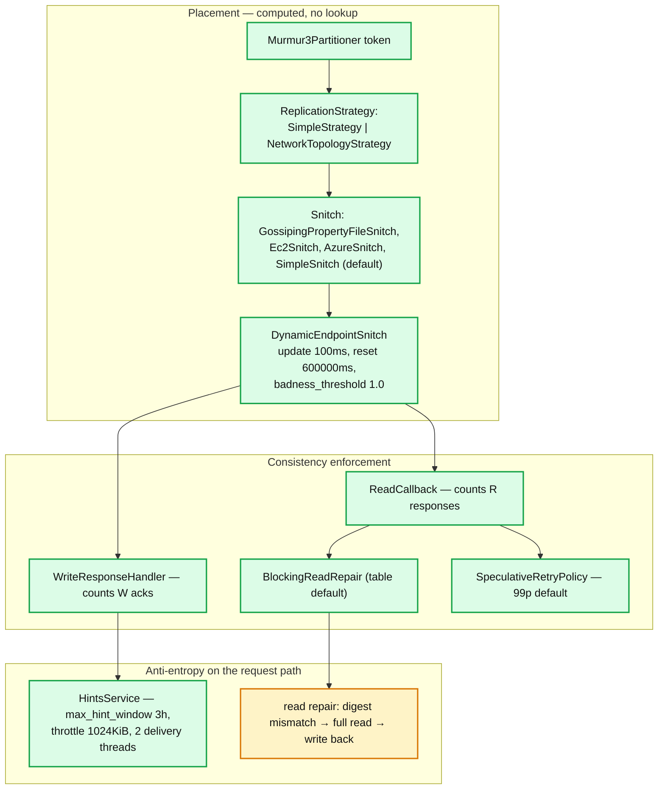
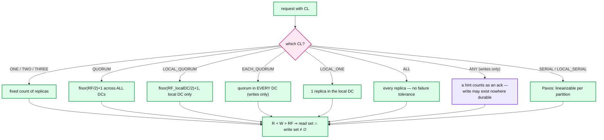
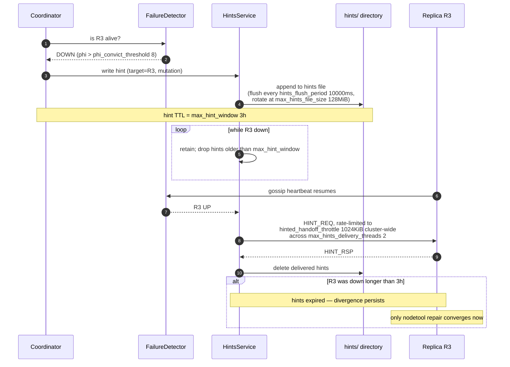

# Cassandra 05 — Coordinator, Replication and Tunable Consistency

**Baseline: Apache Cassandra 5.0** (`cassandra-5.0` branch). Defaults verified in `conf/cassandra.yaml`.

---

<!-- nav:start -->
[← 04 Compaction](cassandra-04-compaction.md) · **[Index](README.md)** · [06 Membership & Gossip →](cassandra-06-membership-gossip.md)
<!-- nav:end -->

<!-- toc:start -->

<b>Sections in this report (12)</b>

- [1. Overview](#1-overview)
- [2. Architecture](#2-architecture)
- [3. Data flow — consistency level semantics](#3-data-flow--consistency-level-semantics)
- [4. Sequence — hinted handoff lifecycle](#4-sequence--hinted-handoff-lifecycle)
- [5. State machine — read repair on a query](#5-state-machine--read-repair-on-a-query)
- [6. Component deep dives](#6-component-deep-dives)
- [7. Guarantees](#7-guarantees)
- [8. Failure modes](#8-failure-modes)
- [9. Scalability & performance](#9-scalability--performance)
- [10. Trade-offs & alternatives](#10-trade-offs--alternatives)
- [11. Staff-level questions](#11-staff-level-questions)
- [12. Sources](#12-sources)

<!-- toc:end -->

## 1. Overview

- **What it is.** The distributed-systems core: how a replica set is chosen, what a consistency level actually promises, and the three anti-entropy mechanisms that run on the request path (hinted handoff, read repair, speculative retry).
- **Design bet.** Consistency is a per-request parameter, not a cluster property, and the operator gets the algebra: **`R + W > RF` guarantees the read set intersects the write set.** Everything else is a corollary.
- **What it cannot do.** Enforce any invariant spanning more than one partition. LWT (Paxos) covers a single partition at ~4× cost; nothing in 5.0 covers more. That gap is Accord's reason to exist ([report 09](cassandra-09-tcm-accord.md)).
- **The uncomfortable truth.** `R + W > RF` gives correct reads, not durable convergence. Convergence needs hints to land inside `max_hint_window: 3h`, or repair to complete inside `gc_grace_seconds: 864000`. Consistency levels buy you the read; the anti-entropy machinery buys you the data.

---

## 2. Architecture

**What to notice**

- **`endpoint_snitch: SimpleSnitch` is the shipped default and is wrong for every real deployment.** It has no DC or rack awareness, so `NetworkTopologyStrategy` cannot place replicas across failure domains. `GossipingPropertyFileSnitch` (with `cassandra-rackdc.properties`) is the correct production choice; cloud snitches derive it from instance metadata.
- **The dynamic snitch sits *on top of* the topology snitch** and reorders by measured latency. `dynamic_snitch_badness_threshold: 1.0` means a replica must be 100% worse than the preferred one before the topology preference is overridden — deliberately sticky, to avoid oscillation.
- **Consistency levels are implemented as ack counters with deadlines**, nothing more. There is no quorum protocol, no view, no epoch. That simplicity is the whole point and the whole limitation.
- **Hints are coordinator-side liabilities**, read repair is a coordinator-side reconciliation, and both run on the request path. Only full repair ([report 07](cassandra-07-repair-streaming.md)) runs off it.

---

## 3. Data flow — consistency level semantics

**What to notice**

- **`QUORUM` on a multi-DC cluster is almost always a bug.** With two DCs at RF=3 each (RF total 6), `QUORUM` is 4 — which cannot be satisfied by one DC, so every request crosses the WAN. `LOCAL_QUORUM` is what people mean.
- **`ANY` is not a consistency level so much as a fire-and-forget.** A hint on the coordinator satisfies it, so the data may exist only in a hints file on one node — losable, and invisible to any read until replayed.
- **`EACH_QUORUM` for writes plus `LOCAL_QUORUM` for reads is the standard strongly-consistent multi-DC pattern**, and it makes write availability depend on every DC being up. Most teams should not want it.
- **`LOCAL_SERIAL` gives linearizability within one DC only.** Two DCs both running `LOCAL_SERIAL` LWTs on the same partition will silently violate linearizability globally. This is a real and under-appreciated footgun.

---

## 4. Sequence — hinted handoff lifecycle

**What to notice**

- **`hinted_handoff_throttle: 1024KiB` is the *cluster-wide* budget as seen by this coordinator**, divided among delivery threads. It is deliberately slow so that hint replay cannot take out a node that just came back — a returning node is the last thing you want to overwhelm.
- **`max_hint_window: 3h` is the hard boundary between "self-healing" and "operator problem".** Beyond it, only repair fixes the divergence, and if repair does not run inside `gc_grace_seconds`, you additionally risk resurrection.
- **Hints are stored per target node, not per token range**, so they cannot be handed to a replacement node. Replacing a dead node discards its hints.
- **A node that is UP but slow generates no hints at all** — it just times out. Hints protect against detected failure, not degradation.

---

## 5. State machine — read repair on a query

```mermaid
stateDiagram-v2
  [*] --> Dispatched: "1 data read + (R-1) digest reads"
  Dispatched --> Matched: "all digests equal"
  Dispatched --> Mismatch: "digest differs"
  Dispatched --> Speculating: "response slower than speculative_retry (99p)"
  Speculating --> Dispatched: "extra replica queried; first wins"
  Matched --> [*]: "rows returned"
  Mismatch --> FullRead: "re-request full data from CL replicas"
  FullRead --> Reconciled: "merge by cell timestamp"
  Reconciled --> RepairWrite: "read_repair: BLOCKING (default)"
  Reconciled --> Returned: "read_repair: NONE"
  RepairWrite --> Returned: "repair mutations acked"
  Returned --> [*]
  RepairWrite --> Timeout: "repair write exceeds write_request_timeout"
  Timeout --> [*]: "ReadTimeoutException to the client"
```

**What to notice**

- **`BLOCKING` read repair can turn a read timeout into a *write* timeout wearing a read exception.** The client waits for the repair mutation to be acked. This is why an inconsistent cluster shows read latency spikes that look unrelated to read load.
- **Read repair only fixes what was read.** It is opportunistic and covers hot data only; cold data diverges indefinitely. This is precisely why scheduled repair is not optional.
- **In 4.0+ the old probabilistic `read_repair_chance` / `dclocal_read_repair_chance` table options were removed.** Repair now happens only on digest mismatch at the requested CL. Anyone quoting those options is working from ≤3.11 knowledge.
- **Speculative retry costs load to buy tail latency.** `99p` is the default; `ALWAYS` doubles read traffic; a `Xp`/`Yms` hybrid form exists for finer control.

---

## 6. Component deep dives

### 6.1 Replication strategies

- **`SimpleStrategy`** — walk the ring clockwise, take the next RF distinct nodes. No DC or rack awareness. Acceptable only for single-DC test clusters; changing away from it later requires a full repair.
- **`NetworkTopologyStrategy`** — RF specified per DC (`{'dc1': 3, 'dc2': 3}`). Within a DC, the walk skips nodes whose rack is already represented, so RF=3 across 3 racks yields one replica per rack. **This is what makes `LOCAL_QUORUM` survive a rack/AZ failure**, and it silently fails to hold if racks are unevenly sized.
- **Transient replication** (`transient_replication_enabled: false`, experimental) designates some replicas as storing data only until repair, cutting storage at the cost of complexity. Not production-recommended in 5.0.

### 6.2 Snitches

| Snitch | Source of topology | Use |
|---|---|---|
| `SimpleSnitch` | none — single DC/rack | **The shipped default.** Test only |
| `GossipingPropertyFileSnitch` | `cassandra-rackdc.properties`, gossiped | The correct general-purpose choice |
| `Ec2Snitch` / `Ec2MultiRegionSnitch` | EC2 metadata: region → DC, AZ → rack | AWS |
| `AzureSnitch` | Azure IMDS (**new in 5.0**) | Azure |
| `GoogleCloudSnitch` | GCE metadata | GCP |

- Changing a snitch on a live cluster changes replica placement and therefore *which node owns which data*. It is a full-repair-and-careful-sequencing operation, not a config edit.

### 6.3 LWT / Paxos

- Four phases (prepare, read, propose, commit) at `SERIAL` or `LOCAL_SERIAL`; `cas_contention_timeout: 1000ms`.
- **Paxos state lives in `system.paxos`**, and 4.1 introduced Paxos v2 with significant latency improvements (`paxos_variant` config). 5.0 carries v2.
- **Mixing LWT and non-LWT writes on the same partition breaks linearizability** — a plain `UPDATE` bypasses the Paxos ballot entirely and can overwrite a committed CAS result. This is a documented constraint that is violated constantly in practice.
- Reads of LWT-written data must use `SERIAL`/`LOCAL_SERIAL` to be linearizable; a `QUORUM` read may observe an in-flight, uncommitted proposal state.

### 6.4 Timeouts and their interaction

| Setting | Default | Governs |
|---|---|---|
| `read_request_timeout` | `5000ms` | Single-partition read |
| `range_request_timeout` | `10000ms` | Range/scan read |
| `write_request_timeout` | `2000ms` | Mutation |
| `counter_write_request_timeout` | `5000ms` | Counter (read-modify-write) |
| `cas_contention_timeout` | `1000ms` | Total time retrying contended Paxos ballots |
| `truncate_request_timeout` | `60000ms` | TRUNCATE (takes snapshots by default) |
| `request_timeout` | `10000ms` | Overall ceiling |

- **Client-side driver timeouts must exceed server-side ones**, or the client gives up while the server is still working and retries pile on. This mis-tuning is a standard cause of self-inflicted overload.

---

## 7. Guarantees

| Guarantee | Mechanism | Limit |
|---|---|---|
| Read sees latest write | `R + W > RF` quorum intersection | Needs the write to have reached W *durable* replicas, not W hints |
| Monotonic reads | Blocking read repair writes back before returning | Lost with `read_repair: NONE` |
| Linearizability, single partition | Paxos at `SERIAL` | Broken by any non-LWT write to the same partition; `LOCAL_SERIAL` is per-DC only |
| Rack/AZ failure survival at `LOCAL_QUORUM` | `NetworkTopologyStrategy` rack-aware placement | Requires balanced racks and a topology-aware snitch |
| Eventual convergence | Hints (3h) → read repair (hot data) → full repair (all data, inside gc_grace) | If none completes in time: permanent divergence or data resurrection |

---

## 8. Failure modes

| Failure | Detection | Recovery | Blast radius |
|---|---|---|---|
| Node down > `max_hint_window` | Hint expiry metrics | Full repair before `gc_grace_seconds` elapses | Silent divergence; resurrection risk if repair is late |
| `QUORUM` used on multi-DC | WAN latency on every request | Switch to `LOCAL_QUORUM` | Cluster-wide latency, availability tied to remote DC |
| LWT contention | `CasWriteTimeout`, Paxos contention metrics | Shard the key; remove LWT | Can consume the cluster's request budget |
| Mixed LWT/non-LWT writes | **None — silent** | Enforce LWT-only access to those partitions in code | Silent lost updates |
| Slow replica in the read set | Speculative retry rate, dynamic snitch scores | Snitch demotes; operator ejects | Tail latency |
| Rack imbalance under NTS | Uneven ownership in `nodetool status` | Rebalance racks; repair | AZ failure takes >1 replica; `LOCAL_QUORUM` becomes unavailable |

---

## 9. Scalability & performance

- **`LOCAL_QUORUM` on RF=3 is the sweet spot**: tolerates one replica failure, needs the 2nd-fastest of 3, and stays inside a region.
- **Availability maths.** RF=3 `LOCAL_QUORUM` survives 1 node per replica set; RF=5 survives 2 at ~1.7× storage and slightly worse latency. Beyond RF=5 the marginal availability gain is small relative to cost.
- **The dynamic snitch is a latency stabiliser and an occasional oscillator.** `dynamic_snitch: false` is a legitimate tuning on very homogeneous clusters where its reordering causes more cache-locality loss than it saves.
- **Multi-DC writes are async by default at `LOCAL_QUORUM`** — the coordinator forwards to one node per remote DC, which fans out locally. One WAN message per DC, not per replica. This is the detail that makes multi-DC affordable.

---

## 10. Trade-offs & alternatives

- **vs. Spanner / CockroachDB.** They provide external consistency via a global ordering (TrueTime / HLC + Raft), paying coordination on every write. Cassandra pays nothing and provides no ordering. There is no middle setting — the choice is architectural.
- **vs. DynamoDB.** Same ancestry, but Dynamo offers server-side conditional writes and transactions and hides the dials. Cassandra exposes more and guarantees less.
- **vs. Kubernetes/etcd (this project's baseline).** etcd is a single Raft group with strict serialisability and a 5,000-node ceiling; Cassandra is thousands of independent replica sets with no global ordering and no ceiling. The two sit at opposite ends of the coordination axis, and both are correct for their workload.
- **Why not make `LOCAL_QUORUM` the default CL?** Because CL is a *client* parameter and the server has no basis to choose. Drivers default to `LOCAL_ONE`, which is fast and frequently wrong — a defaults choice worth arguing about.

---

## 11. Staff-level questions

1. **RF=3, `QUORUM` reads and writes. A node is down for 4 hours, comes back, and you have not repaired. What can a client observe?** Writes during the outage went to 2 replicas and satisfied `QUORUM`; hints were written but expired at 3h. When the node returns it serves stale data. A `QUORUM` read still contacts 2 of 3, so it will include at least one up-to-date replica and return correct data — and blocking read repair will fix that partition. So the *correctness* of `QUORUM` reads holds. What breaks: `ONE`/`LOCAL_ONE` reads can hit the stale replica and go backwards; cold data stays diverged; and if another replica fails before repair runs, the surviving quorum may be two stale replicas. The 4-hour outage did not break consistency — it created a debt that must be paid before the next failure.

2. **Why is `LOCAL_SERIAL` in two DCs simultaneously unsafe, and what would you do instead?** `LOCAL_SERIAL` runs Paxos among the local DC's replicas only. Two DCs each achieve local linearizability over disjoint replica sets on the same partition, so both can commit conflicting CAS operations — the classic split-brain. Options: use `SERIAL` (global Paxos, WAN latency on every CAS), route all LWT traffic for a given partition to one DC at the application layer, or accept that the invariant cannot be enforced and design around it. In 6.0, Accord makes this a first-class multi-region transaction — which is the real answer.

3. **Your p99 read latency is 400ms but p50 is 3ms and no node looks unhealthy. Where do you look?** In order: (a) digest mismatches driving blocking read repair — check read-repair metrics; an inconsistent cluster spikes exactly like this; (b) speculative retry rate, which tells you whether one replica is intermittently slow (GC or compaction) even though it is never down; (c) tombstones — a query hitting a graveyard partition is slow only for those keys; (d) large partitions; (e) `LOCAL_QUORUM` vs `QUORUM` misconfiguration on a subset of clients crossing the WAN. The distinguishing feature of the read-repair case is that latency correlates with *write* activity to the same partitions, not read load.

4. **Justify RF=3 vs RF=5 for a system with a 99.99% availability target across 3 AZs.** RF=3 with one replica per AZ and `LOCAL_QUORUM` survives a full AZ loss, which is the dominant correlated failure — that is usually sufficient for 99.99%. RF=5 across 3 AZs means two AZs hold two replicas each, so an AZ loss costs 2 of 5 and `LOCAL_QUORUM` (3) still works, tolerating one *additional* node failure. The real question is whether your failure model has correlated AZ loss plus an independent node failure inside the repair window. If yes, RF=5 buys real availability; if no, it buys 1.67× storage and slightly worse tail latency. Argue it from the recovery-window arithmetic, not from a rule of thumb.

5. **Design an approach that gives strong consistency for account balances on Cassandra 5.0, and say when you would refuse.** Per-partition LWT with the account ID as the partition key, all access through a single code path that never issues plain writes to those partitions, `SERIAL` reads, and `LOCAL_SERIAL` only if all writers for an account are pinned to one DC. This works and is used in production, but it costs ~4 round trips per operation, degrades under contention on hot accounts, and gives no atomicity for transfers between two accounts — which is the operation that actually matters. If the requirement includes multi-account transfers, refuse: either wait for Accord (6.0), put the ledger in a system with multi-key transactions and use Cassandra for the derived read model, or accept a saga with compensating entries and make the reconciliation process a first-class product feature.

---

## 12. Sources

- `src/java/org/apache/cassandra/db/ConsistencyLevel.java`, `service/StorageProxy.java` — [`apache/cassandra@cassandra-5.0`](https://github.com/apache/cassandra/tree/cassandra-5.0)
- `src/java/org/apache/cassandra/service/reads/repair/` — `BlockingReadRepair.java`, `ReadRepairStrategy.java`
- `src/java/org/apache/cassandra/service/reads/SpeculativeRetryPolicy.java`
- `src/java/org/apache/cassandra/hints/HintsService.java`
- `src/java/org/apache/cassandra/locator/` — `NetworkTopologyStrategy.java`, `DynamicEndpointSnitch.java`
- `conf/cassandra.yaml` — hints, snitch, timeouts, dynamic snitch
- DeCandia et al. — *Dynamo*, SOSP 2007

---

---

<!-- nav:start -->
[← 04 Compaction](cassandra-04-compaction.md) · **[Index](README.md)** · [06 Membership & Gossip →](cassandra-06-membership-gossip.md)
<!-- nav:end -->
