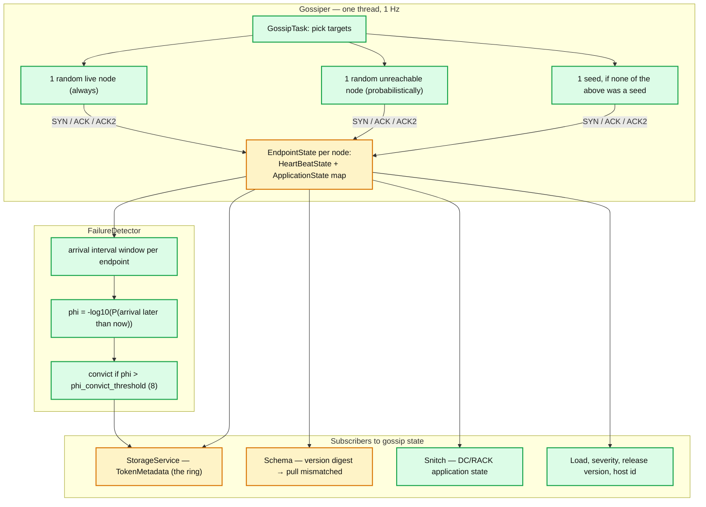
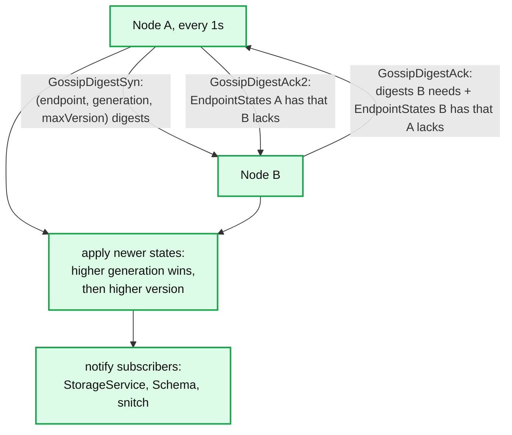
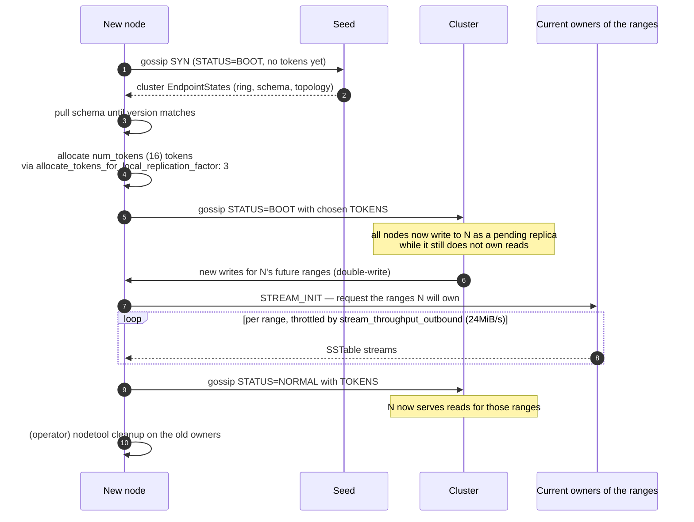
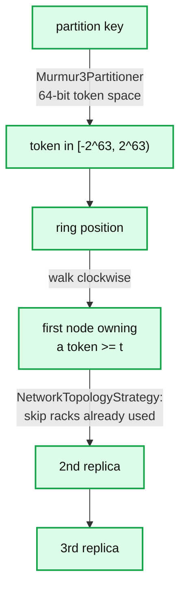

# Cassandra 06 — Cluster Membership: Gossip, Failure Detection, Token Ring

**Baseline: Apache Cassandra 5.0** (`cassandra-5.0` branch). Defaults verified in `conf/cassandra.yaml`.

> **This is the subsystem CEP-21 replaces.** Everything here is correct for 5.0 and is the *reason* Transactional Cluster Metadata exists. Read [report 09](cassandra-09-tcm-accord.md) alongside this one.

---

<!-- nav:start -->
[← 05 Coordinator & Consistency](cassandra-05-coordinator-consistency.md) · **[Index](README.md)** · [07 Repair & Streaming →](cassandra-07-repair-streaming.md)
<!-- nav:end -->

<!-- toc:start -->

<b>Sections in this report (12)</b>

- [1. Overview](#1-overview)
- [2. Architecture](#2-architecture)
- [3. Data flow — the gossip round](#3-data-flow--the-gossip-round)
- [4. Sequence — bootstrapping a new node](#4-sequence--bootstrapping-a-new-node)
- [5. State machine — the φ-accrual failure detector](#5-state-machine--the-φ-accrual-failure-detector)
- [6. Component deep dives](#6-component-deep-dives)
- [7. Guarantees](#7-guarantees)
- [8. Failure modes](#8-failure-modes)
- [9. Scalability & performance](#9-scalability--performance)
- [10. Trade-offs & alternatives](#10-trade-offs--alternatives)
- [11. Staff-level questions](#11-staff-level-questions)
- [12. Sources](#12-sources)

<!-- toc:end -->

## 1. Overview

- **What it is.** How nodes discover each other, agree (eventually) on who is up, who owns which tokens, and what the schema is — with no coordinator, no consensus and no leader.
- **Design bet.** An epidemic protocol converges in O(log N) rounds with constant per-node cost, so membership scales to thousands of nodes with no central component. The price is that cluster state is **eventually consistent**, including things that arguably need to be linearizable.
- **The correctness hole.** Ring ownership and schema are propagated by gossip. Two concurrent topology changes, or a partition during one, can leave nodes with genuinely divergent views of who owns what — and nothing detects or reconciles it. The operational rule "never run two topology changes at once" is a workaround for a missing guarantee, not a best practice.
- **Failure detection is per-node opinion.** Each node runs a φ-accrual detector over its own gossip arrival history. Two nodes can permanently disagree about a third's liveness.

---

## 2. Architecture

**What to notice**

- **Seeds are bootstrap hints, not authorities.** A seed is simply a node that gossip always includes as a target with some probability, which keeps the epidemic from partitioning into disjoint clusters. Seeds hold no special state and are not a quorum. **A node listed as its own seed will not bootstrap** — it skips the join process — which is the classic cause of a node coming up owning no data.
- **`ApplicationState` is a versioned key-value map per endpoint.** `STATUS`/`STATUS_WITH_PORT`, `TOKENS`, `SCHEMA`, `DC`, `RACK`, `RELEASE_VERSION`, `LOAD`, `HOST_ID`, `NET_VERSION`, `SEVERITY`. Each entry carries a version number so the three-way handshake can exchange only deltas.
- **Schema agreement is a digest comparison, not a protocol.** Nodes gossip a schema version UUID; a mismatch triggers a pull. There is no ordering, so concurrent DDL from two coordinators produces two schema versions that must be reconciled by timestamp — the mechanism behind schema disagreement incidents.
- **Everything downstream of gossip inherits its consistency model.** Ring, schema, topology and liveness are all eventually consistent, and the data path depends on all four.

---

## 3. Data flow — the gossip round

**What to notice**

- **Three messages per round, deltas only.** Bandwidth is O(changes), not O(cluster size), which is why gossip scales to thousands of nodes.
- **`generation` is a restart counter; `version` is a monotonic per-node change counter.** Higher generation always wins, which is how a restarted node's state supersedes its pre-restart state. A node whose clock goes backwards can produce a *lower* generation and be ignored by the cluster — a genuine and confusing failure mode.
- **Convergence is probabilistic, typically a few seconds for a small cluster and tens of seconds for a large one [inferred from the 1 Hz round and O(log N) fan-out].** During that window, different nodes act on different ring views.
- **There is no acknowledgement that the cluster has converged.** `nodetool describecluster` showing a single schema version is the closest thing, and it is a snapshot, not a guarantee.

---

## 4. Sequence — bootstrapping a new node

**What to notice**

- **The double-write window is what makes bootstrap safe without downtime.** From `STATUS=BOOT` onward the joining node receives writes for ranges it does not yet serve, so by the time streaming finishes it is not missing anything written during it.
- **`allocate_tokens_for_local_replication_factor: 3` is the 5.0 default and matters a lot.** The token-allocation algorithm chooses tokens that minimise ownership imbalance for that RF, rather than picking randomly. With `num_tokens: 16` (down from 256 pre-4.0), random allocation would give poor balance; the allocator is what makes 16 vnodes viable.
- **`nodetool cleanup` is not automatic.** Old owners keep data for ranges they no longer own until cleanup runs — it is not incorrect (reads route elsewhere) but it wastes disk and inflates repair.
- **Only one node may bootstrap at a time** (unless `consistent_range_movement=false`, which is unsafe). This serialisation is precisely the gossip-consistency limitation, and is what CEP-21 removes.

---

## 5. State machine — the φ-accrual failure detector

```mermaid
stateDiagram-v2
  [*] --> Sampling: "record gossip arrival intervals<br/>in a bounded window"
  Sampling --> Suspicion: "compute phi = -log10 P(next arrival > elapsed)"
  Suspicion --> Sampling: "gossip arrives — phi resets"
  Suspicion --> Convicted: "phi > phi_convict_threshold (8)"
  Convicted --> Alive: "gossip resumes; hints replay"
  Alive --> Sampling
  Convicted --> Removed: "nodetool removenode / assassinate"
  Removed --> [*]
```

**What to notice**

- **φ is a suspicion level on a log scale, not a timeout.** φ=8 means the probability of a heartbeat being this late by chance is ~10⁻⁸ *given the observed distribution*. The detector adapts: a node on a consistently jittery link is judged against its own history, not a fixed deadline.
- **`phi_convict_threshold: 8`** is the commented default. Raise it (9–12) on noisy cloud networks to stop flapping; lower it for faster detection at the cost of false convictions. Each false conviction costs a hint-writing episode and a read-path reroute.
- **Conviction is local and unilateral.** There is no agreement round. A network partition produces two groups each convicting the other, both continuing to serve — which is *fine* for the data path (it is designed for it) and *not* fine for topology changes.
- **The detector only sees gossip, not query latency.** A node that gossips promptly but serves queries slowly is never convicted. That is the dynamic snitch's job ([report 05](cassandra-05-coordinator-consistency.md)), and the split of responsibility is deliberate.

---

## 6. Component deep dives

### 6.1 Token ring and vnodes

- **`partitioner: org.apache.cassandra.dht.Murmur3Partitioner`** — fixed at cluster creation and immutable thereafter.
- **`num_tokens: 16`** in 5.0 (was 256 in ≤3.11, changed in 4.0). Fewer vnodes means better repair and streaming granularity and less overhead per range operation; 16 stays balanced only because of the token allocator.
- **Vnodes solved the "adding a node only splits one neighbour's range" problem** by giving each node many small ranges, so a new node streams from many peers in parallel. They created the "repair now has num_tokens × RF ranges to Merkle-tree" problem, which is why 256 was too many.
- **`allocate_tokens_for_local_replication_factor: 3`** (uncommented default) runs the balance-optimising allocator. `allocate_tokens_for_keyspace` is the alternative form.

### 6.2 Schema propagation

- Each node computes a schema version UUID from the contents of `system_schema.*`. Gossip carries the digest; a mismatch triggers a pull of the differing tables.
- **DDL is not serialised.** Two `ALTER TABLE`s issued concurrently to different coordinators both apply, and reconciliation is by timestamp per schema element. Concurrent conflicting DDL can produce genuinely divergent schema that requires operator intervention.
- **Operational rule: one DDL at a time, verify with `nodetool describecluster` before the next.** This is the same class of workaround as one-bootstrap-at-a-time.
- 5.0 hardened schema handling but did not change the model. CEP-21 does.

### 6.3 Gossip application states that matter operationally

| State | Meaning | Failure it explains |
|---|---|---|
| `STATUS_WITH_PORT` | `BOOT`, `NORMAL`, `LEAVING`, `LEFT`, `MOVING`, `REMOVING`, `REMOVED` | Nodes stuck in `LEAVING`/`MOVING` after a failed operation |
| `TOKENS` | This node's vnode tokens | Divergent ring views |
| `SCHEMA` | Schema version digest | Schema disagreement |
| `DC` / `RACK` | Topology from the snitch | Wrong replica placement after a snitch change |
| `HOST_ID` | Stable identity across IP changes | Replacement node handling |
| `SEVERITY` | Compaction/IO pressure, feeds the dynamic snitch | Read routing away from a busy node |
| `RELEASE_VERSION` | For mixed-version gating | Streaming disabled during upgrades |

### 6.4 Seeds

- `seed_provider` with a comma-separated list. Recommendation: 2–3 seeds per DC, and **never all nodes**.
- Seeds do not bootstrap when they are in their own seed list — the documented and frequently-hit trap when building a cluster by cloning configs.
- Changing the seed list requires a rolling restart to take effect; it is otherwise inert.

---

## 7. Guarantees

| Guarantee | Mechanism | Limit |
|---|---|---|
| Eventual membership convergence | Epidemic gossip, O(log N) rounds | No convergence signal; no bound under partition |
| Node identity stable across IP change | `HOST_ID` in gossip | Requires the node's `system.local` to survive |
| Adaptive failure detection | φ-accrual over arrival intervals | Local opinion only; no agreement |
| Balanced ownership | Token allocator at `num_tokens: 16` for the stated RF | Only for the RF it was told; other keyspaces may be imbalanced |
| **Linearizable topology changes** | **None in 5.0** | This is CEP-21's entire scope |

---

## 8. Failure modes

| Failure | Detection | Recovery | Blast radius |
|---|---|---|---|
| Two concurrent topology changes | Often none until ownership diverges | Stop, verify ring on every node, repair | Data written to the wrong replicas; potential loss |
| Gossip flapping (nodes marked down/up repeatedly) | Gossip logs, hint volume spikes | Raise `phi_convict_threshold`; fix the network | Hint storms, read rerouting, latency |
| Schema disagreement | `nodetool describecluster` shows >1 version | Rolling restart of the disagreeing nodes; `resetlocalschema` | DDL blocked; queries fail on some nodes |
| Node stuck in `LEAVING` | `nodetool netstats`/`status` | `nodetool decommission` retry, or `removenode` | Ownership ambiguity |
| Seed listed as its own seed | Node has no data, owns tokens | Remove from seed list, wipe, re-bootstrap | Silent data loss for its ranges |
| Clock rollback → lower generation | Node ignored by peers | Fix clock, restart | Node effectively invisible |
| Ghost/zombie node in gossip | Appears in `nodetool status` as DOWN forever | `nodetool assassinate` (last resort) | Wasted replica slot, failed writes |

---

## 9. Scalability & performance

- **Gossip cost per node is constant** (3 messages/second, delta-encoded), so membership itself scales to thousands of nodes. The limits are elsewhere.
- **What actually limits cluster size**: repair time (proportional to ranges × data), streaming time for bootstrap/replacement, and schema propagation latency across a WAN. These grow with the cluster; gossip does not.
- **`num_tokens` is a direct multiplier on repair and streaming work.** 16 vs 256 was a ~16× reduction in range count — the single change that made large clusters more operable in 4.0+.
- **Multi-DC gossip crosses the WAN.** Gossip is small, so this is rarely a bandwidth issue, but WAN latency slows convergence and lengthens the window in which DCs disagree.

---

## 10. Trade-offs & alternatives

- **vs. etcd/ZooKeeper-backed membership (Kubernetes, HBase, Kafka's old ZK mode).** A consensus-backed registry gives linearizable membership and a single source of truth, at the cost of a component that must be available and that caps cluster size. Cassandra chose no such component; the result is unbounded scale and unbounded ambiguity during change.
- **vs. Kafka KRaft.** Kafka moved *toward* consensus for metadata for exactly the reasons CEP-21 cites. The industry direction is clear: gossip for liveness, consensus for ownership.
- **vs. Serf/SWIM (Consul, Nomad).** SWIM adds indirect probing and a suspicion mechanism that reduces false positives compared to pure φ-accrual **[inferred]**. Cassandra's detector is older and simpler.
- **The honest assessment.** Gossip was the right call in 2008 for liveness and the wrong call for ownership. CEP-21 keeps the first and replaces the second — which is the correct decomposition and took fifteen years to reach.

---

## 11. Staff-level questions

1. **Why is "never run two topology changes concurrently" a correctness rule rather than a performance one?** Ring ownership is gossip-propagated and therefore eventually consistent with no ordering. Two simultaneous bootstraps can each compute their token ranges against a ring view that does not include the other, so both believe they own an overlapping range while some existing nodes have streamed data to only one of them. There is no mechanism that detects the overlap or reconciles it — writes land on replica sets that some coordinators do not consider natural, and reads at `QUORUM` may fail to intersect them. The result is data that is present but unreachable, or lost on the next cleanup. This is the exact scenario CEP-21's linearizable metadata log makes impossible.

2. **Explain why `num_tokens` dropped from 256 to 16, and what it cost.** With 256 vnodes per node and RF=3, a 100-node cluster has ~76,800 replica ranges; every repair must build a Merkle tree per range, and every streaming operation is split accordingly, so repair and bootstrap become dominated by per-range overhead. Dropping to 16 cuts that by 16×. The cost is worse ownership balance from random token selection — which is why the change shipped together with `allocate_tokens_for_local_replication_factor`, an allocator that picks tokens to minimise imbalance for a stated RF. Without the allocator, 16 random vnodes would produce ownership skew of tens of percent.

3. **A node has been DOWN in `nodetool status` for a week but the process is running and serving no errors in its own log. What is happening?** Almost certainly a gossip generation or state problem rather than a network one: check whether the node's clock went backwards (a lower generation makes peers ignore its state), whether it is partitioned only on port 7000 while 9042 works, or whether peers hold a stale `EndpointState` for a previous incarnation. Compare `nodetool gossipinfo` on the node and on a peer — they will disagree, and the generation/version numbers show which side is stuck. Recovery is a restart of the affected node; if peers still refuse it, `nodetool assassinate` from a peer, then re-bootstrap.

4. **You need to change from `SimpleSnitch` to `GossipingPropertyFileSnitch` on a live production cluster. Walk through it.** This changes the topology gossip states, which changes what `NetworkTopologyStrategy` considers a rack, which changes replica placement — meaning data currently on node X may belong on node Y afterwards. The safe procedure is: first ensure the new snitch reports the *same* DC and rack names the cluster is already effectively using (typically one DC, one rack), so placement does not change at all; roll the change; verify `nodetool status` shows identical ownership. Only then, if you actually want rack awareness, introduce racks one at a time with a full repair between steps, because each rack change relocates replicas. Changing snitch and topology in one step on a live cluster is how people lose data.

5. **Argue whether gossip should be kept at all once CEP-21 lands.** Keep it, scoped to liveness. Gossip is excellent at what it was designed for: cheap, decentralised, adaptive failure detection with no dependency on a quorum being reachable — which matters precisely when the cluster is unhealthy. What it is bad at is ownership and schema, where the absence of ordering is a correctness defect rather than an acceptable approximation. CEP-21 makes exactly that split: a linearizable log for metadata, gossip retained for liveness. The alternative — putting liveness in the metadata log too — would make failure detection depend on the availability of the thing that failures break, which is the wrong dependency direction.

---

## 12. Sources

- `src/java/org/apache/cassandra/gms/` — `Gossiper.java`, `FailureDetector.java`, `EndpointState.java`, `ApplicationState.java` — [`apache/cassandra@cassandra-5.0`](https://github.com/apache/cassandra/tree/cassandra-5.0)
- `src/java/org/apache/cassandra/locator/TokenMetadata.java`, `dht/Murmur3Partitioner.java`
- `src/java/org/apache/cassandra/dht/tokenallocator/` — the replication-aware token allocator
- `conf/cassandra.yaml` — `num_tokens`, `allocate_tokens_for_local_replication_factor`, `phi_convict_threshold`, `seed_provider`, `endpoint_snitch`
- Hayashibara et al. — *The φ Accrual Failure Detector*, SRDS 2004
- Demers et al. — *Epidemic Algorithms for Replicated Database Maintenance*, PODC 1987
- [CEP-21: Transactional Cluster Metadata](https://cwiki.apache.org/confluence/display/CASSANDRA/CEP-21%3A+Transactional+Cluster+Metadata) — for what is wrong with the above

---

---

<!-- nav:start -->
[← 05 Coordinator & Consistency](cassandra-05-coordinator-consistency.md) · **[Index](README.md)** · [07 Repair & Streaming →](cassandra-07-repair-streaming.md)
<!-- nav:end -->
