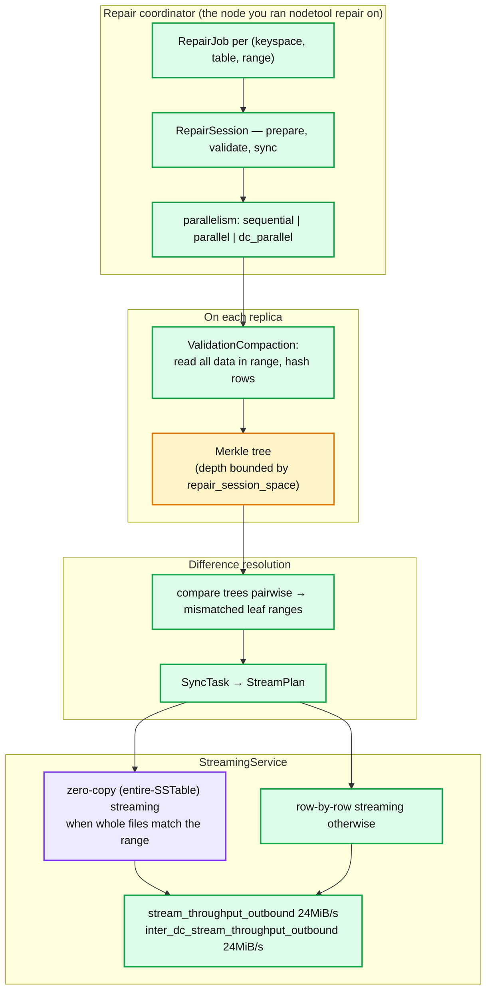
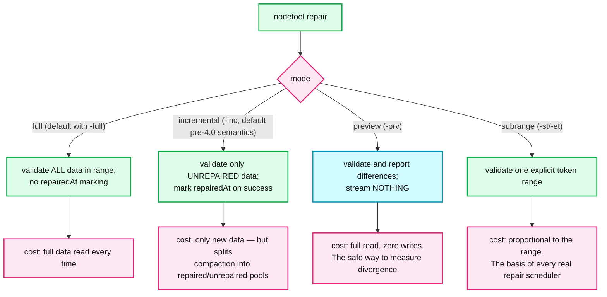
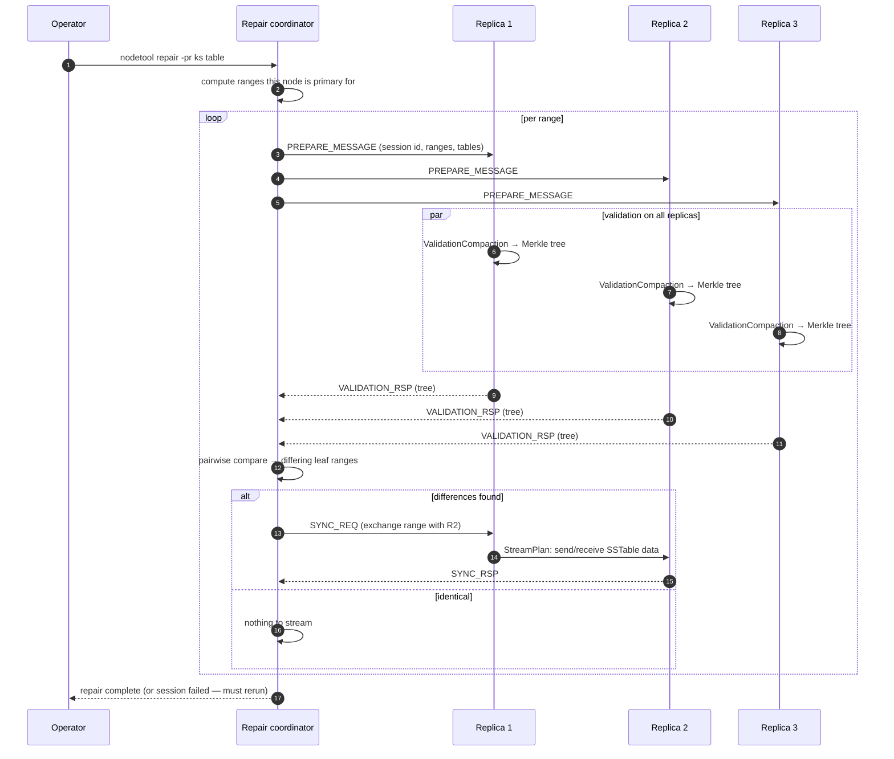
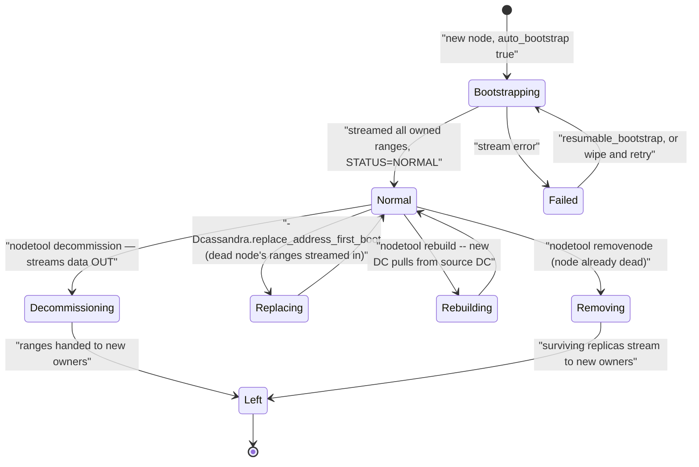
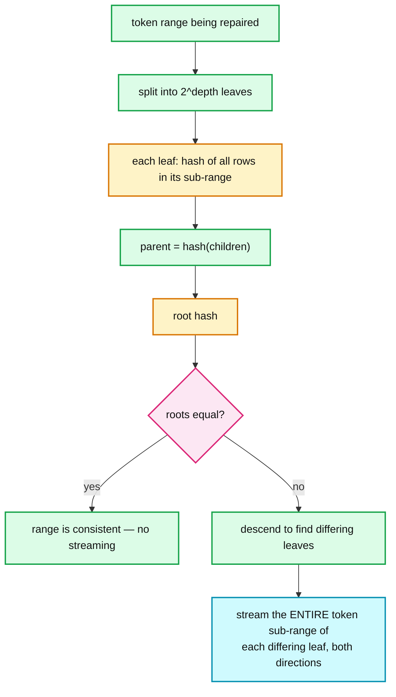

# Cassandra 07 — Anti-Entropy Repair and Streaming

**Baseline: Apache Cassandra 5.0** (`cassandra-5.0` branch). CEP-37 (Automated Repair) was **backported into 5.0.8** — noted where relevant.

---

<!-- nav:start -->
[← 06 Membership & Gossip](cassandra-06-membership-gossip.md) · **[Index](README.md)** · [08 CQL & SAI →](cassandra-08-cql-sai.md)
<!-- nav:end -->

<!-- toc:start -->

<b>Sections in this report (12)</b>

- [1. Overview](#1-overview)
- [2. Architecture](#2-architecture)
- [3. Data flow — repair modes compared](#3-data-flow--repair-modes-compared)
- [4. Sequence — a repair session](#4-sequence--a-repair-session)
- [5. State machine — node lifecycle operations](#5-state-machine--node-lifecycle-operations)
- [6. Component deep dives](#6-component-deep-dives)
- [7. Guarantees](#7-guarantees)
- [8. Failure modes](#8-failure-modes)
- [9. Scalability & performance](#9-scalability--performance)
- [10. Trade-offs & alternatives](#10-trade-offs--alternatives)
- [11. Staff-level questions](#11-staff-level-questions)
- [12. Sources](#12-sources)

<!-- toc:end -->

## 1. Overview

- **What it is.** The off-request-path convergence mechanism (repair) and the bulk data movement mechanism (streaming) that underlies bootstrap, decommission, replacement and rebuild.
- **Design bet.** Compare replicas with Merkle trees so you transfer only differences, not whole ranges. The hash comparison is cheap; the tree build is not, because it requires reading all the data.
- **The deadline.** Every node must be repaired within `gc_grace_seconds` (default **864000** = 10 days) or deleted data resurrects. This is not a recommendation — it is the contract that makes tombstone purging safe.
- **The operational reality.** Repair is the single hardest thing to run well in Cassandra. It is slow, it competes with the query path, it is easy to get wrong in ways that are silent, and until CEP-37 the project shipped no scheduler for it — hence Reaper and equivalents.

---

## 2. Architecture

**What to notice**

- **Validation is a full read of the range on every replica, simultaneously.** That is the real cost of repair: it is a compaction-class IO workload plus the query load, on all replicas at once. `sequential` parallelism (via snapshots) reduces the concurrency at the cost of wall-clock time.
- **Merkle tree resolution is bounded by memory, not by data.** `repair_session_space` (unset by default; effective value is 1/16 of heap) determines tree depth. On a large range, each leaf covers a wide token span, so **a single differing row causes the whole leaf's range to be streamed** — "overstreaming", the dominant hidden cost of repair.
- **Zero-copy streaming (4.0+) sends whole SSTable files** without deserialising, when the SSTable's range fits entirely inside what needs transferring. It is dramatically faster and is why bootstrap improved so much in 4.0. It does not apply to fine-grained repair diffs.
- **Throughput defaults are conservative**: `stream_throughput_outbound: 24MiB/s` and `inter_dc_stream_throughput_outbound: 24MiB/s` (both commented, i.e. these are the documented values). On modern hardware these are frequently the bottleneck for bootstrap and are worth raising deliberately.

---

## 3. Data flow — repair modes compared

**What to notice**

- **`-prv` (preview) is the most under-used flag in the tool.** It answers "how inconsistent is my cluster?" without changing anything — the correct first step before tuning repair, and the correct way to validate that a repair schedule is actually keeping up.
- **Incremental repair's promise is "only repair new data"; its cost is permanent compaction-pool splitting** ([report 04](cassandra-04-compaction.md)). It also historically had correctness issues with anticompaction; 4.0 reworked it, and it is usable in 5.0, but full subrange repair remains the conservative choice for critical clusters.
- **Subrange repair is what schedulers actually run.** Splitting the ring into many small ranges makes each repair session short, bounded, resumable and low-impact — this is Reaper's core technique, and CEP-37 brings the same idea in-tree.
- **`nodetool repair` with no arguments repairs only the ranges this node is a replica for**, not the cluster. Repairing a cluster means running it on every node (or using `-pr`, primary range only, on every node to avoid RF× duplicate work).

---

## 4. Sequence — a repair session

**What to notice**

- **All three replicas validate simultaneously in `parallel` mode** — three full range reads at once, which is why repair on a loaded cluster is felt immediately. `sequential` takes snapshots and validates one at a time: gentler, much slower.
- **A failed session fails the whole range and must be rerun.** Repair is not resumable mid-session in 5.0, which is why long sessions are a bad idea and subrange splitting is essential.
- **The streaming step is replica-to-replica, not through the coordinator.** The coordinator only orchestrates; data moves peer to peer.
- **Merkle tree exchange is small; the streaming that follows may not be.** Overstreaming means the bytes transferred can vastly exceed the bytes actually different.

---

## 5. State machine — node lifecycle operations

**What to notice**

- **`decommission` and `removenode` are not interchangeable.** `decommission` runs *on* a live node and streams its data out cleanly. `removenode` runs on another node for an already-dead one, and the surviving replicas must stream to cover — it takes longer and leaves you at reduced redundancy throughout.
- **Node replacement (`replace_address_first_boot`) preserves the token assignment** so the ring does not change — this is why replacement is much cheaper than remove-then-add, and it is the correct procedure for a hardware failure.
- **`rebuild` is for adding a DC**, streaming from a specified source DC without changing the ring. It is not repair and does not reconcile — you must repair afterwards.
- **The `Failed` bootstrap state is where clusters get stuck.** A partially bootstrapped node holds tokens in gossip but incomplete data. Recovery is wipe-and-retry, never "just start it again and hope".

---

## 6. Component deep dives

### 6.1 Merkle trees and overstreaming

- **Tree depth is memory-bounded**, governed by `repair_session_space` (default 1/16 of heap when unset). `cassandra.yaml` states directly: *"a higher `repair_session_space` value will produce higher resolution Merkle trees"*.
- **Overstreaming quantified [inferred]**: with a tree of 2^15 leaves over a range holding 100 GB, each leaf covers ~3 MB. One differing row streams ~3 MB. If differences are scattered, the transferred volume approaches the range size regardless of how little actually differs.
- **The mitigation is smaller ranges, not deeper trees.** Subrange repair reduces the data per tree, which increases resolution for the same memory — the reason schedulers split aggressively.

### 6.2 Streaming

- **Zero-copy / entire-SSTable streaming (CASSANDRA-14556, 4.0+)**: when an SSTable lies wholly within the range being transferred, its files are sent as-is over the wire without deserialisation, decompression or re-indexing. Order-of-magnitude faster for bootstrap and rebuild.
- **Row-by-row streaming** is used for partial ranges and repair diffs; the receiver writes new SSTables through the normal write path.
- **Throughput controls**: `stream_throughput_outbound: 24MiB/s`, `inter_dc_stream_throughput_outbound: 24MiB/s`, `streaming_connections_per_host` (default 1). Raising these is usually the first bootstrap-speed fix.
- **Failure handling.** A broken stream fails the session. 4.0+ has resumable bootstrap; repair sessions are not resumable.

### 6.3 CEP-37 — Automated Repair (backported to 5.0.8)

- **Status**: shipped in Apache Cassandra **5.0.8 (April 2026)** as a backport from 6.0 **[doc — release notes]**. Prior to this, in-tree repair scheduling did not exist and every production cluster used Reaper or a homegrown cron.
- **What it provides**: in-tree scheduling of repair sessions with token-range splitting, concurrency limits and progress tracking — the functionality Reaper provided externally.
- **Why it matters strategically**: it removes the single largest operational gap in the project. A database whose correctness depends on an operation it does not schedule has an incomplete contract.
- Verify the exact configuration surface against `NEWS.txt` for your patch version before relying on specifics — this landed recently and the config names are the least stable thing in this series **[flagged as low-confidence]**.

### 6.4 The gc_grace / repair coupling

| Quantity | Default | Constraint |
|---|---|---|
| `gc_grace_seconds` | 864000 (10 days) | Must exceed worst-case time for repair to cover every node |
| `max_hint_window` | 3h | Below this, hints handle it; above, repair must |
| Repair cadence | operator's | Must complete cluster-wide inside gc_grace |
| Node max downtime | operator's | A node down > gc_grace must be wiped, not restarted |

- **The chain**: hints cover 3 hours → repair covers up to 10 days → beyond that, resurrection. Each link must hold or data is silently wrong.
- **Lowering gc_grace without shortening the repair cycle is the classic self-inflicted resurrection.** 5.0 added a startup data-resurrection check that catches the most obvious case (a node returning with SSTables older than gc_grace) but it is a safety net, not a fix.

---

## 7. Guarantees

| Guarantee | Mechanism | Limit |
|---|---|---|
| Replicas converge for repaired ranges | Merkle comparison + bidirectional streaming | Only for ranges actually repaired, only as of the validation moment |
| Tombstones safely purgeable | Repair completing inside gc_grace | If repair is late or skipped: resurrection |
| Bootstrap loses no writes | Double-write from `STATUS=BOOT` until `NORMAL` | Requires exactly one bootstrap at a time |
| Repaired data segregated | `repairedAt` in `Statistics.db` | Permanently splits compaction pools |
| Streaming integrity | Per-file checksums, session-level failure | Failed session = rerun from scratch |

---

## 8. Failure modes

| Failure | Detection | Recovery | Blast radius |
|---|---|---|---|
| Repair never completes inside gc_grace | Repair duration vs gc_grace; `-prv` shows growing divergence | Subrange repair, more parallelism, raise gc_grace *temporarily* | Data resurrection — permanent and silent |
| Overstreaming | Bytes streamed ≫ bytes differing | Smaller subranges; raise `repair_session_space` | Repair takes days; IO saturation |
| Repair session failure mid-run | `nodetool netstats`, repair logs | Rerun the range | Wasted hours; ranges left unrepaired |
| Bootstrap stream failure | Node stuck in `BOOT` | Resume (4.0+) or wipe and retry | Reduced redundancy during retry |
| Node restarted after > gc_grace down | 5.0 startup resurrection check may catch it | **Wipe and re-bootstrap** | Deleted data returns cluster-wide |
| `removenode` on a large node | Long streaming at reduced RF | Prefer `replace_address` for hardware failure | Extended reduced-redundancy window |
| Repair during a compaction backlog | Both queues grow | Stagger; throttle one | Compounding IO starvation |

---

## 9. Scalability & performance

- **Repair time scales with data per node × vnodes × RF**, which is why `num_tokens: 16` mattered so much and why node density ([report 10](cassandra-10-scale-operations.md)) is limited by repair, not by storage.
- **Repair is the real constraint on node size.** A 10 TB node may store fine and read fine and take three days to repair — which means it cannot be repaired inside a 10-day gc_grace if anything goes wrong twice.
- **Streaming throughput defaults (24MiB/s) are from the spinning-disk era.** On NVMe with 25 Gbps networking they are 1–2 orders of magnitude low; raising them is safe if you also watch the receiving node's compaction backlog, since streamed SSTables must then be compacted.
- **Prefer many small subrange repairs over few large ones**, always: bounded blast radius, better tree resolution, restartable at range granularity.

---

## 10. Trade-offs & alternatives

- **vs. read repair alone.** Read repair covers only what is read. Cold data — which is most data — would diverge forever. Merkle repair is what makes the tunable-consistency model honest.
- **vs. a replicated log (Kafka, Raft-based stores).** Systems that replicate an ordered log never diverge and need no anti-entropy. Cassandra bought availability and leaderless writes and pays for them here. It is the same trade as [report 05](cassandra-05-coordinator-consistency.md), seen from the operations side.
- **vs. Dynamo's original design.** Dynamo used Merkle trees the same way; Cassandra inherited both the technique and its overstreaming problem.
- **What would improve it.** Finer-grained divergence tracking (per-partition mutation tracking) rather than range hashing would eliminate overstreaming entirely — this is an active direction in the project **[inferred from CEP discussions; not in 5.0]**.

---

## 11. Staff-level questions

1. **Your cluster takes 12 days to complete a full repair cycle and `gc_grace_seconds` is 10 days. List the options, ranked.** (1) Split into subrange repairs and parallelise across nodes so wall-clock drops — usually the biggest win and lowest risk. (2) Raise `stream_throughput_outbound` and `repair_session_space` from their conservative defaults. (3) Switch appropriate tables to incremental repair so only new data is validated, accepting the compaction-pool split. (4) Reduce data per node by adding nodes — addresses the root cause but slowly. (5) Raise `gc_grace_seconds` — buys time but increases tombstone retention and disk. Explicitly *not* an option: lowering gc_grace, or accepting the gap. Also: run `-prv` first to find out whether divergence is actually accumulating, because a 12-day cycle on a cluster with near-zero divergence is a different (and less urgent) problem than one with real drift.

2. **Explain overstreaming to someone who thinks repair only transfers differences.** The Merkle tree does not identify differing *rows*, only differing *leaf ranges*. Tree depth is capped by memory, so a leaf may cover megabytes of token space; if one cell inside it differs, the entire leaf range is exchanged in both directions. On a large range with scattered differences, the transferred volume can approach the total range size while the true delta is kilobytes. This is why the fix is smaller repair ranges (more trees, each covering less data, so each leaf is finer) rather than more bandwidth.

3. **A node's disk fails. Compare `removenode` + add new node vs `replace_address_first_boot`.** `replace_address_first_boot` brings up a new host that adopts the dead node's exact tokens; surviving replicas stream the missing ranges to it and the ring never changes, so no other node's ownership moves and no cleanup is needed. `removenode` first redistributes the dead node's ranges among survivors (streaming), then adding a node redistributes again (more streaming) — roughly double the data movement, a longer reduced-redundancy window, and a ring change. Replacement is correct for like-for-like hardware failure; remove-then-add is correct only when you are genuinely resizing the cluster.

4. **Why does incremental repair interact badly with compaction, and how would you decide whether to use it?** Repaired and unrepaired SSTables must never be merged (a merged output could not truthfully claim a `repairedAt`), so each table maintains separate compaction pools, plus a transient pending-repair pool per session. Each pool has fewer SSTables to work with, so compaction is less efficient and SSTable counts run higher — which raises read amplification. The decision rule: use incremental repair on large, low-churn tables where the repaired pool stabilises and the unrepaired pool stays small; use full subrange repair on high-churn tables, where the fragmentation cost exceeds the validation savings. Measure with SSTables-per-read before and after, not by policy.

5. **You are given a 200-node cluster with no repair schedule and a 10-day gc_grace. What is your first week?** Day one: run `nodetool repair -prv` (preview) on a representative subset to measure actual divergence — this is read-only and tells you whether you have a latent correctness problem or merely a missing process. Simultaneously check hint metrics and dropped-mutation counts, which predict where divergence comes from. Then stand up scheduled subrange repair — CEP-37's in-tree scheduler if the cluster is on 5.0.8+, Reaper otherwise — sized so a full cycle completes in well under gc_grace with headroom for a node being down. Raise the streaming and repair-session defaults from their spinning-disk values. Finally, write down the constraint chain (hint window → repair cycle → gc_grace → max node downtime) as an explicit operational contract, because the failure this prevents is silent and no dashboard will show it.

---

## 12. Sources

- `src/java/org/apache/cassandra/repair/` — `RepairJob.java`, `RepairSession.java`, `Validator.java`, `SyncTask.java` — [`apache/cassandra@cassandra-5.0`](https://github.com/apache/cassandra/tree/cassandra-5.0)
- `src/java/org/apache/cassandra/utils/MerkleTree.java`, `MerkleTrees.java`
- `src/java/org/apache/cassandra/streaming/` — `StreamPlan.java`, `StreamSession.java`; entire-SSTable streaming in `CassandraEntireSSTableStreamWriter.java`
- `conf/cassandra.yaml` — `repair_session_space`, `stream_throughput_outbound`, `inter_dc_stream_throughput_outbound`
- `NEWS.txt` (5.0.8) — CEP-37 Automated Repair backport
- [CEP-37: Repair inside Cassandra](https://cwiki.apache.org/confluence/display/CASSANDRA/CEP-37%3A+Apache+Cassandra+Unified+Repair)
- [Cassandra Reaper](http://cassandra-reaper.io/) — the external scheduler CEP-37 supersedes

---

---

<!-- nav:start -->
[← 06 Membership & Gossip](cassandra-06-membership-gossip.md) · **[Index](README.md)** · [08 CQL & SAI →](cassandra-08-cql-sai.md)
<!-- nav:end -->
