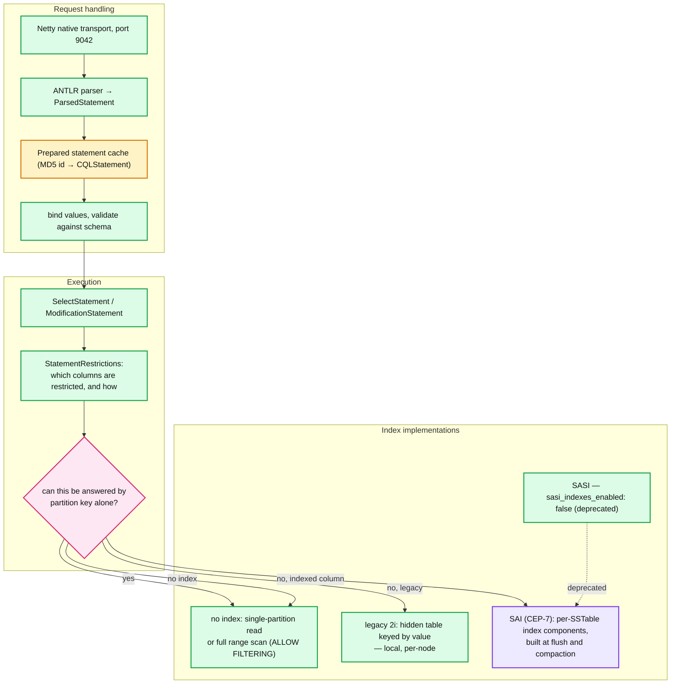
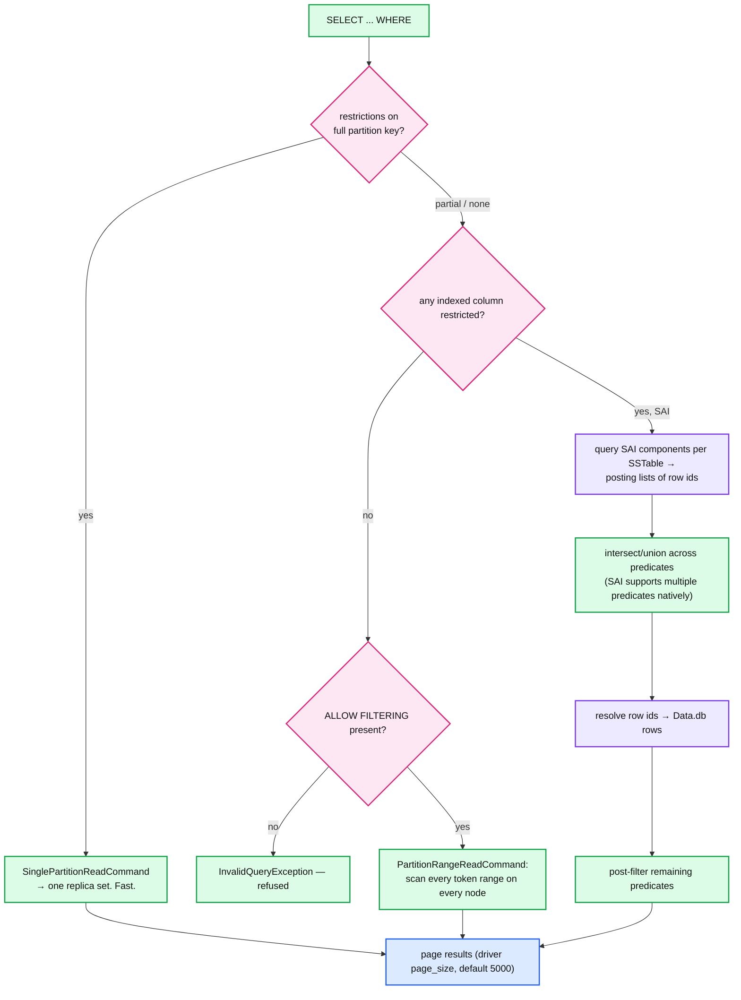
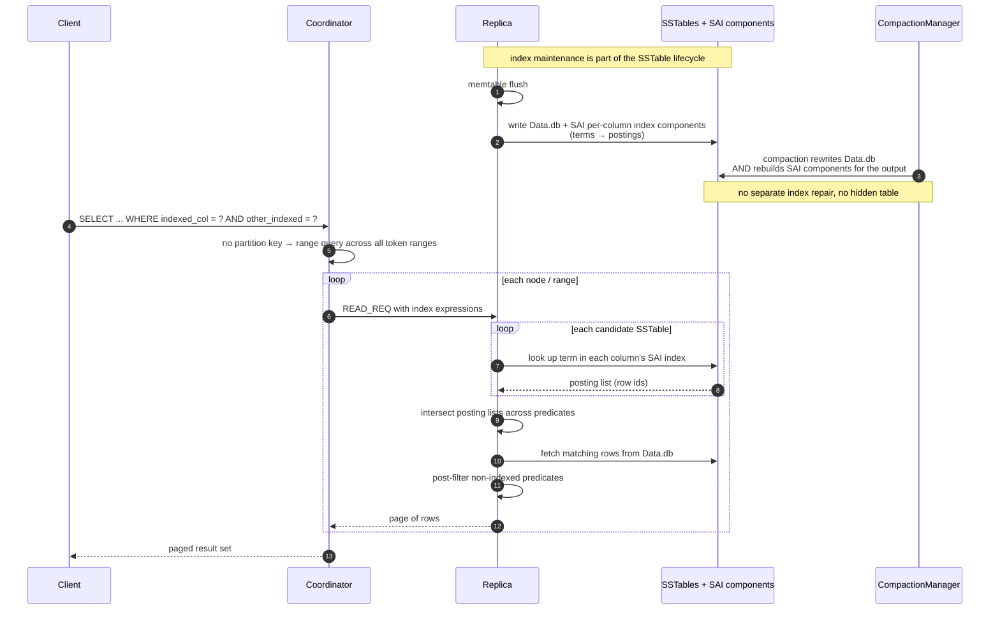
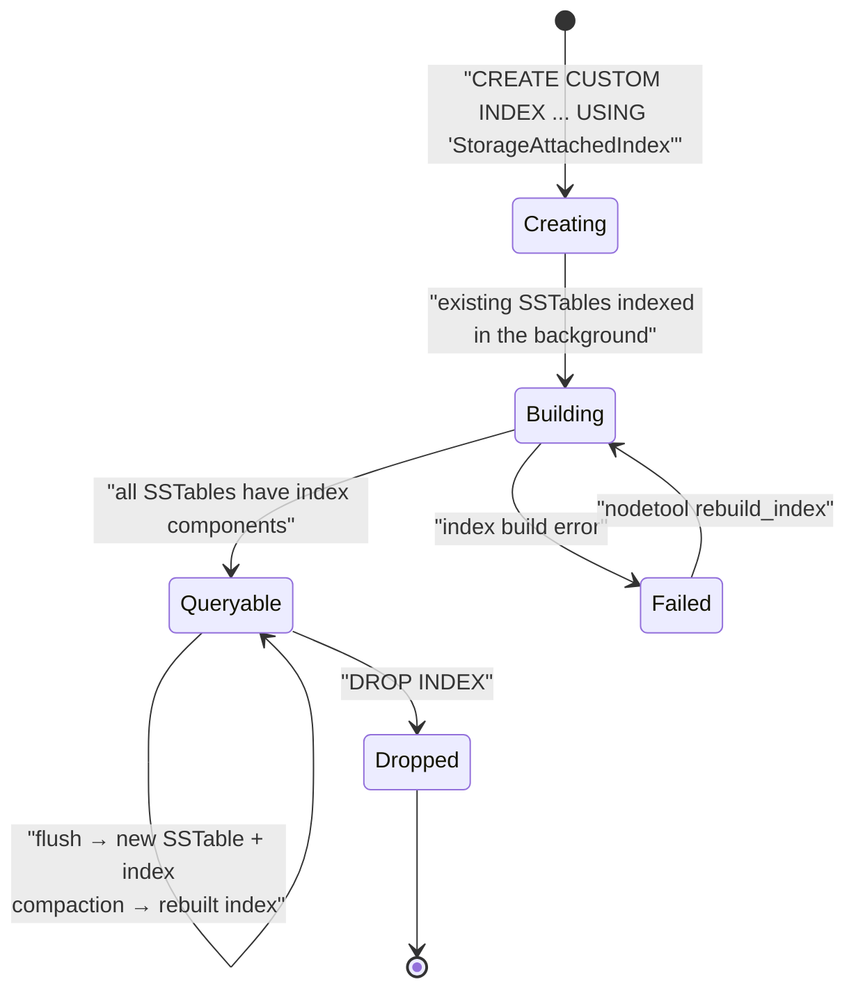

# Cassandra 08 — CQL Query Layer and Secondary Indexes (SAI)

**Baseline: Apache Cassandra 5.0** (`cassandra-5.0` branch). SAI guardrail defaults verified in `conf/cassandra.yaml`.

---

<!-- nav:start -->
[← 07 Repair & Streaming](cassandra-07-repair-streaming.md) · **[Index](README.md)** · [09 TCM & Accord →](cassandra-09-tcm-accord.md)
<!-- nav:end -->

<!-- toc:start -->

<b>Sections in this report (12)</b>

- [1. Overview](#1-overview)
- [2. Architecture](#2-architecture)
- [3. Data flow — query execution and index selection](#3-data-flow--query-execution-and-index-selection)
- [4. Sequence — SAI query and index maintenance](#4-sequence--sai-query-and-index-maintenance)
- [5. State machine — an SAI index](#5-state-machine--an-sai-index)
- [6. Component deep dives](#6-component-deep-dives)
- [7. Guarantees](#7-guarantees)
- [8. Failure modes](#8-failure-modes)
- [9. Scalability & performance](#9-scalability--performance)
- [10. Trade-offs & alternatives](#10-trade-offs--alternatives)
- [11. Staff-level questions](#11-staff-level-questions)
- [12. Sources](#12-sources)

<!-- toc:end -->

## 1. Overview

- **What it is.** The layer between a CQL string and a read/write command: parsing, prepared statements, paging, and the index implementations that let you query by something other than the partition key.
- **Design bet.** CQL looks like SQL to make the system approachable, while deliberately refusing the operations that would require coordination or scatter-gather — no joins, no subqueries, no aggregates across partitions without explicit opt-in.
- **5.0's headline: Storage-Attached Indexes (CEP-7)**, replacing legacy 2i and the abandoned SASI, plus a `vector<float, n>` type with ANN search (CEP-30). SAI indexes are built and maintained *as part of the SSTable lifecycle* rather than as a separate hidden table.
- **The constant that has not changed.** An index does not make a bad data model good. Every index in Cassandra is a *local* index: querying it without a partition key means fanning out to every node.

---

## 2. Architecture

**What to notice**

- **The prepared statement cache is keyed by the query string's MD5** and holds the parsed, validated statement plus metadata. **Never build query strings by concatenating values** — it defeats the cache, blows heap, and reintroduces injection risk that parameterised queries eliminate.
- **`StatementRestrictions` is where CQL enforces its refusals.** "Cannot execute this query as it might involve data filtering" comes from here, and it is a *feature*: the parser is telling you the query does not match the data model.
- **SAI is attached to SSTables, legacy 2i is a hidden table.** That is the whole difference and it explains everything downstream — SAI participates in compaction, is written at flush, needs no separate repair, and its lifecycle is the SSTable's lifecycle.
- **`sasi_indexes_enabled: false`** and `materialized_views_enabled: false` are both disabled by default in 5.0. Treat both as absent.

---

## 3. Data flow — query execution and index selection

**What to notice**

- **Index or not, a query without a partition key is a scatter-gather across the whole cluster.** SAI makes each node's local work cheap; it does not reduce the fan-out. A "fast" indexed query on a 200-node cluster still contacts 200 nodes.
- **SAI's real advance over legacy 2i is multi-predicate support.** Legacy 2i can use exactly one index and post-filters the rest. SAI intersects posting lists across several indexed columns before touching rows, which is the difference between an index and a usable index.
- **`ALLOW FILTERING` is a scan authorisation, not an optimisation.** It tells the server "yes, I accept an unbounded read". In production it is nearly always a modelling defect.
- **Paging has no snapshot.** Each page is an independent read; concurrent writes may appear, disappear or duplicate across page boundaries.

---

## 4. Sequence — SAI query and index maintenance

**What to notice**

- **SAI has no separate write path.** Nothing extra happens on `INSERT`; index components are produced at flush and rebuilt at compaction. That is why SAI does not slow writes measurably and why legacy 2i (a hidden table written synchronously per mutation) did.
- **SAI indexes are local to the SSTable**, so index size scales with data on that node and index correctness follows from SSTable correctness. Repair repairs the base data; the index follows automatically.
- **Multiple SAI indexes on one table share infrastructure**, which is why creating several is cheap compared with legacy 2i where each is an independent hidden table.
- **`sai_sstable_indexes_per_query_warn_threshold: 32`** exists because a query touching hundreds of SSTable indexes is slow no matter how good each one is — it is a compaction-health signal surfacing as a query guardrail.

---

## 5. State machine — an SAI index

**What to notice**

- **`Building` is per-node and asynchronous.** A newly created index on a large table is not immediately queryable everywhere; queries can fail or return partial results on nodes still building. Check `system_views` / `nodetool` before relying on a new index.
- **There is no `Stale` state, by construction.** Because the index is a component of the SSTable, it cannot diverge from the data the way a legacy 2i hidden table or a materialized view can. This is the strongest argument for SAI over both.
- **Dropping and recreating is cheap relative to a materialized view**, since no separate data is stored beyond the index components.

---

## 6. Component deep dives

### 6.1 CQL data model constraints

- **Primary key = partition key + clustering columns.** The partition key determines placement (token); clustering columns determine on-disk order within the partition. Query capability is entirely determined by this choice.
- **The allowed restriction pattern**: equality on all partition key columns, then equality on a prefix of clustering columns, then a range on the next one. Anything else needs an index or `ALLOW FILTERING`.
- **5.0 additions**: `vector<float, n>` type (CEP-30); TTL and `writetime` on collections and UDTs; math functions `abs`, `exp`, `log`, `log10`, `round`; new collection scalar functions; extended maximum TTL expiration date; **Dynamic Data Masking (CEP-20)**.
- **`ALTER TABLE` cannot change the primary key.** Ever. Remodelling means a new table and a migration — the single most consequential fact in Cassandra data modelling.

### 6.2 Legacy secondary indexes (2i)

- Implemented as a hidden table keyed by the indexed value, **local to each node**, written synchronously on every mutation to the base table.
- **Failure mode**: high-cardinality columns produce one row per value with tiny partitions (fine); *low*-cardinality columns produce enormous partitions in the hidden table (catastrophic). The classic "index on a boolean" incident.
- One index per query, remaining predicates post-filtered. Superseded by SAI for essentially every use.

### 6.3 SASI

- `sasi_indexes_enabled: false` in 5.0. SASI offered `LIKE` and range queries but was never made production-safe (memory issues, correctness bugs with tokenisation). Treat as removed; SAI is the successor.

### 6.4 Storage-Attached Indexes (CEP-7)

- **Creation**: `CREATE CUSTOM INDEX ON t(col) USING 'StorageAttachedIndex'`.
- **Structure**: per-SSTable, per-column index components mapping terms to posting lists of row ids, plus a per-SSTable primary-key index. Numeric columns use a balanced tree structure for range queries; text uses a term dictionary **[inferred from behaviour and CEP text; the exact internal formats are documented in CEP-7 rather than in cassandra.yaml]**.
- **Capabilities**: equality and range on numeric and text, multiple predicates intersected, collection indexing, and ANN on `vector` columns.
- **Guardrails, verified in `cassandra.yaml`** (all commented, i.e. these are the documented defaults):

| Guardrail | Default |
|---|---|
| `sai_sstable_indexes_per_query_warn_threshold` | `32` |
| `sai_sstable_indexes_per_query_fail_threshold` | `-1` (disabled) |
| `sai_string_term_size_warn_threshold` | `1KiB` |
| `sai_string_term_size_fail_threshold` | `8KiB` |
| `sai_frozen_term_size_warn_threshold` | `1KiB` |
| `sai_frozen_term_size_fail_threshold` | `8KiB` |
| `sai_vector_term_size_warn_threshold` | `16KiB` |
| `sai_vector_term_size_fail_threshold` | `32KiB` |

- **`sai_options` exists in `cassandra.yaml`** as a configuration block for SAI defaults.

### 6.5 Vector search (CEP-30)

- `vector<float, n>` type plus similarity functions (cosine, dot product, euclidean) and `ORDER BY ... ANN OF ?` for approximate nearest-neighbour search, implemented over SAI.
- **The index is a graph structure (JVector/HNSW-family) per SSTable** — meaning ANN quality and cost depend on SSTable count exactly as ordinary reads do. A fragmented table gives worse recall *and* worse latency **[inferred from the per-SSTable architecture]**.
- **`sai_vector_term_size_warn_threshold: 16KiB` / `fail: 32KiB`** bound embedding dimensionality: a 32 KiB limit is ~8,000 float32 dimensions.
- **The honest positioning**: this makes Cassandra a viable vector store *for data that already lives in Cassandra*, avoiding a second system and a sync pipeline. It is not competitive with a dedicated vector database on pure ANN benchmarks **[inferred]**.

### 6.6 Dynamic Data Masking (CEP-20)

- CQL-level masking functions (`mask_null`, `mask_default`, `mask_replace`, `mask_inner`, `mask_outer`, `mask_hash`) applied at query time based on the `UNMASK` permission.
- **It is not encryption and not row-level security.** Masking is applied on read for unprivileged roles; the underlying data is stored in the clear and accessible to anyone who can read the SSTables.

---

## 7. Guarantees

| Guarantee | Mechanism | Limit |
|---|---|---|
| Prepared statements are parsed once | MD5-keyed statement cache | Defeated by string-concatenated queries |
| Index consistency with base data | SAI components are part of the SSTable | Only for SAI; legacy 2i and MVs can diverge |
| Query refusal rather than surprise scan | `StatementRestrictions` validation | Bypassed by `ALLOW FILTERING` |
| Clustering order in results | On-disk ordering | Only within a partition |
| Paging progress | Server-side paging state cursor | **No snapshot** — concurrent writes leak across pages |

---

## 8. Failure modes

| Failure | Detection | Recovery | Blast radius |
|---|---|---|---|
| Legacy 2i on a low-cardinality column | Huge hidden-table partitions, timeouts | Drop it; remodel or use SAI | Node-level GC and read stalls |
| `ALLOW FILTERING` in production | Slow queries, `range_request_timeout` breaches | Remodel; add SAI; deny at the driver layer | Cluster-wide scan load |
| Index query with no partition key on a large cluster | Latency proportional to node count | Add the partition key, or accept fan-out | Every node participates in every query |
| SAI index still building | Partial/failed results on some nodes | Wait; `nodetool rebuild_index` | Inconsistent query behaviour across replicas |
| Too many SSTable indexes per query | `sai_sstable_indexes_per_query_warn_threshold: 32` | Fix compaction; this is a compaction symptom | Query latency |
| Oversized vector terms | `sai_vector_term_size_fail_threshold: 32KiB` | Reduce dimensionality | Writes rejected |
| Query-string concatenation | Prepared-cache thrash, heap pressure | Parameterise | Node-wide |

---

## 9. Scalability & performance

- **The only query that scales with cluster size is one restricted to a partition key.** Everything else scales *against* it. This is the single most important performance fact in the CQL layer.
- **SAI changes the constant, not the complexity.** Per-node work drops; fan-out is unchanged. On a 20-node cluster a global indexed query is fine; on 500 it is not.
- **Index maintenance cost is paid at compaction**, so heavily indexed tables amplify compaction load — worth measuring when adding several SAI indexes to a write-heavy table.
- **Paging size trades round trips against memory**: 5000 rows default; lower it for wide rows to avoid coordinator heap spikes.

---

## 10. Trade-offs & alternatives

- **vs. denormalised query tables (the classic Cassandra answer).** Writing the same data into several tables keyed for each query gives partition-key-restricted reads for every access pattern — optimal reads, more writes, application-managed consistency. SAI does not replace this; it covers the *unanticipated* query, not the hot path.
- **vs. Elasticsearch alongside Cassandra.** ES gives real full-text search, relevance ranking and aggregation that SAI does not attempt, at the cost of a second system and a sync pipeline that will diverge. SAI's argument is entirely about eliminating that pipeline.
- **vs. a dedicated vector DB (Pinecone, Milvus, pgvector).** Same argument: co-location beats capability when the data already lives here.
- **vs. materialized views.** MVs promised automatic denormalisation and could not deliver a consistency guarantee. SAI solves a smaller problem correctly instead of a larger one unreliably — the better engineering decision, and `materialized_views_enabled: false` is the project admitting it.

---

## 11. Staff-level questions

1. **When is SAI the right answer, and when is a denormalised query table still correct?** SAI is right for low-frequency, ad-hoc, or secondary access paths — admin lookups, occasional filters, exploratory queries — and for genuinely multi-predicate filtering within a known partition. A denormalised query table is right for any high-QPS access path, because it turns the query into a single-partition read that scales linearly with the cluster while an SAI query without a partition key fans out to every node. The decision rule is fan-out, not convenience: if the query has a partition key, SAI is a fine refinement; if it does not, ask what QPS it will run at and how many nodes you expect to have in two years.

2. **A team adds an SAI index on a `status` column with four possible values. What happens?** Cardinality is not the disaster it was with legacy 2i — SAI stores posting lists rather than a hidden table, so there is no giant partition. But the query is still a full cluster fan-out, and each node's posting list for a common value matches a huge fraction of its rows, so the index eliminates almost nothing before the row fetch. The result is a scan with extra steps. The correct model is either a partition key that includes status (if the access pattern justifies it) or accepting that "all rows with status X" is an analytics query and belongs in a Spark job or a separate DC.

3. **Explain why SAI cannot diverge from base data but a materialized view can.** SAI index components are written as part of the same SSTable as the data they index, by the same flush or compaction operation, on the same node. There is no separate write, no second replica set, no cross-partition coordination — so any state in which the index disagrees with the data is a state in which the SSTable itself is corrupt. A materialized view, by contrast, writes to a different partition on a different replica set via a batchlog, with a read-before-write on the base replica; every step in that chain can fail independently, and there is no repair mechanism that reconciles a view against its base. The architectural lesson is that co-locating the derived data with its source eliminates a whole class of consistency problem rather than managing it.

4. **You need "find users by email" with strong latency requirements on a 300-node cluster. Design it.** A separate table partitioned by email: `CREATE TABLE users_by_email (email text PRIMARY KEY, user_id uuid, ...)`. That makes the lookup a single-partition read hitting one replica set regardless of cluster size. Write both tables from the application; accept that they can diverge on partial failure and either use a logged batch (if divergence is unacceptable and the write rate tolerates it) or a reconciliation job. SAI on the email column would work functionally and fan out to all 300 nodes per lookup, which fails the latency requirement at any meaningful QPS. If uniqueness of email must also be enforced, that is LWT on the `users_by_email` partition ([report 05](cassandra-05-coordinator-consistency.md)) — and it composes badly with the two-table write, which is the real design tension to surface.

5. **Evaluate using Cassandra 5.0 as the vector store for a RAG system over documents already in Cassandra.** In favour: no second system, no embedding sync pipeline, no dual-write consistency problem, ANN and metadata filtering in one query via SAI's multi-predicate intersection, and the operational model your team already runs. Against: recall and latency depend on SSTable count, so a write-heavy or poorly compacted table degrades ANN quality — a failure mode that does not exist in a purpose-built index; the 32 KiB vector term limit caps dimensionality; and there is no HNSW parameter tuning surface comparable to a dedicated store. The decision hinges on scale and whether the documents genuinely already live in Cassandra: at tens of millions of vectors with the source data co-located, it is the right call; at billions, or where the source is elsewhere anyway, the co-location argument evaporates and a dedicated store wins.

---

## 12. Sources

- `src/java/org/apache/cassandra/cql3/` — `QueryProcessor.java`, `statements/SelectStatement.java`, `restrictions/StatementRestrictions.java` — [`apache/cassandra@cassandra-5.0`](https://github.com/apache/cassandra/tree/cassandra-5.0)
- `src/java/org/apache/cassandra/index/sai/` — SAI implementation
- `conf/cassandra.yaml` — `sai_options`, all `sai_*` guardrails, `sasi_indexes_enabled`, `materialized_views_enabled`
- [CEP-7: Storage Attached Index](https://cwiki.apache.org/confluence/display/CASSANDRA/CEP-7%3A+Storage+Attached+Index)
- [CEP-30: Approximate Nearest Neighbor (ANN) Vector Search via Storage-Attached Indexes](https://cwiki.apache.org/confluence/display/CASSANDRA/CEP-30%3A+Approximate+Nearest+Neighbor%28ANN%29+Vector+Search+via+Storage-Attached+Indexes)
- [CEP-20: Dynamic Data Masking](https://cwiki.apache.org/confluence/display/CASSANDRA/CEP-20%3A+Dynamic+Data+Masking)
- [Cassandra docs — CQL reference](https://cassandra.apache.org/doc/latest/cassandra/developing/cql/)

---

---

<!-- nav:start -->
[← 07 Repair & Streaming](cassandra-07-repair-streaming.md) · **[Index](README.md)** · [09 TCM & Accord →](cassandra-09-tcm-accord.md)
<!-- nav:end -->
