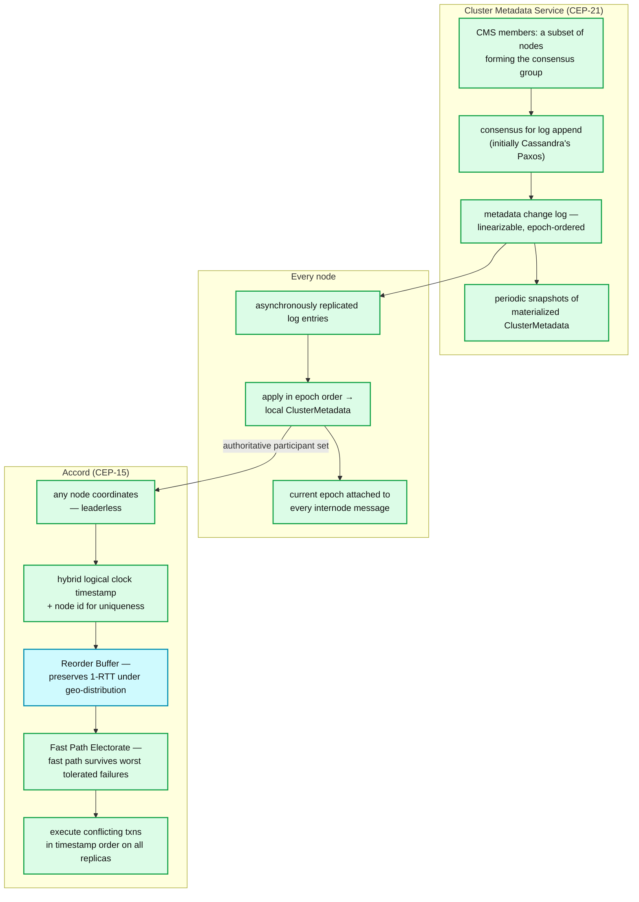
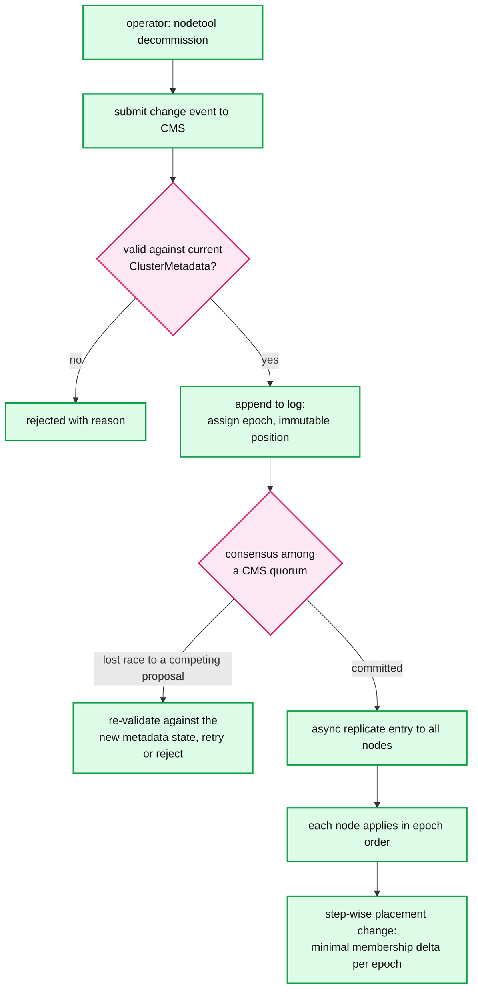
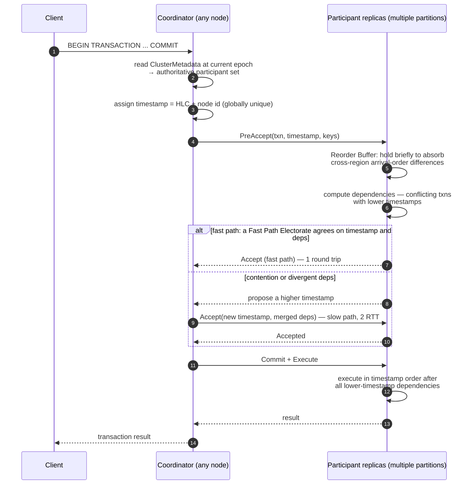
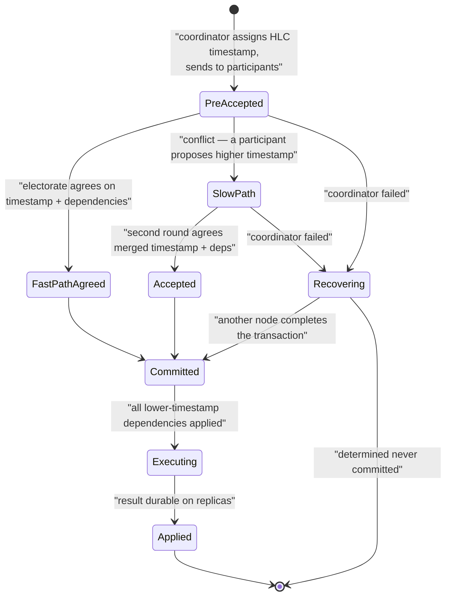

# Cassandra 09 — Transactional Cluster Metadata (CEP-21) and Accord (CEP-15)

> ## ⚠️ Neither of these is in Cassandra 5.0.
>
> **Verified**: the `cassandra-5.0` branch contains no CMS and no Accord. `cassandra.yaml` in 5.0 has no metadata-log or transaction configuration. Both features were originally targeted at a release called **5.1**, which was renamed; they land in **Cassandra 6.0**, which as of this writing exists as **`6.0-alpha1`** and is **not GA**. The latest GA line remains 5.0 (5.0.9, Aug 2026).
>
> Everything below is therefore marked **[design]** — from the CEPs, the `cep-15-accord` branch and the 6.0 alpha — rather than **[verified in 5.0 source]** like reports 01–08. Do not quote a config name from this report as if it were a 5.0 setting. Treat the *shape* of the design as reliable and every *specific* as provisional until 6.0 GA.

---

<!-- nav:start -->
[← 08 CQL & SAI](cassandra-08-cql-sai.md) · **[Index](README.md)** · [10 Scale & Operations →](cassandra-10-scale-operations.md)
<!-- nav:end -->

<!-- toc:start -->

<b>Sections in this report (12)</b>

- [1. Overview](#1-overview)
- [2. Architecture](#2-architecture)
- [3. Data flow — a metadata change under CEP-21 [design]](#3-data-flow--a-metadata-change-under-cep-21-design)
- [4. Sequence — an Accord transaction on the fast path [design]](#4-sequence--an-accord-transaction-on-the-fast-path-design)
- [5. State machine — an Accord transaction [design]](#5-state-machine--an-accord-transaction-design)
- [6. Component deep dives [design]](#6-component-deep-dives-design)
- [7. Guarantees [design]](#7-guarantees-design)
- [8. Failure modes [design/inferred]](#8-failure-modes-designinferred)
- [9. Scalability & performance [design/inferred]](#9-scalability--performance-designinferred)
- [10. Trade-offs & alternatives](#10-trade-offs--alternatives)
- [11. Staff-level questions](#11-staff-level-questions)
- [12. Sources](#12-sources)

<!-- toc:end -->

## 1. Overview

- **The problem CEP-21 solves.** In 5.0, cluster metadata — ring ownership, schema, node state — is propagated by gossip, which is eventually consistent and has no ordering. Two concurrent topology changes can produce genuinely divergent views of who owns which token range, with no detection and no reconciliation. Every "one topology change at a time" rule in the operations manual is a workaround for this missing guarantee ([report 06](cassandra-06-membership-gossip.md)).
- **CEP-21's answer.** A **Cluster Metadata Service (CMS)**: a linearizable, replicated log of metadata change events, each assigned an **epoch**. Nodes apply the log in order, so all nodes pass through the same sequence of metadata states. Ownership changes become transactions, not rumours.
- **The problem CEP-15 solves.** Cassandra's only transaction mechanism is LWT (Paxos), which is per-partition, costs ~4 round trips, and degrades badly under contention. There is no multi-partition transaction at all.
- **CEP-15's answer.** **Accord**: a leaderless consensus protocol using hybrid logical clock timestamps, achieving **one-round-trip consensus in the common case** for general-purpose multi-partition transactions, with a fast path that stays available under the same failures Cassandra already tolerates.
- **The dependency.** Accord requires CMS. It needs every replica to agree on exactly who the participants in a transaction are *before* committing — a guarantee gossip cannot provide. This is why CEP-21 had to ship first and why the two are one migration, not two.

---

## 2. Architecture

**What to notice**

- **CMS is not a metadata *server* on the data path.** The log is replicated asynchronously to every node, which materialises `ClusterMetadata` locally. Reads and writes still compute placement locally with no lookup — the 5.0 property is preserved. CMS is consulted only to *change* metadata.
- **The epoch travels on every internode message.** A replica receiving a request stamped with an older epoch than its own knows the sender has a stale view and can respond accordingly. This is the mechanism that makes stale-metadata operations detectable rather than silently wrong — the exact hole in 5.0.
- **CMS membership is a subset of nodes, not all of them.** Consensus over thousands of nodes would not work; a small CMS group with async fan-out to everyone else is the standard shape (and is structurally similar to what Kafka did with KRaft).
- **Accord's fast path is one round trip.** That is the headline claim and the reason it is interesting: it is faster than Paxos LWT for the single-partition case *and* it generalises to multiple partitions, which LWT never could.

---

## 3. Data flow — a metadata change under CEP-21 [design]

**What to notice**

- **Validation happens against a specific metadata state, and losing the race means re-validating.** The CEP states the principle directly: consistency is guaranteed by making *minimal changes to the membership, step-wise*. A range move is decomposed into several epochs each of which is individually safe, rather than one atomic jump.
- **Rejection is a first-class outcome.** In 5.0 a conflicting topology change simply happens and diverges. Under CMS it is refused with a reason — which is the entire improvement.
- **Replication of committed entries is asynchronous**, so a node can lag. Lagging is safe because the epoch on each message makes staleness visible; in 5.0, lagging is invisible.
- **This unlocks concurrent topology changes.** Once ownership transitions are linearizable and step-wise, multiple bootstraps become expressible as an ordered sequence rather than a forbidden race — the practical payoff operators will notice first.

---

## 4. Sequence — an Accord transaction on the fast path [design]

**What to notice**

- **The Reorder Buffer is the key trick for geo-distribution.** Two transactions started concurrently in different regions arrive at replicas in different orders, which would normally force the slow path. A short deliberate delay lets replicas agree on order and keeps the one-round-trip path available across regions — a rare case of adding latency to reduce latency.
- **Fast Path Electorates keep the fast path alive under failure.** The CEP is explicit that in prior leaderless protocols (Caesar, Tempo) as few as a quarter of replicas failing forces slow-path consensus; Accord's electorate construction avoids that.
- **Leaderless means no failover pause and no hot leader**, preserving the property that makes Cassandra's write path attractive. This is why Accord rather than Raft: adopting a leader-based protocol would have imported a failover model the rest of the system does not have.
- **Execution is deterministic in timestamp order across all replicas**, which is what makes the result agree without a second agreement round.

---

## 5. State machine — an Accord transaction [design]

**What to notice**

- **`Recovering` is the property that distinguishes a real protocol from a demo.** Any node can pick up and complete a transaction whose coordinator died, because the transaction's state lives with the participants rather than the coordinator. Compare 5.0's LWT, where an abandoned Paxos round is completed by the *next* coordinator that touches the key — same idea, narrower scope.
- **Dependencies, not locks.** A transaction records which conflicting lower-timestamp transactions must execute first, then executes after them. There is no lock, no deadlock, and no abort-on-conflict — which is why contention degrades latency rather than throughput.
- **Committed ≠ Applied.** A committed transaction has an agreed position in the order; it applies once its dependencies do. Clients wait for `Applied`.

---

## 6. Component deep dives [design]

### 6.1 The metadata log and epochs

- Each committed change gets an **epoch** — a monotonically increasing, immutable position. `ClusterMetadata` at epoch N is a deterministic function of the log prefix.
- The CEP notes the initial implementation appends via **Cassandra's existing Paxos** rather than introducing a new consensus implementation — a deliberately conservative choice for the highest-risk component.
- **Snapshots** bound replay cost, exactly as they do in Raft/etcd.
- Nodes that fall behind catch up by fetching missing entries; the epoch stamped on messages makes lag detectable.

### 6.2 What CMS changes operationally

| 5.0 behaviour | With CMS [design] |
|---|---|
| One bootstrap at a time; concurrent = data loss risk | Ownership changes are linearizable; concurrency becomes expressible |
| Schema disagreement possible; reconciled by timestamp | Schema changes are log entries with a total order |
| Ring views can diverge silently | Divergence is impossible; staleness is detectable via epoch |
| `nodetool describecluster` as a convergence proxy | Epoch is an explicit, comparable position |
| Gossip carries liveness *and* ownership | Gossip retained for liveness only |

### 6.3 CEP-60 — Flexible Placements (further out)

Building on CEP-21, this proposes range ownership scoped per keyspace/table with explicit placement rather than derived from ring position. The stated goals: **incremental, resumable bootstrap and streaming operations** that reduce the over-replication window and use zero-copy streaming; **near-optimal load balance at any cluster size** without explicit rebalancing; and per-keyspace node subsets. Status: **under discussion**, no JIRA, no release. Mentioned because it shows the direction — CEP-21 is the enabler for a much larger rework of placement, not an end state.

### 6.4 Migration considerations [design/inferred]

- CMS is described as **required** in 6.0 — not optional. For teams on 5.0 this is the most significant operational change in the release.
- Expect the upgrade to involve an explicit step that initialises the metadata log from the current gossip-derived state and elects initial CMS members **[inferred]**.
- Accord is expected to be opt-in per table (the `cep-15-accord` branch contains "per-table transactional configuration"), so adopting CMS does not force adopting transactions.
- **Plan the 5.0 → 6.0 upgrade as a project, not a rolling restart.** The metadata layer is being replaced underneath a running cluster.

---

## 7. Guarantees [design]

| Guarantee | Mechanism | Note |
|---|---|---|
| Linearizable metadata changes | Epoch-ordered consensus log | Replaces gossip's eventual consistency for ownership and schema |
| Detectable metadata staleness | Epoch on every internode message | The specific hole in 5.0 that caused silent misrouting |
| Strict-serializable multi-partition transactions | Accord: timestamp order + dependency execution | The first such guarantee in Cassandra's history |
| 1-RTT consensus in the common case | Fast path + Reorder Buffer + Fast Path Electorates | Degrades to 2 RTT under contention |
| No leader, no failover pause | Leaderless timestamp protocol | Preserves the availability model |
| Coordinator failure tolerance | Any node recovers an in-flight transaction | State lives with participants |

---

## 8. Failure modes [design/inferred]

| Failure | Expected behaviour |
|---|---|
| CMS quorum unavailable | Metadata *changes* blocked; reads and writes continue from locally materialised metadata. Correct dependency direction — the data path does not depend on CMS availability |
| Node's metadata far behind | Epoch mismatch detected on messages; node catches up from the log |
| High contention on the same keys under Accord | Slow path (2 RTT) rather than abort; latency degrades, throughput holds |
| Clock skew | HLCs bound the damage compared with pure physical timestamps; extreme skew still hurts fast-path hit rate **[inferred]** |
| Coordinator dies mid-transaction | Recovery by another node from participant state |
| Upgrade interrupted mid-migration | The genuinely under-documented risk today. Treat as the primary rehearsal target |

---

## 9. Scalability & performance [design/inferred]

- **CMS is a small consensus group with async fan-out**, so it should not become an etcd-style cluster-size ceiling — but it is the first centralised-ish component in Cassandra's history and deserves scrutiny at scale.
- **Accord's cost model**: 1 RTT uncontended vs LWT's ~4. For single-partition CAS this should be a straight win; for multi-partition it enables something previously impossible.
- **The Reorder Buffer adds deliberate latency** to preserve the fast path across regions. The tuning of that delay against WAN RTT will be a real operational knob **[inferred]**.
- **CEP-60's incremental, resumable streaming** is where the operational payoff for large nodes eventually lands — bootstrap and decommission stop being all-or-nothing multi-hour operations.

---

## 10. Trade-offs & alternatives

- **Why not Raft for metadata?** The CEP notes the team reviewed the Paxos/Raft reconfiguration literature and found none of it directly applicable — the requirement is a configuration service simultaneously sufficient for Paxos, multi-partition transactions, schema changes *and* eventually-consistent operations, which no existing paper covers holistically. Reusing Cassandra's own Paxos for log append minimises new failure modes in the riskiest component.
- **Why not a global leader for transactions (FaunaDB, FoundationDB)?** CEP-15 states this plainly: a global leader is simple and correct but introduces a scalability bottleneck irreconcilable with the size of many Cassandra clusters.
- **Why not multi-leader with a transaction log (DynamoDB, CockroachDB, YugabyteDB)?** Complexity, and a failover model that Cassandra does not otherwise have.
- **Why not Caesar or Tempo (existing leaderless protocols)?** CEP-15's stated critique: they achieve low latency for uncontended keys only while a supermajority is healthy, latency suffers under contention, and as few as a quarter of replicas failing forces the slow path. Accord's contributions — the Reorder Buffer and Fast Path Electorates — target exactly those two weaknesses.
- **The strategic read.** Cassandra spent fifteen years arguing that coordination was avoidable, then discovered that *metadata* coordination is not optional and that data coordination is worth having as an option. The same arc as Kafka (ZooKeeper → KRaft) and MongoDB (adding transactions). Convergent evolution across the whole NoSQL cohort.

---

## 11. Staff-level questions

1. **Why does Accord require CMS, in one sentence, and what would break without it?** Accord's correctness depends on all participants agreeing on exactly which replicas are participants in a transaction before it commits; with gossip-propagated topology, two coordinators can compute different participant sets for the same keys during a membership change, so a transaction could commit against a set that another node does not consider authoritative — and the strict-serializability guarantee would be silently violated in exactly the situation (topology change) where you most need it to hold.

2. **Is CMS a return to a centralised metadata server, and does it undo Cassandra's core advantage?** No, and the distinction matters. A centralised metadata server (HBase's `hbase:meta`, MongoDB's config servers) sits on the *read and write path* — every request needs a lookup, so the metadata service's availability and latency bound the data path's. CMS is consulted only to *change* metadata; the log is replicated asynchronously to every node, which materialises `ClusterMetadata` locally, so placement is still computed locally with no lookup. The data path keeps working when CMS is unavailable — you just cannot add or remove nodes. That is the correct dependency direction and it preserves the property that made Cassandra worth building.

3. **You run a 500-node multi-region Cassandra 5.0 cluster. Should you plan the 6.0 upgrade for the transactions or for the metadata?** For the metadata, decisively. Accord is opt-in per table and solves a problem most workloads have already designed around; CMS is required and fixes a correctness hole you are currently managing with a written procedure ("one topology change at a time") that a tired operator will eventually violate at 3am. At 500 nodes across regions, topology changes are frequent, gossip convergence is slowest, and the blast radius of a divergent ring is largest — so the metadata work is where the value is. Treat Accord as a capability you evaluate afterwards, on one table, once CMS has been stable for a quarter.

4. **Compare Accord's fast path to Paxos LWT for a single-partition CAS. Where does Accord not win?** Uncontended, Accord is 1 RTT against LWT's ~4 — a clear win. Under contention Accord degrades to 2 RTT and orders transactions by timestamp rather than rejecting them, whereas LWT retries competing ballots until `cas_contention_timeout`, so Accord should also win badly-contended cases. Where it may not win: the Reorder Buffer's deliberate delay is pure added latency for a purely local, single-region, single-partition workload that would never have hit a cross-region ordering conflict; and Accord carries dependency-tracking state that LWT does not, which has a memory and bookkeeping cost. The honest answer is that we should expect Accord to win nearly everywhere and should insist on measuring the local-only single-partition case before assuming it.

5. **What is the biggest risk in this whole programme, and how would you de-risk it as a Staff engineer at an adopting company?** The upgrade path, not the protocols. CEP-21's own text notes an unusually comprehensive test suite because the feature is critical and cluster-metadata changes had almost no prior test coverage — the design is being taken seriously. But replacing the metadata layer beneath a running production cluster is a category of operation with no precedent in this project, and the failure mode of a half-migrated cluster is exactly the divergent-ownership problem CMS exists to prevent. De-risking: do not be an early adopter on the critical cluster; rehearse the upgrade on a full-scale clone with production topology and a realistic failure injected mid-migration; establish a tested rollback or forward-fix procedure before starting; and upgrade a low-stakes cluster first and run it for a quarter. The protocols have formal proofs; the migration does not.

---

## 12. Sources

- [CEP-21: Transactional Cluster Metadata](https://cwiki.apache.org/confluence/display/CASSANDRA/CEP-21%3A+Transactional+Cluster+Metadata) — epochs, log append via Paxos, step-wise membership change
- [CEP-15: General Purpose Transactions](https://cwiki.apache.org/confluence/display/CASSANDRA/CEP-15%3A+General+Purpose+Transactions) — Accord, Reorder Buffer, Fast Path Electorates, the comparison against Caesar/Tempo and global-leader designs
- [CEP-60: Flexible Placements](https://cwiki.apache.org/confluence/spaces/CASSANDRA/pages/406621457/CEP-60+Flexible+Placements) — under discussion
- [CASSANDRA-18330 — Delivery of CEP-21](https://issues.apache.org/jira/browse/CASSANDRA-18330)
- [`apache/cassandra` branch `cep-15-accord`](https://github.com/apache/cassandra/tree/cep-15-accord) — per-table transactional configuration, Ephemeral Reads, `CommandsForKey`
- [`cassandra-6.0-alpha1` release tag](https://github.com/apache/cassandra/releases/tag/cassandra-6.0-alpha1)
- [Apache Cassandra downloads](https://cassandra.apache.org/download/) — confirming 5.0 as the latest GA line

---

---

<!-- nav:start -->
[← 08 CQL & SAI](cassandra-08-cql-sai.md) · **[Index](README.md)** · [10 Scale & Operations →](cassandra-10-scale-operations.md)
<!-- nav:end -->
