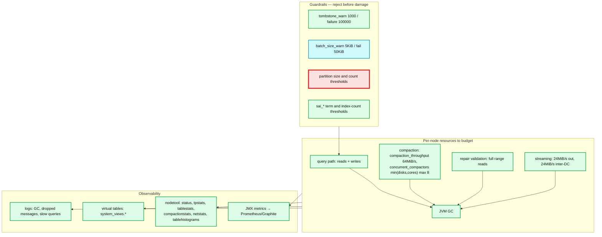
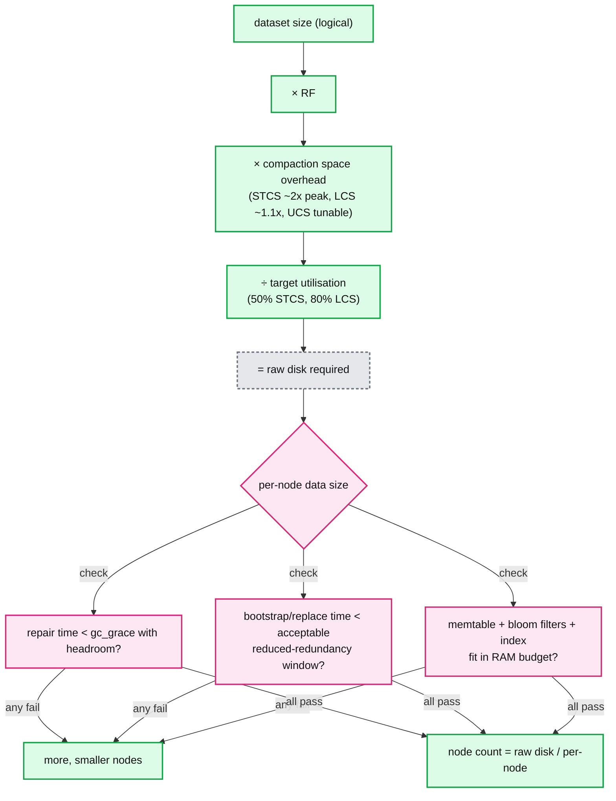
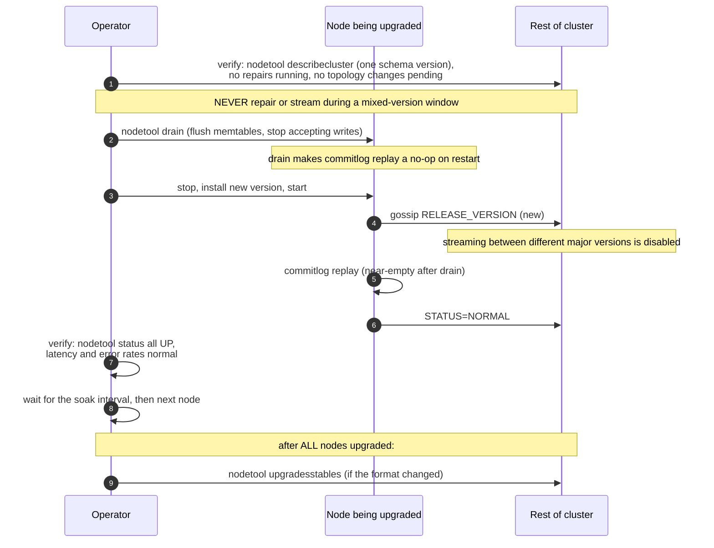
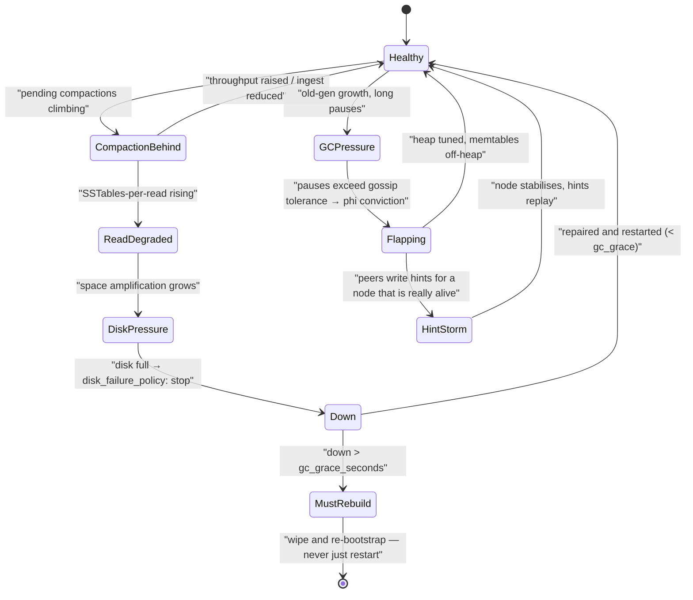

# Cassandra 10 — Scale and Operations

**Baseline: Apache Cassandra 5.0** (`cassandra-5.0` branch). Defaults verified in `conf/cassandra.yaml`.

---

<!-- nav:start -->
[← 09 TCM & Accord](cassandra-09-tcm-accord.md) · **[Index](README.md)** · [11 Version Matrix →](cassandra-11-delta-and-version-matrix.md)
<!-- nav:end -->

<!-- toc:start -->

<b>Sections in this report (12)</b>

- [1. Overview](#1-overview)
- [2. Architecture — the operational surface](#2-architecture--the-operational-surface)
- [3. Data flow — sizing a cluster](#3-data-flow--sizing-a-cluster)
- [4. Sequence — a rolling upgrade](#4-sequence--a-rolling-upgrade)
- [5. State machine — a node's operational health](#5-state-machine--a-nodes-operational-health)
- [6. Component deep dives](#6-component-deep-dives)
- [7. Guarantees](#7-guarantees)
- [8. Failure modes](#8-failure-modes)
- [9. Scalability & performance](#9-scalability--performance)
- [10. Trade-offs & alternatives](#10-trade-offs--alternatives)
- [11. Staff-level questions](#11-staff-level-questions)
- [12. Sources](#12-sources)

<!-- toc:end -->

## 1. Overview

- **What it is.** The operational envelope: node sizing, JVM, multi-DC, backup, monitoring, guardrails, and the failure modes that actually page you.
- **The central constraint.** Node density is not limited by storage or by read latency — it is limited by **repair and streaming time**. A node you cannot repair inside `gc_grace_seconds` (864000) or rebuild inside your redundancy budget is too big, however well it serves queries.
- **What 5.0 changes.** UCS (bounded SSTable size via sharding) + BTI (non-heap-resident index) + trie memtables (less GC) together raise the density ceiling — but all three are opt-in, so an out-of-the-box 5.0 node has the same envelope as 4.1.
- **The guardrails story.** 5.0 significantly expanded in-tree guardrails. They are the cheapest available protection against application-caused incidents and are underused.

---

## 2. Architecture — the operational surface

**What to notice**

- **Four workloads share one node and only one of them is the customer's.** Compaction, repair and streaming are not overhead to be minimised away — they are the mechanisms that make the data model work, and they must be given a budget explicitly.
- **`compaction_throughput: 64MiB/s` and `stream_throughput_outbound: 24MiB/s` are the two most commonly wrong defaults on modern hardware.** They are calibrated for spinning disks and 1 Gbps networking.
- **Virtual tables (`system_views.*`) are the modern replacement for much of `nodetool`** — queryable over CQL, so monitoring can use the same connection as the application. 5.0 added redaction of security-sensitive information in `system_views.settings`.
- **Guardrails reject the query rather than degrading the node.** This is the correct posture and the opposite of what most teams configure.

---

## 3. Data flow — sizing a cluster

**What to notice**

- **Recovery time is the binding constraint, and it is the one most sizing exercises omit.** Compute it explicitly: per-node bytes ÷ effective streaming throughput, then ask whether you can tolerate reduced redundancy for that long, twice, in a bad week.
- **Compaction headroom is strategy-dependent** and must be in the disk maths, not discovered later.
- **Bloom filters and indexes are a RAM tax proportional to *partition count*, not data size.** A node with billions of tiny partitions has a very different memory profile from one with the same bytes in fewer, larger partitions.
- **The answer to "can we have fewer, bigger nodes?" in 5.0 is "yes, if you enable UCS and BTI and can still repair them."** The features exist; the recovery arithmetic still governs.

---

## 4. Sequence — a rolling upgrade

**What to notice**

- **`nodetool drain` before every planned restart.** It flushes memtables so commitlog replay is trivial, cutting restart time from minutes to seconds. Skipping it is the most common cause of a "why is this node taking so long" upgrade.
- **No repair and no topology change during a mixed-version window.** Streaming between major versions is disabled, so repair cannot resolve differences and will fail or hang.
- **`upgradesstables` runs after the whole cluster is upgraded**, not per node, and it is a full rewrite of every SSTable — schedule it as a capacity event.
- **One node at a time, with a soak interval.** The soak is where you catch a regression before it is on 200 nodes.

---

## 5. State machine — a node's operational health

**What to notice**

- **`GCPressure → Flapping` is the classic Cassandra death spiral.** A long GC pause stops gossip, peers convict the node, they write hints, the node returns, hint replay adds load, which causes more GC. Breaking it needs heap work, not a restart.
- **`CompactionBehind` compounds silently.** Reads degrade before disk fills, so read latency is the early warning and disk is the late one.
- **`MustRebuild` is an absorbing state with respect to restarting.** Past gc_grace, starting the node resurrects deleted data cluster-wide.

---

## 6. Component deep dives

### 6.1 JVM and GC

- **Heap sizing**: the standard guidance is 8–16 GB for G1, and to stay **under ~31 GB** so compressed oops remain available. Give the remainder to the OS page cache — it is a better read cache than any heap structure.
- **`memtable_allocation_type: heap_buffers` is the default**; `offheap_objects` moves the dominant allocation source off heap and is the first thing to change on a write-heavy node.
- **5.0 supports JDK 17**, with reported gains up to ~20% attributed largely to improved GC **[doc — Apache announcement]**. JDK 11 remains supported.
- **What to monitor**: old-gen occupancy after collection (not pause time alone), promotion rate, and pause duration against `phi_convict_threshold` tolerance. A node convicted for GC is a node whose heap is wrong.

### 6.2 Multi-datacenter

- `NetworkTopologyStrategy` with per-DC RF; `GossipingPropertyFileSnitch` or a cloud snitch; **`LOCAL_QUORUM` for both reads and writes** as the default posture.
- **Cross-DC writes are one message per DC**, fanned out locally by a forwarding node — not RF messages per DC. This is what makes multi-DC affordable on WAN bandwidth.
- `internode_compression: dc` (the default) compresses cross-DC traffic but not intra-DC — usually correct, since intra-DC is cheap and CPU is not.
- **Adding a DC**: alter the keyspace RF, then `nodetool rebuild -- <source-dc>` on each new node, then repair. Rebuild does not reconcile; repair afterwards is mandatory.
- **A dedicated analytics DC** (Spark, different compaction, `LOCAL_ONE` reads) is the standard way to keep scan workloads off the serving DC.

### 6.3 Backup

- **`nodetool snapshot`** creates hard links to current SSTables — near-instant, zero extra space until compaction diverges the files. `auto_snapshot: true` (default) snapshots before `DROP` and `TRUNCATE`, which is a genuine footgun: dropped tables silently keep consuming disk until snapshots are cleared. `auto_snapshot_ttl: 30d` is available (commented).
- **`incremental_backups: false`** (default). When enabled, hard-links each new SSTable into `backups/` as it is flushed; combined with periodic snapshots this gives point-in-time-ish recovery. Nothing purges `backups/` — that is the operator's cron.
- **Snapshots are per node and not coordinated.** There is no cluster-consistent snapshot; restore is per-node plus a repair.
- **`snapshot_before_compaction: false`** — leave it off.

### 6.4 Guardrails (substantially expanded in 5.0)

| Guardrail | Default | Protects against |
|---|---|---|
| `tombstone_warn_threshold` / `tombstone_failure_threshold` | `1000` / `100000` | Graveyard scans taking the node down |
| `batch_size_warn_threshold` / `batch_size_fail_threshold` | `5KiB` / `50KiB` | Oversized batches |
| `unlogged_batch_across_partitions_warn_threshold` | `10` | Multi-partition batch anti-pattern |
| `sai_sstable_indexes_per_query_warn_threshold` | `32` | Index queries hitting too many SSTables |
| `sai_string_term_size_warn/fail` | `1KiB` / `8KiB` | Oversized index terms |
| `sai_vector_term_size_warn/fail` | `16KiB` / `32KiB` | Oversized embeddings |
| `materialized_views_enabled` | `false` | A feature that cannot guarantee consistency |
| `sasi_indexes_enabled` | `false` | A deprecated index |
| `drop_compact_storage_enabled` | `false` | Irreversible schema change |
| `transient_replication_enabled` | `false` | Experimental replication |

- 5.0 also added a **CIDR authorizer (CEP-33)** with `MONITOR` (log only) and `ENFORCE` modes, restricting role access by source IP range.

### 6.5 What to monitor, in priority order

1. **Client-visible**: p50/p99/p999 read and write latency, error rates by exception type (`Unavailable` vs `ReadTimeout` vs `WriteTimeout` — they mean different things, [report 02](cassandra-02-write-path.md)).
2. **Dropped messages** (`nodetool tpstats`) — every dropped mutation is a silently lost replica copy.
3. **Pending compactions** and **SSTables-per-read** — the leading indicator of read degradation.
4. **Repair completion vs `gc_grace_seconds`** — the only metric guarding against data resurrection, and the one almost nobody has on a dashboard.
5. **GC pause time and old-gen occupancy after collection.**
6. **Hint volume and hint expiry** — expired hints mean divergence repair must now fix.
7. **Disk utilisation against the strategy's headroom requirement.**

---

## 7. Guarantees

| Operational guarantee | Mechanism | Precondition |
|---|---|---|
| Zero-downtime rolling upgrade | One node at a time within RF tolerance | No repair or streaming in the mixed-version window |
| Zero-downtime node addition | Double-write from `STATUS=BOOT` | Exactly one bootstrap at a time (5.0) |
| Survive an AZ loss | Rack-aware NTS placement + `LOCAL_QUORUM` | Balanced racks, correct snitch |
| No data resurrection | Repair completes inside `gc_grace_seconds` | An actual repair schedule that provably completes |
| Fast restart | `nodetool drain` before stopping | Operator discipline |

---

## 8. Failure modes

| Failure | Detection | Recovery | Blast radius |
|---|---|---|---|
| GC death spiral | Long pauses → gossip flapping → hint storms | Heap tuning, `offheap_objects`, trie memtables; reduce per-node data | Node down, cluster p99 degraded |
| Disk full | `disk_failure_policy: stop` | Free space, `nodetool cleanup`, clear snapshots | Node out; RF−1 |
| Forgotten snapshots after DROP/TRUNCATE | Disk usage with no matching live data | `nodetool clearsnapshot`; set `auto_snapshot_ttl` | Silent disk exhaustion |
| Repair never completes | Repair duration vs gc_grace | Subrange repair, more parallelism, CEP-37 scheduler (5.0.8+) | Data resurrection |
| Hot partition | One replica set saturated; uneven `nodetool tablestats` | Remodel the partition key | That partition's replica set |
| Client timeouts shorter than server | Retry storms during a slow period | Align client > server timeouts | Self-inflicted overload |
| Clock skew | Silent | NTP monitoring as a first-class alert | Silent data loss |
| Wrong snitch after a topology change | Ownership shifts unexpectedly | Careful sequencing plus full repair | Potential data loss |

---

## 9. Scalability & performance

- **Cassandra scales linearly for partition-key-restricted operations and not at all for scans.** Every capacity conversation should start by classifying the workload on that axis.
- **The density ceiling in 5.0, with UCS + BTI + trie memtables enabled, is meaningfully higher than 4.1's** — vendors report it as the headline benefit **[doc, not independently verified]**. The recovery-time arithmetic is what should decide your number, not the vendor's.
- **Cluster size is limited by operational cost, not by the protocol.** Gossip scales; repair, streaming and mixed-version upgrade windows do not, linearly.
- **The highest-leverage tunings, in order**: correct compaction strategy per table; `chunk_length_in_kb` for small-row point reads; `offheap_objects`; raising streaming and compaction throughput from their spinning-disk defaults; token-aware, DC-aware driver configuration.

---

## 10. Trade-offs & alternatives

- **vs. a managed service (Astra, Instaclustr, Amazon Keyspaces).** The operational burden documented here is real and specialised. The counter-argument is that managed services differ from Apache in defaults and internals ([report 11](cassandra-11-delta-and-version-matrix.md)) and constrain the tuning that this report says matters most.
- **vs. ScyllaDB.** Removes the JVM and therefore the GC failure modes, with thread-per-core shard architecture. Materially better density and tail latency; smaller ecosystem and a migration cost.
- **vs. DynamoDB.** Zero operations, no repair, no compaction tuning, no capacity planning of this kind — at the cost of cost, lock-in, and the tuning surface disappearing exactly when you need it.
- **The honest framing for a build/buy decision.** Cassandra's operational cost is dominated by repair and by data modelling discipline. If you have the engineering capacity for both, it is superb. If you do not, the failure modes here are silent and correctness-affecting, not merely expensive.

---

## 11. Staff-level questions

1. **You are asked to cut cluster cost 40% by moving from 100 × 2 TB nodes to 40 × 5 TB nodes. What is your analysis?** Steady-state serving is probably fine with UCS and BTI enabled — bounded SSTable sizes and non-heap-resident indexes are precisely what make 5 TB nodes viable in 5.0. The analysis that decides it is recovery: at 5 TB per node and realistic streaming throughput, how long does a node replacement take, and can you tolerate reduced redundancy for that long? Does full repair complete cluster-wide inside `gc_grace_seconds` with room for a node being down for a day? What is the blast radius of one node failing — with 40 nodes each holding 2.5% of the data, a correlated double failure covers more of the token space than it did with 100. My answer would be conditional: yes, if streaming throughput is raised from the 24MiB/s default, repair is subrange-scheduled and measured, and we rehearse a node replacement at 5 TB before committing.

2. **A node has been flapping between UP and DOWN for an hour. Walk through diagnosis.** First distinguish GC from network: check the GC log for pauses approaching the gossip tolerance, and check whether the flapping correlates with compaction or repair activity on that node. If GC, look at old-gen occupancy after collection — a heap that never drops means a real leak or an oversized memtable pool, not a tuning issue. If not GC, check `phi_convict_threshold` (default 8) against network jitter; cloud environments often warrant 10–12. Also check whether the node is *receiving* a hint storm from a previous flap, which is self-sustaining. The immediate mitigation is often to raise the convict threshold to stop the oscillation while you fix the underlying heap or network problem; the wrong move is repeated restarts, which re-trigger the cycle.

3. **Why is "repair completion inside gc_grace" the metric almost nobody dashboards, and what would you put on the dashboard?** Because nothing fails when it is violated — the consequence is deleted data quietly returning, days or weeks later, indistinguishable from an application bug. There is no exception, no error rate, no latency signal. I would dashboard: time since the last successful full repair *per node* (not per cluster — a single node that has been missed is enough), that value as a fraction of `gc_grace_seconds` with alerting at 50%, and a periodic `nodetool repair -prv` preview measuring actual divergence so you know whether the schedule is working rather than merely running. The third one is the honest check; the first two are the leading indicator.

4. **Your team wants to lower `read_request_timeout` from 5000ms to 200ms to fail fast. Argue both sides.** For: 5 seconds is far beyond any user-facing latency budget, so a query that takes that long is already a failure that is consuming a server thread and a client connection. Failing fast frees resources and surfaces problems. Against: the timeout is also the window in which a slow-but-recovering replica succeeds, and blocking read repair ([report 05](cassandra-05-coordinator-consistency.md)) can legitimately push a read past 200ms when replicas are inconsistent — so a tight server timeout converts a consistency-repair event into a user-visible error. The resolution: keep the server timeout generous, set the *client* timeout to the user-facing budget with a token-aware retry to another coordinator, and ensure client timeout > server timeout is not violated in the other direction. The failure you are trying to prevent is better solved by speculative retry and the dynamic snitch than by the timeout.

5. **Design the observability for a new 200-node Cassandra platform, and say what you would alert on versus dashboard.** Alert on client-visible symptoms and on the two silent correctness risks: p99 latency and error rate by exception type; dropped mutations (a lost replica copy, always); time-since-successful-repair per node against gc_grace; and clock skew across nodes. Dashboard but do not page on: pending compactions, SSTables-per-read, GC pause and old-gen occupancy, hint volume and expiry, disk utilisation against strategy headroom, per-table read/write latency, and partition size distribution. The organising principle is that Cassandra's dangerous failures are silent and slow — repair debt, tombstone accumulation, clock drift — while its noisy failures are usually self-limiting. Most teams get this backwards and page on compaction backlog while nobody watches repair.

---

## 12. Sources

- `conf/cassandra.yaml`, `conf/jvm*.options`, `NEWS.txt` — [`apache/cassandra@cassandra-5.0`](https://github.com/apache/cassandra/tree/cassandra-5.0)
- `src/java/org/apache/cassandra/db/guardrails/Guardrails.java`
- [Cassandra docs — Operating](https://cassandra.apache.org/doc/latest/cassandra/managing/operating/)
- [CEP-33: CIDR filtering authorizer](https://cwiki.apache.org/confluence/display/CASSANDRA/CEP-33%3A+CIDR+filtering+authorizer)
- [Apache Cassandra 5.0 announcement](https://cassandra.apache.org/_/blog/Apache-Cassandra-5.0-Announcement.html) — JDK 17 and density claims

---

---

<!-- nav:start -->
[← 09 TCM & Accord](cassandra-09-tcm-accord.md) · **[Index](README.md)** · [11 Version Matrix →](cassandra-11-delta-and-version-matrix.md)
<!-- nav:end -->
