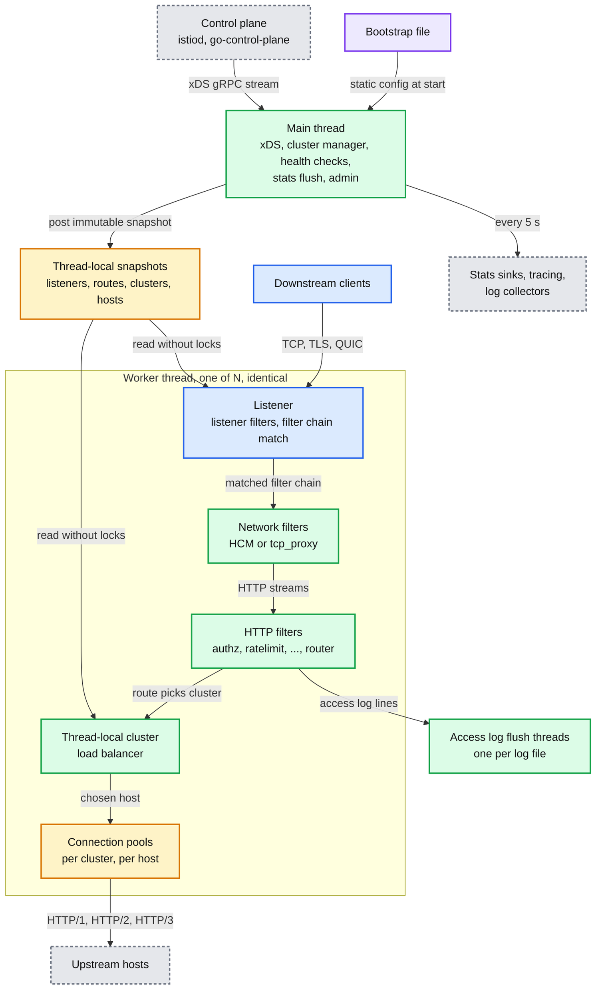
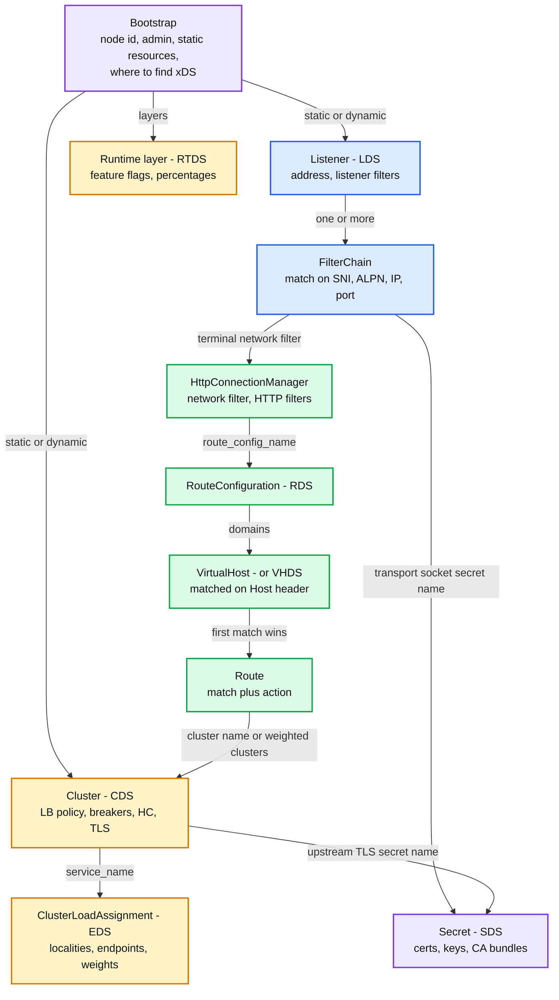
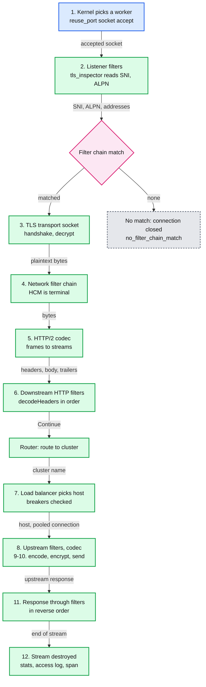
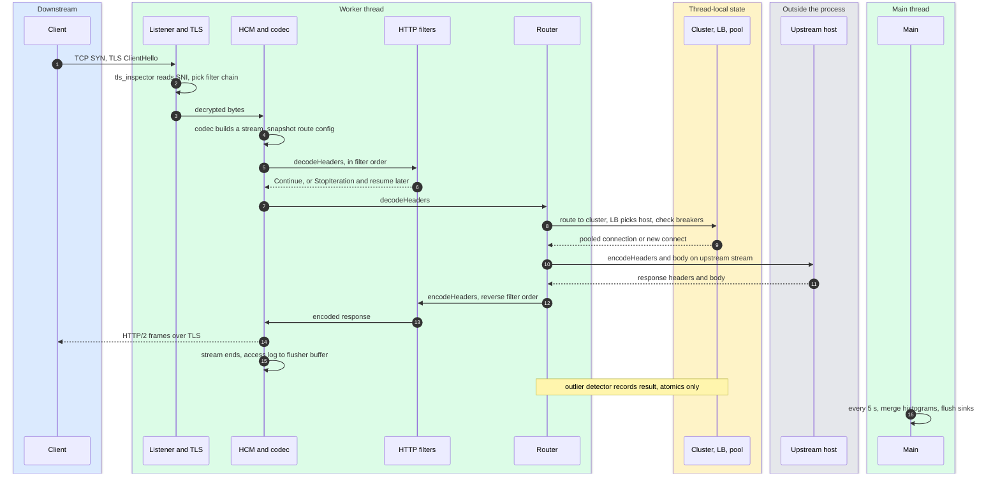
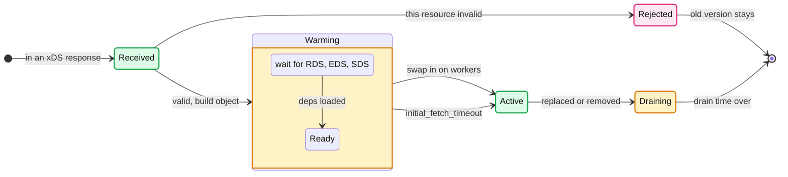
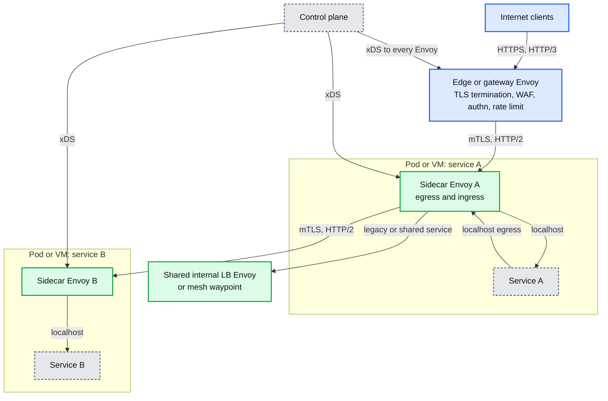

# Envoy 00: Overview and Reading Map

> **Scope**: what Envoy is, the five design bets everything else follows from, the configuration object model, the life of one request end to end, where Envoy runs and at what cost, and a reading map for reports 01 to 13.
>
> **Series baseline: Envoy v1.39.1** (released 2026-08-27). Defaults, field names and class names were read from that tag's source tree. **[documented]** = read in source or official docs of this release, or on the primary page cited. **[inferred]** = reasoning, not upstream text. **[unverified]** = could not be confirmed, do not quote. Version deltas and the errata of common folklore are in [report 10](envoy-10-version-delta.md). Read its errata before quoting a default in an interview: several numbers that circulate in blog posts are from the 2018 to 2021 era and are wrong for 1.39.

---

<!-- nav:start -->
← · **[Index](README.md)** · [01 Threading →](envoy-01-threading-and-process-model.md)
<!-- nav:end -->

<!-- toc:start -->

<b>Sections in this report (11)</b>

- [1. Overview](#1-overview)
- [2. Architecture](#2-architecture)
- [3. The configuration object model](#3-the-configuration-object-model)
- [4. Life of a request](#4-life-of-a-request)
- [5. State machine: a dynamic resource](#5-state-machine-a-dynamic-resource)
- [6. Where Envoy runs](#6-where-envoy-runs)
- [7. The series: what is in each report](#7-the-series-what-is-in-each-report)
- [8. Suggested reading order](#8-suggested-reading-order)
- [9. The ideas that generalise](#9-the-ideas-that-generalise)
- [10. Staff-level questions across the whole system](#10-staff-level-questions-across-the-whole-system)
- [11. Sources](#11-sources)

<!-- toc:end -->

## 1. Overview

- **Problem solved.** Envoy is an **out-of-process L3/L4 and L7 proxy** that runs next to every service (sidecar), at the edge, or as a shared gateway. It moves the network concerns every service needs (service discovery, load balancing, retries, timeouts, circuit breaking, TLS, rate limiting, stats, tracing) out of per-language libraries and into one binary that every language talks to over localhost. The original pitch, in Matt Klein's announcement: "The network should be transparent to applications. When network and application problems do occur it should be easy to determine the source of the problem." [documented, Lyft announcement 2016-09-14]
- **Design bet 1: out of process, not a library.** Klein had seen Finagle at Twitter, where "an update to Finagle might take months to fully rollout" even with nearly 100% of services on the JVM. Lyft had PHP, Python, Go and C++. A proxy is upgraded once per fleet and works for every language. The cost is an extra hop and an extra process per pod, which is the entire "sidecar tax" debate. [documented, Lyft CNCF post 2017-09-13]
- **Design bet 2: one process, shared-nothing worker threads.** A connection is accepted by one worker thread and stays on it for life. Configuration is built once on the main thread as an immutable snapshot and posted to every worker, which swaps a pointer. The hot path takes almost no locks. The cost: per-worker connection pools, imbalance with long-lived connections, and a single main thread that processes all configuration. [documented, threading_model.rst; [report 01](envoy-01-threading-and-process-model.md)]
- **Design bet 3: everything is a filter in a chain, at three layers.** Listener filters see the raw accepted socket. Network filters see bytes. HTTP filters see headers, body and trailers of one stream. The HTTP connection manager is itself just a network filter, and the router is just the last HTTP filter. Almost every feature is an extension registered by name and configured with a typed protobuf. [documented, life_of_a_request.rst]
- **Design bet 4: configuration is an API, and it is eventually consistent.** Listeners, routes, clusters, endpoints, secrets and runtime flags are resources served by a control plane over xDS (the family of discovery service gRPC APIs). Envoy ACKs or NACKs each response (a NACK still applies the valid resources in it), keeps the last accepted config if the control plane dies, and never blocks the data path on it. The cost: there is no atomic update across a fleet, or even across resource types without care. [documented, xds_protocol.rst; [report 06](envoy-06-xds-control-plane.md)]
- **Design bet 5: observability is a feature of the proxy, not of the app.** Every subsystem emits stats, every request ends in an access log line with a response flag that says *why* it failed (`UH`, `UF`, `UO`, `UT`, ...). Dropbox measured that its Lua-based stats collection on NGINX slowed the high-RPS test by 3x, and that Envoy "does not suffer from" it. [documented, dropbox.tech 2020-07-30]
- **Scale it operates at.** At open-source time Lyft ran Envoy "on thousands of nodes and over one hundred services, which in aggregate process over 2 million requests per second". Dropbox moved "tens of millions of open connections, millions of requests per second, and terabits of bandwidth" onto it. Istio measured one sidecar with 2 worker threads at about 0.20 vCPU and 60 MB for 1,000 requests per second of 1 KB payloads. [documented, sources in §7]

**The one-sentence version:** *Envoy is a pipeline of filters running on N independent event loops, fed by immutable configuration snapshots that a single main thread builds from a control plane's xDS stream, and it tells you in a stat and a response flag exactly where each request died.*

### Premise corrections up front

Five things most secondary writing about Envoy gets wrong for v1.39.1:

1. **"Envoy is a service mesh."** It is a data plane. A mesh is a control plane (Istio's istiod, Consul, Kuma, a homegrown one like Dropbox's) that turns platform state into xDS resources, plus a fleet of Envoys that apply them. Envoy knows nothing about Kubernetes. [documented, life_of_a_request.rst]
2. **"Hot restart hands live connections to the new process."** It hands over *listen sockets*, not connections. Existing connections drain in the old process for `--drain-time-s` (600 s) and whatever is left is closed at `--parent-shutdown-time-s` (900 s). [documented, [options_impl.cc:149-158](https://github.com/envoyproxy/envoy/blob/v1.39.1/source/server/options_impl.cc#L149-L158), hot_restart.rst]
3. **"`--concurrency` follows the container's CPU limit."** It defaults to `std::thread::hardware_concurrency()`, the host's hardware threads. A pod limited to 2 CPUs on a 64-thread node gets 64 workers unless you pass `--concurrency` or `--cpuset-threads`. The 1.37.0 release note says cgroup-aware sizing applies "when `--concurrency` is not set", but the code only takes that path when `--cpuset-threads` is also passed (a switch that defaults to false). With it, Envoy uses the minimum of hardware threads, CPU affinity and the cgroup CPU limit. [documented, [options_impl.cc:82-83](https://github.com/envoyproxy/envoy/blob/v1.39.1/source/server/options_impl.cc#L82-L83), [options_impl.cc:167-168, 271-281](https://github.com/envoyproxy/envoy/blob/v1.39.1/source/server/options_impl.cc#L271-L281), [options_impl_platform_linux.cc:44-70](https://github.com/envoyproxy/envoy/blob/v1.39.1/source/server/options_impl_platform_linux.cc#L44-L70), [changelogs/1.37.0.yaml:6](https://github.com/envoyproxy/envoy/blob/v1.39.1/changelogs/1.37.0.yaml#L6)]
4. **"HTTP/2 defaults are a 256 MiB stream window and unlimited streams."** In 1.39 the defaults are a **16 MiB** stream window, a **24 MiB** connection window and **1024** max concurrent streams. 2^31-1 is the maximum *allowed* value, not the default. [documented, [protocol.proto](https://github.com/envoyproxy/envoy/blob/v1.39.1/api/envoy/config/core/v3/protocol.proto)]
5. **"Envoy parses HTTP/1 with nodejs http-parser."** The HTTP/1 codec constructs QUICHE's **Balsa** parser. HTTP/2 is still **nghttp2** by default; oghttp2 sits behind a false runtime guard. [documented, [codec_impl.cc:537](https://github.com/envoyproxy/envoy/blob/v1.39.1/source/common/http/http1/codec_impl.cc#L537), [runtime_features.cc:276](https://github.com/envoyproxy/envoy/blob/v1.39.1/source/common/runtime/runtime_features.cc#L276)]

---

## 2. Architecture

**What to notice**

- **Two planes inside one process.** The main thread is Envoy's internal control plane: it talks xDS, runs active health checks and outlier-detection timers, flushes stats every 5 s ([bootstrap.proto:221](https://github.com/envoyproxy/envoy/blob/v1.39.1/api/envoy/config/bootstrap/v3/bootstrap.proto#L221)) and serves `/admin`. Workers are the data plane. They never talk to the control plane. [documented, threading_model.rst]
- **Workers are identical and independent.** Each worker has its own copy of every listener, its own load balancer instances and its own connection pools. A 16-worker Envoy talking to a 100-host cluster can hold 16 separate pools to each host. That is why upstream connection counts scale with `--concurrency`. [documented, [report 04](envoy-04-cluster-manager-and-load-balancing.md)]
- **The amber box is the trick.** Configuration crosses from main to workers only as immutable snapshots posted through thread-local storage slots. A worker reads its snapshot with an O(1) vector lookup and no lock. Old snapshots die when their last reference drops. This is read-copy-update in all but name. [documented, threading_model.rst; [report 01](envoy-01-threading-and-process-model.md)]
- **The HTTP connection manager is a network filter.** Everything HTTP happens inside one network filter. A `tcp_proxy` listener skips the HTTP layer entirely. The same listener, filter and cluster machinery serves Redis, MongoDB, Thrift and raw TCP. [documented, [report 02](envoy-02-listeners-and-network-filters.md)]
- **Logging never blocks a worker.** Access log writes go to an in-memory buffer that a dedicated `AccessLogFlush` thread (one per log file, [access_log_manager_impl.cc:229](https://github.com/envoyproxy/envoy/blob/v1.39.1/source/common/access_log/access_log_manager_impl.cc#L229)) writes out every 10 s or at 64 KB ([options_impl.cc:143-148](https://github.com/envoyproxy/envoy/blob/v1.39.1/source/server/options_impl.cc#L143-L148)). Blocking I/O on a worker would stall every connection pinned to it.

---

## 3. The configuration object model

Every Envoy config, static or dynamic, is the same graph of resources. Learning it once makes every config file, every `config_dump` and every Istio `EnvoyFilter` readable.

**What to notice**

- **References are by name, so resources can arrive out of order.** A listener can name a route config that has not arrived yet. Envoy handles that with **warming**: the listener exists but does not accept connections until its route config is loaded. Clusters warm until their first endpoints arrive. That is why the recommended update order is CDS, EDS, LDS, RDS (make before break). [documented, xds_protocol.rst; [report 06](envoy-06-xds-control-plane.md)]
- **The downstream half is blue, the upstream half is amber.** Listeners and filter chains describe *how traffic comes in*. Clusters and endpoints describe *where it goes*. Routes are the join. An interviewer's "how does Envoy decide where to send this?" is a walk down this graph.
- **Clusters are where the resilience policy lives.** Circuit breakers, outlier detection, health checks, connection pool settings and upstream TLS are properties of a cluster, not of a route. Retries and timeouts are properties of a route. Mixing these up is the most common config review finding. [inferred]
- **The same graph is Istio's output.** istiod turns Services, DestinationRules and VirtualServices into exactly these resources. `istioctl proxy-config listeners|routes|clusters|endpoints` is a viewer for this diagram. [inferred]

---

## 4. Life of a request

### 4.1 The twelve steps as a flow

**What to notice**

- **Nothing blocks.** A TLS handshake that needs more bytes, a filter waiting on an ext_authz RPC, a pool waiting for a connection: each one returns to the event loop and resumes on a later event. One worker interleaves thousands of streams. [documented, life_of_a_request.rst]
- **Route selection happens early and is cached.** The HCM picks a route when headers arrive. Filters that change headers must clear the route cache to get a new decision. The router filter finalizes it. [documented, life_of_a_request.rst; [report 03](envoy-03-http-connection-manager-and-routing.md)]
- **Filters run in order on the way in and in reverse on the way out.** The router is always last on the request path, so it is the first encoder filter on the response path.
- **Stats are updated in place but flushed later.** Step 12 bumps counters and histograms on the worker. Sinks see them at the next 5 s flush from the main thread.

### 4.2 The sequence to draw from memory

**What to notice**

- **The main thread never sees the request.** It appears only at the end, flushing stats that workers wrote. Outlier detection results are recorded on the worker and evaluated on the main thread's interval timer. [documented, [report 05](envoy-05-resilience.md)]
- **The upstream connection belongs to this worker.** A connection pool is per worker, so step 9 reuses an HTTP/2 connection only if *this* worker already opened one to that host.
- **A stream sees one route config for its whole life**, even if RDS delivers a new one mid-request. New streams get the new snapshot. [documented, [report 03](envoy-03-http-connection-manager-and-routing.md)]

---

## 5. State machine: a dynamic resource

Listeners, clusters and route configs all follow the same shape when they arrive over xDS. This is the lifecycle to have in your head when someone asks "what happens when I push a config change?".

**What to notice**

- **ACK and NACK are per response, but apply is per resource.** CDS and LDS walk the response, apply every resource that is valid, skip the invalid ones (which keep their previous version), and then NACK the whole response with the errors in `error_detail` if anything failed. So a NACK does *not* mean nothing changed, and an ACK means "valid, and I intend to apply it", not "applied" (xds_protocol.rst says exactly this). [documented, [cds_api_helper.cc](https://github.com/envoyproxy/envoy/blob/v1.39.1/source/common/upstream/cds_api_helper.cc#L38-L75), [lds_api.cc](https://github.com/envoyproxy/envoy/blob/v1.39.1/source/common/listener_manager/lds_api.cc#L100-L125), [xds_protocol.rst:436-450](https://github.com/envoyproxy/envoy/blob/v1.39.1/docs/root/api-docs/xds_protocol.rst#L436-L450)]
- **A NACK is not an outage, it is staleness.** The rejected resources stay on their previous version. A fleet that NACKs one cluster for an hour serves hour-old config for that cluster while everything else moves on, which is a partial, mixed state. Alert on `update_rejected`. [documented, [report 06](envoy-06-xds-control-plane.md)]
- **Warming has a timeout.** If a dependency never arrives, `initial_fetch_timeout` (15 s, [config_source.proto:246](https://github.com/envoyproxy/envoy/blob/v1.39.1/api/envoy/config/core/v3/config_source.proto#L246)) lets initialization proceed without it. A listener that activates without its routes serves 404s.
- **Old versions drain, they are not killed.** A replaced listener stops accepting and drains its connections. HTTP/2 connections get a GOAWAY and 5 s of grace ([hcm.proto:665](https://github.com/envoyproxy/envoy/blob/v1.39.1/api/envoy/extensions/filters/network/http_connection_manager/v3/http_connection_manager.proto#L665)). Listener drain uses `--drain-time-s`. [documented, [report 09](envoy-09-operations-and-deployment.md)]

---

## 6. Where Envoy runs

### 6.1 Topologies

- **Sidecar mesh**: two Envoys per service-to-service call (client egress, server ingress). Every hop is observable and mTLS-capable. The cost is two extra proxy traversals and one proxy process per pod. [documented, service_to_service.rst]
- **Edge / front proxy / gateway**: one Envoy tier terminates TLS and HTTP/3 and applies authn, rate limits and routing. Envoy Gateway is the project's own Kubernetes Gateway API implementation (v1.9.1, 2026-08-28). [documented, front_proxy.rst; GitHub releases]
- **Waypoint (Istio ambient mode)**: L4 mTLS moves to a per-node Rust proxy (ztunnel, not Envoy), and Envoy runs only where L7 policy is needed. Istio's own 1.24 numbers: ztunnel about 0.06 vCPU and 12 MB, a waypoint about 0.25 vCPU and 60 MB, a sidecar about 0.20 vCPU and 60 MB, each at 1,000 RPS of 1 KB. [documented, istio.io performance page]

### 6.2 History in six dates

| Date | Event | Source |
|---|---|---|
| May 2015 | Matt Klein joins Lyft, development starts. Lyft had about 30 services and "most developers were afraid to have high volume service calls in critical paths" | Lyft posts (Wayback) |
| early Sep 2015 | MVP deployed, first as Lyft's edge proxy, then as the service-to-service sidecar | Lyft CNCF post |
| early summer 2016 | Fully deployed at Lyft: mesh of 100+ services, millions of RPS | Lyft CNCF post |
| 2016-09-14 | Open sourced. "Thousands of nodes and over one hundred services ... over 2 million requests per second" | Lyft announcement |
| 2017-09-13 | Joins CNCF as its 11th hosted project, 78 contributors from at least 10 organizations | Lyft CNCF post |
| 2018-11-28 | Graduates from CNCF, the third project after Kubernetes and Prometheus, nearly 250 contributors | CNCF announcement |

### 6.3 Who replaced what, and why (primary sources only)

| Who | Replaced | Why, in their words | Result |
|---|---|---|---|
| Lyft (origin) | Amazon ELBs, per-language libraries, some HAProxy | Network failures were impossible to localize. "Physical network? Virtual network? Hardware? App? Who knew?" | Developers "are no longer scared to have service to service dependencies in high volume paths" |
| Dropbox (2020) | NGINX with Lua-based dynamic config and stats | Static Jinja/YAML config needing full redeploys, Lua stats mutex, event loop stalls on file I/O raising tail latency | "Release up to 60% of servers previously exclusively occupied by Nginx"; own Go xDS control plane |
| Slack (2019 to 2021) | HAProxy for websockets and ingress | Endpoint changes meant reloads. Old HAProxy processes lingered for hours holding long-lived websockets | Dynamic clusters and endpoints without reloads; panic routing helped during the 2021-01-04 outage |

Rows for other adopters are omitted on purpose. CNCF lists many companies as users, but without their own posts there are no numbers worth quoting.

### 6.4 The ecosystem on top, as of 2026-09-24

| Project | Relationship to Envoy | Status checked |
|---|---|---|
| Istio | Sidecar mode runs Envoy per pod. Ambient mode uses ztunnel (Rust) for L4 and Envoy waypoints for L7 | 1.31.1, 2026-09-21 |
| Envoy Gateway | Kubernetes Gateway API implementation from the Envoy project | 1.9.1, 2026-08-28 |
| Agent Router (formerly Envoy AI Gateway) | LLM and MCP traffic router built on Envoy Gateway. Now an Agentic AI Foundation project | 1.1.0, 2026-08-21 |
| Emissary-ingress, Contour, Gloo, Kuma, Consul | Ingress controllers and meshes that generate xDS for Envoy | not version-checked |
| gRPC proxyless | gRPC libraries consume xDS directly, no Envoy in the path | see [report 06](envoy-06-xds-control-plane.md) |
| AWS App Mesh | Managed Envoy mesh. AWS announced end of support on 2026-09-30 | [doc], AWS containers blog |

The v1.39.1 tree itself shows where the project is heading: new HTTP filters named `mcp`, `mcp_router`, `mcp_json_rest_bridge`, `a2a` and `ai_protocol_manager`, and `dynamic_modules` hooks at almost every extension point. [documented, `source/extensions/`; [report 10](envoy-10-version-delta.md)]

---

## 7. The series: what is in each report

| # | Report | Covers | Read it when you need to reason about |
|---|---|---|---|
| 01 | [`envoy-01-threading-and-process-model.md`](envoy-01-threading-and-process-model.md) | Main, worker, flusher and guard-dog threads, the libevent Dispatcher, thread-local storage slots and snapshot propagation, reuse_port and connection balancing, deferred deletion, runtime, watchdog, allocator, io_uring | CPU sizing, worker imbalance, config propagation delay, why a config push stalls stats |
| 02 | [`envoy-02-listeners-and-network-filters.md`](envoy-02-listeners-and-network-filters.md) | Listener manager and lifecycle, listener filters, filter chain matching, network filter mechanics, L4 buffers and watermarks, TLS transport sockets, tcp_proxy, L4 protocol proxies, UDP and QUIC listeners | SNI routing, TLS passthrough, `no_filter_chain_match`, L4 proxying, listener updates |
| 03 | [`envoy-03-http-connection-manager-and-routing.md`](envoy-03-http-connection-manager-and-routing.md) | HCM, HTTP/1, HTTP/2 and HTTP/3 codecs, filter manager iteration and statuses, flow control, header handling, HCM timeouts, upgrades, route matching, the router filter, mirroring, internal redirects | Any L7 behaviour question, filter ordering, 404 vs 503, header trust |
| 04 | [`envoy-04-cluster-manager-and-load-balancing.md`](envoy-04-cluster-manager-and-load-balancing.md) | Cluster manager init and warming, discovery types, DNS, connection pools, every LB algorithm, priorities, panic threshold, locality and zone-aware routing, subsets, slow start, ORCA | Load skew, connection counts, failover between zones or regions, consistent hashing |
| 05 | [`envoy-05-resilience.md`](envoy-05-resilience.md) | Active health checks, outlier detection math, circuit breakers and retry budgets, the timeout matrix, retries and hedging, global and local rate limits, adaptive concurrency, admission control, overload manager, response flags | Retry storms, cascading failure, 503 triage, protecting a backend |
| 06 | [`envoy-06-xds-control-plane.md`](envoy-06-xds-control-plane.md) | xDS resource types, SotW vs delta, ADS, ACK/NACK, warming and init order, on-demand discovery, xDS-TP and federation, SDS/RTDS/ECDS/LRS/CSDS, control planes, failure behaviour | Designing or debugging a control plane, config rollout safety, fleet-wide consistency |
| 07 | [`envoy-07-security.md`](envoy-07-security.md) | Threat model, TLS and mTLS, SPIFFE identity, SDS rotation, RBAC, ext_authz, JWT, OAuth2, header trust, path normalization, smuggling and HTTP/2 flood defenses, CVE lessons | Zero-trust designs, authn/authz placement, edge hardening |
| 08 | [`envoy-08-observability-and-extensibility.md`](envoy-08-observability-and-extensibility.md) | Stats internals, admin API, access logs, tracing, the extension registry, Lua, Wasm, ext_proc, Golang, dynamic modules, the matcher API | Stats memory and cardinality, custom logic placement, extension trade-offs |
| 09 | [`envoy-09-operations-and-deployment.md`](envoy-09-operations-and-deployment.md) | Topologies, hot restart and draining, validation, resource envelope and tuning, what to page on, runbooks by response flag, sidecar cost, migrations | Running Envoy in production, incident triage, capacity planning |
| 10 | [`envoy-10-version-delta.md`](envoy-10-version-delta.md) | Release process and support window, per-release changes 1.30 to 1.39, default changes, runtime guard lifecycle, extension maturity, errata, upgrade playbook | Before quoting any default, and before any upgrade |
| 11 | [`envoy-11-dynamic-modules.md`](envoy-11-dynamic-modules.md) | Native extensions over a C ABI: loader, ABI conventions, every extension point, lifecycle and threading, FFI safety, Rust/Go/C++ SDKs, ABI compatibility policy, trade-offs vs Wasm, Lua, ext_proc | Extending Envoy without a fork, and the extensibility debate |
| 12 | [`envoy-12-mcp-and-ai-gateway.md`](envoy-12-mcp-and-ai-gateway.md) | MCP, A2A and AI protocol filters: `mcp`, `mcp_router`, JSON-REST bridge, `a2a`, `ai_protocol_manager`, `mcp_multicluster`, and what the stateless MCP 2026-07-28 revision changes | Building an MCP or LLM gateway on Envoy |
| 13 | [`envoy-13-newer-traffic-features.md`](envoy-13-newer-traffic-features.md) | Reverse tunnels, composite clusters, RBAC matcher work, ext_authz evolution, tcp_proxy tunneling, Hickory DNS, CPU pinning and sockmap, TLS and QUIC additions | Recent Envoy features most write-ups have not caught up with |
| - | [`interviewer-prep.md`](interviewer-prep.md) | Prep for an interview with an Envoy senior maintainer: their systems, verified corrections, the extensibility opinion, landmines, question bank | The day before that interview |
| - | [`patterns.md`](patterns.md) | The Envoy ideas that generalise, cross-linked to the Kafka, Kubernetes and Cassandra series | Comparing designs across systems in an interview |

---

## 8. Suggested reading order

1. **This file, then [03](envoy-03-http-connection-manager-and-routing.md).** The HTTP connection manager, filter chain and router are what 90% of Envoy questions are about. If you can draw §4.2 above and the filter iteration diagrams in 03, you can answer most L7 questions.
2. **[04](envoy-04-cluster-manager-and-load-balancing.md) and [05](envoy-05-resilience.md) together.** Load balancing decides where a request goes. Resilience decides whether it goes at all, and what happens when it fails. They share the host health model.
3. **[01](envoy-01-threading-and-process-model.md).** Short to state, deep to understand. It explains every "why is this per worker?" answer in 04 and 05.
4. **[06](envoy-06-xds-control-plane.md).** Needed the moment the interview is about a mesh or a gateway control plane rather than a single proxy.
5. **[02](envoy-02-listeners-and-network-filters.md) and [07](envoy-07-security.md).** L4, TLS and the security model.
6. **[08](envoy-08-observability-and-extensibility.md) and [09](envoy-09-operations-and-deployment.md)** when the question turns to running it or extending it.
7. **[10](envoy-10-version-delta.md)** last, then keep it open whenever you quote a number.

---

## 9. The ideas that generalise

- **Move shared infrastructure out of process when you have many languages or slow library rollouts.** Envoy exists because a Finagle upgrade took months at Twitter. The general rule: if the cost of shipping a library change across N services exceeds the cost of one more hop, put it in a sidecar or a gateway. Proxyless gRPC and Istio ambient are the same trade made the other way.
- **Shared-nothing workers plus immutable snapshots beat fine-grained locking.** Each worker owns its connections. Config is built once, frozen, and swapped by pointer. The same idea appears as Kubernetes informer caches and Kafka's metadata image: readers never lock, writers publish whole versions.
- **The control plane publishes desired state, the data plane converges and reports.** xDS with ACK/NACK is the same pattern as Kubernetes controllers and Kafka's KRaft observers. It buys independence (the data plane keeps working when the control plane dies) at the price of eventual consistency and staleness that must be monitored.
- **Make before break.** Warm the new thing before you route to it, drain the old thing after. Listener warming, cluster warming, hot restart socket handover and the CDS, EDS, LDS, RDS order are one rule applied four times.
- **Every rejection needs a name.** Response flags turn "503" into "no healthy upstream" (`UH`) vs "circuit breaker overflow" (`UO`) vs "upstream connect failure" (`UF`). Any system that sheds load should say *which* limit shed it.
- **Budgets beat counts for retries.** A fixed `max_retries` of 3 per cluster is too many for a small cluster and too few for a big one. A retry budget (20% of active requests, minimum 3) scales with load and caps amplification. The same thinking applies to client-side throttling and admission control.
- **Passive and active health signals are complementary.** Active checks catch a dead host with no traffic. Outlier detection catches a host that passes `/healthz` but fails real requests. Panic mode exists because both can be wrong at once.

---

## 10. Staff-level questions across the whole system

1. **Your sidecar Envoys run with 2 CPUs per pod on 64-core nodes. Upstream services report 30x more connections than expected and p99 latency jumped after the mesh rollout. Explain it.**
   `--concurrency` defaults to `std::thread::hardware_concurrency()`, so each sidecar started 64 workers, not 2. Connection pools are per worker, per upstream host, so every sidecar can open up to 64 connections to each upstream host instead of 2. Upstreams now carry thousands of mostly idle connections, each holding buffers and TLS state. HTTP/2 multiplexing gets worse because traffic is spread thin across 64 pools, so each connection carries fewer streams and there are more cold connections. Meanwhile 64 workers compete for 2 CPUs of cgroup quota and hit CFS throttling, which shows up as tail latency. The fix is `--concurrency 2` (or `--cpuset-threads` where the cpuset is set). Verify with `server.concurrency` and the upstream `upstream_cx_active` gauge per host.

2. **The control plane is down for 30 minutes. What keeps working, what degrades, and what breaks?**
   Traffic keeps flowing on the last accepted configuration. Envoy never blocks the data path on xDS. Active health checks and outlier detection keep running locally, so dead hosts still get ejected, but new hosts never appear. Scale-ups are invisible and scale-downs leave stale endpoints that health checks must catch. Certificates delivered by SDS keep working until they expire, which is the real deadline: with 24-hour workload certs, a long outage turns into a mesh-wide mTLS failure. A restarted Envoy is the worst case. It has only its bootstrap, waits `initial_fetch_timeout` (15 s) per resource type, then starts with nothing dynamic. The Staff answer adds mitigations: control plane replicas across zones, long enough cert lifetimes to outlive a control plane outage, no restarts during an incident, and the xDS resource caching extension points where available.

3. **A retry policy of 3 retries on 5xx was added to every route. During a partial outage of one backend, its load tripled and it fell over completely. What happened and what should the policy be?**
   Retry amplification. Each failed request became up to 4 attempts, and in a deep call graph the multiplier compounds per layer (4 x 4 x 4 = 64 at three layers). The cluster circuit breaker `max_retries` defaults to 3 concurrent retries per cluster, which is a count, not a ratio. It is too low for a big service and still allows amplification on a small one. The fix: retry only at one layer (usually the edge or the caller closest to the user), use a retry budget (`budget_percent` 20%, `min_retry_concurrency` 3), retry only idempotent requests and only on `reset`, `connect-failure` and `refused-stream` where safe, use `previous_hosts` so a retry goes to a different host, and keep the jittered back-off (25 ms base, 250 ms max). Outlier detection should eject the bad hosts so retries stop hitting them. Watch `upstream_rq_retry_overflow` and `upstream_rq_retry` as the leading signals.

4. **Why does Envoy build a separate load balancer and connection pool per worker instead of sharing one per process? What does it cost?**
   Sharing would mean a lock or atomic on every pick and every pool checkout, on the hottest path in the proxy, contended by every worker. Per-worker structures make the pick lock-free and cache-local. Membership changes update each worker's LB in place through priority-set callbacks rather than recreating it. Ring hash and Maglev are the one refinement: their table is expensive, so the main thread builds it once and workers share it read-only (`ThreadAwareLoadBalancerBase`). The costs are real. Upstream connection count scales with worker count. Least-request picks use only this worker's view of active requests, so the global balance is approximate. Each worker's round robin starts independently, so small clusters see correlated picks. Circuit breakers are the exception: they must be cluster-wide to mean anything, so they are shared counters with atomics, and they can be exceeded briefly because checks and increments are not one atomic step. The interview point: Envoy chose per-worker precision loss over cross-core contention, and made an explicit exception only where a global limit is the whole point.

5. **You are migrating a 2,000-service fleet from NGINX with static configs to Envoy with a control plane. What is the plan, and what do you refuse to build?**
   Build the control plane first as a translator from existing sources of truth (service discovery, cert issuance, route definitions) into xDS. Dropbox built theirs in Go, the same shape. Stand Envoy up next to NGINX on the same hosts, shadow a slice of traffic, and diff responses, status codes and latency histograms. Cut over by weighted DNS or LB weights per service, lowest-risk tiers first, with instant rollback to NGINX. Parity-test the features that differ most: header normalization, path handling, timeouts (Envoy's route timeout is 15 s by default, NGINX's proxy timeouts differ), and retry behaviour. Refuse to build per-service hand-written Envoy YAML, a custom Envoy fork, and Lua-heavy logic that recreates the NGINX sprawl. Use typed filters and a control plane instead. Operability: page on 5xx by response flag, `update_rejected` on xDS, and cert expiry. Cost: Dropbox reported freeing up to 60% of the servers NGINX had used, but the control plane is a new tier-0 service with its own on-call.

---

## 11. Sources

**In-tree (tag v1.39.1)**
- [docs/root/intro/life_of_a_request.rst](https://github.com/envoyproxy/envoy/blob/v1.39.1/docs/root/intro/life_of_a_request.rst)
- [docs/root/intro/arch_overview/intro/threading_model.rst](https://github.com/envoyproxy/envoy/blob/v1.39.1/docs/root/intro/arch_overview/intro/threading_model.rst)
- [docs/root/intro/arch_overview/operations/hot_restart.rst](https://github.com/envoyproxy/envoy/blob/v1.39.1/docs/root/intro/arch_overview/operations/hot_restart.rst)
- [docs/root/api-docs/xds_protocol.rst](https://github.com/envoyproxy/envoy/blob/v1.39.1/docs/root/api-docs/xds_protocol.rst)
- [source/server/options_impl.cc](https://github.com/envoyproxy/envoy/blob/v1.39.1/source/server/options_impl.cc)
- [api/envoy/config/core/v3/protocol.proto](https://github.com/envoyproxy/envoy/blob/v1.39.1/api/envoy/config/core/v3/protocol.proto)
- [source/common/http/http1/codec_impl.cc](https://github.com/envoyproxy/envoy/blob/v1.39.1/source/common/http/http1/codec_impl.cc), [source/common/runtime/runtime_features.cc](https://github.com/envoyproxy/envoy/blob/v1.39.1/source/common/runtime/runtime_features.cc)

**External (primary pages, fetched 2026-09-24)**
- Matt Klein, "Announcing Envoy: C++ L7 proxy and communication bus", Lyft Engineering, 2016-09-14. https://eng.lyft.com/announcing-envoy-c-l7-proxy-and-communication-bus-92520b6c8191 (read via the Wayback Machine, Medium blocks fetch tools)
- Matt Klein, "Envoy joins the CNCF", Lyft Engineering, 2017-09-13. https://eng.lyft.com/envoy-joins-the-cncf-dc18baefbc22 (Wayback)
- CNCF, "Cloud Native Computing Foundation announces Envoy Graduation", 2018-11-28. https://www.cncf.io/announcements/2018/11/28/cncf-announces-envoy-graduation/
- Dropbox, "How we migrated Dropbox from Nginx to Envoy", 2020-07-30. https://dropbox.tech/infrastructure/how-we-migrated-dropbox-from-nginx-to-envoy
- Slack, "Migrating Millions of Concurrent Websockets to Envoy", 2021-03-15. https://slack.engineering/migrating-millions-of-concurrent-websockets-to-envoy/
- Istio, "Performance and Scalability" (Istio 1.24 summary). https://istio.io/latest/docs/ops/deployment/performance-and-scalability/
- Envoy security advisory GHSA-jhv4-f7mr-xx76 (HTTP/2 Rapid Reset). https://github.com/envoyproxy/envoy/security/advisories/GHSA-jhv4-f7mr-xx76
- GitHub releases API for envoyproxy/envoy, envoyproxy/gateway, istio/istio, theagentrouter/agent-router (checked 2026-09-24)
- AWS, "Migrating from AWS App Mesh to Amazon ECS Service Connect" (end-of-support date). https://aws.amazon.com/blogs/containers/migrating-from-aws-app-mesh-to-amazon-ecs-service-connect/ [doc, not re-fetched]
- Per-subsystem sources are listed in each report's final section.

---

<!-- nav:start -->
← · **[Index](README.md)** · [01 Threading →](envoy-01-threading-and-process-model.md)
<!-- nav:end -->
