# Envoy 01: Threading and Process Model

> **Scope**: which thread runs what inside one Envoy process, how the main thread publishes configuration to workers without locks (dispatchers, thread-local storage slots, read-copy-update snapshots), how connections are spread across workers, and the process-level machinery around it (runtime, watchdog, allocator, io_uring, `--concurrency`). Listener internals are in [report 02](envoy-02-listeners-and-network-filters.md), the full stats story in [report 08](envoy-08-observability-and-extensibility.md), hot restart in [report 09](envoy-09-operations-and-deployment.md).
>
> **Series baseline: Envoy v1.39.1** (released 2026-08-27). Defaults, field names and
> class names were read from that tag's source tree. **[documented]** = read in source or
> official docs of this release. **[inferred]** = reasoning, not upstream text.
> **[unverified]** = could not be confirmed, do not quote.

---

<!-- nav:start -->
[← 00 Overview](envoy-00-overview.md) · **[Index](README.md)** · [02 Listeners →](envoy-02-listeners-and-network-filters.md)
<!-- nav:end -->

<!-- toc:start -->

<b>Sections in this report (13)</b>

- [1. Overview](#1-overview)
- [2. Architecture](#2-architecture)
- [3. Data flow](#3-data-flow)
- [4. Sequences](#4-sequences)
- [5. State machines](#5-state-machines)
- [6. Component deep dives](#6-component-deep-dives)
- [7. Failure modes](#7-failure-modes)
- [8. Scalability and performance](#8-scalability-and-performance)
- [9. Trade-offs and alternatives](#9-trade-offs-and-alternatives)
- [10. Config reference](#10-config-reference)
- [11. Stats cheat-sheet](#11-stats-cheat-sheet)
- [12. Staff-level questions](#12-staff-level-questions)
- [13. Sources](#13-sources)

<!-- toc:end -->

## 1. Overview

- **The problem**: a proxy must push tens of thousands of connections through a handful of cores, while also receiving a constant stream of configuration (routes, clusters, endpoints, certificates) from a control plane. If the data path takes a lock to read config, every request pays for every config change.
- **Design bet 1: one process, one event loop per thread, no work stealing.** The main thread and each of `--concurrency` workers run an `Event::DispatcherImpl` over libevent. A connection is accepted by one worker and lives on that worker until it closes **[documented]** ([threading_model.rst](https://github.com/envoyproxy/envoy/blob/v1.39.1/docs/root/intro/arch_overview/intro/threading_model.rst)).
- **Design bet 2: the main thread owns all mutable config.** xDS (the family of discovery service APIs), health checks, DNS, stats flush and admin all run on the main thread. Workers never parse config.
- **Design bet 3: publish immutable snapshots, not shared mutable state.** The main thread builds a new object, wraps it in a `shared_ptr`, and posts a closure to every worker that swaps a pointer in a thread-local storage slot. Old snapshots die when the last reference drops. This is read-copy-update (RCU) built from `shared_ptr` and a mailbox.
- **Design bet 4: a few things are deliberately shared.** Stats counters, circuit breaker counts and host health flags are atomics shared by all workers, because splitting them per worker would make limits and dashboards wrong.
- **Design bet 5: let the kernel balance.** With `SO_REUSEPORT` each worker has its own listen socket and the kernel hashes new connections across them. Envoy only rebalances if you ask.

**One sentence: Envoy is N+1 single-threaded event loops that share almost nothing, where the main thread computes new immutable config and mails a pointer to each worker.**

### Premise corrections up front

| Commonly said | What v1.39.1 actually does |
|---|---|
| "Since 1.37 Envoy sizes workers from the container CPU limit" | Only with `--cpuset-threads`. The default `--concurrency` is `std::thread::hardware_concurrency()` ([options_impl.cc:82](https://github.com/envoyproxy/envoy/blob/v1.39.1/source/server/options_impl.cc#L82)). The cgroup-aware `getCpuCount()` is reached only inside `if (!concurrency.isSet() && cpuset_threads_)` ([options_impl.cc:271](https://github.com/envoyproxy/envoy/blob/v1.39.1/source/server/options_impl.cc#L271)), even though the [1.37.0 changelog](https://github.com/envoyproxy/envoy/blob/v1.39.1/changelogs/1.37.0.yaml#L4) says "when `--concurrency` is not set" **[documented]** |
| "There is one file flusher thread" (threading_model.rst) | One `AccessLogFlush` thread **per distinct log file path**, created lazily on first write ([access_log_manager_impl.cc:229](https://github.com/envoyproxy/envoy/blob/v1.39.1/source/common/access_log/access_log_manager_impl.cc#L229)) |
| "Main and worker loops use `RunUntilExit`" (threading_model.rst) | Both call `run(RunType::Block)` ([server.cc:1087](https://github.com/envoyproxy/envoy/blob/v1.39.1/source/server/server.cc#L1087), [worker_impl.cc:179](https://github.com/envoyproxy/envoy/blob/v1.39.1/source/server/worker_impl.cc#L179)). Only the guard dog uses `RunUntilExit` ([guarddog_impl.cc:234](https://github.com/envoyproxy/envoy/blob/v1.39.1/source/server/guarddog_impl.cc#L234)) |
| "Envoy links gperftools tcmalloc" | On Linux x86_64 and aarch64 the default is **Google tcmalloc** (`@tcmalloc//tcmalloc`). gperftools is the fallback for other platforms; macOS builds disable tcmalloc ([bazel/BUILD:1059](https://github.com/envoyproxy/envoy/blob/v1.39.1/bazel/BUILD#L1059), [.bazelrc:107](https://github.com/envoyproxy/envoy/blob/v1.39.1/.bazelrc#L107)) |
| "Each worker health checks and ejects hosts" | Health check timers are created on the **main** dispatcher ([http/health_checker_impl.cc:61](https://github.com/envoyproxy/envoy/blob/v1.39.1/source/extensions/health_checkers/http/health_checker_impl.cc#L61)). Outlier errors are counted on workers with atomics, but the ejection decision is posted to the main thread ([outlier_detection_impl.cc:606](https://github.com/envoyproxy/envoy/blob/v1.39.1/source/common/upstream/outlier_detection_impl.cc#L606)) |
| "Circuit breakers are per worker" | One `ResourceManagerImpl` per cluster and priority, shared by all workers through atomics, which "can temporarily go above the supplied maximums" ([resource_manager_impl.h:82](https://github.com/envoyproxy/envoy/blob/v1.39.1/source/common/upstream/resource_manager_impl.h#L82)) |
| "Exact balance is the only balancer" | 1.39.0 added `cpu_locality_balance` (a `SO_REUSEPORT` BPF program) plus `enable_worker_cpu_affinity` ([listener.proto:129](https://github.com/envoyproxy/envoy/blob/v1.39.1/api/envoy/config/listener/v3/listener.proto#L129), [bootstrap.proto:446](https://github.com/envoyproxy/envoy/blob/v1.39.1/api/envoy/config/bootstrap/v3/bootstrap.proto#L446)) |
| "There is a guard dog thread" | There are **two** `GuardDogImpl` instances, `main_thread` and `workers`, each with its own thread, created on every production start even with no watchdog config ([server.cc:883](https://github.com/envoyproxy/envoy/blob/v1.39.1/source/server/server.cc#L883), [instance_impl.cc:26](https://github.com/envoyproxy/envoy/blob/v1.39.1/source/server/instance_impl.cc#L26)) |
| "Workers start as soon as config is parsed" | Workers start only after every cluster (including the first CDS and EDS answers) and the init manager (listener warming, RDS) complete ([server.cc:1046](https://github.com/envoyproxy/envoy/blob/v1.39.1/source/server/server.cc#L1046)) |

---

## 2. Architecture

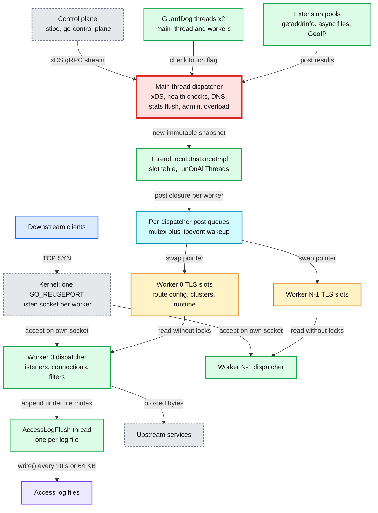

**What to notice**

- **The main thread is red** because it is single threaded and owns every control-plane job. Under a large CDS (Cluster Discovery Service) push it is the component that stalls first. Section 8 gives the mechanism and numbers.
- **Workers never talk to each other on the hot path.** The only cross-worker hops are connection rebalancing (opt-in) and QUIC packets routed by connection ID ([report 02](envoy-02-listeners-and-network-filters.md)).
- **Every cross-thread message is a `post()`** into a dispatcher's queue. There is no shared work queue and no thread pool on the data path.
- **The kernel is the default load balancer** across workers, one listen socket per worker.
- **Side threads exist but are few**: two guard dogs, one flusher per access-log file, and extension pools that post results back to a dispatcher.

### 2.1 Thread inventory

| Thread | Count | Thread name (15 char limit) | Created in | Runs |
|---|---|---|---|---|
| Main | 1 | process name | `InstanceBase` ctor, `allocateDispatcher("main_thread")` ([server.cc:98](https://github.com/envoyproxy/envoy/blob/v1.39.1/source/server/server.cc#L98)) | all control-plane work, admin, signals |
| Worker | `--concurrency` (default host hardware threads) | `wrk:worker_<i>` | `ProdWorkerFactory::createWorker` ([worker_impl.cc:39](https://github.com/envoyproxy/envoy/blob/v1.39.1/source/server/worker_impl.cc#L39)), started in `WorkerImpl::start` | listeners, connections, all filters, upstream pools |
| Guard dog | 2 | `dog:<name>_guarddog_thread` truncated | `GuardDogImpl::start` ([guarddog_impl.cc:222](https://github.com/envoyproxy/envoy/blob/v1.39.1/source/server/guarddog_impl.cc#L222)) | watchdog scans |
| Access log flusher | 1 per distinct file path | `AccessLogFlush` | `AccessLogFileImpl::createFlushStructures` ([access_log_manager_impl.cc:228](https://github.com/envoyproxy/envoy/blob/v1.39.1/source/common/access_log/access_log_manager_impl.cc#L228)) | `write()` of buffered log lines |
| getaddrinfo resolver | 1 by default, capped at 10 | unnamed | [getaddrinfo.cc:31](https://github.com/envoyproxy/envoy/blob/v1.39.1/source/extensions/network/dns_resolver/getaddrinfo/getaddrinfo.cc#L31) | blocking `getaddrinfo()` calls |
| tcmalloc background | 0, or 1 if `bytes_to_release > 0` | `TcmallocProcess...` | [memory/stats.cc:294](https://github.com/envoyproxy/envoy/blob/v1.39.1/source/common/memory/stats.cc#L294) | `ProcessBackgroundActions()` |
| Google gRPC completion | 1 per Envoy thread that uses the Google gRPC client | `GrpcGoogClient` | [google_async_client_impl.cc:29](https://github.com/envoyproxy/envoy/blob/v1.39.1/source/common/grpc/google_async_client_impl.cc#L29) | completion queue polling |
| Extension pools | varies | e.g. `mmdb_reload_routine` | async files (default `hardware_concurrency()` threads), file cache eviction, MaxMind GeoIP reload | blocking work off the loop |

### 2.2 Which thread runs which job

| Work | Thread | Verified where |
|---|---|---|
| xDS streams, parsing, ACK/NACK | main | `XdsManagerImpl(*dispatcher_, ...)` ([server.cc:824](https://github.com/envoyproxy/envoy/blob/v1.39.1/source/server/server.cc#L824)) |
| CDS update loop over every cluster | main, one synchronous loop, EDS/LEDS/SDS paused meanwhile | [cds_api_helper.cc:21](https://github.com/envoyproxy/envoy/blob/v1.39.1/source/common/upstream/cds_api_helper.cc#L21) |
| Active health checks | main | timers from `parent.dispatcher_` = `mainThreadDispatcher()` ([health_checker_base_impl.cc:255](https://github.com/envoyproxy/envoy/blob/v1.39.1/source/extensions/health_checkers/common/health_checker_base_impl.cc#L255)) |
| Outlier detection: counting | worker, atomics per host | `std::atomic<uint32_t> consecutive_5xx_` ([outlier_detection_impl.h:203](https://github.com/envoyproxy/envoy/blob/v1.39.1/source/common/upstream/outlier_detection_impl.h#L203)) |
| Outlier detection: ejection and interval timer | main | detector built with `mainThreadDispatcher()` ([cluster_factory_impl.cc:145](https://github.com/envoyproxy/envoy/blob/v1.39.1/source/common/upstream/cluster_factory_impl.cc#L145)) |
| DNS with c-ares (default resolver) | main (socket events on the creating dispatcher) | [cares/dns_impl.cc:435](https://github.com/envoyproxy/envoy/blob/v1.39.1/source/extensions/network/dns_resolver/cares/dns_impl.cc#L435), default chosen in [dns_factory_util.cc:30](https://github.com/envoyproxy/envoy/blob/v1.39.1/source/common/network/dns_resolver/dns_factory_util.cc#L30) |
| DNS with getaddrinfo | resolver thread, result posted to the dispatcher | [getaddrinfo.cc:234](https://github.com/envoyproxy/envoy/blob/v1.39.1/source/extensions/network/dns_resolver/getaddrinfo/getaddrinfo.cc#L234) |
| Stats flush and histogram merge | main starts, every worker flips its buffers, main merges | [thread_local_store.cc:272](https://github.com/envoyproxy/envoy/blob/v1.39.1/source/common/stats/thread_local_store.cc#L272) |
| Admin HTTP server | main (admin listener added to the main thread's handler) | [server.cc:810](https://github.com/envoyproxy/envoy/blob/v1.39.1/source/server/server.cc#L810) |
| Access-log formatting | worker that owns the connection | `emitLogs` in the listener ([report 02](envoy-02-listeners-and-network-filters.md)) |
| Access-log disk write | `AccessLogFlush` thread | [access_log_manager_impl.cc:133](https://github.com/envoyproxy/envoy/blob/v1.39.1/source/common/access_log/access_log_manager_impl.cc#L133) |
| TLS (Transport Layer Security) handshakes | worker that owns the connection | `SslHandshakerImpl::doHandshake` runs inside the connection's I/O ([ssl_handshaker.cc:142](https://github.com/envoyproxy/envoy/blob/v1.39.1/source/common/tls/ssl_handshaker.cc#L142)) |
| SDS certificate rotation | main builds the new `SSL_CTX`, swaps under a writer lock | [server_ssl_socket.cc:79](https://github.com/envoyproxy/envoy/blob/v1.39.1/source/common/tls/server_ssl_socket.cc#L79) |
| Runtime disk-layer reload | main (filesystem watcher) | [runtime_impl.cc:528](https://github.com/envoyproxy/envoy/blob/v1.39.1/source/common/runtime/runtime_impl.cc#L528) |
| Overload manager resource monitors | main, every `refresh_interval` (1000 ms default) | [overload_manager_impl.cc:430](https://github.com/envoyproxy/envoy/blob/v1.39.1/source/server/overload_manager_impl.cc#L430) |
| Overload actions (stop accept, reset streams) | worker, pushed by `runOnAllThreads` | [overload_manager_impl.cc:727](https://github.com/envoyproxy/envoy/blob/v1.39.1/source/server/overload_manager_impl.cc#L727) |

---

## 3. Data flow

### 3.1 Config propagation: read-copy-update through thread-local slots

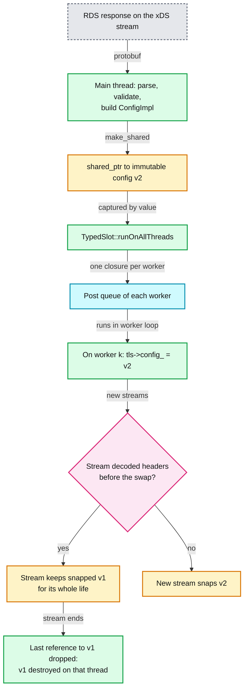

**What to notice**

- **The read path is one vector index plus one `shared_ptr` copy.** `RdsRouteConfigProviderImpl::config()` returns `tls_->config_` ([rds_route_config_provider_impl.h:31](https://github.com/envoyproxy/envoy/blob/v1.39.1/source/common/rds/rds_route_config_provider_impl.h#L31)).
- **The write path is the whole update function**: `tls_.runOnAllThreads([new_config](OptRef<ThreadLocalConfig> tls) { tls->config_ = new_config; })` ([rds_route_config_provider_impl.cc:32](https://github.com/envoyproxy/envoy/blob/v1.39.1/source/common/rds/rds_route_config_provider_impl.cc#L32)).
- **No global barrier.** Worker 0 may run the swap microseconds or hundreds of milliseconds before worker 7, depending on how busy each loop is. Section 6.4 states the consistency model.
- **Garbage collection is reference counting.** Whichever thread drops the last `shared_ptr` runs the destructor. There is no epoch or grace-period machinery.

### 3.2 Accepting and balancing a connection

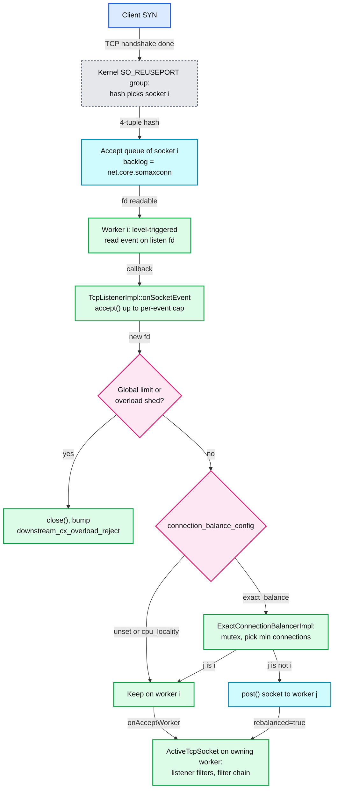

**What to notice**

- **Balancing happens after `accept()`**, so a rebalanced connection costs one extra `post()` and one mutex hold, and the accept syscall is still paid by worker i ([active_tcp_listener.cc:121](https://github.com/envoyproxy/envoy/blob/v1.39.1/source/common/listener_manager/active_tcp_listener.cc#L121)).
- **The listen fd is level triggered** so that stopping early at the per-event cap never loses a wakeup ([tcp_listener_impl.cc:170](https://github.com/envoyproxy/envoy/blob/v1.39.1/source/common/network/tcp_listener_impl.cc#L170)).
- **The per-event cap defaults to unlimited** (`UINT32_MAX`, [listener.h:29](https://github.com/envoyproxy/envoy/blob/v1.39.1/envoy/network/listener.h#L29)). The proto recommends lowering it, even to 1 ([listener.proto:435](https://github.com/envoyproxy/envoy/blob/v1.39.1/api/envoy/config/listener/v3/listener.proto#L435)).
- **`cpu_locality_balance` also stays on worker i**, because the BPF program already steered the SYN to the right socket in the kernel.

### 3.3 Stats as the threads see them

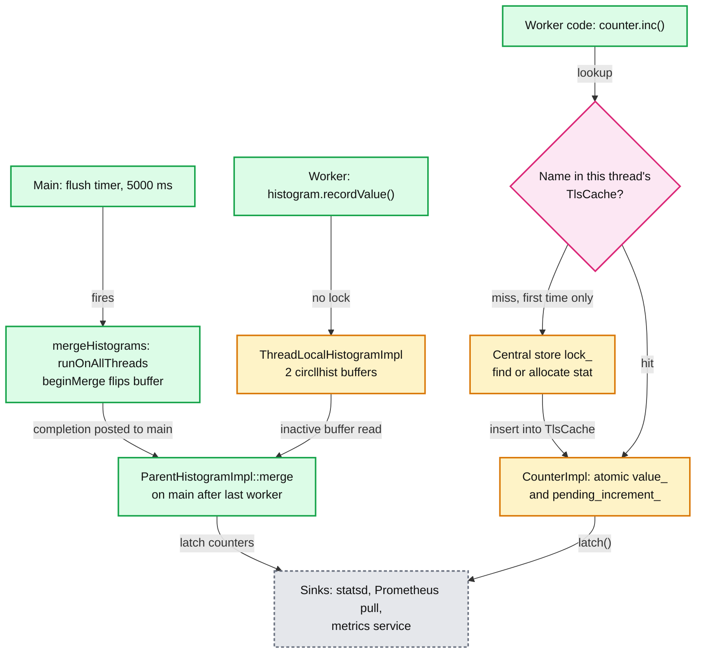

**What to notice**

- **Counters are shared atomics, not per-thread values.** `CounterImpl::add` does `value_ += amount; pending_increment_ += amount` on `std::atomic<uint64_t>` ([allocator.cc:150](https://github.com/envoyproxy/envoy/blob/v1.39.1/source/common/stats/allocator.cc#L150)). The thread-local cache only saves the name lookup and the central `lock_` ([thread_local_store.cc:558](https://github.com/envoyproxy/envoy/blob/v1.39.1/source/common/stats/thread_local_store.cc#L558)).
- **Histograms are truly per thread.** Each `ThreadLocalHistogramImpl` owns two buffers. `recordValue` writes `histograms_[current_active_]` with no lock ([thread_local_store.cc:1065](https://github.com/envoyproxy/envoy/blob/v1.39.1/source/common/stats/thread_local_store.cc#L1065)). `beginMerge` flips the index on the worker ([thread_local_store.h:49](https://github.com/envoyproxy/envoy/blob/v1.39.1/source/common/stats/thread_local_store.h#L49)), then the main thread reads the buffer nobody writes any more.
- **A flush waits for every worker.** The merge completion runs only when the last worker has executed its `beginMerge` closure. A worker stuck in a 2 s loop iteration delays the flush by 2 s. If the timer fires again meanwhile, `server.dropped_stat_flushes` increments ([server.cc:239](https://github.com/envoyproxy/envoy/blob/v1.39.1/source/server/server.cc#L239)).
- **The interval drifts.** The timer is re-armed at the end of `flushStatsInternal` ([server.cc:302](https://github.com/envoyproxy/envoy/blob/v1.39.1/source/server/server.cc#L302)), so the real period is 5000 ms plus merge and sink time **[inferred]**.

---

## 4. Sequences

### 4.1 Server startup

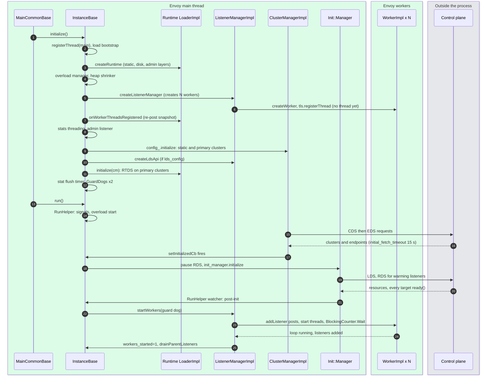

- **Workers exist before they run.** They are constructed in the `ListenerManagerImpl` constructor ([listener_manager_impl.cc:430](https://github.com/envoyproxy/envoy/blob/v1.39.1/source/common/listener_manager/listener_manager_impl.cc#L430)) so that every TLS slot `set()` during config load is queued into their dispatchers. Their threads start only in `startWorkers` ([listener_manager_impl.cc:1065](https://github.com/envoyproxy/envoy/blob/v1.39.1/source/common/listener_manager/listener_manager_impl.cc#L1065)), and `WorkerImpl::threadRoutine` first drains all those queued posts.
- **Runtime is built before workers register**, so `onWorkerThreadsRegistered()` re-publishes the snapshot ([server.cc:746](https://github.com/envoyproxy/envoy/blob/v1.39.1/source/server/server.cc#L746)).
- **Traffic waits for config.** `cm.setInitializedCb` then `init_manager.initialize(init_watcher_)` then `startWorkers()` ([server.cc:1046](https://github.com/envoyproxy/envoy/blob/v1.39.1/source/server/server.cc#L1046), [server.cc:945](https://github.com/envoyproxy/envoy/blob/v1.39.1/source/server/server.cc#L945)). Each xDS subscription can hold startup for `initial_fetch_timeout` 15 s ([config_source.proto:246](https://github.com/envoyproxy/envoy/blob/v1.39.1/api/envoy/config/core/v3/config_source.proto#L246)).
- **The main thread blocks** in `absl::BlockingCounter::Wait` until every worker loop runs ([listener_manager_impl.cc:1134](https://github.com/envoyproxy/envoy/blob/v1.39.1/source/common/listener_manager/listener_manager_impl.cc#L1134)). Only then does a hot-restarted child tell its parent to drain.

### 4.2 A cross-thread post

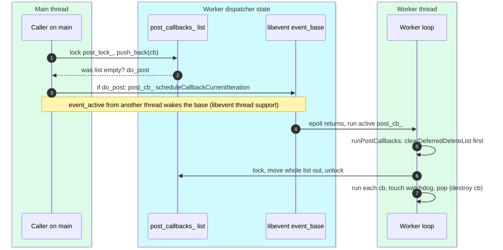

- **One wakeup per batch.** Only the post that finds the list empty activates `post_cb_` ([dispatcher_impl.cc:263](https://github.com/envoyproxy/envoy/blob/v1.39.1/source/common/event/dispatcher_impl.cc#L263)). 1,000 posts in a burst cost one wakeup.
- **The lock is held only for the swap**, never while callbacks run, because a callback or its destructor may itself call `post()` ([dispatcher_impl.cc:371](https://github.com/envoyproxy/envoy/blob/v1.39.1/source/common/event/dispatcher_impl.cc#L371)).
- **Why cross-thread `event_active` works**: `Libevent::Global::initialize()` calls `evthread_use_pthreads()` ([libevent.cc:19](https://github.com/envoyproxy/envoy/blob/v1.39.1/source/common/event/libevent.cc#L19)), and `LibeventScheduler` asserts it did ([libevent_scheduler.cc:34](https://github.com/envoyproxy/envoy/blob/v1.39.1/source/common/event/libevent_scheduler.cc#L34)). With thread support on, libevent locks the base and wakes a sleeping loop through its internal notification fd **[inferred]** (libevent source is not in the Envoy tree).
- **FIFO per sender, not global.** Posts from one thread run in order. Posts from different threads interleave in lock order.

### 4.3 runOnAllThreads with a completion callback (histogram merge)

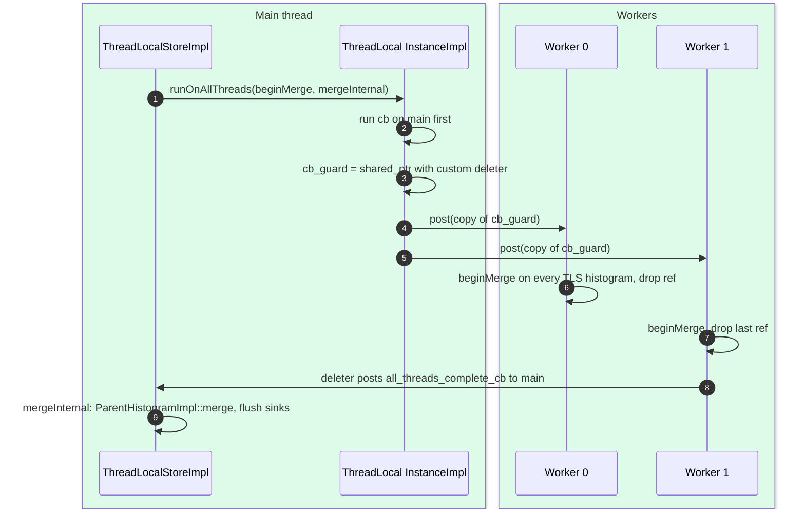

- **The completion is a destructor.** `cb_guard` is a `shared_ptr<std::function>` whose deleter posts `all_threads_complete_cb` to the main dispatcher ([thread_local_impl.cc:200](https://github.com/envoyproxy/envoy/blob/v1.39.1/source/common/thread_local/thread_local_impl.cc#L200)). Whichever worker finishes last triggers it. No counter, no condition variable.
- **The main thread runs first** "so that when the last worker thread wins, we could just call the all_threads_complete_cb" ([thread_local_impl.cc:195](https://github.com/envoyproxy/envoy/blob/v1.39.1/source/common/thread_local/thread_local_impl.cc#L195)).
- **Same primitive, other users**: listener add and remove completions, cluster removal, overload action fan-out.

### 4.4 Exact balance rebalancing a connection

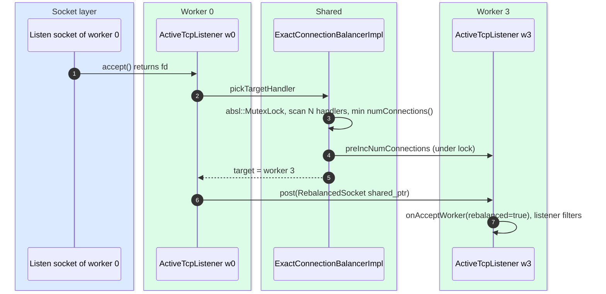

- **The lock is taken on every accept** on that listener and scans all N handlers ([connection_balancer_impl.cc:21](https://github.com/envoyproxy/envoy/blob/v1.39.1/source/common/network/connection_balancer_impl.cc#L21)). With N=32 workers that is 32 atomic loads under one mutex per new connection **[inferred]**.
- **The count is pre-incremented under the lock**, so two concurrent accepts do not both pick the same idle worker.
- **The proto states the trade**: exact balance "sacrifices accept throughput for accuracy and should be used when there are a small number of connections that rarely cycle (e.g., service mesh gRPC egress)" ([listener.proto:102](https://github.com/envoyproxy/envoy/blob/v1.39.1/api/envoy/config/listener/v3/listener.proto#L102)).

---

## 5. State machines

### 5.1 Server state (the `server.state` gauge)

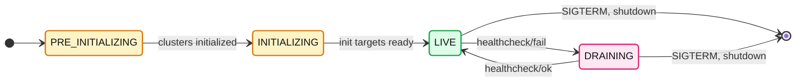

- Values: `LIVE=0`, `DRAINING=1`, `PRE_INITIALIZING=2`, `INITIALIZING=3` ([server_info.proto:26](https://github.com/envoyproxy/envoy/blob/v1.39.1/api/envoy/admin/v3/server_info.proto#L26)). The mapping is `Utility::serverState` ([utils.cc:11](https://github.com/envoyproxy/envoy/blob/v1.39.1/source/server/utils.cc#L11)).
- **Alert on `server.state != 0` for more than a few seconds after start.** A value of 2 or 3 means workers have not started and no traffic is being served.

### 5.2 Watchdog view of one thread

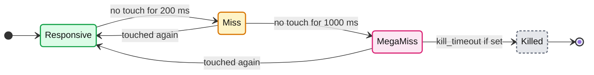

- Each state change bumps a counter once per stall (`miss_alerted_` and `megamiss_alerted_` latch until the next touch) ([guarddog_impl.cc:143](https://github.com/envoyproxy/envoy/blob/v1.39.1/source/server/guarddog_impl.cc#L143)).
- `Killed` needs `kill_timeout > 0` (default 0, disabled), or `multikill_timeout` with `max(2, ceil(threads x multikill_threshold))` stuck threads ([guarddog_impl.cc:125](https://github.com/envoyproxy/envoy/blob/v1.39.1/source/server/guarddog_impl.cc#L125)).

### 5.3 Worker lifecycle

- **`Registered` without a thread is a real state.** Posts accumulate in the worker's queue during the whole config load (potentially 15 s or more) and run in order when the loop starts.
- **Teardown order matters**: connections close (`handler_.reset()`) before `tls_.shutdownThread()` so no destructor runs on the main thread while touching thread-local data ([worker_impl.cc:186](https://github.com/envoyproxy/envoy/blob/v1.39.1/source/server/worker_impl.cc#L186)). `shutdownThread` destroys slots in reverse index order so filters die before the cluster manager they reference ([thread_local_impl.cc:225](https://github.com/envoyproxy/envoy/blob/v1.39.1/source/common/thread_local/thread_local_impl.cc#L225)).

---

## 6. Component deep dives

### 6.1 Server startup in `source/server/server.cc`

`InstanceBase::initializeOrThrow` runs top to bottom on the main thread:

1. `thread_local_.registerThread(*dispatcher_, true)` so main-thread code can use slots too ([server.cc:478](https://github.com/envoyproxy/envoy/blob/v1.39.1/source/server/server.cc#L478)).
2. `InstanceUtil::loadBootstrapConfig` merges `-c` and `--config-yaml` ([server.cc:481](https://github.com/envoyproxy/envoy/blob/v1.39.1/source/server/server.cc#L481)), then header prefix, inline headers, regex engine, tag producer, stats matcher.
3. `component_factory.createRuntime` ([server.cc:670](https://github.com/envoyproxy/envoy/blob/v1.39.1/source/server/server.cc#L670)), then `createOverloadManager` and `maybeCreateHeapShrinker`.
4. `createListenerManager`, which constructs N `WorkerImpl` objects ([server.cc:738](https://github.com/envoyproxy/envoy/blob/v1.39.1/source/server/server.cc#L738)).
5. `stats_store_.initializeThreading` ([server.cc:750](https://github.com/envoyproxy/envoy/blob/v1.39.1/source/server/server.cc#L750)), admin listener, SSL context manager, `XdsManagerImpl`, cluster manager factory.
6. `config_.initialize` builds the cluster manager and static listeners ([server.cc:841](https://github.com/envoyproxy/envoy/blob/v1.39.1/source/server/server.cc#L841)), then `createLdsApi` and `runtime().initialize(clusterManager())` for RTDS (Runtime Discovery Service).
7. Primary clusters done: `onClusterManagerPrimaryInitializationComplete`, RTDS subscriptions, then `onRuntimeReady` starts secondary (EDS-backed) clusters ([server.cc:897](https://github.com/envoyproxy/envoy/blob/v1.39.1/source/server/server.cc#L897)).
8. Stat flush timer, two guard dogs, then `run()`.

The comment block at [server.cc:757](https://github.com/envoyproxy/envoy/blob/v1.39.1/source/server/server.cc#L757) states the order as an invariant: bootstrap, primary clusters, services, RTDS on primary clusters, secondary clusters, rest of xDS. RTDS must use a primary cluster, and Envoy rejects configs that break this **[documented]**.

`RunHelper` ([server.cc:990](https://github.com/envoyproxy/envoy/blob/v1.39.1/source/server/server.cc#L990)) installs signal handlers on the main dispatcher (SIGTERM and SIGINT shut down, SIGUSR1 reopens access logs, SIGHUP is eaten), starts the overload manager before workers, logs a warning if no global downstream connection limit is configured, and pauses RDS while the init manager fires so that all statically referenced RDS names go out in one request ([server.cc:1052](https://github.com/envoyproxy/envoy/blob/v1.39.1/source/server/server.cc#L1052)).

### 6.2 The dispatcher: `Event::DispatcherImpl`

- **Base loop**: `LibeventScheduler` wraps one `event_base` per dispatcher ([libevent_scheduler.cc:18](https://github.com/envoyproxy/envoy/blob/v1.39.1/source/common/event/libevent_scheduler.cc#L18)). File events, timers, signals and schedulable callbacks are all libevent events.
- **`RunType`** ([dispatcher.h:255](https://github.com/envoyproxy/envoy/blob/v1.39.1/envoy/event/dispatcher.h#L255)): `Block` runs until no events are pending (default libevent flags), `NonBlock` runs ready events once, `RunUntilExit` sets `EVLOOP_NO_EXIT_ON_EMPTY` ([libevent_scheduler.cc:47](https://github.com/envoyproxy/envoy/blob/v1.39.1/source/common/event/libevent_scheduler.cc#L47)). Main and workers use `Block`: a live listener or the watchdog touch timer always keeps an event pending, and `exit()` ends the loop **[inferred]**.
- **`run()` drains posts before the first poll** because "libevent does not guarantee that events are run in any particular order" ([dispatcher_impl.cc:291](https://github.com/envoyproxy/envoy/blob/v1.39.1/source/common/event/dispatcher_impl.cc#L291)).
- **`SchedulableCallback`** is a zero-timeout libevent event ([schedulable_cb_impl.cc:23](https://github.com/envoyproxy/envoy/blob/v1.39.1/source/common/event/schedulable_cb_impl.cc#L23)). `scheduleCallbackCurrentIteration` uses `event_active`, which appends to the active list so it runs later in this loop iteration. `scheduleCallbackNextIteration` uses a zero `timeval`, which libevent moves to the active list only after the next poll.
- **`deferredDelete`** ([dispatcher_impl.cc:244](https://github.com/envoyproxy/envoy/blob/v1.39.1/source/common/event/dispatcher_impl.cc#L244)) pushes a `unique_ptr<DeferredDeletable>` onto `current_to_delete_` and, if the list was empty, schedules `clearDeferredDeleteList` for the current iteration. Why: a connection close is often raised from inside that connection's own `onData` stack. Deleting it inline would free memory that stack frames above still use. Deferring puts the destructor after the current event handler returns but still in the same iteration **[documented]** ([deferred_deletable.h](https://github.com/envoyproxy/envoy/blob/v1.39.1/envoy/event/deferred_deletable.h)).
- **Two delete lists**: `clearDeferredDeleteList` swaps `to_delete_1_` and `to_delete_2_` before destroying, so destructors that defer-delete more objects land in the other vector, and destruction is FIFO ([dispatcher_impl.cc:114](https://github.com/envoyproxy/envoy/blob/v1.39.1/source/common/event/dispatcher_impl.cc#L114)).
- **Timers** are `evtimer`s owned by one dispatcher. `enableTimer` asserts `isThreadSafe()` ([timer_impl.cc](https://github.com/envoyproxy/envoy/blob/v1.39.1/source/common/event/timer_impl.cc)). You cannot arm another thread's timer. You post to it.
- **Scaled timers** are the overload manager's lever. `createScaledTimer(ScaledTimerType, cb)` ([dispatcher_impl.cc:217](https://github.com/envoyproxy/envoy/blob/v1.39.1/source/common/event/dispatcher_impl.cc#L217)) creates a range timer whose effective duration shrinks from max toward min when the `reduce_timeouts` action scales it. Types: HTTP downstream connection idle, stream idle, transport socket connect, connection max, stream flush ([scaled_timer.h:70](https://github.com/envoyproxy/envoy/blob/v1.39.1/envoy/event/scaled_timer.h#L70)). `ScaledRangeTimerManagerImpl` keeps one queue per distinct (max minus min) duration so the number of real libevent timers stays small ([scaled_range_timer_manager_impl.h](https://github.com/envoyproxy/envoy/blob/v1.39.1/source/common/event/scaled_range_timer_manager_impl.h)).
- **Approximate time**: the dispatcher caches `monotonicTime()` once per loop via a libevent check callback ([dispatcher_impl.cc:83](https://github.com/envoyproxy/envoy/blob/v1.39.1/source/common/event/dispatcher_impl.cc#L83)), so hot code avoids a clock syscall.

### 6.3 Thread-local storage: `ThreadLocal::InstanceImpl`

- **Storage**: a `thread_local` struct holds `std::vector<ThreadLocalObjectSharedPtr> data_` and the thread's dispatcher ([thread_local_impl.cc:17](https://github.com/envoyproxy/envoy/blob/v1.39.1/source/common/thread_local/thread_local_impl.cc#L17)). A slot is an index into that vector on every thread.
- **`allocateSlot()`** runs on main only, reusing freed indexes ([thread_local_impl.cc:27](https://github.com/envoyproxy/envoy/blob/v1.39.1/source/common/thread_local/thread_local_impl.cc#L27)).
- **`SlotImpl::set(cb)`** posts `setThreadLocal(index, cb(dispatcher))` to every registered worker and runs it inline on main ([thread_local_impl.cc:124](https://github.com/envoyproxy/envoy/blob/v1.39.1/source/common/thread_local/thread_local_impl.cc#L124)). The factory runs on the target thread, so per-worker objects (a load balancer, a connection pool map) are built where they live.
- **`TypedSlot<T>`** ([thread_local.h:111](https://github.com/envoyproxy/envoy/blob/v1.39.1/envoy/thread_local/thread_local.h#L111)) wraps a slot with typed `get()`, `operator->` and `runOnAllThreads(std::function<void(OptRef<T>)>)`. The untyped update callback API is marked deprecated in favour of it.
- **Lifetime safety**: every posted callback captures `weak_ptr<bool> still_alive_guard_` and does nothing if the slot died in the meantime ([thread_local_impl.cc:79](https://github.com/envoyproxy/envoy/blob/v1.39.1/source/common/thread_local/thread_local_impl.cc#L79)). A slot destroyed on a worker posts its own removal to main.
- **Access cost**: `get()` is `thread_local_data_.data_[index]`, one bounds-checked vector read plus a `shared_ptr` copy **[documented]**.

### 6.4 The RCU pattern in three real subsystems, and the consistency model

| Subsystem | Snapshot object | Publish call | Per-worker extra work |
|---|---|---|---|
| Route config (RDS) | `Router::ConfigImpl` in `ThreadLocalConfig::config_` | `tls_.runOnAllThreads(... tls->config_ = new_config)` ([rds_route_config_provider_impl.cc:32](https://github.com/envoyproxy/envoy/blob/v1.39.1/source/common/rds/rds_route_config_provider_impl.cc#L32)) | none: pointer swap |
| Cluster manager | `ClusterInfo`, `HostVector`s, cross-priority host map, LB factory | `postThreadLocalClusterUpdate` then `tls_.runOnAllThreads` ([cluster_manager_impl.cc:1211](https://github.com/envoyproxy/envoy/blob/v1.39.1/source/common/upstream/cluster_manager_impl.cc#L1211)) | `ThreadLocalClusterManagerImpl` updates its own `PrioritySetImpl`; a new cluster builds a per-worker LB with `lb_factory_->create(...)` ([cluster_manager_impl.cc:1920](https://github.com/envoyproxy/envoy/blob/v1.39.1/source/common/upstream/cluster_manager_impl.cc#L1920)) |
| Runtime | `SnapshotImpl` (all layers merged) | `tls_->set([ptr](Dispatcher&) { return ptr; })` ([runtime_impl.cc:663](https://github.com/envoyproxy/envoy/blob/v1.39.1/source/common/runtime/runtime_impl.cc#L663)) | none: pointer swap |

Consistency model **[documented from code, wording inferred]**:

- **Per worker: monotonic.** Posts from main run in order on each worker, so a worker never sees v3 then v2.
- **Across workers: eventual, bounded by loop latency.** For a short window two workers hold different versions. A request on worker 0 may route with the new table while a request on worker 5 still uses the old one.
- **Per HTTP stream: pinned.** `ActiveStream::decodeHeaders` sets `snapped_route_config_ = routeConfigProvider()->configCast()` once ([conn_manager_impl.cc:1393](https://github.com/envoyproxy/envoy/blob/v1.39.1/source/common/http/conn_manager_impl.cc#L1393)) and releases it at stream end ([conn_manager_impl.cc:2528](https://github.com/envoyproxy/envoy/blob/v1.39.1/source/common/http/conn_manager_impl.cc#L2528)). `clearRouteCache` re-matches against the same snapshot. To see a newly delivered VHDS (Virtual Host Discovery Service) route, the on-demand filter must `recreateStream()` ([on_demand_update.cc:304](https://github.com/envoyproxy/envoy/blob/v1.39.1/source/extensions/filters/http/on_demand/on_demand_update.cc#L304)).
- **Across subsystems: none.** A new route can name a cluster that the worker's cluster manager has not received yet. Envoy answers 503 with `NC` (no cluster found) instead of blocking. This is why CDS is applied before RDS ("make before break", [report 06](envoy-06-xds-control-plane.md)).
- **Runtime has a second, locked copy.** `loadNewSnapshot` also stores `thread_safe_snapshot_` under `snapshot_mutex_` for threads that are not registered ([runtime_impl.cc:686](https://github.com/envoyproxy/envoy/blob/v1.39.1/source/common/runtime/runtime_impl.cc#L686)).

**The one notable non-RCU publish**: SDS (Secret Discovery Service) certificate rotation. `ServerSslSocketFactory` guards `ssl_ctx_` with an `absl::Mutex`. Every new downstream TLS connection takes a reader lock to copy the `shared_ptr`, and rotation takes the writer lock to swap ([server_ssl_socket.cc:54](https://github.com/envoyproxy/envoy/blob/v1.39.1/source/common/tls/server_ssl_socket.cc#L54)). Reader locks are cheap but they are a shared cache line on every accept **[inferred]**.

### 6.5 Shared across workers versus strictly per worker

| Shared (atomics or locks) | Mechanism | Per worker (no sharing) |
|---|---|---|
| Counters and gauges | `std::atomic<uint64_t>` in `CounterImpl` | Histogram buffers (`ThreadLocalHistogramImpl`) |
| Circuit breaker counts | `BasicResourceLimitImpl::current_` atomic, `canCreate()` is `current_.load() < max()` ([basic_resource_impl.h:28](https://github.com/envoyproxy/envoy/blob/v1.39.1/source/common/common/basic_resource_impl.h#L28)) | Connections and their buffers |
| Host health flags, weight | `std::atomic<uint32_t> health_flags_` in `HostImpl` ([upstream_impl.h:509](https://github.com/envoyproxy/envoy/blob/v1.39.1/source/common/upstream/upstream_impl.h#L509)) | Upstream connection pools |
| Outlier counters per host | atomics, ejection posted to main | Load balancer instances (round robin index, least-request state) |
| Ring hash and Maglev tables | built on main, swapped under `WriterMutexLock`, copied by workers under `ReaderMutexLock` only when a worker LB is created ([thread_aware_lb_impl.cc:180](https://github.com/envoyproxy/envoy/blob/v1.39.1/source/extensions/load_balancing_policies/common/thread_aware_lb_impl.cc#L180)) | Thread-local cluster map and priority sets |
| Listener and handler connection counts | `std::atomic<uint64_t>` read by the exact balancer | HTTP connection managers and streams |
| `connection_limit` filter, listener `local_ratelimit` token bucket | `compare_exchange_weak`, `AtomicTokenBucketImpl` | Filter instances |
| TLS server context | `absl::Mutex` around a `shared_ptr` | `SSL*` per connection |
| Access log file buffer | `write_lock_` mutex per file, taken by every worker that logs | Filter state and `StreamInfo` per connection |

Two consequences for interviews:

- **Circuit breakers overshoot under contention**, and a per-worker skew can starve one worker ("no attempt is made to balance resources between them", [resource_manager_impl.h:79](https://github.com/envoyproxy/envoy/blob/v1.39.1/source/common/upstream/resource_manager_impl.h#L79)).
- **Connection pools are per worker**, so an Envoy with 16 workers can open 16 connections to a host that a single-threaded client would reach with 1. `max_connections` 1024 is still enforced globally by the shared atomic ([report 04](envoy-04-cluster-manager-and-load-balancing.md), [report 05](envoy-05-resilience.md)).

### 6.6 Connection balancing

- **`reuse_port` (default on Linux)**: `enable_reuse_port` defaults to true ([listener.proto:414](https://github.com/envoyproxy/envoy/blob/v1.39.1/api/envoy/config/listener/v3/listener.proto#L414)). `ListenSocketFactoryImpl` pre-creates one socket per worker on the main thread so bind errors surface at config time; without reuse_port it creates one and `duplicate()`s it ([listener_impl.cc:135](https://github.com/envoyproxy/envoy/blob/v1.39.1/source/common/listener_manager/listener_impl.cc#L135), [source/docs/listener.md](https://github.com/envoyproxy/envoy/blob/v1.39.1/source/docs/listener.md)). On macOS and Windows reuse_port is force-disabled for TCP ([listener_impl.cc:1214](https://github.com/envoyproxy/envoy/blob/v1.39.1/source/common/listener_manager/listener_impl.cc#L1214)).
- **Why long-lived HTTP/2 or gRPC connections pin load**: the kernel balances connection *counts* by hashing new connections. A sidecar with 8 workers that receives 4 long-lived HTTP/2 connections carrying 10,000 requests per second each will, with probability `1 - (8x7x6x5)/8^4 = 59%`, put two of them on the same worker **[inferred arithmetic]**. That worker then carries 20,000 RPS while others idle, and it stays that way until the connection closes because a connection never migrates.
- **Exact balance** fixes counts, not load: min-connections under a mutex (section 4.4). It does not know that one connection carries 100 times more streams than another.
- **`cpu_locality_balance`** (new in 1.39.0) attaches a `SO_REUSEPORT` BPF program that steers each SYN to the worker pinned to the CPU that received it. Requirements: Linux, `enable_worker_cpu_affinity: true`, reuse_port, kernel support, and worker count no greater than CPUs in the affinity mask. Otherwise it silently falls back to kernel hashing ([listener.proto:109](https://github.com/envoyproxy/envoy/blob/v1.39.1/api/envoy/config/listener/v3/listener.proto#L109)). The `workers_pinned` gauge tells you whether pinning happened ([listener_manager_impl.cc:1111](https://github.com/envoyproxy/envoy/blob/v1.39.1/source/common/listener_manager/listener_manager_impl.cc#L1111)).
- **The accept loop**: `TcpListenerImpl::onSocketEvent` loops `accept()` until `EAGAIN` or `max_connections_to_accept_per_socket_event`, checking the global connection limit and overload load-shed point per socket ([tcp_listener_impl.cc:63](https://github.com/envoyproxy/envoy/blob/v1.39.1/source/common/network/tcp_listener_impl.cc#L63)). The histogram `connections_accepted_per_socket_event` shows how bursty accepts are.

### 6.7 Runtime

- **Layers, later wins**: `static_layer` (proto in bootstrap), `disk_layer` (symlink tree, watched), `admin_layer` (at most one, `/runtime_modify`), `rtds_layer` (xDS) ([runtime.rst](https://github.com/envoyproxy/envoy/blob/v1.39.1/docs/root/configuration/operations/runtime.rst)). With a non-empty layered config and no admin layer, mutating admin calls get 503.
- **Snapshots per thread**: every reload builds a fresh `SnapshotImpl` from all layers and `set()`s it into the slot (section 6.4). A request that reads the same key twice sees one value, since it reads its thread's snapshot.
- **Reload triggers, all on main**: disk symlink swap (filesystem watcher), admin POST, RTDS update.
- **Feature flags**: `RUNTIME_GUARD(name)` defines a flag defaulting to true, `FALSE_RUNTIME_GUARD(name)` one defaulting to false ([runtime_features.cc:13](https://github.com/envoyproxy/envoy/blob/v1.39.1/source/common/runtime/runtime_features.cc#L13)). v1.39.1 has 105 `RUNTIME_GUARD` and 48 `FALSE_RUNTIME_GUARD` lines **[documented, counted with grep]**. Guards are checked with `Runtime::runtimeFeatureEnabled("envoy.reloadable_features.x")`, and `refreshReloadableFlags` pushes runtime overrides into them on every snapshot load. Upstream discourages overriding "non-buggy code" because the old path is deleted later ([runtime_features.cc:35](https://github.com/envoyproxy/envoy/blob/v1.39.1/source/common/runtime/runtime_features.cc#L35)). Lifecycle is in [report 10](envoy-10-version-delta.md).

### 6.8 GuardDog and watchdog

- **Two guard dogs**: `main_thread` watches the main loop, `workers` watches every worker. Separate configs via `watchdogs.main_thread_watchdog` and `watchdogs.worker_watchdog` ([bootstrap.proto:553](https://github.com/envoyproxy/envoy/blob/v1.39.1/api/envoy/config/bootstrap/v3/bootstrap.proto#L553)). The runtime guard `envoy.restart_features.worker_threads_watchdog_fix` (true) makes workers actually use the worker config ([server.cc:884](https://github.com/envoyproxy/envoy/blob/v1.39.1/source/server/server.cc#L884)).
- **Defaults**: miss 200 ms, megamiss 1000 ms, kill 0 (disabled), multikill 0 (disabled) ([bootstrap.proto:594](https://github.com/envoyproxy/envoy/blob/v1.39.1/api/envoy/config/bootstrap/v3/bootstrap.proto#L594), [configuration_impl.cc:226](https://github.com/envoyproxy/envoy/blob/v1.39.1/source/server/configuration_impl.cc#L226)).
- **Touch mechanism**: `WatchDogImpl` holds `std::atomic<bool> touched_` ([watchdog_impl.h:34](https://github.com/envoyproxy/envoy/blob/v1.39.1/source/server/watchdog_impl.h#L34)). The owning dispatcher sets it from a repeating timer every `loop_interval / 2` and also before most callbacks (`touchWatchdog()` in post, timer, file event and deferred-delete paths). The guard dog scans every `loop_interval = min(miss, megamiss, kill, multikill)`, which is 200 ms by default ([guarddog_impl.cc:41](https://github.com/envoyproxy/envoy/blob/v1.39.1/source/server/guarddog_impl.cc#L41)), and does `getTouchedAndReset()` via `exchange(false)`.
- **Actions**: events fire in order KILL, MULTIKILL, MEGAMISS, MISS. If kill is set, a default abort action is appended ([bootstrap.proto:569](https://github.com/envoyproxy/envoy/blob/v1.39.1/api/envoy/config/bootstrap/v3/bootstrap.proto#L569)). `max_kill_timeout_jitter` avoids a fleet killing itself in lockstep.

### 6.9 Memory allocator

- **Default allocator**: Google tcmalloc on Linux x86_64 and aarch64, gperftools elsewhere, disabled on macOS and sanitizer builds ([bazel/BUILD:1059](https://github.com/envoyproxy/envoy/blob/v1.39.1/bazel/BUILD#L1059), [.bazelrc:260](https://github.com/envoyproxy/envoy/blob/v1.39.1/.bazelrc#L260)). A `jemalloc` build flag also exists ([bazel/BUILD:249](https://github.com/envoyproxy/envoy/blob/v1.39.1/bazel/BUILD#L249)).
- **Background release is off by default.** `bytes_to_release` defaults to 0, and `memory_release_interval` to 1000 ms ([bootstrap.proto:795](https://github.com/envoyproxy/envoy/blob/v1.39.1/api/envoy/config/bootstrap/v3/bootstrap.proto#L795), [memory/stats.cc:216](https://github.com/envoyproxy/envoy/blob/v1.39.1/source/common/memory/stats.cc#L216)). When set, Envoy starts one tcmalloc `ProcessBackgroundActions` thread at `bytes_to_release x 1000 / interval_ms` bytes per second. gperftools logs an error and ignores it. `soft_memory_limit_bytes` and `max_per_cpu_cache_size_bytes` work only with Google tcmalloc.
- **Release after xDS**: every gRPC mux update calls `Memory::Utils::tryShrinkHeap()`, which returns free pages to the OS when physical minus allocated exceeds 100 MiB ([grpc_mux_impl.cc:565](https://github.com/envoyproxy/envoy/blob/v1.39.1/source/extensions/config_subscription/grpc/grpc_mux_impl.cc#L565), [memory/stats.h:14](https://github.com/envoyproxy/envoy/blob/v1.39.1/source/common/memory/stats.h#L14)).
- **`shrink_heap` overload action**: when saturated, `HeapShrinker` calls `releaseFreeMemory` every 10 s on the main dispatcher, keeping at most 100 MB unfreed ([heap_shrinker.cc:13](https://github.com/envoyproxy/envoy/blob/v1.39.1/source/common/memory/heap_shrinker.cc#L13), [overload.proto:144](https://github.com/envoyproxy/envoy/blob/v1.39.1/api/envoy/config/overload/v3/overload.proto#L144)).

### 6.10 io_uring

- **Opt-in and experimental.** Enabled by `io_uring_options` in the `DefaultSocketInterface` bootstrap extension. Linux 5.11 or later, otherwise the epoll path is used ([default_socket_interface.proto:21](https://github.com/envoyproxy/envoy/blob/v1.39.1/api/envoy/extensions/network/socket_interface/v3/default_socket_interface.proto#L21)).
- **Per-worker rings**: each worker creates its own ring. The completion queue is signalled through an `eventfd` registered with `io_uring_register_eventfd` ([io_uring_impl.cc:173](https://github.com/envoyproxy/envoy/blob/v1.39.1/source/common/io/io_uring_impl.cc#L173)) and watched by that worker's dispatcher like any other fd.
- **Defaults**: SQ 1000 entries (CQ 2x), read buffer 8192 bytes growing up to 16x, write timeout 1000 ms on close, write high and low watermarks 128 KiB and 16 KiB, SQPOLL off, multishot receive off (needs Linux 6.0) ([default_socket_interface.proto:45](https://github.com/envoyproxy/envoy/blob/v1.39.1/api/envoy/extensions/network/socket_interface/v3/default_socket_interface.proto#L45)).
- **Threading impact**: none on the model. It replaces syscalls inside each loop. SQPOLL adds a kernel thread per ring.

### 6.11 `--concurrency`, cpusets and Kubernetes

- **Default**: `std::thread::hardware_concurrency()`, the host's hardware threads ([options_impl.cc:82](https://github.com/envoyproxy/envoy/blob/v1.39.1/source/server/options_impl.cc#L82)). `--concurrency 0` still runs one worker ([options_impl.cc:281](https://github.com/envoyproxy/envoy/blob/v1.39.1/source/server/options_impl.cc#L281)).
- **`--cpuset-threads`**: on Linux calls `getCpuCount()` = `min(hardware threads, sched_getaffinity count, cgroup CPU limit)` ([options_impl_platform_linux.cc:68](https://github.com/envoyproxy/envoy/blob/v1.39.1/source/server/options_impl_platform_linux.cc#L68)). The cgroup value is `floor(quota / period)`, minimum 1 ([cgroup_cpu_util.cc:65](https://github.com/envoyproxy/envoy/blob/v1.39.1/source/server/cgroup_cpu_util.cc#L65)). `ENVOY_CGROUP_CPU_DETECTION=false` disables the cgroup part.
- **Why it bites in Kubernetes** **[inferred]**: a sidecar with a `limits.cpu: 2` on a 96-thread node starts 96 workers without `--concurrency` or `--cpuset-threads`. Effects: 96 per-worker connection pools per upstream host, 96 copies of every thread-local cluster and LB, 96 posts per config change, 96 listen sockets per listener, and CFS throttling as 96 threads compete for 200 ms of CPU per 100 ms period. Istio-style sidecars set `--concurrency` explicitly for this reason **[unverified]**.
- **Right-sizing rule** **[inferred]**: workers = CPU limit for dedicated proxies, and 1 to 2 for sidecars whose traffic is small, because per-worker state multiplies memory.

---

## 7. Failure modes

| Failure | What the user sees | Blast radius | Mitigation |
|---|---|---|---|
| Main thread stalled by a big CDS/EDS push | High `cluster_manager.cds.update_duration`, xDS ACK lag, `server.main_thread.watchdog_mega_miss`, admin slow, `server.dropped_stat_flushes` | Config freshness and health checking for the whole process. Data path keeps serving old snapshots | Fewer, smaller updates, delta xDS, `enable_deferred_cluster_creation`, `update_merge_window` 1000 ms ([report 06](envoy-06-xds-control-plane.md)) |
| One worker hot from long-lived HTTP/2 or gRPC connections | p99 up on a subset of requests, `listener.<addr>.worker_<i>.downstream_cx_active` skewed, per-worker `loop_duration_us` tail | Only that worker's connections | `exact_balance`, `cpu_locality_balance`, upstream `max_connection_duration` so clients reconnect |
| Blocking call inside a filter (sync DNS, disk, lock) | Latency spikes for every connection on that worker, `server.worker_<i>.watchdog_miss` | One worker, all listeners on it | Move work to async APIs or an extension thread pool. `kill_timeout` to fail fast |
| `--concurrency` defaults to 96 in a 2-CPU container | High memory, many upstream connections, CPU throttling | Whole pod, plus upstreams seeing 96x connections | Set `--concurrency` or `--cpuset-threads` |
| Worker slow to run posts | Stats flush late, listener add/remove late, one worker on old config longer | Consistency window grows | Watch `loop_duration_us`, lower per-event work (`max_connections_to_accept_per_socket_event`) |
| Access log disk slow | Worker `write()` into buffer is fine, flusher lags, buffer grows. `filesystem.write_total_buffered` climbs | Memory growth, log loss on crash | Faster disk, gRPC access log sink, sampling |
| Circuit breaker overshoot | Slightly more than `max_requests` in flight briefly | Upstream sees small overshoot | Accept it, or set limits with headroom |
| Watchdog kill enabled too tight | Process abort with core, restart | Whole Envoy | Keep `kill_timeout` well above megamiss, add jitter |
| Memory not returned to OS after a config burst | RSS stays high, `server.memory_physical_size` far above `memory_allocated` | Pod OOM risk | `tryShrinkHeap` runs after xDS. Set `bytes_to_release`, `shrink_heap` overload action |

---

## 8. Scalability and performance

**What breaks first: the main thread under a large CDS or EDS update.** It is the red node in section 2.

Mechanism, from the code path:

1. `CdsApiHelper::onConfigUpdate` pauses EDS, LEDS and SDS requests, then loops over every added cluster calling `cm_.addOrUpdateCluster` synchronously ([cds_api_helper.cc:26](https://github.com/envoyproxy/envoy/blob/v1.39.1/source/common/upstream/cds_api_helper.cc#L26), [cds_api_helper.cc:38](https://github.com/envoyproxy/envoy/blob/v1.39.1/source/common/upstream/cds_api_helper.cc#L38)). The main loop runs nothing else until the loop ends: no health check timer, no DNS answer, no stats flush, no admin request, no other xDS stream.
2. Each cluster creates a `ClusterInfoImpl` with its own stats scope, which takes the central stats `lock_` for every new stat name ([thread_local_store.cc:558](https://github.com/envoyproxy/envoy/blob/v1.39.1/source/common/stats/thread_local_store.cc#L558)).
3. When each cluster warms, `postThreadLocalClusterUpdate` posts one closure per worker ([cluster_manager_impl.cc:1211](https://github.com/envoyproxy/envoy/blob/v1.39.1/source/common/upstream/cluster_manager_impl.cc#L1211)). 5,000 clusters x 16 workers = 80,000 closures, each building a thread-local `ClusterEntry` and a per-worker load balancer ([cluster_manager_impl.cc:1910](https://github.com/envoyproxy/envoy/blob/v1.39.1/source/common/upstream/cluster_manager_impl.cc#L1910)) **[inferred arithmetic]**.
4. EDS membership changes then fan out the same way, merged per cluster within `update_merge_window` 1000 ms ([cluster.proto:660](https://github.com/envoyproxy/envoy/blob/v1.39.1/api/envoy/config/cluster/v3/cluster.proto#L660)).

The thresholds that tell you it happened: the main-thread watchdog counts a miss after 200 ms and a mega miss after 1000 ms without a touch. `runPostCallbacks` and the dispatcher touch the watchdog between callbacks, but the CDS loop is one callback, so a 3 s CDS apply is one mega miss on `server.main_thread.watchdog_mega_miss` **[inferred from touch points]**. The direct measurement is the `update_duration` histogram (for CDS: `cluster_manager.cds.update_duration`), which times exactly the synchronous `onConfigUpdate` call on the main thread ([grpc_subscription_impl.cc:75](https://github.com/envoyproxy/envoy/blob/v1.39.1/source/extensions/config_subscription/grpc/grpc_subscription_impl.cc#L75)).

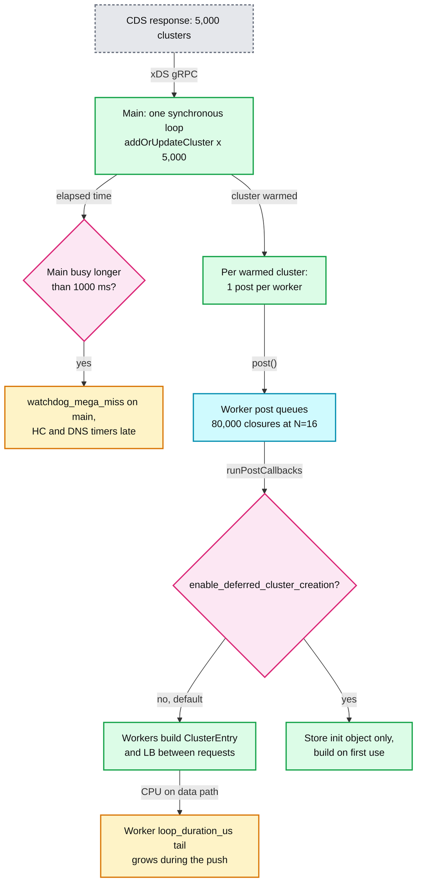

**Is it really the first thing to break?** Yes for control-plane churn, with a caveat:

- It does **not** drop traffic. Workers keep serving the previous snapshots. What degrades is freshness (new endpoints arrive late), health checking (checks fire late, so ejection of a dead host is late), and observability (stats flush skipped).
- It **does** leak into the data path in step 3: workers execute the per-cluster closures between requests, which shows up as a `loop_duration_us` tail on every worker.
- For pure request load (no config churn) the first limit is per-worker CPU, and with few long-lived connections, a single hot worker (section 6.6).

**Fixes, in order of leverage** **[inferred]**:

1. Send less: scope CDS per proxy (Istio `Sidecar` resources or equivalent), use delta xDS so unchanged clusters are not re-sent ([report 06](envoy-06-xds-control-plane.md)).
2. `enable_deferred_cluster_creation: true` ([bootstrap.proto:547](https://github.com/envoyproxy/envoy/blob/v1.39.1/api/envoy/config/bootstrap/v3/bootstrap.proto#L547)) so workers build a cluster only when a request uses it. Saves N-1 copies of inactive clusters.
3. Fewer workers per sidecar: fewer posts per cluster.
4. Keep `update_merge_window` so EDS churn is batched per second.

Other numbers that bound the model:

| Quantity | Value | Bound by |
|---|---|---|
| Cost to read config on the data path | 1 vector index plus 1 `shared_ptr` copy | TLS slot design |
| Cross-thread wakeups per post burst | 1 | `do_post` check |
| Watchdog detection latency | 200 ms scan, miss after 200 ms, mega miss after 1000 ms | defaults |
| Stats flush period | 5000 ms plus merge time | re-armed after flush |
| Overload monitor refresh | 1000 ms | `refresh_interval` |
| Access log flush | every 10000 ms or when buffer passes 64 KB | `--file-flush-interval-msec`, `--file-flush-min-size-kb` |

---

## 9. Trade-offs and alternatives

| Decision | Chosen | Alternative | Why |
|---|---|---|---|
| Concurrency model | N+1 event loops, connection pinned to one worker | Thread pool with work stealing (Go-style, Java NIO pools) | No locks on the data path, perfect cache locality. Cost: imbalance with few long-lived connections |
| Config publication | Immutable snapshot plus per-thread pointer swap | Reader-writer lock around shared config | Readers never block. Cost: memory for two versions during swap, eventual consistency across workers |
| Control-plane work | All on one main thread | Parallel config workers | Simple ordering guarantees (CDS before RDS, one mutation at a time). Cost: main thread is the scaling limit for config volume |
| Stats counters | Shared atomics | Per-thread counters summed at flush | One value per name, cheap reads by admin. Cost: cache-line contention on hot counters **[inferred]** |
| Histograms | Per-thread double buffer, merged on main | Shared lock-free histogram | Zero contention on record. Cost: flush waits for every worker |
| Connection balancing | Kernel reuse_port hashing | Exact balance or BPF CPU steering | Zero overhead for the common many-connections case. Cost: skew with few connections |
| Deferred deletion | Delete at the end of the current loop iteration | Reference counting everything | Clear `unique_ptr` ownership with no use-after-free on unwinding stacks |
| Circuit breakers | Shared atomics, may overshoot | Per-worker quotas | Correct global limit most of the time, no rebalancing logic |
| Watchdog | Separate thread scanning touch flags | Timers inside each loop | A stuck loop cannot detect itself |

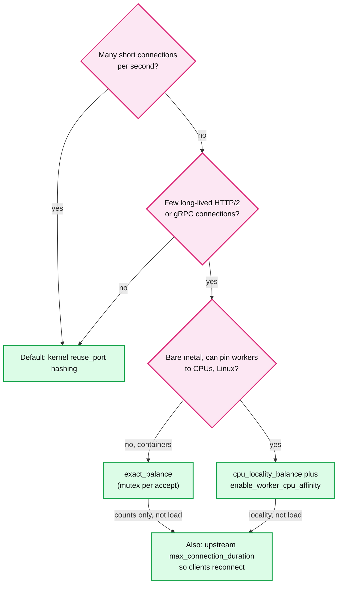

---

## 10. Config reference

| Knob | Default | Where |
|---|---|---|
| `--concurrency` | `std::thread::hardware_concurrency()` (host threads, not the cgroup quota) | [options_impl.cc:82](https://github.com/envoyproxy/envoy/blob/v1.39.1/source/server/options_impl.cc#L82) |
| `--cpuset-threads` | off. When on and `--concurrency` unset: `min(hw threads, affinity, floor(cgroup quota))` | [options_impl.cc:271](https://github.com/envoyproxy/envoy/blob/v1.39.1/source/server/options_impl.cc#L271) |
| `ENVOY_CGROUP_CPU_DETECTION` env | enabled (only matters with `--cpuset-threads`) | [options_impl_platform_linux.cc:44](https://github.com/envoyproxy/envoy/blob/v1.39.1/source/server/options_impl_platform_linux.cc#L44) |
| `--file-flush-interval-msec` | 10000 ms | [options_impl.cc:143](https://github.com/envoyproxy/envoy/blob/v1.39.1/source/server/options_impl.cc#L143) |
| `--file-flush-min-size-kb` | 64 KB | [options_impl.cc:146](https://github.com/envoyproxy/envoy/blob/v1.39.1/source/server/options_impl.cc#L146) |
| `--drain-time-s` | 600 s | [options_impl.cc:149](https://github.com/envoyproxy/envoy/blob/v1.39.1/source/server/options_impl.cc#L149) |
| `--parent-shutdown-time-s` | 900 s | [options_impl.cc:156](https://github.com/envoyproxy/envoy/blob/v1.39.1/source/server/options_impl.cc#L156) |
| `stats_flush_interval` | 5000 ms | [bootstrap.proto:221](https://github.com/envoyproxy/envoy/blob/v1.39.1/api/envoy/config/bootstrap/v3/bootstrap.proto#L221) |
| `enable_dispatcher_stats` | false | [bootstrap.proto:286](https://github.com/envoyproxy/envoy/blob/v1.39.1/api/envoy/config/bootstrap/v3/bootstrap.proto#L286) |
| `enable_worker_cpu_affinity` | false (Linux only) | [bootstrap.proto:446](https://github.com/envoyproxy/envoy/blob/v1.39.1/api/envoy/config/bootstrap/v3/bootstrap.proto#L446) |
| `cluster_manager.enable_deferred_cluster_creation` | false | [bootstrap.proto:547](https://github.com/envoyproxy/envoy/blob/v1.39.1/api/envoy/config/bootstrap/v3/bootstrap.proto#L547) |
| Watchdog `miss_timeout` | 200 ms | [bootstrap.proto:594](https://github.com/envoyproxy/envoy/blob/v1.39.1/api/envoy/config/bootstrap/v3/bootstrap.proto#L594) |
| Watchdog `megamiss_timeout` | 1000 ms | [bootstrap.proto:598](https://github.com/envoyproxy/envoy/blob/v1.39.1/api/envoy/config/bootstrap/v3/bootstrap.proto#L598) |
| Watchdog `kill_timeout` | 0 (disabled) | [bootstrap.proto:603](https://github.com/envoyproxy/envoy/blob/v1.39.1/api/envoy/config/bootstrap/v3/bootstrap.proto#L603) |
| Watchdog `max_kill_timeout_jitter` | 0 | [bootstrap.proto:610](https://github.com/envoyproxy/envoy/blob/v1.39.1/api/envoy/config/bootstrap/v3/bootstrap.proto#L610) |
| Watchdog `multikill_timeout` / `multikill_threshold` | 0 (disabled) / 0 | [bootstrap.proto:616](https://github.com/envoyproxy/envoy/blob/v1.39.1/api/envoy/config/bootstrap/v3/bootstrap.proto#L616) |
| `memory_allocator_manager.bytes_to_release` | 0 (background release off) | [bootstrap.proto:795](https://github.com/envoyproxy/envoy/blob/v1.39.1/api/envoy/config/bootstrap/v3/bootstrap.proto#L795) |
| `memory_allocator_manager.memory_release_interval` | 1000 ms | [bootstrap.proto:799](https://github.com/envoyproxy/envoy/blob/v1.39.1/api/envoy/config/bootstrap/v3/bootstrap.proto#L799) |
| `shrink_heap` `timer_interval` / `max_unfreed_memory_bytes` | 10 s / 100 MB | [overload.proto:146](https://github.com/envoyproxy/envoy/blob/v1.39.1/api/envoy/config/overload/v3/overload.proto#L146) |
| Overload `refresh_interval` | 1000 ms | [overload_manager_impl.cc:430](https://github.com/envoyproxy/envoy/blob/v1.39.1/source/server/overload_manager_impl.cc#L430) |
| Listener `enable_reuse_port` | true (TCP forced off on macOS and Windows) | [listener.proto:414](https://github.com/envoyproxy/envoy/blob/v1.39.1/api/envoy/config/listener/v3/listener.proto#L414) |
| Listener `connection_balance_config` | unset (kernel balancing) | [listener.proto:387](https://github.com/envoyproxy/envoy/blob/v1.39.1/api/envoy/config/listener/v3/listener.proto#L387) |
| Listener `max_connections_to_accept_per_socket_event` | unset = accept all pending (`UINT32_MAX`) | [listener.proto:437](https://github.com/envoyproxy/envoy/blob/v1.39.1/api/envoy/config/listener/v3/listener.proto#L437), [listener.h:29](https://github.com/envoyproxy/envoy/blob/v1.39.1/envoy/network/listener.h#L29) |
| getaddrinfo `num_resolver_threads` | 1 (cap 10) | [getaddrinfo_dns_resolver.proto:31](https://github.com/envoyproxy/envoy/blob/v1.39.1/api/envoy/extensions/network/dns_resolver/getaddrinfo/v3/getaddrinfo_dns_resolver.proto#L31) |
| io_uring `io_uring_size` / `read_buffer_size` | 1000 / 8192 bytes | [default_socket_interface.proto:48](https://github.com/envoyproxy/envoy/blob/v1.39.1/api/envoy/extensions/network/socket_interface/v3/default_socket_interface.proto#L48) |
| io_uring write high / low watermark | 131072 / 16384 bytes | [default_socket_interface.proto:72](https://github.com/envoyproxy/envoy/blob/v1.39.1/api/envoy/extensions/network/socket_interface/v3/default_socket_interface.proto#L72) |

---

## 11. Stats cheat-sheet

| Stat | Type | What it tells you |
|---|---|---|
| `server.concurrency` | gauge | Workers actually running. Compare with the container CPU limit |
| `server.state` | gauge | 0 LIVE, 1 DRAINING, 2 PRE_INITIALIZING, 3 INITIALIZING |
| `server.initialization_time_ms` | histogram | Start to workers-started. Long values mean slow first xDS |
| `server.main_thread.watchdog_miss` / `watchdog_mega_miss` (aggregates: `main_thread.*`, `workers.*`) | counter | Main loop stalled 200 ms / 1000 ms. Config pushes, big admin dumps |
| `server.worker_<i>.watchdog_miss` / `watchdog_mega_miss` | counter | One worker stalled. Blocking filter code |
| `server.dispatcher.loop_duration_us`, `listener_manager.worker_<i>.dispatcher.loop_duration_us` | histogram | Per-loop work. Needs `enable_dispatcher_stats`; beware statsd volume |
| `*.dispatcher.poll_delay_us` | histogram | Kernel scheduling delay. CPU throttling in containers |
| `listener.<addr>.worker_<i>.downstream_cx_active` | gauge | Per-worker connection skew. The first thing to check for a hot worker |
| `listener.<addr>.connections_accepted_per_socket_event` | histogram | Accept burstiness per wakeup |
| `listener_manager.workers_started` | gauge | 1 once listeners are on workers |
| `listener_manager.workers_pinned` | gauge | Workers pinned by `enable_worker_cpu_affinity` |
| `cluster_manager.cds.update_duration`, `listener_manager.lds.update_duration` | histogram | Milliseconds the main thread spent applying one xDS response. The main-thread bottleneck, measured |
| `server.dropped_stat_flushes` | counter | Flush timer fired while the previous merge was still waiting on a worker |
| `server.memory_allocated`, `memory_heap_size`, `memory_physical_size` | gauge | Allocator view. Physical far above allocated means unreleased pages |
| `overload.envoy.overload_actions.shrink_heap.shrink_count` | counter | Heap shrinker ran |
| `runtime.num_layers`, `runtime.load_success`, `runtime.load_error` | gauge, counter | Runtime reload health |
| `filesystem.write_total_buffered`, `filesystem.write_failed`, `filesystem.flushed_by_timer` | gauge, counter | Access-log bytes waiting for the flusher, write errors, timer flushes |

---

## 12. Staff-level questions

**Q1. Why does Envoy not use a lock-protected shared route table, and what exactly is the consistency guarantee you get instead?**
A reader-writer lock looks cheap, but every request on every worker would touch the same lock word, bouncing a cache line between cores at request rate, and a writer applying a 50 MB route table would stall every reader. Envoy instead builds the new `ConfigImpl` on the main thread, publishes it as a `shared_ptr`, and posts one closure per worker that swaps the pointer in a thread-local slot. Readers do an indexed vector read. The guarantee is: per worker, versions only move forward because posts from the main thread run in order; across workers, there is a short window where two workers hold different versions; per HTTP stream, the route config is snapped once in `decodeHeaders` and held until the stream ends, so a stream never mixes two route tables. There is no cross-resource atomicity: a new route can reference a cluster the worker has not received, which is why the control plane must send CDS before RDS and why Envoy returns `NC` rather than waiting.

**Q2. A customer reports that p99 latency on a gRPC sidecar is bad on one pod but CPU is only 30 percent. How do you debug it with Envoy's threading model in mind?**
First check `listener.<addr>.worker_<i>.downstream_cx_active` and per-worker `loop_duration_us`. With a handful of long-lived HTTP/2 connections and kernel reuse_port hashing, it is likely that two or three heavy connections landed on one worker; that worker is saturated while the process average looks fine, and because connections never migrate it stays that way. Options: turn on `exact_balance` on that listener, which balances connection counts under a mutex per accept; on bare metal with pinned workers use `cpu_locality_balance`; and set a `max_connection_duration` upstream of the client so connections cycle and get rehashed. Also check `watchdog_miss` per worker to rule out a filter doing blocking work, and `poll_delay_us` to rule out CFS throttling from an oversized `--concurrency`.

**Q3. What happens inside Envoy when the control plane pushes 5,000 clusters at once, and how would you make it cheaper?**
`CdsApiHelper` pauses EDS, LEDS and SDS requests and then calls `addOrUpdateCluster` for all 5,000 clusters in one synchronous loop on the main thread. Nothing else runs on the main thread for that duration: health check timers, DNS answers, admin requests and the stats flush all wait, and the main-thread watchdog records a mega miss after 1000 ms. As clusters warm, each one posts a closure to every worker, 80,000 closures at 16 workers, and each worker builds a thread-local cluster entry and load balancer between requests, which shows up as a loop-duration tail. The data path keeps serving old snapshots, so nothing drops, but config and health state go stale. To make it cheaper: send less (per-proxy scoping, delta xDS), enable `enable_deferred_cluster_creation` so workers build clusters lazily, run fewer workers on sidecars, and rely on `update_merge_window` to batch EDS churn.

**Q4. Circuit breakers are "per cluster". With 16 workers, is `max_requests: 1024` enforced per worker or globally, and what are the failure modes?**
Globally. One `ResourceManagerImpl` exists per cluster and priority, and its counters are `std::atomic<uint64_t>` shared by all workers; `canCreate()` is a load compared with the max, and `inc()` is a separate atomic increment. So the check and increment are not one atomic step, and the code comment says resources can temporarily exceed the maximum. The second failure mode is starvation: nothing divides the budget among workers, so one busy worker can take all 1024 slots and a quiet worker's requests overflow with `UO`. In contrast, connection pools are strictly per worker, so the number of upstream connections scales with workers until the shared `max_connections` atomic stops it. The Staff-level point is that "shared atomic with small overshoot" was chosen over per-worker quotas because quotas would need rebalancing and would be wrong whenever load is uneven.

**Q5. Envoy runs in a Kubernetes pod with `limits.cpu: 2` on a 64-core node. What does it do by default and what do you change?**
Without flags, `--concurrency` defaults to `std::thread::hardware_concurrency()`, which reports the node's hardware threads, so Envoy starts 64 workers. The 1.37 cgroup-aware detection only kicks in with `--cpuset-threads`. Sixty-four workers means 64 listen sockets per listener, 64 thread-local copies of every cluster and load balancer, 64 posts per config change, up to 64 connections per upstream host, and CFS throttling because 64 runnable threads share 200 ms of CPU per 100 ms period, visible as high `poll_delay_us`. Fix it by passing `--concurrency 2` (or `--cpuset-threads`, which takes the floor of the CFS quota), and size memory for the per-worker state. For a sidecar with modest traffic, one or two workers is usually right, because every extra worker multiplies memory and upstream connections without adding useful parallelism.

---

## 13. Sources

**Core threading and startup**
- [source/server/server.cc](https://github.com/envoyproxy/envoy/blob/v1.39.1/source/server/server.cc), [source/server/worker_impl.cc](https://github.com/envoyproxy/envoy/blob/v1.39.1/source/server/worker_impl.cc), [source/server/instance_impl.cc](https://github.com/envoyproxy/envoy/blob/v1.39.1/source/server/instance_impl.cc)
- [source/server/options_impl.cc](https://github.com/envoyproxy/envoy/blob/v1.39.1/source/server/options_impl.cc), [source/server/options_impl_platform_linux.cc](https://github.com/envoyproxy/envoy/blob/v1.39.1/source/server/options_impl_platform_linux.cc), [source/server/cgroup_cpu_util.cc](https://github.com/envoyproxy/envoy/blob/v1.39.1/source/server/cgroup_cpu_util.cc)
- [source/common/listener_manager/listener_manager_impl.cc](https://github.com/envoyproxy/envoy/blob/v1.39.1/source/common/listener_manager/listener_manager_impl.cc), [connection_handler_impl.cc](https://github.com/envoyproxy/envoy/blob/v1.39.1/source/common/listener_manager/connection_handler_impl.cc), [active_tcp_listener.cc](https://github.com/envoyproxy/envoy/blob/v1.39.1/source/common/listener_manager/active_tcp_listener.cc)

**Dispatcher and thread-local storage**
- [source/common/event/dispatcher_impl.cc](https://github.com/envoyproxy/envoy/blob/v1.39.1/source/common/event/dispatcher_impl.cc), [dispatcher_impl.h](https://github.com/envoyproxy/envoy/blob/v1.39.1/source/common/event/dispatcher_impl.h), [libevent.cc](https://github.com/envoyproxy/envoy/blob/v1.39.1/source/common/event/libevent.cc), [libevent_scheduler.cc](https://github.com/envoyproxy/envoy/blob/v1.39.1/source/common/event/libevent_scheduler.cc), [schedulable_cb_impl.cc](https://github.com/envoyproxy/envoy/blob/v1.39.1/source/common/event/schedulable_cb_impl.cc), [timer_impl.cc](https://github.com/envoyproxy/envoy/blob/v1.39.1/source/common/event/timer_impl.cc), [scaled_range_timer_manager_impl.h](https://github.com/envoyproxy/envoy/blob/v1.39.1/source/common/event/scaled_range_timer_manager_impl.h)
- [envoy/event/dispatcher.h](https://github.com/envoyproxy/envoy/blob/v1.39.1/envoy/event/dispatcher.h), [envoy/event/scaled_timer.h](https://github.com/envoyproxy/envoy/blob/v1.39.1/envoy/event/scaled_timer.h), [envoy/event/deferred_deletable.h](https://github.com/envoyproxy/envoy/blob/v1.39.1/envoy/event/deferred_deletable.h)
- [source/common/thread_local/thread_local_impl.cc](https://github.com/envoyproxy/envoy/blob/v1.39.1/source/common/thread_local/thread_local_impl.cc), [envoy/thread_local/thread_local.h](https://github.com/envoyproxy/envoy/blob/v1.39.1/envoy/thread_local/thread_local.h)

**RCU users and shared state**
- [source/common/rds/rds_route_config_provider_impl.cc](https://github.com/envoyproxy/envoy/blob/v1.39.1/source/common/rds/rds_route_config_provider_impl.cc), [source/common/http/conn_manager_impl.cc](https://github.com/envoyproxy/envoy/blob/v1.39.1/source/common/http/conn_manager_impl.cc), [source/extensions/filters/http/on_demand/on_demand_update.cc](https://github.com/envoyproxy/envoy/blob/v1.39.1/source/extensions/filters/http/on_demand/on_demand_update.cc)
- [source/common/upstream/cluster_manager_impl.cc](https://github.com/envoyproxy/envoy/blob/v1.39.1/source/common/upstream/cluster_manager_impl.cc), [cds_api_helper.cc](https://github.com/envoyproxy/envoy/blob/v1.39.1/source/common/upstream/cds_api_helper.cc), [resource_manager_impl.h](https://github.com/envoyproxy/envoy/blob/v1.39.1/source/common/upstream/resource_manager_impl.h), [upstream_impl.h](https://github.com/envoyproxy/envoy/blob/v1.39.1/source/common/upstream/upstream_impl.h), [outlier_detection_impl.cc](https://github.com/envoyproxy/envoy/blob/v1.39.1/source/common/upstream/outlier_detection_impl.cc), [cluster_factory_impl.cc](https://github.com/envoyproxy/envoy/blob/v1.39.1/source/common/upstream/cluster_factory_impl.cc)
- [source/extensions/health_checkers/common/health_checker_base_impl.cc](https://github.com/envoyproxy/envoy/blob/v1.39.1/source/extensions/health_checkers/common/health_checker_base_impl.cc), [source/extensions/load_balancing_policies/common/thread_aware_lb_impl.cc](https://github.com/envoyproxy/envoy/blob/v1.39.1/source/extensions/load_balancing_policies/common/thread_aware_lb_impl.cc)
- [source/common/runtime/runtime_impl.cc](https://github.com/envoyproxy/envoy/blob/v1.39.1/source/common/runtime/runtime_impl.cc), [runtime_features.cc](https://github.com/envoyproxy/envoy/blob/v1.39.1/source/common/runtime/runtime_features.cc)
- [source/common/stats/thread_local_store.cc](https://github.com/envoyproxy/envoy/blob/v1.39.1/source/common/stats/thread_local_store.cc), [allocator.cc](https://github.com/envoyproxy/envoy/blob/v1.39.1/source/common/stats/allocator.cc)
- [source/common/tls/server_ssl_socket.cc](https://github.com/envoyproxy/envoy/blob/v1.39.1/source/common/tls/server_ssl_socket.cc), [source/common/access_log/access_log_manager_impl.cc](https://github.com/envoyproxy/envoy/blob/v1.39.1/source/common/access_log/access_log_manager_impl.cc)

**Balancing, watchdog, memory, io_uring, DNS**
- [source/common/network/connection_balancer_impl.cc](https://github.com/envoyproxy/envoy/blob/v1.39.1/source/common/network/connection_balancer_impl.cc), [tcp_listener_impl.cc](https://github.com/envoyproxy/envoy/blob/v1.39.1/source/common/network/tcp_listener_impl.cc)
- [source/server/guarddog_impl.cc](https://github.com/envoyproxy/envoy/blob/v1.39.1/source/server/guarddog_impl.cc), [watchdog_impl.h](https://github.com/envoyproxy/envoy/blob/v1.39.1/source/server/watchdog_impl.h), [configuration_impl.cc](https://github.com/envoyproxy/envoy/blob/v1.39.1/source/server/configuration_impl.cc), [overload_manager_impl.cc](https://github.com/envoyproxy/envoy/blob/v1.39.1/source/server/overload_manager_impl.cc)
- [source/common/memory/stats.cc](https://github.com/envoyproxy/envoy/blob/v1.39.1/source/common/memory/stats.cc), [heap_shrinker.cc](https://github.com/envoyproxy/envoy/blob/v1.39.1/source/common/memory/heap_shrinker.cc), [utils.cc](https://github.com/envoyproxy/envoy/blob/v1.39.1/source/common/memory/utils.cc), [bazel/BUILD](https://github.com/envoyproxy/envoy/blob/v1.39.1/bazel/BUILD), [.bazelrc](https://github.com/envoyproxy/envoy/blob/v1.39.1/.bazelrc)
- [source/common/io/io_uring_impl.cc](https://github.com/envoyproxy/envoy/blob/v1.39.1/source/common/io/io_uring_impl.cc), [source/extensions/network/dns_resolver/getaddrinfo/getaddrinfo.cc](https://github.com/envoyproxy/envoy/blob/v1.39.1/source/extensions/network/dns_resolver/getaddrinfo/getaddrinfo.cc), [cares/dns_impl.cc](https://github.com/envoyproxy/envoy/blob/v1.39.1/source/extensions/network/dns_resolver/cares/dns_impl.cc)

**Protos**
- [api/envoy/config/bootstrap/v3/bootstrap.proto](https://github.com/envoyproxy/envoy/blob/v1.39.1/api/envoy/config/bootstrap/v3/bootstrap.proto), [api/envoy/config/listener/v3/listener.proto](https://github.com/envoyproxy/envoy/blob/v1.39.1/api/envoy/config/listener/v3/listener.proto), [api/envoy/config/overload/v3/overload.proto](https://github.com/envoyproxy/envoy/blob/v1.39.1/api/envoy/config/overload/v3/overload.proto), [api/envoy/extensions/network/socket_interface/v3/default_socket_interface.proto](https://github.com/envoyproxy/envoy/blob/v1.39.1/api/envoy/extensions/network/socket_interface/v3/default_socket_interface.proto), [api/envoy/admin/v3/server_info.proto](https://github.com/envoyproxy/envoy/blob/v1.39.1/api/envoy/admin/v3/server_info.proto)

**Docs and changelogs**
- [docs/root/intro/arch_overview/intro/threading_model.rst](https://github.com/envoyproxy/envoy/blob/v1.39.1/docs/root/intro/arch_overview/intro/threading_model.rst), [source/docs/listener.md](https://github.com/envoyproxy/envoy/blob/v1.39.1/source/docs/listener.md), [docs/root/operations/performance.rst](https://github.com/envoyproxy/envoy/blob/v1.39.1/docs/root/operations/performance.rst), [docs/root/operations/cli.rst](https://github.com/envoyproxy/envoy/blob/v1.39.1/docs/root/operations/cli.rst), [docs/root/configuration/operations/runtime.rst](https://github.com/envoyproxy/envoy/blob/v1.39.1/docs/root/configuration/operations/runtime.rst)
- [changelogs/1.37.0.yaml](https://github.com/envoyproxy/envoy/blob/v1.39.1/changelogs/1.37.0.yaml), [changelogs/1.39.0.yaml](https://github.com/envoyproxy/envoy/blob/v1.39.1/changelogs/1.39.0.yaml)

---

<!-- nav:start -->
[← 00 Overview](envoy-00-overview.md) · **[Index](README.md)** · [02 Listeners →](envoy-02-listeners-and-network-filters.md)
<!-- nav:end -->
