# Envoy 02: Listeners, Network Filters and Transport Sockets

> **Scope**: everything between a TCP SYN (or UDP datagram) arriving and the first byte reaching a terminal network filter: the listener manager and listener lifecycle (warming, draining, in-place filter chain updates), listener kinds, listener filters, filter chain matching, network filter mechanics, connection buffers and L4 back-pressure, transport sockets and TLS handshake mechanics, `tcp_proxy`, the L4 protocol proxies and UDP proxy. HTTP processing is [report 03](envoy-03-http-connection-manager-and-routing.md). mTLS identity, RBAC and certificate policy are [report 07](envoy-07-security.md). Threads and dispatchers are [report 01](envoy-01-threading-and-process-model.md).
>
> **Series baseline: Envoy v1.39.1** (released 2026-08-27). Defaults, field names and
> class names were read from that tag's source tree. **[documented]** = read in source or
> official docs of this release. **[inferred]** = reasoning, not upstream text.
> **[unverified]** = could not be confirmed, do not quote.

---

<!-- nav:start -->
[← 01 Threading](envoy-01-threading-and-process-model.md) · **[Index](README.md)** · [03 HCM and Routing →](envoy-03-http-connection-manager-and-routing.md)
<!-- nav:end -->

<!-- toc:start -->
<details>
<summary><b>Sections in this report (13)</b></summary>

- [1. Overview](#1-overview)
- [2. Architecture](#2-architecture)
- [3. Data flow](#3-data-flow)
- [4. Sequences](#4-sequences)
- [5. State machines](#5-state-machines)
- [6. Component deep dives](#6-component-deep-dives)
- [7. Failure modes](#7-failure-modes)
- [8. Scalability and performance](#8-scalability-and-performance)
- [9. Trade-offs and alternatives](#9-trade-offs-and-alternatives)
- [10. Config reference](#10-config-reference)
- [11. Stats cheat-sheet](#11-stats-cheat-sheet)
- [12. Staff-level questions](#12-staff-level-questions)
- [13. Sources](#13-sources)

</details>
<!-- toc:end -->

## 1. Overview

- **The problem**: one port must serve many kinds of traffic (TLS for ten hostnames, plaintext HTTP/2, raw TCP to a database, PROXY-protocol from a cloud load balancer), and the configuration for all of it changes while connections are open. The proxy must pick the right handling per connection, cheaply, before it has read a single application byte, and must change config without dropping live connections.
- **Design bet 1: a listener is a pipeline of small stages.** Accept, listener filters that peek at the first bytes, filter chain selection, transport socket (TLS or plaintext), then a stack of network filters ending in a terminal filter. Each stage has its own extension point.
- **Design bet 2: select by metadata, not by content parsing.** Listener filters only fill in socket metadata (SNI, ALPN, transport protocol, original destination). Matching is a precomputed tree lookup over that metadata.
- **Design bet 3: listeners are immutable.** Any LDS (Listener Discovery Service) change builds a new `ListenerImpl`, warms it, swaps it in, and drains the old one. If only filter chains changed, only connections on changed chains drain.
- **Design bet 4: back-pressure through soft buffer limits.** Every connection has read and write `WatermarkBuffer`s. Crossing the high watermark disables reading on the peer side, so memory stays bounded without a hard cap on any one read.
- **Design bet 5: L4 protocol awareness is a plug-in.** Redis, Mongo, Thrift, Dubbo, ZooKeeper, Kafka and friends are network filters on the same chain, not separate proxies.

**One sentence: a listener accepts a socket on one worker, lets listener filters label it, picks a filter chain from those labels, wraps it in a transport socket and hands bytes to a network filter stack whose last filter owns the upstream.**

### Premise corrections up front

| Commonly said | What v1.39.1 actually does |
|---|---|
| "`tcp_backlog_size` defaults to 128" | On Linux `ENVOY_TCP_BACKLOG_SIZE` is **-1**, which makes the kernel use `net.core.somaxconn`. 128 applies only on non-Linux platforms ([platform.h:327](https://github.com/envoyproxy/envoy/blob/v1.39.1/envoy/common/platform.h#L327), [listener.proto:420](https://github.com/envoyproxy/envoy/blob/v1.39.1/api/envoy/config/listener/v3/listener.proto#L420)) |
| "Filter chain matching falls back to a less specific chain if a deeper criterion fails" | No backtracking. Once a level's most specific value matches (say exact SNI), a miss further down returns no chain, which becomes `default_filter_chain` or a closed connection ([filter_chain_manager_impl.cc:568](https://github.com/envoyproxy/envoy/blob/v1.39.1/source/common/listener_manager/filter_chain_manager_impl.cc#L568)) |
| "Any LDS update drains every connection on the listener" | If only `filter_chains`, `default_filter_chain` or `filter_chain_matcher` changed, Envoy takes the in-place path and drains only removed or modified chains ([listener_manager_impl.cc:637](https://github.com/envoyproxy/envoy/blob/v1.39.1/source/common/listener_manager/listener_manager_impl.cc#L637), [listener_impl.cc:1390](https://github.com/envoyproxy/envoy/blob/v1.39.1/source/common/listener_manager/listener_impl.cc#L1390)) |
| "An old listener drains for a few seconds" | The drain uses `--drain-time-s`, default **600 s** ([drain_manager_impl.cc:163](https://github.com/envoyproxy/envoy/blob/v1.39.1/source/server/drain_manager_impl.cc#L163)). The HCM `drain_timeout` (5000 ms) is only the per-connection GOAWAY grace |
| "`tcp_proxy` reuses pooled upstream connections" | Never. "we never return open connections to the pool" ([tcp_proxy.cc:857](https://github.com/envoyproxy/envoy/blob/v1.39.1/source/common/tcp_proxy/tcp_proxy.cc#L857)). One upstream connection per downstream connection |
| "`tls_inspector` consumes the ClientHello" | It peeks with `MSG_PEEK` ([listener_filter_buffer_impl.cc:59](https://github.com/envoyproxy/envoy/blob/v1.39.1/source/common/network/listener_filter_buffer_impl.cc#L59)), up to `SSL3_RT_MAX_PLAIN_LENGTH` (16 KiB) ([tls_inspector.h:73](https://github.com/envoyproxy/envoy/blob/v1.39.1/source/extensions/filters/listener/tls_inspector/tls_inspector.h#L73)). Only `proxy_protocol` drains bytes |
| "`per_connection_buffer_limit_bytes` is a hard cap" | Soft. High watermark = limit, low watermark = limit / 2 ([watermark_buffer.cc:127](https://github.com/envoyproxy/envoy/blob/v1.39.1/source/common/buffer/watermark_buffer.cc#L127)). A read loop stops only after the buffer reaches the limit, so it can overshoot by one read |
| "The accept loop is bounded by default" | `max_connections_to_accept_per_socket_event` unset means `UINT32_MAX` ([listener.h:29](https://github.com/envoyproxy/envoy/blob/v1.39.1/envoy/network/listener.h#L29)). QUIC's equivalent defaults to 16 sessions ([quic_config.proto:104](https://github.com/envoyproxy/envoy/blob/v1.39.1/api/envoy/config/listener/v3/quic_config.proto#L104)) |
| "Upstream TLS negotiates TLS 1.3 by default" | Maximum is **TLS 1.2 for clients** (upstream) and TLS 1.3 for servers; minimum is TLS 1.2 for both ([common.proto:100](https://github.com/envoyproxy/envoy/blob/v1.39.1/api/envoy/extensions/transport_sockets/tls/v3/common.proto#L100)) |

---

## 2. Architecture

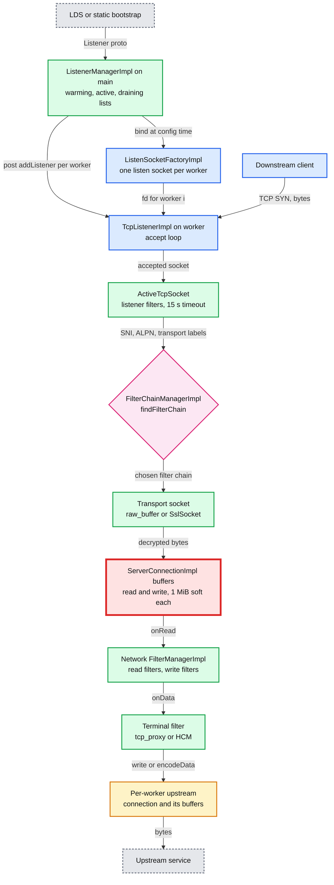

**What to notice**

- **Main thread only manages; workers only serve.** `ListenerManagerImpl` builds and binds sockets on main (so bind errors fail the config), then posts `addListener` to each worker ([worker_impl.cc:72](https://github.com/envoyproxy/envoy/blob/v1.39.1/source/server/worker_impl.cc#L72)).
- **Filter chain selection happens once per connection**, after listener filters and before any transport socket exists. The TLS certificate is chosen later, inside the handshake.
- **The red node is the connection's buffers.** With the service-mesh defaults (1 MiB per buffer, four buffers per proxied TCP pair) memory under slow peers is what breaks first. Section 8 has the numbers.
- **The terminal filter owns the upstream side.** Nothing after it in the chain sees data.

---

## 3. Data flow

### 3.1 Accept path through listener filters

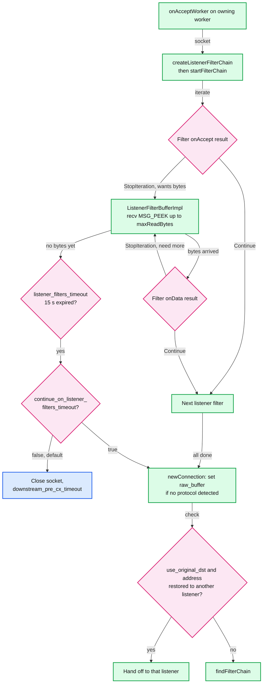

**What to notice**

- **Peek, don't read.** The shared `ListenerFilterBufferImpl` peeks the socket, so the transport socket later reads the same bytes from the kernel. Its capacity grows to the largest `maxReadBytes()` among filters ([active_tcp_socket.cc:155](https://github.com/envoyproxy/envoy/blob/v1.39.1/source/common/listener_manager/active_tcp_socket.cc#L155)).
- **The 15 s timer starts only if a filter paused.** If every filter returns `Continue` synchronously, no timer is created ([active_stream_listener_base.h:98](https://github.com/envoyproxy/envoy/blob/v1.39.1/source/common/listener_manager/active_stream_listener_base.h#L98)).
- **Silent clients hold a socket for 15 s** before the timeout closes them. `downstream_pre_cx_active` counts them.
- **`transport_protocol` defaults to `raw_buffer`** when no filter set it ([active_tcp_socket.cc:233](https://github.com/envoyproxy/envoy/blob/v1.39.1/source/common/listener_manager/active_tcp_socket.cc#L233)), which is what filter chain matching then sees.

### 3.2 Filter chain matching decision tree

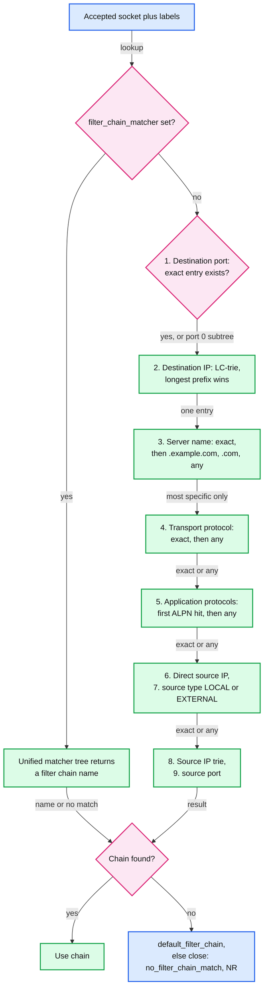

**What to notice**

- **The order is fixed** (listener_components.proto:61 to 71): destination port, destination IP, server name, transport protocol, application protocols, directly connected source IP, source type, source IP, source port. Deprecated `address_suffix`/`suffix_len` are not implemented.
- **Each level keeps only the most specific match** and descends. If the exact SNI `api.example.com` exists but its sub-tree has no `h2` chain, Envoy does not try `*.example.com`. It returns no chain.
- **Tries for IPs**: destination and source IPs use `LcTrie` (level-compressed trie), so matching cost does not grow with the number of CIDRs **[documented]** ([filter_chain_manager_impl.cc:606](https://github.com/envoyproxy/envoy/blob/v1.39.1/source/common/listener_manager/filter_chain_manager_impl.cc#L606)).
- **No match sets response flag `NR`** and `no_filter_chain_match` before closing ([active_stream_listener_base.cc:35](https://github.com/envoyproxy/envoy/blob/v1.39.1/source/common/listener_manager/active_stream_listener_base.cc#L35)).

### 3.3 L4 back-pressure in `tcp_proxy`

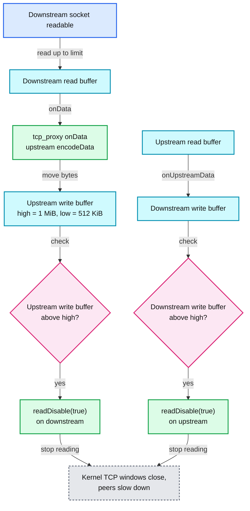

**What to notice**

- **Cross-wiring**: upstream write-buffer high watermark disables *downstream* reads, and downstream write-buffer high watermark disables *upstream* reads ([tcp_proxy.cc:570](https://github.com/envoyproxy/envoy/blob/v1.39.1/source/common/tcp_proxy/tcp_proxy.cc#L570), [tcp_proxy.cc:596](https://github.com/envoyproxy/envoy/blob/v1.39.1/source/common/tcp_proxy/tcp_proxy.cc#L596), [flow_control.md](https://github.com/envoyproxy/envoy/blob/v1.39.1/source/docs/flow_control.md)).
- **Resume at half**: the low watermark callback fires at 512 KiB for a 1 MiB limit and calls `readDisable(false)`.
- **`readDisable` is counted**, not boolean. Two independent reasons to pause need two resumes ([connection_impl.cc:490](https://github.com/envoyproxy/envoy/blob/v1.39.1/source/common/network/connection_impl.cc#L490)).
- **The kernel finishes the job.** A socket nobody reads fills its receive buffer, the TCP window drops to zero, and the sender stops. No application-level protocol is needed.

### 3.4 Listener kinds

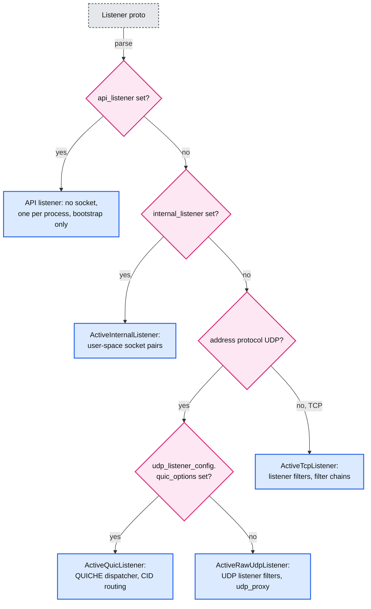

---

## 4. Sequences

### 4.1 Accept to first byte to the terminal filter (TLS listener)

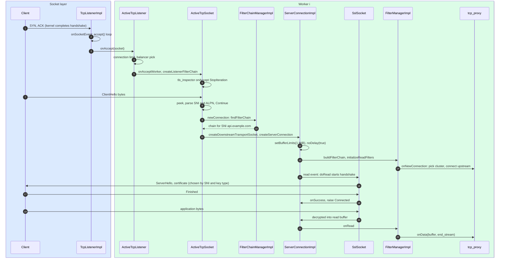

- **Two SNI lookups, two purposes**: `tls_inspector` feeds filter chain matching (step 9), then the chain's `SslSocket` picks a certificate inside BoringSSL's select-certificate callback (step 17).
- **`onNewConnection` runs before the handshake.** `FilterChainUtility::buildFilterChain` calls `initializeReadFilters()` at connection creation ([configuration_impl.cc:44](https://github.com/envoyproxy/envoy/blob/v1.39.1/source/server/configuration_impl.cc#L44)), so `tcp_proxy` in the default `IMMEDIATE` mode dials upstream while TLS is still negotiating.
- **Every step runs on worker i.** No lock is taken on this path except the listener's connection-count atomics and the SDS context reader lock ([report 01](envoy-01-threading-and-process-model.md)).

### 4.2 LDS full update: warm, swap, drain

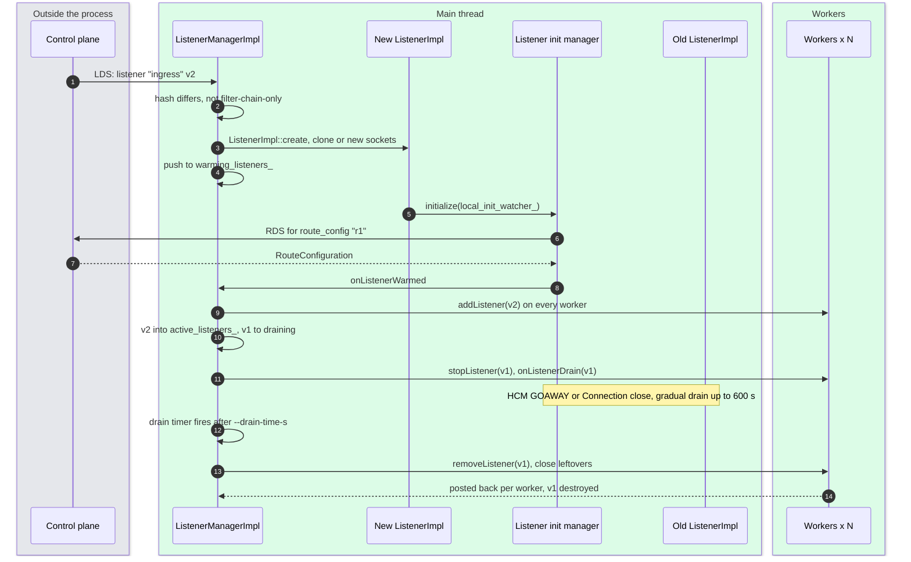

- **Warming blocks nothing**: v1 keeps serving until v2 is warm. If RDS never answers, v2 stays warming (bounded only by `initial_fetch_timeout` 15 s on that subscription, [report 06](envoy-06-xds-control-plane.md)).
- **Same address, same sockets**: `setupSocketFactoryForListener` clones (duplicates) the old listener's sockets when addresses are compatible, so the kernel accept queue is shared and no SYN is lost during the swap ([listener_manager_impl.cc:578](https://github.com/envoyproxy/envoy/blob/v1.39.1/source/common/listener_manager/listener_manager_impl.cc#L578)).
- **The new listener is added before the old stops** ("The warmed listener should be added first so that the worker will accept new connections when it stops listening on the old listener", [listener_manager_impl.cc:866](https://github.com/envoyproxy/envoy/blob/v1.39.1/source/common/listener_manager/listener_manager_impl.cc#L866)).
- **Changing `enable_reuse_port` in an update is rejected** ([listener_manager_impl.cc:583](https://github.com/envoyproxy/envoy/blob/v1.39.1/source/common/listener_manager/listener_manager_impl.cc#L583)).

### 4.3 In-place filter chain update

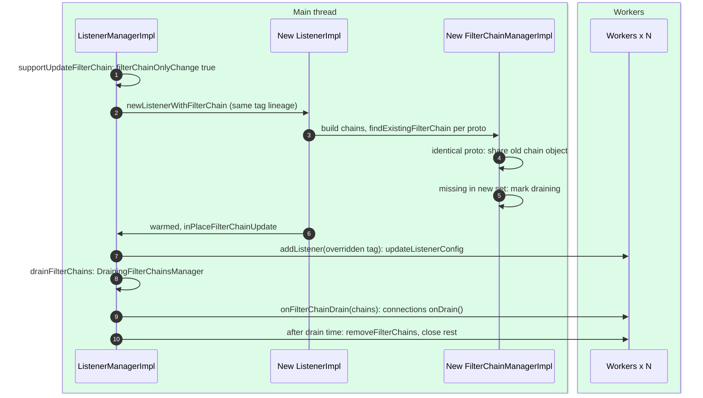

- **Identity is the whole `FilterChain` proto.** `fc_contexts_` is keyed by the message, so renaming a chain or touching any field inside it counts as a change and drains its connections ([filter_chain_manager_impl.cc:835](https://github.com/envoyproxy/envoy/blob/v1.39.1/source/common/listener_manager/filter_chain_manager_impl.cc#L835)).
- **No new listen socket, no new `ActiveTcpListener`.** The worker swaps the config pointer on the existing listener ([connection_handler_impl.cc:49](https://github.com/envoyproxy/envoy/blob/v1.39.1/source/common/listener_manager/connection_handler_impl.cc#L49)).
- **Conditions** ([listener_impl.cc:1146](https://github.com/envoyproxy/envoy/blob/v1.39.1/source/common/listener_manager/listener_impl.cc#L1146)): workers started, no `fcds_config`, new config has at least one filter chain, PROXY-protocol usage unchanged, reuse_port unchanged, and everything outside the three chain fields equal. Stat: `listener_manager.listener_in_place_updated`.

### 4.4 TLS handshake with an asynchronous private key operation

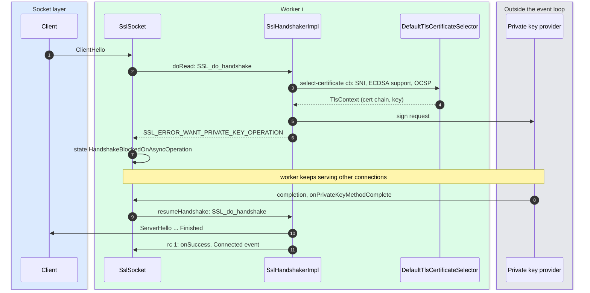

- **Handshakes are CPU work on the worker that owns the connection.** Without a provider, the signature runs inline in `SSL_do_handshake` ([ssl_handshaker.cc:144](https://github.com/envoyproxy/envoy/blob/v1.39.1/source/common/tls/ssl_handshaker.cc#L144)).
- **Four async states** map to `HandshakeBlockedOnAsyncOperation`: pending certificate (async cert selection), private key operation, certificate verify (async validation), X509 lookup ([ssl_handshaker.cc:162](https://github.com/envoyproxy/envoy/blob/v1.39.1/source/common/tls/ssl_handshaker.cc#L162)).
- **Providers**: `private_key_provider` on `TlsCertificate` with `fallback` (default false) to BoringSSL when the hardware is missing ([common.proto:242](https://github.com/envoyproxy/envoy/blob/v1.39.1/api/envoy/extensions/transport_sockets/tls/v3/common.proto#L242)). In-tree implementations live in contrib (`cryptomb` for AVX-512, `qat` for Intel QuickAssist), which the default build excludes.

---

## 5. State machines

### 5.1 Listener lifecycle

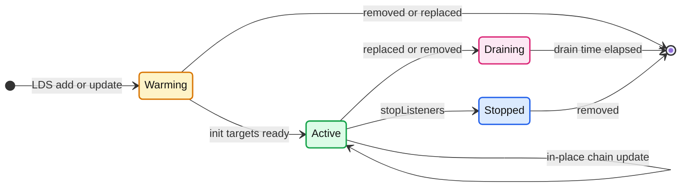

- **Before workers start there is no warming list.** Listeners go straight to active and register with the server's init manager instead, which holds `startWorkers()` ([listener_impl.cc:496](https://github.com/envoyproxy/envoy/blob/v1.39.1/source/common/listener_manager/listener_impl.cc#L496)).
- **An update while warming replaces the warming listener inline** ([listener_manager_impl.cc:656](https://github.com/envoyproxy/envoy/blob/v1.39.1/source/common/listener_manager/listener_manager_impl.cc#L656)). If the update equals the active one, the warming listener is dropped and the active one stays.
- Gauges: `listener_manager.total_listeners_warming`, `total_listeners_active`, `total_listeners_draining`, `total_filter_chains_draining`.

### 5.2 Downstream socket and connection lifecycle

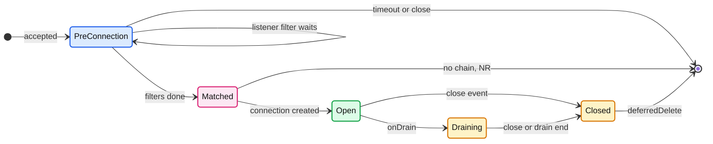

- `PreConnection` is `ActiveTcpSocket`, counted by `downstream_pre_cx_active`. `Open` is `ActiveTcpConnection`, counted by `downstream_cx_active` and grouped per filter chain in `connections_by_context_`, which is what lets Envoy drain one chain ([active_stream_listener_base.cc:146](https://github.com/envoyproxy/envoy/blob/v1.39.1/source/common/listener_manager/active_stream_listener_base.cc#L146)).
- Access logs are emitted on both exits: on `unlink()` if no connection was made, and in `~ActiveTcpConnection`.

### 5.3 TLS socket state

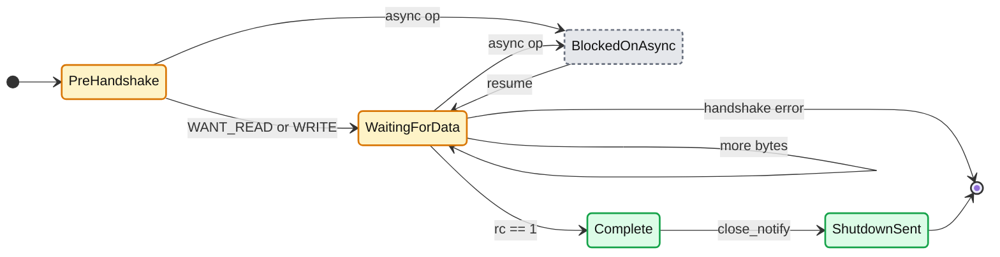

- Handshake failure raises `ssl.connection_error`, and the filter chain's `transport_socket_connect_timeout` (unset by default) bounds how long a connection may stay pre-`Complete` ([listener_components.proto:250](https://github.com/envoyproxy/envoy/blob/v1.39.1/api/envoy/config/listener/v3/listener_components.proto#L250)).

---

## 6. Component deep dives

### 6.1 Listener config anatomy

```yaml
name: ingress_443                       # unique, required for LDS updates
address: { socket_address: { address: 0.0.0.0, port_value: 443 } }
additional_addresses:                   # same filter chains on another address
- address: { socket_address: { address: "::", port_value: 443 } }
listener_filters:
- name: envoy.filters.listener.tls_inspector
  typed_config: { "@type": type.googleapis.com/envoy.extensions.filters.listener.tls_inspector.v3.TlsInspector }
listener_filters_timeout: 15s           # default
per_connection_buffer_limit_bytes: 32768   # default 1 MiB, edge guidance 32 KiB
filter_chains:
- filter_chain_match: { server_names: ["api.example.com"] }
  transport_socket: { name: envoy.transport_sockets.tls, typed_config: { ... } }
  filters: [ { name: envoy.filters.network.http_connection_manager, typed_config: { ... } } ]
default_filter_chain: { filters: [ { name: envoy.filters.network.tcp_proxy, typed_config: { ... } } ] }
```

| Field | Meaning | Default and source |
|---|---|---|
| `address`, `additional_addresses` | where to bind; extra addresses share chains | required unless internal or API listener ([listener.proto:188](https://github.com/envoyproxy/envoy/blob/v1.39.1/api/envoy/config/listener/v3/listener.proto#L188)) |
| `filter_chains`, `filter_chain_matcher`, `default_filter_chain` | chain candidates, optional matcher tree, fallback | no default chain: unmatched connections close ([listener.proto:242](https://github.com/envoyproxy/envoy/blob/v1.39.1/api/envoy/config/listener/v3/listener.proto#L242)) |
| `listener_filters`, `listener_filters_timeout`, `continue_on_listener_filters_timeout` | pre-connection inspection | 15 s, false ([listener.proto:291](https://github.com/envoyproxy/envoy/blob/v1.39.1/api/envoy/config/listener/v3/listener.proto#L291), [listener.proto:300](https://github.com/envoyproxy/envoy/blob/v1.39.1/api/envoy/config/listener/v3/listener.proto#L300)) |
| `per_connection_buffer_limit_bytes` | soft limit for each read and write buffer | 1 MiB ([listener.proto:246](https://github.com/envoyproxy/envoy/blob/v1.39.1/api/envoy/config/listener/v3/listener.proto#L246), applied at [listener_impl.cc:343](https://github.com/envoyproxy/envoy/blob/v1.39.1/source/common/listener_manager/listener_impl.cc#L343)) |
| `per_connection_buffer_high_watermark_timeout` | close a connection stuck above high watermark | 0, disabled ([listener.proto:252](https://github.com/envoyproxy/envoy/blob/v1.39.1/api/envoy/config/listener/v3/listener.proto#L252)) |
| `socket_options`, `tcp_keepalive`, `tcp_fast_open_queue_length`, `enable_mptcp` | raw socket options | not set |
| `enable_reuse_port` | one socket per worker | true, TCP forced off on macOS and Windows ([listener.proto:414](https://github.com/envoyproxy/envoy/blob/v1.39.1/api/envoy/config/listener/v3/listener.proto#L414)) |
| `transparent`, `freebind` | `IP_TRANSPARENT` (TPROXY, needs `CAP_NET_ADMIN`), `IP_FREEBIND` | unset: socket not modified ([listener.proto:316](https://github.com/envoyproxy/envoy/blob/v1.39.1/api/envoy/config/listener/v3/listener.proto#L316), [listener.proto:324](https://github.com/envoyproxy/envoy/blob/v1.39.1/api/envoy/config/listener/v3/listener.proto#L324)) |
| `use_original_dst` | hand iptables-redirected connections to the listener owning the original address | false ([listener.proto:238](https://github.com/envoyproxy/envoy/blob/v1.39.1/api/envoy/config/listener/v3/listener.proto#L238)) |
| `bind_to_port` | false = only reachable by `use_original_dst` hand-off | true ([listener.proto:444](https://github.com/envoyproxy/envoy/blob/v1.39.1/api/envoy/config/listener/v3/listener.proto#L444)) |
| `drain_type` | `DEFAULT` also drains on `/healthcheck/fail`, `MODIFY_ONLY` does not | DEFAULT ([listener.proto:68](https://github.com/envoyproxy/envoy/blob/v1.39.1/api/envoy/config/listener/v3/listener.proto#L68)) |
| `tcp_backlog_size` | listen queue | Linux `somaxconn` (-1), else 128 ([platform.h:327](https://github.com/envoyproxy/envoy/blob/v1.39.1/envoy/common/platform.h#L327)) |
| `max_connections_to_accept_per_socket_event` | accepts per wakeup | unlimited ([listener.proto:437](https://github.com/envoyproxy/envoy/blob/v1.39.1/api/envoy/config/listener/v3/listener.proto#L437)) |
| `connection_balance_config` | exact, CPU locality, or extension | unset, kernel balancing ([report 01](envoy-01-threading-and-process-model.md)) |
| `ignore_global_conn_limit`, `bypass_overload_manager` | exempt admin-like listeners | false |

### 6.2 `ListenerManagerImpl`: lists and update paths

- **Three lists plus one**: `warming_listeners_`, `active_listeners_`, `draining_listeners_` (`std::list<DrainingListener>` with a per-worker removal countdown) and `draining_filter_chains_manager_` for in-place updates.
- **`addOrUpdateListenerInternal`** ([listener_manager_impl.cc:594](https://github.com/envoyproxy/envoy/blob/v1.39.1/source/common/listener_manager/listener_manager_impl.cc#L594)): hash the proto; drop duplicates; try `supportUpdateFilterChain` (in-place) else `ListenerImpl::create` (full); then place into warming (workers started) or active (before start). Stats: `listener_added`, `listener_modified`, `listener_in_place_updated`.
- **Warming** uses a per-listener `Init::ManagerImpl` (`dynamic_init_manager_`). Filters register targets on it (RDS subscription, ECDS, SDS secrets via `transport_factory_context_->setInitManager`). When all are ready, `local_init_watcher_` calls `onListenerWarmed` or `inPlaceFilterChainUpdate` ([listener_impl.cc:376](https://github.com/envoyproxy/envoy/blob/v1.39.1/source/common/listener_manager/listener_impl.cc#L376)).
- **Draining** ([listener_manager_impl.cc:728](https://github.com/envoyproxy/envoy/blob/v1.39.1/source/common/listener_manager/listener_manager_impl.cc#L728)): `stopListener` on every worker (stop accepting, maybe close sockets), `onListenerDrain` (connections get `onDrain()`), `startDrainSequence` over `--drain-time-s`. With the default `gradual` strategy `drainClose()` returns true with probability `elapsed / drain_time` ([drain_manager_impl.cc:75](https://github.com/envoyproxy/envoy/blob/v1.39.1/source/server/drain_manager_impl.cc#L75)), so HTTP connections close spread over 600 s rather than all at once.
- **Removal is a round trip**: each worker's `removeListener` completion posts back to main, and main decrements `workers_pending_removal_`; only at zero is the `ListenerImpl` destroyed, so filters never outlive their config (stats scopes, factories).
- **Static listeners** (bootstrap) cannot be modified or removed by LDS **[documented]** ([lds.rst](https://github.com/envoyproxy/envoy/blob/v1.39.1/docs/root/configuration/listeners/lds.rst)).

### 6.3 Listener kinds

- **TCP** (`ActiveTcpListener`): everything in sections 3 and 4.
- **UDP** (`ActiveRawUdpListener`): UDP listener filters are created once per worker and see every datagram. With reuse_port the kernel hashes each 4-tuple to one worker consistently, so `udp_proxy` can keep per-session state without locks. Raw UDP never forwards packets between workers; `destination()` returns the receiving worker ([active_udp_listener.h:47](https://github.com/envoyproxy/envoy/blob/v1.39.1/source/server/active_udp_listener.h#L47)).
- **QUIC** (`ActiveQuicListener`, HTTP/3): a QUICHE `EnvoyQuicDispatcher` per worker. Connection IDs are generated so that a 4-byte slice modulo worker count names the owning worker; with more than one worker Envoy attaches a classic BPF program to the `SO_REUSEPORT` group that computes the same modulo in the kernel ([envoy_deterministic_connection_id_generator.cc:82](https://github.com/envoyproxy/envoy/blob/v1.39.1/source/common/quic/envoy_deterministic_connection_id_generator.cc#L82)). Without BPF, the receiving worker computes `destination()` and forwards the packet with a `post()` through `UdpListenerWorkerRouterImpl::deliver` ([udp_listener_impl.cc:191](https://github.com/envoyproxy/envoy/blob/v1.39.1/source/common/network/udp_listener_impl.cc#L191)), which Envoy warns is slow. Defaults: idle 300000 ms, handshake 20000 ms, 16 new sessions per loop ([quic_config.proto:38](https://github.com/envoyproxy/envoy/blob/v1.39.1/api/envoy/config/listener/v3/quic_config.proto#L38)). Network filters other than HCM on a QUIC chain only get `onNewConnection`, never `onData`.
- **Internal listeners** (`internal_listener: {}` plus the `envoy.bootstrap.internal_listener` extension): no kernel socket. A cluster endpoint with `envoy_internal_address { server_listener_name }` makes the client connection factory create a pair of user-space `IoHandle`s (`createBufferLimitedIoHandlePair`), buffer 1024 KiB by default ([internal_listener.proto](https://github.com/envoyproxy/envoy/blob/v1.39.1/api/envoy/extensions/bootstrap/internal_listener/v3/internal_listener.proto)). Both ends live on the same worker, so balancing, backlog, freebind and transparent are not allowed. Uses: chaining tcp_proxy tunnels, waypoint-style layering. The `internal_upstream` transport socket passes metadata and filter state across.
- **API listener** (`api_listener`): no socket. Exactly one, bootstrap only, used by Envoy Mobile to drive an HCM from API calls ([listener_manager_impl.cc:528](https://github.com/envoyproxy/envoy/blob/v1.39.1/source/common/listener_manager/listener_manager_impl.cc#L528)).

### 6.4 The accept path class by class

1. **`TcpListenerImpl::onSocketEvent`** ([tcp_listener_impl.cc:63](https://github.com/envoyproxy/envoy/blob/v1.39.1/source/common/network/tcp_listener_impl.cc#L63)): level-triggered read on the listen fd; loop `accept()`; per fd check the global limit (`rejectCxOverGlobalLimit`, overload resource `global_downstream_max_connections`), the `tcp_listener_accept` load-shed point and the overload reject fraction; build `AcceptedSocketImpl`.
2. **`ActiveTcpListener::onAccept`** ([active_tcp_listener.cc:80](https://github.com/envoyproxy/envoy/blob/v1.39.1/source/common/listener_manager/active_tcp_listener.cc#L80)): per-listener limit from runtime key `envoy.resource_limits.listener.<name>.connection_limit` (unlimited by default, [listener_impl.cc:371](https://github.com/envoyproxy/envoy/blob/v1.39.1/source/common/listener_manager/listener_impl.cc#L371)), `downstream_cx_overflow` on rejection; then `onAcceptWorker` with the balancer.
3. **`ActiveTcpSocket`** ([active_tcp_socket.cc](https://github.com/envoyproxy/envoy/blob/v1.39.1/source/common/listener_manager/active_tcp_socket.cc)): owns the socket and a `StreamInfoImpl`; iterates listener filters (`continueFilterChain`), manages the peek buffer and timeout, then `newConnection()`.
4. **`ActiveStreamListenerBase::newConnection`** ([active_stream_listener_base.cc:27](https://github.com/envoyproxy/envoy/blob/v1.39.1/source/common/listener_manager/active_stream_listener_base.cc#L27)): `findFilterChain`; `createDownstreamTransportSocket`; `dispatcher().createServerConnection` (a `ServerConnectionImpl`); optional `transport_socket_connect_timeout`; `setBufferLimits`; `createNetworkFilterChain`; empty chain closes with `no_filters`.
5. **`ActiveTcpConnection`** ([active_stream_listener_base.cc:78](https://github.com/envoyproxy/envoy/blob/v1.39.1/source/common/listener_manager/active_stream_listener_base.cc#L78)): sets `TCP_NODELAY` on every connection ("We just universally set no delay"), bumps `downstream_cx_total` and `downstream_cx_active` (listener and per-worker), and on close is removed and deferred-deleted.
6. **`ConnectionImpl`** ([connection_impl.cc](https://github.com/envoyproxy/envoy/blob/v1.39.1/source/common/network/connection_impl.cc)): owns the `IoHandle`, the transport socket, `read_buffer_`, `write_buffer_`, the network `FilterManagerImpl`, and `read_disable_count_`.

### 6.5 Listener filters

| Filter | What it does | Reads or peeks | Status and posture |
|---|---|---|---|
| `tls_inspector` | parses ClientHello; sets `transport_protocol=tls`, SNI, ALPN list; optional JA3/JA4 fingerprints | peeks, initial buffer grows up to 16 KiB `max_client_hello_size` | stable, robust to untrusted |
| `http_inspector` | sniffs HTTP/1.x request line or HTTP/2 preface on plaintext; sets ALPN `http/1.1` or `h2c` | peeks 8 KiB growing to 64 KiB ([http_inspector.h:57](https://github.com/envoyproxy/envoy/blob/v1.39.1/source/extensions/filters/listener/http_inspector/http_inspector.h#L57)) | stable, requires trusted downstream |
| `original_dst` | reads `SO_ORIGINAL_DST` (iptables `REDIRECT`/`DNAT`) and restores the local address; enables `use_original_dst` hand-off | no bytes | stable |
| `proxy_protocol` | parses PROXY v1 (text) or v2 (binary), rewrites remote and local addresses, keeps TLVs; `allow_requests_without_proxy_protocol` | **drains** the header ([proxy_protocol.cc:364](https://github.com/envoyproxy/envoy/blob/v1.39.1/source/extensions/filters/listener/proxy_protocol/proxy_protocol.cc#L364)) | stable, robust to untrusted downstream |
| `original_src` | makes the upstream connection bind to the downstream source IP (and optionally port), with a socket `mark` for routing | no bytes | alpha |
| `local_ratelimit` | token bucket on new connections before any filter chain work | no bytes | stable; bucket is an `AtomicTokenBucketImpl` shared by all workers |

- Status and posture come from [extensions_metadata.yaml](https://github.com/envoyproxy/envoy/blob/v1.39.1/source/extensions/extensions_metadata.yaml) (e.g. `tls_inspector` at line 866, `http_inspector` at 824).
- **Peek versus consume**: peeking filters leave bytes in the kernel for the TLS or HTTP codec. `proxy_protocol` must consume, because the header is not part of the application stream. That is also why `continue_on_listener_filters_timeout` is dangerous with it: the chain would see a half-read PROXY header ([listener.proto:297](https://github.com/envoyproxy/envoy/blob/v1.39.1/api/envoy/config/listener/v3/listener.proto#L297)).
- **Order matters**: `proxy_protocol` must come before `tls_inspector` when a cloud LB prepends a PROXY header to a TLS stream.

### 6.6 Filter chain matching

- **Build time**: `FilterChainManagerImpl::addFilterChains` turns every `FilterChainMatch` into a nested map: port, IP trie, server-name map, transport map, ALPN map, direct-source trie, source-type array, source trie, source-port map. Overlapping match rules are rejected at config load with "multiple filter chains with overlapping matching rules are defined" ([filter_chain_manager_impl.cc:507](https://github.com/envoyproxy/envoy/blob/v1.39.1/source/common/listener_manager/filter_chain_manager_impl.cc#L507)).
- **Run time** (`findFilterChain`, [filter_chain_manager_impl.cc:551](https://github.com/envoyproxy/envoy/blob/v1.39.1/source/common/listener_manager/filter_chain_manager_impl.cc#L551)): an exact-port sub-tree wins over the port-0 catch-all; inside it a miss returns `default_filter_chain` without trying port 0.
- **Server names**: exact, then each wildcard suffix `.example.com`, `.com`, then chains without `server_names` ([filter_chain_manager_impl.cc:616](https://github.com/envoyproxy/envoy/blob/v1.39.1/source/common/listener_manager/filter_chain_manager_impl.cc#L616)). Partial wildcards like `*w.example.com` and bare `*` are invalid ([listener_components.proto:163](https://github.com/envoyproxy/envoy/blob/v1.39.1/api/envoy/config/listener/v3/listener_components.proto#L163)).
- **ALPN**: iterates the client's list in order and takes the first protocol any chain lists ([filter_chain_manager_impl.cc:667](https://github.com/envoyproxy/envoy/blob/v1.39.1/source/common/listener_manager/filter_chain_manager_impl.cc#L667)).
- **Source type**: `isSameIpOrLoopback` is evaluated only when some chain uses `SAME_IP_OR_LOOPBACK` or `EXTERNAL`, because it can be expensive.
- **`filter_chain_matcher`** (unified matcher API, `xds.type.matcher.v3.Matcher`): replaces all `filter_chain_match` fields; chains must be uniquely named; the matcher returns a name. It can match on inputs the fixed tree cannot (filter state, dynamic metadata, any network input). A matcher-only change does not drain connections whose chain is unchanged ([listener.proto:227](https://github.com/envoyproxy/envoy/blob/v1.39.1/api/envoy/config/listener/v3/listener.proto#L227)).
- **Once matched, a connection is bound to its chain for life.**

### 6.7 Network filter mechanics

- **Interfaces** ([envoy/network/filter.h](https://github.com/envoyproxy/envoy/blob/v1.39.1/envoy/network/filter.h)): `ReadFilter` has `onNewConnection()` and `onData(buffer, end_stream)`; `WriteFilter` has `onWrite(buffer, end_stream)`; both return `FilterStatus::Continue` or `StopIteration`.
- **Order**: read filters run in config order (`moveIntoListBack`), write filters in **reverse** config order (`moveIntoList` inserts at the front) ([filter_manager_impl.cc:17](https://github.com/envoyproxy/envoy/blob/v1.39.1/source/common/network/filter_manager_impl.cc#L17), [filter_manager_impl.cc:29](https://github.com/envoyproxy/envoy/blob/v1.39.1/source/common/network/filter_manager_impl.cc#L29)). A filter listed first sees reads first and writes last.
- **`onNewConnection`** for all read filters runs at connection creation via `initializeReadFilters()` until one returns `StopIteration` ([filter_manager_impl.cc:41](https://github.com/envoyproxy/envoy/blob/v1.39.1/source/common/network/filter_manager_impl.cc#L41)). A filter that stopped there is initialized lazily later.
- **`StopIteration`** on `onData` means "I own this data now": later filters see nothing until the filter calls `continueReading()` (resume with the connection's buffer) or `injectReadDataToFilterChain(data, end_stream)` (push its own bytes to the next filters). Example: the `ext_authz` network filter starts its check on the first `onData`, returns `StopIteration` until the authorization service answers, then calls `continueReading()` ([ext_authz.cc:79](https://github.com/envoyproxy/envoy/blob/v1.39.1/source/extensions/filters/network/ext_authz/ext_authz.cc#L79)).
- **Terminal filters** consume everything and return `StopIteration` always: `tcp_proxy` asserts `data.length() == 0` after `onData` ([tcp_proxy.cc:1136](https://github.com/envoyproxy/envoy/blob/v1.39.1/source/common/tcp_proxy/tcp_proxy.cc#L1136)); `http_connection_manager` feeds the codec.
- **Close gating**: filters can hold a close with `disableClose(true)` so an in-flight async call finishes; `FilterManagerImpl` latches the close action until `filter_pending_close_count_` is zero ([filter_manager_impl.cc](https://github.com/envoyproxy/envoy/blob/v1.39.1/source/common/network/filter_manager_impl.cc)).

### 6.8 Connection buffers and L4 flow control

- **Limits**: `ServerConnectionImpl::setBufferLimits(limit)` calls `setWatermarks(limit)` on both `read_buffer_` and `write_buffer_` ([connection_impl.cc:641](https://github.com/envoyproxy/envoy/blob/v1.39.1/source/common/network/connection_impl.cc#L641)). `WatermarkBuffer::setWatermarks` sets `low_watermark_ = high_watermark / 2` ([watermark_buffer.cc:127](https://github.com/envoyproxy/envoy/blob/v1.39.1/source/common/buffer/watermark_buffer.cc#L127)). High triggers when length exceeds the limit (strictly greater), so moving exactly `limit` bytes through does not fire it, by design ([connection_impl.cc:644](https://github.com/envoyproxy/envoy/blob/v1.39.1/source/common/network/connection_impl.cc#L644)).
- **Read side**: read buffer above high calls `readDisable(true)` on the same connection ([connection_impl.cc:687](https://github.com/envoyproxy/envoy/blob/v1.39.1/source/common/network/connection_impl.cc#L687)); the consumer draining below low re-enables. `RawBufferSocket::doRead` loops `read()` until `EAGAIN` or until `shouldDrainReadBuffer()` (buffer at limit), then marks the socket readable and yields, which also gives other connections on the worker a turn ([raw_buffer_socket.cc:32](https://github.com/envoyproxy/envoy/blob/v1.39.1/source/common/network/raw_buffer_socket.cc#L32)).
- **Write side**: write buffer above high calls `onAboveWriteBufferHighWatermark` on every `ConnectionCallbacks` subscriber; it is the terminal filter that turns this into `readDisable` on the other connection (section 3.3). HTTP adds stream-level and HTTP/2 window layers on top ([report 03](envoy-03-http-connection-manager-and-routing.md)).
- **Stuck connections**: `per_connection_buffer_high_watermark_timeout` (off by default) closes a connection that stays above high watermark for that long.

### 6.9 Transport sockets

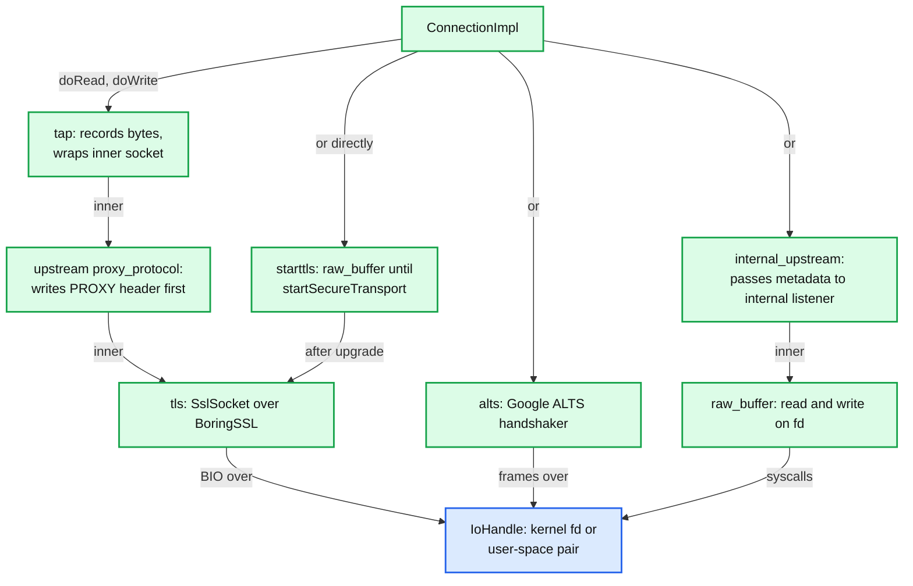

- **raw_buffer**: plaintext; the default when a chain has no `transport_socket`.
- **tls** (`SslSocket`, `source/common/tls/`):
  - One `ServerContextImpl` per chain holds one BoringSSL `SSL_CTX` per certificate. `SSL_CTX_set_select_certificate_cb` on the first context runs `selectTlsContext` for every ClientHello ([server_context_impl.cc:125](https://github.com/envoyproxy/envoy/blob/v1.39.1/source/common/tls/server_context_impl.cc#L125)).
  - **Certificate selection** (`DefaultTlsCertificateSelector::findTlsContext`, [default_tls_certificate_selector.cc:166](https://github.com/envoyproxy/envoy/blob/v1.39.1/source/common/tls/default_tls_certificate_selector.cc#L166)): exact SNI in the DNS-SAN map, then one wildcard level; among matches prefer ECDSA when the client advertises a matching curve, else RSA; skip certs that fail the OCSP policy. No SNI, or SNI with no match: first certificate, unless `full_scan_certs_on_sni_mismatch` (default false) scans all by key type.
  - **ALPN**: server picks with `SSL_select_next_proto` over the configured `alpn_protocols`; no ALPN is advertised if the list is empty, which silently downgrades HTTP/2 clients to HTTP/1.1 ([server_context_impl.cc:71](https://github.com/envoyproxy/envoy/blob/v1.39.1/source/common/tls/server_context_impl.cc#L71), [tls.proto:360](https://github.com/envoyproxy/envoy/blob/v1.39.1/api/envoy/extensions/transport_sockets/tls/v3/tls.proto#L360)).
  - **Resumption**: TLS session tickets via `session_ticket_keys` or SDS; if neither is set and `disable_stateless_session_resumption` is false, Envoy uses an internal key, so tickets do not survive hot restarts or work across hosts ([tls.proto:124](https://github.com/envoyproxy/envoy/blob/v1.39.1/api/envoy/extensions/transport_sockets/tls/v3/tls.proto#L124)). Stateful cache for TLS 1.2 and earlier unless `disable_stateful_session_resumption`. Upstream `max_session_keys` defaults to 1 ([tls.proto:74](https://github.com/envoyproxy/envoy/blob/v1.39.1/api/envoy/extensions/transport_sockets/tls/v3/tls.proto#L74)). Stat `ssl.session_reused`.
  - **OCSP stapling**: `ocsp_staple_policy` default `LENIENT_STAPLING` ([tls.proto:155](https://github.com/envoyproxy/envoy/blob/v1.39.1/api/envoy/extensions/transport_sockets/tls/v3/tls.proto#L155)); `MUST_STAPLE` rejects contexts without a valid response at load time.
  - **Versions**: min TLS 1.2 both sides, max TLS 1.3 server and TLS 1.2 client ([common.proto:100](https://github.com/envoyproxy/envoy/blob/v1.39.1/api/envoy/extensions/transport_sockets/tls/v3/common.proto#L100)).
  - **Secrets not ready**: a `NotReadySslSocket` is created and `downstream_context_secrets_not_ready` increments, so the connection fails fast instead of hanging ([server_ssl_socket.cc:73](https://github.com/envoyproxy/envoy/blob/v1.39.1/source/common/tls/server_ssl_socket.cc#L73)).
- **starttls**: plaintext first, TLS after a filter calls `startSecureTransport()` (e.g. after a Postgres `SSLRequest`).
- **upstream proxy_protocol**: prepends a PROXY v1 (default enum value) or v2 header to the upstream connection, wrapping an inner socket ([proxy_protocol.proto:66](https://github.com/envoyproxy/envoy/blob/v1.39.1/api/envoy/config/core/v3/proxy_protocol.proto#L66)).
- **alts**: Google Application Layer Transport Security via an external handshaker service. **tap**: wraps another socket and records traffic (alpha, requires trusted peers). **internal_upstream**: for internal listeners. Also `http_11_proxy` (CONNECT through an HTTP/1.1 proxy) and `tcp_stats`.
- **Security policy** (mTLS, SPIFFE identity, validation contexts, RBAC) is [report 07](envoy-07-security.md).

### 6.10 `tcp_proxy`

- **Cluster selection**: `cluster` or `weighted_clusters` (random pick by weight, [tcp_proxy.cc:307](https://github.com/envoyproxy/envoy/blob/v1.39.1/source/common/tcp_proxy/tcp_proxy.cc#L307)); the filter state key `envoy.tcp_proxy.cluster` (set by `sni_cluster` or `set_filter_state`) overrides it; `on_demand` fetches a missing cluster via ODCDS; `metadata_match` selects subsets; one `hash_policy` for ring hash or Maglev.
- **Connect**: `max_connect_attempts` 1 by default ([tcp_proxy.cc:219](https://github.com/envoyproxy/envoy/blob/v1.39.1/source/common/tcp_proxy/tcp_proxy.cc#L219)), optional `backoff_options`; exhaustion sets `URX` and `upstream_cx_connect_attempts_exceeded`. Other flags: `UF` connect failure, `UH` no healthy host, `UO` circuit breaker overflow, `NC` cluster missing, `UR` remote reset, `DT` max duration.
- **Upstream "pool"**: `GenericConnPool` over the per-worker TCP connection pool, but the connection is never returned; each downstream connection gets its own upstream connection.
- **Idle timeout**: 1 hour default, `0s` disables, per-connection override by filter state `envoy.tcp_proxy.per_connection_idle_timeout_ms` ([tcp_proxy.cc:147](https://github.com/envoyproxy/envoy/blob/v1.39.1/source/common/tcp_proxy/tcp_proxy.cc#L147), [tcp_proxy.proto:278](https://github.com/envoyproxy/envoy/blob/v1.39.1/api/envoy/extensions/filters/network/tcp_proxy/v3/tcp_proxy.proto#L278)). `max_downstream_connection_duration`: none by default.
- **When to connect**: `upstream_connect_mode` `IMMEDIATE` (default), `ON_DOWNSTREAM_DATA` or `ON_DOWNSTREAM_TLS_HANDSHAKE`; the last two require `max_early_data_bytes` (at most 1 MiB) to buffer bytes that arrive first ([tcp_proxy.proto:33](https://github.com/envoyproxy/envoy/blob/v1.39.1/api/envoy/extensions/filters/network/tcp_proxy/v3/tcp_proxy.proto#L33)). Without it, downstream reads are disabled until the upstream connects.
- **Tunneling**: `tunneling_config` wraps the TCP stream in HTTP `CONNECT` (or `POST` with `use_post`) to an HTTP/1.1 or HTTP/2 upstream; `hostname` supports formatters such as `%REQUESTED_SERVER_NAME%:443`; response headers and trailers can be saved to filter state.
- **Half-close**: the filter calls `enableHalfClose(true)` on the downstream ([tcp_proxy.cc:433](https://github.com/envoyproxy/envoy/blob/v1.39.1/source/common/tcp_proxy/tcp_proxy.cc#L433)), so a client FIN is forwarded as an upstream FIN while bytes keep flowing the other way. After the downstream closes, remaining upstream data is flushed by a per-worker `UpstreamDrainManager` (`upstream_flush_active`).
- **Access log**: one entry at close by default; `access_log_options.access_log_flush_interval` for periodic entries on long connections, `flush_access_log_on_connected` for a start entry.
- **Drain**: `check_drain_close` (default false) closes the downstream when a listener drain is requested; without it a raw TCP connection is only closed at the end of the drain window.

### 6.11 L4 protocol proxies

| Filter | What it does | Status, posture |
|---|---|---|
| `redis_proxy` | parses RESP; routes by key prefix to clusters; splits multi-key commands (`MGETRequest`, `MSETRequest`, `SplitKeysSumResultRequest` for DEL/EXISTS/TOUCH/UNLINK) into per-shard requests and reassembles replies ([command_splitter_impl.h:293](https://github.com/envoyproxy/envoy/blob/v1.39.1/source/extensions/filters/network/redis_proxy/command_splitter_impl.h#L293)); cluster mode through the `envoy.clusters.redis` cluster type (`CLUSTER SLOTS` discovery) and `enable_redirection` for MOVED/ASK; `op_timeout` is required, `buffer_flush_timeout` 3 ms when batching is on | stable, requires trusted peers |
| `mongo_proxy` | decodes the wire protocol for stats, access logs, dynamic metadata and delay fault injection; no routing | stable, trusted |
| `thrift_proxy` | decodes transport (framed, unframed, header, auto) and protocol (binary, compact, auto); routes by method or service name; own filter chain and router | stable, trusted |
| `dubbo_proxy` | Dubbo RPC routing by service and method | alpha, trusted |
| `generic_proxy` | framework for request/response protocols: pluggable codecs (`dubbo`, `http1` in tree, `kafka` in contrib), own L7 filter chain, RDS-style routes, router, tracing and access log | alpha, trusted |
| `zookeeper_proxy` | decodes ZooKeeper requests and responses into stats and metadata; no routing | alpha, trusted |
| `sni_cluster` | sets `envoy.tcp_proxy.cluster` to the SNI so one chain fans out to many clusters | stable, posture unknown |
| `sni_dynamic_forward_proxy` | resolves the SNI host through the DFP DNS cache before `tcp_proxy` connects to a `dynamic_forward_proxy` cluster | alpha, posture unknown |
| `connection_limit` | per-chain active connection cap shared across workers (atomic CAS), optional `delay` before closing | stable, robust |
| contrib `mysql_proxy` | MySQL protocol stats and metadata | alpha, trusted (contrib) |
| contrib `postgres_proxy` | Postgres stats, metadata, can terminate the `SSLRequest` with starttls | stable, trusted (contrib) |
| contrib `kafka_broker`, `kafka_mesh` | Kafka protocol stats; mesh mode routes producers across clusters | wip, trusted (contrib) |

Statuses are from [extensions_metadata.yaml](https://github.com/envoyproxy/envoy/blob/v1.39.1/source/extensions/extensions_metadata.yaml) and [contrib/extensions_metadata.yaml](https://github.com/envoyproxy/envoy/blob/v1.39.1/contrib/extensions_metadata.yaml#L36). "Trusted" means `requires_trusted_downstream_and_upstream`: do not expose these filters to untrusted clients **[documented]**. Contrib filters are not in the default build.

### 6.12 UDP proxy

- **Sessions**: `udp_proxy` is a UDP listener filter; each downstream 4-tuple gets a session with its own upstream UDP socket, pinned to the worker that received the first datagram (kernel reuse_port hashing keeps later datagrams there).
- **Defaults**: session `idle_timeout` 60 s ([udp_proxy/config.cc:108](https://github.com/envoyproxy/envoy/blob/v1.39.1/source/extensions/filters/udp/udp_proxy/config.cc#L108)); `max_rx_datagram_size` 1500 bytes ([udp_socket_config.proto:22](https://github.com/envoyproxy/envoy/blob/v1.39.1/api/envoy/config/core/v3/udp_socket_config.proto#L22)).
- **Options**: `matcher` picks the cluster; `hash_policies` (one) for consistent hashing; `use_per_packet_load_balancing` picks a host per datagram instead of per session; `session_filters` (read and write filters on a session, e.g. dynamic forward proxy, HTTP CONNECT-UDP capsule); `use_original_src_ip` needs `CAP_NET_ADMIN`.
- **Stats**: `downstream_sess_total`, `downstream_sess_active`, `idle_timeout`, datagram counters **[documented]** ([udp_proxy_filter.cc](https://github.com/envoyproxy/envoy/blob/v1.39.1/source/extensions/filters/udp/udp_proxy/udp_proxy_filter.cc)).

---

## 7. Failure modes

| Failure | What the user sees | Blast radius | Mitigation |
|---|---|---|---|
| No chain matches | Connection closed at once; access log `NR`, detail `filter_chain_not_found`; `listener.<addr>.no_filter_chain_match` | Every client with that SNI/ALPN combination | Add `default_filter_chain`; test SNI and ALPN combos; remember there is no backtracking |
| Listener filter never completes (silent client, missing PROXY header) | Connection closed after 15 s; `downstream_pre_cx_timeout` | Sockets and fds held for 15 s each | Lower `listener_filters_timeout` at the edge; `allow_requests_without_proxy_protocol` only if safe |
| Listener stuck warming (RDS or SDS never answers) | Old listener keeps serving; new config not live; `total_listeners_warming` > 0 | That listener's config freshness | Alert on warming gauge; `initial_fetch_timeout` 15 s; check control plane ([report 06](envoy-06-xds-control-plane.md)) |
| LDS change touches a global field (e.g. `socket_options`, `listener_filters`) | Whole listener drains over 600 s; connections recycled | All connections on that listener | Keep churn in filter chains; use `filter_chain_matcher`; shorten `--drain-time-s` if clients reconnect well |
| Slow upstream or downstream reader | Buffers fill to 1 MiB, reads paused, memory climbs; `downstream_cx_rx_bytes_buffered`, `downstream_flow_control_paused_reading_total` | Process memory, then overload actions | Smaller `per_connection_buffer_limit_bytes`, `per_connection_buffer_high_watermark_timeout`, overload manager |
| Upstream connect fails for `tcp_proxy` | Downstream closed; `UF`, `URX`; `upstream_cx_connect_fail` | Per connection | `max_connect_attempts` > 1 with backoff; health checks, outlier detection ([report 05](envoy-05-resilience.md)) |
| TLS secret missing (SDS late) | Handshake fails immediately; `downstream_context_secrets_not_ready` | All new TLS connections on that chain | Listener warming waits for SDS; alert on the counter |
| TLS handshake CPU during a reconnect storm | Accept latency up, `connections_accepted_per_socket_event` spikes, worker `loop_duration_us` tail | All connections on busy workers | Cap `max_connections_to_accept_per_socket_event`, session tickets with shared keys, ECDSA certs, private key offload **[inferred]** |
| Accept queue overflow | SYNs dropped by kernel, clients retry after 1 s or more **[inferred]** | New connections only | Raise `net.core.somaxconn` (Envoy passes -1 on Linux), more workers, faster accept |
| Global connection limit hit | New connections closed; `downstream_global_cx_overflow` | All listeners not marked `ignore_global_conn_limit` | Size `global_downstream_max_connections` resource monitor; exempt admin |
| Idle `tcp_proxy` connection | Closed after 1 hour; `idle_timeout` counter | One connection | Keepalives from the client or a longer per-connection override |

---

## 8. Scalability and performance

**What breaks first: per-connection buffer memory under slow peers.** It is the red node in section 2.

- **Mechanism**: every proxied TCP connection pair has four `WatermarkBuffer`s (downstream read and write, upstream read and write), each with a 1 MiB soft limit from the listener and cluster `per_connection_buffer_limit_bytes` defaults ([listener_impl.cc:343](https://github.com/envoyproxy/envoy/blob/v1.39.1/source/common/listener_manager/listener_impl.cc#L343), [cluster.proto:887](https://github.com/envoyproxy/envoy/blob/v1.39.1/api/envoy/config/cluster/v3/cluster.proto#L887)). Back-pressure keeps each buffer near its limit rather than at zero when a peer is slow, because reads resume at 512 KiB and pause again above 1 MiB.
- **Numbers** **[inferred arithmetic]**: worst case about 4 MiB per slow pair. 10,000 slow connections is about 40 GiB, far beyond a typical 1 to 4 GiB proxy container. Even 1,000 slow clients downloading through a slow link hold up to 4 GiB. With the edge guidance of 32 KiB per buffer ([edge.rst:14](https://github.com/envoyproxy/envoy/blob/v1.39.1/docs/root/configuration/best_practices/edge.rst#L14)) the same 10,000 connections need about 1.25 GiB.
- **Why this breaks before CPU**: slow peers cost almost no CPU (their reads are disabled), so CPU graphs look healthy while RSS climbs. The overload manager is the only automatic brake, and only if configured.
- **Fix**: set `per_connection_buffer_limit_bytes` to 32 to 64 KiB at the edge, configure the overload manager with a heap monitor and `reset_high_memory_stream` or `stop_accepting_connections`, set `per_connection_buffer_high_watermark_timeout` to evict stuck connections, and cap connections with `global_downstream_max_connections`.

Second limit, CPU for TLS handshakes **[inferred]**: each full handshake costs one private-key signature on the worker. A reconnect storm (upstream LB failover, deploy of a large client fleet) makes all workers sign at once; with `max_connections_to_accept_per_socket_event` unlimited, one wakeup can accept hundreds of sockets and then spend the loop in handshakes. Session resumption (shared ticket keys so any Envoy resumes), ECDSA certificates, the accept cap, and private key offload move this limit.

Other bounds:

| Quantity | Value | Bound by |
|---|---|---|
| Listener filter peek | up to 16 KiB (TLS), 64 KiB (HTTP inspector) | `maxReadBytes()` |
| Filter chain lookup | constant number of map and trie lookups, independent of chain count **[inferred]** | nested maps and LC-tries |
| Accepts per wakeup | unlimited TCP, 16 sessions QUIC | defaults |
| Pre-connection lifetime | 15 s | `listener_filters_timeout` |
| Old listener lifetime after update | up to 600 s | `--drain-time-s` |
| `tcp_proxy` idle connection | 1 h | `idle_timeout` |
| Upstream connections for `tcp_proxy` | 1 per downstream connection | no reuse |

---

## 9. Trade-offs and alternatives

| Decision | Chosen | Alternative | Why |
|---|---|---|---|
| Protocol detection | Listener filters peek and label; fixed-order match tree | Full parse before routing, or regex on bytes | Cheap, no copies, bytes stay in the kernel for the real codec. Cost: only a few labels (SNI, ALPN, transport, IPs, ports) unless you use the matcher API |
| Match semantics | Most specific per level, no backtracking | Score all chains, best overall wins | Predictable O(levels) lookup. Cost: surprising misses, needs `default_filter_chain` |
| Listener updates | Immutable listener, warm then swap, drain old | Mutate the live listener | No half-applied config, no dropped SYNs. Cost: connections recycle on global changes, up to 600 s of two versions |
| Filter chain updates | Drain only changed chains, keyed by whole proto | Diff inside chains | Simple identity rule. Cost: any byte change inside a chain drains it |
| Buffer limits | Soft watermarks, 1 MiB default | Hard caps or tiny buffers | Throughput on fast service-mesh links. Cost: memory at the edge; docs say shrink to 32 KiB |
| `tcp_proxy` upstream | Dedicated upstream connection per downstream | Multiplex many downstreams over one upstream | Byte-stream semantics need it. Cost: 2 fds and 4 buffers per session |
| Handshake placement | Inline on the owning worker, optional async key offload | Dedicated crypto thread pool | Keeps the connection on one thread. Cost: CPU spikes on busy workers during storms |
| L4 protocol proxies | Network filters on the same chain | Separate binaries | One config model and one set of stats. Cost: most are `requires_trusted` and not hardened for the internet |

---

## 10. Config reference

| Knob | Default | Where |
|---|---|---|
| `per_connection_buffer_limit_bytes` (listener) | 1 MiB | [listener.proto:246](https://github.com/envoyproxy/envoy/blob/v1.39.1/api/envoy/config/listener/v3/listener.proto#L246) |
| `per_connection_buffer_high_watermark_timeout` | 0 (disabled) | [listener.proto:252](https://github.com/envoyproxy/envoy/blob/v1.39.1/api/envoy/config/listener/v3/listener.proto#L252) |
| `listener_filters_timeout` | 15 s | [listener.proto:291](https://github.com/envoyproxy/envoy/blob/v1.39.1/api/envoy/config/listener/v3/listener.proto#L291), [listener_impl.cc:364](https://github.com/envoyproxy/envoy/blob/v1.39.1/source/common/listener_manager/listener_impl.cc#L364) |
| `continue_on_listener_filters_timeout` | false | [listener.proto:300](https://github.com/envoyproxy/envoy/blob/v1.39.1/api/envoy/config/listener/v3/listener.proto#L300) |
| `enable_reuse_port` | true | [listener.proto:414](https://github.com/envoyproxy/envoy/blob/v1.39.1/api/envoy/config/listener/v3/listener.proto#L414) |
| `bind_to_port` | true | [listener.proto:444](https://github.com/envoyproxy/envoy/blob/v1.39.1/api/envoy/config/listener/v3/listener.proto#L444) |
| `use_original_dst` | false | [listener.proto:238](https://github.com/envoyproxy/envoy/blob/v1.39.1/api/envoy/config/listener/v3/listener.proto#L238) |
| `tcp_backlog_size` | Linux -1 (kernel `somaxconn`), else 128 | [platform.h:327](https://github.com/envoyproxy/envoy/blob/v1.39.1/envoy/common/platform.h#L327), [listener_impl.cc:348](https://github.com/envoyproxy/envoy/blob/v1.39.1/source/common/listener_manager/listener_impl.cc#L348) |
| `max_connections_to_accept_per_socket_event` | unlimited (`UINT32_MAX`) | [listener.proto:437](https://github.com/envoyproxy/envoy/blob/v1.39.1/api/envoy/config/listener/v3/listener.proto#L437) |
| `drain_type` | DEFAULT | [listener.proto:270](https://github.com/envoyproxy/envoy/blob/v1.39.1/api/envoy/config/listener/v3/listener.proto#L270) |
| `--drain-time-s` / `--drain-strategy` | 600 s / gradual | [options_impl.cc:149](https://github.com/envoyproxy/envoy/blob/v1.39.1/source/server/options_impl.cc#L149) |
| Listener connection limit | runtime `envoy.resource_limits.listener.<name>.connection_limit`, unlimited | [listener_impl.cc:371](https://github.com/envoyproxy/envoy/blob/v1.39.1/source/common/listener_manager/listener_impl.cc#L371) |
| FilterChain `transport_socket_connect_timeout` | unset (no timeout) | [listener_components.proto:250](https://github.com/envoyproxy/envoy/blob/v1.39.1/api/envoy/config/listener/v3/listener_components.proto#L250) |
| tls_inspector `max_client_hello_size` | 16 KiB (`SSL3_RT_MAX_PLAIN_LENGTH`) | [tls_inspector.cc:67](https://github.com/envoyproxy/envoy/blob/v1.39.1/source/extensions/filters/listener/tls_inspector/tls_inspector.cc#L67) |
| http_inspector buffer | 8 KiB initial, 64 KiB max | [http_inspector.h:57](https://github.com/envoyproxy/envoy/blob/v1.39.1/source/extensions/filters/listener/http_inspector/http_inspector.h#L57) |
| TLS min / max version | TLS 1.2 / server TLS 1.3, client TLS 1.2 | [common.proto:100](https://github.com/envoyproxy/envoy/blob/v1.39.1/api/envoy/extensions/transport_sockets/tls/v3/common.proto#L100) |
| `alpn_protocols` | empty (no ALPN) | [tls.proto:360](https://github.com/envoyproxy/envoy/blob/v1.39.1/api/envoy/extensions/transport_sockets/tls/v3/tls.proto#L360) |
| `ocsp_staple_policy` | LENIENT_STAPLING | [tls.proto:155](https://github.com/envoyproxy/envoy/blob/v1.39.1/api/envoy/extensions/transport_sockets/tls/v3/tls.proto#L155) |
| `full_scan_certs_on_sni_mismatch` | false | [tls.proto:162](https://github.com/envoyproxy/envoy/blob/v1.39.1/api/envoy/extensions/transport_sockets/tls/v3/tls.proto#L162) |
| Upstream `max_session_keys` | 1 | [tls.proto:74](https://github.com/envoyproxy/envoy/blob/v1.39.1/api/envoy/extensions/transport_sockets/tls/v3/tls.proto#L74) |
| `private_key_provider.fallback` | false | [common.proto:242](https://github.com/envoyproxy/envoy/blob/v1.39.1/api/envoy/extensions/transport_sockets/tls/v3/common.proto#L242) |
| `tcp_proxy.idle_timeout` | 1 h (`0s` disables) | [tcp_proxy.proto:278](https://github.com/envoyproxy/envoy/blob/v1.39.1/api/envoy/extensions/filters/network/tcp_proxy/v3/tcp_proxy.proto#L278) |
| `tcp_proxy.max_connect_attempts` | 1 | [tcp_proxy.proto:302](https://github.com/envoyproxy/envoy/blob/v1.39.1/api/envoy/extensions/filters/network/tcp_proxy/v3/tcp_proxy.proto#L302) |
| `tcp_proxy.upstream_connect_mode` | IMMEDIATE | [tcp_proxy.proto:381](https://github.com/envoyproxy/envoy/blob/v1.39.1/api/envoy/extensions/filters/network/tcp_proxy/v3/tcp_proxy.proto#L381) |
| `tcp_proxy.max_early_data_bytes` | unset: read-disable until connected (max 1 MiB) | [tcp_proxy.proto:399](https://github.com/envoyproxy/envoy/blob/v1.39.1/api/envoy/extensions/filters/network/tcp_proxy/v3/tcp_proxy.proto#L399) |
| `tcp_proxy.check_drain_close` | false | [tcp_proxy.proto:406](https://github.com/envoyproxy/envoy/blob/v1.39.1/api/envoy/extensions/filters/network/tcp_proxy/v3/tcp_proxy.proto#L406) |
| `udp_proxy.idle_timeout` | 60 s | [udp_proxy.proto:219](https://github.com/envoyproxy/envoy/blob/v1.39.1/api/envoy/extensions/filters/udp/udp_proxy/v3/udp_proxy.proto#L219) |
| UDP `max_rx_datagram_size` | 1500 bytes | [udp_socket_config.proto:22](https://github.com/envoyproxy/envoy/blob/v1.39.1/api/envoy/config/core/v3/udp_socket_config.proto#L22) |
| QUIC `idle_timeout` / `crypto_handshake_timeout` / `max_sessions_per_event_loop` | 300000 ms / 20000 ms / 16 | [quic_config.proto:38](https://github.com/envoyproxy/envoy/blob/v1.39.1/api/envoy/config/listener/v3/quic_config.proto#L38) |
| Internal listener `buffer_size_kb` | 1024 KiB | [internal_listener.proto](https://github.com/envoyproxy/envoy/blob/v1.39.1/api/envoy/extensions/bootstrap/internal_listener/v3/internal_listener.proto) |

---

## 11. Stats cheat-sheet

| Stat | Type | What it tells you |
|---|---|---|
| `listener.<addr>.downstream_cx_total` / `downstream_cx_active` | counter / gauge | Accepted and live connections; `worker_<i>.` variants show skew |
| `listener.<addr>.downstream_cx_destroy`, `downstream_cx_length_ms` | counter, histogram | Churn and connection lifetime |
| `listener.<addr>.no_filter_chain_match` | counter | Clients hitting no chain. Should be 0 |
| `listener.<addr>.downstream_pre_cx_active` / `downstream_pre_cx_timeout` | gauge / counter | Sockets stuck in listener filters; timeouts at 15 s |
| `listener.<addr>.downstream_listener_filter_error`, `downstream_listener_filter_remote_close` | counter | Peek failures, clients closing before sending |
| `listener.<addr>.downstream_cx_overflow` / `downstream_global_cx_overflow` / `downstream_cx_overload_reject` | counter | Listener limit, global limit, overload action rejections |
| `listener.<addr>.downstream_cx_transport_socket_connect_timeout` | counter | TLS handshakes that timed out |
| `listener.<addr>.connections_accepted_per_socket_event` | histogram | Accept burst size per wakeup |
| `listener.<addr>.ssl.handshake`, `ssl.connection_error`, `ssl.session_reused`, `ssl.no_certificate`, `ssl.fail_verify_*`, `ssl.ocsp_staple_*` | counter | TLS health and resumption rate |
| `listener.<addr>.extension_config_missing`, `network_extension_config_missing` | counter | ECDS config missing, connections closed |
| `tls_inspector.tls_found`, `tls_not_found`, `sni_found`, `alpn_found`, `client_hello_too_large`, `bytes_processed` | counter, histogram | What clients actually send |
| `listener_manager.listener_added`, `listener_modified`, `listener_removed`, `listener_in_place_updated` | counter | LDS churn and how often the cheap path is taken |
| `listener_manager.listener_create_success` / `listener_create_failure` | counter | Worker-side add results |
| `listener_manager.total_listeners_warming` / `active` / `draining`, `total_filter_chains_draining` | gauge | Warming stuck, drain backlog |
| `listener_manager.lds.update_success`, `update_rejected` | counter | LDS subscription health ([report 06](envoy-06-xds-control-plane.md)) |
| `tcp.<prefix>.downstream_cx_total`, `downstream_cx_no_route`, `idle_timeout`, `max_downstream_connection_duration` | counter | tcp_proxy sessions and why they ended |
| `tcp.<prefix>.downstream_cx_rx_bytes_buffered`, `downstream_cx_tx_bytes_buffered`, `downstream_flow_control_paused_reading_total` | gauge, counter | Back-pressure in action |
| `tcp.<prefix>.upstream_flush_active`, `early_data_received_count_total` | gauge, counter | Post-close flushing, early data buffering |
| `cluster.<name>.upstream_cx_connect_attempts_exceeded` | counter | tcp_proxy gave up connecting |

---

## 12. Staff-level questions

**Q1. You front 200 TLS hostnames on port 443 with one Envoy listener. Walk through how a connection for `api.example.com` finds its certificate and its filters, and where it can go wrong.**
The listener has `tls_inspector` as a listener filter. After accept on one worker, `ActiveTcpSocket` runs it; it returns `StopIteration`, the shared peek buffer reads the ClientHello with `MSG_PEEK` (up to 16 KiB), and the filter sets transport protocol `tls`, SNI and the ALPN list on the socket. `FilterChainManagerImpl::findFilterChain` walks port, destination IP, then server name (exact, then `.example.com`, `.com`, then chains without names), transport protocol and ALPN, keeping only the most specific match at each level with no backtracking. The chosen chain owns an `SslSocket` whose `ServerContextImpl` selects a certificate inside BoringSSL's select-certificate callback, again by SNI and preferring ECDSA if the client supports the curve. Pitfalls: an exact-SNI chain that lacks the client's ALPN yields no chain rather than the wildcard chain; a missing `alpn_protocols` list silently downgrades HTTP/2 clients; a client without SNI gets the first certificate unless `full_scan_certs_on_sni_mismatch` is on; and 200 chains share one listener, so any change to a global listener field drains all 200 hostnames' connections for up to 600 s.

**Q2. The control plane updates one route in one filter chain and suddenly all long-lived connections on the listener reconnect. Why, and how do you prevent it?**
Routes normally live in RDS, which updates by pointer swap without touching connections, so the first question is why a route change touched LDS at all: inline `route_config` inside the HCM makes every route change an LDS change. Even then, if only `filter_chains` changed, Envoy takes the in-place path and drains only chains whose proto changed, because `fc_contexts_` is keyed by the entire `FilterChain` message. All connections reconnecting means either the control plane also changed a listener-global field (listener filters, socket options, `per_connection_buffer_limit_bytes`; field order does not matter because `filterChainOnlyChange` compares with `MessageDifferencer` using set semantics), or it rewrote every chain (for example, regenerated names or re-ordered filter configs inside each chain). Fix: move routes to RDS or VHDS, keep chain protos byte-stable, check `listener_manager.listener_in_place_updated` versus `listener_modified`, and shorten `--drain-time-s` only if clients reconnect gracefully.

**Q3. Explain how `tcp_proxy` prevents a fast client from exhausting Envoy memory when the upstream is slow, and what the actual memory bound is.**
Each side's `ConnectionImpl` has a read and write `WatermarkBuffer` with high watermark equal to `per_connection_buffer_limit_bytes` and low watermark half of that. When the upstream write buffer exceeds 1 MiB, `tcp_proxy`'s upstream callbacks call `readDisable(true)` on the downstream connection, so Envoy stops reading that socket; the kernel receive buffer fills and TCP flow control slows the client. When the upstream drains below 512 KiB, reading resumes. The reverse direction is symmetric. The bound is soft: each buffer can hold the limit plus one read's worth, and there are four buffers per session, so roughly 4 MiB per slow pair at defaults. That is fine for a few hundred mesh connections and dangerous for tens of thousands of edge connections, which is why the edge guide sets 32 KiB and why you pair it with the overload manager and `per_connection_buffer_high_watermark_timeout`.

**Q4. Why does Envoy run a TLS handshake on the worker's event loop instead of a crypto thread pool, and what do you do when handshakes dominate CPU?**
Keeping the whole connection on one worker means no locks, no cross-thread handoff and good cache locality; a pool would need a handoff per handshake and a way back, which is exactly what the async private key provider interface already offers when you want it. BoringSSL's handshake is non-blocking: `SSL_do_handshake` returns want-read or want-write and the worker moves on, and with a provider it returns `SSL_ERROR_WANT_PRIVATE_KEY_OPERATION`, the socket enters `HandshakeBlockedOnAsyncOperation`, and the worker serves other connections until the provider calls `onPrivateKeyMethodComplete`. When handshakes dominate: raise resumption rates with shared session ticket keys (the default internal key does not survive restarts or span hosts), prefer ECDSA certificates, cap `max_connections_to_accept_per_socket_event` so one wakeup does not accept hundreds of handshakes, spread reconnect storms with jitter on clients, and consider hardware offload through contrib `cryptomb` or `qat`.

**Q5. Compare internal listeners, `use_original_dst` hand-off and a second Envoy hop as ways to chain L4 processing. When would you pick each?**
`use_original_dst` hand-off is for transparent interception: iptables redirects everything to one port, `original_dst` restores the real destination, and the socket is handed to the listener bound (or `bind_to_port: false`) for that address on the same worker, costing nothing extra but only matching on destination address. An internal listener is for composing pipelines inside one process: a cluster whose endpoint is an `envoy_internal_address` creates a user-space socket pair to a listener with its own listener filters and filter chains, on the same worker with no kernel round trip, useful for tunneling (tcp_proxy over CONNECT feeding another listener) or layering policy; limits are no connection balancing and a 1024 KiB default buffer per pair. A second Envoy hop is for crossing trust or failure domains (a separate gateway fleet, different teams, independent scaling and blast radius) at the cost of an extra network hop and TLS. The Staff answer picks the in-process options for composition and reserves the extra hop for organizational or isolation boundaries.

---

## 13. Sources

- **Listener manager and listeners**: [source/common/listener_manager/listener_manager_impl.cc](https://github.com/envoyproxy/envoy/blob/v1.39.1/source/common/listener_manager/listener_manager_impl.cc), [listener_impl.cc](https://github.com/envoyproxy/envoy/blob/v1.39.1/source/common/listener_manager/listener_impl.cc), [filter_chain_manager_impl.cc](https://github.com/envoyproxy/envoy/blob/v1.39.1/source/common/listener_manager/filter_chain_manager_impl.cc), [connection_handler_impl.cc](https://github.com/envoyproxy/envoy/blob/v1.39.1/source/common/listener_manager/connection_handler_impl.cc), [active_tcp_listener.cc](https://github.com/envoyproxy/envoy/blob/v1.39.1/source/common/listener_manager/active_tcp_listener.cc), [active_tcp_socket.cc](https://github.com/envoyproxy/envoy/blob/v1.39.1/source/common/listener_manager/active_tcp_socket.cc), [active_stream_listener_base.cc](https://github.com/envoyproxy/envoy/blob/v1.39.1/source/common/listener_manager/active_stream_listener_base.cc), [active_stream_listener_base.h](https://github.com/envoyproxy/envoy/blob/v1.39.1/source/common/listener_manager/active_stream_listener_base.h), [source/server/drain_manager_impl.cc](https://github.com/envoyproxy/envoy/blob/v1.39.1/source/server/drain_manager_impl.cc), [worker_impl.cc](https://github.com/envoyproxy/envoy/blob/v1.39.1/source/server/worker_impl.cc), [active_udp_listener.h](https://github.com/envoyproxy/envoy/blob/v1.39.1/source/server/active_udp_listener.h), [configuration_impl.cc](https://github.com/envoyproxy/envoy/blob/v1.39.1/source/server/configuration_impl.cc), [source/common/quic/active_quic_listener.cc](https://github.com/envoyproxy/envoy/blob/v1.39.1/source/common/quic/active_quic_listener.cc), [envoy_deterministic_connection_id_generator.cc](https://github.com/envoyproxy/envoy/blob/v1.39.1/source/common/quic/envoy_deterministic_connection_id_generator.cc), [source/common/network/udp_listener_impl.cc](https://github.com/envoyproxy/envoy/blob/v1.39.1/source/common/network/udp_listener_impl.cc), [source/extensions/bootstrap/internal_listener/](https://github.com/envoyproxy/envoy/blob/v1.39.1/source/extensions/bootstrap/internal_listener/client_connection_factory.cc)
- **Network layer**: [source/common/network/tcp_listener_impl.cc](https://github.com/envoyproxy/envoy/blob/v1.39.1/source/common/network/tcp_listener_impl.cc), [connection_impl.cc](https://github.com/envoyproxy/envoy/blob/v1.39.1/source/common/network/connection_impl.cc), [filter_manager_impl.cc](https://github.com/envoyproxy/envoy/blob/v1.39.1/source/common/network/filter_manager_impl.cc), [raw_buffer_socket.cc](https://github.com/envoyproxy/envoy/blob/v1.39.1/source/common/network/raw_buffer_socket.cc), [listener_filter_buffer_impl.cc](https://github.com/envoyproxy/envoy/blob/v1.39.1/source/common/network/listener_filter_buffer_impl.cc), [source/common/buffer/watermark_buffer.cc](https://github.com/envoyproxy/envoy/blob/v1.39.1/source/common/buffer/watermark_buffer.cc), [envoy/network/filter.h](https://github.com/envoyproxy/envoy/blob/v1.39.1/envoy/network/filter.h), [envoy/network/listener.h](https://github.com/envoyproxy/envoy/blob/v1.39.1/envoy/network/listener.h), [envoy/common/platform.h](https://github.com/envoyproxy/envoy/blob/v1.39.1/envoy/common/platform.h)
- **TLS**: [source/common/tls/ssl_socket.cc](https://github.com/envoyproxy/envoy/blob/v1.39.1/source/common/tls/ssl_socket.cc), [ssl_handshaker.cc](https://github.com/envoyproxy/envoy/blob/v1.39.1/source/common/tls/ssl_handshaker.cc), [server_context_impl.cc](https://github.com/envoyproxy/envoy/blob/v1.39.1/source/common/tls/server_context_impl.cc), [default_tls_certificate_selector.cc](https://github.com/envoyproxy/envoy/blob/v1.39.1/source/common/tls/default_tls_certificate_selector.cc), [server_ssl_socket.cc](https://github.com/envoyproxy/envoy/blob/v1.39.1/source/common/tls/server_ssl_socket.cc), [stats.h](https://github.com/envoyproxy/envoy/blob/v1.39.1/source/common/tls/stats.h)
- **Filters**: [source/extensions/filters/listener/tls_inspector/tls_inspector.cc](https://github.com/envoyproxy/envoy/blob/v1.39.1/source/extensions/filters/listener/tls_inspector/tls_inspector.cc), [http_inspector.cc](https://github.com/envoyproxy/envoy/blob/v1.39.1/source/extensions/filters/listener/http_inspector/http_inspector.cc), [original_dst.cc](https://github.com/envoyproxy/envoy/blob/v1.39.1/source/extensions/filters/listener/original_dst/original_dst.cc), [proxy_protocol.cc](https://github.com/envoyproxy/envoy/blob/v1.39.1/source/extensions/filters/listener/proxy_protocol/proxy_protocol.cc), [local_ratelimit.cc](https://github.com/envoyproxy/envoy/blob/v1.39.1/source/extensions/filters/listener/local_ratelimit/local_ratelimit.cc), [source/common/tcp_proxy/tcp_proxy.cc](https://github.com/envoyproxy/envoy/blob/v1.39.1/source/common/tcp_proxy/tcp_proxy.cc), [redis_proxy/command_splitter_impl.h](https://github.com/envoyproxy/envoy/blob/v1.39.1/source/extensions/filters/network/redis_proxy/command_splitter_impl.h), [connection_limit.cc](https://github.com/envoyproxy/envoy/blob/v1.39.1/source/extensions/filters/network/connection_limit/connection_limit.cc), [sni_cluster.cc](https://github.com/envoyproxy/envoy/blob/v1.39.1/source/extensions/filters/network/sni_cluster/sni_cluster.cc), [udp_proxy/config.cc](https://github.com/envoyproxy/envoy/blob/v1.39.1/source/extensions/filters/udp/udp_proxy/config.cc), [source/extensions/extensions_metadata.yaml](https://github.com/envoyproxy/envoy/blob/v1.39.1/source/extensions/extensions_metadata.yaml), [contrib/extensions_metadata.yaml](https://github.com/envoyproxy/envoy/blob/v1.39.1/contrib/extensions_metadata.yaml)
- **Protos**: [api/envoy/config/listener/v3/listener.proto](https://github.com/envoyproxy/envoy/blob/v1.39.1/api/envoy/config/listener/v3/listener.proto), [listener_components.proto](https://github.com/envoyproxy/envoy/blob/v1.39.1/api/envoy/config/listener/v3/listener_components.proto), [quic_config.proto](https://github.com/envoyproxy/envoy/blob/v1.39.1/api/envoy/config/listener/v3/quic_config.proto), [api/envoy/extensions/transport_sockets/tls/v3/tls.proto](https://github.com/envoyproxy/envoy/blob/v1.39.1/api/envoy/extensions/transport_sockets/tls/v3/tls.proto), [common.proto](https://github.com/envoyproxy/envoy/blob/v1.39.1/api/envoy/extensions/transport_sockets/tls/v3/common.proto), [api/envoy/config/core/v3/proxy_protocol.proto](https://github.com/envoyproxy/envoy/blob/v1.39.1/api/envoy/config/core/v3/proxy_protocol.proto), [udp_socket_config.proto](https://github.com/envoyproxy/envoy/blob/v1.39.1/api/envoy/config/core/v3/udp_socket_config.proto), [api/envoy/extensions/filters/network/tcp_proxy/v3/tcp_proxy.proto](https://github.com/envoyproxy/envoy/blob/v1.39.1/api/envoy/extensions/filters/network/tcp_proxy/v3/tcp_proxy.proto), [udp_proxy.proto](https://github.com/envoyproxy/envoy/blob/v1.39.1/api/envoy/extensions/filters/udp/udp_proxy/v3/udp_proxy.proto), [internal_listener.proto](https://github.com/envoyproxy/envoy/blob/v1.39.1/api/envoy/extensions/bootstrap/internal_listener/v3/internal_listener.proto)
- **Docs**: [source/docs/listener.md](https://github.com/envoyproxy/envoy/blob/v1.39.1/source/docs/listener.md), [source/docs/flow_control.md](https://github.com/envoyproxy/envoy/blob/v1.39.1/source/docs/flow_control.md), [docs/root/intro/arch_overview/listeners/listeners.rst](https://github.com/envoyproxy/envoy/blob/v1.39.1/docs/root/intro/arch_overview/listeners/listeners.rst), [docs/root/configuration/listeners/lds.rst](https://github.com/envoyproxy/envoy/blob/v1.39.1/docs/root/configuration/listeners/lds.rst), [docs/root/configuration/listeners/stats.rst](https://github.com/envoyproxy/envoy/blob/v1.39.1/docs/root/configuration/listeners/stats.rst), [docs/root/configuration/best_practices/edge.rst](https://github.com/envoyproxy/envoy/blob/v1.39.1/docs/root/configuration/best_practices/edge.rst)

---

<!-- nav:start -->
[← 01 Threading](envoy-01-threading-and-process-model.md) · **[Index](README.md)** · [03 HCM and Routing →](envoy-03-http-connection-manager-and-routing.md)
<!-- nav:end -->
