# Envoy 03: HTTP Connection Manager, Filters and Routing

> **Scope**: how one HTTP request moves through the HTTP connection manager (HCM): codec selection, the per-request `ActiveStream` and filter manager, filter iteration statuses, buffering and HTTP-level flow control, header handling, HCM timeouts, local replies, upgrades, route configuration and matching, and the router filter up to the connection pool. Listeners and TLS are in [report 02](envoy-02-listeners-and-network-filters.md); pools and load balancing in [report 04](envoy-04-cluster-manager-and-load-balancing.md); retries, the timeout matrix and the full response-flag cheat-sheet in [report 05](envoy-05-resilience.md).
>
> **Series baseline: Envoy v1.39.1** (released 2026-08-27). Defaults, field names and
> class names were read from that tag's source tree. **[documented]** = read in source or
> official docs of this release. **[inferred]** = reasoning, not upstream text.
> **[unverified]** = could not be confirmed, do not quote.

---

<!-- nav:start -->
[← 02 Listeners](envoy-02-listeners-and-network-filters.md) · **[Index](README.md)** · [04 Load Balancing →](envoy-04-cluster-manager-and-load-balancing.md)
<!-- nav:end -->

<!-- toc:start -->

<b>Sections in this report (13)</b>

- [1. Overview](#1-overview)
- [2. Architecture](#2-architecture)
- [3. Data flow](#3-data-flow)
- [4. Sequences](#4-sequences)
- [5. State machines](#5-state-machines)
- [6. Component deep dives](#6-component-deep-dives)
- [7. Failure modes](#7-failure-modes)
- [8. Scalability and performance](#8-scalability-and-performance)
- [9. Trade-offs and alternatives](#9-trade-offs-and-alternatives)
- [10. Config reference](#10-config-reference)
- [11. Stats cheat-sheet](#11-stats-cheat-sheet)
- [12. Staff-level questions](#12-staff-level-questions)
- [13. Sources](#13-sources)

<!-- toc:end -->

## 1. Overview

- **The problem**: one worker thread must terminate thousands of HTTP/1.1, HTTP/2 and HTTP/3 (HTTP over QUIC, a UDP transport) connections, run a chain of pluggable filters on every request, pick a route and a cluster, and stream bytes both ways without holding whole bodies in memory. A slow client, a slow upstream or a filter waiting on a remote service must never block the thread or blow up memory.
- **Design bet 1: the HCM is just a network filter.** `ConnectionManagerImpl` is the terminal L4 read filter on a listener filter chain. It owns a codec and turns bytes into `ActiveStream` objects. Everything HTTP lives above that line.
- **Design bet 2: one protocol-agnostic stream API.** HTTP/1 (Balsa parser), HTTP/2 (nghttp2) and HTTP/3 (QUICHE) codecs all emit the same `decodeHeaders / decodeData / decodeTrailers` calls. Filters never know the wire protocol.
- **Design bet 3: filters are a stoppable pipeline.** Decoder filters run in config order, encoder filters in reverse. Any filter can stop iteration, buffer, or answer locally, and resume later on the same thread with `continueDecoding()`.
- **Design bet 4: soft buffer limits plus watermarks, not hard caps.** Every buffer has a high watermark. Crossing it calls `readDisable(true)` on the data source (stop reading a socket, or stop granting HTTP/2 window). Backpressure propagates across the proxy end to end.
- **Design bet 5: the route is a per-stream snapshot.** Each request pins a `shared_ptr` to the route table current at header time. Config pushes over RDS (Route Discovery Service, one of the xDS discovery APIs) never change an in-flight request's routing.

**One sentence: the HCM turns bytes into protocol-neutral streams, runs each stream through an ordered, pausable filter chain whose last filter (the router) picks a route snapshot, a cluster, a host and a pooled connection, and uses watermark callbacks so that every buffer on the path pushes back instead of growing.**

### Premise corrections up front

| Commonly said | Actual in v1.39.1 | Source |
|---|---|---|
| The HTTP/1 codec uses the nodejs `http_parser` | `ConnectionImpl` constructs a `BalsaParser` (from QUICHE). The old parser survives only in `legacy_parser_impl.*` | [codec_impl.cc:537](https://github.com/envoyproxy/envoy/blob/v1.39.1/source/common/http/http1/codec_impl.cc#L537) |
| Envoy moved HTTP/2 to oghttp2 | nghttp2 is still the default. `http2_use_oghttp2` is a `FALSE_RUNTIME_GUARD` whose comment says "flip back to true once performance aligns with nghttp2"; oghttp2 is opt-in via the guard or `use_oghttp2_codec` | [runtime_features.cc:276](https://github.com/envoyproxy/envoy/blob/v1.39.1/source/common/runtime/runtime_features.cc#L276), [http2/codec_impl.cc:1007](https://github.com/envoyproxy/envoy/blob/v1.39.1/source/common/http/http2/codec_impl.cc#L1007) |
| HTTP/2 stream window is 256 MiB and streams are unlimited (2^31-1) | 16 MiB stream window, 24 MiB connection window, 1024 max concurrent streams. 2^31-1 is only the validation ceiling | [protocol.proto:609](https://github.com/envoyproxy/envoy/blob/v1.39.1/api/envoy/config/core/v3/protocol.proto#L609), [http_option_limits.h:24](https://github.com/envoyproxy/envoy/blob/v1.39.1/source/common/http/http_option_limits.h#L24) |
| RFC1918 source addresses are "internal" by default | Without `internal_address_config`, `DefaultInternalAddressConfig::isInternalAddress()` returns `false` for every address (since 1.33.0). No request is internal, so every request gets `x-envoy-*` control headers stripped | [conn_manager_config.h:197](https://github.com/envoyproxy/envoy/blob/v1.39.1/source/common/http/conn_manager_config.h#L197), [hcm.proto:801](https://github.com/envoyproxy/envoy/blob/v1.39.1/api/envoy/extensions/filters/network/http_connection_manager/v3/http_connection_manager.proto#L801) |
| A route to an unknown cluster returns 404 (as the `validate_clusters` and `cluster_header` proto comments say) | The router sends `cluster_not_found_response_code`, whose zero value is `SERVICE_UNAVAILABLE`: **503 with flag NC**. A missing `cluster_header` header gives an empty cluster name, so also 503 NC | [router.cc:567](https://github.com/envoyproxy/envoy/blob/v1.39.1/source/common/router/router.cc#L567), [route_components.proto:820](https://github.com/envoyproxy/envoy/blob/v1.39.1/api/envoy/config/route/v3/route_components.proto#L820), [route.proto:97](https://github.com/envoyproxy/envoy/blob/v1.39.1/api/envoy/config/route/v3/route.proto#L97) |
| `stream_idle_timeout` always answers 408 | It answers 408 only if the request is not fully received. If the request is complete it answers **504** (`maybeRequestTimeoutCode`). Same rule for `request_timeout`, `request_headers_timeout` and `max_stream_duration` | [utility.cc:1535](https://github.com/envoyproxy/envoy/blob/v1.39.1/source/common/http/utility.cc#L1535), [conn_manager_impl.cc:1061](https://github.com/envoyproxy/envoy/blob/v1.39.1/source/common/http/conn_manager_impl.cc#L1061) |
| `FilterHeadersStatus::StopIterationAndBuffer` | No such value. Headers use `StopAllIterationAndBuffer` / `StopAllIterationAndWatermark`. `StopIterationAndBuffer`, `StopIterationAndWatermark` and `StopIterationNoBuffer` are `FilterDataStatus` values | [filter.h:37](https://github.com/envoyproxy/envoy/blob/v1.39.1/envoy/http/filter.h#L37), [filter.h:128](https://github.com/envoyproxy/envoy/blob/v1.39.1/envoy/http/filter.h#L128) |
| `codec_type: AUTO` sniffs the request line | It uses ALPN (Application-Layer Protocol Negotiation, a TLS extension) if present, otherwise it only checks whether the first read starts with `PRI * HTTP/2`. A first read holding only part of that preface is treated as HTTP/1 | [conn_manager_utility.cc:71](https://github.com/envoyproxy/envoy/blob/v1.39.1/source/common/http/conn_manager_utility.cc#L71) |
| A filter that edits headers changes the route | Only if it calls `clearRouteCache()` (or `setRoute`). After response headers are encoded the route cache is blocked and further clears are ignored | [conn_manager_impl.cc:2468](https://github.com/envoyproxy/envoy/blob/v1.39.1/source/common/http/conn_manager_impl.cc#L2468), [conn_manager_impl.cc:2014](https://github.com/envoyproxy/envoy/blob/v1.39.1/source/common/http/conn_manager_impl.cc#L2014) |
| HTTP/1 pipelined requests are proxied in parallel | One request at a time per connection. The parser pauses after each message and the connection is read-disabled until the active request completes | [codec_impl.cc:1305](https://github.com/envoyproxy/envoy/blob/v1.39.1/source/common/http/http1/codec_impl.cc#L1305) |

---

## 2. Architecture

The diagram to draw first: one downstream connection, one HCM, many streams, one router per stream.

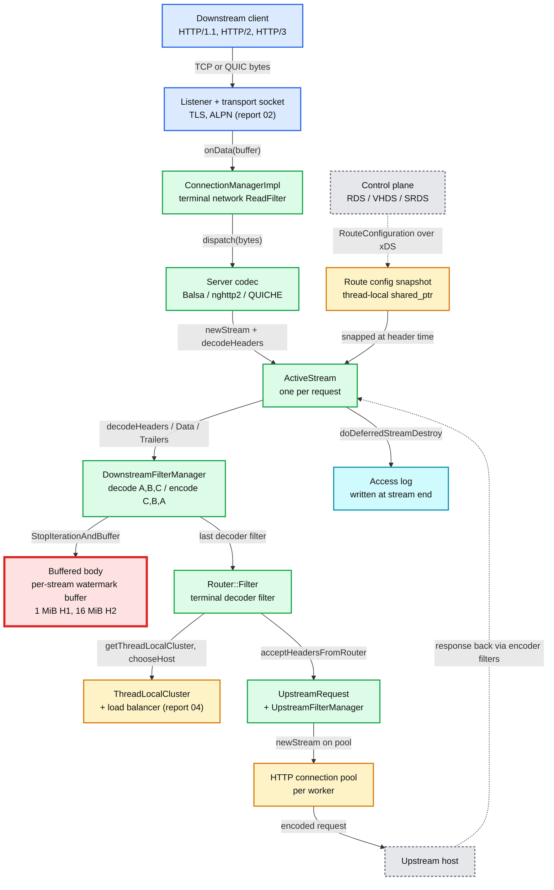

**What to notice**

- **Everything is on one worker thread.** The connection, its codec, every `ActiveStream`, every filter instance, the router and the pool all live on the worker that accepted the socket ([report 01](envoy-01-threading-and-process-model.md)). No locks on the request path.
- **The HCM always returns `StopIteration` from `onData`** ([conn_manager_impl.cc:515](https://github.com/envoyproxy/envoy/blob/v1.39.1/source/common/http/conn_manager_impl.cc#L515)). It is terminal. Network filters placed after it never see bytes.
- **Filter instances are per stream, filter configs are shared.** `createFilterChain` runs the factory callbacks for every request ([filter_manager.cc:1773](https://github.com/envoyproxy/envoy/blob/v1.39.1/source/common/http/filter_manager.cc#L1773)).
- **The router is a normal decoder filter.** It is simply required to be last. It then runs a second, upstream filter chain per attempt inside `UpstreamRequest`.
- **The red node is the bottleneck of this report.** Filter-manager buffers hold request or response bodies when a filter returns a buffering status, or when the router buffers a body for retries. The per-stream limit is the codec stream buffer limit: 1 MiB for HTTP/1 (listener `per_connection_buffer_limit_bytes`, [listener.proto:246](https://github.com/envoyproxy/envoy/blob/v1.39.1/api/envoy/config/listener/v3/listener.proto#L246)) and 16 MiB for HTTP/2 (`initial_stream_window_size`, [http2/codec_impl.cc:992](https://github.com/envoyproxy/envoy/blob/v1.39.1/source/common/http/http2/codec_impl.cc#L992)). With 1024 concurrent streams, one HTTP/2 connection can pin up to 1024 x 16 MiB = 16 GiB before any 413 fires **[inferred arithmetic]**. Memory runs out before CPU. §8 solves it.

---

## 3. Data flow

### 3.1 Request (decode) path inside the HCM

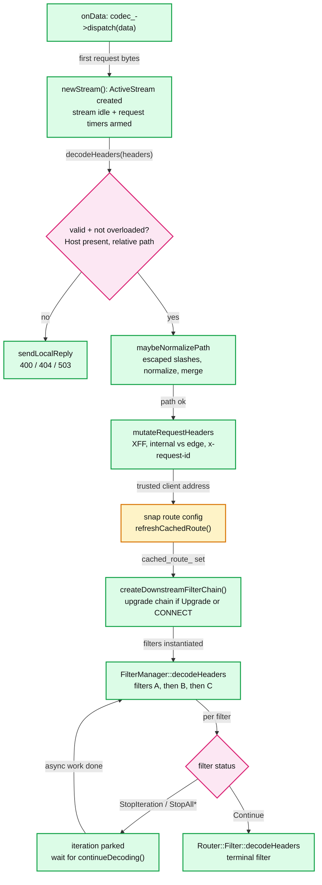

**What to notice**

- **Order is fixed in code** ([conn_manager_impl.cc:1354](https://github.com/envoyproxy/envoy/blob/v1.39.1/source/common/http/conn_manager_impl.cc#L1354)): record timing, snap the route config ([L1396](https://github.com/envoyproxy/envoy/blob/v1.39.1/source/common/http/conn_manager_impl.cc#L1396)), overload drop ([L1408](https://github.com/envoyproxy/envoy/blob/v1.39.1/source/common/http/conn_manager_impl.cc#L1408)), `Expect: 100-continue`, Host check ([L1448](https://github.com/envoyproxy/envoy/blob/v1.39.1/source/common/http/conn_manager_impl.cc#L1448)), path normalization ([L1497](https://github.com/envoyproxy/envoy/blob/v1.39.1/source/common/http/conn_manager_impl.cc#L1497)), header mutation ([L1533](https://github.com/envoyproxy/envoy/blob/v1.39.1/source/common/http/conn_manager_impl.cc#L1533)), route ([L1553](https://github.com/envoyproxy/envoy/blob/v1.39.1/source/common/http/conn_manager_impl.cc#L1553)), filter chain ([L1564](https://github.com/envoyproxy/envoy/blob/v1.39.1/source/common/http/conn_manager_impl.cc#L1564)).
- **The route is resolved before any filter runs.** That is why route-level `typed_per_filter_config` can disable a filter: `createFilterChainForFactories` asks `filterDisabled(name)` on the cached route ([filter_chain_helper.cc:25](https://github.com/envoyproxy/envoy/blob/v1.39.1/source/common/http/filter_chain_helper.cc#L25)).
- **Overload drops skip filter creation.** Under `stop_accepting_requests` the HCM answers 503 without allocating filters, to save memory ([conn_manager_impl.cc:1414](https://github.com/envoyproxy/envoy/blob/v1.39.1/source/common/http/conn_manager_impl.cc#L1414)).
- **Without `proxy_100_continue` the HCM answers `100 Continue` itself** and strips `Expect` before filters run ([conn_manager_impl.cc:1439](https://github.com/envoyproxy/envoy/blob/v1.39.1/source/common/http/conn_manager_impl.cc#L1439)).

### 3.2 Response (encode) path

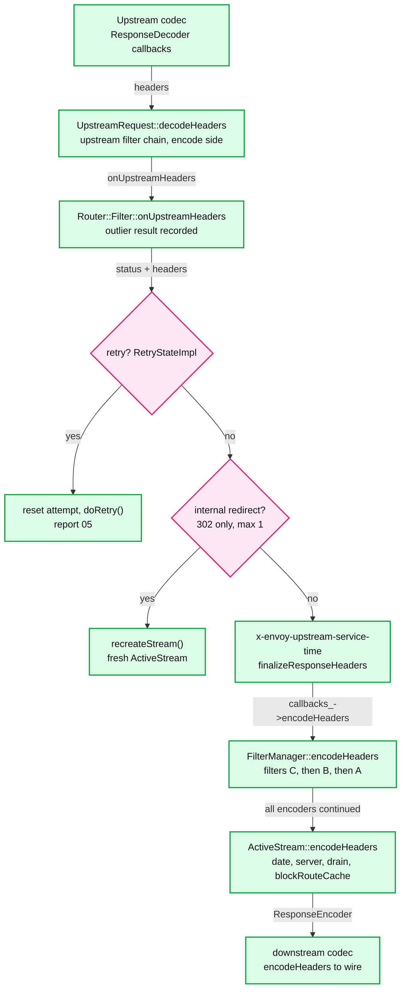

**What to notice**

- **Retry and redirect decisions happen before any encoder filter sees the response** ([router.cc:1843](https://github.com/envoyproxy/envoy/blob/v1.39.1/source/common/router/router.cc#L1843)). A retried 503 is invisible to downstream filters and to the client.
- **`x-envoy-upstream-service-time`** is the time from "downstream request complete" to "upstream headers received", set only if the request was complete and `suppress_envoy_headers` is false ([router.cc:1993](https://github.com/envoyproxy/envoy/blob/v1.39.1/source/common/router/router.cc#L1993)).
- **Response headers freeze routing.** `ActiveStream::encodeHeaders` calls `blockRouteCache()` and drops the snapped config ([conn_manager_impl.cc:2014](https://github.com/envoyproxy/envoy/blob/v1.39.1/source/common/http/conn_manager_impl.cc#L2014), [L2525](https://github.com/envoyproxy/envoy/blob/v1.39.1/source/common/http/conn_manager_impl.cc#L2525)).
- **Drain decisions ride on response headers.** If the listener is draining or overload disables keep-alive, the HCM starts the drain sequence here: GOAWAY for HTTP/2, `Connection: close` for HTTP/1.

### 3.3 Codec selection (`codec_type`)

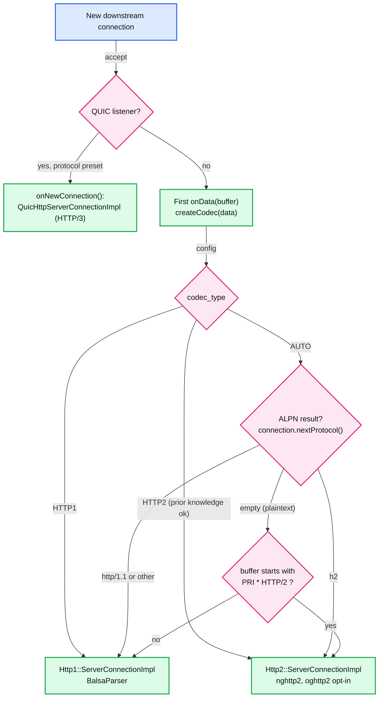

**What to notice**

- **The codec is created lazily on the first `onData`** ([conn_manager_impl.cc:494](https://github.com/envoyproxy/envoy/blob/v1.39.1/source/common/http/conn_manager_impl.cc#L494)), so ALPN from the TLS (Transport Layer Security) handshake is already known. The `hcm_ondata_creating_codec` load-shed point can close the connection before any codec memory is spent.
- **The preface check is `data.startsWith("PRI * HTTP/2")`** ([conn_manager_utility.cc:81](https://github.com/envoyproxy/envoy/blob/v1.39.1/source/common/http/conn_manager_utility.cc#L81), prefix constant at [http2/codec_impl.h:71](https://github.com/envoyproxy/envoy/blob/v1.39.1/source/common/http/http2/codec_impl.h#L71)). The code comment accepts the risk of a split first read because public traffic uses TLS and ALPN.
- **HTTP/3 never goes through `onData`.** The QUIC connection's stream info already carries the protocol, so `onNewConnection()` builds the HTTP/3 codec immediately and stops the network filter chain ([conn_manager_impl.cc:584](https://github.com/envoyproxy/envoy/blob/v1.39.1/source/common/http/conn_manager_impl.cc#L584)).
- **Config validation pairs codec and listener**: HTTP3 on a TCP listener, or any other codec on a QUIC listener, is rejected at load ([config.cc:718](https://github.com/envoyproxy/envoy/blob/v1.39.1/source/extensions/filters/network/http_connection_manager/config.cc#L718)).

### 3.4 Route selection

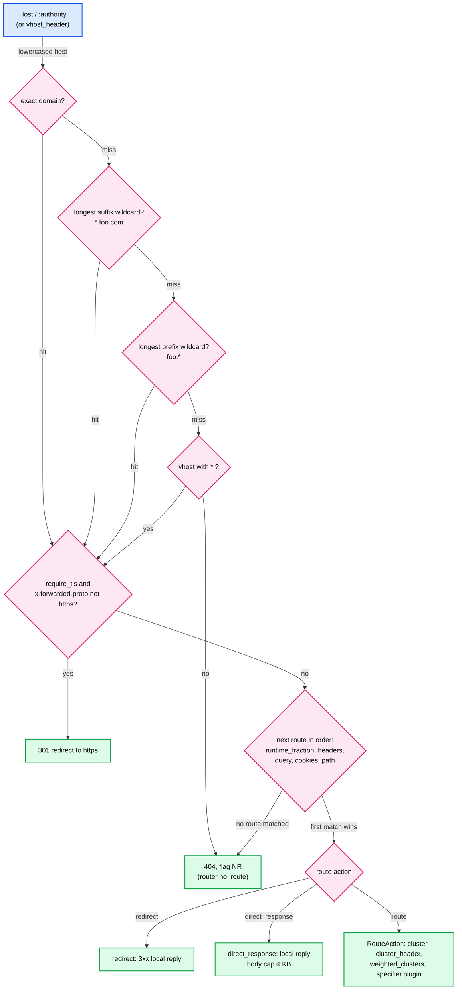

**What to notice**

- **Domain order is exact, suffix wildcard, prefix wildcard, then `*`** ([config_impl.cc:1993](https://github.com/envoyproxy/envoy/blob/v1.39.1/source/common/router/config_impl.cc#L1993)). Wildcards live in a `std::map<length, hash_map>` sorted by `std::greater`, so the longest wildcard wins ([config_impl.h:1322](https://github.com/envoyproxy/envoy/blob/v1.39.1/source/common/router/config_impl.h#L1322)). A wildcard never matches the empty string (`>=` check at [config_impl.cc:1924](https://github.com/envoyproxy/envoy/blob/v1.39.1/source/common/router/config_impl.cc#L1924)).
- **Only one `*` vhost and unique domains** per route configuration, or the config fails to load ([config_impl.cc:1964](https://github.com/envoyproxy/envoy/blob/v1.39.1/source/common/router/config_impl.cc#L1964)).
- **Routes are first match, linear** ([config_impl.cc:1816](https://github.com/envoyproxy/envoy/blob/v1.39.1/source/common/router/config_impl.cc#L1816)). `matchRoute` checks the runtime fraction first, then gRPC, headers, query parameters, cookies, TLS context, dynamic metadata; the subclass then checks the path ([config_impl.cc:862](https://github.com/envoyproxy/envoy/blob/v1.39.1/source/common/router/config_impl.cc#L862)).
- **A missing `x-forwarded-proto` means no route.** `getRouteFromEntries` returns null when the scheme header is empty ([config_impl.cc:1862](https://github.com/envoyproxy/envoy/blob/v1.39.1/source/common/router/config_impl.cc#L1862)). The HCM always sets it in `mutateRequestHeaders`, so this only bites filters that delete it.

---

## 4. Sequences

### 4.1 End to end: bytes in, response out, access log

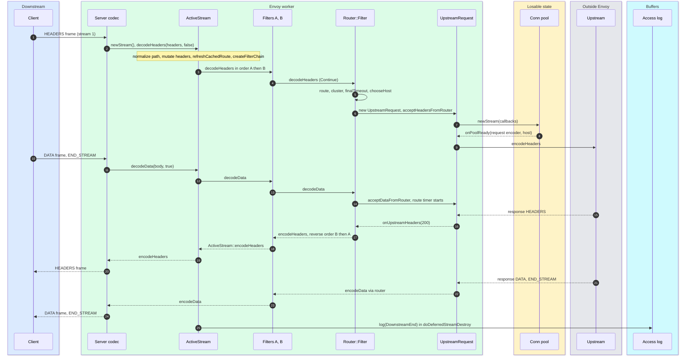

- The route timeout (15 s default, [route_components.proto:1384](https://github.com/envoyproxy/envoy/blob/v1.39.1/api/envoy/config/route/v3/route_components.proto#L1384)) starts in `Filter::onRequestComplete()`, when the downstream request is fully received, not at header time ([router.cc:1309](https://github.com/envoyproxy/envoy/blob/v1.39.1/source/common/router/router.cc#L1309)).
- The access log line is written once when the stream is destroyed ([conn_manager_impl.cc:384](https://github.com/envoyproxy/envoy/blob/v1.39.1/source/common/http/conn_manager_impl.cc#L384)). For HTTP/3 it can be deferred until the last byte is acked (`quic_defer_logging_to_ack_listener`). Periodic logs for long streams need `access_log_options.access_log_flush_interval`. Log formats and sinks are in [report 08](envoy-08-observability-and-extensibility.md).

### 4.2 Slow downstream reader backs up the upstream

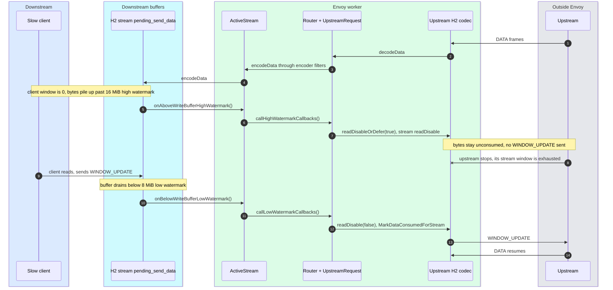

- The low watermark is exactly half the high one (`low_watermark_ = high_watermark / 2`, [watermark_buffer.cc:127](https://github.com/envoyproxy/envoy/blob/v1.39.1/source/common/buffer/watermark_buffer.cc#L127)). For a 16 MiB stream buffer that is 8 MiB.
- If response headers have not arrived yet, the router defers the `readDisable` and applies it when they do ([upstream_request.cc:781](https://github.com/envoyproxy/envoy/blob/v1.39.1/source/common/router/upstream_request.cc#L781)).
- An HTTP/2 stream stops the peer by withholding window: while read-disabled, received bytes are added to `unconsumed_bytes_` instead of being marked consumed ([http2/codec_impl.cc:1168](https://github.com/envoyproxy/envoy/blob/v1.39.1/source/common/http/http2/codec_impl.cc#L1168)). HTTP/1 has no per-stream window, so it read-disables the whole socket and lets TCP push back.

### 4.3 A filter pauses for a remote check, then either continues or answers locally

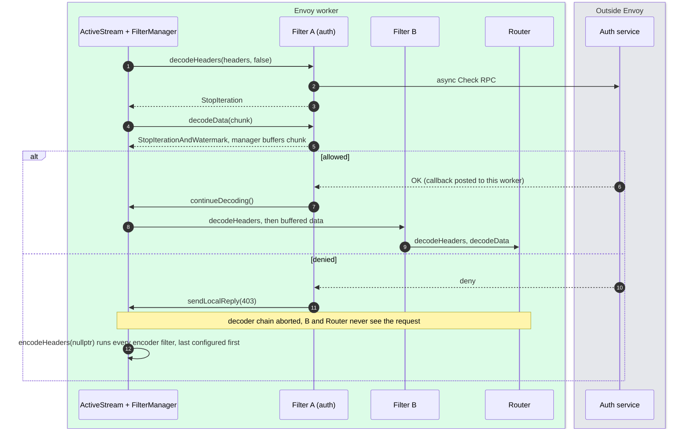

- `sendLocalReply` while decoding sets `decoder_filter_chain_aborted_` and prepares the reply to run after the current callback returns, to avoid re-entrancy ([filter_manager.cc:1052](https://github.com/envoyproxy/envoy/blob/v1.39.1/source/common/http/filter_manager.cc#L1052)).
- The local reply starts from `encoder_filters_.begin()`, the last configured filter ([filter_manager.cc:1013](https://github.com/envoyproxy/envoy/blob/v1.39.1/source/common/http/filter_manager.cc#L1013)). So encoder filters that never saw `decodeHeaders` still see `encodeHeaders`. Filters must tolerate that **[inferred consequence]**.
- The callback must return to the worker thread before touching the filter, and the filter must cancel in `onDestroy()` ([async_http_filters.md](https://github.com/envoyproxy/envoy/blob/v1.39.1/source/docs/async_http_filters.md)).

### 4.4 Graceful connection drain

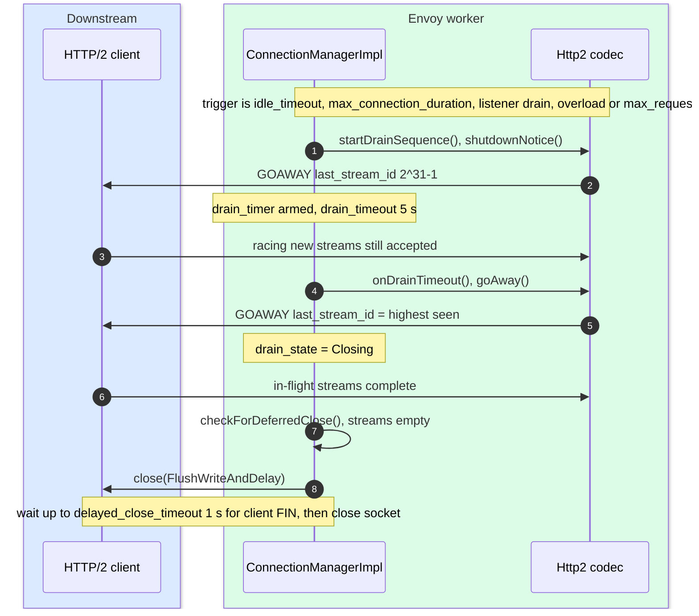

- `startDrainSequence()` is at [conn_manager_impl.cc:1699](https://github.com/envoyproxy/envoy/blob/v1.39.1/source/common/http/conn_manager_impl.cc#L1699), `onDrainTimeout()` at [L819](https://github.com/envoyproxy/envoy/blob/v1.39.1/source/common/http/conn_manager_impl.cc#L819). For HTTP/1 both `shutdownNotice()` and `goAway()` are empty ([http1/codec_impl.h:266](https://github.com/envoyproxy/envoy/blob/v1.39.1/source/common/http/http1/codec_impl.h#L266)); the drain is expressed as `Connection: close` on the next response.
- `drain_timeout_jitter` spreads the final GOAWAY to avoid reconnect storms ([config.cc:799](https://github.com/envoyproxy/envoy/blob/v1.39.1/source/extensions/filters/network/http_connection_manager/config.cc#L799)).

---

## 5. State machines

### 5.1 `ActiveStream` lifecycle

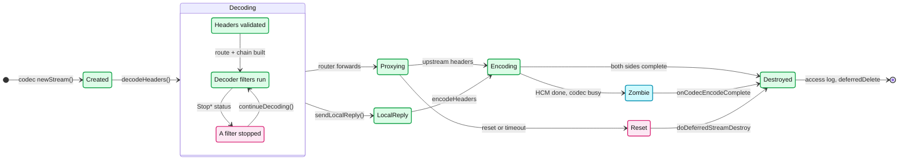

- **Zombie**: the HCM has ended the stream but the codec has not finished writing it. `doDeferredStreamDestroy` marks `is_zombie_stream_` and waits for `onCodecEncodeComplete` ([conn_manager_impl.cc:361](https://github.com/envoyproxy/envoy/blob/v1.39.1/source/common/http/conn_manager_impl.cc#L361)).
- **Destroyed** is deferred: the object goes onto the dispatcher's deferred-delete list ([conn_manager_impl.cc:389](https://github.com/envoyproxy/envoy/blob/v1.39.1/source/common/http/conn_manager_impl.cc#L389)), so callbacks already on the stack stay safe ([report 01](envoy-01-threading-and-process-model.md)).
- A reset before the HTTP/1 request completes forces `drain_state_ = Closing`, because a half-read HTTP/1 connection cannot carry the next request safely ([conn_manager_impl.cc:269](https://github.com/envoyproxy/envoy/blob/v1.39.1/source/common/http/conn_manager_impl.cc#L269)).

### 5.2 Per-filter iteration state

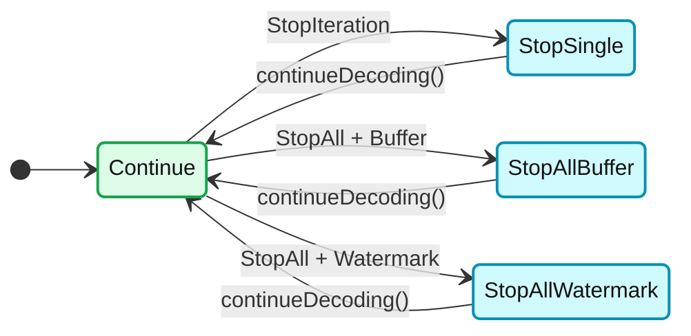

- The enum is in [filter_manager.h:219](https://github.com/envoyproxy/envoy/blob/v1.39.1/source/common/http/filter_manager.h#L219). `StopSingleIteration` is entered by headers `StopIteration` and by every non-Continue data status ([filter_manager.cc:165](https://github.com/envoyproxy/envoy/blob/v1.39.1/source/common/http/filter_manager.cc#L165), [L215](https://github.com/envoyproxy/envoy/blob/v1.39.1/source/common/http/filter_manager.cc#L215)).
- In a **StopAll** state later data is not passed to the filter at all; `handleDataIfStopAll` buffers it in the manager ([filter_manager.cc:1687](https://github.com/envoyproxy/envoy/blob/v1.39.1/source/common/http/filter_manager.cc#L1687)). When continued, iteration restarts at the *current* filter (`iterate_from_current_filter_`), so it sees the buffered data.

### 5.3 HCM connection drain state

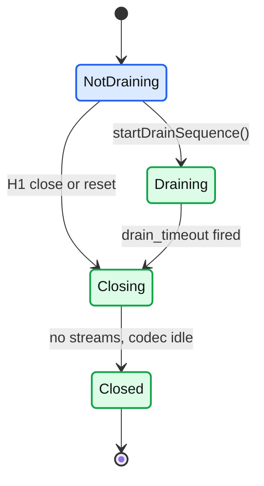

- `enum class DrainState { NotDraining, Draining, Closing }` ([conn_manager_impl.h:644](https://github.com/envoyproxy/envoy/blob/v1.39.1/source/common/http/conn_manager_impl.h#L644)). HTTP/1 jumps straight to `Closing` on `Connection: close`, on `max_requests_per_connection`, or on a reset.
- **Premature-reset guard**: after 500 closed streams (runtime `overload.premature_reset_total_stream_count`), if at least half were reset within 1 s without a response, the HCM aborts the connection and counts `downstream_rq_too_many_premature_resets` ([conn_manager_impl.cc:731](https://github.com/envoyproxy/envoy/blob/v1.39.1/source/common/http/conn_manager_impl.cc#L731)). This sits on top of nghttp2's reset token bucket. HTTP/2 flood defenses are in [report 07](envoy-07-security.md).

---

## 6. Component deep dives

### 6.1 `ConnectionManagerImpl` as a network filter

- **Lifecycle**: `initializeReadFilterCallbacks` bumps `downstream_cx_*`, arms the connection `idle_timeout` (1 h default, set in [config.cc:488](https://github.com/envoyproxy/envoy/blob/v1.39.1/source/extensions/filters/network/http_connection_manager/config.cc#L488)) and `max_connection_duration`, and sets `delayed_close_timeout` on the connection ([conn_manager_impl.cc:177](https://github.com/envoyproxy/envoy/blob/v1.39.1/source/common/http/conn_manager_impl.cc#L177)).
- **`onData` loop**: dispatch to the codec; map codec errors to connection close with flag DPE (protocol error) or OM (overload). For HTTP/1 it redispatches only when no stream is active and bytes remain ([conn_manager_impl.cc:569](https://github.com/envoyproxy/envoy/blob/v1.39.1/source/common/http/conn_manager_impl.cc#L569)).
- **`newStream`** disables the connection idle timer, creates the `ActiveStream` with the codec stream's `bufferLimit()` as its buffer limit, and applies `max_requests_per_connection` (HTTP/1: close after this response; HTTP/2: start drain) ([conn_manager_impl.cc:410](https://github.com/envoyproxy/envoy/blob/v1.39.1/source/common/http/conn_manager_impl.cc#L410)).
- **Idle timer semantics**: it only runs while the connection has zero streams. It is re-armed when the last stream is destroyed ([conn_manager_impl.cc:399](https://github.com/envoyproxy/envoy/blob/v1.39.1/source/common/http/conn_manager_impl.cc#L399)). HTTP/2 PINGs do not keep it alive.
- **Per-I/O-cycle fairness**: runtime `http.max_requests_per_io_cycle` (default `UINT32_MAX`, off) defers extra streams to the next loop iteration so one connection cannot monopolize a worker ([conn_manager_impl.cc:68](https://github.com/envoyproxy/envoy/blob/v1.39.1/source/common/http/conn_manager_impl.cc#L68), [L2640](https://github.com/envoyproxy/envoy/blob/v1.39.1/source/common/http/conn_manager_impl.cc#L2640)).

### 6.2 Codecs

**HTTP/1: `Http1::ServerConnectionImpl`**

- Parser: `BalsaParser(type, this, max_headers_kb * 1024, ...)` ([codec_impl.cc:537](https://github.com/envoyproxy/envoy/blob/v1.39.1/source/common/http/http1/codec_impl.cc#L537)). The header-size limit is enforced inside the parser.
- **Keep-alive**: HTTP/1.1 connections are persistent. They close after the response when the request says `Connection: close` or `Proxy-Connection: close` ([header_utility.cc:486](https://github.com/envoyproxy/envoy/blob/v1.39.1/source/common/http/header_utility.cc#L486)), when draining, when `max_requests_per_connection` is hit, or after a reset. HTTP/1.0 is rejected unless `accept_http_10` is set (default false, [protocol.proto:457](https://github.com/envoyproxy/envoy/blob/v1.39.1/api/envoy/config/core/v3/protocol.proto#L457)).
- **Pipelining is serialized**: `onMessageCompleteBase` always pauses the parser ([codec_impl.cc:1365](https://github.com/envoyproxy/envoy/blob/v1.39.1/source/common/http/http1/codec_impl.cc#L1365)); `dispatch` read-disables the socket if bytes arrive while a request is active ([L1305](https://github.com/envoyproxy/envoy/blob/v1.39.1/source/common/http/http1/codec_impl.cc#L1305)). At most 2 outbound responses may be queued (`kMaxOutboundResponses`, [L63](https://github.com/envoyproxy/envoy/blob/v1.39.1/source/common/http/http1/codec_impl.cc#L63)); more is a `response_flood`.
- A parse error makes the codec send 400 and the HCM close the connection (`stream_error_on_invalid_http_message` false, [hcm.proto:1043](https://github.com/envoyproxy/envoy/blob/v1.39.1/api/envoy/extensions/filters/network/http_connection_manager/v3/http_connection_manager.proto#L1043)).

**HTTP/2: `Http2::ServerConnectionImpl`**

- Library: nghttp2 unless `use_oghttp2_codec` or the runtime guard says otherwise ([http2/codec_impl.cc:1007](https://github.com/envoyproxy/envoy/blob/v1.39.1/source/common/http/http2/codec_impl.cc#L1007)).
- Windows: 16 MiB per stream, 24 MiB per connection ([protocol.proto:625](https://github.com/envoyproxy/envoy/blob/v1.39.1/api/envoy/config/core/v3/protocol.proto#L625), [L630](https://github.com/envoyproxy/envoy/blob/v1.39.1/api/envoy/config/core/v3/protocol.proto#L630)). The stream window value doubles as each stream's `pending_recv_data_` / `pending_send_data_` high watermark and as the `ActiveStream` buffer limit ([http2/codec_impl.cc:2515](https://github.com/envoyproxy/envoy/blob/v1.39.1/source/common/http/http2/codec_impl.cc#L2515)).
- `max_concurrent_streams` 1024 ([protocol.proto:609](https://github.com/envoyproxy/envoy/blob/v1.39.1/api/envoy/config/core/v3/protocol.proto#L609)). `hpack_table_size` 4096. Flood limits (`max_outbound_frames` 10000, `max_outbound_control_frames` 1000) and the Rapid Reset token bucket are in the facts sheet and [report 07](envoy-07-security.md).
- **Window updates are the backpressure lever**: `grantPeerAdditionalStreamWindow()` calls `MarkDataConsumedForStream` only when the stream is not read-disabled ([http2/codec_impl.cc:529](https://github.com/envoyproxy/envoy/blob/v1.39.1/source/common/http/http2/codec_impl.cc#L529)). `readDisable` is reference counted ([L538](https://github.com/envoyproxy/envoy/blob/v1.39.1/source/common/http/http2/codec_impl.cc#L538)).

**HTTP/3: QUICHE**

- Path: QUIC listener ([report 02](envoy-02-listeners-and-network-filters.md)) to `EnvoyQuicDispatcher` to `EnvoyQuicServerSession` (a `quic::QuicServerSessionBase` that is also the `Network::Connection`) to the network filter chain to `QuicHttpServerConnectionImpl` ([server_codec_impl.h:16](https://github.com/envoyproxy/envoy/blob/v1.39.1/source/common/quic/server_codec_impl.h#L16)).
- Streams are `EnvoyQuicServerStream` ([envoy_quic_server_stream.h:19](https://github.com/envoyproxy/envoy/blob/v1.39.1/source/common/quic/envoy_quic_server_stream.h#L19)). The QUIC codec is a thin shim: QUICHE already demultiplexes, and the stream is the encoder while the HCM owns the decoder ([quiche_integration.md](https://github.com/envoyproxy/envoy/blob/v1.39.1/source/docs/quiche_integration.md)).
- Defaults: 100 concurrent streams, 16 MiB stream window (also the max QUICHE supports), 24 MiB connection window ([protocol.proto:97](https://github.com/envoyproxy/envoy/blob/v1.39.1/api/envoy/config/core/v3/protocol.proto#L97)). Send side uses QUICHE's unbounded buffer plus `EnvoyQuicSimulatedWatermarkBuffer` accounting per stream and per connection to raise the same watermark callbacks.

### 6.3 `ActiveStream` and the filter manager

- **Classes**: `ConnectionManagerImpl::ActiveStream` owns a `DownstreamFilterManager` (subclass of `FilterManager` in [filter_manager.cc](https://github.com/envoyproxy/envoy/blob/v1.39.1/source/common/http/filter_manager.cc)). Each filter is wrapped in `ActiveStreamDecoderFilter` / `ActiveStreamEncoderFilter`, which implement the filter callbacks.
- **Chain creation**: `HttpConnectionManagerConfig::createFilterChain` calls `FilterChainUtility::createFilterChainForFactories`, which skips route-disabled filters and injects a 500 "missing config" filter if an ECDS config has not arrived ([filter_chain_helper.cc:18](https://github.com/envoyproxy/envoy/blob/v1.39.1/source/common/http/filter_chain_helper.cc#L18)).
- **Order**: decoders are a `vector` iterated forward; encoders use a `reverse_iterator` over insertion order ([filter_manager.h:96](https://github.com/envoyproxy/envoy/blob/v1.39.1/source/common/http/filter_manager.h#L96)). Config `[A, B, router]` decodes A, B, router and encodes B, A (the router is decoder-only).

**Every filter status in v1.39.1** ([filter.h](https://github.com/envoyproxy/envoy/blob/v1.39.1/envoy/http/filter.h#L37))

| Callback | Status | What the filter manager does |
|---|---|---|
| headers | `Continue` | Pass headers to the next filter |
| headers | `StopIteration` | Later filters do not see headers. Data frames still reach *this* filter; returning `Continue` from `decodeData` or calling `continueDecoding()` resumes |
| headers | `ContinueAndDontEndStream` | Pass headers on but force `end_stream=false`. Filter must inject a body with `injectDecodedDataToFilterChain`, last chunk with `end_stream=true` |
| headers | `StopAllIterationAndBuffer` | Stop headers, data and trailers here and below. Manager buffers the body; over the limit gives 413 (request) or 500 (response) |
| headers | `StopAllIterationAndWatermark` | Same, but crossing the limit raises watermarks (`readDisable`) instead of failing |
| data | `Continue` | Pass data on. If this filter had stopped headers, resume them first with buffered data |
| data | `StopIterationAndBuffer` | Buffer in the manager. Over the limit: 413 / 500 |
| data | `StopIterationAndWatermark` | Buffer, marked streaming. Over the limit: `readDisable(true)` upstream of the filter |
| data | `StopIterationNoBuffer` | Stop, filter owns the bytes (the router returns this) |
| trailers | `Continue` / `StopIteration` | Continue or park until `continueDecoding()` |
| 1xx headers | `Continue` / `StopIteration` | Same, encode side only |
| metadata | `Continue` / `ContinueAll` / `StopIterationForLocalReply` | Metadata cannot pause the stream except to send a local reply |
| `onLocalReply` | `Continue` / `ContinueAndResetStream` | Every filter is told about a local reply; any filter may convert it into a reset |

- **`continueDecoding()` / `continueEncoding()`** run `commonContinue()`: re-send headers if not yet continued, then metadata, buffered data, trailers, each only while `canContinue()` holds (no local reply sent, stream not recreated) ([filter_manager.cc:61](https://github.com/envoyproxy/envoy/blob/v1.39.1/source/common/http/filter_manager.cc#L61)).
- **Buffer overflow**: the manager's buffers are watermark buffers sized to `buffer_limit_` ([filter_manager.cc:424](https://github.com/envoyproxy/envoy/blob/v1.39.1/source/common/http/filter_manager.cc#L424)). On high watermark: streaming means read-disable, non-streaming means `requestDataTooLarge()`: **413** plus `downstream_rq_too_large` ([filter_manager.cc:587](https://github.com/envoyproxy/envoy/blob/v1.39.1/source/common/http/filter_manager.cc#L587)). On the response side: **500** plus `rs_too_large`, or a stream reset if headers already left ([filter_manager.cc:2025](https://github.com/envoyproxy/envoy/blob/v1.39.1/source/common/http/filter_manager.cc#L2025)).
- **`sendLocalReply` has three outcomes** ([filter_manager.cc:1052](https://github.com/envoyproxy/envoy/blob/v1.39.1/source/common/http/filter_manager.cc#L1052)): (1) no response started: build it and run it through the encoder chain; (2) encoding started but no non-1xx headers sent: bypass filters and write straight to the codec (`sendDirectLocalReply`); (3) headers already sent: reset the stream. Remaining decoder filters never run.
- **Buffer limit changes**: filters can only raise it via `setBufferLimit()`; the route's `request_body_buffer_limit` raises it too ([conn_manager_impl.cc:2446](https://github.com/envoyproxy/envoy/blob/v1.39.1/source/common/http/conn_manager_impl.cc#L2446)).

### 6.4 Route snapshot and the route cache

- **Snapshot**: the RDS provider keeps the current `Config` in a thread-local slot (`RdsRouteConfigProviderImpl::tls_`, [rds_route_config_provider_impl.h:31](https://github.com/envoyproxy/envoy/blob/v1.39.1/source/common/rds/rds_route_config_provider_impl.h#L31)). `decodeHeaders` copies that `shared_ptr` into `snapped_route_config_` ([conn_manager_impl.cc:1396](https://github.com/envoyproxy/envoy/blob/v1.39.1/source/common/http/conn_manager_impl.cc#L1396)). An RDS push replaces the slot for new streams; old streams keep their table alive.
- **`refreshCachedRoute()`** re-runs `snapped_route_config_->route(headers, stream_info, stream_id_)`, re-selecting the SRDS scope first if scoped routes are used ([conn_manager_impl.cc:1811](https://github.com/envoyproxy/envoy/blob/v1.39.1/source/common/http/conn_manager_impl.cc#L1811)). `setVirtualHostRoute` then refreshes cluster info, tracing, `max_stream_duration`, route idle timeout and buffer limit.
- **`clearRouteCache()`** empties `cached_route_`; the next `route()` call from any filter recomputes lazily ([conn_manager_impl.cc:2468](https://github.com/envoyproxy/envoy/blob/v1.39.1/source/common/http/conn_manager_impl.cc#L2468), [L2336](https://github.com/envoyproxy/envoy/blob/v1.39.1/source/common/http/conn_manager_impl.cc#L2336)). Old routes go to `cleared_cached_routes_` so filters holding references stay valid.
- **Why header-mutating filters must clear**: the route was computed before the first filter ran. A Lua or ext_proc filter that rewrites `:path` or `:authority` without clearing sends the request to the *old* route's cluster with the *new* path. Clearing has a security edge: filters earlier in the chain (RBAC (role-based access control), JWT) authorized a different route ([http_filters.rst](https://github.com/envoyproxy/envoy/blob/v1.39.1/docs/root/intro/arch_overview/http/http_filters.rst)).
- **Alternatives**: `setRoute()` with a `DelegatingRoute` overrides one property (cluster, timeout); `refreshRouteCluster()` re-evaluates only the cluster specifier ([conn_manager_impl.cc:2479](https://github.com/envoyproxy/envoy/blob/v1.39.1/source/common/http/conn_manager_impl.cc#L2479)).
- **Freeze**: `blockRouteCache()` after response headers makes clear/refresh no-ops ([conn_manager_impl.cc:2525](https://github.com/envoyproxy/envoy/blob/v1.39.1/source/common/http/conn_manager_impl.cc#L2525)).

### 6.5 HTTP-level flow control, end to end

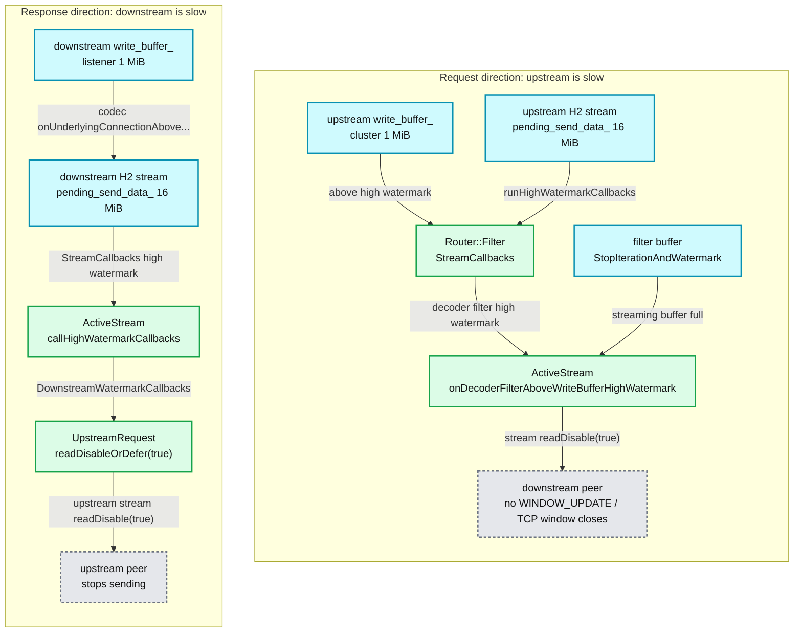

**What to notice**

- **Two brokers**: the router brokers upstream buffer events into the HCM, and the HCM brokers downstream buffer events into the router ([flow_control.md](https://github.com/envoyproxy/envoy/blob/v1.39.1/source/docs/flow_control.md)). Only filters that subscribe via `addDownstreamWatermarkCallbacks` get downstream events, to avoid "streams x filters" callbacks per event.
- **Counts, not flags**: `readDisable` is counted. A stream blocked by both a full upstream TCP buffer and a full HTTP/2 window needs both low-watermark events before it reads again.
- **New streams inherit pressure**: if a connection is already over its high watermark, a new stream gets the high-watermark callback on creation (`underlying_connection_above_high_watermark_`).
- **Stats**: `http.<prefix>.downstream_flow_control_paused_reading_total` / `resumed_reading_total` ([conn_manager_impl.cc:2100](https://github.com/envoyproxy/envoy/blob/v1.39.1/source/common/http/conn_manager_impl.cc#L2100)) and `cluster.<name>.upstream_flow_control_paused_reading_total` ([upstream_request.cc:788](https://github.com/envoyproxy/envoy/blob/v1.39.1/source/common/router/upstream_request.cc#L788)).

### 6.6 Header handling

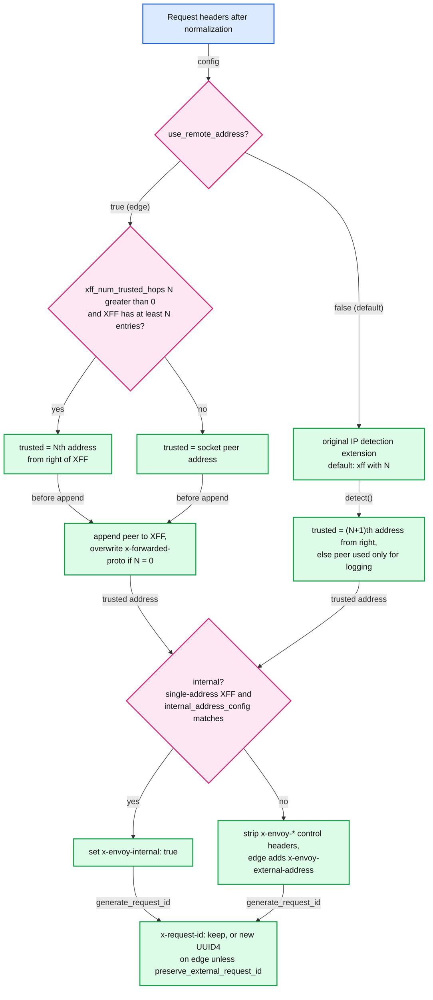

- **Trusted client address** ([conn_manager_utility.cc:120](https://github.com/envoyproxy/envoy/blob/v1.39.1/source/common/http/conn_manager_utility.cc#L120)): with `use_remote_address: true` (default false, [hcm.proto:758](https://github.com/envoyproxy/envoy/blob/v1.39.1/api/envoy/extensions/filters/network/http_connection_manager/v3/http_connection_manager.proto#L758)) it is the Nth-from-right XFF (`x-forwarded-for`) entry ([L170](https://github.com/envoyproxy/envoy/blob/v1.39.1/source/common/http/conn_manager_utility.cc#L170)) or the peer. With the default `false`, the HCM injects the `envoy.http.original_ip_detection.xff` extension with `xff_num_trusted_hops` ([config.cc:529](https://github.com/envoyproxy/envoy/blob/v1.39.1/source/extensions/filters/network/http_connection_manager/config.cc#L529)).
- **Internal vs external** ([conn_manager_utility.cc:263](https://github.com/envoyproxy/envoy/blob/v1.39.1/source/common/http/conn_manager_utility.cc#L263)): internal needs a trusted address, that address matching `internal_address_config`, and a single-address XFF (with `use_remote_address`, it means no XFF arrived, [L164](https://github.com/envoyproxy/envoy/blob/v1.39.1/source/common/http/conn_manager_utility.cc#L164)). Since the default config treats nothing as internal, fleets that relied on RFC1918 must list CIDRs explicitly.
- **Edge request** = external and `use_remote_address` ([L275](https://github.com/envoyproxy/envoy/blob/v1.39.1/source/common/http/conn_manager_utility.cc#L275)). External requests lose `x-envoy-retry-on`, `x-envoy-max-retries`, `x-envoy-upstream-rq-timeout-ms`, `x-envoy-force-trace`, `x-envoy-hedge-on-per-try-timeout` and others, plus route `internal_only_headers`; edge requests also lose `x-envoy-decorator-operation`, `x-envoy-original-path` and friends ([cleanInternalHeaders, L351](https://github.com/envoyproxy/envoy/blob/v1.39.1/source/common/http/conn_manager_utility.cc#L351)). `x-envoy-internal` is always removed first, then re-added only for internal requests.
- **Hop-by-hop cleanup**: `Connection`, `Upgrade` (unless an upgrade), `Keep-Alive`, `Proxy-Connection`, `Transfer-Encoding` are removed, `TE` is reduced to `trailers` or dropped.
- **`x-forwarded-proto`**: set if absent; overwritten from the TLS state (or PROXY-protocol destination port) when the previous hop is untrusted (`use_remote_address` and N = 0).
- **`x-request-id`** ([uuid/config.cc:14](https://github.com/envoyproxy/envoy/blob/v1.39.1/source/extensions/request_id/uuid/config.cc#L14)): `generate_request_id` defaults true and the proto warns UUID4 generation "is expensive" ([hcm.proto:847](https://github.com/envoyproxy/envoy/blob/v1.39.1/api/envoy/extensions/filters/network/http_connection_manager/v3/http_connection_manager.proto#L847)). Absent: generate. Present and not edge: trust. Present and edge: replace, unless `preserve_external_request_id` (default false). The UUID also carries the trace decision byte.
- **0-RTT marker**: if the downstream connection is still handshaking, the HCM adds `Early-Data: 1` (RFC 8470) ([L322](https://github.com/envoyproxy/envoy/blob/v1.39.1/source/common/http/conn_manager_utility.cc#L322)).
- **Path normalization** ([maybeNormalizePath, L770](https://github.com/envoyproxy/envoy/blob/v1.39.1/source/common/http/conn_manager_utility.cc#L770)): a `#fragment` is rejected or stripped; `path_with_escaped_slashes_action` defaults to `KEEP_UNCHANGED` ([config.cc:92](https://github.com/envoyproxy/envoy/blob/v1.39.1/source/extensions/filters/network/http_connection_manager/config.cc#L92)); `normalize_path` false ([hcm.proto:958](https://github.com/envoyproxy/envoy/blob/v1.39.1/api/envoy/extensions/filters/network/http_connection_manager/v3/http_connection_manager.proto#L958)); `merge_slashes` false ([hcm.proto:968](https://github.com/envoyproxy/envoy/blob/v1.39.1/api/envoy/extensions/filters/network/http_connection_manager/v3/http_connection_manager.proto#L968)). Failure gives 400 and `downstream_rq_failed_path_normalization`. The path-confusion attack surface is [report 07](envoy-07-security.md).
- **Limits**: request headers 60 KiB (`max_request_headers_kb`, 431 on excess, [hcm.proto:584](https://github.com/envoyproxy/envoy/blob/v1.39.1/api/envoy/extensions/filters/network/http_connection_manager/v3/http_connection_manager.proto#L584)); 100 headers (`max_headers_count`: 431 for HTTP/1, stream reset for HTTP/2, [protocol.proto:365](https://github.com/envoyproxy/envoy/blob/v1.39.1/api/envoy/config/core/v3/protocol.proto#L365)). Constants: [codec_runtime_overrides.h:11](https://github.com/envoyproxy/envoy/blob/v1.39.1/envoy/http/codec_runtime_overrides.h#L11).

### 6.7 HCM timeouts

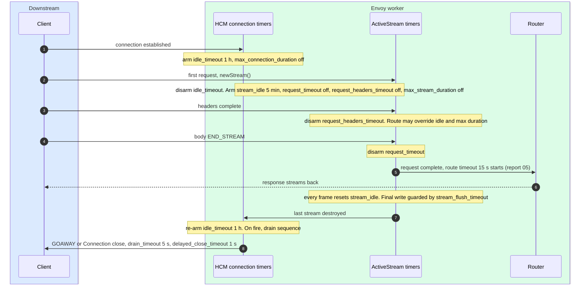

| Timer | Default | Starts / stops | On fire | Flag, stat |
|---|---|---|---|---|
| connection `idle_timeout` | 1 h ([protocol.proto:332](https://github.com/envoyproxy/envoy/blob/v1.39.1/api/envoy/config/core/v3/protocol.proto#L332)) | runs only with zero streams | drain sequence ([L785](https://github.com/envoyproxy/envoy/blob/v1.39.1/source/common/http/conn_manager_impl.cc#L785)) | `downstream_cx_idle_timeout` |
| `max_connection_duration` | off ([protocol.proto:339](https://github.com/envoyproxy/envoy/blob/v1.39.1/api/envoy/config/core/v3/protocol.proto#L339)) | from connect | drain; HTTP/1 soft drain if `http1_safe_max_connection_duration`; DT only if no codec yet ([L798](https://github.com/envoyproxy/envoy/blob/v1.39.1/source/common/http/conn_manager_impl.cc#L798)) | `downstream_cx_max_duration_reached` |
| `stream_idle_timeout` | 5 min ([hcm.proto:620](https://github.com/envoyproxy/envoy/blob/v1.39.1/api/envoy/extensions/filters/network/http_connection_manager/v3/http_connection_manager.proto#L620)) | reset on every header/data event | 408, or 504 if request complete, or reset if headers sent ([L1061](https://github.com/envoyproxy/envoy/blob/v1.39.1/source/common/http/conn_manager_impl.cc#L1061)) | **SI**, `downstream_rq_idle_timeout` |
| `request_timeout` | off ([hcm.proto:644](https://github.com/envoyproxy/envoy/blob/v1.39.1/api/envoy/extensions/filters/network/http_connection_manager/v3/http_connection_manager.proto#L644)) | stream start until request fully decoded or response starts | 408 / 504, details `request_overall_timeout` ([L1071](https://github.com/envoyproxy/envoy/blob/v1.39.1/source/common/http/conn_manager_impl.cc#L1071)) | no flag, `downstream_rq_timeout` |
| `request_headers_timeout` | off ([hcm.proto:650](https://github.com/envoyproxy/envoy/blob/v1.39.1/api/envoy/extensions/filters/network/http_connection_manager/v3/http_connection_manager.proto#L650)) | stream start until headers complete | 408, details `request_header_timeout` ([L1079](https://github.com/envoyproxy/envoy/blob/v1.39.1/source/common/http/conn_manager_impl.cc#L1079)) | no flag, `downstream_rq_header_timeout` |
| `max_stream_duration` (HCM or route) | off ([protocol.proto:390](https://github.com/envoyproxy/envoy/blob/v1.39.1/api/envoy/config/core/v3/protocol.proto#L390)) | from stream start, minus time used | 408 / 504, gRPC DEADLINE_EXCEEDED ([L1087](https://github.com/envoyproxy/envoy/blob/v1.39.1/source/common/http/conn_manager_impl.cc#L1087)) | no flag, `downstream_rq_max_duration_reached` |
| `stream_flush_timeout` | = stream idle ([hcm.proto:638](https://github.com/envoyproxy/envoy/blob/v1.39.1/api/envoy/extensions/filters/network/http_connection_manager/v3/http_connection_manager.proto#L638)) | all data buffered, waiting for peer window | stream reset | codec `tx_flush_timeout` |
| `drain_timeout` | 5 s ([hcm.proto:665](https://github.com/envoyproxy/envoy/blob/v1.39.1/api/envoy/extensions/filters/network/http_connection_manager/v3/http_connection_manager.proto#L665)) | from shutdown notice | final GOAWAY, `Closing` | `downstream_cx_drain_close` |
| `delayed_close_timeout` | 1 s ([hcm.proto:712](https://github.com/envoyproxy/envoy/blob/v1.39.1/api/envoy/extensions/filters/network/http_connection_manager/v3/http_connection_manager.proto#L712)) | after local close, waiting for peer FIN | socket closed | `downstream_cx_delayed_close_timeout` |

- Route `timeout`, `idle_timeout`, per-try and hedging timers: [report 05](envoy-05-resilience.md).
- `max_stream_duration` is recomputed on every route refresh; `grpc_timeout_header_max` can substitute the client's `grpc-timeout` ([conn_manager_impl.cc:1723](https://github.com/envoyproxy/envoy/blob/v1.39.1/source/common/http/conn_manager_impl.cc#L1723)).
- Idle timers are "scaled timers": the overload manager's `reduce_timeouts` action shrinks them under memory pressure.

### 6.8 Local replies and `local_reply_config`

- Every Envoy-generated response (404 NR, 503 UH, 413, 408, direct responses) goes through `Utility::sendLocalReply`, which picks a gRPC trailers-only form for gRPC requests and handles HEAD.
- `LocalReplyConfig.mappers` are checked in order; the first mapper whose access-log `filter` matches can rewrite status, body, headers and body format ([local_reply.cc:193](https://github.com/envoyproxy/envoy/blob/v1.39.1/source/common/local_reply/local_reply.cc#L193), [hcm.proto:1001](https://github.com/envoyproxy/envoy/blob/v1.39.1/api/envoy/extensions/filters/network/http_connection_manager/v3/http_connection_manager.proto#L1001)). `body_format` supports text or JSON with `%LOCAL_REPLY_BODY%`.
- `response_code_details` (for example `route_not_found`, `request_payload_too_large`) is set for every local reply and is the fastest way to explain an unexpected status in logs.

### 6.9 Upgrades, WebSocket and CONNECT

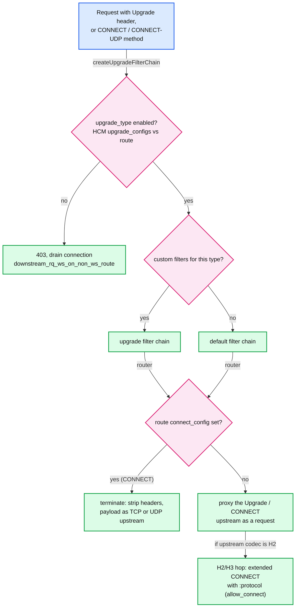

- **Enablement matrix**: an `UpgradeConfig` entry defaults `enabled: true` ([hcm.proto:369](https://github.com/envoyproxy/envoy/blob/v1.39.1/api/envoy/extensions/filters/network/http_connection_manager/v3/http_connection_manager.proto#L369)); a route-level setting overrides it either way ([config.cc:867](https://github.com/envoyproxy/envoy/blob/v1.39.1/source/extensions/filters/network/http_connection_manager/config.cc#L867)). A rejected upgrade also marks the connection to drain, to stop HTTP/1 smuggling through upgrade payloads ([conn_manager_impl.cc:1586](https://github.com/envoyproxy/envoy/blob/v1.39.1/source/common/http/conn_manager_impl.cc#L1586)).
- **WebSocket over HTTP/1.1**: `Connection: upgrade` is kept. The upstream request pauses until `101 Switching Protocols` (`paused_for_websocket_`, [upstream_request.cc:412](https://github.com/envoyproxy/envoy/blob/v1.39.1/source/common/router/upstream_request.cc#L412)); then bytes flow as a tunnel and `state_.is_tunneling_` stops `Connection: close` injection.
- **WebSocket over HTTP/2 (RFC 8441)**: needs `allow_connect: true` ([protocol.proto:634](https://github.com/envoyproxy/envoy/blob/v1.39.1/api/envoy/config/core/v3/protocol.proto#L634)). The upgrade becomes a CONNECT stream with `:protocol`, and is turned back into an HTTP/1 upgrade on the last hop; the original method is assumed to be GET ([upgrades.rst](https://github.com/envoyproxy/envoy/blob/v1.39.1/docs/root/intro/arch_overview/http/upgrades.rst)). HTTP/3 uses the work-in-progress `allow_extended_connect`.
- **CONNECT**: off by default (403). With `upgrade_type: CONNECT` it is proxied; with route `connect_config` ([route_components.proto:1100](https://github.com/envoyproxy/envoy/blob/v1.39.1/api/envoy/config/route/v3/route_components.proto#L1100)) the router terminates it and forwards raw TCP (`allow_post` also allows POST tunnels). The upstream protocol is chosen in `Filter::createConnPool` ([router.cc:971](https://github.com/envoyproxy/envoy/blob/v1.39.1/source/common/router/router.cc#L971)).
- **CONNECT-UDP (RFC 9298)**: alpha, `upgrade_type: CONNECT-UDP`; the HCM rewrites `:authority` from the path ([conn_manager_impl.cc:1478](https://github.com/envoyproxy/envoy/blob/v1.39.1/source/common/http/conn_manager_impl.cc#L1478)) and `connect_config` terminates it into UDP datagrams.
- Buffering filters and upgrades do not mix; use `UpgradeConfig.filters` to give tunnels a lean chain.

### 6.10 HTTP/3 downstream

- **Setup**: a UDP listener with `quic_options`, a `QuicDownstreamTransport` socket and `codec_type: HTTP3` ([http3.rst](https://github.com/envoyproxy/envoy/blob/v1.39.1/docs/root/intro/arch_overview/http/http3.rst)). QUIC connection idle timeout defaults to 300000 ms and handshake timeout to 20000 ms ([quic_config.proto:39](https://github.com/envoyproxy/envoy/blob/v1.39.1/api/envoy/config/listener/v3/quic_config.proto#L39)). With multiple workers, BPF steering is strongly advised.
- **Advertisement**: browsers only try HTTP/3 after an `alt-svc` header on a TCP response. Envoy does not add it for you **[inferred: only upstream code references alt-svc]**; the example config adds `alt-svc: h3=":10000"; ma=86400` via `response_headers_to_add` on the TCP listener's vhost ([envoyproxy_io_proxy_http3_downstream.yaml:40](https://github.com/envoyproxy/envoy/blob/v1.39.1/configs/envoyproxy_io_proxy_http3_downstream.yaml#L40)).
- **0-RTT (early data)**: accepted by default (`enable_early_data` true, [quic_transport.proto:29](https://github.com/envoyproxy/envoy/blob/v1.39.1/api/envoy/extensions/transport_sockets/quic/v3/quic_transport.proto#L29)). Such requests carry `Early-Data: 1`. Upstream, the route `early_data_policy` defaults to "safe methods only" ([route_components.proto:1433](https://github.com/envoyproxy/envoy/blob/v1.39.1/api/envoy/config/route/v3/route_components.proto#L1433)).
- **Retry caveat**: for safe requests on HTTP/3-capable clusters the router always allocates retry state and treats **425 Too Early** as retriable ([retry_state_impl.cc:36](https://github.com/envoyproxy/envoy/blob/v1.39.1/source/common/router/retry_state_impl.cc#L36)). But if the *downstream* request arrived as early data (has `Early-Data`), Envoy does not retry: it forwards the 425 so the client replays after the handshake ([retry_state_impl.cc:386](https://github.com/envoyproxy/envoy/blob/v1.39.1/source/common/router/retry_state_impl.cc#L386)). Replay of non-idempotent 0-RTT requests is the risk this protects against.
- Hot restart is not graceful for HTTP/3 yet ([http3.rst](https://github.com/envoyproxy/envoy/blob/v1.39.1/docs/root/intro/arch_overview/http/http3.rst)).

### 6.11 Route configuration

- **Object model**: `RouteConfiguration` has `virtual_hosts` (each with `domains` and ordered `routes` or a `matcher` tree), config-wide `request_headers_to_add`, `internal_only_headers`, `typed_per_filter_config`, `request_mirror_policies`, `vhds` ([route.proto](https://github.com/envoyproxy/envoy/blob/v1.39.1/api/envoy/config/route/v3/route.proto#L34)).
- **Match types** (`RouteMatch.path_specifier`, [route_components.proto:624](https://github.com/envoyproxy/envoy/blob/v1.39.1/api/envoy/config/route/v3/route_components.proto#L624)): `prefix`; `path` (exact, query stripped); `safe_regex` (RE2, whole path must match); `path_separated_prefix` (`/api/dev` matches `/api/dev/v1`, not `/api/developer`); `path_match_policy` (URI template extension); `connect_matcher` (only way to match HTTP/1 CONNECT). `case_sensitive` defaults true.
- **Extra criteria**: `headers` (all must match), `query_parameters`, `cookies`, `grpc`, `tls_context`, `dynamic_metadata`, `runtime_fraction` (gradual rollout gate, evaluated first).
- **Actions**: `route` (`RouteAction`), `redirect`, `direct_response` (body cap `max_direct_response_body_size_bytes` 4 KB, [config_impl.cc:128](https://github.com/envoyproxy/envoy/blob/v1.39.1/source/common/router/config_impl.cc#L128)), `filter_action`, `non_forwarding_action`.
- **Cluster specifiers** ([route_components.proto:1138](https://github.com/envoyproxy/envoy/blob/v1.39.1/api/envoy/config/route/v3/route_components.proto#L1138)): `cluster`; `cluster_header` (first value only, untrusted input, missing header gives 503 NC); `weighted_clusters` (sum of weights, `runtime_key_prefix`, optional `header_name` or `use_hash_policy` for consistent picks across tiers); `cluster_specifier_plugin` / `inline_cluster_specifier_plugin`.
- **RDS**: `rds.route_config_name` plus a `ConfigSource`. `validate_clusters` defaults true for static routes, false for RDS ([route.proto:106](https://github.com/envoyproxy/envoy/blob/v1.39.1/api/envoy/config/route/v3/route.proto#L106)).
- **VHDS (Virtual Host Discovery Service, on demand)**: with `RouteConfiguration.vhds`, virtual hosts are fetched with delta xDS named `<route config name>/<host>`. The `envoy.filters.http.on_demand` filter pauses the stream with `requestRouteConfigUpdate` and resumes when the vhost arrives ([on_demand_update.cc:166](https://github.com/envoyproxy/envoy/blob/v1.39.1/source/extensions/filters/http/on_demand/on_demand_update.cc#L166), [vhds.rst](https://github.com/envoyproxy/envoy/blob/v1.39.1/docs/root/configuration/http/http_conn_man/vhds.rst)).
- **Scoped routes (SRDS, Scoped Route Discovery Service)**: `scoped_routes.scope_key_builder` builds a key from header fragments; each scope maps to a separate route configuration; `snapScopedRouteConfig()` picks it per request and re-picks on route refresh ([conn_manager_impl.cc:1707](https://github.com/envoyproxy/envoy/blob/v1.39.1/source/common/http/conn_manager_impl.cc#L1707)). No scope gives a null config and a 404. Protocol details are in [report 06](envoy-06-xds-control-plane.md).

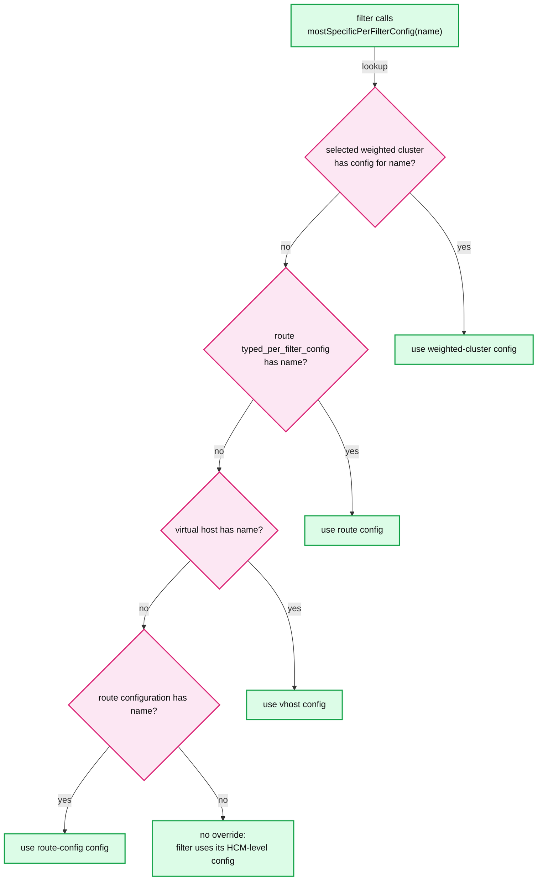

- Most specific wins: [weighted_cluster_specifier.cc:242](https://github.com/envoyproxy/envoy/blob/v1.39.1/source/common/router/weighted_cluster_specifier.cc#L242), [config_impl.h:853](https://github.com/envoyproxy/envoy/blob/v1.39.1/source/common/router/config_impl.h#L853), [config_impl.cc:1719](https://github.com/envoyproxy/envoy/blob/v1.39.1/source/common/router/config_impl.cc#L1719).
- For filters that *merge* levels, `perFilterConfigs()` returns all of them ordered route config, vhost, route ([config_impl.cc:1725](https://github.com/envoyproxy/envoy/blob/v1.39.1/source/common/router/config_impl.cc#L1725), [L1367](https://github.com/envoyproxy/envoy/blob/v1.39.1/source/common/router/config_impl.cc#L1367)).
- The map key is the filter's configured `name`, not its type. A `FilterConfig{disabled: true}` value removes the filter from that route's chain.

### 6.12 The router filter

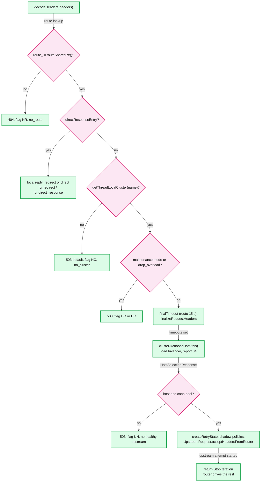

- **Steps in code**: route ([router.cc:508](https://github.com/envoyproxy/envoy/blob/v1.39.1/source/common/router/router.cc#L508)), cluster from the worker's `ThreadLocalCluster` ([L566](https://github.com/envoyproxy/envoy/blob/v1.39.1/source/common/router/router.cc#L566)), `checkStrictHeaders` (flag IH), maintenance mode, drop overload, buffer limit, timeout, `finalizeRequestHeaders` (host/prefix rewrite and `request_headers_to_add`, before host selection so they can steer the LB) ([L657](https://github.com/envoyproxy/envoy/blob/v1.39.1/source/common/router/router.cc#L657)), `chooseHost` ([L726](https://github.com/envoyproxy/envoy/blob/v1.39.1/source/common/router/router.cc#L726)).
- **Async host selection**: an LB may return a cancelable handle; the router then returns `StopAllIterationAndWatermark` and continues later ([L769](https://github.com/envoyproxy/envoy/blob/v1.39.1/source/common/router/router.cc#L769)).
- **`GenericConnPool`**: `createConnPool` asks the cluster's `upstream_config` factory (default HTTP) for an HTTP, TCP or UDP pool keyed by protocol and priority ([L971](https://github.com/envoyproxy/envoy/blob/v1.39.1/source/common/router/router.cc#L971)). `UpstreamRequest::acceptHeadersFromRouter` calls `conn_pool_->newStream(this)` immediately ([upstream_request.cc:458](https://github.com/envoyproxy/envoy/blob/v1.39.1/source/common/router/upstream_request.cc#L458)); headers go through the upstream filter chain and are encoded on `onPoolReady`.
- **Body**: the router returns `StopIterationNoBuffer` and forwards data itself. If retries or internal redirects are possible it also keeps a copy with `addDecodedData`; past the buffer limit it gives up (`retry_or_shadow_abandoned`) and, if no attempt is in flight, answers **507** ([router.cc:1117](https://github.com/envoyproxy/envoy/blob/v1.39.1/source/common/router/router.cc#L1117), [L1134](https://github.com/envoyproxy/envoy/blob/v1.39.1/source/common/router/router.cc#L1134)).
- **Retries hook**: `createRetryState` builds `RetryStateImpl` and strips the `x-envoy-retry-*` headers ([router.cc:837](https://github.com/envoyproxy/envoy/blob/v1.39.1/source/common/router/router.cc#L837), [retry_state_impl.cc:28](https://github.com/envoyproxy/envoy/blob/v1.39.1/source/common/router/retry_state_impl.cc#L28)). Resets go through `maybeRetryReset`, headers through `shouldRetryHeaders`. Policy, back-off (25 ms base, 250 ms cap) and budgets: [report 05](envoy-05-resilience.md).
- **Hedging hook**: with `hedge_on_per_try_timeout`, a per-try timeout does not reset the attempt; `onSoftPerTryTimeout` starts another one and the first response wins; `resetOtherUpstreams` cancels the rest ([router.cc:1400](https://github.com/envoyproxy/envoy/blob/v1.39.1/source/common/router/router.cc#L1400)).
- **Mirroring (shadowing)**: `request_mirror_policies` come from the route, else the vhost, else the route config (first non-empty level, no merging, [config_impl.cc:629](https://github.com/envoyproxy/envoy/blob/v1.39.1/source/common/router/config_impl.cc#L629)); cluster-level policies, when present, replace them ([router.cc:862](https://github.com/envoyproxy/envoy/blob/v1.39.1/source/common/router/router.cc#L862)). Sampling uses `runtime_fraction` keyed by the stream id. Shadows use the async client, discard the response body (`setDiscardResponseBody(true)`, [L940](https://github.com/envoyproxy/envoy/blob/v1.39.1/source/common/router/router.cc#L940)), time out at the route timeout, never affect the primary response, and get `-shadow` appended to the host unless disabled ([shadow_writer_impl.cc:23](https://github.com/envoyproxy/envoy/blob/v1.39.1/source/common/router/shadow_writer_impl.cc#L23)). CONNECT is never mirrored.
- **Internal redirects**: only for codes in `redirect_response_codes` (default **302 only**), at most `max_internal_redirects` (default **1**) ([route_components.proto:2997](https://github.com/envoyproxy/envoy/blob/v1.39.1/api/envoy/config/route/v3/route_components.proto#L2997)), only if the whole request was received and its body fit in the buffer ([router.cc:2175](https://github.com/envoyproxy/envoy/blob/v1.39.1/source/common/router/router.cc#L2175)). Success calls `recreateStream()`: a fresh `ActiveStream` replays headers and body through the whole downstream chain ([conn_manager_impl.cc:2536](https://github.com/envoyproxy/envoy/blob/v1.39.1/source/common/http/conn_manager_impl.cc#L2536)).

### 6.13 Upstream HTTP filters

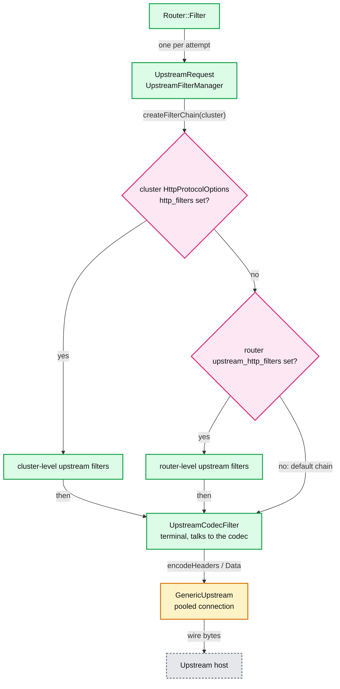

- **Why they exist**: downstream filters run once per request; upstream filters run once per *attempt* and see the chosen host. That is the right place for per-host credentials, request signing, per-attempt compression or header mutation, and for vetoing a host before connecting (`onHostSelected`, [filter.h:222](https://github.com/envoyproxy/envoy/blob/v1.39.1/envoy/http/filter.h#L222)).
- **Chain choice** is cluster, then router, then default ([upstream_request.cc:175](https://github.com/envoyproxy/envoy/blob/v1.39.1/source/common/router/upstream_request.cc#L175)). Cluster filters override router ones; they are not applied to terminated CONNECT ([http_protocol_options.proto:175](https://github.com/envoyproxy/envoy/blob/v1.39.1/api/envoy/extensions/upstreams/http/v3/http_protocol_options.proto#L175)); router ones also run on shadows ([router.proto:136](https://github.com/envoyproxy/envoy/blob/v1.39.1/api/envoy/extensions/filters/http/router/v3/router.proto#L136)).
- **Caveats** (alpha): upstream filters cannot change the route or cluster; their local replies do not trigger retries and count as final for hedging; `streamInfo` may be shared by parallel hedged attempts ([upstream_filters.md](https://github.com/envoyproxy/envoy/blob/v1.39.1/source/docs/upstream_filters.md)).

### 6.14 Response flags generated in this layer

| Flag | Meaning | Where |
|---|---|---|
| NR | No route matched (404) | router [L508](https://github.com/envoyproxy/envoy/blob/v1.39.1/source/common/router/router.cc#L508) |
| NC | Route's cluster not found (503 default) | router [L567](https://github.com/envoyproxy/envoy/blob/v1.39.1/source/common/router/router.cc#L567) |
| UH | No healthy upstream / no pool (503) | `sendNoHealthyUpstreamResponse` |
| UO | Overflow: circuit breaker or maintenance mode (503) | router, pool |
| DO / UDO | Dropped by `drop_overload` from the control plane | `checkDropOverload` |
| UF / UC / UR / LR / UPE | Upstream connect failure, connection termination, remote reset, local reset, protocol error, mapped from reset reasons | `streamResetReasonToResponseFlag` [L1745](https://github.com/envoyproxy/envoy/blob/v1.39.1/source/common/router/router.cc#L1745) |
| UT | Route (global) timeout, 504 | `onResponseTimeout` [L1352](https://github.com/envoyproxy/envoy/blob/v1.39.1/source/common/router/router.cc#L1352) |
| URX | Retry limit exceeded | `onUpstreamHeaders` |
| UMSDR | Upstream `max_stream_duration` reached | [L1488](https://github.com/envoyproxy/envoy/blob/v1.39.1/source/common/router/router.cc#L1488) |
| IH | Strict-checked `x-envoy-*` header invalid | `checkStrictHeaders` |
| SI | HCM stream idle timeout | [conn_manager_impl.cc:1064](https://github.com/envoyproxy/envoy/blob/v1.39.1/source/common/http/conn_manager_impl.cc#L1064) |
| DC / DR / DPE | Downstream connection terminated, downstream remote reset, downstream protocol error | `onEvent`, `onResetStream`, `handleCodecError` |
| DT | Connection duration timeout before a codec existed | [L804](https://github.com/envoyproxy/envoy/blob/v1.39.1/source/common/http/conn_manager_impl.cc#L804) |
| OM | Overload manager terminated or refused | HCM codec and reset paths |

The complete cheat-sheet with every flag and its usual root cause is in [report 05](envoy-05-resilience.md). Short strings are in [stream_info/utility.h:78](https://github.com/envoyproxy/envoy/blob/v1.39.1/source/common/stream_info/utility.h#L78).

---

## 7. Failure modes

| Failure | What the user sees | Blast radius | Mitigation |
|---|---|---|---|
| Buffering filter meets a large body | 413 (`downstream_rq_too_large`) or 500 / reset on response (`rs_too_large`) | One stream | Stream the body (`StopIterationAndWatermark`), raise `request_body_buffer_limit` on the specific route only |
| Many HTTP/2 streams buffering at once | Worker RSS grows toward 1024 x 16 MiB per connection, then OOM kill | Whole process, all connections | Overload manager (`stop_accepting_requests`, `reset_high_memory_stream`), lower `initial_stream_window_size` / `max_concurrent_streams` at the edge ([report 05](envoy-05-resilience.md)) |
| Retry body larger than buffer | Retries silently disabled, `retry_or_shadow_abandoned`; 507 if between attempts | One stream | Keep retryable bodies small, or accept no retries for uploads |
| Filter mutates `:path` without `clearRouteCache()` | Request hits the old route's cluster | Every request on that path | Clear cache; order authz after mutators; prefer `refreshRouteCluster()` |
| Unknown cluster (RDS ahead of CDS) | 503, flag NC, `no_cluster` | Routes referencing it | Make-before-break ordering in the control plane ([report 06](envoy-06-xds-control-plane.md)) |
| No `internal_address_config` after upgrade to 1.33+ | Internal probes lose `x-envoy-*` overrides, no `x-envoy-internal` | All "internal" traffic | List CIDRs explicitly |
| `use_remote_address: false` at the edge | Client-forged XFF becomes the trusted address; rate limits and RBAC keyed on it are bypassable | Security, all tenants | `use_remote_address: true` plus correct `xff_num_trusted_hops` ([report 07](envoy-07-security.md)) |
| Long-poll or streaming idle for 5 min | 408 or 504 with SI, `downstream_rq_idle_timeout` | Those streams | Route `idle_timeout` override, app heartbeats |
| Slow client on large download | Stream paused by watermarks; after inactivity, reset via `stream_flush_timeout` / idle timeout | One stream | Expected behaviour; watch `downstream_flow_control_paused_reading_total` |
| HTTP/1 pipelining client | Head-of-line latency, `response_flood` if it pushes too far | One connection | Prefer HTTP/2 |
| Rapid Reset style abuse | Connection aborted, `downstream_rq_too_many_premature_resets` | One connection | Default guard (500 streams, 50%, 1 s) plus codec token bucket |
| Invalid HTTP from an edge client | 400 then connection close (DPE) | One connection | Keep `stream_error_on_invalid_http_message` false at the edge |
| Upgrade on a route that disallows it | 403, connection marked to drain | One connection | Enable per route with `upgrade_configs` |

---

## 8. Scalability and performance

**What breaks first: memory held in filter-manager buffers (the red node).** The mechanism: a filter returning `StopIterationAndBuffer` / `StopAllIterationAndBuffer`, or the router keeping a retry copy, holds the body in a watermark buffer whose limit is the codec stream buffer limit: 1 MiB for HTTP/1, 16 MiB for HTTP/2. The HTTP/2 codec keeps granting window while the filter manager (not the codec) holds the bytes, so the 24 MiB connection window does not bound it **[inferred from `codec_impl.cc:1168` and `filter_manager.cc:587`]**. One client with 1024 concurrent streams can pin up to 16 GiB **[inferred arithmetic from defaults]**, and 413 only fires per stream after 16 MiB. CPU is rarely first because the loop is lock-free and zero-copy between codec and filters **[inferred]**.

Fixes, cheapest first:

- Do not buffer. Most filters can stream (`StopIterationAndWatermark` lets the watermark chain push back to the client).
- Scope buffering: raise limits per route (`request_body_buffer_limit`), not globally.
- At the edge, lower `initial_stream_window_size` (for example 64 KiB to 1 MiB) and `max_concurrent_streams` (for example 100). This cuts per-connection worst case by 16x to 256x at some throughput cost on high-RTT paths **[inferred]**.
- Configure the overload manager with a heap monitor and `reset_high_memory_stream`, which resets the largest-buffer streams first ([report 05](envoy-05-resilience.md)).

Other bounds and costs:

| Resource | Number | What bounds it |
|---|---|---|
| Streams per HTTP/2 connection | 1024 | `max_concurrent_streams` |
| Streams per HTTP/3 connection | 100 | QUIC `max_concurrent_streams` |
| In-flight requests per HTTP/1 connection | 1 | serialized pipeline |
| Request header block | 60 KiB, 100 headers | HCM limits, 431 |
| Route lookup | O(1) exact vhost, O(number of wildcard lengths) for wildcards, O(routes) per vhost | linear first-match; use `matcher` trees for thousands of routes |
| Regex routes | RE2 per evaluated route | order cheap prefix routes first |
| `x-request-id` | one UUID4 per edge request | proto calls it expensive; disable if unused |
| Direct response body | 4 KB default | `max_direct_response_body_size_bytes`, held in memory |
| Per-request allocations | one filter object per configured filter | long chains cost per request, not per connection |
| Route config memory | one table per version still referenced | long streams (WebSocket, gRPC streams) pin old RDS versions |

---

## 9. Trade-offs and alternatives

| Decision | Chosen | Alternative | Why |
|---|---|---|---|
| Route consistency | Per-stream snapshot of the route table | Live lookup on each filter call | Deterministic behaviour per request, no locks; cost is old tables pinned by long streams |
| Route matching | Ordered first match, optional matcher tree | Longest-prefix trie only | Operators control priority explicitly; O(n) accepted, trees available when n is large |
| Buffer limits | Soft limits plus watermarks | Hard caps with drops | Backpressure keeps data flowing without loss; memory can overshoot by one read |
| Local replies | Run through encoder filters | Write straight to codec | CORS, header mutation and stats apply to Envoy's own errors; filters must handle encode without decode |
| Where the upstream lives | Router as terminal decoder filter plus per-attempt upstream chain | All logic in downstream chain | Retries, hedging and host-aware filters need a per-attempt scope |
| Codec detection | ALPN, then preface prefix | Full protocol sniffing | Cheap and correct for TLS; plaintext split reads misdetect, accepted risk |
| HTTP/2 library | nghttp2 default, oghttp2 behind a false guard | oghttp2 default | Guard stays false until performance matches (issue 40070 per the comment) |
| HTTP/1 pipelining | Serialize | Parallel dispatch | Simpler state, closes smuggling classes; HOL latency accepted |
| Client address trust | `use_remote_address` false by default | True by default | Mesh sidecars sit behind trusted hops; edges must opt in |
| Path normalization | Off by default | On by default | Backward compatibility; security-sensitive deployments must enable |
| Shadowing | Fire and forget, body discarded | Compare responses | Zero added latency; diffing is left to external tooling |
| Internal redirects | 302 only, max 1, full body required | Follow all 3xx | Limits loops and replay of large bodies |

---

## 10. Config reference

| Knob | Default | Source |
|---|---|---|
| `codec_type` | AUTO | [hcm.proto:53](https://github.com/envoyproxy/envoy/blob/v1.39.1/api/envoy/extensions/filters/network/http_connection_manager/v3/http_connection_manager.proto#L53) |
| `stream_idle_timeout` | 5 min | [hcm.proto:620](https://github.com/envoyproxy/envoy/blob/v1.39.1/api/envoy/extensions/filters/network/http_connection_manager/v3/http_connection_manager.proto#L620) |
| `stream_flush_timeout` | = `stream_idle_timeout` | [hcm.proto:638](https://github.com/envoyproxy/envoy/blob/v1.39.1/api/envoy/extensions/filters/network/http_connection_manager/v3/http_connection_manager.proto#L638) |
| `request_timeout` | disabled | [hcm.proto:644](https://github.com/envoyproxy/envoy/blob/v1.39.1/api/envoy/extensions/filters/network/http_connection_manager/v3/http_connection_manager.proto#L644) |
| `request_headers_timeout` | disabled | [hcm.proto:650](https://github.com/envoyproxy/envoy/blob/v1.39.1/api/envoy/extensions/filters/network/http_connection_manager/v3/http_connection_manager.proto#L650) |
| `drain_timeout` | 5000 ms | [hcm.proto:665](https://github.com/envoyproxy/envoy/blob/v1.39.1/api/envoy/extensions/filters/network/http_connection_manager/v3/http_connection_manager.proto#L665) |
| `delayed_close_timeout` | 1000 ms | [hcm.proto:712](https://github.com/envoyproxy/envoy/blob/v1.39.1/api/envoy/extensions/filters/network/http_connection_manager/v3/http_connection_manager.proto#L712) |
| `common_http_protocol_options.idle_timeout` | 1 h | [protocol.proto:332](https://github.com/envoyproxy/envoy/blob/v1.39.1/api/envoy/config/core/v3/protocol.proto#L332) |
| `max_connection_duration` | none | [protocol.proto:339](https://github.com/envoyproxy/envoy/blob/v1.39.1/api/envoy/config/core/v3/protocol.proto#L339) |
| `max_stream_duration` | not set | [protocol.proto:390](https://github.com/envoyproxy/envoy/blob/v1.39.1/api/envoy/config/core/v3/protocol.proto#L390) |
| `max_requests_per_connection` | no limit | [protocol.proto:409](https://github.com/envoyproxy/envoy/blob/v1.39.1/api/envoy/config/core/v3/protocol.proto#L409) |
| `max_headers_count` | 100 | [protocol.proto:365](https://github.com/envoyproxy/envoy/blob/v1.39.1/api/envoy/config/core/v3/protocol.proto#L365) |
| `max_request_headers_kb` | 60 KiB (431) | [hcm.proto:584](https://github.com/envoyproxy/envoy/blob/v1.39.1/api/envoy/extensions/filters/network/http_connection_manager/v3/http_connection_manager.proto#L584) |
| `headers_with_underscores_action` | ALLOW | [protocol.proto:403](https://github.com/envoyproxy/envoy/blob/v1.39.1/api/envoy/config/core/v3/protocol.proto#L403) |
| `use_remote_address` | false | [hcm.proto:758](https://github.com/envoyproxy/envoy/blob/v1.39.1/api/envoy/extensions/filters/network/http_connection_manager/v3/http_connection_manager.proto#L758) |
| `xff_num_trusted_hops` | 0 | [hcm.proto:766](https://github.com/envoyproxy/envoy/blob/v1.39.1/api/envoy/extensions/filters/network/http_connection_manager/v3/http_connection_manager.proto#L766) |
| `skip_xff_append` | false | [hcm.proto:837](https://github.com/envoyproxy/envoy/blob/v1.39.1/api/envoy/extensions/filters/network/http_connection_manager/v3/http_connection_manager.proto#L837) |
| `internal_address_config` | unset: nothing internal | [hcm.proto:827](https://github.com/envoyproxy/envoy/blob/v1.39.1/api/envoy/extensions/filters/network/http_connection_manager/v3/http_connection_manager.proto#L827) |
| `generate_request_id` | true (UUID4) | [hcm.proto:847](https://github.com/envoyproxy/envoy/blob/v1.39.1/api/envoy/extensions/filters/network/http_connection_manager/v3/http_connection_manager.proto#L847) |
| `preserve_external_request_id` | false | [hcm.proto:853](https://github.com/envoyproxy/envoy/blob/v1.39.1/api/envoy/extensions/filters/network/http_connection_manager/v3/http_connection_manager.proto#L853) |
| `always_set_request_id_in_response` | false | [hcm.proto:858](https://github.com/envoyproxy/envoy/blob/v1.39.1/api/envoy/extensions/filters/network/http_connection_manager/v3/http_connection_manager.proto#L858) |
| `proxy_100_continue` | false | [hcm.proto:925](https://github.com/envoyproxy/envoy/blob/v1.39.1/api/envoy/extensions/filters/network/http_connection_manager/v3/http_connection_manager.proto#L925) |
| `normalize_path` | false | [hcm.proto:958](https://github.com/envoyproxy/envoy/blob/v1.39.1/api/envoy/extensions/filters/network/http_connection_manager/v3/http_connection_manager.proto#L958) |
| `merge_slashes` | false | [hcm.proto:968](https://github.com/envoyproxy/envoy/blob/v1.39.1/api/envoy/extensions/filters/network/http_connection_manager/v3/http_connection_manager.proto#L968) |
| `path_with_escaped_slashes_action` | KEEP_UNCHANGED | [hcm.proto:113](https://github.com/envoyproxy/envoy/blob/v1.39.1/api/envoy/extensions/filters/network/http_connection_manager/v3/http_connection_manager.proto#L113) |
| `stream_error_on_invalid_http_message` | false (close connection) | [hcm.proto:1043](https://github.com/envoyproxy/envoy/blob/v1.39.1/api/envoy/extensions/filters/network/http_connection_manager/v3/http_connection_manager.proto#L1043) |
| `server_name` | `envoy` | [hcm.proto:556](https://github.com/envoyproxy/envoy/blob/v1.39.1/api/envoy/extensions/filters/network/http_connection_manager/v3/http_connection_manager.proto#L556) |
| `upgrade_configs[].enabled` | true | [hcm.proto:369](https://github.com/envoyproxy/envoy/blob/v1.39.1/api/envoy/extensions/filters/network/http_connection_manager/v3/http_connection_manager.proto#L369) |
| HTTP/2 `max_concurrent_streams` | 1024 | [protocol.proto:609](https://github.com/envoyproxy/envoy/blob/v1.39.1/api/envoy/config/core/v3/protocol.proto#L609) |
| HTTP/2 `initial_stream_window_size` | 16 MiB | [protocol.proto:625](https://github.com/envoyproxy/envoy/blob/v1.39.1/api/envoy/config/core/v3/protocol.proto#L625) |
| HTTP/2 `initial_connection_window_size` | 24 MiB | [protocol.proto:630](https://github.com/envoyproxy/envoy/blob/v1.39.1/api/envoy/config/core/v3/protocol.proto#L630) |
| HTTP/2 `allow_connect` | false | [protocol.proto:634](https://github.com/envoyproxy/envoy/blob/v1.39.1/api/envoy/config/core/v3/protocol.proto#L634) |
| HTTP/1 `accept_http_10` | false | [protocol.proto:457](https://github.com/envoyproxy/envoy/blob/v1.39.1/api/envoy/config/core/v3/protocol.proto#L457) |
| QUIC `max_concurrent_streams` | 100 | [protocol.proto:97](https://github.com/envoyproxy/envoy/blob/v1.39.1/api/envoy/config/core/v3/protocol.proto#L97) |
| QUIC listener `idle_timeout` | 300000 ms | [quic_config.proto:39](https://github.com/envoyproxy/envoy/blob/v1.39.1/api/envoy/config/listener/v3/quic_config.proto#L39) |
| `enable_early_data` (QUIC) | true | [quic_transport.proto:29](https://github.com/envoyproxy/envoy/blob/v1.39.1/api/envoy/extensions/transport_sockets/quic/v3/quic_transport.proto#L29) |
| listener `per_connection_buffer_limit_bytes` | 1 MiB | [listener.proto:246](https://github.com/envoyproxy/envoy/blob/v1.39.1/api/envoy/config/listener/v3/listener.proto#L246) |
| `RouteAction.timeout` | 15 s | [route_components.proto:1384](https://github.com/envoyproxy/envoy/blob/v1.39.1/api/envoy/config/route/v3/route_components.proto#L1384) |
| `RouteAction.idle_timeout` | none | [route_components.proto:1411](https://github.com/envoyproxy/envoy/blob/v1.39.1/api/envoy/config/route/v3/route_components.proto#L1411) |
| `cluster_not_found_response_code` | SERVICE_UNAVAILABLE (503) | [route_components.proto:1176](https://github.com/envoyproxy/envoy/blob/v1.39.1/api/envoy/config/route/v3/route_components.proto#L1176) |
| `InternalRedirectPolicy.max_internal_redirects` | 1 | [route_components.proto:2997](https://github.com/envoyproxy/envoy/blob/v1.39.1/api/envoy/config/route/v3/route_components.proto#L2997) |
| `InternalRedirectPolicy.redirect_response_codes` | 302 only | [route_components.proto:3002](https://github.com/envoyproxy/envoy/blob/v1.39.1/api/envoy/config/route/v3/route_components.proto#L3002) |
| `RouteMatch.case_sensitive` | true | [route_components.proto:676](https://github.com/envoyproxy/envoy/blob/v1.39.1/api/envoy/config/route/v3/route_components.proto#L676) |
| `early_data_policy` | safe methods only | [route_components.proto:1433](https://github.com/envoyproxy/envoy/blob/v1.39.1/api/envoy/config/route/v3/route_components.proto#L1433) |
| `validate_clusters` | true static, false RDS | [route.proto:106](https://github.com/envoyproxy/envoy/blob/v1.39.1/api/envoy/config/route/v3/route.proto#L106) |
| `max_direct_response_body_size_bytes` | 4096 | [config_impl.cc:128](https://github.com/envoyproxy/envoy/blob/v1.39.1/source/common/router/config_impl.cc#L128) |
| router `suppress_envoy_headers` | false | [router.proto:77](https://github.com/envoyproxy/envoy/blob/v1.39.1/api/envoy/extensions/filters/http/router/v3/router.proto#L77) |
| runtime `http.max_requests_per_io_cycle` | UINT32_MAX (off) | [conn_manager_impl.cc:68](https://github.com/envoyproxy/envoy/blob/v1.39.1/source/common/http/conn_manager_impl.cc#L68) |
| runtime `overload.premature_reset_total_stream_count` | 500 | [conn_manager_impl.cc:754](https://github.com/envoyproxy/envoy/blob/v1.39.1/source/common/http/conn_manager_impl.cc#L754) |
| runtime `overload.premature_reset_min_stream_lifetime_seconds` | 1 | [conn_manager_impl.cc:717](https://github.com/envoyproxy/envoy/blob/v1.39.1/source/common/http/conn_manager_impl.cc#L717) |

---

## 11. Stats cheat-sheet

HCM stats are `http.<stat_prefix>.*` ([conn_manager_config.h:32](https://github.com/envoyproxy/envoy/blob/v1.39.1/source/common/http/conn_manager_config.h#L32)); router stats share the prefix ([context_impl.h:15](https://github.com/envoyproxy/envoy/blob/v1.39.1/source/common/router/context_impl.h#L15)); cluster stats are `cluster.<name>.*` ([upstream.h:734](https://github.com/envoyproxy/envoy/blob/v1.39.1/envoy/upstream/upstream.h#L734)).

| Stat | Tells you |
|---|---|
| `downstream_cx_active`, `downstream_cx_http1/2/3_active` | Connections by protocol; AUTO detection working |
| `downstream_rq_active`, `downstream_rq_total`, `downstream_rq_time` | Concurrency, rate, latency histogram |
| `downstream_rq_2xx..5xx`, `downstream_rq_completed` | Status mix as sent to clients (after retries) |
| `downstream_rq_too_large` / `rs_too_large` | 413 / 500 from buffer limits; points at a buffering filter |
| `downstream_rq_idle_timeout`, `downstream_rq_timeout`, `downstream_rq_header_timeout`, `downstream_rq_max_duration_reached` | Which HCM timer is firing |
| `downstream_cx_idle_timeout`, `downstream_cx_max_duration_reached`, `downstream_cx_drain_close` | Connection churn reasons |
| `downstream_cx_protocol_error` | Malformed clients or scanners (DPE) |
| `downstream_rq_rx_reset`, `downstream_rq_tx_reset` | Resets received from / sent to clients |
| `downstream_rq_too_many_premature_resets` | Rapid Reset style connections killed |
| `downstream_rq_overload_close`, `downstream_cx_overload_disable_keepalive` | Overload manager acting |
| `downstream_flow_control_paused_reading_total` | Backpressure toward clients (upstream slow or buffering) |
| `downstream_rq_failed_path_normalization`, `downstream_rq_redirected_with_normalized_path` | Path policy rejects or redirects |
| `downstream_rq_ws_on_non_ws_route`, `downstream_cx_upgrades_active` | Upgrade misconfiguration, live tunnels |
| `downstream_rq_response_before_rq_complete` | Early responses; on HTTP/1 each one costs a connection |
| `no_route`, `no_cluster`, `rq_direct_response`, `rq_redirect` | Route table health (NR / NC) |
| `rq_reset_after_downstream_response_started` | Upstream died mid-response: client sees a reset, not a status |
| `cluster.<name>.upstream_rq_total`, `upstream_rq_active`, `upstream_rq_pending_active` | Upstream load and queueing |
| `cluster.<name>.upstream_rq_timeout`, `upstream_rq_per_try_timeout` | UT and per-try timeouts |
| `cluster.<name>.upstream_rq_retry`, `upstream_rq_retry_success`, `upstream_rq_retry_overflow`, `upstream_rq_retry_limit_exceeded` | Retry activity and budget exhaustion |
| `cluster.<name>.retry_or_shadow_abandoned` | Bodies too big to keep for retry or mirroring |
| `cluster.<name>.upstream_internal_redirect_succeeded_total` / `failed_total` | Internal redirect outcomes |
| `cluster.<name>.upstream_flow_control_paused_reading_total` | Backpressure toward upstreams (clients slow) |
| `http2.rx_reset`, `http2.tx_flush_timeout`, `http2.outbound_flood`, `http2.header_overflow` | Codec-level trouble ([codec_stats.h:16](https://github.com/envoyproxy/envoy/blob/v1.39.1/source/common/http/http2/codec_stats.h#L16)) |
| `http1.response_flood` | Pipelining clients exceeding 2 queued responses |

---

## 12. Staff-level questions

**Q1. A platform team wants a Lua filter to rewrite `/v1/*` to `/v2/*` and send it to a new cluster. What has to happen, and what can go wrong?**
The route was chosen in `ActiveStream::decodeHeaders` before any filter ran, so rewriting `:path` alone sends `/v2` traffic to the `/v1` route's cluster with the `/v1` route's timeouts and retry policy. The filter must call `clearRouteCache()` so the next `route()` call recomputes against the same snapped table; a cheaper option is `setRoute()` with a `DelegatingRoute` that only overrides the cluster, or `refreshRouteCluster()` if the route uses a matcher-based cluster specifier. Two traps. First, security: RBAC, JWT or ext_authz filters placed earlier authorized the old route; after the clear, the router follows a route they never evaluated, so authorization filters must sit after mutators or be route-independent. Second, timing: after response headers the route cache is blocked, so a filter that clears on the encode path does nothing. I would also question the design: a `prefix_rewrite` or `regex_rewrite` on a route is declarative, visible in config dumps, and avoids per-request scripting cost. I would build that and refuse the Lua filter unless the rewrite needs request-body data.

**Q2. An edge fleet OOMs during a spike of large uploads. Walk through the memory accounting and the fix.**
Each HTTP/2 stream's buffer limit equals `initial_stream_window_size`, 16 MiB by default, and that limit governs the filter manager's buffered body. If any filter buffers the full body (a WAF-style ext_authz with body, a buffer filter, a transcoder) or the router keeps a copy for retries, the codec keeps granting window while bytes accumulate in the filter manager, so one client with 1024 streams can pin 16 GiB before any 413. Retries add a second copy up to the same limit. The fix is layered: stop buffering on upload routes (stream through, or scope buffering to small-body routes with `request_body_buffer_limit`), cut `initial_stream_window_size` and `max_concurrent_streams` at the edge where clients are untrusted, disable retries on large-body routes (they will be abandoned anyway), and configure the overload manager with a heap resource monitor and `reset_high_memory_stream` so the biggest buffers die first instead of the process. The metric to page on is heap usage versus the overload threshold, with `downstream_rq_too_large` and `downstream_flow_control_paused_reading_total` as leading indicators. I would roll out window changes with runtime or per-listener config to a canary slice first, because smaller windows reduce throughput on long-RTT mobile clients.

**Q3. Clients see 408s after exactly five minutes on a long-poll endpoint, and 504s after 15 seconds on a report endpoint. Explain both and fix them without weakening the rest of the fleet.**
Five minutes is the HCM `stream_idle_timeout`: no header or data event for 300 s on that stream. It answers 408 only when the request was not fully received; for a completed request it answers 504, and after response headers it resets. So a long-poll whose request body is complete would actually show 504 with flag SI, and a 408 means the client had not finished sending. The 15 s case is the route `timeout`, which starts when the downstream request completes and covers the whole upstream exchange including retries; it produces 504 with flag UT and `upstream_rq_timeout`. The fix is surgical: set `idle_timeout` on the long-poll route (it overrides the HCM idle timer for that stream only), and raise `timeout` (or set 0 and rely on `max_stream_duration`) on the report route. I would not raise the HCM-wide idle timeout, because that timer is the backstop for TCP connections that vanish without a FIN; 5 min exists for exactly that. The operability check is that `downstream_rq_idle_timeout` and `upstream_rq_timeout` drop for those routes while the fleet total stays flat.

**Q4. You are migrating an nginx edge to Envoy. How do you preserve client IPs, request IDs and behaviour, with zero downtime and a rollback path?**
Start with header semantics, because they silently change security posture. At the edge set `use_remote_address: true` so the socket peer is trusted, and set `xff_num_trusted_hops` to the number of L7 hops in front (for example 1 behind a cloud L7 load balancer), so the trusted client address is the Nth XFF entry from the right. Since 1.33 no address is internal by default, so list health-check and probe CIDRs in `internal_address_config` or they lose `x-envoy-*` controls. If nginx forwarded client-supplied request IDs, set `preserve_external_request_id: true`, otherwise Envoy regenerates a UUID4 on every edge request. Match nginx normalization (`merge_slashes`, `normalize_path`) deliberately, since different normalization between tiers is how path-confusion bypasses happen. For the cutover, run Envoy alongside nginx behind the external load balancer and shift traffic by weight; inside Envoy use `request_mirror_policies` from the old path to validate new upstreams (mirrors are fire and forget, body discarded, host suffixed with `-shadow`, so upstreams must accept that host). Rollback is moving the load balancer weight back; nothing in Envoy's data path is stateful. Pages at 3 am: 5xx ratio by response flag (NR and NC mean route config errors, UH and UF mean upstream health), and p99 of `downstream_rq_time` versus the nginx baseline.

**Q5. A gRPC bidirectional stream has a slow-reading client. Trace backpressure end to end and say where memory sits.**
The upstream sends DATA; the upstream HTTP/2 codec hands it to `UpstreamRequest`, the router pushes it through the encoder filters, and the downstream codec appends it to the stream's `pending_send_data_`. Because the client is not granting window, that buffer passes its 16 MiB high watermark. The codec fires `onAboveWriteBufferHighWatermark` on `ActiveStream`, which calls the registered `DownstreamWatermarkCallbacks`; the router forwards that to `UpstreamRequest::readDisableOrDefer(true)`, which read-disables the upstream HTTP/2 stream. That stream stops calling `MarkDataConsumedForStream`, so no WINDOW_UPDATE goes upstream, and the server stops once its 16 MiB stream window is spent. Memory is bounded by about one downstream stream buffer (16 MiB) plus the upstream window in flight, per stream **[inferred]**. When the client reads and the buffer drops below 8 MiB (half), the low-watermark path unwinds the counted `readDisable` and sends window upstream. The same path works in the request direction with the router brokering upstream events into `readDisable` on the downstream stream. If the connection's socket buffer (1 MiB) fills instead, every stream on it gets the event. The staff-level point is that this is soft: overshoot is one read per hop, and the design depends on every filter either streaming or honoring limits, which is why a single buffering filter breaks the memory model.

---

## 13. Sources

**Developer docs (in tree)**
- [source/docs/flow_control.md](https://github.com/envoyproxy/envoy/blob/v1.39.1/source/docs/flow_control.md), [async_http_filters.md](https://github.com/envoyproxy/envoy/blob/v1.39.1/source/docs/async_http_filters.md), [header_map.md](https://github.com/envoyproxy/envoy/blob/v1.39.1/source/docs/header_map.md), [header_transforms.md](https://github.com/envoyproxy/envoy/blob/v1.39.1/source/docs/header_transforms.md), [upstream_filters.md](https://github.com/envoyproxy/envoy/blob/v1.39.1/source/docs/upstream_filters.md), [quiche_integration.md](https://github.com/envoyproxy/envoy/blob/v1.39.1/source/docs/quiche_integration.md)

**Official docs (RST)**
- [intro/life_of_a_request.rst](https://github.com/envoyproxy/envoy/blob/v1.39.1/docs/root/intro/life_of_a_request.rst), [arch_overview/http/http_filters.rst](https://github.com/envoyproxy/envoy/blob/v1.39.1/docs/root/intro/arch_overview/http/http_filters.rst), [upgrades.rst](https://github.com/envoyproxy/envoy/blob/v1.39.1/docs/root/intro/arch_overview/http/upgrades.rst), [http3.rst](https://github.com/envoyproxy/envoy/blob/v1.39.1/docs/root/intro/arch_overview/http/http3.rst)
- [configuration/http/http_conn_man/headers.rst](https://github.com/envoyproxy/envoy/blob/v1.39.1/docs/root/configuration/http/http_conn_man/headers.rst), [route_matching.rst](https://github.com/envoyproxy/envoy/blob/v1.39.1/docs/root/configuration/http/http_conn_man/route_matching.rst), [vhds.rst](https://github.com/envoyproxy/envoy/blob/v1.39.1/docs/root/configuration/http/http_conn_man/vhds.rst), [http_filters/router_filter.rst](https://github.com/envoyproxy/envoy/blob/v1.39.1/docs/root/configuration/http/http_filters/router_filter.rst)

**Protos**
- [http_connection_manager.proto](https://github.com/envoyproxy/envoy/blob/v1.39.1/api/envoy/extensions/filters/network/http_connection_manager/v3/http_connection_manager.proto), [core/v3/protocol.proto](https://github.com/envoyproxy/envoy/blob/v1.39.1/api/envoy/config/core/v3/protocol.proto), [route/v3/route.proto](https://github.com/envoyproxy/envoy/blob/v1.39.1/api/envoy/config/route/v3/route.proto), [route/v3/route_components.proto](https://github.com/envoyproxy/envoy/blob/v1.39.1/api/envoy/config/route/v3/route_components.proto), [router/v3/router.proto](https://github.com/envoyproxy/envoy/blob/v1.39.1/api/envoy/extensions/filters/http/router/v3/router.proto), [upstreams/http/v3/http_protocol_options.proto](https://github.com/envoyproxy/envoy/blob/v1.39.1/api/envoy/extensions/upstreams/http/v3/http_protocol_options.proto), [listener/v3/quic_config.proto](https://github.com/envoyproxy/envoy/blob/v1.39.1/api/envoy/config/listener/v3/quic_config.proto)

**HCM and filter manager C++**
- [source/common/http/conn_manager_impl.cc](https://github.com/envoyproxy/envoy/blob/v1.39.1/source/common/http/conn_manager_impl.cc), [conn_manager_utility.cc](https://github.com/envoyproxy/envoy/blob/v1.39.1/source/common/http/conn_manager_utility.cc), [conn_manager_config.h](https://github.com/envoyproxy/envoy/blob/v1.39.1/source/common/http/conn_manager_config.h), [filter_manager.cc](https://github.com/envoyproxy/envoy/blob/v1.39.1/source/common/http/filter_manager.cc), [filter_manager.h](https://github.com/envoyproxy/envoy/blob/v1.39.1/source/common/http/filter_manager.h), [envoy/http/filter.h](https://github.com/envoyproxy/envoy/blob/v1.39.1/envoy/http/filter.h), [http_connection_manager/config.cc](https://github.com/envoyproxy/envoy/blob/v1.39.1/source/extensions/filters/network/http_connection_manager/config.cc)

**Codecs**
- [http1/codec_impl.cc](https://github.com/envoyproxy/envoy/blob/v1.39.1/source/common/http/http1/codec_impl.cc), [http2/codec_impl.cc](https://github.com/envoyproxy/envoy/blob/v1.39.1/source/common/http/http2/codec_impl.cc), [http_option_limits.h](https://github.com/envoyproxy/envoy/blob/v1.39.1/source/common/http/http_option_limits.h), [quic/server_codec_impl.h](https://github.com/envoyproxy/envoy/blob/v1.39.1/source/common/quic/server_codec_impl.h), [quic/envoy_quic_server_session.h](https://github.com/envoyproxy/envoy/blob/v1.39.1/source/common/quic/envoy_quic_server_session.h), [runtime_features.cc](https://github.com/envoyproxy/envoy/blob/v1.39.1/source/common/runtime/runtime_features.cc)

**Routing and router**
- [router/config_impl.cc](https://github.com/envoyproxy/envoy/blob/v1.39.1/source/common/router/config_impl.cc), [router/router.cc](https://github.com/envoyproxy/envoy/blob/v1.39.1/source/common/router/router.cc), [router/upstream_request.cc](https://github.com/envoyproxy/envoy/blob/v1.39.1/source/common/router/upstream_request.cc), [router/retry_state_impl.cc](https://github.com/envoyproxy/envoy/blob/v1.39.1/source/common/router/retry_state_impl.cc), [router/shadow_writer_impl.cc](https://github.com/envoyproxy/envoy/blob/v1.39.1/source/common/router/shadow_writer_impl.cc), [router/config_utility.cc](https://github.com/envoyproxy/envoy/blob/v1.39.1/source/common/router/config_utility.cc), [on_demand/on_demand_update.cc](https://github.com/envoyproxy/envoy/blob/v1.39.1/source/extensions/filters/http/on_demand/on_demand_update.cc), [request_id/uuid/config.cc](https://github.com/envoyproxy/envoy/blob/v1.39.1/source/extensions/request_id/uuid/config.cc), [stream_info/utility.h](https://github.com/envoyproxy/envoy/blob/v1.39.1/source/common/stream_info/utility.h)

---

<!-- nav:start -->
[← 02 Listeners](envoy-02-listeners-and-network-filters.md) · **[Index](README.md)** · [04 Load Balancing →](envoy-04-cluster-manager-and-load-balancing.md)
<!-- nav:end -->
