# Envoy 04: Cluster Manager, Service Discovery, Connection Pools and Load Balancing

> **Scope**: how Envoy turns a cluster name into one upstream connection. The cluster manager and its init phases, cluster discovery types and DNS, the host sets and health flags, how updates reach worker threads, connection pools, every load balancing algorithm with its data structure, and the priority, locality and panic math. Health checking, outlier detection, circuit breakers and retries belong to [report 05](envoy-05-resilience.md). xDS transport belongs to [report 06](envoy-06-xds-control-plane.md).
>
> **Series baseline: Envoy v1.39.1** (released 2026-08-27). Defaults, field names and
> class names were read from that tag's source tree. **[documented]** = read in source or
> official docs of this release. **[inferred]** = reasoning, not upstream text.
> **[unverified]** = could not be confirmed, do not quote.

---

<!-- nav:start -->
[← 03 HCM and Routing](envoy-03-http-connection-manager-and-routing.md) · **[Index](README.md)** · [05 Resilience →](envoy-05-resilience.md)
<!-- nav:end -->

<!-- toc:start -->

<b>Sections in this report (13)</b>

- [1. Overview](#1-overview)
- [2. Architecture](#2-architecture)
- [3. Data flow](#3-data-flow)
- [4. Sequences](#4-sequences)
- [5. State machines](#5-state-machines)
- [6. Component deep dives](#6-component-deep-dives)
- [7. Failure modes](#7-failure-modes)
- [8. Scalability and performance](#8-scalability-and-performance)
- [9. Trade-offs and alternatives](#9-trade-offs-and-alternatives)
- [10. Config reference](#10-config-reference)
- [11. Stats cheat-sheet](#11-stats-cheat-sheet)
- [12. Staff-level questions](#12-staff-level-questions)
- [13. Sources](#13-sources)

<!-- toc:end -->

## 1. Overview

- **The problem**: each of N worker threads must pick one of M upstream hosts for every request, in O(1) or O(log n), without locks, while the host list changes on another thread (EDS pushes, DNS answers, health checks). It must also reuse upstream connections and spread load sensibly across priorities and zones.
- **Design bet 1: build on main, read on workers.** Membership and health are computed on the main thread. Immutable host vectors are posted to each worker's `ThreadLocalClusterManagerImpl`. The request path takes no lock.
- **Design bet 2: eventual consistency plus health checks, not a consistent registry.** Discovery may be stale or down. Envoy keeps routing to a host that vanished from discovery while it still passes health checks.
- **Design bet 3: connection pools are per worker, per host, per key.** No connection is ever shared across threads. The price is a connection count that grows with `--concurrency`.
- **Design bet 4: layered selection with safety valves.** Priority, then locality, then the endpoint algorithm. An overprovisioning factor of 140 and a panic threshold of 50% keep partial failures from cascading.
- **Design bet 5: everything is an extension.** Cluster types and LB policies are factories. The legacy `lb_policy` enum is translated onto the same factories.

**One sentence: the main thread owns the truth about clusters and hosts and posts immutable snapshots to workers, and each worker picks a host from its own snapshot (priority, then locality, then algorithm) and gets a stream from its own per-host connection pool.**

### Premise corrections up front

| Commonly said | Actual in v1.39.1 | Source |
|---|---|---|
| strict_dns and logical_dns are two implementations | Merged into one `DnsClusterImpl` since 1.39.0. Guard `enable_new_dns_implementation` is on. Logical DNS is `all_addresses_in_single_endpoint: true` | [runtime_features.cc:49](https://github.com/envoyproxy/envoy/blob/v1.39.1/source/common/runtime/runtime_features.cc#L49), [dns_cluster.cc:34](https://github.com/envoyproxy/envoy/blob/v1.39.1/source/extensions/clusters/dns/dns_cluster.cc#L34) |
| Logical DNS never drains connections | In the merged code a change of first address replaces the `LogicalHost` (remove plus add), and a removed host's pools get `DrainAndDelete` **[inferred]** | [dns_cluster.cc:353](https://github.com/envoyproxy/envoy/blob/v1.39.1/source/extensions/clusters/dns/dns_cluster.cc#L353), [cluster_manager_impl.cc:588](https://github.com/envoyproxy/envoy/blob/v1.39.1/source/common/upstream/cluster_manager_impl.cc#L588) |
| Each worker rebuilds its LB on every membership change | Only LBs whose `recreateOnHostChangeDeprecated()` is true (out-of-tree). In-tree LBs update through priority-set callbacks. Ring and Maglev tables are built once on main and shared | [cluster_manager_impl.cc:1525](https://github.com/envoyproxy/envoy/blob/v1.39.1/source/common/upstream/cluster_manager_impl.cc#L1525), [thread_aware_lb_impl.cc:152](https://github.com/envoyproxy/envoy/blob/v1.39.1/source/extensions/load_balancing_policies/common/thread_aware_lb_impl.cc#L152) |
| Pool connection states are CONNECTING, READY, BUSY, DRAINING, CLOSED | Six states: `Connecting`, `ReadyForEarlyData` (HTTP/3 0-RTT), `Ready`, `Busy`, `Draining`, `Closed` | [conn_pool_base.h:91](https://github.com/envoyproxy/envoy/blob/v1.39.1/source/common/conn_pool/conn_pool_base.h#L91) |
| `load_aware_locality` is a new policy you can use | A stub. `loadConfig` returns "not yet implemented", status `wip` | [load_aware_locality/config.cc:20](https://github.com/envoyproxy/envoy/blob/v1.39.1/source/extensions/load_balancing_policies/load_aware_locality/config.cc#L20) |
| `wrr_locality` wraps any child policy | Only `client_side_weighted_round_robin` is accepted as child | [wrr_locality/config.h:56](https://github.com/envoyproxy/envoy/blob/v1.39.1/source/extensions/load_balancing_policies/wrr_locality/config.h#L56) |
| CSWRR `error_utilization_penalty` defaults to 1.0 | The proto says 1.0, but the code reads `.value()` of an unset wrapper, which is 0.0. Set it explicitly **[inferred]** | [client_side_weighted_round_robin_lb.cc:38](https://github.com/envoyproxy/envoy/blob/v1.39.1/source/extensions/load_balancing_policies/client_side_weighted_round_robin/client_side_weighted_round_robin_lb.cc#L38) |
| CSWRR uses `application_utilization` first | Named metrics win first by default (guard `orca_weight_manager_use_named_metrics_first` is on) | [orca_weight_manager.cc:36](https://github.com/envoyproxy/envoy/blob/v1.39.1/source/extensions/load_balancing_policies/common/orca_weight_manager.cc#L36) |
| Broken HTTP/3 is skipped for 5 min, doubling to 1 day (design doc) | Code starts at 1 s, doubles, caps at 2^17 s (about 36 h) | [http3_status_tracker_impl.cc:9](https://github.com/envoyproxy/envoy/blob/v1.39.1/source/common/http/http3_status_tracker_impl.cc#L9) |
| Random LB honours endpoint weights | It ignores weights: `hosts[random % size]` | [random_lb.cc:29](https://github.com/envoyproxy/envoy/blob/v1.39.1/source/extensions/load_balancing_policies/random/random_lb.cc#L29) |
| Envoy has three DNS resolvers | Four: c-ares, Apple, getaddrinfo, Hickory (added 1.38). Default is Apple on macOS, c-ares elsewhere | [dns_factory_util.cc:79](https://github.com/envoyproxy/envoy/blob/v1.39.1/source/common/network/dns_resolver/dns_factory_util.cc#L79) |
| A CDS update of a cluster keeps its connections | Every worker builds a new `ClusterEntry`. The old one's destructor drains the old hosts' pools, so connections are rebuilt **[inferred]** | [cluster_manager_impl.cc:1264](https://github.com/envoyproxy/envoy/blob/v1.39.1/source/common/upstream/cluster_manager_impl.cc#L1264), [:2017](https://github.com/envoyproxy/envoy/blob/v1.39.1/source/common/upstream/cluster_manager_impl.cc#L2017) |
| `max_connections` is a hard cap | A pool with zero connections always creates one, even over the limit | [conn_pool_base.cc:208](https://github.com/envoyproxy/envoy/blob/v1.39.1/source/common/conn_pool/conn_pool_base.cc#L208) |

---

## 2. Architecture

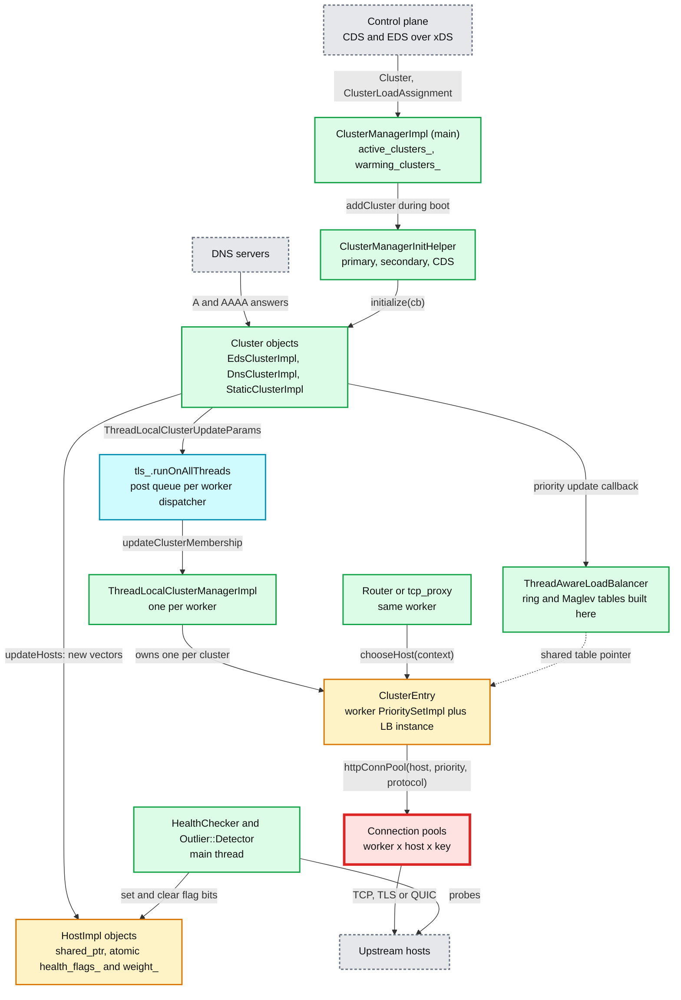

**What to notice**

- **Two copies of every host set.** The main thread's `PrioritySetImpl` is the source of truth. Each worker's `ClusterEntry` holds its own `PrioritySetImpl` that points at the same immutable vectors ([upstream_impl.cc:877](https://github.com/envoyproxy/envoy/blob/v1.39.1/source/common/upstream/upstream_impl.cc#L877)).
- **Hosts are shared, not copied.** `HostImpl` is one object for all threads. Its health bits are a `std::atomic<uint32_t>` ([upstream_impl.h:509](https://github.com/envoyproxy/envoy/blob/v1.39.1/source/common/upstream/upstream_impl.h#L509)). Its `rq_active` and `cx_active` stats are atomic primitive gauges, so least request sees in-flight counts from all workers of this Envoy.
- **The only cross-thread channel is a posted closure.** Workers apply updates at their next event loop turn. That is the root of the consistency model in section 6.12.
- **Hash tables are built once.** Ring hash and Maglev tables are built on main and handed to workers as shared pointers. Round robin and least request build their per-worker EDF schedulers on the worker.
- **The red node is the per-worker connection pool.** It is where load turns into connections. It breaks first in two ways: connection fan-out equals workers x hosts x pool keys, and for HTTP/1 every in-flight request needs its own connection, so the default 1024 `max_connections` and 1024 `max_pending_requests` per cluster run out and requests fail with 503 `UO` (numbers in section 8).

---

## 3. Data flow

### 3.1 Membership and health updates: main thread to workers

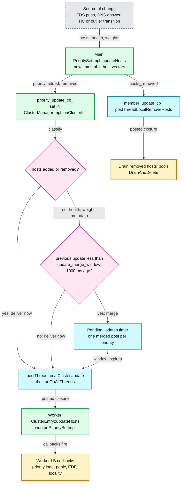

**What to notice**

- **Adds and removes are never merged.** Downstream maps key on the `HostSharedPtr`, and a condensed update would leak removed hosts ([cluster_manager_impl.cc:615](https://github.com/envoyproxy/envoy/blob/v1.39.1/source/common/upstream/cluster_manager_impl.cc#L615)). Only health, weight and metadata changes are batched.
- **The window is leading-edge.** The first change after a quiet second goes out at once (`update_out_of_merge_window`). A second change inside 1000 ms waits for the timer (`cluster_updated_via_merge`). A non-mergeable change cancels the timer and flushes (`update_merge_cancelled`) ([cluster_manager_impl.cc:651](https://github.com/envoyproxy/envoy/blob/v1.39.1/source/common/upstream/cluster_manager_impl.cc#L651)).
- **Health changes during warming are suppressed.** `reloadHealthyHosts` returns early while the cluster is still initializing, to avoid rebuilding ring tables for every first health check ([upstream_impl.cc:1963](https://github.com/envoyproxy/envoy/blob/v1.39.1/source/common/upstream/upstream_impl.cc#L1963)).
- **The worker LB is not recreated.** `ClusterEntry::updateHosts` feeds the worker priority set, and the LB's own callbacks recompute state ([cluster_manager_impl.cc:1512](https://github.com/envoyproxy/envoy/blob/v1.39.1/source/common/upstream/cluster_manager_impl.cc#L1512)).

### 3.2 Host selection for one request

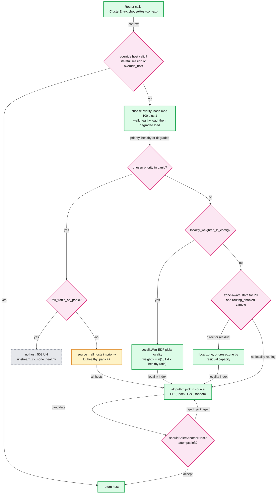

**What to notice**

- **Override host runs before any LB** ([cluster_manager_impl.cc:2131](https://github.com/envoyproxy/envoy/blob/v1.39.1/source/common/upstream/cluster_manager_impl.cc#L2131)). That is how stateful sessions pin a client to one endpoint.
- **Priority is picked with an integer 1 to 100** against the cumulative healthy load, then the degraded load ([load_balancer_impl.cc:68](https://github.com/envoyproxy/envoy/blob/v1.39.1/source/extensions/load_balancing_policies/common/load_balancer_impl.cc#L68)). Retries can swap in a different priority load through `determinePriorityLoad`.
- **Locality weighting and zone-aware routing are exclusive.** Locality weights come from the control plane. Zone-aware routing is computed by Envoy from the local cluster ([load_balancer_impl.cc:838](https://github.com/envoyproxy/envoy/blob/v1.39.1/source/extensions/load_balancing_policies/common/load_balancer_impl.cc#L838)).
- **The retry loop is capped** by `host_selection_retry_max_attempts` (default 1, so 2 picks in total). See [report 05](envoy-05-resilience.md).

### 3.3 From host to stream: the pool map

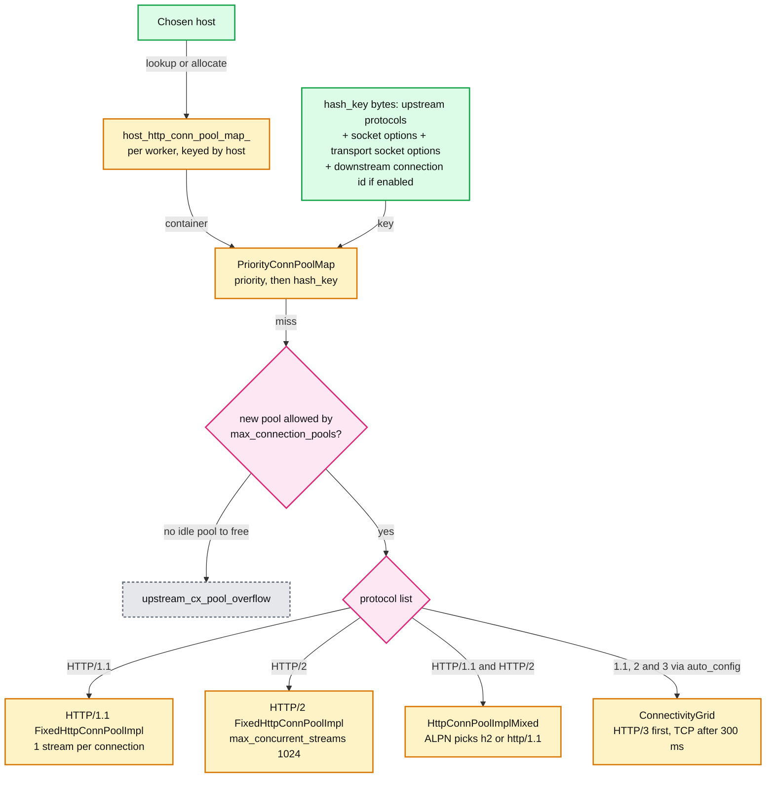

**What to notice**

- **The pool key is built in `ClusterEntry::httpConnPoolImpl`** ([cluster_manager_impl.cc:2028](https://github.com/envoyproxy/envoy/blob/v1.39.1/source/common/upstream/cluster_manager_impl.cc#L2028)). Anything that changes socket options or transport socket options (SNI, filter state shared with upstream) creates a new pool, so a high-cardinality SNI multiplies connections.
- **Pool type follows the protocol list** in `ProdClusterManagerFactory::allocateConnPool` ([cluster_manager_impl.cc:2268](https://github.com/envoyproxy/envoy/blob/v1.39.1/source/common/upstream/cluster_manager_impl.cc#L2268)).
- **Idle pools are deleted** through an idle callback, so short-lived keys do not leak pools.

---

## 4. Sequences

### 4.1 A CDS update warms a cluster, then swaps it in

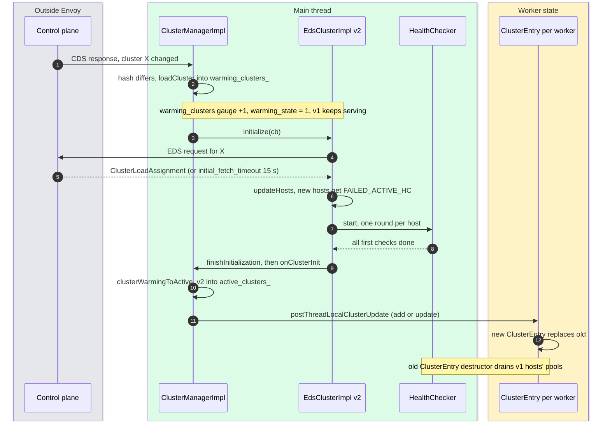

- **v1 serves until v2 is warm**, then the swap is one posted closure per worker ([cluster_manager_impl.cc:802](https://github.com/envoyproxy/envoy/blob/v1.39.1/source/common/upstream/cluster_manager_impl.cc#L802)).
- **A brand new cluster does not exist for routing while warming**: a route to it returns `cluster_not_found_response_code`, 503 by default ([route_components.proto:1176](https://github.com/envoyproxy/envoy/blob/v1.39.1/api/envoy/config/route/v3/route_components.proto#L1176)), response flag `NC`.
- **The CDS ACK does not wait for warming**: the xDS mux ACKs once the update is accepted into `warming_clusters_` **[inferred]**. See [report 06](envoy-06-xds-control-plane.md).

### 4.2 HTTP/2 pool: stream assignment on a cold pool

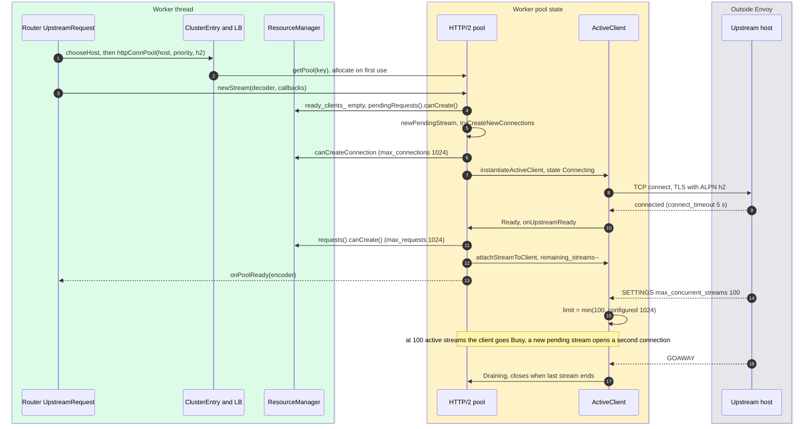

- **Streams attach before SETTINGS arrives.** Envoy treats an HTTP/2 connection as usable once connected, and trims the limit when SETTINGS lands ([conn_pool_base.cc:130](https://github.com/envoyproxy/envoy/blob/v1.39.1/source/common/http/conn_pool_base.cc#L130)). A peer with a lower limit may refuse the extra streams.
- **Two circuit breakers act at two points**: `max_pending_requests` when queueing ([conn_pool_base.cc:352](https://github.com/envoyproxy/envoy/blob/v1.39.1/source/common/conn_pool/conn_pool_base.cc#L352)), `max_requests` when attaching ([conn_pool_base.cc:233](https://github.com/envoyproxy/envoy/blob/v1.39.1/source/common/conn_pool/conn_pool_base.cc#L233)).
- **Learned concurrency is cached** in the alternate protocols cache per origin, so the next connection starts at the peer's limit ([http2/conn_pool.cc:17](https://github.com/envoyproxy/envoy/blob/v1.39.1/source/common/http/http2/conn_pool.cc#L17)).

### 4.3 An active health check failure reaches the workers

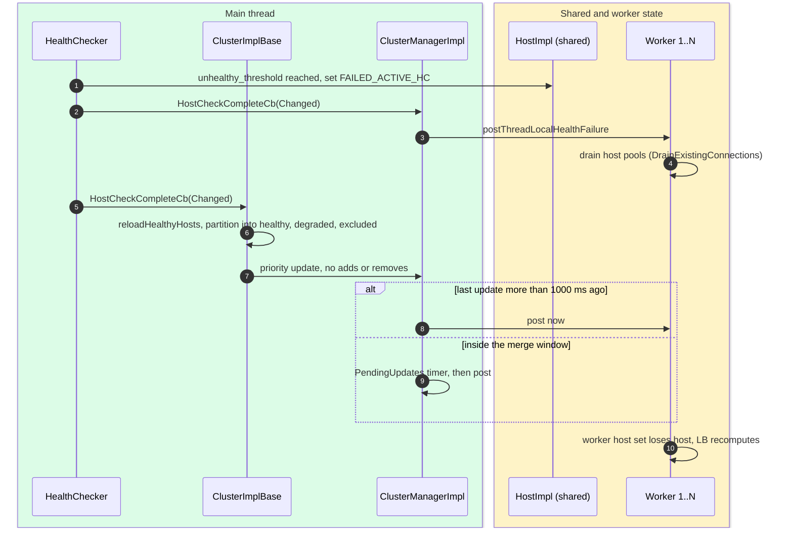

- **Pool drain is immediate, routing change is not.** Until the posted host set lands (up to about 1 s inside a busy merge window), a worker can still pick the host and open a fresh connection to it **[inferred]**.
- **HTTP pools only drain.** `close_connections_on_host_health_failure` hard-closes TCP pools, but HTTP pools still use `DrainExistingConnections` ([cluster_manager_impl.cc:1855](https://github.com/envoyproxy/envoy/blob/v1.39.1/source/common/upstream/cluster_manager_impl.cc#L1855)).

---

## 5. State machines

### 5.1 ClusterManagerInitHelper during boot

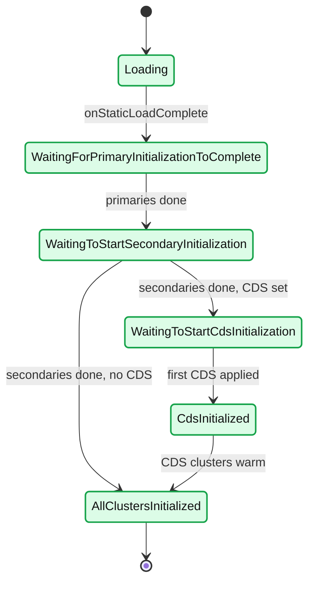

- **Primary** clusters (static, DNS, original_dst, redis, DFP, and EDS whose `eds_config` is a file path) initialize first. **Secondary** clusters (EDS over gRPC, aggregate, composite) wait ([eds.cc:42](https://github.com/envoyproxy/envoy/blob/v1.39.1/source/extensions/clusters/eds/eds.cc#L42)). Reason: the xDS server's own cluster must be reachable before EDS can fetch anything.
- **The server starts the secondaries** from the primary-ready callback (`initializeSecondaryClusters`, [server.cc:862](https://github.com/envoyproxy/envoy/blob/v1.39.1/source/server/server.cc#L862)). While looping over them, EDS, LEDS and SDS are paused, so the subscriptions go out batched **[inferred]** ([cluster_manager_impl.cc:197](https://github.com/envoyproxy/envoy/blob/v1.39.1/source/common/upstream/cluster_manager_impl.cc#L197)).
- **Workers do not serve until `AllClustersInitialized`** ([server.cc:1046](https://github.com/envoyproxy/envoy/blob/v1.39.1/source/server/server.cc#L1046)), which is why a slow EDS delays the first accepted connection (bounded by `initial_fetch_timeout` 15 s per subscription, [config_source.proto:247](https://github.com/envoyproxy/envoy/blob/v1.39.1/api/envoy/config/core/v3/config_source.proto#L247)).

### 5.2 Lifecycle of one cluster version

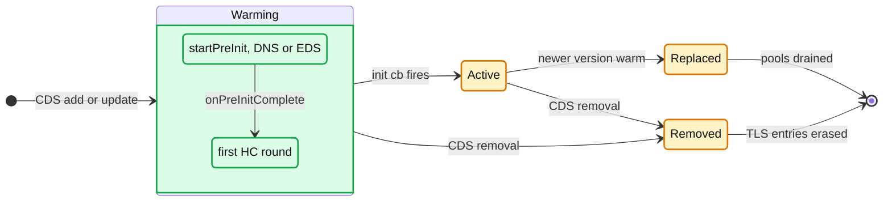

- **A newer version arriving while one is warming replaces the warming entry**; an identical hash is ignored (`blockUpdate`, [cluster_manager_impl.cc:727](https://github.com/envoyproxy/envoy/blob/v1.39.1/source/common/upstream/cluster_manager_impl.cc#L727)).
- **`wait_for_warm_on_init` (default true)** only matters for STRICT_DNS, LOGICAL_DNS and Redis. Set false, a DNS cluster completes init before its first answer ([cluster.proto:1118](https://github.com/envoyproxy/envoy/blob/v1.39.1/api/envoy/config/cluster/v3/cluster.proto#L1118), [dns_cluster.cc:217](https://github.com/envoyproxy/envoy/blob/v1.39.1/source/extensions/clusters/dns/dns_cluster.cc#L217)).
- **A DNS cluster with several names is "warm" after the first name resolves**, not all of them ([dns_cluster.cc:458](https://github.com/envoyproxy/envoy/blob/v1.39.1/source/extensions/clusters/dns/dns_cluster.cc#L458)).

### 5.3 Connection pool ActiveClient

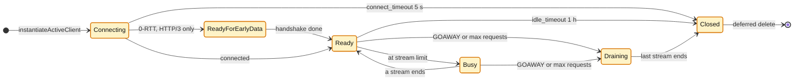

- **Four lists back the states**: `ready_clients_`, `busy_clients_` (Busy and Draining), `connecting_clients_`, `early_data_clients_` ([conn_pool_base.h:91](https://github.com/envoyproxy/envoy/blob/v1.39.1/source/common/conn_pool/conn_pool_base.h#L91)).
- **HTTP/1 has a stream limit of 1**, so it flips Ready to Busy on every request ([http1/conn_pool.cc:85](https://github.com/envoyproxy/envoy/blob/v1.39.1/source/common/http/http1/conn_pool.cc#L85)). `Connection: close` from upstream closes it after the response.
- **Max requests** is `HttpProtocolOptions.max_requests_per_connection` (no limit by default); HTTP/2 uses 2^29 as "unlimited" ([conn_pool_base.cc:109](https://github.com/envoyproxy/envoy/blob/v1.39.1/source/common/http/conn_pool_base.cc#L109)).

### 5.4 Host health as the load balancer sees it

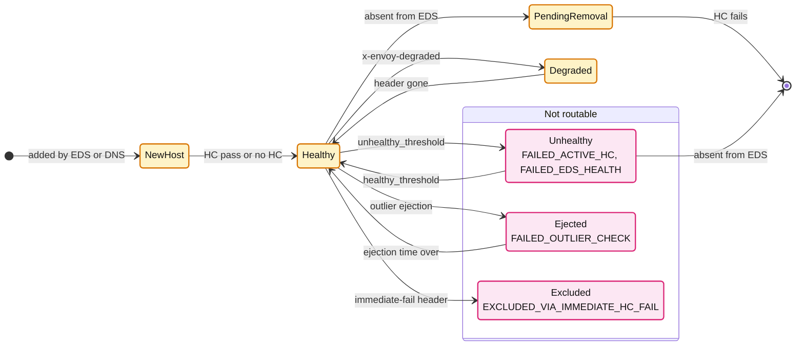

- **New hosts start unhealthy** when a health checker exists: `FAILED_ACTIVE_HC` is set, plus `PENDING_ACTIVE_HC` if `ignore_new_hosts_until_first_hc` ([upstream_impl.cc:2520](https://github.com/envoyproxy/envoy/blob/v1.39.1/source/common/upstream/upstream_impl.cc#L2520)).
- **`PENDING_DYNAMIC_REMOVAL` is the 2x2 matrix in code**: a host absent from discovery but passing HC stays routable ([upstream_impl.cc:2608](https://github.com/envoyproxy/envoy/blob/v1.39.1/source/common/upstream/upstream_impl.cc#L2608)), unless `ignore_health_on_host_removal` is set.

---

## 6. Component deep dives

### 6.1 ClusterManagerImpl and its init phases

- **Class and file**: `ClusterManagerImpl` in `source/common/upstream/cluster_manager_impl.cc`. Holds `active_clusters_` and `warming_clusters_` (maps of `ClusterData`), the `ClusterManagerInitHelper`, the CDS API, the `updates_map_` for merge windows and the TLS slot of `ThreadLocalClusterManagerImpl`.
- **Two paths for add or update** ([cluster_manager_impl.cc:727](https://github.com/envoyproxy/envoy/blob/v1.39.1/source/common/upstream/cluster_manager_impl.cc#L727)): during boot, clusters go through `init_helper_.addCluster`, which sorts them into primary and secondary maps. After boot, each cluster warms on its own and calls `onClusterInit` when done.
- **`onClusterInit` order matters** ([cluster_manager_impl.cc:550](https://github.com/envoyproxy/envoy/blob/v1.39.1/source/common/upstream/cluster_manager_impl.cc#L550)): move warming to active, initialize the thread-aware LB, register the member and priority callbacks, then post the first full host list to workers.
- **Static clusters cannot be updated by CDS**; only `added_via_api` clusters can be removed.

### 6.2 ThreadLocalClusterManagerImpl, ClusterEntry and the merge window

- **One `ThreadLocalClusterManagerImpl` per worker** owns `thread_local_clusters_` (name to `ClusterEntry`), `host_http_conn_pool_map_`, `host_tcp_conn_pool_map_` and the worker's copy of the local cluster priority set.
- **`ClusterEntry`** = worker `PrioritySetImpl` + LB created once from the cluster's `LoadBalancerFactory` ([cluster_manager_impl.cc:1910](https://github.com/envoyproxy/envoy/blob/v1.39.1/source/common/upstream/cluster_manager_impl.cc#L1910)) + lazy HTTP and TCP async clients.
- **Add or update** posts a closure that constructs a new `ClusterEntry` and `reset`s the map slot. The old entry's destructor drains every pool of its hosts ([cluster_manager_impl.cc:2017](https://github.com/envoyproxy/envoy/blob/v1.39.1/source/common/upstream/cluster_manager_impl.cc#L2017)).
- **Remove** posts a closure that fires `onClusterRemoval` callbacks and erases the entry ([cluster_manager_impl.cc:814](https://github.com/envoyproxy/envoy/blob/v1.39.1/source/common/upstream/cluster_manager_impl.cc#L814)).
- **Deferred creation**: with `enable_deferred_cluster_creation`, EDS and STATIC clusters are kept as a `ClusterInitializationObject` on each worker and only inflated on first use. Gauge `thread_local_cluster_manager.<worker>.clusters_inflated` shows how many were built. Helps Envoys with thousands of clusters that each worker rarely touches **[inferred]**.
- **`update_merge_window` 1000 ms** ([cluster.proto:660](https://github.com/envoyproxy/envoy/blob/v1.39.1/api/envoy/config/cluster/v3/cluster.proto#L660)) batches only health, weight and metadata changes per cluster per priority. Set 0 to disable. Why it exists: with ring hash on a 1000-host cluster, each posted update rebuilds tables and every worker refreshes its LB; flapping health checks would otherwise do this dozens of times a second **[inferred]**.

### 6.3 PrioritySet, HostSet, HostImpl and the health bitmask

- **`PrioritySet`** is a vector of `HostSet`, one per priority (EDS `priority` 0 to 128, [endpoint_components.proto:235](https://github.com/envoyproxy/envoy/blob/v1.39.1/api/envoy/config/endpoint/v3/endpoint_components.proto#L235)).
- **Each `HostSet` exposes 8 lists** ([upstream.h:435](https://github.com/envoyproxy/envoy/blob/v1.39.1/envoy/upstream/upstream.h#L435)): `hosts`, `healthyHosts`, `degradedHosts`, `excludedHosts`, and the same four split per locality (`hostsPerLocality` and friends, index 0 is the local locality when known). Plus `localityWeights`, `overprovisioningFactor` (default 140, [upstream_impl.h:79](https://github.com/envoyproxy/envoy/blob/v1.39.1/source/common/upstream/upstream_impl.h#L79)) and `weightedPriorityHealth`.
- **`crossPriorityHostMap`** (address to host, all priorities) serves override-host lookups in O(1).
- **Health flag bits** ([upstream.h:152](https://github.com/envoyproxy/envoy/blob/v1.39.1/envoy/upstream/upstream.h#L152)):

| Bit | Flag | Set by |
|---|---|---|
| 0x1 | `FAILED_ACTIVE_HC` | active HC, and on every new host when HC exists |
| 0x2 | `FAILED_OUTLIER_CHECK` | outlier ejection |
| 0x4 | `FAILED_EDS_HEALTH` | EDS `UNHEALTHY` or `TIMEOUT` |
| 0x8 | `DEGRADED_ACTIVE_HC` | HC response with `x-envoy-degraded` |
| 0x10 | `DEGRADED_EDS_HEALTH` | EDS `DEGRADED` |
| 0x20 | `PENDING_DYNAMIC_REMOVAL` | absent from EDS, still passing HC |
| 0x40 | `PENDING_ACTIVE_HC` | new host with `ignore_new_hosts_until_first_hc` |
| 0x80 | `EXCLUDED_VIA_IMMEDIATE_HC_FAIL` | `x-envoy-immediate-health-check-fail` |
| 0x100 | `ACTIVE_HC_TIMEOUT` | HC failed by timeout |
| 0x200 | `EDS_STATUS_DRAINING` | EDS `DRAINING` |
| 0x400 | `DEGRADED_OUTLIER_DETECTION` | outlier with `detect_degraded_hosts` |

- **"Healthy" is a function of the bits** (`coarseHealth`, [upstream_impl.h:444](https://github.com/envoyproxy/envoy/blob/v1.39.1/source/common/upstream/upstream_impl.h#L444)): **Unhealthy** if any of `FAILED_ACTIVE_HC`, `FAILED_OUTLIER_CHECK`, `FAILED_EDS_HEALTH`, `EDS_STATUS_DRAINING`. Else **Degraded** if any of `DEGRADED_ACTIVE_HC`, `DEGRADED_OUTLIER_DETECTION`, `DEGRADED_EDS_HEALTH`. Else **Healthy** (`PENDING_DYNAMIC_REMOVAL` alone is still healthy).
- **Excluded** is separate: `PENDING_ACTIVE_HC`, `EXCLUDED_VIA_IMMEDIATE_HC_FAIL` or `EDS_STATUS_DRAINING` ([upstream_impl.cc:1753](https://github.com/envoyproxy/envoy/blob/v1.39.1/source/common/upstream/upstream_impl.cc#L1753)). Excluded hosts leave the denominator of spillover, locality and panic math, but panic mode can still route to them.

### 6.4 Cluster discovery types and DNS

| Type | Hosts come from | Phase | Notes |
|---|---|---|---|
| `static` | config | Primary | IPs or pipes only |
| `strict_dns` | every A/AAAA record is a host | Primary | dedups identical IPs; a 0-record answer empties the cluster |
| `logical_dns` | first address only, one `LogicalHost` | Primary | exactly one endpoint allowed; empty answer ignored |
| `eds` | xDS `ClusterLoadAssignment` | Secondary (Primary if file path) | preferred: weights, localities, priorities, health |
| `original_dst` | the connection's original destination (or a header) | Primary | cluster-provided LB; unused hosts purged after `cleanup_interval` 5000 ms ([cluster.proto:1138](https://github.com/envoyproxy/envoy/blob/v1.39.1/api/envoy/config/cluster/v3/cluster.proto#L1138)) |
| `dynamic_forward_proxy` | shared DNS cache keyed by host:port | Primary | cache `max_hosts` 1024, `host_ttl` 5 min, refresh 60 s until resolved, then DNS TTL floored at 5 s ([dns_cache.proto:96](https://github.com/envoyproxy/envoy/blob/v1.39.1/api/envoy/extensions/common/dynamic_forward_proxy/v3/dns_cache.proto#L96)) |
| `aggregate` | ordered list of other clusters | Secondary | linearizes their priorities into one list; health-based failover |
| `composite` | ordered list of clusters | Secondary | new in 1.37: attempt 1 uses cluster 1, retry 1 uses cluster 2, no health check of the choice |
| `redis` | `CLUSTER SLOTS` topology | Primary | cluster-provided LB |

- **Why logical DNS for big DNS-balanced services**: a service like a public API returns a different subset of IPs on every query. With strict DNS each 5 s refresh looks like churn across many hosts and many pools. Logical DNS presents one logical host, so there is one pool per worker and no N-way fan-out. New connections go to the latest first address (`RealHostDescription` snapshots it at connect time). Caveat for 1.39: the legacy code swapped the address in place (`setNewAddresses`), but the merged code replaces the host when the first address changes, which the unit test confirms as a membership update ([logical_dns_cluster_test.cc:234](https://github.com/envoyproxy/envoy/blob/v1.39.1/test/extensions/clusters/logical_dns/logical_dns_cluster_test.cc#L234)). The old host's pools then drain gracefully, so a DNS answer that rotates its first IP every refresh recycles connections every 5 s **[inferred]**.
- **DNS cadence**: `dns_refresh_rate` 5000 ms ([dns_cluster.cc:159](https://github.com/envoyproxy/envoy/blob/v1.39.1/source/extensions/clusters/dns/dns_cluster.cc#L159)); on failure `dns_failure_refresh_rate` backs off from `base_interval` to `max_interval` (default 10 x base), or uses the refresh rate if unset; `respect_dns_ttl` uses the record TTL (floored by `dns_min_refresh_rate`); optional `dns_jitter`.
- **Deprecations**: `dns_refresh_rate`, `dns_failure_refresh_rate`, `respect_dns_ttl` and `dns_lookup_family` on `Cluster` are deprecated in favour of `cluster_type: envoy.clusters.dns` with a `DnsCluster` config ([cluster.proto:1009](https://github.com/envoyproxy/envoy/blob/v1.39.1/api/envoy/config/cluster/v3/cluster.proto#L1009), [:1056](https://github.com/envoyproxy/envoy/blob/v1.39.1/api/envoy/config/cluster/v3/cluster.proto#L1056)).
- **`dns_lookup_family` AUTO** = IPv6 first, IPv4 fallback. `ALL` returns both and enables Happy Eyeballs (next address tried after 300 ms).
- **Resolvers**: c-ares (default off macOS; since 1.39 identical c-ares configs share one resolver, guard `shared_cares_dns_resolver`), Apple (macOS default), getaddrinfo (own thread pool), Hickory (Rust, DoT and DoH).

### 6.5 Connection pools

- **Base class**: `ConnPoolImplBase` in `source/common/conn_pool/conn_pool_base.cc`, shared by HTTP and TCP pools. HTTP adds `HttpConnPoolImplBase` and `MultiplexedActiveClientBase`.
- **Scope**: one pool per (worker, host, priority, hash_key). Pools are never shared across workers. Consequence: **upstream connections >= workers x hosts x keys**. `--concurrency` defaults to `std::thread::hardware_concurrency()` (host threads, not the cgroup quota), so a sidecar on a 64-thread node talking to a 200-host HTTP/2 cluster opens at least 64 x 200 = 12,800 connections, and each upstream host sees 64 connections from every such client **[inferred arithmetic]**.
- **HTTP/1.1**: one request per connection, no pipelining, so one upstream reset fails only one request. Pending streams queue in `pending_streams_` and attach FIFO as connections free up.
- **HTTP/2**: multiplexes up to `max_concurrent_streams` (1024) per connection, lowered by the peer's SETTINGS. Opens another connection only when there is a pending stream and no ready capacity. GOAWAY or `max_requests_per_connection` moves a client to Draining.
- **HTTP/3**: same shape over QUIC, `max_concurrent_streams` 100 for QUIC, stream capacity tracked from MAX_STREAMS frames rather than on attach.
- **Mixed (ALPN)**: `HttpConnPoolImplMixed` opens TLS, then instantiates an HTTP/1 or HTTP/2 client from the negotiated ALPN.
- **auto_config with HTTP/3**: `ConnectivityGrid` wraps an HTTP/3 pool and a mixed TCP pool. HTTP/3 is tried only for origins advertised in the alternate protocols cache (alt-svc or HTTPS RR). If QUIC is not up after 300 ms (or 1.5 x cached SRTT, [conn_pool_grid.cc:354](https://github.com/envoyproxy/envoy/blob/v1.39.1/source/common/http/conn_pool_grid.cc#L354)), TCP is raced. Failure marks HTTP/3 broken for 1 s, doubling per repeat.
- **Preconnect**: `shouldConnect` fires when `(pending + active + anticipated) x ratio > connecting_and_connected_capacity + active` ([conn_pool_base.cc:94](https://github.com/envoyproxy/envoy/blob/v1.39.1/source/common/conn_pool/conn_pool_base.cc#L94)). `per_upstream_preconnect_ratio` (1.0 to 3.0) keeps spare capacity in each pool; 1.5 with 100 HTTP/1 streams means 150 connections. `predictive_preconnect_ratio` (1.0 to 3.0) peeks the next host of RR or random and warms its pool; capped at one preconnect per healthy host. At most 3 connections are created per trigger ([conn_pool_base.cc:166](https://github.com/envoyproxy/envoy/blob/v1.39.1/source/common/conn_pool/conn_pool_base.cc#L166)). Unhealthy hosts are never preconnected.
- **Idle**: a connection with no streams closes after `idle_timeout` 1 h ([protocol.proto:332](https://github.com/envoyproxy/envoy/blob/v1.39.1/api/envoy/config/core/v3/protocol.proto#L332)); an empty pool is deleted.

### 6.6 Priority load, degraded, excluded and panic

- **Health score per priority** ([load_balancer_impl.cc:214](https://github.com/envoyproxy/envoy/blob/v1.39.1/source/extensions/load_balancing_policies/common/load_balancer_impl.cc#L214)): `health = min(100, 140 x healthy / (hosts - excluded))`, integer math. Same formula for degraded. With `weighted_priority_health`, host weights replace counts.
- **Normalized total availability** = `min(100, sum of health + sum of degraded)`. Load is handed out healthy first, highest priority first (`distributeLoad`), then leftovers to degraded, and rounding remainder to the first available priority.
- **Worked example** (overprovisioning 140):
  - P0 has 10 hosts: 6 healthy, 1 degraded, 2 unhealthy, 1 `EDS_STATUS_DRAINING` (unhealthy and excluded). P1 has 4 healthy hosts.
  - P0 denominator = 10 - 1 = 9. Health = min(100, 840 / 9) = 93. Degraded = min(100, 140 / 9) = 15.
  - P1 health = min(100, 140 x 4 / 4) = 100.
  - Normalized total = min(100, 93 + 15 + 100) = 100, so no priority can panic.
  - Healthy load: P0 gets min(100, 93) = 93, P1 gets the remaining 7. Degraded load: 0.
  - Result: 93% to P0 healthy hosts, 7% to P1, 0% to P0's degraded host. Without the exclusion, P0 would be 140 x 6 / 10 = 84 and P1 would take 16%.
- **Degraded hosts are a last resort**: they get traffic only after healthy capacity of all priorities is exhausted.
- **Panic** ([load_balancer_impl.cc:292](https://github.com/envoyproxy/envoy/blob/v1.39.1/source/extensions/load_balancing_policies/common/load_balancer_impl.cc#L292)): skipped entirely while normalized total is 100. Otherwise a priority panics if `(healthy% + degraded%) < healthy_panic_threshold` (50%, runtime `upstream.healthy_panic_threshold`), percentages over non-excluded hosts ([:677](https://github.com/envoyproxy/envoy/blob/v1.39.1/source/extensions/load_balancing_policies/common/load_balancer_impl.cc#L677)).
- **What panic does**: the pick ignores health and uses **all** hosts in that priority (`lb_healthy_panic` +1 per pick), or returns no host if `fail_traffic_on_panic` (503 `UH`). If every priority panics, load splits by raw host count ([:335](https://github.com/envoyproxy/envoy/blob/v1.39.1/source/extensions/load_balancing_policies/common/load_balancer_impl.cc#L335)). Threshold 0 disables panic.
- **Panic example**: one priority, 10 hosts, 4 healthy. Health = 56, total < 100, healthy 40% < 50%, so panic: requests spread over all 10 hosts and about 60% land on unhealthy ones. With 5 healthy (50%), no panic: the 5 take 100%.

### 6.7 Locality weighting and zone-aware routing

- **Locality weighted** (`locality_weighted_lb_config`): per priority, a `LocalityWrr` EDF over localities with `effective_weight = locality_weight x min(1, 1.4 x healthy / (hosts - excluded))` ([locality_wrr.cc:84](https://github.com/envoyproxy/envoy/blob/v1.39.1/source/extensions/load_balancing_policies/common/locality_wrr.cc#L84)). Weights come from EDS. Not compatible with subsets.
- **Zone-aware routing** needs a **local cluster** (`cluster_manager.local_cluster_name`) that lists the calling Envoys per zone. Only P0. Skipped if fewer than 2 upstream localities, if the upstream has fewer than `min_cluster_size` 6 healthy hosts (`lb_zone_cluster_too_small`), if the local cluster has no hosts in our zone (`lb_local_cluster_not_ok`), or on a `routing_enabled` 100% runtime sample miss ([load_balancer_impl.cc:621](https://github.com/envoyproxy/envoy/blob/v1.39.1/source/extensions/load_balancing_policies/common/load_balancer_impl.cc#L621)).
- **Algorithm** ([load_balancer_impl.cc:513](https://github.com/envoyproxy/envoy/blob/v1.39.1/source/extensions/load_balancing_policies/common/load_balancer_impl.cc#L513)), in units of 1/10000:
  - `local%` = our zone's share of healthy callers; `upstream%` = our zone's share of healthy upstream hosts.
  - If `upstream% >= local%`: **LocalityDirect**, 100% stays in zone.
  - Else **LocalityResidual**: `local_percent_to_route = upstream% x 10000 / local%`; the rest goes cross-zone, split by each other zone's residual `upstream% - local%` (only positive).
- **Worked example**: callers A 4, B 4, C 2 (40/40/20). Upstream healthy A 5, B 10, C 5 (25/50/25), 20 >= 6. For an Envoy in A:
  - local 4000 > upstream 2500, so residual. Keep 2500 x 10000 / 4000 = 6250, i.e. 62.5% in A.
  - Residuals: B 5000 - 4000 = 1000, C 2500 - 2000 = 500. Cross-zone 37.5% splits 2:1, so B 25%, C 12.5%.
  - Check fleet-wide: A receives 0.4 x 62.5% = 25%, exactly its share. Envoys in B and C are LocalityDirect (upstream share >= caller share), and B receives 40% + 0.4 x 25% = 50%. Balanced.

### 6.8 The load balancing algorithms

| Policy | Data structure | Pick cost | Weights |
|---|---|---|---|
| `round_robin` | equal weights: per-source index with random start; else `EdfScheduler` per source, per worker | O(1) or O(log n) | deadline advances by 1/weight |
| `least_request` | equal: sample `choice_count` 2 (P2C) or `FULL_SCAN`; else EDF with dynamic weight | O(2), O(n) or O(log n) | `weight / (active + 1)^bias` |
| `random` | host vector | O(1) | ignored |
| `ring_hash` | sorted vector of (hash, host), built on main, shared | O(log R) | entries proportional to weight |
| `maglev` | 65537-slot table (or compact bit array), built on main, shared | O(1) | slots proportional to weight, at least 1 |
| bounded load | wrapper over ring or Maglev | O(n) worst | `slots = ceil(total_slots x w)` |
| `subset` | trie of metadata values to per-subset LB | O(keys) + inner | inner policy |
| `client_side_weighted_round_robin` | round robin EDF, weights from ORCA set on main | O(log n) | `qps / utilization` |

- **Round robin and EDF** ([edf_scheduler.h:28](https://github.com/envoyproxy/envoy/blob/v1.39.1/source/common/upstream/edf_scheduler.h#L28)): a binary heap keyed by deadline = `current_time + 1/weight`. Pick pops the earliest deadline and re-adds with the host's current weight. Entries are `weak_ptr`, so removed hosts vanish lazily. If all weights are equal and nobody is in slow start, no EDF is built at all ([load_balancer_impl.cc:1052](https://github.com/envoyproxy/envoy/blob/v1.39.1/source/extensions/load_balancing_policies/common/load_balancer_impl.cc#L1052)); the pick is `hosts[index++ % n]`. Each worker seeds its start randomly (`createWithPicks(seed)`), so 16 workers do not all hit host 0 first. One scheduler exists per `HostsSource` (all, healthy, degraded, each locality), per priority, per worker.
- **Least request** ([least_request_lb.cc:14](https://github.com/envoyproxy/envoy/blob/v1.39.1/source/extensions/load_balancing_policies/least_request/least_request_lb.cc#L14)): equal weights sample 2 random hosts (not necessarily distinct) and keep the one with fewer `rq_active` (plus `rq_pending_active` only if the off-by-default guard `least_request_lb_count_pending_requests` is enabled). With only 2 hosts, the busier one still wins 25% of the time. Unequal weights: EDF where weight 2 with 4 active becomes 2 / 5 = 0.4. The weight is recomputed only when the host is re-inserted after a pick, so it lags. `rq_active` is shared across workers, but not across Envoys.
- **Ring hash (ketama)** ([ring_hash_lb.cc:128](https://github.com/envoyproxy/envoy/blob/v1.39.1/source/extensions/load_balancing_policies/ring_hash/ring_hash_lb.cc#L128)): `scale = min(ceil(min_w x min_ring) / min_w, max_ring)`, hash keys `"<address or hash_key>_<i>"` with xxHash64, then sort. Lookup is binary search for the first entry >= hash, wrapping. Default min 1024 is small: 300 equal hosts give ceil(1024/300) = 4 entries each, so per-host load varies widely **[inferred]**. Watch `min_hashes_per_host`.
- **Maglev** ([maglev_lb.cc:160](https://github.com/envoyproxy/envoy/blob/v1.39.1/source/extensions/load_balancing_policies/maglev/maglev_lb.cc#L160)): each host gets `offset = xxHash64(key) % 65537` and `skip = xxHash64(key, seed 1) % 65536 + 1`, and hosts take turns claiming their next free slot until the prime-sized table is full. Lookup is `table[hash % 65537]`. The compact table stores `bit_width(n)` bits per slot: 7 bits for 100 hosts is about 57 KiB versus about 1 MiB of 16-byte `shared_ptr`s **[inferred]**. Docs: builds about 10x and picks about 5x faster than a 256K ring, but about 2x the keys move when a host leaves.
- **Bounded load** (`hash_balance_factor`, min 100, [thread_aware_lb_impl.cc:265](https://github.com/envoyproxy/envoy/blob/v1.39.1/source/extensions/load_balancing_policies/common/thread_aware_lb_impl.cc#L265)): `total_slots = ((cluster_rq_active + 1) x factor + 99) / 100`. Example: factor 150, 99 active, 10 equal hosts: 150 slots, 15 per host. A host above 15 active is skipped and hosts are probed in a hash-seeded shuffle, O(n).
- **Hash policies** ([hash_policy.cc:256](https://github.com/envoyproxy/envoy/blob/v1.39.1/source/common/http/hash_policy.cc#L256)): `header`, `cookie`, `connection_properties.source_ip`, `query_parameter`, `filter_state`. Several policies combine by rotate-and-XOR; `terminal: true` stops at the first that yields a hash. A cookie policy with a `ttl` generates the cookie when absent: value = xxHash64(remote + local address), sent back as `Set-Cookie`. No hash at all means a random pick. With priorities, the priority is chosen by the same hash, so keys stay stable. Retries move off the host: ring adds the attempt number to the index, Maglev XORs the hash.
- **Subset LB**: `subset_selectors` key lists build a trie of metadata values; lookup is O(number of keys). Fallbacks: `NO_FALLBACK` (default), `ANY_ENDPOINT`, `DEFAULT_SUBSET`, per-selector `KEYS_SUBSET`, plus `metadata_fallback_policy: FALLBACK_LIST`. `single_host_per_subset` is the single-key optimisation: each subset is one host, updates are cheap, duplicates counted in `lb_subsets_single_host_per_subset_duplicate`.
- **Client-side WRR** ([orca_weight_manager.cc:77](https://github.com/envoyproxy/envoy/blob/v1.39.1/source/extensions/load_balancing_policies/common/orca_weight_manager.cc#L77)): `weight = rps / (util + penalty x eps / rps)`, where util is the max named metric, else `application_utilization`, else `cpu_utilization`. Example: 200 rps, util 0.5, 10 eps, penalty 1.0 gives 200 / 0.55 = 363. A main-thread timer (`weight_update_period` 1 s) writes weights onto hosts, ignoring reports younger than `blackout_period` 10 s or older than `weight_expiration_period` 3 min (those get the median weight), then tells every worker to rebuild its EDF.
- **The rest**: `override_host` picks addresses from a header or dynamic metadata (retries walk the list) and falls back to a child policy. `wrr_locality` = locality EDF + CSWRR child only. `cluster_provided` means the cluster type supplies the LB (aggregate, composite, original_dst, DFP, redis). `load_aware_locality` is a stub in this release. `peak_ewma` (contrib, alpha) runs P2C on `cost = rtt_ewma_ms x (active + 1)` with a 10 s decay.
- **`load_balancing_policy` versus `lb_policy`**: the enum is deprecated. Internally each enum value maps to the same factory name ([upstream_impl.cc:1089](https://github.com/envoyproxy/envoy/blob/v1.39.1/source/common/upstream/upstream_impl.cc#L1089)). The new field is an ordered list; the first registered factory wins, so you can list an experimental policy with a fallback. It cannot be combined with `lb_subset_config` or the zone-aware, locality-weighted or consistent-hashing parts of `common_lb_config` ([:1479](https://github.com/envoyproxy/envoy/blob/v1.39.1/source/common/upstream/upstream_impl.cc#L1479)).

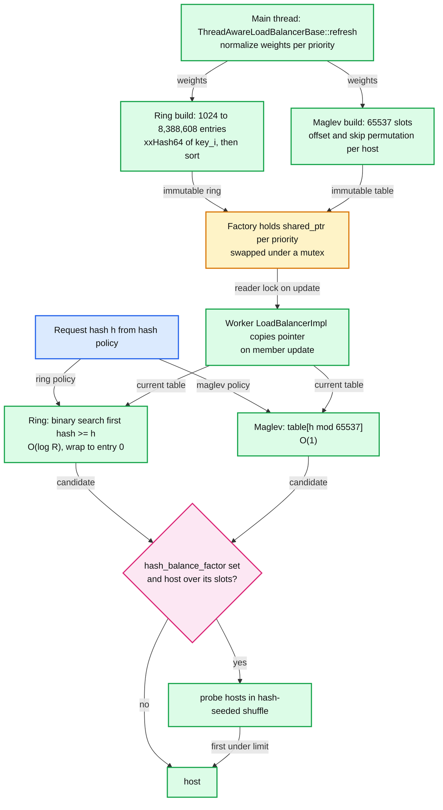

### 6.9 Slow start

- **Formula** ([load_balancer_impl.cc:1182](https://github.com/envoyproxy/envoy/blob/v1.39.1/source/extensions/load_balancing_policies/common/load_balancer_impl.cc#L1182)): `new_weight = weight x max(min_weight_percent, time_factor^(1/aggression))`, `time_factor = max(1 ms, time since healthy) / slow_start_window`. Note the code uses milliseconds; the docs formula says seconds.
- **Example**: weight 10, window 60 s, aggression 1.0, min 10%. At 3 s: factor 0.05, floored to 0.10, weight 1. At 30 s: weight 5. At 60 s: weight 10 and slow start ends. With aggression 2.0, at 15 s: 0.25^0.5 = 0.5, weight 5 (faster ramp).
- **Entry**: on joining (no HC) or on an unhealthy-to-healthy HC transition. Supported by round robin, least request and CSWRR. Any host in slow start forces EDF even with equal weights. Weak when all hosts are new (a fresh deploy): everyone ramps together.

### 6.10 LoadBalancerContext hooks used by retries

- **`determinePriorityLoad`** lets a retry priority plugin (`previous_priorities`) hand the LB a different healthy and degraded load, so a retry avoids priorities already tried ([load_balancer.h:125](https://github.com/envoyproxy/envoy/blob/v1.39.1/envoy/upstream/load_balancer.h#L125)).
- **`shouldSelectAnotherHost`** and **`hostSelectionRetryCount`** implement retry host predicates (`previous_hosts`, canary). The LB re-picks up to `host_selection_retry_max_attempts` + 1 times, then returns the last host. The attempt number is passed to hash LBs so they move off the host.
- **`overrideHostToSelect`**, **`computeHashKey`** and **`metadataMatchCriteria`** feed override host, hashing and subsets. Mechanics of retries: [report 05](envoy-05-resilience.md).

### 6.11 Load Reporting Service and ORCA

- **LRS**: a bidirectional gRPC stream to `cluster_manager.load_stats_config`, started with the secondary clusters. The server names clusters (or `send_all_clusters`) and the interval. Envoy reports per locality (and per endpoint if asked) `total_successful_requests`, `total_error_requests`, `total_requests_in_progress`, `total_issued_requests`, named load metrics, and dropped requests. Control planes use it for global load decisions and to set EDS weights.
- **ORCA**: per-request `endpoint-load-metrics` response headers or trailers, or an out-of-band gRPC stream per host (`enable_oob_load_report`, period 10 s). Consumed by CSWRR today.

### 6.12 Consistency model

- **Membership and health are eventually consistent across workers.** The main thread publishes; each worker applies at its own next loop turn. Two workers can pick from slightly different host sets for a few milliseconds, and for up to about 1 s when a health change sits in the merge window.
- **Each worker has its own LB state.** Round robin indexes and EDF heaps are per worker, so global rotation order does not exist. With 16 workers and 4 hosts, a burst of 16 requests from 16 connections can land unevenly **[inferred]**.
- **Host flags are strongly consistent, host lists are not.** Flags are atomics on the shared `HostImpl`, but the LB only reads the partitioned lists, so a flag flip affects routing only after the posted rebuild.
- **Across Envoys there is no coordination at all.** Least request and bounded load see only this Envoy's in-flight requests.

---

## 7. Failure modes

| Failure | What the user sees | Blast radius | Mitigation |
|---|---|---|---|
| All hosts unhealthy, `fail_traffic_on_panic` false | traffic spread over all hosts, errors from dead ones, `lb_healthy_panic` climbs | one cluster | intended: avoids cascade; set true for all-or-nothing services |
| No host at all (empty EDS, panic threshold 0) | 503 `UH` "no healthy upstream", `upstream_cx_none_healthy` | one cluster | priorities with spare capacity, aggregate failover |
| Cluster still warming or unknown | 503 `NC` (or 404 if configured) | routes to that cluster | order CDS before RDS (report 06), watch `warming_clusters` |
| EDS silent at boot | Envoy starts listening after 15 s with an empty cluster | whole Envoy start | `initial_fetch_timeout`, alert on `update_empty` |
| HTTP/1 burst over 1024 in flight | 503 `UO`, `upstream_rq_pending_overflow`, `upstream_cx_overflow` | one cluster, one priority | HTTP/2 upstream, raise breakers deliberately, preconnect |
| `max_connection_pools` hit (high-cardinality SNI) | 503 `UO`, `upstream_cx_pool_overflow` | one cluster | reduce key cardinality |
| Upstream connect failure or timeout (5 s) | 503 `UF`, `upstream_cx_connect_fail`, `upstream_cx_connect_timeout` | one host, then outlier ejection | lower `connect_timeout`, retries on `connect-failure` |
| DNS resolution failing | stale hosts kept, `update_failure` climbs, refresh backs off | one DNS cluster | `dns_failure_refresh_rate`, TTL-based refresh |
| CDS pushes identical-but-reordered clusters | hash changes **[inferred]**, every worker drains pools, handshake storm | every cluster touched | stable control plane serialization |
| HTTP/3 blocked by network | first requests wait 300 ms then use TCP, `upstream_http3_broken` | one origin | automatic, broken period grows to about 36 h |

---

## 8. Scalability and performance

- **What breaks first: the per-worker pools.** Connection count = workers x hosts x keys (x in-flight for HTTP/1). 1000 client pods x 16 workers means every upstream host holds 16,000 idle-ish HTTP/2 connections **[inferred arithmetic]**. Memory and accept load on the upstream, not Envoy CPU, is the limit. Fix: set `--concurrency` to the CPU quota, prefer HTTP/2, avoid per-downstream pools, keep pool keys low-cardinality.
- **For HTTP/1 upstreams**, in-flight requests = connections. The default breakers (1024 connections, 1024 pending, 1024 requests per cluster per priority, shared across workers) cap concurrency at about 2048 requests before `UO` **[inferred]**. Size them from Little's law: 20k rps x 50 ms = 1000 in flight.
- **Main thread LB rebuild cost.** EDF refresh is O(n log n) per priority per worker; ring build is O(R log R) on main; Maglev is O(65537) per priority. The merge window exists to bound this. With `coalesce_lb_rebuilds_on_batch_update` (off by default) batched EDS updates rebuild once per batch.
- **Request path**: override lookup O(1), priority O(P) with P usually 1 to 3, locality O(log L), algorithm O(1) to O(log n). No locks except the reader lock ring and Maglev take on update.
- **Memory per cluster per worker**: host set wrappers, EDF heaps (3 + 2L per priority), pools. Deferred cluster creation avoids building rarely used clusters on every worker.
- **Maglev table**: about 1 MiB per priority with shared pointers, or tens of KiB compact, shared by all workers **[inferred]**.

---

## 9. Trade-offs and alternatives

| Decision | Chosen | Alternative | Why |
|---|---|---|---|
| Where host sets live | immutable snapshots posted per worker | shared structure with locks | zero request-path locks, simple single-thread code; cost: brief inconsistency |
| Pool scope | per worker, per host, per key | shared cross-thread pools | no locks, no cross-thread wakeups; cost: connections x workers |
| Discovery consistency | eventual plus active HC | strongly consistent registry (ZooKeeper, etcd) | registry outages must not stop traffic |
| Health change delivery | merged in a 1000 ms window | immediate | bounds rebuild storms; cost: up to 1 s stale routing |
| Consistent hashing | ring hash (stable, O(log R)) or Maglev (O(1), faster build) | rendezvous hashing | Maglev wins on speed and memory, ring wins on stability (about half the key movement) |
| Equal-weight least request | P2C | full scan | O(1) and resists herding; full scan is exact but O(n) |
| Failure under mass unhealth | panic, route to all | fail closed | a false-positive health signal should not take the service down |
| Locality policy | control-plane weights or Envoy zone math | ORCA load-aware | load-aware exists only as a stub in 1.39.1 |
| DNS clusters | one merged `DnsClusterImpl` | two code paths | less code, one behaviour; logical DNS now replaces its host on address change |

---

## 10. Config reference

| Knob | Default | Where |
|---|---|---|
| `connect_timeout` | 5 s | [cluster.proto:883](https://github.com/envoyproxy/envoy/blob/v1.39.1/api/envoy/config/cluster/v3/cluster.proto#L883) |
| `lb_policy` (deprecated path) | ROUND_ROBIN | [cluster.proto:898](https://github.com/envoyproxy/envoy/blob/v1.39.1/api/envoy/config/cluster/v3/cluster.proto#L898) |
| `load_balancing_policy` | unset, first registered policy wins | [cluster.proto:1229](https://github.com/envoyproxy/envoy/blob/v1.39.1/api/envoy/config/cluster/v3/cluster.proto#L1229) |
| `healthy_panic_threshold` | 50% | [cluster.proto:637](https://github.com/envoyproxy/envoy/blob/v1.39.1/api/envoy/config/cluster/v3/cluster.proto#L637) |
| zone aware `routing_enabled` / `min_cluster_size` | 100% / 6 | [cluster.proto:578](https://github.com/envoyproxy/envoy/blob/v1.39.1/api/envoy/config/cluster/v3/cluster.proto#L578), [:585](https://github.com/envoyproxy/envoy/blob/v1.39.1/api/envoy/config/cluster/v3/cluster.proto#L585) |
| `fail_traffic_on_panic` | false | [cluster.proto:591](https://github.com/envoyproxy/envoy/blob/v1.39.1/api/envoy/config/cluster/v3/cluster.proto#L591) |
| `update_merge_window` | 1000 ms (0 disables) | [cluster.proto:660](https://github.com/envoyproxy/envoy/blob/v1.39.1/api/envoy/config/cluster/v3/cluster.proto#L660) |
| `ignore_new_hosts_until_first_hc` | false | [cluster.proto:665](https://github.com/envoyproxy/envoy/blob/v1.39.1/api/envoy/config/cluster/v3/cluster.proto#L665) |
| `close_connections_on_host_set_change` | false | [cluster.proto:669](https://github.com/envoyproxy/envoy/blob/v1.39.1/api/envoy/config/cluster/v3/cluster.proto#L669) |
| slow start `slow_start_window` / `aggression` / `min_weight_percent` | unset / 1.0 / 10% | [cluster.proto:414](https://github.com/envoyproxy/envoy/blob/v1.39.1/api/envoy/config/cluster/v3/cluster.proto#L414), [:428](https://github.com/envoyproxy/envoy/blob/v1.39.1/api/envoy/config/cluster/v3/cluster.proto#L428), [:433](https://github.com/envoyproxy/envoy/blob/v1.39.1/api/envoy/config/cluster/v3/cluster.proto#L433) |
| least request `choice_count` / `active_request_bias` | 2 / 1.0 | [cluster.proto:450](https://github.com/envoyproxy/envoy/blob/v1.39.1/api/envoy/config/cluster/v3/cluster.proto#L450), [:475](https://github.com/envoyproxy/envoy/blob/v1.39.1/api/envoy/config/cluster/v3/cluster.proto#L475) |
| least request `selection_method` | N_CHOICES | [least_request.proto:96](https://github.com/envoyproxy/envoy/blob/v1.39.1/api/envoy/extensions/load_balancing_policies/least_request/v3/least_request.proto#L96) |
| ring `minimum_ring_size` / `maximum_ring_size` / `hash_function` | 1024 / 8,388,608 / XX_HASH | [cluster.proto:505](https://github.com/envoyproxy/envoy/blob/v1.39.1/api/envoy/config/cluster/v3/cluster.proto#L505), [:514](https://github.com/envoyproxy/envoy/blob/v1.39.1/api/envoy/config/cluster/v3/cluster.proto#L514), [:509](https://github.com/envoyproxy/envoy/blob/v1.39.1/api/envoy/config/cluster/v3/cluster.proto#L509) |
| Maglev `table_size` | 65537 (max 5,000,011, prime) | [cluster.proto:524](https://github.com/envoyproxy/envoy/blob/v1.39.1/api/envoy/config/cluster/v3/cluster.proto#L524) |
| `hash_balance_factor` | unset (unbounded), min 100 | [cluster.proto:628](https://github.com/envoyproxy/envoy/blob/v1.39.1/api/envoy/config/cluster/v3/cluster.proto#L628) |
| `per_upstream_preconnect_ratio` / `predictive_preconnect_ratio` | 1.0 / unset (range 1.0 to 3.0) | [cluster.proto:726](https://github.com/envoyproxy/envoy/blob/v1.39.1/api/envoy/config/cluster/v3/cluster.proto#L726), [:754](https://github.com/envoyproxy/envoy/blob/v1.39.1/api/envoy/config/cluster/v3/cluster.proto#L754) |
| `HttpProtocolOptions.idle_timeout` | 1 h | [protocol.proto:332](https://github.com/envoyproxy/envoy/blob/v1.39.1/api/envoy/config/core/v3/protocol.proto#L332) |
| `HttpProtocolOptions.max_requests_per_connection` | no limit | [protocol.proto:409](https://github.com/envoyproxy/envoy/blob/v1.39.1/api/envoy/config/core/v3/protocol.proto#L409) |
| HTTP/2 `max_concurrent_streams` | 1024 | [protocol.proto:609](https://github.com/envoyproxy/envoy/blob/v1.39.1/api/envoy/config/core/v3/protocol.proto#L609) |
| breakers `max_connections` / `max_pending_requests` / `max_requests` | 1024 each, per cluster per priority | [circuit_breaker.proto:79](https://github.com/envoyproxy/envoy/blob/v1.39.1/api/envoy/config/cluster/v3/circuit_breaker.proto#L79), [:84](https://github.com/envoyproxy/envoy/blob/v1.39.1/api/envoy/config/cluster/v3/circuit_breaker.proto#L84), [:89](https://github.com/envoyproxy/envoy/blob/v1.39.1/api/envoy/config/cluster/v3/circuit_breaker.proto#L89) |
| breakers `max_connection_pools` | unlimited | [circuit_breaker.proto:119](https://github.com/envoyproxy/envoy/blob/v1.39.1/api/envoy/config/cluster/v3/circuit_breaker.proto#L119) |
| `dns_refresh_rate` | 5000 ms | [dns_cluster.proto:45](https://github.com/envoyproxy/envoy/blob/v1.39.1/api/envoy/extensions/clusters/dns/v3/dns_cluster.proto#L45), legacy [cluster.proto:1009](https://github.com/envoyproxy/envoy/blob/v1.39.1/api/envoy/config/cluster/v3/cluster.proto#L1009) |
| `dns_failure_refresh_rate` | falls back to `dns_refresh_rate` | [cluster.proto:1046](https://github.com/envoyproxy/envoy/blob/v1.39.1/api/envoy/config/cluster/v3/cluster.proto#L1046) |
| `respect_dns_ttl` | false (deprecated on Cluster) | [cluster.proto:1056](https://github.com/envoyproxy/envoy/blob/v1.39.1/api/envoy/config/cluster/v3/cluster.proto#L1056) |
| `dns_lookup_family` | AUTO (v6 then v4) | [cluster.proto:1067](https://github.com/envoyproxy/envoy/blob/v1.39.1/api/envoy/config/cluster/v3/cluster.proto#L1067) |
| `DnsCluster.all_addresses_in_single_endpoint` | false (strict semantics) | [dns_cluster.proto:91](https://github.com/envoyproxy/envoy/blob/v1.39.1/api/envoy/extensions/clusters/dns/v3/dns_cluster.proto#L91) |
| `wait_for_warm_on_init` | true | [cluster.proto:1118](https://github.com/envoyproxy/envoy/blob/v1.39.1/api/envoy/config/cluster/v3/cluster.proto#L1118) |
| original_dst `cleanup_interval` | 5000 ms | [cluster.proto:1138](https://github.com/envoyproxy/envoy/blob/v1.39.1/api/envoy/config/cluster/v3/cluster.proto#L1138) |
| `close_connections_on_host_health_failure` | false | [cluster.proto:1215](https://github.com/envoyproxy/envoy/blob/v1.39.1/api/envoy/config/cluster/v3/cluster.proto#L1215) |
| `ignore_health_on_host_removal` | false | [cluster.proto:1220](https://github.com/envoyproxy/envoy/blob/v1.39.1/api/envoy/config/cluster/v3/cluster.proto#L1220) |
| `connection_pool_per_downstream_connection` | false | [cluster.proto:1305](https://github.com/envoyproxy/envoy/blob/v1.39.1/api/envoy/config/cluster/v3/cluster.proto#L1305) |
| EDS `overprovisioning_factor` | 140 | [endpoint.proto:102](https://github.com/envoyproxy/envoy/blob/v1.39.1/api/envoy/config/endpoint/v3/endpoint.proto#L102) |
| EDS `weighted_priority_health` | false | [endpoint.proto:119](https://github.com/envoyproxy/envoy/blob/v1.39.1/api/envoy/config/endpoint/v3/endpoint.proto#L119) |
| CSWRR blackout / expiration / update period | 10 s / 180 s / 1 s | [client_side_weighted_round_robin_lb.cc:40](https://github.com/envoyproxy/envoy/blob/v1.39.1/source/extensions/load_balancing_policies/client_side_weighted_round_robin/client_side_weighted_round_robin_lb.cc#L40) |
| CSWRR `error_utilization_penalty` | proto says 1.0, code applies 0.0 when unset | [client_side_weighted_round_robin.proto:80](https://github.com/envoyproxy/envoy/blob/v1.39.1/api/envoy/extensions/load_balancing_policies/client_side_weighted_round_robin/v3/client_side_weighted_round_robin.proto#L80) |
| runtime `upstream.healthy_panic_threshold`, `upstream.zone_routing.enabled`, `upstream.zone_routing.min_cluster_size` | override the fields above | [load_balancer_impl.cc:27](https://github.com/envoyproxy/envoy/blob/v1.39.1/source/extensions/load_balancing_policies/common/load_balancer_impl.cc#L27) |

---

## 11. Stats cheat-sheet

All under `cluster.<name>.` unless noted ([upstream.h:689](https://github.com/envoyproxy/envoy/blob/v1.39.1/envoy/upstream/upstream.h#L689) onward).

| Stat | Type | What it tells you |
|---|---|---|
| `membership_total`, `membership_healthy`, `membership_degraded`, `membership_excluded` | gauge | healthy / total below 50% means panic is next |
| `lb_healthy_panic` | counter | picks made while ignoring health; should be 0 |
| `upstream_cx_none_healthy` | counter | picks that found no host (503 `UH`) |
| `lb_zone_routing_all_directly`, `_sampled`, `_cross_zone` | counter | zone-aware routing mix; cross-zone cost |
| `lb_zone_cluster_too_small`, `lb_local_cluster_not_ok`, `lb_zone_no_capacity_left` | counter | why zone routing is off |
| `upstream_rq_pending_active` | gauge | requests waiting for a connection: **the pool saturation signal** |
| `upstream_rq_pending_overflow`, `upstream_rq_active_overflow` | counter | breaker rejections (503 `UO`) |
| `upstream_cx_overflow`, `upstream_cx_pool_overflow` | counter | `max_connections` or `max_connection_pools` hit |
| `circuit_breakers.<default or high>.cx_open`, `rq_pending_open`, `rq_open` | gauge | 1 while that breaker is saturated |
| `upstream_cx_active`, `upstream_rq_active` | gauge | connections and streams now; ratio shows multiplexing |
| `upstream_cx_connect_fail`, `upstream_cx_connect_timeout`, `upstream_cx_connect_ms` | counter, histogram | connect health and latency |
| `upstream_cx_close_notify`, `upstream_cx_max_requests`, `upstream_cx_idle_timeout` | counter | why connections recycle (GOAWAY, limit, idle) |
| `update_attempt`, `update_success`, `update_failure`, `update_empty`, `update_no_rebuild`, `warming_state` | counter, gauge | discovery health per cluster |
| `ring_hash_lb.min_hashes_per_host`, `maglev_lb.min_entries_per_host` | gauge | hash distribution quality |
| `lb_subsets_active`, `lb_subsets_fallback`, `lb_subsets_selected` | gauge, counter | subset hit rate |
| `upstream_http3_broken` | counter | QUIC blocked on the path |
| `cluster_manager.active_clusters`, `warming_clusters`, `cluster_updated_via_merge`, `update_merge_cancelled` | gauge, counter | CDS churn and merge window behaviour |
| `dns.cares.pending_resolutions`, `dns.cares.timeouts` | gauge, counter | resolver health |

---

## 12. Staff-level questions

**Q1. After an EDS push, p99 on some pods rises for one to two seconds. Walk through why.** EDS adds and removes are posted to workers immediately, so each worker's host set changes at a slightly different moment. If the push also changed a cluster field, CDS created a new cluster object, every worker built a new `ClusterEntry`, and the old entry drained every pool, so the next requests pay TCP and TLS handshakes to every host at once. New hosts without slow start get their full share instantly while their JIT and caches are cold. Health changes that follow are merged in the 1000 ms window, so for up to a second workers may still route to hosts already failing checks. I would check `cluster_manager.cluster_updated`, `upstream_cx_total` rate, `upstream_cx_connect_ms`, and whether the control plane reorders fields so hashes change. Fixes: stable serialization, slow start on scale-ups, preconnect ratio 1.05 to 1.5, and separate endpoint changes from cluster changes.

**Q2. Your sidecars run on 96-thread nodes and the upstream team reports 150k connections. Explain and fix.** Pools are per worker, per host, per key, and `--concurrency` defaults to hardware threads, not the container's CPU limit. 96 workers x N hosts x keys per sidecar, multiplied by every sidecar, gives the fan-out. HTTP/1 multiplies again by in-flight requests. I would set `--concurrency` to the CPU quota (2 to 4 for most sidecars), move upstreams to HTTP/2 so one connection per worker per host carries up to 1024 streams, remove high-cardinality pool keys (per-request SNI, `connection_pool_per_downstream_connection`), and cap `max_requests_per_connection` only if the upstream needs rebalancing. The trade-off is fewer workers means less parallel CPU for TLS; measure worker CPU before and after.

**Q3. Ring hash or Maglev for a 300-node cache tier, and what about hot keys?** Maglev: O(1) lookup, a 65537-slot table built on main and shared by workers, about 57 KiB compact. Ring hash with the default 1024 minimum gives only 4 entries per host at 300 hosts, so per-host load varies a lot; I would raise `minimum_ring_size` to at least 100 entries per host if I needed ring stability. Ring moves about half as many keys as Maglev on membership change, which matters if the cache refill cost is high. For hot keys, consistent hashing alone cannot help; `hash_balance_factor` 125 to 150 caps any host at that multiple of the average and spills to a hash-seeded sequence of hosts, trading some locality and an O(n) worst-case pick. It only sees this Envoy's in-flight requests, so it evens load per client, not globally.

**Q4. Half your upstream fleet fails health checks. What does Envoy do?** With one priority of 10 hosts and 5 healthy, health = 70, normalized total is below 100, healthy 50% is not below the 50% threshold, so no panic: the 5 healthy hosts take all traffic, doubling their load. At 4 healthy, panic starts and traffic goes to all 10, so about 60% hits failing hosts, but the healthy ones are protected from a 2.5x surge. If a P1 exists with capacity, 5 healthy P0 hosts get 70% and P1 gets 30%, and panic never triggers because normalized total stays 100. Outlier detection ejects at most 10% by default (report 05), and excluded hosts (draining, immediate-fail) do not count toward the ratio. The Staff answer names the choice: panic assumes health signals may be wrong, `fail_traffic_on_panic` assumes they are right. Pick per service from how it fails.

**Q5. Three zones of unequal size and paid cross-zone egress. Design locality routing.** Zone-aware routing is the built-in answer: it needs a local cluster listing the callers per zone, only works at P0, and needs at least 6 healthy upstream hosts. It keeps `upstream% / local%` of traffic local and sends the rest to zones with spare capacity, which keeps per-host load equal (the 62.5% worked example). If load is uneven for reasons Envoy cannot see, the control plane should set locality weights via EDS instead (`locality_weighted_lb_config`), with the 1.4 overprovisioning applied per locality. ORCA-driven `load_aware_locality` is only a stub in 1.39.1, so I would not plan on it. Failure mode: if the local cluster is stale or missing our zone, routing silently falls back to zone-blind (`lb_local_cluster_not_ok`), so alert on that counter and on `lb_zone_routing_cross_zone` as a cost metric.

---

## 13. Sources

**Protos (defaults)**
- [api/envoy/config/cluster/v3/cluster.proto](https://github.com/envoyproxy/envoy/blob/v1.39.1/api/envoy/config/cluster/v3/cluster.proto), [circuit_breaker.proto](https://github.com/envoyproxy/envoy/blob/v1.39.1/api/envoy/config/cluster/v3/circuit_breaker.proto)
- [api/envoy/config/endpoint/v3/endpoint.proto](https://github.com/envoyproxy/envoy/blob/v1.39.1/api/envoy/config/endpoint/v3/endpoint.proto), [endpoint_components.proto](https://github.com/envoyproxy/envoy/blob/v1.39.1/api/envoy/config/endpoint/v3/endpoint_components.proto)
- [api/envoy/config/core/v3/protocol.proto](https://github.com/envoyproxy/envoy/blob/v1.39.1/api/envoy/config/core/v3/protocol.proto), [config_source.proto](https://github.com/envoyproxy/envoy/blob/v1.39.1/api/envoy/config/core/v3/config_source.proto)
- [api/envoy/extensions/clusters/dns/v3/dns_cluster.proto](https://github.com/envoyproxy/envoy/blob/v1.39.1/api/envoy/extensions/clusters/dns/v3/dns_cluster.proto), [composite/v3/cluster.proto](https://github.com/envoyproxy/envoy/blob/v1.39.1/api/envoy/extensions/clusters/composite/v3/cluster.proto), [dynamic_forward_proxy dns_cache.proto](https://github.com/envoyproxy/envoy/blob/v1.39.1/api/envoy/extensions/common/dynamic_forward_proxy/v3/dns_cache.proto)
- [least_request.proto](https://github.com/envoyproxy/envoy/blob/v1.39.1/api/envoy/extensions/load_balancing_policies/least_request/v3/least_request.proto), [client_side_weighted_round_robin.proto](https://github.com/envoyproxy/envoy/blob/v1.39.1/api/envoy/extensions/load_balancing_policies/client_side_weighted_round_robin/v3/client_side_weighted_round_robin.proto), [override_host.proto](https://github.com/envoyproxy/envoy/blob/v1.39.1/api/envoy/extensions/load_balancing_policies/override_host/v3/override_host.proto), [route_components.proto](https://github.com/envoyproxy/envoy/blob/v1.39.1/api/envoy/config/route/v3/route_components.proto)

**Cluster manager and upstream core**
- [source/common/upstream/cluster_manager_impl.h](https://github.com/envoyproxy/envoy/blob/v1.39.1/source/common/upstream/cluster_manager_impl.h), [cluster_manager_impl.cc](https://github.com/envoyproxy/envoy/blob/v1.39.1/source/common/upstream/cluster_manager_impl.cc)
- [source/common/upstream/upstream_impl.h](https://github.com/envoyproxy/envoy/blob/v1.39.1/source/common/upstream/upstream_impl.h), [upstream_impl.cc](https://github.com/envoyproxy/envoy/blob/v1.39.1/source/common/upstream/upstream_impl.cc), [envoy/upstream/upstream.h](https://github.com/envoyproxy/envoy/blob/v1.39.1/envoy/upstream/upstream.h), [envoy/upstream/load_balancer.h](https://github.com/envoyproxy/envoy/blob/v1.39.1/envoy/upstream/load_balancer.h)
- [source/common/upstream/edf_scheduler.h](https://github.com/envoyproxy/envoy/blob/v1.39.1/source/common/upstream/edf_scheduler.h), [conn_pool_map_impl.h](https://github.com/envoyproxy/envoy/blob/v1.39.1/source/common/upstream/conn_pool_map_impl.h), [load_stats_reporter_impl.cc](https://github.com/envoyproxy/envoy/blob/v1.39.1/source/common/upstream/load_stats_reporter_impl.cc)

**Cluster extensions**
- [source/extensions/clusters/dns/dns_cluster.cc](https://github.com/envoyproxy/envoy/blob/v1.39.1/source/extensions/clusters/dns/dns_cluster.cc), [common/logical_host.h](https://github.com/envoyproxy/envoy/blob/v1.39.1/source/extensions/clusters/common/logical_host.h), [eds/eds.cc](https://github.com/envoyproxy/envoy/blob/v1.39.1/source/extensions/clusters/eds/eds.cc), [composite/cluster.cc](https://github.com/envoyproxy/envoy/blob/v1.39.1/source/extensions/clusters/composite/cluster.cc)

**Load balancing policies**
- [common/load_balancer_impl.cc](https://github.com/envoyproxy/envoy/blob/v1.39.1/source/extensions/load_balancing_policies/common/load_balancer_impl.cc), [thread_aware_lb_impl.cc](https://github.com/envoyproxy/envoy/blob/v1.39.1/source/extensions/load_balancing_policies/common/thread_aware_lb_impl.cc), [locality_wrr.cc](https://github.com/envoyproxy/envoy/blob/v1.39.1/source/extensions/load_balancing_policies/common/locality_wrr.cc), [orca_weight_manager.cc](https://github.com/envoyproxy/envoy/blob/v1.39.1/source/extensions/load_balancing_policies/common/orca_weight_manager.cc)
- [round_robin_lb.h](https://github.com/envoyproxy/envoy/blob/v1.39.1/source/extensions/load_balancing_policies/round_robin/round_robin_lb.h), [least_request_lb.cc](https://github.com/envoyproxy/envoy/blob/v1.39.1/source/extensions/load_balancing_policies/least_request/least_request_lb.cc), [random_lb.cc](https://github.com/envoyproxy/envoy/blob/v1.39.1/source/extensions/load_balancing_policies/random/random_lb.cc), [ring_hash_lb.cc](https://github.com/envoyproxy/envoy/blob/v1.39.1/source/extensions/load_balancing_policies/ring_hash/ring_hash_lb.cc), [maglev_lb.cc](https://github.com/envoyproxy/envoy/blob/v1.39.1/source/extensions/load_balancing_policies/maglev/maglev_lb.cc)
- [client_side_weighted_round_robin_lb.cc](https://github.com/envoyproxy/envoy/blob/v1.39.1/source/extensions/load_balancing_policies/client_side_weighted_round_robin/client_side_weighted_round_robin_lb.cc), [wrr_locality/config.h](https://github.com/envoyproxy/envoy/blob/v1.39.1/source/extensions/load_balancing_policies/wrr_locality/config.h), [load_aware_locality/config.cc](https://github.com/envoyproxy/envoy/blob/v1.39.1/source/extensions/load_balancing_policies/load_aware_locality/config.cc), [contrib peak_ewma cost.cc](https://github.com/envoyproxy/envoy/blob/v1.39.1/contrib/peak_ewma/load_balancing_policies/source/cost.cc), [source/common/http/hash_policy.cc](https://github.com/envoyproxy/envoy/blob/v1.39.1/source/common/http/hash_policy.cc)

**Connection pools**
- [source/common/conn_pool/conn_pool_base.h](https://github.com/envoyproxy/envoy/blob/v1.39.1/source/common/conn_pool/conn_pool_base.h), [conn_pool_base.cc](https://github.com/envoyproxy/envoy/blob/v1.39.1/source/common/conn_pool/conn_pool_base.cc), [http/conn_pool_base.cc](https://github.com/envoyproxy/envoy/blob/v1.39.1/source/common/http/conn_pool_base.cc), [http1/conn_pool.cc](https://github.com/envoyproxy/envoy/blob/v1.39.1/source/common/http/http1/conn_pool.cc), [http2/conn_pool.cc](https://github.com/envoyproxy/envoy/blob/v1.39.1/source/common/http/http2/conn_pool.cc), [conn_pool_grid.cc](https://github.com/envoyproxy/envoy/blob/v1.39.1/source/common/http/conn_pool_grid.cc), [http3_status_tracker_impl.cc](https://github.com/envoyproxy/envoy/blob/v1.39.1/source/common/http/http3_status_tracker_impl.cc)

**Docs, runtime and release notes**
- [docs/root/intro/arch_overview/upstream/](https://github.com/envoyproxy/envoy/tree/v1.39.1/docs/root/intro/arch_overview/upstream) (cluster_manager, service_discovery, dns_resolution, connection_pooling, aggregate_cluster, composite_cluster, load_balancing/*)
- [source/docs/subset_load_balancer.md](https://github.com/envoyproxy/envoy/blob/v1.39.1/source/docs/subset_load_balancer.md), [source/docs/http3_upstream.md](https://github.com/envoyproxy/envoy/blob/v1.39.1/source/docs/http3_upstream.md)
- [source/common/runtime/runtime_features.cc](https://github.com/envoyproxy/envoy/blob/v1.39.1/source/common/runtime/runtime_features.cc), [source/extensions/extensions_metadata.yaml](https://github.com/envoyproxy/envoy/blob/v1.39.1/source/extensions/extensions_metadata.yaml), [changelogs/1.39.0.yaml](https://github.com/envoyproxy/envoy/blob/v1.39.1/changelogs/1.39.0.yaml), [changelogs/1.37.0.yaml](https://github.com/envoyproxy/envoy/blob/v1.39.1/changelogs/1.37.0.yaml)

---

<!-- nav:start -->
[← 03 HCM and Routing](envoy-03-http-connection-manager-and-routing.md) · **[Index](README.md)** · [05 Resilience →](envoy-05-resilience.md)
<!-- nav:end -->
