# Envoy 05: Resilience: Health Checks, Outlier Detection, Circuit Breakers, Retries, Timeouts, Rate Limits, Overload

> **Scope**: every mechanism Envoy uses to keep a failing upstream or an overloaded proxy from turning into an outage: active health checking, outlier detection, circuit breakers and retry budgets, the timeout matrix, retries and hedging, global, local and quota rate limiting, adaptive concurrency, admission control, the overload manager, fault injection, and the response flags that tell you which one fired. Load balancing and the panic threshold live in [report 04](envoy-04-cluster-manager-and-load-balancing.md). HCM (HTTP connection manager) internals live in [report 03](envoy-03-http-connection-manager-and-routing.md).
>
> **Series baseline: Envoy v1.39.1** (released 2026-08-27). Defaults, field names and
> class names were read from that tag's source tree. **[documented]** = read in source or
> official docs of this release. **[inferred]** = reasoning, not upstream text.
> **[unverified]** = could not be confirmed, do not quote.

---

<!-- nav:start -->
[← 04 Load Balancing](envoy-04-cluster-manager-and-load-balancing.md) · **[Index](README.md)** · [06 xDS →](envoy-06-xds-control-plane.md)
<!-- nav:end -->

<!-- toc:start -->

<b>Sections in this report (13)</b>

- [1. Overview](#1-overview)
- [2. Architecture](#2-architecture)
- [3. Data flow](#3-data-flow)
- [4. Sequences](#4-sequences)
- [5. State machines](#5-state-machines)
- [6. Component deep dives](#6-component-deep-dives)
- [7. Failure modes](#7-failure-modes)
- [8. Scalability and performance](#8-scalability-and-performance)
- [9. Trade-offs and alternatives](#9-trade-offs-and-alternatives)
- [10. Config reference](#10-config-reference)
- [11. Stats cheat-sheet](#11-stats-cheat-sheet)
- [12. Staff-level questions](#12-staff-level-questions)
- [13. Sources](#13-sources)

<!-- toc:end -->

## 1. Overview

- **The problem.** An Envoy sits between thousands of callers and hundreds of upstream hosts. A single slow or broken host, a retry storm, or a memory spike in Envoy itself can cascade across the mesh in seconds. Every defence must decide in microseconds, on the worker thread that owns the request, without a global lock.
- **Design bet 1: detect failure two ways.** Active health checking (HC) probes each host on a timer from the main thread. Outlier detection watches real traffic results recorded by workers. Both only flip flags on the host. The load balancer (LB) then skips flagged hosts.
- **Design bet 2: fail fast with shared, fuzzy limits.** Circuit breakers are per cluster, per priority, shared by all workers through plain atomics. They are allowed to overshoot a little. They are never coordinated across Envoy instances.
- **Design bet 3: every retry is bounded three times.** By `num_retries` per request, by `max_retries` or a retry budget per cluster, and by the route timeout (15 s) that covers all attempts and back-offs.
- **Design bet 4: protect Envoy itself separately.** The overload manager polls resource pressure (heap, cgroup memory, CPU, connection count) and sheds load before the process is OOM-killed.

**One sentence: Envoy flags bad hosts from probes and passive results on the main thread, rejects excess work with cheap per-cluster atomics on the workers, bounds retries by count, budget and time, and sheds its own load when its resources run out.**

### Premise corrections up front

| Commonly said | Actual in v1.39.1 | Source |
|---|---|---|
| "Outlier detection can always eject at least one host." | With `max_ejection_percent` 10%, ejection requires `100 x (active + 1) / hosts <= 10`. A cluster with fewer than 10 hosts ejects **nothing** (detected, counted as `ejections_overflow`). Since 1.28. Opt back in with `always_eject_one_host` (1.31+). | [outlier_detection_impl.cc:546](https://github.com/envoyproxy/envoy/blob/v1.39.1/source/common/upstream/outlier_detection_impl.cc#L546), [1.28.0.yaml:77](https://github.com/envoyproxy/envoy/blob/v1.39.1/changelogs/1.28.0.yaml#L77) |
| "Retry N waits random `[0, (2^N - 1) x 25 ms)`" (the router doc text). | Code waits random `[0, interval)` where interval is 25, 50, 100, 200, then 250 ms. The 2nd retry waits 0 to 49 ms, not 0 to 74 ms. | [backoff_strategy.cc:13](https://github.com/envoyproxy/envoy/blob/v1.39.1/source/common/common/backoff_strategy.cc#L13) vs [router_filter.rst:48](https://github.com/envoyproxy/envoy/blob/v1.39.1/docs/root/configuration/http/http_filters/router_filter.rst#L48) |
| "`unhealthy_threshold` bad checks mark a host unhealthy." | For HTTP and gRPC checks **one** unexpected response marks it unhealthy at once. The threshold only counts timeouts, network errors and `retriable_statuses`. | [health_checker_base_impl.cc:376](https://github.com/envoyproxy/envoy/blob/v1.39.1/source/extensions/health_checkers/common/health_checker_base_impl.cc#L376) |
| "One success marks a host healthy only at Envoy startup." | The proto says "during startup". In code, startup means the start of each host's session (`first_check_`), so every newly discovered host goes healthy on its first pass. | [health_checker_base_impl.cc:305](https://github.com/envoyproxy/envoy/blob/v1.39.1/source/extensions/health_checkers/common/health_checker_base_impl.cc#L305) |
| "`unhealthy_edge_interval` is used right after a host is marked unhealthy." | Code uses edge intervals while a transition is **pending** (first failure until the threshold), before the flag flips. | [health_checker_base_impl.cc:121](https://github.com/envoyproxy/envoy/blob/v1.39.1/source/extensions/health_checkers/common/health_checker_base_impl.cc#L121) |
| "Local rate limiting is per worker, refilled by a timer." | One token bucket per filter config, shared by all workers, lock-free CAS. Refill is continuous on access (1.31, timer path removed 1.34). Per connection only if `local_rate_limit_per_downstream_connection`. | [local_rate_limit.proto:112](https://github.com/envoyproxy/envoy/blob/v1.39.1/api/envoy/extensions/filters/http/local_ratelimit/v3/local_rate_limit.proto#L112), [token_bucket_impl.h:56](https://github.com/envoyproxy/envoy/blob/v1.39.1/source/common/common/token_bucket_impl.h#L56) |
| "Add `local_ratelimit` with a token bucket and it limits." | `filter_enabled` and `filter_enforced` default to **0%**. Without them nothing is limited. | [local_ratelimit.cc:144](https://github.com/envoyproxy/envoy/blob/v1.39.1/source/extensions/filters/http/local_ratelimit/local_ratelimit.cc#L144) |
| "Hedging sends N parallel requests." | `initial_requests` and `additional_request_chance` are `not-implemented-hide`. Only `hedge_on_per_try_timeout` works. | [route_components.proto:1815](https://github.com/envoyproxy/envoy/blob/v1.39.1/api/envoy/config/route/v3/route_components.proto#L1815) |
| "`max_requests` overflow shows in `upstream_rq_pending_overflow`." | Since 1.38 it is `upstream_rq_active_overflow` (runtime guard can restore the old double count). | [conn_pool_base.cc:246](https://github.com/envoyproxy/envoy/blob/v1.39.1/source/common/conn_pool/conn_pool_base.cc#L246) |
| "`max_connections` is a hard cap." | A host with zero connections always gets one, and workers race on atomics. | [conn_pool_base.cc:206](https://github.com/envoyproxy/envoy/blob/v1.39.1/source/common/conn_pool/conn_pool_base.cc#L206) |
| "The overload manager samples every 250 ms." | Default `refresh_interval` is **1 s**. 250 ms is only the docs example. | [overload_manager_impl.cc:430](https://github.com/envoyproxy/envoy/blob/v1.39.1/source/server/overload_manager_impl.cc#L430) |
| "Circuit-breaker 503s are retried." | Overflow resets are never retried by the same Envoy. | [retry_state_impl.cc:437](https://github.com/envoyproxy/envoy/blob/v1.39.1/source/common/router/retry_state_impl.cc#L437) |
| "Clients can send `x-envoy-retry-on` or timeout headers." | Stripped unless the request is internal. Since 1.33.0 no address is internal by default (`DefaultInternalAddressConfig` returns false), so without an explicit `internal_address_config` they are stripped from every request. | [conn_manager_utility.cc:372](https://github.com/envoyproxy/envoy/blob/v1.39.1/source/common/http/conn_manager_utility.cc#L372) |
| "`x-envoy-retry-grpc-on` retries on any grpc-status." | Only a grpc-status in response **headers** (trailers-only replies). Status in trailers never triggers a retry. | [router_filter.rst:157](https://github.com/envoyproxy/envoy/blob/v1.39.1/docs/root/configuration/http/http_filters/router_filter.rst#L157) |

---

## 2. Architecture

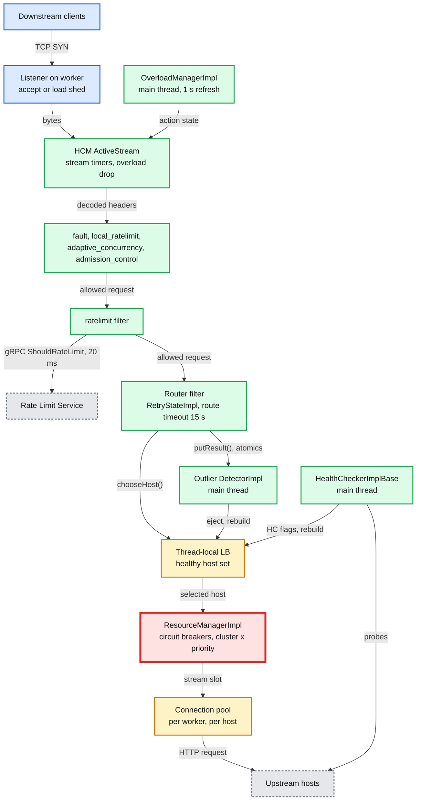

**What to notice**

- **Two thread classes.** Everything on the request path runs on the worker that owns the connection ([report 01](envoy-01-threading-and-process-model.md)). Health checking, outlier math, and overload polling run on the **main thread** (`context.mainThreadDispatcher()` in [http/health_checker_impl.cc:61](https://github.com/envoyproxy/envoy/blob/v1.39.1/source/extensions/health_checkers/http/health_checker_impl.cc#L61), [cluster_factory_impl.cc:146](https://github.com/envoyproxy/envoy/blob/v1.39.1/source/common/upstream/cluster_factory_impl.cc#L146)). **[documented]**
- **Health is a flag, not a list.** HC and outlier detection set bits such as `FAILED_ACTIVE_HC` and `FAILED_OUTLIER_CHECK` on the shared `Host` ([upstream.h:152](https://github.com/envoyproxy/envoy/blob/v1.39.1/envoy/upstream/upstream.h#L152)). A flip triggers `reloadHealthyHosts()` which rebuilds host sets and posts them to every worker.
- **The red node is the circuit breaker.** It is the first thing to trip when an upstream slows down (Little's law, see §8).
- **Rate limiting is two-tier.** Local token buckets absorb bursts in-process. The global Rate Limit Service (RLS) finishes the job across the fleet.

---

## 3. Data flow

### 3.1 The resilience decision flowchart (request path)

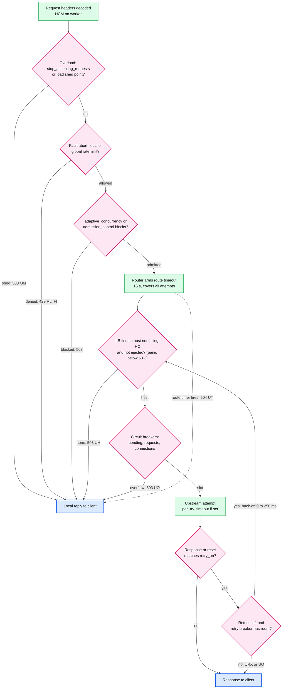

**What to notice**

- **Cheapest checks first.** The overload drop happens before the filter chain is even created (`skipFilterChainCreation()` in [conn_manager_impl.cc:1417](https://github.com/envoyproxy/envoy/blob/v1.39.1/source/common/http/conn_manager_impl.cc#L1417)) to avoid allocating under memory pressure. **[documented]**
- **Ejected and HC-failed hosts are not "rejected".** They are simply absent from the healthy host set, so the request goes elsewhere. Only an empty set yields `UH`.
- **A retry goes back through LB and circuit breakers.** It can be refused by `max_retries` (UO) even when `num_retries` allows it.

### 3.2 How health signals travel between threads

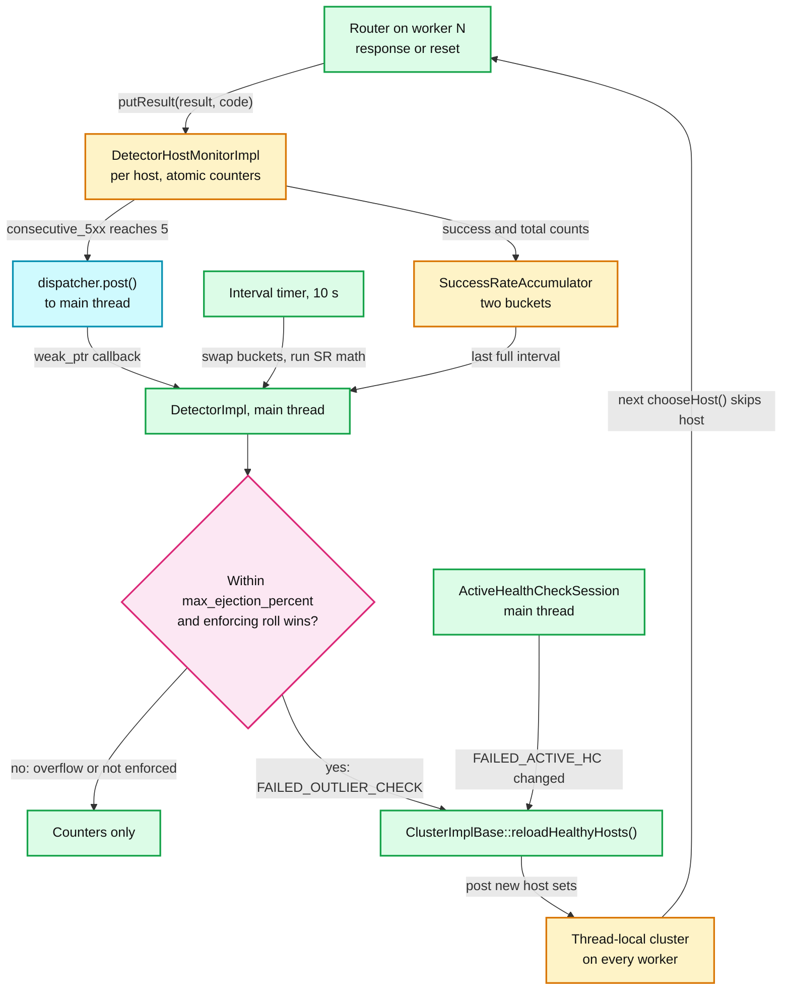

**What to notice**

- **Workers never lock.** Consecutive counters are `std::atomic<uint32_t>` and bucket counters are `std::atomic<uint64_t>` ([outlier_detection_impl.h:54](https://github.com/envoyproxy/envoy/blob/v1.39.1/source/common/upstream/outlier_detection_impl.h#L54), [:203](https://github.com/envoyproxy/envoy/blob/v1.39.1/source/common/upstream/outlier_detection_impl.h#L203)). "Consecutive" is per host across all workers.
- **The post carries a `weak_ptr`.** If the cluster was removed meanwhile, the callback is a no-op ([outlier_detection_impl.cc:606](https://github.com/envoyproxy/envoy/blob/v1.39.1/source/common/upstream/outlier_detection_impl.cc#L606)).
- **Every flip rebuilds all priorities.** `reloadHealthyHostsHelper` copies each host set and calls `updateHosts` ([upstream_impl.cc:1976](https://github.com/envoyproxy/envoy/blob/v1.39.1/source/common/upstream/upstream_impl.cc#L1976)). For ring hash or Maglev this means a table rebuild per flip (see §8).

### 3.3 From resource pressure to overload action

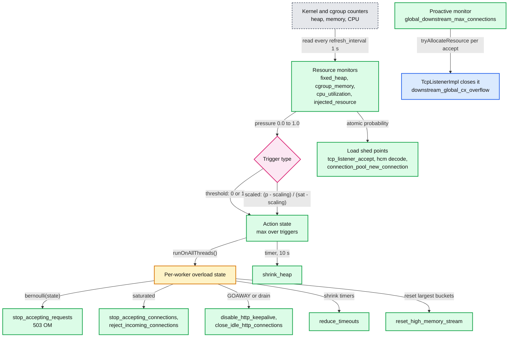

**What to notice**

- **Actions lag, load shed points do not.** Actions reach workers through a thread-local post (`flushResourceUpdates` then `runOnAllThreads`, [overload_manager_impl.cc:727](https://github.com/envoyproxy/envoy/blob/v1.39.1/source/server/overload_manager_impl.cc#L727)). Load shed points read one atomic probability directly ([:394](https://github.com/envoyproxy/envoy/blob/v1.39.1/source/server/overload_manager_impl.cc#L394)). **[documented]**
- **Scaled triggers shed a fraction.** `stop_accepting_requests` drops with probability equal to the action state ([conn_manager_impl.cc:1408](https://github.com/envoyproxy/envoy/blob/v1.39.1/source/common/http/conn_manager_impl.cc#L1408)), so load sheds smoothly between the two thresholds.

---

## 4. Sequences

### 4.1 A request hits a 503, backs off, retries on a different host, succeeds

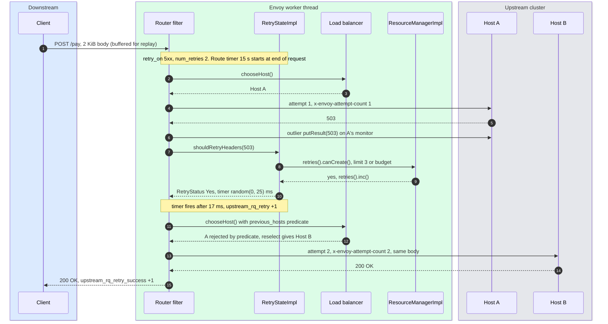

`x-envoy-attempt-count` is sent only with `include_request_attempt_count` ([route_components.proto:182](https://github.com/envoyproxy/envoy/blob/v1.39.1/api/envoy/config/route/v3/route_components.proto#L182)). The retry slot is released at the next retry decision or when `RetryStateImpl` dies ([retry_state_impl.cc:257](https://github.com/envoyproxy/envoy/blob/v1.39.1/source/common/router/retry_state_impl.cc#L257)).

### 4.2 A global rate limit call

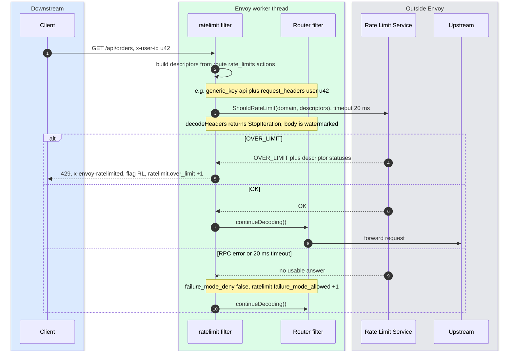

### 4.3 Consecutive 5xx ejection across threads

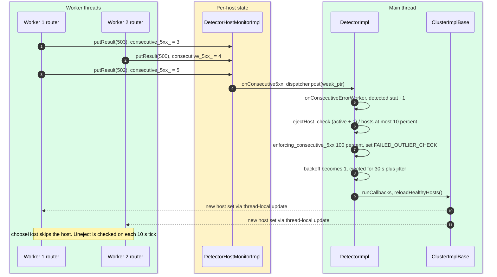

### 4.4 Timeline: where each timeout clock starts and stops

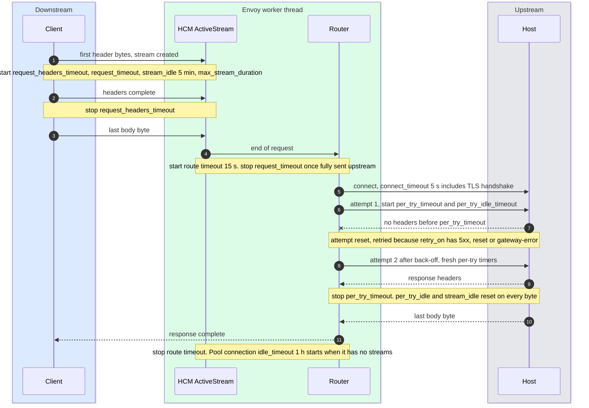

---

## 5. State machines

### 5.1 A host's active health check state

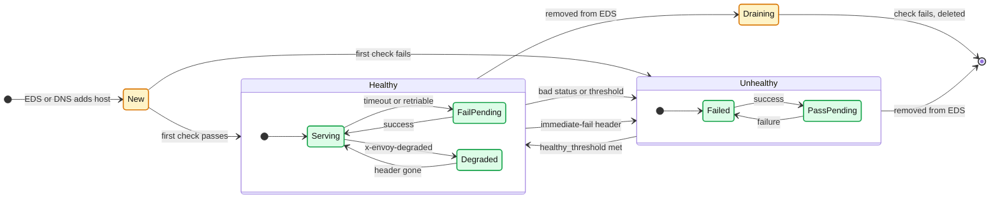

- **New** carries `FAILED_ACTIVE_HC`, plus `PENDING_ACTIVE_HC` (excluded from LB weights) if `ignore_new_hosts_until_first_hc` is set ([upstream_impl.cc:2519](https://github.com/envoyproxy/envoy/blob/v1.39.1/source/common/upstream/upstream_impl.cc#L2519)). A new host takes **no traffic** until its first check passes, unless the priority is in panic.
- **Draining** is `PENDING_DYNAMIC_REMOVAL`: a host absent from EDS but still passing checks keeps serving ([upstream_impl.cc:2600](https://github.com/envoyproxy/envoy/blob/v1.39.1/source/common/upstream/upstream_impl.cc#L2600)). `ignore_health_on_host_removal` skips this.

### 5.2 A host's outlier detection state

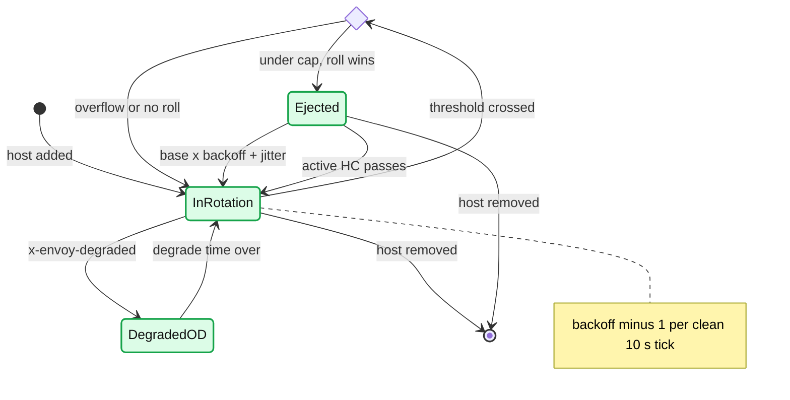

- **Uneject happens only on the interval tick** (`checkHostForUneject` inside `onIntervalTimer`, [outlier_detection_impl.cc:389](https://github.com/envoyproxy/envoy/blob/v1.39.1/source/common/upstream/outlier_detection_impl.cc#L389)). A 30 s ejection really lasts 30 to 40 s with the 10 s default interval. **[inferred]** from the code.
- **DegradedOD** needs `detect_degraded_hosts` (new in 1.38, default false). The host stays in rotation but is deprioritized like any degraded host.

---

## 6. Component deep dives

### 6.1 Active health checking

**Classes.** `HealthCheckerImplBase` owns one `ActiveHealthCheckSession` per host (`active_sessions_`), each with an `interval_timer_` and a `timeout_timer_` ([health_checker_base_impl.cc:252](https://github.com/envoyproxy/envoy/blob/v1.39.1/source/extensions/health_checkers/common/health_checker_base_impl.cc#L252)). `HealthCheckerFactory::create` in [source/common/upstream/health_checker_impl.cc:52](https://github.com/envoyproxy/envoy/blob/v1.39.1/source/common/upstream/health_checker_impl.cc#L52) picks the extension. **All sessions run on the main thread dispatcher.** **[documented]**

**Checkers** (`source/extensions/health_checkers/`):

| Checker | Success means | Notes |
|---|---|---|
| `envoy.health_checkers.http` | status in `expected_statuses` (default only 200), optional body match | `GET` default. `service_name_matcher` checks `x-envoy-upstream-healthchecked-cluster` |
| `envoy.health_checkers.grpc` | `grpc.health.v1.Health/Check` returns `SERVING` | cluster must support HTTP/2 or config is rejected |
| `envoy.health_checkers.tcp` | connect succeeds, and echoed `receive` bytes match if set | empty payload means connect-only |
| `envoy.health_checkers.redis` | `PONG`, or `EXISTS key` returns 0 | set the key to drain a Redis host |
| `envoy.health_checkers.thrift` (alpha) | Thrift success reply | exception fails the check |
| `envoy.health_checkers.dynamic_modules` (alpha) | module decides | new custom-checker path |

**Thresholds and intervals.** `timeout`, `interval`, `unhealthy_threshold` and `healthy_threshold` have **no defaults** (`PROTOBUF_GET_MS_REQUIRED`, [:23](https://github.com/envoyproxy/envoy/blob/v1.39.1/source/extensions/health_checkers/common/health_checker_base_impl.cc#L23)). `HealthCheckerImplBase::interval()` ([:101](https://github.com/envoyproxy/envoy/blob/v1.39.1/source/extensions/health_checkers/common/health_checker_base_impl.cc#L101)) picks the next wait:

- Cluster **never had a connection** (`upstream_cx_total` unused): `no_traffic_interval` 60 s, or `no_traffic_healthy_interval` for healthy hosts.
- Otherwise: healthy uses `interval`, unhealthy uses `unhealthy_interval` (default `interval`). While a transition is pending, `healthy_edge_interval` or `unhealthy_edge_interval` (defaults `interval` and `unhealthy_interval`).
- **Jitter**: `+ random % (interval_jitter_percent x base / 100)` and `+ random % interval_jitter`. `initial_jitter` delays only the first check. Runtime `health_check.min_interval` / `max_interval` clamp, and the result is never below 1 ms ([:140](https://github.com/envoyproxy/envoy/blob/v1.39.1/source/extensions/health_checkers/common/health_checker_base_impl.cc#L140)).

**Transitions** (`handleSuccess` [:295](https://github.com/envoyproxy/envoy/blob/v1.39.1/source/extensions/health_checkers/common/health_checker_base_impl.cc#L295), `setUnhealthy` [:369](https://github.com/envoyproxy/envoy/blob/v1.39.1/source/extensions/health_checkers/common/health_checker_base_impl.cc#L369)):

- Unhealthy host goes healthy on the **first check of its session**, or after `healthy_threshold` consecutive passes.
- Healthy host goes unhealthy **immediately** on a non-network, non-retriable failure (any unexpected HTTP status, gRPC not `SERVING`). Only `NETWORK`, `NETWORK_TIMEOUT` and `retriable_statuses` count toward `unhealthy_threshold`.
- A timeout while failed sets `ACTIVE_HC_TIMEOUT` too, so the admin page shows why.

**Fast failure.** An upstream that returns `x-envoy-immediate-health-check-fail` on **any data-plane response** is seen by the router ([router.cc:1902](https://github.com/envoyproxy/envoy/blob/v1.39.1/source/common/router/router.cc#L1902)). The worker sets `EXCLUDED_VIA_IMMEDIATE_HC_FAIL` directly and posts `setUnhealthy(PASSIVE)` to the main thread ([health_checker_base_impl.cc:216](https://github.com/envoyproxy/envoy/blob/v1.39.1/source/extensions/health_checkers/common/health_checker_base_impl.cc#L216)). The `health_check` HTTP filter adds that header when the local Envoy was failed via `/healthcheck/fail`, and answers 503 with flag `LH` ([health_check.cc:109](https://github.com/envoyproxy/envoy/blob/v1.39.1/source/extensions/filters/http/health_check/health_check.cc#L109)). This only works if the caller's cluster has active HC configured.

**Degraded.** An HTTP check response carrying `x-envoy-degraded` sets `DEGRADED_ACTIVE_HC`. Degraded hosts get traffic only when healthy capacity is short ([report 04](envoy-04-cluster-manager-and-load-balancing.md)).

**EDS and active HC combined** ([service_discovery.rst:161](https://github.com/envoyproxy/envoy/blob/v1.39.1/docs/root/intro/arch_overview/upstream/service_discovery.rst#L161)):

| EDS (Endpoint Discovery Service) says | HC OK | HC failed |
|---|---|---|
| Host present (EDS status HEALTHY or unset) | route | do not route |
| Host absent | route (kept as `PENDING_DYNAMIC_REMOVAL`) | do not route, delete |
| EDS status UNHEALTHY or TIMEOUT | not routed (`FAILED_EDS_HEALTH`) | not routed |
| EDS status DRAINING | excluded (`EDS_STATUS_DRAINING`) | excluded |

The flags are independent bits. A host is healthy only if **no** failure bit is set, so EDS and HC can each veto ([upstream_impl.cc:594](https://github.com/envoyproxy/envoy/blob/v1.39.1/source/common/upstream/upstream_impl.cc#L594)).

**Cluster warming waits for one HC round.** `onInitDone` counts hosts and calls `finishInitialization()` only after each has one result ([upstream_impl.cc:1825](https://github.com/envoyproxy/envoy/blob/v1.39.1/source/common/upstream/upstream_impl.cc#L1825)). Since 1.38 checks also wait for cluster warming (SDS secrets) behind `health_check_after_cluster_warming`.

**HDS (Health Discovery Service)** flips the model: a management server assigns this Envoy a subset of hosts to probe via `StreamHealthCheck`. Envoy builds `HdsCluster`s, reports `EndpointHealthResponse` every `interval` (default 1 s, [hds.proto:207](https://github.com/envoyproxy/envoy/blob/v1.39.1/api/envoy/service/health/v3/hds.proto#L207)), and the server feeds results back through EDS. It cuts probe fan-out from N proxies x M hosts to roughly M. **[inferred]**

### 6.2 Outlier detection

**Classes.** `DetectorImpl` (one per cluster, main thread) and `DetectorHostMonitorImpl` (one per host, written by workers). `putResult()` dispatches to `putResultNoLocalExternalSplit` or `putResultWithLocalExternalSplit` depending on `split_external_local_origin_errors` ([outlier_detection_impl.cc:208](https://github.com/envoyproxy/envoy/blob/v1.39.1/source/common/upstream/outlier_detection_impl.cc#L208)).

| Work | Thread | Mechanism |
|---|---|---|
| Record result, bump consecutive counters, bucket counters | worker | atomics in `DetectorHostMonitorImpl` |
| Consecutive threshold reached | worker, then post | `notifyMainThreadConsecutiveError` |
| Interval timer, bucket swap, success-rate and failure-percentage math | main | `onIntervalTimer` [:877](https://github.com/envoyproxy/envoy/blob/v1.39.1/source/common/upstream/outlier_detection_impl.cc#L877) |
| Eject, uneject, backoff decay, host-set rebuild | main | `ejectHost` [:542](https://github.com/envoyproxy/envoy/blob/v1.39.1/source/common/upstream/outlier_detection_impl.cc#L542) |

**Error mapping (default, no split).** Every result becomes an HTTP code. Local timeout maps to 504, connect failure to 503, so both count as 5xx **and** gateway errors ([:108](https://github.com/envoyproxy/envoy/blob/v1.39.1/source/common/upstream/outlier_detection_impl.cc#L108)). gRPC uses the HTTP code mapped from `grpc-status`. A non-5xx resets both consecutive counters.

**The algorithms, with the real formulas.**

| Algorithm | Fires when | Enforcing default | Run |
|---|---|---|---|
| Consecutive 5xx | `++consecutive_5xx == 5` | 100% | inline on worker, eject on main |
| Consecutive gateway failure | `++consecutive_gateway_failure == 5` (502, 503, 504) | **0%**: detected and counted, never ejects | inline |
| Consecutive local origin failure | 5 local failures, **only** if `split_external_local_origin_errors` | 100% | inline |
| Success rate | host SR `< mean - (stdev_factor / 1000) x stdev`, factor 1900 | 100% | each interval |
| Failure percentage | `100 - SR >= 85` | **0%** | each interval |

- **Success rate gates** ([:776](https://github.com/envoyproxy/envoy/blob/v1.39.1/source/common/upstream/outlier_detection_impl.cc#L776)): a host counts only with at least 100 requests in the last interval, and the cluster needs at least 5 such hosts. Already-ejected hosts are left out. `stdev` is the population standard deviation (divide by n).
- **Failure percentage gates**: at least 50 requests per host, at least 5 hosts.

**Ejection duration.** On eject, `ejectTimeBackoff` increments while `backoff x base < max + base` ([:583](https://github.com/envoyproxy/envoy/blob/v1.39.1/source/common/upstream/outlier_detection_impl.cc#L583)). Uneject when `min(base x backoff, max) + jitter <= now - last_ejection`. With defaults (base 30 s, max 300 s, jitter 0): 30, 60, 90 ... 300 s. Each clean interval after unejection decrements backoff by 1. `max_ejection_time_jitter` adds `random % (jitter + 1)` ms per ejection to spread reconnect storms.

**The cap.** `ejected_percent = 100 x (active + 1) / hosts` must be `<= max_ejection_percent` (10%), counted across **all priorities** ([:546](https://github.com/envoyproxy/envoy/blob/v1.39.1/source/common/upstream/outlier_detection_impl.cc#L546)). 10 hosts allow 1 ejection, 20 allow 2, 9 allow **none**. `always_eject_one_host: true` permits the first ejection regardless.

**Interplay.**

- **Panic threshold (50%).** Ejected hosts count as unhealthy. If healthy drops below 50% the LB routes to all hosts, ejected ones included ([report 04](envoy-04-cluster-manager-and-load-balancing.md)). With a 10% cap, outlier detection alone cannot cause panic. **[inferred]**
- **Active HC.** With `successful_active_health_check_uneject_host` true (default), a passing check on a host without `FAILED_ACTIVE_HC` clears `FAILED_OUTLIER_CHECK` at once ([:346](https://github.com/envoyproxy/envoy/blob/v1.39.1/source/common/upstream/outlier_detection_impl.cc#L346)). If your HC endpoint does not exercise the failing path, hosts are unejected within one HC interval. Set it false in that case.
- **Shared clusters.** An ejection caused by one filter chain applies to every route using that cluster.

**Worked example.** 20 hosts, 150 requests each per 10 s interval. Success rates: 17 hosts at 99.5%, one each at 99.0%, 97.0% and 80.0%.

1. Tick 1: mean 98.375, stdev 4.251, threshold `98.375 - 1.9 x 4.251 = 90.30`. Only the 80% host is below. Cap check: `100 x 1 / 20 = 5% <= 10%`. Ejected for 30 s.
2. Tick 2: the ejected host is excluded. Mean 99.342, stdev 0.563, threshold 98.27. The 97% host is now below. Cap: `100 x 2 / 20 = 10%`. Ejected.
3. A third outlier would need 15%. It is detected, `ejections_overflow` +1, not ejected.
4. Lesson: one extreme outlier **masks** milder ones for an interval, and the cap bounds blast radius to 2 of 20 hosts.

### 6.3 Circuit breakers

**Class.** `ResourceManagerImpl` ([resource_manager_impl.h:85](https://github.com/envoyproxy/envoy/blob/v1.39.1/source/common/upstream/resource_manager_impl.h#L85)), two per cluster (`DEFAULT` and `HIGH` routing priority), built in `ClusterInfoImpl::ResourceManagers::load` with defaults 1024 / 1024 / 1024 / 3 / unlimited ([upstream_impl.cc:2166](https://github.com/envoyproxy/envoy/blob/v1.39.1/source/common/upstream/upstream_impl.cc#L2166)). `ClusterInfo` is shared by all workers, and each limit is a `BasicResourceLimitImpl` holding `std::atomic<uint64_t> current_` ([basic_resource_impl.h:51](https://github.com/envoyproxy/envoy/blob/v1.39.1/source/common/common/basic_resource_impl.h#L51)). Check-then-increment is not one atomic step, so limits can briefly overshoot, roughly one request per racing worker. The overshoot is **[documented]** in the class comment. The size is **[inferred]**.

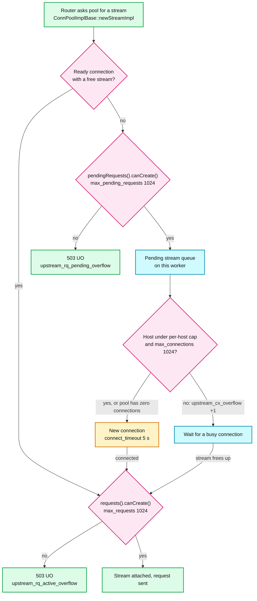

| Limit | Checked in | Overflow stat | Client sees |
|---|---|---|---|
| `max_connections` (+ per-host `per_host_thresholds.max_connections`) | `ConnPoolImplBase::tryCreateNewConnection` via `Host::canCreateConnection` ([upstream_impl.h:208](https://github.com/envoyproxy/envoy/blob/v1.39.1/source/common/upstream/upstream_impl.h#L208)) | `upstream_cx_overflow` | queueing, not an error |
| `max_pending_requests` | `newStreamImpl` [conn_pool_base.cc:352](https://github.com/envoyproxy/envoy/blob/v1.39.1/source/common/conn_pool/conn_pool_base.cc#L352) | `upstream_rq_pending_overflow` | 503 UO |
| `max_requests` | `attachStreamToClient` [:242](https://github.com/envoyproxy/envoy/blob/v1.39.1/source/common/conn_pool/conn_pool_base.cc#L242) | `upstream_rq_active_overflow` | 503 UO |
| `max_retries` or retry budget | `RetryStateImpl::shouldRetry` [retry_state_impl.cc:284](https://github.com/envoyproxy/envoy/blob/v1.39.1/source/common/router/retry_state_impl.cc#L284) | `upstream_rq_retry_overflow` | original error, flag UO |
| `max_connection_pools` | `ConnPoolMap::getPool` [conn_pool_map_impl.h:35](https://github.com/envoyproxy/envoy/blob/v1.39.1/source/common/upstream/conn_pool_map_impl.h#L35) | `upstream_cx_pool_overflow` | 503 UO |
| TCP (tcp_proxy) | `connections().canCreate()` [tcp_proxy.cc:696](https://github.com/envoyproxy/envoy/blob/v1.39.1/source/common/tcp_proxy/tcp_proxy.cc#L696) | `upstream_cx_overflow` | connection closed, UO |

- The router adds `x-envoy-overloaded: true` to circuit-breaker 503s. `upstream.maintenance_mode.<cluster>` runtime produces the same UO 503 ([router.cc:601](https://github.com/envoyproxy/envoy/blob/v1.39.1/source/common/router/router.cc#L601)).
- **Gauges.** `circuit_breakers.<priority>.{cx,rq,rq_pending,rq_retry,cx_pool}_open` are 0 or 1. `remaining_*` gauges exist only with `track_remaining: true`, and `remaining_retries` reads 0 when a budget is used.
- **Retry budget** (overrides `max_retries` when set): `max = max(budget_percent/100 x (active + pending), min_retry_concurrency)`, defaults 20% and 3 ([resource_manager_impl.h:183](https://github.com/envoyproxy/envoy/blob/v1.39.1/source/common/upstream/resource_manager_impl.h#L183)). 1000 active requests allow 200 concurrent retries. 5 active allow 3. New in 1.39: `budget_interval` counts requests started in a sliding window (10 slots) instead of only in-flight ones, inspired by tower's TPS budget.

**Why one cluster-wide 1024 is wrong at both ends.** Limits are **per Envoy**, not global. **[inferred]**

- *Tiny cluster*: 2 hosts that can each serve 50 concurrent requests. 100 sidecars x 1024 allowed = 102,400 concurrent requests aimed at 100 slots. The breaker never trips before the service melts. Set `max_requests` near `host_capacity x hosts / callers`, or use outlier detection plus a retry budget.
- *Huge cluster*: 500 hosts x 20 concurrent = 10,000 slots. One edge Envoy at 20,000 RPS and 100 ms latency holds 2,000 in flight, above 1024. It sheds 50% of traffic with 503 UO while every backend is healthy.

### 6.4 The timeout matrix

| Timeout | Default | Clock starts | Clock stops | Client sees | Stat |
|---|---|---|---|---|---|
| Cluster `connect_timeout` | 5 s | connect begins | connected, TLS done | 503 UF (retriable by `connect-failure`) | `upstream_cx_connect_timeout` |
| Route `timeout` | 15 s | downstream request complete | upstream response complete | 504 UT (204 with `x-envoy-upstream-rq-timeout-alt-response`) | `upstream_rq_timeout` |
| `per_try_timeout` | unset (route timeout) | request complete and stream attached | response headers | retry, else 504 UT | `upstream_rq_per_try_timeout` |
| `per_try_idle_timeout` | unset | same as per-try | reset on every byte, runs during body | retry, else 504 UT (attempt flag SI) | `upstream_rq_per_try_idle_timeout` |
| Route `idle_timeout` | unset, HCM value applies | stream created | reset on every event | 408 before request done, 504 after, reset if response started. SI | `downstream_rq_idle_timeout` |
| HCM `stream_idle_timeout` | 5 min | stream created | reset on every event | same as above. SI | `downstream_rq_idle_timeout` |
| HCM `request_timeout` | off | stream created | request fully sent upstream or response starts | 408 or 504, no flag | `downstream_rq_timeout` |
| HCM `request_headers_timeout` | off | stream created | headers complete | 408, no flag | `downstream_rq_header_timeout` |
| `max_stream_duration` (HCM or route) | not set | stream created | stream ends | 408 or 504, gRPC `DEADLINE_EXCEEDED` | `downstream_rq_max_duration_reached` |
| `grpc_timeout_header_max` | unset | uses `grpc-timeout` as max stream duration, capped | stream ends | as above | same |
| Cluster `max_stream_duration` | not set | upstream stream starts | stream ends | 408 or 504, UMSDR | `upstream_rq_max_duration_reached` |
| Upstream `idle_timeout` | 1 h | pool connection has zero streams | new stream | nothing, connection closed | `upstream_cx_idle_timeout` |
| Downstream `idle_timeout` | 1 h | connection has zero streams | new stream | GOAWAY or close | `downstream_cx_idle_timeout` |
| `max_connection_duration` | none | connection opens | drain complete | drain, DT if no codec yet | `downstream_cx_max_duration_reached` |
| tcp_proxy `idle_timeout` | 1 h | last byte either way | any byte | connection closed, no flag | `tcp.<prefix>.idle_timeout` |

- 408 versus 504 comes from `maybeRequestTimeoutCode`: 504 if the full request was received, else 408 ([utility.cc:1535](https://github.com/envoyproxy/envoy/blob/v1.39.1/source/common/http/utility.cc#L1535)).
- A per-try timeout `>=` the route timeout is ignored ([router.cc:258](https://github.com/envoyproxy/envoy/blob/v1.39.1/source/common/router/router.cc#L258)).
- The route timeout does not fire for streaming **requests** (it starts at request end). Use `max_stream_duration` or `idle_timeout` for those.
- `reduce_timeouts` can scale `HTTP_DOWNSTREAM_CONNECTION_IDLE`, `HTTP_DOWNSTREAM_STREAM_IDLE`, `TRANSPORT_SOCKET_CONNECT`, `HTTP_DOWNSTREAM_CONNECTION_MAX` and `HTTP_DOWNSTREAM_STREAM_FLUSH` ([overload.proto:94](https://github.com/envoyproxy/envoy/blob/v1.39.1/api/envoy/config/overload/v3/overload.proto#L94)).

### 6.5 Retries

**Class.** `RetryStateImpl` is created per request only if a policy or header asks for retries (or for HTTP/3 0-RTT safe requests, which auto-retry 425) ([retry_state_impl.cc:28](https://github.com/envoyproxy/envoy/blob/v1.39.1/source/common/router/retry_state_impl.cc#L28)). `num_retries` defaults to 1. Since 1.37 a cluster-level `retry_policy` in `HttpProtocolOptions` replaces the route policy entirely ([http_protocol_options.proto:222](https://github.com/envoyproxy/envoy/blob/v1.39.1/api/envoy/extensions/upstreams/http/v3/http_protocol_options.proto#L222)).

**Every `retry_on` value in v1.39.1** (`parseRetryOn` [:179](https://github.com/envoyproxy/envoy/blob/v1.39.1/source/common/router/retry_state_impl.cc#L179), `parseRetryGrpcOn` [:213](https://github.com/envoyproxy/envoy/blob/v1.39.1/source/common/router/retry_state_impl.cc#L213)):

| Value | Retries when |
|---|---|
| `5xx` | any 5xx, or any reset or connect failure |
| `gateway-error` | 502, 503, 504, or any reset or connect failure |
| `reset` | upstream reset, disconnect, read timeout |
| `reset-before-request` | reset before any request bytes went upstream |
| `connect-failure` | pool connect failure or `connect_timeout` |
| `envoy-ratelimited` | response has `x-envoy-ratelimited` (otherwise such responses are never retried) |
| `retriable-4xx` | 409 only |
| `refused-stream` | HTTP/2 `REFUSED_STREAM` reset |
| `retriable-status-codes` | status in `retriable_status_codes` or `x-envoy-retriable-status-codes` |
| `retriable-headers` | response matches `retriable_headers` or `x-envoy-retriable-header-names` |
| `http3-post-connect-failure` | HTTP/3 attempt failed after connect, retried at once over TCP |
| gRPC `cancelled`, `deadline-exceeded`, `internal`, `resource-exhausted`, `unavailable` | grpc-status 1, 4, 13, 8, 14 in response headers |

- **Never retried**: `Overflow` and `RemoteResetNoError` resets ([:437](https://github.com/envoyproxy/envoy/blob/v1.39.1/source/common/router/retry_state_impl.cc#L437)). A per-try timeout is treated as a local reset, so it retries only under `5xx`, `gateway-error` or `reset`.
- **Order of refusals** in `shouldRetry` ([:269](https://github.com/envoyproxy/envoy/blob/v1.39.1/source/common/router/retry_state_impl.cc#L269)): retries remaining (else URX, `upstream_rq_retry_limit_exceeded`), then the retry breaker (else UO, `upstream_rq_retry_overflow`), then runtime `upstream.use_retry` (100%).

**Back-off.** `JitteredExponentialBackOffStrategy(base 25 ms, max 10 x base)`, overridable by `retry_back_off` or runtime `upstream.base_retry_backoff_ms` ([:87](https://github.com/envoyproxy/envoy/blob/v1.39.1/source/common/router/retry_state_impl.cc#L87)). Retry N waits uniform `[0, min(25 x 2^(N-1), 250))` ms.

**Rate-limited back-off.** With `rate_limited_retry_back_off.reset_headers` (for example `Retry-After` as SECONDS, `X-RateLimit-Reset` as UNIX_TIMESTAMP), the first parseable header under `max_interval` (default 300 s) sets the wait to `random(interval, 1.5 x interval)` via `JitteredLowerBoundBackOffStrategy` ([backoff_strategy.cc:29](https://github.com/envoyproxy/envoy/blob/v1.39.1/source/common/common/backoff_strategy.cc#L29)). It does not itself enable retries.

**Host and priority selection on retry.** Host predicates `envoy.retry_host_predicates.previous_hosts` (skip hosts already tried), `omit_canary_hosts` and `omit_host_metadata` reject a pick. The priority plugin `envoy.retry_priorities.previous_priorities` shifts load away from priorities already tried, every `update_frequency` attempts. After `host_selection_retry_max_attempts` (1 reselect) the last pick is used anyway.

**Request headers** (stripped by `cleanInternalHeaders` unless the request is internal): `x-envoy-max-retries` replaces `num_retries` ([:122](https://github.com/envoyproxy/envoy/blob/v1.39.1/source/common/router/retry_state_impl.cc#L122)). `x-envoy-retry-on` and `x-envoy-retry-grpc-on` are OR-ed into the policy. `x-envoy-upstream-rq-timeout-ms` and `x-envoy-upstream-rq-per-try-timeout-ms` override the route and per-try timeouts. Envoy itself sets `x-envoy-attempt-count` when enabled.

**Body buffering.** To replay, the router buffers the request body up to `request_body_buffer_limit`, else the connection's `per_connection_buffer_limit_bytes` (1 MiB). Past that, `retry_or_shadow_abandoned` +1 and retries are disabled for the request. If a retry was waiting in back-off, the client gets **507** "exceeded request buffer limit while retrying upstream" ([router.cc:1111](https://github.com/envoyproxy/envoy/blob/v1.39.1/source/common/router/router.cc#L1111)).

**Budget versus `max_retries`.** `max_retries: 3` is a fixed ceiling: fine at 50 RPS, useless at 50,000 RPS (3 retries in flight across the cluster), and too loose for a 1-RPS cluster. The budget scales with load and keeps the floor at 3. Envoy's docs recommend the budget. **[documented]**

**Retries count against the route timeout.** Timer `response_timeout_` starts in `onRequestComplete` ([router.cc:1309](https://github.com/envoyproxy/envoy/blob/v1.39.1/source/common/router/router.cc#L1309)) and is never re-armed per attempt. If it fires during back-off the client gets 504 UT.

### 6.6 Hedging

- Only `hedge_on_per_try_timeout` (or header `x-envoy-hedge-on-per-try-timeout`) is implemented. When a per-try timeout fires, `onSoftPerTryTimeout` records a timeout for outlier detection and starts a retry **without** resetting the first attempt ([router.cc:1400](https://github.com/envoyproxy/envoy/blob/v1.39.1/source/common/router/router.cc#L1400)).
- **First good response wins.** On headers from any attempt, `resetOtherUpstreams` resets every other in-flight attempt ([router.cc:1822](https://github.com/envoyproxy/envoy/blob/v1.39.1/source/common/router/router.cc#L1822)). A bad response from one attempt is discarded while others are still pending.
- Hedged retries still consume `num_retries` and the retry breaker, and always use back-off. Hedging at p95 adds roughly 5% load, more when the upstream is slow for everyone. **[inferred]**

### 6.7 Rate limiting

**Global (`envoy.filters.http.ratelimit`, `envoy.filters.network.ratelimit`).**

- Descriptors come from route or virtual host `rate_limits` actions: `source_cluster`, `destination_cluster`, `request_headers`, `query_parameters`, `remote_address`, `masked_remote_address`, `generic_key`, `header_value_match`, `query_parameter_value_match`, `remote_address_match`, `dynamic_metadata`, `metadata`, and extensions.
- RLS call `timeout` 20 ms, `failure_mode_deny` false, so errors fail **open** ([rate_limit.proto:64](https://github.com/envoyproxy/envoy/blob/v1.39.1/api/envoy/extensions/filters/http/ratelimit/v3/rate_limit.proto#L64)). With deny, clients get `status_on_error` (default 500) and flag RLSE. `failure_mode_deny_percent` can split the two.
- Over limit returns `rate_limited_status` 429 plus `x-envoy-ratelimited`, flag RL. `enable_x_ratelimit_headers: DRAFT_VERSION_03` adds `X-RateLimit-Limit`, `-Remaining`, `-Reset` from the RLS descriptor statuses.
- The network filter calls RLS once per **new connection** and closes it if over limit.
- Stats land in the **target cluster's** scope: `cluster.<name>.ratelimit.{ok,over_limit,error,failure_mode_allowed}`.

**Local (`envoy.filters.http.local_ratelimit`).**

- `LocalRateLimiterImpl` is built once in `FilterConfig` and shared by **all workers** of this Envoy ([local_ratelimit.cc:129](https://github.com/envoyproxy/envoy/blob/v1.39.1/source/extensions/filters/http/local_ratelimit/local_ratelimit.cc#L129)). Precisely: one bucket per filter config (per route config if configured per route), per Envoy process.
- Each `RateLimitTokenBucket` wraps `AtomicTokenBucketImpl`: tokens are `min(max_tokens, (now - t) x fill_rate)` where `fill_rate = tokens_per_fill / fill_interval`, consumed by a CAS loop on one atomic timestamp (folly-style, [token_bucket_impl.h:56](https://github.com/envoyproxy/envoy/blob/v1.39.1/source/common/common/token_bucket_impl.h#L56)). `fill_interval` must be at least 50 ms.
- `local_rate_limit_per_downstream_connection: true` allocates a bucket per connection in filter state.
- `local_cluster_rate_limit` divides the budget across the Envoys in the local cluster: each request costs `1 / share` tokens ([local_ratelimit_impl.cc:84](https://github.com/envoyproxy/envoy/blob/v1.39.1/source/extensions/filters/common/local_ratelimit/local_ratelimit_impl.cc#L84)).
- Stats: `<prefix>.http_local_rate_limit.{enabled,enforced,rate_limited,ok,shadow_mode}`.

**Quota (`envoy.filters.http.rate_limit_quota`, status wip).** Requests are sorted into buckets by `bucket_matchers`. Envoy reports usage per bucket to an RLQS (Rate Limit Quota Service) server every `reporting_interval` (required, above 100 ms) over one main-thread gRPC stream, and the server returns per-bucket assignments (allow, deny, token bucket). Until the first assignment `no_assignment_behavior` applies (default allow all). No open-source server exists yet; the docs point to Google Cloud. **[documented]** It trades a per-request RPC for eventual accuracy.

### 6.8 Adaptive concurrency and admission control

**Adaptive concurrency** (`GradientController`, one per filter config, shared across workers):

- **minRTT window.** Every `min_rtt_calc_params.interval` (plus up to 15% jitter), the limit drops to `min_concurrency` (3) until 50 samples arrive. Their p50 (`sample_aggregate_percentile`) becomes minRTT ([gradient_controller.cc:101](https://github.com/envoyproxy/envoy/blob/v1.39.1/source/extensions/filters/http/adaptive_concurrency/controller/gradient_controller.cc#L101)). Five straight windows stuck at the minimum force a fresh measurement.
- **Each `concurrency_update_interval`:** `gradient = clamp(minRTT x (1 + 0.25) / sampleRTT, 0.5, 2.0)`, then `limit = limit x gradient`, then `new = clamp(limit + sqrt(limit), 3, 1000)` ([:185](https://github.com/envoyproxy/envoy/blob/v1.39.1/source/extensions/filters/http/adaptive_concurrency/controller/gradient_controller.cc#L185)).
- Example: minRTT 10 ms, sampleRTT 25 ms, limit 100. Gradient 0.5, limit 50, plus 7 headroom, gives 57. When latency returns to 10 ms: gradient 1.25, next limit `71 + 8 = 79`.
- `forwardingDecision()` is a CAS on `num_rq_outstanding_`. Blocked requests get 503 "reached concurrency limit", `rq_blocked` +1. Samples go into a histogram under a mutex.

**Admission control** (client-side throttling in the style of the Google SRE book, **[inferred]** lineage):

- Per-worker `ThreadLocalControllerImpl` keeps request and success counts over `sampling_window` 30 s, at 1 s granularity.
- `P = max(0, (requests - successes / sr_threshold) / (requests + 1)) ^ (1 / aggression)`, capped at `max_rejection_probability` 80% ([admission_control.cc:161](https://github.com/envoyproxy/envoy/blob/v1.39.1/source/extensions/filters/http/admission_control/admission_control.cc#L161)). Defaults: `sr_threshold` 95%, `aggression` 1.0, `rps_threshold` 0.
- Example: 1,000 requests, 800 successes in the window gives `(1000 - 842.1) / 1001 = 15.8%` rejection. With aggression 2 it is 39.7%.
- Rejected requests get 503 and are **not** recorded, so P decays back to 0 when the upstream recovers.

### 6.9 Overload manager

**Monitors**: `envoy.resource_monitors.fixed_heap`, `cgroup_memory` (alpha), `cpu_utilization` (alpha, HOST or CONTAINER mode), `injected_resource` (tests), and the proactive `envoy.resource_monitors.global_downstream_max_connections`. **Triggers**: `threshold` (0 or 1) or `scaled` (`(p - scaling) / (saturation - scaling)`). An action's state is the max over its triggers.

**The 8 actions in v1.39.1** ([overload_manager.h:23](https://github.com/envoyproxy/envoy/blob/v1.39.1/envoy/server/overload/overload_manager.h#L23)):

| Action | Effect |
|---|---|
| `stop_accepting_requests` | 503 "envoy overloaded", flag OM, probability = state |
| `disable_http_keepalive` | GOAWAY on HTTP/2 and HTTP/3, drain HTTP/1 connections |
| `stop_accepting_connections` | listeners stop calling accept |
| `reject_incoming_connections` | accept then close immediately |
| `shrink_heap` | release free heap every `timer_interval` 10 s, keep 100 MB unfreed |
| `reduce_timeouts` | scale the 5 timer types toward `min_timeout` or `min_scale` |
| `reset_high_memory_stream` | reset HTTP/2 streams in the largest of 8 power-of-two memory buckets, up to 50 per worker per invocation |
| `close_idle_http_connections` | close idle HTTP/3 QUIC connections |

**Load shed points (10)** ([load_shed_point.h:16](https://github.com/envoyproxy/envoy/blob/v1.39.1/envoy/server/overload/load_shed_point.h#L16)): `tcp_listener_accept`, `http_connection_manager_decode_headers`, `http1_server_abort_dispatch`, `http2_server_go_away_on_dispatch`, `http2_server_go_away_and_close_on_dispatch`, `http3_server_go_away_on_dispatch`, `http3_server_go_away_and_close_on_dispatch`, `hcm_ondata_creating_codec`, `http_downstream_filter_check`, `connection_pool_new_connection`. The two HTTP/3 points are missing from the docs table.

**Global downstream max connections.** An atomic counter checked per accept in `TcpListenerImpl` ([tcp_listener_impl.cc:42](https://github.com/envoyproxy/envoy/blob/v1.39.1/source/common/network/tcp_listener_impl.cc#L42)). No limit by default (Envoy warns at startup). The docs advise less than half the file descriptor limit. `ignore_global_conn_limit` exempts a listener (for example admin), but its connections still count.

### 6.10 Fault injection

- `envoy.filters.http.fault`: `delay` (fixed or header) and `abort` (HTTP status 200 to 599, or gRPC status), each with a percentage, plus `response_rate_limit` in KiB/s. Flags DI and FI.
- Header control (only if `header_abort`, `header_delay` or `header_limit` is set): `x-envoy-fault-abort-request`, `x-envoy-fault-abort-grpc-request`, `x-envoy-fault-abort-request-percentage`, `x-envoy-fault-delay-request`, `x-envoy-fault-delay-request-percentage`, `x-envoy-fault-throughput-response`, `x-envoy-fault-throughput-response-percentage`.
- `max_active_faults` defaults to **unlimited** ([fault.proto:108](https://github.com/envoyproxy/envoy/blob/v1.39.1/api/envoy/extensions/filters/http/fault/v3/fault.proto#L108)). With header control exposed, each delayed request holds a stream and buffers. Set it. Overflow shows as `faults_overflow`.

### 6.11 Response flags cheat-sheet (complete, 30 core flags)

From `CoreResponseFlag` ([stream_info.h:40](https://github.com/envoyproxy/envoy/blob/v1.39.1/envoy/stream_info/stream_info.h#L40)) and the strings in [stream_info/utility.h:77](https://github.com/envoyproxy/envoy/blob/v1.39.1/source/common/stream_info/utility.h#L77).

| Flag | Long name | Meaning | Typical cause | First check |
|---|---|---|---|---|
| LH | FailedLocalHealthCheck | health_check filter answered 503 | `/healthcheck/fail`, draining | server state, drain |
| UH | NoHealthyUpstream | no host to pick | all hosts HC-failed or ejected, empty EDS | `membership_healthy`, `ejections_active` |
| UT | UpstreamRequestTimeout | route or per-try timeout | slow upstream, 15 s default | `upstream_rq_timeout`, p99 vs timeout |
| LR | LocalReset | Envoy reset the stream | per-try timeout, codec reset | router debug log |
| UR | UpstreamRemoteReset | upstream reset the stream | app crash, stream limit | upstream logs, `upstream_rq_rx_reset` |
| UF | UpstreamConnectionFailure | connect failed or timed out | wrong port, TLS, 5 s connect | `upstream_cx_connect_fail`, `_timeout` |
| UC | UpstreamConnectionTermination | upstream closed mid-request | upstream keep-alive shorter than Envoy's | upstream idle timeout |
| UO | UpstreamOverflow | circuit breaker or maintenance | Little's law past 1024 | `upstream_rq_pending_overflow`, `rq_open` |
| NR | NoRouteFound | no route matched | host or path mismatch | route table, `no_route` |
| DI | DelayInjected | fault delay applied | fault filter | `delays_injected` |
| FI | FaultInjected | fault abort applied | fault filter | `aborts_injected` |
| RL | RateLimited | local or global limit denied | bucket empty, RLS OVER_LIMIT | `ratelimit.over_limit` |
| UAEX | UnauthorizedExternalService | ext_authz denied | policy | ext_authz stats |
| RLSE | RateLimitServiceError | RLS failed and deny mode | RLS slow past 20 ms | `ratelimit.error` |
| DC | DownstreamConnectionTermination | client went away | client timeout shorter than Envoy's | client timeouts |
| URX | UpstreamRetryLimitExceeded | retries exhausted | persistent upstream errors | `upstream_rq_retry_limit_exceeded` |
| SI | StreamIdleTimeout | idle timer fired | streaming with no bytes for 5 min | `downstream_rq_idle_timeout` |
| IH | InvalidEnvoyRequestHeaders | `strict_check_headers` failed | bad `x-envoy-*` value | client headers |
| DPE | DownstreamProtocolError | bad downstream HTTP | client bug or attack | codec stats |
| UMSDR | UpstreamMaxStreamDurationReached | cluster max stream duration | long stream | `upstream_rq_max_duration_reached` |
| RFCF | ResponseFromCacheFilter | served from cache | not an error | cache stats |
| NFCF | NoFilterConfigFound | ECDS config missing at deadline | control plane lag | ECDS stats |
| DT | DurationTimeout | connection duration cap | `max_connection_duration`, tcp_proxy cap | config |
| UPE | UpstreamProtocolError | bad upstream HTTP | protocol mismatch | codec stats |
| NC | NoClusterFound | route names a missing cluster | CDS ordering, warming | CDS stats |
| OM | OverloadManagerTerminated | overload action or shed point | memory or CPU pressure | `overload.*.pressure` |
| DF | DnsResolutionFailed | dynamic forward proxy DNS failed | DNS outage | DNS cache stats |
| DO | DropOverload | EDS `drop_overloads` dropped it | control plane shedding | drop config |
| DR | DownstreamRemoteReset | client sent a reset | client cancel | client side |
| UDO | UnconditionalDropOverload | drop_overload at 100% | full shed | drop config |

Note: HCM `request_timeout`, `request_headers_timeout` and `max_stream_duration` set **no** flag. Look at `%RESPONSE_CODE_DETAILS%` (`request_overall_timeout`, `request_header_timeout`, `max_duration_timeout`) instead.

---

## 7. Failure modes

| Failure | What the user sees | Blast radius | Mitigation |
|---|---|---|---|
| Upstream latency doubles | 503 UO, `upstream_rq_pending_overflow` and `active_overflow` climb | every route to that cluster from this Envoy | size `max_requests` by Little's law, adaptive concurrency |
| One host returns 5xx | brief 5xx, then `ejections_enforced_consecutive_5xx` +1 | about 5 requests per worker race | outlier detection, `5xx` retry with `previous_hosts` |
| Small cluster (under 10 hosts) with a bad host | errors continue, `ejections_overflow` +1 | the bad host keeps its share | `always_eject_one_host` or higher `max_ejection_percent` |
| Retry storm during partial outage | load x (1 + num_retries), `upstream_rq_retry_overflow` | upstream and every caller | retry budget 20%, `retry_on` without timeouts |
| HC endpoint passes, data path fails | ejected hosts return within one HC interval | whole outlier benefit lost | HC that exercises dependencies, or `successful_active_health_check_uneject_host: false` |
| RLS down or slower than 20 ms | no limiting (fail open), `ratelimit.error` | global quotas unenforced | local bucket as first tier, alert on `error` |
| RLS down with `failure_mode_deny` | 500 RLSE for all limited routes | total outage of those routes | keep fail-open, or `failure_mode_deny_percent` |
| Streaming response past 15 s | 504 UT mid-stream (reset if headers sent) | long-poll, SSE, gRPC streams | route `timeout: 0s`, rely on `idle_timeout` |
| Large POST with retries | 507 during back-off, `retry_or_shadow_abandoned` | uploads over 1 MiB | raise `request_body_buffer_limit` or do not retry |
| Envoy heap near limit | 503 OM, GOAWAYs, `downstream_rq_overload_close` | all traffic through this Envoy | fixed_heap or cgroup_memory monitor with scaled triggers |

---

## 8. Scalability and performance

- **What breaks first: the cluster-wide circuit breaker.** The first thing to break under an upstream slowdown is `ResourceManagerImpl`. In-flight requests = RPS x latency (Little's law), so one Envoy sending 10,000 RPS to a cluster whose latency rises from 50 ms to 150 ms needs 1,500 concurrent requests, above the default `max_requests` of 1024, and every request past that fails fast with 503 UO. **[inferred]** from the defaults. Fix: size per cluster from measured concurrency, alert on `rq_open` and `remaining_rq`, and pair it with adaptive concurrency so the limit follows latency.
- **Checks are cheap.** A breaker check is one atomic load. The local rate limiter is one CAS on a shared cache line, which can become a contention point at very high RPS across many workers. **[inferred]**
- **HC traffic amplifies.** N sidecars x M hosts / interval. 1,000 sidecars probing 200 hosts every 5 s is 40,000 probes per second, all on each Envoy's single main thread. HDS or the health_check filter's pass-through-with-cache mode cut this. **[inferred]**
- **Host-set rebuilds cost CPU.** Every HC or outlier flip re-partitions all priorities and posts to all workers ([upstream_impl.cc:1976](https://github.com/envoyproxy/envoy/blob/v1.39.1/source/common/upstream/upstream_impl.cc#L1976)). A flapping 5,000-host ring-hash cluster rebuilds its ring (up to 8M entries) on each flip. Use `healthy_threshold` and `unhealthy_threshold` of 2 or 3 to damp flaps. **[inferred]**
- **Outlier reaction time.** Consecutive-5xx ejection lands within one main-thread post (sub-millisecond when idle). Success-rate ejection needs a full interval of data: 10 to 20 s.
- **Retry cost.** With `num_retries: 1` and a 50% failure rate, upstream load rises 1.5x exactly when it can least absorb it. A 20% budget caps concurrent retries at 20% of in-flight work.

---

## 9. Trade-offs and alternatives

| Decision | Chosen | Alternative | Why |
|---|---|---|---|
| Circuit breaker scope | per Envoy, per cluster, atomics | global coordinated limit | no hot path RPC, graceful under partition, at the price of fuzzy and per-instance limits |
| Breaker precision | overshoot allowed | CAS or lock per check | one atomic per request, bounded overshoot |
| HC thread | main thread only | per-worker probing | one probe per host per Envoy, not per worker |
| Ejection cap | 10% of hosts | no cap | a bad detector cannot empty a cluster, but small clusters get no ejection |
| Global RL failure mode | fail open, 20 ms | fail closed | RLS outage must not become a site outage |
| Local bucket scope | shared per process | per worker | accurate `tokens_per_fill` regardless of worker count |
| Retry timing | route timeout covers retries | per-attempt full timeout | stops exponential retry and timeout blow-up |
| Retry limit | budget (20%, min 3) | `max_retries` 3 | scales with traffic |
| Hedging | only on per-try timeout | always N requests | extra load only when an attempt is already slow |
| Overload signal | sampled pressure, 1 s | per-request memory check | cheap, but a 1 s spike can pass before actions apply. Load shed points narrow the gap |

---

## 10. Config reference

| Knob | Default | Source |
|---|---|---|
| HC `timeout`, `interval`, `unhealthy_threshold`, `healthy_threshold` | required, no default | [health_check.proto:271](https://github.com/envoyproxy/envoy/blob/v1.39.1/api/envoy/config/core/v3/health_check.proto#L271), [:304](https://github.com/envoyproxy/envoy/blob/v1.39.1/api/envoy/config/core/v3/health_check.proto#L304) |
| `no_traffic_interval` / `unhealthy_interval` / `unhealthy_edge_interval` / `healthy_edge_interval` | 60 s / `interval` / `unhealthy_interval` / `interval` | [health_check.proto:341](https://github.com/envoyproxy/envoy/blob/v1.39.1/api/envoy/config/core/v3/health_check.proto#L341), [:363](https://github.com/envoyproxy/envoy/blob/v1.39.1/api/envoy/config/core/v3/health_check.proto#L363) |
| `initial_jitter`, `interval_jitter`, `interval_jitter_percent` / `reuse_connection` | 0 / true | [health_checker_base_impl.cc:27](https://github.com/envoyproxy/envoy/blob/v1.39.1/source/extensions/health_checkers/common/health_checker_base_impl.cc#L27) |
| HTTP `expected_statuses` | 200 only | [health_check.proto:141](https://github.com/envoyproxy/envoy/blob/v1.39.1/api/envoy/config/core/v3/health_check.proto#L141) |
| `ignore_new_hosts_until_first_hc` / `ignore_health_on_host_removal` | false / false | [cluster.proto:665](https://github.com/envoyproxy/envoy/blob/v1.39.1/api/envoy/config/cluster/v3/cluster.proto#L665), [:1220](https://github.com/envoyproxy/envoy/blob/v1.39.1/api/envoy/config/cluster/v3/cluster.proto#L1220) |
| HDS report `interval` | 1 s | [hds.proto:207](https://github.com/envoyproxy/envoy/blob/v1.39.1/api/envoy/service/health/v3/hds.proto#L207) |
| `consecutive_5xx` / `enforcing_consecutive_5xx` | 5 / 100% | [outlier_detection.proto:34](https://github.com/envoyproxy/envoy/blob/v1.39.1/api/envoy/config/cluster/v3/outlier_detection.proto#L34) |
| `consecutive_gateway_failure` / enforcing | 5 / **0%** | [outlier_detection.proto:87](https://github.com/envoyproxy/envoy/blob/v1.39.1/api/envoy/config/cluster/v3/outlier_detection.proto#L87) |
| `split_external_local_origin_errors` / `consecutive_local_origin_failure` / enforcing | false / 5 / 100% (split mode only) | [outlier_detection.proto:102](https://github.com/envoyproxy/envoy/blob/v1.39.1/api/envoy/config/cluster/v3/outlier_detection.proto#L102) |
| `interval` / `base_ejection_time` | 10 s / 30 s | [outlier_detection.proto:39](https://github.com/envoyproxy/envoy/blob/v1.39.1/api/envoy/config/cluster/v3/outlier_detection.proto#L39) |
| `max_ejection_time` / `max_ejection_time_jitter` | max(300 s, base) / 0 s | [outlier_detection.proto:165](https://github.com/envoyproxy/envoy/blob/v1.39.1/api/envoy/config/cluster/v3/outlier_detection.proto#L165) |
| `max_ejection_percent` / `always_eject_one_host` | 10% / false | [outlier_detection.proto:49](https://github.com/envoyproxy/envoy/blob/v1.39.1/api/envoy/config/cluster/v3/outlier_detection.proto#L49), [:185](https://github.com/envoyproxy/envoy/blob/v1.39.1/api/envoy/config/cluster/v3/outlier_detection.proto#L185) |
| `enforcing_success_rate` / `success_rate_minimum_hosts` / `success_rate_request_volume` / `success_rate_stdev_factor` | 100 / 5 / 100 / 1900 | [outlier_detection.proto:59](https://github.com/envoyproxy/envoy/blob/v1.39.1/api/envoy/config/cluster/v3/outlier_detection.proto#L59) |
| `failure_percentage_threshold` / enforcing / min hosts / volume | 85 / **0** / 5 / 50 | [outlier_detection.proto:133](https://github.com/envoyproxy/envoy/blob/v1.39.1/api/envoy/config/cluster/v3/outlier_detection.proto#L133) |
| `successful_active_health_check_uneject_host` | true | [outlier_detection.proto:177](https://github.com/envoyproxy/envoy/blob/v1.39.1/api/envoy/config/cluster/v3/outlier_detection.proto#L177) |
| `detect_degraded_hosts` | false (1.38+) | [outlier_detection.proto:194](https://github.com/envoyproxy/envoy/blob/v1.39.1/api/envoy/config/cluster/v3/outlier_detection.proto#L194) |
| `max_connections` / `max_pending_requests` / `max_requests` / `max_retries` | 1024 / 1024 / 1024 / 3 | [circuit_breaker.proto:79](https://github.com/envoyproxy/envoy/blob/v1.39.1/api/envoy/config/cluster/v3/circuit_breaker.proto#L79) |
| `max_connection_pools` / `track_remaining` / `per_host_thresholds` | unlimited / false / only `max_connections` | [circuit_breaker.proto:119](https://github.com/envoyproxy/envoy/blob/v1.39.1/api/envoy/config/cluster/v3/circuit_breaker.proto#L119), [:112](https://github.com/envoyproxy/envoy/blob/v1.39.1/api/envoy/config/cluster/v3/circuit_breaker.proto#L112), [:140](https://github.com/envoyproxy/envoy/blob/v1.39.1/api/envoy/config/cluster/v3/circuit_breaker.proto#L140) |
| `retry_budget.budget_percent` / `min_retry_concurrency` / `budget_interval` | 20% / 3 / 0 ms | [circuit_breaker.proto:45](https://github.com/envoyproxy/envoy/blob/v1.39.1/api/envoy/config/cluster/v3/circuit_breaker.proto#L45) |
| `connect_timeout` | 5 s | [cluster.proto:883](https://github.com/envoyproxy/envoy/blob/v1.39.1/api/envoy/config/cluster/v3/cluster.proto#L883) |
| Route `timeout` / `idle_timeout` | 15 s / none | [route_components.proto:1384](https://github.com/envoyproxy/envoy/blob/v1.39.1/api/envoy/config/route/v3/route_components.proto#L1384), [:1411](https://github.com/envoyproxy/envoy/blob/v1.39.1/api/envoy/config/route/v3/route_components.proto#L1411) |
| `MaxStreamDuration` / `grpc_timeout_header_max` / offset | unset | [route_components.proto:1112](https://github.com/envoyproxy/envoy/blob/v1.39.1/api/envoy/config/route/v3/route_components.proto#L1112) |
| `num_retries` / `per_try_timeout` / `per_try_idle_timeout` | 1 / route timeout / none | [route_components.proto:1708](https://github.com/envoyproxy/envoy/blob/v1.39.1/api/envoy/config/route/v3/route_components.proto#L1708), [:1722](https://github.com/envoyproxy/envoy/blob/v1.39.1/api/envoy/config/route/v3/route_components.proto#L1722), [:1743](https://github.com/envoyproxy/envoy/blob/v1.39.1/api/envoy/config/route/v3/route_components.proto#L1743) |
| `retry_back_off` base / max, `rate_limited_retry_back_off.max_interval` | 25 ms / 10 x base, 300 s | [retry_state_impl.cc:87](https://github.com/envoyproxy/envoy/blob/v1.39.1/source/common/router/retry_state_impl.cc#L87), [route_components.proto:1697](https://github.com/envoyproxy/envoy/blob/v1.39.1/api/envoy/config/route/v3/route_components.proto#L1697) |
| `host_selection_retry_max_attempts` / `hedge_on_per_try_timeout` | 1 / false | [route_components.proto:1764](https://github.com/envoyproxy/envoy/blob/v1.39.1/api/envoy/config/route/v3/route_components.proto#L1764), [:1839](https://github.com/envoyproxy/envoy/blob/v1.39.1/api/envoy/config/route/v3/route_components.proto#L1839) |
| `request_body_buffer_limit` | unset, falls back to 1 MiB connection limit | [route_components.proto:247](https://github.com/envoyproxy/envoy/blob/v1.39.1/api/envoy/config/route/v3/route_components.proto#L247) |
| HCM `stream_idle_timeout` / `request_timeout` / `request_headers_timeout` | 5 min / off / off | [http_connection_manager.proto:620](https://github.com/envoyproxy/envoy/blob/v1.39.1/api/envoy/extensions/filters/network/http_connection_manager/v3/http_connection_manager.proto#L620) |
| `HttpProtocolOptions.idle_timeout` / `max_stream_duration` | 1 h / not set | [protocol.proto:332](https://github.com/envoyproxy/envoy/blob/v1.39.1/api/envoy/config/core/v3/protocol.proto#L332), [:390](https://github.com/envoyproxy/envoy/blob/v1.39.1/api/envoy/config/core/v3/protocol.proto#L390) |
| tcp_proxy `idle_timeout` | 1 h | [tcp_proxy.proto:284](https://github.com/envoyproxy/envoy/blob/v1.39.1/api/envoy/extensions/filters/network/tcp_proxy/v3/tcp_proxy.proto#L284) |
| ratelimit `timeout` / `failure_mode_deny` / `rate_limited_status` / `status_on_error` / `enable_x_ratelimit_headers` | 20 ms / false / 429 / 500 / OFF | [rate_limit.proto:64](https://github.com/envoyproxy/envoy/blob/v1.39.1/api/envoy/extensions/filters/http/ratelimit/v3/rate_limit.proto#L64), [:121](https://github.com/envoyproxy/envoy/blob/v1.39.1/api/envoy/extensions/filters/http/ratelimit/v3/rate_limit.proto#L121) |
| local_ratelimit `filter_enabled` / `filter_enforced` / `local_rate_limit_per_downstream_connection` | **0%** / **0%** / false (shared) | [local_rate_limit.proto:61](https://github.com/envoyproxy/envoy/blob/v1.39.1/api/envoy/extensions/filters/http/local_ratelimit/v3/local_rate_limit.proto#L61), [:112](https://github.com/envoyproxy/envoy/blob/v1.39.1/api/envoy/extensions/filters/http/local_ratelimit/v3/local_rate_limit.proto#L112) |
| adaptive concurrency `max_concurrency_limit` / `min_concurrency` / `request_count` / `jitter` / `buffer` / percentile | 1000 / 3 / 50 / 15% / 25% / p50 | [gradient_controller.cc:25](https://github.com/envoyproxy/envoy/blob/v1.39.1/source/extensions/filters/http/adaptive_concurrency/controller/gradient_controller.cc#L25) |
| admission control `sampling_window` / `sr_threshold` / `aggression` / `max_rejection_probability` / `rps_threshold` | 30 s / 95% / 1.0 / 80% / 0 | [admission_control.proto:76](https://github.com/envoyproxy/envoy/blob/v1.39.1/api/envoy/extensions/filters/http/admission_control/v3/admission_control.proto#L76) |
| overload `refresh_interval` | 1 s | [overload_manager_impl.cc:430](https://github.com/envoyproxy/envoy/blob/v1.39.1/source/server/overload_manager_impl.cc#L430) |
| fault `max_active_faults` | unlimited | [fault.proto:108](https://github.com/envoyproxy/envoy/blob/v1.39.1/api/envoy/extensions/filters/http/fault/v3/fault.proto#L108) |

---

## 11. Stats cheat-sheet

| Stat (under `cluster.<name>.` unless noted) | Tells you |
|---|---|
| `upstream_rq_retry`, `upstream_rq_retry_success` | retry volume and how often a retry saved the request |
| `upstream_rq_retry_limit_exceeded`, `upstream_rq_retry_overflow` | out of `num_retries` (URX), refused by `max_retries` or budget (UO) |
| `upstream_rq_retry_backoff_exponential`, `_ratelimited` | which back-off strategy ran |
| `retry.upstream_rq_<code>`, `retry_or_shadow_abandoned` | responses that triggered a retry, bodies too big to replay |
| `upstream_rq_pending_overflow`, `upstream_rq_active_overflow` | pending queue or active request breaker tripped (UO) |
| `upstream_cx_overflow`, `upstream_cx_pool_overflow` | connection or pool breaker hit |
| `circuit_breakers.{default,high}.rq_open`, `rq_pending_open`, `cx_open`, `rq_retry_open` | breaker open right now (0 or 1) |
| `circuit_breakers.{default,high}.remaining_rq`, `remaining_pending` | headroom (needs `track_remaining`) |
| `upstream_rq_timeout`, `upstream_rq_per_try_timeout`, `upstream_rq_per_try_idle_timeout` | route, per-try and per-try idle timeouts |
| `upstream_cx_connect_timeout`, `upstream_cx_connect_fail`, `upstream_rq_maintenance_mode` | UF causes, runtime maintenance drops |
| `outlier_detection.ejections_active` | hosts ejected now |
| `outlier_detection.ejections_detected_*`, `ejections_enforced_*` | per-algorithm detections versus real ejections (gap = enforcing below 100%) |
| `outlier_detection.ejections_overflow`, `ejections_enforced_total`, `ejections_detected_degradation` | blocked by `max_ejection_percent`, total ejections, degraded marks |
| `health_check.attempt`, `success`, `failure` | probe volume and outcomes |
| `health_check.network_failure`, `passive_failure` | connect or timeout failures, immediate-fail header hits |
| `health_check.healthy`, `degraded` (gauges), `verify_cluster` | hosts passing HC now, identity checks run |
| `membership_healthy`, `membership_degraded`, `membership_excluded` | host set as the LB sees it |
| `ratelimit.ok`, `over_limit`, `error`, `failure_mode_allowed` | global RL outcomes (target cluster scope) |
| `<prefix>.http_local_rate_limit.enabled`, `enforced`, `rate_limited`, `ok` | local RL outcomes |
| `http.<prefix>.adaptive_concurrency.gradient_controller.rq_blocked`, `concurrency_limit`, `min_rtt_msecs`; `http.<prefix>.admission_control.rq_rejected` | adaptive limit state, admission control drops |
| `overload.<monitor>.pressure`, `failed_updates`, `skipped_updates` | resource pressure as a percent |
| `overload.<action>.active`, `scale_percent`, `overload.<load_shed_point>.shed_load_count` | action state, load actually shed at a point |
| `http.<prefix>.downstream_rq_overload_close`, `listener.<addr>.downstream_global_cx_overflow` | requests dropped by overload, connections over the global limit |
| `http.<prefix>.downstream_rq_idle_timeout`, `downstream_rq_timeout`, `downstream_rq_header_timeout`, `downstream_rq_max_duration_reached` | HCM stream timeouts |
| `http.<prefix>.fault.aborts_injected`, `delays_injected`, `faults_overflow`, `active_faults` | fault filter activity |

---

## 12. Staff-level questions

**Q1. A 6-host service keeps serving errors from one bad host even though outlier detection is on. Why, and what do you change?** With the default `max_ejection_percent` of 10%, `DetectorImpl::ejectHost` computes `100 x (0 + 1) / 6 = 16.7%`, which is above 10%, so every detection increments `ejections_overflow` and nothing is ejected. This has been true since 1.28, when Envoy stopped allowing an unconditional first ejection. The fix is `always_eject_one_host: true` (1.31+) or a cap that fits the cluster size, for example 34% for 6 hosts (2 ejections). I would also confirm the detection path: if the bad host returns 503s, the consecutive-5xx detector fires (the gateway detector is counted but has 0% enforcement by default). If active HC is configured and the HC endpoint does not touch the broken dependency, `successful_active_health_check_uneject_host` will put the host back within one HC interval, so I would set it false or fix the probe. The blast radius of the change is the cap: with 34%, a bad detector can remove a third of capacity, so I would alert on `ejections_active`.

**Q2. Your p99 is 800 ms and the route timeout is the default. The team adds `retry_on: 5xx, num_retries: 3`. What happens during a partial outage?** Retries share the 15 s route timeout, so they cannot extend a request past it. However, per-try timeouts are unset, which means an attempt that hangs consumes the whole budget and a timed-out request is never retried. Meanwhile every 5xx turns into up to 4 upstream requests. The cluster breaker `max_retries: 3` caps concurrent retries at 3 per Envoy, which is far too tight at high RPS (most retries get `upstream_rq_retry_overflow`) and meaningless at low RPS. I would set `per_try_timeout` near p99 (1 s), keep `num_retries` at 1 or 2, add `previous_hosts`, and replace `max_retries` with a retry budget of 20% and minimum 3, so retry volume scales with traffic and never exceeds a fifth of in-flight work. Operability: alert on `upstream_rq_retry_overflow` rising while `upstream_rq_retry_success` falls, which means retries are no longer helping.

**Q3. Why is Envoy's circuit breaker not a global limit, and when is that a problem?** `ResourceManagerImpl` lives in `ClusterInfo`, shared by the workers of one process through atomics, and nothing coordinates it across Envoys. That choice keeps every check to one atomic load, with no RPC on the hot path and no failure coupling to a coordinator. The cost is that the effective global limit is `limit x number of Envoys`. With 200 sidecars calling a 3-host database, even `max_requests: 50` allows 10,000 concurrent queries. That is exactly the case the Envoy docs name for global rate limiting: many callers, few targets, low latency. So I would combine a per-Envoy breaker sized for one caller's fair share, adaptive concurrency on the server-side sidecar (it sees the real latency), and a global RLS descriptor on the database route with fail-open semantics and a local token bucket in front.

**Q4. How do you configure timeouts for a gRPC service that has unary calls and a server-streaming watch API on the same cluster?** The route timeout starts at end of request and covers the whole response, so the default 15 s would kill every watch stream after 15 s with 504 UT, or a reset if headers were already sent. I would split routes: unary methods keep a route timeout with `max_stream_duration.grpc_timeout_header_max` so the client's `grpc-timeout` is honoured but capped, plus `grpc_timeout_header_offset` of a few milliseconds so Envoy answers `DEADLINE_EXCEEDED` before the client gives up. The watch route sets `timeout: 0s` and relies on `idle_timeout` (for example 10 min) plus application keepalives, and a `max_stream_duration` of an hour to force periodic reconnection and rebalancing. I would also leave HCM `stream_idle_timeout` at 5 min or above the keepalive period. Retry policy for the watch route should use `reset-before-request` only, because replaying a half-consumed stream is not safe.

**Q5. Envoy pods are OOM-killed during traffic spikes. Walk through the protection you would add and its failure modes.** First, bound what can accumulate: set `global_downstream_max_connections` below half the file descriptor limit, keep `per_connection_buffer_limit_bytes` at 1 MiB, and set HTTP/2 stream limits. Then add a `cgroup_memory` monitor (it reads the container limit) with scaled triggers: `reduce_timeouts` from 80% to 95% to reclaim idle connections, `stop_accepting_requests` scaled from 90% to 98% so shedding is probabilistic rather than a cliff, and `reset_high_memory_stream` with `minimum_account_to_track_power_of_two: 20` to kill the few streams holding over 1 MiB. Because actions propagate on a 1 s refresh plus a thread-local post, I would also configure the `http_connection_manager_decode_headers` load shed point, which workers read as an atomic and which rejects before the filter chain is allocated. Failure modes: a monitor that cannot read cgroup files reports `failed_updates` and does nothing, so alert on it. Shedding returns 503 OM, which callers may retry, so callers must use retry budgets or the shedding simply multiplies load.

---

## 13. Sources

**Protos (config and defaults)**

- [api/envoy/config/core/v3/health_check.proto](https://github.com/envoyproxy/envoy/blob/v1.39.1/api/envoy/config/core/v3/health_check.proto), [api/envoy/service/health/v3/hds.proto](https://github.com/envoyproxy/envoy/blob/v1.39.1/api/envoy/service/health/v3/hds.proto), [api/envoy/config/cluster/v3/outlier_detection.proto](https://github.com/envoyproxy/envoy/blob/v1.39.1/api/envoy/config/cluster/v3/outlier_detection.proto), [circuit_breaker.proto](https://github.com/envoyproxy/envoy/blob/v1.39.1/api/envoy/config/cluster/v3/circuit_breaker.proto), [cluster.proto](https://github.com/envoyproxy/envoy/blob/v1.39.1/api/envoy/config/cluster/v3/cluster.proto)
- [api/envoy/config/route/v3/route_components.proto](https://github.com/envoyproxy/envoy/blob/v1.39.1/api/envoy/config/route/v3/route_components.proto), [api/envoy/config/core/v3/protocol.proto](https://github.com/envoyproxy/envoy/blob/v1.39.1/api/envoy/config/core/v3/protocol.proto), [http_protocol_options.proto](https://github.com/envoyproxy/envoy/blob/v1.39.1/api/envoy/extensions/upstreams/http/v3/http_protocol_options.proto), [http_connection_manager.proto](https://github.com/envoyproxy/envoy/blob/v1.39.1/api/envoy/extensions/filters/network/http_connection_manager/v3/http_connection_manager.proto), [tcp_proxy.proto](https://github.com/envoyproxy/envoy/blob/v1.39.1/api/envoy/extensions/filters/network/tcp_proxy/v3/tcp_proxy.proto)
- [ratelimit rate_limit.proto](https://github.com/envoyproxy/envoy/blob/v1.39.1/api/envoy/extensions/filters/http/ratelimit/v3/rate_limit.proto), [local_rate_limit.proto](https://github.com/envoyproxy/envoy/blob/v1.39.1/api/envoy/extensions/filters/http/local_ratelimit/v3/local_rate_limit.proto), [rate_limit_quota.proto](https://github.com/envoyproxy/envoy/blob/v1.39.1/api/envoy/extensions/filters/http/rate_limit_quota/v3/rate_limit_quota.proto), [adaptive_concurrency.proto](https://github.com/envoyproxy/envoy/blob/v1.39.1/api/envoy/extensions/filters/http/adaptive_concurrency/v3/adaptive_concurrency.proto), [admission_control.proto](https://github.com/envoyproxy/envoy/blob/v1.39.1/api/envoy/extensions/filters/http/admission_control/v3/admission_control.proto), [overload.proto](https://github.com/envoyproxy/envoy/blob/v1.39.1/api/envoy/config/overload/v3/overload.proto), [fault.proto](https://github.com/envoyproxy/envoy/blob/v1.39.1/api/envoy/extensions/filters/http/fault/v3/fault.proto)

**C++ (behaviour)**

- [health_checker_base_impl.cc](https://github.com/envoyproxy/envoy/blob/v1.39.1/source/extensions/health_checkers/common/health_checker_base_impl.cc), [http/health_checker_impl.cc](https://github.com/envoyproxy/envoy/blob/v1.39.1/source/extensions/health_checkers/http/health_checker_impl.cc), [source/common/upstream/health_checker_impl.cc](https://github.com/envoyproxy/envoy/blob/v1.39.1/source/common/upstream/health_checker_impl.cc), [health_discovery_service.cc](https://github.com/envoyproxy/envoy/blob/v1.39.1/source/common/upstream/health_discovery_service.cc), [outlier_detection_impl.cc](https://github.com/envoyproxy/envoy/blob/v1.39.1/source/common/upstream/outlier_detection_impl.cc), [outlier_detection_impl.h](https://github.com/envoyproxy/envoy/blob/v1.39.1/source/common/upstream/outlier_detection_impl.h), [upstream_impl.cc](https://github.com/envoyproxy/envoy/blob/v1.39.1/source/common/upstream/upstream_impl.cc), [upstream.h](https://github.com/envoyproxy/envoy/blob/v1.39.1/envoy/upstream/upstream.h)
- [resource_manager_impl.h](https://github.com/envoyproxy/envoy/blob/v1.39.1/source/common/upstream/resource_manager_impl.h), [conn_pool_base.cc](https://github.com/envoyproxy/envoy/blob/v1.39.1/source/common/conn_pool/conn_pool_base.cc), [basic_resource_impl.h](https://github.com/envoyproxy/envoy/blob/v1.39.1/source/common/common/basic_resource_impl.h), [retry_state_impl.cc](https://github.com/envoyproxy/envoy/blob/v1.39.1/source/common/router/retry_state_impl.cc), [router.cc](https://github.com/envoyproxy/envoy/blob/v1.39.1/source/common/router/router.cc), [upstream_request.cc](https://github.com/envoyproxy/envoy/blob/v1.39.1/source/common/router/upstream_request.cc), [backoff_strategy.cc](https://github.com/envoyproxy/envoy/blob/v1.39.1/source/common/common/backoff_strategy.cc)
- [conn_manager_impl.cc](https://github.com/envoyproxy/envoy/blob/v1.39.1/source/common/http/conn_manager_impl.cc), [conn_manager_utility.cc](https://github.com/envoyproxy/envoy/blob/v1.39.1/source/common/http/conn_manager_utility.cc), [tcp_proxy.cc](https://github.com/envoyproxy/envoy/blob/v1.39.1/source/common/tcp_proxy/tcp_proxy.cc), [ratelimit.cc](https://github.com/envoyproxy/envoy/blob/v1.39.1/source/extensions/filters/http/ratelimit/ratelimit.cc), [local_ratelimit.cc](https://github.com/envoyproxy/envoy/blob/v1.39.1/source/extensions/filters/http/local_ratelimit/local_ratelimit.cc), [local_ratelimit_impl.cc](https://github.com/envoyproxy/envoy/blob/v1.39.1/source/extensions/filters/common/local_ratelimit/local_ratelimit_impl.cc), [token_bucket_impl.h](https://github.com/envoyproxy/envoy/blob/v1.39.1/source/common/common/token_bucket_impl.h)
- [gradient_controller.cc](https://github.com/envoyproxy/envoy/blob/v1.39.1/source/extensions/filters/http/adaptive_concurrency/controller/gradient_controller.cc), [admission_control.cc](https://github.com/envoyproxy/envoy/blob/v1.39.1/source/extensions/filters/http/admission_control/admission_control.cc), [overload_manager_impl.cc](https://github.com/envoyproxy/envoy/blob/v1.39.1/source/server/overload_manager_impl.cc), [load_shed_point.h](https://github.com/envoyproxy/envoy/blob/v1.39.1/envoy/server/overload/load_shed_point.h), [stream_info.h](https://github.com/envoyproxy/envoy/blob/v1.39.1/envoy/stream_info/stream_info.h), [stream_info/utility.h](https://github.com/envoyproxy/envoy/blob/v1.39.1/source/common/stream_info/utility.h)

**Docs and changelogs**

- [health_checking.rst](https://github.com/envoyproxy/envoy/blob/v1.39.1/docs/root/intro/arch_overview/upstream/health_checking.rst), [outlier.rst](https://github.com/envoyproxy/envoy/blob/v1.39.1/docs/root/intro/arch_overview/upstream/outlier.rst), [circuit_breaking.rst](https://github.com/envoyproxy/envoy/blob/v1.39.1/docs/root/intro/arch_overview/upstream/circuit_breaking.rst), [service_discovery.rst](https://github.com/envoyproxy/envoy/blob/v1.39.1/docs/root/intro/arch_overview/upstream/service_discovery.rst)
- [router_filter.rst](https://github.com/envoyproxy/envoy/blob/v1.39.1/docs/root/configuration/http/http_filters/router_filter.rst), [faq timeouts.rst](https://github.com/envoyproxy/envoy/blob/v1.39.1/docs/root/faq/configuration/timeouts.rst), [global_rate_limiting.rst](https://github.com/envoyproxy/envoy/blob/v1.39.1/docs/root/intro/arch_overview/other_features/global_rate_limiting.rst), [overload_manager.rst (config)](https://github.com/envoyproxy/envoy/blob/v1.39.1/docs/root/configuration/operations/overload_manager/overload_manager.rst)
- Changelogs: [1.28.0.yaml:77](https://github.com/envoyproxy/envoy/blob/v1.39.1/changelogs/1.28.0.yaml#L77) (max ejection percent), [1.31.0.yaml:54](https://github.com/envoyproxy/envoy/blob/v1.39.1/changelogs/1.31.0.yaml#L54) (non-timer token bucket), [1.31.0.yaml:473](https://github.com/envoyproxy/envoy/blob/v1.39.1/changelogs/1.31.0.yaml#L473) (`always_eject_one_host`), [1.38.0.yaml:38](https://github.com/envoyproxy/envoy/blob/v1.39.1/changelogs/1.38.0.yaml#L38) (active overflow counter), [1.38.0.yaml:546](https://github.com/envoyproxy/envoy/blob/v1.39.1/changelogs/1.38.0.yaml#L546) (`detect_degraded_hosts`), [1.39.0.yaml:650](https://github.com/envoyproxy/envoy/blob/v1.39.1/changelogs/1.39.0.yaml#L650) (`budget_interval`)

---

<!-- nav:start -->
[← 04 Load Balancing](envoy-04-cluster-manager-and-load-balancing.md) · **[Index](README.md)** · [06 xDS →](envoy-06-xds-control-plane.md)
<!-- nav:end -->
