# Envoy 06: xDS and the Control Plane Contract

> **Scope**: how a control plane configures a running Envoy: the xDS (the family of discovery service APIs) resource types, the wire protocol (SotW vs delta, ADS, ACK/NACK), the client code inside Envoy (muxes, subscriptions, watches), warming and the init manager, on-demand discovery, xDS-TP naming, and how all of it fails. Route matching, cluster load balancing and TLS contents are left to reports 03, 04 and 07.
>
> **Series baseline: Envoy v1.39.1** (released 2026-08-27). Defaults, field names and
> class names were read from that tag's source tree. **[documented]** = read in source or
> official docs of this release. **[inferred]** = reasoning, not upstream text.
> **[unverified]** = could not be confirmed, do not quote.

---

<!-- nav:start -->
[← 05 Resilience](envoy-05-resilience.md) · **[Index](README.md)** · [07 Security →](envoy-07-security.md)
<!-- nav:end -->

<!-- toc:start -->
<details>
<summary><b>Sections in this report (13)</b></summary>

- [1. Overview](#1-overview)
- [2. Architecture](#2-architecture)
- [3. Data flow](#3-data-flow)
- [4. Sequences](#4-sequences)
- [5. State machines](#5-state-machines)
- [6. Component deep dives](#6-component-deep-dives)
- [7. Failure modes](#7-failure-modes)
- [8. Scalability and performance](#8-scalability-and-performance)
- [9. Trade-offs and alternatives](#9-trade-offs-and-alternatives)
- [10. Config reference](#10-config-reference)
- [11. Stats cheat-sheet](#11-stats-cheat-sheet)
- [12. Staff-level questions](#12-staff-level-questions)
- [13. Sources](#13-sources)

</details>
<!-- toc:end -->

## 1. Overview

- **The problem**: a fleet of Envoys must change listeners, routes, clusters, endpoints and certificates without restarts (the delta spec is motivated by not resending "100k clusters" when one changes, [xds_protocol.rst:847-851](https://github.com/envoyproxy/envoy/blob/v1.39.1/docs/root/api-docs/xds_protocol.rst#L847)), while a proxy must never serve traffic from a half-built config and must keep serving if the control plane dies.
- **Design bet 1: pull by subscription, push by stream.** Envoy names what it wants (a type URL plus resource names). The control plane answers on a long-lived gRPC stream whenever something changes. One protocol serves Envoy, gRPC proxyless clients and caching xDS proxies [documented, [xds_protocol.rst:100-115](https://github.com/envoyproxy/envoy/blob/v1.39.1/docs/root/api-docs/xds_protocol.rst#L100)].
- **Design bet 2: the client validates, the server learns by ACK/NACK.** Every response is echoed back with a `response_nonce`. A good one advances `version_info`. A bad one carries `error_detail` and Envoy keeps the last good config.
- **Design bet 3: eventual consistency by default, ordering on request.** Separate streams per type are independent. ADS (Aggregated Discovery Service) puts every type on one stream so one server can sequence updates make-before-break.
- **Design bet 4: warm before serve.** New clusters wait for endpoints and new listeners wait for routes, gated by an `Init::Manager`. Every wait is bounded by `initial_fetch_timeout` (15 s), so a missing control plane delays startup but does not wedge it.
- **Design bet 5: all config work on one thread.** Decode, validate, build and diff happen on the main thread. Workers only receive finished immutable snapshots through thread-local storage ([report 01](envoy-01-threading-and-process-model.md)).

**One sentence**: xDS is a versioned, nonce-acknowledged subscription protocol in which Envoy's main thread validates each resource in isolation, keeps the last good version on rejection, warms dependents before exposing them, and posts immutable snapshots to workers, with cross-type ordering only as strong as ADS makes it.

### Premise corrections up front

| Commonly said | Actual in v1.39.1 |
|---|---|
| "Envoy rate-limits xDS requests at 100 tokens, 10/s" | Only if `rate_limit_settings` is present. `parseRateLimitSettings` sets `enabled_` only when the field exists ([utility.cc:212-230](https://github.com/envoyproxy/envoy/blob/v1.39.1/source/common/config/utility.cc#L212)). Default is no limit |
| "If the control plane is down, Envoy finishes init after the connection fails" | A connection failure only bumps `update_failure`. It is not forwarded to CDS/LDS/RDS/EDS (they `ASSERT` it never arrives, [cds_api_impl.cc:122](https://github.com/envoyproxy/envoy/blob/v1.39.1/source/common/upstream/cds_api_impl.cc#L122)). Only the 15 s `initial_fetch_timeout` ends the wait ([grpc_subscription_impl.cc:120-144](https://github.com/envoyproxy/envoy/blob/v1.39.1/source/extensions/config_subscription/grpc/grpc_subscription_impl.cc#L120)). Set it to 0 and Envoy waits forever |
| "ACK means the config is live" | ACK means each resource was valid in isolation and the client intends to apply it ([xds_protocol.rst:444-448](https://github.com/envoyproxy/envoy/blob/v1.39.1/docs/root/api-docs/xds_protocol.rst#L444)) |
| "NACK means nothing from that response was applied" | CDS and LDS apply every valid resource, then NACK the whole response for the bad ones ([cds_api_helper.cc:38-96](https://github.com/envoyproxy/envoy/blob/v1.39.1/source/common/upstream/cds_api_helper.cc#L38), [lds_api.cc:123-125](https://github.com/envoyproxy/envoy/blob/v1.39.1/source/common/listener_manager/lds_api.cc#L123)) |
| "Envoy uses the new unified xDS mux" | `envoy.reloadable_features.unified_mux` is a `FALSE_RUNTIME_GUARD` ([runtime_features.cc:172](https://github.com/envoyproxy/envoy/blob/v1.39.1/source/common/runtime/runtime_features.cc#L172)). The defaults are `GrpcMuxImpl` (SotW) and `NewGrpcMuxImpl` (delta) |
| "Without ADS there is one stream per resource type" | Non-ADS gRPC builds a new mux, so a new stream, per subscription: one per EDS cluster, one per RDS route config name ([grpc_subscription_factory.cc:16-75](https://github.com/envoyproxy/envoy/blob/v1.39.1/source/extensions/config_subscription/grpc/grpc_subscription_factory.cc#L16)) |
| "Filesystem xDS reloads when the file is edited" | Without `watched_directory` it watches the path for moves only, because only moves are atomic ([config_source.proto:170-175](https://github.com/envoyproxy/envoy/blob/v1.39.1/api/envoy/config/core/v3/config_source.proto#L170)). In-place writes trigger a reload only with `watched_directory.watch_modify: true` ([base.proto:500-512](https://github.com/envoyproxy/envoy/blob/v1.39.1/api/envoy/config/core/v3/base.proto#L500)) |
| "Ask Envoy for its CSDS status" | No CSDS (Client Status Discovery Service) server exists under `source/` in v1.39.1. Control planes serve CSDS. Envoy exposes the same per-resource status in `/config_dump` (`client_status`, [config_dump_shared.proto:21-50](https://github.com/envoyproxy/envoy/blob/v1.39.1/api/envoy/admin/v3/config_dump_shared.proto#L21)) |
| "xDS federation is not implemented" (still said by `source/docs/xds.md`) | `XdsManagerImpl` implements bootstrap `config_sources` / `default_config_source` for `AGGREGATED_GRPC` / `AGGREGATED_DELTA_GRPC`, used only when `xdstp_based_config_singleton_subscriptions` (default false) is on ([xds_manager_impl.cc:171-187](https://github.com/envoyproxy/envoy/blob/v1.39.1/source/common/config/xds_manager_impl.cc#L171), [runtime_features.cc:232](https://github.com/envoyproxy/envoy/blob/v1.39.1/source/common/runtime/runtime_features.cc#L232)). The protos are still `[#not-implemented-hide:]` |
| "Delta RDS can delete a route config" | Delta removals for RDS are logged and ignored ([rds_route_config_subscription.cc:135-141](https://github.com/envoyproxy/envoy/blob/v1.39.1/source/common/rds/rds_route_config_subscription.cc#L135)) |
| "On-demand CDS works with any xDS variant" | Delta only. `OdCdsApiImpl`'s SotW callback is `PANIC("not supported")` ([od_cds_api_impl.cc:53-59](https://github.com/envoyproxy/envoy/blob/v1.39.1/source/common/upstream/od_cds_api_impl.cc#L53)) |

---

## 2. Architecture

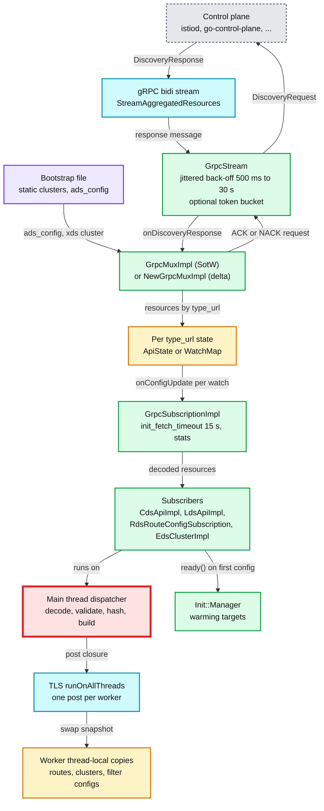

**What to notice**

- **One transport abstraction.** Filesystem, REST and all four gRPC flavours sit behind one `Subscription` interface, so CDS/LDS code never knows how bytes arrived [documented, [xds.md:9-14](https://github.com/envoyproxy/envoy/blob/v1.39.1/source/docs/xds.md#L9)].
- **The main thread is red.** Every accepted resource is decoded, validated and built there (`ASSERT_IS_MAIN_OR_TEST_THREAD()` in [grpc_mux_impl.cc:468](https://github.com/envoyproxy/envoy/blob/v1.39.1/source/extensions/config_subscription/grpc/grpc_mux_impl.cc#L468)). §8 explains why it breaks first.
- **Workers never parse xDS.** They get a finished object through `runOnAllThreads` ([rds_route_config_provider_impl.cc:32-33](https://github.com/envoyproxy/envoy/blob/v1.39.1/source/common/rds/rds_route_config_provider_impl.cc#L32)). A request already in flight keeps the snapshot it started with.
- **The stream is dumb, the mux is smart.** `GrpcStream` only reconnects, rate-limits and sets `control_plane.connected_state`. Nonces, versions and pause logic live in the mux.
- **Bootstrap is the root of trust.** The xDS cluster must be a primary cluster (static, not EDS) ([config_source.proto:89-92](https://github.com/envoyproxy/envoy/blob/v1.39.1/api/envoy/config/core/v3/config_source.proto#L89), [subscription_factory_impl.cc:66-70](https://github.com/envoyproxy/envoy/blob/v1.39.1/source/common/config/subscription_factory_impl.cc#L66)), and must be listed before static clusters that depend on it or init slows down ([xds_protocol.rst:255-261](https://github.com/envoyproxy/envoy/blob/v1.39.1/docs/root/api-docs/xds_protocol.rst#L255)).

---

## 3. Data flow

### 3.1 Resource types and the reference graph

| Service | Type URL (`type.googleapis.com/...`) | Carries | Referenced from |
|---|---|---|---|
| LDS (Listener Discovery Service) | `envoy.config.listener.v3.Listener` | address, listener filters, filter chains, HCM | bootstrap `lds_config` (wildcard) |
| RDS (Route Discovery Service) | `envoy.config.route.v3.RouteConfiguration` | virtual hosts, routes | HCM `rds.route_config_name` |
| SRDS (Scoped Route Discovery Service) | `envoy.config.route.v3.ScopedRouteConfiguration` | key to route config name | HCM `scoped_routes` |
| VHDS (Virtual Host Discovery Service) | `envoy.config.route.v3.VirtualHost` | one virtual host, alias `<route config>/<host>` | RouteConfiguration `vhds` (delta only) |
| CDS (Cluster Discovery Service) | `envoy.config.cluster.v3.Cluster` | LB policy, timeouts, transport socket, EDS source | bootstrap `cds_config` (wildcard) |
| EDS (Endpoint Discovery Service) | `envoy.config.endpoint.v3.ClusterLoadAssignment` | localities, endpoints, weights, health | Cluster `eds_cluster_config.service_name` or cluster name |
| LEDS (Locality Endpoint Discovery Service) | `envoy.config.endpoint.v3.LbEndpoint` | single endpoints of a locality | `leds_cluster_locality_config`, xdstp glob, delta only |
| SDS (Secret Discovery Service) | `envoy.extensions.transport_sockets.tls.v3.Secret` | cert chain + key, validation context, ticket keys | `SdsSecretConfig.name` in TLS contexts |
| ECDS (Extension Config Discovery Service) | `envoy.config.core.v3.TypedExtensionConfig` | one filter's typed config | filter `config_discovery` |
| RTDS (Runtime Discovery Service) | `envoy.service.runtime.v3.Runtime` | a runtime layer | bootstrap `layered_runtime.rtds_layer` |
| CSDS | not a resource: `ClientStatusDiscoveryService` | per-client config status | control plane side |
| HDS (Health Discovery Service) | not a resource: `HealthCheckSpecifier` stream | "health-check these hosts for me" | bootstrap `hds_config` |
| LRS (Load Reporting Service) | not a resource: `LoadStatsRequest` stream | per-cluster load reports | cluster `lrs_server` |
| On-demand CDS | same `Cluster` type, delta, requested lazily | clusters fetched on first use | `on_demand` filter `odcds` |

Sources: [xds_protocol.rst:24-38](https://github.com/envoyproxy/envoy/blob/v1.39.1/docs/root/api-docs/xds_protocol.rst#L24), service protos under [api/envoy/service](https://github.com/envoyproxy/envoy/tree/v1.39.1/api/envoy/service), [endpoint_components.proto:161-173](https://github.com/envoyproxy/envoy/blob/v1.39.1/api/envoy/config/endpoint/v3/endpoint_components.proto#L161) (LEDS), [vhds.h:52-55](https://github.com/envoyproxy/envoy/blob/v1.39.1/source/common/router/vhds.h#L52) (alias).

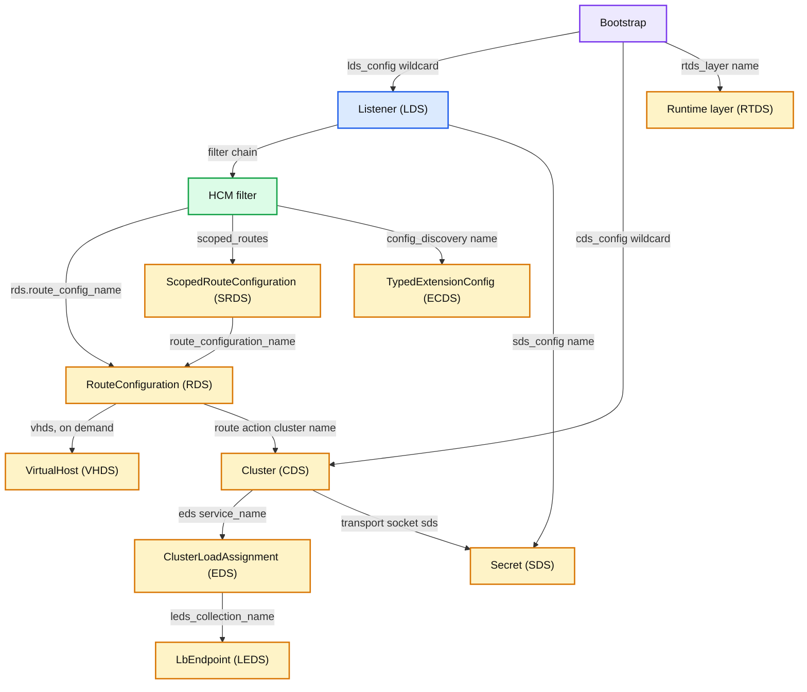

**What to notice**

- **Two roots, named by wildcard.** Envoy always subscribes to `*` (or the legacy empty list) for Listener and Cluster, and the server decides the set from `node` ([xds_protocol.rst:499-503](https://github.com/envoyproxy/envoy/blob/v1.39.1/docs/root/api-docs/xds_protocol.rst#L499), [534-537](https://github.com/envoyproxy/envoy/blob/v1.39.1/docs/root/api-docs/xds_protocol.rst#L534)).
- **Children are named by parents.** RDS and EDS names come from LDS and CDS. So in SotW, deleting a route config or endpoint set is implicit: the parent stops naming it ([xds_protocol.rst:575-587](https://github.com/envoyproxy/envoy/blob/v1.39.1/docs/root/api-docs/xds_protocol.rst#L575)).
- **References are by string, not pointer.** A route may name a cluster that does not exist yet. Routes are not warmed. That is why update order matters (§6.5).
- **SDS hangs off both sides**: downstream certs from listeners, upstream certs and CAs from clusters ([report 07](envoy-07-security.md)).

### 3.2 Processing one response

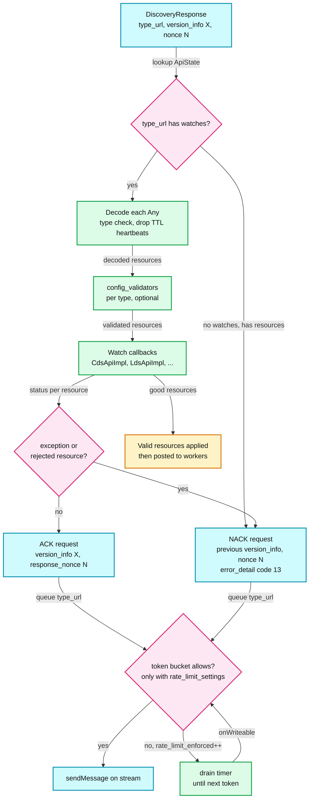

**What to notice**

- **The nonce is always copied, the version only on success.** `set_response_nonce` runs on both paths. `set_version_info` is the last line of `processDiscoveryResources`, which an exception skips ([grpc_mux_impl.cc:444-462, 564](https://github.com/envoyproxy/envoy/blob/v1.39.1/source/extensions/config_subscription/grpc/grpc_mux_impl.cc#L444)).
- **`error_detail` is `google.rpc.Status` code 13 (INTERNAL)** with the exception text truncated to 4096 bytes, because gRPC trailers default to 8 KB ([utility.cc:23-30](https://github.com/envoyproxy/envoy/blob/v1.39.1/source/common/config/utility.cc#L23)).
- **The same type is paused while it is processed** (`same_type_resume = pause(type_url)`), so the many `addWatch` calls a CDS update triggers collapse into one EDS request ([grpc_mux_impl.cc:407-412](https://github.com/envoyproxy/envoy/blob/v1.39.1/source/extensions/config_subscription/grpc/grpc_mux_impl.cc#L407)).
- **Requests are dropped, not queued, while the stream is down.** Reconnect rebuilds one request per subscribed type ([grpc_mux_impl.cc:599-612](https://github.com/envoyproxy/envoy/blob/v1.39.1/source/extensions/config_subscription/grpc/grpc_mux_impl.cc#L599)).
- **Envoy calls `tryShrinkHeap()` after every update** ([grpc_mux_impl.cc:565](https://github.com/envoyproxy/envoy/blob/v1.39.1/source/extensions/config_subscription/grpc/grpc_mux_impl.cc#L565)), because large SotW pushes leave big transient allocations.

### 3.3 Choosing a transport

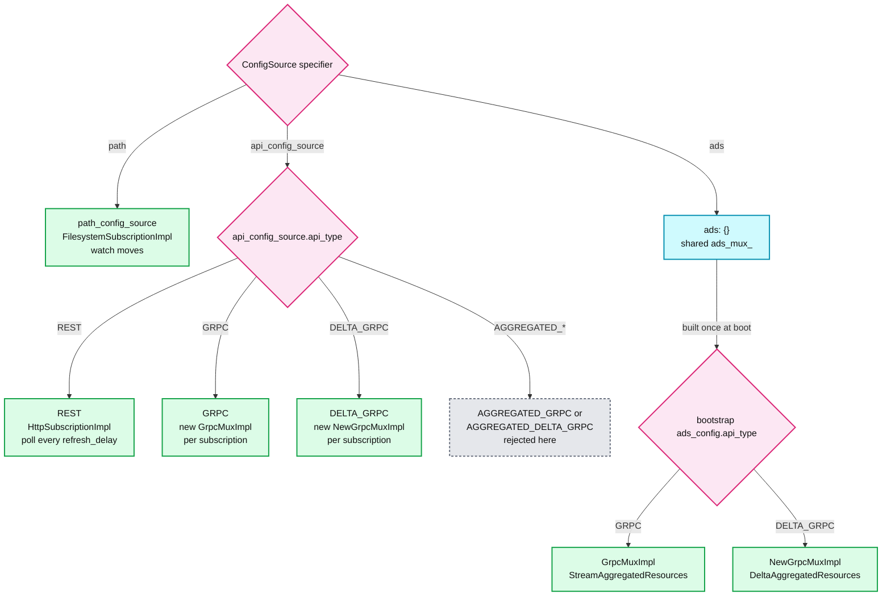

**What to notice**

- **`AGGREGATED_*` api types are only for xdstp authorities** in bootstrap `config_sources`. Anywhere else `SubscriptionFactoryImpl` returns "Unsupported config source" ([subscription_factory_impl.cc:74-77](https://github.com/envoyproxy/envoy/blob/v1.39.1/source/common/config/subscription_factory_impl.cc#L74)).
- **ADS mux is built once at boot** in `XdsManagerImpl::initializeAdsConnections`. That is the only place delta vs SotW ADS is decided ([xds_manager_impl.cc:192-281](https://github.com/envoyproxy/envoy/blob/v1.39.1/source/common/config/xds_manager_impl.cc#L192)). With `unified_mux` on, the factory names switch to `delta_grpc_mux_factory` / `sotw_grpc_mux_factory` (`XdsMux::GrpcMuxDelta` / `GrpcMuxSotw`).
- **REST needs `refresh_delay`** (hard error if missing) and uses a 1 s `request_timeout` by default ([http_subscription_impl.cc:156-167](https://github.com/envoyproxy/envoy/blob/v1.39.1/source/extensions/config_subscription/rest/http_subscription_impl.cc#L156)). No ADS, no delta over REST ([xds_protocol.rst:978-986](https://github.com/envoyproxy/envoy/blob/v1.39.1/docs/root/api-docs/xds_protocol.rst#L978)).
- **Filesystem has no ACK/NACK channel**, only stats and logs. The last valid config stays ([xds_protocol.rst:84-87](https://github.com/envoyproxy/envoy/blob/v1.39.1/docs/root/api-docs/xds_protocol.rst#L84)). A path-based EDS cluster initializes in the primary phase because it needs no network ([eds.cc:40-45](https://github.com/envoyproxy/envoy/blob/v1.39.1/source/extensions/clusters/eds/eds.cc#L40)).

---

## 4. Sequences

Notation follows xds_protocol.rst: V = `version_info`, R = resource names, N = nonce, T = type.

### 4.1 Initial subscribe and ACK (SotW ADS)

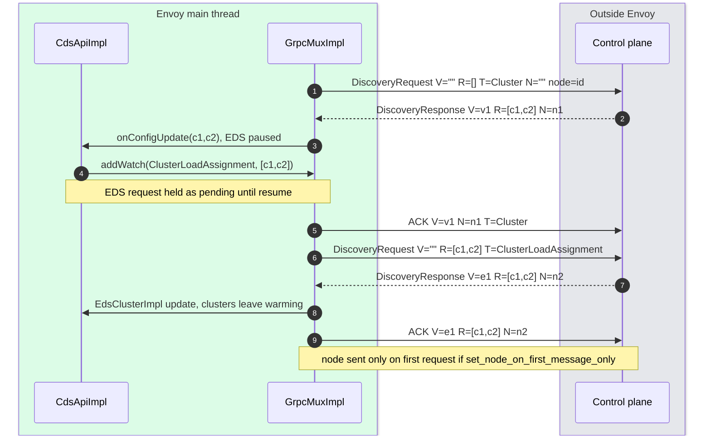

- The empty `resource_names` in step 1 is the legacy wildcard. Envoy never sends explicit names for LDS/CDS.
- Steps 3 to 7 are the pause trick: `CdsApiHelper` pauses EDS, LEDS and SDS for the duration of the update so N new clusters produce one EDS request ([cds_api_helper.cc:22-26](https://github.com/envoyproxy/envoy/blob/v1.39.1/source/common/upstream/cds_api_helper.cc#L22)).

### 4.2 A NACK and recovery

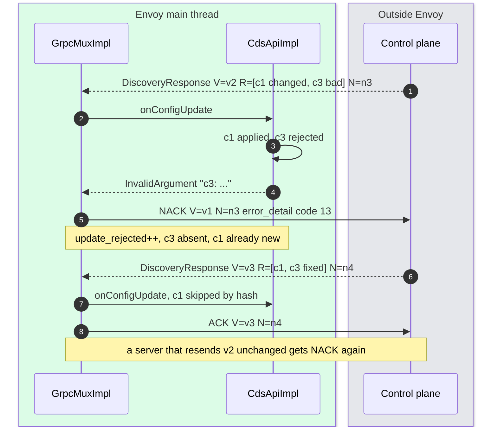

- The NACK carries the last good version (v1) but c1 is already at v2 content: version_info does not describe per-resource state. That is why the spec says detect NACK by `error_detail`, not by version ([xds_protocol.rst:424-436](https://github.com/envoyproxy/envoy/blob/v1.39.1/docs/root/api-docs/xds_protocol.rst#L424)).
- Step 8: unchanged clusters are skipped by `MessageUtil::hash` ([cluster_manager_impl.cc:737-749](https://github.com/envoyproxy/envoy/blob/v1.39.1/source/common/upstream/cluster_manager_impl.cc#L737)), so a SotW resend costs a hash per cluster, not a rebuild.

### 4.3 Delta reconnect with initial_resource_versions

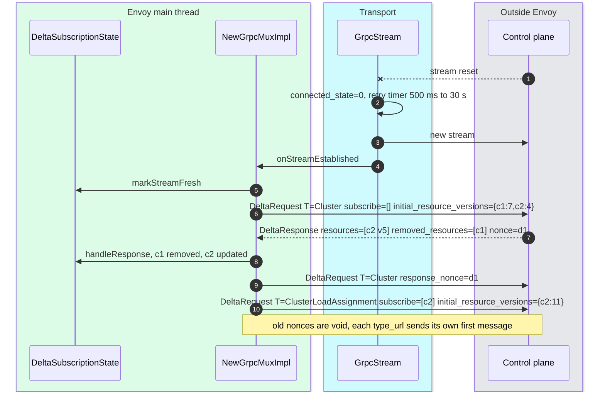

- `getNextRequestAckless()` fills `initial_resource_versions` from every resource it holds, skips ones still waiting for the server, and re-lists all interest in `resource_names_subscribe`, because the new server may know nothing ([delta_subscription_state.cc:292-337](https://github.com/envoyproxy/envoy/blob/v1.39.1/source/extensions/config_subscription/grpc/delta_subscription_state.cc#L292)).
- Step 6 shows the legacy wildcard: `subscribe=[]` on the first message. After an explicit subscription the same empty list would mean "nothing new" ([xds_protocol.rst:505-529](https://github.com/envoyproxy/envoy/blob/v1.39.1/docs/root/api-docs/xds_protocol.rst#L505)).
- ACKs jump the queue: `whoWantsToSendDiscoveryRequest()` drains `pausable_ack_queue_` before plain subscription changes ([new_grpc_mux_impl.cc:450-468](https://github.com/envoyproxy/envoy/blob/v1.39.1/source/extensions/config_subscription/grpc/new_grpc_mux_impl.cc#L450)).

### 4.4 Startup with a control plane

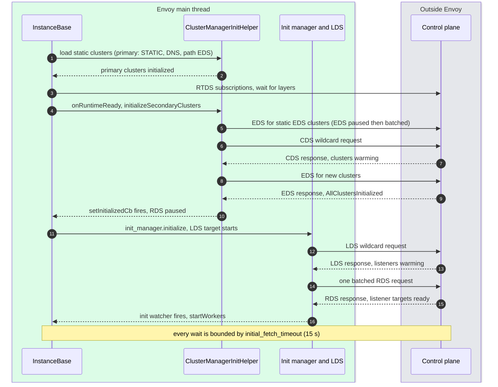

- Order verified in `InstanceBase::initialize` / `onClusterManagerPrimaryInitializationComplete` / `onRuntimeReady` and `RunHelper` ([server.cc:842-902](https://github.com/envoyproxy/envoy/blob/v1.39.1/source/server/server.cc#L842), [1046-1073](https://github.com/envoyproxy/envoy/blob/v1.39.1/source/server/server.cc#L1046)) and in docs ([init.rst:10-33](https://github.com/envoyproxy/envoy/blob/v1.39.1/docs/root/intro/arch_overview/operations/init.rst#L10)).
- **RTDS sits between primary and secondary clusters**, so runtime flags from RTDS can affect CDS-built clusters but not static ones.
- **Worst case with a dead control plane** [inferred]: RTDS 15 s + CDS 15 s + LDS 15 s, plus EDS or RDS timeouts for warming resources, so roughly 45 to 75 s before listeners open, each serving empty or partial config. Hot restart relies on this: the new process initializes fully before the old one drains ([init.rst:27-29](https://github.com/envoyproxy/envoy/blob/v1.39.1/docs/root/intro/arch_overview/operations/init.rst#L27)).

---

## 5. State machines

### 5.1 One subscribed resource, as the client sees it

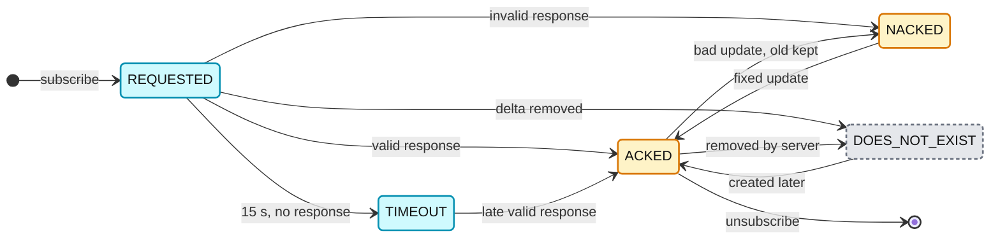

- States are the `ClientResourceStatus` enum ([config_dump_shared.proto:21-50](https://github.com/envoyproxy/envoy/blob/v1.39.1/api/envoy/admin/v3/config_dump_shared.proto#L21)). NACKED keeps serving the ACKED copy. `error_state.details` holds the reason.
- **DOES_NOT_EXIST is cheap in delta, slow in SotW.** Delta servers list missing names in `removed_resources`. SotW clients can only time out ([xds_protocol.rst:594-616](https://github.com/envoyproxy/envoy/blob/v1.39.1/docs/root/api-docs/xds_protocol.rst#L594), [963-971](https://github.com/envoyproxy/envoy/blob/v1.39.1/docs/root/api-docs/xds_protocol.rst#L963)).

### 5.2 Cluster manager init phases

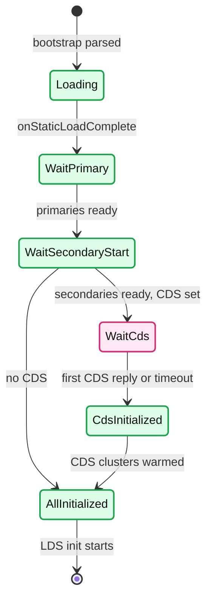

- Real names: `Loading`, `WaitingForPrimaryInitializationToComplete`, `WaitingToStartSecondaryInitialization`, `WaitingToStartCdsInitialization`, `CdsInitialized`, `AllClustersInitialized` ([cluster_manager_impl.h:142-163](https://github.com/envoyproxy/envoy/blob/v1.39.1/source/common/upstream/cluster_manager_impl.h#L142)). Transitions in `maybeFinishInitialize()` ([cluster_manager_impl.cc:197-256](https://github.com/envoyproxy/envoy/blob/v1.39.1/source/common/upstream/cluster_manager_impl.cc#L197)).
- Between WaitPrimary and secondary start, the server runs RTDS (§4.4). Deep dive of warming per cluster is in [report 04](envoy-04-cluster-manager-and-load-balancing.md).

### 5.3 xDS failover (experimental, off by default)

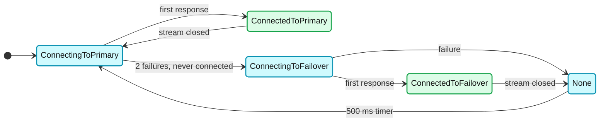

- Gated by `envoy.restart_features.xds_failover_support` (false, [runtime_features.cc:207](https://github.com/envoyproxy/envoy/blob/v1.39.1/source/common/runtime/runtime_features.cc#L207)) and ADS only ([grpc_subscription_factory.cc:51](https://github.com/envoyproxy/envoy/blob/v1.39.1/source/extensions/config_subscription/grpc/grpc_subscription_factory.cc#L51)).
- **Failover only engages if the primary has never answered** (`!ever_connected_to_primary_`, [grpc_mux_failover.h:232-251](https://github.com/envoyproxy/envoy/blob/v1.39.1/source/extensions/config_subscription/grpc/grpc_mux_failover.h#L232)). It protects cold start, not a mid-life primary outage. `control_plane.connected_state` reports 1 for primary and 2 for failover ([grpc_stream.h:30-35](https://github.com/envoyproxy/envoy/blob/v1.39.1/source/extensions/config_subscription/grpc/grpc_stream.h#L30)).

---

## 6. Component deep dives

### 6.1 The gRPC muxes and GrpcStream

- **`GrpcMuxImpl`** (SotW, [grpc_mux_impl.h:40](https://github.com/envoyproxy/envoy/blob/v1.39.1/source/extensions/config_subscription/grpc/grpc_mux_impl.h#L40)): one `ApiState` per type URL holding the current `DiscoveryRequest`, the watch list, pause count, TTL manager and control plane identifier. `subscriptions_` keeps type URLs in first-subscribe order, which is Envoy's dependency order (CDS before EDS, LDS before RDS). On reconnect every type is re-requested in that order ([grpc_mux_impl.cc:570-578](https://github.com/envoyproxy/envoy/blob/v1.39.1/source/extensions/config_subscription/grpc/grpc_mux_impl.cc#L570)).
- **`NewGrpcMuxImpl`** (delta, [new_grpc_mux_impl.h:32](https://github.com/envoyproxy/envoy/blob/v1.39.1/source/extensions/config_subscription/grpc/new_grpc_mux_impl.h#L32)): one `DeltaSubscriptionState` plus `WatchMap` per type, and a `PausableAckQueue`. It supports `requestOnDemandUpdate`, which the SotW mux leaves as an empty function ([grpc_mux_impl.h:69-70](https://github.com/envoyproxy/envoy/blob/v1.39.1/source/extensions/config_subscription/grpc/grpc_mux_impl.h#L69)). That is the code reason on-demand needs delta.
- **`XdsMux::GrpcMuxImpl<S, F, RQ, RS>`** under `xds_mux/`: the unified template with `SotwSubscriptionState` and `DeltaSubscriptionState`. Off by default (`unified_mux` false).
- **`WatchMap`** ([watch_map.h:50-73](https://github.com/envoyproxy/envoy/blob/v1.39.1/source/extensions/config_subscription/grpc/watch_map.h#L50)): reference-counts interest. If EDS watch A wants {X, Y} and watch B wants {Y, Z}, the wire subscription is {X, Y, Z}, and updates to Y go to both [documented, [xds.md:37-41](https://github.com/envoyproxy/envoy/blob/v1.39.1/source/docs/xds.md#L37)].
- **`GrpcStream`** ([grpc_stream.h:25-80](https://github.com/envoyproxy/envoy/blob/v1.39.1/source/extensions/config_subscription/grpc/grpc_stream.h#L25)): on close it sets `connected_state` 0 and arms a retry timer from a jittered exponential back-off, base 500 ms, max 30 s ([subscription_factory.h:34-35](https://github.com/envoyproxy/envoy/blob/v1.39.1/envoy/config/subscription_factory.h#L34)), overridable by `grpc_services[0].envoy_grpc.retry_policy.retry_back_off` ([utility.h:478-489](https://github.com/envoyproxy/envoy/blob/v1.39.1/source/common/config/utility.h#L478)). Back-off resets on the first received message, not on connect, so a server that accepts and immediately closes keeps backing off.
- **Rate limit**: when `rate_limit_settings` is set, a `TokenBucketImpl` of `max_tokens` 100 and `fill_rate` 10/s guards every send; an empty bucket arms a drain timer and increments `control_plane.rate_limit_enforced` ([grpc_stream.h:139-150](https://github.com/envoyproxy/envoy/blob/v1.39.1/source/extensions/config_subscription/grpc/grpc_stream.h#L139), [config_source.proto:144-156](https://github.com/envoyproxy/envoy/blob/v1.39.1/api/envoy/config/core/v3/config_source.proto#L144)).

### 6.2 Messages: the fields that matter

| Message | Field | Meaning |
|---|---|---|
| `DiscoveryRequest` | `version_info` | last successfully applied version of this type, empty at first ([discovery.proto:68](https://github.com/envoyproxy/envoy/blob/v1.39.1/api/envoy/service/discovery/v3/discovery.proto#L68)) |
| | `node` | identity, required on the first request of a stream only ([xds_protocol.rst:307-312](https://github.com/envoyproxy/envoy/blob/v1.39.1/docs/root/api-docs/xds_protocol.rst#L307)) |
| | `resource_names` | full interest set every time (SotW), empty or `*` = wildcard (:79) |
| | `type_url` | required on ADS to demultiplex (:97) |
| | `response_nonce` | nonce of the response being ACKed or NACKed (:107) |
| | `error_detail` | present = NACK, `google.rpc.Status` (:113) |
| `DiscoveryResponse` | `version_info`, `resources`, `type_url`, `nonce`, `control_plane` | version for the whole type, `Any` resources, nonce to echo, server identity for `control_plane.identifier` (:121-161) |
| `DeltaDiscoveryRequest` | `resource_names_subscribe` / `_unsubscribe` | adds and removes only (:241, :244) |
| | `initial_resource_versions` | map name to version, first message per type on a new stream (:277) |
| | `response_nonce`, `error_detail` | set only on ACK/NACK, omitted on spontaneous requests (:283, :288) |
| `DeltaDiscoveryResponse` | `system_version_info` | debug only (:297) |
| | `resources` (`Resource` with name, version, ttl) | per-resource version (:301, :416, :434) |
| | `removed_resources` | explicit deletion or "does not exist" (:311) |
| | `nonce` | required (:320) |

- **Superseding**: a new request on a stream replaces older ones of the same type, so the server answers only the latest ([xds_protocol.rst:470-473](https://github.com/envoyproxy/envoy/blob/v1.39.1/docs/root/api-docs/xds_protocol.rst#L470)). Stale nonces let the server ignore requests that crossed a newer response ([689-702](https://github.com/envoyproxy/envoy/blob/v1.39.1/docs/root/api-docs/xds_protocol.rst#L689)).
- **SotW full-state rule**: for Listener and Cluster the server must send every resource the client needs in every response. For all other types resources may arrive one per response, as in delta ([xds_protocol.rst:547-555](https://github.com/envoyproxy/envoy/blob/v1.39.1/docs/root/api-docs/xds_protocol.rst#L547)). No variant can patch inside a resource: one changed endpoint resends the whole `ClusterLoadAssignment` ([557-560](https://github.com/envoyproxy/envoy/blob/v1.39.1/docs/root/api-docs/xds_protocol.rst#L557)). LEDS exists to split that.
- **TTL**: `Resource.ttl` removes (not reverts) a resource if the server goes quiet. Heartbeats refresh it without an update ([xds_api.rst:332-341](https://github.com/envoyproxy/envoy/blob/v1.39.1/docs/root/configuration/overview/xds_api.rst#L332)). Good for temporary RTDS overrides and fault injection.

### 6.3 Subscriptions and the extension hooks

- **`GrpcSubscriptionImpl::start`** arms the `init_fetch_timeout` timer, then `addWatch`es. For ADS it does not call `mux->start()`; the server starts the shared mux once so initial requests batch ([grpc_subscription_impl.cc:32-52](https://github.com/envoyproxy/envoy/blob/v1.39.1/source/extensions/config_subscription/grpc/grpc_subscription_impl.cc#L32)).
- **On success** it records `update_success`, `update_time`, `version` (xxHash64 of the version string), `version_text` and the `update_duration` histogram. Updates slower than 50 ms are logged at debug with resource names ([grpc_subscription_impl.cc:18, 80-94](https://github.com/envoyproxy/envoy/blob/v1.39.1/source/extensions/config_subscription/grpc/grpc_subscription_impl.cc#L80)).
- **`config_validators`** on `ApiConfigSource` run per type before callbacks. False or throw means NACK ([config_source.proto:112-120](https://github.com/envoyproxy/envoy/blob/v1.39.1/api/envoy/config/core/v3/config_source.proto#L112)). Use it for fleet guardrails such as "never accept an empty CDS".
- **`XdsConfigTracker`** (bootstrap `xds_config_tracker_extension`): callbacks `onConfigAccepted`, `onConfigRejected`, and since 1.39.0 `onResourceUnsubscribed`. No in-repo implementation ([bootstrap.proto:409-419](https://github.com/envoyproxy/envoy/blob/v1.39.1/api/envoy/config/bootstrap/v3/bootstrap.proto#L409)).
- **`XdsResourcesDelegate`** (bootstrap `xds_delegate_extension`, `[#not-implemented-hide:]`): SotW-only hook to persist accepted resources and reload them when the first connection fails (`loadConfigFromDelegate`, [grpc_mux_impl.cc:580-597](https://github.com/envoyproxy/envoy/blob/v1.39.1/source/extensions/config_subscription/grpc/grpc_mux_impl.cc#L580)). This is the KV-store cache seam. v1.39.1 ships no implementation; the only one is a map in `test/integration/xds_delegate_extension_integration_test.cc`.
- **EDS resources cache**: the SotW ADS mux keeps the last `ClusterLoadAssignment` per name. If a re-warming cluster times out, `EdsClusterImpl` uses it and bumps `assignment_use_cached` ([eds.cc:452-479](https://github.com/envoyproxy/envoy/blob/v1.39.1/source/extensions/clusters/eds/eds.cc#L452)).

### 6.4 Warming and the init manager

- **Three interfaces**: `Init::Target` (something that must become ready), `Init::Watcher` (notified when all targets are ready), `Init::Manager` (counts targets). States `Uninitialized`, `Initializing`, `Initialized` ([manager.h:42-55](https://github.com/envoyproxy/envoy/blob/v1.39.1/envoy/init/manager.h#L42)).
- **`ManagerImpl::initialize`** calls every target. A target added while `Initializing` starts immediately. `ready()` fires when the count hits 0 ([manager_impl.cc:17-96](https://github.com/envoyproxy/envoy/blob/v1.39.1/source/common/init/manager_impl.cc#L17)).
- **Weak handles avoid hangs.** Managers hold `std::weak_ptr` to target callbacks. A target destroyed before init counts as ready ([target_impl.cc:10-21](https://github.com/envoyproxy/envoy/blob/v1.39.1/source/common/init/target_impl.cc#L10)). A target that becomes ready before init simply drops its callback (`fn_.reset()`, :44-60).
- **`/init_dump`** lists unready targets by name (`dumpUnreadyTargets`), the first thing to check when a listener is stuck warming.

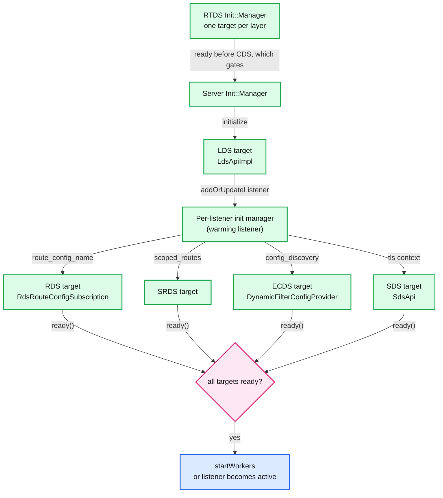

**What to notice**

- **`RdsRouteConfigSubscription` has a parent target and a local init manager** so one route config shared by many listeners is fetched once and each listener's manager waits on it ([rds_route_config_subscription.cc:24-60](https://github.com/envoyproxy/envoy/blob/v1.39.1/source/common/rds/rds_route_config_subscription.cc#L24)).
- **Timeouts make targets ready, not failed.** RDS, CDS, LDS and EDS all call `ready()` from `onConfigUpdateFailed` "to allow server startup to continue, even if we have a bad config" ([lds_api.cc:151-157](https://github.com/envoyproxy/envoy/blob/v1.39.1/source/common/listener_manager/lds_api.cc#L151)). A listener whose RDS timed out goes live with no routes, so requests get 404 NR [inferred]. A cluster whose EDS timed out goes live with 0 hosts, so 503 UH [inferred].
- **Cluster warming** completes only on a new `ClusterLoadAssignment`, even if endpoints are unchanged. **Listener warming** reuses a previously received `RouteConfiguration` ([xds_protocol.rst:723-735](https://github.com/envoyproxy/envoy/blob/v1.39.1/docs/root/api-docs/xds_protocol.rst#L723)). So a control plane that caches "EDS unchanged, skip" can stall cluster updates for 15 s each.
- **ECDS without a default config**: missing HTTP filter config returns a local 500; missing listener or network filter config rejects connections ([extension.rst:46-65](https://github.com/envoyproxy/envoy/blob/v1.39.1/docs/root/configuration/overview/extension.rst#L46)). `apply_default_config_without_warming` skips the wait ([config_source.proto:255-283](https://github.com/envoyproxy/envoy/blob/v1.39.1/api/envoy/config/core/v3/config_source.proto#L255)).

### 6.5 Update ordering: make before break

The spec's order to avoid dropping traffic ([xds_protocol.rst:756-773](https://github.com/envoyproxy/envoy/blob/v1.39.1/docs/root/api-docs/xds_protocol.rst#L756)):

1. CDS first (new cluster Y alongside old X).
2. EDS for those clusters.
3. LDS after its CDS/EDS.
4. RDS for new listeners after CDS/EDS/LDS, now pointing at Y.
5. VHDS after RDS.
6. Remove stale clusters (X) and their endpoints last.

- **Why only ADS can promise this**: on separate streams the RDS push can overtake the CDS push, and "traffic will be blackholed until Y is known" ([xds_protocol.rst:742-747](https://github.com/envoyproxy/envoy/blob/v1.39.1/docs/root/api-docs/xds_protocol.rst#L742)). "A single ADS stream is available per Envoy instance" (:832).
- **Envoy helps from its side**: LDS updates pause RDS, SRDS and SDS requests until all listeners in the batch have subscribed ([lds_api.cc:53-57](https://github.com/envoyproxy/envoy/blob/v1.39.1/source/common/listener_manager/lds_api.cc#L53)). CDS pauses EDS, LEDS and SDS the same way.
- **Envoy does not warm routes.** A route to an unknown cluster returns 503 NC (no cluster) [inferred from router behaviour, see [report 03](envoy-03-http-connection-manager-and-routing.md)].

### 6.6 On-demand discovery: VHDS and ODCDS

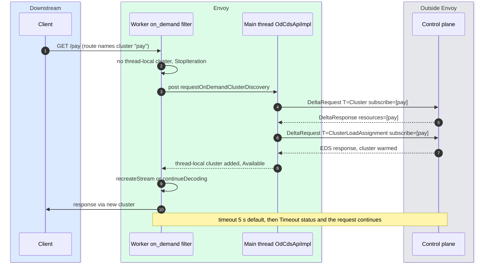

- **ODCDS** is the `envoy.filters.http.on_demand` filter with `odcds`. Default lookup timeout 5 s ([on_demand.proto:36-37](https://github.com/envoyproxy/envoy/blob/v1.39.1/api/envoy/extensions/filters/http/on_demand/v3/on_demand.proto#L36), [on_demand_update.cc:107-110](https://github.com/envoyproxy/envoy/blob/v1.39.1/source/extensions/filters/http/on_demand/on_demand_update.cc#L107)). The worker hands the request to the main thread ([cluster_manager_impl.cc:1629](https://github.com/envoyproxy/envoy/blob/v1.39.1/source/common/upstream/cluster_manager_impl.cc#L1629)). The callback fires from the worker's `onClusterAddOrUpdate`, that is after warming.
- **VHDS** is the same filter without `odcds`: the worker posts to the main thread, which subscribes to alias `<route_config_name>/<host>` ([rds_impl.cc:174-191](https://github.com/envoyproxy/envoy/blob/v1.39.1/source/common/router/rds_impl.cc#L174)). VHDS rejects any config source except `DELTA_GRPC` or delta ADS ([vhds.cc:29-52](https://github.com/envoyproxy/envoy/blob/v1.39.1/source/common/router/vhds.cc#L29)).
- **First-request latency** [inferred]: two thread hops, plus one control plane round trip for VHDS, or two for an EDS-backed ODCDS cluster (CDS then EDS), plus control plane compute, plus the new upstream connection. Intra-region that is typically tens of milliseconds; cross-region, hundreds. Later requests pay nothing.
- **Missing resources resolve fast only in delta**: `removed_resources` for an unknown name triggers `notifyMissingCluster` instead of waiting 5 s ([od_cds_api_impl.cc:70-76](https://github.com/envoyproxy/envoy/blob/v1.39.1/source/common/upstream/od_cds_api_impl.cc#L70)).

### 6.7 xDS-TP naming and federation

- **Format**: `xdstp://{authority}/{resource type}/{id}?{context params}#{directives}` with directives `alt=` and `entry=` ([xds_resource.cc:49-85](https://github.com/envoyproxy/envoy/blob/v1.39.1/source/common/config/xds_resource.cc#L49)). An id ending in `/*` is a glob collection. Context parameters from `node_context_params` are added and sorted so names compare equal ([grpc_mux_impl.h:175-199](https://github.com/envoyproxy/envoy/blob/v1.39.1/source/extensions/config_subscription/grpc/grpc_mux_impl.h#L175)).
- **Implemented in v1.39.1** [documented, [xds.md:50-66](https://github.com/envoyproxy/envoy/blob/v1.39.1/source/docs/xds.md#L50)]: LDS, CDS and SRDS glob collections over delta gRPC; RDS and EDS singletons over delta gRPC; LDS filesystem list collections; LEDS glob collections. Marked experimental.
- **Federation, partly**: `XdsManagerImpl::subscribeToSingletonResource` resolves an xdstp authority against bootstrap `config_sources`, then `default_config_source`, then falls back to the legacy `ConfigSource` ([xds_manager_impl.cc:296-365](https://github.com/envoyproxy/envoy/blob/v1.39.1/source/common/config/xds_manager_impl.cc#L296)). Only EDS, RDS and ODCDS call it, only with `xdstp_based_config_singleton_subscriptions` on. Authorities named in a non-bootstrap `ConfigSource` return `Unimplemented`. Do not claim full federation.

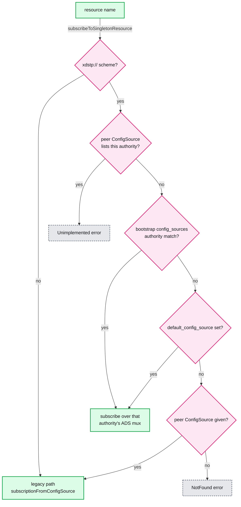

### 6.8 SDS, RTDS, LRS, HDS, CSDS in one page

- **SDS**: `SdsApi` is an init target per secret. File-based SDS (`path_config_source`) watches the SDS file for moves, and also the cert and key files it names; with `watched_directory` it reloads on a move into that directory (the Kubernetes `..data` symlink swap). It re-hashes file contents and only fires callbacks on change ([sds_api.cc:50-80, 116-149](https://github.com/envoyproxy/envoy/blob/v1.39.1/source/common/secret/sds_api.cc#L50)). gRPC SDS is a normal subscription and is exempt from the "backing cluster must be static" check ([subscription_factory_impl.cc:66-70](https://github.com/envoyproxy/envoy/blob/v1.39.1/source/common/config/subscription_factory_impl.cc#L66)). Rotation mechanics are in [report 07](envoy-07-security.md).
- **RTDS**: each `rtds_layer` is an `RtdsSubscription` in a separate RTDS init manager that runs after primary clusters ([runtime_impl.cc:561-576](https://github.com/envoyproxy/envoy/blob/v1.39.1/source/common/runtime/runtime_impl.cc#L561)). A removal clears the layer. Pair with TTL for self-expiring overrides.
- **LRS**: the server sends `LoadStatsResponse` with `clusters` (or `send_all_clusters`) and `load_reporting_interval`; Envoy reports `ClusterStats` on that timer ([lrs.proto:29-110](https://github.com/envoyproxy/envoy/blob/v1.39.1/api/envoy/service/load_stats/v3/lrs.proto#L29)). Envoy advertises `envoy.lrs.supports_send_all_clusters` ([load_stats_reporter_impl.cc:19](https://github.com/envoyproxy/envoy/blob/v1.39.1/source/common/upstream/load_stats_reporter_impl.cc#L19)). It is how global load balancers close the loop ([report 04](envoy-04-cluster-manager-and-load-balancing.md)).
- **HDS**: the control plane delegates health checking of some hosts to this Envoy and aggregates results back into EDS ([hds.proto:27-66](https://github.com/envoyproxy/envoy/blob/v1.39.1/api/envoy/service/health/v3/hds.proto#L27)). Started in `onRuntimeReady`. If HDS setup fails, Envoy shuts down ([server.cc:909-930](https://github.com/envoyproxy/envoy/blob/v1.39.1/source/server/server.cc#L909)).
- **CSDS**: a control-plane-side API with server view (`SYNCED`, `NOT_SENT`, `STALE`, `ERROR`) and client view (`CLIENT_ACKED`, `CLIENT_NACKED`, ...) ([csds.proto:38-80](https://github.com/envoyproxy/envoy/blob/v1.39.1/api/envoy/service/status/v3/csds.proto#L38)). Envoy's own equivalent is `/config_dump` with `client_status` and `error_state` per resource, plus `?resource=`, `?mask=`, `?name_regex=` and `?include_eds` filters ([admin.rst:159-216](https://github.com/envoyproxy/envoy/blob/v1.39.1/docs/root/operations/admin.rst#L159)).

### 6.9 Control plane implementations

- **Reference servers**: the tree names Go and Java reference implementations (`envoyproxy/go-control-plane`, `envoyproxy/java-control-plane`) ([service_discovery.rst:121-125](https://github.com/envoyproxy/envoy/blob/v1.39.1/docs/root/intro/arch_overview/upstream/service_discovery.rst#L121)), and lists Envoy Gateway and Istio as compatible control planes ([configuration-dynamic-control-plane.rst:9-17](https://github.com/envoyproxy/envoy/blob/v1.39.1/docs/root/start/quick-start/configuration-dynamic-control-plane.rst#L9)). Envoy's own protos are published with `go_package` pointing at go-control-plane ([discovery.proto:18](https://github.com/envoyproxy/envoy/blob/v1.39.1/api/envoy/service/discovery/v3/discovery.proto#L18)).
- **go-control-plane caches** [unverified, outside the tree]: a snapshot cache (a consistent per-node set of all types at one version, good for SotW and ADS ordering) versus a linear cache (one type, per-resource versions, good for large EDS/delta). The editor should confirm details.
- **Proxyless gRPC** speaks the same protocol but ADS only, starts from specific Listener names, and does not run PGV validation ([xds_protocol.rst:48-52, 110-115, 263-267](https://github.com/envoyproxy/envoy/blob/v1.39.1/docs/root/api-docs/xds_protocol.rst#L263)). A control plane must not rely on client-side PGV to catch its bugs.
- **Trust**: the control plane is trusted, xDS wire exploits are out of scope, but delivered config may come from tenants and Envoy must survive it ([threat_model.rst:83-89](https://github.com/envoyproxy/envoy/blob/v1.39.1/docs/root/intro/arch_overview/security/threat_model.rst#L83)).

---

## 7. Failure modes

| Failure | What the user sees | Blast radius | Mitigation |
|---|---|---|---|
| Control plane unreachable mid-life | Nothing at first. Last accepted config keeps serving. `control_plane.connected_state` 0, `update_failure`++ | Changes stop fleet-wide: new pods get no traffic, deleted pods keep getting it until outlier detection ejects them | TCP or HTTP/2 keepalive on the xDS cluster ([mgmt_server.rst:9-22](https://github.com/envoyproxy/envoy/blob/v1.39.1/docs/root/configuration/overview/mgmt_server.rst#L9)), multiple control plane replicas, outlier detection ([report 05](envoy-05-resilience.md)) |
| Startup with no control plane | Listeners open after about 15 s per phase with empty config: 404 NR, 503 UH, `init_fetch_timeout`++ | That proxy, and every pod restarted during the outage | Keep `initial_fetch_timeout` finite, readiness probe on real config, static fallback clusters, `XdsResourcesDelegate` cache |
| `initial_fetch_timeout: 0` + dead control plane | Envoy never starts listening (`/init_dump` shows targets) | Rolling restarts stall | Never use 0 in production [inferred] |
| NACK loop | `update_rejected` climbs, `error_state` in config_dump, `version_text` frozen | Only the rejected resources; valid siblings in the same response already applied | Alert on `update_rejected` rate, validate with the same Envoy version server-side, `config_validators` |
| Partial update across types (no ADS) | 503 NC for a route to a cluster not yet received | Requests on the changed route for one push interval | ADS with make-before-break (§6.5), retries |
| Cluster update | Connection pools of the changed cluster drained and rebuilt ([dynamic_configuration.rst:55-59](https://github.com/envoyproxy/envoy/blob/v1.39.1/docs/root/intro/arch_overview/operations/dynamic_configuration.rst#L55)) | Latency blip for that cluster | Put volatile data in EDS, keep Cluster stable |
| EDS churn (deploy of a 1000-pod service) | Main thread CPU up, `cluster_updated`++, LB rebuilt on every worker per membership change | Whole proxy: main-thread lag delays other xDS types, admin and stats flush | `update_merge_window` (1000 ms) for health and weight changes only, batch on the control plane, LEDS |
| Stale endpoints after control plane death | Traffic to dead IPs: 503 UF/URX until ejection | Per cluster | `ClusterLoadAssignment.policy.endpoint_stale_after` (`assignment_stale`), active health checks |
| Warming never completes | `listener_manager.total_listeners_warming` or `cluster_manager.warming_clusters` stays > 0 for 15 s | New or updated listener/cluster only; old version keeps serving | Send EDS on every CDS change even if unchanged ([xds_protocol.rst:727-729](https://github.com/envoyproxy/envoy/blob/v1.39.1/docs/root/api-docs/xds_protocol.rst#L727)) |
| Filesystem xDS edited in place | No reload, no error | That proxy | Write to temp file then `mv`, or set `watched_directory` with `watch_modify: true` |
| xDS rate limit too tight | `control_plane.rate_limit_enforced`++, `pending_requests` > 0, updates lag | Proxy-local | Leave `rate_limit_settings` unset or size it for the burst of EDS requests after a CDS push |

---

## 8. Scalability and performance

**What breaks first inside one Envoy: the main thread.** Every xDS response for every type is decoded from `Any`, validated, hashed and turned into objects on one thread, which also runs admin, stats flush (every 5000 ms) and signal handling ([threading_model.rst:121-129](https://github.com/envoyproxy/envoy/blob/v1.39.1/docs/root/intro/arch_overview/intro/threading_model.rst#L121)). The mechanisms that make it expensive:

- **SotW CDS/LDS is O(total), not O(changed).** One changed cluster in a 10,000-cluster SotW CDS push means 10,000 `Any` decodes and 10,000 `MessageUtil::hash` calls before 9,999 are skipped ([cluster_manager_impl.cc:737-749](https://github.com/envoyproxy/envoy/blob/v1.39.1/source/common/upstream/cluster_manager_impl.cc#L737)). Delta makes it O(changed).
- **EDS granularity is the whole cluster.** One pod change resends and re-processes the whole `ClusterLoadAssignment`, then every worker rebuilds that cluster's LB structures via `runOnAllThreads` ([cluster_manager_impl.cc:1088-1136](https://github.com/envoyproxy/envoy/blob/v1.39.1/source/common/upstream/cluster_manager_impl.cc#L1088)). Membership changes bypass the 1000 ms merge window ([cluster.proto:646-660](https://github.com/envoyproxy/envoy/blob/v1.39.1/api/envoy/config/cluster/v3/cluster.proto#L646)).
- **The budget is in the watchdog**: the main thread's `watchdog_miss` fires after 200 ms without returning to the event loop and `watchdog_mega_miss` after 1000 ms ([bootstrap.proto:594-598](https://github.com/envoyproxy/envoy/blob/v1.39.1/api/envoy/config/bootstrap/v3/bootstrap.proto#L594)). A single xDS apply longer than 200 ms shows up as `server.main_thread.watchdog_miss`, and the `update_duration` histogram tells you which subscription did it.
- **Fixes, in order**: delta xDS for CDS and EDS; fewer, stable clusters with churn pushed into EDS; `update_merge_window` for health and weight noise; LEDS for huge clusters; scope config per proxy (only the clusters it routes to) on the control plane; ODCDS/VHDS for long tails.

**What breaks first across the fleet: control plane push fan-out** [inferred]. A change that touches N proxies costs the server N serializations and N sends. In SotW every CDS change resends the full state to every proxy: with 5,000 proxies and 2,000 clusters at about 2 KB each (an assumed size), one change is 5,000 x 4 MB = 20 GB of egress. Delta sends only the changed cluster. The other scaling lever is per-proxy scoping, which shrinks both the payload and the main-thread work above.

**Connection count**: ADS is one stream per proxy. Non-ADS gRPC is one stream per subscription: a proxy with 300 EDS clusters and 20 RDS names holds about 322 streams, multiplexed over its HTTP/2 connections to the xDS cluster [inferred from [grpc_subscription_factory.cc:16-75](https://github.com/envoyproxy/envoy/blob/v1.39.1/source/extensions/config_subscription/grpc/grpc_subscription_factory.cc#L16)].

**Consistency model** (state it in the interview):

- **Across the fleet: eventual.** No two proxies are guaranteed to hold the same version at the same instant.
- **Within one proxy, across types: ordered only with ADS**, and only as ordered as the server sends it. No transaction spans CDS and RDS.
- **Within one response: not atomic.** CDS and LDS apply resources one at a time and keep the valid ones.
- **Across workers of one proxy: eventual for a moment.** The main thread posts to each worker; a request in flight keeps its snapshot ([threading_model.rst:114-116](https://github.com/envoyproxy/envoy/blob/v1.39.1/docs/root/intro/arch_overview/intro/threading_model.rst#L114)).

---

## 9. Trade-offs and alternatives

| Decision | Chosen | Alternative | Why |
|---|---|---|---|
| Wire model | SotW default, delta opt-in | Delta everywhere | SotW is simpler to serve and idempotent; delta scales to 100k resources and enables on-demand, but server must track per-client state |
| Stream topology | ADS for ordering | One stream per type or per resource | ADS gives make-before-break on one server; separate streams let different servers own different types (e.g. SDS from a node agent) |
| Validation | Client validates, NACKs, keeps last good | Server-side only | The server cannot know the client's exact PGV and parser version ([xds_protocol.rst:54-66](https://github.com/envoyproxy/envoy/blob/v1.39.1/docs/root/api-docs/xds_protocol.rst#L54)) |
| NACK granularity | Whole response NACKed, valid parts applied | All-or-nothing | Keeps healthy resources moving; the cost is that `version_info` no longer describes exact state |
| Init on missing config | Timeout then serve partial (15 s) | Wait forever | Bounded startup for hot restart and autoscaling; the cost is a window of 404/503 |
| Threading | All xDS work on main thread | Parallel parse | No locks on config objects; the cost is the main-thread bottleneck (§8) |
| Route warming | Not warmed | Warm routes against clusters | Keeps RDS cheap; pushes ordering duty to the control plane |
| Mux code | Legacy SotW + delta muxes, unified mux behind flag | Flip unified mux now | Risk management: the flag's TODO says flip once tested ([runtime_features.cc:171-172](https://github.com/envoyproxy/envoy/blob/v1.39.1/source/common/runtime/runtime_features.cc#L171)) |
| Local config cache | Hook only (`XdsResourcesDelegate`) | Built-in disk cache | Leaves staleness policy to the operator; no in-tree implementation to trust |

---

## 10. Config reference

| Knob | Default | Where |
|---|---|---|
| `ConfigSource.initial_fetch_timeout` | 15 s (0 = wait forever) | [config_source.proto:246](https://github.com/envoyproxy/envoy/blob/v1.39.1/api/envoy/config/core/v3/config_source.proto#L246), [utility.cc:205-208](https://github.com/envoyproxy/envoy/blob/v1.39.1/source/common/config/utility.cc#L205) |
| `ApiConfigSource.api_type` | no usable default (0 is `DEPRECATED_AND_UNAVAILABLE_DO_NOT_USE`) | [config_source.proto:48-79](https://github.com/envoyproxy/envoy/blob/v1.39.1/api/envoy/config/core/v3/config_source.proto#L48) |
| `rate_limit_settings` | absent = no limit | [config_source.proto:107](https://github.com/envoyproxy/envoy/blob/v1.39.1/api/envoy/config/core/v3/config_source.proto#L107) |
| `RateLimitSettings.max_tokens` / `fill_rate` | 100 / 10 per s (min fill once per year) | [config_source.proto:148-155](https://github.com/envoyproxy/envoy/blob/v1.39.1/api/envoy/config/core/v3/config_source.proto#L148), [utility.h:54-56](https://github.com/envoyproxy/envoy/blob/v1.39.1/source/common/config/utility.h#L54) |
| xDS stream retry back-off | jittered exponential 500 ms to 30 s | [subscription_factory.h:34-35](https://github.com/envoyproxy/envoy/blob/v1.39.1/envoy/config/subscription_factory.h#L34) |
| `set_node_on_first_message_only` | false | [config_source.proto:110](https://github.com/envoyproxy/envoy/blob/v1.39.1/api/envoy/config/core/v3/config_source.proto#L110) |
| `config_validators` | none | [config_source.proto:120](https://github.com/envoyproxy/envoy/blob/v1.39.1/api/envoy/config/core/v3/config_source.proto#L120) |
| REST `refresh_delay` / `request_timeout` | required / 1 s | [config_source.proto:100-103](https://github.com/envoyproxy/envoy/blob/v1.39.1/api/envoy/config/core/v3/config_source.proto#L100) |
| `PathConfigSource.watched_directory` | unset = watch the file for moves | [config_source.proto:159-191](https://github.com/envoyproxy/envoy/blob/v1.39.1/api/envoy/config/core/v3/config_source.proto#L159) |
| `ExtensionConfigSource.apply_default_config_without_warming` | false | [config_source.proto:277](https://github.com/envoyproxy/envoy/blob/v1.39.1/api/envoy/config/core/v3/config_source.proto#L277) |
| `DynamicResources.ads_config` | unset = `NullGrpcMuxImpl` | [bootstrap.proto:100](https://github.com/envoyproxy/envoy/blob/v1.39.1/api/envoy/config/bootstrap/v3/bootstrap.proto#L100) |
| `Bootstrap.config_sources` / `default_config_source` | unset (hidden, flag-gated) | [bootstrap.proto:366-371](https://github.com/envoyproxy/envoy/blob/v1.39.1/api/envoy/config/bootstrap/v3/bootstrap.proto#L366) |
| on_demand `odcds.timeout` | 5 s | [on_demand.proto:36-37](https://github.com/envoyproxy/envoy/blob/v1.39.1/api/envoy/extensions/filters/http/on_demand/v3/on_demand.proto#L36) |
| `Cluster.update_merge_window` | 1000 ms | [cluster.proto:660](https://github.com/envoyproxy/envoy/blob/v1.39.1/api/envoy/config/cluster/v3/cluster.proto#L660) |
| NACK message length | 4096 bytes then `...(truncated)` | [utility.cc:27](https://github.com/envoyproxy/envoy/blob/v1.39.1/source/common/config/utility.cc#L27) |
| Failover back-off | fixed 500 ms | [grpc_mux_failover.h:59](https://github.com/envoyproxy/envoy/blob/v1.39.1/source/extensions/config_subscription/grpc/grpc_mux_failover.h#L59) |
| `envoy.reloadable_features.unified_mux` | false | [runtime_features.cc:172](https://github.com/envoyproxy/envoy/blob/v1.39.1/source/common/runtime/runtime_features.cc#L172) |
| `envoy.restart_features.xds_failover_support` | false | [runtime_features.cc:207](https://github.com/envoyproxy/envoy/blob/v1.39.1/source/common/runtime/runtime_features.cc#L207) |
| `envoy.reloadable_features.xdstp_based_config_singleton_subscriptions` | false | [runtime_features.cc:232](https://github.com/envoyproxy/envoy/blob/v1.39.1/source/common/runtime/runtime_features.cc#L232) |
| `envoy.restart_features.use_cached_grpc_client_for_xds` | false | [runtime_features.cc:268](https://github.com/envoyproxy/envoy/blob/v1.39.1/source/common/runtime/runtime_features.cc#L268) |
| `envoy.reloadable_features.xds_legacy_delta_skip_subsequent_node` | true | [runtime_features.cc:158](https://github.com/envoyproxy/envoy/blob/v1.39.1/source/common/runtime/runtime_features.cc#L158) |

Minimal ADS bootstrap fragment (the xDS cluster must be static and HTTP/2):

```yaml
dynamic_resources:
  ads_config:
    api_type: DELTA_GRPC
    transport_api_version: V3
    grpc_services: [{ envoy_grpc: { cluster_name: xds_cluster } }]
    set_node_on_first_message_only: true
  cds_config: { ads: {}, initial_fetch_timeout: 15s }
  lds_config: { ads: {}, initial_fetch_timeout: 15s }
```

---

## 11. Stats cheat-sheet

| Stat | Type | What it tells you |
|---|---|---|
| `control_plane.connected_state` | gauge | 0 disconnected, 1 primary, 2 failover. Page if 0 for minutes |
| `control_plane.rate_limit_enforced` / `pending_requests` | counter / gauge | client-side xDS rate limit is biting |
| `control_plane.identifier` | text | which control plane replica sent the last response |
| `<prefix>.update_attempt` | counter | fetch attempts (includes starts and failures) |
| `<prefix>.update_success` | counter | accepted responses; flat while the server pushes = trouble |
| `<prefix>.update_rejected` | counter | NACKs. Alert on rate > 0 |
| `<prefix>.update_failure` | counter | stream or network failures |
| `<prefix>.init_fetch_timeout` | counter | a startup or warming wait expired; config may be partial |
| `<prefix>.version` / `version_text` | gauge / text | xxHash64 of, and the literal, last accepted version. Compare across the fleet to find stragglers |
| `<prefix>.update_duration` | histogram | main-thread time per apply; the §8 bottleneck in numbers |
| `cluster_manager.warming_clusters`, `listener_manager.total_listeners_warming` | gauge | stuck warming |
| `cluster.<name>.assignment_use_cached`, `assignment_stale` | counter | EDS served from cache or went stale |
| `server.main_thread.watchdog_miss` / `watchdog_mega_miss` | counter | main thread blocked > 200 ms / > 1000 ms |
| `extension_config_discovery.<prefix>.<name>.config_fail` | counter | ECDS rejects |

Prefixes: CDS `cluster_manager.cds.`, LDS `listener_manager.lds.`, RDS `http.<stat_prefix>.rds.<route_config>.`, EDS `cluster.<name>.` ([mgmt_server.rst:29-65](https://github.com/envoyproxy/envoy/blob/v1.39.1/docs/root/configuration/overview/mgmt_server.rst#L29), [subscription.h:242-251](https://github.com/envoyproxy/envoy/blob/v1.39.1/envoy/config/subscription.h#L242)). Debug path: `/config_dump?resource=dynamic_active_clusters` for what is live, `client_status` and `error_state` for NACKs, `/init_dump` for stuck warming, then the server's CSDS view for what it believes it sent.

---

## 12. Staff-level questions

**Q1. The control plane pushed a route pointing at a new cluster and 2% of requests got 503 for about a second. What happened and how do you fix it structurally?** Envoy does not warm routes, and without ADS each type rides its own stream, so the RDS update landed before the CDS/EDS update for the new cluster. Requests matched the new route, found no thread-local cluster and failed with NC. The structural fix is ADS on one server with the xds_protocol.rst order: CDS with both clusters, EDS for the new one, then RDS, and only later remove the old cluster. If the control plane is sharded by type, the alternative is a readiness handshake: do not push the RDS change until every target proxy has ACKed the CDS version, which CSDS or ACK tracking on the server provides. Retries hide the residue but are not the fix.

**Q2. Your control plane is down for 20 minutes. What breaks, in what order?** Nothing breaks immediately, because every Envoy keeps the last accepted config and retries with 500 ms to 30 s back-off. First visible impact is new pods: they never enter EDS, so they get no traffic, and scaled-down pods stay in EDS, so traffic hits dead IPs until outlier detection or active health checks eject them. Certificates are next if SDS comes from the same control plane: they keep working until expiry, so the real deadline is the cert lifetime. Newly started Envoys are the worst hit: each phase waits 15 s and then serves empty config. Mitigations are replicated control planes, a separate SDS agent, health checking on critical clusters, `endpoint_stale_after` if dead IPs are worse than stale ones, and a readiness probe that fails until real config exists.

**Q3. SotW or delta for a mesh with 8,000 services?** Delta for CDS and EDS. In SotW the full-state rule makes every cluster change resend all 8,000 clusters to every proxy, and each proxy decodes and hashes all 8,000 on its main thread even though 7,999 are skipped. Delta sends one resource per change, supports on-demand CDS and VHDS, and on reconnect uses `initial_resource_versions` to skip unchanged state. The price is server complexity: per-client subscription state, correct `removed_resources`, and the wildcard-plus-named edge case the spec calls out. I would also scope configuration per proxy so each sidecar only receives clusters it can reach, because that reduces both bytes and main-thread work more than the wire format does.

**Q4. A bad config reached the fleet. Why did some resources apply and some not, and how do you stop it next time?** Envoy validates each resource in isolation. CDS and LDS apply every valid one, collect errors, and return a single NACK with `error_detail`, so a response is not a transaction. The server sees `update_rejected` and a NACK carrying the old version, but the good resources are already live. Prevention has three layers: validate on the server with the same Envoy version (for example by running config validation in CI), add `config_validators` for semantic rules like "never drop below N clusters", and roll config out progressively by proxy group while watching `update_rejected` and error rates before widening. A server that simply resends the same bad version creates a NACK loop, so it must treat a NACK as a stop signal for that resource.

**Q5. Where is the bottleneck in xDS at scale, and how would you prove it?** Inside a proxy it is the main thread: all decode, validation, hashing, object construction and the posts to workers run there, next to admin and stats flush. I would prove it with the `update_duration` histogram per subscription, `server.main_thread.watchdog_miss` (200 ms) and `watchdog_mega_miss` (1000 ms), and a CPU profile during an EDS storm. Across the fleet it is control plane push fan-out, which grows with proxies times payload, and in SotW payload is full state. The fixes are the same shape at both layers: send less (delta, per-proxy scoping), send less often (batching on the server, `update_merge_window` for health and weight noise), and send smaller units (stable clusters with churn in EDS, LEDS for very large clusters).

---

## 13. Sources

**Protocol and docs**
- [docs/root/api-docs/xds_protocol.rst](https://github.com/envoyproxy/envoy/blob/v1.39.1/docs/root/api-docs/xds_protocol.rst)
- [source/docs/xds.md](https://github.com/envoyproxy/envoy/blob/v1.39.1/source/docs/xds.md)
- [operations/dynamic_configuration.rst](https://github.com/envoyproxy/envoy/blob/v1.39.1/docs/root/intro/arch_overview/operations/dynamic_configuration.rst), [operations/init.rst](https://github.com/envoyproxy/envoy/blob/v1.39.1/docs/root/intro/arch_overview/operations/init.rst)
- [configuration/overview/xds_api.rst](https://github.com/envoyproxy/envoy/blob/v1.39.1/docs/root/configuration/overview/xds_api.rst), [mgmt_server.rst](https://github.com/envoyproxy/envoy/blob/v1.39.1/docs/root/configuration/overview/mgmt_server.rst), [extension.rst](https://github.com/envoyproxy/envoy/blob/v1.39.1/docs/root/configuration/overview/extension.rst)
- [intro/threading_model.rst](https://github.com/envoyproxy/envoy/blob/v1.39.1/docs/root/intro/arch_overview/intro/threading_model.rst), [security/threat_model.rst](https://github.com/envoyproxy/envoy/blob/v1.39.1/docs/root/intro/arch_overview/security/threat_model.rst), [operations/admin.rst](https://github.com/envoyproxy/envoy/blob/v1.39.1/docs/root/operations/admin.rst)

**Protos**
- [service/discovery/v3/discovery.proto](https://github.com/envoyproxy/envoy/blob/v1.39.1/api/envoy/service/discovery/v3/discovery.proto), [config/core/v3/config_source.proto](https://github.com/envoyproxy/envoy/blob/v1.39.1/api/envoy/config/core/v3/config_source.proto), [config/bootstrap/v3/bootstrap.proto](https://github.com/envoyproxy/envoy/blob/v1.39.1/api/envoy/config/bootstrap/v3/bootstrap.proto)
- [service/status/v3/csds.proto](https://github.com/envoyproxy/envoy/blob/v1.39.1/api/envoy/service/status/v3/csds.proto), [service/load_stats/v3/lrs.proto](https://github.com/envoyproxy/envoy/blob/v1.39.1/api/envoy/service/load_stats/v3/lrs.proto), [service/health/v3/hds.proto](https://github.com/envoyproxy/envoy/blob/v1.39.1/api/envoy/service/health/v3/hds.proto), [admin/v3/config_dump_shared.proto](https://github.com/envoyproxy/envoy/blob/v1.39.1/api/envoy/admin/v3/config_dump_shared.proto), [filters/http/on_demand/v3/on_demand.proto](https://github.com/envoyproxy/envoy/blob/v1.39.1/api/envoy/extensions/filters/http/on_demand/v3/on_demand.proto)

**xDS client code**
- [config_subscription/grpc/grpc_mux_impl.cc](https://github.com/envoyproxy/envoy/blob/v1.39.1/source/extensions/config_subscription/grpc/grpc_mux_impl.cc), [new_grpc_mux_impl.cc](https://github.com/envoyproxy/envoy/blob/v1.39.1/source/extensions/config_subscription/grpc/new_grpc_mux_impl.cc), [delta_subscription_state.cc](https://github.com/envoyproxy/envoy/blob/v1.39.1/source/extensions/config_subscription/grpc/delta_subscription_state.cc), [grpc_stream.h](https://github.com/envoyproxy/envoy/blob/v1.39.1/source/extensions/config_subscription/grpc/grpc_stream.h), [grpc_mux_failover.h](https://github.com/envoyproxy/envoy/blob/v1.39.1/source/extensions/config_subscription/grpc/grpc_mux_failover.h), [watch_map.h](https://github.com/envoyproxy/envoy/blob/v1.39.1/source/extensions/config_subscription/grpc/watch_map.h), [grpc_subscription_impl.cc](https://github.com/envoyproxy/envoy/blob/v1.39.1/source/extensions/config_subscription/grpc/grpc_subscription_impl.cc), [grpc_subscription_factory.cc](https://github.com/envoyproxy/envoy/blob/v1.39.1/source/extensions/config_subscription/grpc/grpc_subscription_factory.cc), [xds_mux/](https://github.com/envoyproxy/envoy/tree/v1.39.1/source/extensions/config_subscription/grpc/xds_mux)
- [common/config/xds_manager_impl.cc](https://github.com/envoyproxy/envoy/blob/v1.39.1/source/common/config/xds_manager_impl.cc), [subscription_factory_impl.cc](https://github.com/envoyproxy/envoy/blob/v1.39.1/source/common/config/subscription_factory_impl.cc), [utility.cc](https://github.com/envoyproxy/envoy/blob/v1.39.1/source/common/config/utility.cc), [xds_resource.cc](https://github.com/envoyproxy/envoy/blob/v1.39.1/source/common/config/xds_resource.cc)
- [config_subscription/filesystem/filesystem_subscription_impl.cc](https://github.com/envoyproxy/envoy/blob/v1.39.1/source/extensions/config_subscription/filesystem/filesystem_subscription_impl.cc), [rest/http_subscription_impl.cc](https://github.com/envoyproxy/envoy/blob/v1.39.1/source/extensions/config_subscription/rest/http_subscription_impl.cc)
- [envoy/config/subscription.h](https://github.com/envoyproxy/envoy/blob/v1.39.1/envoy/config/subscription.h), [xds_resources_delegate.h](https://github.com/envoyproxy/envoy/blob/v1.39.1/envoy/config/xds_resources_delegate.h), [xds_config_tracker.h](https://github.com/envoyproxy/envoy/blob/v1.39.1/envoy/config/xds_config_tracker.h)

**Subscribers, init and on-demand**
- [common/init/manager_impl.cc](https://github.com/envoyproxy/envoy/blob/v1.39.1/source/common/init/manager_impl.cc), [target_impl.cc](https://github.com/envoyproxy/envoy/blob/v1.39.1/source/common/init/target_impl.cc), [server/server.cc](https://github.com/envoyproxy/envoy/blob/v1.39.1/source/server/server.cc)
- [upstream/cluster_manager_impl.cc](https://github.com/envoyproxy/envoy/blob/v1.39.1/source/common/upstream/cluster_manager_impl.cc), [cds_api_impl.cc](https://github.com/envoyproxy/envoy/blob/v1.39.1/source/common/upstream/cds_api_impl.cc), [cds_api_helper.cc](https://github.com/envoyproxy/envoy/blob/v1.39.1/source/common/upstream/cds_api_helper.cc), [od_cds_api_impl.cc](https://github.com/envoyproxy/envoy/blob/v1.39.1/source/common/upstream/od_cds_api_impl.cc), [clusters/eds/eds.cc](https://github.com/envoyproxy/envoy/blob/v1.39.1/source/extensions/clusters/eds/eds.cc), [clusters/eds/leds.cc](https://github.com/envoyproxy/envoy/blob/v1.39.1/source/extensions/clusters/eds/leds.cc)
- [listener_manager/lds_api.cc](https://github.com/envoyproxy/envoy/blob/v1.39.1/source/common/listener_manager/lds_api.cc), [rds/rds_route_config_subscription.cc](https://github.com/envoyproxy/envoy/blob/v1.39.1/source/common/rds/rds_route_config_subscription.cc), [router/vhds.cc](https://github.com/envoyproxy/envoy/blob/v1.39.1/source/common/router/vhds.cc), [router/rds_impl.cc](https://github.com/envoyproxy/envoy/blob/v1.39.1/source/common/router/rds_impl.cc), [filter/config_discovery_impl.h](https://github.com/envoyproxy/envoy/blob/v1.39.1/source/common/filter/config_discovery_impl.h), [secret/sds_api.cc](https://github.com/envoyproxy/envoy/blob/v1.39.1/source/common/secret/sds_api.cc), [runtime/runtime_impl.cc](https://github.com/envoyproxy/envoy/blob/v1.39.1/source/common/runtime/runtime_impl.cc), [filters/http/on_demand/on_demand_update.cc](https://github.com/envoyproxy/envoy/blob/v1.39.1/source/extensions/filters/http/on_demand/on_demand_update.cc)

**Runtime guards and changelogs**
- [runtime/runtime_features.cc](https://github.com/envoyproxy/envoy/blob/v1.39.1/source/common/runtime/runtime_features.cc), [changelogs/1.38.0.yaml](https://github.com/envoyproxy/envoy/blob/v1.39.1/changelogs/1.38.0.yaml), [changelogs/1.39.0.yaml](https://github.com/envoyproxy/envoy/blob/v1.39.1/changelogs/1.39.0.yaml)

---

<!-- nav:start -->
[← 05 Resilience](envoy-05-resilience.md) · **[Index](README.md)** · [07 Security →](envoy-07-security.md)
<!-- nav:end -->
