# Envoy 07: Security: TLS, Identity, AuthN/AuthZ and Hardening

> **Scope**: how Envoy decides whom to trust (threat model, extension security posture), how it terminates and originates TLS and mTLS (mutual TLS), how identity and certificates rotate through SDS (Secret Discovery Service), the in-process and external authorization filters (RBAC = role-based access control, ext_authz = external authorization, JWT = JSON Web Token, OAuth2, basic, API key, CSRF = cross-site request forgery, CORS = cross-origin resource sharing), header trust, path normalization, request smuggling defenses and HTTP/2 flood hardening. TLS socket plumbing is in [report 02](envoy-02-listeners-and-network-filters.md), HCM (HTTP connection manager) header mechanics in [report 03](envoy-03-http-connection-manager-and-routing.md), the SDS wire protocol in [report 06](envoy-06-xds-control-plane.md), rate limiting and overload in [report 05](envoy-05-resilience.md).
>
> **Series baseline: Envoy v1.39.1** (released 2026-08-27). Defaults, field names and
> class names were read from that tag's source tree. **[documented]** = read in source or
> official docs of this release. **[inferred]** = reasoning, not upstream text.
> **[unverified]** = could not be confirmed, do not quote.

---

<!-- nav:start -->
[← 06 xDS](envoy-06-xds-control-plane.md) · **[Index](README.md)** · [08 Observability →](envoy-08-observability-and-extensibility.md)
<!-- nav:end -->

<!-- toc:start -->

<b>Sections in this report (13)</b>

- [1. Overview](#1-overview)
- [2. Architecture](#2-architecture)
- [3. Data flow](#3-data-flow)
- [4. Sequences](#4-sequences)
- [5. State machines](#5-state-machines)
- [6. Component deep dives](#6-component-deep-dives)
- [7. Failure modes](#7-failure-modes)
- [8. Scalability and performance](#8-scalability-and-performance)
- [9. Trade-offs and alternatives](#9-trade-offs-and-alternatives)
- [10. Config reference](#10-config-reference)
- [11. Stats cheat-sheet](#11-stats-cheat-sheet)
- [12. Staff-level questions](#12-staff-level-questions)
- [13. Sources](#13-sources)

<!-- toc:end -->

## 1. Overview

- **The problem**: Envoy sits on the trust boundary. At the edge it faces the whole internet. In a mesh it faces every other workload. It must authenticate peers, authorize requests, and survive hostile bytes, all on the same event loop that forwards traffic.
- **Design bet 1: trust is a property of the extension, not of the process.** Core code is hardened against untrusted downstream and upstream peers. Every extension declares a `security_posture`, and only some are safe on untrusted traffic ([threat_model.rst:76-81](https://github.com/envoyproxy/envoy/blob/v1.39.1/docs/root/intro/arch_overview/security/threat_model.rst#L76-L81)).
- **Design bet 2: the control plane is trusted, config content may not be.** Wire-level xDS exploits are out of scope, but tenant-supplied config (a regex in a route) must not break Envoy ([threat_model.rst:83-89](https://github.com/envoyproxy/envoy/blob/v1.39.1/docs/root/intro/arch_overview/security/threat_model.rst#L83-L89)).
- **Design bet 3: identity comes from certificates that rotate without restarts.** SDS swaps a new `SSL_CTX` in on the main thread. New connections pick it up, old ones finish on the old one.
- **Design bet 4: cheap checks in process, expensive ones out of process.** RBAC and JWT verification run inside the worker. `ext_authz` makes a network call per request and fails closed by default.
- **Design bet 5: defaults favour compatibility, not safety.** Path normalization, XFF trust, client-cert enforcement and upstream cert verification are all off until configured. The threat model says so explicitly ([threat_model.rst:47-53](https://github.com/envoyproxy/envoy/blob/v1.39.1/docs/root/intro/arch_overview/security/threat_model.rst#L47-L53)).

**One sentence: Envoy hardens its core against hostile peers, lets each extension declare how much hostility it can take, and leaves almost every protective default off until you turn it on.**

### Premise corrections up front

| Commonly said | Actual in v1.39.1 |
|---|---|
| "Envoy verifies upstream server certificates by default" | No. `UpstreamTlsContext` does no server verification until `trusted_ca` is set ([tls.proto:37](https://github.com/envoyproxy/envoy/blob/v1.39.1/api/envoy/extensions/transport_sockets/tls/v3/tls.proto#L37), [ssl.rst:75](https://github.com/envoyproxy/envoy/blob/v1.39.1/docs/root/intro/arch_overview/security/ssl.rst#L75)) |
| "Upstream TLS negotiates TLS 1.3 by default" | Client default max is **TLS 1.2**. Only the server side defaults to max 1.3 ([context_config_impl.cc:392-393](https://github.com/envoyproxy/envoy/blob/v1.39.1/source/common/tls/context_config_impl.cc#L392-L393), [server_context_config_impl.cc:89-90](https://github.com/envoyproxy/envoy/blob/v1.39.1/source/common/tls/server_context_config_impl.cc#L89-L90)) |
| "Adding a `trusted_ca` validation context to a listener turns on mTLS" | Not by itself (SAN = Subject Alternative Name, SPKI = Subject Public Key Info). `require_client_certificate` defaults to false, and `trusted_ca` alone only verifies a cert if one is sent. A cert becomes mandatory only with `require_client_certificate: true` or with SAN matchers, SPKI or hash pins ([common.proto:430-442](https://github.com/envoyproxy/envoy/blob/v1.39.1/api/envoy/extensions/transport_sockets/tls/v3/common.proto#L430-L442), [default_validator.cc:228-255](https://github.com/envoyproxy/envoy/blob/v1.39.1/source/common/tls/cert_validator/default_validator.cc#L228-L255)). Envoy logs a "deprecated insecure default" warning ([server_context_config_impl.cc:175-181](https://github.com/envoyproxy/envoy/blob/v1.39.1/source/common/tls/server_context_config_impl.cc#L175-L181)) |
| "RFC1918 sources are internal, so `x-envoy-*` headers from them are honoured" | Since 1.33.0 **no address is internal by default**. `DefaultInternalAddressConfig::isInternalAddress` returns false ([conn_manager_config.h:197-200](https://github.com/envoyproxy/envoy/blob/v1.39.1/source/common/http/conn_manager_config.h#L197-L200), [1.33.0.yaml:18-26](https://github.com/envoyproxy/envoy/blob/v1.39.1/changelogs/1.33.0.yaml#L18-L26)). `headers.rst:468-471` still describes the old rule |
| "Envoy normalizes paths before routing" | `normalize_path` false, `merge_slashes` false, escaped slashes `KEEP_UNCHANGED` ([config.cc:92-100](https://github.com/envoyproxy/envoy/blob/v1.39.1/source/extensions/filters/network/http_connection_manager/config.cc#L92-L100), [config.cc:433-437](https://github.com/envoyproxy/envoy/blob/v1.39.1/source/extensions/filters/network/http_connection_manager/config.cc#L433-L437)) |
| "Disable the Rapid Reset guard with `send_goaway_for_premature_rst_streams`" | That flag was **removed in 1.31.0** ([1.31.0.yaml:297](https://github.com/envoyproxy/envoy/blob/v1.39.1/changelogs/1.31.0.yaml#L297)). The check is always on, tuned only by `overload.premature_reset_*` runtime keys |
| "The premature-reset guard sends GOAWAY" | The code comment says GOAWAY, but it calls `doConnectionClose(Abort, ...)` ([conn_manager_impl.cc:729-777](https://github.com/envoyproxy/envoy/blob/v1.39.1/source/common/http/conn_manager_impl.cc#L729-L777)). The nghttp2 reset token bucket is the path that sends GOAWAY |
| "Upgrading fixes the OAuth2 cookie padding oracle (CVE-2026-47775)" | The fix is **opt-in**: `oauth2_use_gcm_encryption` is a `FALSE_RUNTIME_GUARD`, so cookies are still AES-256-CBC ([runtime_features.cc:179](https://github.com/envoyproxy/envoy/blob/v1.39.1/source/common/runtime/runtime_features.cc#L179), [1.39.0.yaml:269](https://github.com/envoyproxy/envoy/blob/v1.39.1/changelogs/1.39.0.yaml#L269)) |
| "RBAC `authenticated.principal_name` proves the peer did mTLS" | Not if `require_client_certificate` is false or `ACCEPT_UNTRUSTED` is set. Upstream recommends the `MTlsAuthenticated` principal instead ([rbac.proto:340-358](https://github.com/envoyproxy/envoy/blob/v1.39.1/api/envoy/config/rbac/v3/rbac.proto#L340-L358)) |
| "ext_authz forwards all request headers" | Only for gRPC. The HTTP service gets only `allowed_headers` plus Host, Method, Path, Content-Length, Authorization ([ext_authz.proto:240-263](https://github.com/envoyproxy/envoy/blob/v1.39.1/api/envoy/extensions/filters/http/ext_authz/v3/ext_authz.proto#L240-L263)) |
| "Editing a cert file in place triggers SDS reload" | File SDS watches only `IN_MOVED_TO`. In-place writes are ignored unless `watch_modify` is set ([sds_api.cc:131](https://github.com/envoyproxy/envoy/blob/v1.39.1/source/common/secret/sds_api.cc#L131), [base.proto:506-512](https://github.com/envoyproxy/envoy/blob/v1.39.1/api/envoy/config/core/v3/base.proto#L506-L512)) |
| "The SPIFFE validator is the hardened mesh choice" | It is **alpha** with posture `requires_trusted_downstream_and_upstream` ([extensions_metadata.yaml:1588-1592](https://github.com/envoyproxy/envoy/blob/v1.39.1/source/extensions/extensions_metadata.yaml#L1588-L1592)) |
| "basic_auth accepts bcrypt htpasswd" | Only `{SHA}` (base64 SHA-1) is accepted ([basic_auth/config.cc:47-49](https://github.com/envoyproxy/envoy/blob/v1.39.1/source/extensions/filters/http/basic_auth/config.cc#L47-L49)) |

---

## 2. Architecture

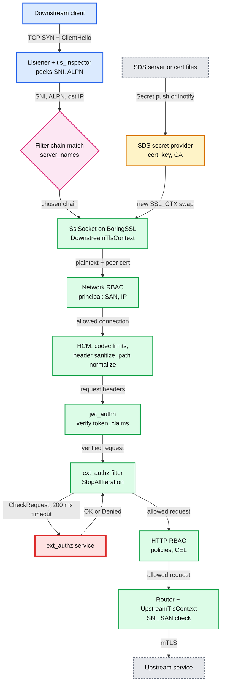

**What to notice**

- **Identity is fixed before HTTP exists.** SNI (Server Name Indication) and ALPN (Application-Layer Protocol Negotiation) pick the filter chain and certificate. The peer certificate is verified inside the handshake. Everything above (network RBAC, HCM, HTTP filters) reads the result from the connection's `Ssl::ConnectionInfo`.
- **Two RBAC layers** (policies can add CEL, Common Expression Language, conditions). Network RBAC decides per connection (closes it). HTTP RBAC decides per request (403). Both share the engine in `source/extensions/filters/common/rbac/`.
- **Filter order is the policy.** `jwt_authn` must run before RBAC rules that read JWT metadata. The ext_authz docs recommend it as the first filter ([ext_authz_filter.rst:16-18](https://github.com/envoyproxy/envoy/blob/v1.39.1/docs/root/intro/arch_overview/security/ext_authz_filter.rst#L16-L18)).
- **The red node is the bottleneck.** ext_authz is the only check that leaves the process on every request, with a 200 ms default timeout and fail-closed default. Section 8 explains why it breaks first.
- **SDS feeds the socket factory, not the connection.** Rotation never touches live connections (section 3.4).

---

## 3. Data flow

### 3.1 Header trust: internal or external

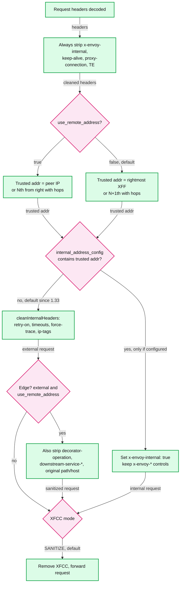

**What to notice**

- **`x-envoy-internal` is always removed first** ([conn_manager_utility.cc:142](https://github.com/envoyproxy/envoy/blob/v1.39.1/source/common/http/conn_manager_utility.cc#L142)), then re-added only for internal requests ([:278-283](https://github.com/envoyproxy/envoy/blob/v1.39.1/source/common/http/conn_manager_utility.cc#L278-L283)). A client cannot forge it.
- **With the 1.33+ default every request is external**, so `x-envoy-retry-on`, `x-envoy-upstream-rq-timeout-ms` and friends from your own apps are stripped too ([:351-387](https://github.com/envoyproxy/envoy/blob/v1.39.1/source/common/http/conn_manager_utility.cc#L351-L387)) **[inferred from code]**. Configure `internal_address_config` if you rely on them.
- **XFF (`x-forwarded-for`) trust is positional.** With `use_remote_address: false` the rightmost XFF entry is trusted, which is only safe if a trusted proxy wrote it ([headers.rst:291-326](https://github.com/envoyproxy/envoy/blob/v1.39.1/docs/root/configuration/http/http_conn_man/headers.rst#L291-L326)).
- Route-level `internal_only_headers` are stripped in the same pass. XFCC (`x-forwarded-client-cert`) is dropped unless another mode is configured (section 6.11).

### 3.2 Path normalization pipeline

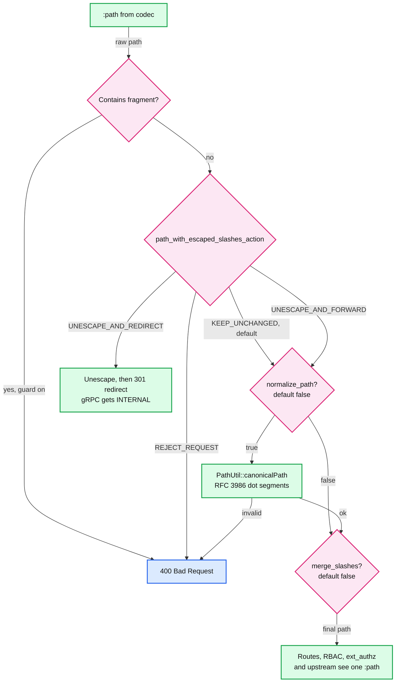

**What to notice**

- **Order matters**: fragment, then escaped slashes, then canonicalization, then slash merging ([conn_manager_utility.cc:770-817](https://github.com/envoyproxy/envoy/blob/v1.39.1/source/common/http/conn_manager_utility.cc#L770-L817)). Merging runs last "to catch potential edge cases with percent encoding".
- **Fragments are rejected by default**: `http_reject_path_with_fragment` is a true guard ([runtime_features.cc:87](https://github.com/envoyproxy/envoy/blob/v1.39.1/source/common/runtime/runtime_features.cc#L87)).
- **Runs once, in the HCM**, at [conn_manager_impl.cc:1497](https://github.com/envoyproxy/envoy/blob/v1.39.1/source/common/http/conn_manager_impl.cc#L1497), so every filter and the upstream see the rewritten path. Failures count `downstream_rq_failed_path_normalization`.
- **1.39.1 added path-parameter stripping** (`/admin;x=y`) behind two true guards ([runtime_features.cc:138-139](https://github.com/envoyproxy/envoy/blob/v1.39.1/source/common/runtime/runtime_features.cc#L138-L139)).

### 3.3 Downstream certificate selection

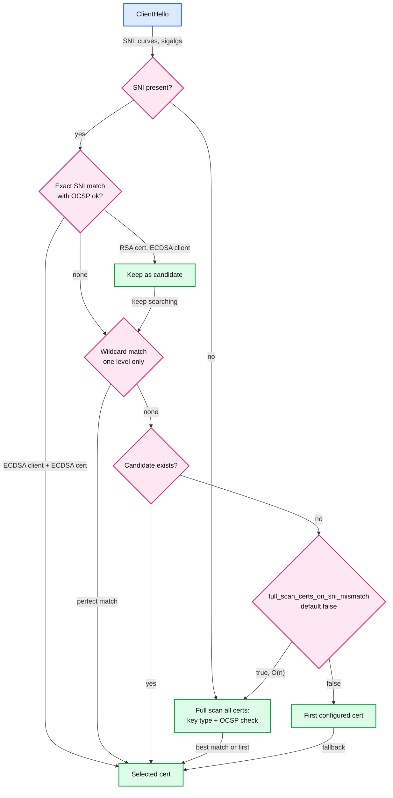

**What to notice**

- **Runs inside BoringSSL's `select_certificate_cb`** ([server_context_impl.cc:125-130](https://github.com/envoyproxy/envoy/blob/v1.39.1/source/common/tls/server_context_impl.cc#L125-L130)) in `DefaultTlsCertificateSelector::selectTlsContext` ([default_tls_certificate_selector.cc:88](https://github.com/envoyproxy/envoy/blob/v1.39.1/source/common/tls/default_tls_certificate_selector.cc#L88)).
- **ECDSA is preferred** (OCSP = Online Certificate Status Protocol, checked per cert) when the client supports P-256, P-384 or P-521. Other curves for server ECDSA certs are rejected at load ([ssl.rst:128-157](https://github.com/envoyproxy/envoy/blob/v1.39.1/docs/root/intro/arch_overview/security/ssl.rst#L128-L157)).
- **Full scan is off on SNI mismatch** because it is O(n) and a DoS lever ([ssl.rst:164-165](https://github.com/envoyproxy/envoy/blob/v1.39.1/docs/root/intro/arch_overview/security/ssl.rst#L164-L165)). A client with no SNI always gets a full scan.
- **Upstream contexts hold a single certificate** ([ssl.rst:168](https://github.com/envoyproxy/envoy/blob/v1.39.1/docs/root/intro/arch_overview/security/ssl.rst#L168)).

### 3.4 Certificate rotation through SDS

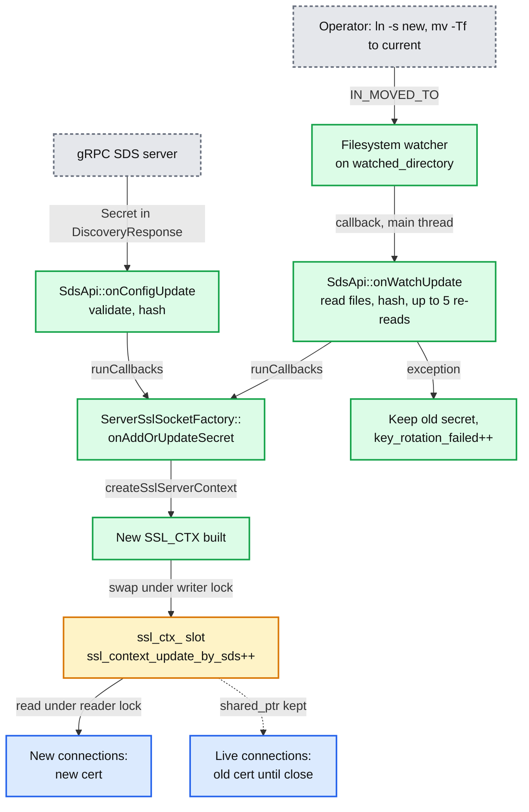

**What to notice**

- **Atomic read**: `onWatchUpdate` re-reads cert and key until two hashes agree, at most `MaxBoundedRetries = 5` ([sds_api.cc:50-87](https://github.com/envoyproxy/envoy/blob/v1.39.1/source/common/secret/sds_api.cc#L50-L87)). A half-written pair is never installed.
- **The swap is a pointer swap** under `ssl_ctx_mu_` ([server_ssl_socket.cc:79-91](https://github.com/envoyproxy/envoy/blob/v1.39.1/source/common/tls/server_ssl_socket.cc#L79-L91)). Workers do not need a TLS-slot post, because `createDownstreamTransportSocket` reads the pointer under a reader lock ([:54-75](https://github.com/envoyproxy/envoy/blob/v1.39.1/source/common/tls/server_ssl_socket.cc#L54-L75)).
- **Bad material never replaces good material.** A failed file reload logs, bumps `key_rotation_failed`, and keeps serving the old cert.
- **Use the symlink swap**: the docs recommend `ln -s <new> /certs/new && mv -Tf /certs/new /certs/current` with `watched_directory: /certs` ([secret.rst:212-246](https://github.com/envoyproxy/envoy/blob/v1.39.1/docs/root/configuration/security/secret.rst#L212-L246)).

---

## 4. Sequences

### 4.1 Downstream mTLS handshake inside Envoy

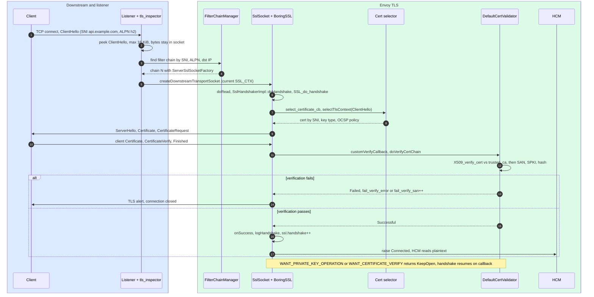

**What to notice**

- **tls_inspector only peeks.** It reads up to `max_client_hello_size` (default and max 16 KiB, `TLS_MAX_CLIENT_HELLO`) and sets requested server name and ALPN on the socket ([tls_inspector.proto:53-58](https://github.com/envoyproxy/envoy/blob/v1.39.1/api/envoy/extensions/filters/listener/tls_inspector/v3/tls_inspector.proto#L53-L58), [tls_inspector.cc:135-142](https://github.com/envoyproxy/envoy/blob/v1.39.1/source/extensions/filters/listener/tls_inspector/tls_inspector.cc#L135-L142)). BoringSSL then re-reads the same bytes.
- **Verification is a custom callback** registered with `SSL_CTX_set_custom_verify` ([context_impl.cc:194](https://github.com/envoyproxy/envoy/blob/v1.39.1/source/common/tls/context_impl.cc#L194)). That is the seam for SPIFFE and dynamic-module validators.
- **Async steps keep the connection open** ([ssl_handshaker.cc:163-167](https://github.com/envoyproxy/envoy/blob/v1.39.1/source/common/tls/ssl_handshaker.cc#L163-L167)): private key providers, async cert validation, on-demand certificate fetch.
- Handshake mechanics (buffers, ALPN negotiation) are in [report 02](envoy-02-listeners-and-network-filters.md).

### 4.2 ext_authz check, allow, deny and outage

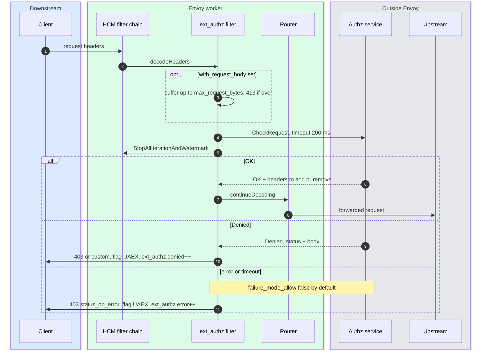

**What to notice**

- **The 200 ms default** lives in `ExtAuthzFilterConfig::DefaultTimeout` ([config.h:25](https://github.com/envoyproxy/envoy/blob/v1.39.1/source/extensions/filters/http/ext_authz/config.h#L25)) and is applied to both gRPC and HTTP services ([config.cc:36-37](https://github.com/envoyproxy/envoy/blob/v1.39.1/source/extensions/filters/http/ext_authz/config.cc#L36-L37), [:51-52](https://github.com/envoyproxy/envoy/blob/v1.39.1/source/extensions/filters/http/ext_authz/config.cc#L51-L52)).
- **Fail closed by default** ([ext_authz.proto:56-69](https://github.com/envoyproxy/envoy/blob/v1.39.1/api/envoy/extensions/filters/http/ext_authz/v3/ext_authz.proto#L56-L69)). With `failure_mode_allow: true` the request continues and `failure_mode_allowed` counts it. `failure_mode_allow_header_add` stamps `x-envoy-auth-failure-mode-allowed: true`.
- **`max_request_bytes` wins over fail-open**: a body over the limit returns 413 and no check is made ([ext_authz.proto:438-445](https://github.com/envoyproxy/envoy/blob/v1.39.1/api/envoy/extensions/filters/http/ext_authz/v3/ext_authz.proto#L438-L445)).

### 4.3 JWT verification with remote JWKS

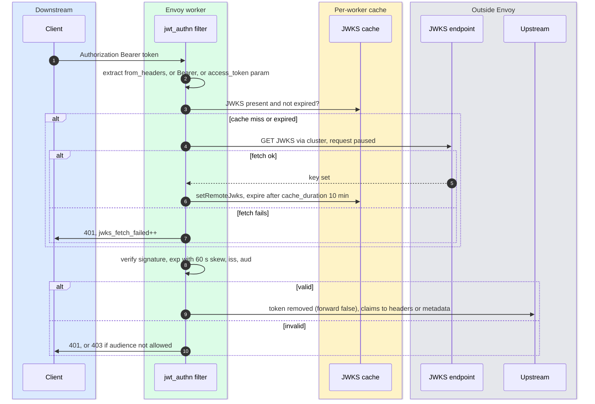

**What to notice**

- **Without `async_fetch`, each worker fetches its own JWKS** (JSON Web Key Set) on the first request, and those requests wait ([config.proto:418-433](https://github.com/envoyproxy/envoy/blob/v1.39.1/api/envoy/extensions/filters/http/jwt_authn/v3/config.proto#L418-L433)). With it, the main thread fetches before the listener activates and refetches every `failed_refetch_duration` (1 s) after a failure.
- **Key rotation lag**: a new `kid` not yet in a fresh cache fails verification until the cache expires. The code carries a TODO for exactly this ([authenticator.cc:268-279](https://github.com/envoyproxy/envoy/blob/v1.39.1/source/extensions/filters/http/jwt_authn/authenticator.cc#L268-L279)).

### 4.4 HTTP/2 Rapid Reset and the two defenses

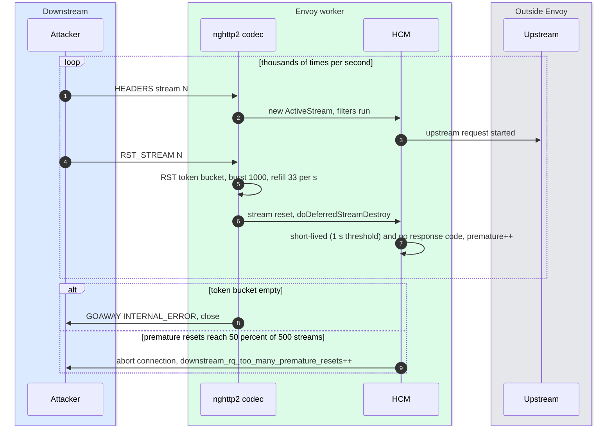

**What to notice**

- **Layer 1, codec**: nghttp2's RST_STREAM rate limiter. Envoy only calls `nghttp2_option_set_stream_reset_rate_limit` when `stream_reset_burst` or `stream_reset_rate` is set, otherwise nghttp2's own 1000 / 33 defaults apply ([codec_impl.cc:2233-2241](https://github.com/envoyproxy/envoy/blob/v1.39.1/source/common/http/http2/codec_impl.cc#L2233-L2241)). It does not exist for oghttp2 or client connections ([protocol.proto:810-829](https://github.com/envoyproxy/envoy/blob/v1.39.1/api/envoy/config/core/v3/protocol.proto#L810-L829)).
- **Layer 2, HCM**: codec-agnostic, so it also covers HTTP/3 ([1.27.1.yaml:6-12](https://github.com/envoyproxy/envoy/blob/v1.39.1/changelogs/1.27.1.yaml#L6-L12)). Details in section 6.13.

---

## 5. State machines

### 5.1 Downstream TLS connection

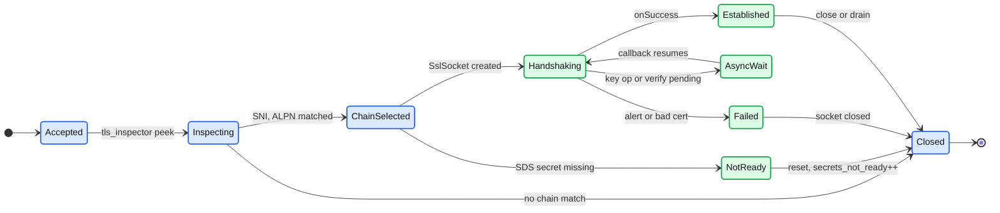

- `NotReady` is `NotReadySslSocket`: the listener is up but the certificate is not, so every connection is reset ([server_ssl_socket.cc:70-73](https://github.com/envoyproxy/envoy/blob/v1.39.1/source/common/tls/server_ssl_socket.cc#L70-L73)).
- `AsyncWait` covers `SSL_ERROR_WANT_PRIVATE_KEY_OPERATION`, `WANT_CERTIFICATE_VERIFY` and `WANT_X509_LOOKUP` (on-demand SDS certificate).

### 5.2 SDS secret lifecycle

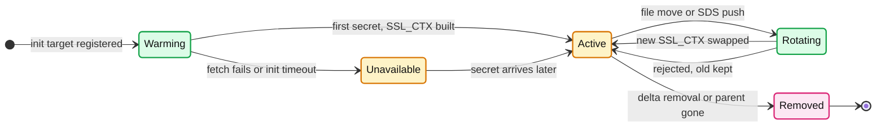

- **Warming blocks the port**: a listener whose cert comes from SDS is not active and its port is not opened until the secret arrives ([secret.rst:12](https://github.com/envoyproxy/envoy/blob/v1.39.1/docs/root/configuration/security/secret.rst#L12)).
- **Unavailable is worse than Warming**: after a failed fetch the listener goes active and resets every connection. Clusters behave the same and reject routed requests ([secret.rst:12-14](https://github.com/envoyproxy/envoy/blob/v1.39.1/docs/root/configuration/security/secret.rst#L12-L14)). The trigger is the init target finishing, which the 15 s `initial_fetch_timeout` bounds **[inferred]**, see [report 06](envoy-06-xds-control-plane.md).
- **Recovery is automatic**: `init_target_.ready()` is called again when files appear later ([sds_api.cc:76-79](https://github.com/envoyproxy/envoy/blob/v1.39.1/source/common/secret/sds_api.cc#L76-L79)).

---

## 6. Component deep dives

### 6.1 Threat model and extension security posture

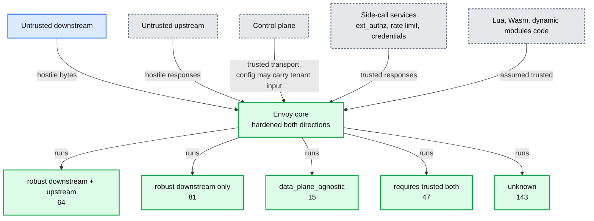

- **What triggers a security release** ([threat_model.rst:18-37](https://github.com/envoyproxy/envoy/blob/v1.39.1/docs/root/intro/arch_overview/security/threat_model.rst#L18-L37)): any confidentiality or integrity loss. For availability, only a component hardened for that traffic direction, and only with 100x amplification (a 10 KiB request costing 1 MiB, or 100x CPU).
- **Out of scope**: debug assertions, non-BoringSSL TLS libraries, deprecated fields, and features behind false-by-default runtime flags ([:55-71](https://github.com/envoyproxy/envoy/blob/v1.39.1/docs/root/intro/arch_overview/security/threat_model.rst#L55-L71)). **Alpha extensions are for trusted deployments only** ([:108-110](https://github.com/envoyproxy/envoy/blob/v1.39.1/docs/root/intro/arch_overview/security/threat_model.rst#L108-L110)).
- **Side calls are trusted** ([:101-103](https://github.com/envoyproxy/envoy/blob/v1.39.1/docs/root/intro/arch_overview/security/threat_model.rst#L101-L103)). A compromised ext_authz server is your problem, not a CVE.

Counts from `source/extensions/extensions_metadata.yaml` (350 core extensions), produced by a 20-line script that groups `security_posture` by `status`:

| security_posture | stable | alpha | wip | total |
|---|---|---|---|---|
| `unknown` | 53 | 55 | 35 | 143 |
| `robust_to_untrusted_downstream` | 61 | 18 | 2 | 81 |
| `robust_to_untrusted_downstream_and_upstream` | 51 | 12 | 1 | 64 |
| `requires_trusted_downstream_and_upstream` | 14 | 32 | 1 | 47 |
| `data_plane_agnostic` | 5 | 10 | 0 | 15 |
| **total** | **184** | **127** | **39** | **350** |

- `contrib/extensions_metadata.yaml` adds 38 more: 27 `requires_trusted_downstream_and_upstream`, 6 downstream-robust, 3 agnostic, 2 fully robust. Contrib is outside the threat model ([threat_model.rst:114-117](https://github.com/envoyproxy/envoy/blob/v1.39.1/docs/root/intro/arch_overview/security/threat_model.rst#L114-L117)).
- Security filters: `rbac` (HTTP and network), `jwt_authn`, `oauth2`, `csrf`, `cors`, HCM: stable, downstream-robust. HTTP `ext_authz`, `transport_sockets.tls`, `tls_inspector`, `router`, `mtls_authenticated`: stable, fully robust. `basic_auth`, `api_key_auth`: alpha. `credential_injector`, `wasm`: alpha, unknown. **Only 51 of 350 are both stable and fully robust.**

### 6.2 TLS termination and origination

**Objects.** `DownstreamTlsContext` (listener side) and `UpstreamTlsContext` (cluster side) both wrap `CommonTlsContext`: `tls_params`, `tls_certificates` or `tls_certificate_sds_secret_configs`, a validation context, `alpn_protocols`. Config becomes `ServerContextConfigImpl` / `ClientContextConfigImpl`, then `ServerContextImpl` / `ClientContextImpl` holding the BoringSSL `SSL_CTX` (all in `source/common/tls/`). OpenSSL builds exist but are outside the security policy ([ssl.rst:38-41](https://github.com/envoyproxy/envoy/blob/v1.39.1/docs/root/intro/arch_overview/security/ssl.rst#L38-L41)).

**Defaults** (non-FIPS build):

| Setting | Server (downstream) | Client (upstream) |
|---|---|---|
| Min / max version | TLS 1.2 / **TLS 1.3** | TLS 1.2 / **TLS 1.2** |
| TLS 1.2 ciphers | `[ECDHE-ECDSA-AES128-GCM-SHA256\|ECDHE-ECDSA-CHACHA20-POLY1305]`, same for RSA, then ECDHE-ECDSA/RSA-AES256-GCM-SHA384 | same list |
| Curves | X25519, P-256 (FIPS: P-256) | X25519, P-256 |
| Cipher preference | server's (`SSL_OP_CIPHER_SERVER_PREFERENCE` unless `prefer_client_ciphers`) | n/a |
| Peer verification | only if a validation context is set; client cert optional | **none until `trusted_ca`** |

Sources: [server_context_config_impl.cc:89-107](https://github.com/envoyproxy/envoy/blob/v1.39.1/source/common/tls/server_context_config_impl.cc#L89-L107), [context_config_impl.cc:392-410](https://github.com/envoyproxy/envoy/blob/v1.39.1/source/common/tls/context_config_impl.cc#L392-L410), [server_context_impl.cc:164-166](https://github.com/envoyproxy/envoy/blob/v1.39.1/source/common/tls/server_context_impl.cc#L164-L166). `compliance_policies` (`FIPS_202205`, `CNSA2_202603`, `CNSA1_202603`) override everything and are applied last ([common.proto:48-97](https://github.com/envoyproxy/envoy/blob/v1.39.1/api/envoy/extensions/transport_sockets/tls/v3/common.proto#L48-L97)).

- **mTLS enforcement**: `require_client_certificate: true` calls `SSL_CTX_set_verify(PEER | FAIL_IF_NO_PEER_CERT)` in `DefaultCertValidator::addClientValidationContext` ([default_validator.cc:659](https://github.com/envoyproxy/envoy/blob/v1.39.1/source/common/tls/cert_validator/default_validator.cc#L659)). SAN matchers, SPKI or hash pins also make a cert mandatory ([:228-255](https://github.com/envoyproxy/envoy/blob/v1.39.1/source/common/tls/cert_validator/default_validator.cc#L228-L255)). `trusted_ca` alone checks a cert only if the client sends one.
- **ALPN has no default.** Empty `alpn_protocols` means no ALPN is offered ([tls.proto:351-361](https://github.com/envoyproxy/envoy/blob/v1.39.1/api/envoy/extensions/transport_sockets/tls/v3/tls.proto#L351-L361)).
- **Session resumption, stateless**: tickets are on by default with an internal key, so resumption fails across hot restarts and hosts. Shared keys come from `session_ticket_keys` (80 bytes each: 16 name, 32 HMAC, 32 AES) or SDS. The first key encrypts, all keys decrypt, a hit on an old key tells BoringSSL to renew ([server_context_impl.cc:338-395](https://github.com/envoyproxy/envoy/blob/v1.39.1/source/common/tls/server_context_impl.cc#L338-L395)). Tickets use AES-256-CBC plus HMAC-SHA256. The proto says rotate "at least daily, and preferably hourly" ([common.proto:331-340](https://github.com/envoyproxy/envoy/blob/v1.39.1/api/envoy/extensions/transport_sockets/tls/v3/common.proto#L331-L340)).
- **Session resumption, stateful**: the TLS 1.2 session cache, switched off with `disable_stateful_session_resumption` (`SSL_SESS_CACHE_OFF`). Upstream keeps `max_session_keys` = 1 by default, 0 disables ([context_config_impl.cc:432](https://github.com/envoyproxy/envoy/blob/v1.39.1/source/common/tls/context_config_impl.cc#L432)).
- **OCSP stapling**: `LENIENT_STAPLING` by default. `STRICT_STAPLING` stops using a cert whose response expired. `MUST_STAPLE` requires one. Must-staple certs behave as `MUST_STAPLE`. Upstream ignores OCSP ([tls.proto:92-104](https://github.com/envoyproxy/envoy/blob/v1.39.1/api/envoy/extensions/transport_sockets/tls/v3/tls.proto#L92-L104), [ssl.rst:193-202](https://github.com/envoyproxy/envoy/blob/v1.39.1/docs/root/intro/arch_overview/security/ssl.rst#L193-L202)).
- **`CertificateValidationContext`** ([common.proto:408-656](https://github.com/envoyproxy/envoy/blob/v1.39.1/api/envoy/extensions/transport_sockets/tls/v3/common.proto#L408-L656)):
  - `trusted_ca`: chain check. `X509_V_FLAG_PARTIAL_CHAIN` is on, so an intermediate can be a trust anchor.
  - `match_typed_subject_alt_names`: typed SAN matchers with "any" semantics. The proto warns SANs are spoofable without `trusted_ca`.
  - `verify_certificate_spki` (base64 SHA-256 of SPKI, survives renewal with the same key) and `verify_certificate_hash` (hex SHA-256 of the cert). Either list matching accepts.
  - `crl` (certificate revocation list): once a CRL exists for one CA in the chain, every CA needs one, unless `only_verify_leaf_cert_crl`.
  - `max_verify_depth`: default 100. `allow_expired_certificate`, `trust_chain_verification: ACCEPT_UNTRUSTED` (lets route matching read the result).
  - `custom_validator_config`: replaces all of the above (SPIFFE, dynamic modules).
- **Upstream identity**: set `sni`, or `auto_host_sni` (from the host's hostname), plus `auto_sni_san_validation` to demand a DNS SAN equal to the sent SNI ([tls.proto:41-61](https://github.com/envoyproxy/envoy/blob/v1.39.1/api/envoy/extensions/transport_sockets/tls/v3/tls.proto#L41-L61)). Cluster-level `UpstreamHttpProtocolOptions.auto_sni` and `auto_san_validation` derive both from the downstream Host header, or `override_auto_sni_header` ([protocol.proto:189-222](https://github.com/envoyproxy/envoy/blob/v1.39.1/api/envoy/config/core/v3/protocol.proto#L189-L222)). SNI with a NUL byte is rejected at config time.
- **Private key providers**: `PrivateKeyProvider` offloads sign and decrypt to an extension (TPM, accelerators; `cryptomb` and `qat` are in contrib). `fallback` defaults to false ([common.proto:222-242](https://github.com/envoyproxy/envoy/blob/v1.39.1/api/envoy/extensions/transport_sockets/tls/v3/common.proto#L222-L242)).
- **1.39.0 changes**: `keyUsage` is always enforced on peer certs, and `tls_inspector` rejects client versions outside 1.0 to 1.3 ([1.39.0.yaml:18-28](https://github.com/envoyproxy/envoy/blob/v1.39.1/changelogs/1.39.0.yaml#L18-L28)).

### 6.3 mTLS in a mesh: SPIFFE identity and rotation

- **Identity = URI SAN.** A SPIFFE ID (`spiffe://trust-domain/path`) sits in the URI SAN. The default validator matches it with `match_typed_subject_alt_names: [{san_type: URI, matcher: ...}]`. XFCC `URI=` and RBAC principals read the same field.
- **SPIFFE validator** (`envoy.tls.cert_validator.spiffe`, alpha): one trust bundle per trust domain, chosen by the peer's SAN *before* chain verification, so a CA for `envoy.com` cannot mint `spiffe://foo.com/...` ([tls_spiffe_validator_config.proto:38-41](https://github.com/envoyproxy/envoy/blob/v1.39.1/api/envoy/extensions/transport_sockets/tls/v3/tls_spiffe_validator_config.proto#L38-L41)). It matches URI SANs only (`GEN_URI`, [spiffe_validator.cc:420](https://github.com/envoyproxy/envoy/blob/v1.39.1/source/extensions/transport_sockets/tls/cert_validator/spiffe/spiffe_validator.cc#L420)). `trust_bundles` loads a SPIFFE bundle map with a file watch.
- **Rotation paths**:
  - **gRPC SDS**: a server (SPIRE is the in-tree example, [secret.rst:31-36](https://github.com/envoyproxy/envoy/blob/v1.39.1/docs/root/configuration/security/secret.rst#L31-L36)) pushes `Secret` resources. The SDS channel must be UDS or mTLS with static client certs ([secret.rst:18-21](https://github.com/envoyproxy/envoy/blob/v1.39.1/docs/root/configuration/security/secret.rst#L18-L21)). Istio's node agent plays this role **[unverified]**.
  - **File SDS**: `sds_config.path_config_source` pointing at a YAML `Secret` whose cert fields are file paths. This is the only way to rotate the xDS client cert itself, because a gRPC SDS server cannot bootstrap its own connection ([secret.rst:146-150](https://github.com/envoyproxy/envoy/blob/v1.39.1/docs/root/configuration/security/secret.rst#L146-L150)).
- **`validation_context_sds_secret_config`** rotates the CA bundle separately from the leaf. `combined_validation_context` merges a static default (SAN matchers) with the SDS CA: singular fields override, repeated fields concatenate, booleans OR ([tls.proto:327-338](https://github.com/envoyproxy/envoy/blob/v1.39.1/api/envoy/extensions/transport_sockets/tls/v3/tls.proto#L327-L338)).
- **On-demand certificates**: `custom_tls_certificate_selector: on_demand_secret` pauses the handshake, maps SNI (or filter state) to a secret name, fetches it over DELTA_GRPC and resumes. The listener no longer blocks on SDS at startup. Session resumption is not supported ([secret.rst:279-317](https://github.com/envoyproxy/envoy/blob/v1.39.1/docs/root/configuration/security/secret.rst#L279-L317)).
- **Mixing rule**: static and SDS certificates may not be mixed in one server context ([server_context_config_impl.cc:159-163](https://github.com/envoyproxy/envoy/blob/v1.39.1/source/common/tls/server_context_config_impl.cc#L159-L163)).

### 6.4 RBAC (network and HTTP)

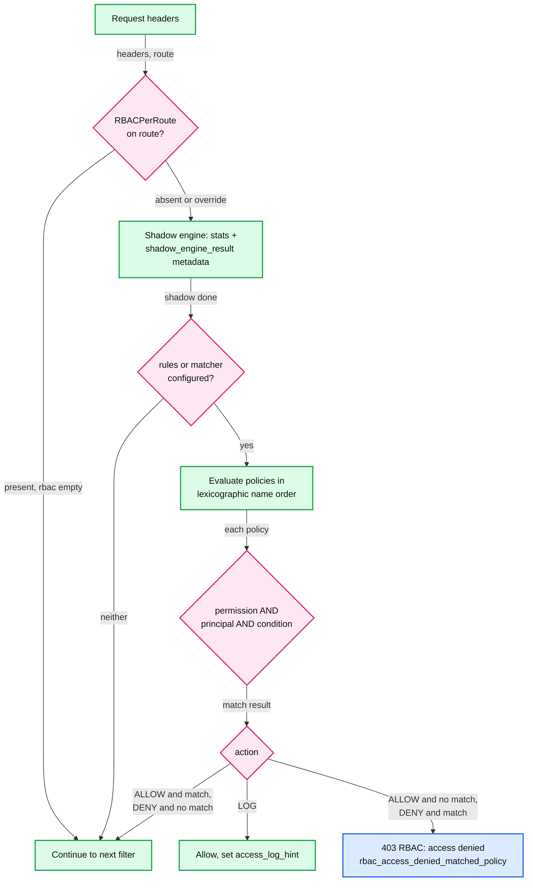

- **Policy model** ([rbac.proto:89-218](https://github.com/envoyproxy/envoy/blob/v1.39.1/api/envoy/config/rbac/v3/rbac.proto#L89-L218)): a policy matches if any permission AND any principal AND the optional CEL `condition` match. Permissions: `header`, `url_path`, `destination_port`, `requested_server_name`, `metadata`, `uri_template`, `and_rules` / `or_rules` / `not_rule`. Principals: `authenticated`, `direct_remote_ip`, `remote_ip` (XFF-derived), `header`, `metadata`, `filter_state`.
- **Empty is not open**: `rules` absent means no enforcement. `rules` set but empty denies everything ([http rbac.proto:29-38](https://github.com/envoyproxy/envoy/blob/v1.39.1/api/envoy/extensions/filters/http/rbac/v3/rbac.proto#L29-L38)). A matcher denies requests that match nothing.
- **Shadow mode**: `shadow_rules` or `shadow_matcher` only emit `shadow_allowed` / `shadow_denied` and dynamic metadata. It is the rollout tool.
- **Matcher form**: `matcher` (the generic matching API) replaces `rules` when both are set. Network inputs work in both filters, HTTP inputs only in the HTTP filter ([rbac_filter.rst:35-44](https://github.com/envoyproxy/envoy/blob/v1.39.1/docs/root/intro/arch_overview/security/rbac_filter.rst#L35-L44)).
- **Network RBAC** closes the connection. `enforcement_type` defaults to `ONE_TIME_ON_FIRST_BYTE`. `CONTINUOUS` re-checks at every message boundary for L4 protocols ([network rbac.proto:37-86](https://github.com/envoyproxy/envoy/blob/v1.39.1/api/envoy/extensions/filters/network/rbac/v3/rbac.proto#L37-L86)).
- **Pitfall 1, unnormalized paths**: a deny on `/admin` misses `/admin/../admin`, `//admin`, `/%61dmin` or `/admin%2F..` unless section 3.2 is configured. `header: :path` also includes the query string, so use `url_path` ([rbac.proto:258-270](https://github.com/envoyproxy/envoy/blob/v1.39.1/api/envoy/config/rbac/v3/rbac.proto#L258-L270)).
- **Pitfall 2, path parameters**: until 1.39.1, `/admin;x=y` could skip RBAC while the router still matched `/admin` with `ignore_path_parameters_in_path_matching` (CVE-2026-73553, [1.39.1.yaml:125-139](https://github.com/envoyproxy/envoy/blob/v1.39.1/changelogs/1.39.1.yaml#L125-L139)).
- **Pitfall 3, multi-valued headers**: two `x-role` headers used to be matched as `user,admin` (CVE-2026-26308). CEL conditions still see the joined value ([1.39.0.yaml:484-497](https://github.com/envoyproxy/envoy/blob/v1.39.1/changelogs/1.39.0.yaml#L484-L497)).
- **Pitfall 4, `authenticated` without enforced mTLS** (premise table). Prefer `custom: MTlsAuthenticated` with `any_validated_client_certificate` or a `san_matcher`.

### 6.5 ext_authz

- **Two transports**: gRPC `Authorization.Check` with a `CheckRequest` (`AttributeContext`: peer, request, TLS session if `include_tls_session`, peer cert if `include_peer_certificate`), or plain HTTP where status 200 means allow.
- **Header forwarding**: gRPC sends all request headers unless `allowed_headers` is set. HTTP sends only the minimal set. `disallowed_headers` beats both ([ext_authz.proto:240-267](https://github.com/envoyproxy/envoy/blob/v1.39.1/api/envoy/extensions/filters/http/ext_authz/v3/ext_authz.proto#L240-L267)).
- **Body**: `with_request_body.max_request_bytes` is required when set, 413 on overflow, or `allow_partial_message` to send a prefix. The filter returns `StopAllIterationAndWatermark` while waiting ([ext_authz.cc:505-508](https://github.com/envoyproxy/envoy/blob/v1.39.1/source/extensions/filters/http/ext_authz/ext_authz.cc#L505-L508)).
- **Per route**: `ExtAuthzPerRoute.disabled: true` (health checks, public assets) or `check_settings` with `context_extensions` and a per-route service. `deny_at_disable` can deny when the filter is disabled by runtime.
- **`clear_route_cache`** lets the auth service change routing. The proto warns this is dangerous when RBAC runs before ext_authz ([ext_authz.proto:82-102](https://github.com/envoyproxy/envoy/blob/v1.39.1/api/envoy/extensions/filters/http/ext_authz/v3/ext_authz.proto#L82-L102)).
- **Shadow mode** (`shadow_mode`, new): the decision goes to filter state instead of being enforced.
- **Stats** live under `cluster.<route target cluster>.ext_authz.` ([ext_authz_filter.rst:183](https://github.com/envoyproxy/envoy/blob/v1.39.1/docs/root/configuration/http/http_filters/ext_authz_filter.rst#L183)): `ok`, `denied`, `error`, `disabled`, `failure_mode_allowed`, `invalid`, `shadow_denied` ([ext_authz.h:42-55](https://github.com/envoyproxy/envoy/blob/v1.39.1/source/extensions/filters/http/ext_authz/ext_authz.h#L42-L55)).
- **Recent bugs**: 1.39.1 fixed a crash on path-less requests (CONNECT) and a use-after-free on HTTP rejects (CVE-2026-73547, CVE-2026-50572, [1.39.1.yaml:3-13](https://github.com/envoyproxy/envoy/blob/v1.39.1/changelogs/1.39.1.yaml#L3-L13)).

### 6.6 jwt_authn

- **Providers** (`providers` map): `issuer`, `audiences`, `remote_jwks` (with `http_uri`, `cache_duration` default 10 min, `async_fetch`, `retry_policy` off by default) or `local_jwks`. `rules` / `requirement_map` bind routes to `requires_any`, `requires_all`, `allow_missing`, `allow_missing_or_failed`.
- **Defaults**: token from `Authorization: Bearer` then the `access_token` query param. `clock_skew_seconds` 60. `forward` false, so the token is stripped after success. `jwt_cache_size` 100 when the cache is on ([config.proto:196-226](https://github.com/envoyproxy/envoy/blob/v1.39.1/api/envoy/extensions/filters/http/jwt_authn/v3/config.proto#L196-L226), [:353](https://github.com/envoyproxy/envoy/blob/v1.39.1/api/envoy/extensions/filters/http/jwt_authn/v3/config.proto#L353), [:387](https://github.com/envoyproxy/envoy/blob/v1.39.1/api/envoy/extensions/filters/http/jwt_authn/v3/config.proto#L387), [:411-413](https://github.com/envoyproxy/envoy/blob/v1.39.1/api/envoy/extensions/filters/http/jwt_authn/v3/config.proto#L411-L413); C++ `DefaultCacheExpirationSec{600}` at [jwks_async_fetcher.cc:16](https://github.com/envoyproxy/envoy/blob/v1.39.1/source/extensions/filters/http/jwt_authn/jwks_async_fetcher.cc#L16)).
- **Claims out**: `claim_to_headers` (scalar claims only, the header is overwritten), `forward_payload_header` (base64url payload), `payload_in_metadata` for RBAC `metadata` principals.
- **Status codes**: 401 for missing or invalid, 403 only for `JwtAudienceNotAllowed` ([filter.cc:125](https://github.com/envoyproxy/envoy/blob/v1.39.1/source/extensions/filters/http/jwt_authn/filter.cc#L125)). Stats under `http.<stat_prefix>.jwt_authn.`.

### 6.7 OAuth2 filter

- Browser login flow: redirect to `authorization_endpoint`, handle the callback on `redirect_path_matcher`, exchange the code at `token_endpoint`, set HMAC-signed cookies (`token_secret` and `hmac_secret` via SDS). Auth types: `URL_ENCODED_BODY`, `BASIC_AUTH`, `TLS_CLIENT_AUTH` (RFC 8705), `PRIVATE_KEY_JWT` ([oauth.proto:219-241](https://github.com/envoyproxy/envoy/blob/v1.39.1/api/envoy/extensions/filters/http/oauth2/v3/oauth.proto#L219-L241)).
- Defaults: `use_refresh_token` true, refresh-token cookie 604800 s (7 days), CSRF and PKCE (Proof Key for Code Exchange) verifier cookies 600 s, tokens encrypted (`disable_token_encryption` false) ([:327-386](https://github.com/envoyproxy/envoy/blob/v1.39.1/api/envoy/extensions/filters/http/oauth2/v3/oauth.proto#L327-L386)).
- **Action item**: turn on `oauth2_use_gcm_encryption` fleet-wide, watch `oauth_legacy_cbc_decrypt` fall to 0, then turn off `oauth2_legacy_cbc_decrypt_compat` (CVE-2026-47775).

### 6.8 basic_auth and api_key_auth (alpha)

- **basic_auth**: htpasswd `{SHA}` only, 401 on failure, optional `forward_username_header`. `allow_missing` plus `emit_dynamic_metadata` gives OR semantics with JWT when an RBAC rule checks the metadata ([basic_auth.proto:37-74](https://github.com/envoyproxy/envoy/blob/v1.39.1/api/envoy/extensions/filters/http/basic_auth/v3/basic_auth.proto#L37-L74)).
- **api_key_auth**: key from header (a `Bearer ` prefix is stripped), then query, then cookie. 401 for missing or unknown keys, 403 when the client is not in the per-route `allowed_clients` ([api_key_auth.cc:142-166](https://github.com/envoyproxy/envoy/blob/v1.39.1/source/extensions/filters/http/api_key_auth/api_key_auth.cc#L142-L166)).

### 6.9 credential_injector (alpha, posture unknown)

- The reverse direction: injects a **workload** credential into upstream requests (Basic, Bearer, or OAuth2 client credentials grant) from an SDS `generic_secret`. It is not end-user auth.
- `overwrite` false. Missing credential means 401 unless `allow_request_without_credential` ([credential_injector.proto:15-82](https://github.com/envoyproxy/envoy/blob/v1.39.1/api/envoy/extensions/filters/http/credential_injector/v3/credential_injector.proto#L15-L82)).

### 6.10 CSRF and CORS

- **CSRF** checks only POST, PUT, DELETE and PATCH ([csrf_filter.cc:29-37](https://github.com/envoyproxy/envoy/blob/v1.39.1/source/extensions/filters/http/csrf/csrf_filter.cc#L29-L37)). The source origin (`Origin`, else `Referer`) must equal the destination host or an `additional_origins` entry. **A missing source origin is also a 403** ([:105-124](https://github.com/envoyproxy/envoy/blob/v1.39.1/source/extensions/filters/http/csrf/csrf_filter.cc#L105-L124)). `shadow_enabled` only counts.
- **CORS** answers preflights and adds `Access-Control-*` headers from `CorsPolicy` (`allow_origin_string_match`, `allow_credentials`, `allow_private_network_access`, `forward_not_matching_preflights`). CORS tells browsers what to allow. It blocks nothing for non-browser clients **[inferred]**.

### 6.11 Header trust and sanitization

- **Edge rule**: `use_remote_address: true` at the edge, false in a mesh sidecar ([headers.rst:283-287](https://github.com/envoyproxy/envoy/blob/v1.39.1/docs/root/configuration/http/http_conn_man/headers.rst#L283-L287)). Behind N trusted L7 hops, set `xff_num_trusted_hops: N`. The `xff` original-IP extension with CIDRs cannot be mixed with either knob.
- **`x-envoy-external-address`** is set to the trusted client address for external requests when `use_remote_address` is true. Downstream services can read it instead of parsing XFF.
- **XFCC** (`x-forwarded-client-cert`): `forward_client_cert_details` default `SANITIZE` removes it. `FORWARD_ONLY`, `APPEND_FORWARD`, `SANITIZE_SET` apply only on mTLS connections. `ALWAYS_FORWARD_ONLY` forwards regardless, so use it only behind a trusted hop ([hcm.proto:83-102](https://github.com/envoyproxy/envoy/blob/v1.39.1/api/envoy/extensions/filters/network/http_connection_manager/v3/http_connection_manager.proto#L83-L102)). Keys: `By`, `Hash`, `Cert`, `Chain` (unvalidated chain as sent), `Subject`, `URI`, `DNS`.
- **Underscore headers** are allowed by default (`headers_with_underscores_action: ALLOW`). The edge guide recommends `REJECT_REQUEST` because some upstreams treat `_` and `-` as the same ([edge.rst:26](https://github.com/envoyproxy/envoy/blob/v1.39.1/docs/root/configuration/best_practices/edge.rst#L26)).
- Full XFF and request-id mechanics: [report 03](envoy-03-http-connection-manager-and-routing.md).

### 6.12 Path normalization and request smuggling

- **Why security filters need a normalized path**: CVE-2019-9901 came from Envoy acting as a "data forwarding engine" while RBAC and ext_authz matched paths the backend normalized differently ([cve-2019-9900.md:45-52](https://github.com/envoyproxy/envoy/blob/v1.39.1/security/postmortems/cve-2019-9900.md#L45-L52)). The same class came back in 1.39.1 with `..;` segments and per-segment path parameters (CVE-2026-73551, CVE-2026-73511).
- **`%2F` bypass**: with `KEEP_UNCHANGED`, `/public%2F..%2Fadmin` matches a `/public` prefix in Envoy, while a backend that decodes `%2F` serves `/admin` **[inferred]**. The edge guide says: `REJECT_REQUEST` for RFC 3986 clients (gRPC), `UNESCAPE_AND_REDIRECT` for browsers ([edge.rst:30-40](https://github.com/envoyproxy/envoy/blob/v1.39.1/docs/root/configuration/best_practices/edge.rst#L30-L40)).
- **HTTP/1 smuggling (CL + TE, Content-Length plus Transfer-Encoding)**: Balsa is configured with `disallow_multiple_content_length = true`, but `disallow_transfer_encoding_with_content_length = false` ([balsa_parser.cc:168-181](https://github.com/envoyproxy/envoy/blob/v1.39.1/source/common/http/http1/balsa_parser.cc#L168-L181)). The codec does the check itself: both headers mean **400**, unless `allow_chunked_length` is true and TE is chunked, in which case Content-Length is dropped. Any TE other than `chunked`, or TE on CONNECT, means **501** ([codec_impl.cc:915-936](https://github.com/envoyproxy/envoy/blob/v1.39.1/source/common/http/http1/codec_impl.cc#L915-L936)). The proto warns `allow_chunked_length` can enable smuggling ([protocol.proto:480-491](https://github.com/envoyproxy/envoy/blob/v1.39.1/api/envoy/config/core/v3/protocol.proto#L480-L491)).
- **Header validation**: Balsa rejects invalid header-name tokens, and values go through `HeaderUtility::headerValueIsValid`. The Universal Header Validator (`typed_header_validation_config`) is compiled only with `--define=uhv=enabled` and is `wip` ([envoy_internal.bzl:121](https://github.com/envoyproxy/envoy/blob/v1.39.1/bazel/envoy_internal.bzl#L121)). An invalid message closes the connection unless `stream_error_on_invalid_http_message` is set.
- **Upgrade smuggling**: 1.39.1 pauses bytes sent before a generic upgrade is accepted, so they cannot poison a shared upstream connection (CVE-2026-73548, [1.39.1.yaml:72-80](https://github.com/envoyproxy/envoy/blob/v1.39.1/changelogs/1.39.1.yaml#L72-L80)).

### 6.13 HTTP/2 hardening and Rapid Reset

- **Flood limits** (`ProtocolConstraints` in `source/common/http/http2/protocol_constraints.cc`): outbound frames 10000, outbound control frames 1000, consecutive empty HEADERS/CONTINUATION/DATA frames 1, PRIORITY frames 100 per opened stream, WINDOW_UPDATE 10 per DATA frame sent, metadata 1 MB, `max_concurrent_streams` 1024 (the edge guide says 100). Each violation terminates the connection and bumps `http2.<name>_flood`.
- **Rapid Reset (CVE-2023-44487)** ([protocol.proto:816](https://github.com/envoyproxy/envoy/blob/v1.39.1/api/envoy/config/core/v3/protocol.proto#L816)): open a stream, reset it at once, repeat. The client pays one frame pair. Envoy pays stream setup, filter chain and an upstream request.
  - **HCM guard** (1.27.1, 2023-10-11): `doDeferredStreamDestroy` counts a stream as premature if its lifetime in whole seconds is not above `overload.premature_reset_min_stream_lifetime_seconds` (1), so anything under 2 s **[inferred from truncation]**, and it has no response code ([conn_manager_impl.cc:706-727](https://github.com/envoyproxy/envoy/blob/v1.39.1/source/common/http/conn_manager_impl.cc#L706-L727)). Once closed streams reach `overload.premature_reset_total_stream_count` (500), the connection is aborted if premature resets are at least half. Before 500, it aborts as soon as premature resets reach 250, because the ratio can no longer recover ([:748-777](https://github.com/envoyproxy/envoy/blob/v1.39.1/source/common/http/conn_manager_impl.cc#L748-L777)).
  - **Fairness knob**: `http.max_requests_per_io_cycle` (default `UINT32_MAX`, off) pushes extra new streams to the next loop iteration. Set it to 1 under attack ([conn_manager_impl.cc:149](https://github.com/envoyproxy/envoy/blob/v1.39.1/source/common/http/conn_manager_impl.cc#L149), [1.27.1.yaml:13-19](https://github.com/envoyproxy/envoy/blob/v1.39.1/changelogs/1.27.1.yaml#L13-L19)).
  - **Codec token bucket**: `stream_reset_burst` / `stream_reset_rate`, nghttp2 server only, GOAWAY INTERNAL_ERROR when empty. gRPC services that answer `RESOURCE_EXHAUSTED` with many resets may need a bigger bucket ([codec_impl.cc:2233-2236](https://github.com/envoyproxy/envoy/blob/v1.39.1/source/common/http/http2/codec_impl.cc#L2233-L2236)).
- **CONTINUATION frames**: nghttp2 is capped at 512 CONTINUATION frames per header block on the server side and 1024 on the client side ([codec_impl.cc:2228-2231](https://github.com/envoyproxy/envoy/blob/v1.39.1/source/common/http/http2/codec_impl.cc#L2228-L2231), [:2266-2269](https://github.com/envoyproxy/envoy/blob/v1.39.1/source/common/http/http2/codec_impl.cc#L2266-L2269)). Empty CONTINUATION frames count against the empty-frame limit, and the whole block against `max_request_headers_kb` (60 KiB). The 1.30.0 changelog says "update nghttp2 to resolve CVE-2024-30255" ([1.30.0.yaml:236-238](https://github.com/envoyproxy/envoy/blob/v1.39.1/changelogs/1.30.0.yaml#L236-L238)). That this CVE is the CONTINUATION flood is **[unverified]** in tree. Since 1.39.0, uncompressed cookies count toward header list size and count limits (CVE-2026-47774).

### 6.14 Admin interface as an attack surface

- The admin listener can shut Envoy down (`/quitquitquit`), fail health checks, change log levels, change runtime (`/runtime_modify`, which can disable guards) and dump config, certs and stats. The docs call restricting it "critical": localhost only, a secure network, and `allow_paths` ([admin.rst:13-34](https://github.com/envoyproxy/envoy/blob/v1.39.1/docs/root/operations/admin.rst#L13-L34), [bootstrap.proto:498](https://github.com/envoyproxy/envoy/blob/v1.39.1/api/envoy/config/bootstrap/v3/bootstrap.proto#L498)).
- Mutations require POST. A GET returns 400 ([admin.cc:422-428](https://github.com/envoyproxy/envoy/blob/v1.39.1/source/server/admin/admin.cc#L422-L428)). That blocks simple CSRF-by-image, but not a same-network attacker.
- `config_dump` redacts `private_key` and `password` only in typed configs. 1.39.1 also sanitizes stat names in the HTML stats page (CVE-2026-73546).

### 6.15 CVE lessons from the postmortems and changelogs

| Incident | Root cause | Lesson |
|---|---|---|
| CVE-2019-9900 (1.9.1) | http-parser accepted NUL in header values, and Envoy mixed `c_str()` and `string_view` views ([cve-2019-9900.md:38-44](https://github.com/envoyproxy/envoy/blob/v1.39.1/security/postmortems/cve-2019-9900.md#L38-L44)) | Do not trust a codec to enforce the RFC. Fuzz for embedded NULs. The same bug class hit SAN parsing in CVE-2026-47778 |
| CVE-2019-9901 (1.9.1) | No path normalization while RBAC and ext_authz matched paths | A proxy that authorizes must normalize. This led to `normalize_path` |
| CVE-2019-15225 (1.11.2) | Recursive `std::regex` blew the stack on header values of 16 KB or more ([cve-2019-15225.md:36-43](https://github.com/envoyproxy/envoy/blob/v1.39.1/security/postmortems/cve-2019-15225.md#L36-L43)) | Only linear-time regex (RE2 `safe_regex`) on user input. The engine is still being tuned (Latin-1 charset, CVE-2026-73552) |
| CVE-2019-15226 (1.11.2) | Header-size check re-walked the map on every header add, O(n^2) | Keep running byte counts. Per-item validation must be O(1) |
| CVE-2023-44487 (1.27.1) | Rapid Reset | Count abuse per connection in the HCM, not only in the codec |
| CVE-2026-73551/73511/73553 (1.39.1) | `..;` and `;params` path confusion between router and RBAC | Router and every authorizing filter must share one path canonicalization |

---

## 7. Failure modes

| Failure | What the user sees | Blast radius | Mitigation |
|---|---|---|---|
| Leaf cert expires, rotation missed | Clients fail the handshake (expired cert alert). Nothing in HTTP stats. `ssl.certificate.<name>.expiration_unix_time_seconds` gauge crossed "now" | Every listener or cluster using that secret | Alert on the expiration gauge (`/certs` shows days left). Use SDS with overlap between cert lifetimes |
| Peer cert expired or wrong CA | `fail_verify_error++`, `TLSV1_ALERT_UNKNOWN_CA` or `CERTIFICATE_EXPIRED` in `DOWNSTREAM_TRANSPORT_FAILURE_REASON` / `UPSTREAM_TRANSPORT_FAILURE_REASON` | One peer identity, or all peers after a bad CA push | Roll out new CA first with `combined_validation_context`, then leaves |
| SDS unreachable at boot | Listener stays warming (port closed). After fetch failure it goes active and resets every connection: `downstream_context_secrets_not_ready++`. Clusters: `upstream_context_secrets_not_ready++`, requests rejected | Whole listener or cluster | Local file SDS for bootstrap certs, a colocated SDS agent over UDS, or on-demand certs |
| SDS unreachable in steady state | Nothing. Last good secret stays in use | None until the cert expires | Alert on expiry and on SDS `update_failure`, not on connectivity alone |
| Bad file rotation (half-written, bad key) | `sds.<name>.key_rotation_failed++`, old cert kept | None | Use the atomic symlink `mv -Tf` scheme |
| ext_authz outage or slow (above 200 ms) | 403 with flag `UAEX`, `ext_authz.error++` for 100% of protected requests (fail closed) | Every route with the filter enabled | Per-route `disabled` for health and static paths, `failure_mode_allow` on low-risk routes, authz autoscaling, circuit breakers on its cluster ([report 05](envoy-05-resilience.md)) |
| JWKS fetch failure | 401, `jwt_authn.jwks_fetch_failed++`. Without `async_fetch`, every worker fails independently | All tokens of that provider once the 10 min cache expires | `async_fetch` with `fast_listener`, `retry_policy`, longer `cache_duration`, or `local_jwks` via file |
| IdP (identity provider) rotates signing key early | 401 for tokens with the new `kid` until the cache expires, up to 10 min | Users issued new tokens | IdP publishes new keys at least one `cache_duration` before use |
| RBAC misconfig: empty `rules` | 403 for everything, `rbac.denied++` | Whole listener | Roll out as `shadow_rules` first and compare `shadow_denied` |
| RBAC misconfig: unnormalized path | Silent bypass, attacker reaches `/admin` | Data exposure | `normalize_path`, `merge_slashes`, escaped-slash `REJECT_REQUEST`, and `url_path` not `:path` |
| mTLS silently optional | Clients without certs connect, `no_certificate++` rises | All callers of that listener | Set `require_client_certificate: true`, use the `MTlsAuthenticated` principal |
| HTTP/2 abuse (Rapid Reset, floods) | Connection aborted: `downstream_rq_too_many_premature_resets++`, `http2.*_flood++` | One attacker connection per trigger | Keep defaults, add overload manager and `max_requests_per_io_cycle` |
| Admin port exposed | Remote shutdown, runtime guard flips, config and cert disclosure | Whole process | Bind to localhost or UDS, `allow_paths`, network policy |

---

## 8. Scalability and performance

- **What breaks first: the ext_authz side call.** Every protected request parks its stream (`StopAllIterationAndWatermark`) and waits for one network round trip plus the authz service's work. The timeout is 200 ms. When the authz service slows past 200 ms, each request becomes a 403 (`failure_mode_allow` false) after holding its stream, buffers and a gRPC slot for the full 200 ms. A brownout in a service you do not own becomes a full outage for your API. **Fix**: make coarse checks local (JWT signature, RBAC on JWT claims, mTLS principal) and send only fine-grained decisions to ext_authz. Disable it per route for health checks. Size the authz cluster's circuit breakers so overload fails fast instead of queueing **[inferred]**.
- **Body buffering cost**: with `with_request_body`, memory per worker is concurrent checks x `max_request_bytes`. At 1,000 in-flight requests and 8 KiB that is 8 MiB per worker **[inferred arithmetic]**.
- **JWT**: signature verification is CPU per request unless `jwt_cache_config` holds valid tokens (100 by default). Without `async_fetch`, N workers make N JWKS fetches every 10 min, and the first requests on each worker wait.
- **RBAC** is in-process and allocation-light. Cost grows with policy count (evaluated in lexicographic order, [rbac.proto:162-164](https://github.com/envoyproxy/envoy/blob/v1.39.1/api/envoy/config/rbac/v3/rbac.proto#L162-L164)), CEL conditions and regexes. `safe_regex` (RE2) keeps matching linear, the lesson of CVE-2019-15225.
- **TLS**: full handshakes cost CPU for the private-key operation. A per-handshake number is **[unverified]** in tree. Resumption avoids it, but only on the same host unless ticket keys are shared. Private key providers move the cost off the worker. Certificate selection is a map lookup by SNI, but a full scan is O(n) in certificates, so leave `full_scan_certs_on_sni_mismatch` off with thousands of certs.
- **Handshake reads**: tls_inspector buffers up to 16 KiB per pending connection. `listener_filters_timeout` (15 s, facts sheet) bounds slowloris-style ClientHellos.
- **Header limits**: 60 KiB `max_request_headers_kb` (max 8192 KiB) and 100 headers. The server-side CONTINUATION cap (512) exists so an 8 MiB block still fits.
- **Rapid Reset thresholds**: an abusive connection is cut after at most 250 premature resets. The worst case is about 500 streams of work per connection before the verdict **[inferred from code]**.

---

## 9. Trade-offs and alternatives

| Decision | Chosen default | Alternative | Why |
|---|---|---|---|
| ext_authz on error | Fail closed (403) | `failure_mode_allow: true` | Security over availability. Flip per route where a leaked request costs less than an outage |
| Authorization location | In-process RBAC for coarse rules | ext_authz for everything | RBAC adds no network hop and never fails open. ext_authz holds dynamic, stateful policy |
| JWT handling | Local signature check with cached JWKS | Introspection via ext_authz | Local verification scales with Envoy. Revocation waits for token expiry |
| Cert delivery | gRPC SDS | File SDS with `watched_directory` | gRPC gives central push. File SDS has no network dependency and is the only way to bootstrap the xDS client cert |
| Session resumption | Tickets with a per-process internal key | Shared ticket keys, or disabled | Internal keys keep forward secrecy local. Shared keys enable fleet-wide resumption but must be rotated like private keys |
| Path handling | Keep unchanged | Normalize, merge, reject escaped slashes | Compatibility with non-RFC backends. Anyone doing path-based authorization should flip all three |
| Internal addresses | None trusted (1.33+) | RFC1918 trusted | Multi-tenant meshes let tenants spoof `x-envoy-*` from private IPs. Now you opt in by CIDR |
| XFCC | `SANITIZE` | `APPEND_FORWARD` / `SANITIZE_SET` | Never trust a client-supplied XFCC. Forward only what this hop verified |
| Upstream TLS max version | 1.2 | 1.3 | Conservative interop default. Set `tls_maximum_protocol_version: TLSv1_3` for modern upstreams |
| HTTP/2 codec | nghttp2 | oghttp2 (opt-in guard) | nghttp2 carries the RST token bucket and CONTINUATION caps. oghttp2 relies on the HCM guard alone for Rapid Reset **[inferred]** |
| SPIFFE validation | Default validator with URI SAN matchers | SPIFFE validator | The SPIFFE validator isolates multiple trust domains but is alpha and needs trusted peers |

---

## 10. Config reference

| Knob | Default | Source |
|---|---|---|
| `tls_minimum_protocol_version` | TLS 1.2 both sides | [common.proto:100-108](https://github.com/envoyproxy/envoy/blob/v1.39.1/api/envoy/extensions/transport_sockets/tls/v3/common.proto#L100-L108) |
| `tls_maximum_protocol_version` | 1.3 server, **1.2 client** | [common.proto:110-112](https://github.com/envoyproxy/envoy/blob/v1.39.1/api/envoy/extensions/transport_sockets/tls/v3/common.proto#L110-L112) |
| `cipher_suites` | ECDHE AES-GCM and CHACHA20 list (section 6.2) | [common.proto:114-158](https://github.com/envoyproxy/envoy/blob/v1.39.1/api/envoy/extensions/transport_sockets/tls/v3/common.proto#L114-L158) |
| `ecdh_curves` | X25519, P-256 | [common.proto:160-175](https://github.com/envoyproxy/envoy/blob/v1.39.1/api/envoy/extensions/transport_sockets/tls/v3/common.proto#L160-L175) |
| `require_client_certificate` | false | [tls.proto:111](https://github.com/envoyproxy/envoy/blob/v1.39.1/api/envoy/extensions/transport_sockets/tls/v3/tls.proto#L111) |
| `ocsp_staple_policy` | `LENIENT_STAPLING` | [tls.proto:155](https://github.com/envoyproxy/envoy/blob/v1.39.1/api/envoy/extensions/transport_sockets/tls/v3/tls.proto#L155) |
| `full_scan_certs_on_sni_mismatch` | false | [tls.proto:162](https://github.com/envoyproxy/envoy/blob/v1.39.1/api/envoy/extensions/transport_sockets/tls/v3/tls.proto#L162) |
| `disable_stateless_session_resumption` | false (tickets on) | [tls.proto:132](https://github.com/envoyproxy/envoy/blob/v1.39.1/api/envoy/extensions/transport_sockets/tls/v3/tls.proto#L132) |
| `max_session_keys` (upstream) | 1 | [tls.proto:74](https://github.com/envoyproxy/envoy/blob/v1.39.1/api/envoy/extensions/transport_sockets/tls/v3/tls.proto#L74) |
| `alpn_protocols` | none | [tls.proto:361](https://github.com/envoyproxy/envoy/blob/v1.39.1/api/envoy/extensions/transport_sockets/tls/v3/tls.proto#L361) |
| `auto_host_sni` / `auto_sni_san_validation` | false / false | [tls.proto:51-61](https://github.com/envoyproxy/envoy/blob/v1.39.1/api/envoy/extensions/transport_sockets/tls/v3/tls.proto#L51-L61) |
| `max_verify_depth` | 100 | [common.proto:625-631](https://github.com/envoyproxy/envoy/blob/v1.39.1/api/envoy/extensions/transport_sockets/tls/v3/common.proto#L625-L631) |
| `PrivateKeyProvider.fallback` | false | [common.proto:242](https://github.com/envoyproxy/envoy/blob/v1.39.1/api/envoy/extensions/transport_sockets/tls/v3/common.proto#L242) |
| `WatchedDirectory.watch_modify` | false (move events only) | [base.proto:512](https://github.com/envoyproxy/envoy/blob/v1.39.1/api/envoy/config/core/v3/base.proto#L512) |
| `tls_inspector.max_client_hello_size` | 16 KiB (also the max) | [tls_inspector.proto:57](https://github.com/envoyproxy/envoy/blob/v1.39.1/api/envoy/extensions/filters/listener/tls_inspector/v3/tls_inspector.proto#L57) |
| ext_authz service timeout | 200 ms | [ext_authz.proto:45-48](https://github.com/envoyproxy/envoy/blob/v1.39.1/api/envoy/extensions/filters/http/ext_authz/v3/ext_authz.proto#L45-L48) |
| `failure_mode_allow` | false | [ext_authz.proto:69](https://github.com/envoyproxy/envoy/blob/v1.39.1/api/envoy/extensions/filters/http/ext_authz/v3/ext_authz.proto#L69) |
| `status_on_error` | 403 | [ext_authz.proto:104-108](https://github.com/envoyproxy/envoy/blob/v1.39.1/api/envoy/extensions/filters/http/ext_authz/v3/ext_authz.proto#L104-L108) |
| `clear_route_cache` | false | [ext_authz.proto:102](https://github.com/envoyproxy/envoy/blob/v1.39.1/api/envoy/extensions/filters/http/ext_authz/v3/ext_authz.proto#L102) |
| `RBAC.action` | `ALLOW` (enum zero) | [rbac.proto:93-104](https://github.com/envoyproxy/envoy/blob/v1.39.1/api/envoy/config/rbac/v3/rbac.proto#L93-L104) |
| network RBAC `enforcement_type` | `ONE_TIME_ON_FIRST_BYTE` | [network rbac.proto:37](https://github.com/envoyproxy/envoy/blob/v1.39.1/api/envoy/extensions/filters/network/rbac/v3/rbac.proto#L37) |
| JWKS `cache_duration` | 10 min | [config.proto:411-413](https://github.com/envoyproxy/envoy/blob/v1.39.1/api/envoy/extensions/filters/http/jwt_authn/v3/config.proto#L411-L413) |
| JWT `clock_skew_seconds` | 60 | [config.proto:353](https://github.com/envoyproxy/envoy/blob/v1.39.1/api/envoy/extensions/filters/http/jwt_authn/v3/config.proto#L353) |
| JWT `forward` | false (token stripped) | [config.proto:199](https://github.com/envoyproxy/envoy/blob/v1.39.1/api/envoy/extensions/filters/http/jwt_authn/v3/config.proto#L199) |
| `failed_refetch_duration` | 1 s | [config.proto:479](https://github.com/envoyproxy/envoy/blob/v1.39.1/api/envoy/extensions/filters/http/jwt_authn/v3/config.proto#L479) |
| OAuth2 `default_refresh_token_expires_in` | 604800 s | [oauth.proto:345](https://github.com/envoyproxy/envoy/blob/v1.39.1/api/envoy/extensions/filters/http/oauth2/v3/oauth.proto#L345) |
| `oauth2_use_gcm_encryption` | false | [runtime_features.cc:179](https://github.com/envoyproxy/envoy/blob/v1.39.1/source/common/runtime/runtime_features.cc#L179) |
| `use_remote_address` / `xff_num_trusted_hops` | false / 0 | [hcm.proto:758-766](https://github.com/envoyproxy/envoy/blob/v1.39.1/api/envoy/extensions/filters/network/http_connection_manager/v3/http_connection_manager.proto#L758-L766) |
| `internal_address_config` | unset: nothing internal | [hcm.proto:800-827](https://github.com/envoyproxy/envoy/blob/v1.39.1/api/envoy/extensions/filters/network/http_connection_manager/v3/http_connection_manager.proto#L800-L827) |
| `forward_client_cert_details` | `SANITIZE` | [hcm.proto:84-85](https://github.com/envoyproxy/envoy/blob/v1.39.1/api/envoy/extensions/filters/network/http_connection_manager/v3/http_connection_manager.proto#L84-L85) |
| `normalize_path` / `merge_slashes` | false / false | [hcm.proto:958-968](https://github.com/envoyproxy/envoy/blob/v1.39.1/api/envoy/extensions/filters/network/http_connection_manager/v3/http_connection_manager.proto#L958-L968) |
| `path_with_escaped_slashes_action` | `KEEP_UNCHANGED` | [hcm.proto:106-113](https://github.com/envoyproxy/envoy/blob/v1.39.1/api/envoy/extensions/filters/network/http_connection_manager/v3/http_connection_manager.proto#L106-L113) |
| `allow_chunked_length` | false (CL + TE rejected) | [protocol.proto:491](https://github.com/envoyproxy/envoy/blob/v1.39.1/api/envoy/config/core/v3/protocol.proto#L491) |
| `headers_with_underscores_action` | `ALLOW` | [protocol.proto:403](https://github.com/envoyproxy/envoy/blob/v1.39.1/api/envoy/config/core/v3/protocol.proto#L403) |
| `stream_reset_burst` / `stream_reset_rate` | 1000 / 33 per s (nghttp2 server) | [protocol.proto:820-829](https://github.com/envoyproxy/envoy/blob/v1.39.1/api/envoy/config/core/v3/protocol.proto#L820-L829) |
| `overload.premature_reset_min_stream_lifetime_seconds` | 1 | [conn_manager_impl.cc:716-717](https://github.com/envoyproxy/envoy/blob/v1.39.1/source/common/http/conn_manager_impl.cc#L716-L717) |
| `overload.premature_reset_total_stream_count` | 500 | [conn_manager_impl.cc:753-754](https://github.com/envoyproxy/envoy/blob/v1.39.1/source/common/http/conn_manager_impl.cc#L753-L754) |
| `http.max_requests_per_io_cycle` | `UINT32_MAX` (off) | [conn_manager_impl.cc:149](https://github.com/envoyproxy/envoy/blob/v1.39.1/source/common/http/conn_manager_impl.cc#L149) |
| `Admin.allow_paths` | empty (all paths) | [bootstrap.proto:498](https://github.com/envoyproxy/envoy/blob/v1.39.1/api/envoy/config/bootstrap/v3/bootstrap.proto#L498) |

---

## 11. Stats cheat-sheet

| Stat | Tells you |
|---|---|
| `listener.<addr>.ssl.handshake` / `cluster.<name>.ssl.handshake` | Successful handshakes. Compare with `session_reused` for resumption rate |
| `ssl.connection_error` | TLS failures other than cert verification (protocol, cipher mismatch) |
| `ssl.fail_verify_error` / `fail_verify_san` / `fail_verify_cert_hash` | Chain, SAN or pin failures. A spike after a CA push means a bad bundle |
| `ssl.fail_verify_no_cert` / `ssl.no_certificate` | Missing client cert: rejected vs silently accepted (mTLS not enforced) |
| `ssl.versions.<v>`, `ssl.ciphers.<c>` | Protocol and cipher mix. Use it before raising minimums |
| `ssl.certificate.<name>.expiration_unix_time_seconds` | The cert-expiry alert source ([stats.cc:17-22](https://github.com/envoyproxy/envoy/blob/v1.39.1/source/common/tls/stats.cc#L17-L22)) |
| `ssl.ocsp_staple_failed` / `ocsp_staple_omitted` | OCSP policy failures and unstapled handshakes |
| `server_ssl_socket_factory.ssl_context_update_by_sds` | Rotations applied. Flat during a planned rotation means it did not land |
| `server_ssl_socket_factory.downstream_context_secrets_not_ready` | Connections reset because the cert has not arrived |
| `sds.<name>.key_rotation_failed` | File rotations rejected |
| `tls_inspector.client_hello_too_large`, `tls_not_found`, `sni_found` | ClientHello parse outcomes |
| `http.<prefix>.rbac.allowed` / `denied` / `shadow_denied` | Enforcement and dry-run results. Compare shadow and live before promoting |
| `cluster.<authz>.ext_authz.ok` / `denied` / `error` / `failure_mode_allowed` | Authz outcomes. `error` above 0 with fail-closed means user-visible 403s |
| `http.<prefix>.jwt_authn.allowed` / `denied` / `jwks_fetch_failed` / `jwt_cache_hit` | JWT outcomes and JWKS health |
| `http.<prefix>.downstream_rq_failed_path_normalization` | Requests rejected by path rules. Watch it when enabling normalization |
| `http.<prefix>.downstream_rq_too_many_premature_resets` | Rapid Reset guard firing |
| `http2.outbound_flood`, `outbound_control_flood`, `inbound_empty_frames_flood`, `inbound_priority_frames_flood`, `inbound_window_update_frames_flood` | Which HTTP/2 flood limit cut a connection |
| `http.<prefix>.downstream_rq_rx_reset` | Resets received. A high ratio to requests suggests reset abuse |
| `csrf.request_invalid` / `missing_source_origin` | CSRF denials by cause |

---

## 12. Staff-level questions

**Q1. Design authentication and authorization at the edge for a multi-tenant API doing 50k RPS. Where does each check live, and what breaks first?**
Terminate TLS at Envoy with SNI-selected certificates from SDS and ECDSA preferred. Verify end-user JWTs locally with `jwt_authn` and `async_fetch`, so JWKS is fetched once on the main thread and never stalls a request. Put claims in dynamic metadata. Express tenant isolation and coarse method and path rules as RBAC over those claims, with `normalize_path`, `merge_slashes` and escaped-slash rejection on. Reserve ext_authz for the decisions that need live state (entitlements, quotas), disable it on health and static routes, and keep it fail-closed only where a leaked request is worse than an outage. The first thing to break is ext_authz: every call holds a stream for up to 200 ms and fails closed, so an authz brownout becomes a 403 storm with flag `UAEX`. I would load-test the authz service at 50k checks per second, set circuit breakers on its cluster, and alert on `ext_authz.error`. I refused to build a second policy engine in Lua or Wasm: RBAC plus one external service covers it with less to operate.

**Q2. An attacker bypassed an RBAC deny on `/admin`. How, and what is the complete fix?**
Envoy matches the path as received unless told otherwise. `KEEP_UNCHANGED` leaves `%2F` alone, `normalize_path` is off, so `/public/../admin`, `//admin` and `/%61dmin` do not match a `/admin` prefix. The backend normalizes and serves the admin page. Before 1.39.1, `/admin;x=y` also skipped RBAC while the router ignored the parameter (CVE-2026-73553). A header rule on `:path` also sees the query string. The fix has several parts. Turn on `normalize_path` and `merge_slashes`. Set `path_with_escaped_slashes_action` to `REJECT_REQUEST` (or `UNESCAPE_AND_REDIRECT` for browsers). Match with `url_path`, not `:path`. Write ALLOW-lists instead of DENY-lists. Upgrade to 1.39.1 for the path-parameter fixes. Roll out with `downstream_rq_failed_path_normalization` watched so legitimate clients are not broken. The staff-level point is that router, RBAC, ext_authz and backend must agree on one canonical path. Every CVE in this class, from CVE-2019-9901 to 2026, came from two components disagreeing.

**Q3. Rotate workload certificates on 10,000 sidecars every 24 hours with zero restarts. What happens when SDS is down?**
Each sidecar gets its leaf and trust bundle through SDS from a node-local agent over a Unix socket, so the SDS channel needs no certificate itself. On a push, `SdsApi::onConfigUpdate` validates and hashes the secret on the main thread, and `ServerSslSocketFactory::onAddOrUpdateSecret` builds a new `SSL_CTX` and swaps a pointer. New connections get the new cert, existing ones finish on the old one, so nothing restarts. CA rotation happens first and separately through `validation_context_sds_secret_config` (old and new CA both trusted), then leaves, then the old CA is removed. If SDS is down in steady state, nothing happens until expiry, so the alert is on `expiration_unix_time_seconds` minus now, for example under 6 hours, not on SDS connectivity. If SDS is down at boot, the listener stays warming. After the fetch fails it goes active and resets every connection (`downstream_context_secrets_not_ready`). That is why bootstrap and xDS client certs come from file-based SDS with an atomic symlink swap.

**Q4. Explain HTTP/2 Rapid Reset and Envoy's defenses. What would you tune, and what is the false-positive risk?**
HTTP/2 lets a client open a stream and cancel it with one RST_STREAM. The cancel is nearly free for the client, while Envoy has already built an `ActiveStream`, run filters and maybe started an upstream request. Concurrency limits do not help, because cancelled streams leave the concurrent count at once. Envoy has two layers. nghttp2's token bucket (1000 burst, 33 per second refill) sends GOAWAY when exhausted, on the server side only. The codec-independent HCM guard classifies a stream as premature if it died within the 1 s lifetime threshold without a response and aborts the connection when at least half of 500 closed streams were premature. Under active attack I would set `http.max_requests_per_io_cycle` to 1 so one connection cannot monopolise a worker's loop iteration. The false-positive risk is gRPC clients that cancel many short calls, or services that answer `RESOURCE_EXHAUSTED` with resets. For those I would raise `stream_reset_burst` and watch `downstream_rq_too_many_premature_resets` per listener before and after.

**Q5. After upgrading from 1.32 to 1.39, internal tools that set `x-envoy-upstream-rq-timeout-ms` stopped working and `x-envoy-internal` vanished. Why, and how do you fix it safely?**
Since 1.33.0, `DefaultInternalAddressConfig::isInternalAddress` returns false, so no request is internal. HCM then runs `cleanInternalHeaders` on every request, stripping `x-envoy-retry-on`, the timeout headers, `x-envoy-force-trace` and more, and never sets `x-envoy-internal: true`. The change closed a multi-tenant hole: any workload with a private IP could steer retries and timeouts or claim to be internal. The safe fix is not the temporary runtime revert. Configure `internal_address_config` with exactly the CIDRs of trusted callers (probe subnets, the edge tier), not all of RFC1918, and make sure `use_remote_address` and `xff_num_trusted_hops` compute the trusted address as intended. Where possible, move timeouts and retries into route config so no caller-controlled header is needed.

---

## 13. Sources

**Threat model, policy, incidents**
- [docs/root/intro/arch_overview/security/threat_model.rst](https://github.com/envoyproxy/envoy/blob/v1.39.1/docs/root/intro/arch_overview/security/threat_model.rst)
- [source/extensions/extensions_metadata.yaml](https://github.com/envoyproxy/envoy/blob/v1.39.1/source/extensions/extensions_metadata.yaml), [contrib/extensions_metadata.yaml](https://github.com/envoyproxy/envoy/blob/v1.39.1/contrib/extensions_metadata.yaml)
- [security/postmortems/cve-2019-9900.md](https://github.com/envoyproxy/envoy/blob/v1.39.1/security/postmortems/cve-2019-9900.md), [security/postmortems/cve-2019-15225.md](https://github.com/envoyproxy/envoy/blob/v1.39.1/security/postmortems/cve-2019-15225.md)
- Changelogs: [1.27.1.yaml](https://github.com/envoyproxy/envoy/blob/v1.39.1/changelogs/1.27.1.yaml), [1.31.0.yaml](https://github.com/envoyproxy/envoy/blob/v1.39.1/changelogs/1.31.0.yaml), [1.33.0.yaml](https://github.com/envoyproxy/envoy/blob/v1.39.1/changelogs/1.33.0.yaml), [1.39.0.yaml](https://github.com/envoyproxy/envoy/blob/v1.39.1/changelogs/1.39.0.yaml), [1.39.1.yaml](https://github.com/envoyproxy/envoy/blob/v1.39.1/changelogs/1.39.1.yaml)
- [docs/root/configuration/best_practices/edge.rst](https://github.com/envoyproxy/envoy/blob/v1.39.1/docs/root/configuration/best_practices/edge.rst), [docs/root/operations/admin.rst](https://github.com/envoyproxy/envoy/blob/v1.39.1/docs/root/operations/admin.rst)

**TLS and SDS**
- Protos: [tls.proto](https://github.com/envoyproxy/envoy/blob/v1.39.1/api/envoy/extensions/transport_sockets/tls/v3/tls.proto), [common.proto](https://github.com/envoyproxy/envoy/blob/v1.39.1/api/envoy/extensions/transport_sockets/tls/v3/common.proto), [secret.proto](https://github.com/envoyproxy/envoy/blob/v1.39.1/api/envoy/extensions/transport_sockets/tls/v3/secret.proto), [tls_spiffe_validator_config.proto](https://github.com/envoyproxy/envoy/blob/v1.39.1/api/envoy/extensions/transport_sockets/tls/v3/tls_spiffe_validator_config.proto), [tls_inspector.proto](https://github.com/envoyproxy/envoy/blob/v1.39.1/api/envoy/extensions/filters/listener/tls_inspector/v3/tls_inspector.proto)
- Code: [context_config_impl.cc](https://github.com/envoyproxy/envoy/blob/v1.39.1/source/common/tls/context_config_impl.cc), [server_context_config_impl.cc](https://github.com/envoyproxy/envoy/blob/v1.39.1/source/common/tls/server_context_config_impl.cc), [server_context_impl.cc](https://github.com/envoyproxy/envoy/blob/v1.39.1/source/common/tls/server_context_impl.cc), [context_impl.cc](https://github.com/envoyproxy/envoy/blob/v1.39.1/source/common/tls/context_impl.cc), [default_tls_certificate_selector.cc](https://github.com/envoyproxy/envoy/blob/v1.39.1/source/common/tls/default_tls_certificate_selector.cc), [default_validator.cc](https://github.com/envoyproxy/envoy/blob/v1.39.1/source/common/tls/cert_validator/default_validator.cc), [ssl_socket.cc](https://github.com/envoyproxy/envoy/blob/v1.39.1/source/common/tls/ssl_socket.cc), [ssl_handshaker.cc](https://github.com/envoyproxy/envoy/blob/v1.39.1/source/common/tls/ssl_handshaker.cc), [server_ssl_socket.cc](https://github.com/envoyproxy/envoy/blob/v1.39.1/source/common/tls/server_ssl_socket.cc), [stats.h](https://github.com/envoyproxy/envoy/blob/v1.39.1/source/common/tls/stats.h), [sds_api.cc](https://github.com/envoyproxy/envoy/blob/v1.39.1/source/common/secret/sds_api.cc), [watched_directory.cc](https://github.com/envoyproxy/envoy/blob/v1.39.1/source/common/config/watched_directory.cc), [spiffe_validator.cc](https://github.com/envoyproxy/envoy/blob/v1.39.1/source/extensions/transport_sockets/tls/cert_validator/spiffe/spiffe_validator.cc), [tls_inspector.cc](https://github.com/envoyproxy/envoy/blob/v1.39.1/source/extensions/filters/listener/tls_inspector/tls_inspector.cc)
- Docs: [ssl.rst](https://github.com/envoyproxy/envoy/blob/v1.39.1/docs/root/intro/arch_overview/security/ssl.rst), [secret.rst](https://github.com/envoyproxy/envoy/blob/v1.39.1/docs/root/configuration/security/secret.rst)

**AuthN and AuthZ filters**
- [config/rbac/v3/rbac.proto](https://github.com/envoyproxy/envoy/blob/v1.39.1/api/envoy/config/rbac/v3/rbac.proto), [http rbac.proto](https://github.com/envoyproxy/envoy/blob/v1.39.1/api/envoy/extensions/filters/http/rbac/v3/rbac.proto), [network rbac.proto](https://github.com/envoyproxy/envoy/blob/v1.39.1/api/envoy/extensions/filters/network/rbac/v3/rbac.proto), [rbac_filter.cc](https://github.com/envoyproxy/envoy/blob/v1.39.1/source/extensions/filters/http/rbac/rbac_filter.cc), [rbac_filter.rst](https://github.com/envoyproxy/envoy/blob/v1.39.1/docs/root/intro/arch_overview/security/rbac_filter.rst)
- [ext_authz.proto](https://github.com/envoyproxy/envoy/blob/v1.39.1/api/envoy/extensions/filters/http/ext_authz/v3/ext_authz.proto), [ext_authz.cc](https://github.com/envoyproxy/envoy/blob/v1.39.1/source/extensions/filters/http/ext_authz/ext_authz.cc), [ext_authz config.h](https://github.com/envoyproxy/envoy/blob/v1.39.1/source/extensions/filters/http/ext_authz/config.h)
- [jwt_authn config.proto](https://github.com/envoyproxy/envoy/blob/v1.39.1/api/envoy/extensions/filters/http/jwt_authn/v3/config.proto), [authenticator.cc](https://github.com/envoyproxy/envoy/blob/v1.39.1/source/extensions/filters/http/jwt_authn/authenticator.cc), [oauth.proto](https://github.com/envoyproxy/envoy/blob/v1.39.1/api/envoy/extensions/filters/http/oauth2/v3/oauth.proto), [basic_auth.proto](https://github.com/envoyproxy/envoy/blob/v1.39.1/api/envoy/extensions/filters/http/basic_auth/v3/basic_auth.proto), [api_key_auth.proto](https://github.com/envoyproxy/envoy/blob/v1.39.1/api/envoy/extensions/filters/http/api_key_auth/v3/api_key_auth.proto), [credential_injector.proto](https://github.com/envoyproxy/envoy/blob/v1.39.1/api/envoy/extensions/filters/http/credential_injector/v3/credential_injector.proto), [csrf_filter.cc](https://github.com/envoyproxy/envoy/blob/v1.39.1/source/extensions/filters/http/csrf/csrf_filter.cc), [cors.proto](https://github.com/envoyproxy/envoy/blob/v1.39.1/api/envoy/extensions/filters/http/cors/v3/cors.proto)

**Header trust, parsing, HTTP/2**
- [http_connection_manager.proto](https://github.com/envoyproxy/envoy/blob/v1.39.1/api/envoy/extensions/filters/network/http_connection_manager/v3/http_connection_manager.proto), [hcm config.cc](https://github.com/envoyproxy/envoy/blob/v1.39.1/source/extensions/filters/network/http_connection_manager/config.cc), [conn_manager_utility.cc](https://github.com/envoyproxy/envoy/blob/v1.39.1/source/common/http/conn_manager_utility.cc), [conn_manager_impl.cc](https://github.com/envoyproxy/envoy/blob/v1.39.1/source/common/http/conn_manager_impl.cc), [conn_manager_config.h](https://github.com/envoyproxy/envoy/blob/v1.39.1/source/common/http/conn_manager_config.h)
- [headers.rst](https://github.com/envoyproxy/envoy/blob/v1.39.1/docs/root/configuration/http/http_conn_man/headers.rst), [header_sanitizing.rst](https://github.com/envoyproxy/envoy/blob/v1.39.1/docs/root/configuration/http/http_conn_man/header_sanitizing.rst)
- [balsa_parser.cc](https://github.com/envoyproxy/envoy/blob/v1.39.1/source/common/http/http1/balsa_parser.cc), [http1 codec_impl.cc](https://github.com/envoyproxy/envoy/blob/v1.39.1/source/common/http/http1/codec_impl.cc), [http2 codec_impl.cc](https://github.com/envoyproxy/envoy/blob/v1.39.1/source/common/http/http2/codec_impl.cc), [protocol_constraints.cc](https://github.com/envoyproxy/envoy/blob/v1.39.1/source/common/http/http2/protocol_constraints.cc), [protocol.proto](https://github.com/envoyproxy/envoy/blob/v1.39.1/api/envoy/config/core/v3/protocol.proto), [runtime_features.cc](https://github.com/envoyproxy/envoy/blob/v1.39.1/source/common/runtime/runtime_features.cc)

---

<!-- nav:start -->
[← 06 xDS](envoy-06-xds-control-plane.md) · **[Index](README.md)** · [08 Observability →](envoy-08-observability-and-extensibility.md)
<!-- nav:end -->
