# Envoy 08: Observability and Extensibility

> **Scope**: how Envoy measures itself (stats, admin interface, access logs, tracing) and how you add behaviour without forking it (factory registry, typed_config, Lua, Wasm, ext_proc, Golang, dynamic modules, composite filter). Resilience features that emit stats live in [report 05](envoy-05-resilience.md), security filters in [report 07](envoy-07-security.md), operational use of these signals in [report 09](envoy-09-operations-and-deployment.md), dynamic modules in depth in [report 11](envoy-11-dynamic-modules.md), and the MCP / A2A AI-gateway filters in [report 12](envoy-12-mcp-and-ai-gateway.md).
>
> **Series baseline: Envoy v1.39.1** (released 2026-08-27). Defaults, field names and
> class names were read from that tag's source tree. **[documented]** = read in source or
> official docs of this release. **[inferred]** = reasoning, not upstream text.
> **[unverified]** = could not be confirmed, do not quote.

---

<!-- nav:start -->
[← 07 Security](envoy-07-security.md) · **[Index](README.md)** · [09 Operations →](envoy-09-operations-and-deployment.md)
<!-- nav:end -->

<!-- toc:start -->

<b>Sections in this report (13)</b>

- [1. Overview](#1-overview)
- [2. Architecture](#2-architecture)
- [3. Data flow](#3-data-flow)
- [4. Sequences](#4-sequences)
- [5. State machines](#5-state-machines)
- [6. Component deep dives](#6-component-deep-dives)
- [7. Failure modes](#7-failure-modes)
- [8. Scalability and performance](#8-scalability-and-performance)
- [9. Trade-offs and alternatives](#9-trade-offs-and-alternatives)
- [10. Config reference](#10-config-reference)
- [11. Stats cheat-sheet](#11-stats-cheat-sheet)
- [12. Staff-level questions](#12-staff-level-questions)
- [13. Sources](#13-sources)

<!-- toc:end -->

## 1. Overview

- **The problem**: a proxy sits on every hop, so it becomes the main source of truth for latency and errors. Instrumentation must cost almost nothing per request on a 64-core box, and every team wants custom logic without maintaining a fork.
- **Design bet 1: lock-free stats on the hot path.** Workers write through thread-local caches of references into one central store. Names are compressed into symbol arrays by a `SymbolTable` so 10,000 clusters do not cost gigabytes.
- **Design bet 2: aggregate off the hot path.** Every 5 s the main thread latches counters, merges per-worker histograms and hands one snapshot to every sink ([bootstrap.proto:221](https://github.com/envoyproxy/envoy/blob/v1.39.1/api/envoy/config/bootstrap/v3/bootstrap.proto#L221)).
- **Design bet 3: everything pluggable is a factory selected by protobuf type URL.** Sinks, access loggers, tracers and filters are all found through `Registry::FactoryRegistry` at config time, and chosen at build time in `extensions_build_config.bzl`.
- **Design bet 4: a ladder of extension tiers.** Native C++ and dynamic modules run in-process with no isolation. Lua and Wasm run in-process in a VM. ext_proc and ext_authz run out-of-process over gRPC. Each step up the ladder buys isolation and pays latency.

**One sentence: Envoy counts everything lock-free per worker, aggregates on the main thread every 5 s, and lets you extend it through typed factories that range from zero-copy shared libraries to a gRPC side-car call.**

### Premise corrections up front

| Commonly said | Actual in v1.39.1 |
|---|---|
| The `name` field of a filter picks the implementation | The **type URL** inside `typed_config` picks it. `getFactoryByType` resolves `typed_config.type_url()` (unwrapping `TypedStruct`) and the error names the type URL ([utility.h:266-274](https://github.com/envoyproxy/envoy/blob/v1.39.1/source/common/config/utility.h#L266), [:316-321](https://github.com/envoyproxy/envoy/blob/v1.39.1/source/common/config/utility.h#L316)) |
| Wasm plugins use `fail_open` | `fail_open` is **deprecated**. Use `failure_policy`: `FAIL_CLOSED` (default, 503), `FAIL_OPEN`, or `FAIL_RELOAD` ([wasm.proto:24-41](https://github.com/envoyproxy/envoy/blob/v1.39.1/api/envoy/extensions/wasm/v3/wasm.proto#L24), [:186-189](https://github.com/envoyproxy/envoy/blob/v1.39.1/api/envoy/extensions/wasm/v3/wasm.proto#L186)) |
| Envoy samples a small fraction of traces by default | `client_sampling`, `random_sampling` and `overall_sampling` all **default to 100%** once `tracing` is set on the HCM (HTTP connection manager) ([http_connection_manager.proto:180-197](https://github.com/envoyproxy/envoy/blob/v1.39.1/api/envoy/extensions/filters/network/http_connection_manager/v3/http_connection_manager.proto#L180)) |
| Envoy ships LightStep, OpenCensus and OpenTracing tracers | Removed in 1.24, 1.33 and 1.32 ([1.24.0.yaml:174](https://github.com/envoyproxy/envoy/blob/v1.39.1/changelogs/1.24.0.yaml#L174), [1.33.0.yaml:10](https://github.com/envoyproxy/envoy/blob/v1.39.1/changelogs/1.33.0.yaml#L10), [1.32.0.yaml:6](https://github.com/envoyproxy/envoy/blob/v1.39.1/changelogs/1.32.0.yaml#L6)). `tracing.rst` still mentions LightStep, which is stale text |
| Admin mutations sent with GET return 400 (as `admin.rst` says) | The code returns **405 Method Not Allowed** with "POST required" ([admin.cc:423-429](https://github.com/envoyproxy/envoy/blob/v1.39.1/source/server/admin/admin.cc#L423)) |
| Stats live in shared memory for hot restart | No longer. Counters and gauges are sent parent to child over an RPC ([stats.md:15-18](https://github.com/envoyproxy/envoy/blob/v1.39.1/source/docs/stats.md#L15)). Shared memory now holds only a size, a version, a flags word and two process-shared mutexes (see [report 09](envoy-09-operations-and-deployment.md)) |
| Dynamic modules are an experimental HTTP-filter hook | They cover **16 extension points**. The HTTP filter is `status: stable`, the rest alpha ([extensions_metadata.yaml:2426-2432](https://github.com/envoyproxy/envoy/blob/v1.39.1/source/extensions/extensions_metadata.yaml#L2426)). SDKs ship in C++, Go and Rust. See [report 11](envoy-11-dynamic-modules.md) |
| Per-host stats cost as much as per-cluster stats | Host stats are **primitive counters** outside the store ([host_description.h:40-55](https://github.com/envoyproxy/envoy/blob/v1.39.1/envoy/upstream/host_description.h#L40)). That is why a host costs about 1.4 KB and a cluster about 47 KB |

---

## 2. Architecture

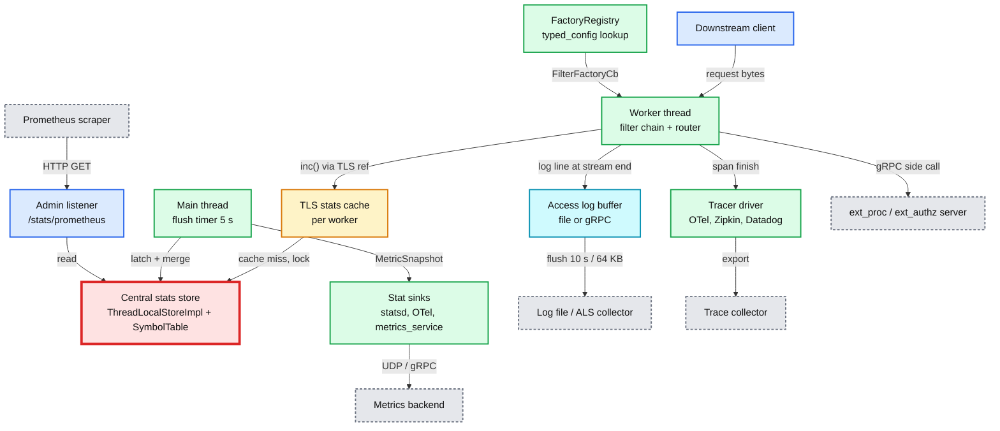

**What to notice**

- **The central stats store is the red node.** It is the thing that breaks first in this area: memory grows with clusters x stats. The golden value in the memory test is **47,086 bytes per cluster** ([stats_integration_test.cc:407](https://github.com/envoyproxy/envoy/blob/v1.39.1/test/integration/stats_integration_test.cc#L407)), so 10,000 clusters cost about 470 MB before any traffic, and every new stat name takes the single symbol-table mutex.
- **Workers never talk to sinks.** They increment through a thread-local reference. Only the main thread builds snapshots, so a slow statsd socket cannot stall request processing.
- **Two export models coexist.** Push (sinks on the flush timer) and pull (Prometheus scraping the admin listener). Both read the same store.
- **Access logs cross a buffer.** File logs go to a per-file flush thread. gRPC logs go to a per-worker batching buffer. Neither blocks the worker on I/O.
- **Every box that is an extension point** (sink, logger, tracer, filter) was built by a factory found in the registry by type URL.

---

## 3. Data flow

### 3.1 Incrementing a counter (the hot path)

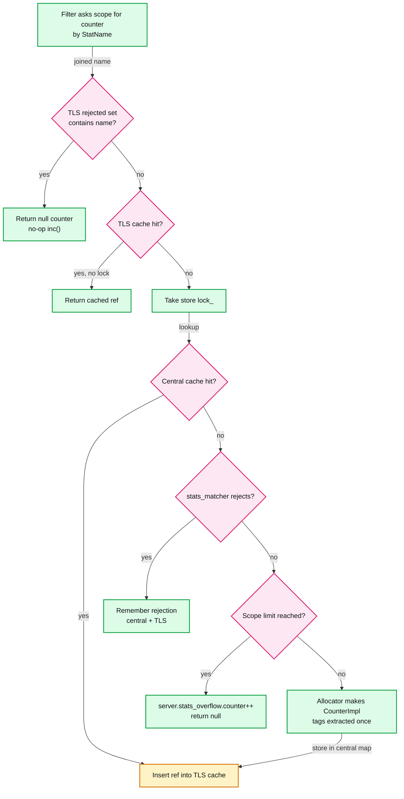

**What to notice**

- **Warm path takes no lock.** Two hash lookups in thread-local maps, then an atomic add. Code: `ThreadLocalStoreImpl::ScopeImpl::safeMakeStat` ([thread_local_store.cc:536-608](https://github.com/envoyproxy/envoy/blob/v1.39.1/source/common/stats/thread_local_store.cc#L536)).
- **Rejections are cached too.** A stat excluded by `stats_matcher` is remembered per thread in `rejected_stats_`, so the matcher (possibly a regex) runs once per name, not per increment ([thread_local_store.h:269-276](https://github.com/envoyproxy/envoy/blob/v1.39.1/source/common/stats/thread_local_store.h#L269)).
- **TLS maps hold references, not owners.** Destroying a scope does not trigger a storm of ref-count decrements under the allocator mutex ([thread_local_store.h:247-252](https://github.com/envoyproxy/envoy/blob/v1.39.1/source/common/stats/thread_local_store.h#L247)).
- **Most code never hits this path per request.** Hot components build their stat structs once (`MAKE_STAT_NAMES_STRUCT` at startup, `MAKE_STATS_STRUCT` on xDS updates) and hold direct references ([stats.md:189-203](https://github.com/envoyproxy/envoy/blob/v1.39.1/source/docs/stats.md#L189)).

### 3.2 Recording and merging a histogram

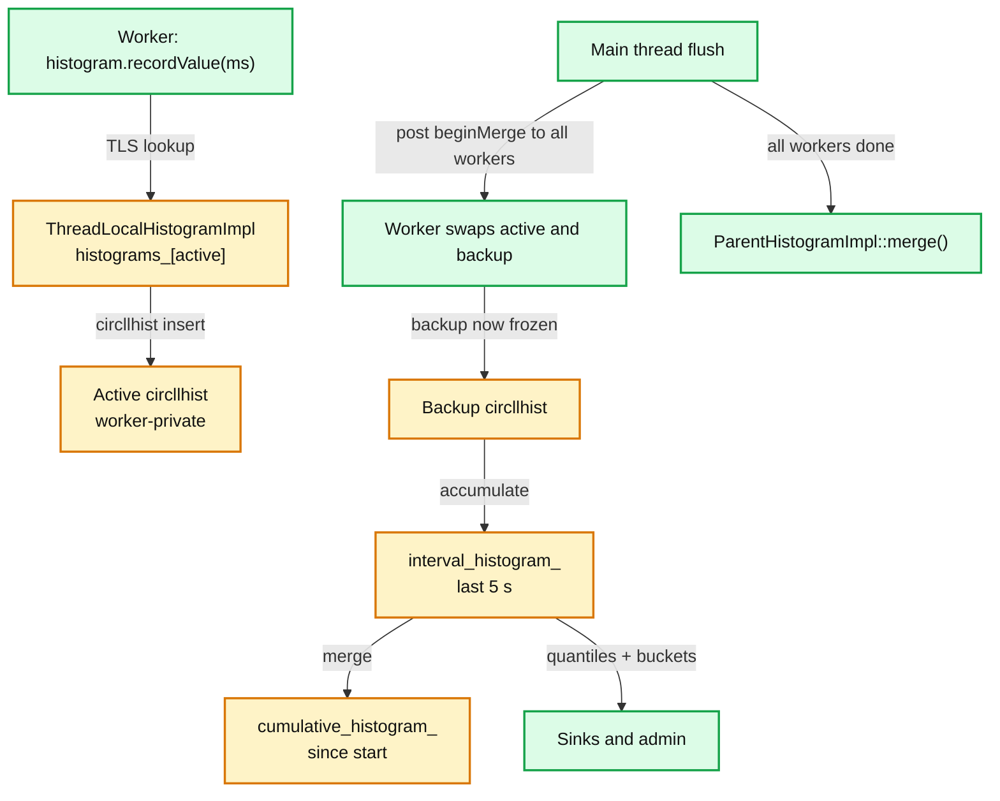

**What to notice**

- **Double buffering, not locking.** Each `ThreadLocalHistogramImpl` owns `histogram_t* histograms_[2]` ([thread_local_store.h:73](https://github.com/envoyproxy/envoy/blob/v1.39.1/source/common/stats/thread_local_store.h#L73)). The swap is posted to each worker, so the main thread reads a buffer no worker is writing.
- **Histograms are not carried across hot restart** and neither are text readouts ([stats.md:8-12](https://github.com/envoyproxy/envoy/blob/v1.39.1/source/docs/stats.md#L8)).
- **The merge is skipped until init completes.** `flushStatsImpl` only calls `mergeHistograms` when the init manager is `Initialized` ([server.cc:247-258](https://github.com/envoyproxy/envoy/blob/v1.39.1/source/server/server.cc#L247)).

### 3.3 Writing an access log line

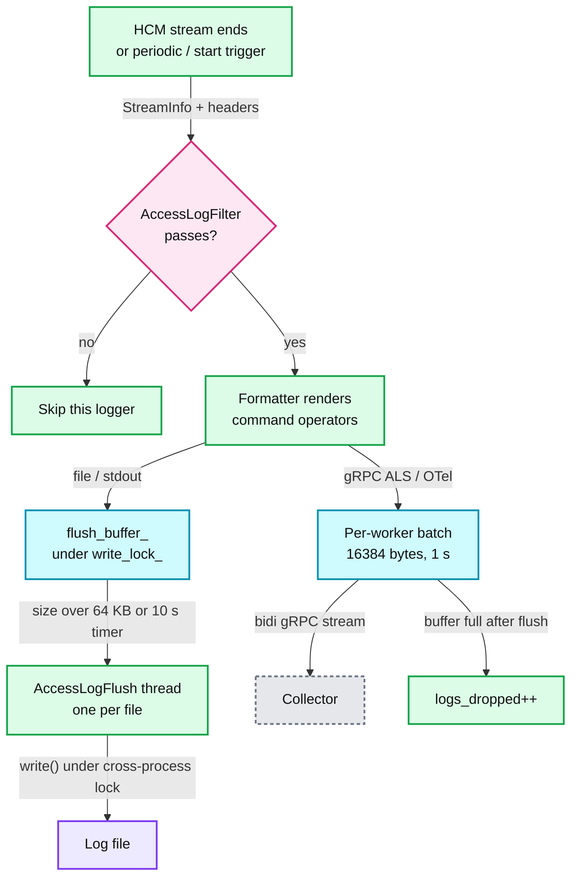

**What to notice**

- **File logging is lossless but unbounded.** `AccessLogFileImpl::write` appends to `flush_buffer_` and only signals the flush thread; there is no cap ([access_log_manager_impl.cc:212-225](https://github.com/envoyproxy/envoy/blob/v1.39.1/source/common/access_log/access_log_manager_impl.cc#L212)). A stalled disk grows `filesystem.write_total_buffered` in RAM **[inferred]**.
- **gRPC logging is bounded but lossy.** `canLogMore()` flushes once, then drops and counts `logs_dropped` ([grpc_access_logger.h:185-197](https://github.com/envoyproxy/envoy/blob/v1.39.1/source/extensions/access_loggers/common/grpc_access_logger.h#L185)).
- **All file writes share one cross-process mutex** (`file_lock_`), a TODO in the code notes only one flush thread can write at a time ([access_log_manager_impl.cc:104-131](https://github.com/envoyproxy/envoy/blob/v1.39.1/source/common/access_log/access_log_manager_impl.cc#L104)).

### 3.4 Loading an extension from config

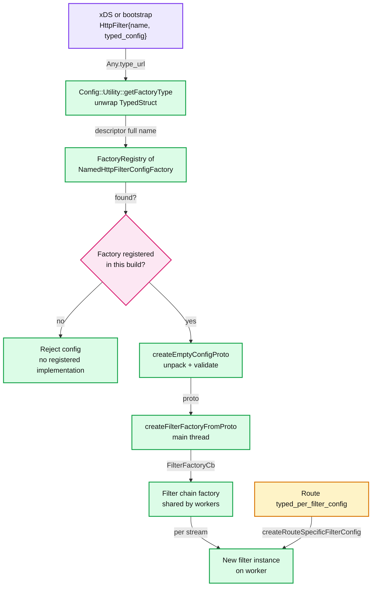

**What to notice**

- **Heavy work happens once on the main thread.** Parsing, validation, regex compilation and stat-name symbolization happen in `createFilterFactoryFromProto`. The per-stream callback only allocates the filter object.
- **A missing extension is a config error, not a runtime error.** If the build did not include the factory, the listener or route update is rejected at load time.

---

## 4. Sequences

### 4.1 The 5-second stats flush

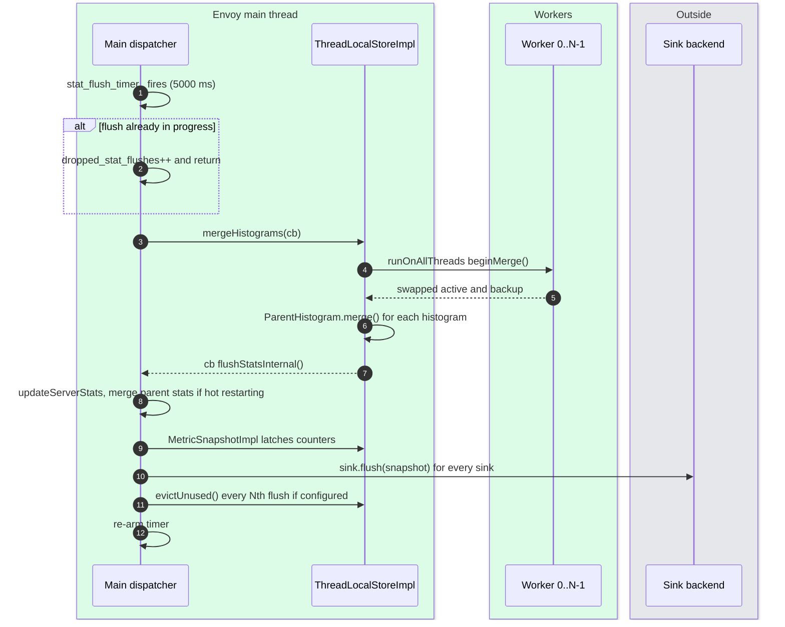

- **Latching is the contract.** The snapshot is created even with zero sinks, because hot restart relies on counters being latched periodically ([server.cc:224-235](https://github.com/envoyproxy/envoy/blob/v1.39.1/source/server/server.cc#L224)).
- **Overlap protection**: a second timer tick during a slow merge increments `server.dropped_stat_flushes` instead of queueing ([server.cc:238-244](https://github.com/envoyproxy/envoy/blob/v1.39.1/source/server/server.cc#L238)).

### 4.2 Trace decision and propagation across two Envoys

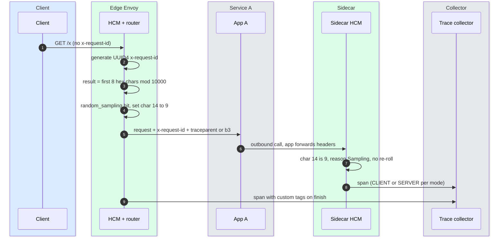

- **The decision is encoded in the UUID.** Character 14 (normally the version nibble `4`) becomes `9` sampled, `a` service-forced, `b` client-forced, `4` not traced ([uuid/config.h:50-65](https://github.com/envoyproxy/envoy/blob/v1.39.1/source/extensions/request_id/uuid/config.h#L50)).
- **Stable sampling fleet-wide.** The random roll uses `first 8 hex chars % 10000`, so every Envoy computes the same answer for the same request ID ([conn_manager_utility.cc:402-437](https://github.com/envoyproxy/envoy/blob/v1.39.1/source/common/http/conn_manager_utility.cc#L402)).

### 4.3 ext_proc: one bidirectional gRPC stream per HTTP request

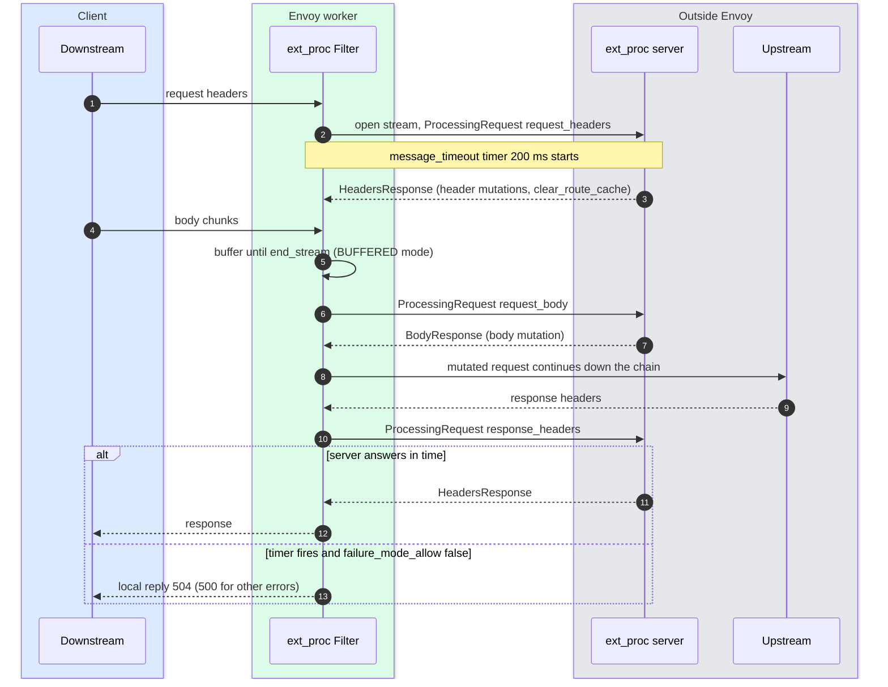

- **Stream per request, opened lazily** in `Filter::openStream()` on the first message ([ext_proc.cc:756-790](https://github.com/envoyproxy/envoy/blob/v1.39.1/source/extensions/filters/http/ext_proc/ext_proc.cc#L756)). Each enabled phase is one extra round trip on the critical path.
- **Default processing mode sends only request and response headers**; bodies are `NONE` and trailers `SKIP` ([processing_mode.proto:24-44](https://github.com/envoyproxy/envoy/blob/v1.39.1/api/envoy/extensions/filters/http/ext_proc/v3/processing_mode.proto#L24)).

### 4.4 Lua: a coroutine yields on httpCall

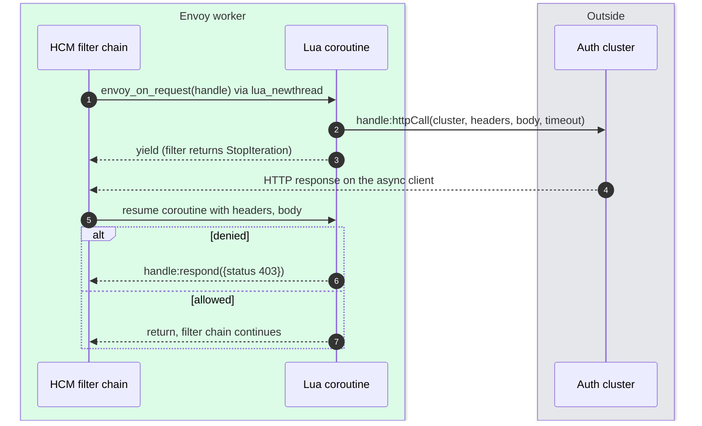

- The worker is never blocked. Envoy suspends the coroutine and resumes it on the async client callback ([lua.cc:48-75](https://github.com/envoyproxy/envoy/blob/v1.39.1/source/extensions/filters/common/lua/lua.cc#L48)).
- `respond()` is only valid in the request flow and only before headers were passed on ([lua_filter.rst:459-461](https://github.com/envoyproxy/envoy/blob/v1.39.1/docs/root/configuration/http/http_filters/lua_filter.rst#L459)).

---

## 5. State machines

### 5.1 ext_proc per-direction ProcessorState

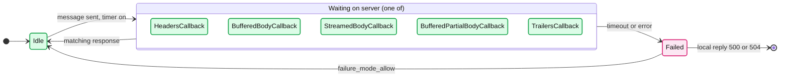

- Enum source: `ProcessorState::CallbackState` ([processor_state.h:71-85](https://github.com/envoyproxy/envoy/blob/v1.39.1/source/extensions/filters/http/ext_proc/processor_state.h#L71)).
- No message timer runs in observability mode, `FULL_DUPLEX_STREAMED` or `GRPC` body modes ([ext_proc.proto:208-217](https://github.com/envoyproxy/envoy/blob/v1.39.1/api/envoy/extensions/filters/http/ext_proc/v3/ext_proc.proto#L208)).

### 5.2 Wasm plugin and VM failure policy

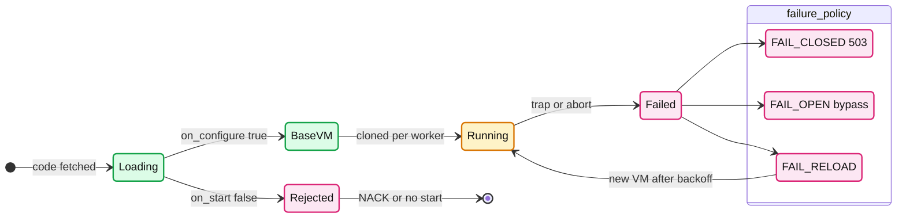

- Default is `FAIL_CLOSED` (all plugins on that VM return 503). `FAIL_RELOAD` only applies to `RuntimeError` and uses a 1 s base back-off ([wasm.proto:24-47](https://github.com/envoyproxy/envoy/blob/v1.39.1/api/envoy/extensions/wasm/v3/wasm.proto#L24)).
- A `false` from `on_start`/`on_configure` rejects the xDS update, or stops startup ([wasm.proto:177-183](https://github.com/envoyproxy/envoy/blob/v1.39.1/api/envoy/extensions/wasm/v3/wasm.proto#L177)).

### 5.3 A stats scope from creation to free

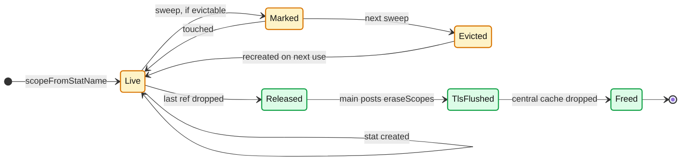

- Two-phase destroy: TLS caches are cleared on every worker before the central cache (which owns the stats) is released ([thread_local_store.cc:307-340](https://github.com/envoyproxy/envoy/blob/v1.39.1/source/common/stats/thread_local_store.cc#L307)). Deletions are batched: one post covers "tens of thousands of scopes", for example a VHDS (Virtual Host Discovery Service) update.
- Eviction needs `enable_eviction` on the scope and `stats_eviction_interval` in bootstrap, which must be a multiple of the flush interval ([scope.proto:31-36](https://github.com/envoyproxy/envoy/blob/v1.39.1/api/envoy/type/v3/scope.proto#L31), [bootstrap.proto:236-241](https://github.com/envoyproxy/envoy/blob/v1.39.1/api/envoy/config/bootstrap/v3/bootstrap.proto#L236)).

---

## 6. Component deep dives

### 6.1 Stat types and naming

- **Four types** ([stats.md:6-12](https://github.com/envoyproxy/envoy/blob/v1.39.1/source/docs/stats.md#L6)): counter (monotonic 64-bit), gauge (up/down 64-bit), histogram (distribution, not kept across hot restart), text readout (string, not kept across hot restart).
- **Gauges carry an import mode** (`Accumulate` or `NeverImport`) that decides whether the hot-restart child adds the parent's value.
- **Names are dot-joined tokens**: `cluster.<name>.upstream_rq_5xx`, `http.<stat_prefix>.downstream_rq_time`, `listener.<address>.downstream_cx_active`. The dynamic tokens become tags for tag-aware sinks.

### 6.2 SymbolTable and StatName: why they exist

- **Problem**: "roughly 100 stats per cluster" and thousands of clusters make flat string names "dominate Envoy memory usage" ([stats.md:124-130](https://github.com/envoyproxy/envoy/blob/v1.39.1/source/docs/stats.md#L124)).
- **Fix**: each dot-separated token maps to a `Symbol` (a `uint32_t`, [symbol_table.h:41](https://github.com/envoyproxy/envoy/blob/v1.39.1/source/common/stats/symbol_table.h#L41)). A `StatName` is a byte array of varint-encoded symbols, UTF-8 style: values under 128 take one byte ([symbol_table.h:78-92](https://github.com/envoyproxy/envoy/blob/v1.39.1/source/common/stats/symbol_table.h#L78)). A token is "typically 4 bytes or less" versus the full string ([stats.md:174](https://github.com/envoyproxy/envoy/blob/v1.39.1/source/docs/stats.md#L174)).
- **Symbols are ref-counted and recycled.** `encode_map_` stores symbol plus ref count, `decode_map_` stores the string once, and freed symbols go to a `pool_` stack ([symbol_table.h:501-518](https://github.com/envoyproxy/envoy/blob/v1.39.1/source/common/stats/symbol_table.h#L501)).
- **The cost is a mutex.** Encoding needs `lock_` ([symbol_table.h:447](https://github.com/envoyproxy/envoy/blob/v1.39.1/source/common/stats/symbol_table.h#L447)). So hot code symbolizes at startup and composes names with `SymbolTable::join()` without locks. `StatNameDynamicStorage` avoids the lock for request-derived tokens but loses sharing.
- **Debugging contention**: `/stats/recentlookups` shows the last lookups by name, and `server.stats_recent_lookups` counts them ([stats.md:196-207](https://github.com/envoyproxy/envoy/blob/v1.39.1/source/docs/stats.md#L196)). A rising value in steady state means someone is symbolizing on the hot path.

### 6.3 ThreadLocalStoreImpl, scopes and scope lifetime

- **Structure** ([thread_local_store.h:247-590](https://github.com/envoyproxy/envoy/blob/v1.39.1/source/common/stats/thread_local_store.h#L247)): each `ScopeImpl` owns a `CentralCacheEntry` (maps of `RefcountPtr` to counters, gauges, histograms, text readouts, plus rejected names). Each worker's `TlsCache` has `scope_cache_` keyed by a monotonically increasing scope ID, holding `TlsCacheEntry` reference maps.
- **Why an ID, not a pointer**: the allocator may recycle a freed scope's address immediately; an ID prevents a new scope from reading a stale TLS entry.
- **Scopes are owned by callers.** A cluster, listener or route config holds its `ScopeSharedPtr`. When xDS removes the cluster, its stats vanish after the two-phase destroy.
- **Overlapping scopes** with the same name point to the same backing stats; de-duplication happens only in the rare `counters()`/`gauges()` enumeration calls.

### 6.4 Tag extraction

- **What**: turns `cluster.foo.upstream_rq_503` into the tag-extracted name `cluster.upstream_rq` plus tags `envoy.cluster_name=foo` and `envoy.response_code=503`. The regex capture is removed from the name, the inner group becomes the value. Only tag-aware sinks (Prometheus, dog_statsd, OTel, metrics_service) use the tags.
- **Defaults**: 49 default extractors registered in `TagNameValues::TagNameValues()` (`well_known_names.cc`). Examples: `envoy.cluster_name` via the token pattern `cluster.$.**` ([well_known_names.cc:149](https://github.com/envoyproxy/envoy/blob/v1.39.1/source/common/config/well_known_names.cc#L149)), `envoy.response_code` via regex `_rq(_(\d{3}))$` ([:68](https://github.com/envoyproxy/envoy/blob/v1.39.1/source/common/config/well_known_names.cc#L68)), plus `envoy.http_conn_manager_prefix`, `envoy.listener_address`, `envoy.virtual_host`, `envoy.route`, `envoy.worker_id`, `envoy.response_code_class` ([well_known_names.h:91-183](https://github.com/envoyproxy/envoy/blob/v1.39.1/source/common/config/well_known_names.h#L91)).
- **Speed**: `TagExtractorTokensImpl` matches dot tokens with `*`, `**` and `$` instead of a regex, and regex extractors carry a substring pre-check so most names skip the regex ([tag_extractor_impl.h:57-180](https://github.com/envoyproxy/envoy/blob/v1.39.1/source/common/stats/tag_extractor_impl.h#L57)).
- **Knobs**: `use_all_default_tags` (default true), custom `stats_tags`, and new `allow_default_tag_overrides` (default false) so a custom `envoy.cluster_name` can win over the default ([stats.proto:59-120](https://github.com/envoyproxy/envoy/blob/v1.39.1/api/envoy/config/metrics/v3/stats.proto#L59)). A universal `--stats-tag tag:value` CLI flag adds a fixed tag to every stat ([options_impl.cc:181-187](https://github.com/envoyproxy/envoy/blob/v1.39.1/source/server/options_impl.cc#L181)).

### 6.5 Cutting memory: stats_matcher, scope limits, eviction

- **`stats_matcher`**: `reject_all`, `exclusion_list` or `inclusion_list` of string matchers; prefix or suffix matchers are recommended over regex ([stats.proto:124-210](https://github.com/envoyproxy/envoy/blob/v1.39.1/api/envoy/config/metrics/v3/stats.proto#L124)). Rejected stats become null stats: no memory, no-op increments. Warning in the proto: excluding stats "may affect Envoy's behavior in undocumented ways".
- **Scope limits**: `envoy.type.v3.Scope` has `max_counters`, `max_gauges`, `max_histograms` and `enable_eviction` ([scope.proto:22-36](https://github.com/envoyproxy/envoy/blob/v1.39.1/api/envoy/type/v3/scope.proto#L22)), used today by the stats access logger. Over the limit, creation returns a null stat and bumps `server.stats_overflow.counter` / `.gauge` / `.histogram`.
- **Route stats** cost "approximately 1KiB per route" ([route_components.proto:398-403](https://github.com/envoyproxy/envoy/blob/v1.39.1/api/envoy/config/route/v3/route_components.proto#L398)). Router `dynamic_stats` (per-code cluster stats) defaults true ([router.proto:48-50](https://github.com/envoyproxy/envoy/blob/v1.39.1/api/envoy/extensions/filters/http/router/v3/router.proto#L48)).
- **Deferred creation**: `deferred_stat_options.enable_deferred_creation_stats` builds a stats struct only on first access ([stats.md:306-311](https://github.com/envoyproxy/envoy/blob/v1.39.1/source/docs/stats.md#L306)).

### 6.6 Histograms

- **Implementation**: `circllhist` (a log-linear histogram library), one per worker per histogram, merged at flush ([histogram_impl.h:15-42](https://github.com/envoyproxy/envoy/blob/v1.39.1/source/common/stats/histogram_impl.h#L15)). Initial bins per thread-local histogram default 100 ([stats.proto:314-315](https://github.com/envoyproxy/envoy/blob/v1.39.1/api/envoy/config/metrics/v3/stats.proto#L314)).
- **Default buckets** (milliseconds for timers): `0.5, 1, 5, 10, 25, 50, 100, 250, 500, 1000, 2500, 5000, 10000, 30000, 60000, 300000, 600000, 1800000, 3600000` ([histogram_impl.cc:138-141](https://github.com/envoyproxy/envoy/blob/v1.39.1/source/common/stats/histogram_impl.cc#L138)). Override per stat with `histogram_bucket_settings` (first match wins).
- **Quantiles computed**: P0, P25, P50, P75, P90, P95, P99, P99.5, P99.9, P100 ([histogram_impl.cc:29-31](https://github.com/envoyproxy/envoy/blob/v1.39.1/source/common/stats/histogram_impl.cc#L29)).
- **Interval vs cumulative**: sinks get both; the interval covers the last flush period (5 s).

### 6.7 Sinks and Prometheus

- **Sinks in v1.39.1** ([extensions_build_config.bzl:312-319](https://github.com/envoyproxy/envoy/blob/v1.39.1/source/extensions/extensions_build_config.bzl#L312)): `statsd` (no tags), `dog_statsd` (tags), `graphite_statsd`, `hystrix` (adds `/hystrix_event_stream` admin handler), `metrics_service` (gRPC), `open_telemetry` (OTLP), `wasm`, `dynamic_modules`.
- **Prometheus is pull via admin**, not a sink: `/stats/prometheus` renders tag-extracted names with an `envoy_` prefix and tags as labels ([prometheus_stats.cc:963](https://github.com/envoyproxy/envoy/blob/v1.39.1/source/server/admin/prometheus_stats.cc#L963)). Text format by default; protobuf with native histograms (up to 20 buckets by default) is chosen by the `Accept` header or `prom_protobuf` ([prometheus_stats.cc:266](https://github.com/envoyproxy/envoy/blob/v1.39.1/source/server/admin/prometheus_stats.cc#L266), [:857-890](https://github.com/envoyproxy/envoy/blob/v1.39.1/source/server/admin/prometheus_stats.cc#L857)). `usedonly` skips never-written stats.
- **Flush interval**: 5000 ms default, range 1 ms to 5 min, or `stats_flush_on_admin` to flush only on admin reads ([bootstrap.proto:215-234](https://github.com/envoyproxy/envoy/blob/v1.39.1/api/envoy/config/bootstrap/v3/bootstrap.proto#L215)).

### 6.8 Admin interface

Endpoint table from `AdminImpl::AdminImpl` ([admin.cc:128-280](https://github.com/envoyproxy/envoy/blob/v1.39.1/source/server/admin/admin.cc#L128)). "Mutates" = registered with `mutates_state = true`, which forces POST.

| Endpoint | Mutates | Use |
|---|---|---|
| `/config_dump` (`resource`, `mask`, `name_regex`, `include_eds`) | no | Full effective config as JSON protos. `?resource=dynamic_active_clusters&mask=cluster.name` lists names only |
| `/clusters` (`filter`, `format=json`) | no | Per-host health flags, circuit breaker thresholds, host stats |
| `/listeners`, `/server_info`, `/ready`, `/certs`, `/memory`, `/memory/tcmalloc`, `/hot_restart_version` | no | Identity, state (`/ready` 200 only when `LIVE`), cert expiry, allocator |
| `/init_dump` (`mask`) | no | Unready init targets: what a stuck startup waits on |
| `/stats` (`filter`, `usedonly`, `type`, `histogram_buckets`, `format`), `/stats/prometheus`, `/stats/recentlookups` | no | Metrics |
| `/runtime` | no | Runtime layers and values |
| `/contention`, `/heap_dump`, `/peak_heap_dump` | no | Mutex contention, tcmalloc heap profiles |
| `/runtime_modify` | **yes** | Change runtime keys (feature flags, sampling) live |
| `/logging` | **yes** | Change log levels per logger or glob |
| `/healthcheck/fail`, `/healthcheck/ok` | **yes** | Fail inbound health checks, starts drain close on DEFAULT listeners |
| `/drain_listeners` (`graceful`, `skip_exit`, `inboundonly`) | **yes** | Stop or gracefully drain listeners |
| `/quitquitquit` | **yes** | Shut down the server |
| `/reset_counters` | **yes** | Zero counters (local view only) |
| `/cpuprofiler`, `/heapprofiler`, `/allocprofiler` | **yes** | Start profilers writing to `profile_path` |
| `/reopen_logs`, `/stats/recentlookups/{clear,enable,disable}` | **yes** | Log rotation, lookup tracing |
| `/tap` (added by the tap extension) | **yes** | Stream matched traffic out |

- **Why admin must never be exposed**: it can shut the server down, drain it, flip runtime flags, and it leaks cluster names, stats and cert details. The docs require localhost or a secure network, and warn about CSRF (cross-site request forgery) from browsers on that network ([admin.rst:13-36](https://github.com/envoyproxy/envoy/blob/v1.39.1/docs/root/operations/admin.rst#L13)).
- **Defences in the code**: `allow_paths` returns 403 for non-listed paths ([admin.cc:413-418](https://github.com/envoyproxy/envoy/blob/v1.39.1/source/server/admin/admin.cc#L413), [bootstrap.proto:498](https://github.com/envoyproxy/envoy/blob/v1.39.1/api/envoy/config/bootstrap/v3/bootstrap.proto#L498)), and POST-only mutations. `config_dump` redacts `private_key` and `password` only in typed protos.

### 6.9 Access logging

- **Loggers in v1.39.1** ([extensions_build_config.bzl:7-18](https://github.com/envoyproxy/envoy/blob/v1.39.1/source/extensions/extensions_build_config.bzl#L7)): `file`, `stdout`, `stderr`, `http_grpc` and `tcp_grpc` (ALS, Access Log Service), `open_telemetry` (OTLP logs), `fluentd`, `wasm`, `dynamic_modules`, and `stats` (turns log events into stats). Extension filters: `cel`, `process_ratelimit`.
- **File path**: `--file-flush-interval-msec` 10000 ms and `--file-flush-min-size-kb` 64 KB ([options_impl.cc:143-148](https://github.com/envoyproxy/envoy/blob/v1.39.1/source/server/options_impl.cc#L143)). One `AccessLogFlush` thread per file, created lazily ([access_log_manager_impl.cc:227-230](https://github.com/envoyproxy/envoy/blob/v1.39.1/source/common/access_log/access_log_manager_impl.cc#L227)). Stats under `filesystem.`: `write_buffered`, `write_completed`, `write_failed`, `flushed_by_timer`, `reopen_failed`, gauge `write_total_buffered`.
- **gRPC ALS**: per-worker logger, `buffer_flush_interval` 1 s, `buffer_size_bytes` 16384 ([als.proto:79-86](https://github.com/envoyproxy/envoy/blob/v1.39.1/api/envoy/extensions/access_loggers/grpc/v3/als.proto#L79)); stats `access_logs.grpc_access_log.logs_written` / `logs_dropped`.
- **When a line is written**: by default at the end of each HTTP stream, TCP connection or UDP session. Optional extra records: `HcmAccessLogOptions.access_log_flush_interval` (periodic), `flush_access_log_on_new_request` (before filters run), `flush_log_on_tunnel_successfully_established` ([http_connection_manager.proto:455-475](https://github.com/envoyproxy/envoy/blob/v1.39.1/api/envoy/extensions/filters/network/http_connection_manager/v3/http_connection_manager.proto#L455)); router `flush_upstream_log_on_upstream_stream` (one per retry attempt); tcp_proxy `flush_access_log_on_connected`. Each record carries an `AccessLogType` such as `DownstreamStart`, `DownstreamPeriodic`, `DownstreamEnd`, `UpstreamPoolReady`, `TcpUpstreamConnected` ([accesslog.proto:36-50](https://github.com/envoyproxy/envoy/blob/v1.39.1/api/envoy/data/accesslog/v3/accesslog.proto#L36)).
- **Filters** ([accesslog.proto:48-93](https://github.com/envoyproxy/envoy/blob/v1.39.1/api/envoy/config/accesslog/v3/accesslog.proto#L48)): status code, duration, not-health-check, traceable, runtime (sampling), and/or, header, response flag, gRPC status, metadata, log type, extension. A `runtime_filter` at 1% is the standard way to sample high-volume logs.
- **Command operators that matter in incidents** ([substitution_formatter.rst](https://github.com/envoyproxy/envoy/blob/v1.39.1/docs/root/configuration/advanced/substitution_formatter.rst)):

| Operator | Tells you |
|---|---|
| `%RESPONSE_FLAGS%` / `%RESPONSE_FLAGS_LONG%` | Why Envoy, not the app, shaped the response: `UH`, `UF`, `UO`, `NR`, `URX`, `UT`, `DC`, `LR`, `UR`, `UC`, `RL`, `UAEX`, `DPE`, `UPE`, `SI`, `OM`, `DF`, `DO` (line 489) |
| `%RESPONSE_CODE_DETAILS%` | Exact code path: `route_not_found`, `no_healthy_upstream`, `upstream_reset_before_response_started{...}`, `via_upstream` (line 173) |
| `%UPSTREAM_TRANSPORT_FAILURE_REASON%` | TLS handshake failure text for upstream connects (line 660) |
| `%CONNECTION_TERMINATION_DETAILS%` | Why Envoy closed the connection (line 184) |
| `%UPSTREAM_HOST%`, `%UPSTREAM_CLUSTER%`, `%ROUTE_NAME%` | Where it went |
| `%DURATION%`, `%REQUEST_DURATION%`, `%RESPONSE_DURATION%`, `%UPSTREAM_REQUEST_ATTEMPT_COUNT%` | Where the time went and how many tries |

- **Default format** now uses `%REQUEST_HEADER(...)%`; `%REQ(...)%` remains an alias ([usage.rst:43-50](https://github.com/envoyproxy/envoy/blob/v1.39.1/docs/root/configuration/observability/access_log/usage.rst#L43)).

### 6.10 Tracing

- **Drivers present** ([extensions_build_config.bzl:334-340](https://github.com/envoyproxy/envoy/blob/v1.39.1/source/extensions/extensions_build_config.bzl#L334)): `opentelemetry` (gRPC and HTTP exporters, samplers `always_on`, `parent_based`, `trace_id_ratio_based`, `cel`, `dynatrace`), `zipkin` (B3, optional W3C), `datadog`, `skywalking`, `xray`, `fluentd`, `dynamic_modules`.
- **Sampling knobs** on `HttpConnectionManager.Tracing`: `client_sampling` (honour `x-client-trace-id`), `random_sampling`, `overall_sampling` (cap applied last). All default 100% ([http_connection_manager.proto:174-197](https://github.com/envoyproxy/envoy/blob/v1.39.1/api/envoy/extensions/filters/network/http_connection_manager/v3/http_connection_manager.proto#L174)). Per-route overrides exist. Runtime keys `tracing.client_enabled`, `tracing.random_sampling`, `tracing.global_enabled` override config ([conn_manager_utility.cc:426-446](https://github.com/envoyproxy/envoy/blob/v1.39.1/source/common/http/conn_manager_utility.cc#L426)).
- **Order**: existing trace reason in the UUID wins; else client header, else `x-envoy-force-trace`, else random roll; then overall cap. `use_request_id_for_trace_sampling=false` hands the decision to the tracer's own sampler.
- **Spans**: one span per HCM stream by default. `spawn_upstream_span=true` adds a CLIENT span for the upstream request so Envoy is its own hop ([http_connection_manager.proto:215-234](https://github.com/envoyproxy/envoy/blob/v1.39.1/api/envoy/extensions/filters/network/http_connection_manager/v3/http_connection_manager.proto#L215)). `custom_tags` pull from literals, env, headers or metadata; `max_path_tag_length` 256.
- **Propagation is the app's job**: the service must copy `x-request-id` plus `traceparent`/`tracestate`, B3, `x-datadog-*`, `sw8` or `x-amzn-trace-id` from inbound to outbound calls ([tracing.rst:41-120](https://github.com/envoyproxy/envoy/blob/v1.39.1/docs/root/intro/arch_overview/observability/tracing.rst#L41)).

### 6.11 The extension model

- **`Registry::FactoryRegistry<Base>`**: a static map from name to factory per base class, plus a lazily built map by config type (`factoriesByType`) ([registry.h:166-232](https://github.com/envoyproxy/envoy/blob/v1.39.1/envoy/registry/registry.h#L166)). Not thread safe by design: registration happens in static initializers.
- **`REGISTER_FACTORY(FACTORY, BASE)`** instantiates a static `RegisterFactory<FACTORY, BASE>` ([registry.h:623-629](https://github.com/envoyproxy/envoy/blob/v1.39.1/envoy/registry/registry.h#L623)). `--disable-extensions` can turn factories off at startup.
- **Factory interfaces** ([filter_config.h](https://github.com/envoyproxy/envoy/blob/v1.39.1/envoy/server/filter_config.h)): `NamedHttpFilterConfigFactory` (category `envoy.filters.http`, line 310), `UpstreamHttpFilterConfigFactory` (line 371), `NamedNetworkFilterConfigFactory` (`envoy.filters.network`, line 169), `NamedListenerFilterConfigFactory` (`envoy.filters.listener`, line 34), UDP and QUIC listener variants. All extend `Config::TypedFactory` with `category()` and `configTypes()`.
- **Per-route config**: `createRouteSpecificFilterConfig` parses `typed_per_filter_config` on a virtual host, route or weighted cluster ([filter_config.h:260](https://github.com/envoyproxy/envoy/blob/v1.39.1/envoy/server/filter_config.h#L260)).
- **Build-time selection**: `source/extensions/extensions_build_config.bzl` maps about 330 extension names to Bazel targets; `contrib/contrib_build_config.bzl` lists 39 more that only the `envoy-contrib` image includes (Golang, Kafka, MySQL, Postgres, SIP, Hyperscan, QAT, and others). Each extension declares `security_posture` and `status` in `extensions_metadata.yaml`.

### 6.12 Lua filter

- **Runtime**: LuaJIT (Lua 5.1 plus some 5.2) ([lua_filter.rst:9-12](https://github.com/envoyproxy/envoy/blob/v1.39.1/docs/root/configuration/http/http_filters/lua_filter.rst#L9)).
- **Per-worker state**: `ThreadLocalState` stores one `lua_State` per worker in a TLS slot; the script is loaded on every worker ([lua.cc:83-110](https://github.com/envoyproxy/envoy/blob/v1.39.1/source/extensions/filters/common/lua/lua.cc#L83)). No true global data across workers.
- **Coroutine per request**: `lua_newthread` per stream ([lua.cc:125](https://github.com/envoyproxy/envoy/blob/v1.39.1/source/extensions/filters/common/lua/lua.cc#L125)); async calls yield.
- **API surface**: `headers()`, `body()`, `bodyChunks()`, `trailers()`, `httpCall()`, `respond()`, `metadata()`, `streamInfo()`, `connection()`, `setUpstreamOverrideHost()`, `clearRouteCache()`, `filterContext()`, `importPublicKey()`, `verifySignature()`, `base64Escape()`, `timestamp()`, `virtualHost()`, `route()`, `stats()`.
- **What it cannot do** **[documented]**: blocking I/O (the docs say never), share state across workers, open arbitrary sockets (only `httpCall` to a configured cluster), or respond once headers moved on. Status `stable`, posture `robust_to_untrusted_downstream` ([extensions_metadata.yaml:660-666](https://github.com/envoyproxy/envoy/blob/v1.39.1/source/extensions/extensions_metadata.yaml#L660)).

### 6.13 Wasm (proxy-wasm)

- **ABI**: Proxy-Wasm, version 0.2.1 recommended ([wasm.rst:6-9](https://github.com/envoyproxy/envoy/blob/v1.39.1/docs/root/intro/arch_overview/advanced/wasm.rst#L6)). Extension points: HTTP filter, network filter, stats sink, access logger, background service.
- **Runtimes in tree**: `null` (plugin compiled into Envoy), `v8`, `wamr`, `wasmtime`; default search order v8 then wasmtime then wamr, and the proto says WAMR and Wasmtime are "not enabled in the official build" ([wasm.proto:83-108](https://github.com/envoyproxy/envoy/blob/v1.39.1/api/envoy/extensions/wasm/v3/wasm.proto#L83)).
- **VM vs plugin**: a VM is one instance per (`vm_id`, code hash); a plugin (`root_id`) is a context inside it. Loaded on the main thread, then **cloned to each worker**, so N workers means N VM heaps ([wasm.rst:40-58](https://github.com/envoyproxy/envoy/blob/v1.39.1/docs/root/intro/arch_overview/advanced/wasm.rst#L40)). A `WasmService` with `singleton: true` runs one VM on the main thread and cannot be a filter ([wasm.proto:204-210](https://github.com/envoyproxy/envoy/blob/v1.39.1/api/envoy/extensions/wasm/v3/wasm.proto#L204)).
- **Shared data and shared queues** come from the Proxy-Wasm host library Envoy links (`context.h` imports `proxy_wasm::SharedQueueEnqueueToken`). They let per-worker VMs share key-value state and hand work to a singleton service **[documented at the ABI level; semantics beyond that unverified in this tree]**.
- **Failure handling**: `failure_policy` (5.2). `capability_restriction_config` allow-lists ABI calls; `allow_precompiled` is marked trusted-only.
- **Posture and status**: HTTP filter and runtimes are `alpha` with security posture `unknown` ([extensions_metadata.yaml:783-789](https://github.com/envoyproxy/envoy/blob/v1.39.1/source/extensions/extensions_metadata.yaml#L783)). Treat Wasm as a sandbox for crashes, not a security boundary for hostile code **[inferred]**.

### 6.14 ext_proc (external processing)

- **Protocol**: bidirectional gRPC stream per HTTP request, `ProcessingRequest` out, `ProcessingResponse` back (4.3). An `http_service` option exists but only for headers.
- **Processing mode per phase** ([processing_mode.proto:67-169](https://github.com/envoyproxy/envoy/blob/v1.39.1/api/envoy/extensions/filters/http/ext_proc/v3/processing_mode.proto#L67)): header and trailer modes `DEFAULT`/`SEND`/`SKIP`. Body modes `NONE` (default), `STREAMED`, `BUFFERED` (error if over buffer limit), `BUFFERED_PARTIAL` (send up to limit), `FULL_DUPLEX_STREAMED` (server streams mutated chunks back), `GRPC` (per gRPC message, not implemented and hidden).
- **Defaults**: `message_timeout` 200 ms ([ext_proc.proto:217](https://github.com/envoyproxy/envoy/blob/v1.39.1/api/envoy/extensions/filters/http/ext_proc/v3/ext_proc.proto#L217), applied in [config.h:24](https://github.com/envoyproxy/envoy/blob/v1.39.1/source/extensions/filters/http/ext_proc/config.h#L24)); `max_message_timeout` 0 disables server overrides; `failure_mode_allow` false (504 on timeout, 500 otherwise, [ext_proc.proto:170-186](https://github.com/envoyproxy/envoy/blob/v1.39.1/api/envoy/extensions/filters/http/ext_proc/v3/ext_proc.proto#L170)); `status_on_error` 500; `deferred_close_timeout` 5000 ms.
- **Mutation rules**: without `mutation_rules`, the server may change any header except `host`, `:authority`, `:scheme`, `:method` and `x-envoy-*` ([ext_proc.proto:226-237](https://github.com/envoyproxy/envoy/blob/v1.39.1/api/envoy/extensions/filters/http/ext_proc/v3/ext_proc.proto#L226)). Changing `:authority` does not re-route unless the route cache is cleared, which the proto flags as security-sensitive when RBAC runs earlier.
- **Observability mode**: "send and go", no pause, no timeout, responses ignored, only `STREAMED`/`GRPC`/`NONE` bodies ([ext_proc.proto:274-288](https://github.com/envoyproxy/envoy/blob/v1.39.1/api/envoy/extensions/filters/http/ext_proc/v3/ext_proc.proto#L274)). Good for traffic mirroring to an analyser without adding latency.
- **Status**: `stable`, posture `robust_to_untrusted_downstream_and_upstream` ([extensions_metadata.yaml:514-520](https://github.com/envoyproxy/envoy/blob/v1.39.1/source/extensions/extensions_metadata.yaml#L514)).

### 6.15 Golang filter

- **Contrib only**: `envoy.filters.http.golang`, plus network, cluster specifier and TCP upstream variants ([contrib_build_config.bzl:15](https://github.com/envoyproxy/envoy/blob/v1.39.1/contrib/contrib_build_config.bzl#L15)). Not in the default Envoy image.
- **Mechanism**: a Go plugin built with `-buildmode=c-shared` is `dlopen`ed (`contrib/golang/common/dso/dso.cc`) and called through cgo, with the Go runtime and its garbage collector living inside the Envoy process.
- **Compatibility**: the plugin API is not stable, so build with the same Envoy version and a Go toolchain matching Envoy's glibc ([golang_filter.rst:18-35](https://github.com/envoyproxy/envoy/blob/v1.39.1/docs/root/configuration/http/http_filters/golang_filter.rst#L18)). Status `alpha`, posture `requires_trusted_downstream_and_upstream` ([contrib/extensions_metadata.yaml:11-15](https://github.com/envoyproxy/envoy/blob/v1.39.1/contrib/extensions_metadata.yaml#L11)).
- **Overlap** **[inferred]**: the dynamic modules Go SDK (6.16) now offers Go in the core build, which removes the main reason to run a contrib image just for Go.

### 6.16 Dynamic modules (summary; depth in report 11)

- **What**: shared libraries that implement a pure C ABI (`abi.h`), loaded with `dlopen` from `${ENVOY_DYNAMIC_MODULES_SEARCH_PATH}/lib${name}.so`. SDKs ship in tree for C++, Go and Rust ([dynamic_modules.rst](https://github.com/envoyproxy/envoy/blob/v1.39.1/docs/root/intro/arch_overview/advanced/dynamic_modules.rst)). Started by Takeshi Yoneda (@mathetake) in August 2024; the HTTP filter was promoted to GA in PR #44420 (2026-04-13).
- **Where it sits**: native speed without a custom build. It reads headers and bodies without copying, which Lua, Wasm and ext_proc all do, but it has **no isolation**: a module is "fully trusted" and shares Envoy's address space.
- **Compatibility**: ABI `v0.1.0` ([abi.h:47](https://github.com/envoyproxy/envoy/blob/v1.39.1/source/extensions/dynamic_modules/abi/abi.h#L47)); a module built for X.Y is guaranteed on X.Y and X.(Y+1) only, and a mismatch merely logs a warning ([dynamic_modules.cc:81-87](https://github.com/envoyproxy/envoy/blob/v1.39.1/source/extensions/dynamic_modules/dynamic_modules.cc#L81)).
- The 16 extension points, SDK details, FFI safety and lifecycle are in [report 11](envoy-11-dynamic-modules.md).

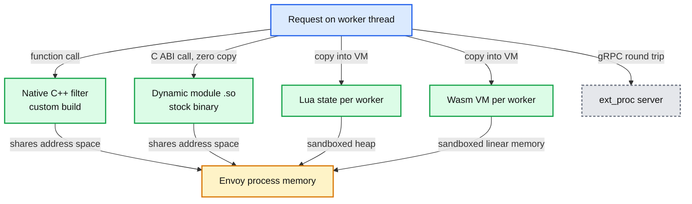

### 6.17 Composite filter and the matcher API

- **Matcher API** (`xds.type.matcher.v3.Matcher`): a tree of inputs (request headers, query params, dynamic metadata, source IP, SNI, SAN) and matchers with sublinear algorithms such as exact-map and prefix-map, instead of linear route lists ([matching_api.rst:6-12](https://github.com/envoyproxy/envoy/blob/v1.39.1/docs/root/intro/arch_overview/advanced/matching/matching_api.rst#L6)).
- **`ExtensionWithMatcher`** wraps any filter with an `xds_matcher`; the old `matcher` field is deprecated ([extension_matcher.proto:25-36](https://github.com/envoyproxy/envoy/blob/v1.39.1/api/envoy/extensions/common/matching/v3/extension_matcher.proto#L25)).
- **Composite filter**: the matcher's action (`ExecuteFilterAction`) instantiates a delegate filter or filter chain per request. It avoids "route table explosion" when choosing among many filter configs. It does not buffer, so the decision must use request headers to see the whole body. Failures count `<stat_prefix>.composite.delegation_error` ([composite_filter.rst:9-22](https://github.com/envoyproxy/envoy/blob/v1.39.1/docs/root/configuration/http/http_filters/composite_filter.rst#L9)).

### 6.18 Choosing an extension mechanism

| Mechanism | Added latency per request | Isolation | Language | Deployment | Failure blast radius |
|---|---|---|---|---|---|
| Native C++ filter | Lowest, in-line function calls **[inferred]** | None | C++ | Custom Envoy build | Crash takes the process |
| Dynamic module | Near native, zero-copy header/body access **[documented]** | None, fully trusted | C, C++, Go, Rust | `.so` beside a stock binary, rebuild every 1 to 2 releases | Crash takes the process; Rust SDK contains panics |
| Lua | Low; interpreter plus copies **[inferred]** | Lua VM per worker | Lua 5.1 | Inline in config, RDS-deliverable | Script error fails that request (`errors` stat) |
| Wasm | Moderate; copies across VM boundary **[inferred]** | Sandbox for memory faults | Rust, C++, Go (TinyGo), AssemblyScript **[unverified]** | `.wasm` via config or remote fetch | VM failure: 503 for all plugins on it by default |
| ext_proc | One gRPC round trip per enabled phase, 200 ms timeout | Separate process | Any gRPC language | Separate service to run and scale | Timeout or outage: 504/500 unless `failure_mode_allow` |
| ext_authz | One round trip, 200 ms default timeout | Separate process | Any | Separate service | Outage: 403 unless `failure_mode_allow` |

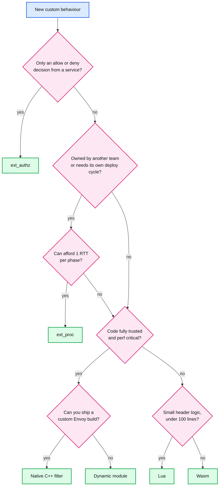

- The "under 100 lines" threshold is a rule of thumb **[inferred]**; the Lua docs say complex or high-performance cases belong in native code.

---

## 7. Failure modes

| Failure | What you see | Blast radius | Mitigation |
|---|---|---|---|
| Stats cardinality explosion (per-route prefixes, 10k clusters, dynamic tokens) | `server.memory_allocated` climbs with config size; Prometheus scrapes time out | Whole Envoy, eventually OOM (out of memory) kill | `stats_matcher` exclusions, drop `route.stat_prefix`, scope limits, `usedonly` scrapes |
| Symbolization on the hot path | `server.stats_recent_lookups` rising in steady state; symbol-table mutex contention | All workers | Pre-symbolize with `StatNamePool`/`MAKE_STAT_NAMES_STRUCT` |
| Stats flush slower than 5 s | `server.dropped_stat_flushes` increments | Sinks miss intervals | Fewer stats, longer `stats_flush_interval` |
| Disk stall under file access logs | `filesystem.write_total_buffered` grows, `write_failed` if disk full | Memory of whole process | Log to stdout for a collector, sample with `runtime_filter` |
| ALS collector slow or down | `access_logs.grpc_access_log.logs_dropped` | Lost logs only | Size `buffer_size_bytes`, scale collector |
| Admin exposed on a public interface | Anyone can POST `/quitquitquit` or `/runtime_modify` | Full outage, config leak | Bind to 127.0.0.1, `allow_paths`, network policy |
| ext_proc server slow | 504 with `message_timeout` expiry, filter stats `<stat_prefix>.ext_proc.*` errors | Every request through that filter | `failure_mode_allow`, observability mode, timeout budget |
| Wasm VM trap | 503 for all plugins on that VM (`FAIL_CLOSED`) | Every request on that worker's VM | `FAIL_RELOAD`, or `FAIL_OPEN` for optional plugins |
| Dynamic module ABI mismatch after upgrade | Warning "ABI version ... is deprecated", possible crash | Process | Rebuild modules with the matching SDK every release |
| 100% trace sampling left on | Collector overload, CPU on span export | Tracing backend, some Envoy CPU | Set `random_sampling` and `overall_sampling` explicitly |

---

## 8. Scalability and performance

- **What breaks first: stats memory.** Per cluster, 47,086 bytes (cluster object plus its roughly 100 stats) and the CI bound 47,500 ([stats_integration_test.cc:342-422](https://github.com/envoyproxy/envoy/blob/v1.39.1/test/integration/stats_integration_test.cc#L342)). Per host, 1,380 bytes exact at last pin and a 3,500-byte bound ([:425-472](https://github.com/envoyproxy/envoy/blob/v1.39.1/test/integration/stats_integration_test.cc#L425)).
- **Arithmetic** **[inferred]**: 5,000 clusters x 47 KB = 235 MB. Add 50,000 hosts x 1.4 to 3.5 KB = 70 to 175 MB. Add 20,000 routes with `stat_prefix` x 1 KiB = 20 MB. That is 325 to 430 MB per Envoy before connections, multiplied by every sidecar in a mesh.
- **Prometheus scrape size** **[inferred]**: 5,000 clusters x 100 stats = 500,000 series per scrape, and each histogram expands to 20 bucket lines plus sum and count. `usedonly` and a stats matcher are mandatory at that size.
- **Hot-path cost**: warm counter increment is an atomic add behind two thread-local hash lookups (3.1). Histograms write to a worker-private circllhist; no cross-core traffic until the 5 s merge.
- **Extension cost ladder** **[inferred]**: native and dynamic modules add function-call cost; Lua and Wasm add VM entry plus data copies; ext_proc and ext_authz add a network round trip that dominates everything else, bounded by their 200 ms default timeouts.
- **Memory per extension**: Lua and Wasm hold one VM per worker per config (32 workers x a 20 MB Wasm heap = 640 MB **[inferred]**).

---

## 9. Trade-offs and alternatives

| Decision | Chosen | Alternative | Why |
|---|---|---|---|
| Stat names | Symbolized `StatName` with a global mutexed table | Flat strings | Memory at 10k clusters beats CPU at config time |
| Hot-path stat access | TLS reference caches | Mutex or sharded counters | Zero locks when warm; complexity moved to scope teardown |
| Histogram aggregation | Per-worker circllhist merged every 5 s | Shared atomic buckets | No cache-line ping-pong; cost is 5 s staleness |
| Prometheus | Pull from admin | A Prometheus push sink | Reuses the store and admin; but ties metrics to the admin listener |
| File access logs | Unbounded buffer, dedicated thread | Bounded, drop on overflow | Never lose audit lines; risk is memory on disk stall |
| gRPC access logs | Bounded batch, drop on overflow | Unbounded | Protects the proxy from a slow collector |
| Trace sampling | Decision packed in `x-request-id` | Each hop decides | Consistent fleet-wide decisions without a coordinator |
| Extension selection | Type URL in `typed_config` | Name strings | Schema-checked config, and the same name can wrap different types |
| Out-of-process hooks | gRPC ext_proc | In-process scripting only | Language freedom and isolation, paid for in RTTs |
| Dynamic module ABI | One-release forward guarantee | Stable ABI | Stays tightly coupled to internals for zero-copy speed |

---

## 10. Config reference

| Knob | Default | Where |
|---|---|---|
| `stats_flush_interval` | 5000 ms (1 ms to 5 min) | [bootstrap.proto:221](https://github.com/envoyproxy/envoy/blob/v1.39.1/api/envoy/config/bootstrap/v3/bootstrap.proto#L221) |
| `stats_flush_on_admin` | off | [bootstrap.proto:233](https://github.com/envoyproxy/envoy/blob/v1.39.1/api/envoy/config/bootstrap/v3/bootstrap.proto#L233) |
| `stats_eviction_interval` | off (multiple of flush interval) | [bootstrap.proto:240](https://github.com/envoyproxy/envoy/blob/v1.39.1/api/envoy/config/bootstrap/v3/bootstrap.proto#L240) |
| `enable_dispatcher_stats` | false | [bootstrap.proto:286](https://github.com/envoyproxy/envoy/blob/v1.39.1/api/envoy/config/bootstrap/v3/bootstrap.proto#L286) |
| `stats_config.use_all_default_tags` | true | [stats.proto:68](https://github.com/envoyproxy/envoy/blob/v1.39.1/api/envoy/config/metrics/v3/stats.proto#L68) |
| `stats_config.stats_matcher` | none (all stats) | [stats.proto:78](https://github.com/envoyproxy/envoy/blob/v1.39.1/api/envoy/config/metrics/v3/stats.proto#L78) |
| `stats_config.histogram_bucket_settings` | 19 default buckets 0.5 to 3,600,000 | [stats.proto:81-107](https://github.com/envoyproxy/envoy/blob/v1.39.1/api/envoy/config/metrics/v3/stats.proto#L81) |
| `HistogramBucketSettings.bins` | 100 | [stats.proto:315](https://github.com/envoyproxy/envoy/blob/v1.39.1/api/envoy/config/metrics/v3/stats.proto#L315) |
| `allow_default_tag_overrides` | false | [stats.proto:120](https://github.com/envoyproxy/envoy/blob/v1.39.1/api/envoy/config/metrics/v3/stats.proto#L120) |
| Router `dynamic_stats` | true | [router.proto:50](https://github.com/envoyproxy/envoy/blob/v1.39.1/api/envoy/extensions/filters/http/router/v3/router.proto#L50) |
| `admin.allow_paths` | empty (all paths) | [bootstrap.proto:498](https://github.com/envoyproxy/envoy/blob/v1.39.1/api/envoy/config/bootstrap/v3/bootstrap.proto#L498) |
| `--file-flush-interval-msec` / `--file-flush-min-size-kb` | 10000 ms / 64 KB | [options_impl.cc:143-148](https://github.com/envoyproxy/envoy/blob/v1.39.1/source/server/options_impl.cc#L143) |
| ALS `buffer_flush_interval` / `buffer_size_bytes` | 1 s / 16384 | [als.proto:81-86](https://github.com/envoyproxy/envoy/blob/v1.39.1/api/envoy/extensions/access_loggers/grpc/v3/als.proto#L81) |
| HCM `access_log_options.access_log_flush_interval` | off | [http_connection_manager.proto:463](https://github.com/envoyproxy/envoy/blob/v1.39.1/api/envoy/extensions/filters/network/http_connection_manager/v3/http_connection_manager.proto#L463) |
| Tracing `client_sampling` / `random_sampling` / `overall_sampling` | 100% / 100% / 100% | [http_connection_manager.proto:180-197](https://github.com/envoyproxy/envoy/blob/v1.39.1/api/envoy/extensions/filters/network/http_connection_manager/v3/http_connection_manager.proto#L180) |
| Tracing `max_path_tag_length` | 256 | [http_connection_manager.proto:206](https://github.com/envoyproxy/envoy/blob/v1.39.1/api/envoy/extensions/filters/network/http_connection_manager/v3/http_connection_manager.proto#L206) |
| `generate_request_id` | true | [http_connection_manager.proto:847](https://github.com/envoyproxy/envoy/blob/v1.39.1/api/envoy/extensions/filters/network/http_connection_manager/v3/http_connection_manager.proto#L847) |
| ext_proc `message_timeout` | 200 ms | [ext_proc.proto:217](https://github.com/envoyproxy/envoy/blob/v1.39.1/api/envoy/extensions/filters/http/ext_proc/v3/ext_proc.proto#L217) |
| ext_proc `failure_mode_allow` | false | [ext_proc.proto:186](https://github.com/envoyproxy/envoy/blob/v1.39.1/api/envoy/extensions/filters/http/ext_proc/v3/ext_proc.proto#L186) |
| ext_proc `processing_mode` | request and response headers only | [ext_proc.proto:190](https://github.com/envoyproxy/envoy/blob/v1.39.1/api/envoy/extensions/filters/http/ext_proc/v3/ext_proc.proto#L190) |
| ext_proc `max_message_timeout` | 0 (overrides off) | [ext_proc.proto:242](https://github.com/envoyproxy/envoy/blob/v1.39.1/api/envoy/extensions/filters/http/ext_proc/v3/ext_proc.proto#L242) |
| ext_proc `observability_mode` | false | [ext_proc.proto:288](https://github.com/envoyproxy/envoy/blob/v1.39.1/api/envoy/extensions/filters/http/ext_proc/v3/ext_proc.proto#L288) |
| ext_proc `status_on_error` | 500 | [ext_proc.proto:374](https://github.com/envoyproxy/envoy/blob/v1.39.1/api/envoy/extensions/filters/http/ext_proc/v3/ext_proc.proto#L374) |
| ext_authz service timeout / `failure_mode_allow` | 200 ms / false | [ext_authz.proto:44-47](https://github.com/envoyproxy/envoy/blob/v1.39.1/api/envoy/extensions/filters/http/ext_authz/v3/ext_authz.proto#L44), [:69](https://github.com/envoyproxy/envoy/blob/v1.39.1/api/envoy/extensions/filters/http/ext_authz/v3/ext_authz.proto#L69) |
| Wasm `failure_policy` | `FAIL_CLOSED` | [wasm.proto:24-41](https://github.com/envoyproxy/envoy/blob/v1.39.1/api/envoy/extensions/wasm/v3/wasm.proto#L24) |
| Wasm `vm_config.runtime` | first available: v8, wasmtime, wamr | [wasm.proto:83-108](https://github.com/envoyproxy/envoy/blob/v1.39.1/api/envoy/extensions/wasm/v3/wasm.proto#L83) |
| Dynamic module ABI version | `v0.1.0` | [abi.h:47](https://github.com/envoyproxy/envoy/blob/v1.39.1/source/extensions/dynamic_modules/abi/abi.h#L47) |

---

## 11. Stats cheat-sheet

| Stat | Type | What it tells you |
|---|---|---|
| `server.memory_allocated` / `server.memory_heap_size` | Gauge | Real heap use vs tcmalloc reservation; watch the gap and the trend after config pushes |
| `server.stats_recent_lookups` | Gauge | Symbol-table lookups by name; non-zero growth means hot-path symbolization |
| `server.dropped_stat_flushes` | Counter | A flush overlapped the previous one: too many stats or too short an interval |
| `server.stats_overflow.counter` / `.gauge` / `.histogram` | Counter | Scope limits are rejecting new stats |
| `filesystem.write_total_buffered` | Gauge | Bytes waiting for the access log flush thread |
| `filesystem.write_failed` | Counter | Disk full or write error |
| `access_logs.grpc_access_log.logs_dropped` | Counter | ALS back-pressure dropping lines |
| `http.<prefix>.tracing.random_sampling` / `.client_enabled` / `.service_forced` / `.not_traceable` | Counter | Which path produced each trace decision |
| `lua.errors` under the HCM stats prefix (per-filter `stat_prefix` optional) | Counter | Script runtime errors |
| `<stat_prefix>.composite.delegation_error` | Counter | Composite filter could not build its delegate |
| `dynamic_modules.module_load_error` / `config_init_error` | Counter | Module failed to `dlopen` or rejected config |
| `listener_manager.worker_<id>.dispatcher.loop_duration_us` | Histogram | Event loop time per worker, needs `enable_dispatcher_stats` |

---

## 12. Staff-level questions

**Q1. Your fleet has 8,000 sidecars and each Envoy uses 600 MB. Where do you look, and what do you change?**
First I would separate config-proportional memory from traffic-proportional memory. Compare `server.memory_allocated` against the number of clusters and hosts in `/config_dump?resource=dynamic_active_clusters&mask=cluster.name`. The in-tree memory test pins about 47 KB per cluster and up to 3.5 KB per host, so a sidecar that receives 10,000 clusters is at 470 MB before a single connection. That is the bottleneck, and the fix is scoping, not tuning: send each sidecar only the clusters it calls (Istio `Sidecar` resources or equivalent, **[unverified]** as an external product detail), which usually cuts cluster count by one to two orders of magnitude. Second, cut stats with a `stats_matcher` exclusion for families nobody graphs, remove per-route `stat_prefix` (about 1 KiB each), and scrape with `usedonly`. I would refuse to "just raise the memory limit": at 8,000 pods, 100 MB saved per pod is 800 GB of RAM.

**Q2. Why does Envoy not simply use atomic counters in a shared hash map?**
Because a shared map needs a lock or a concurrent structure on every lookup, and the lookup, not the increment, is the expensive part. `ThreadLocalStoreImpl` gives each worker a private map from `StatName` to a reference, so the warm path is two thread-local lookups plus one atomic add with no lock. The price is complexity at scope destruction: TLS caches hold plain references, so the store runs a two-phase destroy where every worker clears its cache before the central cache frees the stats. Histograms go further and avoid even the shared atomic: each worker records into its own circllhist, and the main thread swaps and merges buffers every 5 s. The trade-off is staleness (5 s) and code complexity, in exchange for linear scaling with cores.

**Q3. A team wants to add request body inspection for PII (personally identifiable information). ext_proc, Wasm or a dynamic module?**
I would start from ownership and failure semantics. If the privacy team owns the logic and ships weekly, ext_proc lets them deploy independently in any language, but body inspection means `BUFFERED` or `FULL_DUPLEX_STREAMED` mode: at least one extra round trip plus buffering the body in Envoy up to the buffer limit, and a 200 ms default timeout that returns 504 when exceeded. If latency budget is tight and the code is small and trusted, a dynamic module gives zero-copy body access in-process, but the team must rebuild it every Envoy release because the ABI only promises one minor release of forward compatibility. Wasm sits between: sandboxed against crashes, but copies data across the VM boundary and is still `alpha` with an `unknown` security posture. My default would be ext_proc in observability mode first (no latency added) to measure hit rates, then decide whether enforcement justifies moving in-process.

**Q4. Traces from your mesh are inconsistent: some hops sampled, others not. Why can that happen and how do you fix it?**
Envoy's sampling is only consistent if the decision rides along with the request. The UUID request-ID extension packs the decision into character 14 of `x-request-id`, and every Envoy honours an existing decision before rolling its own dice. Breakage comes from three places: an application that does not forward `x-request-id` (the next hop generates a new ID and rolls again), a non-Envoy proxy that rewrites or drops the header, or `pack_trace_reason=false`. The fix is header propagation in the app libraries, and in mixed fleets setting `use_request_id_for_trace_sampling=false` so the tracer's `parent_based` sampler follows `traceparent`. I would also set `random_sampling` and `overall_sampling` explicitly, because the default is 100%, which surprises teams when the collector bill arrives.

**Q5. How do you make the admin interface safe but still useful for on-call?**
Admin can shut Envoy down, drain it, flip runtime flags and expose cluster names and certificate details, so it must never be reachable from outside the pod or host. I would bind it to 127.0.0.1 (or a Unix socket), set `allow_paths` to the read-only endpoints tooling needs (`/stats/prometheus`, `/ready`, `/server_info`, `/clusters`), and rely on the fact that every mutating endpoint requires POST (a GET returns 405 in v1.39.1). For on-call, expose a controlled path: a local agent or `kubectl exec` that can call `/config_dump`, `/clusters` and `/logging`, with audit logging. The trade-off is convenience: Prometheus must scrape through a localhost-only port, usually by a node agent or a dedicated stats listener, which adds one more moving part.

---

## 13. Sources

**Design docs and architecture**
- [source/docs/stats.md](https://github.com/envoyproxy/envoy/blob/v1.39.1/source/docs/stats.md)
- [statistics.rst](https://github.com/envoyproxy/envoy/blob/v1.39.1/docs/root/intro/arch_overview/observability/statistics.rst), [access_logging.rst](https://github.com/envoyproxy/envoy/blob/v1.39.1/docs/root/intro/arch_overview/observability/access_logging.rst), [tracing.rst](https://github.com/envoyproxy/envoy/blob/v1.39.1/docs/root/intro/arch_overview/observability/tracing.rst)
- [wasm.rst](https://github.com/envoyproxy/envoy/blob/v1.39.1/docs/root/intro/arch_overview/advanced/wasm.rst), [dynamic_modules.rst](https://github.com/envoyproxy/envoy/blob/v1.39.1/docs/root/intro/arch_overview/advanced/dynamic_modules.rst), [matching_api.rst](https://github.com/envoyproxy/envoy/blob/v1.39.1/docs/root/intro/arch_overview/advanced/matching/matching_api.rst)
- [admin.rst](https://github.com/envoyproxy/envoy/blob/v1.39.1/docs/root/operations/admin.rst), [substitution_formatter.rst](https://github.com/envoyproxy/envoy/blob/v1.39.1/docs/root/configuration/advanced/substitution_formatter.rst), [lua_filter.rst](https://github.com/envoyproxy/envoy/blob/v1.39.1/docs/root/configuration/http/http_filters/lua_filter.rst), [golang_filter.rst](https://github.com/envoyproxy/envoy/blob/v1.39.1/docs/root/configuration/http/http_filters/golang_filter.rst), [composite_filter.rst](https://github.com/envoyproxy/envoy/blob/v1.39.1/docs/root/configuration/http/http_filters/composite_filter.rst)

**Stats code**
- [symbol_table.h](https://github.com/envoyproxy/envoy/blob/v1.39.1/source/common/stats/symbol_table.h), [thread_local_store.h](https://github.com/envoyproxy/envoy/blob/v1.39.1/source/common/stats/thread_local_store.h), [thread_local_store.cc](https://github.com/envoyproxy/envoy/blob/v1.39.1/source/common/stats/thread_local_store.cc), [histogram_impl.cc](https://github.com/envoyproxy/envoy/blob/v1.39.1/source/common/stats/histogram_impl.cc), [tag_extractor_impl.h](https://github.com/envoyproxy/envoy/blob/v1.39.1/source/common/stats/tag_extractor_impl.h), [well_known_names.cc](https://github.com/envoyproxy/envoy/blob/v1.39.1/source/common/config/well_known_names.cc)
- [server.cc](https://github.com/envoyproxy/envoy/blob/v1.39.1/source/server/server.cc) (flush), [stats_integration_test.cc](https://github.com/envoyproxy/envoy/blob/v1.39.1/test/integration/stats_integration_test.cc) (memory goldens)

**Admin, logging, tracing code**
- [admin.cc](https://github.com/envoyproxy/envoy/blob/v1.39.1/source/server/admin/admin.cc), [prometheus_stats.cc](https://github.com/envoyproxy/envoy/blob/v1.39.1/source/server/admin/prometheus_stats.cc)
- [access_log_manager_impl.cc](https://github.com/envoyproxy/envoy/blob/v1.39.1/source/common/access_log/access_log_manager_impl.cc), [grpc_access_logger.h](https://github.com/envoyproxy/envoy/blob/v1.39.1/source/extensions/access_loggers/common/grpc_access_logger.h)
- [conn_manager_utility.cc](https://github.com/envoyproxy/envoy/blob/v1.39.1/source/common/http/conn_manager_utility.cc), [uuid/config.h](https://github.com/envoyproxy/envoy/blob/v1.39.1/source/extensions/request_id/uuid/config.h)

**Extension model code**
- [registry.h](https://github.com/envoyproxy/envoy/blob/v1.39.1/envoy/registry/registry.h), [config/utility.h](https://github.com/envoyproxy/envoy/blob/v1.39.1/source/common/config/utility.h), [filter_config.h](https://github.com/envoyproxy/envoy/blob/v1.39.1/envoy/server/filter_config.h)
- [extensions_build_config.bzl](https://github.com/envoyproxy/envoy/blob/v1.39.1/source/extensions/extensions_build_config.bzl), [contrib_build_config.bzl](https://github.com/envoyproxy/envoy/blob/v1.39.1/contrib/contrib_build_config.bzl), [extensions_metadata.yaml](https://github.com/envoyproxy/envoy/blob/v1.39.1/source/extensions/extensions_metadata.yaml)
- [lua.cc](https://github.com/envoyproxy/envoy/blob/v1.39.1/source/extensions/filters/common/lua/lua.cc), [ext_proc.cc](https://github.com/envoyproxy/envoy/blob/v1.39.1/source/extensions/filters/http/ext_proc/ext_proc.cc), [processor_state.h](https://github.com/envoyproxy/envoy/blob/v1.39.1/source/extensions/filters/http/ext_proc/processor_state.h), [dynamic_modules.cc](https://github.com/envoyproxy/envoy/blob/v1.39.1/source/extensions/dynamic_modules/dynamic_modules.cc), [abi.h](https://github.com/envoyproxy/envoy/blob/v1.39.1/source/extensions/dynamic_modules/abi/abi.h)

**Protos**
- [bootstrap.proto](https://github.com/envoyproxy/envoy/blob/v1.39.1/api/envoy/config/bootstrap/v3/bootstrap.proto), [stats.proto](https://github.com/envoyproxy/envoy/blob/v1.39.1/api/envoy/config/metrics/v3/stats.proto), [scope.proto](https://github.com/envoyproxy/envoy/blob/v1.39.1/api/envoy/type/v3/scope.proto), [accesslog.proto](https://github.com/envoyproxy/envoy/blob/v1.39.1/api/envoy/config/accesslog/v3/accesslog.proto), [als.proto](https://github.com/envoyproxy/envoy/blob/v1.39.1/api/envoy/extensions/access_loggers/grpc/v3/als.proto)
- [http_connection_manager.proto](https://github.com/envoyproxy/envoy/blob/v1.39.1/api/envoy/extensions/filters/network/http_connection_manager/v3/http_connection_manager.proto), [ext_proc.proto](https://github.com/envoyproxy/envoy/blob/v1.39.1/api/envoy/extensions/filters/http/ext_proc/v3/ext_proc.proto), [processing_mode.proto](https://github.com/envoyproxy/envoy/blob/v1.39.1/api/envoy/extensions/filters/http/ext_proc/v3/processing_mode.proto), [wasm.proto](https://github.com/envoyproxy/envoy/blob/v1.39.1/api/envoy/extensions/wasm/v3/wasm.proto), [extension_matcher.proto](https://github.com/envoyproxy/envoy/blob/v1.39.1/api/envoy/extensions/common/matching/v3/extension_matcher.proto)

---

<!-- nav:start -->
[← 07 Security](envoy-07-security.md) · **[Index](README.md)** · [09 Operations →](envoy-09-operations-and-deployment.md)
<!-- nav:end -->
