# Envoy 09: Operations, Deployment Topologies and Scale

> **Scope**: how Envoy is deployed (edge, sidecar, double proxy, gateway, egress), how it restarts and drains without dropping traffic, how big it gets, what to alert on, and step-by-step runbooks per response flag. The signals themselves (stats, admin, access logs) are built in [report 08](envoy-08-observability-and-extensibility.md); resilience mechanics behind the flags are in [report 05](envoy-05-resilience.md); xDS behaviour is in [report 06](envoy-06-xds-control-plane.md).
>
> **Series baseline: Envoy v1.39.1** (released 2026-08-27). Defaults, field names and
> class names were read from that tag's source tree. **[documented]** = read in source or
> official docs of this release. **[inferred]** = reasoning, not upstream text.
> **[unverified]** = could not be confirmed, do not quote.

---

<!-- nav:start -->
[← 08 Observability](envoy-08-observability-and-extensibility.md) · **[Index](README.md)** · [10 Version Delta →](envoy-10-version-delta.md)
<!-- nav:end -->

<!-- toc:start -->
<details>
<summary><b>Sections in this report (13)</b></summary>

- [1. Overview](#1-overview)
- [2. Architecture](#2-architecture)
- [3. Data flow: deployment topologies](#3-data-flow-deployment-topologies)
- [4. Sequences](#4-sequences)
- [5. State machines](#5-state-machines)
- [6. Component deep dives](#6-component-deep-dives)
- [7. Failure modes](#7-failure-modes)
- [8. Scalability and performance](#8-scalability-and-performance)
- [9. Trade-offs and alternatives](#9-trade-offs-and-alternatives)
- [10. Config reference](#10-config-reference)
- [11. Stats cheat-sheet](#11-stats-cheat-sheet)
- [12. Staff-level questions](#12-staff-level-questions)
- [13. Sources](#13-sources)

</details>
<!-- toc:end -->

## 1. Overview

- **The problem**: a fleet of proxies must take config changes every few seconds and binary upgrades every few weeks, without dropping connections, and must fail in ways a tired on-call engineer can diagnose from one access log line.
- **Design bet 1: config never needs a restart.** Listeners, routes, clusters, endpoints and secrets arrive over xDS (the family of discovery service APIs). A restart is only for new binaries or bootstrap changes.
- **Design bet 2: hot restart hands over sockets, not connections.** The new process receives the listen socket file descriptors over a Unix domain socket and starts accepting; the old process drains its existing connections for up to 600 s and is terminated at 900 s ([options_impl.cc:149-158](https://github.com/envoyproxy/envoy/blob/v1.39.1/source/server/options_impl.cc#L149)).
- **Design bet 3: draining is probabilistic.** During a drain each response has a probability of closing its connection equal to elapsed time over drain time, so clients reconnect spread over the window instead of all at once.
- **Design bet 4: one binary, every topology.** Edge, sidecar, gateway and egress differ only in config. Operators learn one set of stats and one admin interface.

**One sentence: Envoy changes config live over xDS, swaps binaries by passing listen sockets to a new process that fully initializes before taking traffic, drains old connections on a linear probability ramp, and exposes enough state that every 5xx carries its own explanation.**

### Premise corrections up front

| Commonly said | Actual in v1.39.1 |
|---|---|
| Hot restart transfers live connections | Only listen sockets move (`SCM_RIGHTS`). Connections finish during drain or are closed at `--parent-shutdown-time-s` ([hot_restart.rst:8-10](https://github.com/envoyproxy/envoy/blob/v1.39.1/docs/root/intro/arch_overview/operations/hot_restart.rst#L8)) |
| The hot restart shared memory region holds stats | It holds only `size_`, `version_`, `log_lock_`, `access_log_lock_` and `flags_` ([hot_restart_impl.h:30-36](https://github.com/envoyproxy/envoy/blob/v1.39.1/source/server/hot_restart_impl.h#L30)). Stats move by RPC |
| `--concurrency` follows the container CPU limit | Default is `std::thread::hardware_concurrency()`, the host's threads ([options_impl.cc:82-83](https://github.com/envoyproxy/envoy/blob/v1.39.1/source/server/options_impl.cc#L82)). Only with `--cpuset-threads` does Linux use min(hardware threads, affinity, floor of cgroup quota) ([options_impl.cc:271-275](https://github.com/envoyproxy/envoy/blob/v1.39.1/source/server/options_impl.cc#L271), [options_impl_platform_linux.cc:44-71](https://github.com/envoyproxy/envoy/blob/v1.39.1/source/server/options_impl_platform_linux.cc#L44)). The 1.37.0 changelog says "by default", but the code gates it on `--cpuset-threads` |
| Draining sends GOAWAY to every connection at once | The HCM checks `drainClose()` **per response** ([conn_manager_impl.cc:1959-1968](https://github.com/envoyproxy/envoy/blob/v1.39.1/source/common/http/conn_manager_impl.cc#L1959)). An idle keep-alive connection is only closed when the listener is removed at the end of the drain. A `Connection::onDrain()` hook exists but the HCM does not implement it in v1.39.1 |
| `/healthcheck/fail` drains gradually | For `DEFAULT` drain-type listeners `drainClose()` returns true on **every** response immediately, no ramp ([drain_manager_impl.cc:49-53](https://github.com/envoyproxy/envoy/blob/v1.39.1/source/server/drain_manager_impl.cc#L49)) |
| tcp_proxy cannot drain gracefully | `draining.rst` omits it, but v1.39.1 has opt-in `check_drain_close` (default false) ([tcp_proxy.proto:401-406](https://github.com/envoyproxy/envoy/blob/v1.39.1/api/envoy/extensions/filters/network/tcp_proxy/v3/tcp_proxy.proto#L401)) |
| A draining Envoy reports `DRAINING` on `/ready` | `server.state` is `DRAINING` only after `/healthcheck/fail`. A hot-restart parent or `/drain_listeners?graceful` still reports `LIVE` ([utils.cc:11-22](https://github.com/envoyproxy/envoy/blob/v1.39.1/source/server/utils.cc#L11)) |
| UT carries response detail `upstream_response_timeout` (per the docs table) | The router emits `response_timeout` ([stream_info.h:208](https://github.com/envoyproxy/envoy/blob/v1.39.1/envoy/stream_info/stream_info.h#L208), [router.cc:1394-1395](https://github.com/envoyproxy/envoy/blob/v1.39.1/source/common/router/router.cc#L1394)) |
| The child asks for sockets only after it initializes | The child fetches each fd when it builds the listener object (`duplicateParentListenSocket`, [listener_manager_impl.cc:356-376](https://github.com/envoyproxy/envoy/blob/v1.39.1/source/common/listener_manager/listener_manager_impl.cc#L356)) but workers only accept after init completes, then it sends `DrainListeners` ([server.cc:945-962](https://github.com/envoyproxy/envoy/blob/v1.39.1/source/server/server.cc#L945)). The effect the docs describe holds |

---

## 2. Architecture

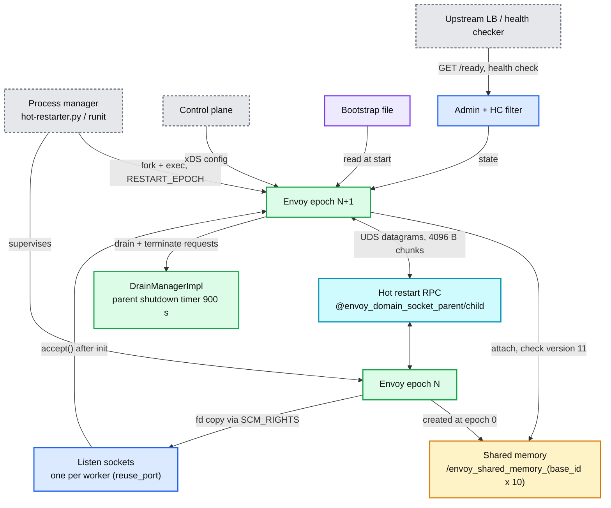

**What to notice**

- **Two processes, one kernel socket.** The fd is duplicated, so both processes point at the same accept queue. No SYN is lost during the swap, and with `reuse_port` each worker's socket is passed by worker index ([hot_restart.rst:57-68](https://github.com/envoyproxy/envoy/blob/v1.39.1/docs/root/intro/arch_overview/operations/hot_restart.rst#L57)).
- **Shared memory is tiny.** Two process-shared robust mutexes serialize application logs and access-log writes across the two processes. An `INITIALIZING` flag makes a third Envoy fail fast if the previous one is still starting ([hot_restart_impl.cc:74-82](https://github.com/envoyproxy/envoy/blob/v1.39.1/source/server/hot_restart_impl.cc#L74)).
- **Works across containers**: only a shared UDS path is needed. Not supported on Windows.
- **The admin listener and LB health checks are the lever** operators pull to take a node out before a restart.

---

## 3. Data flow: deployment topologies

### 3.1 Front proxy (edge)

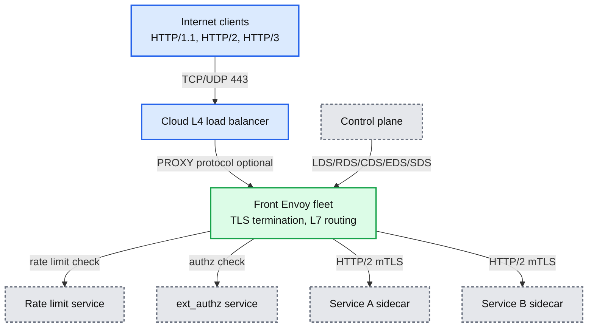

- Terminates TLS, speaks HTTP/1.1, HTTP/2 and HTTP/3, and reaches services through the same discovery as internal Envoys ([front_proxy.rst:10-20](https://github.com/envoyproxy/envoy/blob/v1.39.1/docs/root/intro/deployment_types/front_proxy.rst#L10)).
- The in-tree edge best practice sets `per_connection_buffer_limit_bytes` 32 KiB, HTTP/2 `max_concurrent_streams` 100, stream window 64 KiB, connection window 1 MiB, `use_remote_address: true`, `normalize_path`, `headers_with_underscores_action: REJECT_REQUEST`, and an overload manager on a 2 GiB heap ([best_practices/_include/edge.yaml](https://github.com/envoyproxy/envoy/blob/v1.39.1/docs/root/configuration/best_practices/_include/edge.yaml)).

### 3.2 Service-to-service sidecar

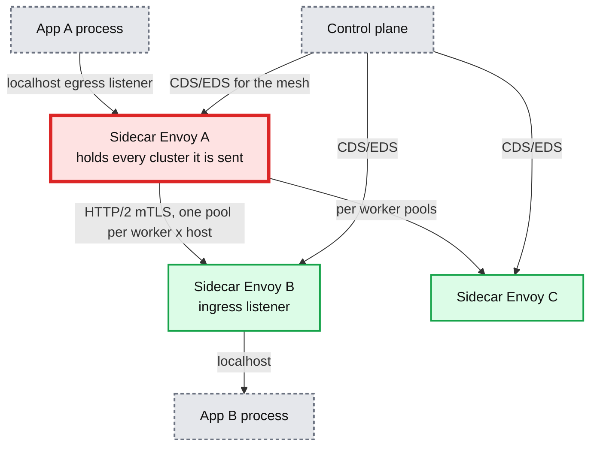

**What to notice**

- **The red node is the sidecar's config-proportional memory, the first thing that breaks at mesh scale.** Each cluster costs about 47 KB (golden 47,086 bytes, [stats_integration_test.cc:407](https://github.com/envoyproxy/envoy/blob/v1.39.1/test/integration/stats_integration_test.cc#L407)) and each host 1.4 to 3.5 KB. An unscoped sidecar in a 5,000-service mesh holds about 235 MB of cluster objects alone, and that cost is paid again in every pod **[inferred]**.
- Egress uses the `host`/`:authority` header to pick the cluster; ingress routes to local ports. Envoy to Envoy uses HTTP/2 by default ([service_to_service.rst:14-58](https://github.com/envoyproxy/envoy/blob/v1.39.1/docs/root/intro/deployment_types/service_to_service.rst#L14)).
- **Fix**: scope what each sidecar receives (only the services it calls), and cut stats (report 08, 6.5).

### 3.3 Double proxy

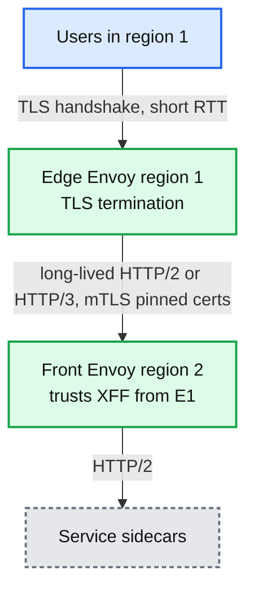

- Why: shorter TLS handshake RTT, faster TCP congestion-window growth, fewer losses near the user. Mutual TLS with pinned certs lets region 2 trust headers such as `x-forwarded-for` from region 1 ([double_proxy.rst:9-22](https://github.com/envoyproxy/envoy/blob/v1.39.1/docs/root/intro/deployment_types/double_proxy.rst#L9)).
- Level-two Envoys should set `stream_error_on_invalid_http_message: true`, otherwise one bad request resets a shared L1 to L2 HTTP/2 connection and every client on it ([level_two.rst:9-30](https://github.com/envoyproxy/envoy/blob/v1.39.1/docs/root/configuration/best_practices/level_two.rst#L9)).

### 3.4 API gateway

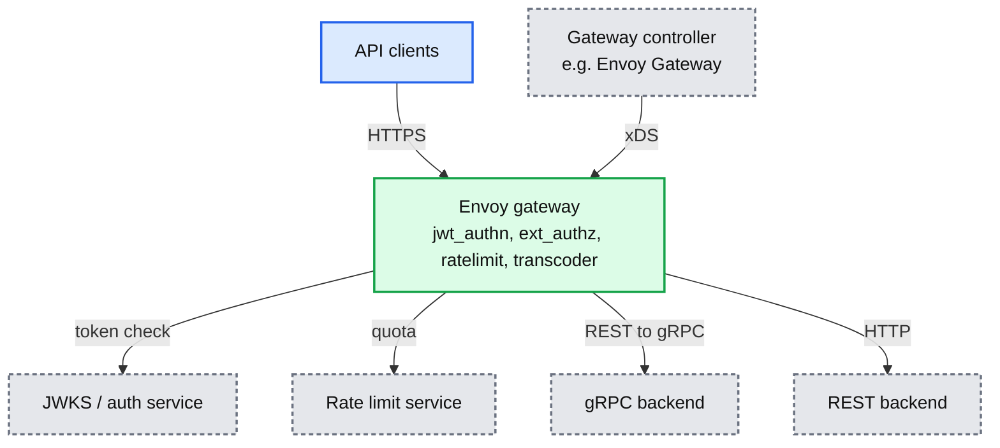

- Same process as the front proxy, with the policy filters that exist in tree (`jwt_authn`, `ext_authz`, `ratelimit`, `local_ratelimit`, `grpc_json_transcoder`, `cors`). Controllers such as Envoy Gateway translate Kubernetes Gateway API objects into xDS **[unverified: external product behaviour]**.

### 3.5 Egress proxy

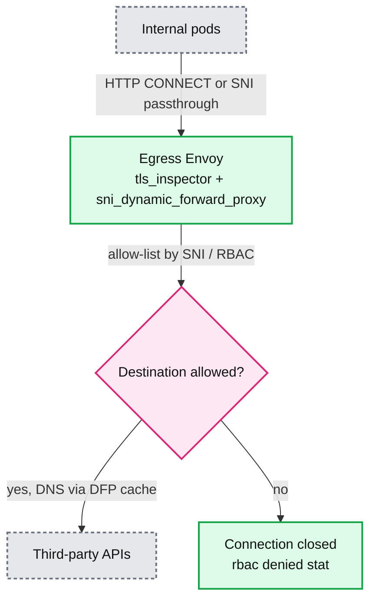

- Built from in-tree pieces: `tls_inspector` listener filter, `sni_dynamic_forward_proxy` and `dynamic_forward_proxy` cluster, `rbac` network filter. Set `drain_type: MODIFY_ONLY` on egress listeners so `/healthcheck/fail` on the ingress side does not also cut outbound traffic ([listener.proto:68-76](https://github.com/envoyproxy/envoy/blob/v1.39.1/api/envoy/config/listener/v3/listener.proto#L68)).

### 3.6 Mesh waypoints and Envoy Mobile

- **Waypoints**: in an ambient-style mesh a per-namespace or per-service Envoy (the waypoint) does L7 policy, while a node-level L4 proxy handles mTLS tunnelling (HBONE). The tree contains Istio-contributed filters under `contrib/istio` whose protos refer to "ztunnel and waypoint" ([peer_metadata.proto:25-40](https://github.com/envoyproxy/envoy/blob/v1.39.1/api/contrib/envoy/extensions/filters/network/peer_metadata/v3/peer_metadata.proto#L25)). Architecture details are **[unverified]** here.
- **Envoy Mobile**: `mobile/` in the tree is a "multiplatform client HTTP/networking library built on the Envoy project's core networking layer" ([mobile/README.md:1-3](https://github.com/envoyproxy/envoy/blob/v1.39.1/mobile/README.md#L1)). It moves retries, protocol negotiation and observability into iOS and Android apps.

---

## 4. Sequences

### 4.1 Hot restart, epoch N to N+1

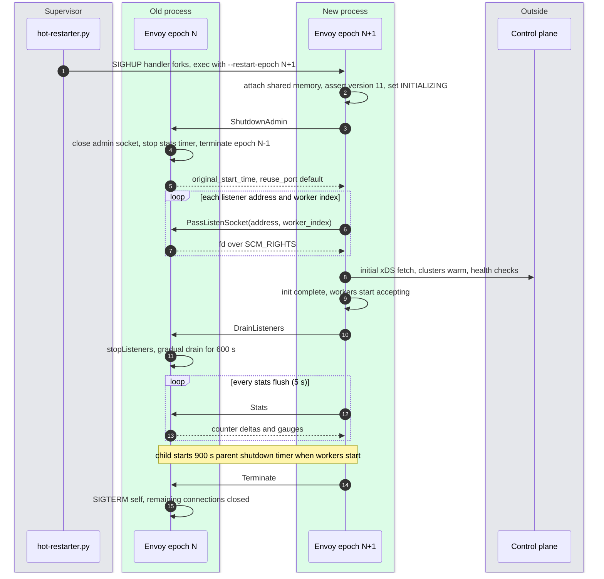

- Message types are exactly: requests `PassListenSocket`, `ShutdownAdmin`, `Stats`, `DrainListeners`, `Terminate`, `ForwardedUdpPacket` (QUIC packets the draining parent cannot place, on a second socket), `TestConnection`; replies `PassListenSocket{fd}`, `ShutdownAdmin{original_start_time_unix_seconds, enable_reuse_port_default}`, `Stats{memory_allocated, num_connections, counter_deltas, gauges, dynamics}` ([hot_restart.proto:5-97](https://github.com/envoyproxy/envoy/blob/v1.39.1/source/server/hot_restart.proto#L5)).
- The child's `ShutdownAdmin` makes the parent terminate its own parent, so at most three processes overlap; UDS names use `epoch % 3` ([hot_restarting_base.cc:35-38](https://github.com/envoyproxy/envoy/blob/v1.39.1/source/server/hot_restarting_base.cc#L35), [server.cc:1154-1165](https://github.com/envoyproxy/envoy/blob/v1.39.1/source/server/server.cc#L1154)).

### 4.2 LDS modifies a listener: warm, swap, drain

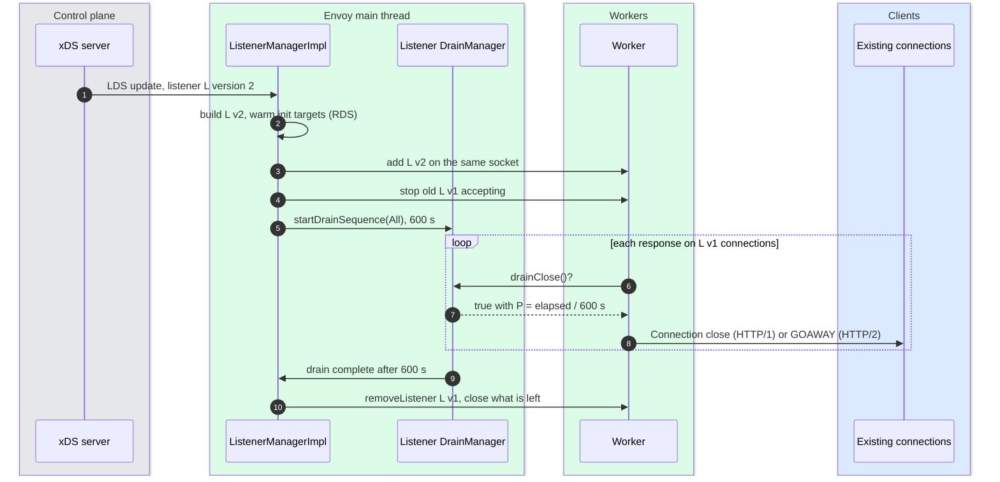

- `ListenerManagerImpl::drainListener` stops accepting, notifies connections, starts the drain and removes the listener on completion ([listener_manager_impl.cc:728-777](https://github.com/envoyproxy/envoy/blob/v1.39.1/source/common/listener_manager/listener_manager_impl.cc#L728)). Listener mechanics are in [report 02](envoy-02-listeners-and-network-filters.md).

### 4.3 Startup blocked on the first xDS response

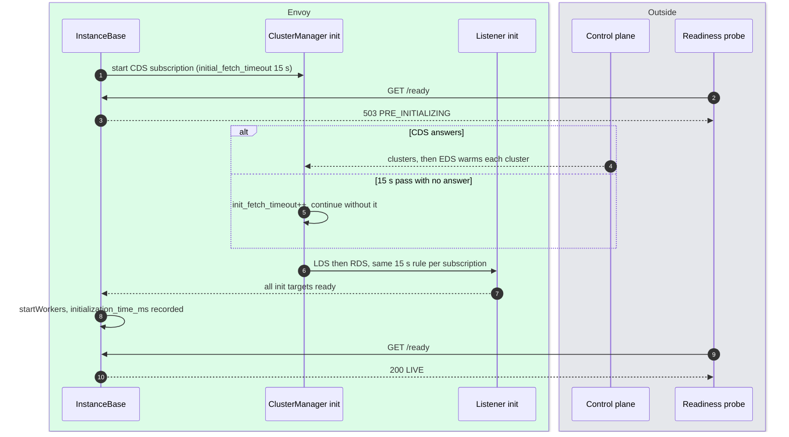

- `initial_fetch_timeout` default 15 s, `0` waits forever ([config_source.proto:240-247](https://github.com/envoyproxy/envoy/blob/v1.39.1/api/envoy/config/core/v3/config_source.proto#L240)). If it fires, Envoy goes LIVE with whatever it has, which may mean `NR` or `NC` responses until config arrives.

---

## 5. State machines

### 5.1 Server state as reported by `/ready` and `server.state`

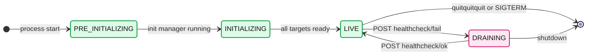

- Mapping: init manager `Uninitialized` to `PRE_INITIALIZING`, `Initializing` to `INITIALIZING`, `Initialized` to `LIVE` or `DRAINING` depending only on the health-check-failed flag ([utils.cc:11-22](https://github.com/envoyproxy/envoy/blob/v1.39.1/source/server/utils.cc#L11)). `/ready` returns 200 only for `LIVE`.

### 5.2 A hot-restart parent's life

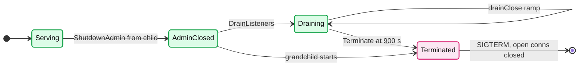

- `--drain-time-s` (600) and `--parent-shutdown-time-s` (900) are independent; the docs tell you to keep the second larger ([hot_restart.rst:26-30](https://github.com/envoyproxy/envoy/blob/v1.39.1/docs/root/intro/arch_overview/operations/hot_restart.rst#L26)).

### 5.3 An HTTP connection being drained

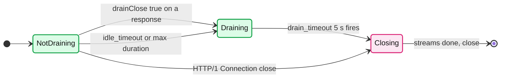

- `startDrainSequence()` calls `codec_->shutdownNotice()` (HTTP/2: GOAWAY with the maximum stream ID) and arms `drain_timeout`; `onDrainTimeout()` sends the final GOAWAY ([conn_manager_impl.cc:1699-1705](https://github.com/envoyproxy/envoy/blob/v1.39.1/source/common/http/conn_manager_impl.cc#L1699), [:819-822](https://github.com/envoyproxy/envoy/blob/v1.39.1/source/common/http/conn_manager_impl.cc#L819)). `drain_timeout` default 5000 ms ([http_connection_manager.proto:665](https://github.com/envoyproxy/envoy/blob/v1.39.1/api/envoy/extensions/filters/network/http_connection_manager/v3/http_connection_manager.proto#L665)).

---

## 6. Component deep dives

### 6.1 HotRestartImpl: shared memory, sockets, stats

- **Classes**: `HotRestartImpl` owns a `HotRestartingChild` and a `HotRestartingParent` (every process is both), plus the `SharedMemory` mapping ([hot_restart_impl.cc:95-110](https://github.com/envoyproxy/envoy/blob/v1.39.1/source/server/hot_restart_impl.cc#L95)). `RpcStream` in `hot_restarting_base.cc` frames protobufs into `SOCK_DGRAM` Unix sockets, 4096 bytes per `sendmsg` ([hot_restarting_base.cc:15](https://github.com/envoyproxy/envoy/blob/v1.39.1/source/server/hot_restarting_base.cc#L15)).
- **Shared memory**: `shm_open("/envoy_shared_memory_{base_id x 10}")`. Epoch 0 unlinks and creates it; later epochs assert the same size and `HOT_RESTART_VERSION` 11 or crash with "not-hot-restart-compatible new version" ([hot_restart_impl.cc:26-73](https://github.com/envoyproxy/envoy/blob/v1.39.1/source/server/hot_restart_impl.cc#L26), [hot_restart_impl.h:24](https://github.com/envoyproxy/envoy/blob/v1.39.1/source/server/hot_restart_impl.h#L24)). `--hot-restart-version` prints `11.<sizeof(SharedMemory)>`.
- **Socket names**: `{--socket-path}_{parent|child}_{base_id x 10 + epoch % 3}`; `--socket-path` defaults to the abstract name `@envoy_domain_socket`, `--socket-mode` 600 ([options_impl.cc:174-178](https://github.com/envoyproxy/envoy/blob/v1.39.1/source/server/options_impl.cc#L174)).
- **Passing sockets**: `getListenSocketsForChild` matches address, socket type and `worker_index < concurrency`, and replies with the fd in an `SCM_RIGHTS` control message ([hot_restarting_parent.cc:139-177](https://github.com/envoyproxy/envoy/blob/v1.39.1/source/server/hot_restarting_parent.cc#L139)). If concurrency shrinks across the restart, connections in the dropped workers' accept queues can be lost.
- **Stats transfer**: the parent sends counter **deltas** since the last latch and gauge values, only for used stats, plus "dynamic spans" so the child rebuilds names the same way ([hot_restarting_parent.cc:179-202](https://github.com/envoyproxy/envoy/blob/v1.39.1/source/server/hot_restarting_parent.cc#L179)). A TODO warns the full-string map can negate the symbol table's savings when stats are huge. `--skip-hot-restart-parent-stats` turns this off.
- **Parent death**: the child sets `PR_SET_PDEATHSIG` to `SIGTERM` so it never outlives its supervisor ([hot_restart_impl.cc:109](https://github.com/envoyproxy/envoy/blob/v1.39.1/source/server/hot_restart_impl.cc#L109)).

### 6.2 Hot restart knobs and the restarter

| Flag | Default | Note |
|---|---|---|
| `--restart-epoch` | 0 | Set from `RESTART_EPOCH` by the restarter ([options_impl.cc:133](https://github.com/envoyproxy/envoy/blob/v1.39.1/source/server/options_impl.cc#L133)) |
| `--base-id` / `--use-dynamic-base-id` / `--base-id-path` | 0 / off / none | Run several independent Envoys on one host; dynamic only at epoch 0 ([options_impl.cc:60-81](https://github.com/envoyproxy/envoy/blob/v1.39.1/source/server/options_impl.cc#L60)) |
| `--drain-time-s` / `--drain-strategy` | 600 / `gradual` | Also used for LDS removal drains |
| `--parent-shutdown-time-s` | 900 | Timer starts when the child's workers start |
| `--disable-hot-restart` | off | No shared memory, no UDS |
| `--skip-hot-restart-on-no-parent` | off | Child continues if the parent is gone instead of crashing |

- **`restarter/hot-restarter.py`**: `SIGHUP` forks a new child with the next epoch, `SIGTERM`/`SIGINT` terminate all children (30 s grace then `SIGKILL`), `SIGUSR1` is forwarded for log reopen, and an unexpected `SIGCHLD` shuts everything down ([hot_restarter.rst](https://github.com/envoyproxy/envoy/blob/v1.39.1/docs/root/operations/hot_restarter.rst), [hot-restarter.py:15](https://github.com/envoyproxy/envoy/blob/v1.39.1/restarter/hot-restarter.py#L15)).
- **Why most Kubernetes deployments never hot restart** **[inferred]**: config changes arrive over xDS without any restart, and binary upgrades roll pods (new pod, readiness gate, old pod drains then exits) because pods are immutable. Hot restart needs a supervisor inside the pod and a shared UDS path; it pays off on long-lived VMs and bare-metal edge fleets, where a rolling replacement means shifting load between hosts.

### 6.3 DrainManagerImpl

- **When draining starts** ([draining.rst:11-22](https://github.com/envoyproxy/envoy/blob/v1.39.1/docs/root/intro/arch_overview/operations/draining.rst#L11)): hot restart (parent receives `DrainListeners`), `POST /drain_listeners?graceful`, `POST /healthcheck/fail` (only `DEFAULT` listeners), and LDS modification or removal of a listener.
- **The ramp** (simplified from [drain_manager_impl.cc:44-99](https://github.com/envoyproxy/envoy/blob/v1.39.1/source/server/drain_manager_impl.cc#L44)):

```cpp
// P(return true) = elapsed time / drain timeout
if (current_time >= deadline) return true;
const auto remaining = seconds(deadline - current_time);
const auto elapsed = drain_time - remaining;           // whole seconds
return elapsed.count() > (random() % drain_time.count());
```

  - With 600 s: about 0% at the start, 50% at t=300 s, 100% at t=600 s. Because `remaining` is truncated to whole seconds, `elapsed` is already 1 s a moment after the drain starts, so P begins at 1/600, not 0.
  - `--drain-strategy immediate` returns true at once; `drain_time 0` also returns true.
- **Drain-close callbacks** registered via `addOnDrainCloseCb` get a random delay inside the remaining window, and at drain start they are spread across the **first quarter** of the window ([drain_manager_impl.cc:195-213](https://github.com/envoyproxy/envoy/blob/v1.39.1/source/server/drain_manager_impl.cc#L195)).
- **Directions**: `InboundOnly` or `All`. An outbound HCM only drains when the direction is `All` ([conn_manager_impl.cc:1949-1954](https://github.com/envoyproxy/envoy/blob/v1.39.1/source/common/http/conn_manager_impl.cc#L1949)).
- **Drain types**: `DEFAULT` drains on all four triggers; `MODIFY_ONLY` ignores `/healthcheck/fail`.
- **Plain `/drain_listeners` without `graceful`** stops listeners immediately; with `graceful` it starts the server drain and stops listeners at the end (`skip_exit` keeps them open) ([listeners_handler.cc:15-55](https://github.com/envoyproxy/envoy/blob/v1.39.1/source/server/admin/listeners_handler.cc#L15)). Neither changes `server.state`.

### 6.4 Per-protocol drain behaviour

| Protocol / filter | What drain close does | Source |
|---|---|---|
| HTTP/1.1 via HCM | Next response carries `Connection: close`, connection closes after it | [conn_manager_impl.cc:2015-2023](https://github.com/envoyproxy/envoy/blob/v1.39.1/source/common/http/conn_manager_impl.cc#L2015) |
| HTTP/2 and HTTP/3 via HCM | GOAWAY (max stream ID) now, final GOAWAY after `drain_timeout` 5 s, close when streams finish | [conn_manager_impl.cc:1699-1705](https://github.com/envoyproxy/envoy/blob/v1.39.1/source/common/http/conn_manager_impl.cc#L1699) |
| tcp_proxy | Nothing by default; with `check_drain_close: true` closes the downstream (`FlushWrite`) on the next read or write when drain says so | [tcp_proxy.cc:1286-1297](https://github.com/envoyproxy/envoy/blob/v1.39.1/source/common/tcp_proxy/tcp_proxy.cc#L1286) |
| Redis, Mongo, Thrift proxies | Graceful drain supported (Thrift behind a runtime flag) | [draining.rst:34-40](https://github.com/envoyproxy/envoy/blob/v1.39.1/docs/root/intro/arch_overview/operations/draining.rst#L34) |
| Everything else | Closed when the listener is removed at drain end or at parent shutdown | [inferred] |

- **Upstream side**: removing a cluster drains its pools passively: no new streams, existing streams finish ([draining.rst:63-66](https://github.com/envoyproxy/envoy/blob/v1.39.1/docs/root/intro/arch_overview/operations/draining.rst#L63)).

### 6.5 Validating and inspecting config

- **`--mode validate`**: parses and validates the bootstrap, prints OK (exit 0) or errors (exit 1). "No network traffic is generated, and the hot restart process is not performed" ([cli.rst:34-43](https://github.com/envoyproxy/envoy/blob/v1.39.1/docs/root/operations/cli.rst#L34)). It cannot check what xDS will send later, so run it in CI on the bootstrap and on rendered static configs **[inferred]**.
- **`/config_dump`**: the effective config, with per-resource `error_state` (`UpdateFailureState`) for rejected updates and `client_status` ([config_dump.proto:101-105](https://github.com/envoyproxy/envoy/blob/v1.39.1/api/envoy/admin/v3/config_dump.proto#L101)). Filter with `resource`, `mask`, `name_regex`, `include_eds`.
- **`/ready`** (200 only when `LIVE`), **`/server_info`** (version, state, uptime, full command line including `concurrency`, `drain_time`, `parent_shutdown_time`, `restart_epoch`) ([admin.rst:410-480](https://github.com/envoyproxy/envoy/blob/v1.39.1/docs/root/operations/admin.rst#L410)).
- **`/init_dump`** (`?mask=listener` etc.) lists the unready init targets, the first endpoint to hit when `/ready` stays 503.

### 6.6 Resource envelope, with arithmetic

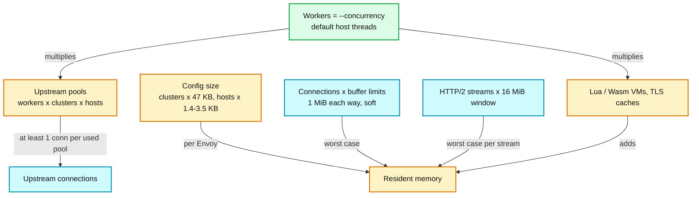

- **Buffers**: `per_connection_buffer_limit_bytes` 1 MiB on listeners and clusters ([listener.proto:246](https://github.com/envoyproxy/envoy/blob/v1.39.1/api/envoy/config/listener/v3/listener.proto#L246), [cluster.proto:887](https://github.com/envoyproxy/envoy/blob/v1.39.1/api/envoy/config/cluster/v3/cluster.proto#L887)). It is a watermark, not a preallocation. Ceiling for 10,000 proxied connections: 10,000 x (1 MiB + 1 MiB) = about 20 GiB; with the edge value of 32 KiB it is about 640 MiB **[inferred]**.
- **Connection pools**: pools are per worker, per cluster, per host (and per protocol and transport options). 16 workers x 300 clusters x 20 hosts = 96,000 possible pools; an HTTP/2 pool that has carried traffic holds at least one connection, so up to 96,000 upstream connections from one Envoy **[inferred]**. Circuit breakers (`max_connections` 1024 per cluster per priority) cap connections per cluster, not per host.
- **Stats**: 47 KB per cluster, 1.4 to 3.5 KB per host, about 1 KiB per route stat prefix (report 08, section 8).
- **Concurrency in containers**: on a 96-thread node a pod limited to 2 CPUs gets 96 workers by default: 96 sets of pools, TLS caches and script VMs, and CFS throttling. Set `--concurrency 2` or `--cpuset-threads` **[inferred from options_impl.cc:82-83]**.
- **In-tree performance docs** publish no numbers: "we do not currently publish any official benchmarks" ([how_fast_is_envoy.rst:10-14](https://github.com/envoyproxy/envoy/blob/v1.39.1/docs/root/faq/performance/how_fast_is_envoy.rst#L10)). They recommend `enable_dispatcher_stats` for `loop_duration_us` and `poll_delay_us` per worker ([performance.rst:9-48](https://github.com/envoyproxy/envoy/blob/v1.39.1/docs/root/operations/performance.rst#L9)).
- **External reference point (Istio's published numbers, not Envoy's):** for Istio 1.24, at 1,000 HTTP requests per second of 1 KB payloads, "a single sidecar proxy with 2 worker threads consumes about 0.20 vCPU and 60 MB of memory", a waypoint about 0.25 vCPU and 60 MB, and a ztunnel about 0.06 vCPU and 12 MB. The same page notes that proxy memory "depends on the total configuration state the proxy holds", which is the cluster-count effect above. Istio's load-test mesh was 1,000 services, 2,000 pods and 70,000 mesh-wide requests per second. Source: [istio.io performance and scalability](https://istio.io/latest/docs/ops/deployment/performance-and-scalability/), fetched 2026-09-24. [documented, external]

### 6.7 Tuning checklist

| Knob | Default | Typical change and why |
|---|---|---|
| `--concurrency` | host threads | Match the CPU limit; fewer workers means fewer pools and VMs |
| `per_connection_buffer_limit_bytes` | 1 MiB | 32 KiB at the edge to bound memory per slow client |
| Circuit breakers per cluster | 1024 conns, 1024 pending, 1024 requests, 3 retries | Raise for high-fan-in clusters; enable `track_remaining` to see headroom |
| Listener / global connection limits | none | `envoy.resource_monitors.global_downstream_max_connections` and per-listener `connection_limit` |
| Overload manager | off | `fixed_heap` or `cgroup_memory` monitor with `stop_accepting_requests` at 98% and `shrink_heap` at 95% |
| `stats_matcher` | all stats | Exclude unused families at 1,000+ clusters |
| Access log sampling | every request | `runtime_filter` at 1% for success, keep 100% for 5xx with a `status_code_filter` |
| HTTP/2 windows | 16 MiB stream, 24 MiB connection | 64 KiB / 1 MiB at the edge; keep large for high-BDP internal links |
| `max_concurrent_streams` | 1024 | 100 at the edge |
| Idle timeouts | 1 h connection, 5 min stream | Shorter connection idle behind NAT or L4 LBs with smaller idle timers |
| `max_connection_duration` | none | Set (for example 10 min) to rebalance long-lived connections across workers and hosts |
| `drain_timeout` / `--drain-time-s` | 5 s / 600 s | Shorten drain time when pods have a 30 s grace period |

### 6.8 What to page on at 3am (thresholds are **[inferred]** guidance)

| Signal | Stat | Page when |
|---|---|---|
| Availability burn | `http.<prefix>.downstream_rq_5xx` / `downstream_rq_completed` | Over 2% of requests for 5 min, or SLO burn rate over 14x for 1 h |
| Latency SLO | `http.<prefix>.downstream_rq_time` P99 | Above SLO (for example 300 ms) for 10 min |
| Upstream capacity | `cluster.<name>.membership_healthy` / `membership_total` | Below 50% (panic threshold) for 2 min |
| Shedding by circuit breakers | `cluster.<name>.upstream_rq_pending_overflow` + `upstream_cx_overflow` | Non-zero rate sustained 5 min on a tier-1 cluster |
| Control plane | `control_plane.connected_state` | 0 for 5 min, or any rise in `*.update_rejected` |
| Readiness | `server.state` | Not 0 (`LIVE`) for 2 min outside a deploy |
| Memory pressure | `overload.envoy.overload_actions.stop_accepting_requests.active` or `server.memory_allocated` | Action active, or memory over 85% of the limit |
| Certificates | `server.days_until_first_cert_expiring` | Under 2 days (ticket at 14) |

---

### 6.9 Runbooks by symptom

Each runbook: what it means, three first checks (stat, admin endpoint, access log field), the usual fix. Flags from [substitution_formatter.rst:489-534](https://github.com/envoyproxy/envoy/blob/v1.39.1/docs/root/configuration/advanced/substitution_formatter.rst#L489).

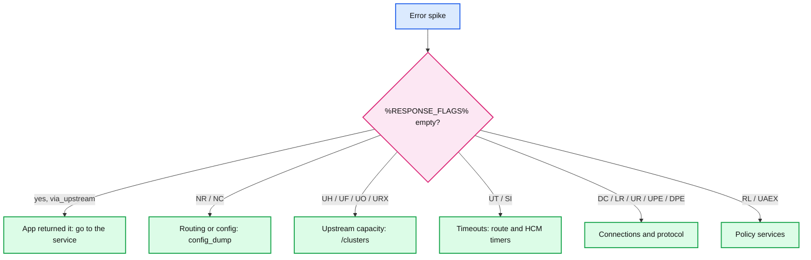

#### 503 UH: no healthy upstream
- **Means**: the load balancer found no usable host (all unhealthy, ejected, or zero endpoints). Detail `no_healthy_upstream`.
- **Check**: `cluster.<name>.membership_healthy`, `membership_total`, `upstream_cx_none_healthy`, `outlier_detection.ejections_active`. `/clusters?filter=<name>` for per-host `health_flags` (`/failed_active_hc`, `/failed_outlier_check`). Access log `%UPSTREAM_CLUSTER%`.
- **Fix**: `membership_total` 0 means the control plane sent an empty assignment or DNS resolved nothing (`update_empty` counts updates missing the assignment, which keep the previous hosts); all hosts failing active health checks means the check path or port is wrong; many ejections means outlier detection tripped, and past `max_ejection_percent` (default 10%) hosts stay in rotation. See [report 05](envoy-05-resilience.md).

#### 503 UF: upstream connection failure
- **Means**: TCP connect or TLS handshake failed. Detail `upstream_reset_before_response_started{remote_connection_failure|<TLS reason>}` or `{connection_timeout}` (reset reasons with spaces turned into underscores, [router.cc:1706-1712](https://github.com/envoyproxy/envoy/blob/v1.39.1/source/common/router/router.cc#L1706)).
- **Check**: `upstream_cx_connect_fail`, `upstream_cx_connect_timeout` (`connect_timeout` 5 s). `/clusters` host `cx_connect_fail`. `%UPSTREAM_TRANSPORT_FAILURE_REASON%` for TLS errors (SAN mismatch, unknown CA).
- **Fix**: security groups or network policy; wrong port in EDS; mismatched mTLS config or expired SDS certs; for bursts, retries with `retry_on: connect-failure` and outlier detection.

#### 503 UO: upstream overflow (circuit breaker)
- **Means**: a circuit breaker for the cluster and priority was full.
- **Check**: `upstream_rq_pending_overflow` (`max_pending_requests` 1024), `upstream_cx_overflow` (`max_connections` 1024), `upstream_rq_retry_overflow` (`max_retries` 3); gauges `cluster.<name>.circuit_breakers.default.rq_pending_open` and `remaining_pending`. `/clusters` shows thresholds.
- **Fix**: first ask whether the upstream is slow (queueing) or the limit is too low for this fan-in. Raise limits only with upstream capacity; otherwise fix the slowness. Remember limits are per Envoy: 500 sidecars x 1024 = 512,000 allowed requests.

#### 503 URX: retry limit exceeded
- **Means**: every attempt failed and `num_retries` (default 1) or the retry budget ran out.
- **Check**: `upstream_rq_retry`, `upstream_rq_retry_limit_exceeded`, `upstream_rq_retry_overflow`. `%UPSTREAM_REQUEST_ATTEMPT_COUNT%` and the flags of earlier attempts (upstream access log).
- **Fix**: find the underlying per-attempt failure (UF, UR, UT). Do not raise retries during an overload; use a retry budget (20% of active requests) instead.

#### 404 NR: no route
- **Means**: no virtual host or route matched. Detail `route_not_found`.
- **Check**: `http.<prefix>.no_route`. `/config_dump?resource=dynamic_route_configs` and the `domains` list. Access log `%REQUEST_HEADER(:AUTHORITY)%` and path.
- **Fix**: most often `host:port` vs `host` domain mismatch; add ports or set `strip_any_host_port` ([why_is_my_route_not_found.rst:9-35](https://github.com/envoyproxy/envoy/blob/v1.39.1/docs/root/faq/debugging/why_is_my_route_not_found.rst#L9)). During startup, RDS may not have arrived (`initial_fetch_timeout`).

#### 503 NC: no cluster
- **Means**: the route names a cluster Envoy does not have. Detail `cluster_not_found`.
- **Check**: `http.<prefix>.no_cluster`. `/config_dump?resource=dynamic_active_clusters&mask=cluster.name`. `%ROUTE_NAME%`.
- **Fix**: the control plane sent RDS before CDS or dropped the cluster; fix ordering (make-before-break, see [report 06](envoy-06-xds-control-plane.md)) or the typo in the route.

#### 504 UT: upstream request timeout
- **Means**: the route `timeout` (default 15 s) or the final `per_try_timeout` expired. Details `response_timeout` or `upstream_per_try_timeout`.
- **Check**: `cluster.<name>.upstream_rq_timeout`, `upstream_rq_per_try_timeout`, `upstream_rq_time` P99. `/config_dump` route `timeout`. `%DURATION%` near 15000 and `%UPSTREAM_HOST%`.
- **Fix**: slow upstream or a long-poll/streaming route that needs `timeout: 0s` plus an idle timeout. Set per-try timeouts under the route timeout so retries fit inside it.

#### DC: downstream connection termination
- **Means**: the client went away before the response finished. `%RESPONSE_CODE%` is often 0 because no response was sent **[inferred]**; detail `downstream_remote_disconnect`.
- **Check**: `http.<prefix>.downstream_cx_destroy_remote_active_rq`, `downstream_rq_rx_reset`. Compare client timeout vs `%DURATION%`.
- **Fix**: the client's timeout is shorter than the server's latency. Align timeouts along the chain (client < edge route timeout < upstream).

#### SI: stream idle timeout
- **Means**: no bytes in either direction for `stream_idle_timeout` (default 5 min). 408 if the client had not finished sending the request (a slow or stuck client), 504 if it had (waiting on the upstream) ([utility.cc:1535-1540](https://github.com/envoyproxy/envoy/blob/v1.39.1/source/common/http/utility.cc#L1535)). Detail `stream_idle_timeout`.
- **Check**: `http.<prefix>.downstream_rq_idle_timeout`, route `idle_timeout`. `%RESPONSE_FLAGS%` SI with `%DURATION%` about 300000.
- **Fix**: raise or disable for streaming and long-poll routes; add keep-alive messages in the application stream.

#### LR / UR: local or upstream reset
- **Means**: UR, the upstream reset the stream (RST_STREAM or TCP reset); LR, Envoy reset it locally (for example a filter or a connection being closed). Details such as `upstream_reset_before_response_started{remote_reset}` or `{connection_termination}`.
- **Check**: `cluster.<name>.upstream_rq_rx_reset` (UR), `upstream_rq_tx_reset` (LR), `upstream_cx_destroy_remote_with_active_rq`. `%UPSTREAM_DETECTED_CLOSE_TYPE%`, `%RESPONSE_CODE_DETAILS%`.
- **Fix**: upstream idle timeout shorter than Envoy's pool idle timeout (1 h default) is the classic cause: set the cluster `idle_timeout` below the upstream's keep-alive, and enable `retry_on: reset`.

#### UPE / DPE: protocol errors
- **Means**: UPE, the upstream sent invalid HTTP; DPE, the client did. Header limits: `max_headers_count` 100, `max_request_headers_kb` 60 KiB (431), response headers 60 KiB (80 KiB for HTTP/1, 503).
- **Check**: `cluster.<name>.upstream_cx_protocol_error`, `http.<prefix>.downstream_cx_protocol_error`. `%RESPONSE_CODE_DETAILS%` (for example `http1.codec_error`). Debug logs on `http` for one pod via `POST /logging?paths=...`.
- **Fix**: oversized headers or cookies, duplicate `content-length`, invalid characters. At L2 Envoys set `stream_error_on_invalid_http_message: true` so one bad request does not reset a shared connection.

#### RL: rate limited
- **Means**: the global `ratelimit` filter got OVER_LIMIT from the RLS, or `local_ratelimit` ran out of tokens; 429 by default.
- **Check**: `cluster.<target>.ratelimit.over_limit`, `error`, `failure_mode_allowed`; `<stat_prefix>.http_local_rate_limit.rate_limited` and `enforced`. Descriptors in the RLS config.
- **Fix**: a legitimate limit hit versus a descriptor bug (all traffic sharing one key). RLS outages fail open by default (`failure_mode_deny` false, 20 ms timeout).

#### UAEX: denied by external authorization
- **Means**: ext_authz returned deny (403 by default); if the service erred and `failure_mode_allow` is false you also get 403 via `status_on_error`.
- **Check**: `cluster.<target>.ext_authz.denied`, `error`, `failure_mode_allowed`. ext_authz service logs. `%RESPONSE_CODE_DETAILS%`.
- **Fix**: `error` rising means the authz service is slow or down (200 ms timeout); `denied` rising means a policy change. Decide fail-open vs fail-closed per route explicitly.

#### Config NACK
- **Means**: Envoy rejected an xDS update and keeps the last good config.
- **Check**: `listener_manager.lds.update_rejected`, `cluster_manager.cds.update_rejected`, `http.<prefix>.rds.<name>.update_rejected`. Warning log "gRPC config for <type_url> rejected: <reason>" ([grpc_subscription_impl.cc:138](https://github.com/envoyproxy/envoy/blob/v1.39.1/source/extensions/config_subscription/grpc/grpc_subscription_impl.cc#L138)). `/config_dump` `error_state`.
- **Fix**: usually an extension missing from this build ("Didn't find a registered implementation ... with type URL"), a proto validation failure, or a new field the Envoy version does not know. Fix in the control plane; version-gate features by Envoy build.

#### Slow startup stuck on initial_fetch_timeout
- **Means**: `/ready` stays 503 because init targets wait for xDS.
- **Check**: `server.state` (2 or 3), `/init_dump` unready targets, `*.init_fetch_timeout`, `control_plane.connected_state`, `cluster_manager.warming_clusters`, `listener_manager.total_listeners_warming`.
- **Fix**: control plane unreachable (DNS, mTLS to the control plane, wrong cluster in bootstrap), EDS never answering for a cluster (warming waits), or `initial_fetch_timeout: 0s` waiting forever.

#### Memory growth from stats cardinality
- **Means**: memory rises with config pushes or with new request values that create stats.
- **Check**: `server.memory_allocated` against cluster and host counts; `GET /stats?usedonly` line count over time; `server.stats_recent_lookups`; `/memory` and `/heap_dump`.
- **Fix**: scope config per sidecar, `stats_matcher` exclusions, remove per-route `stat_prefix`, avoid `x-envoy-upstream-alt-stat-name` from untrusted clients, set scope limits where supported.

#### One hot worker
- **Means**: one worker at 100% CPU while others idle; a few long-lived HTTP/2 connections pin all their streams to one worker.
- **Check**: `listener.<address>.worker_<N>.downstream_cx_active` imbalance; `listener_manager.worker_<N>.dispatcher.loop_duration_us` (needs `enable_dispatcher_stats`); `server.worker_<N>.watchdog_miss`.
- **Fix**: `connection_balance_config: exact_balance` on the listener ([listener.proto:94-136](https://github.com/envoyproxy/envoy/blob/v1.39.1/api/envoy/config/listener/v3/listener.proto#L94)), `max_connection_duration` so clients reconnect, or more client connections. See [report 01](envoy-01-threading-and-process-model.md).

### 6.10 The cost of the sidecar model **[inferred]**

- **Extra hops**: each call crosses two Envoys (client sidecar and server sidecar), so two extra userspace proxy traversals, two TLS operations and four socket crossings per request, plus a full filter chain each way.
- **Per-pod memory**: config memory (6.6) is paid per pod, not per node. 1,000 pods x 150 MB = 150 GB of RAM spent on proxies holding the same config.
- **Connection multiplication**: with W workers, each client sidecar opens up to W connections per upstream host. 1,000 client pods x 8 workers = 8,000 inbound connections on every server pod, each with its own TLS session and buffers.
- **Mitigations**: config scoping, `--concurrency` equal to the CPU limit, HTTP/2 multiplexing, and node-level or waypoint proxies that pay the cost once per node or service instead of per pod.

### 6.11 Migration playbook onto Envoy **[inferred]**

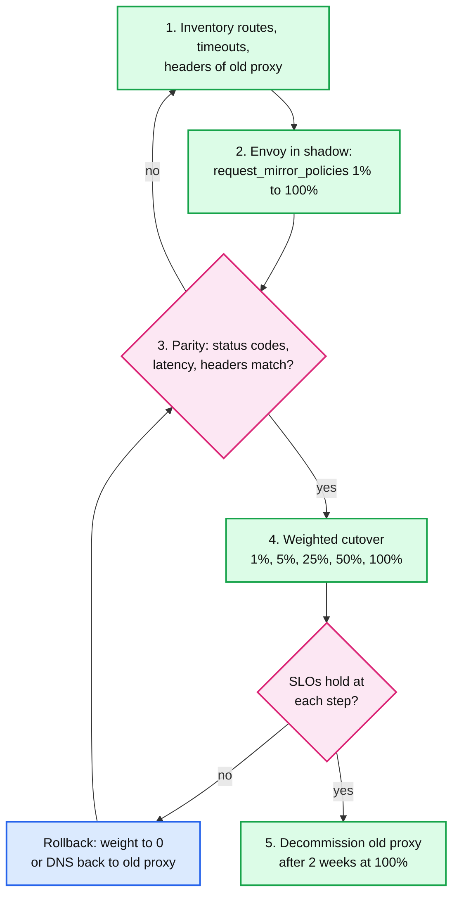

- **Shadowing**: route-level `request_mirror_policies` with a `runtime_fraction` sends copies fire-and-forget; shadow responses are discarded ([route_components.proto:1450](https://github.com/envoyproxy/envoy/blob/v1.39.1/api/envoy/config/route/v3/route_components.proto#L1450)). Mirror only idempotent traffic or point shadows at a sandbox.
- **Parity testing**: compare access logs of old and new paths per request ID: status, `%RESPONSE_FLAGS%`, latency percentiles, header sets. Classic gaps: timeouts (Envoy's 15 s route default), header normalization, path merging, retries the old proxy did silently.
- **Weighted cutover**: `weighted_clusters` or an upstream L4 LB split; move in steps with an SLO gate at each.
- **Rollback**: every step must be one config change away from 0%; keep the old proxy warm until two weeks at 100%. Real case studies are the editor's addition.

---

## 7. Failure modes

| Failure | What the user sees | Blast radius | Mitigation |
|---|---|---|---|
| Hot restart into an incompatible binary | Child crashes: "Hot restart version mismatch" | New process only; old keeps serving | Compare `--hot-restart-version`; do a full restart for version changes |
| Third Envoy starts while one is initializing | "previous envoy process is still initializing" | New process fails fast | Restarter retries with back-off and the same epoch |
| Concurrency lowered across hot restart | A few connections dropped from old workers' accept queues | Handful of connections | Keep concurrency constant, or accept the loss |
| Drain window longer than orchestrator grace | Connections cut at SIGKILL, clients see resets | Every connection on the pod | `--drain-time-s` below the grace period, preStop drain |
| `/healthcheck/fail` on a node with egress listeners | Outbound calls also start closing | All outbound traffic | `MODIFY_ONLY` on egress listeners |
| Control plane down at cold start | `/ready` 503 for 15 s per subscription, then `NR`/`NC` | New pods only; running pods keep last config | Cache last config, `initial_fetch_timeout`, control plane HA |
| Bad xDS push | NACK, `update_rejected`, last good config retained | None if NACKed; outage if valid-but-wrong | Canary pushes, config validation in the control plane |
| Default `--concurrency` in a small container | CPU throttling, memory x workers | That pod | Set `--concurrency` or `--cpuset-threads` |
| Idle keep-alive connections during drain | Not closed until listener removal at 600 s | Slower drains | `max_connection_duration`, shorter drain |

---

## 8. Scalability and performance

- **What breaks first in a mesh: per-sidecar config memory** (red node in 3.2): about 47 KB per cluster and up to 3.5 KB per host, paid in every pod. 5,000 clusters is about 235 MB per sidecar before traffic **[inferred]**.
- **What breaks first at the edge: connection memory and CPU.** Buffers are 1 MiB soft limits per direction per connection; the edge profile reduces them to 32 KiB, a 32x lower ceiling.
- **Workers scale linearly** because a connection lives on one worker, but the unit of balance is the connection; few long-lived connections defeat it (one hot worker runbook).
- **Hot restart cost**: during the overlap two processes hold full config, so memory roughly doubles for up to 900 s **[inferred]**; `server.memory_allocated` reports the total of both.
- **Drain cost**: the chance that any one response closes its connection rises by 1/600 (about 0.17 percentage points) per second, so busy connections leave early, quiet ones late, and client reconnects spread over 10 minutes instead of arriving together **[inferred]**.

---

## 9. Trade-offs and alternatives

| Decision | Chosen | Alternative | Why |
|---|---|---|---|
| Binary upgrade | Hot restart with socket passing | Connection migration between processes | Simple, portable across containers; cost is a drain window |
| Stats across restart | RPC of counter deltas and gauges | Shared memory (old design) | Removed fixed-size limits; costs a full-string map per flush |
| Drain shape | Linear probability over `--drain-time-s` | Close all at once | Avoids reconnect storms; cost is up to 10 min of overlap |
| Health-check drain | Immediate close on every response | Gradual | Fastest exit when the LB already stopped sending; a TODO in the code notes a ramp would be nicer |
| Default concurrency | Host threads | Container quota | Predictable on bare metal; wrong in small containers unless flagged |
| Topology | Sidecar per pod | Node proxy or waypoint | Per-pod identity and isolation; costs memory and connections per pod |
| Config delivery | xDS push, no restart | Restart on config change | Seconds to apply, no drain |

---

## 10. Config reference

| Knob | Default | Where |
|---|---|---|
| `--concurrency` | `hardware_concurrency()` | [options_impl.cc:82-83](https://github.com/envoyproxy/envoy/blob/v1.39.1/source/server/options_impl.cc#L82) |
| `--cpuset-threads` | off | [options_impl.cc:167-168](https://github.com/envoyproxy/envoy/blob/v1.39.1/source/server/options_impl.cc#L167) |
| `ENVOY_CGROUP_CPU_DETECTION` (env, with `--cpuset-threads`) | enabled | [options_impl_platform_linux.cc:51-57](https://github.com/envoyproxy/envoy/blob/v1.39.1/source/server/options_impl_platform_linux.cc#L51) |
| `--drain-time-s` | 600 s | [options_impl.cc:149-151](https://github.com/envoyproxy/envoy/blob/v1.39.1/source/server/options_impl.cc#L149) |
| `--drain-strategy` | `gradual` | [options_impl.cc:152-155](https://github.com/envoyproxy/envoy/blob/v1.39.1/source/server/options_impl.cc#L152) |
| `--parent-shutdown-time-s` | 900 s | [options_impl.cc:156-158](https://github.com/envoyproxy/envoy/blob/v1.39.1/source/server/options_impl.cc#L156) |
| `--mode` | `serve` (`validate` exits) | [options_impl.cc:159-162](https://github.com/envoyproxy/envoy/blob/v1.39.1/source/server/options_impl.cc#L159) |
| `--restart-epoch` / `--base-id` | 0 / 0 | [options_impl.cc:133](https://github.com/envoyproxy/envoy/blob/v1.39.1/source/server/options_impl.cc#L133), [:60-62](https://github.com/envoyproxy/envoy/blob/v1.39.1/source/server/options_impl.cc#L60) |
| `--socket-path` / `--socket-mode` | `@envoy_domain_socket` / 600 | [options_impl.cc:174-178](https://github.com/envoyproxy/envoy/blob/v1.39.1/source/server/options_impl.cc#L174) |
| Hot restart version | 11 | [hot_restart_impl.h:24](https://github.com/envoyproxy/envoy/blob/v1.39.1/source/server/hot_restart_impl.h#L24) |
| Max overlapping processes | 3 | [hot_restarting_base.cc:37](https://github.com/envoyproxy/envoy/blob/v1.39.1/source/server/hot_restarting_base.cc#L37) |
| Listener `drain_type` | `DEFAULT` | [listener.proto:68-76](https://github.com/envoyproxy/envoy/blob/v1.39.1/api/envoy/config/listener/v3/listener.proto#L68) |
| HCM `drain_timeout` | 5000 ms | [http_connection_manager.proto:665](https://github.com/envoyproxy/envoy/blob/v1.39.1/api/envoy/extensions/filters/network/http_connection_manager/v3/http_connection_manager.proto#L665) |
| tcp_proxy `check_drain_close` | false | [tcp_proxy.proto:406](https://github.com/envoyproxy/envoy/blob/v1.39.1/api/envoy/extensions/filters/network/tcp_proxy/v3/tcp_proxy.proto#L406) |
| `per_connection_buffer_limit_bytes` (listener / cluster) | 1 MiB / 1 MiB | [listener.proto:246](https://github.com/envoyproxy/envoy/blob/v1.39.1/api/envoy/config/listener/v3/listener.proto#L246), [cluster.proto:887](https://github.com/envoyproxy/envoy/blob/v1.39.1/api/envoy/config/cluster/v3/cluster.proto#L887) |
| `connection_balance_config` | none (kernel balances) | [listener.proto:387](https://github.com/envoyproxy/envoy/blob/v1.39.1/api/envoy/config/listener/v3/listener.proto#L387) |
| `initial_fetch_timeout` | 15 s | [config_source.proto:247](https://github.com/envoyproxy/envoy/blob/v1.39.1/api/envoy/config/core/v3/config_source.proto#L247) |
| Circuit breaker `max_connections` / `max_pending_requests` / `max_requests` / `max_retries` | 1024 / 1024 / 1024 / 3 | [circuit_breaker.proto:79-93](https://github.com/envoyproxy/envoy/blob/v1.39.1/api/envoy/config/cluster/v3/circuit_breaker.proto#L79) |
| `connect_timeout` | 5 s | [cluster.proto:883](https://github.com/envoyproxy/envoy/blob/v1.39.1/api/envoy/config/cluster/v3/cluster.proto#L883) |
| `enable_dispatcher_stats` | false | [bootstrap.proto:286](https://github.com/envoyproxy/envoy/blob/v1.39.1/api/envoy/config/bootstrap/v3/bootstrap.proto#L286) |

---

## 11. Stats cheat-sheet

| Stat | Type | What it tells you |
|---|---|---|
| `server.state` | Gauge | 0 LIVE, 1 DRAINING (health check failed), 2 PRE_INITIALIZING, 3 INITIALIZING |
| `server.live` | Gauge | 0 after `/healthcheck/fail` |
| `server.hot_restart_epoch` / `server.hot_restart_generation` | Gauge | Epoch flag vs generations counted parent to child |
| `server.parent_connections` / `server.total_connections` | Gauge | Connections still on the draining parent, and in both |
| `server.initialization_time_ms` | Histogram | Start to workers accepting |
| `listener_manager.total_listeners_draining` | Gauge | Listeners still in their drain window |
| `http.<prefix>.downstream_cx_drain_close` | Counter | Connections closed by drain decisions |
| `tcp.<prefix>.downstream_cx_drain_close` | Counter | Same for tcp_proxy with `check_drain_close` |
| `listener.<address>.worker_<N>.downstream_cx_active` | Gauge | Per-worker imbalance |
| `listener.<address>.downstream_cx_overflow` / `downstream_global_cx_overflow` | Counter | Connections refused by listener or global limits |
| `cluster.<name>.upstream_rq_pending_overflow` | Counter | UO from pending-request breaker |
| `cluster.<name>.membership_healthy` | Gauge | Usable hosts; UH when it hits 0 |
| `control_plane.connected_state` | Gauge | xDS stream up (1) or down (0) |
| `*.update_rejected` / `*.init_fetch_timeout` | Counter | NACKs, and startups that gave up waiting |
| `server.watchdog_mega_miss` | Counter | A thread stalled over 1000 ms |

---

## 12. Staff-level questions

**Q1. Walk me through upgrading the Envoy binary on 2,000 bare-metal edge hosts without dropping connections.**
On bare metal I would use hot restart, because moving load between hosts is more disruptive than a local swap. The supervisor starts the new binary with `--restart-epoch N+1`; the child attaches the shared memory region (checking hot restart version 11), asks the parent to close its admin listener, pulls each listen socket fd over the Unix socket with `SCM_RIGHTS`, and only starts accepting once its own xDS fetch, cluster warming and health checks complete. It then tells the parent to drain: the parent stops accepting and for 600 s closes each connection on its next response with probability elapsed over 600, and at 900 s the child sends `Terminate`. I would roll it host by host in waves of 1%, gate each wave on 5xx and `server.initialization_time_ms`, and check `--hot-restart-version` first because a version change forces a full restart. What I refuse to do is push a config change this way: that is xDS's job and needs no restart.

**Q2. Your Kubernetes pods get 30 s of termination grace but Envoy drains for 600 s. What happens and what do you change?**
Kubernetes sends SIGTERM and then SIGKILL after 30 s, and Envoy by default closes listeners immediately on shutdown, so connections are cut and clients see resets or UF/UC errors. The fix is to drain inside the grace window: a preStop hook calls `POST /healthcheck/fail` (so upstream health checks and `/ready` flip, and every response on DEFAULT listeners closes its connection) or `POST /drain_listeners?graceful` with `--drain-time-s` around 20 s, then sleeps until the endpoint is removed from load balancers. I would note the subtlety that `/drain_listeners` does not flip `/ready`, so readiness-based removal needs `/healthcheck/fail`. Idle keep-alive connections are not proactively closed by the HCM, so a `max_connection_duration` also helps. The trade-off is a shorter drain means more synchronized reconnects; with 30 s you accept that.

**Q3. A sidecar mesh has grown to 6,000 services and pods are OOM-killed after config pushes. Diagnose and fix.**
Memory that grows with config is almost always per-cluster and per-host state plus stats: the in-tree test pins about 47 KB per cluster and up to 3.5 KB per host, so 6,000 clusters is about 280 MB before any request, per pod, and a push briefly holds old and new objects. I would confirm by correlating `server.memory_allocated` with cluster counts from `/config_dump` and checking `update_rejected` for partial pushes. The fix is scoping each sidecar to the services it actually calls, which typically drops cluster counts to tens, then stats exclusions and removing per-route stat prefixes. I would also set `--concurrency` to the CPU limit, because default concurrency equals host threads and multiplies pools and caches. Longer term, the cost argument (6,000 services times thousands of pods) is what justifies node-level or waypoint proxies.

**Q4. You see a steady 0.3% of 503s. How do you find out whether Envoy or the app is responsible, in five minutes?**
Look at `%RESPONSE_FLAGS%` and `%RESPONSE_CODE_DETAILS%` in the access log for those requests. Empty flags with `via_upstream` means the application returned 503 and Envoy only forwarded it. UH points to `membership_healthy` and `/clusters` health flags; UF to connect failures and `%UPSTREAM_TRANSPORT_FAILURE_REASON%`; UO to circuit breaker overflow counters; URX to retries exhausting on an underlying failure; UC or UR to resets, often an upstream keep-alive shorter than Envoy's 1 h pool idle timeout. The detail string pins the exact code path. I would then check whether the rate correlates with one upstream host (`%UPSTREAM_HOST%`), one worker, or one zone, because that decides whether it is outlier detection, balancing or capacity.

**Q5. How would you migrate 400 routes from NGINX to Envoy with zero downtime and a rollback at every step?**
First, inventory behaviour, not just routes: timeouts, retries, header rewrites, path normalization, buffering limits, because Envoy's defaults differ (15 s route timeout, 1 retry, 60 KiB request headers). Second, run Envoy in shadow with `request_mirror_policies` at 1% rising to 100% on idempotent routes, and compare per-request-ID access logs for status, latency and headers until parity holds. Third, cut over with weights (1, 5, 25, 50, 100%) behind the existing L4 load balancer, each step gated on SLOs and reversible with one config change. Fourth, keep NGINX warm for two weeks at 100% before decommissioning. The Staff-level point is to refuse a big-bang cutover and to budget most of the time for parity testing, where the real surprises are.

---

## 13. Sources

**Architecture and operations docs**
- [hot_restart.rst](https://github.com/envoyproxy/envoy/blob/v1.39.1/docs/root/intro/arch_overview/operations/hot_restart.rst), [draining.rst](https://github.com/envoyproxy/envoy/blob/v1.39.1/docs/root/intro/arch_overview/operations/draining.rst), [hot_restarter.rst](https://github.com/envoyproxy/envoy/blob/v1.39.1/docs/root/operations/hot_restarter.rst), [cli.rst](https://github.com/envoyproxy/envoy/blob/v1.39.1/docs/root/operations/cli.rst), [admin.rst](https://github.com/envoyproxy/envoy/blob/v1.39.1/docs/root/operations/admin.rst), [performance.rst](https://github.com/envoyproxy/envoy/blob/v1.39.1/docs/root/operations/performance.rst)
- [deployment_types/](https://github.com/envoyproxy/envoy/tree/v1.39.1/docs/root/intro/deployment_types), [best_practices/edge.yaml](https://github.com/envoyproxy/envoy/blob/v1.39.1/docs/root/configuration/best_practices/_include/edge.yaml), [level_two.rst](https://github.com/envoyproxy/envoy/blob/v1.39.1/docs/root/configuration/best_practices/level_two.rst)
- [how_fast_is_envoy.rst](https://github.com/envoyproxy/envoy/blob/v1.39.1/docs/root/faq/performance/how_fast_is_envoy.rst), [how_to_benchmark_envoy.rst](https://github.com/envoyproxy/envoy/blob/v1.39.1/docs/root/faq/performance/how_to_benchmark_envoy.rst), [why_is_my_route_not_found.rst](https://github.com/envoyproxy/envoy/blob/v1.39.1/docs/root/faq/debugging/why_is_my_route_not_found.rst)
- [substitution_formatter.rst](https://github.com/envoyproxy/envoy/blob/v1.39.1/docs/root/configuration/advanced/substitution_formatter.rst) (response flags), [cluster_stats.rst](https://github.com/envoyproxy/envoy/blob/v1.39.1/docs/root/configuration/upstream/cluster_manager/cluster_stats.rst), [mgmt_server.rst](https://github.com/envoyproxy/envoy/blob/v1.39.1/docs/root/configuration/overview/mgmt_server.rst)

**Hot restart and drain code**
- [hot_restart_impl.h](https://github.com/envoyproxy/envoy/blob/v1.39.1/source/server/hot_restart_impl.h), [hot_restart_impl.cc](https://github.com/envoyproxy/envoy/blob/v1.39.1/source/server/hot_restart_impl.cc), [hot_restart.proto](https://github.com/envoyproxy/envoy/blob/v1.39.1/source/server/hot_restart.proto), [hot_restarting_base.cc](https://github.com/envoyproxy/envoy/blob/v1.39.1/source/server/hot_restarting_base.cc), [hot_restarting_parent.cc](https://github.com/envoyproxy/envoy/blob/v1.39.1/source/server/hot_restarting_parent.cc), [hot_restarting_child.cc](https://github.com/envoyproxy/envoy/blob/v1.39.1/source/server/hot_restarting_child.cc), [restarter/hot-restarter.py](https://github.com/envoyproxy/envoy/blob/v1.39.1/restarter/hot-restarter.py)
- [drain_manager_impl.cc](https://github.com/envoyproxy/envoy/blob/v1.39.1/source/server/drain_manager_impl.cc), [listener_manager_impl.cc](https://github.com/envoyproxy/envoy/blob/v1.39.1/source/common/listener_manager/listener_manager_impl.cc), [conn_manager_impl.cc](https://github.com/envoyproxy/envoy/blob/v1.39.1/source/common/http/conn_manager_impl.cc), [tcp_proxy.cc](https://github.com/envoyproxy/envoy/blob/v1.39.1/source/common/tcp_proxy/tcp_proxy.cc), [listeners_handler.cc](https://github.com/envoyproxy/envoy/blob/v1.39.1/source/server/admin/listeners_handler.cc)
- [server.cc](https://github.com/envoyproxy/envoy/blob/v1.39.1/source/server/server.cc), [utils.cc](https://github.com/envoyproxy/envoy/blob/v1.39.1/source/server/utils.cc), [options_impl.cc](https://github.com/envoyproxy/envoy/blob/v1.39.1/source/server/options_impl.cc), [options_impl_platform_linux.cc](https://github.com/envoyproxy/envoy/blob/v1.39.1/source/server/options_impl_platform_linux.cc), [1.37.0.yaml](https://github.com/envoyproxy/envoy/blob/v1.39.1/changelogs/1.37.0.yaml)

**Protos**
- [listener.proto](https://github.com/envoyproxy/envoy/blob/v1.39.1/api/envoy/config/listener/v3/listener.proto), [cluster.proto](https://github.com/envoyproxy/envoy/blob/v1.39.1/api/envoy/config/cluster/v3/cluster.proto), [circuit_breaker.proto](https://github.com/envoyproxy/envoy/blob/v1.39.1/api/envoy/config/cluster/v3/circuit_breaker.proto), [config_source.proto](https://github.com/envoyproxy/envoy/blob/v1.39.1/api/envoy/config/core/v3/config_source.proto), [http_connection_manager.proto](https://github.com/envoyproxy/envoy/blob/v1.39.1/api/envoy/extensions/filters/network/http_connection_manager/v3/http_connection_manager.proto), [tcp_proxy.proto](https://github.com/envoyproxy/envoy/blob/v1.39.1/api/envoy/extensions/filters/network/tcp_proxy/v3/tcp_proxy.proto), [config_dump.proto](https://github.com/envoyproxy/envoy/blob/v1.39.1/api/envoy/admin/v3/config_dump.proto), [route_components.proto](https://github.com/envoyproxy/envoy/blob/v1.39.1/api/envoy/config/route/v3/route_components.proto)

**Memory goldens**
- [stats_integration_test.cc](https://github.com/envoyproxy/envoy/blob/v1.39.1/test/integration/stats_integration_test.cc)

---

<!-- nav:start -->
[← 08 Observability](envoy-08-observability-and-extensibility.md) · **[Index](README.md)** · [10 Version Delta →](envoy-10-version-delta.md)
<!-- nav:end -->
