# Envoy 10: Version Delta, Release Process and Errata

> **Scope**: how Envoy ships (quarterly releases, the 12-month support window, patch and security cadence), what changed release by release from 1.30 to 1.39, how defaults and runtime guards move underneath you, how the v3 API and extensions signal stability, and an errata table of folklore that v1.39.1 contradicts. Mechanisms themselves (codecs, load balancers, xDS) live in reports 01 to 09; this report is the one to keep open whenever you quote a number.
>
> **Series baseline: Envoy v1.39.1** (released 2026-08-27). Defaults, field names and
> class names were read from that tag's source tree. **[documented]** = read in source or
> official docs of this release. **[inferred]** = reasoning, not upstream text.
> **[unverified]** = could not be confirmed, do not quote.

---

<!-- nav:start -->
[← 09 Operations](envoy-09-operations-and-deployment.md) · **[Index](README.md)** · [11 Dynamic Modules →](envoy-11-dynamic-modules.md)
<!-- nav:end -->

<!-- toc:start -->
<details>
<summary><b>Sections in this report (12)</b></summary>

- [1. Overview](#1-overview)
- [2. Release process](#2-release-process)
- [3. Release timeline 1.30.0 to 1.39.1](#3-release-timeline-1300-to-1391)
- [4. Per-release notable changes, 1.30 to 1.39](#4-per-release-notable-changes-130-to-139)
- [5. Default changes timeline](#5-default-changes-timeline)
- [6. Runtime guard lifecycle](#6-runtime-guard-lifecycle)
- [7. API versioning and deprecation policy](#7-api-versioning-and-deprecation-policy)
- [8. Extension maturity matrix](#8-extension-maturity-matrix)
- [9. Errata](#9-errata)
- [10. Upgrade playbook](#10-upgrade-playbook)
- [11. Staff-level questions](#11-staff-level-questions)
- [12. Sources](#12-sources)

</details>
<!-- toc:end -->

## 1. Overview

- **The problem**: Envoy changes a lot every quarter, and much of it is silent. A config that worked on 1.35 can behave differently on 1.36 with zero config changes, because a default moved (HTTP/2 windows went from 256 MiB to 16 MiB) or a runtime guard flipped. Any number quoted without a version is suspect.
- **Design bet 1: a release train, not feature releases.** A new x.y.0 is cut from `main` every quarter. `main` is kept at release-candidate quality, so the cut is a date, not a scope decision [RELEASES.md:19](https://github.com/envoyproxy/envoy/blob/v1.39.1/RELEASES.md#L19) [RELEASES.md:92](https://github.com/envoyproxy/envoy/blob/v1.39.1/RELEASES.md#L92).
- **Design bet 2: change behaviour behind runtime guards.** Risky changes ship with both code paths. The new path is on by default (`RUNTIME_GUARD`) or opt-in (`FALSE_RUNTIME_GUARD`), and the old path is deleted about six months later [CONTRIBUTING.md:215-218](https://github.com/envoyproxy/envoy/blob/v1.39.1/CONTRIBUTING.md#L215-L218) [deprecate_guards.py:132](https://github.com/envoyproxy/envoy/blob/v1.39.1/tools/deprecate_guards/deprecate_guards.py#L132).
- **Design bet 3: the API never breaks, the defaults can.** v3 is declared the final major API version and no field will ever be removed [API_VERSIONING.md:81-87](https://github.com/envoyproxy/envoy/blob/v1.39.1/api/API_VERSIONING.md#L81-L87). But default values of wrapped types (`UInt32Value`, `BoolValue`) are explicitly outside the compatibility promise [API_VERSIONING.md:75-77](https://github.com/envoyproxy/envoy/blob/v1.39.1/api/API_VERSIONING.md#L75-L77).
- **Design bet 4: maturity is a label on each extension.** Every extension carries a `status` (stable, alpha, wip) and a `security_posture` in `extensions_metadata.yaml`, and alpha features are outside the threat model [EXTENSION_POLICY.md:99-104](https://github.com/envoyproxy/envoy/blob/v1.39.1/EXTENSION_POLICY.md#L99-L104) [threat_model.rst:108-110](https://github.com/envoyproxy/envoy/blob/v1.39.1/docs/root/intro/arch_overview/security/threat_model.rst#L108-L110).

**One sentence: Envoy keeps its API stable forever but moves its behaviour every quarter through runtime guards and wrapped-type defaults, so you pin what you depend on and you read the behaviour changes of every release you cross.**

### Premise corrections up front

| Commonly said | Actual in v1.39.1 | Where |
|---|---|---|
| HTTP/2 `initial_stream_window_size` defaults to 256 MiB | **16 MiB** since 1.36.0 (connection window **24 MiB**) | [1.36.0.yaml:25](https://github.com/envoyproxy/envoy/blob/v1.39.1/changelogs/1.36.0.yaml#L25), [protocol.proto:612-630](https://github.com/envoyproxy/envoy/blob/v1.39.1/api/envoy/config/core/v3/protocol.proto#L612-L630) |
| HTTP/2 `max_concurrent_streams` defaults to 2^31-1 | **1024** since 1.36.0. 2147483647 is the maximum allowed value | [http_option_limits.h:22-24](https://github.com/envoyproxy/envoy/blob/v1.39.1/source/common/http/http_option_limits.h#L22-L24) |
| HTTP/1 is parsed by `http_parser` | **Balsa** (QUICHE) since 1.28.0; the revert guard was deleted in 1.35.0 | [codec_impl.cc:537](https://github.com/envoyproxy/envoy/blob/v1.39.1/source/common/http/http1/codec_impl.cc#L537), [1.35.0.yaml:219](https://github.com/envoyproxy/envoy/blob/v1.39.1/changelogs/1.35.0.yaml#L219) |
| oghttp2 has been the default HTTP/2 codec since 1.34 | **nghttp2 is the default.** `http2_use_oghttp2` is a `FALSE_RUNTIME_GUARD` again; the flip back after 1.34 is in no changelog | [runtime_features.cc:274-276](https://github.com/envoyproxy/envoy/blob/v1.39.1/source/common/runtime/runtime_features.cc#L274-L276) |
| Hot restart shares stats through shared memory | Stats move **over Unix domain sockets by RPC**, since 1.11.0 | [1.11.0.yaml:98](https://github.com/envoyproxy/envoy/blob/v1.39.1/changelogs/1.11.0.yaml#L98), [hot_restart.rst:13-15](https://github.com/envoyproxy/envoy/blob/v1.39.1/docs/root/intro/arch_overview/operations/hot_restart.rst#L13-L15) |
| Since 1.37 `--concurrency` follows the cgroup CPU limit | Default is `std::thread::hardware_concurrency()`. cgroup detection runs **only with `--cpuset-threads`**, despite the 1.37.0 note | [options_impl.cc:271-282](https://github.com/envoyproxy/envoy/blob/v1.39.1/source/server/options_impl.cc#L271-L282), [1.37.0.yaml:4](https://github.com/envoyproxy/envoy/blob/v1.39.1/changelogs/1.37.0.yaml#L4) |
| RFC1918 peers are trusted as internal by default | **Nothing is internal by default** since 1.33.0; the revert guard was deleted in 1.36.0 | [1.33.0.yaml:18](https://github.com/envoyproxy/envoy/blob/v1.39.1/changelogs/1.33.0.yaml#L18), [1.36.0.yaml:234](https://github.com/envoyproxy/envoy/blob/v1.39.1/changelogs/1.36.0.yaml#L234) |
| Upstream TLS negotiates TLS 1.3 by default | Client (upstream) default max is **TLS 1.2**; servers default to max TLS 1.3 | [context_config_impl.cc:392-393](https://github.com/envoyproxy/envoy/blob/v1.39.1/source/common/tls/context_config_impl.cc#L392-L393) |
| Deprecated fields are removed after two releases | v3 fields are **never removed**; deprecation becomes fail-by-default, which a runtime override reverses | [API_VERSIONING.md:84-87](https://github.com/envoyproxy/envoy/blob/v1.39.1/api/API_VERSIONING.md#L84-L87) |
| Patch releases never change behaviour | 1.38.1 made LB rebuild coalescing opt-in, 1.38.3 disabled brotli certificate compression, 1.39.1 changed URL normalization for CVEs | [1.38.1.yaml:45](https://github.com/envoyproxy/envoy/blob/v1.39.1/changelogs/1.38.1.yaml#L45), [1.38.3.yaml:136](https://github.com/envoyproxy/envoy/blob/v1.39.1/changelogs/1.38.3.yaml#L136), [1.39.1.yaml:116](https://github.com/envoyproxy/envoy/blob/v1.39.1/changelogs/1.39.1.yaml#L116) |

---

## 2. Release process

- **Majors**: one x.y.0 per quarter from `main`, scheduled for "the 15th day of each quarter" (in practice mid January, April, July and October), with an "acceptable delay of up to 2 weeks, with a hard deadline of 3 weeks" [RELEASES.md:92](https://github.com/envoyproxy/envoy/blob/v1.39.1/RELEASES.md#L92). Majors carry no backports [RELEASES.md:55-56](https://github.com/envoyproxy/envoy/blob/v1.39.1/RELEASES.md#L55-L56).
- **Support window**: "any version released in the last 12 months" gets patch releases [RELEASES.md:12](https://github.com/envoyproxy/envoy/blob/v1.39.1/RELEASES.md#L12). With a quarterly train that means **four supported lines at any moment** [inferred].
- **What gets backported**: security fixes (including ones "not worthy of creating a CVE"), stability fixes ("anything that can result in a crash, including crashes triggered by a trusted control plane"), and bug fixes the stable maintainers deem worthwhile [RELEASES.md:13-17](https://github.com/envoyproxy/envoy/blob/v1.39.1/RELEASES.md#L13-L17). Features are never backported [RELEASES.md:35-36](https://github.com/envoyproxy/envoy/blob/v1.39.1/RELEASES.md#L35-L36).
- **How backports flow**: label the `main` PR `backport/review`, and raise the cherry-pick against **every** affected `release/v1.NN` branch, kept as specific commits and managed by rebase [RELEASES.md:31-47](https://github.com/envoyproxy/envoy/blob/v1.39.1/RELEASES.md#L31-L47).
- **Security releases**: a 3-monthly cycle "around the mid point between major releases" [RELEASES.md:162](https://github.com/envoyproxy/envoy/blob/v1.39.1/RELEASES.md#L162), run by a Release Manager plus a Fix Lead from the security team [RELEASES.md:57-62](https://github.com/envoyproxy/envoy/blob/v1.39.1/RELEASES.md#L57-L62). Zero-days can force an emergency release "with little or no warning" [RELEASES.md:178](https://github.com/envoyproxy/envoy/blob/v1.39.1/RELEASES.md#L178).
- **Security SLOs**: first response within 1 business day, fix or disclosure within 90 days, and a 3-week private distributor window before the public release [SECURITY.md:146-151](https://github.com/envoyproxy/envoy/blob/v1.39.1/SECURITY.md#L146-L151) [SECURITY.md:135-139](https://github.com/envoyproxy/envoy/blob/v1.39.1/SECURITY.md#L135-L139). Operators building from `main` should soak a binary 5 to 7 days before rollout, so ClusterFuzz can catch fresh bugs [SECURITY.md:96-100](https://github.com/envoyproxy/envoy/blob/v1.39.1/SECURITY.md#L96-L100).
- **Patch cadence in practice**: every 1.30 to 1.35 line shipped 10 to 14 patches over its 12 months, roughly one a month [documented, counted from `changelogs/`]. Patches land on shared days across all supported lines (for example 1.36.10, 1.37.6 and 1.38.4 on 2026-08-26, and 1.39.1 on 2026-08-27).

### 2.1 The release train

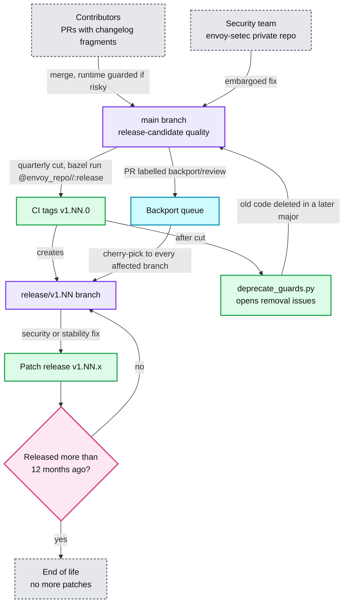

**What to notice**

- **Two clocks run on every guard**: the release cut starts `deprecate_guards.py` [RELEASES.md:150](https://github.com/envoyproxy/envoy/blob/v1.39.1/RELEASES.md#L150), which files an issue once a guard has defaulted true for 183 days [deprecate_guards.py:117](https://github.com/envoyproxy/envoy/blob/v1.39.1/tools/deprecate_guards/deprecate_guards.py#L117). The release train is also the deletion train.
- **Security fixes go to `main` first**, then fan out to every supported branch [RELEASES.md:25-28](https://github.com/envoyproxy/envoy/blob/v1.39.1/RELEASES.md#L25-L28). A security release is one patch per supported line on the same day.
- **EOL is date based, not count based.** 1.35.0 shipped 8 days late, so its EOL is 2026-07-23, not 2026-07-15 [RELEASES.md:120](https://github.com/envoyproxy/envoy/blob/v1.39.1/RELEASES.md#L120).

### 2.2 A security release, end to end

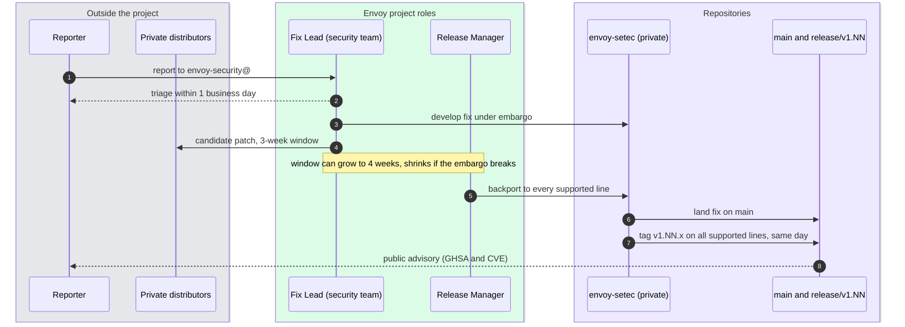

**What to notice**

- **Fix or disclose within 90 days** is the outer bound [SECURITY.md:149-151](https://github.com/envoyproxy/envoy/blob/v1.39.1/SECURITY.md#L149-L151). Fuzz bugs have the same 90-day deadline.
- **Only supported lines get a release.** A bug that affects only an EOL line is shared with distributors under embargo and then filed as a GitHub issue, with no release [SECURITY.md:79-83](https://github.com/envoyproxy/envoy/blob/v1.39.1/SECURITY.md#L79-L83).
- **1.39.1 is a typical security patch**: 13 CVE identifiers in one release [documented, counted in [1.39.1.yaml:4](https://github.com/envoyproxy/envoy/blob/v1.39.1/changelogs/1.39.1.yaml#L4) onward].

### 2.3 Support windows, 1.33 to 1.39

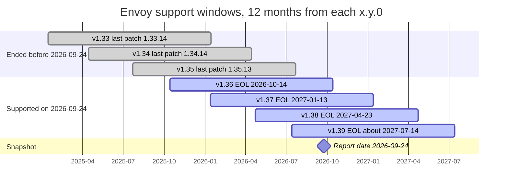

**Supported lines on 2026-09-24** (four, as the 12-month rule predicts):

| Line | Released | Latest patch | EOL | Days left on 2026-09-24 |
|---|---|---|---|---|
| 1.39 | 2026-07-14 [1.39.0.yaml:1](https://github.com/envoyproxy/envoy/blob/v1.39.1/changelogs/1.39.0.yaml#L1) | 1.39.1, 2026-08-27 [1.39.1.yaml:1](https://github.com/envoyproxy/envoy/blob/v1.39.1/changelogs/1.39.1.yaml#L1) | not yet in RELEASES.md, about 2027-07-14 by the 12-month rule [inferred] [RELEASES.md:124](https://github.com/envoyproxy/envoy/blob/v1.39.1/RELEASES.md#L124) | about 293 |
| 1.38 | 2026-04-23 [1.38.0.yaml:1](https://github.com/envoyproxy/envoy/blob/v1.39.1/changelogs/1.38.0.yaml#L1) | 1.38.4, 2026-08-26 [1.38.4.yaml:1](https://github.com/envoyproxy/envoy/blob/v1.39.1/changelogs/1.38.4.yaml#L1) | 2027-04-23 [RELEASES.md:123](https://github.com/envoyproxy/envoy/blob/v1.39.1/RELEASES.md#L123) | 211 |
| 1.37 | 2026-01-13 [1.37.0.yaml:1](https://github.com/envoyproxy/envoy/blob/v1.39.1/changelogs/1.37.0.yaml#L1) | 1.37.6, 2026-08-26 [1.37.6.yaml:1](https://github.com/envoyproxy/envoy/blob/v1.39.1/changelogs/1.37.6.yaml#L1) | 2027-01-13 [RELEASES.md:122](https://github.com/envoyproxy/envoy/blob/v1.39.1/RELEASES.md#L122) | 111 |
| 1.36 | 2025-10-14 [1.36.0.yaml:1](https://github.com/envoyproxy/envoy/blob/v1.39.1/changelogs/1.36.0.yaml#L1) | 1.36.10, 2026-08-26 [1.36.10.yaml:1](https://github.com/envoyproxy/envoy/blob/v1.39.1/changelogs/1.36.10.yaml#L1) | 2026-10-14 [RELEASES.md:121](https://github.com/envoyproxy/envoy/blob/v1.39.1/RELEASES.md#L121) | **20** |

- **1.36 is about to drop out.** The next scheduled security release is 2026-09-29 [RELEASES.md:176](https://github.com/envoyproxy/envoy/blob/v1.39.1/RELEASES.md#L176), so 1.36.11 is plausibly its last patch [inferred].
- **1.35 is already out**: its EOL was 2026-07-23 and its last patch 1.35.13 shipped 2026-06-23 [1.35.13.yaml:1](https://github.com/envoyproxy/envoy/blob/v1.39.1/changelogs/1.35.13.yaml#L1). Anyone still on 1.35 missed the 13 CVEs fixed on 2026-08-26/27.
- **Schedule quirks**: RELEASES.md leaves the 1.39.0 "Actual" cell empty although the changelog is dated July 14, 2026, and it lists two "2026 Q3" security rows [RELEASES.md:175-176](https://github.com/envoyproxy/envoy/blob/v1.39.1/RELEASES.md#L175-L176).

---

## 3. Release timeline 1.30.0 to 1.39.1

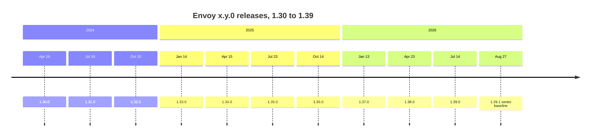

| Line | x.y.0 date | Latest patch | Latest patch date | Patches | EOL (RELEASES.md) |
|---|---|---|---|---|---|
| 1.30 | 2024-04-16 [1.30.0.yaml:1](https://github.com/envoyproxy/envoy/blob/v1.39.1/changelogs/1.30.0.yaml#L1) | 1.30.11 [1.30.11.yaml:1](https://github.com/envoyproxy/envoy/blob/v1.39.1/changelogs/1.30.11.yaml#L1) | 2025-03-25 | 11 | 2025-04-16 |
| 1.31 | 2024-07-19 [1.31.0.yaml:1](https://github.com/envoyproxy/envoy/blob/v1.39.1/changelogs/1.31.0.yaml#L1) | 1.31.10 [1.31.10.yaml:1](https://github.com/envoyproxy/envoy/blob/v1.39.1/changelogs/1.31.10.yaml#L1) | 2025-07-18 | 10 | 2025-07-19 |
| 1.32 | 2024-10-15 [1.32.0.yaml:1](https://github.com/envoyproxy/envoy/blob/v1.39.1/changelogs/1.32.0.yaml#L1) | 1.32.13 [1.32.13.yaml:1](https://github.com/envoyproxy/envoy/blob/v1.39.1/changelogs/1.32.13.yaml#L1) | 2025-10-13 | 13 | 2025-10-15 |
| 1.33 | 2025-01-14 [1.33.0.yaml:1](https://github.com/envoyproxy/envoy/blob/v1.39.1/changelogs/1.33.0.yaml#L1) | 1.33.14 [1.33.14.yaml:1](https://github.com/envoyproxy/envoy/blob/v1.39.1/changelogs/1.33.14.yaml#L1) | 2025-12-09 | 14 | 2026-01-14 |
| 1.34 | 2025-04-15 [1.34.0.yaml:1](https://github.com/envoyproxy/envoy/blob/v1.39.1/changelogs/1.34.0.yaml#L1) | 1.34.14 [1.34.14.yaml:1](https://github.com/envoyproxy/envoy/blob/v1.39.1/changelogs/1.34.14.yaml#L1) | 2026-04-10 | 14 | 2026-04-15 |
| 1.35 | 2025-07-23 [1.35.0.yaml:1](https://github.com/envoyproxy/envoy/blob/v1.39.1/changelogs/1.35.0.yaml#L1) | 1.35.13 [1.35.13.yaml:1](https://github.com/envoyproxy/envoy/blob/v1.39.1/changelogs/1.35.13.yaml#L1) | 2026-06-23 | 13 | 2026-07-23 |
| 1.36 | 2025-10-14 [1.36.0.yaml:1](https://github.com/envoyproxy/envoy/blob/v1.39.1/changelogs/1.36.0.yaml#L1) | 1.36.10 [1.36.10.yaml:1](https://github.com/envoyproxy/envoy/blob/v1.39.1/changelogs/1.36.10.yaml#L1) | 2026-08-26 | 10 | 2026-10-14 |
| 1.37 | 2026-01-13 [1.37.0.yaml:1](https://github.com/envoyproxy/envoy/blob/v1.39.1/changelogs/1.37.0.yaml#L1) | 1.37.6 [1.37.6.yaml:1](https://github.com/envoyproxy/envoy/blob/v1.39.1/changelogs/1.37.6.yaml#L1) | 2026-08-26 | 6 | 2027-01-13 |
| 1.38 | 2026-04-23 [1.38.0.yaml:1](https://github.com/envoyproxy/envoy/blob/v1.39.1/changelogs/1.38.0.yaml#L1) | 1.38.4 [1.38.4.yaml:1](https://github.com/envoyproxy/envoy/blob/v1.39.1/changelogs/1.38.4.yaml#L1) | 2026-08-26 | 4 | 2027-04-23 |
| 1.39 | 2026-07-14 [1.39.0.yaml:1](https://github.com/envoyproxy/envoy/blob/v1.39.1/changelogs/1.39.0.yaml#L1) | 1.39.1 [1.39.1.yaml:1](https://github.com/envoyproxy/envoy/blob/v1.39.1/changelogs/1.39.1.yaml#L1) | 2026-08-27 | 1 | not listed yet |

- **Slips are small**: of the ten majors, only 1.31 (+3 days), 1.35 (+8) and 1.38 (+9) missed the target date [RELEASES.md:115-124](https://github.com/envoyproxy/envoy/blob/v1.39.1/RELEASES.md#L115-L124).
- **Changelog headers are not always the release date.** The `1.14.0.yaml` header says July 7, 2020, while RELEASES.md says 2020/04/08; 1.26.0 to 1.28.0 differ by one day. Quote RELEASES.md for dates [documented].

---

## 4. Per-release notable changes, 1.30 to 1.39

Each subsection keeps only what matters for the series topics. "Breaking" means it can change a running deployment's behaviour with no config change. Guard names are `envoy.reloadable_features.*` unless stated.

### 4.1 Envoy 1.30 (2024-04-16)

- **Breaking**
  - HTTP: hop-by-hop `TE` is stripped from downstream requests unless it is `trailers` [1.30.0.yaml:4](https://github.com/envoyproxy/envoy/blob/v1.39.1/changelogs/1.30.0.yaml#L4).
  - HTTP/2: `http2_use_oghttp2` flipped back to `false` after users hit issues #32611 and #32401 [1.30.0.yaml:13](https://github.com/envoyproxy/envoy/blob/v1.39.1/changelogs/1.30.0.yaml#L13).
  - Upstream: EDS hosts in `DRAINING` are excluded from load balancing and the panic calculation [1.30.0.yaml:41](https://github.com/envoyproxy/envoy/blob/v1.39.1/changelogs/1.30.0.yaml#L41).
  - HTTP: `CONNECT` is now proxied upstream unless `connect_config` is set; before, Envoy terminated it [1.30.0.yaml:72](https://github.com/envoyproxy/envoy/blob/v1.39.1/changelogs/1.30.0.yaml#L72).
  - Stats: `enable_include_histograms` on, so sink predicates filter histograms [1.30.0.yaml:8](https://github.com/envoyproxy/envoy/blob/v1.39.1/changelogs/1.30.0.yaml#L8).
  - xDS: delta SDS removals no longer NACK with "Missing SDS resources" [1.30.0.yaml:113](https://github.com/envoyproxy/envoy/blob/v1.39.1/changelogs/1.30.0.yaml#L113).
- **New**: credential injector filter [1.30.0.yaml:272](https://github.com/envoyproxy/envoy/blob/v1.39.1/changelogs/1.30.0.yaml#L272); ext_proc as an upstream filter [1.30.0.yaml:352](https://github.com/envoyproxy/envoy/blob/v1.39.1/changelogs/1.30.0.yaml#L352); least request `FULL_SCAN` selection [1.30.0.yaml:368](https://github.com/envoyproxy/envoy/blob/v1.39.1/changelogs/1.30.0.yaml#L368); load shed points `hcm_ondata_creating_codec` and `http_downstream_filter_check` [1.30.0.yaml:398](https://github.com/envoyproxy/envoy/blob/v1.39.1/changelogs/1.30.0.yaml#L398) [1.30.0.yaml:497](https://github.com/envoyproxy/envoy/blob/v1.39.1/changelogs/1.30.0.yaml#L497); `--skip-hot-restart-on-no-parent` [1.30.0.yaml:289](https://github.com/envoyproxy/envoy/blob/v1.39.1/changelogs/1.30.0.yaml#L289); gRPC max received message size (default 0, unlimited) [1.30.0.yaml:492](https://github.com/envoyproxy/envoy/blob/v1.39.1/changelogs/1.30.0.yaml#L492).
- **Removed**: 8 runtime guards and their legacy code [1.30.0.yaml:246](https://github.com/envoyproxy/envoy/blob/v1.39.1/changelogs/1.30.0.yaml#L246).
- **Deprecated**: runtime key `overload.global_downstream_max_connections`, replaced by the downstream connections resource monitor [1.30.0.yaml:515](https://github.com/envoyproxy/envoy/blob/v1.39.1/changelogs/1.30.0.yaml#L515).

### 4.2 Envoy 1.31 (2024-07-19)

- **Breaking**
  - Threading: `SlotImpl` destructor may run on any thread [1.31.0.yaml:4](https://github.com/envoyproxy/envoy/blob/v1.39.1/changelogs/1.31.0.yaml#L4) (see [report 01](envoy-01-threading-and-process-model.md)).
  - HTTP/2: `http2_use_oghttp2` flipped to `true` [1.31.0.yaml:14](https://github.com/envoyproxy/envoy/blob/v1.39.1/changelogs/1.31.0.yaml#L14), then back to `false` in patch 1.31.2 "to address stability concerns" [1.31.2.yaml:12](https://github.com/envoyproxy/envoy/blob/v1.39.1/changelogs/1.31.2.yaml#L12).
  - Runtime: invalid YAML in runtime layers is rejected [1.31.0.yaml:27](https://github.com/envoyproxy/envoy/blob/v1.39.1/changelogs/1.31.0.yaml#L27).
  - Local rate limit: token buckets refill on access, no timer [1.31.0.yaml:52](https://github.com/envoyproxy/envoy/blob/v1.39.1/changelogs/1.31.0.yaml#L52).
  - ext_proc: timeouts return `504` instead of `500` [1.31.0.yaml:60](https://github.com/envoyproxy/envoy/blob/v1.39.1/changelogs/1.31.0.yaml#L60).
  - Access log: `%UPSTREAM_REMOTE_ADDRESS%` reports the connection address, not the host address [1.31.0.yaml:104](https://github.com/envoyproxy/envoy/blob/v1.39.1/changelogs/1.31.0.yaml#L104).
  - xDS: `ApiVersion.AUTO` now means V3 [1.31.0.yaml:125](https://github.com/envoyproxy/envoy/blob/v1.39.1/changelogs/1.31.0.yaml#L125); xDS-TP paths may contain a raw `:` [1.31.0.yaml:85](https://github.com/envoyproxy/envoy/blob/v1.39.1/changelogs/1.31.0.yaml#L85).
  - HTTP/3: upstream happy eyeballs on [1.31.0.yaml:18](https://github.com/envoyproxy/envoy/blob/v1.39.1/changelogs/1.31.0.yaml#L18) (turned off again in 1.36).
- **New**: ext_proc observability mode (deprecates `async_mode`) [1.31.0.yaml:515](https://github.com/envoyproxy/envoy/blob/v1.39.1/changelogs/1.31.0.yaml#L515); outlier detection `always_eject_one_host` [1.31.0.yaml:471](https://github.com/envoyproxy/envoy/blob/v1.39.1/changelogs/1.31.0.yaml#L471); `reset-before-request` retry policy [1.31.0.yaml:512](https://github.com/envoyproxy/envoy/blob/v1.39.1/changelogs/1.31.0.yaml#L512); listener `bypass_overload_manager` [1.31.0.yaml:475](https://github.com/envoyproxy/envoy/blob/v1.39.1/changelogs/1.31.0.yaml#L475); Wasm as an upstream filter [1.31.0.yaml:448](https://github.com/envoyproxy/envoy/blob/v1.39.1/changelogs/1.31.0.yaml#L448); `--skip-hot-restart-parent-stats` [1.31.0.yaml:370](https://github.com/envoyproxy/envoy/blob/v1.39.1/changelogs/1.31.0.yaml#L370).
- **Removed**: 25 guards, including `send_goaway_for_premature_rst_streams` (a restart feature) [1.31.0.yaml:295](https://github.com/envoyproxy/envoy/blob/v1.39.1/changelogs/1.31.0.yaml#L295).
- **Deprecated**: OpenCensus disabled by default [1.31.0.yaml:540](https://github.com/envoyproxy/envoy/blob/v1.39.1/changelogs/1.31.0.yaml#L540).

### 4.3 Envoy 1.32 (2024-10-15)

- **Breaking**
  - Tracing: OpenTracing support removed [1.32.0.yaml:4](https://github.com/envoyproxy/envoy/blob/v1.39.1/changelogs/1.32.0.yaml#L4).
  - EDS: caching of EDS assignments with ADS is on by default. After a cluster update Envoy keeps the old assignment and waits up to `initial_fetch_timeout` for a new one [1.32.0.yaml:28](https://github.com/envoyproxy/envoy/blob/v1.39.1/changelogs/1.32.0.yaml#L28) (see [report 06](envoy-06-xds-control-plane.md)).
  - Access log: handlers added by filters now run before configured ones [1.32.0.yaml:49](https://github.com/envoyproxy/envoy/blob/v1.39.1/changelogs/1.32.0.yaml#L49).
  - xDS: once connected to the primary or failover source, Envoy sticks with it [1.32.0.yaml:119](https://github.com/envoyproxy/envoy/blob/v1.39.1/changelogs/1.32.0.yaml#L119).
  - UDP: Don't Fragment bit set on UDP listener and QUIC upstream sockets [1.32.0.yaml:127](https://github.com/envoyproxy/envoy/blob/v1.39.1/changelogs/1.32.0.yaml#L127).
  - HTTP/2: oghttp2 guard confirmed `false` [1.32.0.yaml:123](https://github.com/envoyproxy/envoy/blob/v1.39.1/changelogs/1.32.0.yaml#L123).
- **Opt-in**: HTTP/2 and HTTP/3 upstream half-close before downstream, behind `allow_multiplexed_upstream_half_close`, which is still a `FALSE_RUNTIME_GUARD` in 1.39.1 [1.32.0.yaml:12](https://github.com/envoyproxy/envoy/blob/v1.39.1/changelogs/1.32.0.yaml#L12) [runtime_features.cc:249](https://github.com/envoyproxy/envoy/blob/v1.39.1/source/common/runtime/runtime_features.cc#L249).
- **New**: `max_response_headers_kb` [1.32.0.yaml:327](https://github.com/envoyproxy/envoy/blob/v1.39.1/changelogs/1.32.0.yaml#L327); JSON access log formatter "16-25x" faster [1.32.0.yaml:426](https://github.com/envoyproxy/envoy/blob/v1.39.1/changelogs/1.32.0.yaml#L426); CPU utilization resource monitor [1.32.0.yaml:452](https://github.com/envoyproxy/envoy/blob/v1.39.1/changelogs/1.32.0.yaml#L452); `dns_jitter` [1.32.0.yaml:296](https://github.com/envoyproxy/envoy/blob/v1.39.1/changelogs/1.32.0.yaml#L296); client-side weighted round robin (WIP) [1.32.0.yaml:492](https://github.com/envoyproxy/envoy/blob/v1.39.1/changelogs/1.32.0.yaml#L492); QUIC certificate compression [1.32.0.yaml:340](https://github.com/envoyproxy/envoy/blob/v1.39.1/changelogs/1.32.0.yaml#L340).
- **Removed**: 19 guards [1.32.0.yaml:230](https://github.com/envoyproxy/envoy/blob/v1.39.1/changelogs/1.32.0.yaml#L230).

### 4.4 Envoy 1.33 (2025-01-14)

- **Breaking**
  - **Security: RFC1918 addresses are no longer internal by default.** Probes that set `x-envoy-*` headers must be listed in `internal_address_config` [1.33.0.yaml:18](https://github.com/envoyproxy/envoy/blob/v1.39.1/changelogs/1.33.0.yaml#L18) (see [report 07](envoy-07-security.md)).
  - Tracing: OpenCensus removed [1.33.0.yaml:8](https://github.com/envoyproxy/envoy/blob/v1.39.1/changelogs/1.33.0.yaml#L8).
  - Router: shadowing streams in parallel with the original request, so shadows can exceed the buffer limit and fire for cancelled requests [1.33.0.yaml:27](https://github.com/envoyproxy/envoy/blob/v1.39.1/changelogs/1.33.0.yaml#L27).
  - Wasm: route cache not cleared on header edits for ABI newer than 0.2.1; deprecated xDS attributes removed from `get_property` [1.33.0.yaml:11](https://github.com/envoyproxy/envoy/blob/v1.39.1/changelogs/1.33.0.yaml#L11) [1.33.0.yaml:15](https://github.com/envoyproxy/envoy/blob/v1.39.1/changelogs/1.33.0.yaml#L15).
  - Access log: new JSON formatter on; `sort_properties` ignored and value types preserved (`duration` becomes a number) [1.33.0.yaml:41](https://github.com/envoyproxy/envoy/blob/v1.39.1/changelogs/1.33.0.yaml#L41).
  - OAuth2: `use_refresh_token` on by default [1.33.0.yaml:75](https://github.com/envoyproxy/envoy/blob/v1.39.1/changelogs/1.33.0.yaml#L75).
- **New**: ADS replacement at runtime [1.33.0.yaml:285](https://github.com/envoyproxy/envoy/blob/v1.39.1/changelogs/1.33.0.yaml#L285); Wasm VM reload on failure [1.33.0.yaml:258](https://github.com/envoyproxy/envoy/blob/v1.39.1/changelogs/1.33.0.yaml#L258) and Go SDK support [1.33.0.yaml:263](https://github.com/envoyproxy/envoy/blob/v1.39.1/changelogs/1.33.0.yaml#L263); ext_proc over HTTP [1.33.0.yaml:376](https://github.com/envoyproxy/envoy/blob/v1.39.1/changelogs/1.33.0.yaml#L376); API key auth filter [1.33.0.yaml:337](https://github.com/envoyproxy/envoy/blob/v1.39.1/changelogs/1.33.0.yaml#L337); overload-scaled max connection duration [1.33.0.yaml:315](https://github.com/envoyproxy/envoy/blob/v1.39.1/changelogs/1.33.0.yaml#L315); `--skip-deprecated-logs` [1.33.0.yaml:454](https://github.com/envoyproxy/envoy/blob/v1.39.1/changelogs/1.33.0.yaml#L454).
- **Removed**: 12 guards, including `http_route_connect_proxy_by_default` and `sanitize_te` [1.33.0.yaml:229](https://github.com/envoyproxy/envoy/blob/v1.39.1/changelogs/1.33.0.yaml#L229) [1.33.0.yaml:238](https://github.com/envoyproxy/envoy/blob/v1.39.1/changelogs/1.33.0.yaml#L238).
- **Deprecated**: DNS fields on `Cluster` in favour of the `DnsCluster` extension [1.33.0.yaml:463](https://github.com/envoyproxy/envoy/blob/v1.39.1/changelogs/1.33.0.yaml#L463); `aws_iam` announced for deletion [1.33.0.yaml:470](https://github.com/envoyproxy/envoy/blob/v1.39.1/changelogs/1.33.0.yaml#L470).

### 4.5 Envoy 1.34 (2025-04-15)

- **Breaking** (all in `minor_behavior_changes`, there is no `behavior_changes` section)
  - HTTP/2: `http2_use_oghttp2` set to `true` [1.34.0.yaml:9](https://github.com/envoyproxy/envoy/blob/v1.39.1/changelogs/1.34.0.yaml#L9). Patch 1.34.3 still called oghttp2 "the default codec" [1.34.3.yaml:11](https://github.com/envoyproxy/envoy/blob/v1.39.1/changelogs/1.34.3.yaml#L11).
  - HTTP: `generate_request_id` also replaces an **empty** `x-request-id` [1.34.0.yaml:29](https://github.com/envoyproxy/envoy/blob/v1.39.1/changelogs/1.34.0.yaml#L29).
  - TLS: FIPS builds use the same BoringSSL as regular builds [1.34.0.yaml:57](https://github.com/envoyproxy/envoy/blob/v1.39.1/changelogs/1.34.0.yaml#L57).
- **New**: **dynamic modules** (shared libraries loaded at runtime) [1.34.0.yaml:338](https://github.com/envoyproxy/envoy/blob/v1.39.1/changelogs/1.34.0.yaml#L338); asynchronous load balancing (alpha) [1.34.0.yaml:266](https://github.com/envoyproxy/envoy/blob/v1.39.1/changelogs/1.34.0.yaml#L266); ext_proc `FULL_DUPLEX_STREAMED` body mode [1.34.0.yaml:276](https://github.com/envoyproxy/envoy/blob/v1.39.1/changelogs/1.34.0.yaml#L276); io_uring option in the default socket interface [1.34.0.yaml:384](https://github.com/envoyproxy/envoy/blob/v1.39.1/changelogs/1.34.0.yaml#L384); QUIC-LB connection IDs [1.34.0.yaml:271](https://github.com/envoyproxy/envoy/blob/v1.39.1/changelogs/1.34.0.yaml#L271); configurable HTTP/2 `max_metadata_size` [1.34.0.yaml:299](https://github.com/envoyproxy/envoy/blob/v1.39.1/changelogs/1.34.0.yaml#L299).
- **Removed**: 10 guards, including `reject_invalid_yaml` and `allow_slot_destroy_on_worker_threads` [1.34.0.yaml:171](https://github.com/envoyproxy/envoy/blob/v1.39.1/changelogs/1.34.0.yaml#L171).

### 4.6 Envoy 1.35 (2025-07-23)

- **Breaking**
  - `grpc_credentials/aws_iam` deleted: configs referencing it fail to load [1.35.0.yaml:4](https://github.com/envoyproxy/envoy/blob/v1.39.1/changelogs/1.35.0.yaml#L4). Contrib Squash filter deleted [1.35.0.yaml:27](https://github.com/envoyproxy/envoy/blob/v1.39.1/changelogs/1.35.0.yaml#L27).
  - Matching: `prefix_match_map` falls back to shorter prefixes when a longer match has no action [1.35.0.yaml:9](https://github.com/envoyproxy/envoy/blob/v1.39.1/changelogs/1.35.0.yaml#L9).
  - Server: soft file descriptor limit raised to the hard limit (restart guard `raise_file_limits`) [1.35.0.yaml:18](https://github.com/envoyproxy/envoy/blob/v1.39.1/changelogs/1.35.0.yaml#L18).
  - OAuth2: token cookies encrypted with the HMAC secret [1.35.0.yaml:95](https://github.com/envoyproxy/envoy/blob/v1.39.1/changelogs/1.35.0.yaml#L95); OAuth cookies no longer forwarded upstream [1.35.0.yaml:109](https://github.com/envoyproxy/envoy/blob/v1.39.1/changelogs/1.35.0.yaml#L109); extension promoted to stable [1.35.0.yaml:106](https://github.com/envoyproxy/envoy/blob/v1.39.1/changelogs/1.35.0.yaml#L106).
  - ext_proc: a spurious server message now triggers fail-open or fail-close per `failure_mode_allow` [1.35.0.yaml:85](https://github.com/envoyproxy/envoy/blob/v1.39.1/changelogs/1.35.0.yaml#L85).
- **New**: built with C++20 [1.35.0.yaml:224](https://github.com/envoyproxy/envoy/blob/v1.39.1/changelogs/1.35.0.yaml#L224); override host LB policy [1.35.0.yaml:247](https://github.com/envoyproxy/envoy/blob/v1.39.1/changelogs/1.35.0.yaml#L247); hash policy on ring hash and Maglev [1.35.0.yaml:251](https://github.com/envoyproxy/envoy/blob/v1.39.1/changelogs/1.35.0.yaml#L251); cgroup memory resource monitor [1.35.0.yaml:263](https://github.com/envoyproxy/envoy/blob/v1.39.1/changelogs/1.35.0.yaml#L263); JA4 fingerprinting in `tls_inspector` [1.35.0.yaml:296](https://github.com/envoyproxy/envoy/blob/v1.39.1/changelogs/1.35.0.yaml#L296); `connection_pool_new_connection` load shed point [1.35.0.yaml:323](https://github.com/envoyproxy/envoy/blob/v1.39.1/changelogs/1.35.0.yaml#L323); TLS certificate expiry metrics [1.35.0.yaml:364](https://github.com/envoyproxy/envoy/blob/v1.39.1/changelogs/1.35.0.yaml#L364).
- **Removed**: 15 guards, including **`http1_use_balsa_parser`**: http_parser is gone from the HTTP/1 codec path [1.35.0.yaml:219](https://github.com/envoyproxy/envoy/blob/v1.39.1/changelogs/1.35.0.yaml#L219).

### 4.7 Envoy 1.36 (2025-10-14)

- **Breaking**
  - **HTTP/2 defaults**: `max_concurrent_streams` 2147483647 to 1024, stream window 256 MiB to 16 MiB, connection window 256 MiB to 24 MiB. Revert with `safe_http2_options` [1.36.0.yaml:25](https://github.com/envoyproxy/envoy/blob/v1.39.1/changelogs/1.36.0.yaml#L25). Long-lived gRPC streams on high bandwidth-delay paths are the ones to re-test [inferred].
  - HTTP/1.1 proxy transport socket sends RFC 9110 `CONNECT` with a `Host` header [1.36.0.yaml:4](https://github.com/envoyproxy/envoy/blob/v1.39.1/changelogs/1.36.0.yaml#L4).
  - Tracing: a route refresh re-applies the trace decision of the new route [1.36.0.yaml:15](https://github.com/envoyproxy/envoy/blob/v1.39.1/changelogs/1.36.0.yaml#L15).
  - HTTP/3: upstream happy eyeballs off, because it favoured TCP when UDP over IPv6 failed [1.36.0.yaml:80](https://github.com/envoyproxy/envoy/blob/v1.39.1/changelogs/1.36.0.yaml#L80).
  - Generic proxy codec now enforces the connection buffer limit [1.36.0.yaml:75](https://github.com/envoyproxy/envoy/blob/v1.39.1/changelogs/1.36.0.yaml#L75).
- **New**: reverse tunnels between Envoys [1.36.0.yaml:640](https://github.com/envoyproxy/envoy/blob/v1.39.1/changelogs/1.36.0.yaml#L640); evictable metrics [1.36.0.yaml:328](https://github.com/envoyproxy/envoy/blob/v1.39.1/changelogs/1.36.0.yaml#L328); `stream_flush_timeout` separate from `stream_idle_timeout` [1.36.0.yaml:582](https://github.com/envoyproxy/envoy/blob/v1.39.1/changelogs/1.36.0.yaml#L582); `http2_server_go_away_and_close_on_dispatch` load shed point [1.36.0.yaml:438](https://github.com/envoyproxy/envoy/blob/v1.39.1/changelogs/1.36.0.yaml#L438); router `request_body_buffer_limit` [1.36.0.yaml:444](https://github.com/envoyproxy/envoy/blob/v1.39.1/changelogs/1.36.0.yaml#L444); dynamic modules logging and metrics ABIs [1.36.0.yaml:569](https://github.com/envoyproxy/envoy/blob/v1.39.1/changelogs/1.36.0.yaml#L569) [1.36.0.yaml:609](https://github.com/envoyproxy/envoy/blob/v1.39.1/changelogs/1.36.0.yaml#L609); outlier detection driven by an HTTP matcher [1.36.0.yaml:635](https://github.com/envoyproxy/envoy/blob/v1.39.1/changelogs/1.36.0.yaml#L635).
- **Removed**: 31 guards, including `explicit_internal_address_config` (the RFC1918 revert) and `streaming_shadow` [1.36.0.yaml:234](https://github.com/envoyproxy/envoy/blob/v1.39.1/changelogs/1.36.0.yaml#L234) [1.36.0.yaml:258](https://github.com/envoyproxy/envoy/blob/v1.39.1/changelogs/1.36.0.yaml#L258).
- **Deprecated**: legacy header formatter syntax `%DYNAMIC_METADATA(["ns", "key"])%` [1.36.0.yaml:95](https://github.com/envoyproxy/envoy/blob/v1.39.1/changelogs/1.36.0.yaml#L95).

### 4.8 Envoy 1.37 (2026-01-13)

- **Breaking**
  - HTTP: default reset code `NO_ERROR` to `INTERNAL_ERROR` [1.37.0.yaml:17](https://github.com/envoyproxy/envoy/blob/v1.39.1/changelogs/1.37.0.yaml#L17); upstream protocol errors are no longer propagated downstream [1.37.0.yaml:21](https://github.com/envoyproxy/envoy/blob/v1.39.1/changelogs/1.37.0.yaml#L21).
  - Dynamic modules: ABI changed for streaming body access; modules must be rebuilt [1.37.0.yaml:12](https://github.com/envoyproxy/envoy/blob/v1.39.1/changelogs/1.37.0.yaml#L12).
  - Proto API scrubber: blocked methods return `404` instead of `403` [1.37.0.yaml:32](https://github.com/envoyproxy/envoy/blob/v1.39.1/changelogs/1.37.0.yaml#L32).
  - Server: "container-aware CPU detection". Read the erratum in section 9: the code applies it only with `--cpuset-threads` [1.37.0.yaml:4](https://github.com/envoyproxy/envoy/blob/v1.39.1/changelogs/1.37.0.yaml#L4).
  - ext_proc: gRPC stream closed as soon as no more processing is needed [1.37.0.yaml:66](https://github.com/envoyproxy/envoy/blob/v1.39.1/changelogs/1.37.0.yaml#L66).
- **New**: **MCP filter** and **`mcp_router`** (Model Context Protocol, AI gateway) [1.37.0.yaml:690](https://github.com/envoyproxy/envoy/blob/v1.39.1/changelogs/1.37.0.yaml#L690) [1.37.0.yaml:702](https://github.com/envoyproxy/envoy/blob/v1.39.1/changelogs/1.37.0.yaml#L702); dynamic modules as network, listener, UDP listener, bootstrap and access-log extensions [1.37.0.yaml:318](https://github.com/envoyproxy/envoy/blob/v1.39.1/changelogs/1.37.0.yaml#L318) [1.37.0.yaml:372](https://github.com/envoyproxy/envoy/blob/v1.39.1/changelogs/1.37.0.yaml#L372); listener `filter_chain_matcher` marked stable [1.37.0.yaml:385](https://github.com/envoyproxy/envoy/blob/v1.39.1/changelogs/1.37.0.yaml#L385); composite cluster for retry-aware fallback [1.37.0.yaml:708](https://github.com/envoyproxy/envoy/blob/v1.39.1/changelogs/1.37.0.yaml#L708); cluster-level retry and mirror policies [1.37.0.yaml:579](https://github.com/envoyproxy/envoy/blob/v1.39.1/changelogs/1.37.0.yaml#L579) [1.37.0.yaml:574](https://github.com/envoyproxy/envoy/blob/v1.39.1/changelogs/1.37.0.yaml#L574); cookie route matching [1.37.0.yaml:443](https://github.com/envoyproxy/envoy/blob/v1.39.1/changelogs/1.37.0.yaml#L443); admin `allow_paths` [1.37.0.yaml:659](https://github.com/envoyproxy/envoy/blob/v1.39.1/changelogs/1.37.0.yaml#L659); istio/proxy extensions moved into `contrib/` [1.37.0.yaml:716](https://github.com/envoyproxy/envoy/blob/v1.39.1/changelogs/1.37.0.yaml#L716).
- **Removed**: 13 guards, including three Balsa guards [1.37.0.yaml:245](https://github.com/envoyproxy/envoy/blob/v1.39.1/changelogs/1.37.0.yaml#L245).
- **Deprecated**: `common_config` in the OpenTelemetry access logger [1.37.0.yaml:790](https://github.com/envoyproxy/envoy/blob/v1.39.1/changelogs/1.37.0.yaml#L790).

### 4.9 Envoy 1.38 (2026-04-23)

- **Breaking**
  - tcp_proxy: delayed `upstream_connect_mode` now **requires** `max_early_data_bytes`; configs without it fail [1.38.0.yaml:4](https://github.com/envoyproxy/envoy/blob/v1.39.1/changelogs/1.38.0.yaml#L4).
  - TLS: `enforce_rsa_key_usage` defaults to `true` [1.38.0.yaml:24](https://github.com/envoyproxy/envoy/blob/v1.39.1/changelogs/1.38.0.yaml#L24). FIPS builds use `--config=boringssl-fips` [1.38.0.yaml:19](https://github.com/envoyproxy/envoy/blob/v1.39.1/changelogs/1.38.0.yaml#L19).
  - on_demand CDS no longer recreates the stream, so earlier filters run once [1.38.0.yaml:13](https://github.com/envoyproxy/envoy/blob/v1.39.1/changelogs/1.38.0.yaml#L13).
  - ext_authz and rate limit: `timeout: 0s` now means **no timeout** instead of immediate failure, with no revert guard [1.38.0.yaml:75](https://github.com/envoyproxy/envoy/blob/v1.39.1/changelogs/1.38.0.yaml#L75) [1.38.0.yaml:80](https://github.com/envoyproxy/envoy/blob/v1.39.1/changelogs/1.38.0.yaml#L80).
  - Memory: tcmalloc release moved to tcmalloc's native background actions [1.38.0.yaml:64](https://github.com/envoyproxy/envoy/blob/v1.39.1/changelogs/1.38.0.yaml#L64).
  - MCP metadata namespace `mcp_proxy` to `envoy.filters.http.mcp` [1.38.0.yaml:70](https://github.com/envoyproxy/envoy/blob/v1.39.1/changelogs/1.38.0.yaml#L70).
- **New**: **dynamic modules HTTP filter promoted to stable** [1.38.0.yaml:1103](https://github.com/envoyproxy/envoy/blob/v1.39.1/changelogs/1.38.0.yaml#L1103); A2A (Agent2Agent) parsing [1.38.0.yaml:952](https://github.com/envoyproxy/envoy/blob/v1.39.1/changelogs/1.38.0.yaml#L952); MCP JSON REST bridge [1.38.0.yaml:959](https://github.com/envoyproxy/envoy/blob/v1.39.1/changelogs/1.38.0.yaml#L959); MCP multi-cluster [1.38.0.yaml:995](https://github.com/envoyproxy/envoy/blob/v1.39.1/changelogs/1.38.0.yaml#L995); `sse_to_metadata` [1.38.0.yaml:806](https://github.com/envoyproxy/envoy/blob/v1.39.1/changelogs/1.38.0.yaml#L806); ext_authz `shadow_mode` [1.38.0.yaml:427](https://github.com/envoyproxy/envoy/blob/v1.39.1/changelogs/1.38.0.yaml#L427); passive degraded-host detection [1.38.0.yaml:544](https://github.com/envoyproxy/envoy/blob/v1.39.1/changelogs/1.38.0.yaml#L544); close connections stuck above the high watermark [1.38.0.yaml:822](https://github.com/envoyproxy/envoy/blob/v1.39.1/changelogs/1.38.0.yaml#L822); `close_idle_http_connections` overload action [1.38.0.yaml:1079](https://github.com/envoyproxy/envoy/blob/v1.39.1/changelogs/1.38.0.yaml#L1079); dynamic modules for clusters and LB policies [1.38.0.yaml:725](https://github.com/envoyproxy/envoy/blob/v1.39.1/changelogs/1.38.0.yaml#L725) [1.38.0.yaml:792](https://github.com/envoyproxy/envoy/blob/v1.39.1/changelogs/1.38.0.yaml#L792), fetched remotely [1.38.0.yaml:859](https://github.com/envoyproxy/envoy/blob/v1.39.1/changelogs/1.38.0.yaml#L859); Prometheus protobuf exposition [1.38.0.yaml:599](https://github.com/envoyproxy/envoy/blob/v1.39.1/changelogs/1.38.0.yaml#L599); OpenSSL builds [1.38.0.yaml:1095](https://github.com/envoyproxy/envoy/blob/v1.39.1/changelogs/1.38.0.yaml#L1095).
- **Patch-level default flips**: 1.38.1 made EDS batch LB-rebuild coalescing opt-in [1.38.1.yaml:45](https://github.com/envoyproxy/envoy/blob/v1.39.1/changelogs/1.38.1.yaml#L45) and hid upstream TLS failure reasons from response bodies [1.38.1.yaml:37](https://github.com/envoyproxy/envoy/blob/v1.39.1/changelogs/1.38.1.yaml#L37); 1.38.3 turned brotli certificate compression off [1.38.3.yaml:136](https://github.com/envoyproxy/envoy/blob/v1.39.1/changelogs/1.38.3.yaml#L136).
- **Removed**: guards `oauth2_encrypt_tokens` and `tcp_proxy_set_idle_timer_immediately_on_new_connection` [1.38.0.yaml:416](https://github.com/envoyproxy/envoy/blob/v1.39.1/changelogs/1.38.0.yaml#L416) [1.38.0.yaml:421](https://github.com/envoyproxy/envoy/blob/v1.39.1/changelogs/1.38.0.yaml#L421).

### 4.10 Envoy 1.39 (2026-07-14) and 1.39.1 (2026-08-27)

- **Breaking**
  - Build: Bazel 8 with WORKSPACE flags [1.39.0.yaml:4](https://github.com/envoyproxy/envoy/blob/v1.39.1/changelogs/1.39.0.yaml#L4); contrib Intel DLB balancer disabled [1.39.0.yaml:12](https://github.com/envoyproxy/envoy/blob/v1.39.1/changelogs/1.39.0.yaml#L12).
  - TLS: `enforce_rsa_key_usage` deprecated and ignored, `keyUsage` always enforced [1.39.0.yaml:19](https://github.com/envoyproxy/envoy/blob/v1.39.1/changelogs/1.39.0.yaml#L19); `tls_inspector` rejects ClientHello versions outside 1.0 to 1.3 [1.39.0.yaml:24](https://github.com/envoyproxy/envoy/blob/v1.39.1/changelogs/1.39.0.yaml#L24).
  - Tracing: the OpenTelemetry tracer honours Envoy's own sampling decision, so fewer spans may export [1.39.0.yaml:29](https://github.com/envoyproxy/envoy/blob/v1.39.1/changelogs/1.39.0.yaml#L29).
  - Routing: `HeaderMatcher` matches repeated headers one by one, everywhere it is used, not the comma-joined value [1.39.0.yaml:484](https://github.com/envoyproxy/envoy/blob/v1.39.1/changelogs/1.39.0.yaml#L484).
  - DNS: the merged strict/logical DNS implementation is on [1.39.0.yaml:446](https://github.com/envoyproxy/envoy/blob/v1.39.1/changelogs/1.39.0.yaml#L446); c-ares resolvers are shared when configs match [1.39.0.yaml:451](https://github.com/envoyproxy/envoy/blob/v1.39.1/changelogs/1.39.0.yaml#L451).
  - io_uring: write backpressure at 128 KiB high and 16 KiB low watermarks [1.39.0.yaml:537](https://github.com/envoyproxy/envoy/blob/v1.39.1/changelogs/1.39.0.yaml#L537).
  - JSON parsing depth capped at 1000 (CVE-2026-48042) [1.39.0.yaml:242](https://github.com/envoyproxy/envoy/blob/v1.39.1/changelogs/1.39.0.yaml#L242); HTTP/2 header list limits now count cookies (CVE-2026-47774) [1.39.0.yaml:188](https://github.com/envoyproxy/envoy/blob/v1.39.1/changelogs/1.39.0.yaml#L188).
  - `http_inspector` uses Balsa [1.39.0.yaml:916](https://github.com/envoyproxy/envoy/blob/v1.39.1/changelogs/1.39.0.yaml#L916).
- **New**: HTTP/2 `stream_reset_burst` and `stream_reset_rate` (Rapid Reset bucket, defaults 1000 and 33/s) [1.39.0.yaml:868](https://github.com/envoyproxy/envoy/blob/v1.39.1/changelogs/1.39.0.yaml#L868); `drain_timeout_jitter` and `max_connection_duration_jitter` [1.39.0.yaml:890](https://github.com/envoyproxy/envoy/blob/v1.39.1/changelogs/1.39.0.yaml#L890) [1.39.0.yaml:898](https://github.com/envoyproxy/envoy/blob/v1.39.1/changelogs/1.39.0.yaml#L898); `enable_worker_cpu_affinity` and `cpu_locality_balance` [1.39.0.yaml:1206](https://github.com/envoyproxy/envoy/blob/v1.39.1/changelogs/1.39.0.yaml#L1206) [1.39.0.yaml:1217](https://github.com/envoyproxy/envoy/blob/v1.39.1/changelogs/1.39.0.yaml#L1217); eBPF sockmap socket interface [1.39.0.yaml:1229](https://github.com/envoyproxy/envoy/blob/v1.39.1/changelogs/1.39.0.yaml#L1229); io_uring multishot reads [1.39.0.yaml:1238](https://github.com/envoyproxy/envoy/blob/v1.39.1/changelogs/1.39.0.yaml#L1238); upstream RBAC filter [1.39.0.yaml:1153](https://github.com/envoyproxy/envoy/blob/v1.39.1/changelogs/1.39.0.yaml#L1153); filter-chain filter [1.39.0.yaml:910](https://github.com/envoyproxy/envoy/blob/v1.39.1/changelogs/1.39.0.yaml#L910); bandwidth share filter [1.39.0.yaml:878](https://github.com/envoyproxy/envoy/blob/v1.39.1/changelogs/1.39.0.yaml#L878); `refresh_cluster_on_retry` [1.39.0.yaml:1183](https://github.com/envoyproxy/envoy/blob/v1.39.1/changelogs/1.39.0.yaml#L1183); retry budget `budget_interval` [1.39.0.yaml:647](https://github.com/envoyproxy/envoy/blob/v1.39.1/changelogs/1.39.0.yaml#L647); MCP router elicitation and lazy init [1.39.0.yaml:1010](https://github.com/envoyproxy/envoy/blob/v1.39.1/changelogs/1.39.0.yaml#L1010) [1.39.0.yaml:1016](https://github.com/envoyproxy/envoy/blob/v1.39.1/changelogs/1.39.0.yaml#L1016); Wuffs streaming JSON parser for MCP, A2A, OpenAI and Anthropic payloads [1.39.0.yaml:998](https://github.com/envoyproxy/envoy/blob/v1.39.1/changelogs/1.39.0.yaml#L998); dynamic modules as transport sockets, health checkers and stats sinks [1.39.0.yaml:699](https://github.com/envoyproxy/envoy/blob/v1.39.1/changelogs/1.39.0.yaml#L699) [1.39.0.yaml:839](https://github.com/envoyproxy/envoy/blob/v1.39.1/changelogs/1.39.0.yaml#L839) [1.39.0.yaml:1249](https://github.com/envoyproxy/envoy/blob/v1.39.1/changelogs/1.39.0.yaml#L1249).
- **Fixed**: removing an RTDS override for a guard used to leave the old value set process-wide [1.39.0.yaml:355](https://github.com/envoyproxy/envoy/blob/v1.39.1/changelogs/1.39.0.yaml#L355).
- **1.39.1**: 13 CVEs. Four ship with revert guards: per-segment path parameter stripping [1.39.1.yaml:116](https://github.com/envoyproxy/envoy/blob/v1.39.1/changelogs/1.39.1.yaml#L116), Latin1 regex mode [1.39.1.yaml:86](https://github.com/envoyproxy/envoy/blob/v1.39.1/changelogs/1.39.1.yaml#L86), dropped `Host` counted in HTTP/2 limits [1.39.1.yaml:40](https://github.com/envoyproxy/envoy/blob/v1.39.1/changelogs/1.39.1.yaml#L40) and RBAC honouring `ignore_path_parameters_in_path_matching` [1.39.1.yaml:126](https://github.com/envoyproxy/envoy/blob/v1.39.1/changelogs/1.39.1.yaml#L126).
- **No `removed_config_or_runtime` or `deprecated` section** in `1.39.0.yaml`. The absence is itself a signal to watch in 1.40 [inferred].

---

## 5. Default changes timeline

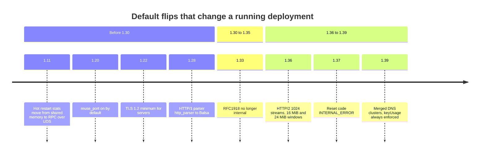

| Release | What changed | Old | New | Revert (while it lasts) | Source |
|---|---|---|---|---|---|
| 1.11.0 | Hot restart stats transfer | shared memory | RPC over Unix domain sockets | none | [1.11.0.yaml:98](https://github.com/envoyproxy/envoy/blob/v1.39.1/changelogs/1.11.0.yaml#L98) |
| 1.18.0 | gRPC stats `stats_for_all_methods` | true | false | set the field | [1.18.0.yaml:7](https://github.com/envoyproxy/envoy/blob/v1.39.1/changelogs/1.18.0.yaml#L7) |
| 1.20.0 | Listener `reuse_port` (now `enable_reuse_port`) | false | true | set the field | [1.20.0.yaml:133](https://github.com/envoyproxy/envoy/blob/v1.39.1/changelogs/1.20.0.yaml#L133) |
| 1.20.0 | Deprecated extension names | warning | config error | `envoy.deprecated_features.allow_deprecated_extension_names` | [1.20.0.yaml:67](https://github.com/envoyproxy/envoy/blob/v1.39.1/changelogs/1.20.0.yaml#L67) |
| 1.22.0 | Server TLS minimum version | TLS 1.0 | TLS 1.2 | `tls_minimum_protocol_version` | [1.22.0.yaml:8](https://github.com/envoyproxy/envoy/blob/v1.39.1/changelogs/1.22.0.yaml#L8) |
| 1.24.0 | Balsa added | n/a | opt-in guard | n/a | [1.24.0.yaml:197](https://github.com/envoyproxy/envoy/blob/v1.39.1/changelogs/1.24.0.yaml#L197) |
| 1.28.0 | HTTP/1 parser | http_parser | Balsa | guard deleted in 1.35.0 | [1.28.0.yaml:22](https://github.com/envoyproxy/envoy/blob/v1.39.1/changelogs/1.28.0.yaml#L22) |
| 1.28.0 | Premature reset guard | none | close after more than 50% premature resets, checked after 500 streams | restart feature, deleted in 1.31.0 | [1.28.0.yaml:198](https://github.com/envoyproxy/envoy/blob/v1.39.1/changelogs/1.28.0.yaml#L198) |
| 1.30.0 | Downstream `TE` header | kept | stripped unless `trailers` | deleted in 1.33.0 | [1.30.0.yaml:4](https://github.com/envoyproxy/envoy/blob/v1.39.1/changelogs/1.30.0.yaml#L4) |
| 1.30.0 | `CONNECT` without `connect_config` | terminated | proxied | deleted in 1.33.0 | [1.30.0.yaml:72](https://github.com/envoyproxy/envoy/blob/v1.39.1/changelogs/1.30.0.yaml#L72) |
| 1.30.0 | QUIC client port migration | on | off | config | [1.30.0.yaml:49](https://github.com/envoyproxy/envoy/blob/v1.39.1/changelogs/1.30.0.yaml#L49) |
| 1.31.0 | ext_proc timeout status | 500 | 504 | none | [1.31.0.yaml:60](https://github.com/envoyproxy/envoy/blob/v1.39.1/changelogs/1.31.0.yaml#L60) |
| 1.31.0 | `ApiVersion.AUTO` | not defined as V3 | V3 | none | [1.31.0.yaml:125](https://github.com/envoyproxy/envoy/blob/v1.39.1/changelogs/1.31.0.yaml#L125) |
| 1.32.0 | EDS caching with ADS | off | on | guard deleted in 1.37.0 | [1.32.0.yaml:28](https://github.com/envoyproxy/envoy/blob/v1.39.1/changelogs/1.32.0.yaml#L28) [1.37.0.yaml:273](https://github.com/envoyproxy/envoy/blob/v1.39.1/changelogs/1.37.0.yaml#L273) |
| 1.33.0 | Internal addresses when unset | RFC1918 | none | deleted in 1.36.0 | [1.33.0.yaml:18](https://github.com/envoyproxy/envoy/blob/v1.39.1/changelogs/1.33.0.yaml#L18) |
| 1.33.0 | JSON access log formatter | legacy | new, typed values | deleted in 1.35.0 | [1.33.0.yaml:41](https://github.com/envoyproxy/envoy/blob/v1.39.1/changelogs/1.33.0.yaml#L41) |
| 1.33.0 | OAuth2 `use_refresh_token` | false | true | deleted in 1.36.0 | [1.33.0.yaml:75](https://github.com/envoyproxy/envoy/blob/v1.39.1/changelogs/1.33.0.yaml#L75) |
| 1.35.0 | Soft fd limit | inherited | raised to hard limit | `envoy.restart_features.raise_file_limits` | [1.35.0.yaml:18](https://github.com/envoyproxy/envoy/blob/v1.39.1/changelogs/1.35.0.yaml#L18) |
| 1.36.0 | HTTP/2 `max_concurrent_streams` | 2147483647 | 1024 | `safe_http2_options` (still present) | [1.36.0.yaml:25](https://github.com/envoyproxy/envoy/blob/v1.39.1/changelogs/1.36.0.yaml#L25) |
| 1.36.0 | HTTP/2 stream / connection window | 256 MiB / 256 MiB | 16 MiB / 24 MiB | `safe_http2_options` | [1.36.0.yaml:25](https://github.com/envoyproxy/envoy/blob/v1.39.1/changelogs/1.36.0.yaml#L25) |
| 1.36.0 | HTTP/3 upstream happy eyeballs | on (1.31) | off | `http3_happy_eyeballs` (FALSE guard) | [1.36.0.yaml:80](https://github.com/envoyproxy/envoy/blob/v1.39.1/changelogs/1.36.0.yaml#L80) |
| 1.37.0 | Stream reset code | NO_ERROR | INTERNAL_ERROR | `reset_with_error` | [1.37.0.yaml:17](https://github.com/envoyproxy/envoy/blob/v1.39.1/changelogs/1.37.0.yaml#L17) |
| 1.38.0 | `enforce_rsa_key_usage` | false | true | ignored from 1.39.0 | [1.38.0.yaml:24](https://github.com/envoyproxy/envoy/blob/v1.39.1/changelogs/1.38.0.yaml#L24) |
| 1.38.0 | ext_authz / ratelimit `timeout: 0s` | fail immediately | infinite | none | [1.38.0.yaml:75](https://github.com/envoyproxy/envoy/blob/v1.39.1/changelogs/1.38.0.yaml#L75) |
| 1.38.1 | EDS batch LB rebuild coalescing | on (1.38.0) | off | `coalesce_lb_rebuilds_on_batch_update` | [1.38.1.yaml:45](https://github.com/envoyproxy/envoy/blob/v1.39.1/changelogs/1.38.1.yaml#L45) |
| 1.39.0 | Brotli TLS certificate compression | on | off (also in 1.38.3) | `tls_certificate_compression_brotli` | [1.39.0.yaml:569](https://github.com/envoyproxy/envoy/blob/v1.39.1/changelogs/1.39.0.yaml#L569) |
| 1.39.0 | Strict/logical DNS implementation | separate | merged | `enable_new_dns_implementation` | [1.39.0.yaml:446](https://github.com/envoyproxy/envoy/blob/v1.39.1/changelogs/1.39.0.yaml#L446) |
| 1.39.0 | Repeated header matching | joined string | each value | `match_headers_individually` | [1.39.0.yaml:484](https://github.com/envoyproxy/envoy/blob/v1.39.1/changelogs/1.39.0.yaml#L484) |
| 1.39.0 | `http_inspector` parser | http_parser | Balsa | `http_inspector_use_balsa_parser` | [1.39.0.yaml:916](https://github.com/envoyproxy/envoy/blob/v1.39.1/changelogs/1.39.0.yaml#L916) |
| 1.39.0 | Upstream TLS failure detail in 503 body | shown | hidden | `hide_transport_failure_reason_in_response_body` | [1.39.0.yaml:529](https://github.com/envoyproxy/envoy/blob/v1.39.1/changelogs/1.39.0.yaml#L529) |

### 5.1 The HTTP/2 codec: six flips, one missing note

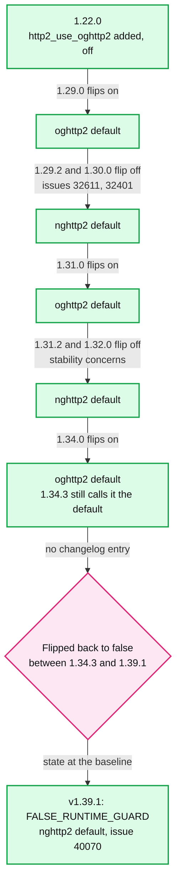

**What to notice**

- Sources in order: [1.22.0.yaml:385](https://github.com/envoyproxy/envoy/blob/v1.39.1/changelogs/1.22.0.yaml#L385), [1.29.0.yaml:34](https://github.com/envoyproxy/envoy/blob/v1.39.1/changelogs/1.29.0.yaml#L34), [1.29.2.yaml:4](https://github.com/envoyproxy/envoy/blob/v1.39.1/changelogs/1.29.2.yaml#L4), [1.30.0.yaml:13](https://github.com/envoyproxy/envoy/blob/v1.39.1/changelogs/1.30.0.yaml#L13), [1.31.0.yaml:14](https://github.com/envoyproxy/envoy/blob/v1.39.1/changelogs/1.31.0.yaml#L14), [1.31.2.yaml:12](https://github.com/envoyproxy/envoy/blob/v1.39.1/changelogs/1.31.2.yaml#L12), [1.32.0.yaml:123](https://github.com/envoyproxy/envoy/blob/v1.39.1/changelogs/1.32.0.yaml#L123), [1.34.0.yaml:9](https://github.com/envoyproxy/envoy/blob/v1.39.1/changelogs/1.34.0.yaml#L9), [1.34.3.yaml:11](https://github.com/envoyproxy/envoy/blob/v1.39.1/changelogs/1.34.3.yaml#L11), [runtime_features.cc:274-276](https://github.com/envoyproxy/envoy/blob/v1.39.1/source/common/runtime/runtime_features.cc#L274-L276).
- **The last flip is undocumented.** No changelog from 1.34.4 to 1.39.1 records it. The code comment says "Flip back to true once performance aligns with nghttp2" [documented]. Anyone reading only release notes believes oghttp2 is live.
- **The HTTP/2 flood knobs still differ by codec.** `stream_reset_burst` and `stream_reset_rate` "only apply when using nghttp2 as a server" [1.39.0.yaml:868](https://github.com/envoyproxy/envoy/blob/v1.39.1/changelogs/1.39.0.yaml#L868). Opting into oghttp2 silently drops that guard [inferred].

### 5.2 The HTTP/1 parser and hot restart stats

- **http_parser to Balsa**: added as opt-in in 1.24.0 [1.24.0.yaml:197](https://github.com/envoyproxy/envoy/blob/v1.39.1/changelogs/1.24.0.yaml#L197), default in 1.28.0 [1.28.0.yaml:22](https://github.com/envoyproxy/envoy/blob/v1.39.1/changelogs/1.28.0.yaml#L22), line folding parity in 1.30.0 [1.30.0.yaml:68](https://github.com/envoyproxy/envoy/blob/v1.39.1/changelogs/1.30.0.yaml#L68), revert guard deleted in 1.35.0 [1.35.0.yaml:219](https://github.com/envoyproxy/envoy/blob/v1.39.1/changelogs/1.35.0.yaml#L219). In v1.39.1 `ConnectionImpl` builds a `BalsaParser` unconditionally [codec_impl.cc:530-538](https://github.com/envoyproxy/envoy/blob/v1.39.1/source/common/http/http1/codec_impl.cc#L530-L538). `LegacyHttpParserImpl` survives only as the `http_inspector` fallback when `http_inspector_use_balsa_parser` is false [http_inspector.cc:42-50](https://github.com/envoyproxy/envoy/blob/v1.39.1/source/extensions/filters/listener/http_inspector/http_inspector.cc#L42-L50).
- **Balsa parity fixes kept coming**: lone CR in chunk extensions rejected in 1.31.0 [1.31.0.yaml:162](https://github.com/envoyproxy/envoy/blob/v1.39.1/changelogs/1.31.0.yaml#L162); strict chunk parsing exists but is opt-in (`strict_chunk_parsing`, FALSE guard) [1.38.0.yaml:167](https://github.com/envoyproxy/envoy/blob/v1.39.1/changelogs/1.38.0.yaml#L167) [runtime_features.cc:287](https://github.com/envoyproxy/envoy/blob/v1.39.1/source/common/runtime/runtime_features.cc#L287).
- **Hot restart stats**: shared memory was dropped in 1.11.0 [1.11.0.yaml:98](https://github.com/envoyproxy/envoy/blob/v1.39.1/changelogs/1.11.0.yaml#L98). Today counters, and gauges not marked `NeverImport`, are sent from old to new process over UDS, which is why hot restart works across containers [hot_restart.rst:31-33](https://github.com/envoyproxy/envoy/blob/v1.39.1/docs/root/intro/arch_overview/operations/hot_restart.rst#L31-L33). Details in [report 09](envoy-09-operations-and-deployment.md).

---

## 6. Runtime guard lifecycle

- **Two macros**: `RUNTIME_GUARD(name)` defines an `ABSL_FLAG(bool, name, true)`, `FALSE_RUNTIME_GUARD(name)` defines the same flag with `false` [runtime_features.cc:13-14](https://github.com/envoyproxy/envoy/blob/v1.39.1/source/common/runtime/runtime_features.cc#L13-L14). The C++ name `envoy_reloadable_features_x` becomes the runtime key `envoy.reloadable_features.x` via `swapPrefix` [runtime_features.cc:309-311](https://github.com/envoyproxy/envoy/blob/v1.39.1/source/common/runtime/runtime_features.cc#L309-L311).
- **Two families**:
  - `envoy.reloadable_features.*` "must be safe to flip true or false on running Envoy instances" [CONTRIBUTING.md:232-233](https://github.com/envoyproxy/envoy/blob/v1.39.1/CONTRIBUTING.md#L232-L233). Code may still latch the value when a short-lived object is created (a connection, an HCM), so a flip reaches new objects only [CONTRIBUTING.md:234-245](https://github.com/envoyproxy/envoy/blob/v1.39.1/CONTRIBUTING.md#L234-L245).
  - `envoy.restart_features.*` are meant to be read once at startup [inferred from the name]; for example `quic_keylog_support` is a restart flag "because it controls SSL_CTX setup ... which runs once per QUIC listener at init time" [runtime_features.cc:203-205](https://github.com/envoyproxy/envoy/blob/v1.39.1/source/common/runtime/runtime_features.cc#L203-L205). Set them in the bootstrap static layer, not through RTDS [inferred].
- **How long a guard lives**: "both code paths are supported for between one Envoy release (if it is guarded due to performance concerns) and a full deprecation cycle (if it is a high risk behavioral change)" [CONTRIBUTING.md:215-218](https://github.com/envoyproxy/envoy/blob/v1.39.1/CONTRIBUTING.md#L215-L218). "Old code for behavioral changes will be deprecated after six months if no Envoy operators have raised concerns" [CONTRIBUTING.md:251-253](https://github.com/envoyproxy/envoy/blob/v1.39.1/CONTRIBUTING.md#L251-L253). The tooling enforces it: `deprecate_guards.py` files an issue for any guard that has defaulted true for 183 days [deprecate_guards.py:132](https://github.com/envoyproxy/envoy/blob/v1.39.1/tools/deprecate_guards/deprecate_guards.py#L132).
- **What a removed guard does to your pin**: a boolean key with a runtime prefix that is no longer a feature triggers `IS_ENVOY_BUG("Using a removed guard ...")` and is otherwise ignored [runtime_impl.cc:462-466](https://github.com/envoyproxy/envoy/blob/v1.39.1/source/common/runtime/runtime_impl.cc#L462-L466). In release builds that increments `server.envoy_bug_failures` [server.h:75](https://github.com/envoyproxy/envoy/blob/v1.39.1/source/server/server.h#L75). The old behaviour does not come back.

### 6.1 A guard's life

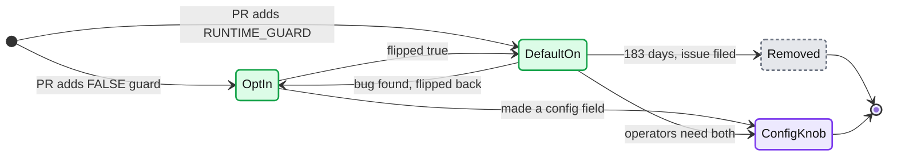

**What to notice**

- **`DefaultOn` to `OptIn` is real.** `http2_use_oghttp2` made that trip three times (section 5.1), and `http3_happy_eyeballs` once [1.36.0.yaml:80](https://github.com/envoyproxy/envoy/blob/v1.39.1/changelogs/1.36.0.yaml#L80).
- **`ConfigKnob` is the escape hatch** the policy promises when a change hurts someone: "generally in the form of a permanent configuration knob" [CONTRIBUTING.md:253-255](https://github.com/envoyproxy/envoy/blob/v1.39.1/CONTRIBUTING.md#L253-L255). Example: `reject_early_connect_data` became the router option `reject_connect_request_early_data` [1.37.0.yaml:282](https://github.com/envoyproxy/envoy/blob/v1.39.1/changelogs/1.37.0.yaml#L282).
- **`Removed` is the upgrade hazard**: your pin turns into a counter bump.

### 6.2 How a guard's value is resolved

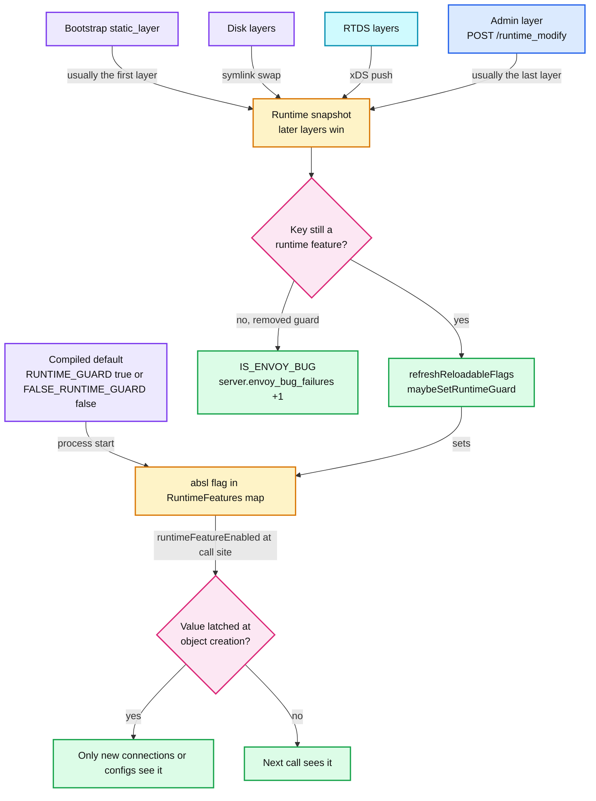

**What to notice**

- **Layers override in order** [runtime.rst:22-24](https://github.com/envoyproxy/envoy/blob/v1.39.1/docs/root/configuration/operations/runtime.rst#L22-L24). `refreshReloadableFlags` remembers each feature's compiled default, so removing an override restores it [runtime_impl.cc:48-67](https://github.com/envoyproxy/envoy/blob/v1.39.1/source/common/runtime/runtime_impl.cc#L48-L67). Before 1.39.0 that restore was broken for RTDS [1.39.0.yaml:355](https://github.com/envoyproxy/envoy/blob/v1.39.1/changelogs/1.39.0.yaml#L355).
- **`safe_http2_options` is read when HTTP/2 options are validated** in `initializeAndValidateOptions` [utility.cc:201-237](https://github.com/envoyproxy/envoy/blob/v1.39.1/source/common/http/utility.cc#L201-L237), so flipping it at runtime only affects listeners and clusters built afterwards [inferred].

### 6.3 Flipping a guard

```yaml
# Bootstrap: pin two guards for the duration of a rollout (static layer = lowest priority)
layered_runtime:
  layers:
  - name: pins
    static_layer:
      envoy.reloadable_features.safe_http2_options: false     # back to 256 MiB windows
      envoy.reloadable_features.match_headers_individually: false
  - name: admin
    admin_layer: {}
```

- One-off on a live pod: `curl -X POST 'localhost:9901/runtime_modify?envoy.reloadable_features.match_headers_individually=false'`. Changes are immediate, so secure the admin port [admin.rst:962-972](https://github.com/envoyproxy/envoy/blob/v1.39.1/docs/root/operations/admin.rst#L962-L972).
- Fleet-wide: an RTDS layer, which the control plane can push and later retract [inferred].

### 6.4 The guard inventory in v1.39.1

| Kind | reloadable | restart | Total |
|---|---|---|---|
| `RUNTIME_GUARD` (on) | 101 (includes sentinel `test_feature_true`) | 4 | **105** |
| `FALSE_RUNTIME_GUARD` (off) | 44 (includes sentinel `test_feature_false` and internal `runtime_initialized`) | 4 | **48** |

[documented, counted with `grep -c` on [source/common/runtime/runtime_features.cc](https://github.com/envoyproxy/envoy/blob/v1.39.1/source/common/runtime/runtime_features.cc)]. The ten x.y.0 changelogs from 1.30 to 1.39 list 135 entries under `removed_config_or_runtime`, almost all of them guards [documented, counted]. The file stays near 150 entries because guards are deleted about as fast as they are added [inferred].

**FALSE guards that matter (features you must opt into):**

| Guard | What you get when you flip it true | Line |
|---|---|---|
| `http2_use_oghttp2` | oghttp2 instead of nghttp2 | [runtime_features.cc:276](https://github.com/envoyproxy/envoy/blob/v1.39.1/source/common/runtime/runtime_features.cc#L276) |
| `allow_multiplexed_upstream_half_close` | HTTP/2 and HTTP/3 upstreams may finish before downstream (bidi gRPC) | [runtime_features.cc:249](https://github.com/envoyproxy/envoy/blob/v1.39.1/source/common/runtime/runtime_features.cc#L249) |
| `enable_universal_header_validator` | UHV instead of codec header checks (needs build flag) | [runtime_features.cc:198](https://github.com/envoyproxy/envoy/blob/v1.39.1/source/common/runtime/runtime_features.cc#L198) |
| `unified_mux` | unified xDS mux | [runtime_features.cc:172](https://github.com/envoyproxy/envoy/blob/v1.39.1/source/common/runtime/runtime_features.cc#L172) |
| `envoy.restart_features.xds_failover_support` | xDS failover sources | [runtime_features.cc:207](https://github.com/envoyproxy/envoy/blob/v1.39.1/source/common/runtime/runtime_features.cc#L207) |
| `oauth2_use_gcm_encryption` | AES-256-GCM OAuth2 cookies. **Required for CVE-2026-47775 protection** after the rollout | [runtime_features.cc:173-179](https://github.com/envoyproxy/envoy/blob/v1.39.1/source/common/runtime/runtime_features.cc#L173-L179) |
| `strict_chunk_parsing` | strict HTTP/1 chunked parsing | [runtime_features.cc:287](https://github.com/envoyproxy/envoy/blob/v1.39.1/source/common/runtime/runtime_features.cc#L287) |
| `least_request_lb_count_pending_requests` | least request counts queued streams | [runtime_features.cc:278](https://github.com/envoyproxy/envoy/blob/v1.39.1/source/common/runtime/runtime_features.cc#L278) |
| `coalesce_lb_rebuilds_on_batch_update` | one LB rebuild per EDS batch | [runtime_features.cc:256](https://github.com/envoyproxy/envoy/blob/v1.39.1/source/common/runtime/runtime_features.cc#L256) |
| `tls_certificate_compression_brotli` | brotli certificate compression | [runtime_features.cc:298](https://github.com/envoyproxy/envoy/blob/v1.39.1/source/common/runtime/runtime_features.cc#L298) |
| `quic_support_web_transport` | WebTransport over HTTP/3 | [runtime_features.cc:215](https://github.com/envoyproxy/envoy/blob/v1.39.1/source/common/runtime/runtime_features.cc#L215) |
| `grpc_timeout_returns_deadline_exceeded` | `DEADLINE_EXCEEDED` instead of `UNAVAILABLE` on gRPC timeout | [runtime_features.cc:244](https://github.com/envoyproxy/envoy/blob/v1.39.1/source/common/runtime/runtime_features.cc#L244) |
| `http3_happy_eyeballs` | HTTP/3 upstream happy eyeballs | [runtime_features.cc:218](https://github.com/envoyproxy/envoy/blob/v1.39.1/source/common/runtime/runtime_features.cc#L218) |

- **The OAuth2 pair is the sharpest one**: `oauth2_legacy_cbc_decrypt_compat` is true so upgraded pods still read old CBC cookies, and the comment warns this "partially reopens CVE-2026-47775" until operators flip GCM on and then turn the compat flag off [runtime_features.cc:95-103](https://github.com/envoyproxy/envoy/blob/v1.39.1/source/common/runtime/runtime_features.cc#L95-L103).

---

## 7. API versioning and deprecation policy

- **Packages are versioned independently** (`envoy.service.trace.v3`), and "the vN xDS API" means the version of the root resources such as `Bootstrap` and `Cluster` [API_VERSIONING.md:10-25](https://github.com/envoyproxy/envoy/blob/v1.39.1/api/API_VERSIONING.md#L10-L25).
- **No breaking changes inside a major version**: no renumbering, no renames (they break YAML/JSON loading), no singular-to-repeated, no new `oneof` wrapping, no stricter validation [API_VERSIONING.md:29-64](https://github.com/envoyproxy/envoy/blob/v1.39.1/api/API_VERSIONING.md#L29-L64).
- **Three exceptions**: changes within 14 days of a field's introduction if unreleased, `vNalpha` packages, and anything annotated `work_in_progress` [API_VERSIONING.md:66-73](https://github.com/envoyproxy/envoy/blob/v1.39.1/api/API_VERSIONING.md#L66-L73). The MCP, `mcp_router` and A2A protos are all `work_in_progress` [mcp.proto:17](https://github.com/envoyproxy/envoy/blob/v1.39.1/api/envoy/extensions/filters/http/mcp/v3/mcp.proto#L17) [a2a.proto:17](https://github.com/envoyproxy/envoy/blob/v1.39.1/api/envoy/extensions/filters/http/a2a/v3/a2a.proto#L17), so their config can break between releases.
- **Defaults are not covered**: "changes to default values for wrapped types ... are not governed by the above policy. Any management server requiring stability ... should set explicit values" [API_VERSIONING.md:75-77](https://github.com/envoyproxy/envoy/blob/v1.39.1/api/API_VERSIONING.md#L75-L77). The 1.36 HTTP/2 change is exactly this case.
- **v3 is the last major version**: "no field will ever be removed nor will Envoy ever remove the implementation for any deprecated field" [API_VERSIONING.md:81-87](https://github.com/envoyproxy/envoy/blob/v1.39.1/api/API_VERSIONING.md#L81-L87). CONTRIBUTING.md still describes deleting deprecated config across major versions [CONTRIBUTING.md:102-103](https://github.com/envoyproxy/envoy/blob/v1.39.1/CONTRIBUTING.md#L102-L103); with no v4 planned, that clause never fires [inferred].
- **Deprecation markers**: `[deprecated = true, (envoy.annotations.deprecated_at_minor_version) = "3.0"]`, as on `enforce_rsa_key_usage` [tls.proto:76-84](https://github.com/envoyproxy/envoy/blob/v1.39.1/api/envoy/extensions/transport_sockets/tls/v3/tls.proto#L76-L84). v3 protos carry 121 `deprecated = true` markers and 5 `disallowed_by_default` ones [documented, counted]. Every annotation says "3.0".
- **`API_VERSION.txt` is `3.0.0`** [API_VERSION.txt:1](https://github.com/envoyproxy/envoy/blob/v1.39.1/API_VERSION.txt#L1). The build turns it into `api_version` and `oldest_api_version` = minor minus one, floored at 0 [utils.py:37-52](https://github.com/envoyproxy/envoy/blob/v1.39.1/tools/api_versioning/utils.py#L37-L52). The minor number has never moved, so both are 3.0.0 [inferred].
- **v2 removal**: frozen in 1.14.0 [1.14.0.yaml:32](https://github.com/envoyproxy/envoy/blob/v1.39.1/changelogs/1.14.0.yaml#L32), fatal by default in 1.17.0 [1.17.0.yaml:4](https://github.com/envoyproxy/envoy/blob/v1.39.1/changelogs/1.17.0.yaml#L4), unsupported by the binary in 1.18.0 (2021-04-15) [1.18.0.yaml:4](https://github.com/envoyproxy/envoy/blob/v1.39.1/changelogs/1.18.0.yaml#L4). The v2 protos still sit in `api/envoy` (60 `v2` directories) even though the binary rejects them [documented].
- **Protocol defaults with a hard rule**: "changing the default behavior of the ext_authz and ext_proc protocols is strictly forbidden" [CONTRIBUTING.md:134](https://github.com/envoyproxy/envoy/blob/v1.39.1/CONTRIBUTING.md#L134).

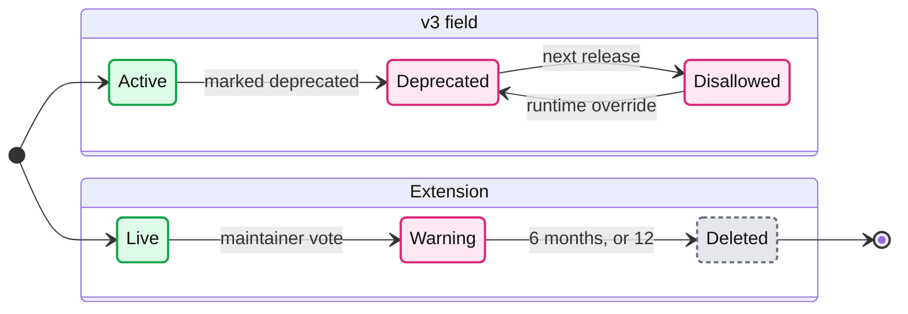

**What to notice**

- **Deprecated**: the config loads, logs a warning and increments `runtime.deprecated_feature_use` [runtime.rst:239-240](https://github.com/envoyproxy/envoy/blob/v1.39.1/docs/root/configuration/operations/runtime.rst#L239-L240). Set `envoy.features.fail_on_any_deprecated_feature` in staging to make it fail now [CONTRIBUTING.md:117-119](https://github.com/envoyproxy/envoy/blob/v1.39.1/CONTRIBUTING.md#L117-L119).
- **Disallowed**: rejected unless `envoy.deprecated_features:<full field name>` is `true` [runtime.rst:244-250](https://github.com/envoyproxy/envoy/blob/v1.39.1/docs/root/configuration/operations/runtime.rst#L244-L250). The annotation comment puts this "One Envoy release after deprecation" [deprecation.proto:11-13](https://github.com/envoyproxy/envoy/blob/v1.39.1/api/envoy/annotations/deprecation.proto#L11-L13).
- **Fields never leave `Disallowed`, extensions do leave**: removal takes a maintainer vote, a factory warning and a 6-month interval, extendable by 6 more months for heavily used ones [EXTENSION_POLICY.md:53-62](https://github.com/envoyproxy/envoy/blob/v1.39.1/EXTENSION_POLICY.md#L53-L62). `aws_iam` (announced 1.33, deleted 1.35) followed this path [1.33.0.yaml:470](https://github.com/envoyproxy/envoy/blob/v1.39.1/changelogs/1.33.0.yaml#L470) [1.35.0.yaml:4](https://github.com/envoyproxy/envoy/blob/v1.39.1/changelogs/1.35.0.yaml#L4).

---

## 8. Extension maturity matrix

`status` describes the implementation (stable, alpha, wip) and is orthogonal to API stability [EXTENSION_POLICY.md:111-115](https://github.com/envoyproxy/envoy/blob/v1.39.1/EXTENSION_POLICY.md#L111-L115). `security_posture` says what the extension is hardened against [EXTENSION_POLICY.md:117-126](https://github.com/envoyproxy/envoy/blob/v1.39.1/EXTENSION_POLICY.md#L117-L126). Counts below were produced by a small parser over [source/extensions/extensions_metadata.yaml](https://github.com/envoyproxy/envoy/blob/v1.39.1/source/extensions/extensions_metadata.yaml) and [contrib/extensions_metadata.yaml](https://github.com/envoyproxy/envoy/blob/v1.39.1/contrib/extensions_metadata.yaml), one row per extension, grouped by its first category [documented].

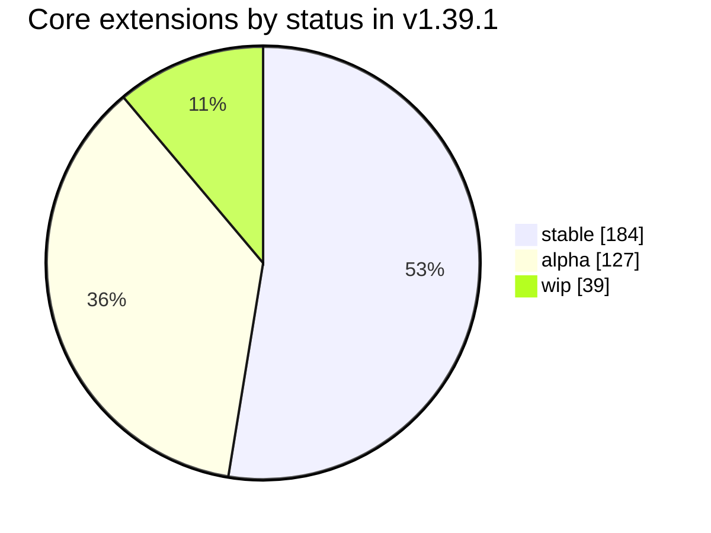

| Category family (core) | stable | alpha | wip | Total |
|---|---|---|---|---|
| HTTP filters | 36 | 28 | 7 | 71 |
| Matching API inputs, matchers, actions | 34 | 6 | 0 | 40 |
| Network filters | 14 | 9 | 3 | 26 |
| Clusters and upstreams | 15 | 8 | 1 | 24 |
| HTTP helpers (cache, stateful session, credentials) | 3 | 6 | 9 | 18 |
| Tracers, samplers, resource detectors | 3 | 1 | 11 | 15 |
| Listener and UDP filters | 7 | 7 | 0 | 14 |
| Access loggers and their filters | 6 | 5 | 1 | 12 |
| xDS config subscriptions, muxes, validators | 12 | 0 | 0 | 12 |
| Load balancing policies | 7 | 4 | 1 | 12 |
| Transport sockets | 8 | 3 | 0 | 11 |
| QUIC extensions | 1 | 8 | 0 | 9 |
| Everything else (sinks, formatters, TLS, health, DNS, Wasm runtimes, ...) | 38 | 42 | 6 | 86 |
| **Core total** | **184** | **127** | **39** | **350** |
| **Contrib total** (not in default images) | 3 | 31 | 4 | 38 |

| security_posture | Core stable | Core alpha | Core wip | Core total | Contrib |
|---|---|---|---|---|---|
| `robust_to_untrusted_downstream` | 61 | 18 | 2 | 81 | 6 |
| `robust_to_untrusted_downstream_and_upstream` | 51 | 12 | 1 | 64 | 2 |
| `requires_trusted_downstream_and_upstream` | 14 | 32 | 1 | 47 | 27 |
| `unknown` (treat as requires trusted) | 53 | 55 | 35 | 143 | 0 |
| `data_plane_agnostic` | 5 | 10 | 0 | 15 | 3 |

- **41% of core extensions (143) have `unknown` posture**, which EXTENSION_POLICY.md says is "functionally equivalent to `requires_trusted_downstream_and_upstream`" [EXTENSION_POLICY.md:124-125](https://github.com/envoyproxy/envoy/blob/v1.39.1/EXTENSION_POLICY.md#L124-L125).
- **Alpha is outside the threat model**: "alpha features are only supported in trusted deployments" [threat_model.rst:108-110](https://github.com/envoyproxy/envoy/blob/v1.39.1/docs/root/intro/arch_overview/security/threat_model.rst#L108-L110). Contrib is "not eligible for Envoy security team coverage" [EXTENSION_POLICY.md:178](https://github.com/envoyproxy/envoy/blob/v1.39.1/EXTENSION_POLICY.md#L178).
- **Stable does not mean hardened**: the dynamic modules HTTP filter is `stable` with posture `requires_trusted_downstream_and_upstream` [extensions_metadata.yaml:2426-2432](https://github.com/envoyproxy/envoy/blob/v1.39.1/source/extensions/extensions_metadata.yaml#L2426-L2432).

**Notable non-stable extensions** (status and posture from the metadata files):

| Extension | Status | Posture | Since | Note |
|---|---|---|---|---|
| `envoy.filters.http.dynamic_modules` | **stable** | requires trusted | 1.34, stable 1.38 | [extensions_metadata.yaml:2426](https://github.com/envoyproxy/envoy/blob/v1.39.1/source/extensions/extensions_metadata.yaml#L2426) |
| 15 other `*.dynamic_modules` (network, listener, UDP, bootstrap, cluster, LB, tracer, access log, transport socket, stats sink, cert validator, formatter, health checker, matcher, upstream) | alpha | requires trusted | 1.37 to 1.39 | [extensions_metadata.yaml:873](https://github.com/envoyproxy/envoy/blob/v1.39.1/source/extensions/extensions_metadata.yaml#L873) |
| `envoy.filters.http.mcp` | alpha | unknown | 1.37 | proto `work_in_progress` [extensions_metadata.yaml:670](https://github.com/envoyproxy/envoy/blob/v1.39.1/source/extensions/extensions_metadata.yaml#L670) |
| `envoy.filters.http.mcp_router` | alpha | unknown | 1.37 | [extensions_metadata.yaml:686](https://github.com/envoyproxy/envoy/blob/v1.39.1/source/extensions/extensions_metadata.yaml#L686) |
| `envoy.filters.http.mcp_json_rest_bridge` | alpha | unknown | 1.38 | [extensions_metadata.yaml:678](https://github.com/envoyproxy/envoy/blob/v1.39.1/source/extensions/extensions_metadata.yaml#L678) |
| `envoy.clusters.mcp_multicluster` | alpha | requires trusted | 1.38 | [extensions_metadata.yaml:190](https://github.com/envoyproxy/envoy/blob/v1.39.1/source/extensions/extensions_metadata.yaml#L190) |
| `envoy.filters.http.a2a` | alpha | unknown | 1.38 | [extensions_metadata.yaml:294](https://github.com/envoyproxy/envoy/blob/v1.39.1/source/extensions/extensions_metadata.yaml#L294) |
| `envoy.filters.http.ai_protocol_manager` | alpha | unknown | no changelog entry | empty config message, `work_in_progress` [ai_protocol_manager.proto:14-22](https://github.com/envoyproxy/envoy/blob/v1.39.1/api/envoy/extensions/filters/http/ai_protocol_manager/v3/ai_protocol_manager.proto#L14-L22) |
| `envoy.filters.http.wasm` | alpha | unknown | long-standing | V8, WAMR and Wasmtime runtimes also alpha [extensions_metadata.yaml:783](https://github.com/envoyproxy/envoy/blob/v1.39.1/source/extensions/extensions_metadata.yaml#L783) |
| `envoy.filters.http.golang` (contrib) | alpha | requires trusted | contrib | [extensions_metadata.yaml:11](https://github.com/envoyproxy/envoy/blob/v1.39.1/contrib/extensions_metadata.yaml#L11) |
| `envoy.filters.network.ext_proc` | wip | unknown | | [extensions_metadata.yaml:922](https://github.com/envoyproxy/envoy/blob/v1.39.1/source/extensions/extensions_metadata.yaml#L922) |
| `envoy.filters.http.rate_limit_quota` | wip | unknown | | [extensions_metadata.yaml:738](https://github.com/envoyproxy/envoy/blob/v1.39.1/source/extensions/extensions_metadata.yaml#L738) |
| `envoy.filters.http.cache` and `cache_v2` | wip | unknown | | [extensions_metadata.yaml:391](https://github.com/envoyproxy/envoy/blob/v1.39.1/source/extensions/extensions_metadata.yaml#L391) |
| `envoy.load_balancing_policies.client_side_weighted_round_robin` | alpha | unknown | 1.32 | [extensions_metadata.yaml:2205](https://github.com/envoyproxy/envoy/blob/v1.39.1/source/extensions/extensions_metadata.yaml#L2205) |
| `envoy.filters.http.bandwidth_share` | wip | unknown | 1.39 | [extensions_metadata.yaml:358](https://github.com/envoyproxy/envoy/blob/v1.39.1/source/extensions/extensions_metadata.yaml#L358) |
| `envoy.clusters.reverse_connection` and reverse tunnel bootstrap | wip | unknown | 1.36 | [extensions_metadata.yaml:120](https://github.com/envoyproxy/envoy/blob/v1.39.1/source/extensions/extensions_metadata.yaml#L120) |

- For contrast, the hot-path core is stable and hardened: `ext_proc` (stable, robust both ways; upstream use alpha) [extensions_metadata.yaml:514](https://github.com/envoyproxy/envoy/blob/v1.39.1/source/extensions/extensions_metadata.yaml#L514), `ext_authz` [extensions_metadata.yaml:506](https://github.com/envoyproxy/envoy/blob/v1.39.1/source/extensions/extensions_metadata.yaml#L506), `router` [extensions_metadata.yaml:755](https://github.com/envoyproxy/envoy/blob/v1.39.1/source/extensions/extensions_metadata.yaml#L755), `tls` [extensions_metadata.yaml:1742](https://github.com/envoyproxy/envoy/blob/v1.39.1/source/extensions/extensions_metadata.yaml#L1742). How to choose between these mechanisms is in [report 08](envoy-08-observability-and-extensibility.md).

---

## 9. Errata

Folklore that the v1.39.1 tree contradicts. Each row gives the correct value and where to check it.

| # | Folklore | Correct in v1.39.1 | Permalink |
|---|---|---|---|
| 1 | HTTP/2 stream window is 256 MiB | 16 MiB (also the per-stream buffer soft limit) | [protocol.proto:612-626](https://github.com/envoyproxy/envoy/blob/v1.39.1/api/envoy/config/core/v3/protocol.proto#L612-L626) |
| 2 | HTTP/2 connection window is 256 MiB | 24 MiB | [protocol.proto:628-630](https://github.com/envoyproxy/envoy/blob/v1.39.1/api/envoy/config/core/v3/protocol.proto#L628-L630) |
| 3 | HTTP/2 max concurrent streams is unlimited (2^31-1) | 1024; 2^31-1 is only the upper bound | [protocol.proto:598-610](https://github.com/envoyproxy/envoy/blob/v1.39.1/api/envoy/config/core/v3/protocol.proto#L598-L610) |
| 4 | The HTTP/2 change is permanent | revertible with `safe_http2_options`, still a guard in 1.39.1 | [runtime_features.cc:131](https://github.com/envoyproxy/envoy/blob/v1.39.1/source/common/runtime/runtime_features.cc#L131) |
| 5 | HTTP/1 uses `http_parser` | Balsa; legacy parser only in `http_inspector` fallback | [codec_impl.cc:537](https://github.com/envoyproxy/envoy/blob/v1.39.1/source/common/http/http1/codec_impl.cc#L537) |
| 6 | oghttp2 is the default HTTP/2 codec | nghttp2; oghttp2 is a FALSE guard | [runtime_features.cc:276](https://github.com/envoyproxy/envoy/blob/v1.39.1/source/common/runtime/runtime_features.cc#L276) |
| 7 | Hot restart shares stats in shared memory | RPC over UDS since 1.11 | [hot_restart.rst:13-15](https://github.com/envoyproxy/envoy/blob/v1.39.1/docs/root/intro/arch_overview/operations/hot_restart.rst#L13-L15) |
| 8 | Hot restart moves live connections | it does not; they drain or close at `--parent-shutdown-time-s` | [hot_restart.rst:29-30](https://github.com/envoyproxy/envoy/blob/v1.39.1/docs/root/intro/arch_overview/operations/hot_restart.rst#L29-L30) |
| 9 | Workers = container CPU limit | `hardware_concurrency()`; cgroup and affinity only with `--cpuset-threads` | [options_impl.cc:82-83](https://github.com/envoyproxy/envoy/blob/v1.39.1/source/server/options_impl.cc#L82-L83), [options_impl_platform_linux.cc:44-70](https://github.com/envoyproxy/envoy/blob/v1.39.1/source/server/options_impl_platform_linux.cc#L44-L70) |
| 10 | The 1.37.0 note means containers are sized right | the note says "when `--concurrency` is not set", the code also requires `--cpuset-threads`; cli.rst still documents the hardware thread default | [1.37.0.yaml:4](https://github.com/envoyproxy/envoy/blob/v1.39.1/changelogs/1.37.0.yaml#L4), [cli.rst:95-99](https://github.com/envoyproxy/envoy/blob/v1.39.1/docs/root/operations/cli.rst#L95-L99) |
| 11 | RFC1918 is internal when `internal_address_config` is unset | nothing is internal (`DefaultInternalAddressConfig` returns false) | [conn_manager_config.h:197-199](https://github.com/envoyproxy/envoy/blob/v1.39.1/source/common/http/conn_manager_config.h#L197-L199) |
| 12 | The HCM proto comment says unset means RFC1918 | stale: it applies only when the message is present with empty `cidr_ranges` | [config.h:112-117](https://github.com/envoyproxy/envoy/blob/v1.39.1/source/extensions/filters/network/http_connection_manager/config.h#L112-L117), [http_connection_manager.proto:795-801](https://github.com/envoyproxy/envoy/blob/v1.39.1/api/envoy/extensions/filters/network/http_connection_manager/v3/http_connection_manager.proto#L795-L801) |
| 13 | Upstream TLS uses TLS 1.3 by default | client max TLS 1.2, server max TLS 1.3, both min TLS 1.2 | [common.proto:100-110](https://github.com/envoyproxy/envoy/blob/v1.39.1/api/envoy/extensions/transport_sockets/tls/v3/common.proto#L100-L110) |
| 14 | `enforce_rsa_key_usage: false` relaxes keyUsage checks | ignored since 1.39.0, always enforced | [tls.proto:76-84](https://github.com/envoyproxy/envoy/blob/v1.39.1/api/envoy/extensions/transport_sockets/tls/v3/tls.proto#L76-L84) |
| 15 | Envoy normalizes paths by default | `normalize_path` defaults false ("will default true in the future") | [http_connection_manager.proto:958](https://github.com/envoyproxy/envoy/blob/v1.39.1/api/envoy/extensions/filters/network/http_connection_manager/v3/http_connection_manager.proto#L958) |
| 16 | The `consecutive_gateway_failure` detector ejects hosts by default | it counts but enforces at 0%; only `consecutive_5xx` (100%) ejects by default | [outlier_detection.proto:92](https://github.com/envoyproxy/envoy/blob/v1.39.1/api/envoy/config/cluster/v3/outlier_detection.proto#L92) |
| 17 | `reuse_port` is off by default | on since 1.20 on Linux | [listener.proto:414](https://github.com/envoyproxy/envoy/blob/v1.39.1/api/envoy/config/listener/v3/listener.proto#L414) |
| 18 | ext_authz or ratelimit `timeout: 0s` fails fast | means no timeout since 1.38.0, no revert | [1.38.0.yaml:75](https://github.com/envoyproxy/envoy/blob/v1.39.1/changelogs/1.38.0.yaml#L75) |
| 19 | Envoy resets streams with `NO_ERROR` | `INTERNAL_ERROR` since 1.37.0 | [1.37.0.yaml:17](https://github.com/envoyproxy/envoy/blob/v1.39.1/changelogs/1.37.0.yaml#L17) |
| 20 | A rule matching `admin` misses `x-role: user` plus `x-role: admin` | since 1.39.0 repeated headers match one by one (not in CEL or generic matcher inputs) | [1.39.0.yaml:484](https://github.com/envoyproxy/envoy/blob/v1.39.1/changelogs/1.39.0.yaml#L484) |
| 21 | Upstream TLS errors show up in the 503 body | hidden since 1.38.1/1.39.0; use `%UPSTREAM_TRANSPORT_FAILURE_REASON%` | [1.39.0.yaml:529](https://github.com/envoyproxy/envoy/blob/v1.39.1/changelogs/1.39.0.yaml#L529) |
| 22 | Strict DNS and logical DNS are separate code | merged implementation on by default in 1.39.0 | [1.39.0.yaml:446](https://github.com/envoyproxy/envoy/blob/v1.39.1/changelogs/1.39.0.yaml#L446) |
| 23 | HTTP/3 upstream races v4 and v6 (happy eyeballs) | off since 1.36.0 | [runtime_features.cc:218](https://github.com/envoyproxy/envoy/blob/v1.39.1/source/common/runtime/runtime_features.cc#L218) |
| 24 | Setting a runtime guard always works | a removed guard only bumps `server.envoy_bug_failures` | [runtime_impl.cc:462-466](https://github.com/envoyproxy/envoy/blob/v1.39.1/source/common/runtime/runtime_impl.cc#L462-L466) |
| 25 | Deprecated fields get deleted | v3 fields never removed; extensions can be | [API_VERSIONING.md:84-87](https://github.com/envoyproxy/envoy/blob/v1.39.1/api/API_VERSIONING.md#L84-L87) |
| 26 | Wrapped-type defaults are part of the API contract | explicitly excluded; set them explicitly | [API_VERSIONING.md:75-77](https://github.com/envoyproxy/envoy/blob/v1.39.1/api/API_VERSIONING.md#L75-L77) |
| 27 | Patch releases are security only | patches flip defaults (1.38.1, 1.38.3) and add guarded behaviour changes (1.39.1) | [1.38.1.yaml:45](https://github.com/envoyproxy/envoy/blob/v1.39.1/changelogs/1.38.1.yaml#L45) |
| 28 | Four supported releases is the policy | the policy is 12 months since x.y.0; four is a consequence | [RELEASES.md:12](https://github.com/envoyproxy/envoy/blob/v1.39.1/RELEASES.md#L12) |
| 29 | Dynamic modules are experimental | the HTTP filter is stable since 1.38; the 15 other kinds are alpha | [1.38.0.yaml:1103](https://github.com/envoyproxy/envoy/blob/v1.39.1/changelogs/1.38.0.yaml#L1103) |
| 30 | Stable extensions are safe for untrusted traffic | status and posture are separate; dynamic modules HTTP is stable yet requires trusted peers | [extensions_metadata.yaml:2426-2432](https://github.com/envoyproxy/envoy/blob/v1.39.1/source/extensions/extensions_metadata.yaml#L2426-L2432) |
| 31 | Wasm is the production-grade extension path | the Wasm HTTP filter is alpha with posture unknown, and so are the V8, WAMR and Wasmtime runtimes (only the null runtime is stable) | [extensions_metadata.yaml:783](https://github.com/envoyproxy/envoy/blob/v1.39.1/source/extensions/extensions_metadata.yaml#L783) |
| 32 | The OAuth2 cookie CVE is fixed by upgrading | you must also flip `oauth2_use_gcm_encryption` true, then drop the CBC compat flag | [runtime_features.cc:173-179](https://github.com/envoyproxy/envoy/blob/v1.39.1/source/common/runtime/runtime_features.cc#L173-L179) |
| 33 | `ApiVersion.AUTO` means v2 | V3 since 1.31.0 | [1.31.0.yaml:125](https://github.com/envoyproxy/envoy/blob/v1.39.1/changelogs/1.31.0.yaml#L125) |
| 34 | Changelog header date = release date | not always: `1.14.0.yaml` says July 7, 2020; RELEASES.md says 2020/04/08 | [1.14.0.yaml:1](https://github.com/envoyproxy/envoy/blob/v1.39.1/changelogs/1.14.0.yaml#L1), [RELEASES.md:99](https://github.com/envoyproxy/envoy/blob/v1.39.1/RELEASES.md#L99) |

---

## 10. Upgrade playbook

**The thing that breaks first on a multi-release jump is a pinned runtime guard that no longer exists.** `deprecate_guards.py` files a removal issue 183 days after a guard defaults true, which is about two quarterly releases. After removal the pin in your static layer is only counted in `server.envoy_bug_failures` [runtime_impl.cc:462-466](https://github.com/envoyproxy/envoy/blob/v1.39.1/source/common/runtime/runtime_impl.cc#L462-L466), and the new behaviour applies to 100% of traffic with no warning in the data path. Jumping from 1.35 to 1.39 crosses 46 listed removals (31 in 1.36, 13 in 1.37, 2 in 1.38).

1. **Pick the target and the hop size.** Stay within the supported set (section 2.3). Prefer one quarter per hop; never skip more than two, so any guard you pin is still alive on the far side [inferred from the 183-day clock].
2. **Read every changelog you cross**: `behavior_changes`, `minor_behavior_changes`, `removed_config_or_runtime`, `deprecated`, and the patch files too (section 4 shows patches flip defaults).
3. **Diff the guard file**: `git diff v1.35.13 v1.39.1 -- source/common/runtime/runtime_features.cc`. List guards that disappeared, flipped, or appeared as FALSE.
4. **Audit your pins**: grep your bootstrap static layers, disk layers and RTDS resources for every `envoy.reloadable_features.*` and `envoy.restart_features.*` key. Any key not in the target's file is a dead pin: fix the underlying config now.
5. **Make wrapped defaults explicit** for anything you depend on: HTTP/2 windows and `max_concurrent_streams`, `tls_maximum_protocol_version`, `internal_address_config`, timeouts. API_VERSIONING.md tells control planes to do exactly this [API_VERSIONING.md:75-77](https://github.com/envoyproxy/envoy/blob/v1.39.1/api/API_VERSIONING.md#L75-L77).
6. **Validate offline**: `envoy --mode validate -c bootstrap.yaml` on the new binary [cli.rst:34-42](https://github.com/envoyproxy/envoy/blob/v1.39.1/docs/root/operations/cli.rst#L34-L42). In staging, set `envoy.features.fail_on_any_deprecated_feature: true` to turn warnings into failures.
7. **Pin the risky flips for the rollout** (static layer, section 6.3). For 1.39: `match_headers_individually`, `enable_new_dns_implementation`, `hide_transport_failure_reason_in_response_body`. For 1.36: `safe_http2_options`. Only pin guards that exist on the target.
8. **Canary** one pod or 1% of traffic for at least one full traffic cycle. Watch `server.envoy_bug_failures`, `runtime.deprecated_feature_use`, 5xx by response flag, upstream resets, HTTP/2 `rx_reset` and `tx_reset`, p99 latency, and memory ([report 09](envoy-09-operations-and-deployment.md) lists what to alert on).
9. **Roll out** in waves. If a flip hurts, turn the guard off fleet-wide through RTDS first (seconds), and roll the binary back second (minutes to hours).
10. **Unpin within one release**: file an upstream issue for anything you must keep pinned. The policy's answer to a real regression is a permanent config knob, not a forever guard [CONTRIBUTING.md:253-255](https://github.com/envoyproxy/envoy/blob/v1.39.1/CONTRIBUTING.md#L253-L255).

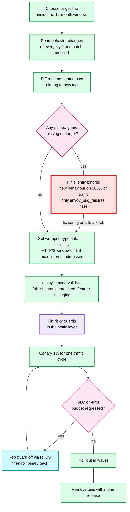

**What to notice**

- **The red node has no alarm in the request path.** The only signals are one log line per snapshot load and a counter. Alert on `server.envoy_bug_failures > 0` during every upgrade [inferred].
- **Rollback order matters**: a reloadable guard flips in seconds without a restart; a binary rollback needs a drain (600 s default `--drain-time-s` [options_impl.cc:149-151](https://github.com/envoyproxy/envoy/blob/v1.39.1/source/server/options_impl.cc#L149-L151)). Restart features only change with a restart.
- **Some changes have no guard at all**: the `timeout: 0s` meaning [1.38.0.yaml:75](https://github.com/envoyproxy/envoy/blob/v1.39.1/changelogs/1.38.0.yaml#L75), removed extensions [1.35.0.yaml:4](https://github.com/envoyproxy/envoy/blob/v1.39.1/changelogs/1.35.0.yaml#L4), ABI breaks for dynamic modules [1.37.0.yaml:12](https://github.com/envoyproxy/envoy/blob/v1.39.1/changelogs/1.37.0.yaml#L12). For those, only step 2 protects you.

---

## 11. Staff-level questions

**Q1. Your fleet runs Envoy 1.35.13. Security asks for 1.39.1 this week. What is your plan and what could go wrong?**
1.35 went out of support on 2026-07-23, so the fleet already missed the 13 CVEs fixed on 2026-08-26/27; urgency is justified. But the jump crosses four majors and 46 listed guard removals, so I would not do it in one blind hop. I would first diff `runtime_features.cc` between the tags and audit every pinned guard in our static and RTDS layers, because a removed guard becomes a silent no-op that only bumps `server.envoy_bug_failures`. Then I would list the behaviour changes crossed: HTTP/2 defaults dropping to 1024 streams and 16/24 MiB windows (1.36), reset code `INTERNAL_ERROR` (1.37), `timeout: 0s` meaning infinite for ext_authz and ratelimit (1.38, no guard), `keyUsage` always enforced (1.39), repeated-header matching and the merged DNS implementation (1.39). Where our config depends on a default, I would set it explicitly in xDS. Then canary with the 1.39 guards pinned, watch resets, 5xx by flag and latency for a traffic cycle, and roll out in waves. If the calendar truly allows only a week, I would go to 1.38.4 first, since it closed the same CVE batch on the same day and crosses fewer changes, and do 1.39 next quarter.

**Q2. Why does Envoy use runtime guards rather than config flags for behaviour changes, and what is the cost?**
A config flag is permanent API surface: under the v3 promise it can never be removed, so every "temporary" flag would live forever in every control plane. A runtime guard is an implementation detail with a six-month shelf life: it lets maintainers ship the new behaviour to everyone by default, keep an emergency brake for about two releases, and then delete the old code path. The cost lands on operators. Defaults move without config diffs, the escape hatch expires on a timer that is visible only in `runtime_features.cc` and the `removed_config_or_runtime` notes, and pins fail silently once the guard is gone. The code also doubles test cost, since both paths need 100% coverage. The policy's safety valve is that if a flip hurts real users, maintainers convert it into a permanent config knob, as they did with `reject_connect_request_early_data`.

**Q3. The 1.36 HTTP/2 default change broke nothing in staging but a gRPC streaming service slowed down in production. Explain the mechanism and the fix.**
Before 1.36, both the stream window and the connection window defaulted to 256 MiB. From 1.36 the stream window is 16 MiB and the connection window 24 MiB. A single stream can then have at most 16 MiB in flight before it waits for a WINDOW_UPDATE, so its throughput is capped near 16 MiB divided by the round-trip time: about 160 MiB/s at 100 ms RTT, far below the old ceiling. Staging usually has short RTT and low concurrency, so it never hits the cap. Several busy streams on one connection also share the 24 MiB connection window. The immediate fix is to pin `safe_http2_options: false` or, better, set `initial_stream_window_size` and `initial_connection_window_size` explicitly on the affected cluster or listener. Remember the window is also the per-stream buffer soft limit that drives watermarks, so raising it trades memory for throughput. The long-term lesson is in API_VERSIONING.md: wrapped-type defaults are not covered by API stability, so a control plane should set every value it depends on.

**Q4. A vendor pitches an "AI gateway" built on Envoy's MCP, A2A and mcp_router filters. What do you check before putting it on the internet edge?**
I check maturity and posture first. In v1.39.1, `mcp`, `mcp_router`, `mcp_json_rest_bridge` and `a2a` are all `alpha` with `unknown` security posture, and their protos are `work_in_progress`, which means the config can break between releases without the usual API guarantees. The threat model says alpha features are supported only in trusted deployments, so a vulnerability there may not get the security release treatment. The churn is visible: MCP arrived in 1.37, its metadata namespace changed in 1.38, and elicitation, lazy init and a new Wuffs JSON parser landed in 1.39. So I would put a stable, hardened layer in front (TLS termination, `jwt_authn` or `ext_authz`, rate limiting, request size limits) and treat the MCP filters as trusted-zone components behind it. I would pin the Envoy version the vendor tested, require them to track each quarterly release, and budget for config migrations every quarter until these extensions reach stable.

**Q5. How would you design the upgrade process for 5,000 Envoy sidecars and 200 edge proxies so that a quarterly Envoy release is routine rather than an incident?**
I would make upgrades a pipeline with three gates. The first gate is static: a job that diffs `runtime_features.cc` and the changelogs between the current and target tags, cross-references every runtime key we pin, and fails the pipeline on a dead pin. It also checks that our control plane sets every wrapped-type default we rely on. The second gate is validation: `--mode validate` against every generated bootstrap and a replay of production xDS snapshots with `fail_on_any_deprecated_feature` on in staging. The third gate is progressive delivery: edge proxies first (fewest, best observed), then 1% of sidecars per zone, then waves, with automatic halt on `server.envoy_bug_failures`, response-flag 5xx, resets and p99. Every release ships with a pin set for its risky flips and a ticket to remove those pins within one quarter, so pins never outlive their guards. The target cadence is to be on N or N-1 at all times, which keeps each hop to one quarter of changes and keeps us inside the 12-month window with margin. The cost is a standing half-engineer of release work [inferred], which is cheaper than one emergency multi-major jump driven by a CVE.

---

## 12. Sources

**Release process and policy**
- [RELEASES.md](https://github.com/envoyproxy/envoy/blob/v1.39.1/RELEASES.md), [BACKPORTS.md](https://github.com/envoyproxy/envoy/blob/v1.39.1/BACKPORTS.md), [SECURITY.md](https://github.com/envoyproxy/envoy/blob/v1.39.1/SECURITY.md)
- [CONTRIBUTING.md](https://github.com/envoyproxy/envoy/blob/v1.39.1/CONTRIBUTING.md) (breaking change policy, runtime guarding)
- [EXTENSION_POLICY.md](https://github.com/envoyproxy/envoy/blob/v1.39.1/EXTENSION_POLICY.md), [DEPRECATED.md](https://github.com/envoyproxy/envoy/blob/v1.39.1/DEPRECATED.md), [docs/root/intro/deprecated.rst](https://github.com/envoyproxy/envoy/blob/v1.39.1/docs/root/intro/deprecated.rst)
- [api/API_VERSIONING.md](https://github.com/envoyproxy/envoy/blob/v1.39.1/api/API_VERSIONING.md), [API_VERSION.txt](https://github.com/envoyproxy/envoy/blob/v1.39.1/API_VERSION.txt), [tools/api_versioning/utils.py](https://github.com/envoyproxy/envoy/blob/v1.39.1/tools/api_versioning/utils.py), [api/envoy/annotations/deprecation.proto](https://github.com/envoyproxy/envoy/blob/v1.39.1/api/envoy/annotations/deprecation.proto)
- [tools/deprecate_guards/deprecate_guards.py](https://github.com/envoyproxy/envoy/blob/v1.39.1/tools/deprecate_guards/deprecate_guards.py)

**Changelogs** (one file per release; x.y.0 files used most)
- [changelogs/1.30.0.yaml](https://github.com/envoyproxy/envoy/blob/v1.39.1/changelogs/1.30.0.yaml), [changelogs/1.31.0.yaml](https://github.com/envoyproxy/envoy/blob/v1.39.1/changelogs/1.31.0.yaml), [changelogs/1.32.0.yaml](https://github.com/envoyproxy/envoy/blob/v1.39.1/changelogs/1.32.0.yaml), [changelogs/1.33.0.yaml](https://github.com/envoyproxy/envoy/blob/v1.39.1/changelogs/1.33.0.yaml), [changelogs/1.34.0.yaml](https://github.com/envoyproxy/envoy/blob/v1.39.1/changelogs/1.34.0.yaml)
- [changelogs/1.35.0.yaml](https://github.com/envoyproxy/envoy/blob/v1.39.1/changelogs/1.35.0.yaml), [changelogs/1.36.0.yaml](https://github.com/envoyproxy/envoy/blob/v1.39.1/changelogs/1.36.0.yaml), [changelogs/1.37.0.yaml](https://github.com/envoyproxy/envoy/blob/v1.39.1/changelogs/1.37.0.yaml), [changelogs/1.38.0.yaml](https://github.com/envoyproxy/envoy/blob/v1.39.1/changelogs/1.38.0.yaml), [changelogs/1.39.0.yaml](https://github.com/envoyproxy/envoy/blob/v1.39.1/changelogs/1.39.0.yaml), [changelogs/1.39.1.yaml](https://github.com/envoyproxy/envoy/blob/v1.39.1/changelogs/1.39.1.yaml)
- Patch files cited: [changelogs/1.29.2.yaml](https://github.com/envoyproxy/envoy/blob/v1.39.1/changelogs/1.29.2.yaml), [changelogs/1.31.2.yaml](https://github.com/envoyproxy/envoy/blob/v1.39.1/changelogs/1.31.2.yaml), [changelogs/1.34.3.yaml](https://github.com/envoyproxy/envoy/blob/v1.39.1/changelogs/1.34.3.yaml), [changelogs/1.38.1.yaml](https://github.com/envoyproxy/envoy/blob/v1.39.1/changelogs/1.38.1.yaml), [changelogs/1.38.3.yaml](https://github.com/envoyproxy/envoy/blob/v1.39.1/changelogs/1.38.3.yaml)
- Historical: [changelogs/1.11.0.yaml](https://github.com/envoyproxy/envoy/blob/v1.39.1/changelogs/1.11.0.yaml), [changelogs/1.14.0.yaml](https://github.com/envoyproxy/envoy/blob/v1.39.1/changelogs/1.14.0.yaml), [changelogs/1.17.0.yaml](https://github.com/envoyproxy/envoy/blob/v1.39.1/changelogs/1.17.0.yaml), [changelogs/1.18.0.yaml](https://github.com/envoyproxy/envoy/blob/v1.39.1/changelogs/1.18.0.yaml), [changelogs/1.20.0.yaml](https://github.com/envoyproxy/envoy/blob/v1.39.1/changelogs/1.20.0.yaml), [changelogs/1.22.0.yaml](https://github.com/envoyproxy/envoy/blob/v1.39.1/changelogs/1.22.0.yaml), [changelogs/1.24.0.yaml](https://github.com/envoyproxy/envoy/blob/v1.39.1/changelogs/1.24.0.yaml), [changelogs/1.28.0.yaml](https://github.com/envoyproxy/envoy/blob/v1.39.1/changelogs/1.28.0.yaml)

**Runtime**
- [source/common/runtime/runtime_features.cc](https://github.com/envoyproxy/envoy/blob/v1.39.1/source/common/runtime/runtime_features.cc), [source/common/runtime/runtime_impl.cc](https://github.com/envoyproxy/envoy/blob/v1.39.1/source/common/runtime/runtime_impl.cc)
- [docs/root/configuration/operations/runtime.rst](https://github.com/envoyproxy/envoy/blob/v1.39.1/docs/root/configuration/operations/runtime.rst), [docs/root/operations/admin.rst](https://github.com/envoyproxy/envoy/blob/v1.39.1/docs/root/operations/admin.rst)

**Code behind the errata**
- [source/server/options_impl.cc](https://github.com/envoyproxy/envoy/blob/v1.39.1/source/server/options_impl.cc), [source/server/options_impl_platform_linux.cc](https://github.com/envoyproxy/envoy/blob/v1.39.1/source/server/options_impl_platform_linux.cc), [docs/root/operations/cli.rst](https://github.com/envoyproxy/envoy/blob/v1.39.1/docs/root/operations/cli.rst)
- [source/common/http/utility.cc](https://github.com/envoyproxy/envoy/blob/v1.39.1/source/common/http/utility.cc), [source/common/http/http_option_limits.h](https://github.com/envoyproxy/envoy/blob/v1.39.1/source/common/http/http_option_limits.h), [api/envoy/config/core/v3/protocol.proto](https://github.com/envoyproxy/envoy/blob/v1.39.1/api/envoy/config/core/v3/protocol.proto)
- [source/common/http/http1/codec_impl.cc](https://github.com/envoyproxy/envoy/blob/v1.39.1/source/common/http/http1/codec_impl.cc), [source/extensions/filters/listener/http_inspector/http_inspector.cc](https://github.com/envoyproxy/envoy/blob/v1.39.1/source/extensions/filters/listener/http_inspector/http_inspector.cc)
- [source/common/tls/context_config_impl.cc](https://github.com/envoyproxy/envoy/blob/v1.39.1/source/common/tls/context_config_impl.cc), [source/common/tls/server_context_config_impl.cc](https://github.com/envoyproxy/envoy/blob/v1.39.1/source/common/tls/server_context_config_impl.cc), [api/envoy/extensions/transport_sockets/tls/v3/common.proto](https://github.com/envoyproxy/envoy/blob/v1.39.1/api/envoy/extensions/transport_sockets/tls/v3/common.proto), [api/envoy/extensions/transport_sockets/tls/v3/tls.proto](https://github.com/envoyproxy/envoy/blob/v1.39.1/api/envoy/extensions/transport_sockets/tls/v3/tls.proto)
- [source/extensions/filters/network/http_connection_manager/config.cc](https://github.com/envoyproxy/envoy/blob/v1.39.1/source/extensions/filters/network/http_connection_manager/config.cc), [source/extensions/filters/network/http_connection_manager/config.h](https://github.com/envoyproxy/envoy/blob/v1.39.1/source/extensions/filters/network/http_connection_manager/config.h), [source/common/http/conn_manager_config.h](https://github.com/envoyproxy/envoy/blob/v1.39.1/source/common/http/conn_manager_config.h)
- [docs/root/intro/arch_overview/operations/hot_restart.rst](https://github.com/envoyproxy/envoy/blob/v1.39.1/docs/root/intro/arch_overview/operations/hot_restart.rst), [source/server/server.h](https://github.com/envoyproxy/envoy/blob/v1.39.1/source/server/server.h)

**Extensions**
- [source/extensions/extensions_metadata.yaml](https://github.com/envoyproxy/envoy/blob/v1.39.1/source/extensions/extensions_metadata.yaml), [contrib/extensions_metadata.yaml](https://github.com/envoyproxy/envoy/blob/v1.39.1/contrib/extensions_metadata.yaml)
- [docs/root/intro/arch_overview/security/threat_model.rst](https://github.com/envoyproxy/envoy/blob/v1.39.1/docs/root/intro/arch_overview/security/threat_model.rst)
- [api/envoy/extensions/filters/http/mcp/v3/mcp.proto](https://github.com/envoyproxy/envoy/blob/v1.39.1/api/envoy/extensions/filters/http/mcp/v3/mcp.proto), [api/envoy/extensions/filters/http/a2a/v3/a2a.proto](https://github.com/envoyproxy/envoy/blob/v1.39.1/api/envoy/extensions/filters/http/a2a/v3/a2a.proto), [api/envoy/extensions/filters/http/ai_protocol_manager/v3/ai_protocol_manager.proto](https://github.com/envoyproxy/envoy/blob/v1.39.1/api/envoy/extensions/filters/http/ai_protocol_manager/v3/ai_protocol_manager.proto)

---

<!-- nav:start -->
[← 09 Operations](envoy-09-operations-and-deployment.md) · **[Index](README.md)** · [11 Dynamic Modules →](envoy-11-dynamic-modules.md)
<!-- nav:end -->
