# Envoy 11: Dynamic Modules: Native Extensions over a C ABI

> **Scope**: how Envoy loads a shared object (`.so`) into its own process and lets it act as an HTTP filter, network or listener filter, load balancer, cluster, transport socket and a dozen other extension points through a pure C ABI (`abi.h`). Covers loading, the ABI conventions, the HTTP filter lifecycle, threading, memory safety across the FFI (foreign function interface) boundary, the Rust, C++ and Go SDKs, metrics, and module load balancers and clusters. The general extension model and the Lua/Wasm/ext_proc comparison at survey depth live in [report 08](envoy-08-observability-and-extensibility.md). How LB algorithms work natively lives in [report 04](envoy-04-cluster-manager-and-load-balancing.md).
>
> **Series baseline: Envoy v1.39.1** (released 2026-08-27). Defaults, field names and
> class names were read from that tag's source tree. **[documented]** = read in source or
> official docs of this release. **[inferred]** = reasoning, not upstream text.
> **[unverified]** = could not be confirmed, do not quote.

---

<!-- nav:start -->
[← 10 Version Delta](envoy-10-version-delta.md) · **[Index](README.md)** · [12 MCP and AI →](envoy-12-mcp-and-ai-gateway.md)
<!-- nav:end -->

<!-- toc:start -->
<details>
<summary><b>Sections in this report (13)</b></summary>

- [1. Overview](#1-overview)
- [2. Architecture](#2-architecture)
- [3. Data flow](#3-data-flow)
- [4. Sequences](#4-sequences)
- [5. State machines](#5-state-machines)
- [6. Component deep dives](#6-component-deep-dives)
- [7. Failure modes](#7-failure-modes)
- [8. Scalability and performance](#8-scalability-and-performance)
- [9. Trade-offs and alternatives](#9-trade-offs-and-alternatives)
- [10. Config reference](#10-config-reference)
- [11. Stats cheat-sheet](#11-stats-cheat-sheet)
- [12. Staff-level questions](#12-staff-level-questions)
- [13. Sources](#13-sources)

</details>
<!-- toc:end -->

## 1. Overview

- **The problem**: teams that need custom logic on Envoy's hot path had three bad choices. Fork Envoy and write C++ against an internal API that changes every release. Use Lua or Wasm and pay a VM boundary plus data copies, with a small set of extension points. Or call out over gRPC (ext_proc, ext_authz) and pay a network round trip per request.
- **Design bet 1: a C ABI, not the C++ API.** A module is a shared object that exports C functions Envoy calls (event hooks, `envoy_dynamic_module_on_*`) and imports C functions Envoy exports (callbacks, `envoy_dynamic_module_callback_*`). Any language that can produce a C shared library can implement it ([abi.h:8-27](https://github.com/envoyproxy/envoy/blob/v1.39.1/source/extensions/dynamic_modules/abi/abi.h#L8)).
- **Design bet 2: zero copy, zero sandbox.** Header and body reads return pointers into Envoy's own memory, valid until the hook returns ([abi.h:1662-1664](https://github.com/envoyproxy/envoy/blob/v1.39.1/source/extensions/dynamic_modules/abi/abi.h#L1662)). The price is that a module runs in Envoy's address space with Envoy's privileges ([dynamic_modules.rst:74-79](https://github.com/envoyproxy/envoy/blob/v1.39.1/docs/root/intro/arch_overview/advanced/dynamic_modules.rst#L74)).
- **Design bet 3: mirror Envoy's own object model.** Each extension point is a pair: a config object created on the main thread, and per-stream, per-connection or per-worker objects created on workers. Opaque `*_envoy_ptr` and `*_module_ptr` handles map 1:1 onto Envoy's C++ classes.
- **Design bet 4: the SDK absorbs the unsafety.** The Rust SDK wraps every FFI entry in `catch_unwind`, null-guards every `(ptr, len)` pair, and presents safe traits. The C++ and Go SDKs are thinner.
- **Design bet 5: breadth over sandboxing.** 17 extension entries in v1.39.1, including ones no VM mechanism offers: load balancer, cluster, transport socket, listener filter, TLS cert validator.

**One sentence: a dynamic module is a trusted `.so` that Envoy `dlopen`s once, talks to through ~175 C event hooks and ~607 C callbacks with borrowed zero-copy buffers, and plugs into 17 extension points, trading all isolation for native speed and native reach.**

### Premise corrections up front

| Commonly said | Actual in v1.39.1 | Source |
|---|---|---|
| Dynamic modules are an experimental HTTP-filter hook | The docs list 17 extension entries. The HTTP filter is `status: stable` (GA since v1.38, [#44420](https://github.com/envoyproxy/envoy/pull/44420)), the rest `alpha` | [dynamic_modules.rst:22-40](https://github.com/envoyproxy/envoy/blob/v1.39.1/docs/root/intro/arch_overview/advanced/dynamic_modules.rst#L22), [extensions_metadata.yaml:2426-2432](https://github.com/envoyproxy/envoy/blob/v1.39.1/source/extensions/extensions_metadata.yaml#L2426) |
| Envoy refuses a module built against a different ABI | Only a missing `envoy_dynamic_module_on_program_init` or a null return rejects it. A different version string logs `Dynamic module ABI version {} is deprecated` and **loads anyway** | [dynamic_modules.cc:67-90](https://github.com/envoyproxy/envoy/blob/v1.39.1/source/extensions/dynamic_modules/dynamic_modules.cc#L67), test [dynamic_modules_test.cc:134](https://github.com/envoyproxy/envoy/blob/v1.39.1/test/extensions/dynamic_modules/dynamic_modules_test.cc#L134) |
| The ABI version is a SHA-256 of `abi.h` | It was, with a strict match, until [#43219](https://github.com/envoyproxy/envoy/pull/43219) (Feb 2026). v1.39.1 uses the string `v0.1.0`. The proto comment still says Envoy "checks the hash" (stale) | [abi.h:47](https://github.com/envoyproxy/envoy/blob/v1.39.1/source/extensions/dynamic_modules/abi/abi.h#L47), [dynamic_modules.proto:28-33](https://github.com/envoyproxy/envoy/blob/v1.39.1/api/envoy/extensions/dynamic_modules/v3/dynamic_modules.proto#L28) |
| A Rust panic in a module crashes Envoy | Every Rust SDK FFI entry catches the panic and returns a fail-closed value. Exception: if `new_http_filter` panics, the HTTP filter stores a null in-module pointer and passes it to every later hook, which dereferences it (a segfault, not a panic). Fixed only on main by [#47508](https://github.com/envoyproxy/envoy/pull/47508) | [http.rs:4383-4400](https://github.com/envoyproxy/envoy/blob/v1.39.1/source/extensions/dynamic_modules/sdk/rust/src/http.rs#L4383), [filter.cc:84-90](https://github.com/envoyproxy/envoy/blob/v1.39.1/source/extensions/filters/http/dynamic_modules/filter.cc#L84) |
| If a remote module fails to download, traffic is blocked | Fail-open: the filter is **not installed** and requests pass unfiltered. Dangerous for an auth module | [dynamic_modules.proto:91-93](https://github.com/envoyproxy/envoy/blob/v1.39.1/api/envoy/extensions/dynamic_modules/v3/dynamic_modules.proto#L91), [factory.cc:137-146](https://github.com/envoyproxy/envoy/blob/v1.39.1/source/extensions/filters/http/dynamic_modules/factory.cc#L137) |
| Per-route configs can use remote modules with `nack_on_cache_miss: true` (the proto says so) | The per-route factory passes no factory context, so every remote source is rejected. Only the listener-level HTTP filter supports remote sources | [factory.cc:168-174](https://github.com/envoyproxy/envoy/blob/v1.39.1/source/extensions/filters/http/dynamic_modules/factory.cc#L168), [dynamic_modules.cc:370-372](https://github.com/envoyproxy/envoy/blob/v1.39.1/source/extensions/dynamic_modules/dynamic_modules.cc#L370) |
| Overwrite the `.so` and the next config push picks up new code | The loader first calls `dlopen(path, RTLD_NOLOAD)` and reuses a resident object without re-running init. Ship new versions under a new path **[inferred]** | [dynamic_modules.cc:41-46](https://github.com/envoyproxy/envoy/blob/v1.39.1/source/extensions/dynamic_modules/dynamic_modules.cc#L41) |
| Modules are sandboxed like Wasm | Same address space. Every DM extension is `security_posture: requires_trusted_downstream_and_upstream` | [dynamic_modules.rst:74-79](https://github.com/envoyproxy/envoy/blob/v1.39.1/docs/root/intro/arch_overview/advanced/dynamic_modules.rst#L74) |
| A module LB gets Envoy's priority, panic and zone logic for free | The module returns `(priority, index into healthyHosts())`. `DynamicModuleLoadBalancer` implements `Upstream::LoadBalancer` directly, so priority load, overprovisioning and panic mode are the module's job | [load_balancer.cc:38-69](https://github.com/envoyproxy/envoy/blob/v1.39.1/source/extensions/load_balancing_policies/dynamic_modules/load_balancer.cc#L38) |
| A module can create metrics at any time | Only inside `on_*_config_new`. Afterwards `define_*` returns `Frozen` | [filter_config.cc:222](https://github.com/envoyproxy/envoy/blob/v1.39.1/source/extensions/filters/http/dynamic_modules/filter_config.cc#L222), [abi_impl.cc:527](https://github.com/envoyproxy/envoy/blob/v1.39.1/source/extensions/filters/http/dynamic_modules/abi_impl.cc#L527) |
| There is a dynamic-module DNS resolver extension | Only the ABI. Its one consumer is the built-in Hickory resolver, a Rust module statically linked into Envoy | [hickory_dns_impl.cc:48-49](https://github.com/envoyproxy/envoy/blob/v1.39.1/source/extensions/network/dns_resolver/hickory/hickory_dns_impl.cc#L48) |
| Everything merged to main before the 2026-08-27 release date is in v1.39.1 | v1.39.1 is a patch on `release/v1.39` (27 commits since v1.39.0, none dynamic-module). DM code equals main at the v1.39.0 cut, 2026-07-14. The cluster specifier ([#46925](https://github.com/envoyproxy/envoy/pull/46925), 2026-08-24) is absent | `gh api compare/v1.39.0...v1.39.1` **[documented]** |

### What is in v1.39.1 and what is main only

- **Rule used in this report**: a feature is "in v1.39.1" only if it exists in the tag's tree or in `changelogs/1.39.0.yaml`. Anything merged after 2026-07-14 and absent from the tree is **main only**.
- **Main only (after v1.39.0)**: cluster specifier ([#46925](https://github.com/envoyproxy/envoy/pull/46925)), early header mutation ([#47200](https://github.com/envoyproxy/envoy/pull/47200)), header formatter ([#47365](https://github.com/envoyproxy/envoy/pull/47365)), xDS config validator ([#47397](https://github.com/envoyproxy/envoy/pull/47397)), string matcher data input ([#47028](https://github.com/envoyproxy/envoy/pull/47028)), loader error logs ([#46966](https://github.com/envoyproxy/envoy/pull/46966)), deferred in-module HTTP destroy ([#46548](https://github.com/envoyproxy/envoy/pull/46548)), `ffi_export` macro ([#47410](https://github.com/envoyproxy/envoy/pull/47410)), shared `MetricRegistry` ([#47439](https://github.com/envoyproxy/envoy/pull/47439)), the formal ABI policy ([#47435](https://github.com/envoyproxy/envoy/pull/47435)), null-filter fail-closed ([#47508](https://github.com/envoyproxy/envoy/pull/47508)), C++ SDK exception barrier ([#47650](https://github.com/envoyproxy/envoy/pull/47650)), per-selection async LB cancellation ([#47240](https://github.com/envoyproxy/envoy/pull/47240)), the September allocation work, and removal of the "under active development" warning ([#47047](https://github.com/envoyproxy/envoy/pull/47047)).
- **Scale of the ABI**: v1.39.1 `abi.h` is 14,289 lines with 175 event hooks and 607 callbacks. Main (2026-09-24) is 16,595 lines, 195 hooks, 698 callbacks **[documented, counted with grep]**.

### History and ownership

| When (merged) | PR | Author | Milestone |
|---|---|---|---|
| 2024-08-06, 2024-08-25 | [#35550](https://github.com/envoyproxy/envoy/pull/35550), [#35626](https://github.com/envoyproxy/envoy/pull/35626) | @mathetake (Takeshi Yoneda) | Initial object loading (`dlopen`), ABI header and compatibility check |
| 2024-09-04 to 2024-11-21 | [#35914](https://github.com/envoyproxy/envoy/pull/35914), [#36448](https://github.com/envoyproxy/envoy/pull/36448), [#37070](https://github.com/envoyproxy/envoy/pull/37070) | @mathetake | Rust SDK scaffold, config API, HTTP filter |
| 2025-12 | [#42225](https://github.com/envoyproxy/envoy/pull/42225), [#42605](https://github.com/envoyproxy/envoy/pull/42605), [#42751](https://github.com/envoyproxy/envoy/pull/42751), [#42736](https://github.com/envoyproxy/envoy/pull/42736) | @agrawroh (Rohit Agrawal) | Streamable callouts, network filters, terminal network filters, listener filters |
| 2026-01 | [#42820](https://github.com/envoyproxy/envoy/pull/42820), [#42846](https://github.com/envoyproxy/envoy/pull/42846), [#42882](https://github.com/envoyproxy/envoy/pull/42882), [#42903](https://github.com/envoyproxy/envoy/pull/42903) | @agrawroh | UDP listener filters, build-time ABI hash, access loggers, bootstrap |
| 2026-02 | [#43097](https://github.com/envoyproxy/envoy/pull/43097), [#43219](https://github.com/envoyproxy/envoy/pull/43219), [#43408](https://github.com/envoyproxy/envoy/pull/43408), [#43420](https://github.com/envoyproxy/envoy/pull/43420), [#42391](https://github.com/envoyproxy/envoy/pull/42391) | @agrawroh, @mathetake (#43219) | LB, one-release forward compatibility, matcher, cert validator, clusters |
| 2026-03 | [#43703](https://github.com/envoyproxy/envoy/pull/43703), [#43964](https://github.com/envoyproxy/envoy/pull/43964), [#44024](https://github.com/envoyproxy/envoy/pull/44024), [#44099](https://github.com/envoyproxy/envoy/pull/44099), [#44132](https://github.com/envoyproxy/envoy/pull/44132) | @agrawroh | Upstream HTTP-TCP bridge, shared data registry, tracer, DNS resolver ABI, transport socket ABI |
| 2026-04 | [#44420](https://github.com/envoyproxy/envoy/pull/44420), [#44472](https://github.com/envoyproxy/envoy/pull/44472) | @agrawroh | HTTP filter GA, fail-fast `set_factory_once` |
| 2026-05 | [#44840](https://github.com/envoyproxy/envoy/pull/44840), [#44841](https://github.com/envoyproxy/envoy/pull/44841), [#44843](https://github.com/envoyproxy/envoy/pull/44843), [#44846](https://github.com/envoyproxy/envoy/pull/44846), [#44850](https://github.com/envoyproxy/envoy/pull/44850) | @agrawroh | Hardening: stat pool race, scheduler UAF, release-mode thread guards, `catch_unwind`, FFI UB |
| 2026-06 | [#45474](https://github.com/envoyproxy/envoy/pull/45474), [#45493](https://github.com/envoyproxy/envoy/pull/45493), [#45494](https://github.com/envoyproxy/envoy/pull/45494), [#45451](https://github.com/envoyproxy/envoy/pull/45451), [#45707](https://github.com/envoyproxy/envoy/pull/45707) | @agrawroh | Stats sink, transport socket, formatter, borrowed and batched getters, re-entrancy fix |

- **CODEOWNERS** for `/*/extensions/dynamic_modules`: @mattklein123 @mathetake @wbpcode @agrawroh ([CODEOWNERS:429](https://github.com/envoyproxy/envoy/blob/v1.39.1/CODEOWNERS#L429)). @agrawroh has 216 merged PRs titled `dynamic_modules` **[documented from the PR list]**.
- **Public talks** **[external]**: EnvoyCon at KubeCon EU 2026 (2026-03-25), "The Next Generation of Envoy Extensibility: Dynamic Modules for Network, Listener, and HTTP Filters" ([sched](https://kccnceu2026.sched.com/)). KubeCon Japan 2026, "Beyond Wasm: How Dynamic Modules Let You Extend Envoy Proxy in Go, Rust, or Any Language", with Takeshi Yoneda ([schedule](https://events.linuxfoundation.org/kubecon-cloudnativecon-japan/program/schedule/)).

---

## 2. Architecture

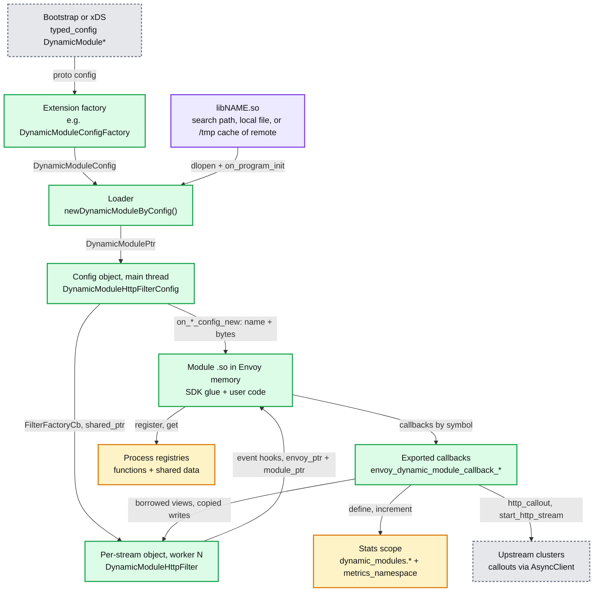

**What to notice**

- **One loader for 17 extension points.** Every factory calls `newDynamicModuleByConfig` ([dynamic_modules.h:242-246](https://github.com/envoyproxy/envoy/blob/v1.39.1/source/extensions/dynamic_modules/dynamic_modules.h#L242)). The extension code differs only in which hooks it resolves and which callbacks it implements.
- **Callbacks resolve by symbol name against the Envoy executable.** Envoy is linked with `-Wl,--dynamic-list=bazel/exported_symbols.txt`, which exports `envoy_dynamic_module_callback_*` and `*_envoy_dynamic_module_on_*` ([exported_symbols.txt](https://github.com/envoyproxy/envoy/blob/v1.39.1/bazel/exported_symbols.txt), [envoy_internal.bzl:240](https://github.com/envoyproxy/envoy/blob/v1.39.1/bazel/envoy_internal.bzl#L240)).
- **Hooks resolve once, at config time.** `getFunctionPointer` does a `dlsym` per hook when the config is built and stores function pointers on the config object ([filter_config.cc:91-203](https://github.com/envoyproxy/envoy/blob/v1.39.1/source/extensions/filters/http/dynamic_modules/filter_config.cc#L91)). The request path is an indirect call, never a `dlsym`.
- **Weak stubs keep any module loadable.** The Rust SDK's bindings reference every callback in `abi.h`, and "these symbols must be resolvable when any Rust module is loaded". So Envoy defines 598 `__attribute__((weak))` stubs that `IS_ENVOY_BUG` if called, covering extensions compiled out of a given binary ([abi_impl.cc:162-175](https://github.com/envoyproxy/envoy/blob/v1.39.1/source/extensions/dynamic_modules/abi_impl.cc#L162)).
- **Static modules use the same ABI.** If `<name>_envoy_dynamic_module_on_program_init` exists in the binary, the loader treats the module as statically linked and resolves `<name>_<symbol>` with `dlsym(RTLD_DEFAULT)` ([dynamic_modules.cc:97-103](https://github.com/envoyproxy/envoy/blob/v1.39.1/source/extensions/dynamic_modules/dynamic_modules.cc#L97)). Bazel renames symbols with `llvm-objcopy --redefine-syms` ([dynamic_modules.bzl:6-19](https://github.com/envoyproxy/envoy/blob/v1.39.1/source/extensions/dynamic_modules/dynamic_modules.bzl#L6)). Hickory DNS ships this way.

---

## 3. Data flow

### 3.1 Locating and loading a module

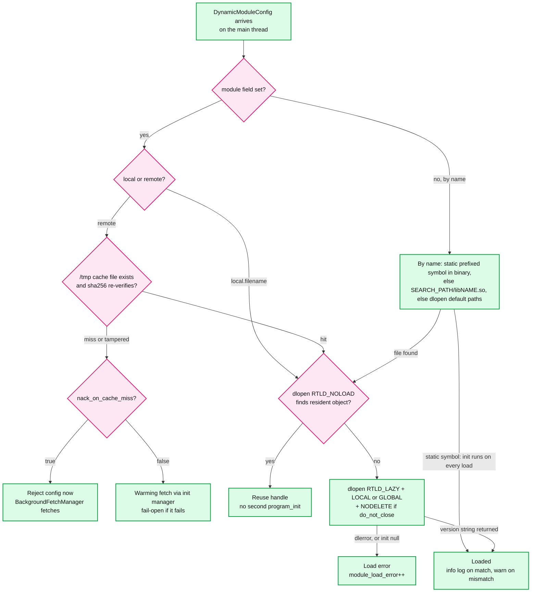

**What to notice**

- **`module` beats `name`** when both are set ([dynamic_modules.proto:46-47](https://github.com/envoyproxy/envoy/blob/v1.39.1/api/envoy/extensions/dynamic_modules/v3/dynamic_modules.proto#L46)). By name, a file that exists but fails to load returns its own error rather than trying other paths, so you see "missing dependency" instead of "not found" ([dynamic_modules.cc:112-119](https://github.com/envoyproxy/envoy/blob/v1.39.1/source/extensions/dynamic_modules/dynamic_modules.cc#L112)).
- **`RTLD_LOCAL` by default** so two modules exporting the same hook names do not collide. `load_globally` switches to `RTLD_GLOBAL` for modules whose own dependencies need their symbols ([dynamic_modules.cc:49-58](https://github.com/envoyproxy/envoy/blob/v1.39.1/source/extensions/dynamic_modules/dynamic_modules.cc#L49)).
- **Loaded once, shared by reference count.** Each config holds its own `DynamicModule` wrapping a `dlopen` handle. `RTLD_NOLOAD` on an already-resident path returns the same object and skips init. The destructor calls `dlclose`, so the object unloads when the last config goes, unless `do_not_close` set `RTLD_NODELETE` ([dynamic_modules.cc:154-160](https://github.com/envoyproxy/envoy/blob/v1.39.1/source/extensions/dynamic_modules/dynamic_modules.cc#L154)). Go `c-shared` objects cannot be `dlclose`d, which is why the field exists ([dynamic_modules.h:82-85](https://github.com/envoyproxy/envoy/blob/v1.39.1/source/extensions/dynamic_modules/dynamic_modules.h#L82)).
- **The remote cache is the filesystem.** Bytes land at `temp_directory_path()/envoy_dynamic_module_<sha256>.so` through `mkstemp` plus atomic `rename`, mode `0700` ([dynamic_modules.cc:174-272](https://github.com/envoyproxy/envoy/blob/v1.39.1/source/extensions/dynamic_modules/dynamic_modules.cc#L174)). A cache hit is re-hashed before `dlopen` because `/tmp` may be shared with a co-tenant who could pre-plant a malicious `.so` ([dynamic_modules.cc:380-395](https://github.com/envoyproxy/envoy/blob/v1.39.1/source/extensions/dynamic_modules/dynamic_modules.cc#L380)).

### 3.2 One call across the boundary

Envoy calls a hook with two opaque handles: its own object (`*_envoy_ptr`, e.g. the `DynamicModuleHttpFilter*`) and the module's object (`*_module_ptr`, e.g. a boxed Rust filter). The module calls back with the `envoy_ptr`, gets borrowed views into Envoy memory, and passes its own bytes that Envoy copies. The status returns by value.

The real header, [abi.h:105-116](https://github.com/envoyproxy/envoy/blob/v1.39.1/source/extensions/dynamic_modules/abi/abi.h#L105) and [abi.h:1666-1670](https://github.com/envoyproxy/envoy/blob/v1.39.1/source/extensions/dynamic_modules/abi/abi.h#L1666):

```c
typedef struct envoy_dynamic_module_type_envoy_buffer {
  envoy_dynamic_module_type_buffer_envoy_ptr ptr;
  size_t length;
} envoy_dynamic_module_type_envoy_buffer;

typedef struct envoy_dynamic_module_type_module_buffer {
  envoy_dynamic_module_type_buffer_module_ptr ptr;
  size_t length;
} envoy_dynamic_module_type_module_buffer;

bool envoy_dynamic_module_callback_http_get_header(
    envoy_dynamic_module_type_http_filter_envoy_ptr filter_envoy_ptr,
    envoy_dynamic_module_type_http_header_type header_type,
    envoy_dynamic_module_type_module_buffer key,
    envoy_dynamic_module_type_envoy_buffer* result_buffer, size_t index, size_t* optional_size);
```

**The conventions** ([STYLE.md](https://github.com/envoyproxy/envoy/blob/v1.39.1/source/extensions/dynamic_modules/STYLE.md))

| Convention | Rule |
|---|---|
| Names | Types `envoy_dynamic_module_type_*`. Hooks `envoy_dynamic_module_on_<component>_<event>` (module implements). Callbacks `envoy_dynamic_module_callback_<component>_<action>` (Envoy implements) |
| Ownership suffixes | `_envoy_ptr` / `envoy_buffer`: Envoy owns. `_module_ptr` / `module_buffer`: module owns. A scheduler is allocated by Envoy but is `_module_ptr` because the module must delete it ([abi.h:689-700](https://github.com/envoyproxy/envoy/blob/v1.39.1/source/extensions/dynamic_modules/abi/abi.h#L689)) |
| Lifetime of borrowed reads | Valid until the current hook returns, unless a setter on the same map is called ([abi.h:1662-1664](https://github.com/envoyproxy/envoy/blob/v1.39.1/source/extensions/dynamic_modules/abi/abi.h#L1662)). Envoy copies every module buffer it keeps |
| Returns | Simple values directly. Complex or fallible results through out-parameters with a `bool` or enum return. Hook `*_new` returning null means "reject" |
| Two-call pattern | Size first (`get_headers_size`, `get_body_chunks_size`), then fill a caller-allocated array (`get_headers`). The Rust SDK fills a `Vec` in place, guarded by compile-time layout asserts ([buffer.rs:149-195](https://github.com/envoyproxy/envoy/blob/v1.39.1/source/extensions/dynamic_modules/sdk/rust/src/buffer.rs#L149)) |
| Batched getters | `get_header_values` returns all values of a header in one crossing ([abi.h:1696](https://github.com/envoyproxy/envoy/blob/v1.39.1/source/extensions/dynamic_modules/abi/abi.h#L1696)). `set_dynamic_metadata_string_batch` resolves the namespace once ([abi.h:2066](https://github.com/envoyproxy/envoy/blob/v1.39.1/source/extensions/dynamic_modules/abi/abi.h#L2066)) |
| Config bytes | `google.protobuf.Any` through `knownAnyToBytes`: `StringValue`/`BytesValue` unwrapped, `Struct` serialized to JSON, anything else the raw serialized proto ([utility.h:449-465](https://github.com/envoyproxy/envoy/blob/v1.39.1/source/common/protobuf/utility.h#L449)). Per-route and upstream-bridge paths gained the JSON behaviour in v1.39.0 ([#44743](https://github.com/envoyproxy/envoy/pull/44743)) |
| Trust | Envoy does not validate module pointers: "we assume that modules will not try to pass invalid pointers" ([abi.h:22-27](https://github.com/envoyproxy/envoy/blob/v1.39.1/source/extensions/dynamic_modules/abi/abi.h#L22)) |

### 3.3 An HTTP request through a module filter

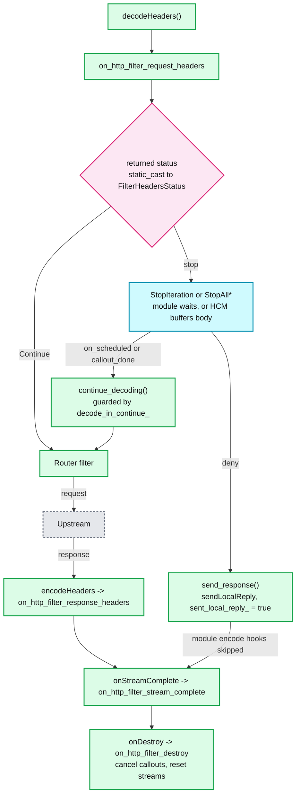

**What to notice**

- **Statuses map by `static_cast`**, so the ABI enums must keep exactly the order of `FilterHeadersStatus` (`Continue, StopIteration, ContinueAndDontEndStream, StopAllIterationAndBuffer, StopAllIterationAndWatermark`) and `FilterDataStatus` ([abi.h:727-745](https://github.com/envoyproxy/envoy/blob/v1.39.1/source/extensions/dynamic_modules/abi/abi.h#L727), [filter.cc:84-100](https://github.com/envoyproxy/envoy/blob/v1.39.1/source/extensions/filters/http/dynamic_modules/filter.cc#L84)). There is no `static_assert` on the C++ side **[documented by absence]**. Enum numbering is part of the frozen ABI.
- **Continue is tracked per direction.** `decode_in_continue_` and `encode_in_continue_` stop a double `continueDecoding()` and stop a decode resume from swallowing an encode resume ([filter.h:276-280](https://github.com/envoyproxy/envoy/blob/v1.39.1/source/extensions/filters/http/dynamic_modules/filter.h#L276), fix in v1.39.0 [#45591](https://github.com/envoyproxy/envoy/pull/45591)).
- **A local reply does not re-enter the module.** `sendLocalReply` fires `encodeHeaders` inline on the same stack. With Rust that would be a second `&mut` to the same filter. `sent_local_reply_` makes the encode hooks return `Continue` without calling the module ([filter.h:282-288](https://github.com/envoyproxy/envoy/blob/v1.39.1/source/extensions/filters/http/dynamic_modules/filter.h#L282)). The streaming `send_response_headers/data/trailers` got the same guard in [#45707](https://github.com/envoyproxy/envoy/pull/45707).
- **Body access is scoped.** `current_request_body_` points at the chunk only for the duration of `decodeData` ([filter.cc:92-100](https://github.com/envoyproxy/envoy/blob/v1.39.1/source/extensions/filters/http/dynamic_modules/filter.cc#L92)). Anything later must use the buffered body getters.

### 3.4 Threading model

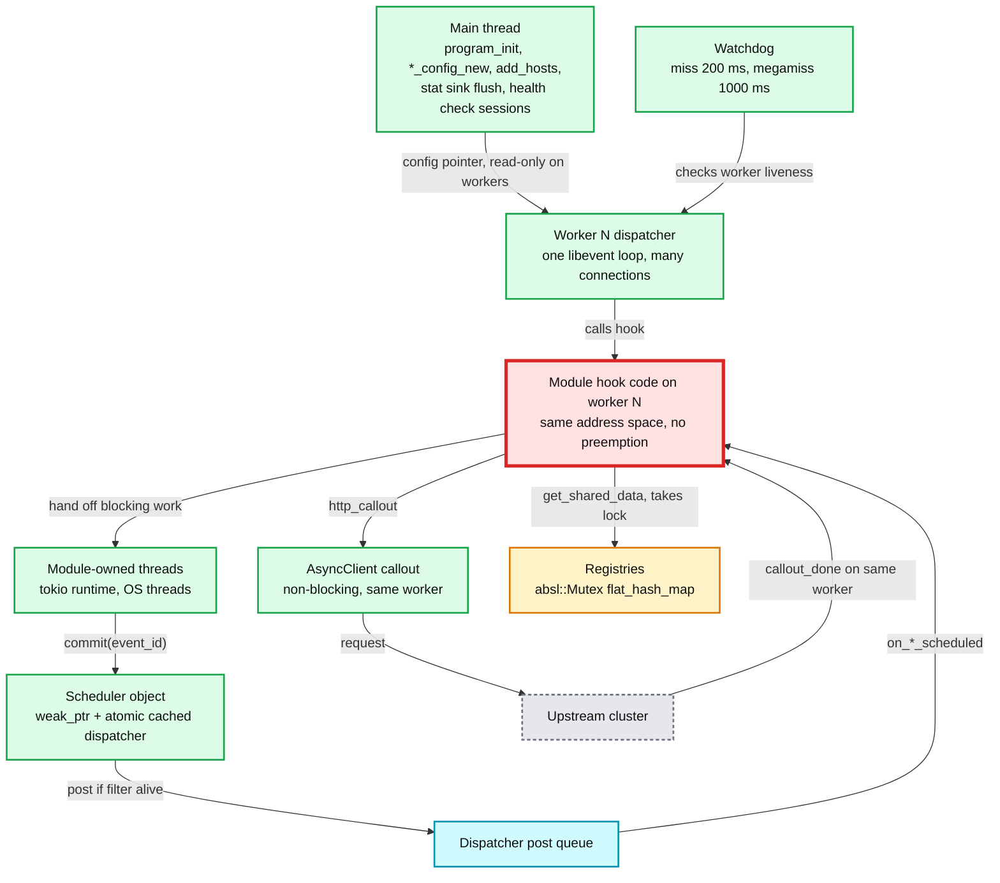

**What to notice**

- **The red node is the bottleneck of the whole design.** Module hook code runs on the worker's event loop with no preemption. A hook that blocks for 200 ms trips that worker's `watchdog_miss` (1000 ms for `watchdog_mega_miss`, kill disabled by default, [bootstrap.proto:594-603](https://github.com/envoyproxy/envoy/blob/v1.39.1/api/envoy/config/bootstrap/v3/bootstrap.proto#L594)) and stalls every connection pinned to that worker, which is 1/N of capacity with N = `--concurrency`. A segfault in the same code kills all N workers at once.
- **Main-thread hooks**: `on_program_init` ([abi.h:451](https://github.com/envoyproxy/envoy/blob/v1.39.1/source/extensions/dynamic_modules/abi/abi.h#L451)), every `*_config_new`, cluster host management, stat sink flush ([abi.h:13786](https://github.com/envoyproxy/envoy/blob/v1.39.1/source/extensions/dynamic_modules/abi/abi.h#L13786)), health checker sessions ([abi.h:14120](https://github.com/envoyproxy/envoy/blob/v1.39.1/source/extensions/dynamic_modules/abi/abi.h#L14120)). **Worker hooks**: per-stream, per-connection, per-socket objects, matcher evaluation ([abi.h:11761](https://github.com/envoyproxy/envoy/blob/v1.39.1/source/extensions/dynamic_modules/abi/abi.h#L11761)), one LB instance per worker ([abi.h:11033](https://github.com/envoyproxy/envoy/blob/v1.39.1/source/extensions/dynamic_modules/abi/abi.h#L11033)).
- **Config objects are shared across workers**, so `HttpFilterConfig` must be `Sync` in Rust. Per-stream `HttpFilter` objects are thread-local and need not be ([http.rs:15-21, 141](https://github.com/envoyproxy/envoy/blob/v1.39.1/source/extensions/dynamic_modules/sdk/rust/src/http.rs#L15)).

---

## 4. Sequences

### 4.1 Config load and one stream

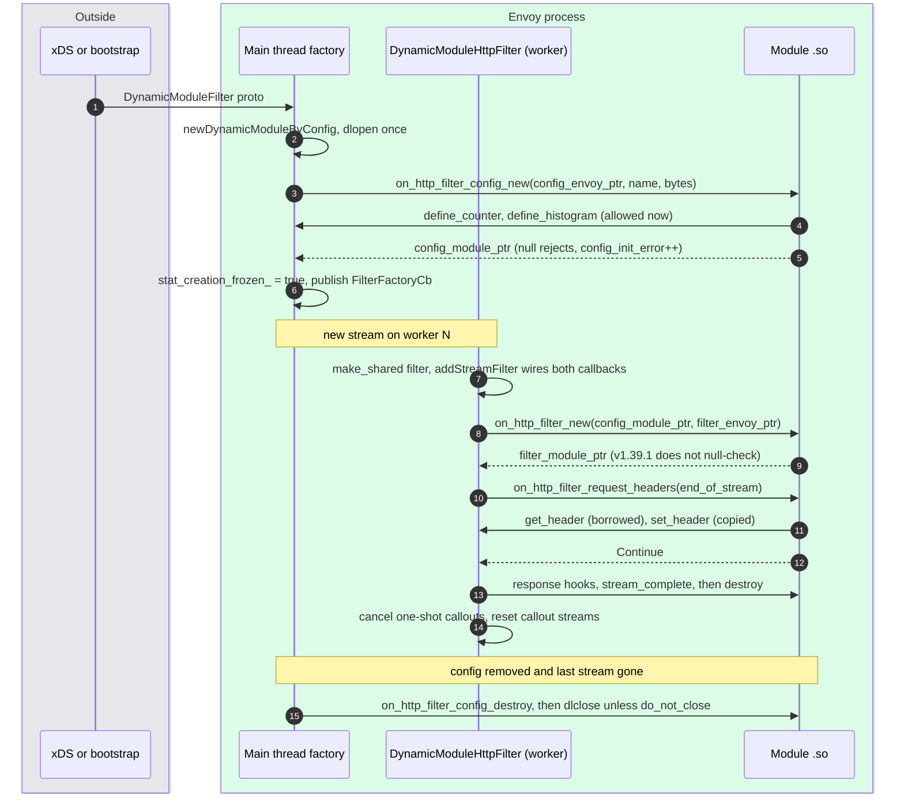

- **Why `on_http_filter_new` runs after `addStreamFilter`**: both decoder and encoder callbacks are wired first, so the module can read stream info at creation ([factory.cc:72-78](https://github.com/envoyproxy/envoy/blob/v1.39.1/source/extensions/filters/http/dynamic_modules/factory.cc#L72)).
- **Watermark registration is deferred** until the in-module filter exists, because registering replays a pending high-watermark event into the module ([filter.h:45-53](https://github.com/envoyproxy/envoy/blob/v1.39.1/source/extensions/filters/http/dynamic_modules/filter.h#L45), v1.39.0 fix [#44621](https://github.com/envoyproxy/envoy/pull/44621)).
- **Per-route config** is a second, independent object: `on_http_filter_per_route_config_new(name, bytes)` returns an opaque pointer that the filter fetches with `get_most_specific_route_config` ([abi.h:859](https://github.com/envoyproxy/envoy/blob/v1.39.1/source/extensions/dynamic_modules/abi/abi.h#L859), [abi_impl.cc:1688](https://github.com/envoyproxy/envoy/blob/v1.39.1/source/extensions/filters/http/dynamic_modules/abi_impl.cc#L1688)).

### 4.2 Async work from a module thread

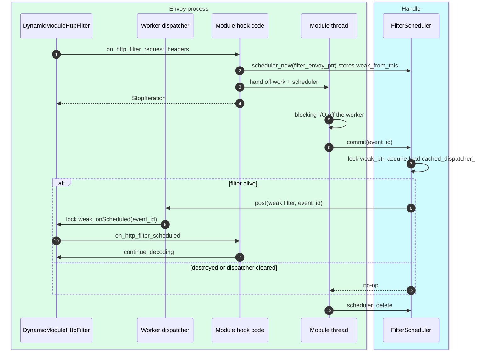

- **The TOCTOU fix ([#44841](https://github.com/envoyproxy/envoy/pull/44841), in v1.39.1)**: `commit()` used to read `decoder_callbacks_` from the foreign thread and call `->dispatcher()`. The callbacks object is owned by the filter manager and can be freed on the worker while the filter's `shared_ptr` is still alive. Now the worker publishes `&callbacks.dispatcher()` into `std::atomic<Event::Dispatcher*> cached_dispatcher_` with release order and `onDestroy` stores null ([filter.h:48](https://github.com/envoyproxy/envoy/blob/v1.39.1/source/extensions/filters/http/dynamic_modules/filter.h#L48), [filter.cc:34-37](https://github.com/envoyproxy/envoy/blob/v1.39.1/source/extensions/filters/http/dynamic_modules/filter.cc#L34), [filter.h:439-452](https://github.com/envoyproxy/envoy/blob/v1.39.1/source/extensions/filters/http/dynamic_modules/filter.h#L439)). The dispatcher lives as long as the worker, so the cached pointer is stable.
- **The module's side of the contract**: join or quiesce threads before worker shutdown, and delete the scheduler ([abi.h:2545-2549](https://github.com/envoyproxy/envoy/blob/v1.39.1/source/extensions/dynamic_modules/abi/abi.h#L2545)).

### 4.3 HTTP callouts, one-shot and streamable

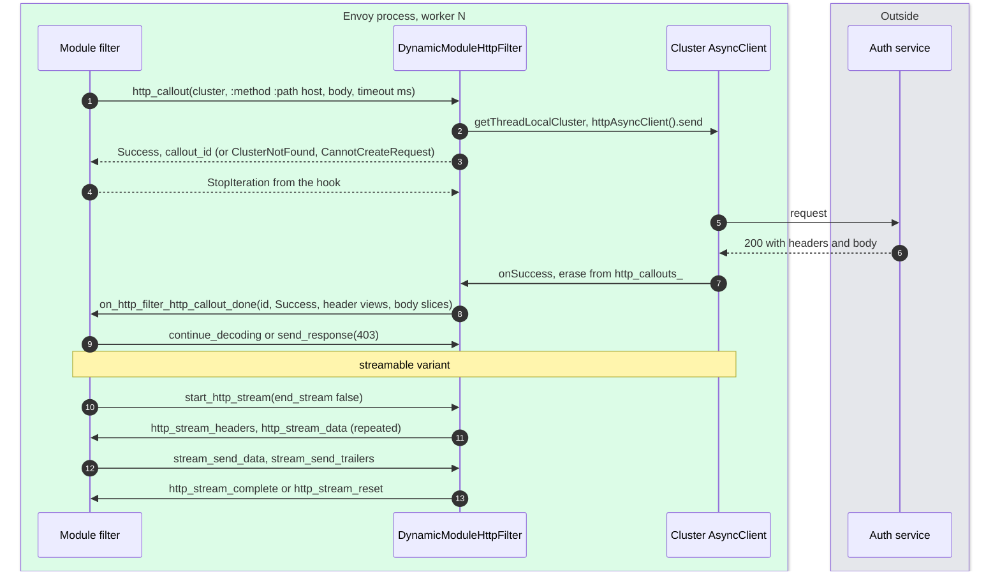

- **Destroy cancels everything.** `destroy()` calls `request->cancel()` on open one-shot callouts and `stream->reset()` on streams, after nulling `in_module_filter_`, so late callbacks see a dead filter and return ([filter.cc:47-82](https://github.com/envoyproxy/envoy/blob/v1.39.1/source/extensions/filters/http/dynamic_modules/filter.cc#L47)).
- **No re-entrant failure.** If the async client fails inline before `request_` is set, `onFailure` does not call the module back ([filter.cc:275-278](https://github.com/envoyproxy/envoy/blob/v1.39.1/source/extensions/filters/http/dynamic_modules/filter.cc#L275)).
- **Response bodies are zero copy**: `RawSlice` arrays are reinterpreted as `envoy_buffer` arrays ([filter.cc:247-253](https://github.com/envoyproxy/envoy/blob/v1.39.1/source/extensions/filters/http/dynamic_modules/filter.cc#L247)). This relies on identical layout, unasserted on the C++ side.

### 4.4 Async host selection in a module cluster

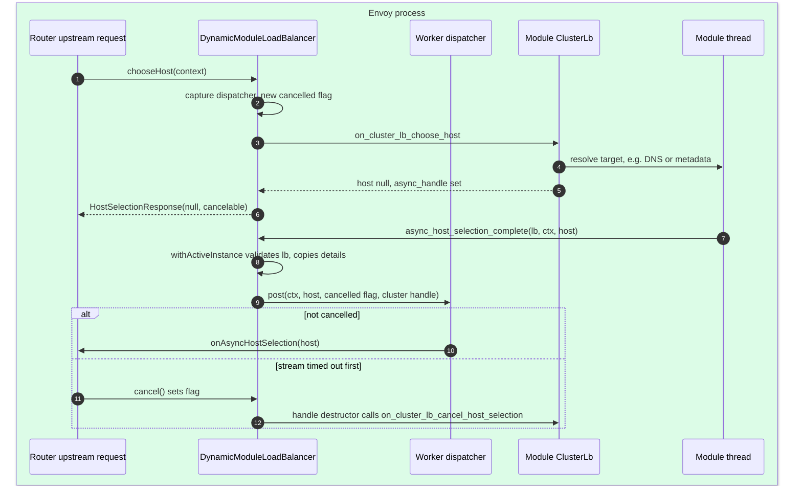

- **Validation of a raw pointer from any thread**: `withActiveInstance` checks the LB against a live registry under a lock before touching it ([abi_impl.cc:1446-1452](https://github.com/envoyproxy/envoy/blob/v1.39.1/source/extensions/clusters/dynamic_modules/abi_impl.cc#L1446)). The handle's destructor calls `on_cluster_lb_cancel_host_selection` on both paths, because that hook also frees the module-side handle ([cluster.cc:829-836](https://github.com/envoyproxy/envoy/blob/v1.39.1/source/extensions/clusters/dynamic_modules/cluster.cc#L829)).
- **v1.39.1 limitation**: one `active_async_cancelled_` slot per LB ([cluster.cc:801](https://github.com/envoyproxy/envoy/blob/v1.39.1/source/extensions/clusters/dynamic_modules/cluster.cc#L801)). A second `chooseHost` on the same worker overwrites it, so a completion can read the wrong flag and a resolved request waits until its route timeout (15 s default). Main keys the flag by `LoadBalancerContext` ([#47240](https://github.com/envoyproxy/envoy/pull/47240)).

---

## 5. State machines

### 5.1 DynamicModuleHttpFilter

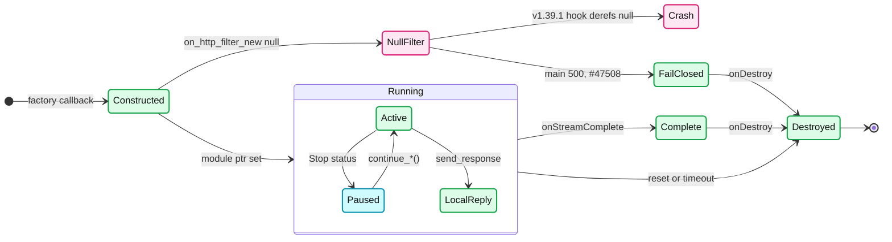

- `Destroyed` is final: `in_module_filter_` is null, `decoder_callbacks_` null, dispatcher cache null, so every late callback, scheduled event or callout completion is a no-op ([filter.cc:294-299](https://github.com/envoyproxy/envoy/blob/v1.39.1/source/extensions/filters/http/dynamic_modules/filter.cc#L294)).
- Main defers the in-module destroy ([#46548](https://github.com/envoyproxy/envoy/pull/46548)), main only.

### 5.2 A module object in the process

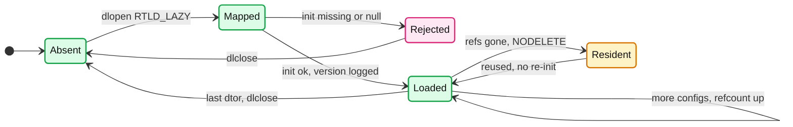

- `Resident` is why a module that registers functions or shared data must set `do_not_close`: the registries hold raw pointers into its memory ([lib.rs:219-222, 268-273](https://github.com/envoyproxy/envoy/blob/v1.39.1/source/extensions/dynamic_modules/sdk/rust/src/lib.rs#L219)).
- The `Resident` to `Loaded` edge skips `on_program_init`, so process-wide init runs once per process, not once per config **[inferred from the NOLOAD path]**.

### 5.3 Remote module source

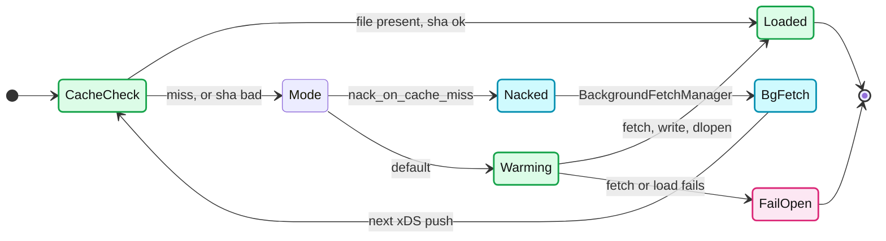

- **Warming** registers an init target, so a listener does not serve until the fetch completes or exhausts retries. It requires an init manager, so it is unavailable to ECDS (Extension Config Discovery Service) ([dynamic_modules.proto:98-114](https://github.com/envoyproxy/envoy/blob/v1.39.1/api/envoy/extensions/dynamic_modules/v3/dynamic_modules.proto#L98)).
- **FailOpen**: the factory callback becomes a no-op lambda, the filter is simply absent, and `remote_fetch_error` increments ([factory.cc:137-146](https://github.com/envoyproxy/envoy/blob/v1.39.1/source/extensions/filters/http/dynamic_modules/factory.cc#L137)).

---

## 6. Component deep dives

### 6.1 The loader, `source/extensions/dynamic_modules/dynamic_modules.cc`

- `newDynamicModuleByConfig` returns `DynamicModuleLoadResult{loaded, async}`: exactly one is set ([dynamic_modules.h:209-212](https://github.com/envoyproxy/envoy/blob/v1.39.1/source/extensions/dynamic_modules/dynamic_modules.h#L209)).
- Search order by name: static symbol in binary, then `${ENVOY_DYNAMIC_MODULES_SEARCH_PATH:-.}/lib<name>.so`, then `dlopen("lib<name>.so")` which walks `LD_LIBRARY_PATH` and system paths ([dynamic_modules.cc:94-141](https://github.com/envoyproxy/envoy/blob/v1.39.1/source/extensions/dynamic_modules/dynamic_modules.cc#L94), [dynamic_modules.rst:62-72](https://github.com/envoyproxy/envoy/blob/v1.39.1/docs/root/intro/arch_overview/advanced/dynamic_modules.rst#L62)).
- `RTLD_LAZY` is required ("otherwise dlopen results in Invalid argument", [dynamic_modules.cc:47-48](https://github.com/envoyproxy/envoy/blob/v1.39.1/source/extensions/dynamic_modules/dynamic_modules.cc#L47)). A callback this Envoy does not export therefore fails either at `dlopen` (Rust cdylibs link with immediate binding by default, which is why the weak stubs exist) or at the first call (a C module built with lazy binding) **[inferred]**. This is why compatibility runs "old module on newer Envoy", never the reverse.
- Load failures increment `dynamic_modules.module_load_error{config_name}` on the **server** scope, because a rejected listener's scope is destroyed before it merges ([dynamic_module_stats.h](https://github.com/envoyproxy/envoy/blob/v1.39.1/source/extensions/dynamic_modules/dynamic_module_stats.h)). v1.39.1 logs nothing from the loader itself on `dlopen` failure. Main adds error logs for context-less paths such as bootstrap ([#46966](https://github.com/envoyproxy/envoy/pull/46966)).

### 6.2 ABI versioning: four generations

| Generation | Mechanism | Mismatch behaviour |
|---|---|---|
| Aug 2024 to Jan 2026 | `abi_version.h`, a checked-in SHA-256 of `abi.h`, returned by the module from `on_program_init` and compared to Envoy's `kAbiVersion` | **Reject**: "ABI version mismatch" |
| Jan 2026, [#42846](https://github.com/envoyproxy/envoy/pull/42846) (@agrawroh), shipped in v1.37 | Same strict hash, generated at build time by `compute_abi_hash.py`. Reason: every ABI PR rewrote the one-line file, so any two ABI PRs always conflicted | Reject (v1.37.0 loader, read via `gh` at that tag) |
| Feb 2026, [#43219](https://github.com/envoyproxy/envoy/pull/43219) (@mathetake), shipped v1.38, backported to v1.37.1 ([#43616](https://github.com/envoyproxy/envoy/pull/43616)) | Semver string `v0.1.0` ([abi.h:30-47](https://github.com/envoyproxy/envoy/blob/v1.39.1/source/extensions/dynamic_modules/abi/abi.h#L30)). Promise: a module built with the SDK for X.Y works on X.Y and X.(Y+1) ([dynamic_modules.rst:57](https://github.com/envoyproxy/envoy/blob/v1.39.1/docs/root/intro/arch_overview/advanced/dynamic_modules.rst#L57), [1.38.0.yaml:636](https://github.com/envoyproxy/envoy/blob/v1.39.1/changelogs/1.38.0.yaml#L636)). **This is v1.39.1** | Warn only, load |
| Main, [#47435](https://github.com/envoyproxy/envoy/pull/47435) (@wbpcode, 2026-09-14) | A written policy at the top of `abi.h`. The version string (`v0.2.0` on main) is "a diagnostic marker ... not part of the compatibility policy". Envoy logs a difference and loads anyway | Warn only, load |

**The main-branch policy, in four rules** **[documented, main `abi.h`, not in v1.39.1]**:
1. **Released ABI is frozen.** Once an entity ships in any vX.Y.0, its name, parameter list, return type, struct layout, enum numbering and documented semantics (ownership, buffer lifetime, threading, re-entrancy, nullability, return meaning) never change.
2. **Unreleased ABI may change freely**, with no suffix and no release note.
3. **Grow by addition.** A changed signature is a new `_v2`, `_v3` function next to the old one (the unsuffixed name is implicitly v1 and is never renamed). A **new hook on an existing extension must be resolved optionally**, treating a missing symbol as "not implemented", because older modules do not export it. Appending an enumerator is safe only for enums that flow module to Envoy. Example already on main: `envoy_dynamic_module_callback_log_v2` with source location ([#47349](https://github.com/envoyproxy/envoy/pull/47349), [#47436](https://github.com/envoyproxy/envoy/pull/47436)).
4. **Deprecate for at least four release cycles** before removing. Never removing is acceptable.

**How the pieces relate.** #42846 fixed a developer-workflow problem inside a strict-hash world. #43219 abandoned the strict gate because a hash forces every module to be rebuilt in lockstep with every Envoy build, which blocks decoupled rollouts. #47435 then replaced "one release forward" with "additive forever", where compatibility "follows from these four rules together with symbol resolution". In v1.39.1 you can already see rule 3 in code: the optional config-level hooks (`on_http_filter_config_scheduled`, config callouts, `on_http_filter_local_reply`) are resolved without `RETURN_IF_NOT_OK` ([filter_config.cc:169-190, 202](https://github.com/envoyproxy/envoy/blob/v1.39.1/source/extensions/filters/http/dynamic_modules/filter_config.cc#L169)).

### 6.3 Every extension point

| Extension (v1.39.1) | Config proto | Key hooks | Key callbacks | Status |
|---|---|---|---|---|
| HTTP filter + per-route | `filters.http.dynamic_modules.v3.DynamicModuleFilter`, `...FilterPerRoute` | `request/response_headers/body/trailers`, `stream_complete`, `scheduled`, `http_callout_done`, `http_stream_*`, `local_reply` | headers, body, metadata, filter state, `send_response`, callouts, scheduler, spans, `set_upstream_override_host` | **stable** |
| Network filter (terminal optional) | `filters.network...DynamicModuleNetworkFilter` (`terminal_filter`) | `new_connection`, `read`, `write`, `event`, watermarks | buffers, `close`, `read_disable`, half-close, callouts | alpha |
| Listener filter | `filters.listener...DynamicModuleListenerFilter` | `on_accept`, `on_data`, `on_close`, `get_max_read_bytes` | SNI, ALPN, JA3/JA4, `write_to_socket`, socket options | alpha |
| UDP listener filter | `filters.udp...DynamicModuleUdpListenerFilter` | `on_data` | datagram, addresses, metrics | alpha |
| Access logger | `access_loggers...DynamicModuleAccessLog` | `log`, `flush` | ~95 getters: timing, bytes, headers, metadata | alpha |
| Formatter | `formatter...DynamicModuleFormatter` | `parse`, `format` | headers, stream info | alpha |
| Bootstrap extension | `bootstrap...DynamicModuleBootstrapExtension` | `server_initialized`, `worker_thread_initialized`, `drain_started`, `shutdown`, `timer_fired`, `file_changed`, cluster/listener add, remove | timers, admin handlers, init target, stats iteration, callouts | alpha |
| Cluster | `clusters...ClusterConfig` (needs `lb_policy: CLUSTER_PROVIDED`) | `init`, `lb_new`, `lb_choose_host`, `lb_cancel_host_selection`, `worker_event`, `lb_on_host_membership_update` | `add_hosts`, `remove_hosts`, `update_host_health`, `pre_init_complete`, `run_on_all_workers`, worker slots | alpha |
| Load balancing policy | `load_balancing_policies...DynamicModulesLoadBalancerConfig` | `lb_new`, `lb_choose_host`, `lb_on_host_membership_update` | host counts, health, locality, metadata, `get_host_stat`, `should_select_another_host`, `set_host_data` | alpha |
| Matcher + data input | `matching.input_matchers...DynamicModuleMatcher`, `matching.http...HttpDynamicModuleMatchInput` | `matcher_match` | headers of the match context | alpha |
| TLS cert validator | `transport_sockets.tls.cert_validator...DynamicModuleCertValidatorConfig` | `do_verify_cert_chain`, `get_ssl_verify_mode`, `update_digest` | error details, filter state | alpha |
| Transport socket | `transport_sockets...DynamicModuleTransportSocket` (`implements_secure_transport`) | `do_read`, `do_write`, `on_connected`, `close`, `start_secure_transport` | `io_read`, `io_write`, `get_fd`, buffers, `raise_event` | alpha |
| Upstream HTTP-TCP bridge | `upstreams.http...Config` | `encode_headers/data/trailers`, `on_upstream_data` | request/response buffers, chunk sizes | alpha |
| Tracer | `tracers...DynamicModuleTracer` | `start_span`, span tags, `inject_context`, `spawn_child`, `finish` | trace context | alpha |
| Stats sink | `stat_sinks...DynamicModuleStatsSink` | `flush`, `on_histogram_complete` | counters, gauges, histogram snapshots | alpha |
| Health checker | `health_checkers...DynamicModuleHealthCheck` | `session_new`, `on_interval`, `on_timeout` | thread-safe reporter | alpha |
| DNS resolver (ABI only) | none, used by `envoy.network.dns_resolver.hickory` | `dns_resolve`, `dns_resolve_cancel`, `reset_networking` | `dns_resolve_complete` | Hickory: alpha |

Status column from [extensions_metadata.yaml](https://github.com/envoyproxy/envoy/blob/v1.39.1/source/extensions/extensions_metadata.yaml) (for example HTTP at line 2426, LB at 2226, cluster at 183, transport socket at 1701). All are `requires_trusted_downstream_and_upstream`. **Main only**: cluster specifier, early header mutation, header formatter, xDS config validator.

### 6.4 The HTTP filter, `source/extensions/filters/http/dynamic_modules/`

- **Required vs optional hooks.** 20 hooks are mandatory. A missing one fails `newDynamicModuleHttpFilterConfig` and counts `config_init_error` ([filter_config.cc:91-167, 192-200](https://github.com/envoyproxy/envoy/blob/v1.39.1/source/extensions/filters/http/dynamic_modules/filter_config.cc#L91), [factory.cc:46-50](https://github.com/envoyproxy/envoy/blob/v1.39.1/source/extensions/filters/http/dynamic_modules/factory.cc#L46)). The SDKs export all of them with defaults, so a Rust author implements only what they need.
- **Terminal mode**: `terminal_filter: true` lets a module act as the whole upstream, streaming its own response with `send_response_headers/data/trailers` ([dynamic_modules.proto:27-31](https://github.com/envoyproxy/envoy/blob/v1.39.1/api/envoy/extensions/filters/http/dynamic_modules/v3/dynamic_modules.proto#L27)).
- **Per-stream heap cost**: one `std::make_shared<DynamicModuleHttpFilter>` plus, in Rust, `Box<Box<dyn HttpFilter>>` (two allocations) from `wrap_into_c_void_ptr!` ([factory.cc:69-71](https://github.com/envoyproxy/envoy/blob/v1.39.1/source/extensions/filters/http/dynamic_modules/factory.cc#L69), [lib.rs:584-590](https://github.com/envoyproxy/envoy/blob/v1.39.1/source/extensions/dynamic_modules/sdk/rust/src/lib.rs#L584)). The double box exists because a `dyn` fat pointer does not fit in a C `void*`.
- **`send_response` defaults `details` to `dynamic_module`** and is a no-op on a destroyed filter ([abi_impl.cc:957-983](https://github.com/envoyproxy/envoy/blob/v1.39.1/source/extensions/filters/http/dynamic_modules/abi_impl.cc#L957)).

### 6.5 Scheduler, registries and thread guards

- **Schedulers** exist per object type: HTTP filter and config, network, listener, bootstrap, cluster. Each holds a `weak_ptr` to its owner, so `commit` after destruction is a no-op. Config schedulers post to the main thread.
- **Function registry and shared data registry** ([abi_impl.cc:20-30, 112-160](https://github.com/envoyproxy/envoy/blob/v1.39.1/source/extensions/dynamic_modules/abi_impl.cc#L20)): process-wide `absl::flat_hash_map<std::string, void*>` behind an `absl::Mutex`. Functions are insert-once (`try_emplace`); shared data may be overwritten. The intended pattern: a bootstrap module publishes a Tokio runtime handle or a tenant snapshot getter, and HTTP filters resolve it once in `config_new` and cache it ([lib.rs:203-301](https://github.com/envoyproxy/envoy/blob/v1.39.1/source/extensions/dynamic_modules/sdk/rust/src/lib.rs#L203)). Each lookup copies the key into a `std::string` and takes a reader lock, so per-request lookups are a scaling mistake **[inferred]** (main removes the copy, [#47395](https://github.com/envoyproxy/envoy/pull/47395)). The `publish_shared_state` handle API proposed in [#43363](https://github.com/envoyproxy/envoy/pull/43363) is not in v1.39.1's `abi.h`.
- **Release-mode thread guards ([#44843](https://github.com/envoyproxy/envoy/pull/44843), in v1.39.1)**: main-thread-only callbacks used `ASSERT_IS_MAIN_OR_TEST_THREAD()`, which compiles out in release builds. A Tokio task calling `cluster_add_hosts` would corrupt the priority set's callback list. Now they check `Thread::MainThread::isMainOrTestThread()`, fire `IS_ENVOY_BUG` (release: log plus `server.envoy_bug_failures`), and return failure ([cluster abi_impl.cc:128-135](https://github.com/envoyproxy/envoy/blob/v1.39.1/source/extensions/clusters/dynamic_modules/abi_impl.cc#L128), [abi_impl.cc:76-92](https://github.com/envoyproxy/envoy/blob/v1.39.1/source/extensions/dynamic_modules/abi_impl.cc#L76)). The reverse guard exists too: `cluster_worker_timer_delete` must run on a worker.

### 6.6 Memory and safety across the FFI boundary

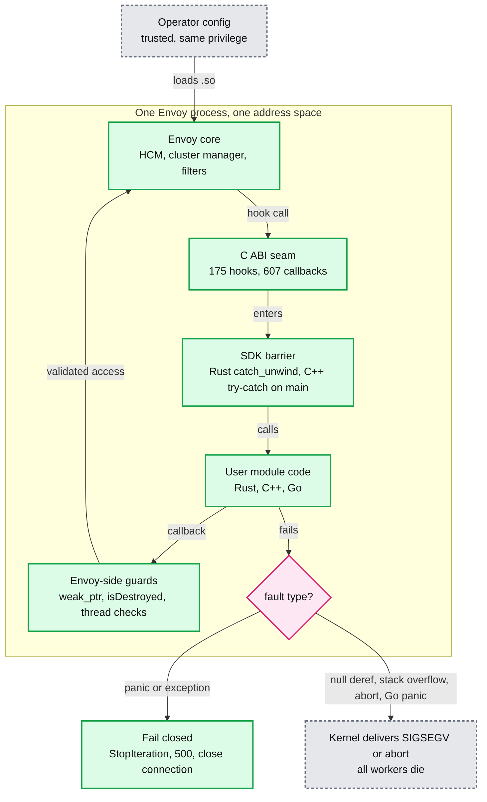

- **Why a panic must never cross `extern "C"`**: letting a Rust panic unwind out of an `extern "C"` function was undefined behaviour, and since Rust 1.81 the compiler turns it into an abort ("panic in a function that cannot unwind") **[external]**. Either way the whole process dies with no log of which module or hook did it ([#44846](https://github.com/envoyproxy/envoy/pull/44846) description). So since #44846 (in v1.39.1) every `extern "C"` entry is wrapped in `std::panic::catch_unwind` (that PR covered the 11 SDK files not yet guarded) with a fail-closed sentinel chosen per hook: request headers return `StopIteration`, body returns `StopIterationNoBuffer`, `*_new` returns null ([http.rs:4451-4466](https://github.com/envoyproxy/envoy/blob/v1.39.1/source/extensions/dynamic_modules/sdk/rust/src/http.rs#L4451)). Main collapses the hand-written guards into one `ffi_export` macro with a required fallback ([#47410](https://github.com/envoyproxy/envoy/pull/47410)).
- **The sentinel alone parks the stream.** `StopIteration` with no response means the stream waits for `stream_idle_timeout` (5 min default) **[inferred]**. The opt-in `CatchUnwind<F>` wrapper adds the graceful action: 500 on the request path, stream reset on the response path, poison so no later hook re-enters an inconsistent filter ([catch_unwind.rs:1-16, 127](https://github.com/envoyproxy/envoy/blob/v1.39.1/source/extensions/dynamic_modules/sdk/rust/src/catch_unwind.rs#L1), [dynamic_modules.rst:81-95](https://github.com/envoyproxy/envoy/blob/v1.39.1/docs/root/intro/arch_overview/advanced/dynamic_modules.rst#L81)). It borrows the filter in place so legitimate re-entrancy (`on_stream_complete` fired inline from `on_scheduled`) is not misread as poison (v1.39.0 fix).
- **UB at the seam ([#44850](https://github.com/envoyproxy/envoy/pull/44850), in v1.39.1)**: `slice::from_raw_parts(null, 0)` is UB in Rust even with length 0 (the pointer must be non-null and aligned), and C passes `(nullptr, 0)` for "empty" all the time. `from_utf8_unchecked` on a header value is UB because header bytes are not guaranteed UTF-8 ([abi.h:1659-1660](https://github.com/envoyproxy/envoy/blob/v1.39.1/source/extensions/dynamic_modules/abi/abi.h#L1659)). Replacements: `slice_from_raw_or_empty` and `str_lossy_from_raw` ([ffi_helpers.rs:42, 77](https://github.com/envoyproxy/envoy/blob/v1.39.1/source/extensions/dynamic_modules/sdk/rust/src/ffi_helpers.rs#L42)).
- **`#[repr(transparent)]` ([#43798](https://github.com/envoyproxy/envoy/pull/43798))** on `EnvoyCounterId` and friends guarantees the newtype has exactly the ABI of the inner `usize` ([lib.rs:535-562](https://github.com/envoyproxy/envoy/blob/v1.39.1/source/extensions/dynamic_modules/sdk/rust/src/lib.rs#L535)).
- **Ownership never crosses.** Every buffer is freed by the side that allocated it. Envoy copies module buffers it keeps (`addCopy`), and the module copies Envoy buffers it keeps past the hook. Scheduler, timer and child-span handles are Envoy allocations the module must release explicitly.
- **Stat pool race ([#44840](https://github.com/envoyproxy/envoy/pull/44840))**: config-level increments may run on any thread, so they now build a local `StatNameDynamicPool` per call instead of sharing the config's pool ([abi_impl.cc:781](https://github.com/envoyproxy/envoy/blob/v1.39.1/source/extensions/filters/http/dynamic_modules/abi_impl.cc#L781)).
- **Fail-fast registration ([#44472](https://github.com/envoyproxy/envoy/pull/44472))**: `set_factory_once!` uses `OnceLock::set`. If a standalone and a consolidated `.so` both register a different HTTP factory, it logs critical and returns null from `on_program_init`, so the module fails to load instead of silently running the wrong factory ([lib.rs:425-458](https://github.com/envoyproxy/envoy/blob/v1.39.1/source/extensions/dynamic_modules/sdk/rust/src/lib.rs#L425)).
- **Main only**: null in-module HTTP filter now sends 500 with details `dynamic_module_filter_init_failed` ([#47508](https://github.com/envoyproxy/envoy/pull/47508)), matching what the network filter already does in v1.39.1 (closes the connection, [network filter.cc:93-98](https://github.com/envoyproxy/envoy/blob/v1.39.1/source/extensions/filters/network/dynamic_modules/filter.cc#L93)). C++ SDK `failClosed` try-catch barrier ([#47650](https://github.com/envoyproxy/envoy/pull/47650)). Core listener fix for re-entrant `continueFilterChain` from inside a listener filter hook ([#47549](https://github.com/envoyproxy/envoy/pull/47549)).

### 6.7 The Rust SDK, `sdk/rust`

- **Crate** `envoy-proxy-dynamic-modules-rust-sdk` 0.1.0, one runtime dependency (`mockall`, for the `automock` traits) ([Cargo.toml](https://github.com/envoyproxy/envoy/blob/v1.39.1/source/extensions/dynamic_modules/sdk/rust/Cargo.toml)). Modules per extension: `http.rs` (5,131 lines), `cluster.rs`, `network.rs`, `listener.rs`, `load_balancer.rs`, `transport_socket.rs` and 11 more extension files, split in [#43776](https://github.com/envoyproxy/envoy/pull/43776).
- **Bindings**: `build.rs` runs `bindgen` over `abi/abi.h` (a symlink to the canonical header) with Rust enums and a callback that trims enum prefixes, so you write `...request_headers_status::Continue` ([build.rs](https://github.com/envoyproxy/envoy/blob/v1.39.1/source/extensions/dynamic_modules/sdk/rust/build.rs), [lib.rs:91-93](https://github.com/envoyproxy/envoy/blob/v1.39.1/source/extensions/dynamic_modules/sdk/rust/src/lib.rs#L91)).
- **Macros**: `declare_init_functions!(init, http_config_fn[, per_route_fn])` for HTTP only ([lib.rs:127](https://github.com/envoyproxy/envoy/blob/v1.39.1/source/extensions/dynamic_modules/sdk/rust/src/lib.rs#L127)), and `declare_all_init_functions!(init, http: f, network: g, cluster: h, ...)` with 17 arms, one module serving many extension points ([lib.rs:763](https://github.com/envoyproxy/envoy/blob/v1.39.1/source/extensions/dynamic_modules/sdk/rust/src/lib.rs#L763)). Both generate `envoy_dynamic_module_on_program_init` under `catch_unwind`.
- **Traits**: `HttpFilterConfig<EHF>` + `HttpFilter<EHF>` with the `EnvoyHttpFilter` callback trait; `NetworkFilterConfig`/`NetworkFilter`; `ListenerFilter`; `ClusterConfig`/`Cluster`/`ClusterLb`; `LoadBalancerConfig`/`LoadBalancer`; `TransportSocketFactoryConfig`/`TransportSocket`; `HealthCheckerConfig`/`HealthCheckerSession`. The `EHF` type parameter lets tests pass a `MockEnvoyHttpFilter`.

A minimal filter (API-key gate), written against the v1.39.1 SDK signatures (`cdylib` crate):

```rust
use envoy_proxy_dynamic_modules_rust_sdk::*;
use std::sync::Arc;
declare_init_functions!(init, new_http_filter_config_fn);
fn init() -> bool {
  true
}
fn new_http_filter_config_fn<EC: EnvoyHttpFilterConfig, EHF: EnvoyHttpFilter>(
  envoy_filter_config: &mut EC,
  name: &str,
  config: &[u8],
) -> Option<Box<dyn HttpFilterConfig<EHF>>> {
  if name != "api_key_gate" {
    return None; // Envoy rejects the config, config_init_error++.
  }
  let expected: Arc<[u8]> = Arc::from(config);
  let denied = envoy_filter_config.define_counter("api_key_denied_total").ok()?;
  Some(Box::new(GateConfig { expected, denied }))
}
struct GateConfig {
  expected: Arc<[u8]>,
  denied: EnvoyCounterId,
}
impl<EHF: EnvoyHttpFilter> HttpFilterConfig<EHF> for GateConfig {
  fn new_http_filter(&self, _envoy: &mut EHF) -> Box<dyn HttpFilter<EHF>> {
    let f = GateFilter { expected: self.expected.clone(), denied: self.denied };
    Box::new(CatchUnwind::new(f)) // 500 instead of a parked stream on panic.
  }
}
struct GateFilter {
  expected: Arc<[u8]>,
  denied: EnvoyCounterId,
}
impl<EHF: EnvoyHttpFilter> HttpFilter<EHF> for GateFilter {
  fn on_request_headers(
    &mut self,
    envoy: &mut EHF,
    _end_of_stream: bool,
  ) -> abi::envoy_dynamic_module_type_on_http_filter_request_headers_status {
    let ok = envoy
      .get_request_header_value("x-api-key") // borrowed, zero copy
      .is_some_and(|v| v.as_slice() == &self.expected[..]);
    if ok {
      envoy.remove_request_header("x-api-key");
      return abi::envoy_dynamic_module_type_on_http_filter_request_headers_status::Continue;
    }
    let _ = envoy.increment_counter(self.denied, 1);
    envoy.send_response(401, &[("content-type", b"text/plain")], Some(b"denied\n"), Some("api_key_denied"));
    abi::envoy_dynamic_module_type_on_http_filter_request_headers_status::StopIteration
  }
}
```

- It follows the in-tree test modules ([test_data/rust/http.rs](https://github.com/envoyproxy/envoy/blob/v1.39.1/test/extensions/dynamic_modules/test_data/rust/http.rs)); no Rust toolchain was available to compile it here **[inferred compilable from signatures]**. Configure it with `dynamic_module_config: {name: api_gate}`, `filter_name: api_key_gate`, and `filter_config` as a `google.protobuf.StringValue` holding the key.

### 6.8 The C++ and Go SDKs

- **C++** (`sdk/cpp`, C++20): `HttpFilter`, `HttpFilterFactory`, `HttpFilterConfigFactory` registered with `REGISTER_HTTP_FILTER_CONFIG_FACTORY`, plus network and listener filters ([sdk.h:1154-1320](https://github.com/envoyproxy/envoy/blob/v1.39.1/source/extensions/dynamic_modules/sdk/cpp/sdk.h#L1154)). In v1.39.1 an exception thrown from a hook crosses the C boundary and calls `std::terminate` **[inferred: no try/catch in sdk_internal.cc]**. Main adds the barrier ([#47650](https://github.com/envoyproxy/envoy/pull/47650)).
- **Go** (`sdk/go`, cgo): HTTP, network, listener filters and stats sink, factories registered in `init()` ([sdk.go](https://github.com/envoyproxy/envoy/blob/v1.39.1/source/extensions/dynamic_modules/sdk/go/sdk.go)). No `recover()` anywhere in the SDK, in v1.39.1 or on main, so a Go panic in a hook terminates the process **[inferred from grep]**. Needs `do_not_close: true` (Go `c-shared` cannot unload). Go's own runtime (GC, goroutine scheduler threads) now lives inside Envoy.

### 6.9 Metrics

- **Define in config, update anywhere.** `define_counter/gauge/histogram` (optionally with label names, the `*_vec` variants) are legal only while `config_new` runs; the ID is an index into the config's metric vector ([abi.h:1339-1363](https://github.com/envoyproxy/envoy/blob/v1.39.1/source/extensions/dynamic_modules/abi/abi.h#L1339)). Results: `Success, MetricNotFound, InvalidLabels, Frozen` ([abi.h:224-229](https://github.com/envoyproxy/envoy/blob/v1.39.1/source/extensions/dynamic_modules/abi/abi.h#L224)). Label value counts must match the definition.
- **Why the freeze**: the release-store of `stat_creation_frozen_` pairs with acquire-loads in the `define_*` callbacks, defending against a module that spawns a thread inside `config_new` ([filter_config.cc:217-222](https://github.com/envoyproxy/envoy/blob/v1.39.1/source/extensions/filters/http/dynamic_modules/filter_config.cc#L217)).
- **Namespace**: scope `"<metrics_namespace>."`, default `dynamicmodulescustom`, so Prometheus shows `envoy_dynamicmodulescustom_<name>` ([#43266](https://github.com/envoyproxy/envoy/pull/43266)). The legacy output (namespace registered as a custom stat namespace: prefix stripped, no `envoy_`) sits behind `envoy.reloadable_features.dynamic_modules_strip_custom_stat_prefix`, a `FALSE_RUNTIME_GUARD` ([runtime_features.cc:279-283](https://github.com/envoyproxy/envoy/blob/v1.39.1/source/common/runtime/runtime_features.cc#L279), [#43269](https://github.com/envoyproxy/envoy/pull/43269)).
- **Labeled increments cost a symbolization**: each labeled increment adds the label values to a `StatNameDynamicPool` ([abi_impl.cc:37-45](https://github.com/envoyproxy/envoy/blob/v1.39.1/source/extensions/filters/http/dynamic_modules/abi_impl.cc#L37)). Unbounded label values are a cardinality and memory leak **[inferred]**.
- **Main**: a shared `MetricRegistry` replaces 17 per-extension copies of the counter/gauge/histogram ID tables ([#47439](https://github.com/envoyproxy/envoy/pull/47439), migrations [#47454](https://github.com/envoyproxy/envoy/pull/47454) to [#47465](https://github.com/envoyproxy/envoy/pull/47465)).

### 6.10 Load balancer and cluster modules

**What a module LB policy sees** (`envoy.load_balancing_policies.dynamic_modules`, per-worker instance on the worker-local priority set):

| Need | Callback | Notes |
|---|---|---|
| Topology | `lb_get_priority_set_size`, `lb_get_hosts_count`, `lb_get_healthy_hosts_count`, `lb_get_degraded_hosts_count` | per priority |
| Host identity | `lb_get_host_address`, `lb_get_healthy_host_address`, weights, `lb_get_host_locality` (region, zone, sub_zone) | borrowed buffers since v1.39.0 |
| Locality | `lb_get_locality_count`, `lb_get_locality_host_count`, `lb_get_locality_weight` | no accessor for Envoy's own local zone |
| Health and load | `lb_get_host_health`, `lb_get_host_stat` with `CxConnectFail, CxTotal, RqError, RqSuccess, RqTimeout, RqTotal, CxActive, RqActive` | [abi.h:9281-9300](https://github.com/envoyproxy/envoy/blob/v1.39.1/source/extensions/dynamic_modules/abi/abi.h#L9281) |
| Metadata | `lb_get_host_metadata_string/number/bool` | endpoint metadata |
| Per-host state | `lb_set_host_data` / `get_host_data`: one `uintptr_t` per host per worker | keyed by `(priority, index)` |
| Request context | `lb_context_compute_hash_key`, downstream headers, `lb_context_get_override_host` | only during choose |
| Retries | `lb_context_should_select_another_host(priority, index)`, host selection retry count ([#43775](https://github.com/envoyproxy/envoy/pull/43775)) | [abi.h:11480](https://github.com/envoyproxy/envoy/blob/v1.39.1/source/extensions/dynamic_modules/abi/abi.h#L11480) |
| Membership | `on_lb_on_host_membership_update(added, removed)` + `lb_get_member_update_host_address` ([#43778](https://github.com/envoyproxy/envoy/pull/43778)) | fires on every `updateHosts`, including health-only changes with 0/0 **[inferred from upstream_impl.cc:934-936]** |

- **Result shape**: `(priority, index within healthyHosts())`. Out of range returns no host with a warning log ([load_balancer.cc:53-68](https://github.com/envoyproxy/envoy/blob/v1.39.1/source/extensions/load_balancing_policies/dynamic_modules/load_balancer.cc#L53)). Note the three index spaces: the result is a healthy index, while `should_select_another_host` and `set_host_data` take an index within all hosts.
- **`per_host_data_` is keyed by `(priority, index)` and never cleared on membership change** ([load_balancer.cc:88-103](https://github.com/envoyproxy/envoy/blob/v1.39.1/source/extensions/load_balancing_policies/dynamic_modules/load_balancer.cc#L88)). After an EDS update indices shift, so real modules should key state by address **[inferred]**.
- **Cluster modules** own discovery and bring their own LB (`lb_policy: CLUSTER_PROVIDED`). The LB returns a host pointer, and can go async (section 4.4). Hosts come in through main-thread `add_hosts` with weight 1 to 128 ([cluster.cc:412](https://github.com/envoyproxy/envoy/blob/v1.39.1/source/extensions/clusters/dynamic_modules/cluster.cc#L412)), deduplicated against the priority set's cross-priority host map, and a batch that adds nothing skips the fan-out ([cluster.cc:409-470](https://github.com/envoyproxy/envoy/blob/v1.39.1/source/extensions/clusters/dynamic_modules/cluster.cc#L409)).

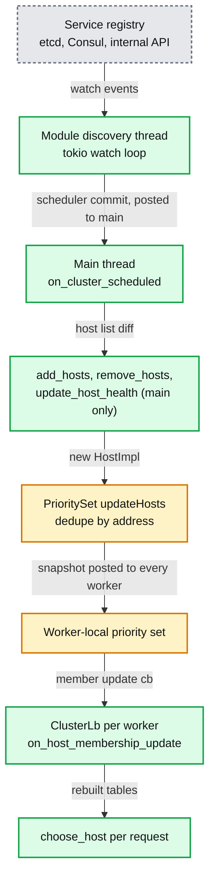

- **Worker fan-out primitives**: `cluster_run_on_all_workers` plus `on_cluster_worker_event`, and typed worker slots (`worker_slot_set<T>(Arc<T>)`) let the main thread publish a precomputed table (a ring, a Maglev table) to workers ([1.39.0.yaml](https://github.com/envoyproxy/envoy/blob/v1.39.1/changelogs/1.39.0.yaml#L735)).

### 6.11 Designing P2C with zone affinity and slow start as a module LB

Pick the **LB policy** extension on a normal EDS cluster, not a cluster module: Envoy keeps discovery, active health checks and outlier detection, and the module only chooses.

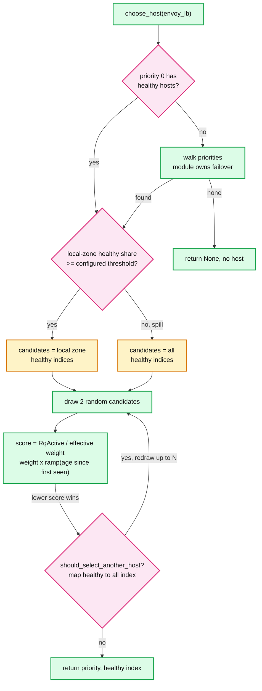

- **Config**: pass `local_zone` in `lb_policy_config` (JSON `Struct`), because the ABI exposes host localities but not Envoy's own node locality. Also `slow_start_window`, `aggression` (Envoy's native default 1.0) and `min_weight_percent` (native default 10%) ([cluster.proto:428, 433](https://github.com/envoyproxy/envoy/blob/v1.39.1/api/envoy/config/cluster/v3/cluster.proto#L428)).
- **State per worker, keyed by address**: `first_seen` timestamps filled from added hosts in `on_host_membership_update`. The ABI has no host creation time, so "first seen by this worker" approximates it; all workers receive the same update within one post, so skew is small **[inferred]**.
- **Tables rebuilt on every update** (0/0 updates included, since those carry health changes): healthy-index lists per zone, and a healthy-index to all-index map for the retry check. O(hosts) per update, O(1) per request.
- **Per request**: two `get_host_stat(RqActive)` reads (atomic gauge loads in Envoy) and arithmetic. Ramp `f(t) = max(min_weight, (t / window)^(1/aggression))`, mirroring the native slow-start shape. Lower `RqActive / (weight x f)` wins, which is least-request's `weight / (active + 1)^bias` with bias 1 ([cluster.proto:475](https://github.com/envoyproxy/envoy/blob/v1.39.1/api/envoy/config/cluster/v3/cluster.proto#L475)).
- **Zone spill rule**: stay local while the local zone holds at least its fair share of healthy hosts. Otherwise spread to all, like native zone-aware routing (enabled 100%, `min_cluster_size` 6) ([cluster.proto:578, 585](https://github.com/envoyproxy/envoy/blob/v1.39.1/api/envoy/config/cluster/v3/cluster.proto#L578)).
- **What I refuse to build**: priority load math with the 1.4 overprovisioning factor and panic mode. Single priority plus "walk to the next non-empty priority" covers the use case. Say so explicitly, because the native LB gives those for free and this module does not.
- **Risk**: `RqActive` is per host across all workers, but `per_host_data` is per worker. Keep any EWMA (exponentially weighted moving average) of latency per worker and accept the noise **[inferred]**.

### 6.12 Transport sockets and the kTLS idea

- The transport socket extension gives the module the raw byte stream: `do_read`/`do_write` hooks, `io_read`/`io_write` on the real socket, `read_buffer_add`, `write_buffer_drain`, and `get_fd`, documented as the descriptor "a module that performs raw socket operations such as installing kernel TLS with setsockopt uses" ([abi.h:13568-13577](https://github.com/envoyproxy/envoy/blob/v1.39.1/source/extensions/dynamic_modules/abi/abi.h#L13568)). It wraps `ioHandle().recv/writev/fdDoNotUse()` ([transport socket abi_impl.cc:51-98](https://github.com/envoyproxy/envoy/blob/v1.39.1/source/extensions/transport_sockets/dynamic_modules/abi_impl.cc#L51)).
- **kTLS (kernel TLS)** **[inferred, not in tree]**: do the TLS handshake in user space, then hand the negotiated keys and record sequence numbers to the kernel with `setsockopt(TCP_ULP, "tls")` and `setsockopt(SOL_TLS, TLS_TX/TLS_RX, ...)`. After that, plain `read`/`write` (and `sendfile`) on the socket are encrypted by the kernel or a NIC offload, saving a user-space copy and crypto on the worker.
- **Why the stock socket cannot**: Envoy's TLS transport socket drives BoringSSL's `SSL_read`/`SSL_write` for every record ([ssl_socket.cc:94, 357](https://github.com/envoyproxy/envoy/blob/v1.39.1/source/common/tls/ssl_socket.cc#L94)), and BoringSSL has no kTLS mode, unlike OpenSSL 3 **[external]**. A module can use a Rust TLS library that exports session secrets, finish the handshake, install kTLS through `get_fd`, and turn `do_read`/`do_write` into pass-through `io_read`/`io_write`. This is the live demo promised in the KubeCon Japan talk abstract.

---

## 7. Failure modes

| Failure | What you see | Blast radius | Mitigation |
|---|---|---|---|
| ABI version string differs | Warn `Dynamic module ABI version X is deprecated`, module loads | None if within one minor; real breakage appears as missing symbol or UB | Rebuild per Envoy minor; CI loads module against the target binary |
| Missing required hook | `Failed to resolve symbol ...`, config rejected, `config_init_error` (HTTP) | That config (NACK) or startup (bootstrap) | Use the SDK, which exports all hooks |
| Module needs a callback this Envoy lacks (built with newer SDK) | Rust: `dlopen` fails with an undefined symbol, `module_load_error`. Lazy-bound C: dynamic linker aborts at first call **[inferred]** | Config, or whole process for lazy binding | Never run a module built for a newer Envoy |
| Panic in a Rust hook | `caught panic at FFI boundary` log, fail-closed sentinel | One stream parks until `stream_idle_timeout` (5 min) **[inferred]** unless `CatchUnwind` sends 500 | Wrap filters in `CatchUnwind` |
| Panic or null in `new_http_filter` (v1.39.1) | Every later hook dereferences null, SIGSEGV | Whole process | Never return a failing filter; main sends 500 ([#47508](https://github.com/envoyproxy/envoy/pull/47508)) |
| Segfault, abort, stack overflow, Go panic, C++ exception (v1.39.1) | Process exit, core dump | All workers, all connections | Rust, fuzzing, canaries; hot restart does not help |
| Blocking call in a hook | `server.worker_N.watchdog_miss` after 200 ms, `watchdog_mega_miss` after 1000 ms, `loop_duration_us` p99 | Every connection on that worker (1/N) | Offload to module threads + scheduler, or HTTP callouts |
| Memory leak in module | RSS growth; no per-module memory stat exists | Process OOM kill | Canary with memory SLO; bounded label values |
| Use-after-free across async (module keeps `envoy_ptr` or a borrowed buffer past the hook) | Heisenbugs, crashes | Process | Copy borrowed data; use schedulers; Envoy side uses `weak_ptr` (#44841 fixed the Envoy-side race) |
| Overlapping async host selections (v1.39.1) | Resolved request waits to route timeout (15 s), `UT` | Affected requests | Avoid concurrent async selection per worker, or run main ([#47240](https://github.com/envoyproxy/envoy/pull/47240)) |
| Thread-contract violation (e.g. `add_hosts` off main) | `IS_ENVOY_BUG` log, `server.envoy_bug_failures`, call returns false | That call | Route through the cluster scheduler |
| Module load failure (`dlopen` error, not found) | Config rejected, `dynamic_modules.module_load_error{config_name}`; no loader log until main [#46966](https://github.com/envoyproxy/envoy/pull/46966) | Config or startup | Pin absolute `module.local.filename`; check `ldd` |
| Config parse failure (`*_config_new` returns null) | Config rejected, `config_init_error` | Config update NACKed, old config keeps serving | Validate config in CI with `--mode validate` (`is_validation_mode` callback) |
| Remote fetch fails (warming) | Filter silently absent, `remote_fetch_error` | Policy bypass | Use `nack_on_cache_miss`, or local files baked into the image |
| Duplicate factory registration | `Duplicate factory registration` critical log, module load fails | Config or startup | One consolidated `.so` per process |

---

## 8. Scalability and performance

- **The cost ladder** (per request, order of magnitude, all **[inferred]**; the tree has no DM benchmark): a module hook is an indirect call through a pointer cached at config time, nanoseconds. Lua and Wasm add a VM entry and copy headers into VM memory, roughly sub-microsecond to microseconds per call. ext_proc serializes headers to protobuf and makes a gRPC round trip, hundreds of microseconds to milliseconds, bounded by its 200 ms `message_timeout` default ([ext_proc.proto:211-217](https://github.com/envoyproxy/envoy/blob/v1.39.1/api/envoy/extensions/filters/http/ext_proc/v3/ext_proc.proto#L211)); ext_authz likewise defaults to 200 ms.
- **Where the costs actually were** (the PR record is the benchmark): allocations and repeated crossings, not the calls. In v1.39.1: double allocation in list getters removed ([#45429](https://github.com/envoyproxy/envoy/pull/45429)), stat names written straight into module buffers ([#45485](https://github.com/envoyproxy/envoy/pull/45485)), borrowed `EnvoyBuffer` returns for LB, network and listener getters, batched `get_header_values` ([#45451](https://github.com/envoyproxy/envoy/pull/45451)). Main only: allocation-free shared callbacks ([#47395](https://github.com/envoyproxy/envoy/pull/47395)), skip the batch crossing when a header has one value ([#47407](https://github.com/envoyproxy/envoy/pull/47407)), fill header pairs in place ([#47408](https://github.com/envoyproxy/envoy/pull/47408)), `SmallVec` label buffers ([#47476](https://github.com/envoyproxy/envoy/pull/47476)), thread-local scratch in the bridge body getter ([#47478](https://github.com/envoyproxy/envoy/pull/47478)), dropped size crossings ([#47499](https://github.com/envoyproxy/envoy/pull/47499), [#47500](https://github.com/envoyproxy/envoy/pull/47500)).
- **Batching rule**: one crossing per logical read. Reading a multi-valued header used to cost one crossing and one header-map lookup per value; the batched getter costs one of each ([1.39.0.yaml:785-789](https://github.com/envoyproxy/envoy/blob/v1.39.1/changelogs/1.39.0.yaml#L785)).
- **Borrowed getter rule**: return a view into Envoy memory, let the module decide whether to copy. A Rust `String` per header read on a 64-core box at 100k RPS per core is millions of allocations per second **[inferred]**.
- **What breaks first**: the worker thread running module code (section 3.4). Second: process-wide registries taken per request (one reader lock and one `std::string` per lookup). Third: labeled metrics with unbounded values.
- **What scales for free**: per-worker LB and filter instances, no locks on the request path, config objects shared read-only.

---

## 9. Trade-offs and alternatives

| Dimension | Native C++ | **Dynamic module** | Lua | Wasm (proxy-wasm) | ext_proc / ext_authz | Golang filter (contrib) |
|---|---|---|---|---|---|---|
| Latency added | none | ns per crossing | VM + copies | VM + copies | network round trip, 200 ms default timeout | cgo crossing |
| Isolation | none | **none**, shared address space | VM, same process | sandbox | separate process | none |
| Languages | C++ | C, C++, Rust, Go, any C-ABI language | Lua | many via Wasm | any | Go |
| Extension points | all | 17 incl. LB, cluster, transport socket | HTTP filter, cluster specifier | HTTP, network, access log, bootstrap, stats sink | HTTP and network filters | HTTP, network, cluster specifier, upstream |
| Deploy and versioning | rebuild Envoy | `.so` beside stock binary; v1.39.1 promises X.Y works on X.(Y+1); main promises frozen released ABI | inline script | `.wasm`, ABI spec | independent service | rebuild with contrib |
| Debuggability | gdb, full symbols | gdb works across the seam; module crash = Envoy core dump | print | limited | own service tooling | Go tooling |
| Security posture (metadata) | per extension | `requires_trusted_downstream_and_upstream` | `robust_to_untrusted_downstream` | `unknown`, alpha | `robust_to_untrusted_downstream_and_upstream` | `requires_trusted_downstream_and_upstream` |

The interviewer's own framing, from the KubeCon Japan 2026 abstract **[external]** ([schedule](https://events.linuxfoundation.org/kubecon-cloudnativecon-japan/program/schedule/)): *"C++ filters mean maintaining a fork. WASM delivered sandbox overhead, limited extension points, and a stalling ecosystem. We built Dynamic Modules to fix this and are now using it at Databricks and Netflix... Near-native performance, no sandbox, no rebuild. Both companies are replacing C++ forks and Wasm with native Rust, cutting tail latency and memory use while shipping features faster... Go/Rust SDKs work across 12+ extension points including network filters, LB policies, and custom clusters."*

| Decision | Chosen | Alternative | Why |
|---|---|---|---|
| Interface | C ABI | Expose Envoy's C++ classes | C++ has no stable ABI (name mangling, vtables, `std::string` layout), and Envoy's internals change every release |
| Isolation | None, trusted | Sandbox (Wasm) | Zero-copy access and LB/transport hooks are impossible across a sandbox |
| Data access | Borrowed views | Copies | Copies were the cost the design set out to remove |
| Compatibility (v1.39.1) | Warn, one-minor forward promise | Strict hash reject | Decouple module rollout from Envoy rollout |
| Panic handling | SDK barrier, fail closed | Let it abort | Keep one bad request from killing N workers |
| Remote fetch failure | Fail open | Fail closed | Matches Wasm remote data sources; wrong default for security modules **[inferred]** |

**Recommendation per use case** **[inferred]**:
- **Custom load balancing or service discovery**: dynamic module LB or cluster. Nothing else short of a fork can do it.
- **Hot-path header or body transform owned by the platform team**: dynamic module in Rust, wrapped in `CatchUnwind`.
- **Auth or policy owned by another team, with its own release train**: ext_authz; the fail-open or fail-closed choice is explicit and the process boundary protects Envoy.
- **Heavy body processing with a millisecond budget**: ext_proc.
- **Untrusted or third-party plugins**: Wasm, never a dynamic module.
- **Ten lines of glue**: Lua.
- **Go shop**: the dynamic module Go SDK over the contrib Golang filter, since it ships in the default build, but budget for the missing panic barrier.
- **L4 or TLS-level work (kTLS, custom crypto, protocol sniffing)**: dynamic module transport socket or listener filter.

---

## 10. Config reference

| Knob | Default | Where |
|---|---|---|
| `DynamicModuleConfig.name` | empty; optional if `module` set; loads `lib<name>.so` | [dynamic_modules.proto:51](https://github.com/envoyproxy/envoy/blob/v1.39.1/api/envoy/extensions/dynamic_modules/v3/dynamic_modules.proto#L51) |
| `do_not_close` | false (true adds `RTLD_NODELETE`) | [:60](https://github.com/envoyproxy/envoy/blob/v1.39.1/api/envoy/extensions/dynamic_modules/v3/dynamic_modules.proto#L60) |
| `load_globally` | false (`RTLD_LOCAL`) | [:76](https://github.com/envoyproxy/envoy/blob/v1.39.1/api/envoy/extensions/dynamic_modules/v3/dynamic_modules.proto#L76) |
| `metrics_namespace` | `dynamicmodulescustom` | [:86](https://github.com/envoyproxy/envoy/blob/v1.39.1/api/envoy/extensions/dynamic_modules/v3/dynamic_modules.proto#L86), [filter_config.h:19](https://github.com/envoyproxy/envoy/blob/v1.39.1/source/extensions/filters/http/dynamic_modules/filter_config.h#L19) |
| `module` (`local.filename` or `remote` with `sha256`) | unset; wins over `name` | [:96](https://github.com/envoyproxy/envoy/blob/v1.39.1/api/envoy/extensions/dynamic_modules/v3/dynamic_modules.proto#L96) |
| `nack_on_cache_miss` | false (warming, fail-open) | [:114](https://github.com/envoyproxy/envoy/blob/v1.39.1/api/envoy/extensions/dynamic_modules/v3/dynamic_modules.proto#L114) |
| `ENVOY_DYNAMIC_MODULES_SEARCH_PATH` | unset means `.` (CWD), then `dlopen` default paths | [dynamic_modules.cc:29, 105-108](https://github.com/envoyproxy/envoy/blob/v1.39.1/source/extensions/dynamic_modules/dynamic_modules.cc#L105) |
| Remote cache path | `temp_directory_path()/envoy_dynamic_module_<sha256>.so` | [dynamic_modules.cc:174-176](https://github.com/envoyproxy/envoy/blob/v1.39.1/source/extensions/dynamic_modules/dynamic_modules.cc#L174) |
| HTTP `filter_name`, `filter_config`, `terminal_filter` | empty, unset, false | [http proto:43, 72, 79](https://github.com/envoyproxy/envoy/blob/v1.39.1/api/envoy/extensions/filters/http/dynamic_modules/v3/dynamic_modules.proto#L43) |
| Per-route `filter_name` (`per_route_config_name` deprecated) | empty | [http proto:111](https://github.com/envoyproxy/envoy/blob/v1.39.1/api/envoy/extensions/filters/http/dynamic_modules/v3/dynamic_modules.proto#L111) |
| Network `terminal_filter` | false | [network proto:78](https://github.com/envoyproxy/envoy/blob/v1.39.1/api/envoy/extensions/filters/network/dynamic_modules/v3/dynamic_modules.proto#L78) |
| Transport socket `implements_secure_transport` | false | [transport socket proto:54](https://github.com/envoyproxy/envoy/blob/v1.39.1/api/envoy/extensions/transport_sockets/dynamic_modules/v3/dynamic_modules.proto#L54) |
| LB `lb_policy_name` | required, min length 1 | [lb proto:35](https://github.com/envoyproxy/envoy/blob/v1.39.1/api/envoy/extensions/load_balancing_policies/dynamic_modules/v3/dynamic_modules.proto#L35) |
| Cluster `cluster_name` | required; cluster needs `lb_policy: CLUSTER_PROVIDED` | [cluster.proto:25, 35](https://github.com/envoyproxy/envoy/blob/v1.39.1/api/envoy/extensions/clusters/dynamic_modules/v3/cluster.proto#L25) |
| Cluster module host weight | 1 to 128, else `add_hosts` fails | [cluster.cc:412](https://github.com/envoyproxy/envoy/blob/v1.39.1/source/extensions/clusters/dynamic_modules/cluster.cc#L412) |
| `dynamic_modules_strip_custom_stat_prefix` runtime guard | false | [runtime_features.cc:283](https://github.com/envoyproxy/envoy/blob/v1.39.1/source/common/runtime/runtime_features.cc#L283) |
| ABI version string | `v0.1.0` (main: `v0.2.0`, diagnostic only) | [abi.h:47](https://github.com/envoyproxy/envoy/blob/v1.39.1/source/extensions/dynamic_modules/abi/abi.h#L47) |
| Streamable callout timeout | module-supplied ms; 0 means none | [abi.h:2732-2733](https://github.com/envoyproxy/envoy/blob/v1.39.1/source/extensions/dynamic_modules/abi/abi.h#L2732) |

---

## 11. Stats cheat-sheet

| Stat | Type | What it tells you |
|---|---|---|
| `dynamic_modules.module_load_error{config_name}` | Counter | `dlopen` failed, not found, init returned null, duplicate registration ([dynamic_modules.rst:119](https://github.com/envoyproxy/envoy/blob/v1.39.1/docs/root/intro/arch_overview/advanced/dynamic_modules.rst#L119)) |
| `dynamic_modules.config_init_error{config_name}` | Counter | Module loaded but rejected its config or lacked a required hook |
| `dynamic_modules.remote_fetch_error{config_name}` | Counter | Remote fetch or load failed, including NACK-mode misses. Nonzero in warming mode means the filter is absent |
| `dynamic_modules.per_route_config_error{config_name}` | Counter | Per-route config failed (HTTP only) |
| `<metrics_namespace>.<name>` | Counter, gauge, histogram | Module-defined metrics, Prometheus `envoy_dynamicmodulescustom_<name>` by default |
| `server.envoy_bug_failures` | Counter | A thread-guard violation or weak stub was hit in release. Page on any increment |
| `server.worker_N.watchdog_miss`, `watchdog_mega_miss` | Counter | A worker stopped turning its loop for 200 ms / 1000 ms. First suspect: a blocking hook |
| `listener_manager.worker_N.dispatcher.loop_duration_us` | Histogram | Needs `enable_dispatcher_stats`. p99 growth after a module rollout means hook CPU cost |
| `http.<prefix>.downstream_rq_5xx` with details `dynamic_module` | Counter + access log | `send_response` without explicit details; `%RESPONSE_CODE_DETAILS%` separates module replies from upstream errors |

---

## 12. Staff-level questions

**Q1. Why a C ABI and not the C++ API that native filters use?**
C++ has no stable binary interface. Name mangling, vtable layout, `std::string` and `absl` types all change with compiler, standard library and flags, and Envoy's internal classes change every release. A C ABI of plain structs, enums, opaque pointers and function pointers is stable across compilers and languages, so Rust, Go and C++ modules built with different toolchains all load. It also forces an explicit contract: every function documents ownership, lifetime, threading and nullability in `abi.h`, which is exactly what main's policy now freezes. The cost is verbosity (607 callbacks in v1.39.1) and the two-call size-then-fill pattern. I would add that the C seam is also what makes static linking work: the same hooks, renamed with a prefix, let Envoy ship a Rust extension (Hickory DNS) inside the binary without a second API.

**Q2. Why not just Wasm?**
Wasm buys isolation by putting a VM boundary in the way: header reads copy bytes into the VM's linear memory **[inferred]**, hooks are limited to what proxy-wasm specifies, and the talk abstract calls the ecosystem "stalling" **[external]**; in-tree, the Wasm HTTP filter is still `alpha` with an `unknown` security posture. Many of the things people wanted, a custom load balancer, a custom cluster, a transport socket for kTLS, a listener filter reading TLS fingerprints, are not expressible in proxy-wasm at all. Dynamic modules give up isolation to get zero-copy access and the full extension surface. The honest answer is that they solve different problems: if the code is untrusted or multi-tenant, Wasm is correct; if the code is yours, reviewed, and on the hot path, a module is strictly faster and more capable. I would not let anyone run third-party modules.

**Q3. How would you make a module crash not take down Envoy?**
In-process, you cannot fully. First, turn the recoverable failures into per-request failures: the Rust SDK catches panics at every FFI entry and returns a fail-closed value, `CatchUnwind` upgrades that to a 500 and poisons the filter, main adds the same barrier to C++ and fails closed on a null filter. Second, fix the Envoy-side lifetime bugs so Envoy never dereferences freed memory on a module's behalf (the `cached_dispatcher_` TOCTOU fix, `weak_ptr` schedulers, `withActiveInstance` for async LB completion). Third, for faults a barrier cannot catch (segfault, abort, stack overflow, Go panic), shrink blast radius operationally: canary a module to a small slice of the fleet, alert on process restarts and `envoy_bug_failures`, and roll back by config. If the requirement is a hard guarantee, move the logic out of process (ext_proc) or into a sandbox (Wasm) and pay the latency. Isolation and zero copy are a genuine either/or.

**Q4. How do you version the ABI?**
There have been four answers. Through v1.37 a SHA-256 of `abi.h` had to match exactly, which forced lockstep rebuilds; #42846 only moved the hash to build time to stop merge conflicts. #43219 (v1.38) replaced it with a semver string that only warns, plus a promise that a module built for X.Y runs on X.(Y+1), and that is what v1.39.1 ships. Main's #47435 makes the version string purely diagnostic and defines compatibility by rules: released entities never change in place, changes arrive as `_v2` functions, new hooks on existing extensions must be resolved optionally, enums only grow in the module-to-Envoy direction, and removals wait at least four releases. The mechanism behind all of it is symbol resolution: hooks resolved at config time with optional lookup, callbacks resolved lazily by name against the Envoy executable. The direction matters: old module on new Envoy works; new module on old Envoy fails on a missing callback, at load for an immediately bound Rust module or at first call for a lazily bound one.

**Q5. How would you ship modules safely across a fleet of Envoys?**
Treat the module like a binary, not like config. Build it in CI against the exact Envoy minor of the fleet, run the in-tree style integration tests plus `envoy --mode validate` (modules can check `is_validation_mode` to skip expensive init), and publish it under a content-addressed name. Deliver it either baked into the image (simplest, fail closed by construction) or through `module.remote` with a `sha256`, using `nack_on_cache_miss: true` so a cache miss NACKs instead of silently installing no filter. Never overwrite a `.so` in place: the loader reuses a resident object, so rollout means a new path in new config. Roll by percentage with an SLO gate on 5xx rate with `%RESPONSE_CODE_DETAILS%`, `watchdog_miss`, `loop_duration_us` p99, RSS, and restarts. Upgrade order is Envoy first, then modules, never the reverse, because forward compatibility only runs one way.

**Q6. A module must call an external policy service without blocking. Walk me through it.**
On `on_request_headers`, call `http_callout` to a cluster Envoy already knows, return `StopIteration`, and resume in `on_http_callout_done` with `continue_decoding` or `send_response(403)`. The callout uses the worker's `AsyncClient`, so it is non-blocking, gets cluster circuit breakers and stats, and is cancelled automatically if the stream dies. If the client library is not HTTP (a gRPC SDK, a database), hand the work to a module-owned runtime such as Tokio, keep a scheduler created with `scheduler_new`, and `commit` back; the scheduler holds a `weak_ptr` so a stream that timed out simply drops the event. The mistake to reject is calling a blocking client inside the hook: at 200 ms it trips the watchdog and it stalls 1/N of the proxy.

**Q7. What happens in v1.39.1 when a module's `new_http_filter` panics, and how would you have caught that in review?**
The SDK catches the panic and returns null. `initializeInModuleFilter` stores null, and nothing checks it: `decodeHeaders` passes the null pointer to `on_http_filter_request_headers`, the SDK casts it to `*mut *mut dyn HttpFilter` and dereferences it, which is a segfault the panic barrier cannot catch. So a panic, which the design promises to contain, becomes a process crash. The network and listener filters already guarded null by closing the connection; the HTTP filter did not until #47508 on main, which sends a 500 with `dynamic_module_filter_init_failed`. The review heuristic: every `*_new` hook documents "null means failure", so every call site must branch on null, and a barrier is only as good as the invariants of the code that consumes its sentinel.

**Q8. When would you choose a module cluster over a module LB policy?**
An LB policy sits on a normal cluster and only chooses among hosts that EDS, DNS or static config produced, so health checking, outlier detection and discovery stay native; it is the right choice for P2C variants, zone affinity or slow start. A module cluster owns membership: it adds and removes hosts from the main thread (guarded since #44843), can publish main-thread tables to workers, and can select hosts asynchronously, which is what you need when discovery comes from a proprietary registry or when the target is resolved per request. The cost is that you now own discovery correctness, host weights (1 to 128), and the async lifecycle, including the v1.39.1 single-slot cancellation flag.

---

## 13. Sources

- **Core and loader**: [dynamic_modules.cc](https://github.com/envoyproxy/envoy/blob/v1.39.1/source/extensions/dynamic_modules/dynamic_modules.cc), [dynamic_modules.h](https://github.com/envoyproxy/envoy/blob/v1.39.1/source/extensions/dynamic_modules/dynamic_modules.h), [abi_impl.cc](https://github.com/envoyproxy/envoy/blob/v1.39.1/source/extensions/dynamic_modules/abi_impl.cc), [dynamic_module_stats.h](https://github.com/envoyproxy/envoy/blob/v1.39.1/source/extensions/dynamic_modules/dynamic_module_stats.h), [background_fetch_manager.h](https://github.com/envoyproxy/envoy/blob/v1.39.1/source/extensions/dynamic_modules/background_fetch_manager.h), [dynamic_modules.bzl](https://github.com/envoyproxy/envoy/blob/v1.39.1/source/extensions/dynamic_modules/dynamic_modules.bzl), [exported_symbols.txt](https://github.com/envoyproxy/envoy/blob/v1.39.1/bazel/exported_symbols.txt), [STYLE.md](https://github.com/envoyproxy/envoy/blob/v1.39.1/source/extensions/dynamic_modules/STYLE.md)
- **ABI**: [abi.h](https://github.com/envoyproxy/envoy/blob/v1.39.1/source/extensions/dynamic_modules/abi/abi.h); main-branch policy: [abi.h on main](https://github.com/envoyproxy/envoy/blob/main/source/extensions/dynamic_modules/abi/abi.h)
- **HTTP filter**: [filter.cc](https://github.com/envoyproxy/envoy/blob/v1.39.1/source/extensions/filters/http/dynamic_modules/filter.cc), [filter.h](https://github.com/envoyproxy/envoy/blob/v1.39.1/source/extensions/filters/http/dynamic_modules/filter.h), [filter_config.cc](https://github.com/envoyproxy/envoy/blob/v1.39.1/source/extensions/filters/http/dynamic_modules/filter_config.cc), [factory.cc](https://github.com/envoyproxy/envoy/blob/v1.39.1/source/extensions/filters/http/dynamic_modules/factory.cc), [abi_impl.cc](https://github.com/envoyproxy/envoy/blob/v1.39.1/source/extensions/filters/http/dynamic_modules/abi_impl.cc)
- **Other extensions**: network [filter.cc](https://github.com/envoyproxy/envoy/blob/v1.39.1/source/extensions/filters/network/dynamic_modules/filter.cc). LB: [load_balancer.cc](https://github.com/envoyproxy/envoy/blob/v1.39.1/source/extensions/load_balancing_policies/dynamic_modules/load_balancer.cc), [config.cc](https://github.com/envoyproxy/envoy/blob/v1.39.1/source/extensions/load_balancing_policies/dynamic_modules/config.cc). Cluster: [cluster.cc](https://github.com/envoyproxy/envoy/blob/v1.39.1/source/extensions/clusters/dynamic_modules/cluster.cc), [abi_impl.cc](https://github.com/envoyproxy/envoy/blob/v1.39.1/source/extensions/clusters/dynamic_modules/abi_impl.cc). Transport socket: [abi_impl.cc](https://github.com/envoyproxy/envoy/blob/v1.39.1/source/extensions/transport_sockets/dynamic_modules/abi_impl.cc). Hickory: [hickory_dns_impl.cc](https://github.com/envoyproxy/envoy/blob/v1.39.1/source/extensions/network/dns_resolver/hickory/hickory_dns_impl.cc)
- **Rust SDK**: [lib.rs](https://github.com/envoyproxy/envoy/blob/v1.39.1/source/extensions/dynamic_modules/sdk/rust/src/lib.rs), [http.rs](https://github.com/envoyproxy/envoy/blob/v1.39.1/source/extensions/dynamic_modules/sdk/rust/src/http.rs), [catch_unwind.rs](https://github.com/envoyproxy/envoy/blob/v1.39.1/source/extensions/dynamic_modules/sdk/rust/src/catch_unwind.rs), [ffi_helpers.rs](https://github.com/envoyproxy/envoy/blob/v1.39.1/source/extensions/dynamic_modules/sdk/rust/src/ffi_helpers.rs), [cluster.rs](https://github.com/envoyproxy/envoy/blob/v1.39.1/source/extensions/dynamic_modules/sdk/rust/src/cluster.rs), [load_balancer.rs](https://github.com/envoyproxy/envoy/blob/v1.39.1/source/extensions/dynamic_modules/sdk/rust/src/load_balancer.rs), [build.rs](https://github.com/envoyproxy/envoy/blob/v1.39.1/source/extensions/dynamic_modules/sdk/rust/build.rs)
- **C++ and Go SDKs**: C++ [sdk.h](https://github.com/envoyproxy/envoy/blob/v1.39.1/source/extensions/dynamic_modules/sdk/cpp/sdk.h). Go: [sdk.go](https://github.com/envoyproxy/envoy/blob/v1.39.1/source/extensions/dynamic_modules/sdk/go/sdk.go), [abi/internal.go](https://github.com/envoyproxy/envoy/blob/v1.39.1/source/extensions/dynamic_modules/sdk/go/abi/internal.go)
- **Protos**: [dynamic_modules.proto (common)](https://github.com/envoyproxy/envoy/blob/v1.39.1/api/envoy/extensions/dynamic_modules/v3/dynamic_modules.proto), [HTTP proto](https://github.com/envoyproxy/envoy/blob/v1.39.1/api/envoy/extensions/filters/http/dynamic_modules/v3/dynamic_modules.proto), [cluster.proto](https://github.com/envoyproxy/envoy/blob/v1.39.1/api/envoy/extensions/clusters/dynamic_modules/v3/cluster.proto), [LB proto](https://github.com/envoyproxy/envoy/blob/v1.39.1/api/envoy/extensions/load_balancing_policies/dynamic_modules/v3/dynamic_modules.proto)
- **Docs, metadata, changelogs**: [dynamic_modules.rst](https://github.com/envoyproxy/envoy/blob/v1.39.1/docs/root/intro/arch_overview/advanced/dynamic_modules.rst), [performance.rst](https://github.com/envoyproxy/envoy/blob/v1.39.1/docs/root/operations/performance.rst), [extensions_metadata.yaml](https://github.com/envoyproxy/envoy/blob/v1.39.1/source/extensions/extensions_metadata.yaml), [CODEOWNERS](https://github.com/envoyproxy/envoy/blob/v1.39.1/CODEOWNERS), [1.38.0.yaml](https://github.com/envoyproxy/envoy/blob/v1.39.1/changelogs/1.38.0.yaml), [1.39.0.yaml](https://github.com/envoyproxy/envoy/blob/v1.39.1/changelogs/1.39.0.yaml)
- **Tests**: [dynamic_modules_test.cc](https://github.com/envoyproxy/envoy/blob/v1.39.1/test/extensions/dynamic_modules/dynamic_modules_test.cc), [test_data/rust](https://github.com/envoyproxy/envoy/tree/v1.39.1/test/extensions/dynamic_modules/test_data/rust)

---

<!-- nav:start -->
[← 10 Version Delta](envoy-10-version-delta.md) · **[Index](README.md)** · [12 MCP and AI →](envoy-12-mcp-and-ai-gateway.md)
<!-- nav:end -->
