# Envoy 12: MCP, A2A and AI Gateway Support

> **Scope**: Envoy's in-tree support for AI agent protocols: the `mcp` parsing filter, the `mcp_router` aggregating filter, the `mcp_multicluster` cluster, the `mcp_json_rest_bridge` transcoder, the `a2a` filter and the `ai_protocol_manager` buffer filter, plus how they compose with core filters into an MCP gateway or an LLM gateway. RBAC, JWT and ext_authz mechanics live in [report 07](envoy-07-security.md), rate limiting and timeouts in [report 05](envoy-05-resilience.md), filter iteration and buffering in [report 03](envoy-03-http-connection-manager-and-routing.md), ext_proc in [report 08](envoy-08-observability-and-extensibility.md) and dynamic modules in [report 11](envoy-11-dynamic-modules.md).
>
> **Series baseline: Envoy v1.39.1** (released 2026-08-27). Defaults, field names and
> class names were read from that tag's source tree. **[documented]** = read in source or
> official docs of this release. **[inferred]** = reasoning, not upstream text.
> **[unverified]** = could not be confirmed, do not quote.

---

<!-- nav:start -->
[← 11 Dynamic Modules](envoy-11-dynamic-modules.md) · **[Index](README.md)** · [13 Newer Features →](envoy-13-newer-traffic-features.md)
<!-- nav:end -->

<!-- toc:start -->
<details>
<summary><b>Sections in this report (13)</b></summary>

- [1. Overview](#1-overview)
- [2. Architecture](#2-architecture)
- [3. Data flow](#3-data-flow)
- [4. Sequences](#4-sequences)
- [5. State machines](#5-state-machines)
- [6. Component deep dives](#6-component-deep-dives)
- [7. Failure modes](#7-failure-modes)
- [8. Scalability and performance](#8-scalability-and-performance)
- [9. Trade-offs and alternatives](#9-trade-offs-and-alternatives)
- [10. Config reference](#10-config-reference)
- [11. Stats cheat-sheet](#11-stats-cheat-sheet)
- [12. Staff-level questions](#12-staff-level-questions)
- [13. Sources, history and ownership](#13-sources-history-and-ownership)

</details>
<!-- toc:end -->

## 1. Overview

- **The problem**: AI agents call tools over MCP (Model Context Protocol) and talk to other agents over A2A (Agent2Agent). Both put JSON-RPC 2.0 inside an HTTP POST body. To a classic L7 proxy every tool call is `POST /mcp`. Per-tool authorization ("only admins may call `delete_repo`"), per-tool rate limits and aggregation ("one endpoint in front of 20 tool servers") all need fields that live in the body.
- **Design bet 1: parse once, publish metadata.** The `mcp` filter parses the JSON-RPC envelope and writes `method`, `id` and a few `params` fields into dynamic metadata namespace `envoy.filters.http.mcp`. RBAC, ext_authz, ratelimit, route matching and access logs consume it. There is no new policy engine.
- **Design bet 2: bounded parsing.** A streaming tokenizer, an 8 KiB default body limit (max 10 MiB), and since 1.39.0 a full parse of the root object so duplicate-key tricks cannot hide a second `method` ([mcp.proto:82](https://github.com/envoyproxy/envoy/blob/v1.39.1/api/envoy/extensions/filters/http/mcp/v3/mcp.proto#L82), [1.39.0.yaml:253](https://github.com/envoyproxy/envoy/blob/v1.39.1/changelogs/1.39.0.yaml#L253)).
- **Design bet 3: aggregation is a terminal filter, not a load balancer.** `mcp_router` replaces the router filter, fans out over `Http::MuxDemux` async streams, and makes names unique by prefixing (`time__get_current_time`, `time+file://x`).
- **Design bet 4: the gateway keeps no session table.** All backend session ids are packed into the client's `mcp-session-id` header, so any Envoy replica can serve any request.
- **Design bet 5: ship early, mark it alpha.** All six extensions are `alpha`, five have `unknown` security posture, and every proto is `work_in_progress`, so config can break between releases ([extensions_metadata.yaml:670](https://github.com/envoyproxy/envoy/blob/v1.39.1/source/extensions/extensions_metadata.yaml#L670)).

**One sentence: Envoy turns MCP bodies into dynamic metadata so its existing policy filters can act per tool, and `mcp_router` presents N MCP servers as one by fanning out, prefixing names and packing N backend sessions into one stateless session header.**

One extra tag in this report: **[external]** = from the MCP specification or a project site cited by URL, not from the Envoy tree.

### Premise corrections up front

| Commonly said | Actual in v1.39.1 | Where |
|---|---|---|
| "The MCP filter uses the new Wuffs streaming JSON parser" (1.39.0 changelog) | `McpJsonParser` still drives protobuf's `JsonStreamParser`. The Wuffs cursor exists in `source/common/json/wuffs_json/` and is only a BUILD dependency | [mcp_json_parser.cc:735](https://github.com/envoyproxy/envoy/blob/v1.39.1/source/extensions/filters/http/mcp/mcp_json_parser.cc#L735), [wuffs_json_cursor.h](https://github.com/envoyproxy/envoy/blob/v1.39.1/source/common/json/wuffs_json/wuffs_json_cursor.h) |
| "The MCP filter parses without buffering" | It tokenizes chunk by chunk but returns `StopIterationAndWatermark`, so the body is held until the root object closes or the limit is hit | [mcp_filter.cc:348](https://github.com/envoyproxy/envoy/blob/v1.39.1/source/extensions/filters/http/mcp/mcp_filter.cc#L348) |
| "`mcp_router` backend timeout falls back to the cluster timeout" (proto comment) | Code default is **5000 ms** per backend. Clusters have no request timeout to fall back to | [filter_config.cc:67](https://github.com/envoyproxy/envoy/blob/v1.39.1/source/extensions/filters/http/mcp_router/filter_config.cc#L67), [mcp_router.proto:113](https://github.com/envoyproxy/envoy/blob/v1.39.1/api/envoy/extensions/filters/http/mcp_router/v3/mcp_router.proto#L113) |
| "The gateway session id is opaque and tamper-proof" | Base64 of `route@b64(subject)@backend:b64(sid),...`. A TODO says it provides no security. HMAC is open PR [#46581](https://github.com/envoyproxy/envoy/pull/46581) | [session_codec.cc:14](https://github.com/envoyproxy/envoy/blob/v1.39.1/source/extensions/filters/http/mcp_router/session_codec.cc#L14) |
| "`mcp_router` merges backend capabilities in `initialize`" | It returns a fixed capability block with `protocolVersion` `2025-06-18` | [mcp_router.cc:1628](https://github.com/envoyproxy/envoy/blob/v1.39.1/source/extensions/filters/http/mcp_router/mcp_router.cc#L1628) |
| "Envoy supports the 2026-07-28 stateless MCP" | v1.39.1 knows `2024-11-05`, `2025-03-26`, `2025-06-18`, `2025-11-25`. All 2026-07-28 work is on main only | [constants.h:37](https://github.com/envoyproxy/envoy/blob/v1.39.1/source/extensions/filters/common/mcp/constants.h#L37) |
| The `mcp_multicluster` architecture page example | It shows `envoy.clusters.composite` with `cluster:` fields. The real type is `envoy.clusters.mcp_multicluster` with `mcp_cluster:` sub-messages | [mcp_multicluster.rst:31](https://github.com/envoyproxy/envoy/blob/v1.39.1/docs/root/intro/arch_overview/upstream/mcp_multicluster.rst#L31), [cluster.proto:52](https://github.com/envoyproxy/envoy/blob/v1.39.1/api/envoy/extensions/clusters/mcp_multicluster/v3/cluster.proto#L52) |
| MCP filter docs: aggregating mode is "pending" | `mcp_router` shipped in 1.37.0 | [mcp_filter.rst:30](https://github.com/envoyproxy/envoy/blob/v1.39.1/docs/root/configuration/http/http_filters/mcp_filter.rst#L30), [1.37.0.yaml:702](https://github.com/envoyproxy/envoy/blob/v1.39.1/changelogs/1.37.0.yaml#L702) |
| A2A `storage_mode` defaults to no storage, `parser_config` customizes extraction | v1.39.1 reads neither. It always uses the default parser and always writes metadata under the filter's config name | [a2a_filter.cc:26](https://github.com/envoyproxy/envoy/blob/v1.39.1/source/extensions/filters/http/a2a/a2a_filter.cc#L26), [a2a_filter.cc:202](https://github.com/envoyproxy/envoy/blob/v1.39.1/source/extensions/filters/http/a2a/a2a_filter.cc#L202) |
| `ai_protocol_manager` keeps "the resident footprint bounded regardless of payload size" (docs) | The only store is `InMemoryExternalBuffer`, which "does NOT bound the resident footprint". There is no size cap | [external_buffer_impl.h:19](https://github.com/envoyproxy/envoy/blob/v1.39.1/source/extensions/filters/http/ai_protocol_manager/external_buffer_impl.h#L19), [config.cc:18](https://github.com/envoyproxy/envoy/blob/v1.39.1/source/extensions/filters/http/ai_protocol_manager/config.cc#L18) |
| Bridge `HttpRule`: "highest field number wins" (proto) | Code checks `get`, `put`, `post`, `delete`, `patch` in that order, so `get` wins | [http_request_builder.cc:164](https://github.com/envoyproxy/envoy/blob/v1.39.1/source/extensions/filters/http/mcp_json_rest_bridge/http_request_builder.cc#L164) |
| A per-route `McpOverride` that only sets `max_request_body_size` is harmless | Any override replaces the traffic mode, and the enum's zero value is `PASS_THROUGH`, so it turns off `REJECT_NO_MCP` on that route [inferred] | [mcp_filter.cc:204](https://github.com/envoyproxy/envoy/blob/v1.39.1/source/extensions/filters/http/mcp/mcp_filter.cc#L204) |

### Protocol primer: MCP as Envoy v1.39.1 sees it

The v1.39.1 code implements the 2025-era, session-based Streamable HTTP transport. Everything below is what the Envoy code checks or emits [documented, from code], not a full spec summary.

- **One endpoint, JSON-RPC 2.0 over POST.** Requests carry `jsonrpc`, `id`, `method`, `params`. Notifications have no `id`. Responses have `id` plus `result` or `error`. `mcp_router` backends default to path `/mcp` ([filter_config.cc:66](https://github.com/envoyproxy/envoy/blob/v1.39.1/source/extensions/filters/http/mcp_router/filter_config.cc#L66)).
- **The client must accept both answer shapes.** The filter treats a POST as MCP only if `Content-Type` is `application/json` and `Accept` lists both `application/json` and `text/event-stream` (or `*/*`) ([mcp_filter.cc:156](https://github.com/envoyproxy/envoy/blob/v1.39.1/source/extensions/filters/http/mcp/mcp_filter.cc#L156)). The server answers with one JSON body, or with an SSE (Server-Sent Events) stream carrying notifications, server-to-client requests and finally the response.
- **Sessions.** The server returns `mcp-session-id` on the `initialize` response. The client echoes it on every request, and ends it with `DELETE` plus that header. `GET` with `Accept: text/event-stream` opens a standalone server-to-client stream ([mcp_filter.cc:125](https://github.com/envoyproxy/envoy/blob/v1.39.1/source/extensions/filters/http/mcp/mcp_filter.cc#L125)).
- **Version header.** Later requests carry `mcp-protocol-version`. The bridge falls back to `2025-03-26` when it is missing ([constants.h:41](https://github.com/envoyproxy/envoy/blob/v1.39.1/source/extensions/filters/common/mcp/constants.h#L41)).

| Family | Methods v1.39.1 knows | Kind | `mcp` filter extracts | `mcp_router` does |
|---|---|---|---|---|
| Lifecycle | `initialize`, `notifications/initialized`, `ping` | request, notification, request | `params.protocolVersion`, `params.clientInfo.name` | fan-out and merge, fan-out then 202, local reply |
| Tools | `tools/list`, `tools/call` | request | `params.name` | fan-out and prefix, route by prefix |
| Resources | `resources/list`, `resources/templates/list`, `resources/read`, `resources/subscribe`, `resources/unsubscribe` | request | `params.uri` | fan-out and prefix URIs, route by `backend+scheme://` |
| Prompts | `prompts/list`, `prompts/get` | request | `params.name` | fan-out, route by prefix |
| Completion | `completion/complete` | request | `params.ref` | route by `ref/prompt` name or `ref/resource` URI |
| Logging | `logging/setLevel` | request | `params.level` | fan-out, success if any backend succeeds |
| Client notifications | `notifications/cancelled`, `notifications/roots/list_changed` | notification | `params.requestId` | fan-out, then 202 |
| Server to client | `sampling/createMessage`, `elicitation/create`, `roots/list` | request inside SSE | n/a | id prefix rewrite in aggregated SSE |
| Client reply | response to a server request | response | `id` (method set to `__jsonrpc_response`) | route by `backend__id` |

Sources: [mcp_json_parser.cc:22](https://github.com/envoyproxy/envoy/blob/v1.39.1/source/extensions/filters/http/mcp/mcp_json_parser.cc#L22), [mcp_router.cc:56](https://github.com/envoyproxy/envoy/blob/v1.39.1/source/extensions/filters/http/mcp_router/mcp_router.cc#L56).

---

## 2. Architecture

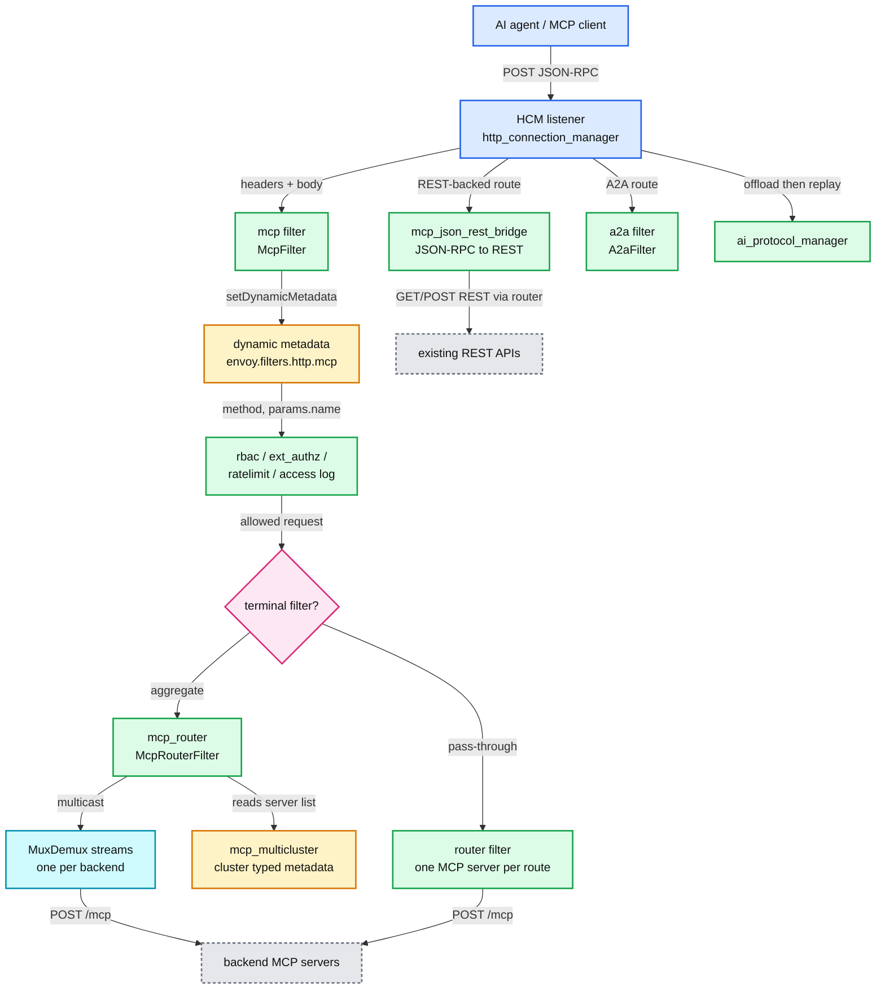

**What to notice**

- **Metadata is the contract.** `mcp_router` does not parse the body. It reads `method`, `id` and `params` from the `mcp` filter's dynamic metadata ([mcp_router.cc:294](https://github.com/envoyproxy/envoy/blob/v1.39.1/source/extensions/filters/http/mcp_router/mcp_router.cc#L294)). So the `mcp` filter must come first, and `request_storage_mode: FILTER_STATE` alone breaks the router.
- **Two deployment shapes.** Pass-through: `mcp` plus policy filters plus the normal router, one MCP server per route. Aggregating: `mcp_router` is the terminal filter and route `route`, `redirect` and `direct_response` actions are ignored ([mcp_router.proto:30](https://github.com/envoyproxy/envoy/blob/v1.39.1/api/envoy/extensions/filters/http/mcp_router/v3/mcp_router.proto#L30)).
- **The router bypasses the router filter.** Backend calls go through `Http::MuxDemux`, a facade over `AsyncClient` streams ([muxdemux.h](https://github.com/envoyproxy/envoy/blob/v1.39.1/source/common/http/muxdemux.h)). Cluster connection pools, circuit breakers and outlier detection still apply. Route-level retries, hedging and shadowing do not [inferred].
- **Everything is on the decode path.** `mcp` and `a2a` override only `decodeHeaders` and `decodeData`. Responses are never parsed by them. `ai_protocol_manager` wires only the decode path ([filter.cc:13](https://github.com/envoyproxy/envoy/blob/v1.39.1/source/extensions/filters/http/ai_protocol_manager/filter.cc#L13)).

---

## 3. Data flow

### 3.1 The `mcp` filter decode path

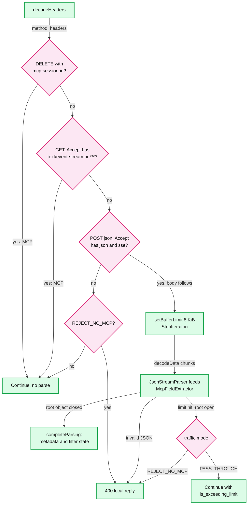

**What to notice**

- **Classification is header-only** ([mcp_filter.cc:227](https://github.com/envoyproxy/envoy/blob/v1.39.1/source/extensions/filters/http/mcp/mcp_filter.cc#L227)). A POST whose `Accept` lacks `text/event-stream` is "not MCP". In `PASS_THROUGH` it flows on with no metadata at all. That is a policy bypass unless RBAC is written as an allow-list [inferred].
- **The buffer limit is the parse limit.** `setBufferLimit(max_request_body_size)` at [mcp_filter.cc:253](https://github.com/envoyproxy/envoy/blob/v1.39.1/source/extensions/filters/http/mcp/mcp_filter.cc#L253), then the parser sees at most that many bytes.
- **Every reject is a 400** with a details string (`mcp_reject_no_mcp`, `mcp_not_jsonrpc`, `mcp_body_too_large`, `mcp_duplicate_keys`, `mcp_parse_error`) ([mcp_filter.cc:374](https://github.com/envoyproxy/envoy/blob/v1.39.1/source/extensions/filters/http/mcp/mcp_filter.cc#L374), [constants.h:57](https://github.com/envoyproxy/envoy/blob/v1.39.1/source/extensions/filters/common/mcp/constants.h#L57)). Note it is 400, not 413.
- **Arrays are skipped.** `StartList` only bumps a depth counter ([mcp_json_parser.cc:368](https://github.com/envoyproxy/envoy/blob/v1.39.1/source/extensions/filters/http/mcp/mcp_json_parser.cc#L368)). A JSON-RPC batch (root array) is never valid MCP here, so it is rejected in `REJECT_NO_MCP` and unlabelled in `PASS_THROUGH` [inferred].

### 3.2 Per-tool authorization and rate limiting on top of the metadata

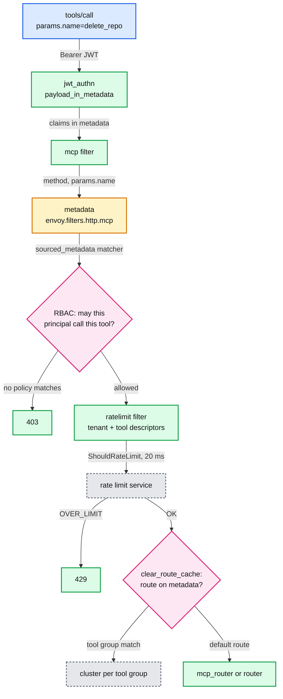

A per-route RBAC policy, adapted from the in-tree example ([mcp-filter.yaml:158](https://github.com/envoyproxy/envoy/blob/v1.39.1/docs/root/configuration/http/http_filters/_include/mcp-filter.yaml#L158)), with the principal taken from JWT metadata instead of a header a client could forge:

```yaml
allow-admins-to-call-delete-repo:
  permissions:
  - and_rules:
      rules:
      - sourced_metadata:
          metadata_matcher: {filter: envoy.filters.http.mcp, path: [{key: method}],
                             value: {string_match: {exact: tools/call}}}
      - sourced_metadata:
          metadata_matcher: {filter: envoy.filters.http.mcp, path: [{key: params}, {key: name}],
                             value: {string_match: {exact: delete_repo}}}
  principals:
  - sourced_metadata:
      metadata_matcher: {filter: envoy.filters.http.jwt_authn, path: [{key: jwt}, {key: role}],
                         value: {string_match: {exact: admin}}}
```

**What to notice**

- RBAC `Permission.sourced_metadata` and `Principal.sourced_metadata` both exist ([rbac.proto:321](https://github.com/envoyproxy/envoy/blob/v1.39.1/api/envoy/config/rbac/v3/rbac.proto#L321), [rbac.proto:438](https://github.com/envoyproxy/envoy/blob/v1.39.1/api/envoy/config/rbac/v3/rbac.proto#L438)). Details in [report 07](envoy-07-security.md).
- The ratelimit filter builds a `tool` descriptor from the same metadata path with a `metadata` action. The RLS call times out at 20 ms and fails open by default (facts sheet).
- With `clear_route_cache: true` the route is re-selected after metadata is set, so `RouteMatch.dynamic_metadata` can send a tool group to its own cluster without `mcp_router` ([mcp.proto:70](https://github.com/envoyproxy/envoy/blob/v1.39.1/api/envoy/extensions/filters/http/mcp/v3/mcp.proto#L70), [route_components.proto:739](https://github.com/envoyproxy/envoy/blob/v1.39.1/api/envoy/config/route/v3/route_components.proto#L739)).

### 3.3 An Envoy-based MCP gateway

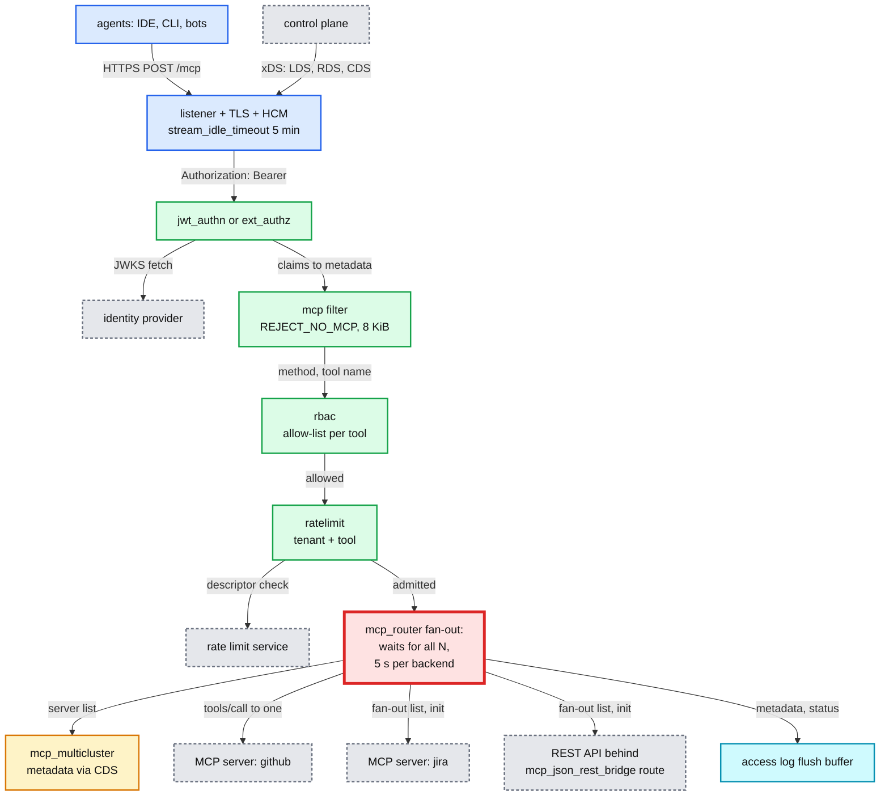

**What to notice**

- **The red node is the bottleneck.** The fan-out aggregator fires only when every expected backend has answered: `if (++(*count) >= expected_count)` ([mcp_router.cc:723](https://github.com/envoyproxy/envoy/blob/v1.39.1/source/extensions/filters/http/mcp_router/mcp_router.cc#L723)). So `initialize` and every `*/list` take as long as the slowest backend, capped by its 5 s timeout. With 10 backends at p99 300 ms each, the fan-out p99 is roughly the p99.9 of one backend, and one hung backend costs every client 5 s [inferred]. Fixes: set `McpCluster.timeout` to about 1 s, use `lazy_initialization`, keep N small per route, and in the 2026 protocol cache the merged list for `ttlMs` (section 6.8).
- **Policy stays in core filters.** Only the last hop is MCP-specific. Swap `jwt_authn` for `ext_authz` with `metadata_context_namespaces: [envoy.filters.http.mcp]` when the decision needs a policy service ([mcp-filter.yaml:85](https://github.com/envoyproxy/envoy/blob/v1.39.1/docs/root/configuration/http/http_filters/_include/mcp-filter.yaml#L85)).
- **What core Envoy does not give you**: per-identity filtering of the `tools/list` result (RBAC can deny a call, not hide a tool), upstream credential injection per backend, and OAuth resource-server metadata endpoints. Those need ext_proc, a dynamic module, or a control plane such as Agent Router [inferred].
- **Agent Router** (formerly Envoy AI Gateway, now an Agentic AI Foundation project, v1.1.0 released 2026-08-21) is the higher-level project that packages this as Kubernetes resources with provider translation and token budgets [external, https://theagentrouter.ai/].

### 3.4 An LLM gateway path

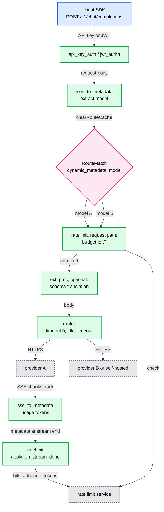

**What to notice**

- **Routing by model is core Envoy.** `json_to_metadata` extracts `model` and clears the route cache ([json_to_metadata filter.cc:244](https://github.com/envoyproxy/envoy/blob/v1.39.1/source/extensions/filters/http/json_to_metadata/filter.cc#L244)), then `RouteMatch.dynamic_metadata` picks the provider cluster.
- **Token metering is core Envoy, enforcement is lagged.** `sse_to_metadata` pulls usage out of `text/event-stream` events (default `max_event_size` 8 KiB, [sse_to_metadata.proto:62](https://github.com/envoyproxy/envoy/blob/v1.39.1/api/envoy/extensions/filters/http/sse_to_metadata/v3/sse_to_metadata.proto#L62)). A rate limit descriptor with `hits_addend.format` reading that metadata and `apply_on_stream_done: true` debits the budget after the stream ends. The proto says this is fire-and-forget and does not block the current request ([route_components.proto:2764](https://github.com/envoyproxy/envoy/blob/v1.39.1/api/envoy/config/route/v3/route_components.proto#L2764)).
- **Streams need timeouts changed.** The route timeout (15 s) spans until the response is fully processed, so a 40 s generation is cut off. Set `timeout: 0s` and rely on `idle_timeout` or the 5 min `stream_idle_timeout` ([route_components.proto:1384](https://github.com/envoyproxy/envoy/blob/v1.39.1/api/envoy/config/route/v3/route_components.proto#L1384)).
- **Where core stops**: provider schema translation (OpenAI to Anthropic shapes), per-request cost formulas, and reservation-style budgets need ext_proc, a dynamic module ([report 11](envoy-11-dynamic-modules.md)) or Agent Router [inferred].

---

## 4. Sequences

### 4.1 A session-based MCP exchange through a pass-through Envoy

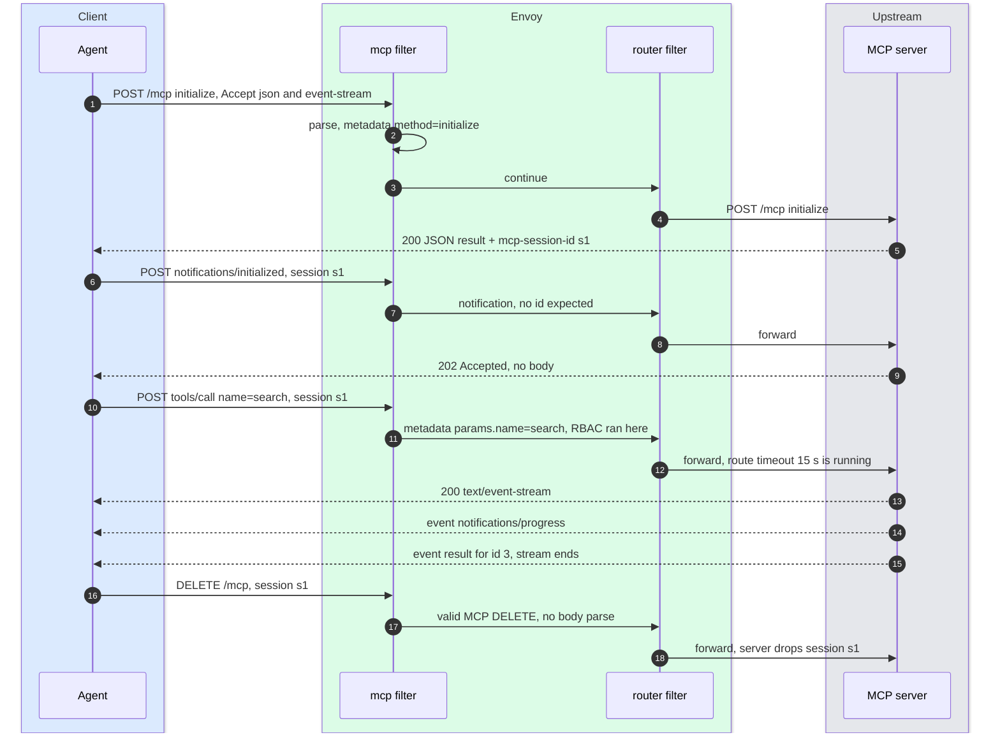

The session lives only in the server. Behind a load balancer every request for `s1` must reach the replica that created it (see Q4 in section 12).

### 4.2 Eager `initialize` fan-out through `mcp_router`

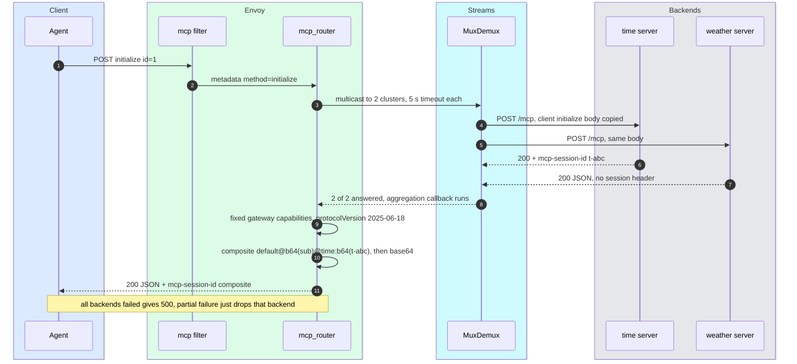

- The client's own `initialize` body is multicast, so every backend sees the client's capabilities ([mcp_router.proto:120](https://github.com/envoyproxy/envoy/blob/v1.39.1/api/envoy/extensions/filters/http/mcp_router/v3/mcp_router.proto#L120)).
- A backend that returns no session id (session-less) is simply left out of the map. That was a 500 before the 1.38.0 fix ([1.38.0.yaml:344](https://github.com/envoyproxy/envoy/blob/v1.39.1/changelogs/1.38.0.yaml#L344)).
- If no backend returns a session id, no `mcp-session-id` is sent at all ([mcp_router.cc:987](https://github.com/envoyproxy/envoy/blob/v1.39.1/source/extensions/filters/http/mcp_router/mcp_router.cc#L987)). Then later requests carry no session, and `ENFORCE` identity checks never run on them [inferred].

### 4.3 `tools/call` routed by prefix with SSE pass-through

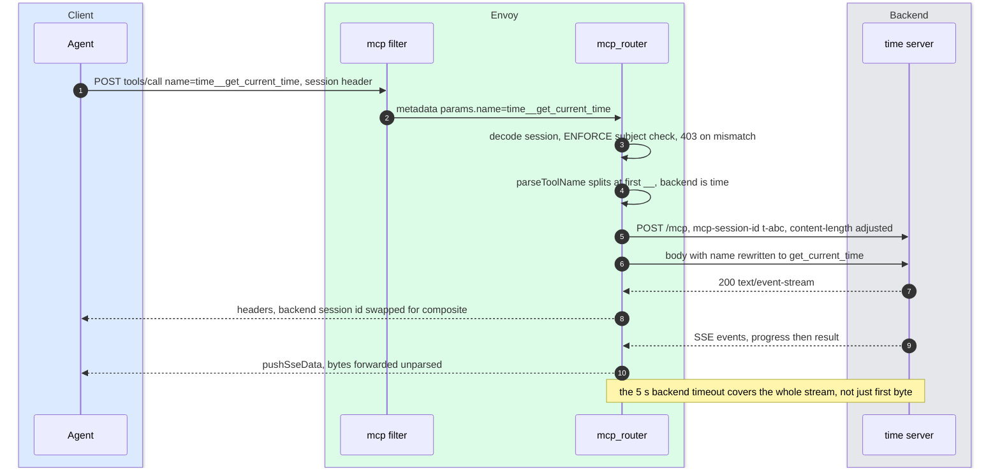

- The rewrite is a byte search for the first occurrence of the prefixed name in the first data chunk, then an in-place replace ([mcp_router.cc:552](https://github.com/envoyproxy/envoy/blob/v1.39.1/source/extensions/filters/http/mcp_router/mcp_router.cc#L552)). A TODO asks the parser for a byte offset instead. If the same string appears earlier in the body (say inside `_meta`), the wrong occurrence is rewritten [inferred].
- The backend timeout is the async stream's route timeout. The router filter keeps it armed until cleanup ([router.cc:1257](https://github.com/envoyproxy/envoy/blob/v1.39.1/source/common/router/router.cc#L1257)), so a tool that streams for 30 s under the 5 s default is reset mid-stream [inferred]. Set `McpCluster.timeout` per backend to the longest tool you allow.

### 4.4 A server-to-client request inside a fan-out (v1.39.0+)

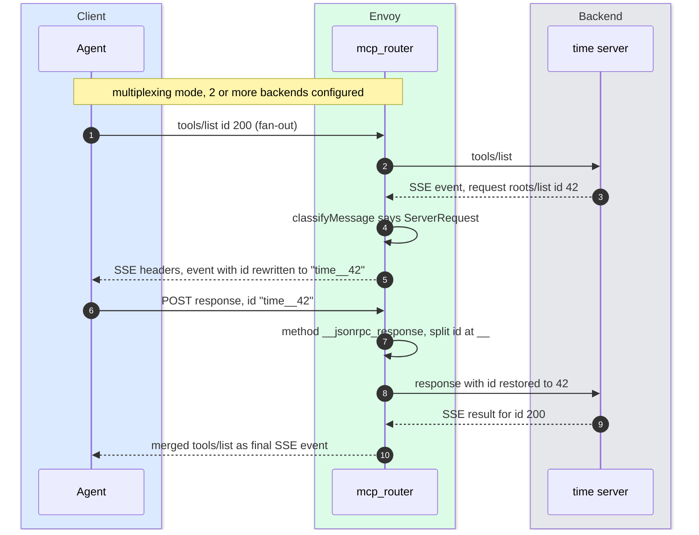

- Id rewriting lives in `pushSseEvent` ([mcp_router.cc:852](https://github.com/envoyproxy/envoy/blob/v1.39.1/source/extensions/filters/http/mcp_router/mcp_router.cc#L852)), which is reached only from the aggregate-mode SSE parser ([backend_stream.cc:147](https://github.com/envoyproxy/envoy/blob/v1.39.1/source/extensions/filters/http/mcp_router/backend_stream.cc#L147)). A `tools/call` SSE stream is passed through byte for byte. Reading the code, a server request inside a `tools/call` stream keeps its original id, and in multiplexing mode the client's un-prefixed reply cannot be routed back (400) [inferred, a good question to ask the owner].
- Single-backend mode does no id rewriting at all ([mcp_router_filter.rst:65](https://github.com/envoyproxy/envoy/blob/v1.39.1/docs/root/configuration/http/http_filters/mcp_router_filter.rst#L65)).

---

## 5. State machines

### 5.1 `McpFilter`, one request

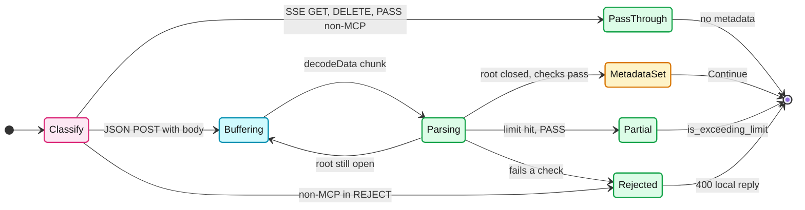

"Fails a check" covers: invalid JSON (any mode), the limit hit with the root still open in `REJECT_NO_MCP`, duplicate keys with `reject_duplicate_keys` on (any mode), and a body that is valid JSON but not JSON-RPC 2.0 in `REJECT_NO_MCP` ([mcp_filter.cc:272](https://github.com/envoyproxy/envoy/blob/v1.39.1/source/extensions/filters/http/mcp/mcp_filter.cc#L272), [mcp_filter.cc:378](https://github.com/envoyproxy/envoy/blob/v1.39.1/source/extensions/filters/http/mcp/mcp_filter.cc#L378)).

### 5.2 `BackendStreamCallbacks`, one backend stream

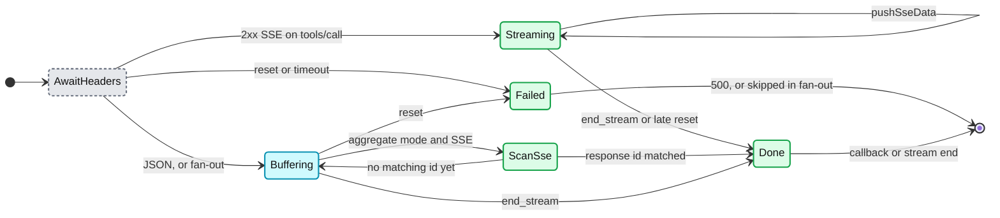

- `ScanSse` completes early on the first event whose `id` equals the request id, because SSE responses may never send `end_stream` ([backend_stream.cc:147](https://github.com/envoyproxy/envoy/blob/v1.39.1/source/extensions/filters/http/mcp_router/backend_stream.cc#L147)).
- `Buffering` appends to a `std::string` with no cap ([backend_stream.cc:139](https://github.com/envoyproxy/envoy/blob/v1.39.1/source/extensions/filters/http/mcp_router/backend_stream.cc#L139)). A backend returning a 50 MB `tools/list` holds 50 MB per in-flight request [inferred].
- A reset after streaming started cannot become an error status, since headers already went out ([backend_stream.cc:243](https://github.com/envoyproxy/envoy/blob/v1.39.1/source/extensions/filters/http/mcp_router/backend_stream.cc#L243)).

### 5.3 `ai_protocol_manager` `BufferManager`

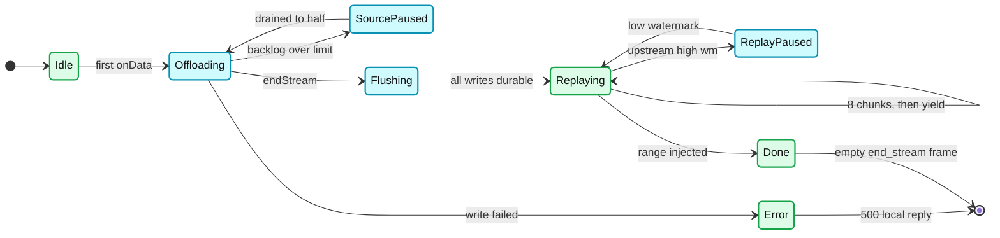

---

## 6. Component deep dives

### 6.1 `mcp` filter (`McpFilter`, `McpJsonParser`, `McpFieldExtractor`)

- **Files**: `source/extensions/filters/http/mcp/mcp_filter.{h,cc}`, `mcp_json_parser.{h,cc}`, shared constants in `source/extensions/filters/common/mcp/`.
- **Parser mechanics.** `McpJsonParser::parse` feeds each slice into `ProtobufUtil::converter::JsonStreamParser`, whose callbacks go to `McpFieldExtractor` (an `ObjectWriter`). The extractor stores every non-array scalar into a temporary `Protobuf::Struct`, tracks per-object key sets for duplicate detection, and on root close copies only the configured paths into the final metadata ([mcp_json_parser.cc:362](https://github.com/envoyproxy/envoy/blob/v1.39.1/source/extensions/filters/http/mcp/mcp_json_parser.cc#L362)).
- **Default extraction.** Always `jsonrpc`, `method`, `id`, plus per method: `tools/call` and `prompts/get` take `params.name`, resource methods take `params.uri`, `completion/complete` takes `params.ref`, `initialize` takes `params.protocolVersion` and `params.clientInfo.name`, and every method optionally takes `params._meta` ([mcp_json_parser.cc:22](https://github.com/envoyproxy/envoy/blob/v1.39.1/source/extensions/filters/http/mcp/mcp_json_parser.cc#L22)). `ParserConfig.methods` adds paths and groups; the first exact match wins.
- **Method groups.** With `group_metadata_key` set, a group lands in metadata: `lifecycle`, `tool`, `resource`, `prompt`, `notification`, `logging`, `sampling`, `completion`, `unknown` ([mcp_json_parser.cc:145](https://github.com/envoyproxy/envoy/blob/v1.39.1/source/extensions/filters/http/mcp/mcp_json_parser.cc#L145)). One RBAC rule per group beats one per method.
- **What lands in metadata.** Namespace `envoy.filters.http.mcp` (legacy `mcp_proxy` behind runtime guard `envoy.reloadable_features.mcp_filter_use_new_metadata_namespace`, default on, [runtime_features.cc:92](https://github.com/envoyproxy/envoy/blob/v1.39.1/source/common/runtime/runtime_features.cc#L92)). Fields: the extracted paths, `status`, `is_mcp_request`, and `is_exceeding_limit` when truncated ([mcp_filter.cc:456](https://github.com/envoyproxy/envoy/blob/v1.39.1/source/extensions/filters/http/mcp/mcp_filter.cc#L456)). Responses (client replies) get `method: __jsonrpc_response`.
- **Filter state.** Key `envoy.filters.http.mcp.request`, a `FilterStateObject` holding method, JSON, and status, `LifeSpan::Request` ([filter_state.h:49](https://github.com/envoyproxy/envoy/blob/v1.39.1/source/extensions/filters/common/mcp/filter_state.h#L49)). Useful for matchers and dynamic modules that want typed state.
- **Trace propagation.** `propagate_trace_context` copies a valid `params._meta.traceparent` (and `tracestate`) into headers, replacing the downstream ones. `propagate_baggage` does the same for `baggage` ([mcp_filter.cc:60](https://github.com/envoyproxy/envoy/blob/v1.39.1/source/extensions/filters/http/mcp/mcp_filter.cc#L60)). This joins an agent's trace to the tool call.
- **JPP (JSON Parameter Pollution).** `{"method":"tools/list", ..., "method":"tools/call"}`: a proxy that stops early sees `tools/list`, a backend using last-key-wins sees `tools/call`. 1.39.0 removed early stop so the filter also sees the last key, and `reject_duplicate_keys: true` rejects the body outright ([mcp.proto:117](https://github.com/envoyproxy/envoy/blob/v1.39.1/api/envoy/extensions/filters/http/mcp/v3/mcp.proto#L117)).

### 6.2 `mcp_router` (`McpRouterFilter`)

**Method handling in v1.39.1** ([mcp_router.cc:153](https://github.com/envoyproxy/envoy/blob/v1.39.1/source/extensions/filters/http/mcp_router/mcp_router.cc#L153)):

| Method | Handler | Shape | Response |
|---|---|---|---|
| `initialize` | `handleInitialize` | fan-out, or immediate if lazy | synthesized, composite session |
| `tools/list`, `resources/list`, `resources/templates/list`, `prompts/list` | `handleToolsList` etc. | fan-out, merge, prefix | synthesized JSON, or SSE if a backend sent intermediate events |
| `tools/call` | `handleToolsCall` | one backend by `name` prefix | backend body, SSE streamed through |
| `resources/read`, `subscribe`, `unsubscribe` | `handleSingleBackendResourceMethod` | one backend by URI | backend body |
| `prompts/get` | `handlePromptsGet` | one backend by prefix | backend body |
| `completion/complete` | `handleCompletionComplete` | one backend by `ref` type | backend body |
| `logging/setLevel` | `handleLoggingSetLevel` | fan-out | `{"result":{}}` if any backend succeeded |
| `ping` | `handlePing` | local | `{"result":{}}` |
| `notifications/initialized`, `cancelled`, `roots/list_changed` | `handleNotification` | fan-out, wait for all | 202, no body |
| client reply | `handleServerResponse` | one backend by `backend__id` | backend body |
| any other method, `GET`, body-less `DELETE` | | | 400 `Invalid or missing MCP request` (`rq_invalid`), 405, 400 `Missing request body` |

**What each interviewer-added family needed** (PRs [#43056](https://github.com/envoyproxy/envoy/pull/43056) to [#43080](https://github.com/envoyproxy/envoy/pull/43080), Jan 2026, shipped in 1.38.0):

- **`resources/*` (#43056, +616 lines).** Resources are addressed by URI, not a flat name, so `__` prefixing does not fit. The router rewrites `scheme://path` to `backend+scheme://path` in lists and splits at `+` before `://` on reads ([mcp_router.cc:485](https://github.com/envoyproxy/envoy/blob/v1.39.1/source/extensions/filters/http/mcp_router/mcp_router.cc#L485)). URIs without a scheme become `backend+://uri`. The parser gained `params.uri` extraction.
- **`prompts/*` (#43057).** Same `__` scheme as tools, plus a `prompts/list` merger that rebuilds `name`, `description` and `arguments`.
- **`notifications/*` (#43058).** Notifications have no `id` and expect no JSON-RPC response. The parser had to stop requiring `id` for them, and the router answers `202 Accepted` with an empty body after fanning out to every backend ([mcp_router.cc:1010](https://github.com/envoyproxy/envoy/blob/v1.39.1/source/extensions/filters/http/mcp_router/mcp_router.cc#L1010)). The client still waits for the slowest backend.
- **`completion/*` (#43079).** A completion targets either a prompt or a resource. The router reads `params.ref.type` and routes like `prompts/get` or like `resources/read`, rewriting the matching field ([mcp_router.cc:1435](https://github.com/envoyproxy/envoy/blob/v1.39.1/source/extensions/filters/http/mcp_router/mcp_router.cc#L1435)).
- **`logging/*` (#43080).** A log level belongs to every backend, so it fans out. Success means at least one backend accepted it ([mcp_router.cc:1523](https://github.com/envoyproxy/envoy/blob/v1.39.1/source/extensions/filters/http/mcp_router/mcp_router.cc#L1523)).

**Naming and aggregation rules**

- Delimiter `__` ([mcp_router.cc:26](https://github.com/envoyproxy/envoy/blob/v1.39.1/source/extensions/filters/http/mcp_router/mcp_router.cc#L26)), split at the first occurrence, and the prefix must name a configured backend. Prefixing happens only when more than one backend is configured (`isMultiplexing`). With one backend, names pass through untouched.
- In multiplexing mode tools are rebuilt with only `name`, `description`, `inputSchema`, `annotations`, `icons` ([mcp_router.cc:1653](https://github.com/envoyproxy/envoy/blob/v1.39.1/source/extensions/filters/http/mcp_router/mcp_router.cc#L1653)). Other fields a backend returns are dropped. There is no `nextCursor` handling, so paginated lists return page one only [inferred].
- Failed backends are skipped silently in merges. Only "all failed" is an error.
- Aggregated responses echo `request_id_`, which is parsed only from numeric ids. The well-known metadata docs say request ids are numeric ([well_known_dynamic_metadata.rst:43](https://github.com/envoyproxy/envoy/blob/v1.39.1/docs/root/configuration/advanced/well_known_dynamic_metadata.rst#L43)). A client using string ids gets `id: 0` on synthesized responses [inferred].
- **Header forwarding.** Every downstream header except `:method`, `:path`, `:authority`, `host`, `content-type`, `accept`, `mcp-session-id` is copied to every backend ([mcp_router.cc:38](https://github.com/envoyproxy/envoy/blob/v1.39.1/source/extensions/filters/http/mcp_router/mcp_router.cc#L38)). That includes `authorization` unless an earlier filter removed it (`jwt_authn` does by default, `forward: false`, [config.proto:199](https://github.com/envoyproxy/envoy/blob/v1.39.1/api/envoy/extensions/filters/http/jwt_authn/v3/config.proto#L199)). With `ext_authz`, or `forward: true`, one client token reaches all N servers. The MCP authorization spec forbids servers from accepting tokens not issued for them [external, https://modelcontextprotocol.io/specification/2026-07-28/basic/authorization]. Configurable forwarding is open PR [#46818](https://github.com/envoyproxy/envoy/pull/46818).

**Sessions across backends**

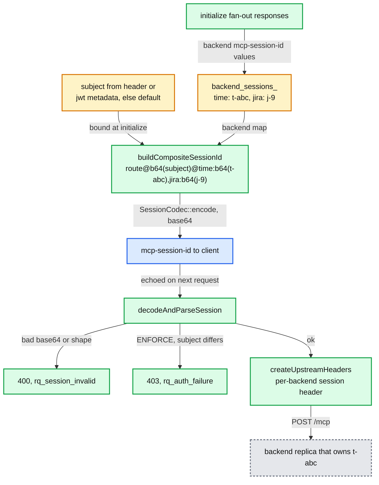

- **Gateway tier: stateless.** Any Envoy replica decodes the header ([session_codec.h:23](https://github.com/envoyproxy/envoy/blob/v1.39.1/source/extensions/filters/http/mcp_router/session_codec.h#L23)). No sticky routing to Envoy is needed.
- **Backend tier: still stateful.** The backend session id `t-abc` lives in one backend replica. The router sends to the backend *cluster*, and the cluster LB picks any host. Without affinity the request lands on a replica that does not know `t-abc` [inferred]. See Q4.
- **Identity binding.** `session_identity` binds a subject (header, or a dynamic metadata key such as a JWT claim) at `initialize`. `ENFORCE` rejects later requests whose subject differs (403). `DISABLED` binds but never checks ([mcp_router.proto:62](https://github.com/envoyproxy/envoy/blob/v1.39.1/api/envoy/extensions/filters/http/mcp_router/v3/mcp_router.proto#L62)). Since the header is unsigned, a client can edit backend session ids inside it. `ENFORCE` protects the subject, not the backend map [inferred].
- **Lazy initialization** (1.39.0). `initialize` returns at once with an empty backend map. The first request to a backend sends a synthetic `initialize` (client name `envoy-mcp-gateway`), stores the session, re-encodes the header, then replays the buffered body ([mcp_router.cc:2102](https://github.com/envoyproxy/envoy/blob/v1.39.1/source/extensions/filters/http/mcp_router/mcp_router.cc#L2102)). `initialized_backends_` is a per-stream member that is not rebuilt from the decoded session. Reading the code, later requests may re-initialize the backend each time, and notifications in lazy mode are answered 202 without being forwarded [inferred from [mcp_router.cc:1014](https://github.com/envoyproxy/envoy/blob/v1.39.1/source/extensions/filters/http/mcp_router/mcp_router.cc#L1014)].

**Error handling summary**: unknown prefix is 400 (`rq_unknown_backend`), single-backend failure is 500 with the backend error text (`rq_backend_failure`), all fan-out backends failing is 500 (`rq_fanout_failure`), and a second concurrent fan-out on one stream is 500 `concurrent fanout not allowed` ([mcp_router.cc:686](https://github.com/envoyproxy/envoy/blob/v1.39.1/source/extensions/filters/http/mcp_router/mcp_router.cc#L686)). Errors are `text/plain` HTTP errors, not JSON-RPC error objects.

### 6.3 `mcp_multicluster` cluster

- **What it is.** A `ClusterFactory` that packs its own `ClusterConfig` (the MCP server list) into the cluster's `typed_filter_metadata` under `envoy.clusters.mcp_multicluster`, then delegates to the composite cluster factory with one sub-cluster per server ([cluster.cc:23](https://github.com/envoyproxy/envoy/blob/v1.39.1/source/extensions/clusters/mcp_multicluster/cluster.cc#L23)). The composite cluster picks a sub-cluster by retry attempt count.
- **How it relates to `mcp_router`.** In `decodeHeaders` the router looks up the route's cluster metadata. If the key exists, a `McpRouterClusterConfigImpl` replaces the filter's server list for this request ([mcp_router.cc:99](https://github.com/envoyproxy/envoy/blob/v1.39.1/source/extensions/filters/http/mcp_router/mcp_router.cc#L99)). The router still calls each backend's own cluster directly through MuxDemux.
- **Why it exists.** The server list moves from LDS or ECDS (filter config) to CDS, and each route can point at a different server set. Adding a tool server becomes a cluster update, not a listener update [inferred]. A TODO says the filter-level list will be removed ([filter_config.h:148](https://github.com/envoyproxy/envoy/blob/v1.39.1/source/extensions/filters/http/mcp_router/filter_config.h#L148)).
- **Posture.** `requires_trusted_downstream_and_upstream`, `alpha` ([extensions_metadata.yaml:190](https://github.com/envoyproxy/envoy/blob/v1.39.1/source/extensions/extensions_metadata.yaml#L190)).

### 6.4 `mcp_json_rest_bridge` (called `mcp_transcoder` in some changelog entries)

- **Direction.** It exposes existing REST APIs *as* MCP tools. MCP JSON-RPC comes in, a REST request goes out through the normal router, and the REST response is wrapped back into JSON-RPC ([mcp_json_rest_bridge.proto:24](https://github.com/envoyproxy/envoy/blob/v1.39.1/api/envoy/extensions/filters/http/mcp_json_rest_bridge/v3/mcp_json_rest_bridge.proto#L24), [1.39.0.yaml:1022](https://github.com/envoyproxy/envoy/blob/v1.39.1/changelogs/1.39.0.yaml#L1022)).
- **Mapping.** Per tool, a google.api-style `HttpRule`: path template variables come from `arguments` (dot paths allowed), `body: "*"` sends the remaining arguments, `body: "field"` sends one field, and leftovers become query parameters. Example: `get: /v1/projects/{project_id}/resources/{resource_id}` plus `view: FULL` gives `GET /v1/projects/foo/resources/res-789?view=FULL`.
- **Methods handled locally.** `initialize` gets a synthesized result (negotiates among the four known versions, `tools.listChanged: false`) and **no session header**, so the bridge is a stateless MCP server. `notifications/initialized` gets 202. `tools/list` is transcoded via `tool_list_http_rule`, served from config via `tool_list_local`, or passed through. Anything else gets JSON-RPC `-32601` with HTTP 400 ([mcp_json_rest_bridge_filter.cc:769](https://github.com/envoyproxy/envoy/blob/v1.39.1/source/extensions/filters/http/mcp_json_rest_bridge/mcp_json_rest_bridge_filter.cc#L769)).
- **Response shape.** The whole REST body becomes one text content item, `isError` is true when status is 400 or more ([mcp_json_rest_bridge_filter.cc:77](https://github.com/envoyproxy/envoy/blob/v1.39.1/source/extensions/filters/http/mcp_json_rest_bridge/mcp_json_rest_bridge_filter.cc#L77)). `text_content_streaming_enabled` streams chunks JSON-escaped between a prebuilt prefix and suffix, skipping UTF-8 validation.
- **Limits.** Buffers and DOM-parses with nlohmann JSON. Request cap 64 KiB (413), response cap 1 MiB (500) ([mcp_json_rest_bridge_filter.cc:42](https://github.com/envoyproxy/envoy/blob/v1.39.1/source/extensions/filters/http/mcp_json_rest_bridge/mcp_json_rest_bridge_filter.cc#L42)). No SSE from the REST backend, no pagination, headers-only 204 responses are not transcoded (TODO), POST only (405 otherwise). The changelog calls it work in progress and not for production ([1.38.0.yaml:970](https://github.com/envoyproxy/envoy/blob/v1.39.1/changelogs/1.38.0.yaml#L970)).

### 6.5 `a2a` filter

- **What A2A looks like to the filter.** JSON-RPC 2.0 over POST with `application/json` or `application/a2a+json`. Methods: `message/send`, `message/stream`, `tasks/get`, `tasks/list`, `tasks/cancel`, `tasks/resubscribe`, `tasks/pushNotificationConfig/{set,get,list,delete}`, `agent/getAuthenticatedExtendedCard` ([a2a_json_parser.h:35](https://github.com/envoyproxy/envoy/blob/v1.39.1/source/extensions/filters/http/a2a/a2a_json_parser.h#L35)). Any body-less `GET` counts as A2A (agent card discovery).
- **What it extracts.** `jsonrpc`, `method`, `id` plus per-method fields. `message/send` extracts `params.message.parts` (the user's message content) and push-config methods extract `params.pushNotificationConfig.token` and `authentication` ([a2a_json_parser.cc:26](https://github.com/envoyproxy/envoy/blob/v1.39.1/source/extensions/filters/http/a2a/a2a_json_parser.cc#L26)). Access logs that dump this namespace will record message content and push tokens [inferred].
- **Behaviour.** Early termination once all fields are collected (unlike `mcp` since 1.39.0), a hard 413 over the 8 KiB limit in both modes, and metadata under the filter config name ([a2a_filter.cc:134](https://github.com/envoyproxy/envoy/blob/v1.39.1/source/extensions/filters/http/a2a/a2a_filter.cc#L134), [a2a_filter.cc:162](https://github.com/envoyproxy/envoy/blob/v1.39.1/source/extensions/filters/http/a2a/a2a_filter.cc#L162)). `storage_mode` and `parser_config` are not read (premise table).

### 6.6 `ai_protocol_manager`

- **Problem it solves.** Routing and admission decisions on AI requests need the whole JSON body (model, messages). Buffering it in the HCM's buffers pins memory and holds the connection's flow-control window. The filter offloads the body to an `ExternalBuffer` as it arrives, holds the headers so later filters never act on headers without the body, then replays the body into the chain ([ai_protocol_manager_filter.rst:6](https://github.com/envoyproxy/envoy/blob/v1.39.1/docs/root/configuration/http/http_filters/ai_protocol_manager_filter.rst#L6), [filter.cc:38](https://github.com/envoyproxy/envoy/blob/v1.39.1/source/extensions/filters/http/ai_protocol_manager/filter.cc#L38)).
- **`BufferManager`.** Path-agnostic. Ingest: one outstanding write, backlog batched into 64 KiB writes, pause the source when not-yet-durable bytes exceed the decoder buffer limit, resume at half ([buffer_manager.cc:44](https://github.com/envoyproxy/envoy/blob/v1.39.1/source/extensions/filters/http/ai_protocol_manager/buffer_manager.cc#L44)). Replay: 64 KiB chunks, at most 8 per event-loop iteration (512 KiB), paused on upstream high watermark ([buffer_manager.h:206](https://github.com/envoyproxy/envoy/blob/v1.39.1/source/extensions/filters/http/ai_protocol_manager/buffer_manager.h#L206)).
- **`ExternalBuffer`.** An append-only, random-access store with async write and read callbacks. The only implementation is `InMemoryExternalBuffer`: writes post to the dispatcher, reads complete on-stack, and the whole body sits on the heap. A disk or remote store is what would make the footprint bound real ([external_buffer.h:44](https://github.com/envoyproxy/envoy/blob/v1.39.1/source/extensions/filters/http/ai_protocol_manager/external_buffer.h#L44)).
- **`FilterChainBridge`.** `DecoderFilterChainBridge` maps inject, pause and resume onto decoder callbacks and subscribes to upstream watermarks. `EncoderFilterChainBridge` exists but is not constructed yet ([filter_chain_bridge.h:60](https://github.com/envoyproxy/envoy/blob/v1.39.1/source/extensions/filters/http/ai_protocol_manager/filter_chain_bridge.h#L60)).
- **Today it is plumbing.** Empty config, no parsing, no changelog entry in v1.39.1. On main, JSON parsing has started to land: the test fix in [#47191](https://github.com/envoyproxy/envoy/pull/47191) (2026-09-04) compares re-serialized DOM output [main only, after v1.39.0].

### 6.7 Status and security posture

| Extension | Status | Security posture | First release | Key change after |
|---|---|---|---|---|
| `envoy.filters.http.mcp` | alpha | unknown | 1.37.0 | 1.38 namespace, DELETE, tracing. 1.39 full parse, status, dup keys |
| `envoy.filters.http.mcp_router` | alpha | unknown | 1.37.0 | 1.38 resources, prompts, notifications, completion, logging, SSE, stats. 1.39 elicitation, lazy init |
| `envoy.clusters.mcp_multicluster` | alpha | requires_trusted_downstream_and_upstream | 1.38.0 | none |
| `envoy.filters.http.mcp_json_rest_bridge` | alpha | unknown | 1.38.0 | 1.39 per-route tools, local `tools/list` |
| `envoy.filters.http.a2a` | alpha | unknown | 1.38.0 | none |
| `envoy.filters.http.ai_protocol_manager` | alpha | unknown | in v1.39.1 tree, no changelog | none |

Sources: [extensions_metadata.yaml](https://github.com/envoyproxy/envoy/blob/v1.39.1/source/extensions/extensions_metadata.yaml#L294), [1.37.0.yaml:690](https://github.com/envoyproxy/envoy/blob/v1.39.1/changelogs/1.37.0.yaml#L690), [1.38.0.yaml:659](https://github.com/envoyproxy/envoy/blob/v1.39.1/changelogs/1.38.0.yaml#L659), [1.39.0.yaml:980](https://github.com/envoyproxy/envoy/blob/v1.39.1/changelogs/1.39.0.yaml#L980). All are compiled into the default build ([extensions_build_config.bzl:206](https://github.com/envoyproxy/envoy/blob/v1.39.1/source/extensions/extensions_build_config.bzl#L206)). `unknown` posture means a vulnerability may not get the embargoed security-release treatment; put them behind a hardened, stable layer ([report 07](envoy-07-security.md)).

### 6.8 What the 2026-07-28 stateless revision changes for Envoy's MCP filters

The MCP specification revision of 2026-07-28 is a large break from the protocol v1.39.1 implements [external, https://modelcontextprotocol.io/specification/2026-07-28/changelog, https://blog.modelcontextprotocol.io/posts/2026-07-28/]:

- Protocol sessions and the `Mcp-Session-Id` header are removed (SEP-2567). The `initialize` / `notifications/initialized` handshake is removed. Every request carries protocol version, client capabilities and client info in `_meta`, with `UnsupportedProtocolVersionError` on mismatch (SEP-2575, https://modelcontextprotocol.io/seps/2575-stateless-mcp). A new mandatory `server/discover` RPC describes the server.
- The HTTP `GET` stream and `resources/subscribe` / `unsubscribe` are replaced by `subscriptions/listen`, one long-lived POST response stream with opt-in types. `ping`, `logging/setLevel` and `notifications/roots/list_changed` are removed. Log level travels per request in `_meta`.
- Multi Round-Trip Requests (SEP-2322) replace server-initiated `sampling/createMessage`, `elicitation/create` and `roots/list`: the server returns `resultType: "input_required"` with `inputRequests`, and the client retries with `inputResponses`. All results carry `resultType`. SSE resumability (`Last-Event-ID`) is removed; a broken stream loses the request.
- Streamable HTTP POSTs MUST carry `Mcp-Method` and `Mcp-Name` headers (SEP-2243). List results carry `ttlMs` and `cacheScope` (SEP-2549). The spec says any request can land on any instance behind a plain round-robin load balancer.

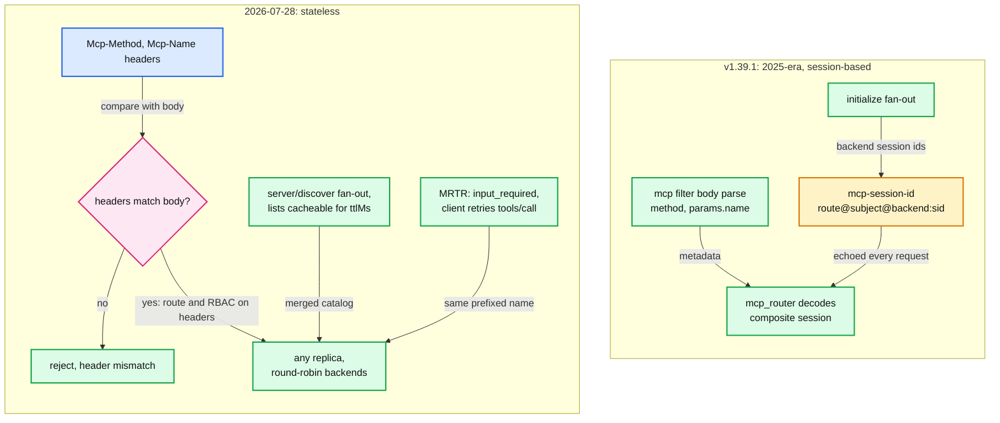

| v1.39.1 mechanism | Effect of 2026-07-28 | Envoy status (main unless stated) |
|---|---|---|
| Body parse for `method` and `params.name` | `Mcp-Method` / `Mcp-Name` headers let routes and RBAC match on headers with no body parse. The body must still be checked against them, or a client lies in the header to pass policy | [#46817](https://github.com/envoyproxy/envoy/pull/46817) header extraction and validation, merged 2026-09-02. [#47490](https://github.com/envoyproxy/envoy/pull/47490) bridge validation, open |
| Full root parse (1.39.0 JPP fix) | With routing attributes in headers, parsing can stop once they are collected | [#47301](https://github.com/envoyproxy/envoy/pull/47301) early termination, merged 2026-09-14 |
| Version from `initialize` and header | Version per request in `_meta` and header, typed error on mismatch | [#47280](https://github.com/envoyproxy/envoy/pull/47280) enforcement, open |
| Composite session id | Nothing to carry for 2026 backends. The codec becomes a 2025-compatibility layer during migration. HMAC matters only there | [#46581](https://github.com/envoyproxy/envoy/pull/46581) HMAC, open |
| `initialize` fan-out and merge | Replaced by `server/discover`, which a router would fan out and merge the same way. v1.39.1 answers it 400 `Invalid or missing MCP request` | [#47619](https://github.com/envoyproxy/envoy/pull/47619) bridge support, open. Router: none seen |
| `logging/setLevel` fan-out (#43080) | Removed. Log level rides in each request's `_meta` to the one backend that serves it, so no fan-out is needed | 2025-only path |
| `notifications/*` fan-out (#43058) | `notifications/initialized` and `roots/list_changed` disappear. Server notifications arrive on `subscriptions/listen` or the request's own response stream. Whether `notifications/cancelled` survives over HTTP: [unverified] | 2025-only path |
| `resources/subscribe` routing (#43056) | Replaced by `subscriptions/listen`. A router must fan one listen out to N backends and merge N long-lived streams into one, which the current "complete on first matching response" SSE logic does not do [inferred] | not started in tree |
| Elicitation id rewrite (`time__42`, 1.39.0) | MRTR makes the follow-up a fresh `tools/call` with the same prefixed name, so it routes by name with no id rewriting and no server-to-client stream. The router must pass `resultType` and `inputRequests` through untouched | [#47473](https://github.com/envoyproxy/envoy/pull/47473) bridge `resultType`, merged 2026-09-22 |
| `tools/list` fan-out on every call | `ttlMs` / `cacheScope` let a router cache the merged catalog for the minimum TTL across backends, keyed by tenant when the scope is per-user. This removes the red fan-out node from the hot path [inferred]. Envoy's HTTP cache filters key on `Cache-Control`, not JSON fields | no cache in tree |

Do not overclaim. Nothing in v1.39.1 understands 2026-07-28. A 2026 client talking to a v1.39.1 `mcp_router` still gets per-tool RBAC (the body still has `method` and `params.name`) and working `tools/list` and `tools/call`, but `server/discover` and `subscriptions/listen` are not in the router's method map, so they get 400 and count as `rq_invalid` [inferred from [mcp_router.cc:56](https://github.com/envoyproxy/envoy/blob/v1.39.1/source/extensions/filters/http/mcp_router/mcp_router.cc#L56) and [mcp_router.cc:294](https://github.com/envoyproxy/envoy/blob/v1.39.1/source/extensions/filters/http/mcp_router/mcp_router.cc#L294)].

---

## 7. Failure modes

| Failure | What the user sees | Blast radius | Mitigation |
|---|---|---|---|
| Body over 8 KiB, `PASS_THROUGH` | Request proceeds, metadata has `is_exceeding_limit: true` and maybe no `params.name` | Per-tool RBAC and rate limits see no tool | Raise the limit per route (max 10 MiB), write RBAC as allow-list, prefer `REJECT_NO_MCP` |
| Body over limit, `REJECT_NO_MCP` | 400, details `mcp_body_too_large`, `mcp.body_too_large` | One request | Size the limit to the largest legitimate `arguments` |
| Invalid JSON or not JSON-RPC | 400, `mcp.invalid_json` | One request | Client bug, alert on rate |
| Duplicate keys (JPP attempt) | Last key wins, or 400 `mcp.duplicate_keys_rejected` | Policy confusion if backends parse differently | `reject_duplicate_keys: true` |
| Tool SSE longer than route timeout 15 s (pass-through) | 504 before headers, or a reset mid-stream | Every long tool | Route `timeout: 0s` plus `idle_timeout` |
| Idle SSE stream over 5 min | Stream reset by `stream_idle_timeout` | Listen / subscription streams | Server keepalive comments, or a longer route `idle_timeout` |
| One router backend hangs in fan-out | `initialize` and lists take the full 5 s, then that backend is dropped silently | Every client of the route | Lower `McpCluster.timeout`, `lazy_initialization`, outlier detection on backend clusters |
| All fan-out backends fail | 500 text, `mcp_router.rq_fanout_failure` | Route | Health checks, fewer backends per route |
| `tools/call` backend over 5 s | Stream reset or 500 `Backend request failed`, `rq_backend_failure` | Long tools | Per-backend `timeout` sized to the slowest tool |
| Tampered or garbage session header | 400 `rq_session_invalid`, or 403 `rq_auth_failure` under `ENFORCE` | One client | `session_identity` with `ENFORCE`, HMAC once [#46581](https://github.com/envoyproxy/envoy/pull/46581) lands |
| Backend scaled out, session on another replica | Backend rejects the session, client sees 500 from the router or 4xx pass-through | All sessions on that backend | Session affinity (Q4), or stateless 2026 backends |
| Unknown tool prefix | 400, `rq_unknown_backend` | One request | Stable backend names, since they are part of every tool name |
| Huge backend list response | Memory grows per in-flight fan-out, no cap | Worker heap | Overload manager heap actions, cap backends ([report 05](envoy-05-resilience.md)) |
| Huge body through `ai_protocol_manager` | Whole body on the heap, no 413 | Worker heap | Do not enable on untrusted traffic in v1.39.1 |
| Bridge response over 1 MiB | 500 with JSON-RPC `-32000` | One call | Raise `max_response_body_size` or enable text streaming |

---

## 8. Scalability and performance

- **What breaks first: the fan-out aggregator.** Latency of `initialize` and every `*/list` is the maximum over N backends, bounded by each backend's 5 s timeout ([mcp_router.cc:723](https://github.com/envoyproxy/envoy/blob/v1.39.1/source/extensions/filters/http/mcp_router/mcp_router.cc#L723), [mcp_router.cc:730](https://github.com/envoyproxy/envoy/blob/v1.39.1/source/extensions/filters/http/mcp_router/mcp_router.cc#L730)). If each backend has a 1% chance of a 2 s stall, a 20-backend fan-out stalls on about 18% of calls (1 - 0.99^20) [inferred]. Agents call `tools/list` at the start of every session, so this is on the user-visible path. Solve it with tight per-backend timeouts, lazy init, fewer backends per route (split by tenant or domain with `mcp_multicluster` per route), and TTL caching under 2026-07-28.
- **Memory per request.** `mcp`: body up to 8 KiB held, plus a `Protobuf::Struct` of every non-array scalar (inferred several times the raw bytes). `mcp_router`: N buffered backend bodies with no cap, each DOM-parsed with `Json::Factory::loadFromString` and re-serialized. At 200 tools of 2 KiB schema per backend and 10 backends that is about 4 MB of JSON per `tools/list`, parsed and rebuilt on a worker thread [inferred]. Bridge: 64 KiB in, 1 MiB out.
- **CPU.** Parsing is on the worker that owns the connection ([report 01](envoy-01-threading-and-process-model.md)). The `mcp` parse is linear in body bytes up to the limit. The router's merges are linear in total list size. None of it is offloaded.
- **Connections.** Backend streams use the backend clusters' per-worker pools. HTTP/2 to backends lets one connection carry many fan-out streams (default 1024 concurrent streams, facts sheet). Circuit breakers default to 1024 requests per cluster.
- **Lazy init cost.** Each first request to a backend adds a full `initialize` round trip. Per the per-stream `initialized_backends_` reading in 6.2, that may be every request [inferred].
- **`ai_protocol_manager`.** Replay injects at most 8 x 64 KiB = 512 KiB per event-loop iteration, so one large body cannot starve the worker ([buffer_manager.h:214](https://github.com/envoyproxy/envoy/blob/v1.39.1/source/extensions/filters/http/ai_protocol_manager/buffer_manager.h#L214)).

---

## 9. Trade-offs and alternatives

| Decision | Chosen | Alternative | Why |
|---|---|---|---|
| Where MCP policy runs | Proxy parses, core filters decide | Each MCP server enforces | One place for audit and per-tool policy across teams. Costs a body parse per request |
| Parser | Streaming tokenizer, bounded buffer, full root parse | Full DOM (the bridge does this), or early stop | Bounded memory. Full parse closes JPP at the cost of reading the whole body. Main moves back toward early stop once header attributes exist ([#47301](https://github.com/envoyproxy/envoy/pull/47301)) |
| Output channel | Dynamic metadata (default), filter state optional | Rewritten headers | Metadata is what RBAC, ratelimit, route match and access logs already read |
| Aggregation | Terminal HTTP filter over MuxDemux | Cluster or LB extension | Needs body rewrite, response merge and SSE handling, which an LB cannot do. Loses route retries and shadowing |
| Gateway session | Stateless composite header | Session store (Redis) in the gateway | No shared state, any replica works. Costs header size and tamper risk (unsigned) |
| Name collision | `backend__tool`, `backend+scheme://` | Routing table from tool name to backend | No lookup table to sync. Backend names become part of the public tool API |
| Capabilities | Fixed gateway block | Merge backend capabilities | Simple and predictable. Hides backend differences, pins `2025-06-18` |
| Initialization | Eager by default, lazy optional | Always lazy | Eager fails fast at session start. Lazy keeps one slow backend off the critical path |
| Header forwarding | Copy all but a skip list | Allow-list per backend ([#46818](https://github.com/envoyproxy/envoy/pull/46818)) | Works out of the box. Leaks client tokens to every backend |
| LLM token limits | `sse_to_metadata` + `apply_on_stream_done` debit | Pre-charge an estimate via ext_proc | In-tree and exact after the fact. Allows overshoot by in-flight requests |

---

## 10. Config reference

| Field | Default | Where |
|---|---|---|
| `Mcp.traffic_mode` | `PASS_THROUGH` | [mcp.proto:65](https://github.com/envoyproxy/envoy/blob/v1.39.1/api/envoy/extensions/filters/http/mcp/v3/mcp.proto#L65) |
| `Mcp.clear_route_cache` | false | [mcp.proto:70](https://github.com/envoyproxy/envoy/blob/v1.39.1/api/envoy/extensions/filters/http/mcp/v3/mcp.proto#L70) |
| `Mcp.max_request_body_size` | 8192 B, max 10485760, 0 disables | [mcp.proto:82](https://github.com/envoyproxy/envoy/blob/v1.39.1/api/envoy/extensions/filters/http/mcp/v3/mcp.proto#L82), [mcp_filter.cc:112](https://github.com/envoyproxy/envoy/blob/v1.39.1/source/extensions/filters/http/mcp/mcp_filter.cc#L112) |
| `Mcp.parser_config.methods` / `group_metadata_key` | built-in rules / empty (groups off) | [mcp.proto:151](https://github.com/envoyproxy/envoy/blob/v1.39.1/api/envoy/extensions/filters/http/mcp/v3/mcp.proto#L151) |
| `Mcp.request_storage_mode` | `DYNAMIC_METADATA` | [mcp.proto:90](https://github.com/envoyproxy/envoy/blob/v1.39.1/api/envoy/extensions/filters/http/mcp/v3/mcp.proto#L90) |
| `Mcp.propagate_trace_context` / `propagate_baggage` | unset (off) | [mcp.proto:100](https://github.com/envoyproxy/envoy/blob/v1.39.1/api/envoy/extensions/filters/http/mcp/v3/mcp.proto#L100) |
| `Mcp.reject_duplicate_keys` | false (last key wins) | [mcp.proto:117](https://github.com/envoyproxy/envoy/blob/v1.39.1/api/envoy/extensions/filters/http/mcp/v3/mcp.proto#L117) |
| `McpOverride.traffic_mode` / `max_request_body_size` | per route, see premise table | [mcp.proto:159](https://github.com/envoyproxy/envoy/blob/v1.39.1/api/envoy/extensions/filters/http/mcp/v3/mcp.proto#L159) |
| `McpRouter.servers[].name` | cluster name | [mcp_router.proto:97](https://github.com/envoyproxy/envoy/blob/v1.39.1/api/envoy/extensions/filters/http/mcp_router/v3/mcp_router.proto#L97) |
| `McpCluster.path` | `/mcp` | [filter_config.cc:66](https://github.com/envoyproxy/envoy/blob/v1.39.1/source/extensions/filters/http/mcp_router/filter_config.cc#L66) |
| `McpCluster.timeout` | 5000 ms | [filter_config.cc:68](https://github.com/envoyproxy/envoy/blob/v1.39.1/source/extensions/filters/http/mcp_router/filter_config.cc#L68) |
| `McpCluster.host_rewrite_literal` | unset (downstream host passed) | [mcp_router.proto:117](https://github.com/envoyproxy/envoy/blob/v1.39.1/api/envoy/extensions/filters/http/mcp_router/v3/mcp_router.proto#L117) |
| `McpRouter.session_identity` / `validation.mode` | unset / `DISABLED` | [mcp_router.proto:127](https://github.com/envoyproxy/envoy/blob/v1.39.1/api/envoy/extensions/filters/http/mcp_router/v3/mcp_router.proto#L127) |
| `McpRouter.lazy_initialization` | false | [mcp_router.proto:134](https://github.com/envoyproxy/envoy/blob/v1.39.1/api/envoy/extensions/filters/http/mcp_router/v3/mcp_router.proto#L134) |
| `mcp_multicluster ClusterConfig.servers` | at least 1 | [cluster.proto:88](https://github.com/envoyproxy/envoy/blob/v1.39.1/api/envoy/extensions/clusters/mcp_multicluster/v3/cluster.proto#L88) |
| Bridge `max_request_body_size` / `max_response_body_size` | 65536 B / 1048576 B | [mcp_json_rest_bridge.proto:121](https://github.com/envoyproxy/envoy/blob/v1.39.1/api/envoy/extensions/filters/http/mcp_json_rest_bridge/v3/mcp_json_rest_bridge.proto#L121) |
| Bridge `request_storage_mode` / `disable_clear_route_cache` | nothing stored / false | [mcp_json_rest_bridge.proto:138](https://github.com/envoyproxy/envoy/blob/v1.39.1/api/envoy/extensions/filters/http/mcp_json_rest_bridge/v3/mcp_json_rest_bridge.proto#L138) |
| Bridge `fallback_protocol_version` | `2025-03-26` | [mcp_json_rest_bridge.proto:181](https://github.com/envoyproxy/envoy/blob/v1.39.1/api/envoy/extensions/filters/http/mcp_json_rest_bridge/v3/mcp_json_rest_bridge.proto#L181) |
| Bridge `ToolConfig.text_content_streaming_enabled` | false | [mcp_json_rest_bridge.proto:268](https://github.com/envoyproxy/envoy/blob/v1.39.1/api/envoy/extensions/filters/http/mcp_json_rest_bridge/v3/mcp_json_rest_bridge.proto#L268) |
| `A2a.traffic_mode` / `max_request_body_size` | `PASS_THROUGH` / 8192 B, 413 over | [a2a.proto:51](https://github.com/envoyproxy/envoy/blob/v1.39.1/api/envoy/extensions/filters/http/a2a/v3/a2a.proto#L51), [a2a_filter.cc:25](https://github.com/envoyproxy/envoy/blob/v1.39.1/source/extensions/filters/http/a2a/a2a_filter.cc#L25) |
| `AiProtocolManager` | empty message | [ai_protocol_manager.proto:22](https://github.com/envoyproxy/envoy/blob/v1.39.1/api/envoy/extensions/filters/http/ai_protocol_manager/v3/ai_protocol_manager.proto#L22) |
| Related: HCM `stream_idle_timeout` / route `timeout` | 5 min / 15 s | [hcm.proto:620](https://github.com/envoyproxy/envoy/blob/v1.39.1/api/envoy/extensions/filters/network/http_connection_manager/v3/http_connection_manager.proto#L620), [route_components.proto:1384](https://github.com/envoyproxy/envoy/blob/v1.39.1/api/envoy/config/route/v3/route_components.proto#L1384) |
| Related: `RateLimit.apply_on_stream_done` / `hits_addend` | false / unset (max 1e9) | [route_components.proto:2764](https://github.com/envoyproxy/envoy/blob/v1.39.1/api/envoy/config/route/v3/route_components.proto#L2764), [route_components.proto:2663](https://github.com/envoyproxy/envoy/blob/v1.39.1/api/envoy/config/route/v3/route_components.proto#L2663) |
| Related: envelope stateful session `header.name` | required | [envelope.proto:47](https://github.com/envoyproxy/envoy/blob/v1.39.1/api/envoy/extensions/http/stateful_session/envelope/v3/envelope.proto#L47) |

---

## 11. Stats cheat-sheet

| Stat | Tells you |
|---|---|
| `<prefix>mcp.requests_rejected` | Non-MCP traffic hitting a `REJECT_NO_MCP` route: misrouted clients or probing |
| `<prefix>mcp.invalid_json` | Malformed bodies. A spike after a client release is a client bug |
| `<prefix>mcp.body_too_large` | Limit too small for real arguments, or abuse |
| `<prefix>mcp.duplicate_keys_rejected` | JPP attempts or a buggy serializer |
| `<prefix>mcp_router.rq_total` / `rq_fanout` | Load and fan-out share. Fan-out share times N is backend amplification |
| `<prefix>mcp_router.rq_direct_response` | Pings and notifications answered by the gateway |
| `<prefix>mcp_router.rq_body_rewrite` | Prefix stripping, roughly equal to routed calls in multiplexing mode |
| `<prefix>mcp_router.rq_invalid` | Missing metadata (is the `mcp` filter first?) or unsupported methods, for example 2026 clients |
| `<prefix>mcp_router.rq_unknown_backend` | Clients using stale tool names after a backend rename |
| `<prefix>mcp_router.rq_backend_failure` / `rq_fanout_failure` | Single-backend errors / all-backend outages. Page on the second |
| `<prefix>mcp_router.rq_session_invalid` / `rq_auth_failure` | Garbage or tampered sessions / identity mismatch |
| `<prefix>a2a.requests_rejected`, `invalid_json`, `body_too_large` | Same meanings for A2A |
| `cluster.<backend>.upstream_rq_timeout`, `upstream_rq_5xx` | Per-backend health behind the router |
| `%RESPONSE_CODE_DETAILS%` values `mcp_json_rest_bridge_filter_*`, `ai_protocol_manager_external_buffer_error` | The bridge and `ai_protocol_manager` have no counters, so use access logs |

Stat names come from [mcp_filter.h:28](https://github.com/envoyproxy/envoy/blob/v1.39.1/source/extensions/filters/http/mcp/mcp_filter.h#L28), [filter_config.h:61](https://github.com/envoyproxy/envoy/blob/v1.39.1/source/extensions/filters/http/mcp_router/filter_config.h#L61), [a2a_filter.h:25](https://github.com/envoyproxy/envoy/blob/v1.39.1/source/extensions/filters/http/a2a/a2a_filter.h#L25) and [mcp_router_filter.rst:75](https://github.com/envoyproxy/envoy/blob/v1.39.1/docs/root/configuration/http/http_filters/mcp_router_filter.rst#L75).

---

## 12. Staff-level questions

**Q1. Design a multi-tenant MCP gateway on Envoy.**
I would build section 3.3 and say what I refuse to build. Edge: TLS, `jwt_authn` validating tokens issued for the gateway's audience, with the payload in metadata, and `ext_authz` only if decisions need a policy service (200 ms default timeout, facts sheet). Then the `mcp` filter in `REJECT_NO_MCP` with a limit sized to real arguments, RBAC as an allow-list keyed on `(role, method group, params.name)`, and the global ratelimit filter with `tenant` and `tool` descriptors. Routing: one `mcp_router` route per tenant tier, each pointing at an `mcp_multicluster` cluster so a tenant's server set is a CDS resource, not a listener change. Backends get their own credentials (injected at the backend cluster or by ext_proc [inferred]), never the client's token. v1.39.1 copies every remaining downstream header to every backend, so I keep `jwt_authn` at its default `forward: false`, which strips the JWT before `mcp_router` runs. Tenancy isolation comes from separate routes and clusters, so one tenant's slow backend cannot sit in another tenant's fan-out. Operability: page on `rq_fanout_failure` and backend `upstream_rq_timeout`, SLO on `tools/list` p99. I would not build per-user `tools/list` filtering inside Envoy. I would put it in ext_proc on the response or wait for the control plane. And I would treat everything as alpha: pin the version and budget a config migration each quarter, since all protos are `work_in_progress`.

**Q2. How do you enforce per-tool authorization, and how can it be bypassed?**
The `mcp` filter puts `method` and `params.name` into metadata, and RBAC matches them with `Permission.sourced_metadata` while the principal comes from JWT metadata, not a forgeable header (section 3.2). The bypasses come from requests the filter does not label. In `PASS_THROUGH`, a POST without `text/event-stream` in `Accept`, a non-JSON content type, a root array, or a body past the limit all arrive at RBAC with no tool name. So RBAC must be default-deny, the route must be `REJECT_NO_MCP`, and a per-route `McpOverride` must restate the traffic mode, because its zero value is `PASS_THROUGH`. Duplicate keys are the other bypass: set `reject_duplicate_keys`. Under 2026-07-28 the tool name also arrives in `Mcp-Name`. Matching on the header alone is a bypass unless the filter validates it against the body, which is exactly what [#46817](https://github.com/envoyproxy/envoy/pull/46817) adds on main. Finally, authorization is about calls, not visibility: RBAC cannot remove a forbidden tool from `tools/list`, so the model still sees it and wastes a turn.

**Q3. How do you rate limit on tokens when output tokens are only known at the end of an SSE stream?**
Split admission from accounting. On the request path a descriptor per tenant with a small fixed addend (or an estimate from `max_tokens`) asks the rate limit service whether budget remains. On the response path `sse_to_metadata` extracts usage from the events. OpenAI sends usage only in the final chunk and only with `stream_options.include_usage`, while Anthropic sends cumulative usage in `message_delta` events [external, https://developers.openai.com/api/docs/guides/streaming-responses, https://platform.claude.com/docs/en/build-with-claude/streaming]. A second descriptor with `hits_addend.format` reading that metadata and `apply_on_stream_done: true` debits the real count when the stream ends. The proto is explicit that this does not block the current request. So the worst-case overshoot per tenant is roughly concurrent in-flight requests times max output tokens per request, and I bound it by capping per-tenant concurrency or pre-charging `max_tokens` through ext_proc and refunding the difference. The RLS (rate limit service) itself fails open with a 20 ms timeout, so for money-denominated budgets I would flip `failure_mode_deny` and accept the availability cost. Agent Router's usage-based limits are post-hoc with the same known burst [external, https://theagentrouter.ai/docs/0.7/capabilities/traffic/usage-based-ratelimiting/].

**Q4. How do MCP sessions work behind a load balancer?**
In the 2025 protocol the session is server state named by `mcp-session-id`, so every request must reach the replica that created it. With Envoy in pass-through mode, the clean tool is the envelope stateful session extension with header name `mcp-session-id`: Envoy wraps the server's id with the upstream host address on the response and unwraps it on the request, and the filter's `strict` mode returns an error instead of silently picking another host ([envelope.proto:30](https://github.com/envoyproxy/envoy/blob/v1.39.1/api/envoy/extensions/http/stateful_session/envelope/v3/envelope.proto#L30), [stateful_session.proto:33](https://github.com/envoyproxy/envoy/blob/v1.39.1/api/envoy/extensions/filters/http/stateful_session/v3/stateful_session.proto#L33)). A ring hash on the header also works but reshuffles sessions when hosts change. With `mcp_router`, the Envoy tier is stateless because all backend session ids travel in the composite header, so a round-robin LB in front of Envoy is fine. The backend tier is not: the router picks a host from the backend cluster, so each backend still needs affinity (the router's async streams bypass route-level stateful session config) or a shared session store [inferred]. The 2026-07-28 revision removes the problem by removing sessions: any request can land on any instance.

**Q5. One backend hangs during a `tools/list` fan-out. Walk me through it.**
MuxDemux has one stream per backend, each with the backend's timeout, 5 s by default. The aggregation callback fires only when all N have reported, so the healthy backends' answers wait in memory. At 5 s the hung stream times out, its `BackendResponse` is marked failed, the merge skips it silently, and the client gets a 200 with fewer tools and no error. Only if every backend fails is there a 500 and `rq_fanout_failure`. The user impact is a 5 s stall at session start plus a quietly missing tool set, which a model may then hallucinate around. Fixes in order: set `McpCluster.timeout` near 1 s for list calls, enable outlier detection and active health checks on the backend clusters so the hung host is ejected, use `lazy_initialization` so `initialize` is not blocked, and split large backend sets across routes. Long term, 2026-07-28 `ttlMs` lets the router serve a cached catalog and refresh it off the request path.

**Q6. Why is `mcp_router` a terminal filter instead of a load balancer or a cluster, and what do you give up?**
A load balancer picks a host for one request. MCP aggregation needs to send one request to N clusters, rewrite the body (strip prefixes), merge N responses into one JSON document, rewrite ids inside SSE events and synthesize local replies for `ping` and notifications. That only fits in a filter that owns the downstream stream, and the implementation uses MuxDemux over `AsyncClient`. The cost: route `route`, `redirect` and `direct_response` are ignored, so route-level retries, hedging, shadowing, `prefix_rewrite` and weighted clusters do not apply, and neither do the HCM router filter's `upstream_http_filters` [inferred]. What survives is everything at cluster level: connection pools, circuit breakers, outlier detection, TLS, and health checks. `mcp_multicluster` is the compromise that puts the server list back into a cluster resource so CDS can manage it.

**Q7. Is prompt injection the proxy's job?**
No. Prompt injection is content inside tool results and user input that a model misreads as instructions, and the proxy cannot tell a malicious paragraph from a legitimate one without becoming a model. What the proxy can do is shrink the blast radius: allow-list which tools each principal may call (RBAC on `params.name`), rate limit dangerous tools separately, require `REJECT_NO_MCP`, keep client tokens away from backends, log every call with the MCP metadata for audit, and cap body sizes. A classifier hook belongs in ext_proc or a dynamic module where it can be versioned and failed open or closed on purpose. The interview answer is: the proxy enforces who may call what and how often. It does not judge what the text means.

---

## 13. Sources, history and ownership

### History (release dates from changelog headers)

| When | What | Link |
|---|---|---|
| 2025-04-18 | Proposal: Envoy support for MCP, opened by @botengyao, still open. #43056 and #43057 reference it | [issue #39174](https://github.com/envoyproxy/envoy/issues/39174) |
| 1.37.0, 2026-01-13 | `mcp` filter, method groups, `mcp_router` (fan-out `initialize` and `tools/list`, prefix routing, composite sessions) | [1.37.0.yaml:690](https://github.com/envoyproxy/envoy/blob/v1.39.1/changelogs/1.37.0.yaml#L690) |
| Jan 2026, in 1.38.0 | Interviewer's router PRs: resources [#43056](https://github.com/envoyproxy/envoy/pull/43056), prompts [#43057](https://github.com/envoyproxy/envoy/pull/43057), notifications [#43058](https://github.com/envoyproxy/envoy/pull/43058), completion [#43079](https://github.com/envoyproxy/envoy/pull/43079), logging [#43080](https://github.com/envoyproxy/envoy/pull/43080). Codeowner for MCP Router [#43189](https://github.com/envoyproxy/envoy/pull/43189) (2026-01-27) | [1.38.0.yaml:659](https://github.com/envoyproxy/envoy/blob/v1.39.1/changelogs/1.38.0.yaml#L659) |
| 1.38.0, 2026-04-23 | Namespace `mcp_proxy` to `envoy.filters.http.mcp`, SSE streaming, stats, DELETE, A2A, JSON REST bridge, `mcp_multicluster` | [1.38.0.yaml:70](https://github.com/envoyproxy/envoy/blob/v1.39.1/changelogs/1.38.0.yaml#L70) |
| 2026-06-22, in 1.39.0 | Bridge build fix [#45739](https://github.com/envoyproxy/envoy/pull/45739) (interviewer), present in the tree | [bridge BUILD:19](https://github.com/envoyproxy/envoy/blob/v1.39.1/source/extensions/filters/http/mcp_json_rest_bridge/BUILD#L19) |
| 1.39.0, 2026-07-14 | Full root parse (JPP), status metadata, `reject_duplicate_keys`, Wuffs parser library, elicitation, lazy init, bridge per-route and local `tools/list` | [1.39.0.yaml:980](https://github.com/envoyproxy/envoy/blob/v1.39.1/changelogs/1.39.0.yaml#L980) |
| 1.39.1, 2026-08-27 | Patch release from `release/v1.39`: backports only, no MCP changes | [1.39.1.yaml](https://github.com/envoyproxy/envoy/blob/v1.39.1/changelogs/1.39.1.yaml) |
| Main only, after v1.39.0 | Merged: method groups and task ids [#46792](https://github.com/envoyproxy/envoy/pull/46792) (08-21), header extraction [#46817](https://github.com/envoyproxy/envoy/pull/46817) (09-02), `ai_protocol` test fix [#47191](https://github.com/envoyproxy/envoy/pull/47191) (09-04, interviewer), bridge test fix [#47275](https://github.com/envoyproxy/envoy/pull/47275) (09-07, interviewer), early termination [#47301](https://github.com/envoyproxy/envoy/pull/47301) (09-14), bridge `resultType` [#47473](https://github.com/envoyproxy/envoy/pull/47473) (09-22) | none in v1.39.1 |
| Open PRs (2026-09-24) | Version enforcement [#47280](https://github.com/envoyproxy/envoy/pull/47280), bridge `Mcp-Method`/`Mcp-Name` validation [#47490](https://github.com/envoyproxy/envoy/pull/47490), bridge `server/discover` [#47619](https://github.com/envoyproxy/envoy/pull/47619), session HMAC [#46581](https://github.com/envoyproxy/envoy/pull/46581), backend header forwarding [#46818](https://github.com/envoyproxy/envoy/pull/46818) | not merged |

### Ownership ([CODEOWNERS](https://github.com/envoyproxy/envoy/blob/v1.39.1/CODEOWNERS#L249))

- `filters/http/mcp`: @botengyao @yanavlasov @wdauchy.
- `filters/http/mcp_router`: @botengyao @yanavlasov @wdauchy @agrawroh.
- `filters/http/mcp_json_rest_bridge`: @paulhong01 @leon-gg @botengyao @tyxia @yanavlasov @guoyilin42.
- `filters/http/a2a`: @tyxia @botengyao @yanavlasov @agrawroh.
- `clusters/mcp_multicluster`: @yanavlasov @botengyao @agrawroh.
- `filters/http/ai_protocol_manager`: @penguingao @botengyao @tyxia ([CODEOWNERS:447](https://github.com/envoyproxy/envoy/blob/v1.39.1/CODEOWNERS#L447)).

### In-tree sources

- Protos: [mcp.proto](https://github.com/envoyproxy/envoy/blob/v1.39.1/api/envoy/extensions/filters/http/mcp/v3/mcp.proto), [mcp_router.proto](https://github.com/envoyproxy/envoy/blob/v1.39.1/api/envoy/extensions/filters/http/mcp_router/v3/mcp_router.proto), [mcp_multicluster cluster.proto](https://github.com/envoyproxy/envoy/blob/v1.39.1/api/envoy/extensions/clusters/mcp_multicluster/v3/cluster.proto), [mcp_json_rest_bridge.proto](https://github.com/envoyproxy/envoy/blob/v1.39.1/api/envoy/extensions/filters/http/mcp_json_rest_bridge/v3/mcp_json_rest_bridge.proto), [a2a.proto](https://github.com/envoyproxy/envoy/blob/v1.39.1/api/envoy/extensions/filters/http/a2a/v3/a2a.proto), [ai_protocol_manager.proto](https://github.com/envoyproxy/envoy/blob/v1.39.1/api/envoy/extensions/filters/http/ai_protocol_manager/v3/ai_protocol_manager.proto), [sse_to_metadata.proto](https://github.com/envoyproxy/envoy/blob/v1.39.1/api/envoy/extensions/filters/http/sse_to_metadata/v3/sse_to_metadata.proto), [envelope.proto](https://github.com/envoyproxy/envoy/blob/v1.39.1/api/envoy/extensions/http/stateful_session/envelope/v3/envelope.proto).
- C++: [mcp_filter.cc](https://github.com/envoyproxy/envoy/blob/v1.39.1/source/extensions/filters/http/mcp/mcp_filter.cc), [mcp_json_parser.cc](https://github.com/envoyproxy/envoy/blob/v1.39.1/source/extensions/filters/http/mcp/mcp_json_parser.cc), [constants.h](https://github.com/envoyproxy/envoy/blob/v1.39.1/source/extensions/filters/common/mcp/constants.h), [filter_state.h](https://github.com/envoyproxy/envoy/blob/v1.39.1/source/extensions/filters/common/mcp/filter_state.h), [mcp_router.cc](https://github.com/envoyproxy/envoy/blob/v1.39.1/source/extensions/filters/http/mcp_router/mcp_router.cc), [backend_stream.cc](https://github.com/envoyproxy/envoy/blob/v1.39.1/source/extensions/filters/http/mcp_router/backend_stream.cc), [session_codec.cc](https://github.com/envoyproxy/envoy/blob/v1.39.1/source/extensions/filters/http/mcp_router/session_codec.cc), [filter_config.cc](https://github.com/envoyproxy/envoy/blob/v1.39.1/source/extensions/filters/http/mcp_router/filter_config.cc), [muxdemux.h](https://github.com/envoyproxy/envoy/blob/v1.39.1/source/common/http/muxdemux.h), [mcp_multicluster cluster.cc](https://github.com/envoyproxy/envoy/blob/v1.39.1/source/extensions/clusters/mcp_multicluster/cluster.cc), [mcp_json_rest_bridge_filter.cc](https://github.com/envoyproxy/envoy/blob/v1.39.1/source/extensions/filters/http/mcp_json_rest_bridge/mcp_json_rest_bridge_filter.cc), [http_request_builder.cc](https://github.com/envoyproxy/envoy/blob/v1.39.1/source/extensions/filters/http/mcp_json_rest_bridge/http_request_builder.cc), [a2a_filter.cc](https://github.com/envoyproxy/envoy/blob/v1.39.1/source/extensions/filters/http/a2a/a2a_filter.cc), [a2a_json_parser.cc](https://github.com/envoyproxy/envoy/blob/v1.39.1/source/extensions/filters/http/a2a/a2a_json_parser.cc), [ai_protocol_manager filter.cc](https://github.com/envoyproxy/envoy/blob/v1.39.1/source/extensions/filters/http/ai_protocol_manager/filter.cc), [buffer_manager.h](https://github.com/envoyproxy/envoy/blob/v1.39.1/source/extensions/filters/http/ai_protocol_manager/buffer_manager.h), [external_buffer_impl.h](https://github.com/envoyproxy/envoy/blob/v1.39.1/source/extensions/filters/http/ai_protocol_manager/external_buffer_impl.h), [filter_chain_bridge.h](https://github.com/envoyproxy/envoy/blob/v1.39.1/source/extensions/filters/http/ai_protocol_manager/filter_chain_bridge.h).
- Docs: [mcp_filter.rst](https://github.com/envoyproxy/envoy/blob/v1.39.1/docs/root/configuration/http/http_filters/mcp_filter.rst), [mcp_router_filter.rst](https://github.com/envoyproxy/envoy/blob/v1.39.1/docs/root/configuration/http/http_filters/mcp_router_filter.rst), [a2a_filter.rst](https://github.com/envoyproxy/envoy/blob/v1.39.1/docs/root/configuration/http/http_filters/a2a_filter.rst), [ai_protocol_manager_filter.rst](https://github.com/envoyproxy/envoy/blob/v1.39.1/docs/root/configuration/http/http_filters/ai_protocol_manager_filter.rst), [mcp_multicluster.rst](https://github.com/envoyproxy/envoy/blob/v1.39.1/docs/root/intro/arch_overview/upstream/mcp_multicluster.rst), [mcp-filter.yaml](https://github.com/envoyproxy/envoy/blob/v1.39.1/docs/root/configuration/http/http_filters/_include/mcp-filter.yaml), [well_known_dynamic_metadata.rst](https://github.com/envoyproxy/envoy/blob/v1.39.1/docs/root/configuration/advanced/well_known_dynamic_metadata.rst#L30).
- Metadata and changelogs: [extensions_metadata.yaml](https://github.com/envoyproxy/envoy/blob/v1.39.1/source/extensions/extensions_metadata.yaml), [runtime_features.cc:92](https://github.com/envoyproxy/envoy/blob/v1.39.1/source/common/runtime/runtime_features.cc#L92), [1.37.0.yaml](https://github.com/envoyproxy/envoy/blob/v1.39.1/changelogs/1.37.0.yaml), [1.38.0.yaml](https://github.com/envoyproxy/envoy/blob/v1.39.1/changelogs/1.38.0.yaml), [1.39.0.yaml](https://github.com/envoyproxy/envoy/blob/v1.39.1/changelogs/1.39.0.yaml).

### External sources [external]

- MCP 2026-07-28 changelog: https://modelcontextprotocol.io/specification/2026-07-28/changelog
- MCP 2026-07-28 release post: https://blog.modelcontextprotocol.io/posts/2026-07-28/
- SEP-2575 stateless MCP: https://modelcontextprotocol.io/seps/2575-stateless-mcp
- MCP authorization (token passthrough prohibition): https://modelcontextprotocol.io/specification/2026-07-28/basic/authorization
- Agent Router: https://theagentrouter.ai/ and usage-based rate limiting: https://theagentrouter.ai/docs/0.7/capabilities/traffic/usage-based-ratelimiting/
- Provider streaming usage: https://developers.openai.com/api/docs/guides/streaming-responses, https://platform.claude.com/docs/en/build-with-claude/streaming

---

<!-- nav:start -->
[← 11 Dynamic Modules](envoy-11-dynamic-modules.md) · **[Index](README.md)** · [13 Newer Features →](envoy-13-newer-traffic-features.md)
<!-- nav:end -->
