# Envoy 13: Newer Traffic Features: Reverse Tunnels, Composite Clusters, RBAC Matchers and More

> **Scope**: the traffic features added to Envoy between 1.29 and 1.39 that sit outside Dynamic Modules ([report 11](envoy-11-dynamic-modules.md)) and MCP ([report 12](envoy-12-mcp-and-ai-gateway.md)): reverse tunnels, the composite cluster, composite and filter_chain HTTP filters, the RBAC matcher work and its LC-trie, ext_authz evolution, tcp_proxy tunneling, dynamic forward proxy, the Hickory DNS resolver, kernel and allocator performance work, TLS inspector and QUIC changes, cluster-level router policies, GeoIP, the Postgres inspector and Lua. Most of the PRs cited here were authored by @agrawroh (per the merged-PR list). Base mechanics (listeners, HCM, clusters, RBAC and ext_authz basics) live in reports 02, 03, 04 and 07.
>
> **Series baseline: Envoy v1.39.1** (released 2026-08-27). Defaults, field names and
> class names were read from that tag's source tree. **[documented]** = read in source or
> official docs of this release. **[inferred]** = reasoning, not upstream text.
> **[unverified]** = could not be confirmed, do not quote.

---

<!-- nav:start -->
[← 12 MCP and AI](envoy-12-mcp-and-ai-gateway.md) · **[Index](README.md)** · [Patterns →](patterns.md)
<!-- nav:end -->

<!-- toc:start -->
<details>
<summary><b>Sections in this report (17)</b></summary>

- [1. Overview](#1-overview)
- [2. Reverse tunnels](#2-reverse-tunnels)
- [3. Composite cluster](#3-composite-cluster)
- [4. Composite HTTP filter and the filter_chain filter](#4-composite-http-filter-and-the-filter_chain-filter)
- [5. RBAC matcher work](#5-rbac-matcher-work)
- [6. ext_authz evolution](#6-ext_authz-evolution)
- [7. tcp_proxy tunneling](#7-tcp_proxy-tunneling)
- [8. Dynamic forward proxy](#8-dynamic-forward-proxy)
- [9. Hickory DNS resolver](#9-hickory-dns-resolver)
- [10. Performance and kernel work](#10-performance-and-kernel-work)
- [11. TLS and QUIC](#11-tls-and-quic)
- [12. Router and upstream](#12-router-and-upstream)
- [13. GeoIP](#13-geoip)
- [14. Postgres inspector (contrib)](#14-postgres-inspector-contrib)
- [15. Lua API additions and where Lua sits](#15-lua-api-additions-and-where-lua-sits)
- [16. Staff-level questions](#16-staff-level-questions)
- [17. Sources](#17-sources)

</details>
<!-- toc:end -->

## 1. Overview

v1.39.1 is a patch release cut from the `release/v1.39` branch. A PR merged to `main` after v1.39.0 (2026-07-14) is in v1.39.1 only if it was backported. Such PRs are labelled **main only (after v1.39.0)** below and are described from their PR text.

| # | Feature | PR(s) | Merged | Shipped in | Problem it solves |
|---|---|---|---|---|---|
| 2 | Reverse tunnels | [#41013](https://github.com/envoyproxy/envoy/pull/41013), [#41224](https://github.com/envoyproxy/envoy/pull/41224), [#41271](https://github.com/envoyproxy/envoy/pull/41271), [#42783](https://github.com/envoyproxy/envoy/pull/42783) | 2025-09-24 to 2025-12-30 | 1.36.0 (core), 1.37.0 (`required_cluster_name`; data-plane `request_path` by merge date, no release note), 1.38.0 (tenant isolation), 1.39.0 (drain with GOAWAY) | Reach services in NAT'd or customer networks with zero inbound ports |
| 3 | Composite cluster | [#42618](https://github.com/envoyproxy/envoy/pull/42618) | 2026-01-07 | 1.37.0 | Each retry attempt goes to a different cluster |
| 4 | Composite filter: response matching, `filter_chain`, named chains | [#41743](https://github.com/envoyproxy/envoy/pull/41743), [#42724](https://github.com/envoyproxy/envoy/pull/42724), [#42745](https://github.com/envoyproxy/envoy/pull/42745) | 2025-10-29 to 2025-12-30 | 1.37.0 | Delegate to a group of filters chosen by a match, without route explosion |
| 5 | RBAC matcher inputs, LC-trie, stable matcher | [#31656](https://github.com/envoyproxy/envoy/pull/31656), [#36957](https://github.com/envoyproxy/envoy/pull/36957), [#39462](https://github.com/envoyproxy/envoy/pull/39462), [#39467](https://github.com/envoyproxy/envoy/pull/39467), [#41145](https://github.com/envoyproxy/envoy/pull/41145), [#41199](https://github.com/envoyproxy/envoy/pull/41199), [#41200](https://github.com/envoyproxy/envoy/pull/41200), [#40493](https://github.com/envoyproxy/envoy/pull/40493), [#40505](https://github.com/envoyproxy/envoy/pull/40505), [#40536](https://github.com/envoyproxy/envoy/pull/40536), [#40631](https://github.com/envoyproxy/envoy/pull/40631), [#41999](https://github.com/envoyproxy/envoy/pull/41999), [#42000](https://github.com/envoyproxy/envoy/pull/42000) | 2024-01-12 to 2025-11-19 | CEL 1.29.0, route metadata 1.33.0, FilterState 1.35.0, netns and LC-trie 1.36.0, stable 1.37.0 | Richer, faster, production-stable authorization policies |
| 6 | ext_authz evolution | [#30571](https://github.com/envoyproxy/envoy/pull/30571), [#40169](https://github.com/envoyproxy/envoy/pull/40169)/[#40843](https://github.com/envoyproxy/envoy/pull/40843), [#41345](https://github.com/envoyproxy/envoy/pull/41345), [#41473](https://github.com/envoyproxy/envoy/pull/41473), [#42099](https://github.com/envoyproxy/envoy/pull/42099), [#41868](https://github.com/envoyproxy/envoy/pull/41868), [#43043](https://github.com/envoyproxy/envoy/pull/43043), [#47342](https://github.com/envoyproxy/envoy/pull/47342) | 2023-11-02 to 2026-09-10 | 1.29.0 to 1.38.0; #47342 **main only (after v1.39.0)** | Per-route authz backends, retries, custom error replies, TLS alerts |
| 7 | tcp_proxy tunneling | [#40815](https://github.com/envoyproxy/envoy/pull/40815), [#41391](https://github.com/envoyproxy/envoy/pull/41391), [#41294](https://github.com/envoyproxy/envoy/pull/41294), [#41696](https://github.com/envoyproxy/envoy/pull/41696), [#42024](https://github.com/envoyproxy/envoy/pull/42024), [#45449](https://github.com/envoyproxy/envoy/pull/45449) | 2025-09-12 to 2026-06-07 | 1.36.0, 1.37.0 (leak fix backported to 1.36.3, 1.35.7, 1.34.11), 1.39.0 | Correlate logs across a TCP-over-HTTP tunnel, delay connect, dynamic TLVs |
| 8 | Dynamic forward proxy | [#39605](https://github.com/envoyproxy/envoy/pull/39605), [#40347](https://github.com/envoyproxy/envoy/pull/40347), [#44542](https://github.com/envoyproxy/envoy/pull/44542) | 2025-07-11 to 2026-04-21 | 1.35.0; #40347 and #44542 have no release note (both present in the v1.39.1 tree) | Host from filter state, IPv6 literal fix, bounded eviction after DNS failure |
| 9 | Hickory DNS resolver (Rust) | [#44090](https://github.com/envoyproxy/envoy/pull/44090), [#44179](https://github.com/envoyproxy/envoy/pull/44179), [#45105](https://github.com/envoyproxy/envoy/pull/45105) | 2026-03-30 to 2026-05-17 | 1.38.0, fixes in 1.39.0 | Memory-safe resolver with DoT, DoH and DNSSEC |
| 10 | CPU pinning, CPU-locality balancer, sockmap, io_uring, tcmalloc | [#45722](https://github.com/envoyproxy/envoy/pull/45722), [#45734](https://github.com/envoyproxy/envoy/pull/45734), [#45724](https://github.com/envoyproxy/envoy/pull/45724), [#45891](https://github.com/envoyproxy/envoy/pull/45891), [#44188](https://github.com/envoyproxy/envoy/pull/44188), [#43585](https://github.com/envoyproxy/envoy/pull/43585), [#43781](https://github.com/envoyproxy/envoy/pull/43781) | 2026-02-26 to 2026-07-01 | tcmalloc 1.38.0, the rest 1.39.0 | Cache and NUMA locality, lock-free accept steering, skip the TCP stack on-host |
| 11 | TLS and QUIC | [#39430](https://github.com/envoyproxy/envoy/pull/39430), [#42871](https://github.com/envoyproxy/envoy/pull/42871), [#46021](https://github.com/envoyproxy/envoy/pull/46021), [#45618](https://github.com/envoyproxy/envoy/pull/45618), [#47076](https://github.com/envoyproxy/envoy/pull/47076), [#47341](https://github.com/envoyproxy/envoy/pull/47341), [#47381](https://github.com/envoyproxy/envoy/pull/47381) | 2025-05-15 to 2026-09-17 | JA4 1.35.0, SNI 1.37.0, CRL and brotli-off 1.39.0 (brotli-off also 1.38.3); QUIC mTLS **main only (after v1.39.0)** | Client fingerprinting, SNI in failed-handshake logs, CRL memory, CPU regression |
| 12 | Router and upstream | [#41834](https://github.com/envoyproxy/envoy/pull/41834), [#41928](https://github.com/envoyproxy/envoy/pull/41928), [#42077](https://github.com/envoyproxy/envoy/pull/42077), [#40254](https://github.com/envoyproxy/envoy/pull/40254), [#37874](https://github.com/envoyproxy/envoy/pull/37874), [#45266](https://github.com/envoyproxy/envoy/pull/45266) | 2025-01-13 to 2026-05-27 | 1.33.0 to 1.37.0; coalesce-off 1.38.1 and 1.39.0 | Cluster-wide mirror, hash and retry policy; >4 GiB body buffering |
| 13 | GeoIP | [#42564](https://github.com/envoyproxy/envoy/pull/42564), [#42416](https://github.com/envoyproxy/envoy/pull/42416), [#42419](https://github.com/envoyproxy/envoy/pull/42419) | 2025-12-11 to 2025-12-16 | 1.37.0 | Geo lookups for non-HTTP traffic, trusted client-IP header, country-only DB |
| 14 | Postgres inspector (contrib) | [#40803](https://github.com/envoyproxy/envoy/pull/40803) | 2025-12-04 | 1.37.0 | Detect Postgres, read startup metadata, route TLS Postgres by SNI |
| 15 | Lua additions | [#33456](https://github.com/envoyproxy/envoy/pull/33456), [#37327](https://github.com/envoyproxy/envoy/pull/37327), [#39820](https://github.com/envoyproxy/envoy/pull/39820), [#40023](https://github.com/envoyproxy/envoy/pull/40023), [#41520](https://github.com/envoyproxy/envoy/pull/41520) | 2024-04-12 to 2025-10-17 | 1.30.0 to 1.37.0 | Script access to connection info, typed metadata, filter state, host override, drain |

**The design bets that repeat across these features**:
- **Reuse existing seams instead of new subsystems.** Reverse tunnels are built from a socket interface, a listener, a network filter and a cluster type. No new protocol stack.
- **Matcher API everywhere.** RBAC, composite, listener filter-chain selection and GeoIP all consume the same `xds.type.matcher.v3.Matcher` inputs.
- **Opt-in, runtime-guarded, then flip.** Brotli certificate compression and LB rebuild coalescing both shipped on, caused regressions, and were flipped off by guard in a patch release.
- **Push work to the kernel when it is cheaper.** cBPF accept steering, sockmap redirects, io_uring multishot reads.

**One sentence**: this report is about moving policy (who may connect, where a retry goes, which authz backend) into config, and moving bytes (tunnels, same-host hops, accepts) onto cheaper paths.

### Premise corrections up front

| Commonly said (often from the PR description) | Actual in v1.39.1 |
|---|---|
| Composite cluster has `overflow_option: USE_LAST_CLUSTER` (#42618 body) | `ClusterConfig` has only `clusters`. Attempts past the list fail with no host ([cluster.proto:54](https://github.com/envoyproxy/envoy/blob/v1.39.1/api/envoy/extensions/clusters/composite/v3/cluster.proto#L54), [cluster.cc:51](https://github.com/envoyproxy/envoy/blob/v1.39.1/source/extensions/clusters/composite/cluster.cc#L51)) |
| Named filter chains live in HCM `named_filter_chains`, referenced by `filter_chain_ref` (#42745 body) | They live in `Composite.named_filter_chains`, referenced by `ExecuteFilterAction.filter_chain_name` ([composite.proto:42](https://github.com/envoyproxy/envoy/blob/v1.39.1/api/envoy/extensions/filters/http/composite/v3/composite.proto#L42), [:125](https://github.com/envoyproxy/envoy/blob/v1.39.1/api/envoy/extensions/filters/http/composite/v3/composite.proto#L125)) |
| tcp_proxy `upstream_connect_trigger` (#41696 title) | Shipped as `upstream_connect_mode` plus `max_early_data_bytes` ([tcp_proxy.proto:381](https://github.com/envoyproxy/envoy/blob/v1.39.1/api/envoy/extensions/filters/network/tcp_proxy/v3/tcp_proxy.proto#L381), [:399](https://github.com/envoyproxy/envoy/blob/v1.39.1/api/envoy/extensions/filters/network/tcp_proxy/v3/tcp_proxy.proto#L399)) |
| GeoIP `ip_address_header` (#42416 body) | Shipped as `custom_header_config.header_name`, a oneof with `xff_config` ([geoip.proto:60](https://github.com/envoyproxy/envoy/blob/v1.39.1/api/envoy/extensions/filters/http/geoip/v3/geoip.proto#L60)) |
| Dynamic TLV values are Base64'd (#41294 body) | The formatted string is written as raw bytes ([proxy_protocol.proto:60](https://github.com/envoyproxy/envoy/blob/v1.39.1/api/envoy/config/core/v3/proxy_protocol.proto#L60), [tcp_proxy.cc:414](https://github.com/envoyproxy/envoy/blob/v1.39.1/source/common/tcp_proxy/tcp_proxy.cc#L414)) |
| Reverse tunnel tenant keys use `@`, flag on the network filter (1.38.0 changelog) | Delimiter is `:` and `enable_tenant_isolation` is on the upstream socket interface bootstrap extension ([reverse_connection_utility.h:29](https://github.com/envoyproxy/envoy/blob/v1.39.1/source/extensions/bootstrap/reverse_tunnel/common/reverse_connection_utility.h#L29), [upstream proto:47](https://github.com/envoyproxy/envoy/blob/v1.39.1/api/envoy/extensions/bootstrap/reverse_tunnel/upstream_socket_interface/v3/upstream_reverse_connection_socket_interface.proto#L47)) |
| CPU-locality balancer falls back to the exact balancer (#45734 body) | It installs the no-op balancer and the kernel's default reuse-port hash ([listener_impl.cc:942](https://github.com/envoyproxy/envoy/blob/v1.39.1/source/common/listener_manager/listener_impl.cc#L942)) |
| `request_mirror_policies` is a Cluster field (#41834 title) | It is `HttpProtocolOptions.request_mirror_policies`, set through `typed_extension_protocol_options` ([http_protocol_options.proto:197](https://github.com/envoyproxy/envoy/blob/v1.39.1/api/envoy/extensions/upstreams/http/v3/http_protocol_options.proto#L197)) |
| Envoy supports downstream mTLS over HTTP/3 | Not in v1.39.1: `require_client_certificate` on a QUIC listener is rejected ([quic_server_transport_socket_factory.cc:27](https://github.com/envoyproxy/envoy/blob/v1.39.1/source/common/quic/quic_server_transport_socket_factory.cc#L27)) |
| Reverse tunnel `ping_interval` has millisecond resolution (proto allows 1 ms) | The filter converts it to whole seconds before handing it to the socket manager ([reverse_tunnel_filter.cc:584](https://github.com/envoyproxy/envoy/blob/v1.39.1/source/extensions/filters/network/reverse_tunnel/reverse_tunnel_filter.cc#L584)) |

---

## 2. Reverse tunnels

**One line**: an Envoy inside a private network dials out to a public Envoy, and the public Envoy then uses those dialled connections as *upstream* connections, so callers on the public side can reach private services without any inbound port.

- **Why it exists**: customer data planes sit behind NAT and firewalls that forbid inbound connections. A VPN or a bespoke agent protocol is the usual fix. Reverse tunnels reuse Envoy's own listener, filter and cluster machinery instead [documented, [reverse_tunnel.rst:10](https://github.com/envoyproxy/envoy/blob/v1.39.1/docs/root/configuration/other_features/reverse_tunnel.rst#L10)].
- **Likely relevance** [inferred]: this fits a SaaS control plane (for example Databricks) that must call into thousands of customer-network data planes. **Status**: experimental. Bootstrap extensions and the cluster are `wip`, the network filter is `alpha` ([extensions_metadata.yaml:106](https://github.com/envoyproxy/envoy/blob/v1.39.1/source/extensions/extensions_metadata.yaml#L106), [:929](https://github.com/envoyproxy/envoy/blob/v1.39.1/source/extensions/extensions_metadata.yaml#L929)).
- **Roles**: the *initiator* is the downstream Envoy in the private network. The *responder* is the upstream Envoy in the cloud. The initiator is the TCP client but the **HTTP/2 server**. The responder is the TCP server but the **HTTP/2 client**.

### 2.1 Architecture

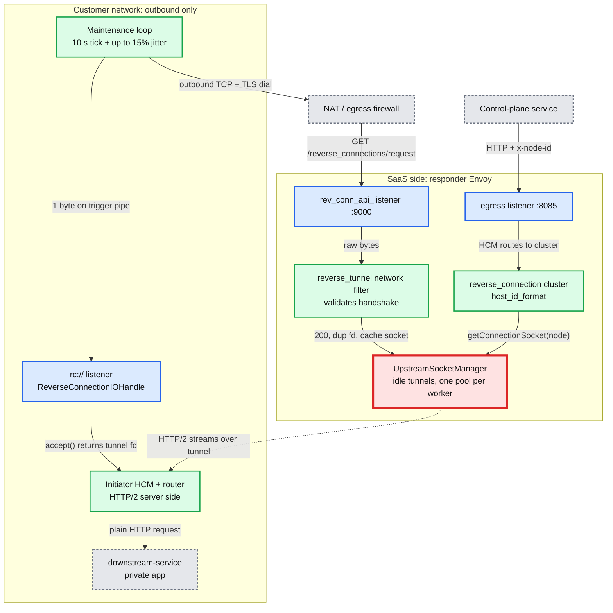

**What to notice**:
- Five extensions, two per side plus a cluster: `envoy.bootstrap.reverse_tunnel.downstream_socket_interface` (initiator), `envoy.bootstrap.reverse_tunnel.upstream_socket_interface` (responder), `envoy.filters.network.reverse_tunnel`, `envoy.clusters.reverse_connection`, and the `envoy.resolvers.reverse_connection` address resolver that parses `rc://` [documented].
- **The red node is the bottleneck.** The idle-tunnel pool is thread-local: `getConnectionSocket()` only looks in the calling worker's `UpstreamSocketManager` ([reverse_tunnel_acceptor.cc:36](https://github.com/envoyproxy/envoy/blob/v1.39.1/source/extensions/bootstrap/reverse_tunnel/upstream_socket_interface/reverse_tunnel_acceptor.cc#L36)). A node with fewer live tunnels than responder workers is unreachable from some workers [inferred]. When a tunnel dies, the initiator only re-dials on its next maintenance tick of 10 s plus up to 15% jitter ([reverse_connection_io_handle.cc:48](https://github.com/envoyproxy/envoy/blob/v1.39.1/source/extensions/bootstrap/reverse_tunnel/downstream_socket_interface/reverse_connection_io_handle.cc#L48)), so a worker can sit with no socket for up to ~11.5 s. Requests there fall back to the default socket interface, which dials the placeholder `127.0.0.1:0` and fails, incrementing `<stat_prefix>.fallback_no_reverse_socket` ([reverse_tunnel_acceptor.cc:71](https://github.com/envoyproxy/envoy/blob/v1.39.1/source/extensions/bootstrap/reverse_tunnel/upstream_socket_interface/reverse_tunnel_acceptor.cc#L71)).
- **Fix**: set `connection_count` so that tunnels per node exceed responder `--concurrency`, keep `skip_rebalancing: false` so `pickLeastLoadedSocketManager` spreads a node's sockets across workers ([upstream_socket_manager.cc:63](https://github.com/envoyproxy/envoy/blob/v1.39.1/source/extensions/bootstrap/reverse_tunnel/upstream_socket_interface/upstream_socket_manager.cc#L63)), and alert on `fallback_no_reverse_socket` [inferred].

### 2.2 Tunnel establishment

The initiator listener's address is `rc://src_node_id:src_cluster_id:src_tenant_id@remote_cluster:connection_count` ([reverse_tunnel.rst:77](https://github.com/envoyproxy/envoy/blob/v1.39.1/docs/root/configuration/other_features/reverse_tunnel.rst#L77)). Its IoHandle is a fake listen socket: `listen()` is a no-op, and the fd the dispatcher watches is swapped for the read end of a pipe ([reverse_connection_io_handle.cc:146](https://github.com/envoyproxy/envoy/blob/v1.39.1/source/extensions/bootstrap/reverse_tunnel/downstream_socket_interface/reverse_connection_io_handle.cc#L146)). Dialling starts in `initializeFileEvent()` on the worker.

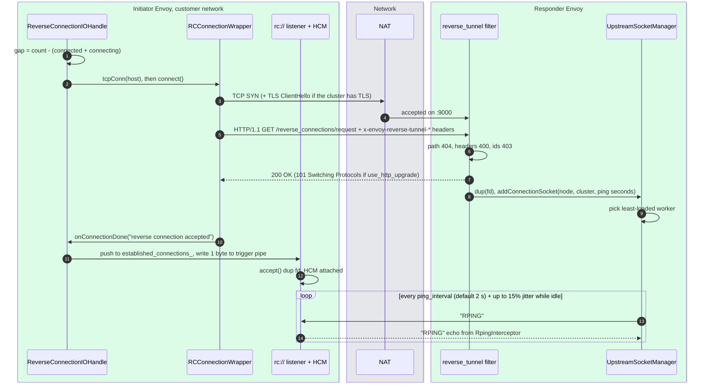

**Mechanism, step by step** [documented]:
- **Headers sent**: `x-envoy-reverse-tunnel-node-id`, `-cluster-id`, `-tenant-id`, `-upstream-cluster-name`, `-initiation-time` ([reverse_connection_utility.h:81](https://github.com/envoyproxy/envoy/blob/v1.39.1/source/extensions/bootstrap/reverse_tunnel/common/reverse_connection_utility.h#L81)). The request is encoded with a real `Http1::ClientConnectionImpl` ([rc_connection_wrapper.cc:80](https://github.com/envoyproxy/envoy/blob/v1.39.1/source/extensions/bootstrap/reverse_tunnel/downstream_socket_interface/rc_connection_wrapper.cc#L80)).
- **Success test**: status 200, or 101 in upgrade mode ([rc_connection_wrapper.cc:215](https://github.com/envoyproxy/envoy/blob/v1.39.1/source/extensions/bootstrap/reverse_tunnel/downstream_socket_interface/rc_connection_wrapper.cc#L215)). A 429 with `Retry-After` (delta-seconds) becomes the next backoff, capped by `max_reconnect_backoff`.
- **Hand-off by fd duplication**: both sides `dup()` the socket and close the original connection object with `NoFlush`, after setting TLS quiet shutdown so no `close_notify` is sent on the shared TLS session ([reverse_connection_io_handle.cc:1122](https://github.com/envoyproxy/envoy/blob/v1.39.1/source/extensions/bootstrap/reverse_tunnel/downstream_socket_interface/reverse_connection_io_handle.cc#L1122), [reverse_tunnel_filter.cc:604](https://github.com/envoyproxy/envoy/blob/v1.39.1/source/extensions/filters/network/reverse_tunnel/reverse_tunnel_filter.cc#L604)).
- **Upgrade mode** (`use_http_upgrade`, both sides must agree) makes the handshake a normal HTTP/1.1 `Upgrade: reverse-tunnel` so an HTTP proxy in the path can route it and then splice bytes ([reverse_tunnel.proto:142](https://github.com/envoyproxy/envoy/blob/v1.39.1/api/envoy/extensions/filters/network/reverse_tunnel/v3/reverse_tunnel.proto#L142)). An internal-listener address lets the initiator tunnel the handshake itself over HTTP CONNECT ([rc_connection_wrapper.cc:111](https://github.com/envoyproxy/envoy/blob/v1.39.1/source/extensions/bootstrap/reverse_tunnel/downstream_socket_interface/rc_connection_wrapper.cc#L111)).
- **RPING keepalive** (#41224): while a socket is idle in the responder cache, the responder writes the 5 bytes `RPING` every `ping_interval` plus 15% jitter, and arms a response timer of `ping_interval / 2` ([upstream_socket_manager.cc:603](https://github.com/envoyproxy/envoy/blob/v1.39.1/source/extensions/bootstrap/reverse_tunnel/upstream_socket_interface/upstream_socket_manager.cc#L603)). After `ping_failure_threshold` misses (default 3) the socket is closed. The initiator's `RpingInterceptor::read()` echoes `RPING` below the codec and stops echoing permanently at the first non-`RPING` byte, which is the HTTP/2 preface ([rping_interceptor.cc:10](https://github.com/envoyproxy/envoy/blob/v1.39.1/source/extensions/bootstrap/reverse_tunnel/common/rping_interceptor.cc#L10)). After hand-off, HTTP/2 PING keepalive on the cluster is the liveness check.

### 2.3 A request over the tunnel

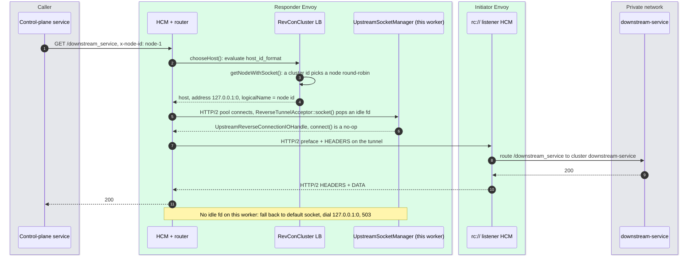

- **Host materialization**: `RevConCluster` creates a `HostImpl` lazily, the first time a node id is requested, with hostname `[tenant:]cluster:node` and a synthetic address whose `socketInterface()` is the upstream socket interface ([reverse_connection.cc:115](https://github.com/envoyproxy/envoy/blob/v1.39.1/source/extensions/clusters/reverse_connection/reverse_connection.cc#L115)). Unused hosts are removed every `cleanup_interval`, default 60 s ([reverse_connection.cc:287](https://github.com/envoyproxy/envoy/blob/v1.39.1/source/extensions/clusters/reverse_connection/reverse_connection.cc#L287)).
- **Selection by id**: `host_id_format` is a substitution formatter (`%REQ(x-node-id)%`, `%CEL(...)%`, filter state). If the id is a known cluster id, a node in that cluster is picked round-robin; otherwise it is treated as a node id ([upstream_socket_manager.cc:283](https://github.com/envoyproxy/envoy/blob/v1.39.1/source/extensions/bootstrap/reverse_tunnel/upstream_socket_interface/upstream_socket_manager.cc#L283)).
- **`lb_policy` must be `CLUSTER_PROVIDED`** and only HTTP/2 is supported, so one tunnel multiplexes many requests ([reverse_connection.cc:313](https://github.com/envoyproxy/envoy/blob/v1.39.1/source/extensions/clusters/reverse_connection/reverse_connection.cc#L313), [reverse_tunnel.rst:371](https://github.com/envoyproxy/envoy/blob/v1.39.1/docs/root/configuration/other_features/reverse_tunnel.rst#L371)).
- **A handed-off socket never returns to the pool.** Closing it calls `markSocketDead()` ([reverse_connection_io_handle.cc:33](https://github.com/envoyproxy/envoy/blob/v1.39.1/source/extensions/bootstrap/reverse_tunnel/upstream_socket_interface/reverse_connection_io_handle.cc#L33)). The initiator sees the close through `onDownstreamConnectionClosed()` and re-dials on the next tick.

### 2.4 State machines

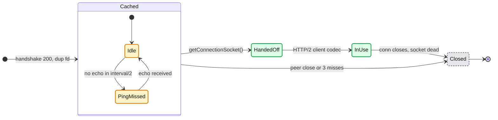

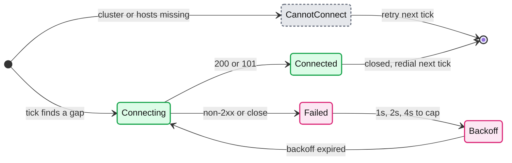

- Backoff is deterministic `1000 ms << (failures - 1)`, capped at `max_reconnect_backoff` (default 30 s), plus up to 15% upward jitter so agents that failed together spread out ([reverse_connection_io_handle.cc:689](https://github.com/envoyproxy/envoy/blob/v1.39.1/source/extensions/bootstrap/reverse_tunnel/downstream_socket_interface/reverse_connection_io_handle.cc#L689), [reverse_tunnel_initiator_extension.cc:28](https://github.com/envoyproxy/envoy/blob/v1.39.1/source/extensions/bootstrap/reverse_tunnel/downstream_socket_interface/reverse_tunnel_initiator_extension.cc#L28)).
- **A subtle one worth asking about** [inferred]: `failure_count` is reset only by `resetHostBackoff()`, which returns early unless the host is still inside its backoff window ([reverse_connection_io_handle.cc:738](https://github.com/envoyproxy/envoy/blob/v1.39.1/source/extensions/bootstrap/reverse_tunnel/downstream_socket_interface/reverse_connection_io_handle.cc#L738)). A success after an expired backoff therefore leaves the old count, and the next single failure starts at a long backoff.

### 2.5 Config reference

| Knob | Default | Where |
|---|---|---|
| `ReverseTunnel.ping_interval` | 2 s (range 1 ms to 300 s, but truncated to whole seconds) | [reverse_tunnel.proto:103](https://github.com/envoyproxy/envoy/blob/v1.39.1/api/envoy/extensions/filters/network/reverse_tunnel/v3/reverse_tunnel.proto#L103), [reverse_tunnel_filter.cc:143](https://github.com/envoyproxy/envoy/blob/v1.39.1/source/extensions/filters/network/reverse_tunnel/reverse_tunnel_filter.cc#L143) |
| `auto_close_connections` | false | [reverse_tunnel.proto:114](https://github.com/envoyproxy/envoy/blob/v1.39.1/api/envoy/extensions/filters/network/reverse_tunnel/v3/reverse_tunnel.proto#L114) |
| `request_path` / `request_method` | `/reverse_connections/request` / GET | [:118](https://github.com/envoyproxy/envoy/blob/v1.39.1/api/envoy/extensions/filters/network/reverse_tunnel/v3/reverse_tunnel.proto#L118), [:122](https://github.com/envoyproxy/envoy/blob/v1.39.1/api/envoy/extensions/filters/network/reverse_tunnel/v3/reverse_tunnel.proto#L122) |
| `validation.{node,cluster,tenant}_id_format` | empty = skip; mismatch = 403 | [:47](https://github.com/envoyproxy/envoy/blob/v1.39.1/api/envoy/extensions/filters/network/reverse_tunnel/v3/reverse_tunnel.proto#L47) |
| `required_cluster_name` | empty = no check; mismatch = 400 | [:135](https://github.com/envoyproxy/envoy/blob/v1.39.1/api/envoy/extensions/filters/network/reverse_tunnel/v3/reverse_tunnel.proto#L135) |
| `use_http_upgrade` / `skip_rebalancing` | false / false | [:142](https://github.com/envoyproxy/envoy/blob/v1.39.1/api/envoy/extensions/filters/network/reverse_tunnel/v3/reverse_tunnel.proto#L142), [:147](https://github.com/envoyproxy/envoy/blob/v1.39.1/api/envoy/extensions/filters/network/reverse_tunnel/v3/reverse_tunnel.proto#L147) |
| Initiator `http_handshake.request_path` (#42783) | `/reverse_connections/request` | [downstream proto:32](https://github.com/envoyproxy/envoy/blob/v1.39.1/api/envoy/extensions/bootstrap/reverse_tunnel/downstream_socket_interface/v3/downstream_reverse_connection_socket_interface.proto#L32) |
| `max_reconnect_backoff` | 30 s (min 1 s) | [downstream proto:71](https://github.com/envoyproxy/envoy/blob/v1.39.1/api/envoy/extensions/bootstrap/reverse_tunnel/downstream_socket_interface/v3/downstream_reverse_connection_socket_interface.proto#L71) |
| Responder `ping_failure_threshold` | 3 | [upstream proto:30](https://github.com/envoyproxy/envoy/blob/v1.39.1/api/envoy/extensions/bootstrap/reverse_tunnel/upstream_socket_interface/v3/upstream_reverse_connection_socket_interface.proto#L30), [acceptor_extension.cc:107](https://github.com/envoyproxy/envoy/blob/v1.39.1/source/extensions/bootstrap/reverse_tunnel/upstream_socket_interface/reverse_tunnel_acceptor_extension.cc#L107) |
| `enable_tenant_isolation` | false; ids containing `:` then get 400 | [upstream proto:47](https://github.com/envoyproxy/envoy/blob/v1.39.1/api/envoy/extensions/bootstrap/reverse_tunnel/upstream_socket_interface/v3/upstream_reverse_connection_socket_interface.proto#L47) |
| Cluster `cleanup_interval` / `host_id_format` | 60 s / required | [reverse_connection.proto:25](https://github.com/envoyproxy/envoy/blob/v1.39.1/api/envoy/extensions/clusters/reverse_connection/v3/reverse_connection.proto#L25), [:48](https://github.com/envoyproxy/envoy/blob/v1.39.1/api/envoy/extensions/clusters/reverse_connection/v3/reverse_connection.proto#L48) |
| `ReverseTunnelUpstreamCodecOptions.enable_drain_with_goaway` | false | [reverse_tunnel_codec.proto:25](https://github.com/envoyproxy/envoy/blob/v1.39.1/api/envoy/extensions/upstreams/http/reverse_tunnel/v3/reverse_tunnel_codec.proto#L25) |

**Observability**: `reverse_tunnel.handshake.{accepted,rejected,parse_error,validation_failed}` counters on the filter; lifecycle access logs (`tunnel_setup`, `socket_handoff`, `tunnel_closed`, `idle_ping_*`) under metadata namespace `envoy.reverse_tunnel.lifecycle`; `/clusters` lists every reachable node with an `rt_connection_count` gauge when `enable_detailed_stats` is on ([reverse_tunnel.rst:384](https://github.com/envoyproxy/envoy/blob/v1.39.1/docs/root/configuration/other_features/reverse_tunnel.rst#L384)). The contrib `reverse_tunnel_reporter` streams connect and disconnect events to a management server over gRPC (`StreamReverseTunnels`), so a control plane knows which data planes are reachable.

### 2.6 Failure modes and trade-offs

| Failure | What you see | Mitigation |
|---|---|---|
| Worker has no idle tunnel for the node | 503 on connect to 127.0.0.1:0, `fallback_no_reverse_socket` | More tunnels than workers, keep rebalancing on |
| NAT idle timeout silently drops an idle tunnel | RPING misses, socket closed after 3 x (interval + interval/2) | ping_interval below the NAT idle timeout |
| Responder drains (deploy) | In-flight streams reset | 1.39.0 drain-aware HCM and upstream codec send GOAWAY, initiator dials a replacement first |
| Handshake flood after a responder restart | Thousands of agents reconnect at once | Exponential backoff + 15% jitter, 429 with `Retry-After` |
| Spoofed identity | Tunnel registered under another node id | mTLS on the dial, `validation` formatters matching the cert SAN or filter state, tenant isolation |

- **Gave up**: a new protocol and a separate tunnel daemon. **Got**: every Envoy feature (TLS, stats, access logs, HTTP/2 flow control) on the tunnel for free.
- **Cost**: the caller must know a node id (`host_id_format`), per-worker pools multiply tunnel count, and the feature is still `wip`/`alpha`.

---

## 3. Composite cluster

**One line**: a cluster whose load balancer picks sub-cluster `attempt - 1`, so the first try hits `primary`, the first retry hits `secondary`, and so on.

- **Why**: aggregate clusters fail over by *health*; they will not move a *retry* to another cluster while the primary looks healthy. AI gateways want "retry the request at a different provider" regardless of health [documented, [composite_cluster.rst:16](https://github.com/envoyproxy/envoy/blob/v1.39.1/docs/root/intro/arch_overview/upstream/composite_cluster.rst#L16)].
- **Mechanism**: `CompositeClusterLoadBalancer::chooseHost()` reads `requestStreamInfo()->attemptCount()` (1-based), maps it to an index, fetches that thread-local cluster, and delegates `chooseHost`, `peekAnotherHost` and `selectExistingConnection` to the sub-cluster LB ([cluster.cc:103](https://github.com/envoyproxy/envoy/blob/v1.39.1/source/extensions/clusters/composite/cluster.cc#L103)). Index past the list returns no host.

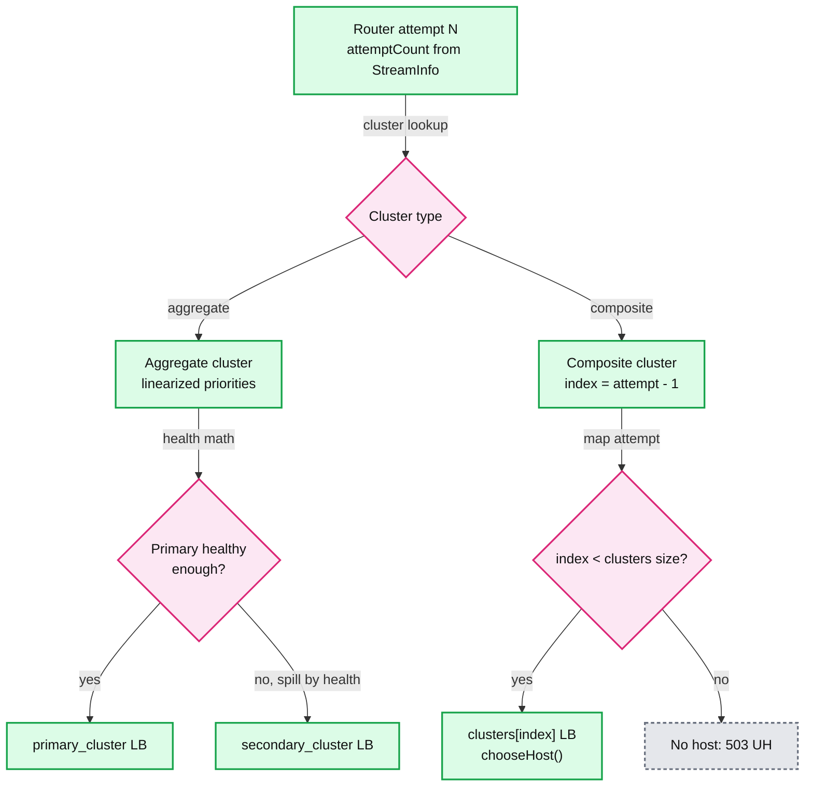

| | Aggregate | Composite |
|---|---|---|
| Selection basis | Health across linearized priorities | Retry attempt count only |
| Needs a retry policy | No | Yes: `num_retries = clusters - 1` |
| Sub-cluster unhealthy | Traffic spills automatically | Attempt still goes there, fails, maybe retries |
| Overflow | Health-dependent | Request fails (no host) |

- **Config**: `cluster_type.name: envoy.clusters.composite`, `lb_policy: CLUSTER_PROVIDED`, `clusters: [{name: ...}, ...]` (min 1) ([cluster.proto:54](https://github.com/envoyproxy/envoy/blob/v1.39.1/api/envoy/extensions/clusters/composite/v3/cluster.proto#L54)). Extension status is `stable`, posture `requires_trusted_downstream_and_upstream`.
- **Trade-offs** [inferred]: the route `timeout` (15 s default) still covers all attempts, so a slow primary eats the fallback's budget unless `per_try_timeout` is set. Retry budgets and `max_retries` circuit breakers are charged on the composite cluster's info, not per provider. It composes with aggregate: a sub-cluster may itself be an aggregate for health failover inside one provider.

---

## 4. Composite HTTP filter and the filter_chain filter

**One line**: a single slot in the HCM filter chain that instantiates, per request, whichever filter (or filter group) a match tree selects.

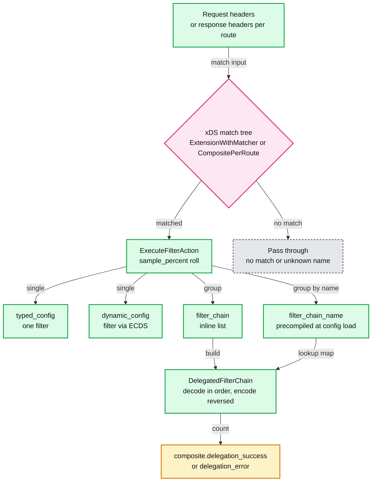

- **#41743 response matching**: per-route matchers using `HttpResponseHeaderMatchInput` or `HttpResponseTrailerMatchInput` used to fail silently and skip the delegate; fixed in 1.37.0 [documented, changelog 1.37.0].
- **#42724 `filter_chain`**: `DelegatedFilterChain` iterates filters in order on decode and in reverse on encode, returning the first non-`Continue` status ([filter.h:70](https://github.com/envoyproxy/envoy/blob/v1.39.1/source/extensions/filters/http/composite/filter.h#L70), [filter.cc:387](https://github.com/envoyproxy/envoy/blob/v1.39.1/source/extensions/filters/http/composite/filter.cc#L387)).
- **#42745 named chains**: `Composite.named_filter_chains` (a map) is compiled once in `compileNamedFilterChains()`; actions reference it with `filter_chain_name`. An unknown name silently skips the action ([composite.proto:121](https://github.com/envoyproxy/envoy/blob/v1.39.1/api/envoy/extensions/filters/http/composite/v3/composite.proto#L121)). Win: one chain definition shared by thousands of match branches instead of thousands of copies.
- **No buffering**: a delegate only sees callbacks from the phase that created it onward, so decide on request headers if the delegate needs the body. **Gotcha** [inferred]: if a delegated filter stops iteration and later calls `continueDecoding()`, the filter manager resumes *after the composite slot*, so later filters in the same delegated chain can miss that callback. Async filters (ext_authz, ext_proc) are safest last in a delegated chain.
- **The `filter_chain` HTTP filter** (1.39.0, not an @agrawroh PR): `FilterChainConfig.default_filter_chain` plus `FilterChainConfigPerRoute.filter_chain`; chains merge from least to most specific, and a more specific filter with the same `name` replaces the less specific one ([filter_chain.proto:43](https://github.com/envoyproxy/envoy/blob/v1.39.1/api/envoy/extensions/filters/http/filter_chain/v3/filter_chain.proto#L43)). Use it when the choice is by *route*; use composite when the choice is by *arbitrary match input*.

---

## 5. RBAC matcher work

**One line**: RBAC can now express policy as a generic xDS match tree over allowlisted inputs (IP, SNI, SAN, headers, CEL, filter state, network namespace, metadata), evaluated with sublinear IP matching, and the API is stable since 1.37.0.

- **Two policy forms**: classic `rules` (policies of permissions and principals) and `matcher` (an `xds.type.matcher.v3.Matcher` whose actions are `envoy.config.rbac.v3.Action{name, ALLOW|DENY|LOG}`). If both are set, `rules` is ignored; no match means DENY ([rbac.proto:45](https://github.com/envoyproxy/envoy/blob/v1.39.1/api/envoy/extensions/filters/http/rbac/v3/rbac.proto#L45), [config rbac.proto:447](https://github.com/envoyproxy/envoy/blob/v1.39.1/api/envoy/config/rbac/v3/rbac.proto#L447)).
- **Input allowlist**: config load fails if a matcher uses an input not in `ActionValidationVisitor::allowed_inputs_set_` ([rbac_filter.cc:19](https://github.com/envoyproxy/envoy/blob/v1.39.1/source/extensions/filters/http/rbac/rbac_filter.cc#L19)). HTTP RBAC allows 14: destination/source IP and port, direct source IP, server name, `NetworkNamespaceInput`, request header, URI SAN, DNS SAN, subject, dynamic metadata, `HttpAttributesCelMatchInput` (#31656) and `FilterStateInput` (#39462). Network RBAC has its own shorter list ([network rbac_filter.cc:18](https://github.com/envoyproxy/envoy/blob/v1.39.1/source/extensions/filters/network/rbac/rbac_filter.cc#L18)). Why an allowlist [inferred]: RBAC decides at request-header time, so inputs that need response data would yield "insufficient data", and a security filter should only trust inputs whose provenance is known.
- **Route metadata** (#36957): `sourced_metadata` with `MetadataSource` `DYNAMIC` or `ROUTE` lets a policy say "routes tagged `sensitive=true` require group X" ([config rbac.proto:32](https://github.com/envoyproxy/envoy/blob/v1.39.1/api/envoy/config/rbac/v3/rbac.proto#L32), [:221](https://github.com/envoyproxy/envoy/blob/v1.39.1/api/envoy/config/rbac/v3/rbac.proto#L221)).
- **`NetworkNamespaceInput`** (#41145, #41199, #41200): returns the listener address's `network_namespace_filepath`, so one `IP:port` bound in several Linux network namespaces can pick different filter chains or RBAC decisions ([network_inputs.proto:186](https://github.com/envoyproxy/envoy/blob/v1.39.1/api/envoy/extensions/matching/common_inputs/network/v3/network_inputs.proto#L186)). Empty on non-Linux.

A two-level policy with the matcher API: filter-state tier first, then one LC-trie over the IP ranges; unmatched requests are denied (shape taken from the in-tree RBAC integration tests):

```yaml
- name: envoy.filters.http.rbac
  typed_config:
    "@type": type.googleapis.com/envoy.extensions.filters.http.rbac.v3.RBAC
    matcher:
      matcher_tree:
        input:
          name: tier
          typed_config:
            "@type": type.googleapis.com/envoy.extensions.matching.common_inputs.network.v3.FilterStateInput
            key: tenant.tier
        exact_match_map:
          map:
            "premium":
              action: {name: a, typed_config: {"@type": type.googleapis.com/envoy.config.rbac.v3.Action, name: allow-corp, action: ALLOW}}
            "standard":
              matcher:
                matcher_tree:
                  input:
                    name: envoy.matching.inputs.source_ip
                    typed_config: {"@type": type.googleapis.com/envoy.extensions.matching.common_inputs.network.v3.SourceIPInput}
                  custom_match:
                    name: envoy.matching.custom_matchers.ip_range_matcher
                    typed_config:
                      "@type": type.googleapis.com/xds.type.matcher.v3.IPMatcher
                      range_matchers:
                      - ranges: [{address_prefix: 10.0.0.0, prefix_len: 8}]
                        on_match: {action: {name: a, typed_config: {"@type": type.googleapis.com/envoy.config.rbac.v3.Action, name: allow-corp, action: ALLOW}}}
                      - ranges: [{address_prefix: 203.0.113.0, prefix_len: 24}]
                        on_match: {action: {name: d, typed_config: {"@type": type.googleapis.com/envoy.config.rbac.v3.Action, name: deny-blocked, action: DENY}}}
      on_no_match:
        action: {name: n, typed_config: {"@type": type.googleapis.com/envoy.config.rbac.v3.Action, name: default-deny, action: DENY}}
```

### 5.1 The LC-trie

**One line**: a level-compressed trie turns "which of N CIDR ranges contain this IP" from N comparisons into a few array hops, independent of N in practice.

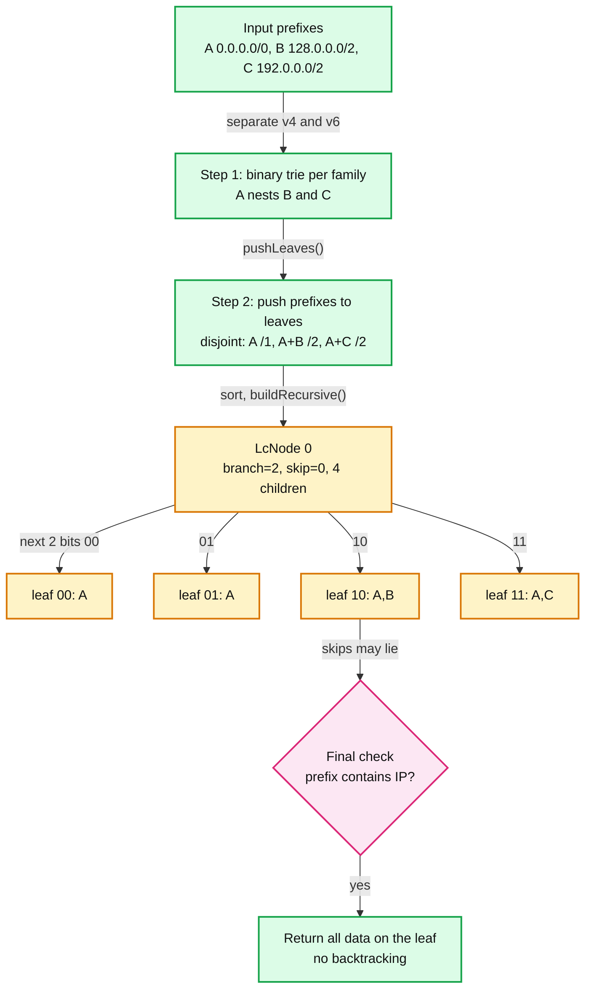

- **Algorithm** (Nilsson and Karlsson) [documented, [lc_trie.h:36](https://github.com/envoyproxy/envoy/blob/v1.39.1/source/common/network/lc_trie.h#L36)]: classic LC-tries cannot hold nested prefixes, so step 2 pushes every prefix down to the leaves of a binary trie; each leaf then carries the data of all ranges covering it ([lc_trie.h:121](https://github.com/envoyproxy/envoy/blob/v1.39.1/source/common/network/lc_trie.h#L121)). Step 3 builds the LC-trie: a dense subtree of height `b` is replaced by one node with `2^b` children (level compression), and runs of identical bits are skipped (path compression).
- **Node layout**: one 32-bit word, `branch_:5`, `skip_:7`, `address_:20` ([lc_trie.h:679](https://github.com/envoyproxy/envoy/blob/v1.39.1/source/common/network/lc_trie.h#L679)). So the trie is a flat `std::vector` of 4-byte nodes, at most `2^20` nodes (4 MiB), and at most `2^20 x 0.5 / 2 = 262,144` prefixes at the default fill factor 0.5 ([lc_trie.h:71](https://github.com/envoyproxy/envoy/blob/v1.39.1/source/common/network/lc_trie.h#L71)).
- **Lookup** `getData()`: extract `branch` bits at `position`, index `address + bits`, repeat until a leaf, then one containment check because skipped bits were never compared ([lc_trie.h:714](https://github.com/envoyproxy/envoy/blob/v1.39.1/source/common/network/lc_trie.h#L714)). Cost is O(depth): bounded by W (32 or 128 bits), and for real tables a handful of hops because each hop consumes up to 31 bits [inferred from the paper and the 5-bit branch field]. Build is O(n log n) for the sort.
- **Numbers** (#40493 benchmark on an M-series laptop, [documented in PR]): linear 900 ns vs trie 29.5 ns at 100 ranges; 23,017 ns vs 49.4 ns at 5,000 ranges. The PR prose says "~10x at 100, ~200x at 5000"; its own table shows 30x and 466x.
- **Where it applies in v1.39.1**: classic `IPMatcher` now wraps an `LcTrie<bool>` (#40536) and guards non-IP addresses such as pipes (#40631) ([matchers.cc:277](https://github.com/envoyproxy/envoy/blob/v1.39.1/source/extensions/filters/common/rbac/matchers.cc#L277)). But each classic principal holds one `CidrRange`, so `or_ids` over N IPs is still N probes [inferred]. The real sublinear path is the matcher API's `IpRangeMatcher` (renamed from `TrieMatcher` in #40505), which puts every range of every branch into one trie and sorts hits by prefix length ([ip_range_matcher.h:61](https://github.com/envoyproxy/envoy/blob/v1.39.1/source/extensions/common/matcher/ip_range_matcher.h#L61)).

**Security context in v1.39.1**: two RBAC-relevant CVEs were fixed in the patch. CVE-2026-73553: RBAC `PathMatcher` and `UriTemplateMatcher` now honor the route's `ignore_path_parameters_in_path_matching`, closing a bypass via `/admin;x=y` ([1.39.1.yaml:128](https://github.com/envoyproxy/envoy/blob/v1.39.1/changelogs/1.39.1.yaml#L128)). CVE-2026-73552: `safe_regex` switched from UTF-8 to Latin1 so obs-text header bytes cannot make a regex fail open ([1.39.1.yaml:88](https://github.com/envoyproxy/envoy/blob/v1.39.1/changelogs/1.39.1.yaml#L88)).

---

## 6. ext_authz evolution

**One line**: ext_authz grew from "one authz backend for the whole listener" into per-route backends, per-route body buffering, retries, custom error replies and L4 TLS alerts.

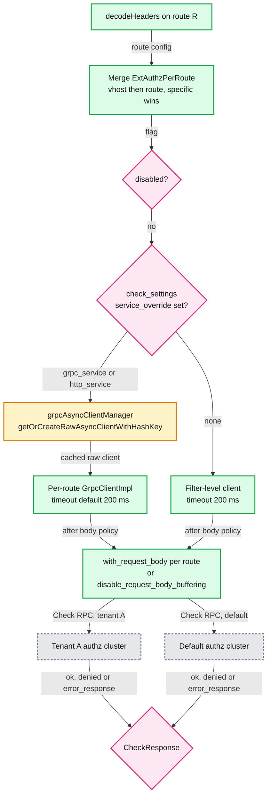

- **Per-route service** (#40169, reapplied as #40843): `CheckSettings.grpc_service` (and `http_service`) overrides the backend for a route or vhost ([ext_authz.proto:671](https://github.com/envoyproxy/envoy/blob/v1.39.1/api/envoy/extensions/filters/http/ext_authz/v3/ext_authz.proto#L671)). `createPerRouteGrpcClient()` gets a raw async client from the cluster manager's cache keyed by the `GrpcService` hash, so there is no per-request channel setup; timeout defaults to 200 ms, 0 means none; on failure it falls back to the filter-level client ([ext_authz.cc:255](https://github.com/envoyproxy/envoy/blob/v1.39.1/source/extensions/filters/http/ext_authz/ext_authz.cc#L255), [:27](https://github.com/envoyproxy/envoy/blob/v1.39.1/source/extensions/filters/http/ext_authz/ext_authz.cc#L27)). **What it enables**: different authz backends per tenant, per API tier, or per compliance zone behind one listener, plus canarying a new authz service on one route.
- **Per-route body** (#30571): `CheckSettings.with_request_body` is a oneof with `disable_request_body_buffering`, so body buffering can be off globally and on for a few routes ([:654](https://github.com/envoyproxy/envoy/blob/v1.39.1/api/envoy/extensions/filters/http/ext_authz/v3/ext_authz.proto#L654)). `max_request_bytes` overflow returns 413 and beats `failure_mode_allow` ([:445](https://github.com/envoyproxy/envoy/blob/v1.39.1/api/envoy/extensions/filters/http/ext_authz/v3/ext_authz.proto#L445)).
- **Retries** (#41345, #42232 fix, #42138 test): `HttpService.retry_policy` (a `core.v3.RetryPolicy`); setting it makes the filter buffer the body for replay ([:527](https://github.com/envoyproxy/envoy/blob/v1.39.1/api/envoy/extensions/filters/http/ext_authz/v3/ext_authz.proto#L527)). gRPC already had `GrpcService.retry_policy`; #42138 proved retries show up in cluster stats.
- **`error_response`** (#42099): a new `CheckResponse` oneof arm (field 5) for "I failed, not I deny". It counts `ext_authz_error`, honors `failure_mode_allow`, and uses the given status or `status_on_error` (default 403) ([external_auth.proto:147](https://github.com/envoyproxy/envoy/blob/v1.39.1/api/envoy/service/auth/v3/external_auth.proto#L147), [ext_authz.proto:108](https://github.com/envoyproxy/envoy/blob/v1.39.1/api/envoy/extensions/filters/http/ext_authz/v3/ext_authz.proto#L108)). Lets an overloaded authz server say "503, retry later" instead of a misleading 403.
- **Network filter `send_tls_alert_on_denial`** (#41473, default false): calls `SSL_send_fatal_alert(ssl, SSL_AD_ACCESS_DENIED)` (alert 49) before closing, so TLS clients see why ([network ext_authz.proto:78](https://github.com/envoyproxy/envoy/blob/v1.39.1/api/envoy/extensions/filters/network/ext_authz/v3/ext_authz.proto#L78), [ext_authz.cc:158](https://github.com/envoyproxy/envoy/blob/v1.39.1/source/extensions/filters/network/ext_authz/ext_authz.cc#L158)). Pair with tcp_proxy `upstream_connect_mode` so the backend is not dialled before authz finishes (#42393 docs).
- **Network shadow mode** (#47342, **main only (after v1.39.0)**, from the PR): calls authz but never closes; writes the decision to filter state so a later filter can enforce it. The classic safe rollout for L4 authz.
- **Header propagation fixes**: #41868 (1.37.0) propagates `set-cookie` and similar to clients, splitting `allowed_client_headers` (denied) from `allowed_client_headers_on_success`; #43043 (1.38.0, backported to 1.37.1) fixed the regression where denied responses lost allowlisted headers.
- **1.39.1 CVEs**: CVE-2026-73547 crash on CONNECT requests without a path, CVE-2026-50572 use-after-free when HTTP ext_authz rejects ([1.39.1.yaml:6](https://github.com/envoyproxy/envoy/blob/v1.39.1/changelogs/1.39.1.yaml#L6), [:12](https://github.com/envoyproxy/envoy/blob/v1.39.1/changelogs/1.39.1.yaml#L12)).
- **Trade-offs** [inferred]: per-route backends multiply failure domains and connection pools (one client per distinct `GrpcService` per worker); the 200 ms default timeout plus retries can exceed tight route budgets; body buffering for retry costs memory per in-flight request up to `max_request_bytes`.

---

## 7. tcp_proxy tunneling

**One line**: tcp_proxy can wrap each downstream TCP connection in an HTTP `CONNECT` (or `POST`) stream to a peer Envoy, so many TCP flows share one warm, TLS-protected HTTP/2 connection.

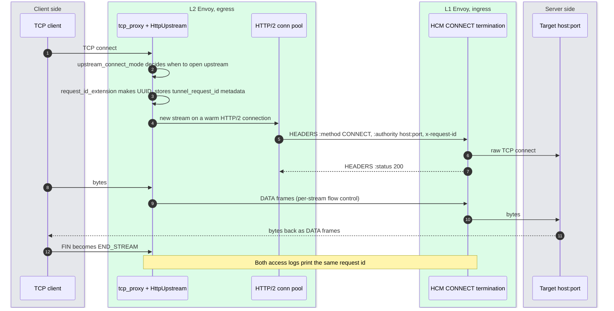

- **Mechanism**: `TunnelingConfig` selects `HttpConnPool` and `HttpUpstream` instead of `TcpUpstream` ([upstream.h:201](https://github.com/envoyproxy/envoy/blob/v1.39.1/source/common/tcp_proxy/upstream.h#L201)); `hostname` becomes `:authority`, `use_post` swaps CONNECT for POST to cross proxies that reject CONNECT ([tcp_proxy.proto:145](https://github.com/envoyproxy/envoy/blob/v1.39.1/api/envoy/extensions/filters/network/tcp_proxy/v3/tcp_proxy.proto#L145)). HTTP/1.1 CONNECT works too but costs one TCP connection per tunnel ([upgrades.rst:160](https://github.com/envoyproxy/envoy/blob/v1.39.1/docs/root/intro/arch_overview/http/upgrades.rst#L160)).
- **Request id** (#40815, #41391): `request_id_extension` generates an id per tunnel, sends it in `request_id_header` (default `x-request-id`) and stores it at `envoy.filters.network.tcp_proxy:<request_id_metadata_key>` (default `tunnel_request_id`) ([tcp_proxy.proto:184](https://github.com/envoyproxy/envoy/blob/v1.39.1/api/envoy/extensions/filters/network/tcp_proxy/v3/tcp_proxy.proto#L184), [:195](https://github.com/envoyproxy/envoy/blob/v1.39.1/api/envoy/extensions/filters/network/tcp_proxy/v3/tcp_proxy.proto#L195), [:203](https://github.com/envoyproxy/envoy/blob/v1.39.1/api/envoy/extensions/filters/network/tcp_proxy/v3/tcp_proxy.proto#L203)). Overriding the header avoids an L1 Envoy treating it as a client-trusted `x-request-id`.
- **Dynamic TLVs** (#41294): `proxy_protocol_tlvs[].format_string` fills a PROXY v2 TLV from metadata or filter state at connect time, merged per `proxy_protocol_tlv_merge_policy` ([tcp_proxy.proto:366](https://github.com/envoyproxy/envoy/blob/v1.39.1/api/envoy/extensions/filters/network/tcp_proxy/v3/tcp_proxy.proto#L366)). Example: carry a tenant id to a backend that only speaks PROXY protocol.
- **`upstream_connect_mode`** (#41696, default `IMMEDIATE`): `ON_DOWNSTREAM_DATA` waits for first bytes (lets SNI or authz filters run first); `ON_DOWNSTREAM_TLS_HANDSHAKE` waits for the downstream handshake so client-cert data can drive routing. Non-immediate modes require `max_early_data_bytes` (max 1 MiB), else config fails ([tcp_proxy.proto:34](https://github.com/envoyproxy/envoy/blob/v1.39.1/api/envoy/extensions/filters/network/tcp_proxy/v3/tcp_proxy.proto#L34), [tcp_proxy.cc:279](https://github.com/envoyproxy/envoy/blob/v1.39.1/source/common/tcp_proxy/tcp_proxy.cc#L279)). Never use them for server-first protocols (SMTP, MySQL): the client waits for a greeting that never comes.
- **#42024 leak**: with `receive_before_connect`, a downstream that closed before the upstream was up never propagated end-of-stream, so the upstream leaked. Fixed in 1.37.0 and backported to three older branches.
- **`COMMON_DURATION`** (#45449, 1.39.0): `DS_CX_BEG`, `DS_CX_END`, `US_CX_BEG`, `US_CX_END` now render for TCP, so `%COMMON_DURATION(DS_CX_BEG:US_CX_BEG:ms)%` measures TLS termination plus upstream connect latency ([1.39.0.yaml:1310](https://github.com/envoyproxy/envoy/blob/v1.39.1/changelogs/1.39.0.yaml#L1310)).
- **Trade-offs**: HTTP/2 multiplexing means head-of-line blocking at the TCP layer between L2 and L1, and one connection loss kills every tunnel on it [inferred]. The 16 MiB default stream window bounds per-tunnel buffering. `idle_timeout` is 1 hour per the facts sheet.

---

## 8. Dynamic forward proxy

**One line**: DFP lets Envoy proxy to any hostname taken from the request, resolving it on demand through a shared DNS cache and adding it as a host of a special cluster.

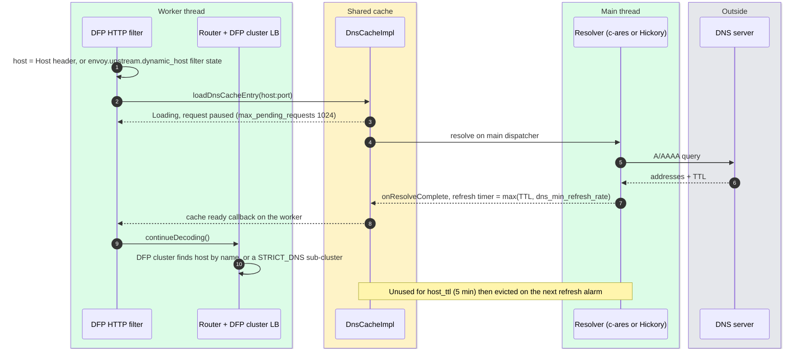

- **Defaults** [documented, [dns_cache.proto](https://github.com/envoyproxy/envoy/blob/v1.39.1/api/envoy/extensions/common/dynamic_forward_proxy/v3/dns_cache.proto#L60)]: `dns_refresh_rate` 60 s for unresolved hosts, `dns_min_refresh_rate` 5 s, `host_ttl` 5 min, `max_hosts` 1024, DNS-cache circuit breaker `max_pending_requests` 1024. `sub_clusters_config` creates one STRICT_DNS cluster per `host:port` (max 1024, TTL 5 min) so each gets health checks, every resolved IP, and its own LB ([cluster.proto:51](https://github.com/envoyproxy/envoy/blob/v1.39.1/api/envoy/extensions/clusters/dynamic_forward_proxy/v3/cluster.proto#L51), [:89](https://github.com/envoyproxy/envoy/blob/v1.39.1/api/envoy/extensions/clusters/dynamic_forward_proxy/v3/cluster.proto#L89)).
- **#39605** `allow_dynamic_host_from_filter_state` (default false): the HTTP filter now honors `envoy.upstream.dynamic_host` and `dynamic_port` like the SNI and UDP DFP filters do ([dynamic_forward_proxy.proto:54](https://github.com/envoyproxy/envoy/blob/v1.39.1/api/envoy/extensions/filters/http/dynamic_forward_proxy/v3/dynamic_forward_proxy.proto#L54)). Lets an earlier filter (Lua, ext_proc) choose the destination without rewriting `Host`. **#40347**: #39605 stripped IPv6 brackets, which confused `normalizeHostForDfp`, so `[::1]:8080` broke. Fixed days later: a reminder that host normalization is where DFP bugs live.
- **#44542 bounded eviction**: a `touch()` landing just before `onReResolveAlarm` kept a host alive; if DNS then failed, the next alarm used the full failure backoff, far past `host_ttl`. Now the failure-path interval is `min(backoff, host_ttl - elapsed)`, or 1 ms if already past TTL ([dns_cache_impl.cc:620](https://github.com/envoyproxy/envoy/blob/v1.39.1/source/extensions/common/dynamic_forward_proxy/dns_cache_impl.cc#L620)).
- **Trade-offs**: DFP is an open proxy by design, so pair it with RBAC on destinations; the DNS cache and its resolution run on the main thread, so a DNS brownout shows up as paused requests on every worker [inferred].

---

## 9. Hickory DNS resolver

**One line**: a DNS resolver extension backed by the pure-Rust Hickory library, running on its own Tokio threads and posting results back to the calling Envoy dispatcher.

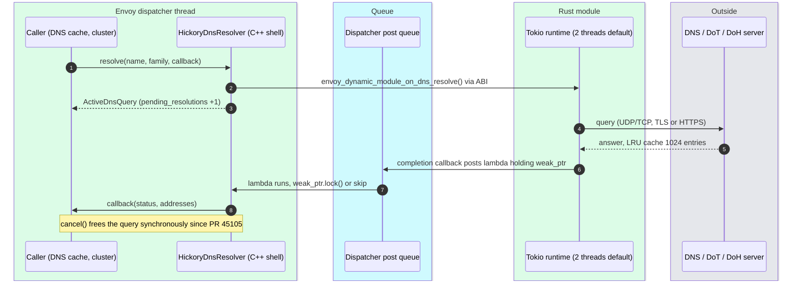

- **Why Rust** [inferred beyond the proto]: DNS answers are untrusted input parsed in-process; a memory-safe parser removes a CVE class. Hickory also brings DoT, DoH and DNSSEC validation, which the c-ares extension does not offer ([hickory_dns_resolver.proto:52](https://github.com/envoyproxy/envoy/blob/v1.39.1/api/envoy/extensions/network/dns_resolver/hickory/v3/hickory_dns_resolver.proto#L52)).
- **How it is wired**: the Rust code is a statically linked *builtin dynamic module* ([hickory_dns.rs](https://github.com/envoyproxy/envoy/blob/v1.39.1/source/extensions/dynamic_modules/builtin_extensions/hickory_dns.rs)); the C++ shell resolves ABI symbols like `envoy_dynamic_module_on_dns_resolve` at load ([hickory_dns_impl.cc:68](https://github.com/envoyproxy/envoy/blob/v1.39.1/source/extensions/network/dns_resolver/hickory/hickory_dns_impl.cc#L68)). **c-ares contrast**: c-ares runs *inside* the dispatcher through file events and a timer, no extra threads ([dns_impl.cc:435](https://github.com/envoyproxy/envoy/blob/v1.39.1/source/extensions/network/dns_resolver/cares/dns_impl.cc#L435)). Hickory adds threads and a cross-thread post, which is where the bugs were.
- **#45105 fixes**: `cancel()` only flipped a flag, leaking the heap object and a gauge tick per DFP timeout; now it erases and frees synchronously. The Tokio completion posted a raw resolver pointer; now it captures `weak_from_this()` ([hickory_dns_impl.cc:337](https://github.com/envoyproxy/envoy/blob/v1.39.1/source/extensions/network/dns_resolver/hickory/hickory_dns_impl.cc#L337)). **Stats** (#44179): `resolve_total`, `pending_resolutions`, `not_found`, `get_addr_failure`, `timeouts` ([hickory_dns_impl.h:28](https://github.com/envoyproxy/envoy/blob/v1.39.1/source/extensions/network/dns_resolver/hickory/hickory_dns_impl.h#L28)).

| Knob | Default | Where |
|---|---|---|
| `cache_size` | 1024 (LRU, negative caching) | [proto:68](https://github.com/envoyproxy/envoy/blob/v1.39.1/api/envoy/extensions/network/dns_resolver/hickory/v3/hickory_dns_resolver.proto#L68) |
| `num_resolver_threads` | 2 (1 to 16), one Tokio runtime per resolver instance | [proto:74](https://github.com/envoyproxy/envoy/blob/v1.39.1/api/envoy/extensions/network/dns_resolver/hickory/v3/hickory_dns_resolver.proto#L74) |
| `query_timeout` / `query_tries` | 5 s / 3 | [proto:87](https://github.com/envoyproxy/envoy/blob/v1.39.1/api/envoy/extensions/network/dns_resolver/hickory/v3/hickory_dns_resolver.proto#L87), [:93](https://github.com/envoyproxy/envoy/blob/v1.39.1/api/envoy/extensions/network/dns_resolver/hickory/v3/hickory_dns_resolver.proto#L93) |
| `enable_dnssec` / `use_system_config` | false / true when nothing else set | [proto:62](https://github.com/envoyproxy/envoy/blob/v1.39.1/api/envoy/extensions/network/dns_resolver/hickory/v3/hickory_dns_resolver.proto#L62), [:82](https://github.com/envoyproxy/envoy/blob/v1.39.1/api/envoy/extensions/network/dns_resolver/hickory/v3/hickory_dns_resolver.proto#L82) |

**Trade-off** [inferred]: every resolver instance owns a runtime, so 200 STRICT_DNS clusters each with their own resolver config could mean 400 extra threads. Status is `alpha` versus c-ares `stable`.

---

## 10. Performance and kernel work

### 10.1 Pinning workers to CPUs (#45722)

- `Bootstrap.enable_worker_cpu_affinity` (default false, Linux only): worker `i` is pinned to the `i`-th CPU of the process affinity mask; if workers exceed CPUs in the mask, **no** worker is pinned; applied once at start ([bootstrap.proto:446](https://github.com/envoyproxy/envoy/blob/v1.39.1/api/envoy/config/bootstrap/v3/bootstrap.proto#L446), [cpu_affinity.cc:35](https://github.com/envoyproxy/envoy/blob/v1.39.1/source/common/common/cpu_affinity.cc#L35)). Gauge `workers_pinned`.
- **Helps**: dedicated bare-metal edge boxes, many cores, NUMA; a worker's connections, TLS sessions and buffers stay in one L1/L2 and one memory node. **Hurts** [inferred]: containers limited by CFS quota rather than a cpuset (`--concurrency` defaults to host threads, per the facts sheet, so the mask is the whole host and pinning spreads onto CPUs you do not own); co-located noisy neighbours or IRQ-heavy CPUs a pinned worker cannot escape; sidecars sharing cores with the app.

### 10.2 CPU-locality connection balancer (#45734)

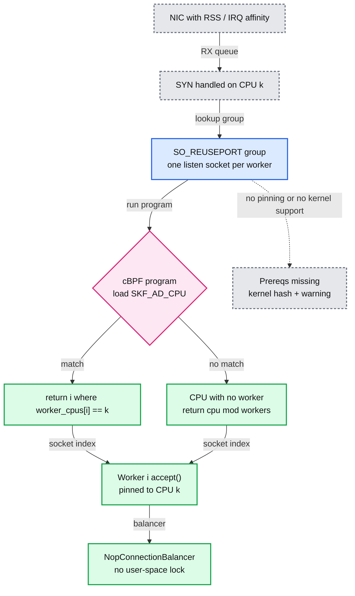

- The program is classic BPF of `2 x workers + 3` instructions, attached with `SO_ATTACH_REUSEPORT_CBPF` when the socket is listening ([reuse_port_bpf_cpu_steering_option_impl.cc:16](https://github.com/envoyproxy/envoy/blob/v1.39.1/source/common/network/reuse_port_bpf_cpu_steering_option_impl.cc#L16)). Requires worker pinning, `enable_reuse_port` (default true on Linux) and kernel support ([listener.proto:129](https://github.com/envoyproxy/envoy/blob/v1.39.1/api/envoy/config/listener/v3/listener.proto#L129)).
- **Versus `ExactBalance`**: exact takes a mutex on every accept to pick the least-loaded worker; it is accurate but throughput-limited ([listener.proto:104](https://github.com/envoyproxy/envoy/blob/v1.39.1/api/envoy/config/listener/v3/listener.proto#L104)). CPU-locality is lock-free but only balanced if RSS spreads flows evenly.
- **Caveat**: during hot restart, new connections may be steered to the draining parent until it exits ([listener.proto:127](https://github.com/envoyproxy/envoy/blob/v1.39.1/api/envoy/config/listener/v3/listener.proto#L127)).

### 10.3 Sockmap socket interface (#45724, #45891)

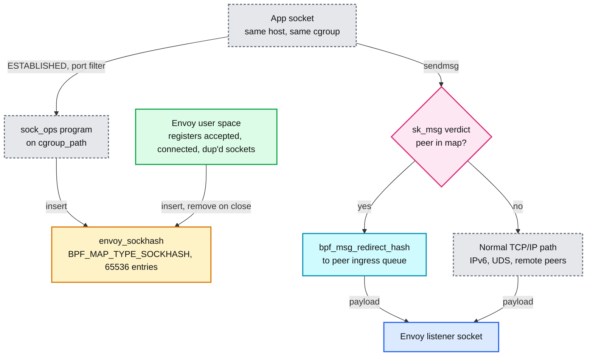

- **When it helps**: sidecar-to-app and proxy-to-proxy hops on one host, where every byte otherwise crosses the loopback TCP stack twice [documented, [sockmap.rst](https://github.com/envoyproxy/envoy/blob/v1.39.1/docs/root/configuration/other_features/sockmap.rst)]. Only same-host IPv4 stream sockets; everything else falls back.
- **Knobs**: `bpf_program_path` (no object shipped; build `sockmap_bpf` with clang), `cgroup_path` (enables app-to-proxy), `register_user_space_sockets` default true (proxy-to-proxy), `sockhash_max_entries` default 65536, `accelerated_ports` up to 128 ranges (#45891: stops a root cgroup from accelerating unrelated connections) ([sockmap.proto:50](https://github.com/envoyproxy/envoy/blob/v1.39.1/api/envoy/extensions/network/socket_interface/sockmap/v3/sockmap.proto#L50), [:63](https://github.com/envoyproxy/envoy/blob/v1.39.1/api/envoy/extensions/network/socket_interface/sockmap/v3/sockmap.proto#L63)). Needs `--define=sockmap=enabled`, kernel 4.18+, `CAP_BPF` + `CAP_NET_ADMIN` or `CAP_SYS_ADMIN`.
- **Trade-offs** [inferred]: redirected payloads bypass netfilter, tc and tcpdump on loopback, so network policy and debugging change; status is `wip`.

### 10.4 io_uring (#44188) and tcmalloc (#43585, #43781)

- **io_uring** (per-worker rings, completion via eventfd on the dispatcher, per the facts sheet): multishot `recv` with a kernel buffer ring (Linux 6.0+, off by default); write backpressure pauses above 128 KiB and resumes at 16 KiB so flood protection engages; `readv` buffer grows up to 16x `read_buffer_size` (8192); CQ sized 2x SQ (`io_uring_size` 1000) ([default_socket_interface.proto:72](https://github.com/envoyproxy/envoy/blob/v1.39.1/api/envoy/extensions/network/socket_interface/v3/default_socket_interface.proto#L72), [:94](https://github.com/envoyproxy/envoy/blob/v1.39.1/api/envoy/extensions/network/socket_interface/v3/default_socket_interface.proto#L94)). Buffer ring memory per worker is up to 4096 buffers x `read_buffer_size`.
- **tcmalloc**: the custom release timer is replaced by a thread running `tcmalloc::MallocExtension::ProcessBackgroundActions()` with `SetBackgroundReleaseRate(bytes_to_release / memory_release_interval)`, which also reclaims per-CPU caches and resizes size classes ([stats.cc:276](https://github.com/envoyproxy/envoy/blob/v1.39.1/source/common/memory/stats.cc#L276)). It starts only if `bytes_to_release > 0` (default 0). New knobs: `soft_memory_limit_bytes`, `max_per_cpu_cache_size_bytes`, `max_unfreed_memory_bytes` (default 100 MB) ([bootstrap.proto:809](https://github.com/envoyproxy/envoy/blob/v1.39.1/api/envoy/config/bootstrap/v3/bootstrap.proto#L809), [:825](https://github.com/envoyproxy/envoy/blob/v1.39.1/api/envoy/config/bootstrap/v3/bootstrap.proto#L825)). Stat `tcmalloc.released_by_timer` is gone.

---

## 11. TLS and QUIC

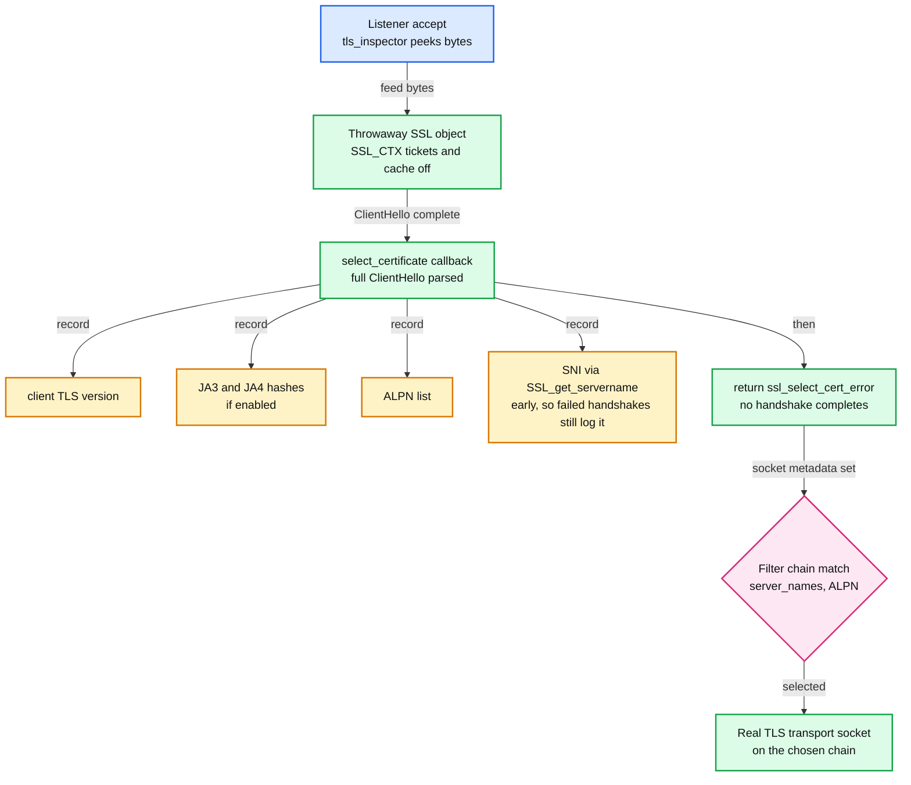

- **JA4** (#39430, `enable_ja4_fingerprinting` default false): format `tXXdYYZZ_CIPHERHASH_EXTENSIONHASH`: protocol (t, q, d), TLS version, SNI present (d) or not (i), 2-digit cipher and extension counts, ALPN first and last chars, then the first 12 hex chars of SHA-256 over sorted ciphers and over sorted extensions plus signature algorithms; GREASE values excluded ([ja4_fingerprint.h:19](https://github.com/envoyproxy/envoy/blob/v1.39.1/source/extensions/filters/listener/tls_inspector/ja4_fingerprint.h#L19), [tls_inspector.proto:32](https://github.com/envoyproxy/envoy/blob/v1.39.1/api/envoy/extensions/filters/listener/tls_inspector/v3/tls_inspector.proto#L32)). SNI and ALPN are left out of the extension hash, and sorting makes JA4 stable against the extension-order randomization that breaks JA3 [inferred]. PR validated `t13d1516h2_8daaf6152771_02713d6af862` against BrowserLeaks.
- **SNI in the early callback** (#42871): SNI is read inside `SSL_CTX_set_select_certificate_cb` ([tls_inspector.cc:82](https://github.com/envoyproxy/envoy/blob/v1.39.1/source/extensions/filters/listener/tls_inspector/tls_inspector.cc#L82)), so it reaches access logs even when the later real handshake fails. That is the log line you need when debugging "client says TLS error".
- **Shared CRL** (#46021, in the v1.39.1 tree, no release note): `CrlCache` is a main-thread singleton map from SHA-256 of the CRL PEM to a `weak_ptr<CrlList>`; contexts with identical CRLs share one parsed copy; expired entries are pruned on the next miss ([default_validator.h:71](https://github.com/envoyproxy/envoy/blob/v1.39.1/source/common/tls/cert_validator/default_validator.h#L71), [default_validator.cc:52](https://github.com/envoyproxy/envoy/blob/v1.39.1/source/common/tls/cert_validator/default_validator.cc#L52)). PR: ~1 GiB at startup for a ~4.6 MB, ~105K-entry CRL referenced from many contexts.
- **Brotli certificate compression off** (#45618): RFC 8879 compression (brotli for QUIC and TCP, zlib for TCP) shipped on in 1.38.0; the PR reports ~50x CPU on services terminating many TCP connections, so the guard `tls_certificate_compression_brotli` became `FALSE_RUNTIME_GUARD` in 1.38.3 and 1.39.0 ([runtime_features.cc:298](https://github.com/envoyproxy/envoy/blob/v1.39.1/source/common/runtime/runtime_features.cc#L298)). With it off, QUIC keeps zlib and TCP TLS sends certificates uncompressed. v1.39.1 caches compressed chains per `SSL_CTX` keyed by (algorithm, chain bytes) behind a reader lock, and compresses at brotli's default quality ([cert_compression.cc:69](https://github.com/envoyproxy/envoy/blob/v1.39.1/source/common/tls/cert_compression.cc#L69), [:105](https://github.com/envoyproxy/envoy/blob/v1.39.1/source/common/tls/cert_compression.cc#L105)). Whether that cache predates the regression is [unverified]; a per-handshake key copy of the whole chain is still a cost [inferred].
- **QUIC downstream mTLS**: **main only (after v1.39.0)**. v1.39.1 rejects `require_client_certificate` on QUIC with "TLS Client Authentication is not supported over QUIC". On main: #47076 enables it (RFC 9001 section 4.4 allows client auth in the QUIC handshake); #47341 adds optional client certs (validate if presented, report `peerCertificateValidated()` only when chained to the trust anchor; guard `quic_mtls_server_enabled`); #47381 sets a per-filter-chain session ID context so a resumed session cannot reuse a validation result under another config (guard `quic_reject_cross_config_session_resumption`, on by default). The last one is the security-relevant subtlety: resumption skips certificate validation, so it must be scoped to the config that validated.

---

## 12. Router and upstream

- **Cluster-level policies** (#41834, #41928, #42077, all 1.37.0) live in `HttpProtocolOptions`: `request_mirror_policies` (field 9), `hash_policy` (10), `retry_policy` (11). Each **overrides** the route-level policy entirely, no merge ([http_protocol_options.proto:197](https://github.com/envoyproxy/envoy/blob/v1.39.1/api/envoy/extensions/upstreams/http/v3/http_protocol_options.proto#L197), [:212](https://github.com/envoyproxy/envoy/blob/v1.39.1/api/envoy/extensions/upstreams/http/v3/http_protocol_options.proto#L212), [:222](https://github.com/envoyproxy/envoy/blob/v1.39.1/api/envoy/extensions/upstreams/http/v3/http_protocol_options.proto#L222)). **Why**: calls made by ext_authz, ext_proc and rate limit filters go through async clients to a cluster, not through a route you control; the PR's use case is sticky (Ring Hash, Maglev) routing to authz and rate-limit services. Also: one owner of a backend cluster sets retries once instead of in every route of every team [inferred].
- **`request_body_buffer_limit`** (#40254, 1.36.0): a `UInt64Value` on `VirtualHost` and `Route` replacing the 32-bit (max ~4 GiB) `per_request_buffer_limit_bytes`, for ML inference bodies that must be buffered for content routing and retries. Precedence: this field, else `min(per_request_buffer_limit_bytes, per_connection_buffer_limit_bytes)`, else `per_connection_buffer_limit_bytes` (1 MiB); flow-control chunks are `min(per_connection_buffer_limit_bytes, 16 KB)` ([route_components.proto:235](https://github.com/envoyproxy/envoy/blob/v1.39.1/api/envoy/config/route/v3/route_components.proto#L235), [:247](https://github.com/envoyproxy/envoy/blob/v1.39.1/api/envoy/config/route/v3/route_components.proto#L247)). Cost: one request can now pin gigabytes; pair with the overload manager's heap actions.
- **Shadow sampling** (#37874, 1.33.0): `RequestMirrorPolicy.trace_sampled` unset now **inherits** the parent's sampling decision instead of forcing sampled, which prevented shadow traffic from oversampling traces ([route_components.proto:904](https://github.com/envoyproxy/envoy/blob/v1.39.1/api/envoy/config/route/v3/route_components.proto#L904)).
- **`coalesce_lb_rebuilds_on_batch_update`** (#45266): during an EDS batch touching many priorities, each LB layer (`LoadBalancerBase`, `ZoneAwareLoadBalancerBase`, `EdfLoadBalancerBase`, `ThreadAwareLoadBalancerBase`) defers per-priority recomputation to one pass after the batch ([1.38.0.yaml:700](https://github.com/envoyproxy/envoy/blob/v1.39.1/changelogs/1.38.0.yaml#L700)). It shipped on in 1.38.0; RING_HASH CPU and correctness regressions (issue #45212) flipped it off in 1.38.1, and it stays a `FALSE_RUNTIME_GUARD` in v1.39.1 ([runtime_features.cc:256](https://github.com/envoyproxy/envoy/blob/v1.39.1/source/common/runtime/runtime_features.cc#L256), [thread_aware_lb_impl.cc:130](https://github.com/envoyproxy/envoy/blob/v1.39.1/source/extensions/load_balancing_policies/common/thread_aware_lb_impl.cc#L130)). Lesson: a "pure optimization" in the LB update path changed callback ordering, and hashing LBs that rebuild a ring on refresh were the victims [inferred].

---

## 13. GeoIP

- **Network GeoIP filter** (#42564, `wip`): the HTTP geoip filter only saw HTTP; Postgres, Kafka and raw TCP had no geo data. The network filter looks up the client IP with the same providers and stores a `GeoipInfo` object in connection filter state under `envoy.geoip`, usable from access logs and matchers ([network geoip.proto:30](https://github.com/envoyproxy/envoy/blob/v1.39.1/api/envoy/extensions/filters/network/geoip/v3/geoip.proto#L30)). `client_ip` is a formatter (for example `%FILTER_STATE(...)%` after a PROXY-protocol listener filter); empty, `-` or invalid falls back to the remote address ([:61](https://github.com/envoyproxy/envoy/blob/v1.39.1/api/envoy/extensions/filters/network/geoip/v3/geoip.proto#L61)).
- **Client IP from a header** (#42416): HTTP `custom_header_config.header_name`, a oneof with `xff_config` (`xff_num_trusted_hops` default 0). Missing or invalid header falls back to the peer address ([http geoip.proto:31](https://github.com/envoyproxy/envoy/blob/v1.39.1/api/envoy/extensions/filters/http/geoip/v3/geoip.proto#L31)). Only safe if the edge strips that header from clients.
- **MaxMind country DB** (#42419): `country_db_path`; if unset, country comes from the city DB ([maxmind.proto:57](https://github.com/envoyproxy/envoy/blob/v1.39.1/api/envoy/extensions/geoip_providers/maxmind/v3/maxmind.proto#L57)). Companies that license only GeoIP2-Country can now use the filter.

---

## 14. Postgres inspector (contrib)

**One line**: a listener filter that recognizes a Postgres client from its first bytes, marks the transport protocol `postgres`, and extracts `user`, `database` and `application_name` before any filter chain is chosen.

- **Why**: route TLS Postgres by SNI to one of many databases (PR use case). Postgres negotiates TLS in-band: the client sends an 8-byte SSLRequest and waits for a one-byte `S` or `N` before its ClientHello.
- **The inspector does not answer `S`** ([postgres_inspector.cc:111](https://github.com/envoyproxy/envoy/blob/v1.39.1/contrib/postgres_inspector/filters/listener/source/postgres_inspector.cc#L111)): SSL must then be handled by the `postgres_proxy` network filter or a `starttls` transport socket. The code comment notes PostgreSQL 17+ clients may send the ClientHello right after the SSLRequest; older clients wait for the server reply [documented]. So "chain with TLS inspector to get SNI" works cleanly only for clients that do not wait [inferred].
- **Defaults**: `enable_metadata_extraction` true, `max_startup_message_size` 10 KB (range 256 to 10,000), `startup_timeout` 10 s (min 1 s) ([postgres_inspector.proto:27](https://github.com/envoyproxy/envoy/blob/v1.39.1/api/contrib/envoy/extensions/filters/listener/postgres_inspector/v3alpha/postgres_inspector.proto#L27), [:34](https://github.com/envoyproxy/envoy/blob/v1.39.1/api/contrib/envoy/extensions/filters/listener/postgres_inspector/v3alpha/postgres_inspector.proto#L34), [:43](https://github.com/envoyproxy/envoy/blob/v1.39.1/api/contrib/envoy/extensions/filters/listener/postgres_inspector/v3alpha/postgres_inspector.proto#L43)). Contrib: not in the default Envoy image.

---

## 15. Lua API additions and where Lua sits

| API | PR | Shipped | Use |
|---|---|---|---|
| `connectionStreamInfo()`, `dynamicMetadata()` on it | [#33456](https://github.com/envoyproxy/envoy/pull/33456) | 1.30.0 | Read listener-filter metadata (PROXY protocol, TLS) per request |
| `setUpstreamOverrideHost(host, strict)` | [#37327](https://github.com/envoyproxy/envoy/pull/37327) | 1.33.0 | Pin this request to one upstream IP ([lua_filter.rst:543](https://github.com/envoyproxy/envoy/blob/v1.39.1/docs/root/configuration/http/http_filters/lua_filter.rst#L543)) |
| `routeName()`, `virtualClusterName()` on streamInfo | #37877, #37971 | 1.33.0, 1.34.0 | Branch on the matched route |
| `dynamicTypedMetadata(filter)`, `typedMetadata()` on connection | [#39820](https://github.com/envoyproxy/envoy/pull/39820), #39506 | 1.35.0 | Read typed metadata from ext_proc, set_metadata, proxy_protocol ([:1018](https://github.com/envoyproxy/envoy/blob/v1.39.1/docs/root/configuration/http/http_filters/lua_filter.rst#L1018)) |
| `filterState()` | [#40023](https://github.com/envoyproxy/envoy/pull/40023) | 1.36.0 | Read filter state objects and fields ([:1080](https://github.com/envoyproxy/envoy/blob/v1.39.1/docs/root/configuration/http/http_filters/lua_filter.rst#L1080)) |
| `drainConnectionUponCompletion()` | [#41520](https://github.com/envoyproxy/envoy/pull/41520) | 1.37.0 | Force a reconnect, for example after a 403 when a QUIC client kept a stale IP ([:1134](https://github.com/envoyproxy/envoy/blob/v1.39.1/docs/root/configuration/http/http_filters/lua_filter.rst#L1134)) |

- **Where Lua sits**: LuaJIT, one Lua state per worker, each hook run as a coroutine; no true globals across workers ([lua_filter.rst:16](https://github.com/envoyproxy/envoy/blob/v1.39.1/docs/root/configuration/http/http_filters/lua_filter.rst#L16)). Inline scripts ship with config, so they change at xDS speed with no build.
- **Lua vs dynamic modules** ([report 11](envoy-11-dynamic-modules.md)) [inferred]: Lua is glue (header logic, host override, a few lookups), safe in the sense that a script error fails the request, not the process, but slow for heavy parsing. Dynamic modules are native shared objects through a C ABI: full speed and full access, but a bug can crash Envoy and you now own a build and ABI-compatibility pipeline. The reverse tunnel docs use a Lua filter to compute `x-computed-host-id`: a good example of Lua's niche.

---

## 16. Staff-level questions

**Q1. How would you let a SaaS control plane reach thousands of customer-network data planes that allow no inbound traffic?**
Put an initiator Envoy in each customer network with an `rc://node:cluster:tenant@saas-edge:N` listener, dialling out over mTLS to a fleet of responder Envoys behind an L4 load balancer. On the responder, the reverse_tunnel filter validates identity against the client certificate SAN via `validation` formatters and enforces `enable_tenant_isolation`; the contrib reporter streams connect and disconnect events to a registry so callers know which responder holds which node. Callers hit an egress listener with `x-tenant-id` and `x-node-id`; the reverse_connection cluster maps that to a cached socket. The first thing to break is the per-worker socket pool: size `N` so tunnels per node exceed responder workers, and page on `fallback_no_reverse_socket`. With many responders, a caller must reach the responder that holds the node, which needs the registry or consistent hashing on node id at the L4 layer [inferred]. Drain with the 1.39.0 GOAWAY codec so agents dial replacements before old tunnels close, and let exponential backoff with 15% jitter absorb reconnect storms (for example 10,000 agents after a responder restart). What I would refuse to build: a custom agent protocol, because Envoy already gives TLS, HTTP/2 flow control, stats and access logs on the tunnel.

**Q2. Why an LC-trie for IP matching instead of linear scan, a radix tree or a hash per prefix length?**
Linear is O(n) per request: 23 microseconds at 5,000 ranges in the PR benchmark, paid on every request on every worker. A hash per prefix length is up to 33 (IPv4) or 129 (IPv6) probes. A plain radix tree walks one bit per level. The LC-trie compresses dense levels into one node with `2^b` children and skips uniform bit runs, so a lookup is a few array hops over a flat vector of 4-byte nodes that fits in cache (at most 4 MiB). Pushing nested prefixes to the leaves means one leaf answers "every range that contains this IP", so there is no backtracking, and the matcher can sort hits by prefix length for longest-match semantics. The price is an immutable structure rebuilt on every config change (O(n log n), fine at xDS rates) and a capacity limit of 262,144 prefixes at fill factor 0.5. The honest caveat: in the classic RBAC form each principal holds one range, so the win is real only when ranges share a matcher, which is exactly what the matcher API's IpRangeMatcher does.

**Q3. When would you pin worker threads to CPUs, and when is it harmful?**
Pin on dedicated hosts where Envoy owns a cpuset, with RSS and IRQ affinity aligned, and ideally with the CPU-locality balancer so the SYN, the accept and the worker all run on one core; that keeps TLS state and buffers in one cache and NUMA node and removes the exact balancer's accept lock. It is harmful when the container is limited by a CFS quota rather than a cpuset, because the affinity mask is the whole host and workers get pinned to CPUs the pod does not own; when neighbours or interrupts are hot on a pinned core, because the scheduler can no longer move the worker; and in sidecars that share cores with the app. Pinning is also all-or-nothing: if workers exceed the CPUs in the mask, none are pinned, so I would alert on the `workers_pinned` gauge.

**Q4. Composite or aggregate cluster for an LLM gateway with three providers?**
If the goal is "try provider B when A errors or times out, even though A is healthy", composite: attempt N goes to cluster N, set `num_retries = 2`, and set `per_try_timeout` because the 15 s route timeout covers all attempts. If the goal is "stop sending to A while A is down", aggregate, because it spills by health. The composite failure mode is that it ignores health: a dead primary still gets attempt 1 on every request, doubling latency, so I would make each composite entry an aggregate (provider A with its own regions) or rely on outlier detection within each sub-cluster. Budgets are charged on the composite cluster, so the retry budget must allow the fallback traffic.

**Q5. What does per-route ext_authz `grpc_service` buy a multi-tenant gateway, and what does it cost?**
It lets one listener send tenant A's routes to tenant A's policy engine and the rest to a shared one, canary a new authz service on one route, and isolate a noisy tenant's authz outage to that tenant's routes. Clients come from the cluster manager's async-client cache keyed by the `GrpcService` hash, so there is no per-request channel cost. The costs: more clusters and pools per worker, more failure domains to monitor, and per-route timeouts that default to 200 ms. Pair it with `error_response` so an overloaded authz server can return 503 with `Retry-After` instead of a 403 that clients treat as final, and with `failure_mode_allow` decided per risk class.

**Q6. Brotli certificate compression shipped on and was turned off in a patch. How should such a change roll out?**
Certificate compression saves bytes on every full handshake, which matters for QUIC amplification limits and mobile clients, but it moves CPU onto the server per handshake. The PR measured ~50x CPU on services with many TCP connections, which is a fleet-level incident. The right rollout is: guard it (Envoy did), ship it default-off, cache the compressed chain per context, measure handshake CPU at the p99 connection rate, then flip the default in one release with the guard kept for a deprecation window. The same pattern repeated with LB rebuild coalescing in 1.38.0 to 1.38.1.

**Q7. How do you correlate one TCP flow across an egress Envoy and an ingress Envoy when it is tunnelled over HTTP/2 CONNECT?**
Enable `request_id_extension` on the tunnelling tcp_proxy. The egress side generates a UUID per tunnel, logs it from `%DYNAMIC_METADATA(envoy.filters.network.tcp_proxy:tunnel_request_id)%`, and sends it on the CONNECT request; the ingress HCM logs it like any request id. Override `request_id_header` if the ingress would otherwise trust or regenerate `x-request-id`. Add `%COMMON_DURATION(DS_CX_BEG:US_CX_BEG:ms)%` on both sides to split TLS termination from upstream connect time.

**Q8. When would you enable sockmap, and what do you lose?**
For node-local proxies and sidecars where the app and Envoy talk over loopback, every payload crosses the TCP stack twice; sockmap redirects it socket to socket in the kernel. Scope it with `accelerated_ports` if `cgroup_path` must be broad. You lose visibility and control: redirected bytes skip netfilter, tc and loopback packet capture, so network policy enforced there silently stops applying. It is `wip`, needs a custom build and BPF capabilities, and only covers IPv4 stream sockets.

---

## 17. Sources

**Protos (v1.39.1)**
- Reverse tunnels: [reverse_tunnel.proto](https://github.com/envoyproxy/envoy/blob/v1.39.1/api/envoy/extensions/filters/network/reverse_tunnel/v3/reverse_tunnel.proto), [drain_aware_hcm.proto](https://github.com/envoyproxy/envoy/blob/v1.39.1/api/envoy/extensions/filters/network/reverse_tunnel/v3/drain_aware_hcm.proto), [downstream socket interface](https://github.com/envoyproxy/envoy/blob/v1.39.1/api/envoy/extensions/bootstrap/reverse_tunnel/downstream_socket_interface/v3/downstream_reverse_connection_socket_interface.proto), [upstream socket interface](https://github.com/envoyproxy/envoy/blob/v1.39.1/api/envoy/extensions/bootstrap/reverse_tunnel/upstream_socket_interface/v3/upstream_reverse_connection_socket_interface.proto), [reverse_connection.proto](https://github.com/envoyproxy/envoy/blob/v1.39.1/api/envoy/extensions/clusters/reverse_connection/v3/reverse_connection.proto), [reverse_tunnel_codec.proto](https://github.com/envoyproxy/envoy/blob/v1.39.1/api/envoy/extensions/upstreams/http/reverse_tunnel/v3/reverse_tunnel_codec.proto)
- Composite: [clusters/composite cluster.proto](https://github.com/envoyproxy/envoy/blob/v1.39.1/api/envoy/extensions/clusters/composite/v3/cluster.proto), [filters/http/composite.proto](https://github.com/envoyproxy/envoy/blob/v1.39.1/api/envoy/extensions/filters/http/composite/v3/composite.proto), [filter_chain.proto](https://github.com/envoyproxy/envoy/blob/v1.39.1/api/envoy/extensions/filters/http/filter_chain/v3/filter_chain.proto)
- RBAC and matching: [http rbac.proto](https://github.com/envoyproxy/envoy/blob/v1.39.1/api/envoy/extensions/filters/http/rbac/v3/rbac.proto), [config rbac.proto](https://github.com/envoyproxy/envoy/blob/v1.39.1/api/envoy/config/rbac/v3/rbac.proto), [network_inputs.proto](https://github.com/envoyproxy/envoy/blob/v1.39.1/api/envoy/extensions/matching/common_inputs/network/v3/network_inputs.proto)
- ext_authz: [http ext_authz.proto](https://github.com/envoyproxy/envoy/blob/v1.39.1/api/envoy/extensions/filters/http/ext_authz/v3/ext_authz.proto), [network ext_authz.proto](https://github.com/envoyproxy/envoy/blob/v1.39.1/api/envoy/extensions/filters/network/ext_authz/v3/ext_authz.proto), [external_auth.proto](https://github.com/envoyproxy/envoy/blob/v1.39.1/api/envoy/service/auth/v3/external_auth.proto)
- tcp_proxy, DFP, DNS: [tcp_proxy.proto](https://github.com/envoyproxy/envoy/blob/v1.39.1/api/envoy/extensions/filters/network/tcp_proxy/v3/tcp_proxy.proto), [proxy_protocol.proto](https://github.com/envoyproxy/envoy/blob/v1.39.1/api/envoy/config/core/v3/proxy_protocol.proto), [dns_cache.proto](https://github.com/envoyproxy/envoy/blob/v1.39.1/api/envoy/extensions/common/dynamic_forward_proxy/v3/dns_cache.proto), [DFP filter proto](https://github.com/envoyproxy/envoy/blob/v1.39.1/api/envoy/extensions/filters/http/dynamic_forward_proxy/v3/dynamic_forward_proxy.proto), [DFP cluster proto](https://github.com/envoyproxy/envoy/blob/v1.39.1/api/envoy/extensions/clusters/dynamic_forward_proxy/v3/cluster.proto), [hickory_dns_resolver.proto](https://github.com/envoyproxy/envoy/blob/v1.39.1/api/envoy/extensions/network/dns_resolver/hickory/v3/hickory_dns_resolver.proto)
- Performance: [bootstrap.proto](https://github.com/envoyproxy/envoy/blob/v1.39.1/api/envoy/config/bootstrap/v3/bootstrap.proto), [listener.proto](https://github.com/envoyproxy/envoy/blob/v1.39.1/api/envoy/config/listener/v3/listener.proto), [sockmap.proto](https://github.com/envoyproxy/envoy/blob/v1.39.1/api/envoy/extensions/network/socket_interface/sockmap/v3/sockmap.proto), [default_socket_interface.proto](https://github.com/envoyproxy/envoy/blob/v1.39.1/api/envoy/extensions/network/socket_interface/v3/default_socket_interface.proto) TLS, router, GeoIP, Postgres: [tls_inspector.proto](https://github.com/envoyproxy/envoy/blob/v1.39.1/api/envoy/extensions/filters/listener/tls_inspector/v3/tls_inspector.proto), [http_protocol_options.proto](https://github.com/envoyproxy/envoy/blob/v1.39.1/api/envoy/extensions/upstreams/http/v3/http_protocol_options.proto), [route_components.proto](https://github.com/envoyproxy/envoy/blob/v1.39.1/api/envoy/config/route/v3/route_components.proto), [network geoip.proto](https://github.com/envoyproxy/envoy/blob/v1.39.1/api/envoy/extensions/filters/network/geoip/v3/geoip.proto), [http geoip.proto](https://github.com/envoyproxy/envoy/blob/v1.39.1/api/envoy/extensions/filters/http/geoip/v3/geoip.proto), [maxmind.proto](https://github.com/envoyproxy/envoy/blob/v1.39.1/api/envoy/extensions/geoip_providers/maxmind/v3/maxmind.proto), [postgres_inspector.proto](https://github.com/envoyproxy/envoy/blob/v1.39.1/api/contrib/envoy/extensions/filters/listener/postgres_inspector/v3alpha/postgres_inspector.proto)

**C++ source (v1.39.1)**
- [reverse_connection_io_handle.cc](https://github.com/envoyproxy/envoy/blob/v1.39.1/source/extensions/bootstrap/reverse_tunnel/downstream_socket_interface/reverse_connection_io_handle.cc), [rc_connection_wrapper.cc](https://github.com/envoyproxy/envoy/blob/v1.39.1/source/extensions/bootstrap/reverse_tunnel/downstream_socket_interface/rc_connection_wrapper.cc), [rping_interceptor.cc](https://github.com/envoyproxy/envoy/blob/v1.39.1/source/extensions/bootstrap/reverse_tunnel/common/rping_interceptor.cc), [upstream_socket_manager.cc](https://github.com/envoyproxy/envoy/blob/v1.39.1/source/extensions/bootstrap/reverse_tunnel/upstream_socket_interface/upstream_socket_manager.cc), [reverse_tunnel_acceptor.cc](https://github.com/envoyproxy/envoy/blob/v1.39.1/source/extensions/bootstrap/reverse_tunnel/upstream_socket_interface/reverse_tunnel_acceptor.cc), [reverse_tunnel_filter.cc](https://github.com/envoyproxy/envoy/blob/v1.39.1/source/extensions/filters/network/reverse_tunnel/reverse_tunnel_filter.cc), [reverse_connection.cc](https://github.com/envoyproxy/envoy/blob/v1.39.1/source/extensions/clusters/reverse_connection/reverse_connection.cc) [composite cluster.cc](https://github.com/envoyproxy/envoy/blob/v1.39.1/source/extensions/clusters/composite/cluster.cc), [composite filter.cc](https://github.com/envoyproxy/envoy/blob/v1.39.1/source/extensions/filters/http/composite/filter.cc), [rbac matchers.cc](https://github.com/envoyproxy/envoy/blob/v1.39.1/source/extensions/filters/common/rbac/matchers.cc), [http rbac_filter.cc](https://github.com/envoyproxy/envoy/blob/v1.39.1/source/extensions/filters/http/rbac/rbac_filter.cc), [lc_trie.h](https://github.com/envoyproxy/envoy/blob/v1.39.1/source/common/network/lc_trie.h), [ip_range_matcher.h](https://github.com/envoyproxy/envoy/blob/v1.39.1/source/extensions/common/matcher/ip_range_matcher.h)
- [http ext_authz.cc](https://github.com/envoyproxy/envoy/blob/v1.39.1/source/extensions/filters/http/ext_authz/ext_authz.cc), [network ext_authz.cc](https://github.com/envoyproxy/envoy/blob/v1.39.1/source/extensions/filters/network/ext_authz/ext_authz.cc), [tcp_proxy.cc](https://github.com/envoyproxy/envoy/blob/v1.39.1/source/common/tcp_proxy/tcp_proxy.cc), [tcp_proxy upstream.h](https://github.com/envoyproxy/envoy/blob/v1.39.1/source/common/tcp_proxy/upstream.h), [dns_cache_impl.cc](https://github.com/envoyproxy/envoy/blob/v1.39.1/source/extensions/common/dynamic_forward_proxy/dns_cache_impl.cc), [hickory_dns_impl.cc](https://github.com/envoyproxy/envoy/blob/v1.39.1/source/extensions/network/dns_resolver/hickory/hickory_dns_impl.cc), [c-ares dns_impl.cc](https://github.com/envoyproxy/envoy/blob/v1.39.1/source/extensions/network/dns_resolver/cares/dns_impl.cc) [cpu_affinity.cc](https://github.com/envoyproxy/envoy/blob/v1.39.1/source/common/common/cpu_affinity.cc), [reuse_port_bpf_cpu_steering_option_impl.cc](https://github.com/envoyproxy/envoy/blob/v1.39.1/source/common/network/reuse_port_bpf_cpu_steering_option_impl.cc), [listener_impl.cc](https://github.com/envoyproxy/envoy/blob/v1.39.1/source/common/listener_manager/listener_impl.cc), [memory stats.cc](https://github.com/envoyproxy/envoy/blob/v1.39.1/source/common/memory/stats.cc), [tls_inspector.cc](https://github.com/envoyproxy/envoy/blob/v1.39.1/source/extensions/filters/listener/tls_inspector/tls_inspector.cc), [default_validator.cc](https://github.com/envoyproxy/envoy/blob/v1.39.1/source/common/tls/cert_validator/default_validator.cc), [cert_compression.cc](https://github.com/envoyproxy/envoy/blob/v1.39.1/source/common/tls/cert_compression.cc), [quic_server_transport_socket_factory.cc](https://github.com/envoyproxy/envoy/blob/v1.39.1/source/common/quic/quic_server_transport_socket_factory.cc), [thread_aware_lb_impl.cc](https://github.com/envoyproxy/envoy/blob/v1.39.1/source/extensions/load_balancing_policies/common/thread_aware_lb_impl.cc), [runtime_features.cc](https://github.com/envoyproxy/envoy/blob/v1.39.1/source/common/runtime/runtime_features.cc), [postgres_inspector.cc](https://github.com/envoyproxy/envoy/blob/v1.39.1/contrib/postgres_inspector/filters/listener/source/postgres_inspector.cc)

**Docs and changelogs (v1.39.1)**
- [reverse_tunnel.rst](https://github.com/envoyproxy/envoy/blob/v1.39.1/docs/root/configuration/other_features/reverse_tunnel.rst), [composite_cluster.rst](https://github.com/envoyproxy/envoy/blob/v1.39.1/docs/root/intro/arch_overview/upstream/composite_cluster.rst), [aggregate_cluster.rst](https://github.com/envoyproxy/envoy/blob/v1.39.1/docs/root/intro/arch_overview/upstream/aggregate_cluster.rst), [composite_filter.rst](https://github.com/envoyproxy/envoy/blob/v1.39.1/docs/root/configuration/http/http_filters/composite_filter.rst), [upgrades.rst](https://github.com/envoyproxy/envoy/blob/v1.39.1/docs/root/intro/arch_overview/http/upgrades.rst), [sockmap.rst](https://github.com/envoyproxy/envoy/blob/v1.39.1/docs/root/configuration/other_features/sockmap.rst), [lua_filter.rst](https://github.com/envoyproxy/envoy/blob/v1.39.1/docs/root/configuration/http/http_filters/lua_filter.rst), [extensions_metadata.yaml](https://github.com/envoyproxy/envoy/blob/v1.39.1/source/extensions/extensions_metadata.yaml) Changelogs: [1.36.0](https://github.com/envoyproxy/envoy/blob/v1.39.1/changelogs/1.36.0.yaml), [1.37.0](https://github.com/envoyproxy/envoy/blob/v1.39.1/changelogs/1.37.0.yaml), [1.38.0](https://github.com/envoyproxy/envoy/blob/v1.39.1/changelogs/1.38.0.yaml), [1.38.1](https://github.com/envoyproxy/envoy/blob/v1.39.1/changelogs/1.38.1.yaml), [1.39.0](https://github.com/envoyproxy/envoy/blob/v1.39.1/changelogs/1.39.0.yaml), [1.39.1](https://github.com/envoyproxy/envoy/blob/v1.39.1/changelogs/1.39.1.yaml)

**Pull requests** (descriptions read with `gh pr view`): every PR linked in the section 1 table, plus [#41868](https://github.com/envoyproxy/envoy/pull/41868), [#42232](https://github.com/envoyproxy/envoy/pull/42232), [#42393](https://github.com/envoyproxy/envoy/pull/42393), [#43104](https://github.com/envoyproxy/envoy/pull/43104), [#37877](https://github.com/envoyproxy/envoy/pull/37877), [#37971](https://github.com/envoyproxy/envoy/pull/37971), [#39506](https://github.com/envoyproxy/envoy/pull/39506).

---

<!-- nav:start -->
[← 12 MCP and AI](envoy-12-mcp-and-ai-gateway.md) · **[Index](README.md)** · [Patterns →](patterns.md)
<!-- nav:end -->
