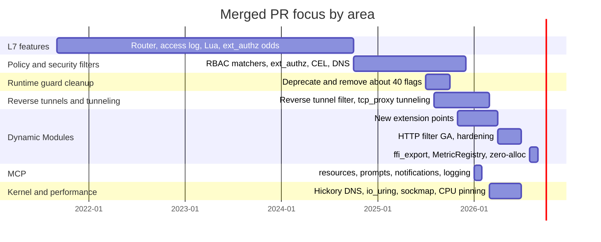
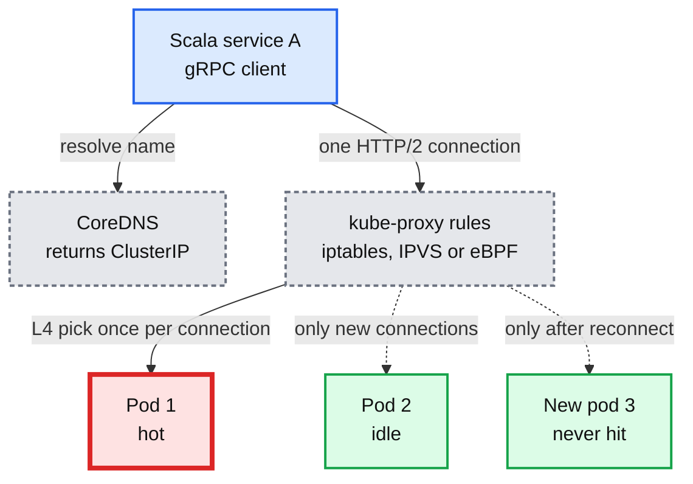
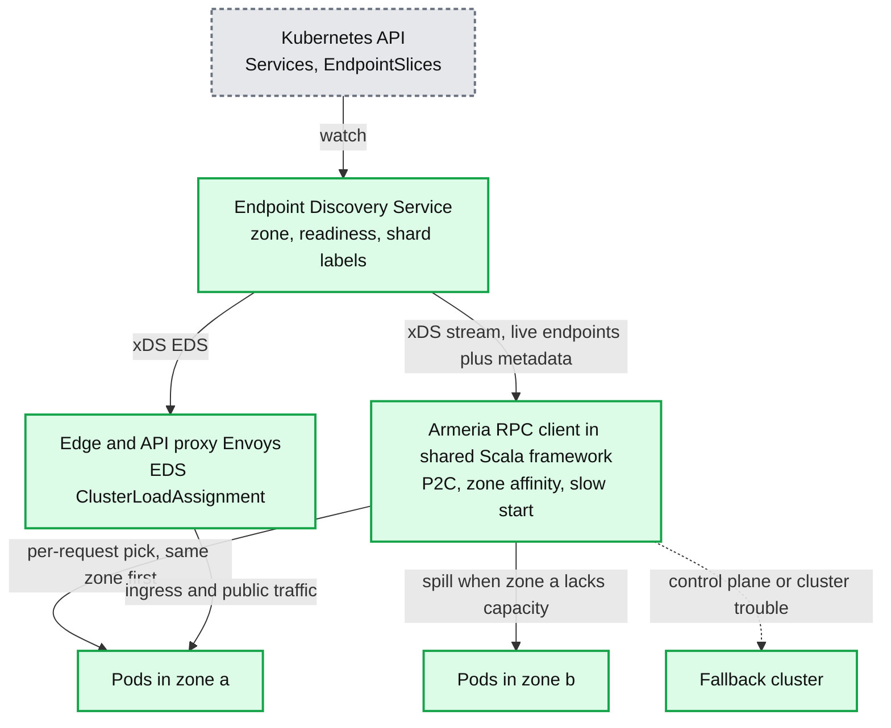
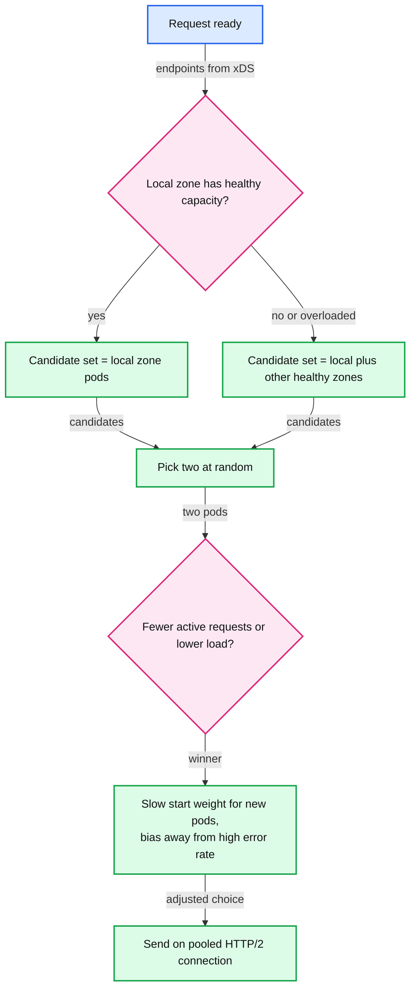
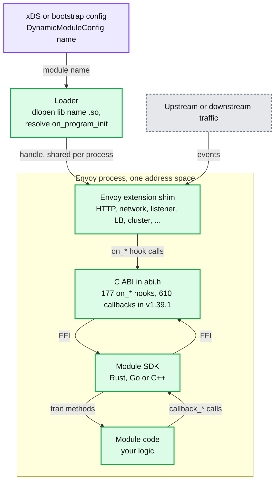
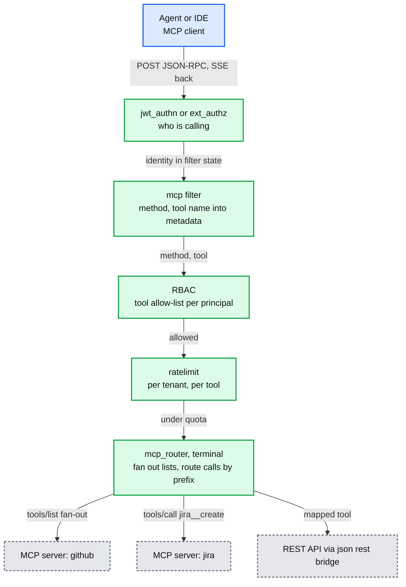
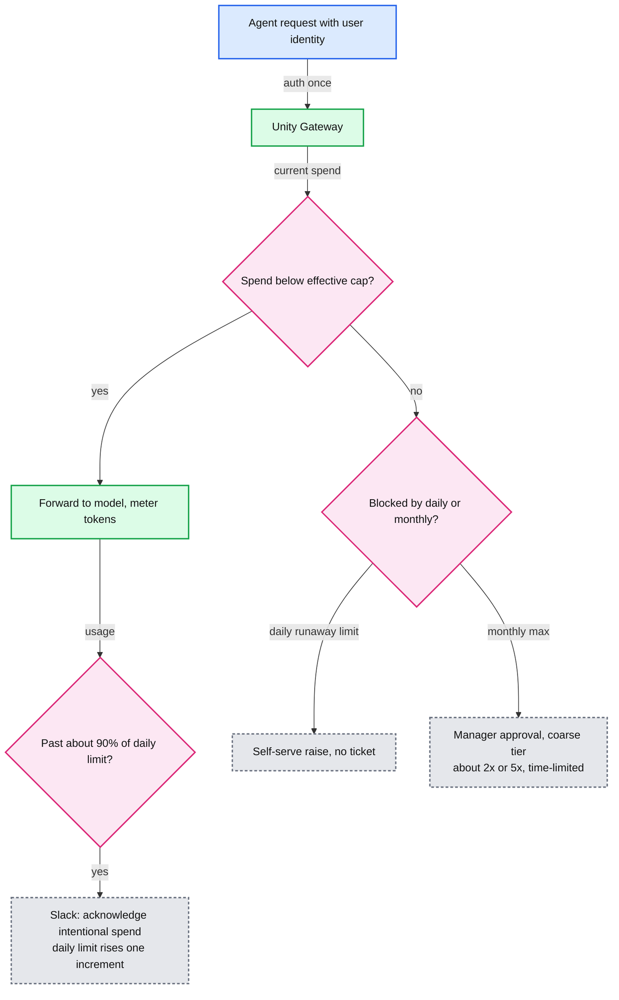

# Interviewer Prep: Rohit Agrawal (Envoy senior maintainer, Databricks Traffic Platform)

> **One-line answer:** Rohit owns more of modern Envoy than almost anyone you will meet: most Dynamic Modules extension points, the MCP router's method coverage, RBAC and ext_authz features, reverse tunnels, and Databricks' own client-side load balancing and AI gateway. Walk in able to explain each of their systems, hold a real opinion on extensibility, and avoid the claims in §9 that an Envoy maintainer will catch instantly.
>
> **How this was built:** every claim about Rohit comes from a primary source fetched on 2026-09-24: Envoy's `OWNERS.md` and `CODEOWNERS` at v1.39.1, the GitHub API (638 merged PRs by `agrawroh`), their Databricks blog posts, and the KubeCon schedules. Where the prep summary you were given disagreed with a primary source, §1.3 says so. Pronouns: this file uses "Rohit" or "they".

---

<!-- toc:start -->

<b>Sections (13)</b>

- [0. The 60-second version](#0-the-60-second-version)
- [1. Who you are talking to](#1-who-you-are-talking-to)
- [2. System 1: client-side load balancing at Databricks](#2-system-1-client-side-load-balancing-at-databricks)
- [3. System 2: Dynamic Modules](#3-system-2-dynamic-modules)
- [4. System 3: MCP in Envoy, and the spec that just changed under it](#4-system-3-mcp-in-envoy-and-the-spec-that-just-changed-under-it)
- [5. System 4: Unity AI Gateway (governance, budgets, smart routing)](#5-system-4-unity-ai-gateway-governance-budgets-smart-routing)
- [6. System 5: policy filters and the Envoy security team](#6-system-5-policy-filters-and-the-envoy-security-team)
- [7. Other things they built that you should recognize](#7-other-things-they-built-that-you-should-recognize)
- [8. The opinion to hold on extensibility](#8-the-opinion-to-hold-on-extensibility)
- [9. Landmines: things not to say](#9-landmines-things-not-to-say)
- [10. Question bank with strong answers](#10-question-bank-with-strong-answers)
- [11. Questions to ask Rohit](#11-questions-to-ask-rohit)
- [12. Study plan and numbers card](#12-study-plan-and-numbers-card)

<!-- toc:end -->

## 0. The 60-second version

- **They think in trade-offs they have already lived.** Their Databricks load-balancing post rejected headless services, Istio sidecars and Istio Ambient, and admitted the cost of their own choice (languages without the client library are left out). Mirror that: name what you refuse to build and what it costs.
- **Dynamic Modules is their current life.** 216 of their 638 merged Envoy PRs are titled `dynamic_modules`. They did not create it: Takeshi Yoneda (`mathetake`, now Netflix) did in Aug 2024. Rohit took it from an HTTP-filter feature to almost every extension point, then spent 2026 hardening the FFI seam.
- **Their public position is quotable.** From the KubeCon Japan 2026 abstract they co-wrote: "C++ filters mean maintaining a fork. WASM delivered sandbox overhead, limited extension points, and a stalling ecosystem." Have a view that engages with this rather than parroting or fighting it (§8).
- **MCP moved under their feet.** The MCP spec revision of 2026-07-28 removed sessions, `initialize`, `ping` and `logging/setLevel`, and added `Mcp-Method` / `Mcp-Name` headers for gateways. Rohit added the `logging/*` and `notifications/*` methods to `mcp_router` in Jan 2026. Knowing this is a strong signal (§4).
- **They are on the Envoy security team.** The 2026-08-26 release fixed 13 CVEs, two in RBAC path handling and two in ext_authz. Talk about published advisories only, never ask about embargoed work (§6).
- **Likely design question:** "Design an AI gateway for thousands of tenants." A full answer is in [`hld/ai-gateway/`](../../hld/ai-gateway/). It borrows their budget design (daily runaway limit plus monthly cap) and credits it.

---

## 1. Who you are talking to

### 1.1 Verified profile

| Fact | Evidence |
|---|---|
| Senior Maintainer of Envoy since **2026-06-29** | `OWNERS.md` line 29 at v1.39.1; OWNERS history shows "maintainer: move rohit to senior status (#45862)" on 2026-06-29 |
| Member of the **Envoy security team** | `OWNERS.md` line 101, under "# Envoy security team" |
| Sr. Staff Engineer, Traffic Platform, Databricks | Databricks blog author pages; KubeCon speaker bios describe "building and scaling the company's internal service mesh" |
| 638 merged PRs to envoyproxy/envoy, first on 2021-09-06 | GitHub search API, `author:agrawroh is:merged` |
| Code owner on 40 paths | `CODEOWNERS` at v1.39.1 (list in §1.2) |
| Talks | KubeCon EU 2026 EnvoyCon (2026-03-25): "The Next Generation of Envoy Extensibility: Dynamic Modules for Network, Listener, and HTTP Filters", plus the Envoy 10th-anniversary panel. KubeCon Japan 2026: "Beyond Wasm: How Dynamic Modules Let You Extend Envoy Proxy in Go, Rust, or Any Language", with Takeshi Yoneda |
| Blog posts | Databricks: "Intelligent Kubernetes Load Balancing at Databricks" (2025-10-01), "Governing coding agent sprawl with Unity AI Gateway" (2026-04-17), "How Databricks manages its own coding agent spend with Unity Gateway Budgets" (2026-07-28, first author), "Smart Routing in Unity Gateway" (2026-08-13) |

### 1.2 Where their code lives

- **Dynamic Modules (co-owner with @mattklein123, @mathetake, @wbpcode):** the core loader, HTTP, network, listener and UDP filters, bootstrap, clusters, load balancers, matchers, cert validator, transport sockets, upstream bridge, tracers, health checkers, access loggers, formatter, stats sinks.
- **MCP:** `mcp_router` (with @botengyao @yanavlasov @wdauchy), `a2a`, `clusters/mcp_multicluster`.
- **Traffic features:** reverse tunnels (bootstrap, network filter, cluster, upstream), `clusters/composite`, `filters/http/filter_chain`, `listener/set_filter_state`, network GeoIP, Hickory DNS resolver, sockmap socket interface, domain matcher, network matching inputs.
- **Contrib:** `postgres_inspector`, `postgres/protocol`, `reverse_tunnel_reporter`.
- **Repo-wide:** `/.github/` and `/ci/`, which is why their PR list also includes about 35 dependency bumps and about 40 runtime-guard removals.

### 1.3 Corrections to the prep summary you were given

| Summary said | Verified status |
|---|---|
| "Senior Maintainer, a title he got about two months ago" | Promoted 2026-06-29, about three months before 2026-09-24 |
| "Dynamic Modules ... He wrote much of this" | True for the breadth (216 PRs), false for the origin. Takeshi Yoneda started it in Aug 2024 (object loading, ABI header and compatibility check, Rust SDK scaffold, HTTP filter). Rohit's first DM PR is #42225 (2025-11-24). Their own abstract says "We built Dynamic Modules", meaning the maintainers together. Say "you and Takeshi", never "you created" |
| "Built the Rust SDK bindings, automatic ABI version checks" | Extended the Rust SDK for every new extension point and split `lib.rs` per extension (#43776). The version check has four generations: Takeshi's original strict check (2024); Rohit's #42846 (2026-01-05) computed the ABI hash at build time instead of a hand-kept `version.h`, still strict; Takeshi's #43219 (2026-02-07) replaced strict checking with a forward-compatibility guarantee and a warn-only `v0.1.0` string, which is what v1.39.1 runs; @wbpcode's #47435 (2026-09-14, `main`) froze released ABI. Credit Rohit with the build-time hash, not with today's policy |
| "Shared metric registry" | #47439, merged 2026-09-14. It is on `main`, **not** in v1.39.1 |
| "Exception barrier in the C++ SDK" | #47650, 2026-09-22, `main` only |
| "Worked on the MCP JSON-to-REST bridge filter" | Only two build and test fixes (#45739, #47275). That filter's owners are other people. Do not credit Rohit with it |
| "Talk at KubeCon Japan with Netflix" | Verified: KubeCon Japan 2026 with Takeshi Yoneda (Netflix). Also KubeCon EU 2026 EnvoyCon. The KubeCon Japan **2025** AI Gateway talk was Dan Sun and Takeshi Yoneda, not Rohit |
| "Argo project maintainer" | Not verified from a primary source here. Do not raise it |

---

## 2. System 1: client-side load balancing at Databricks

**One-line answer:** a small control plane watches Kubernetes Services and EndpointSlices, serves endpoints over xDS EDS, and every Scala service's Armeria-based RPC client picks a pod per request with Power of Two Choices and zone affinity, bypassing DNS and kube-proxy. The same control plane feeds Envoy at the edge. Source: [databricks.com/blog/intelligent-kubernetes-load-balancing-databricks](https://www.databricks.com/blog/intelligent-kubernetes-load-balancing-databricks) (2025-10-01, Gaurav Nanda, Vincent Cheng, Rohit Agrawal).

### 2.1 Before and after

- **Scale stated in the post:** "hundreds of stateless services communicating over gRPC within each Kubernetes cluster", and "thousands of Kubernetes clusters across multiple regions" in the future-work section.
- **The client subscribes during connection setup** to each service it depends on, keeps a dynamic endpoint list with zone and shard metadata, and never touches DNS on the request path.
- **One source of truth.** The control plane also implements EDS for Envoy, so ingress routing and internal routing see the same endpoints.

### 2.2 The per-request decision

What the post actually says, so you quote it right:

- **P2C** "randomly selecting two backend servers and then choosing the one with fewer active connections or lower load". It "has proven remarkably effective" for "the majority of services".
- **Zone affinity** minimizes cross-zone hops and cost, and "intelligently spills traffic over to other healthy zones" when a zone "lacks sufficient capacity or becomes overloaded". More advanced zone-aware routing "required careful tuning", promised for a follow-up post.
- **Cold starts were a new problem they created.** Before, new pods were rarely hit until connections recycled. After, new pods got traffic instantly. Fix: "slow-start ramp-up and biasing traffic away from pods with higher observed error rates", plus the need for "a dedicated warmup framework".
- **CPU-based routing was tried and dropped.** "Monitoring systems had different SLOs than serving workloads, and metrics like CPU were often trailing indicators." They "rely on more dependable signals such as server health".
- **Results:** server-side QPS evenly distributed, P90 variation across pods "dropped noticeably", "approximately a 20% reduction in pod count" across several services.
- **Admitted gap:** "Languages without the library, or traffic flows that still depend on infrastructure load balancers, remain outside the scope."
- **Takeaway they state:** "keeping it simple (and consistent) has worked best."

### 2.3 Why not the alternatives, in their words

| Alternative | Their reason to reject | The fair counterpoint to raise |
|---|---|---|
| Headless Services | No endpoint weights, clients cache DNS and hit stale pods, DNS carries no zone or shard metadata | None needed. This is the textbook answer and they are right |
| Istio sidecars | Operational complexity of thousands of sidecars and upgrades, per-pod CPU, memory and latency, harder to do request-aware routing with app context | They concede the main upside: "language-agnosticism". Their answer works because Databricks is "heavily Scala-based" with a monorepo and fast CI/CD |
| Istio Ambient | They already had proprietary cert distribution, routing patterns were fairly static, small infra team | Ambient moves L4 mTLS to a per-node Rust ztunnel and puts Envoy only where L7 is needed, which is cheaper than sidecars but still a full mesh to operate |

### 2.4 The Envoy mapping (they will expect you to know it)

| Their client feature | Envoy equivalent | Default in v1.39.1 |
|---|---|---|
| P2C | `least_request` with `choice_count` | 2, active request bias 1.0 ([report 04](envoy-04-cluster-manager-and-load-balancing.md)) |
| Zone affinity with spillover | zone-aware routing | `min_cluster_size` 6, `routing_enabled` 100% |
| Slow start | `slow_start_config` | linear ramp, `min_weight_percent` 10% |
| Bias away from errors | outlier detection, or client-side WRR with ORCA | consecutive 5xx 5, `max_ejection_percent` 10% ([report 05](envoy-05-resilience.md)) |
| Endpoint feed | EDS `ClusterLoadAssignment` | Envoy keeps the last accepted assignment if the control plane dies ([report 06](envoy-06-xds-control-plane.md)) |
| Covering languages without the library | proxyless gRPC with xDS, or a node-local or sidecar Envoy for those services only | [inferred] |

### 2.5 Questions they could ask about it, and strong answers

- **"Why does L4 balancing fail for gRPC?"** kube-proxy picks a backend once per TCP connection. gRPC multiplexes every request over one long-lived HTTP/2 connection, so the pick happens once and then all requests follow it. New pods get nothing until connections recycle. You need per-request (L7) decisions in the client or in a proxy.
- **"P2C on what signal?"** Local in-flight requests per endpoint. It is instant, needs no coordination and is exactly what the client can see. Server-reported load (ORCA) is better when clients are few and servers are shared, but it lags. CPU lags more, which is why Databricks dropped it.
- **"Why P2C and not least-loaded over all hosts?"** Picking the global minimum makes every client herd onto the same momentarily idle pod, because they all see the same stale view. Two random choices keep most of the balance benefit while avoiding the herd, at O(1) cost.
- **"What happens when the control plane is down?"** Clients keep their last endpoint list and keep balancing. New pods are invisible and deleted pods are hit until health signals eject them. The fallback cluster covers the worst case. The real deadline is how fast the fleet churns pods.
- **"How do you roll this out safely?"** Per service, behind a flag in the shared framework, compare per-pod QPS spread and P90 before and after, keep kube-proxy as the fallback path. That is also how they found the cold-start problem.

---

## 3. System 2: Dynamic Modules

**One-line answer:** a dynamic module is a shared library that Envoy loads with `dlopen` into its own process and talks to over a pure C ABI. The module implements event hooks (`envoy_dynamic_module_on_*`), Envoy implements callbacks (`envoy_dynamic_module_callback_*`), and SDKs in Rust, Go and C++ wrap the ABI. It gives near-native speed and every extension point, with no sandbox. Deep dive: [report 11](envoy-11-dynamic-modules.md).

### 3.1 The shape

Facts read from the v1.39.1 tree:

- `abi/abi.h` is **14,289 lines**, with **177** distinct `envoy_dynamic_module_on_*` hooks and **610** distinct `envoy_dynamic_module_callback_*` callbacks. [documented, `source/extensions/dynamic_modules/abi/abi.h`]
- The header says modules "have the same privilege level as the main Envoy program" and that "it [is] impossible to enforce any security boundaries between Envoy and the modules by nature". There is no sandbox, by design.
- The loader finds `lib<name>.so` under `ENVOY_DYNAMIC_MODULES_SEARCH_PATH` (current directory if unset). It first probes for a statically linked module via `dlsym(RTLD_DEFAULT, "<name>_envoy_dynamic_module_on_program_init")`, so a module can also be linked into the Envoy binary. [documented, `dynamic_modules.cc:94-112`]
- **The ABI version check is a warning, not a gate.** `on_program_init` returns the module's ABI version string. On mismatch Envoy logs "Dynamic module ABI version {} is deprecated. Please recompile..." and loads the module anyway. [documented, `dynamic_modules.cc:75-91`] The real guard is symbol resolution: a missing hook or callback fails at load time. Also: re-copying a new `.so` over the old path does not reload it, because the loader first calls `dlopen(..., RTLD_NOLOAD)` and reuses the resident object without re-running init ([dynamic_modules.cc:36-46](https://github.com/envoyproxy/envoy/blob/v1.39.1/source/extensions/dynamic_modules/dynamic_modules.cc#L36-L46)). A failed remote fetch fails open: the filter is simply not installed ([report 11](envoy-11-dynamic-modules.md)). Both matter for "how do you roll out a module".
- **Compatibility promise in v1.39.1:** "a dynamic module built with the SDK for Envoy version X.Y will work with Envoy versions X.Y and X.(Y+1)". **On `main` since 2026-09-14** (#47435, by @wbpcode): "Released ABI is frozen". The ABI grows by addition with `_v2` names, and the version string "is not a compatibility gate". Know both, and say which one you are quoting.
- **Status:** the HTTP filter kind is stable (promoted by Rohit, #44420, 2026-04-13), but its security posture requires trusted peers. The other dynamic module kinds are alpha. [documented, `extensions_metadata.yaml`, [report 10](envoy-10-version-delta.md)]

### 3.2 What Rohit added, in order

| When | Extension points and features | Example PRs |
|---|---|---|
| 2025-11 to 2025-12 | Streamable HTTP callouts, clusters, network filters (including terminal), listener filters, per-route disable | #42225, #42391, #42605, #42751, #42736 |
| 2026-01 | UDP listener filters, build-time ABI hash (later relaxed by #43219), access loggers, bootstrap, LB, metrics ABI everywhere, schedulers, HTTP callouts, tracing in HTTP filters, watermark callbacks | #42820, #42846, #42882, #42903, #43097 |
| 2026-02 to 2026-03 | Process-wide function registry and shared data registry (#43964; the #43363 handle API is not in v1.39.1's header), bootstrap lifecycle (init manager, drain, admin endpoints), matcher, cert validator, upstream HTTP-TCP bridge, LB retry awareness and async host selection, custom cluster host management, tracer, DNS resolver, transport socket | #43964, #43377, #43408, #43420, #43703, #43775, #43859, #44024, #44099, #44132 |
| 2026-04 | **HTTP filter to GA**, fail-fast `set_factory_once`, teardown and lifetime hardening | #44420, #44472, #44524 |
| 2026-05 | **Security hardening:** StatNamePool data race, TOCTOU use-after-free in scheduler `commit()`, release-mode thread guards replacing debug `ASSERT`s, `catch_unwind` on every Rust FFI entry, `from_utf8_unchecked` and bare `from_raw_parts` UB removed | #44840, #44841, #44843, #44846, #44850 |
| 2026-06 | Stats sink, formatter, transport socket kinds; borrowed and batched getters; re-entrancy fix for the streaming-response ABI | #45474, #45494, #45493, #45451, #45707 |
| 2026-08 to 2026-09 (`main` only) | Cluster specifier, xDS config validator, `ffi_export` macro across all kinds, shared `MetricRegistry`, allocation removal, fail-closed on a null in-module filter, C++ SDK exception barrier | #46925, #47397, #47410, #47439, #47508, #47650 |

### 3.3 Why the hardening PRs exist (be able to explain each)

- **`catch_unwind` at every entry (#44846).** A Rust panic must not unwind into C++ frames. Since Rust 1.81, a panic that tries to unwind out of an `extern "C"` function aborts the process. So without `catch_unwind` a panic in one request kills the whole Envoy. With it, the SDK turns the panic into an error return. One hole remained in v1.39.1: a panic inside `new_http_filter` leaves a null filter pointer that later hooks dereference, which crashes Envoy. #47508 (2026-09-18, `main`) fails that request closed instead. `catch_unwind` does not help if the module is built with `panic = "abort"`.
- **`from_raw_parts` and `from_utf8_unchecked` (#44850).** `slice::from_raw_parts` is undefined behaviour if the pointer is null, even with length 0, so a C caller passing `(NULL, 0)` needs special handling. `from_utf8_unchecked` is UB on invalid UTF-8, and HTTP header values are bytes, not guaranteed UTF-8 (obs-text is legal, which is exactly what CVE-2026-73552 in RBAC was about).
- **TOCTOU use-after-free in the scheduler (#44841).** A module thread can post work back to a worker through a scheduler object. If the filter is destroyed between the "is it alive" check and the post, the posted closure touches freed memory. The fix is to hold ownership across the check and the post.
- **Release-mode thread guards (#44843).** Debug `ASSERT`s vanish in release builds, where the real bugs happen. Calling a worker-only callback from the wrong thread is now caught in production builds.
- **Re-entrancy (#45707; #47549 is the same class of fix in core listener filter iteration, on `main`).** A callback that synchronously calls back into the module while the module is still inside a hook can corrupt module state. The fix is to stop the ABI from re-entering the module.
- **Allocation work (Sept 2026).** Every header getter that allocated a vector and a string per call adds up at 100k requests per second. Borrowed getters return pointers into Envoy's buffers valid for the hook's duration, and batch getters cross the boundary once.

### 3.4 Rust across a C ABI: the 10 facts to have ready

1. `#[repr(C)]` gives a struct C layout. `#[repr(transparent)]` guarantees a newtype has exactly its inner field's layout, so it can cross FFI (#43798).
2. Opaque pointers carry ownership: `Box::into_raw` hands a module object to Envoy, and the matching destroy hook calls `Box::from_raw` exactly once.
3. Borrowed data from Envoy is valid only during the hook call. Keeping it longer is a use-after-free. Copy it if you need it later.
4. Panics must not cross `extern "C"`. Use `catch_unwind` and `AssertUnwindSafe`. Since Rust 1.81, unwinding out of `extern "C"` aborts.
5. `slice::from_raw_parts(ptr, len)` requires `ptr` non-null and aligned even when `len` is 0.
6. `str::from_utf8_unchecked` on non-UTF-8 bytes is UB. Treat HTTP data as `&[u8]`.
7. Per-stream filter objects live on one worker thread, but config objects are shared by all workers, so they must be `Send + Sync`.
8. A module that spawns its own threads must hop back to the worker (the scheduler API) before calling worker-only callbacks.
9. `extern "C"` function pointers resolved with `dlsym` are unchecked. A signature mismatch is silent UB, which is why a frozen ABI and generated bindings matter.
10. Blocking inside a hook blocks every connection on that worker. Use callouts or background threads plus the scheduler.

---

## 4. System 3: MCP in Envoy, and the spec that just changed under it

**One-line answer:** Envoy's `mcp` filter parses MCP JSON-RPC and publishes the method, tool and ids as metadata so RBAC, ext_authz and rate limits can act per tool. `mcp_router` is a terminal filter that aggregates many backend MCP servers behind one endpoint, fanning out list calls and routing calls by tool prefix. Rohit owns `mcp_router` and added the resources, prompts, notifications, completion and logging methods in Jan 2026. Deep dive: [report 12](envoy-12-mcp-and-ai-gateway.md).

### 4.1 What changed in MCP 2026-07-28 (verified on the spec's changelog)

| Change | Why it matters to a gateway like `mcp_router` |
|---|---|
| No protocol-level sessions, no `Mcp-Session-Id` (SEP-2567) | The router no longer has to map one client session to N backend sessions, or pin a client to a backend. "Any request can now land on any server instance behind a plain round-robin load balancer." |
| No `initialize` / `initialized` handshake. Version and capabilities travel in `_meta` on every request (SEP-2575). New mandatory `server/discover` | Fan-out of `initialize` at connect time goes away. Capability discovery becomes a cacheable call |
| `ping` and `logging/setLevel` removed. Log level is per request in `_meta` | Two of the method families Rohit added in Jan 2026 (logging, and part of notifications) changed shape. A strong question to ask, not a gotcha to spring |
| GET stream and `resources/subscribe` replaced by `subscriptions/listen`, one long-lived POST response stream | A router must now merge one listen stream per backend into one client stream, tagged with a subscription id |
| Multi Round-Trip Requests replace server-initiated `sampling`, `elicitation`, `roots/list`. Results carry `resultType` | No held-open bidirectional streams. The router passes `input_required` results through and routes the retry to the same backend by tool |
| SSE resumability (`Last-Event-ID`) removed | A broken stream loses the request. Clients re-issue. Idempotency of tools becomes the client's and server's problem |
| `Mcp-Method` and `Mcp-Name` headers required on POST (SEP-2243) | Route, authorize and rate limit on headers without parsing JSON. The gateway must still check that the headers match the body, or a client can lie in the header |
| List results carry `ttlMs` and `cacheScope` (SEP-2549) | A fan-out router can cache the merged `tools/list` instead of fanning out on every call |

### 4.2 What the v1.39.1 code actually does (verified), and how to raise it

| Fact in the code | Where | How to raise it (as a question, not a gotcha) |
|---|---|---|
| A fan-out (`initialize`, every `*/list`) completes only when **all** backends answer, `if (++(*count) >= expected_count)`. The per-backend timeout defaults to **5000 ms** | `mcp_router.cc:718-726`, `filter_config.cc:67` | "With 20 backends, list latency is the slowest backend's. Did you consider returning partial results, or leaning on `ttlMs` caching now that the spec has it?" |
| The router's composite session id is plain base64. The TODO says "Add encryption for session IDs to prevent tampering". HMAC is open PR #46581 | `mcp_router/session_codec.cc:14-15` | "Does the stateless spec make session-id integrity moot, or do you still need it for older clients?" |
| `initialize` answers with a fixed capability block and protocol `2025-06-18`. Backend capabilities are not merged | `mcp_router.cc:31`, `mcp_router.cc:1628` | "How do you plan to negotiate versions per backend once clients send `2026-07-28` in `_meta`?" |
| Known protocol versions stop at `2025-11-25`, with `2025-03-26` as the fallback. Nothing in v1.39.1 understands `2026-07-28` | `filters/common/mcp/constants.h:37-41` | Only mention it if they bring up the new spec |

Report 12 lists more code-reading findings ([report 12](envoy-12-mcp-and-ai-gateway.md), marked [inferred] there): no size cap on buffered backend responses, and `tools/call` SSE streams passed through unparsed, so server-initiated requests inside them cannot be re-routed. Hold these back unless the conversation goes deep. Pointing out bugs in someone's own filter lands well only when it comes as curiosity.

Envoy status: v1.39.1's MCP filters are alpha or work-in-progress and implement the earlier session-based protocol. On `main`, header-based extraction and validation was merged on 2026-09-02 (#46817, opened 2026-08-19), and protocol-version enforcement, header validation and `server/discover` for the JSON-REST bridge are in open PRs (#47280, #47490, #47619). Say "landing on main", not "Envoy supports".

---

## 5. System 4: Unity AI Gateway (governance, budgets, smart routing)

**One-line answer:** every coding agent at Databricks (Claude Code, Codex, Cursor and others) routes through one gateway. It enforces one identity, one MCP policy and one spend policy across all tools, and logs every call to Unity Catalog through OpenTelemetry.

### 5.1 The budget design (Rohit is first author)

- **Two budgets for two kinds of waste.** A small daily limit catches runaway loops (short-term waste). A high monthly limit catches expensive habits (long-term waste). "No single number can do both jobs."
- **The formula:** a user is capped at the minimum of (month-to-date usage plus one runaway increment) and (monthly maximum). When blocked, the formula says which case applies.
- **Self-serve by design.** At about 90% of the daily limit a Slack message offers a one-click raise by one increment, with no cap on acknowledgements per day. "An unattended cron job cannot click a Slack button."
- **Tiers as group membership** in the gateway, so "a group listing answers who is above the default and by how much". Daily tiers reset each month. Monthly tiers are roughly 2x and 5x up to effectively unlimited, need a manager, and expire with the project.
- **Old system pain:** a single monthly limit (illustrative $500), "somewhere between 500 and 1,000 engineers were hitting the limit every month". The post says its dollar figures are illustrative.
- Source: [databricks.com/blog/how-databricks-manages-its-own-coding-agent-spend-unity-ai-gateway-budgets](https://www.databricks.com/blog/how-databricks-manages-its-own-coding-agent-spend-unity-ai-gateway-budgets) (2026-07-28).

### 5.2 Governance and routing

- **Governance post (2026-04-17):** three pillars. Centralized security and audit, with MCP servers managed in Databricks and MLflow tracing. A single bill and cost limits through the Foundation Model API, plus bring-your-own capacity. Observability through OpenTelemetry ingestion into Unity Catalog Delta tables. Quote: MCP tools make it "easy to accidentally make them the most privileged developer in your organization."
- **Smart Routing post (2026-08-13):** they chose **task-aware** routing over per-request routing because "at scale, costs are dominated by cache hit rate". Switching models mid-session throws away the prompt cache. A small, fast classifier labels the task. The router defaults to a medium model and escalates or delegates. Savings: 35% on an internal benchmark, 56% on public coding benchmarks. Next: route after a few turns, and switch at context compaction where a cache miss happens anyway.
- **The system design connection:** in [`hld/ai-gateway/`](../../hld/ai-gateway/), budgets and token rate limits are the hard part, because output tokens are known only at the end of a stream. Be ready to explain pre-charging an estimate, reserving, and reconciling, plus the overshoot bound.

---

## 6. System 5: policy filters and the Envoy security team

### 6.1 Their policy work you should know

| Area | What they built | Why it matters |
|---|---|---|
| RBAC matchers | `FilterStateInput` allowed in the xDS matcher for HTTP and network RBAC (#39462, #39467), CEL input (#31656), route metadata matching (#36957), `NetworkNamespaceInput` (#41145, #41199, #41200), xDS matcher marked stable (#41999) | Policy can key on anything an earlier filter wrote into filter state, for example an identity extracted by ext_authz or a tenant id |
| RBAC IP matching | LC-trie IP range matcher replacing linear scans (#40493, #40536), renamed `IpRangeMatcher` (#40505), guard for non-IP addresses (#40631) | An LC-trie is a level-compressed binary trie. It turns "which of 50,000 CIDRs contains this IP" into a few memory lookups instead of O(n) comparisons |
| ext_authz | per-route `grpc_service` (#40169, #40843), per-route body buffering (#30571), retry policy (#41345, #42138), custom `error_response` (#42099), TLS alert on denial for the network filter (#41473), network shadow mode (#47342, `main`) | Per-route authz backends mean one Envoy can send each tenant or route to a different policy service |
| tcp_proxy tunneling | request ID for tunnels (#40815, #41391), TLVs from dynamic metadata (#41294), `upstream_connect_mode` plus `max_early_data_bytes` (#41696, titled "upstream_connect_trigger"), a connection leak fix (#42024) | TCP over HTTP CONNECT is how meshes and reverse tunnels carry raw TCP |
| Dynamic forward proxy | honour the `dynamic_host` filter state (#39605), IPv6 literals (#40347), a cap on DNS failure back-off (#44542) | Egress proxies |
| Postgres | contrib `postgres_inspector` listener filter (#40803) | Route Postgres by startup message and SSL request before TLS |
| Lua | streamInfo, filterState, typed metadata, upstream host override, drain on completion | Long-running ownership. They know where Lua stops being enough, which is part of why DMs exist |

Details: [report 13](envoy-13-newer-traffic-features.md) and [report 07](envoy-07-security.md).

### 6.2 The 2026-08-26 security release (published advisories only)

| CVE | Area | Summary from the advisory |
|---|---|---|
| CVE-2026-73553 (high) | RBAC | Path parameter canonicalization bypasses path-based security rules |
| CVE-2026-73552 (high) | RBAC `safe_regex` | Can fail open on RFC-valid obs-text header values |
| CVE-2026-73551, CVE-2026-73511 (medium) | URL normalization | Dot segments with parameters; path matching bypass with backends that strip matrix parameters (for example Tomcat) |
| CVE-2026-73547, CVE-2026-50572 | ext_authz | Null dereference of `:path`; a raw HTTP client segfault |
| CVE-2026-73548 (high) | HTTP upgrades | Cross-user response poisoning via a non-WebSocket upgrade on a shared upstream pool |
| CVE-2026-73550 (high) | HTTP/2 | Discarded Host header copy leading to OOM |
| CVE-2026-73513 (high) | oghttp2 | Upstream trailers handled incorrectly |
| CVE-2026-73512 (high), CVE-2026-48521, CVE-2026-73549 | QUIC and HTTP/3 | Use-after-free on internal redirects; null deref in pool selection; scoped IPv6 in ORIGINAL_DST |
| CVE-2026-73546 (high) | Admin | Stored XSS in `/stats?format=html` |

- **The pattern worth naming:** four of the 13 are path or header interpretation mismatches between Envoy's policy filters and what a backend actually does. That is the "security filters must see the same path the backend sees" lesson from [report 07](envoy-07-security.md).
- **Etiquette:** discuss only published advisories. Never ask about unreleased or embargoed issues. If you mention CVE-2026-73552, connect it to the Rust point in §3.3: header values are bytes, not UTF-8.

---

## 7. Other things they built that you should recognize

- **Reverse tunnels** (network filter, bootstrap extension, cluster, upstream; #41013 onward). A data plane behind NAT dials out to a responder Envoy, which pools those connections and uses them as upstream connections. That lets a SaaS control plane reach services in customer networks without inbound ports. [inferred: a natural fit for Databricks' classic compute in customer accounts]
- **Composite cluster with retries across sub-clusters** (#42618), different from the aggregate cluster's priority failover.
- **Hickory DNS resolver** (#44090), a Rust DNS resolver beside c-ares. It is itself built as a statically linked dynamic module and loaded through the DNS-resolver ABI (`hickory_dns_impl.cc:48-68` resolves `envoy_dynamic_module_on_dns_resolver_config_new`), which is the only user of that ABI in v1.39.1. It later got use-after-free and cancel-leak fixes (#45105). A neat bridge between two of their projects.
- **Kernel and CPU work:** pinning workers to CPUs (#45722), a CPU-locality connection balancer (#45734), a sockmap socket interface for same-host eBPF acceleration of sidecar-to-app traffic (#45724), io_uring multishot reads and write back-pressure (#44188), and tcmalloc's native release APIs (#43585).
- **Defaults they changed in 2026:** `coalesce_lb_rebuilds_on_batch_update` turned off by default (#45266, backported to 1.38), and brotli certificate compression disabled by default (#45618, backported). Ask why, it signals you read changelogs.
- **TLS and QUIC:** JA4 fingerprints in `tls_inspector` (#39430), SNI during the early select-certificate callback (#42871), a shared parsed CRL across TLS contexts (#46021), QUIC client-certificate authentication (#47076 and follow-ups, `main`).
- Details and mechanisms: [report 13](envoy-13-newer-traffic-features.md).

---

## 8. The opinion to hold on extensibility

**Their stated view (KubeCon Japan 2026 abstract):** "C++ filters mean maintaining a fork. WASM delivered sandbox overhead, limited extension points, and a stalling ecosystem... Near-native performance, no sandbox, no rebuild. Both companies are replacing C++ forks and Wasm with native Rust, cutting tail latency and memory use while shipping features faster."

**A position that agrees on the core and adds judgment:**

| Mechanism | Latency cost | Isolation | Language | Best for | Why not for everything |
|---|---|---|---|---|---|
| Native C++ extension | none | none | C++ | upstreamable, broadly useful features | a private one means a fork and a rebuild of Envoy for every change |
| Dynamic module | an FFI call, near native | none, same address space | Rust, Go, C++ | platform-team logic on the hot path: auth, routing, LB, token accounting | a bug can crash or corrupt the whole proxy. The trust boundary is your CI and code review |
| Wasm (proxy-wasm) | copies across the VM boundary, a VM per worker | memory-isolated sandbox | many | untrusted or third-party code, or per-tenant plugins | alpha in v1.39.1, limited extension points, per-worker memory, a thinner ecosystem |
| Lua | interpreter, small | none | Lua | small header tweaks | no ecosystem, hard to test, not for heavy logic |
| ext_proc | a gRPC stream per HTTP stream, a network round trip per phase | a separate process | any | heavy or independently deployed logic, async observability | adds a hop and a new failure mode to every request |
| ext_authz | one RPC per request | a separate process | any | allow or deny decisions owned by another team | only decides, cannot transform bodies freely |

The one-paragraph version to say out loud: *"For code my platform team owns and tests, I agree with the dynamic modules bet. You get native speed and every extension point, and Rust plus a frozen C ABI buys most of the safety that Wasm's sandbox was paying for. The cost is blast radius: a module bug is an Envoy crash. So I would ship modules like the binary itself: built in the same pipeline, canaried, and rolled back as a unit, with `catch_unwind` and fail-closed as defaults. For code I do not trust, like tenant plugins, I would still use a sandbox (Wasm) or a process boundary (ext_proc), because 'same address space' is only acceptable when you control what is in it."*

---

## 9. Landmines: things not to say

| If you say | Why it fails | Say instead | Evidence |
|---|---|---|---|
| "You created Dynamic Modules" | Takeshi Yoneda started it (Aug 2024) | "You and Takeshi took it to almost every extension point" | PR history |
| "You built the MCP JSON-REST bridge" | Two build and test fixes only | "You own mcp_router and added five method families" | CODEOWNERS:252-254 |
| "Dynamic modules are sandboxed" | Same address space, no boundary, by design | "They trade isolation for speed and reach" | abi.h header comment |
| "The ABI version check rejects mismatched modules" | It logs a warning and loads | "Symbol resolution is the gate. On main the ABI is frozen and grows by `_v2`" | dynamic_modules.cc:75-91, #47435 |
| "The ABI version is a hash of the header" | It was, briefly (#42846). Since #43219 it is the static string `v0.1.0`, warn-only. The proto comment saying "hash" is stale | "It is a warn-only string. Symbols are the gate" | abi.h:47, report 11 |
| "Copy a new `.so` over the old one to upgrade a module" | `RTLD_NOLOAD` reuses the resident object and skips init | "Modules roll with a new Envoy process or a new module name" | dynamic_modules.cc:36-46 |
| "If a remote module fails to download, the config is rejected" | The filter is simply not installed (fail open), which is dangerous for an auth module | "Treat remote fetch as a deploy step and alert on load failures" | report 11 |
| "A module LB gets priority load and panic handling for free" | The module returns (priority, index into healthy hosts). Envoy applies no priority load, overprovisioning or panic for it | | load_balancer.cc:38-69 |
| "Wasm is the recommended way to extend Envoy" | The Wasm filter and runtimes are alpha. The DM HTTP filter is stable | "Wasm is alpha. DM HTTP is GA since 1.38" | extensions_metadata.yaml |
| "kube-proxy load balances each gRPC request" | Once per connection, L4 | "L4 picks per connection, gRPC reuses one connection" | Databricks post |
| "Least-loaded across all hosts is best" | It herds on stale views | "P2C: nearly as good, no herd, O(1)" | [report 04](envoy-04-cluster-manager-and-load-balancing.md) |
| "Balance on CPU" | Databricks tried it, CPU lags | "Use in-flight requests, errors, or ORCA" | Databricks post |
| "Istio would have solved it" | They evaluated sidecars and Ambient and said why not | "Sidecars win on language coverage. Your Scala monorepo made a library cheaper" | Databricks post |
| "A NACK means nothing was applied" | CDS and LDS apply valid resources, then NACK the whole response | "NACK is per response, apply is per resource" | cds_api_helper.cc:38-75 |
| "An ACK means the config is applied" | Spec: valid and intended to apply | "ACK means valid in isolation" | xds_protocol.rst:436-450 |
| "The xDS stream is rate limited by default" | Only with `rate_limit_settings` | | utility.cc:212 |
| "MCP uses Mcp-Session-Id and initialize" | Removed in the 2026-07-28 revision | "Since 2026-07-28 MCP is stateless with Mcp-Method and Mcp-Name headers" | MCP changelog |
| "MCP uses the HTTP+SSE transport" | Replaced by Streamable HTTP in the 2025-03-26 revision, and SSE resumability was removed in 2026-07-28 | | MCP changelog |
| "Envoy fully supports the new MCP spec" | Landing on main, v1.39.1 is pre-stateless | "Header extraction landed on main in early September" | #46817 (merged 2026-09-02) |
| "HTTP/2 window is 256 MiB, streams unlimited" | 16 MiB, 24 MiB, 1024 since 1.36 | | protocol.proto |
| "Envoy parses HTTP/1 with http-parser" | Balsa since 1.28 | | codec_impl.cc:537 |
| "RFC1918 addresses are internal by default" | Not since 1.33, and Rohit removed the legacy guard (#40398) | "Set `internal_address_config` explicitly" | conn_manager_config.h:197 |
| "`--concurrency` follows the container CPU limit" | Host threads unless `--cpuset-threads` | | options_impl.cc:271-281 |
| "Hot restart moves connections" | Moves listen sockets only | | hot_restart.rst |
| "Circuit breakers are per worker" | Per cluster, shared atomics, can overshoot | | resource_manager_impl.h |
| "`max_retries: 3` means 3 retries per request" | A cluster breaker on concurrent retries. Per-request default is 1 | | circuit_breaker.proto |
| "With max_ejection_percent 10%, a 5-host cluster can eject one host" | Fewer than 10 hosts ejects nothing unless `always_eject_one_host` | | [report 05](envoy-05-resilience.md) |
| "Hedging sends N parallel requests" | Only `hedge_on_per_try_timeout` is implemented | | route_components.proto:1815 |
| "Local rate limit is per worker" | One shared lock-free bucket per filter config | | [report 05](envoy-05-resilience.md) |
| "Upstream TLS verifies certificates by default" | Not until `trusted_ca` is set, and upstream max is TLS 1.2 | | [report 07](envoy-07-security.md) |
| "RBAC `principal_name` proves mTLS" | Use `MTlsAuthenticated` | | rbac.proto:340 |
| "Envoy AI Gateway" as the current name | Renamed Agent Router, now in the Agentic AI Foundation, v1.1.0 on 2026-08-21 | | GitHub |
| "ztunnel is Envoy" | It is Rust | | Istio docs |
| Asking about unreleased security fixes | Security team members cannot discuss embargoes | Discuss published advisories only | |

---

## 10. Question bank with strong answers

1. **"Walk me through a request in Envoy."** Kernel picks a worker via `reuse_port`. Listener filters (tls_inspector) read SNI and ALPN. The filter chain is matched. The TLS transport socket decrypts. The HCM codec turns bytes into streams. Decoder filters run in order. The router picks a cluster, the thread-local LB picks a host, the per-worker pool gives a connection. The response runs the encoder filters in reverse. At stream end come stats, the access log and trace spans. [overview §4](envoy-00-overview.md)
2. **"Main thread vs workers, and why?"** The main thread does xDS, health checks, outlier timers, stats flush and admin. Workers own connections for life and read immutable config snapshots posted through thread-local slots, lock-free. The cost: per-worker pools and a single main thread that processes every config update. [report 01](envoy-01-threading-and-process-model.md)
3. **"SotW vs delta xDS?"** SotW resends the full set for wildcard types (LDS, CDS), so O(total) per change. Delta sends only changes plus removals and resumes with `initial_resource_versions`. ADS puts all types on one stream so one Envoy can get make-before-break ordering. [report 06](envoy-06-xds-control-plane.md)
4. **"How would you balance gRPC in Kubernetes?"** §2 of this file, then the Envoy mapping in §2.4.
5. **"Least request vs round robin?"** With equal weights, least request is P2C on in-flight requests and adapts to slow hosts. Round robin ignores load. With unequal weights, Envoy's least request uses EDF with weight / (active + 1)^bias. [report 04](envoy-04-cluster-manager-and-load-balancing.md)
6. **"Outlier detection vs health checks vs circuit breakers?"** Passive, from real results, per host. Active probes, per host. Concurrency caps, per cluster. Retry budgets cap amplification as a percentage of load. [report 05](envoy-05-resilience.md)
7. **"Lua vs Wasm vs ext_proc vs dynamic modules?"** §8.
8. **"How would you make a module crash not take down Envoy?"** You cannot fully, in process. Reduce the probability (Rust, `catch_unwind`, fail closed, thread guards, fuzzing, canaries). Reduce blast radius (roll modules like binaries, per-route enablement, a kill switch through runtime or ECDS). For untrusted code, move out of process.
9. **"How do you version a C ABI?"** Freeze released symbols. Add, never mutate (`_v2`). Resolve symbols at load time. Keep the ownership, lifetime and threading rules in the header, because they are part of the ABI too. That is exactly main's new policy.
10. **"Design an MCP gateway for thousands of tenants."** Identity at the edge, the `mcp` filter for attributes (or headers under 2026-07-28), per-tool RBAC keyed on filter state, per-tenant and per-tool rate limits, `mcp_router` for aggregation, a cached `tools/list` using `ttlMs`, no token passthrough, and a registry in the control plane. [report 12](envoy-12-mcp-and-ai-gateway.md), [`hld/ai-gateway/`](../../hld/ai-gateway/)
11. **"How do you rate limit tokens when output is only known at the end of the stream?"** Reserve an estimate at request time (prompt tokens plus `max_tokens` or a model-typical output), stream, read usage from the final event (OpenAI with `stream_options.include_usage`, Anthropic `message_delta`), reconcile the difference, and accept a bounded overshoot of in-flight requests per key.
12. **"mTLS and identity in a mesh?"** SPIFFE IDs in URI SANs, certificates delivered and rotated by SDS without restart, `require_client_certificate`, match on SANs, and RBAC on authenticated principals. [report 07](envoy-07-security.md)
13. **"Sidecar vs sidecarless?"** Sidecar: two extra proxies per call, per-pod memory (Istio 1.24: about 0.20 vCPU and 60 MB at 1,000 RPS), language-agnostic. Ambient: a per-node L4 ztunnel (about 0.06 vCPU, 12 MB) plus Envoy waypoints only where L7 is needed. Proxyless: no hop, library per language.
14. **"What would you change about Envoy?"** A safe answer with substance: the main thread as a single config-processing bottleneck at large CDS scale, and the lack of a sandboxed in-process option that is not alpha. Frame it as trade-offs, not complaints.

---

## 11. Questions to ask Rohit

1. Main just froze the dynamic modules ABI with `_v2` growth. How do you keep a 14,000-line header from becoming permanent debt? Is there a deprecation path, or does it only grow?
2. Is there appetite for an isolation option for modules (a subprocess or a separate address space), or is the bet fully on Rust plus hardening?
3. How do Databricks and Netflix ship modules to a fleet: baked into the image, or fetched remotely? How do you roll back a bad module in minutes?
4. With MCP 2026-07-28 removing sessions and adding `Mcp-Method` / `Mcp-Name`, how much of `mcp_router`'s session mapping goes away, and how do you plan to handle `subscriptions/listen` fan-in?
5. Your load-balancing post said zone-aware routing "required careful tuning". What went wrong in the first version?
6. You turned `coalesce_lb_rebuilds_on_batch_update` off by default and backported it. What was the failure mode?
7. Where do reverse tunnels fit at Databricks, and why build them in Envoy rather than a dedicated tunnel service?
8. For the Unity Gateway budgets, where is the spend counter enforced on the hot path, and how much overshoot do you accept on streaming requests?

---

## 12. Study plan and numbers card

**Order, if you have a day:** this file, then [report 11](envoy-11-dynamic-modules.md) (Dynamic Modules), [report 12](envoy-12-mcp-and-ai-gateway.md) (MCP), [report 04](envoy-04-cluster-manager-and-load-balancing.md) and [report 05](envoy-05-resilience.md) (LB and resilience), [report 06](envoy-06-xds-control-plane.md) (xDS), [`hld/ai-gateway/`](../../hld/ai-gateway/), then [report 13](envoy-13-newer-traffic-features.md) and [report 07](envoy-07-security.md). **If you have two hours:** §0, §2, §3, §8, §9 and §10 of this file.

| Number | Value |
|---|---|
| Rohit's merged Envoy PRs | 638, of which 216 are titled `dynamic_modules` |
| DM ABI in v1.39.1 | 14,289-line `abi.h`, 177 hooks, 610 callbacks |
| DM compatibility (v1.39.1) | X.Y module works on X.Y and X.(Y+1). On `main`: frozen ABI, `_v2` additions |
| Databricks LB result | about 20% fewer pods, P90 variation down, even QPS |
| MCP current spec | 2026-07-28, stateless, `Mcp-Method` / `Mcp-Name` |
| Budget cap | min(month-to-date + one increment, monthly max), self-serve at about 90% of daily |
| Smart routing savings | 35% internal benchmark, 56% public benchmarks |
| Aug 2026 security release | 13 CVEs across 1.36 to 1.39 |
| Envoy defaults | connect 5 s, route timeout 15 s, stream idle 5 min, retries 1 per request, back-off 25 to 250 ms, breakers 1024 / 1024 / 1024 / 3, retry budget 20% min 3, outlier 5 x 5xx, 10 s interval, 30 s base ejection, 10% max, panic 50%, least request P2C, ring 1024 to 8M, Maglev 65537, HTTP/2 16 MiB / 24 MiB / 1024 streams |
| Istio 1.24 per-proxy cost at 1,000 RPS | sidecar 0.20 vCPU and 60 MB, waypoint 0.25 vCPU and 60 MB, ztunnel 0.06 vCPU and 12 MB |

---

**Sources:** Envoy v1.39.1 `OWNERS.md`, `CODEOWNERS`, `source/extensions/dynamic_modules/`, `changelogs/1.39.1.yaml`; GitHub API (PR search, OWNERS history, security advisories GHSA-*, PR #47435); [Databricks LB post](https://www.databricks.com/blog/intelligent-kubernetes-load-balancing-databricks); [governance post](https://www.databricks.com/blog/governing-coding-agent-sprawl-unity-ai-gateway); [budgets post](https://www.databricks.com/blog/how-databricks-manages-its-own-coding-agent-spend-unity-ai-gateway-budgets); [smart routing post](https://www.databricks.com/blog/smart-routing-unity-ai-gateway-match-frontier-quality-30-lower-cost-task); [KubeCon EU 2026 schedule](https://kccnceu2026.sched.com/); [KubeCon Japan 2026 schedule](https://events.linuxfoundation.org/kubecon-cloudnativecon-japan/program/schedule/); [MCP 2026-07-28 changelog](https://modelcontextprotocol.io/specification/2026-07-28/changelog); [MCP release post](https://blog.modelcontextprotocol.io/posts/2026-07-28/); [Istio performance page](https://istio.io/latest/docs/ops/deployment/performance-and-scalability/). All fetched 2026-09-24.
