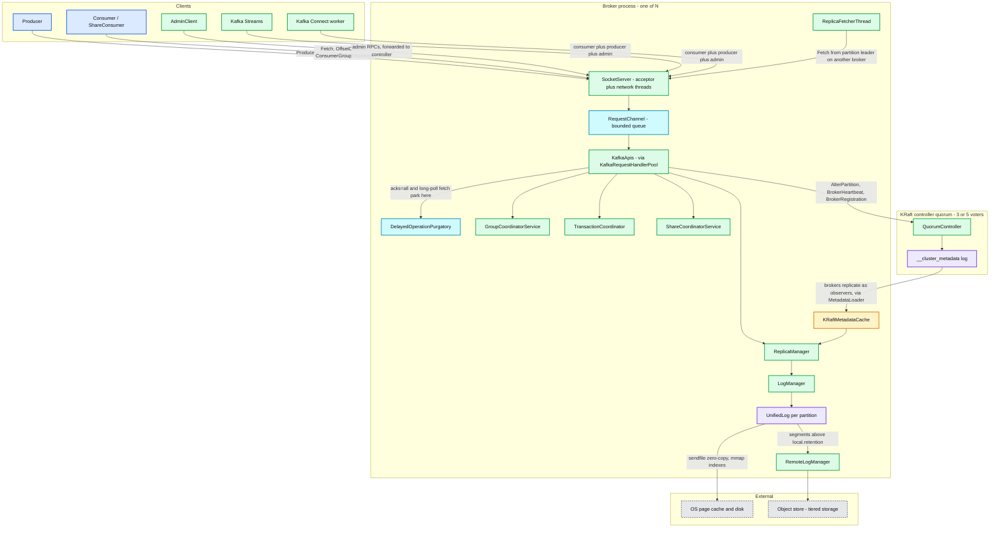
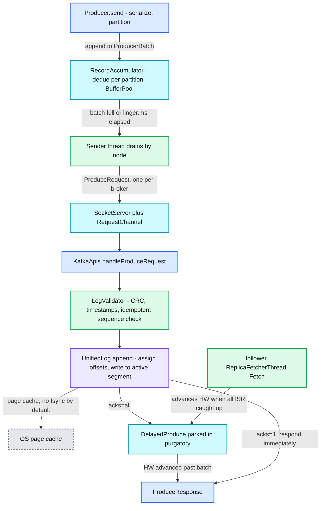
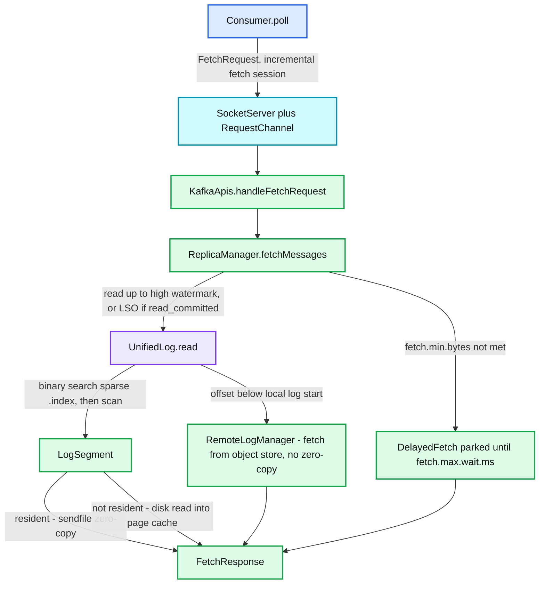
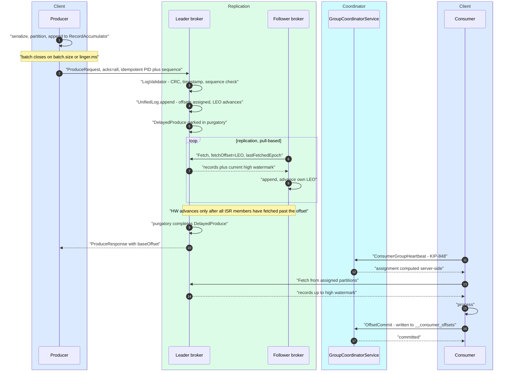
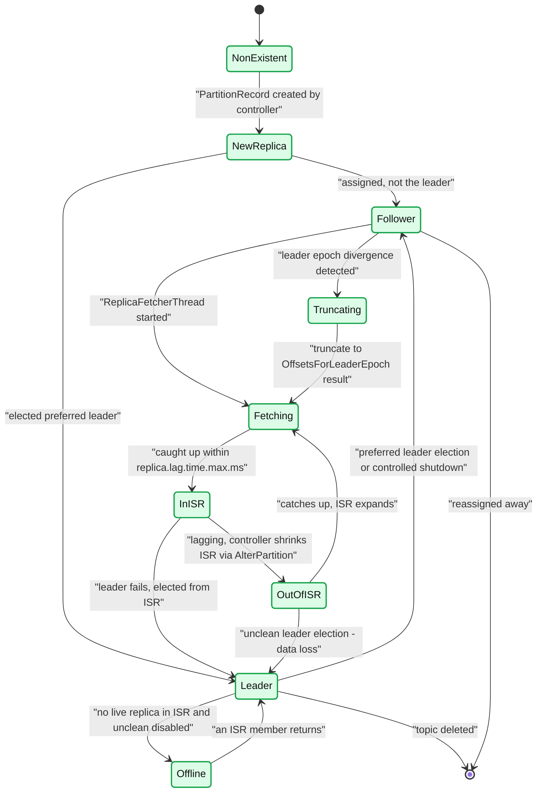

# Apache Kafka — Overview and Reading Map

**Series baseline: Apache Kafka 4.3** (4.3.0 released 2026-05-22; latest patch 4.3.1 released 2026-06-25). Every default in this series was verified against that release rather than quoted from memory. Version deltas from 3.5 forward, the 4.0 breaking-change wall, and per-report errata are catalogued in [`kafka-09-version-delta.md`](kafka-09-version-delta.md). **Read that file's errata before quoting any number from the other reports in an interview or a design review** — Kafka 4.x changed enough defaults that folklore from the 2.x era is actively wrong.

**Convention:** **[documented]** = read from source in this release, or stated in upstream docs/KEP-equivalent (a KIP). **[inferred]** = reasoning, not upstream text. **[unverified]** = could not be confirmed against a primary source; do not quote.

---

<!-- nav:start -->
← · **[Index](README.md)** · [01 Log Storage →](kafka-01-log-storage.md)
<!-- nav:end -->

<!-- toc:start -->

<b>Sections in this report (10)</b>

- [1. Overview](#1-overview)
- [2. Architecture](#2-architecture)
- [3. Data flow — the two paths that matter](#3-data-flow--the-two-paths-that-matter)
- [4. Sequence — a record from `send()` to a committed offset](#4-sequence--a-record-from-send-to-a-committed-offset)
- [5. State machine — the partition replica](#5-state-machine--the-partition-replica)
- [6. The series — what is in each report](#6-the-series--what-is-in-each-report)
- [7. Suggested reading order](#7-suggested-reading-order)
- [8. The ideas that generalise](#8-the-ideas-that-generalise)
- [9. Staff-level questions across the whole system](#9-staff-level-questions-across-the-whole-system)
- [10. Sources](#10-sources)

<!-- toc:end -->

## 1. Overview

- **Problem solved.** Kafka is a *replicated, append-only commit log offered as infrastructure*. It is not a message queue, a database, or a stream processor — those are things people build on it. The durable contribution is the realisation that storage, replication, ordering, and consumer progress can all be expressed as **one primitive: a monotonically increasing offset into an immutable file**.
- **Key design bet #1 — the log is the abstraction, and reading does not consume.** A broker keeps no per-consumer state on the data path; a consumer is a *cursor*, and its position is just a number it commits back into another Kafka topic. This is what makes fan-out free, replay trivial, and the broker stateless with respect to consumers. Every classical queue property Kafka lacks — per-message ack, per-message redelivery, selective consumption — is a direct cost of this bet, and KIP-932 share groups exist to buy some of it back.
- **Key design bet #2 — delegate to the operating system.** Sequential appends, no user-space cache, `sendfile` zero-copy on the read path, and durability delegated to replication rather than to `fsync`. Kafka's default flush settings mean it does **not** fsync on write; a single-broker Kafka is not a durable store, and that is deliberate.
- **Key design bet #3 — the partition is the unit of everything.** Ordering, parallelism, replication, retention, and assignment are all per-partition. Nothing scales *within* a partition, so every capacity conversation in Kafka is ultimately about partition count — and every scaling limit is about what a partition costs (file descriptors, index mmaps, fetch fan-out, controller metadata, recovery time).
- **Key design bet #4 — pull, everywhere.** Consumers pull from brokers, followers pull from leaders, and since KRaft even the Raft implementation is pull-based (followers `Fetch`; the leader never pushes). One protocol, one code path, one set of batching and back-pressure semantics reused at three layers.
- **Scale it operates at.** KRaft removed the ZooKeeper metadata ceiling — the headline figure is a cluster carrying **2 million partitions** for controller-failover purposes — but that number measures *controller* capacity, not a supportable workload. Per-broker limits (file descriptors, `vm.max_map_count`, index page cache, unclean-shutdown recovery time) did not move, so per-broker partition guidance stayed roughly where it was. [Report 08](kafka-08-scale-and-operations.md) has the honest envelope and the arithmetic behind it.

**The one-sentence version:** *A partition is an append-only file with a leader, and everything else in Kafka — replication, consumer position, transactions, consumer-group state, even the controller's own metadata — is another instance of that same file.*

---

## 2. Architecture

**What to notice**

- **Everything is the `Fetch` RPC.** A consumer reading data, a follower replicating a partition, and a broker replicating cluster metadata from the controller all issue the same shaped request against the same log machinery. This is Kafka's equivalent of Kubernetes' "everything is an object in etcd" — one primitive, reused until it hurts.
- **Coordinators are just brokers hosting special topics.** `GroupCoordinatorService`, `TransactionCoordinator` and `ShareCoordinatorService` are not separate services; they are per-partition leaders of `__consumer_offsets`, `__transaction_state` and `__share_group_state`. Coordinator failover *is* partition leader failover, which is why it inherits replication's guarantees for free.
- **The controller is off the data path entirely.** It writes metadata records; brokers replicate them as observers and act on what they see. Contrast the ZooKeeper era, where the controller *pushed* `LeaderAndIsr`/`UpdateMetadata` RPCs to every broker — an O(brokers × partitions) fan-out that was the real scaling ceiling.
- **The page cache is a first-class component**, not an implementation detail. Kafka has no block cache of its own, so "is the working set resident?" is the single most predictive question about a cluster's read latency.
- **Tiered storage inserts an object store *below* the log, not beside it.** The partition's offset space is continuous across local and remote segments; only the fetch path changes, and it loses zero-copy when it crosses the boundary.

---

## 3. Data flow — the two paths that matter

### 3.1 Write path — a produce request

**What to notice**

- **Batching happens on the client, and the batch survives end to end.** The batch a producer builds is the unit of compression, of the CRC, of idempotent sequencing, and of the bytes written to disk — the broker does not repack it. This is why producer `batch.size`/`linger.ms` tuning moves broker CPU and disk metrics, not just client ones.
- **`acks=all` is a park, not a wait loop.** The request goes into `DelayedProduce` in the purgatory and is completed by the *follower fetch* that advances the high watermark. Producer latency at `acks=all` is therefore a replication-round-trip property, and purgatory size is the leading indicator when it degrades.
- **There is no fsync on this path by default.** Durability comes from `acks=all` + `min.insync.replicas` + replication across failure domains. Anyone who says "Kafka writes to disk" is describing `write()` to page cache, not persistence.
- **Idempotence is validated broker-side**, against `ProducerStateManager`'s per-producer sequence state — which is why the producer's `max.in.flight.requests.per.connection` ceiling of 5 is a real protocol constraint and not a client-side nicety.

### 3.2 Read path — a fetch request

**What to notice**

- **A consumer can never read past the high watermark** — and under `read_committed`, never past the **last stable offset**. Data that is physically on the leader's disk is deliberately invisible until it is replicated, which is what makes "committed" mean something after a leader change.
- **Zero-copy is the read path's whole performance story, and it is fragile.** TLS defeats it (the bytes must pass through `SSLEngine`), and so does a tiered fetch. A cluster that enables TLS and wonders where its throughput went has usually just left the `sendfile` path.
- **The index is sparse on purpose.** One entry per `log.index.interval.bytes`, memory-mapped, binary-searched, then a linear scan to the exact offset. Dense indexing would cost more page cache than it saves.
- **Long-poll fetch parks in the same purgatory as `acks=all` produce.** `fetch.min.bytes` + `fetch.max.wait.ms` is a batching-versus-latency dial implemented as a delayed operation, not as client polling.
- **A cold read is the most dangerous thing a consumer can do.** It pulls old segments into the page cache and evicts the tail that every other consumer is reading — one lagging consumer degrading everyone else is the canonical Kafka incident.

---

## 4. Sequence — a record from `send()` to a committed offset

This is the trace to be able to draw from memory. It crosses every report in the series.

**What to notice**

- **Nothing pushed anything.** The producer pushed once; after that every hop — replication, consumption — is a pull initiated by the party that wants the data. Back-pressure is therefore structural rather than a protocol feature.
- **The high watermark advance costs two round trips.** A follower learns the new HW on the *next* fetch after the one that replicated the data. This is why follower fetching (KIP-392) serves slightly stale data, and why HW-based truncation was unsafe before leader epochs (KIP-101).
- **The offset commit is just another produce.** It goes into `__consumer_offsets`, a compacted topic, through the ordinary log path. Consumer progress has exactly the same durability characteristics as user data, because it *is* user data.
- **Under KIP-848 the assignment is computed on the broker.** The old protocol had the *group leader* — an arbitrary consumer — compute assignments and distribute them via `SyncGroup`, which is why a single slow client could stall an entire group's rebalance.
- **Exactly-once wraps steps 3 through 15 in a transaction.** The produce and the offset commit become one atomic unit via the `TransactionCoordinator` and control records — see [report 04](kafka-04-producer.md).

---

## 5. State machine — the partition replica

**What to notice**

- **`OutOfISR → Leader` is the only edge that loses acknowledged data**, and it exists solely because `unclean.leader.election.enable` lets you trade durability for availability. Everything else in Kafka's replication design exists to avoid taking that edge.
- **ISR membership is time-based, not offset-based.** A replica is in the ISR if it has fetched within `replica.lag.time.max.ms` — so a replica can be arbitrarily far behind in bytes and still be "in sync", which is exactly the case that makes `min.insync.replicas` weaker than people expect. KIP-966's Eligible Leader Replicas closes part of this gap.
- **`Truncating` is where KIP-101 lives.** Before leader epochs, a follower truncated to the high watermark and could silently lose or diverge data; now it asks the leader `OffsetsForLeaderEpoch` and truncates to the exact divergence point.
- **The controller does not push these transitions.** It writes a `PartitionChangeRecord`; brokers observe it through the metadata log and reconcile. The state machine is driven by observation, exactly as in Kubernetes.
- **`Offline` is a deliberate stop.** Kafka refuses to elect a leader it cannot prove is complete, and would rather serve nothing than serve a truncated log.

---

## 6. The series — what is in each report

| # | Report | Covers | Read it when you need to reason about |
|---|--------|--------|----------------------------------------|
| 01 | [`kafka-01-log-storage.md`](kafka-01-log-storage.md) | `UnifiedLog`/`LogSegment`/`LogManager`, record batch v2 binary format, sparse offset and time indexes, segment roll, flush and recovery, retention, `LogCleaner` compaction, KIP-405 tiered storage | Disk sizing, compaction lag, cold-read latency, tiered-storage behaviour, on-disk forensics |
| 02 | [`kafka-02-replication-isr.md`](kafka-02-replication-isr.md) | Leader/follower fetch loop, high watermark, ISR shrink/expand, `min.insync.replicas`, leader epochs and truncation (KIP-101/320), Eligible Leader Replicas (KIP-966), unclean election, reassignment, follower fetching (KIP-392) | Data-loss analysis, durability guarantees, ISR thrash, cross-AZ design, reassignment throttling |
| 03 | [`kafka-03-kraft-controller.md`](kafka-03-kraft-controller.md) | Why KRaft replaced ZooKeeper, pull-based Raft, `__cluster_metadata` records, quorum config, KIP-853 dynamic voters, snapshots, `QuorumController`'s timeline data structures, broker registration and heartbeats, `metadata.version` | Control-plane behaviour, controller failover, metadata lag, quorum operations, upgrades |
| 04 | [`kafka-04-producer.md`](kafka-04-producer.md) | `RecordAccumulator`/`BufferPool`/`Sender`, sticky partitioning (KIP-794), idempotence and `ProducerStateManager`, transactions and the two-phase commit, LSO and `read_committed`, KIP-890 transactions v2 | Producer tuning, throughput/latency/durability trade-offs, EOS design, hanging transactions |
| 05 | [`kafka-05-consumer-rebalance.md`](kafka-05-consumer-rebalance.md) | New consumer threading model, fetch mechanics and incremental fetch sessions, `__consumer_offsets`, classic/cooperative/static rebalancing, **KIP-848** server-side assignment, **KIP-932** share groups, `CoordinatorRuntime` | Rebalance storms, consumer lag, group protocol migration, queue-like workloads |
| 06 | [`kafka-06-broker-request-pipeline.md`](kafka-06-broker-request-pipeline.md) | `SocketServer`/`RequestChannel`/`KafkaRequestHandlerPool` threading, the hierarchical timing wheel purgatory, the seven request-time phases, quotas (KIP-124/599), listeners, SASL/TLS, `StandardAuthorizer` | Broker latency triage, thread-pool saturation, quota design, security architecture |
| 07 | [`kafka-07-streams-connect.md`](kafka-07-streams-connect.md) | Streams topology/tasks/state stores/changelogs, HighAvailabilityTaskAssignor (KIP-441), KIP-1071 Streams rebalance protocol, EOS v2; Connect workers, incremental cooperative rebalancing, source/sink flows, EOS sources (KIP-618), MirrorMaker 2 | Stream-processing design, state restore times, connector operations, cross-cluster replication |
| 08 | [`kafka-08-scale-and-operations.md`](kafka-08-scale-and-operations.md) | Scale envelope and saturation order, capacity arithmetic, the JMX metric reference, consumer lag semantics, OS/JVM tuning, JBOD, runbooks, Cruise Control, multi-DC, cost model | Capacity planning, incident triage, cluster operations, cost reduction |
| 09 | [`kafka-09-version-delta.md`](kafka-09-version-delta.md) | Release timeline, the 4.0 breaking-change wall, feature maturity matrix 3.5→4.3, per-report errata, in-flight KIPs for 4.4/5.0, upgrade playbooks | Before trusting any default in reports 01–08, and before planning any upgrade |
| — | `../claude/patterns.md` | Cross-system distributed-systems patterns and which systems use each | Comparing Kafka to Kubernetes, etcd, Spanner, S3 in a design discussion |

---

## 7. Suggested reading order

1. **01 (log storage)** first, and do not skip it. Every other report is a consumer of the log's contract. If you only internalise the segment/index/offset model and the page-cache reliance, you can derive a surprising amount of the rest.
2. **02 (replication/ISR)** next — this is where Kafka's actual guarantees live, and where the interview questions are. Read it immediately after 01 while the offset model is fresh.
3. **04 (producer)** and **05 (consumer)** together. They are two halves of one protocol conversation, and reading them apart makes the transaction and offset-commit stories harder than they need to be.
4. **06 (request pipeline)** — the shortest path from "the cluster feels slow" to a specific thread pool or queue. Highest operational return per page.
5. **03 (KRaft)** — the newest subsystem and the one most likely to be asked about, but also the one least likely to be the cause of your incident. Read it when you want to understand the control plane, not when you are debugging.
6. **07 (Streams/Connect)** and **08 (scale/ops)** driven by what your work touches.
7. **09** last, then keep it open whenever quoting a number.

---

## 8. The ideas that generalise

These are the transferable takeaways — the reason Kafka is worth studying even if you never run it.

- **One primitive, reused until it hurts, beats several specialised ones.** The log carries user data, consumer offsets, transaction state, share-group state, and cluster metadata. Each reuse inherits replication, durability, compaction and observability for free. The cost is that everything is *shaped like a log* — which is why per-message acknowledgement needed an entire new subsystem (KIP-932) rather than a flag.
- **Push versus pull is a back-pressure decision, not a performance one.** By making every hop a pull, Kafka gets flow control structurally: a slow consumer, a slow follower, or a slow controller-observer simply fetches less often. Push systems must invent credit schemes to recover the same property.
- **Delegating to the OS is a real architectural choice with real limits.** Sequential I/O + page cache + `sendfile` gave Kafka database-beating throughput with almost no caching code. It also means Kafka's performance is a *page-cache residency* property that the JVM cannot see or control, TLS silently forfeits the biggest win, and "add more RAM" is a more effective tuning step than any config change.
- **Durability is a quorum property, not a disk property.** Kafka does not fsync; it replicates. This is the same trade every modern consensus-backed system makes, and it is only sound when failure domains are genuinely independent — which is why `broker.rack` and cross-AZ placement are correctness settings, not optimisations.
- **Ordering is a partitioning decision made once, at write time, forever.** Kafka gives total order within a partition and none across partitions. Almost every hard Kafka design question — key choice, partition count, repartitioning, hot keys — is downstream of that single trade, and none of it can be changed later without reprocessing.
- **A control plane that pushes state does not scale; one that publishes it does.** The ZooKeeper→KRaft migration is the same refactor Kubernetes made structurally from the start: replace O(N) targeted RPCs with a replicated log that every participant observes at its own pace. That KRaft then reused Kafka's own log to do it is the joke that makes the point.
- **Time-based liveness is weaker than it looks.** ISR membership by `replica.lag.time.max.ms` means "in sync" can mean "arbitrarily far behind, but recently active". `min.insync.replicas` counting the ISR rather than the caught-up set is the gap KIP-966 exists to close — a good reminder to check what a health signal actually measures before relying on it.

---

## 9. Staff-level questions across the whole system

Five questions that span reports; the per-subsystem reports have five more each.

1. **A producer with `acks=all` and `min.insync.replicas=2` on RF=3 received a successful ack. The leader's disk then dies. Can the record be lost? Under what settings, exactly?**
   Normally no: the ack was only sent after the high watermark advanced past the record, which requires every ISR member to have fetched it, so at least two replicas hold it in *page cache*. Three ways it is still lost. First, `unclean.leader.election.enable=true` plus the loss of every in-sync replica lets a stale replica become leader and truncate. Second, correlated failure — all replicas in one rack or AZ, or all on the same power domain — since Kafka never fsyncs, page-cache contents die with the machines. Third, the subtle one: the ISR is time-based, so a replica that fetched 20 seconds ago is still "in sync" while being far behind; it satisfied `min.insync.replicas` at admission time but may not hold the record. That third case is precisely what KIP-966 Eligible Leader Replicas addresses, and its part 2 (unclean recovery) is not in 4.3.

2. **Why is `Fetch` the only replication primitive, including inside KRaft's Raft implementation — and what did that choice cost?**
   Reuse: one wire protocol, one batching implementation, one purgatory, one set of index and zero-copy code paths, and one back-pressure model, serving consumers, followers and metadata replication alike. A new Raft implementation with push-based `AppendEntries` would have duplicated all of it. The cost is that KRaft diverges from textbook Raft in ways you must state carefully in an interview: the leader never initiates replication, so liveness depends on followers fetching within `controller.quorum.fetch.timeout.ms`; leader election needs pre-vote (KIP-996) to avoid disruption from a partitioned voter; and the high-watermark advance carries the same extra round trip as data replication, so metadata commit latency is a fetch-interval property.

3. **A rolling restart of a 30-broker cluster causes a 90-second window of elevated p99 produce latency on every restart, even though `min.insync.replicas` is satisfied throughout. Diagnose it.**
   Several mechanisms stack, and naming them in order is the answer. Controlled shutdown moves leadership off the broker, so its partitions' leaders are now scattered onto brokers that were already leaders — a leadership imbalance that persists until preferred leader election runs (`auto.leader.rebalance.enable`, `leader.imbalance.check.interval.seconds`). The restarted broker comes back with a **cold page cache**, so its follower fetches hit disk and its ISR catch-up is slow; while it is out of the ISR, `acks=all` produce waits on the remaining replicas and any further degradation risks `NotEnoughReplicas`. If the shutdown was unclean, log recovery on start scans segments with `num.recovery.threads.per.data.dir` threads before the broker serves anything. Meanwhile every client re-fetches metadata and reconnects, which on a TLS listener means a handshake storm on the network threads. Fixes: wait for `UnderReplicatedPartitions` to reach zero *and* leadership to rebalance between brokers rather than restarting on a timer; keep segment sizes small enough to bound recovery; and pre-warm by letting the broker follow before making it a leader.

4. **You need per-message acknowledgement and redelivery — classic queue semantics — on top of Kafka. What does that actually require, and why was it not just a config flag?**
   Because Kafka's central bet is that the broker keeps no per-consumer state on the data path: consumption is a cursor, so "this consumer has finished message 7 but not message 5" is inexpressible in an offset. Getting it requires per-record in-flight state (acquired/acknowledged/released/archived), a lock with a timeout so an unacked record becomes redeliverable, a delivery counter with a limit, and somewhere durable to keep all of it — which is what KIP-932 share groups build, with a `ShareCoordinatorService` and the `__share_group_state` topic. The consequences follow from the design: ordering is given up (records are delivered to whichever member acquires them), partitions are no longer exclusively owned so consumer count is decoupled from partition count, and the broker now does per-record bookkeeping it previously avoided. Share groups reached production-ready in 4.2. The Staff-level judgement is that if you need this for most of your traffic, you may want a queue rather than Kafka with a queue bolted on.

5. **Design the storage and topology for 1 GB/s of ingest with 30-day retention, three consumer groups, and multi-AZ durability. What breaks first, and what does it cost?**
   Start from egress, not ingress: at RF=3 and three consumer groups, 1 GB/s in becomes roughly `1 × (3 − 1)` GB/s of replication plus `1 × 3` GB/s of consumer fan-out, so ~5 GB/s of egress — network is the first saturation, not disk. Thirty days at 1 GB/s is ~2.6 PB before replication and ~7.8 PB after, which is the argument for tiered storage: keep hours locally with `local.retention.ms` and let the object store hold the tail, which also collapses the recovery and reassignment cost of a broker replacement. Partition count follows from a target of tens of MB/s per partition, so low thousands of partitions, spread with `broker.rack` across three AZs. The cost model is dominated not by disk but by **cross-AZ network** — replication traffic crosses AZs by construction and is billed in both directions — so KIP-392 follower fetching to keep consumers reading in-AZ is a line-item optimisation, not a micro-optimisation. What breaks first if you get it wrong: page-cache residency, the moment any consumer group falls far enough behind to read from disk and evict the tail everyone else is reading.

---

## 10. Sources

- [Apache Kafka documentation — 4.3](https://kafka.apache.org/43/documentation.html)
- [Apache Kafka Improvement Proposals (KIPs)](https://cwiki.apache.org/confluence/display/KAFKA/Kafka+Improvement+Proposals)
- [apache/kafka source, branch `4.3`](https://github.com/apache/kafka/tree/4.3)
- [Apache Kafka release announcements](https://kafka.apache.org/blog/releases/)
- [Apache Kafka 4.3.0 release announcement](https://kafka.apache.org/blog/2026/05/22/apache-kafka-4.3.0-release-announcement/)
- [Apache Kafka Supports 200K Partitions Per Cluster](https://blogs.apache.org/kafka/entry/apache-kafka-supports-more-partitions)
- Kreps, Narkhede, Rao — *Kafka: a Distributed Messaging System for Log Processing*, NetDB 2011
- Wang et al. — *Building a Replicated Logging System with Apache Kafka*, VLDB 2015
- Ongaro, Ousterhout — *In Search of an Understandable Consensus Algorithm (Raft)*, USENIX ATC 2014
- Per-subsystem sources are listed in each report's final section.

---

<!-- nav:start -->
← · **[Index](README.md)** · [01 Log Storage →](kafka-01-log-storage.md)
<!-- nav:end -->
