# Apache Kafka Internals 01 — The partition log: storage, indexes, retention, compaction, tiering

**Series baseline: Apache Kafka 4.3** — 4.3.0 released 2026-05-22, latest patch **4.3.1** released 2026-06-25. Every default, class name, file name, constant and code path below was verified against that release (branch `4.3`, tag `4.3.1`) unless stated otherwise. In 4.x essentially all log code lives in the `:storage` Gradle module as Java (`org.apache.kafka.storage.internals.log.*`); the only Scala left in this area is `kafka.log.LogManager` (the broker-facing wrapper). Claims are **[documented]** — i.e. read from source, official docs, or a KIP — unless explicitly marked **[inferred]**.

> **Scope note.** This report covers the *local* partition log and its remote tier: `UnifiedLog`, `LocalLog`, `LogSegment`, `LogManager`, on-disk formats, indexes, appends, reads, flush, recovery, retention, compaction and KIP-405 tiered storage. Replication, ISR, the high-watermark protocol, KRaft, the producer/consumer clients and the request pipeline are covered in sibling reports and are only referenced here where the log's contract depends on them.

---

<!-- nav:start -->
[← 00 Overview](kafka-00-overview.md) · **[Index](README.md)** · [02 Replication & ISR →](kafka-02-replication-isr.md)
<!-- nav:end -->

<!-- toc:start -->
<details>
<summary><b>Sections in this report (13)</b></summary>

- [1. Overview](#1-overview)
- [2. Architecture](#2-architecture)
- [3. Data flow](#3-data-flow)
- [4. Sequence of operations](#4-sequence-of-operations)
- [5. State machines](#5-state-machines)
- [6. Component deep dives](#6-component-deep-dives)
- [7. Guarantees](#7-guarantees)
- [8. Failure modes](#8-failure-modes)
- [9. Scalability & performance](#9-scalability--performance)
- [10. Trade-offs & alternatives](#10-trade-offs--alternatives)
- [11. Staff-level questions](#11-staff-level-questions)
- [12. Config reference (verified defaults, Kafka 4.3.1)](#12-config-reference-verified-defaults-kafka-431)
- [13. Sources](#13-sources)

</details>
<!-- toc:end -->

## 1. Overview

- **Problem solved.** Give every partition a durable, strictly-ordered, append-only byte sequence that can be written at network line rate, read by many independent consumers at different positions, and served to the network card without ever being copied into the JVM heap.
- **Design bet #1 — the log *is* the storage engine.** No B-tree, no LSM, no in-process cache. A partition is a directory of segment files; writes are `write(2)` at the end of one file; reads are `sendfile(2)` from an offset. Access cost is O(1) in data volume, so a 50 TB broker performs like a 50 GB one for tail traffic.
- **Design bet #2 — delegate caching and durability to the kernel.** Kafka does not fsync on append (`log.flush.interval.messages` defaults to `Long.MAX_VALUE`); durability comes from **replication across brokers**, and read caching comes from the **OS page cache**. This is why the broker heap is small (single-digit GB) on machines with hundreds of GB of RAM.
- **Design bet #3 — the batch is the atom.** Compression, the CRC, offset assignment, timestamps, idempotence and transactional markers are all *batch*-level. The broker can validate and index a batch without decompressing it, and a producer's compressed batch is normally written to disk byte-for-byte as received.
- **Design bet #4 — sparse indexes.** One index entry per `log.index.interval.bytes` (**4096**) of log, memory-mapped, binary-searched with a cache-friendly "warm section" split. Index size stays ~0.1% of log size, so indexes for the hot region stay resident.
- **Scale.** A single broker routinely holds tens of thousands of partitions and tens of TB of local log; a partition's log is capped only by disk (and, with KIP-405 tiered storage, not even by that). Segment default is **1 GiB**; retention default **7 days**.

---

## 2. Architecture

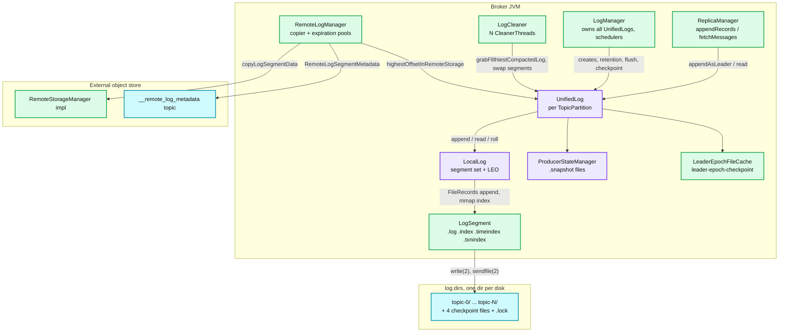

**What to notice**

- `UnifiedLog` is the only class with the partition lock. It composes `LocalLog` (the segment set and log-end offset), `ProducerStateManager` (idempotence/transactions), `LeaderEpochFileCache` (truncation safety) and, optionally, the remote tier.
- `LogManager` owns *cross-partition* concerns: the log-dir `.lock` files, the four checkpoint files per dir, the retention/flush/checkpoint schedulers, and the recovery thread pools.
- The `LogCleaner` is a separate set of threads that reach *into* `UnifiedLog` and atomically swap rewritten segments in — compaction is not on the append path.
- The `RemoteLogManager` is likewise off the append path: it copies *closed* segments and then lets local retention delete them. It writes back only one number into the log — `highestOffsetInRemoteStorage`.
- Everything below `LogSegment` is `FileChannel` + `MappedByteBuffer`. There is no Kafka-managed record cache anywhere in this diagram.

### 2.1 Directory layout of a log dir

A configured `log.dirs` entry (broker default `log.dir=/tmp/kafka-logs`) looks like this:

```
/var/lib/kafka/data/
├── .lock                              # LogManager.LOCK_FILE_NAME, held for the process lifetime
├── meta.properties                    # cluster id, node id, directory.id (KRaft, written by kafka-storage.sh)
├── .kafka_cleanshutdown               # ONLY while the broker is down after a clean shutdown; JSON {version, brokerEpoch}
├── recovery-point-offset-checkpoint   # per-partition recovery point (last flushed offset)
├── replication-offset-checkpoint      # per-partition high watermark   (written by ReplicaManager)
├── log-start-offset-checkpoint        # per-partition logStartOffset
├── cleaner-offset-checkpoint          # per-partition first dirty offset (LogCleanerManager)
├── remote-log-index-cache/            # RemoteIndexCache.DIR_NAME, only with tiered storage
└── orders-3/                          # one dir per partition: <topic>-<partition>
    ├── partition.metadata             # "version: 0\ntopic_id: <Uuid>"
    ├── leader-epoch-checkpoint        # lines of "<epoch> <startOffset>", version 0
    ├── 00000000000000000000.log
    ├── 00000000000000000000.index
    ├── 00000000000000000000.timeindex
    ├── 00000000000000000000.txnindex      # created lazily, only if a txn aborts in this segment
    ├── 00000000000000038194.snapshot      # producer state at that offset (taken on roll)
    ├── 00000000000000038194.log           # ← active segment
    ├── 00000000000000038194.index
    └── 00000000000000038194.timeindex
```

Segment file naming: `LogFileUtils.filenamePrefixFromOffset(baseOffset)` formats the base offset with `NumberFormat`, `setMinimumIntegerDigits(20)`, no grouping — a **20-digit zero-padded decimal**, so `ls` sorts numerically. Every file of a segment shares that prefix.

Transient suffixes (all in `LogFileUtils`):

| Suffix | Meaning |
|---|---|
| `.deleted` | Segment logically removed; physical `unlink` scheduled `log.segment.delete.delay.ms` later |
| `.cleaned` | Cleaner is currently writing this replacement segment; always deleted on startup |
| `.swap` | Cleaner/split finished writing; rename-to-live was interrupted — completed on startup |
| `-delete` (dir) | Partition dir renamed on topic deletion, deleted asynchronously |
| `-future` (dir) | Target of an in-progress `AlterReplicaLogDirs` move |
| `-stray` (dir) | Partition the broker is no longer supposed to host (KRaft reconciliation) |

**Checkpoint file formats.** All four use `CheckpointFile` with the same shape: line 1 = version (`0` for all of them), line 2 = entry count, then `topic partition value` per line. `leader-epoch-checkpoint` is version 0 with `epoch startOffset` lines. `partition.metadata` is two lines of plain text. `.kafka_cleanshutdown` is JSON, written only during clean shutdown and **deleted immediately on startup** after being read (`LogManager.scala:450-454`), so its presence at runtime means nothing.

---

## 3. Data flow

### 3.1 Write path (produce → disk)

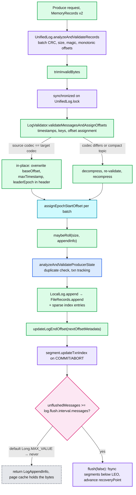

**What to notice**

- Validation happens **twice**: a cheap structural pass (`analyzeAndValidateRecords`) *outside* the lock, and the full record-level pass (`LogValidator`) *inside* it.
- The fast path is `inPlaceAssignment` — `sourceCompressionType == targetCompression.type()`. Then the broker only rewrites the batch *header* fields (base offset, last-offset-delta, max timestamp, partition leader epoch, and the CRC). The compressed payload is never touched. This is the whole reason `compression.type=producer` (the default) is the cheap setting.
- Offsets are assigned by the **leader only**. A follower calls `appendAsFollower`, which takes the offsets as given (`validateAndAssignOffsets=false`) and only checks that they do not go backwards.
- The append increments the local LEO *before* the transaction index is updated, deliberately: a txn-index write failure must not create an offset gap. The comment in `UnifiedLog.append` says the resulting inconsistency is repaired by log-dir recovery.
- With defaults, **no `fsync` happens on this path at all**. `flush` is reached only if an operator set `log.flush.interval.messages`/`log.flush.interval.ms`, or on roll (see §6.3).

### 3.2 Read path (fetch → network)

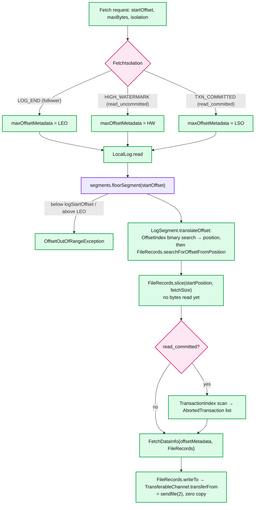

**What to notice**

- The lookup is two-stage by design: the **sparse index** gets you to within `log.index.interval.bytes` of the target, then a linear scan of batch headers (`searchForOffsetFromPosition`, which reads only the 61-byte headers, not payloads) finds the exact batch.
- Reads are always **batch-aligned**. `FetchDataInfo.firstEntryIncomplete` is set when `maxBytes` cannot even hold the first batch; the consumer then must raise `max.partition.fetch.bytes` (or the broker honours `minOneMessage` for the replica/consumer that needs progress).
- `FileRecords.slice` produces a *view* — a `FileChannel` plus `start`/`end`. Nothing is read into user space until the network layer calls `writeTo`.
- The isolation level changes only the **upper bound**, never the lower one. `read_committed` additionally pays a `.txnindex` scan and ships an aborted-transaction list so the *client* filters aborted records.
- `LogOffsetMetadata` carries `(messageOffset, segmentBaseOffset, relativePositionInSegment)`. When the metadata is "message-offset only" (`segmentBaseOffset == -1`), `LocalLog.read` cannot bound the read by position and returns `maxPosition = empty`, i.e. an empty fetch — this is the mechanism behind "HW is known but not yet materialized" fetches right after leader election.

### 3.3 Async paths (retention, compaction, tiering)

```mermaid
flowchart TD
  subgraph Sched["LogManager KafkaScheduler"]
    RET["kafka-log-retention<br/>every log.retention.check.interval.ms"]
    FLU["kafka-log-flusher<br/>every log.flush.scheduler.interval.ms"]
    RCP["kafka-recovery-point-checkpoint<br/>every 60s"]
    LSO["kafka-log-start-offset-checkpoint<br/>every 60s"]
    DEL["kafka-delete-logs<br/>rescheduled dynamically"]
  end
  subgraph Cleaner["LogCleaner, log.cleaner.threads"]
    CT["CleanerThread.doWork"]
  end
  subgraph Tier["RemoteLogManager"]
    CP["RLMCopyTask, copier pool"]
    EX["RLMExpirationTask, expiration pool"]
  end
  RET -->|"deleteOldSegments per log"| UL["UnifiedLog"]
  FLU -->|"flush if now-lastFlush > flush.ms"| UL
  RCP -->|"write recovery-point-offset-checkpoint"| CKP["checkpoint files"]
  LSO -->|"write log-start-offset-checkpoint"| CKP
  DEL -->|"unlink .deleted files"| FSY["filesystem"]
  CT -->|"grabFilthiestCompactedLog → clean → swap"| UL
  CP -->|"copyLogSegmentData + metadata"| REM["remote store"]
  EX -->|"delete expired remote segments"| REM
  CP -->|"updateHighestOffsetInRemoteStorage"| UL

  class RET,FLU,RCP,LSO,DEL,CT,CP,EX service
  class CKP,REM service
  class UL store
  class FSY external

  classDef client   fill:#dbeafe,stroke:#2563eb,stroke-width:2px,color:#111
  classDef service  fill:#dcfce7,stroke:#16a34a,stroke-width:2px,color:#111
  classDef store    fill:#ede9fe,stroke:#7c3aed,stroke-width:2px,color:#111
  classDef cache    fill:#fef3c7,stroke:#d97706,stroke-width:2px,color:#111
  classDef queue    fill:#cffafe,stroke:#0891b2,stroke-width:2px,color:#111
  classDef critical fill:#fee2e2,stroke:#dc2626,stroke-width:4px,color:#111
  classDef external fill:#e5e7eb,stroke:#6b7280,stroke-width:2px,color:#111,stroke-dasharray:4 3
  classDef decision fill:#fce7f3,stroke:#db2777,stroke-width:2px,color:#111
```

**What to notice**

- Retention and compaction are *different loops*. A `cleanup.policy=compact,delete` topic is visited by both: `LogManager`'s retention loop deletes whole segments by time/size, and a `CleanerThread` rewrites the remaining ones key-by-key.
- All five `LogManager` tasks start after `log.initial.task.delay.ms` (**30 s**, internal config) to avoid a startup stampede.
- Physical deletion is always deferred: rename to `.deleted` now, `unlink` after `log.segment.delete.delay.ms` (**60 s**), so in-flight `sendfile` from an already-open fd is safe.
- The remote copier only ever touches **closed** segments whose last offset is below the high watermark; the active segment is never uploaded.

---

## 4. Sequence of operations

### 4.1 Produce append with segment roll

```mermaid
sequenceDiagram
    autonumber
    box rgb(220,252,231) Replication
      participant RM as ReplicaManager
    end
    box rgb(237,233,254) Log storage
      participant UL as UnifiedLog
      participant LV as LogValidator
      participant LL as LocalLog
      participant SEG as LogSegment
      participant IDX as OffsetIndex/TimeIndex
    end

    RM->>UL: appendAsLeader(records, leaderEpoch)
    UL->>UL: maybeFlushMetadataFile (partition.metadata)
    UL->>UL: analyzeAndValidateRecords — CRC per batch, maxMessageSize
    UL->>UL: acquire lock
    UL->>LV: validateMessagesAndAssignOffsets(offsetCounter = LEO)
    alt source codec == target codec and magic matches
        LV-->>UL: in-place: rewrite baseOffset/maxTimestamp/leaderEpoch, recompute CRC
    else codec conversion or compacted topic key check
        LV->>LV: decompress, validate each record, recompress
        LV-->>UL: new MemoryRecords, messageSizeMaybeChanged = true
        UL->>UL: re-check every batch against max.message.bytes
    end
    UL->>UL: reject if validRecords.size > log.segment.bytes
    UL->>SEG: shouldRoll(RollParams)
    alt size+messages > segment.bytes OR age > segment.ms - jitter OR index full OR offset delta > Int.MAX
        UL->>LL: roll(): flush old segment async, take producer snapshot,<br/>trimToValidSize on indexes, open new base offset
        UL->>SEG: new active segment
    end
    UL->>UL: analyzeAndValidateProducerState (duplicate / OutOfOrderSequence)
    UL->>LL: append(lastOffset, validRecords)
    LL->>SEG: FileRecords.append(records)
    loop per batch
        SEG->>IDX: if bytesSinceLastIndexEntry > index.interval.bytes:<br/>offsetIndex.append(lastOffset, physPos)#59; timeIndex.maybeAppend
    end
    LL->>LL: updateLogEndOffset(lastOffset+1) → nextOffsetMetadata
    UL->>SEG: updateTxnIndex for each completed txn
    UL-->>RM: LogAppendInfo{firstOffset, lastOffset, maxTimestamp, logStartOffset}
```

**What to notice**

- The roll decision uses `RollParams` computed from the *incoming* batch: `size > maxSegmentBytes - messagesSize` rolls **before** the append, so a segment never exceeds `log.segment.bytes` by more than one batch.
- `timeWaitedForRoll` is measured from the segment's first batch's *timestamp* (create-time), not from wall clock at creation — a backfill producer with old timestamps therefore rolls on size, not time.
- `rollJitterMs` is subtracted from `maxSegmentMs` per segment (`log.roll.jitter.ms`, default **0**). Setting it is the standard fix for "all 10 000 partitions roll and fsync at the same second".
- A batch larger than `log.segment.bytes` is rejected with `RecordBatchTooLargeException` — segments must be able to hold at least one batch.
- The duplicate check is *batch*-level: `ProducerStateManager` keeps the last 5 `BatchMetadata` per producer id and returns the original offsets for an exact `(producerId, epoch, baseSequence, lastSequence)` match. That is what makes `enable.idempotence=true` retries free.

### 4.2 Segment roll internals

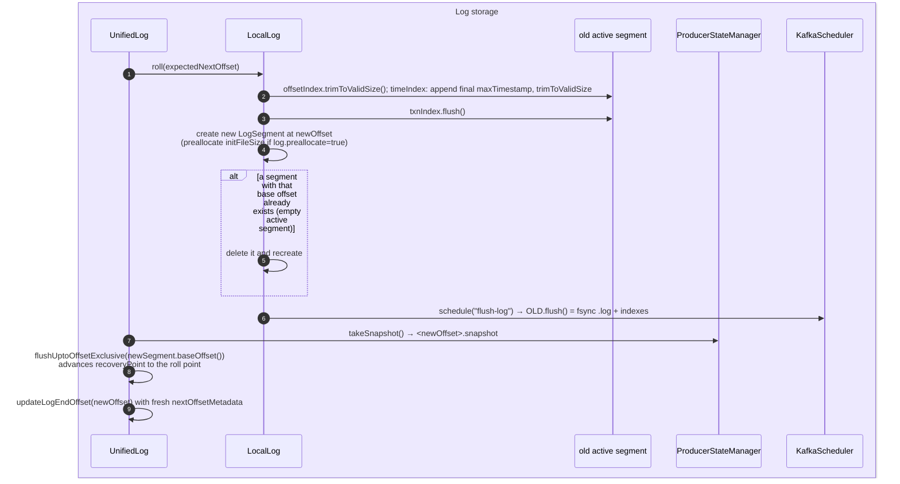

**What to notice**

- Roll is where the **recovery point** normally advances even with flush disabled: `flushUptoOffsetExclusive(newBaseOffset)` fsyncs everything below the new segment and checkpoints it. So "we never fsync" really means "we fsync roughly once per `log.segment.bytes` of data, asynchronously".
- Producer snapshots are taken **per roll**, named by the new segment's base offset. On recovery, `ProducerStateManager` loads the newest snapshot at or below the recovery point and replays forward — this bounds idempotence-state rebuild to one segment.
- `trimToValidSize()` truncates the preallocated 10 MiB index down to the bytes actually used, and re-`mmap`s. This is why closed segments' indexes are small and the active one's is 10 MiB.
- The old segment's fsync is scheduled on the background scheduler, not done inline — a roll does not stall the producer for a full-segment fsync.

### 4.3 Log compaction round

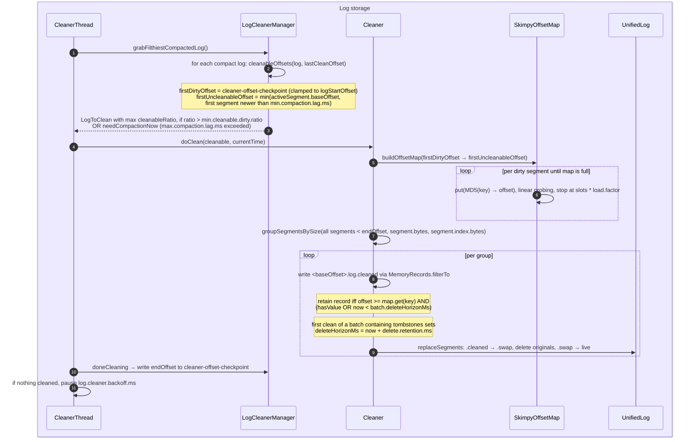

**What to notice**

- The **active segment is never cleaned**: `firstUncleanableOffset` is capped at `activeSegment.baseOffset()`. Consequence — the newest value for a key can sit uncompacted indefinitely on a low-traffic partition, which is exactly what `max.compaction.lag.ms` and `segment.ms` exist to bound.
- Selection is "filthiest first": `max(cleanableRatio)` among logs that pass the gate `cleanableRatio > min.cleanable.dirty.ratio` **or** `needCompactionNow`. One `CleanerThread` cleans one partition at a time, start to finish.
- The offset map is built over the *dirty* range only, but the *rewrite* covers segments from offset 0 up to `offsetMap.latestOffset()+1`, so clean-but-not-yet-merged segments get regrouped and coalesced.
- Delete horizon is a **two-round** protocol (KIP-534): round 1 keeps the tombstone and stamps `deleteHorizonMs` into the batch header; round 2, after that time passes, drops it. Before KIP-534 the horizon was derived from segment mtime, which broke whenever segments were rewritten. The old path survives for magic < 2 as `legacyDeleteHorizonMs`.
- `replaceSegments` is crash-safe by file naming alone: `.cleaned` (throw away on restart) → `.swap` (finish on restart) → live. No journal.

### 4.4 Recovery after unclean shutdown

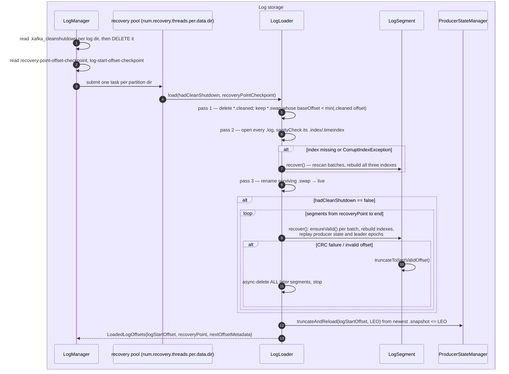

**What to notice**

- On clean shutdown the whole per-segment scan is skipped and `recoveryPoint` is set straight to the LEO. On unclean shutdown only segments **at or after the checkpointed recovery point** are rescanned — which is why the recovery-point checkpoint (every 60 s) matters far more for restart time than for correctness.
- Recovery is *destructive and forward-truncating*: the first corrupt batch truncates its segment and deletes everything after it. Data past a torn write is discarded, not salvaged. Replication is expected to refill it.
- `num.recovery.threads.per.data.dir` (**2**) is per *log dir*, so total recovery parallelism is `numDirs × 2`. On a 20-disk broker with 50 000 partitions, raising it is the single biggest restart-time lever.
- Indexes are never checksummed (`OffsetIndex`: *"No attempt is made to checksum the contents of this file, in the event of a crash it is rebuilt."*). `sanityCheck` only verifies length is a multiple of the entry size and that the last entry is ≥ base offset.
- The recovery point is deliberately **not** advanced by recovery itself unless the shutdown was clean — the comment in `LogLoader.recoverLog` explains that advancing it before a flush could skip recovery of genuinely unflushed segments after a second crash.

### 4.5 Tiered-storage copy and remote fetch

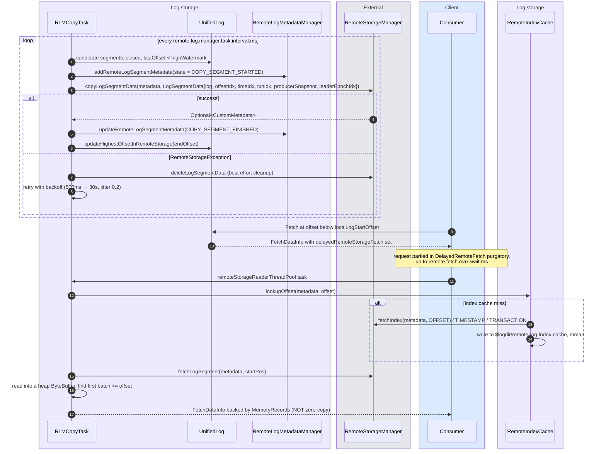

**What to notice**

- The copy is a **two-phase commit against the metadata store**: `COPY_SEGMENT_STARTED` is durably recorded before a single byte goes to object storage, so an orphaned upload is always discoverable. A crash between the two writes leaves a `COPY_SEGMENT_STARTED` record that readers ignore and the expiration task can clean up.
- Five artefacts per segment are uploaded, not one: `.log`, `.index`, `.timeindex`, `.txnindex` (optional), the producer `.snapshot`, and a serialized leader-epoch index. That last one is what lets a *new* leader validate remote segments against its epoch chain (`isRemoteSegmentWithinLeaderEpochs`).
- A remote read **defeats zero copy completely**. `RemoteLogManager.read` allocates `ByteBuffer.allocate(updatedFetchSize)` and copies through the JVM heap. Budget heap and `remote.log.reader.threads` (**10**, queue **100**) accordingly.
- Remote fetches are served from a purgatory (`DelayedRemoteFetch`), so a slow object store back-pressures a bounded pool rather than the request handler threads.
- `RemoteIndexCache` is a Caffeine **LFU** cache of the index files on local disk under `remote-log-index-cache/`, capped by `remote.log.index.file.cache.total.size.bytes` (**1 GiB**) with a **15 min** TTL. Index lookups on remote data are therefore local after the first hit.

---

## 5. State machines

### 5.1 Log segment lifecycle

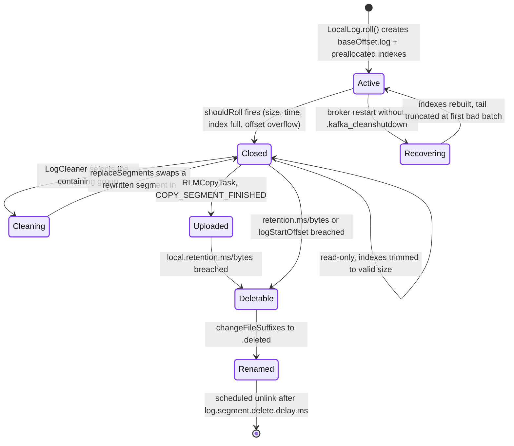

**What to notice**

- Only the *Active* segment accepts writes and only it is exempt from cleaning; everything else in this diagram is a read-only file.
- `Uploaded` is not a file state on disk — it is `highestOffsetInRemoteStorage` in `UnifiedLog` plus a `COPY_SEGMENT_FINISHED` record in the metadata topic. A tiered segment sits in both places until local retention removes it.
- `Deletable → Renamed → unlink` is the only deletion path; there is no code that unlinks a live segment synchronously except `UnifiedLog.delete()` (topic deletion).
- `Cleaning` never mutates a segment in place; it writes a whole new file and swaps.

### 5.2 `RemoteLogSegmentState` (KIP-405)

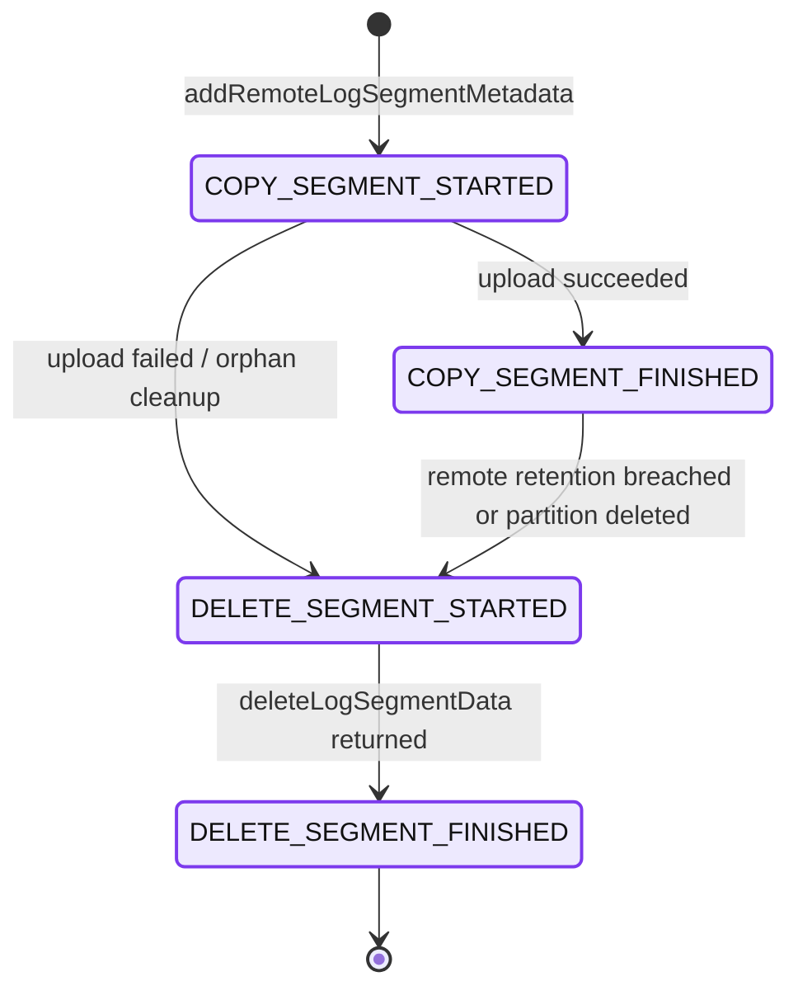

**What to notice**

- `RemoteLogSegmentState.isValidTransition` enforces exactly these edges; a `null` source is only allowed to reach `COPY_SEGMENT_STARTED`. Every transition is an event appended to `__remote_log_metadata`.
- Only `COPY_SEGMENT_FINISHED` segments are visible to reads. `COPY_SEGMENT_STARTED` and `DELETE_SEGMENT_STARTED` are deliberately invisible, which makes both upload and deletion idempotent under retry.
- Deletion is also two-phase: mark, delete bytes, mark done. A crash mid-delete leaves `DELETE_SEGMENT_STARTED`, which the expiration task retries — the object store call must therefore be idempotent.
- There is no "verified" state. Kafka trusts the `RemoteStorageManager` implementation to be durable once `copyLogSegmentData` returns.

### 5.3 Cleaning state per partition (`LogCleaningState`)

```mermaid
stateDiagram-v2
    [*] --> Idle
    Idle --> LogCleaningInProgress : grabFilthiestCompactedLog picked it
    LogCleaningInProgress --> Idle : doneCleaning, checkpoint updated
    LogCleaningInProgress --> LogCleaningAborted : abortCleaning (partition moved / deleted / dir change)
    LogCleaningAborted --> LogCleaningPaused : cleaner thread observes the abort
    Idle --> LogCleaningPaused : abortAndPauseCleaning (leadership change, alter log dir)
    LogCleaningPaused --> LogCleaningPaused : nested pause, pauseCount++
    LogCleaningPaused --> Idle : resumeCleaning, pauseCount reaches 0
    LogCleaningInProgress --> Uncleanable : IOException or LogCleaningException
    Uncleanable --> [*] : requires operator action; partition excluded from selection

    class Idle,LogCleaningInProgress,LogCleaningAborted,LogCleaningPaused,Uncleanable store

  classDef store    fill:#ede9fe,stroke:#7c3aed,stroke-width:2px,color:#111
```

**What to notice**

- Pausing is **reference-counted** (`LogCleaningPaused(pauseCount)`), because several controllers (dir move, partition reassignment, delete-records) can pause the same partition concurrently.
- `Uncleanable` is sticky and exposed as the `uncleanable-partitions-count` / `uncleanable-bytes` gauges. A single poison record (e.g. a key-less record on a compacted topic written by an old client) parks a partition here forever and the log grows without bound — the classic "compaction silently stopped" incident.
- An abort does not roll back a partially-written `.cleaned` file; that file is removed on the next startup or overwritten on the next round.

---

## 6. Component deep dives

### 6.1 The record batch (magic v2) — on-disk format

Every byte on disk in Kafka 4.x is a v2 batch. `DefaultRecordBatch` header, exact offsets from source:

| Off | Len | Field | Notes |
|---:|---:|---|---|
| 0 | 8 | `BaseOffset` (int64) | Absolute offset of the first record. Rewritten by the leader on append. |
| 8 | 4 | `BatchLength` (int32) | Bytes after this field. `LOG_OVERHEAD = 12` = these two fields. |
| 12 | 4 | `PartitionLeaderEpoch` (int32) | Stamped by the leader; **excluded from the CRC** so it can be set without recomputing it. |
| 16 | 1 | `Magic` (int8) | `2`. Must be readable before anything else is interpreted. |
| 17 | 4 | `CRC` (uint32) | **CRC-32C (Castagnoli)** over bytes 21..end — i.e. attributes through the last record. |
| 21 | 2 | `Attributes` (int16) | See bit table below. |
| 23 | 4 | `LastOffsetDelta` (int32) | Also the last sequence delta. `lastOffset = baseOffset + lastOffsetDelta`. |
| 27 | 8 | `BaseTimestamp` (int64) | First record's timestamp — **or** the delete horizon when bit 6 is set. |
| 35 | 8 | `MaxTimestamp` (int64) | Max create-time in the batch, or the broker's append time under `LogAppendTime`. |
| 43 | 8 | `ProducerId` (int64) | `-1` if non-idempotent. |
| 51 | 2 | `ProducerEpoch` (int16) | |
| 53 | 4 | `BaseSequence` (int32) | |
| 57 | 4 | `RecordsCount` (int32) | |
| 61 | — | `Records` | Compressed as one blob if a codec is set. |

`RECORD_BATCH_OVERHEAD = 61` bytes.

**Attributes bits** (`DefaultRecordBatch`, LSB first):

| Bits | Mask | Meaning |
|---|---|---|
| 0–2 | `0x07` | Compression codec: 0 none, 1 gzip, 2 snappy, 3 lz4, 4 zstd |
| 3 | `0x08` | Timestamp type: 0 = `CreateTime`, 1 = `LogAppendTime` |
| 4 | `0x10` | `isTransactional` |
| 5 | `0x20` | `isControl` — the batch holds control records, not user data |
| 6 | `0x40` | `hasDeleteHorizon` — `BaseTimestamp` is a delete horizon, not a timestamp (KIP-534) |
| 7–15 | — | Unused |

**Record inside the batch** (`DefaultRecord`), all varint/varlong (ZigZag):

```
Record => Length:varint, Attributes:int8, TimestampDelta:varlong, OffsetDelta:varint,
          KeyLength:varint, Key:bytes, ValueLength:varint, Value:bytes,
          HeadersCount:varint, Headers:[HeaderKeyLength:varint, HeaderKey, HeaderValueLength:varint, HeaderValue]
```

`MAX_RECORD_OVERHEAD = 21` bytes (5 length + 10 timestamp + 5 offset + 1 attributes). Record attributes are entirely unused in v2. A null key or value is encoded as varint `-1` (1 byte). There is **no per-record CRC** in v2.

**Why the batch is the unit of everything**

- **Unit of compression.** The codec compresses the concatenated record bytes as one stream, so cross-record redundancy (repeated JSON keys, repeated headers) is exploited. It also means the broker cannot inspect a single record without decompressing the whole batch — which is precisely why it is designed never to need to.
- **Unit of the CRC.** One CRC-32C per batch instead of one per record: cheaper to compute, cheaper to verify, and it covers the compressed bytes so the broker validates without decompressing. `PartitionLeaderEpoch` sits *before* the CRC and is excluded from it — a deliberate layout choice so the leader can stamp its epoch on every incoming batch without touching the checksum.
- **Unit of idempotence.** `(producerId, producerEpoch, baseSequence, lastOffsetDelta)` identifies a batch. The broker's duplicate check compares first and last sequence numbers of the incoming batch against the last five batches recorded per producer. Per-record dedup would need per-record sequence state; per-batch needs 5 small entries.
- **Unit of offset assignment.** Only `baseOffset` and `lastOffsetDelta` are written; individual record offsets are deltas. Reassigning offsets on the broker is therefore an 8-byte write, not a rewrite of every record.
- **Survives compaction.** The cleaner preserves first/last offset and sequence even when every record in a batch is removed — an empty batch header is retained (`BatchRetention.RETAIN_EMPTY`) so a rebuilt producer state after leader failover does not produce a spurious `OutOfOrderSequenceException`.

### 6.2 Control batches and control records

- A control batch has attribute bit 5 set and contains exactly one record whose **key** is `Version:int16, Type:int16`. Types: `ABORT(0)`, `COMMIT(1)`, plus KRaft-only `LEADER_CHANGE(2)`, `SNAPSHOT_HEADER(3)`, `SNAPSHOT_FOOTER(4)`, `KRAFT_VERSION(5)`, `KRAFT_VOTERS(6)`.
- **Markers occupy real offsets.** `WriteTxnMarkers` from the transaction coordinator appends a control batch to every partition the transaction touched; that batch consumes one offset. This is why a consumer of a transactional topic sees offset gaps — `position()` advances past markers the client filters out, and why `endOffset - lastRecordOffset` can be > 1 on an idle transactional partition.
- The log cleaner **never key-compacts control records** (`shouldRetainRecord` returns `true` for any control batch that is not being wholesale discarded). Markers are removed only via the delete-horizon path, and only after every record of that transaction has itself been removed.
- Aborted transactions additionally get an entry in the segment's `.txnindex` at commit-marker time; that index is what `read_committed` fetches consult.

### 6.3 `UnifiedLog` — the partition

**Responsibility.** The only mutable entry point for a partition's log. Owns `logStartOffset`, `localLogStartOffset`, the high watermark, the first-unstable-offset (→ LSO), the leader-epoch cache, producer state, and the segment set via `LocalLog`.

**Concurrency.** One `Object lock` per log. *All* appends, rolls, truncations and segment deletions serialize on it. Reads do **not** take it — they navigate a `ConcurrentSkipListMap<Long, LogSegment>` (`LogSegments`) and a `volatile LogOffsetMetadata nextOffsetMetadata`, which is why a read can never see a partially appended batch (LEO is published after the bytes land) and why deletion must rename-then-defer-unlink.

**`nextOffsetMetadata`.** A `volatile LogOffsetMetadata(messageOffset = LEO, segmentBaseOffset, relativePositionInSegment)`. Publishing all three atomically is what lets a fetch bound itself by *file position* rather than by offset — no index lookup needed for the common "read up to the HW on the active segment" case.

**`recoveryPoint`.** The offset below which everything is known to be fsynced. Advanced only by `flush(offset)`; checkpointed to `recovery-point-offset-checkpoint` every `log.flush.offset.checkpoint.interval.ms` (**60 s**). It is the *only* thing that bounds unclean-restart recovery work.

**Flush.**

```java
if (localLog.unflushedMessages() >= config().flushInterval) flush(false);   // per append
// and, on roll:
flushUptoOffsetExclusive(newSegment.baseOffset());
// and, from the kafka-log-flusher task:
if (time.milliseconds() - log.lastFlushTime() >= log.config().flushMs) log.flush(false);
```

Defaults make the first and third dead code: `log.flush.interval.messages = Long.MAX_VALUE`, `log.flush.scheduler.interval.ms = Long.MAX_VALUE` (and `log.flush.interval.ms` defaults to it). **Why "never" is the right default:**

1. Durability is provided by `acks=all` + `min.insync.replicas ≥ 2` + `unclean.leader.election.enable=false` (default since 4.0 semantics). Losing one broker's page cache loses nothing; losing *all* replicas' page cache simultaneously requires a correlated power failure across racks.
2. An fsync on the append path serializes producers behind disk latency and destroys the sequential-write advantage. Kafka's throughput story *is* "batched sequential writes, no synchronous durability".
3. Roll-time flush plus a 60 s recovery-point checkpoint keeps unclean-restart recovery bounded to roughly one segment per partition, so the operational cost of not flushing is recovery time, not data loss.
4. Setting `log.flush.interval.messages=1` is the classic anti-tuning: it converts Kafka into a very slow database and does not improve the durability guarantee that clients actually rely on.

**Failure handling.** Every I/O path is wrapped in `maybeHandleIOException`, which converts an `IOException` into a `KafkaStorageException` *and* notifies `LogDirFailureChannel`. `ReplicaManager` then takes the whole log dir offline, moves its partitions to other brokers, and — if the controller cannot be told within `log.dir.failure.timeout.ms` (**30 s**) — shuts the broker down.

### 6.4 `LogSegment` and `FileRecords`

- `LogSegment` = `FileRecords log` + `LazyIndex<OffsetIndex>` + `LazyIndex<TimeIndex>` + `TransactionIndex` + `baseOffset`, `indexIntervalBytes`, `rollJitterMs`. The indexes are **lazy**: a closed segment's index is only `mmap`ed on first use, which matters when a broker holds 100 000 segments.
- `FileRecords` is a `FileChannel` plus `start`/`end`/`size`. `append(MemoryRecords)` is a plain `channel.write` at the end. `slice(pos, size)` returns a view with no I/O.
- `translateOffset(offset)` = `offsetIndex.lookup(offset)` (largest entry ≤ target) → `FileRecords.searchForOffsetFromPosition`, which walks *batch headers only* forward from that position.
- **Offset-overflow roll.** `canConvertToRelativeOffset(offset)` checks `offset - baseOffset` fits in an int32. A segment whose offsets would exceed `Integer.MAX_VALUE` above its base must roll — otherwise the relative-offset index is unrepresentable. This normally never fires (2^31 records in one 1 GiB segment is impossible), but it does after `DeleteRecords` or a malformed append creates a huge offset jump, and `LogLoader` has a dedicated `splitOverflowedSegment` path for logs written by buggy older versions.

### 6.5 The sparse offset index

**Format.** `OffsetIndex.ENTRY_SIZE = 8`: `relativeOffset:int32` (offset − segment base offset) + `physicalPosition:int32`. File is preallocated to `roundDownToExactMultiple(log.index.size.max.bytes, 8)` = **10 485 760 bytes** = 1 310 720 entries, then trimmed on roll.

**Time index.** `TimeIndex.ENTRY_SIZE = 12`: `timestamp:int64` + `relativeOffset:int32`. Semantics: *"the largest timestamp seen before this offset is T"*, so timestamps are monotonically non-decreasing within the file. An entry is appended alongside every offset-index entry, plus a final one on roll carrying the segment's max timestamp. `ListOffsets(timestamp)` binary-searches it, then scans the log from the returned offset.

**Density.** One entry per `log.index.interval.bytes` (**4096**) of *log* bytes — checked per batch, so it is "at least every 4 KiB", not exactly. 1 GiB segment ⇒ ~262 144 offset-index entries ⇒ ~2 MiB of index, ~0.2% overhead. The 10 MiB index cap is reached before the 1 GiB segment cap only if `index.interval.bytes` is lowered below ~800; otherwise `log.segment.bytes` always wins the roll race.

**Access.** `AbstractIndex` `mmap`s the file `READ_WRITE` (writable) or `READ_ONLY` (closed). All reads and writes go through the page cache; there is no heap copy of index data. A `ReentrantLock` guards only remap/resize, not lookups.

**Warm/cold binary search.** Standard binary search touches a fixed set of pages that shifts as the index grows, so pages that were hot become cold and a lookup page-faults. `AbstractIndex` therefore splits:

```java
if (target > indexEntry[end - N]) binarySearch(end - N, end);   // warm section
else                              binarySearch(begin, end - N);  // cold section
protected final int warmEntries() { return 8192 / entrySize(); } // 1024 offset entries, 682 time entries
```

**What to notice**

- `N = 8192 bytes` is chosen so the warm section is at most 2–3 4 KiB pages and *every* warm lookup touches all of them — the section stays genuinely warm. Larger N would leave interior pages untouched and cold.
- 8 KiB of offset index ≈ **4 MiB** of log (2.7 MiB for the time index) at default settings. In-sync followers and tailing consumers are always inside that window, so their lookups never fault.
- The source comment records the motivating incident: a cold-page fault in the index pushed at-least-once produce latency from a few ms to ~1 s.
- Index lookups are `largestLowerBoundSlotFor` (offset index, "greatest entry ≤ target") vs `smallestUpperBoundSlotFor` (used by `fetchUpperBoundOffset` for txn-index range bounding).

**Transaction index.** `.txnindex` is *not* an `AbstractIndex` — it is a plain appended `FileChannel` of fixed 40-byte `AbortedTxn` records: `version:int16(=0), producerId:int64, firstOffset:int64, lastOffset:int64, lastStableOffset:int64`. It is created lazily and only when a transaction aborts within that segment. `read_committed` fetches scan it linearly.

### 6.6 Zero copy — and exactly when it is defeated

The fast path: `FileRecords.writeTo(TransferableChannel, offset, length)` → `destChannel.transferFrom(fileChannel, position, count)` → `PlaintextTransportLayer.transferFrom` → `FileChannel.transferTo` → **`sendfile(2)`**. Bytes go page cache → socket buffer → NIC without entering the JVM.

Zero copy is **defeated** in these cases:

| Case | Mechanism | Cost |
|---|---|---|
| **TLS** (`SSL://`, `SASL_SSL://`) | `SslTransportLayer.transferFrom` allocates a **32 KiB direct** `fileChannelBuffer`, reads the file into it, and hands it to `SSLEngine.wrap` for encryption into `netWriteBuffer` | Per-connection buffers + a full read + encrypt per byte. Typically 20–40% broker CPU increase on read-heavy clusters |
| **Down-conversion** | Historically, a client asking for magic < 2 forced `FileRecords.downConvert` into heap `MemoryRecords`. **In Kafka 4.0 message formats v0/v1 were removed** (`log.message.format.version` and `message.format.version` configs deleted), so this path no longer exists for on-disk data | Gone in 4.x; was the classic OOM source pre-3.0 |
| **Tiered fetch** | `RemoteLogManager.read` does `ByteBuffer.allocate(fetchSize)` and copies from the object-store `InputStream` | Full heap copy; bounded by `remote.log.reader.threads` |
| **Compression translation** | `broker.compression.type` / topic `compression.type` set to anything other than `producer` forces `LogValidator` to decompress and recompress on the **write** path; the stored bytes then differ from what the producer sent | CPU on append; reads stay zero-copy afterwards |
| **`read_committed` with aborted txns** | The `Records` are still a `FileRecords` slice (zero copy survives), but the response carries an aborted-transaction list the broker built by scanning `.txnindex` | Extra index I/O, not a copy |
| **Share groups / KIP-932 acquisition** | Any feature that must inspect or rewrite records server-side | Not a storage-layer concern, but the same rule applies: touch the bytes, lose sendfile |

### 6.7 Page cache reliance

- **Kafka maintains no record cache.** The broker heap holds indexes' mmap references, producer state, and per-request buffers — not log data. `-Xmx6g` on a 256 GiB machine is normal; the other 250 GiB is page cache.
- **Writes** land in dirty pages. The kernel writes back per `vm.dirty_background_ratio` (start background writeback) and `vm.dirty_ratio` (block the writer). Typical Kafka tuning **lowers** these (e.g. `dirty_background_ratio=5`, `dirty_ratio=60` or the `_bytes` variants) so writeback is smooth and continuous rather than a periodic stall; a large `dirty_ratio` with a slow disk produces multi-second produce latency spikes when a writer finally blocks.
- **Reads** for tailing consumers hit pages written seconds ago — a page-cache hit, no disk I/O at all. This is the single most important performance property of the design: *N consumers reading the tail cost one disk write and zero disk reads.*
- **Cold reads** (a consumer resetting to `earliest`, a backfill job, a rebuilt replica) miss the cache. Then: index page fault → log page faults → the kernel's readahead kicks in and pulls the segment in sequentially. Kafka's sequential layout means readahead is maximally effective; on Linux, raising `blockdev --setra` for the log device is standard tuning. The damage of a cold reader is **cache eviction** — it evicts the hot tail that everyone else is reading, converting a 0-IOPS cluster into a disk-bound one. `read.replica.selector` / follower fetching and, better, tiered storage exist partly to keep this traffic off the hot brokers.
- **Why no self-managed cache.** Three reasons, all from the original design: (a) a JVM object cache costs ~2× the data size in overhead and produces GC pauses proportional to cache size; (b) the page cache survives a broker restart, an in-process cache does not, so a restart would need a warm-up phase; (c) any user-space cache would have to be *copied to* to serve a read, which forfeits `sendfile`. Delegating to the kernel is what makes both the write path and the read path copy-free.

### 6.8 `LogManager`

**Responsibility.** Discover log dirs, take `.lock` per dir, load every partition in parallel, own the four checkpoint files per dir, run the five scheduled tasks, handle log-dir failure and `AlterReplicaLogDirs`.

**Threading.**
- Startup/shutdown: `Executors.newFixedThreadPool(num.recovery.threads.per.data.dir)` **per log dir**, torn down after loading.
- Steady state: a shared `KafkaScheduler` runs `kafka-log-retention`, `kafka-log-flusher`, `kafka-recovery-point-checkpoint`, `kafka-log-start-offset-checkpoint`, and a self-rescheduling `kafka-delete-logs`.
- `LogCleaner` runs its own `log.cleaner.threads` (**1**).

**Partition placement.** A new partition goes to the log dir with the fewest partitions (not the most free bytes) — a well-known limitation on heterogeneous disks.

**Log-dir failure.** `LogDirFailureChannel` is a bounded queue; a single `IOException` anywhere in the storage layer offlines the whole dir. With `log.dirs` containing multiple disks and no RAID (the recommended layout in KRaft), the blast radius is one disk's partitions.

### 6.9 Retention (`cleanup.policy=delete`)

`UnifiedLog.deleteOldSegments()` runs three predicates in order, each via `deleteOldSegments(predicate, reason)`:

1. **`deleteLogStartOffsetBreachedSegments`** — segment's next base offset ≤ `logStartOffset`. Always runs, even for `cleanup.policy=compact`.
2. **`deleteRetentionSizeBreachedSegments`** — total size > `retention.bytes` (or `local.retention.bytes` when tiering is on), oldest-first, never below the size limit.
3. **`deleteRetentionMsBreachedSegments`** — `now - segment.largestTimestamp > retention.ms` (or `local.retention.ms`). Note: **largest record timestamp**, not file mtime, when a valid timestamp exists; mtime is the fallback.

Invariants enforced in `deleteSegments`:
- The active segment is never deleted; if all segments are deletable, a `roll()` happens first so a live segment always exists.
- `logStartOffset` (or `localLogStartOffset` under tiering) is advanced to the next surviving segment's base offset **before** the segments leave the lookup map.
- Producer `.snapshot` files for deleted segments are removed alongside.
- Deletion is bounded by the high watermark: `maybeIncrementLogStartOffset` throws if asked to move `logStartOffset` above the HW.

`DeleteRecords` (the admin API / `kafka-delete-records.sh`) is the *manual* version: it calls `maybeIncrementLogStartOffset(offset, ClientRecordDeletion)`, which makes the data invisible immediately; the retention loop then physically removes the now-below-start segments on its next pass. Records are never punched out of a segment.

Physical removal: `changeFileSuffixes("", ".deleted")` for `.log`/`.index`/`.timeindex`/`.txnindex`, then a `scheduleOnce("delete-file", ..., log.segment.delete.delay.ms)`.

### 6.10 `LogCleaner` (`cleanup.policy=compact`)

**Threads.** `log.cleaner.threads` (**1**) `CleanerThread`s, each with its own `Cleaner`, `SkimpyOffsetMap` and I/O buffers. A shared `Throttler` (window **300 ms**) enforces `log.cleaner.io.max.bytes.per.second` (**`Double.MAX_VALUE`** = unthrottled) across *read + write* bytes of all threads.

**`SkimpyOffsetMap`.** A flat open-addressed hash table in one `ByteBuffer`:
- `bytesPerEntry = hashSize + 8` = **24** (MD5 digest is 16 bytes + int64 offset).
- Memory per thread = `log.cleaner.dedupe.buffer.size / log.cleaner.threads` = **128 MiB** by default ⇒ `slots = 128 MiB / 24` ≈ **5.59 M** entries.
- Usable entries = `slots × log.cleaner.io.buffer.load.factor` (**0.9**) ≈ **5.03 M keys per cleaning round**.
- Collisions are resolved by probing on the *hash*, not the key. **The map stores no keys** — only MD5 digests. An MD5 collision therefore silently drops the older key's surviving record. With ~5 M entries the birthday probability against a 128-bit digest is negligible (~10⁻²⁷), which is the entire justification for calling it "skimpy". It also means the map cannot support deletes.
- If the map fills mid-segment, the round simply stops there; the next round resumes from the new checkpoint. Compaction is incremental, never all-or-nothing.

**Selection (`LogCleanerManager.grabFilthiestCompactedLog`).**

```
firstDirtyOffset      = max(cleaner-offset-checkpoint value, logStartOffset)
firstUncleanableOffset= min(activeSegment.baseOffset,
                            baseOffset of first non-active segment with largestTimestamp > now - min.compaction.lag.ms)
cleanableRatio        = cleanableBytes / (cleanBytes + cleanableBytes)
needCompactionNow     = a dirty non-active segment is older than max.compaction.lag.ms
eligible              = (needCompactionNow && cleanableBytes > 0) || cleanableRatio > min.cleanable.dirty.ratio
pick                  = argmax(cleanableRatio) among eligible
```

**Knobs and what they actually control**

| Knob | Default | Effect |
|---|---|---|
| `min.cleanable.dirty.ratio` | `0.5` | Steady-state trade: 0.5 means up to ~50% of a compacted log is duplicates. Lower ⇒ more I/O, smaller log. |
| `min.compaction.lag.ms` | `0` | Guarantees a record stays readable this long before it can be compacted away — lets consumers see every intermediate value. |
| `max.compaction.lag.ms` | `Long.MAX_VALUE` | Upper bound on how long a *dirty* record can go uncompacted; the only thing that forces compaction on a low-write partition. Needed for GDPR-style delete SLAs. |
| `delete.retention.ms` | `86400000` (24 h) | How long a tombstone survives *after* the round that stamped its delete horizon. A consumer must complete a full scan within this window or it can miss the delete. |
| `log.cleaner.io.max.bytes.per.second` | `Double.MAX_VALUE` | Read+write throttle. Set it on shared disks or a compaction burst will starve produce traffic. |
| `log.cleaner.dedupe.buffer.size` | `134217728` (128 MiB) | Total across threads. Too small ⇒ many partial rounds ⇒ repeated re-reads. |
| `log.cleaner.io.buffer.size` | `524288` (512 KiB) | Read/write buffers, split across threads and doubled dynamically up to `max.message.bytes`. |
| `log.cleaner.backoff.ms` | `15000` | Sleep when nothing is cleanable. |
| `log.cleaner.enable` | `true` | **Deprecated since 4.1, removal in 5.0.** Setting it `false` breaks `__consumer_offsets`. |

**Tombstones and the delete horizon (KIP-534).**

1. Round *k* sees a batch containing a tombstone with `deleteHorizonMs` unset. It retains the tombstone, rewrites the batch with attribute bit 6 set and `BaseTimestamp = now + delete.retention.ms`.
2. Round *k+n*, once `now >= batch.deleteHorizonMs`, drops the tombstone (`shouldRetainDeletes = false`).
3. Transaction markers piggyback on the same mechanism, with the extra rule that a marker is never dropped while any record of its transaction survives.

**`cleanup.policy=compact,delete`.** Both loops apply: `deleteOldSegments()` runs the three retention predicates *and* the cleaner compacts the survivors. This is what `__consumer_offsets` uses in spirit (it is `compact` only) and what makes "keep the latest value per key, but not older than 30 days" expressible.

**Why the active segment is never cleaned.** Three reasons: (a) it is being appended to concurrently and the cleaner rewrites whole files, so there is no safe consistent snapshot without holding the append lock for the duration; (b) the *last* value of a key must remain to be found, and the newest write is by definition in the active segment; (c) `replaceSegments` swaps files by rename, which cannot be done under a live `FileChannel` receiving appends. The operational consequence — a compacted topic never shrinks below one segment of the newest data — is the reason `segment.ms` matters on compacted topics.

### 6.11 Tiered storage (KIP-405)

**Status.** Early access in 3.6; **GA in 3.9** (the docs link "Kafka Tiered Storage GA Release Notes"). Fully supported in 4.x. Documented limitations in 4.3: **no compacted topics**, all tiered topics must be deleted before disabling `remote.log.storage.system.enable`, admin actions need clients ≥ 3.0, and segments without a producer snapshot (topics created before 2.8) cannot be tiered.

**The two SPIs** (`storage/api`, package `org.apache.kafka.server.log.remote.storage`):

- **`RemoteStorageManager`** — the bytes. `copyLogSegmentData(metadata, LogSegmentData)`, `fetchLogSegment(metadata, startPos[, endPos])`, `fetchIndex(metadata, IndexType)` where `IndexType ∈ {OFFSET, TIMESTAMP, PRODUCER_SNAPSHOT, TRANSACTION, LEADER_EPOCH}`, `deleteLogSegmentData(metadata)`. No implementation ships with Kafka; `LocalTieredStorage` in the test jar is the reference for experiments.
- **`RemoteLogMetadataManager`** — the index of what exists where. `addRemoteLogSegmentMetadata`, `updateRemoteLogSegmentMetadata` (both `CompletableFuture<Void>`), `remoteLogSegmentMetadata(tp, epoch, offset)`, `highestOffsetForEpoch`, `listRemoteLogSegments`, `remoteLogSize`, `putRemotePartitionDeleteMetadata`, `onPartitionLeadershipChanges`, `onStopPartitions`, `nextSegmentWithTxnIndex`, `isReady`.

**`TopicBasedRemoteLogMetadataManager` (the default).** Stores metadata as events in an internal Kafka topic:

| Property | Value |
|---|---|
| Topic | `__remote_log_metadata` |
| Partitions | `remote.log.metadata.topic.num.partitions` = **50** |
| Replication | `remote.log.metadata.topic.replication.factor` = **3** |
| `min.insync.replicas` | `remote.log.metadata.topic.min.isr` = **2** — *new config in 4.3, KIP-1235* |
| `cleanup.policy` | `delete` (never compacted) |
| `retention.ms` | `remote.log.metadata.topic.retention.ms` = **-1** (infinite) |
| Partitioning | `murmur2(hash(topicIdMSB, topicIdLSB, partition)) % numPartitions` — a `TopicIdPartition`'s metadata always lands in one partition |

Each broker runs a producer and a consumer against this topic; `ConsumerTask` materializes events into an in-memory `RemoteLogMetadataCache` per assigned user partition, and `remote.log.metadata.consume.wait.ms` (**120 s**) bounds how long a write waits to be observed by the local consumer before being considered applied. Retention must be **infinite**: the topic is a materialized log, not a queue, and truncating it loses the map of what lives in the object store — this is the single most dangerous misconfiguration in tiered storage.

**Three configs new in 4.3:**

- **KIP-1235** — `remote.log.metadata.topic.min.isr`, default **2**. Before 4.3 the internal topic inherited the broker's `min.insync.replicas`, which on a `min.insync.replicas=1` cluster made metadata loss possible. Existing clusters should fix the topic's config with `kafka-configs.sh`; the new default only applies at creation.
- **KIP-1208** — the `remote.log.metadata.admin.` prefix, so the `Admin` client `TopicBasedRemoteLogMetadataManager` uses for topic creation/description can be configured independently of `remote.log.metadata.common.client.`, `...producer.` and `...consumer.`.
- **KIP-1023** — `follower.fetch.last.tiered.offset.enable`, default **false**, dynamic. When on, a brand-new follower replica with no local data skips straight to the leader's earliest *pending-upload* offset instead of replicating from `logStartOffset`. It is paired with `ListOffsets` v11 and a new timestamp sentinel `EARLIEST_PENDING_UPLOAD_TIMESTAMP (-6)`. This turns "add a broker to a 50 TB tiered topic" from hours of replication into minutes, at the cost that the new replica cannot serve historical local reads (it serves them from the remote tier instead).

**Retention split.**

```
local.retention.ms    default -2  → means "use retention.ms"
local.retention.bytes default -2  → means "use retention.bytes"
```

`UnifiedLog.localRetentionMs(config, tieringActive)` returns `config.localRetentionMs()` when `remote.storage.enable=true && remote.log.copy.disable=false`, else `config.retentionMs`. So with tiering on and `local.retention.*` unset, **local retention equals total retention** and nothing is ever removed locally — a very common misconfiguration. Setting `local.retention.ms` to hours while `retention.ms` is months is the intended shape.

Local deletion is additionally gated by `isSegmentEligibleForDeletion`: a segment is only removable locally once `lastOffset <= highestOffsetInRemoteStorage` (or the log start offset already moved past it). Tiering therefore cannot lose data by racing retention.

**Thread pools.**

| Pool | Config | Default |
|---|---|---|
| Copier | `remote.log.manager.copier.thread.pool.size` | **10** |
| Expiration | `remote.log.manager.expiration.thread.pool.size` | **10** |
| Follower (read highest uploaded offset) | `remote.log.manager.follower.thread.pool.size` | **2** |
| Remote reads | `remote.log.reader.threads` | **10**, queue `remote.log.reader.max.pending.tasks` = **100** |

`remote.log.manager.thread.pool.size` is **deprecated since 4.2** in favour of the follower pool. All four are dynamically resizable.

**Remote read path.** `ReplicaManager` sees `fetchOffset < localLogStartOffset`, gets a `FetchDataInfo` carrying `delayedRemoteStorageFetch`, and parks the request in `DelayedRemoteFetch` for up to `remote.fetch.max.wait.ms` (**500 ms**). A reader thread resolves epoch → `RemoteLogSegmentMetadata`, uses `RemoteIndexCache` for the position, streams from the object store into a heap buffer, finds the first batch ≥ the requested offset, and (for `read_committed`) collects aborted transactions — possibly walking to the *next* segment via `nextSegmentWithTxnIndex`.

---

## 7. Guarantees

- **Ordering.** Total order within a partition, established by the single append lock and by offsets being assigned by the leader only. No ordering across partitions.
- **Offset immutability.** Once assigned and acknowledged, an offset never refers to different data. Compaction removes records but never renumbers them; that is why compacted logs have offset gaps.
- **Durability.** A record is durable when it is in the page cache of `min.insync.replicas` brokers and acknowledged with `acks=all`. It is *not* fsynced. The formal guarantee is "survives the loss of up to `replicationFactor − minInSyncReplicas` brokers", not "survives a datacenter power cut".
- **Atomicity of a batch.** A batch is written by one `channel.write` and validated by one CRC. A torn tail is detected on recovery and truncated; a half-written batch is never visible because LEO advances only after the write returns.
- **Idempotence.** Per `(producerId, producerEpoch, partition)`, the last 5 batches' sequence ranges are remembered; an exact replay returns the original offsets. Survives leader failover because producer state is rebuilt from `.snapshot` + log replay, and because compaction preserves empty batch headers.
- **Read isolation.** `read_uncommitted` reads up to the high watermark; `read_committed` up to the last stable offset (LSO = first unstable offset, i.e. the first offset of the oldest open transaction) and filters aborted records client-side using the broker-supplied `.txnindex`-derived list.
- **Compaction guarantee.** Any consumer that reads from `logStartOffset` to the head sees, for every key, *at least* the final value. It sees a tombstone for a deleted key provided it completes the scan within `delete.retention.ms`. It may or may not see intermediate values — `min.compaction.lag.ms` is the only way to bound that.
- **What is *not* guaranteed.** That an acknowledged record survives a simultaneous power loss on all replicas. That a segment's timestamps are monotonic (they are per *index entry*, not per record). That compaction ever runs (an `Uncleanable` partition silently stops). That a tiered segment is readable if `__remote_log_metadata` was truncated.

---

## 8. Failure modes

| Failure | Detection | Recovery | Blast radius |
|---|---|---|---|
| **Unclean broker shutdown** | `.kafka_cleanshutdown` absent at startup | Full rescan of every segment ≥ `recoveryPoint`, index rebuild, tail truncation | Broker startup time ∝ unflushed data / `num.recovery.threads.per.data.dir`; hours on a large broker with a stale recovery point |
| **Corrupt batch (torn write, bad sector)** | `batch.ensureValid()` CRC-32C failure during recovery, or `CorruptRecordException` on fetch | Segment truncated at the last good batch; **all later segments deleted**; refilled by replication | That partition on that broker; data loss if it happens on all replicas |
| **Corrupt or missing index** | `sanityCheck` → `CorruptIndexException` / `NoSuchFileException` | `LogSegment.recover()` rebuilds `.index`, `.timeindex`, `.txnindex` from the log | Startup latency only — indexes are always derivable |
| **Disk full** | `IOException` on append → `KafkaStorageException` | Log dir offlined via `LogDirFailureChannel`; partitions moved; broker shuts down if the controller cannot be notified within `log.dir.failure.timeout.ms` (30 s) | All partitions on that log dir |
| **Log dir I/O error** | Same channel | Same | One disk's partitions (no RAID ⇒ smaller blast radius but more frequent events) |
| **Compaction stuck (`Uncleanable`)** | `uncleanable-partitions-count`, `uncleanable-bytes`, `max-dirty-percent` gauges; log grows without bound | Fix the poison record (usually a null-key record on a compacted topic) or the I/O error, then restart the broker | One partition, but on `__consumer_offsets` it degrades the whole cluster's group coordination |
| **Cleaner too slow / throttled** | `max-clean-time-secs`, `cleaner-recopy-percent`, growing `cleanableRatio` | Raise `log.cleaner.threads`, raise dedupe buffer, lower `min.cleanable.dirty.ratio`, raise the io throttle | Disk usage on compacted topics |
| **Segment roll storm** | Coordinated fsync spikes at `segment.ms` boundaries; produce p99 spikes | Set `log.roll.jitter.ms` | All partitions on the broker simultaneously |
| **Cold-read cache thrash** | Page-cache hit ratio collapse; disk read IOPS spike; tail consumers suddenly disk-bound | Move backfill readers to followers (`replica.selector.class`) or to the remote tier; rate-limit them | Every consumer on that broker |
| **`__remote_log_metadata` truncated or under-replicated** | Remote fetches return `OffsetOutOfRangeException`; segments unreachable | None automatic — the map of remote objects is gone. Prevent with `retention.ms=-1` and `min.isr=2` (default from 4.3) | All tiered topics on the cluster |
| **Remote store unavailable** | `RemoteStorageException`, copier retries with backoff 500 ms → 30 s (jitter 0.2) | Copying stalls, local retention is *blocked* (segments are not eligible for local deletion until uploaded) ⇒ local disk fills | Whole broker's disk, eventually |
| **Remote reader pool saturated** | `remote.log.reader.max.pending.tasks` (100) exceeded → tasks rejected | Raise pool/queue, or throttle backfill consumers | Historical reads only; tail reads unaffected |
| **Offset overflow in a segment** | `LogSegmentOffsetOverflowException` during load | `LogLoader.splitOverflowedSegment` splits it into multiple segments | One partition, at startup |

---

## 9. Scalability & performance

**Where the ceilings are.**

- **Sequential write bandwidth.** With no fsync and batched appends, a broker writes at the disk's sequential rate. NVMe: GB/s. The bottleneck moves to the network or to replication fan-out long before the disk.
- **Number of open files.** Each segment is `.log` + `.index` + `.timeindex` (+ `.txnindex`). 10 000 partitions × 10 segments × 3 ≈ **300 000 fds**. `nofile` limits and mmap count (`vm.max_map_count`) are real ceilings.
- **Partition count per broker.** Dominated by (a) per-partition memory (`ProducerStateManager`, index mmaps, `LogSegments` maps), (b) startup recovery time, (c) the controller's metadata. KRaft removed the ZooKeeper ceiling; practical numbers are in the tens of thousands.
- **Compaction throughput.** One partition at a time per cleaner thread, `O(dirty bytes)` reads to build the map plus `O(total bytes)` to rewrite. A large compacted topic with default `log.cleaner.threads=1` is a common silent bottleneck.
- **Page cache pressure.** The working set is "tail of every active partition". Once `active partitions × recent bytes > RAM`, tail reads start hitting disk and throughput falls off a cliff.

**Batching, everywhere.**
- Producer: `linger.ms` / `batch.size` build the batch.
- Broker: one CRC, one index decision, one `channel.write` per batch.
- Index: one entry per 4 KiB of log, not per record.
- Fetch: `fetch.min.bytes` / `fetch.max.wait.ms` batch on the read side; `sendfile` transfers a whole slice.

**Back-pressure.** There is essentially none in the storage layer — it is upstream. Produce requests queue in the request handler pool and then in purgatory waiting for `acks`; fetches wait in purgatory for `fetch.min.bytes`. Storage back-pressure appears only as latency (page-cache writeback stalls at `vm.dirty_ratio`) or as hard failure (disk full).

**Hot spots.**
- A single hot partition serializes on one append lock and one disk — partition count is the only horizontal lever.
- `__consumer_offsets` (50 partitions, compacted) is the most compaction-sensitive topic in any cluster.
- Roll boundaries: fsync + index trim + producer snapshot all happen at once.
- The `.txnindex` scan on `read_committed` fetches of partitions with many aborts.

**Numbers worth memorizing.**

| Quantity | Value |
|---|---|
| Batch header overhead | 61 bytes (`RECORD_BATCH_OVERHEAD`) |
| Per-record minimum overhead | 21 bytes (`MAX_RECORD_OVERHEAD`), less with small varints |
| `LOG_OVERHEAD` (offset + length) | 12 bytes |
| Offset index entry | 8 bytes; time index entry 12 bytes |
| Index density | 1 entry / 4096 log bytes ⇒ ~0.2% overhead |
| Warm section | 8192 bytes = 1024 offset entries ≈ 4 MiB of log |
| Default segment | 1 GiB, 7 days |
| Default index cap | 10 MiB (1 310 720 offset entries) |
| Dedupe map capacity | 128 MiB / 24 B × 0.9 ≈ 5.03 M keys per round |
| Default retention | 7 days, unlimited bytes |
| Deletion delay | 60 s |
| TLS read buffer | 32 KiB direct, per connection |

---

## 10. Trade-offs & alternatives

- **Log vs. LSM vs. B-tree.** Kafka's log has O(1) append and O(1) sequential read regardless of data size, but supports no point lookup by key (compaction is the closest thing, and it is O(log size) offline, not O(1) online). Cassandra's LSM buys keyed point reads at the cost of read amplification, compaction write amplification, and bloom filters. A B-tree buys ordered range scans at the cost of random writes. Kafka chose the structure that matches its access pattern — *"append at the end, read forward from an offset"* — and refuses to serve any other pattern.
- **No fsync vs. fsync-on-commit.** Kafka trades single-node durability for throughput and recovers it with replication. Contrast etcd/ZooKeeper, which fsync every Raft/ZAB entry, and pay ~1–25 ms per write for it. The consequence Kafka lives with: a correlated power failure across a rack can lose acknowledged data, which is why rack-aware replica placement is not optional at scale.
- **Page cache vs. an in-process cache.** Delegating caching to the kernel gives restart-warm caches, no GC pressure, and `sendfile`. The cost is zero control: you cannot pin the tail, you cannot prevent a backfill reader from evicting it, and you cannot instrument hit ratio from inside the JVM. Systems that manage their own buffer pool (PostgreSQL, RocksDB) get control and pay in copies.
- **Sparse index vs. dense index.** A dense (per-record) index would make lookups O(1) but cost 8 bytes per record — for 100-byte records that is 8% overhead and an index far too large to keep resident. The sparse index trades a bounded linear scan (≤ `index.interval.bytes`, reading only headers) for a ~0.2% index. The dial is `log.index.interval.bytes`, and almost nobody should touch it.
- **Compaction vs. a real KV store.** Log compaction gives "changelog with a bounded snapshot" semantics for free on top of the existing storage engine, which is what makes Kafka Streams' state stores and `__consumer_offsets` possible. It is not a KV store: no point reads, no read-your-writes, unbounded latency to see a compaction take effect. Systems that need those use a database and use Kafka as the log in front of it.
- **Tiered storage vs. an external archive.** KIP-405 keeps the *offset space* unified — a consumer reading from offset 0 does not know or care that the first hour came from S3. The alternative (Connect → S3 → a different query engine) forks the offset space and the schema. The price is a plugin SPI whose failure modes (metadata topic loss, object store latency in the fetch path, no compaction support) are now part of Kafka's blast radius.
- **Comparable systems.** Pulsar splits the log into BookKeeper ledgers with its own tiering (segment-centric from day one, which makes rebalancing cheap but adds a whole distributed component). Redpanda reimplements the same log with `io_uring`, thread-per-core and its own cache, deliberately *not* trusting the page cache. Kinesis and Pub/Sub hide the log entirely and charge for the abstraction. Kafka's differentiator remains the combination of *offset-addressable immutable log* + *zero-copy fan-out* + *compaction as a first-class retention mode*.

---

## 11. Staff-level questions

**Q1. A broker restarts uncleanly and takes 45 minutes to come up. Walk through why, and rank the fixes.**
Startup time is `LogLoader.recoverLog` re-reading every segment from each partition's checkpointed `recoveryPoint` to its LEO, verifying every batch CRC and rebuilding all three indexes, at `num.recovery.threads.per.data.dir` (**2**) partitions in flight *per log dir*. Three things drive it: how far behind the recovery point is, how many partitions the broker holds, and how few recovery threads there are. Fixes in order: (1) raise `num.recovery.threads.per.data.dir` — it is the only linear lever and costs nothing at steady state; (2) use more log dirs (JBOD) so the per-dir pools multiply; (3) shrink `log.segment.bytes` so less data sits above the recovery point and so index rebuilds are cheaper; (4) verify `log.flush.offset.checkpoint.interval.ms` is still 60 s and the checkpoint isn't failing to write; (5) reduce partitions per broker. Note what is *not* a fix: enabling `log.flush.interval.messages`. It would advance the recovery point more often but cripple the produce path — you would trade a rare 45-minute restart for permanent latency.

**Q2. `sendfile` and TLS. Quantify what you lose and what you'd do about it.**
With `PLAINTEXT`, `FileRecords.writeTo` calls `FileChannel.transferTo` and the bytes go page cache → socket without entering user space. With TLS, `SslTransportLayer.transferFrom` allocates a 32 KiB direct buffer per connection, reads the file into it, and calls `SSLEngine.wrap` to encrypt into `netWriteBuffer` — so every byte is read, copied and encrypted in the JVM. In practice that is a large step up in broker CPU on read-heavy clusters and a per-connection memory cost. What you do: (a) accept it for external traffic but keep the *inter-broker* listener plaintext inside a trusted network if your threat model allows — replication is usually the majority of read bytes; (b) make sure the JVM is using the hardware AES-NI path (modern JDK does by default); (c) push historical reads to the remote tier or to follower fetching so the encrypted fan-out is smaller; (d) do **not** try to compensate with compression changes — `broker.compression.type` other than `producer` adds decompress/recompress on the *write* path and does not help reads.

**Q3. A compacted topic keeps growing. It is not stuck on `Uncleanable`. What's happening?**
Most likely one of four things. (1) `min.cleanable.dirty.ratio=0.5` means half the log is *supposed* to be duplicates — the log is behaving correctly and you want a lower ratio. (2) The keys are effectively unique (a UUID key), so there is nothing to compact and compaction is pure overhead — the topic wants `delete`, not `compact`. (3) The write rate is low, so the active segment never rolls and the newest values are permanently uncleanable — fix with `segment.ms` and/or `max.compaction.lag.ms`. (4) The cleaner is starved: one `log.cleaner.threads`, a large `__consumer_offsets` plus this topic, and a dedupe buffer too small for the dirty key count, so each round only partially maps a segment and repeatedly re-reads. Diagnose with `max-dirty-percent`, `cleaner-recopy-percent`, `max-clean-time-secs` and the cleaner's "Offset map is full" log line. Also check tombstones: they only disappear one round *after* the round that stamps their delete horizon, so `delete.retention.ms` sets a floor on how much tombstone volume you carry.

**Q4. Why does the batch CRC start *after* the `partitionLeaderEpoch` field, and what would break if it didn't?**
The layout is `baseOffset, batchLength, partitionLeaderEpoch, magic, CRC, attributes, …` and the CRC covers only from `attributes` to the end. The leader stamps its own epoch into every incoming batch so that followers and recovery can build the leader-epoch cache and do epoch-based truncation (KIP-101) instead of truncating by high watermark. If the epoch were inside the CRC, the broker would have to **recompute the CRC-32C over the entire batch — including the compressed payload — for every batch it receives**, at line rate, for every partition. That would eliminate the in-place fast path entirely and make `compression.type=producer` no cheaper than recompression. The field order is a direct consequence: mutable-by-broker fields (`baseOffset`, `batchLength`, `partitionLeaderEpoch`) live before the CRC; everything the producer owns lives after it. `magic` also sits before the CRC because you must know the format version before you can know how to interpret the CRC.

**Q5. You enable tiered storage on a 40 TB topic and local disks fill up anyway. Diagnose.**
Four candidates, in order of likelihood. (1) `local.retention.ms`/`local.retention.bytes` were left at the default `-2`, which means "inherit `retention.ms`/`retention.bytes`" — so local retention equals total retention and nothing is ever removed locally. (2) The copier can't keep up or the object store is erroring: `isSegmentEligibleForDeletion` refuses to delete a local segment until `lastOffset <= highestOffsetInRemoteStorage`, so a stalled uploader *blocks local retention by design*. Check `RemoteCopyLagBytes`, the copier pool size (**10**), `remote.log.manager.copy.max.bytes.per.second`, and the retry-backoff log lines. (3) `remote.log.copy.disable=true` was set on the topic, which silently falls back to plain local retention semantics. (4) The topic is `cleanup.policy=compact` — tiering does not support compacted topics at all, so nothing is being uploaded. Also verify the `__remote_log_metadata` topic is healthy: if it is under-replicated or (worse) had a finite retention configured, metadata writes stall and copies never reach `COPY_SEGMENT_FINISHED`. On 4.3 the new `remote.log.metadata.topic.min.isr=2` default helps new clusters, but an existing `__remote_log_metadata` keeps whatever it was created with — fix it with `kafka-configs.sh`.

---

## 12. Config reference (verified defaults, Kafka 4.3.1)

All values read from `ServerLogConfigs`, `LogConfig`, `CleanerConfig`, `ReplicationConfigs`, `TransactionLogConfig`, `RemoteLogManagerConfig`, `TopicBasedRemoteLogMetadataManagerConfig`.

### Segments, indexes, roll

| Broker config | Topic config | Default | Notes |
|---|---|---|---|
| `log.dir` | — | `/tmp/kafka-logs` | Fallback when `log.dirs` unset |
| `log.dirs` | — | `null` | Comma-separated; JBOD |
| `log.segment.bytes` | `segment.bytes` | `1073741824` (1 GiB) | Min 1 MiB |
| `log.roll.ms` | `segment.ms` | `null` → `log.roll.hours` | |
| `log.roll.hours` | — | `168` (7 days) | |
| `log.roll.jitter.ms` | `segment.jitter.ms` | `null` → `log.roll.jitter.hours` | |
| `log.roll.jitter.hours` | — | `0` | Set it to de-synchronize rolls |
| `log.index.size.max.bytes` | `segment.index.bytes` | `10485760` (10 MiB) | Preallocated, trimmed on roll |
| `log.index.interval.bytes` | `index.interval.bytes` | `4096` | Index density |
| `log.preallocate` | `preallocate` | `false` | Needed on Windows |
| `message.max.bytes` | `max.message.bytes` | `1048588` | = 1 MiB + `LOG_OVERHEAD` (12) |

### Timestamps and validation

| Broker config | Topic config | Default |
|---|---|---|
| `log.message.timestamp.type` | `message.timestamp.type` | `CreateTime` |
| `log.message.timestamp.before.max.ms` | `message.timestamp.before.max.ms` | `Long.MAX_VALUE` (unbounded) |
| `log.message.timestamp.after.max.ms` | `message.timestamp.after.max.ms` | `3600000` (1 h) |
| `compression.type` | `compression.type` | `producer` |
| `log.message.format.version` / `message.format.version` | — | **removed in 4.0** |

### Flush, checkpoints, recovery

| Broker config | Topic config | Default | Notes |
|---|---|---|---|
| `log.flush.interval.messages` | `flush.messages` | `Long.MAX_VALUE` | Effectively "never" |
| `log.flush.interval.ms` | `flush.ms` | `null` → `log.flush.scheduler.interval.ms` | |
| `log.flush.scheduler.interval.ms` | — | `Long.MAX_VALUE` | Effectively "never" |
| `log.flush.offset.checkpoint.interval.ms` | — | `60000` | Writes `recovery-point-offset-checkpoint` |
| `log.flush.start.offset.checkpoint.interval.ms` | — | `60000` | Writes `log-start-offset-checkpoint` |
| `replica.high.watermark.checkpoint.interval.ms` | — | `5000` | Writes `replication-offset-checkpoint` |
| `num.recovery.threads.per.data.dir` | — | `2` | Per log dir |
| `log.dir.failure.timeout.ms` | — | `30000` | Broker suicides after this |
| `log.initial.task.delay.ms` | — | `30000` | Internal; delays all LogManager tasks |

### Retention (delete)

| Broker config | Topic config | Default |
|---|---|---|
| `log.cleanup.policy` | `cleanup.policy` | `delete` |
| `log.retention.ms` | `retention.ms` | `null` → minutes → hours |
| `log.retention.minutes` | — | `null` |
| `log.retention.hours` | — | `168` (7 days) |
| `log.retention.bytes` | `retention.bytes` | `-1` (unlimited) |
| `log.retention.check.interval.ms` | — | `300000` (5 min) |
| `log.segment.delete.delay.ms` | `file.delete.delay.ms` | `60000` |
| `min.insync.replicas` | `min.insync.replicas` | `1` |
| `unclean.leader.election.enable` | `unclean.leader.election.enable` | `false` |

### Compaction

| Broker config | Topic config | Default |
|---|---|---|
| `log.cleaner.threads` | — | `1` |
| `log.cleaner.io.max.bytes.per.second` | — | `Double.MAX_VALUE` (unthrottled) |
| `log.cleaner.dedupe.buffer.size` | — | `134217728` (128 MiB) |
| `log.cleaner.io.buffer.size` | — | `524288` (512 KiB) |
| `log.cleaner.io.buffer.load.factor` | — | `0.9` |
| `log.cleaner.backoff.ms` | — | `15000` |
| `log.cleaner.enable` | — | `true` (**deprecated 4.1**, removal 5.0) |
| `log.cleaner.min.cleanable.ratio` | `min.cleanable.dirty.ratio` | `0.5` |
| `log.cleaner.delete.retention.ms` | `delete.retention.ms` | `86400000` (24 h) |
| `log.cleaner.min.compaction.lag.ms` | `min.compaction.lag.ms` | `0` |
| `log.cleaner.max.compaction.lag.ms` | `max.compaction.lag.ms` | `Long.MAX_VALUE` |
| — | (hash algorithm) | `MD5`, `bytesPerEntry` = 24 |

### Producer state

| Broker config | Default |
|---|---|
| `producer.id.expiration.ms` | `86400000` (24 h) |
| `producer.id.expiration.check.interval.ms` | `600000` (10 min, internal) |
| `LATE_TRANSACTION_BUFFER_MS` (constant) | `300000` (5 min) |

### Tiered storage (KIP-405)

| Config | Default | Notes |
|---|---|---|
| `remote.log.storage.system.enable` | `false` | Broker-wide master switch |
| `remote.storage.enable` (topic) | `false` | |
| `remote.log.storage.manager.class.name` | *(none)* | No built-in implementation |
| `remote.log.metadata.manager.class.name` | `org.apache.kafka.server.log.remote.metadata.storage.TopicBasedRemoteLogMetadataManager` | |
| `remote.log.storage.manager.impl.prefix` | `rsm.config.` | |
| `remote.log.metadata.manager.impl.prefix` | `rlmm.config.` | |
| `remote.log.metadata.manager.listener.name` | *(none)* | Mandatory with the default RLMM |
| `local.retention.ms` (topic) | `-2` | `-2` ⇒ inherit `retention.ms` |
| `local.retention.bytes` (topic) | `-2` | `-2` ⇒ inherit `retention.bytes` |
| `remote.log.copy.disable` (topic) | `false` | |
| `remote.log.delete.on.disable` (topic) | `false` | |
| `remote.log.manager.copier.thread.pool.size` | `10` | |
| `remote.log.manager.expiration.thread.pool.size` | `10` | |
| `remote.log.manager.follower.thread.pool.size` | `2` | |
| `remote.log.manager.thread.pool.size` | `2` | **deprecated 4.2** |
| `remote.log.manager.task.interval.ms` | `30000` | |
| `remote.log.manager.task.retry.backoff.ms` | `500` | |
| `remote.log.manager.task.retry.backoff.max.ms` | `30000` | |
| `remote.log.manager.task.retry.jitter` | `0.2` | |
| `remote.log.manager.copy.max.bytes.per.second` | `Long.MAX_VALUE` | |
| `remote.log.manager.fetch.max.bytes.per.second` | `Long.MAX_VALUE` | |
| `remote.log.reader.threads` | `10` | |
| `remote.log.reader.max.pending.tasks` | `100` | |
| `remote.fetch.max.wait.ms` | `500` | |
| `remote.list.offsets.request.timeout.ms` | `30000` | |
| `remote.log.index.file.cache.total.size.bytes` | `1073741824` (1 GiB) | |
| `remote.log.index.file.cache.ttl.ms` | `900000` (15 min) | |
| `remote.log.metadata.custom.metadata.max.bytes` | `128` | |
| `remote.log.metadata.topic.num.partitions` | `50` | |
| `remote.log.metadata.topic.replication.factor` | `3` | |
| `remote.log.metadata.topic.retention.ms` | `-1` (infinite) | Never make this finite |
| **`remote.log.metadata.topic.min.isr`** | **`2`** | **New in 4.3, KIP-1235** |
| `remote.log.metadata.consume.wait.ms` | `120000` | |
| `remote.log.metadata.initialization.retry.max.timeout.ms` | `120000` | Broker exits if exceeded |
| `remote.log.metadata.initialization.retry.interval.ms` | `100` | |
| `remote.log.metadata.common.client.` / `.producer.` / `.consumer.` | *(prefixes)* | |
| **`remote.log.metadata.admin.`** | *(prefix)* | **New in 4.3, KIP-1208** |
| **`follower.fetch.last.tiered.offset.enable`** | **`false`** | **New in 4.3, KIP-1023**; dynamic broker config |

---

## 13. Sources

**Kafka source, tag `4.3.1` (`github.com/apache/kafka`)**

- `storage/src/main/java/org/apache/kafka/storage/internals/log/` — `UnifiedLog`, `LocalLog`, `LogSegment`, `LogSegments`, `LogLoader`, `LogManager`, `LogConfig`, `LogValidator`, `LogFileUtils`, `AbstractIndex`, `OffsetIndex`, `TimeIndex`, `TransactionIndex`, `AbortedTxn`, `LazyIndex`, `LogCleaner`, `LogCleanerManager`, `Cleaner`, `CleanerConfig`, `SkimpyOffsetMap`, `LogCleaningState`, `LogToClean`, `ProducerStateManager`, `RemoteIndexCache`, `LogOffsetMetadata`, `FetchDataInfo`, `RollParams`
- `storage/src/main/java/org/apache/kafka/storage/internals/checkpoint/` — `OffsetCheckpointFile`, `LeaderEpochCheckpointFile`, `PartitionMetadataFile`, `PartitionMetadata`, `CleanShutdownFileHandler`
- `storage/src/main/java/org/apache/kafka/server/log/remote/storage/` — `RemoteLogManager`, `RemoteLogManagerConfig`
- `storage/src/main/java/org/apache/kafka/server/log/remote/metadata/storage/` — `TopicBasedRemoteLogMetadataManager`, `TopicBasedRemoteLogMetadataManagerConfig`, `RemoteLogMetadataTopicPartitioner`, `ConsumerTask`, `RemoteLogMetadataCache`
- `storage/api/src/main/java/org/apache/kafka/server/log/remote/storage/` — `RemoteStorageManager`, `RemoteLogMetadataManager`, `RemoteLogSegmentState`, `RemoteLogSegmentMetadata`
- `clients/src/main/java/org/apache/kafka/common/record/internal/` — `DefaultRecordBatch`, `DefaultRecord`, `MemoryRecords` (`RecordFilter`, `filterTo`), `FileRecords`, `Records`, `ControlRecordType`, `TransferableRecords`
- `clients/src/main/java/org/apache/kafka/common/network/` — `PlaintextTransportLayer.transferFrom`, `SslTransportLayer.transferFrom`, `TransferableChannel`
- `server-common/src/main/java/org/apache/kafka/server/config/ServerLogConfigs.java`, `ServerTopicConfigSynonyms.java`
- `server/src/main/java/org/apache/kafka/server/config/ReplicationConfigs.java`, `TransactionLogConfig.java`
- `core/src/main/scala/kafka/log/LogManager.scala`, `core/src/main/scala/kafka/server/ReplicaManager.scala`
- `docs/operations/tiered-storage.md`, `docs/getting-started/upgrade.md`

**KIPs**

- KIP-98 — Exactly-once delivery and transactional messaging (producer id, epoch, control records, `.txnindex`)
- KIP-101 — Leader epochs and `leader-epoch-checkpoint` (truncation without data loss)
- KIP-102/KIP-32/KIP-33 — Timestamps and the time index
- KIP-405 — Tiered storage (EA in 3.6, **GA in 3.9**)
- KIP-534 — Retain tombstones and transaction markers via a batch-level **delete horizon** (attribute bit 6)
- KIP-724 — Drop support for message formats v0 and v1 (**Kafka 4.0**); `log.message.format.version` / `message.format.version` removed
- KIP-1023 — `follower.fetch.last.tiered.offset.enable`, `ListOffsets` v11, `EARLIEST_PENDING_UPLOAD_TIMESTAMP (-6)` (**4.3**)
- KIP-1208 — `remote.log.metadata.admin.` config prefix (**4.3**)
- KIP-1235 — `remote.log.metadata.topic.min.isr`, default 2 (**4.3**)

**Papers and docs**

- Kreps, Narkhede, Rao, *Kafka: a Distributed Messaging System for Log Processing*, NetDB 2011 — the sendfile and page-cache argument in §3.2/§3.3
- Wang et al., *Building a Replicated Logging System with Apache Kafka*, VLDB 2015
- Apache Kafka documentation, §5 "Implementation" and §6 "Operations", 4.3
- Jay Kreps, *The Log: What every software engineer should know about real-time data's unifying abstraction* (2013) — the design rationale for offset-addressed immutable logs

---

### Version caveats and inference markers

- Everything is pinned to **4.3.1**. The three KIPs called out as "new in 4.3" were verified absent from the `4.1` and `4.2` branches.
- Log storage moved from Scala to Java across 3.5–4.0. Anything you read that refers to `kafka.log.Log`, `kafka.log.LogSegment` or `kafka.log.OffsetIndex` predates this; the classes are now `org.apache.kafka.storage.internals.log.*` and `Log` was renamed `UnifiedLog`.
- **[inferred]** claims, restated explicitly: (a) the "20–40% CPU" figure for TLS is an order-of-magnitude field estimate, not a measured Kafka benchmark — the *mechanism* (32 KiB direct buffer + `SSLEngine.wrap`, no `sendfile`) is documented in `SslTransportLayer`; (b) the `vm.dirty_ratio` / `blockdev --setra` tuning guidance is standard operational practice, not something Kafka's source or docs mandate; (c) "tens of thousands of partitions per broker" is an operational envelope, not a documented limit; (d) the claim that MD5 collisions in `SkimpyOffsetMap` would silently drop a record follows from the code (the map compares digests, not keys) but no such incident is documented.

---

<!-- nav:start -->
[← 00 Overview](kafka-00-overview.md) · **[Index](README.md)** · [02 Replication & ISR →](kafka-02-replication-isr.md)
<!-- nav:end -->
