# Kafka Deep Dive 02 — Replication, ISR and Consistency

**Series baseline: Apache Kafka 4.3** — 4.3.0 released 2026-05-22, latest patch **4.3.1** released 2026-06-25. KRaft-only — ZooKeeper was removed in 4.0.

Every default and code reference in this document was verified against that release
(`gradle.properties: version=4.3.1`). Source paths are given as repo-relative paths. Where a
claim is inferred rather than read out of code or official docs, it is marked **[inferred]**; everything else is **[documented]**.

> **Scope note.** The brief for this report asked for `leader.imbalance.per.broker.percentage` and
> `partition.metadata.max.age.ms`. **Neither exists in 4.3.1.** See
> [§13.2](#132-two-configs-in-the-brief-that-do-not-exist-in-43) — this is a real behavioural change,
> not an omission.

---

<!-- nav:start -->
[← 01 Log Storage](kafka-01-log-storage.md) · **[Index](README.md)** · [03 KRaft Controller →](kafka-03-kraft-controller.md)
<!-- nav:end -->

<!-- toc:start -->
<details>
<summary><b>Sections in this report (22)</b></summary>

- [1. Overview](#1-overview)
- [2. Architecture](#2-architecture)
- [3. The four offsets](#3-the-four-offsets)
- [4. Data flow](#4-data-flow)
- [5. Sequences](#5-sequences)
- [6. State machines](#6-state-machines)
- [7. Component deep dives](#7-component-deep-dives)
- [8. `min.insync.replicas` semantics — precisely](#8-mininsyncreplicas-semantics--precisely)
- [9. ISR management](#9-isr-management)
- [10. Leader epochs and truncation](#10-leader-epochs-and-truncation)
- [11. Eligible Leader Replicas (KIP-966)](#11-eligible-leader-replicas-kip-966)
- [12. Unclean leader election](#12-unclean-leader-election)
- [13. Preferred leader election and leader balancing](#13-preferred-leader-election-and-leader-balancing)
- [14. Partition reassignment](#14-partition-reassignment)
- [15. Rack awareness and follower fetching (KIP-392)](#15-rack-awareness-and-follower-fetching-kip-392)
- [16. Delivery guarantees end to end](#16-delivery-guarantees-end-to-end)
- [17. Failure modes](#17-failure-modes)
- [18. Scalability and performance](#18-scalability-and-performance)
- [19. Trade-offs and alternatives](#19-trade-offs-and-alternatives)
- [20. Staff-level questions](#20-staff-level-questions)
- [21. Config reference — verified defaults (Kafka 4.3.1)](#21-config-reference--verified-defaults-kafka-431)
- [22. Sources](#22-sources)

</details>
<!-- toc:end -->

## 1. Overview

- **Problem solved.** Give each partition a totally-ordered, durable log replicated across *N* brokers,
  with a single writer (the leader) and a tunable durability/latency/availability trade-off, without
  paying quorum-write costs on the hot path.
- **Key design bet — ISR, not quorum.** Kafka does **not** use majority quorums for data replication.
  It uses a *dynamic* replica set (the **ISR**, in-sync replicas) maintained by an external
  authority (the KRaft controller). A write is committed when every member of the current ISR has it.
  This gives `f`-failure tolerance with `f+1` replicas instead of the `2f+1` a majority quorum needs,
  at the cost of needing a separate consensus system (KRaft) to arbitrate ISR membership.
- **Key design bet — pull replication.** Followers *fetch* from the leader with the same `Fetch` RPC
  consumers use. The leader is stateless about follower progress except for what it learns from
  fetch requests. This makes replication and consumption share one code path, one purgatory, one
  zero-copy read path.
- **Key design bet — the high watermark is derived, lagging state.** Committed-ness is a *leader-local
  computation* propagated lazily in fetch responses. That laziness is the source of most of the
  subtlety in this document (two-round-trip HW advance, KIP-101 truncation, KIP-392 caveats).
- **Scale.** Production clusters run 10⁵–10⁶ partitions per cluster; a single broker commonly hosts
  4–10k partition replicas with `num.replica.fetchers` in the 4–16 range. ISR churn is a
  *metadata-write* workload on the controller, and is the usual reason large clusters tune
  `replica.lag.time.max.ms` upward.

---

## 2. Architecture

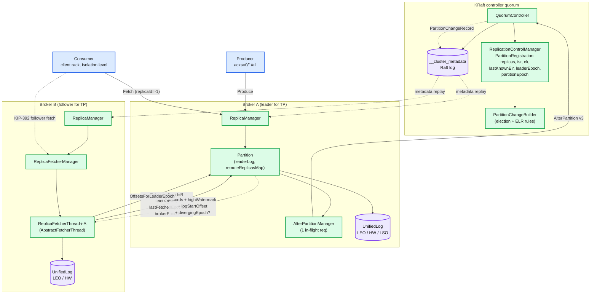
```mermaid
flowchart TD
  subgraph CTRL["KRaft controller quorum"]
    QC["QuorumController"]
    RCM["ReplicationControlManager<br/>PartitionRegistration:<br/>replicas, isr, elr,<br/>lastKnownElr, leaderEpoch,<br/>partitionEpoch"]
    PCB["PartitionChangeBuilder<br/>(election + ELR rules)"]
    MLOG[("__cluster_metadata<br/>Raft log")]
    QC --> RCM --> PCB
    QC --> MLOG
  end

  subgraph LB["Broker A (leader for TP)"]
    RML["ReplicaManager"]
    PL["Partition<br/>(leaderLog, remoteReplicasMap)"]
    APM["AlterPartitionManager<br/>(1 in-flight req)"]
    LOGL[("UnifiedLog<br/>LEO / HW / LSO")]
    RML --> PL --> LOGL
    PL --> APM
  end

  subgraph FB["Broker B (follower for TP)"]
    RMF["ReplicaManager"]
    RFM["ReplicaFetcherManager"]
    RFT["ReplicaFetcherThread-i-A<br/>(AbstractFetcherThread)"]
    LOGF[("UnifiedLog<br/>LEO / HW")]
    RMF --> RFM --> RFT --> LOGF
  end

  PROD["Producer<br/>acks=0/1/all"] -->|"Produce"| RML
  CONS["Consumer<br/>client.rack, isolation.level"] -->|"Fetch (replicaId=-1)"| RML
  RFT -->|"Fetch replicaId=B<br/>fetchOffset, lastFetchedEpoch,<br/>brokerEpoch"| PL
  PL -.->|"records + highWatermark<br/>+ logStartOffset<br/>+ divergingEpoch?"| RFT
  RFT -->|"OffsetsForLeaderEpoch"| PL
  APM -->|"AlterPartition v3"| QC
  QC -.->|"PartitionChangeRecord"| MLOG
  MLOG -.->|"metadata replay"| RML
  MLOG -.->|"metadata replay"| RMF
  CONS -.->|"KIP-392 follower fetch"| RFM

  class PROD,CONS client
  class QC,RCM,PCB,RML,PL,APM,RMF,RFM service
  class RFT service
  class MLOG,LOGL,LOGF store

  classDef client   fill:#dbeafe,stroke:#2563eb,stroke-width:2px,color:#111
  classDef service  fill:#dcfce7,stroke:#16a34a,stroke-width:2px,color:#111
  classDef store    fill:#ede9fe,stroke:#7c3aed,stroke-width:2px,color:#111
  classDef cache    fill:#fef3c7,stroke:#d97706,stroke-width:2px,color:#111
  classDef queue    fill:#cffafe,stroke:#0891b2,stroke-width:2px,color:#111
  classDef critical fill:#fee2e2,stroke:#dc2626,stroke-width:4px,color:#111
  classDef external fill:#e5e7eb,stroke:#6b7280,stroke-width:2px,color:#111,stroke-dasharray:4 3
  classDef decision fill:#fce7f3,stroke:#db2777,stroke-width:2px,color:#111
```

**What to notice**

- The leader never writes ISR changes directly to durable storage; it *proposes* them via the
  `AlterPartition` RPC and only observes them applied when the metadata log replays back to it.
  (Pre-KIP-497 this was a direct ZooKeeper write from the leader — see §9.3.)
- The controller is the only writer of `leaderEpoch`, `partitionEpoch`, `isr`, `elr`, `lastKnownElr`.
- The follower's `Fetch` is the *same RPC* as the consumer's, distinguished by `replicaId`.
- Metadata reaches brokers **only** through the `__cluster_metadata` Raft log replay, never by
  direct RPC from the controller (there is no `LeaderAndIsr`/`UpdateMetadata` push in KRaft).

---

## 3. The four offsets

Everything in this report reduces to who moves which of these and when.

| Offset | Owner | Advanced by | Meaning |
|---|---|---|---|
| **logStartOffset (LSO-start)** | each replica locally | retention deletion, `DeleteRecords` (leader-driven), tiered-storage upload | first offset still readable locally |
| **LEO** (log end offset) | each replica locally | `appendAsLeader` (leader) / `appendAsFollower` (follower) | next offset to be written |
| **HW** (high watermark) | **leader computes**, follower copies | leader: `Partition.maybeIncrementLeaderHW`; follower: `UnifiedLog.maybeUpdateHighWatermark(hw_from_response)` | last **committed** offset + 1 |
| **LSO** (last stable offset) | leader | `firstUnstableOffset` / transaction completion | `min(HW, first open transaction's first offset)` |

> Naming collision warning: "LSO" in Kafka docs means **last stable offset**. The *log start offset*
> is always spelled out.

### 3.1 Who advances the high watermark, exactly

`core/src/main/scala/kafka/cluster/Partition.scala:1010` — `maybeIncrementLeaderHW`:

```scala
private def maybeIncrementLeaderHW(leaderLog: UnifiedLog, currentTimeMs: Long): Boolean = {
  if (isUnderMinIsr) {                       // KIP-966 "strict min ISR" — see §11
    trace("Not increasing HWM because partition is under min ISR")
    return false
  }
  var newHighWatermark = leaderLog.logEndOffsetMetadata
  remoteReplicasMap.forEach { (_, replica) =>
    def shouldWaitForReplicaToJoinIsr =
      replicaState.isCaughtUp(leaderLogEndOffset.messageOffset, currentTimeMs, replicaLagTimeMaxMs) &&
      isReplicaIsrEligible(replica.brokerId)
    if (replicaState.logEndOffsetMetadata.messageOffset < newHighWatermark.messageOffset &&
        (partitionState.maximalIsr.contains(replica.brokerId) || shouldWaitForReplicaToJoinIsr))
      newHighWatermark = replicaState.logEndOffsetMetadata
  }
  leaderLog.maybeIncrementHighWatermark(newHighWatermark) ...
}
```

**What to notice**

- HW = `min(LEO)` over the **maximal ISR** — the committed ISR *plus* replicas the leader has
  proposed adding but the controller has not yet confirmed (KIP-497). Adding replicas only makes
  the set more restrictive, so a revert by the controller is always safe.
- It also waits for *caught-up-but-not-yet-in-ISR* replicas (`shouldWaitForReplicaToJoinIsr`). Without
  this, a rejoining follower could never catch up to a HW that keeps running away from it.
- The HW is monotonic on the leader (`maybeIncrementHighWatermark` only moves forward) but the
  *follower's* HW is set with `maybeUpdateHighWatermark`, which clamps to `[logStartOffset, LEO]` and
  logs a warning on non-monotonic moves.
- It is called from exactly three places: `appendRecordsToLeader` (ISR may be size 1),
  `updateFollowerFetchState` (a follower's LEO moved), and ISR change application.
- The HW is checkpointed to `replication-offset-checkpoint` in each log dir every
  `replica.high.watermark.checkpoint.interval.ms` (**5000**) by the `highwatermark-checkpoint`
  scheduler task (`ReplicaManager.scala:264`).

### 3.2 What a consumer can see

`Partition.scala` (`readRecords` / `FetchIsolation`):

| Fetch kind | `lastFetchableOffset` |
|---|---|
| follower fetch (`replicaId >= 0`) | **LEO** (`FetchIsolation.LOG_END`) |
| consumer, `isolation.level=read_uncommitted` (default) | **HW** |
| consumer, `isolation.level=read_committed` | **LSO** (last stable offset) |

> **`read_uncommitted` does not mean "read uncommitted from the log".** It only relaxes
> *transactional* visibility (aborted transactional records are returned). A consumer can **never**
> read past the high watermark. `read_uncommitted` ≤ HW, `read_committed` ≤ LSO ≤ HW. The
> `min.insync.replicas` doc string states this directly: *"Regardless of the `acks` setting, the
> messages will not be visible to the consumers until they are replicated to all in-sync replicas
> and the `min.insync.replicas` condition is met."*

---

## 4. Data flow

### 4.1 Write path (`acks=all`)

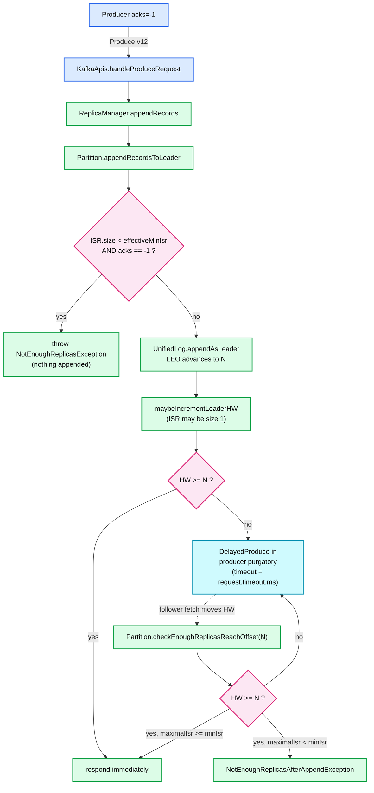
```mermaid
flowchart TD
  P["Producer acks=-1"] -->|"Produce v12"| KA["KafkaApis.handleProduceRequest"]
  KA --> RM["ReplicaManager.appendRecords"]
  RM --> AP["Partition.appendRecordsToLeader"]
  AP --> CHK{"ISR.size < effectiveMinIsr<br/>AND acks == -1 ?"}
  CHK -->|yes| ERR["throw NotEnoughReplicasException<br/>(nothing appended)"]
  CHK -->|no| APP["UnifiedLog.appendAsLeader<br/>LEO advances to N"]
  APP --> HW1["maybeIncrementLeaderHW<br/>(ISR may be size 1)"]
  HW1 --> PG{"HW >= N ?"}
  PG -->|yes| ACK["respond immediately"]
  PG -->|no| PUR["DelayedProduce in<br/>producer purgatory<br/>(timeout = request.timeout.ms)"]
  PUR -.->|"follower fetch moves HW"| CER["Partition.checkEnoughReplicasReachOffset(N)"]
  CER --> D{"HW >= N ?"}
  D -->|"no"| PUR
  D -->|"yes, maximalIsr >= minIsr"| ACK
  D -->|"yes, maximalIsr < minIsr"| ERR2["NotEnoughReplicasAfterAppendException"]

  class P,KA client
  class RM,AP,ERR,APP,HW1,ACK,CER,ERR2 service
  class PUR queue
  class CHK,PG,D decision

  classDef client   fill:#dbeafe,stroke:#2563eb,stroke-width:2px,color:#111
  classDef service  fill:#dcfce7,stroke:#16a34a,stroke-width:2px,color:#111
  classDef store    fill:#ede9fe,stroke:#7c3aed,stroke-width:2px,color:#111
  classDef cache    fill:#fef3c7,stroke:#d97706,stroke-width:2px,color:#111
  classDef queue    fill:#cffafe,stroke:#0891b2,stroke-width:2px,color:#111
  classDef critical fill:#fee2e2,stroke:#dc2626,stroke-width:4px,color:#111
  classDef external fill:#e5e7eb,stroke:#6b7280,stroke-width:2px,color:#111,stroke-dasharray:4 3
  classDef decision fill:#fce7f3,stroke:#db2777,stroke-width:2px,color:#111
```

**What to notice**

- The `min.insync.replicas` pre-check happens **before** the append and **only** when `requiredAcks == -1`.
  `acks=0` and `acks=1` never consult it.
- The check counts **`partitionState.isr.size`**, not the number of live replicas and not
  `replication.factor`.
- `effectiveMinIsr = min(min.insync.replicas, replicationFactor)` — a `min.insync.replicas=5` on an
  RF=3 topic behaves as 3, it does not permanently wedge the partition (`Partition.scala:246`).
- The append can succeed and *then* the ISR shrinks below min ISR while the request sits in
  purgatory. That is exactly `NotEnoughReplicasAfterAppendException`: the record **is in the leader's
  log and is committed**, but the producer is told the durability contract was not met. It is a
  retriable error, and retrying produces a duplicate unless the producer is idempotent
  (`enable.idempotence=true`, the default since 3.0).

### 4.2 Replication path (follower)

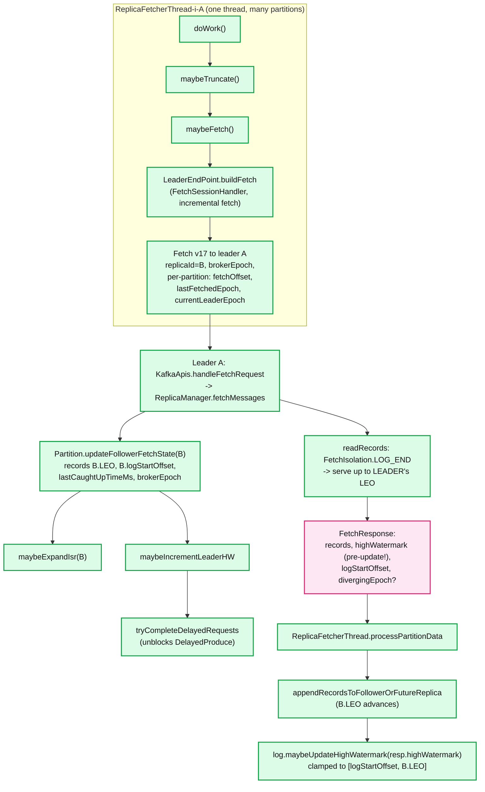
```mermaid
flowchart TD
  subgraph FT["ReplicaFetcherThread-i-A (one thread, many partitions)"]
    W["doWork()"] --> T["maybeTruncate()"]
    T --> F["maybeFetch()"]
    F --> BF["LeaderEndPoint.buildFetch<br/>(FetchSessionHandler, incremental fetch)"]
    BF --> SEND["Fetch v17 to leader A<br/>replicaId=B, brokerEpoch,<br/>per-partition: fetchOffset,<br/>lastFetchedEpoch, currentLeaderEpoch"]
  end
  SEND --> LEAD["Leader A: KafkaApis.handleFetchRequest<br/>-> ReplicaManager.fetchMessages"]
  LEAD --> UF["Partition.updateFollowerFetchState(B)<br/>records B.LEO, B.logStartOffset,<br/>lastCaughtUpTimeMs, brokerEpoch"]
  UF --> EX["maybeExpandIsr(B)"]
  UF --> HWA["maybeIncrementLeaderHW"]
  HWA --> CD["tryCompleteDelayedRequests<br/>(unblocks DelayedProduce)"]
  LEAD --> RD["readRecords: FetchIsolation.LOG_END<br/>-> serve up to LEADER's LEO"]
  RD --> RESP["FetchResponse:<br/>records, highWatermark (pre-update!),<br/>logStartOffset, divergingEpoch?"]
  RESP --> PPD["ReplicaFetcherThread.processPartitionData"]
  PPD --> APF["appendRecordsToFollowerOrFutureReplica<br/>(B.LEO advances)"]
  APF --> FHW["log.maybeUpdateHighWatermark(resp.highWatermark)<br/>clamped to [logStartOffset, B.LEO]"]

  class W,T,F,BF,SEND,LEAD,UF,EX service
  class HWA,CD,RD,PPD,APF,FHW service
  class RESP decision

  classDef client   fill:#dbeafe,stroke:#2563eb,stroke-width:2px,color:#111
  classDef service  fill:#dcfce7,stroke:#16a34a,stroke-width:2px,color:#111
  classDef store    fill:#ede9fe,stroke:#7c3aed,stroke-width:2px,color:#111
  classDef cache    fill:#fef3c7,stroke:#d97706,stroke-width:2px,color:#111
  classDef queue    fill:#cffafe,stroke:#0891b2,stroke-width:2px,color:#111
  classDef critical fill:#fee2e2,stroke:#dc2626,stroke-width:4px,color:#111
  classDef external fill:#e5e7eb,stroke:#6b7280,stroke-width:2px,color:#111,stroke-dasharray:4 3
  classDef decision fill:#fce7f3,stroke:#db2777,stroke-width:2px,color:#111
```

**What to notice**

- A follower reads with `FetchIsolation.LOG_END` — it sees the leader's **LEO**, i.e. uncommitted data.
  Only followers get this. That is what allows the HW to ever advance.
- The `highWatermark` in the response is the leader's HW **as of serving the read**, which is *before*
  the leader learns that this response was delivered. Hence §5.1.
- `processPartitionData` asserts `fetchOffset == log.logEndOffset` and throws `IllegalStateException`
  otherwise — the follower never reorders or gaps its own log.
- The follower's HW is never used for correctness of *its own* reads until it becomes a leader or a
  KIP-392 follower-fetch target. It is used for local retention and for the (now-obsolete)
  HW truncation fallback.

### 4.3 Read path (consumer)

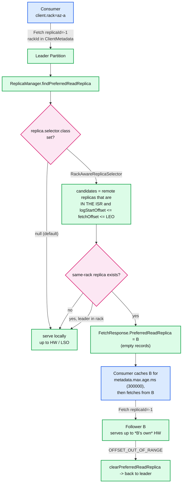
```mermaid
flowchart TD
  C["Consumer<br/>client.rack=az-a"] -->|"Fetch replicaId=-1<br/>rackId in ClientMetadata"| L["Leader Partition"]
  L --> FP["ReplicaManager.findPreferredReadReplica"]
  FP --> RS{"replica.selector.class<br/>set?"}
  RS -->|"null (default)"| LR["serve locally<br/>up to HW / LSO"]
  RS -->|"RackAwareReplicaSelector"| SEL["candidates = remote replicas that are<br/>IN THE ISR and logStartOffset <= fetchOffset <= LEO"]
  SEL --> SR{"same-rack replica exists?"}
  SR -->|no| LR
  SR -->|"yes, leader in rack"| LR
  SR -->|"yes"| PRR["FetchResponse.PreferredReadReplica = B<br/>(empty records)"]
  PRR --> C2["Consumer caches B for<br/>metadata.max.age.ms (300000),<br/>then fetches from B"]
  C2 -->|"Fetch replicaId=-1"| B["Follower B<br/>serves up to *B's own* HW"]
  B -->|"OFFSET_OUT_OF_RANGE"| CLR["clearPreferredReadReplica -> back to leader"]

  class C,C2 client
  class L,FP,LR,SEL,PRR,B,CLR service
  class RS,SR decision

  classDef client   fill:#dbeafe,stroke:#2563eb,stroke-width:2px,color:#111
  classDef service  fill:#dcfce7,stroke:#16a34a,stroke-width:2px,color:#111
  classDef store    fill:#ede9fe,stroke:#7c3aed,stroke-width:2px,color:#111
  classDef cache    fill:#fef3c7,stroke:#d97706,stroke-width:2px,color:#111
  classDef queue    fill:#cffafe,stroke:#0891b2,stroke-width:2px,color:#111
  classDef critical fill:#fee2e2,stroke:#dc2626,stroke-width:4px,color:#111
  classDef external fill:#e5e7eb,stroke:#6b7280,stroke-width:2px,color:#111,stroke-dasharray:4 3
  classDef decision fill:#fce7f3,stroke:#db2777,stroke-width:2px,color:#111
```

**What to notice**

- The selector only ever runs for **client** fetches (`FetchRequest.isValidBrokerId(replicaId)` is false).
- Candidates are restricted to **current ISR members** whose `[logStartOffset, LEO]` brackets the
  fetch offset — deliberately, to avoid the consumer chasing a permanently lagging follower.
- `RackAwareReplicaSelector` prefers the leader if the leader is in the client's rack, otherwise the
  **most caught-up** same-rack replica (`ReplicaView.comparator()`), otherwise the leader.
- The correctness caveat is in §15.2.

---

## 5. Sequences

### 5.1 Follower fetch and the two-round-trip HW advance

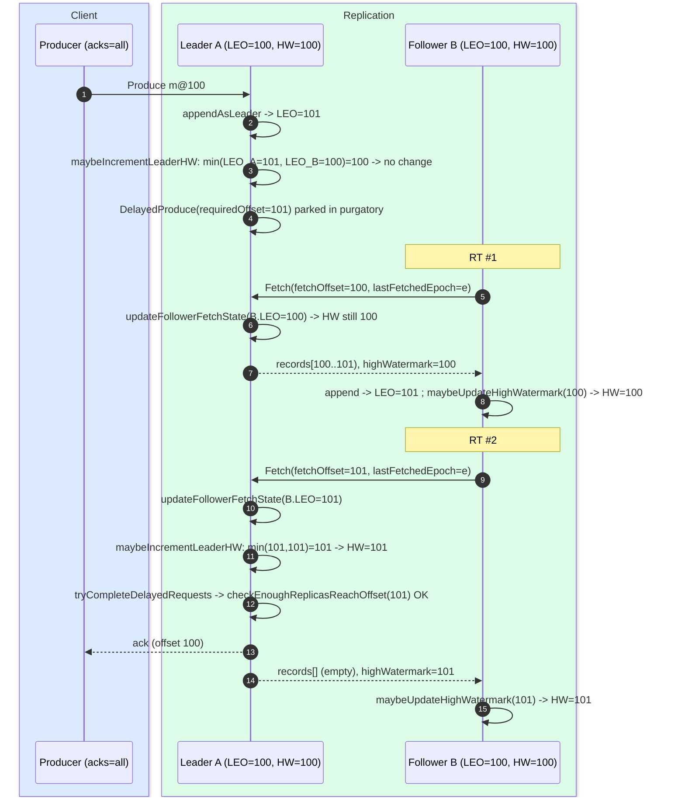
```mermaid
sequenceDiagram
  autonumber
  box rgb(219,234,254) Client
    participant P as Producer (acks=all)
  end
  box rgb(220,252,231) Replication
    participant L as Leader A (LEO=100, HW=100)
    participant F as Follower B (LEO=100, HW=100)
  end

  P->>L: Produce m@100
  L->>L: appendAsLeader -> LEO=101
  L->>L: maybeIncrementLeaderHW: min(LEO_A=101, LEO_B=100)=100 -> no change
  L->>L: DelayedProduce(requiredOffset=101) parked in purgatory
  Note over F: RT #35;1
  F->>L: Fetch(fetchOffset=100, lastFetchedEpoch=e)
  L->>L: updateFollowerFetchState(B.LEO=100) -> HW still 100
  L-->>F: records[100..101), highWatermark=100
  F->>F: append -> LEO=101 #59; maybeUpdateHighWatermark(100) -> HW=100
  Note over F: RT #35;2
  F->>L: Fetch(fetchOffset=101, lastFetchedEpoch=e)
  L->>L: updateFollowerFetchState(B.LEO=101)
  L->>L: maybeIncrementLeaderHW: min(101,101)=101 -> HW=101
  L->>L: tryCompleteDelayedRequests -> checkEnoughReplicasReachOffset(101) OK
  L-->>P: ack (offset 100)
  L-->>F: records[] (empty), highWatermark=101
  F->>F: maybeUpdateHighWatermark(101) -> HW=101
```

**What to notice**

- **Producer latency for `acks=all` is ~1 fetch RTT**, not two: the ack fires when the *request* of
  round 2 arrives, inside `updateFollowerFetchState`. With `replica.fetch.min.bytes=1` (default) the
  follower's round-2 request is issued immediately after processing round 1, so there is no
  `replica.fetch.wait.max.ms` (500 ms) penalty on a busy partition. On an **idle** partition round 2
  is a long-poll that returns empty after 500 ms — which is why `acks=all` p99 on low-traffic topics
  can look like 500 ms if you also have low-throughput producers, and why
  `replica.fetch.wait.max.ms` **must** stay below `replica.lag.time.max.ms` (see §9.5).
- **The follower's HW is one full RTT behind the leader's HW.** This is the "two-round-trip HW
  advance". Nothing on the produce path depends on it; three things do:
  1. **Leader failover**: a newly elected leader starts with a *stale* HW and must re-derive it. It
     initialises `leaderEpochStartOffset = leaderLog.logEndOffset` and refuses `ListOffsets(LATEST)`
     with `OFFSET_NOT_AVAILABLE` until the HW catches up past the epoch start
     (`Partition.scala:1455`). This is the "lagging HW after election" window.
  2. **KIP-392 follower fetching**: a follower serves only up to *its* HW, so followers lag consumers
     by ≥ 1 replication RTT (§15.2).
  3. **Pre-KIP-101 truncation**: a follower that restarts and truncates to its own stale HW throws
     away committed data (§10.3).
- The leader's HW is **not** persisted synchronously; it is checkpointed every 5 s. On an unclean
  leader restart the HW is recovered from the checkpoint and then re-derived from fetches.

### 5.2 ISR shrink

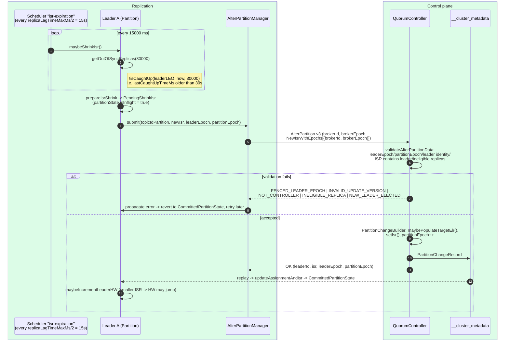
```mermaid
sequenceDiagram
  autonumber
  box rgb(220,252,231) Replication
    participant S as Scheduler "isr-expiration"<br/>(every replicaLagTimeMaxMs/2 = 15s)
    participant L as Leader A (Partition)
    participant APM as AlterPartitionManager
  end
  box rgb(220,252,231) Control plane
    participant C as QuorumController
    participant M as __cluster_metadata
  end

  loop every 15000 ms
    S->>L: maybeShrinkIsr()
    L->>L: getOutOfSyncReplicas(30000)
    Note right of L: !isCaughtUp(leaderLEO, now, 30000)<br/>i.e. lastCaughtUpTimeMs older than 30s
  end
  L->>L: prepareIsrShrink -> PendingShrinkIsr<br/>(partitionState.isInflight = true)
  L->>APM: submit(topicIdPartition, newIsr, leaderEpoch, partitionEpoch)
  APM->>C: AlterPartition v3 (brokerId, brokerEpoch,<br/>NewIsrWithEpochs[{brokerId, brokerEpoch}])
  C->>C: validateAlterPartitionData:<br/>leaderEpoch/partitionEpoch/leader identity/<br/>ISR contains leader/ineligible replicas
  alt validation fails
    C-->>APM: FENCED_LEADER_EPOCH | INVALID_UPDATE_VERSION |<br/>NOT_CONTROLLER | INELIGIBLE_REPLICA | NEW_LEADER_ELECTED
    APM->>L: propagate error -> revert to CommittedPartitionState, retry later
  else accepted
    C->>C: PartitionChangeBuilder: maybePopulateTargetElr(),<br/>setIsr(), partitionEpoch++
    C->>M: PartitionChangeRecord
    C-->>APM: OK (leaderId, isr, leaderEpoch, partitionEpoch)
    M-->>L: replay -> updateAssignmentAndIsr -> CommittedPartitionState
    L->>L: maybeIncrementLeaderHW (smaller ISR -> HW may jump)
  end
```

**What to notice**

- `AlterPartitionManager` keeps **exactly one in-flight request per broker**
  (`inflightRequest: AtomicBoolean`), batching all pending partitions into it, and retries
  **indefinitely** — `"We will not time out AlterPartition request, instead letting it retry
  indefinitely"` (`AlterPartitionManager.scala:155`), with a 50 ms `scheduleOnce` backoff on
  top-level errors. ISR updates are therefore *never* dropped, but they can queue behind a slow
  controller.
- While the request is in flight, `partitionState.isInflight == true`, which suppresses *further*
  shrink/expand proposals **and** makes `getOutOfSyncReplicas` return the empty set. This is the
  built-in anti-thrash guard.
- `NewIsrWithEpochs` (v3) carries each replica's **broker epoch**, so the controller can reject an
  ISR that includes a replica that has since restarted (`INELIGIBLE_REPLICA`). This closes a race
  where a bounced broker was re-added to the ISR without having the data.
- **Since MV 3.6 the leader epoch is NOT bumped on an ISR shrink** — only the partition epoch is.
  `triggerLeaderEpochBumpForIsrShrinkIfNeeded` is a no-op on modern metadata versions; the bump was
  a workaround for KAFKA-15021 in the broker replica manager. Practical consequence: an ISR shrink
  does **not** invalidate consumer/producer leader-epoch state or force truncation checks.

### 5.3 ISR expand

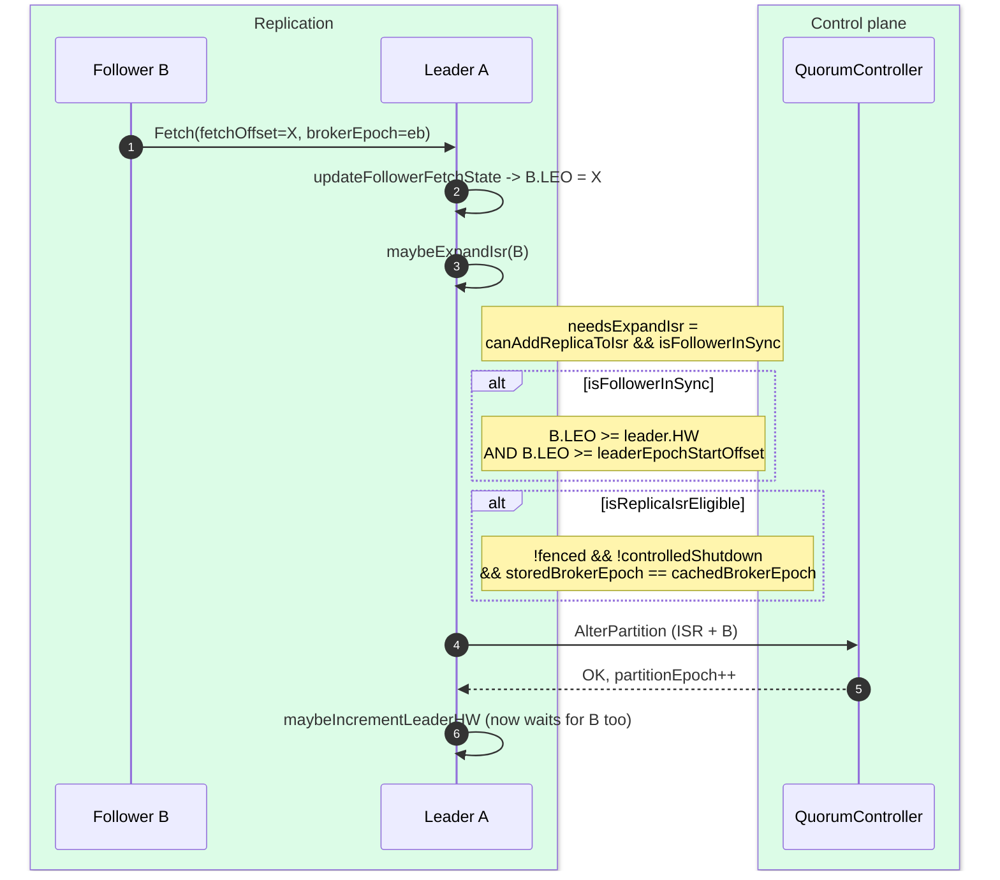
```mermaid
sequenceDiagram
  autonumber
  box rgb(220,252,231) Replication
    participant F as Follower B
    participant L as Leader A
  end
  box rgb(220,252,231) Control plane
    participant C as QuorumController
  end

  F->>L: Fetch(fetchOffset=X, brokerEpoch=eb)
  L->>L: updateFollowerFetchState -> B.LEO = X
  L->>L: maybeExpandIsr(B)
  Note right of L: needsExpandIsr =<br/>canAddReplicaToIsr && isFollowerInSync
  alt isFollowerInSync
    Note right of L: B.LEO >= leader.HW<br/>AND B.LEO >= leaderEpochStartOffset
  end
  alt isReplicaIsrEligible
    Note right of L: !fenced && !controlledShutdown<br/>&& storedBrokerEpoch == cachedBrokerEpoch
  end
  L->>C: AlterPartition (ISR + B)
  C-->>L: OK, partitionEpoch++
  L->>L: maybeIncrementLeaderHW (now waits for B too)
```

**What to notice**

- Expansion needs **two** conditions, and the second is the subtle one:
  `followerEndOffset >= leaderEpochStartOffset`. A follower must have caught up **within the current
  leader epoch** before joining the ISR. Without it, a follower could join at an offset below data
  committed in a previous epoch, then win an election and lose that data
  (`Partition.scala:907`, and the comment block above `maybeExpandIsr`).
- Expansion is checked against the **HW**, not the LEO, deliberately: "to be consistent with how the
  follower determines whether a replica is in-sync, we only check HW."
- `isReplicaIsrEligible` also excludes brokers in **controlled shutdown** — this is why a rolling
  restart drains ISR membership cleanly instead of thrashing.

### 5.4 Leader failover (clean)

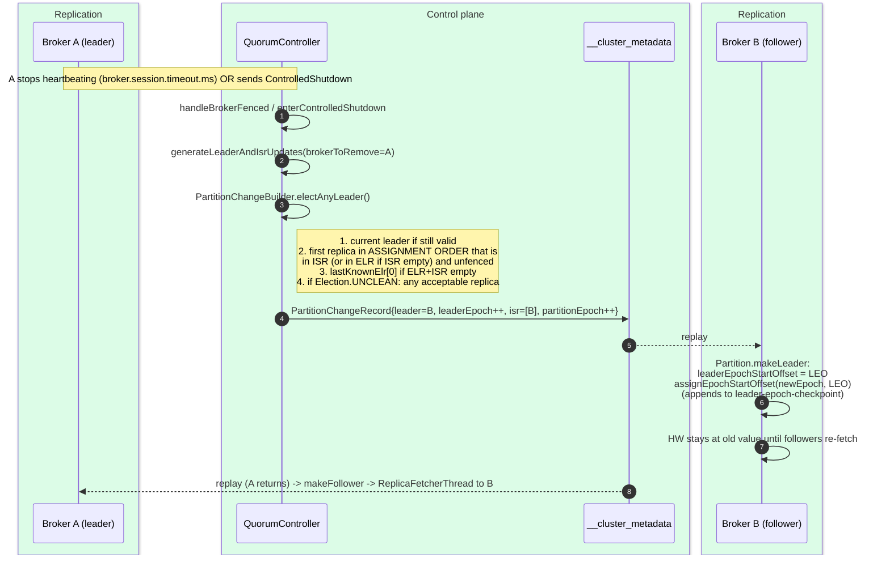
```mermaid
sequenceDiagram
  autonumber
  box rgb(220,252,231) Replication
    participant B as Broker A (leader)
  end
  box rgb(220,252,231) Control plane
    participant C as QuorumController
    participant M as __cluster_metadata
  end
  box rgb(220,252,231) Replication
    participant N as Broker B (follower)
  end

  Note over B,C: A stops heartbeating (broker.session.timeout.ms) OR sends ControlledShutdown
  C->>C: handleBrokerFenced / enterControlledShutdown
  C->>C: generateLeaderAndIsrUpdates(brokerToRemove=A)
  C->>C: PartitionChangeBuilder.electAnyLeader()
  Note right of C: 1. current leader if still valid<br/>2. first replica in ASSIGNMENT ORDER that is<br/>   in ISR (or in ELR if ISR empty) and unfenced<br/>3. lastKnownElr[0] if ELR+ISR empty<br/>4. if Election.UNCLEAN: any acceptable replica
  C->>M: PartitionChangeRecord{leader=B, leaderEpoch++, isr=[B], partitionEpoch++}
  M-->>N: replay
  N->>N: Partition.makeLeader:<br/>leaderEpochStartOffset = LEO<br/>assignEpochStartOffset(newEpoch, LEO)<br/>(appends to leader-epoch-checkpoint)
  N->>N: HW stays at old value until followers re-fetch
  M-->>B: replay (A returns) -> makeFollower -> ReplicaFetcherThread to B
```

**What to notice**

- Leader selection walks the **assignment list in order**, not by "most caught up". The first
  in-ISR, unfenced replica wins. This is what makes *preferred* leader = `replicas[0]` meaningful.
- The new leader immediately stamps a new `(epoch, startOffset=LEO)` entry into
  `leader-epoch-checkpoint`. That file is the entire basis of §10.
- The new leader's HW is stale on assumption of leadership and is re-derived from follower fetches;
  `ListOffsets(LATEST)` returns `OFFSET_NOT_AVAILABLE` in that window rather than a wrong answer.

---

## 6. State machines

### 6.1 Fetcher-thread per-partition state

`org.apache.kafka.server.ReplicaState` + `PartitionFetchState`:

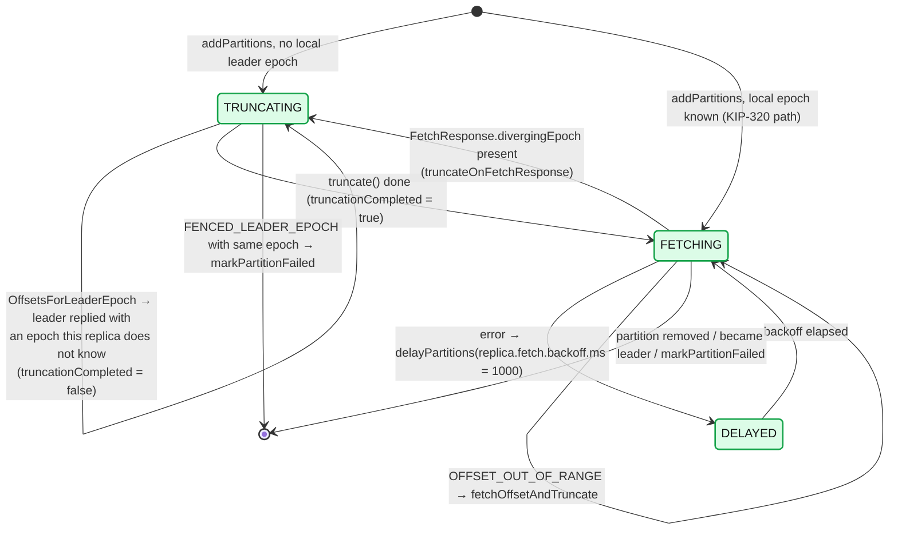
```mermaid
stateDiagram-v2
  [*] --> TRUNCATING: addPartitions, no local leader epoch
  [*] --> FETCHING: addPartitions, local epoch known (KIP-320 path)
  TRUNCATING --> TRUNCATING: OffsetsForLeaderEpoch → leader replied with<br/>an epoch this replica does not know<br/>(truncationCompleted = false)
  TRUNCATING --> FETCHING: truncate() done (truncationCompleted = true)
  FETCHING --> TRUNCATING: FetchResponse.divergingEpoch present<br/>(truncateOnFetchResponse)
  FETCHING --> DELAYED: error → delayPartitions(replica.fetch.backoff.ms = 1000)
  DELAYED --> FETCHING: backoff elapsed
  FETCHING --> FETCHING: OFFSET_OUT_OF_RANGE → fetchOffsetAndTruncate
  FETCHING --> [*]: partition removed / became leader / markPartitionFailed
  TRUNCATING --> [*]: FENCED_LEADER_EPOCH with same epoch → markPartitionFailed

  class TRUNCATING,FETCHING,DELAYED service

  classDef service  fill:#dcfce7,stroke:#16a34a,stroke-width:2px,color:#111
```

**What to notice**

- `doWork()` is strictly `maybeTruncate(); maybeFetch();` — truncation always drains before any fetch
  in a given loop iteration.
- Partitions in `TRUNCATING` **without** a local epoch fall back to `truncateToHighWatermark` — the
  pre-KIP-101 behaviour, reachable only for a replica with an empty epoch cache.
- `markPartitionFailed` moves the partition to `failedPartitions`; it is retried when the fetcher
  manager next re-adds it after a metadata change.

### 6.2 Replica membership (leader's view of one follower)

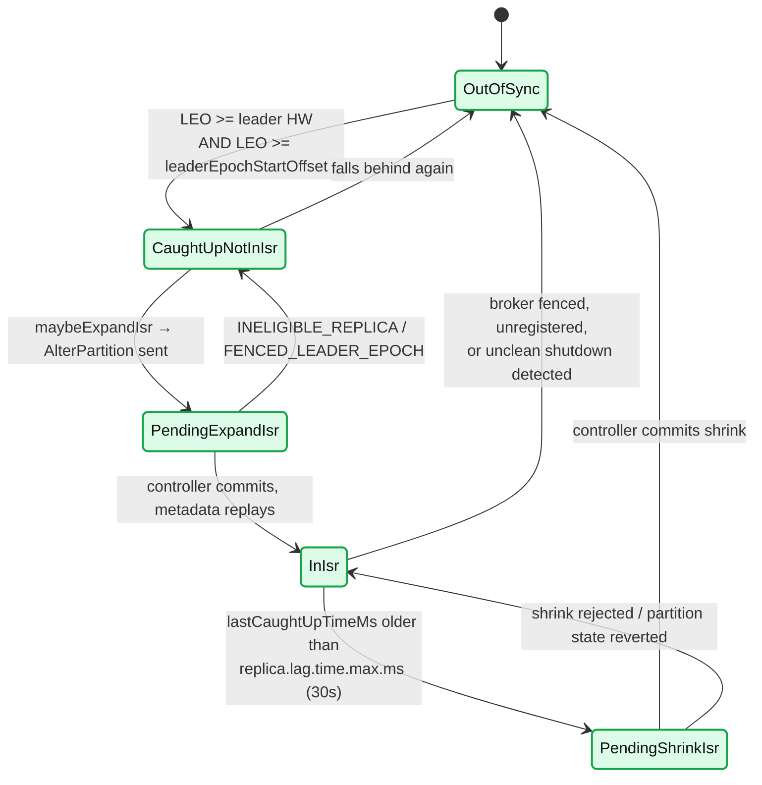
```mermaid
stateDiagram-v2
  [*] --> OutOfSync
  OutOfSync --> CaughtUpNotInIsr: LEO >= leader HW<br/>AND LEO >= leaderEpochStartOffset
  CaughtUpNotInIsr --> PendingExpandIsr: maybeExpandIsr → AlterPartition sent
  PendingExpandIsr --> InIsr: controller commits, metadata replays
  PendingExpandIsr --> CaughtUpNotInIsr: INELIGIBLE_REPLICA / FENCED_LEADER_EPOCH
  InIsr --> PendingShrinkIsr: lastCaughtUpTimeMs older than<br/>replica.lag.time.max.ms (30s)
  PendingShrinkIsr --> OutOfSync: controller commits shrink
  PendingShrinkIsr --> InIsr: shrink rejected / partition state reverted
  InIsr --> OutOfSync: broker fenced, unregistered,<br/>or unclean shutdown detected
  CaughtUpNotInIsr --> OutOfSync: falls behind again

  class OutOfSync,CaughtUpNotInIsr,PendingExpandIsr,InIsr,PendingShrinkIsr service

  classDef service  fill:#dcfce7,stroke:#16a34a,stroke-width:2px,color:#111
```

**What to notice**

- `PendingExpandIsr` / `PendingShrinkIsr` are *leader-local* states with no metadata footprint; only
  `InIsr` and `OutOfSync` exist in `__cluster_metadata`.
- While in `PendingExpandIsr` the replica is already in `maximalIsr` and therefore already constrains
  the HW — the leader pessimistically assumes the controller will accept.
- The `InIsr → OutOfSync` edge can fire from the **controller** side (fencing, unregistration,
  unclean shutdown) without the leader proposing anything.
- There is no "syncing" state visible to operators; `UnderReplicatedPartitions` is derived purely
  from `replicationFactor − isr.size > 0`.

### 6.3 `LeaderRecoveryState` (unclean election marker, KIP-704)

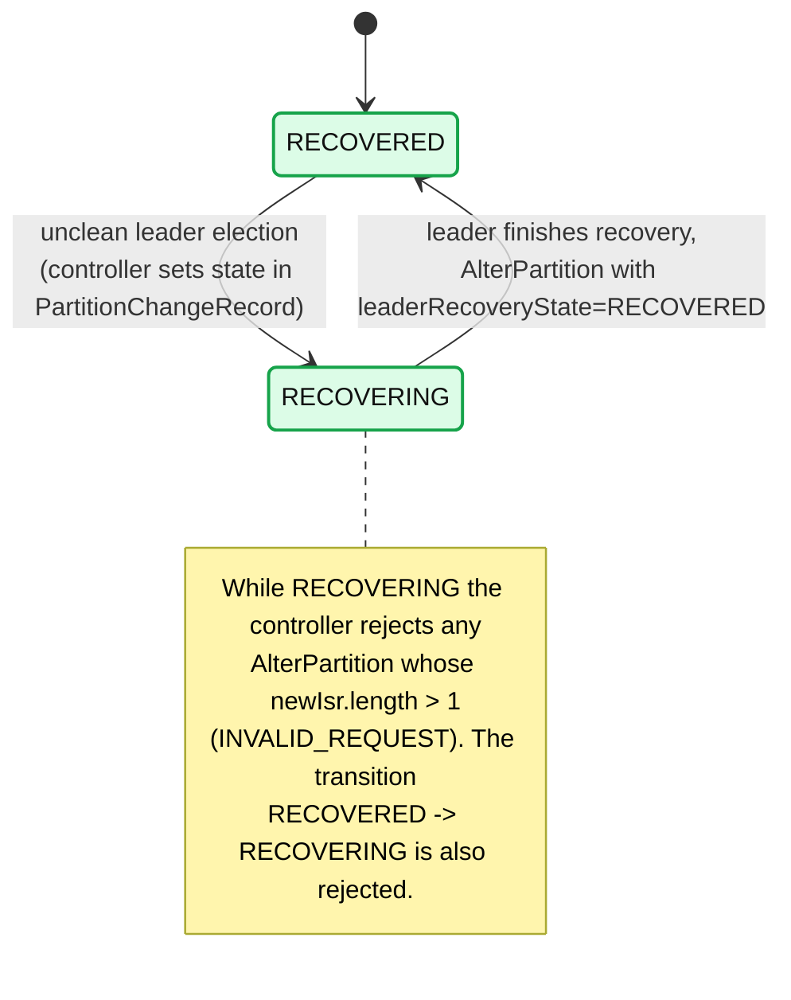
```mermaid
stateDiagram-v2
  [*] --> RECOVERED
  RECOVERED --> RECOVERING: unclean leader election<br/>(controller sets state in PartitionChangeRecord)
  RECOVERING --> RECOVERED: leader finishes recovery,<br/>AlterPartition with leaderRecoveryState=RECOVERED
  note right of RECOVERING
    While RECOVERING the controller rejects any
    AlterPartition whose newIsr.length > 1
    (INVALID_REQUEST). The transition
    RECOVERED -> RECOVERING is also rejected.
  end note

  class RECOVERED,RECOVERING service

  classDef service  fill:#dcfce7,stroke:#16a34a,stroke-width:2px,color:#111
```

**What to notice**

- This is how a client (`DescribeTopicPartitions` / `kafka-topics.sh --describe`) can tell that a
  partition's current leader was chosen uncleanly and its data may not be a prefix of what was
  previously committed.
- The one-replica clamp during `RECOVERING` prevents a second replica from joining the ISR — and
  therefore from being elected — before the recovering leader has settled its log.
- `RECOVERED → RECOVERING` is rejected by the controller, so the marker cannot be reset by a
  misbehaving or zombie leader.

---

## 7. Component deep dives

### 7.1 `ReplicaManager` (`core/src/main/scala/kafka/server/ReplicaManager.scala`)

- **Responsibility.** Owns all `Partition` objects on a broker (`allPartitions`), applies metadata
  deltas (`applyDelta` → `makeLeaders`/`makeFollowers`), serves `Produce`/`Fetch`, owns the two
  purgatories (`DelayedProduce`, `DelayedFetch`) and the periodic schedulers.
- **Schedulers it starts** (`ReplicaManager.scala:262-285`):
  | task | period | purpose |
  |---|---|---|
  | `highwatermark-checkpoint` | `replica.high.watermark.checkpoint.interval.ms` = **5000** | persist HW per log dir |
  | `isr-expiration` | `replica.lag.time.max.ms / 2` = **15000** | call `maybeShrinkIsr()` on every leader partition |
  | `shutdown-idle-replica-alter-log-dirs-thread` | 10000 | reap finished log-dir moves |
- The comment on `isr-expiration` is worth memorising: *"A follower can lag behind leader for up to
  `config.replicaLagTimeMaxMs` x 1.5 before it is removed from ISR"* — because detection is sampled
  at half the threshold.
- **Threading.** Request handler threads (`num.io.threads`, default 8) do the append/read; the
  `replicaStateChangeLock` serialises leadership transitions; per-`Partition` there is a
  `leaderIsrUpdateLock` (a `ReentrantReadWriteLock`) — reads for appends/fetch-state updates, writes
  for ISR changes. `AlterPartition` is always submitted **outside** the write lock, because
  completing it can increment the HW and complete delayed operations.
- **Failure handling.** `KafkaStorageException` on a log dir → `LogDirFailureChannel` →
  `handleLogDirFailure` → partitions on that dir go offline and the broker sends
  `AssignReplicasToDirs`/offline-dir notification so the controller removes it from those ISRs.

### 7.2 `Partition` (`core/src/main/scala/kafka/cluster/Partition.scala`)

- **State.** `leaderReplicaIdOpt`, `leaderEpoch`, `partitionEpoch`, `leaderEpochStartOffsetOpt`,
  `remoteReplicasMap: ConcurrentHashMap[Int, Replica]`, `assignmentState`
  (`SimpleAssignmentState` | `OngoingReassignmentState(adding, removing, replicas)`),
  `partitionState` (`CommittedPartitionState` | `PendingExpandIsr` | `PendingShrinkIsr`).
- **`maximalIsr`** — the union used for HW computation during an in-flight AlterPartition (KIP-497).
- **Key methods:** `appendRecordsToLeader`, `updateFollowerFetchState`, `maybeExpandIsr`,
  `maybeShrinkIsr`, `maybeIncrementLeaderHW`, `checkEnoughReplicasReachOffset`, `readRecords`,
  `lastOffsetForLeaderEpoch`, `lowWatermarkIfLeader`.
- **`lowWatermarkIfLeader`** = `min(logStartOffset)` over all *live* replicas; used only to decide
  when a `DeleteRecords` request is satisfied.
- **Concurrency.** `remoteReplicasMap` is a CHM read without the lock on the hot path;
  `updateAssignmentAndIsr` therefore adds new replicas *before* removing old ones.

### 7.3 `Replica` — the leader's per-follower record

Fields in the immutable `ReplicaState` snapshot (`server/src/main/java/.../Replica`-side state):

| field | updated by | used for |
|---|---|---|
| `logEndOffset` | `updateFetchStateOrThrow` on each follower fetch | HW computation, ISR expand |
| `logStartOffset` | same | low watermark / `DeleteRecords` |
| `lastFetchTimeMs` | same | stuck-follower detection |
| `lastCaughtUpTimeMs` | set to fetch time **only when** the follower's `fetchOffset >= leaderEndOffset at the time the request was issued** | ISR shrink decision |
| `brokerEpoch` | from `Fetch` request | `isReplicaIsrEligible`, `INELIGIBLE_REPLICA` |

The `lastCaughtUpTimeMs` semantics are the crux of ISR: it advances when the follower *asked for*
an offset that was the leader's LEO when the request was built. A follower that is continuously
fetching but always behind never advances it, and is evicted after 30 s — this is the "slow
follower" case. A follower that stops fetching entirely never advances it either — the "stuck
follower" case. One field covers both (`Partition.scala:1149` comment).

### 7.4 `ReplicaFetcherManager` / `AbstractFetcherManager`

- **Thread naming:** `ReplicaFetcherThread-<fetcherId>-<leaderBrokerId>`.
- **Partition → thread assignment** (`AbstractFetcherManager.scala:111`):
  ```scala
  def getFetcherId(tp: TopicPartition): Int =
    Utils.abs(31 * tp.topic.hashCode() + tp.partition) % numFetchersPerBroker
  ```
  Combined with the leader broker id into `BrokerIdAndFetcherId(brokerId, fetcherId)`, which keys
  `fetcherThreadMap`. **Total fetcher threads on a broker = `num.replica.fetchers` × (number of
  distinct leader brokers it follows).**
- `num.replica.fetchers` default **1**. On a broker following 20 other brokers that is 20 threads;
  raising it to 8 gives 160. The knob is a *per-source-broker* parallelism, not a global pool size.
- `resizeThreadPool(newSize)` supports **dynamic** reconfiguration: it removes all partitions from
  existing threads, changes `numFetchersPerBroker`, and re-adds them under the new hash — so
  changing `num.replica.fetchers` reshuffles every partition and briefly stalls replication.
  **[inferred] impact; the code path is explicit**
- Each thread multiplexes all its partitions into **one** incremental fetch session
  (`FetchSessionHandler`), so per-partition state is not resent every request.

### 7.5 `AbstractFetcherThread` / `ReplicaFetcherThread`

- `doWork()` = `maybeTruncate(); maybeFetch();` on a `ShutdownableThread` loop.
- `buildFetch` respects `replica.fetch.max.bytes` (1 MiB, per partition),
  `replica.fetch.response.max.bytes` (10 MiB, whole response), `replica.fetch.min.bytes` (1) and
  `replica.fetch.wait.max.ms` (500). Both size limits are soft: an oversized first batch is still
  returned so replication can always make progress.
- **Throttling interacts here.** `ReplicaManager.shouldLeaderThrottle` only throttles a replica if
  it is *not in sync*, is in the throttled-replica list, and the quota is exceeded — explicitly
  *"To avoid ISR thrashing"*.
- `processPartitionData` → `appendRecordsToFollowerOrFutureReplica` →
  `maybeUpdateHighWatermark(partitionData.highWatermark)`.
- Error handling: `OFFSET_OUT_OF_RANGE` → `fetchOffsetAndTruncate` (see §10.6);
  `FENCED_LEADER_EPOCH` → `onPartitionFenced`; anything else → `delayPartitions(1000 ms)`.

### 7.6 `AlterPartitionManager` (`core/src/main/scala/kafka/server/AlterPartitionManager.scala`)

- `unsentIsrUpdates: ConcurrentHashMap[TopicIdPartition, AlterPartitionItem]` +
  `inflightRequest: AtomicBoolean` → at most one AlterPartition RPC in flight per broker, carrying
  every pending partition.
- Sent to the **active controller** via the broker-to-controller channel; retried indefinitely,
  50 ms backoff on top-level errors, and re-driven immediately after each response
  (`maybePropagateIsrChanges()`).
- On a stale `brokerEpoch` it logs *"Broker had a stale broker epoch, retrying"* and rebuilds.

### 7.7 Controller-side: `ReplicationControlManager` + `PartitionChangeBuilder`

`PartitionChangeBuilder.build()` order is load-bearing:

```
completeReassignmentIfNeeded()
maybePopulateTargetElr()          // ELR bookkeeping BEFORE election
tryElection(record)               // may set leader + isr (unclean)
triggerLeaderEpochBumpForReplicaReassignmentIfNeeded(record)
maybeUpdateRecordElr(record)      // clears ELR if election was unclean or ELR disabled
setIsr(...)                       // ISR allowed to be empty only when ELR enabled
triggerLeaderEpochBumpForIsrShrinkIfNeeded(record)   // no-op on MV >= 3.6
maybeUpdateLastKnownLeader(record)
setAssignmentChanges(record)
setLeaderRecoveryState(...)
```

`AlterPartition` validation (`ReplicationControlManager.validateAlterPartitionData`), in order:

| condition | error |
|---|---|
| unknown partition | `UNKNOWN_TOPIC_OR_PARTITION` |
| request leaderEpoch/partitionEpoch **higher** than controller's | `NOT_CONTROLLER` |
| request leaderEpoch **lower** | `FENCED_LEADER_EPOCH` |
| requester is not the current leader | `INVALID_REQUEST` |
| request partitionEpoch **lower** | `INVALID_UPDATE_VERSION` |
| ISR not a subset of replicas, or does not contain the leader | `INVALID_REQUEST` |
| `RECOVERING` with `newIsr.length > 1`, or `RECOVERED → RECOVERING` | `INVALID_REQUEST` |
| any proposed ISR member fenced / shutting down / stale broker epoch | `INELIGIBLE_REPLICA` |
| ISR change completed a reassignment and changed the leader | `NEW_LEADER_ELECTED` (+ record still written) |

---

## 8. `min.insync.replicas` semantics — precisely

Default **1** (`ServerLogConfigs.MIN_IN_SYNC_REPLICAS_DEFAULT`). Broker-level default with a
per-topic override (`TopicConfig.MIN_IN_SYNC_REPLICAS_CONFIG`).

1. **It is checked only on `acks=all` produce.** `Partition.appendRecordsToLeader` guards with
   `if (inSyncSize < minIsr && requiredAcks == -1)`. `acks=0` and `acks=1` writes are appended
   regardless of ISR size.
2. **It counts the committed ISR**, `partitionState.isr.size` — not replication factor, not live
   brokers, not `maximalIsr`.
3. **`effectiveMinIsr = min(min.insync.replicas, RF)`** so an over-set value degrades gracefully.
4. **Two distinct exceptions:**
   - `NotEnoughReplicasException` — thrown **before** the append. Nothing was written. Safe to retry;
     no duplicate risk even without idempotence.
   - `NotEnoughReplicasAfterAppendException` — returned from `checkEnoughReplicasReachOffset` when
     the HW *did* reach the required offset but `maximalIsr.size < minIsr` at that moment. The record
     **is in the log and is committed**. Retrying creates a duplicate unless the producer is
     idempotent. Both are `RetriableException`s, so the producer retries them silently.
5. **The `acks=all` promise is stronger than `min.insync.replicas`.** `acks=all` waits for **every**
   member of the current ISR, not for `min.insync.replicas` of them. With RF=3, ISR={A,B,C},
   `min.insync.replicas=2`, an `acks=all` write waits for all three. `min.insync.replicas` is a
   *floor on how small the ISR is allowed to get* before writes are refused — it is not a quorum size.
6. **With ELR enabled (§11) it additionally gates the HW**: the HW cannot advance while
   `ISR.size < effectiveMinIsr`. That is a change in `acks=1` semantics too — an `acks=1` write to a
   partition whose ISR is below min ISR is acknowledged but is **not visible to consumers** until the
   ISR recovers.

---

## 9. ISR management

### 9.1 The lag rule

`replica.lag.time.max.ms` = **30000**. A follower is out of sync when
`!isCaughtUp(leaderEndOffset, now, 30000)`, i.e. its `lastCaughtUpTimeMs` is older than 30 s.
There is no offset-based lag config — `replica.lag.max.messages` was removed in 0.9 precisely
because a byte/message threshold cannot distinguish a bursty producer from a broken follower.

### 9.2 Detection cadence and the 1.5× rule

The `isr-expiration` scheduler fires every `replica.lag.time.max.ms / 2` = **15 s**. A follower that
falls behind just after a tick is only noticed at the tick after next → **worst-case eviction latency
is 1.5 × `replica.lag.time.max.ms` = 45 s**. Budget for that when reasoning about `acks=all`
availability during a broker freeze.

### 9.3 `AlterPartition` — what replaced the ZooKeeper write

Pre-KIP-497 (i.e. ≤ 2.6 in ZK mode), the leader wrote the new ISR **directly** into the
`/brokers/topics/<t>/partitions/<p>/state` znode with a conditional (version-checked) write, and the
controller learned about it via a watch. Problems: the leader was a second writer to controller
state; watches were lossy and required full re-reads; and there was a genuine split-brain window
where a zombie leader could shrink the ISR after a new leader was elected.

KIP-497 replaced it with an RPC:

- **RPC:** `AlterPartition` (originally `AlterIsr`), current valid versions **2–3**.
  - v2 replaced `TopicName` with `TopicId` (KIP-841).
  - v3 replaced `NewIsr: []int32` with `NewIsrWithEpochs: [{BrokerId, BrokerEpoch}]`.
  - Request carries `BrokerId`, `BrokerEpoch`, and per partition `LeaderEpoch`, `PartitionEpoch`,
    `LeaderRecoveryState`.
- **Fencing:** the controller is the single writer; `leaderEpoch`/`partitionEpoch` mismatches produce
  `FENCED_LEADER_EPOCH` / `INVALID_UPDATE_VERSION`. A zombie leader simply cannot mutate the ISR.
- **Propagation back:** the controller writes a `PartitionChangeRecord` to `__cluster_metadata`;
  every broker replays it. The leader applies its own change **via the metadata replay**, not from
  the RPC response — so ISR state is always consistent with the metadata log.

### 9.4 Metadata propagation and caching effects

There is no `partition.metadata.max.age.ms` in Kafka (see §13.2). The real staleness sources are:

| source | knob | default | effect |
|---|---|---|---|
| broker's view of ISR | `__cluster_metadata` replay lag | — | a broker acts on stale ISR for the replay delay (ms-scale) |
| client's `Metadata` cache | `metadata.max.age.ms` | **300000** | `kafka-topics.sh --describe` / client-visible ISR can be up to 5 min stale absent an error-driven refresh |
| KIP-392 preferred read replica | leased for `metadata.max.age.ms` | **300000** | `SubscriptionState.preferredReadReplicaExpireTimeMs = now + metadata.metadataExpireMs()` |
| controller's metadata batching | `metadata.max.idle.interval.ms` | 500 | upper bound on how long the controller sits without appending (`NoOpRecord` interval; `0` disables) |

Clients refresh eagerly on `NOT_LEADER_OR_FOLLOWER`, `FENCED_LEADER_EPOCH`, `UNKNOWN_TOPIC_ID`, so
the 5-minute number only bites for *observational* staleness, not correctness.

### 9.5 The ISR shrink/expand thrash pattern

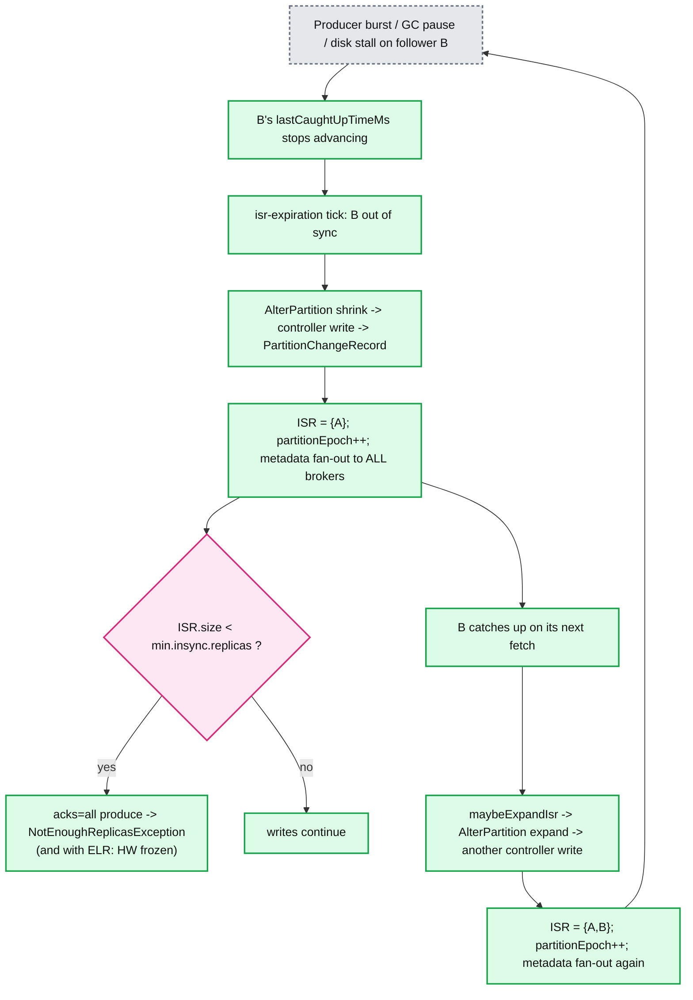
```mermaid
flowchart TD
  A["Producer burst / GC pause / disk stall on follower B"] --> B["B's lastCaughtUpTimeMs stops advancing"]
  B --> C["isr-expiration tick: B out of sync"]
  C --> D["AlterPartition shrink -> controller write -> PartitionChangeRecord"]
  D --> E["ISR = {A}; partitionEpoch++; metadata fan-out to ALL brokers"]
  E --> F{"ISR.size < min.insync.replicas ?"}
  F -->|yes| G["acks=all produce -> NotEnoughReplicasException<br/>(and with ELR: HW frozen)"]
  F -->|no| H["writes continue"]
  E --> I["B catches up on its next fetch"]
  I --> J["maybeExpandIsr -> AlterPartition expand -> another controller write"]
  J --> K["ISR = {A,B}; partitionEpoch++; metadata fan-out again"]
  K --> A

  class B,C,D,E,G,H,I,J service
  class K service
  class A external
  class F decision

  classDef client   fill:#dbeafe,stroke:#2563eb,stroke-width:2px,color:#111
  classDef service  fill:#dcfce7,stroke:#16a34a,stroke-width:2px,color:#111
  classDef store    fill:#ede9fe,stroke:#7c3aed,stroke-width:2px,color:#111
  classDef cache    fill:#fef3c7,stroke:#d97706,stroke-width:2px,color:#111
  classDef queue    fill:#cffafe,stroke:#0891b2,stroke-width:2px,color:#111
  classDef critical fill:#fee2e2,stroke:#dc2626,stroke-width:4px,color:#111
  classDef external fill:#e5e7eb,stroke:#6b7280,stroke-width:2px,color:#111,stroke-dasharray:4 3
  classDef decision fill:#fce7f3,stroke:#db2777,stroke-width:2px,color:#111
```

**Why it happens and how to stop it**

- **Root cause is almost always `replica.fetch.wait.max.ms` ≥ `replica.lag.time.max.ms`** on
  low-throughput topics, or a follower that cannot keep up during bursts. The config doc for
  `replica.fetch.wait.max.ms` says it explicitly: *"This value should always be less than the
  `replica.lag.time.max.ms` at all times to prevent frequent shrinking of ISR for low throughput
  topics."* (500 vs 30000 by default — you only break this by tuning.)
- **Cost is on the controller, not the data path.** Each shrink and each expand is a metadata record
  appended to the Raft log and fanned out to every broker. At 10k partitions flapping, this is the
  classic "controller pegged, metadata lag climbing" incident.
- **Built-in dampers:** (a) `partitionState.isInflight` suppresses new proposals while one is
  outstanding and makes `getOutOfSyncReplicas` return empty; (b) `shouldLeaderThrottle` refuses to
  throttle in-sync replicas; (c) the 15 s sampling interval coarsens the signal.
- **Mitigations in order of preference:** raise `num.replica.fetchers`; fix the follower's disk/GC;
  raise `replica.lag.time.max.ms` (accepting a longer window where a dead follower still blocks
  `acks=all`); *never* lower it to "detect faster".
- **Signals:** `IsrShrinksPerSec` / `IsrExpandsPerSec` (`kafka.server:type=ReplicaManager`),
  `UnderReplicatedPartitions`, `UnderMinIsrPartitionCount`, `AtMinIsrPartitionCount`.

---

## 10. Leader epochs and truncation

### 10.1 The leader epoch file

- Path: `<log.dir>/<topic>-<partition>/leader-epoch-checkpoint`.
- Format (`LeaderEpochCheckpointFile`):
  ```
  0                     <- file version
  2                     <- number of entries
  0 1                   <- leader_epoch(int32) start_offset(int64)
  1 2
  ```
- Written on: becoming leader (`assignEpochStartOffset(newEpoch, LEO)`), appending records as a
  follower with a new epoch, and after truncation (`writeIfDirExists`, asynchronous).
- In memory: `LeaderEpochFileCache` backed by a `TreeMap<Integer, EpochEntry>`.

### 10.2 `OffsetsForLeaderEpoch`

`LeaderEpochFileCache.endOffsetFor(requestedEpoch, logEndOffset)`:

| case | returns |
|---|---|
| `requestedEpoch == UNDEFINED_EPOCH` | `(UNDEFINED_EPOCH, UNDEFINED_EPOCH_OFFSET)` |
| requested epoch **is** the latest (leader's current) epoch | `(requestedEpoch, logEndOffset)` |
| requested epoch known, a later epoch exists | `(requestedEpoch, startOffset of the next epoch)` |
| requested epoch **older than anything cached** | `(requestedEpoch, startOffset of the earliest known epoch)` |
| requested epoch larger than any known | `(UNDEFINED_EPOCH, UNDEFINED_EPOCH_OFFSET)` |

The important row is the second: for a *leader's current* epoch the answer is the LEO, which is what
makes the consumer-side truncation check (KIP-320) work.

### 10.3 Why HW-based truncation was broken (KIP-101)

**Scenario A — data loss.** RF=2, `min.insync.replicas=2`, `acks=all`. Leader A, follower B, epoch 0.

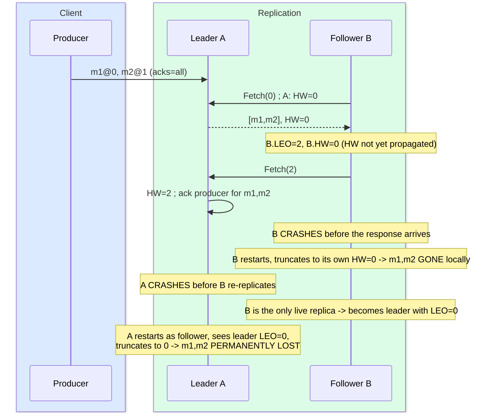
```mermaid
sequenceDiagram
  box rgb(219,234,254) Client
    participant P as Producer
  end
  box rgb(220,252,231) Replication
    participant A as Leader A
    participant B as Follower B
  end
  P->>A: m1@0, m2@1 (acks=all)
  B->>A: Fetch(0) #59; A: HW=0
  A-->>B: [m1,m2], HW=0
  Note over B: B.LEO=2, B.HW=0  (HW not yet propagated)
  B->>A: Fetch(2)
  A->>A: HW=2 #59; ack producer for m1,m2
  Note over B: B CRASHES before the response arrives
  Note over B: B restarts, truncates to its own HW=0 -> m1,m2 GONE locally
  Note over A: A CRASHES before B re-replicates
  Note over B: B is the only live replica -> becomes leader with LEO=0
  Note over A: A restarts as follower, sees leader LEO=0,<br/>truncates to 0 -> m1,m2 PERMANENTLY LOST
```

`acks=all` + `min.insync.replicas=2` did **not** save the data: the write was committed and then
silently erased. The bug is that a restarting replica truncated to a value (its own HW) that is a
*lower bound* on committedness, not an *upper bound* on what it must keep.

**Scenario B — silent divergence.** Same setup; both brokers lose power.

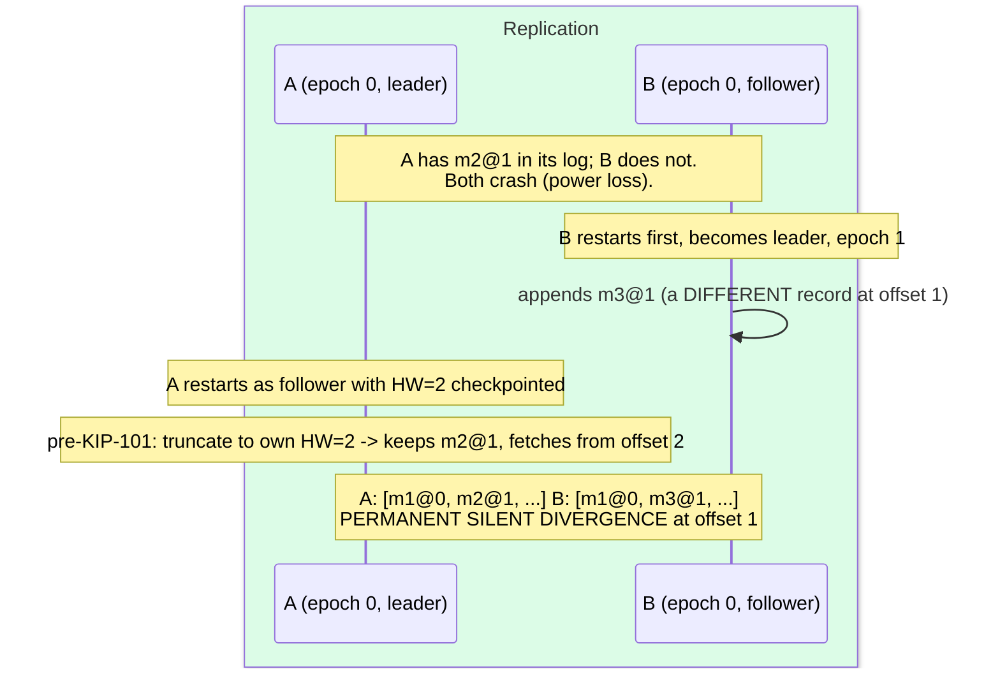
```mermaid
sequenceDiagram
  box rgb(220,252,231) Replication
    participant A as A (epoch 0, leader)
    participant B as B (epoch 0, follower)
  end
  Note over A,B: A has m2@1 in its log#59; B does not.<br/>Both crash (power loss).
  Note over B: B restarts first, becomes leader, epoch 1
  B->>B: appends m3@1 (a DIFFERENT record at offset 1)
  Note over A: A restarts as follower with HW=2 checkpointed
  Note over A: pre-KIP-101: truncate to own HW=2 -> keeps m2@1, fetches from offset 2
  Note over A,B: A: [m1@0, m2@1, ...]   B: [m1@0, m3@1, ...]<br/>PERMANENT SILENT DIVERGENCE at offset 1
```

Two replicas of the same partition now return different records for the same offset, forever, with
no error anywhere.

**What to notice (both scenarios)**

- Both bugs come from the *same* mistake: the HW is a **lower bound on what is committed**, and it
  was being used as an **upper bound on what a replica may keep**. Those are not the same quantity,
  and they differ by exactly the one-RTT propagation lag of §5.1.
- Scenario A needs only one crash at the wrong instant; it does **not** need an unclean election and
  it happens with `acks=all` + `min.insync.replicas=2` + `unclean.leader.election.enable=false`.
- Scenario B is worse than data loss: two replicas serve *different bytes for the same offset* with
  no error surfaced to anyone.
- The fix cannot be "checkpoint the HW more often" — the follower's HW is genuinely stale, not just
  unpersisted. It needs a different quantity entirely: the epoch boundary.

### 10.4 How epoch-based truncation fixes both

On becoming a follower, the replica enters `TRUNCATING` and asks the leader
`OffsetsForLeaderEpoch(currentLeaderEpoch, leaderEpoch = my latest local epoch)`.

- **Scenario A:** B restarts with epoch cache `{0 → 0}` and LEO=2. It asks A for the end offset of
  epoch 0. A (still in epoch 0) replies `(0, LEO=2)`. B truncates to `min(2, 2) = 2` — i.e. **it keeps
  m1 and m2**. No loss.
- **Scenario B:** A restarts, epoch cache `{0 → 0}`, LEO=2. It asks B (now epoch 1) for epoch 0's end
  offset. B replies `(0, 1)` — epoch 0 ended at offset 1 on B. A truncates to `min(1, 2) = 1`,
  dropping m2, and refetches m3. The logs **converge**. Data was lost (m2 was never truly committed
  on B), but there is no divergence.

`AbstractFetcherThread.getOffsetTruncationState` implements the full rule, including the **KIP-279**
case: if the leader answers with an epoch the follower does not have in its own cache, the follower
truncates to the end of its largest *smaller* epoch and sets `truncationCompleted = false`, staying
in `TRUNCATING` for another round. This handles the "follower missed an entire epoch" case that
plain KIP-101 got wrong.

### 10.5 KIP-320 — inline divergence detection and the consumer

Two halves.

**(a) Broker-to-broker: no extra round trip.** `FetchRequest` v12+ carries `LastFetchedEpoch` per
partition. The leader validates it inline in `Partition.readRecords`:

```scala
val epochEndOffset = lastOffsetForLeaderEpoch(currentLeaderEpoch, fetchEpoch, fetchOnlyFromLeader = false)
if (epochEndOffset.leaderEpoch < fetchEpoch || epochEndOffset.endOffset < fetchOffset) {
  return LogReadInfo(FetchDataInfo.empty(fetchOffset),
                     divergingEpoch = Some(EpochEndOffset(epochEndOffset.leaderEpoch,
                                                          epochEndOffset.endOffset)), ...)
}
```

`FetchResponse` v12+ returns `DivergingEpoch` as a **tagged field** (tag 0). The follower calls
`truncateOnFetchResponse` and truncates immediately — the separate `OffsetsForLeaderEpoch` round trip
is only needed at fetcher startup for a replica with no local epoch, or in the KIP-279 multi-round
case.

**(b) Consumer-side truncation detection.** The consumer now attaches a leader epoch to every fetch
position and every committed offset (`OffsetAndMetadata.leaderEpoch`, persisted in
`__consumer_offsets` and returned by `OffsetFetch`). On assignment or after a leader change the
consumer *validates* its position:

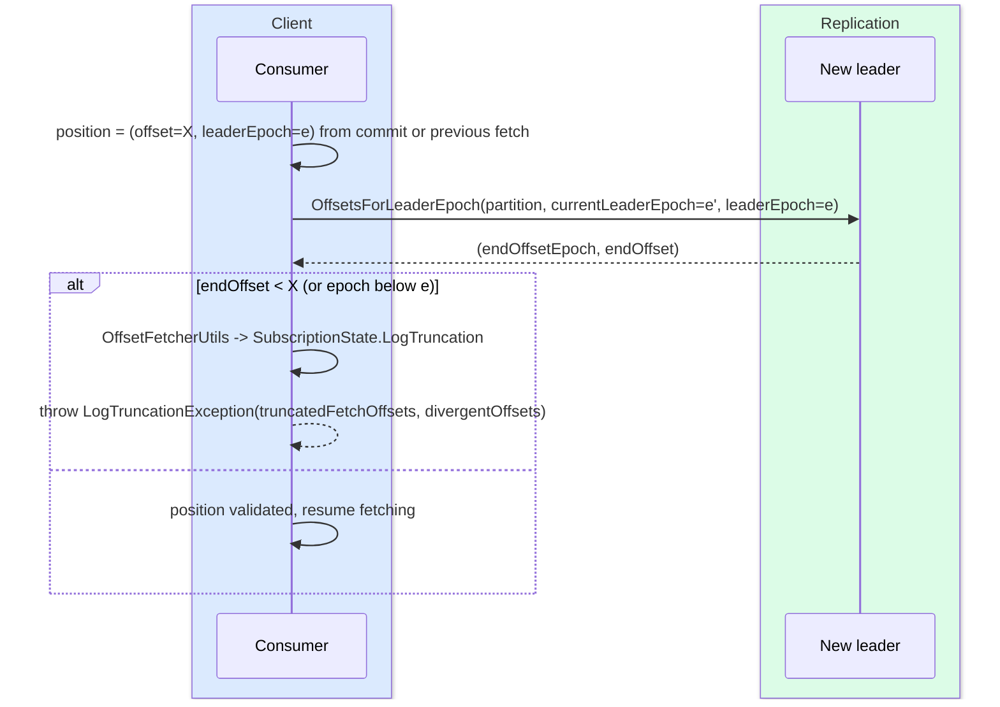
```mermaid
sequenceDiagram
  box rgb(219,234,254) Client
    participant C as Consumer
  end
  box rgb(220,252,231) Replication
    participant L as New leader
  end
  C->>C: position = (offset=X, leaderEpoch=e) from commit or previous fetch
  C->>L: OffsetsForLeaderEpoch(partition, currentLeaderEpoch=e', leaderEpoch=e)
  L-->>C: (endOffsetEpoch, endOffset)
  alt endOffset < X  (or epoch below e)
    C->>C: OffsetFetcherUtils -> SubscriptionState.LogTruncation
    C-->>C: throw LogTruncationException(truncatedFetchOffsets, divergentOffsets)
  else
    C->>C: position validated, resume fetching
  end
```

**What to notice**

- `LogTruncationException extends OffsetOutOfRangeException` and exposes both the offsets that were
  truncated and the *divergent offset* to reset to. Applications that care about exactly-once-ish
  semantics catch it instead of silently re-reading a diverged log.
- Validation is triggered on assignment and on any leader change, not on every fetch — the cost is
  one `OffsetsForLeaderEpoch` per partition per leader change.
- **`LogTruncationException` is only ever thrown when `auto.offset.reset=none`.** Verified in
  `SubscriptionState.maybeCompleteValidation`: with a default reset policy (`earliest`/`latest`,
  and `latest` is the client default) the consumer silently `seekValidated`s to the divergent offset
  (or does a full reset), logging only *"Truncation detected for partition ..., resetting offset to
  the first offset known to diverge"*. So most deployments get truncation handling but **never see
  the exception**. If you need to *know* truncation happened, set `auto.offset.reset=none` and
  handle it, or alert on that log line.
- Also from KIP-320: the old `NOT_LEADER_FOR_PARTITION` is split into `FENCED_LEADER_EPOCH`
  (client's epoch is stale) and `UNKNOWN_LEADER_EPOCH` (broker's metadata is stale — client retries),
  which lets a client tell "I'm behind" from "the broker is behind".

### 10.6 `fetchOffsetAndTruncate` — the `OFFSET_OUT_OF_RANGE` fallback

Epoch-based truncation covers the case where the follower and leader *share* an epoch history. When
they do not, the follower's fetch gets `OFFSET_OUT_OF_RANGE` and
`AbstractFetcherThread.fetchOffsetAndTruncate` decides what to do, using `ListOffsets` against the
leader:

| condition | action |
|---|---|
| `leaderEndOffset < replicaEndOffset` | truncate fully to the leader's LEO and resume. Source comment: *"There is a potential for a mismatch between the logs of the two replicas here. We don't fix this mismatch as of now."* This is the **post-unclean-election** case — the old leader's log is longer than the new leader's. |
| `leaderStartOffset > replicaEndOffset` | the follower was down long enough that the leader garbage-collected past it → `truncateFullyAndStartAt(leaderStartOffset)`, *"because the local replica's end offset is smaller than the current leader's start offset"* |
| otherwise (leader LEO > follower LEO, follower still within the leader's retained range) | **no truncation** — keep the local log and simply resume fetching at `max(leaderStartOffset, replicaEndOffset)`. Source comment: *"there will be some inconsistency of data between old and new leader. We are not solving it here."* |
| tiered storage, `follower.fetch.last.tiered.offset.enable=true` (default `false`) | skip to the last tiered offset via `fetchTierStateMachine` instead of replicating from the local start |

**What to notice**

- The first row is the one honest gap left in the protocol: after an unclean election the two logs
  can be permanently different for offsets the new leader never had, and the follower simply adopts
  the new leader's version. That is not a bug — it is the definition of unclean election — but it is
  why `LogTruncationException` (§10.5) exists on the consumer side.
- This path is *not* reached in normal operation. If you see `Reset fetch offset for partition ...`
  in broker logs outside of an unclean election or a long outage, something is wrong with retention
  or with the follower's disk.

---

## 11. Eligible Leader Replicas (KIP-966)

### 11.1 The gap it closes

`min.insync.replicas` protects **writes**, not **data**. Concretely, with RF=3,
`min.insync.replicas=2`, `acks=all`, ISR = {A, B, C}:

1. C falls behind → ISR = {A, B}. Writes still succeed and are committed on A and B.
2. B is fenced → ISR = {A}. `acks=all` writes now fail with `NotEnoughReplicasException` — good.
3. **A dies.** ISR = {A}, and A is dead. The partition is offline.
   - With `unclean.leader.election.enable=false` (default): unavailable until A returns. If A's disk
     is gone, the data is gone.
   - With unclean election enabled: the controller elects **C** — which is missing everything since
     step 1. Every record committed with `acks=all` between steps 1 and 3 is silently lost.

   Yet **B has all of it.** B was in the ISR at the moment the ISR dropped below min ISR, and — this
   is the crucial invariant — the HW could not have advanced past B's LEO after that. Pre-4.0 Kafka
   simply forgot B.

ELR is the controller remembering B.

### 11.2 Mechanism

Two pieces of state on `PartitionRegistration`, persisted in `PartitionRecord` v2 /
`PartitionChangeRecord` v2 and exposed via `DescribeTopicPartitions`:

- **`ELR` (`EligibleLeaderReplicas`)** — replicas that are not in the ISR but are known to hold all
  data up to the HW, hence safe to elect **cleanly**.
- **`LastKnownELR` (`LastKnownElr`)** — replicas that were in the ISR when it dropped below min ISR
  but are not in the current ELR; and, when `useLastKnownLeaderInBalancedRecovery` is on (default
  `true` in 4.3.1), the *last known leader* when a partition goes leaderless.

**Maintenance rule** (`PartitionChangeBuilder.maybePopulateTargetElr`, verified 4.3.1):

```java
if (targetIsr.size() >= minISR) { targetElr = []; targetLastKnownElr = []; return; }

candidateSet = currentElr ∪ currentIsr
targetElr           = candidateSet − targetIsr − uncleanShutdownReplicas
targetLastKnownElr  = (candidateSet ∪ currentLastKnownElr) − targetIsr − targetElr
```

**Safety invariant — "strict min ISR"** (`Partition.maybeIncrementLeaderHW`):

```scala
if (isUnderMinIsr) return false   // HW cannot advance while ISR.size < effectiveMinIsr
```

This is what makes ELR sound: while the ISR is below min ISR, no new data can become committed, so
every replica that was in the ISR at that moment still holds everything up to the HW.

**Unclean-shutdown exclusion.** A broker writes `.kafka_cleanshutdown` (containing its broker epoch)
into each log dir on clean shutdown. A broker that registers *without* it triggers
`handleBrokerUncleanShutdown` → `generateLeaderAndIsrUpdates(brokerWithUncleanShutdown=id)` →
`builder.setUncleanShutdownReplicas([id])`, removing it from ISR **and** ELR, and making it an
unacceptable leader. This is essential: an uncleanly-shut-down replica may have lost unflushed data
and cannot be trusted to be an ELR member.

**Election ordering** (`PartitionChangeBuilder.electAnyLeader` / `electPreferredLeader`):

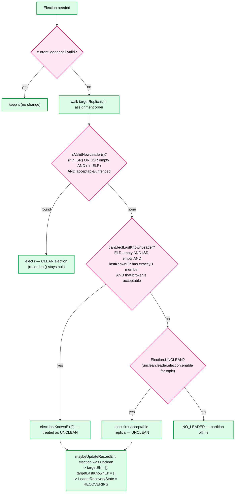
```mermaid
flowchart TD
  S["Election needed"] --> C1{"current leader still valid?"}
  C1 -->|yes| K["keep it (no change)"]
  C1 -->|no| C2["walk targetReplicas in assignment order"]
  C2 --> V{"isValidNewLeader(r)?<br/>(r in ISR) OR (ISR empty AND r in ELR)<br/>AND acceptable/unfenced"}
  V -->|found| CLEAN["elect r — CLEAN election<br/>(record.isr() stays null)"]
  V -->|none| C3{"canElectLastKnownLeader?<br/>ELR empty AND ISR empty AND<br/>lastKnownElr has exactly 1 member<br/>AND that broker is acceptable"}
  C3 -->|yes| LKL["elect lastKnownElr[0] — treated as UNCLEAN"]
  C3 -->|no| C4{"Election.UNCLEAN?<br/>(unclean.leader.election.enable for topic)"}
  C4 -->|yes| UNC["elect first acceptable replica — UNCLEAN"]
  C4 -->|no| OFF["NO_LEADER — partition offline"]
  UNC --> W["maybeUpdateRecordElr: election was unclean<br/>-> targetElr = [], targetLastKnownElr = []<br/>-> LeaderRecoveryState = RECOVERING"]
  LKL --> W

  class S,K,C2,CLEAN,LKL,UNC,OFF,W service
  class C1,V,C3,C4 decision

  classDef client   fill:#dbeafe,stroke:#2563eb,stroke-width:2px,color:#111
  classDef service  fill:#dcfce7,stroke:#16a34a,stroke-width:2px,color:#111
  classDef store    fill:#ede9fe,stroke:#7c3aed,stroke-width:2px,color:#111
  classDef cache    fill:#fef3c7,stroke:#d97706,stroke-width:2px,color:#111
  classDef queue    fill:#cffafe,stroke:#0891b2,stroke-width:2px,color:#111
  classDef critical fill:#fee2e2,stroke:#dc2626,stroke-width:4px,color:#111
  classDef external fill:#e5e7eb,stroke:#6b7280,stroke-width:2px,color:#111,stroke-dasharray:4 3
  classDef decision fill:#fce7f3,stroke:#db2777,stroke-width:2px,color:#111
```

**What to notice**

- An ELR election is a **clean** election (`record.isr() == null` ⇒ `isCleanLeaderElection`), so ELR
  state survives it. An unclean election wipes ELR and LastKnownELR entirely.
- ELR members are only eligible when the **ISR is empty** — ELR never pre-empts an in-sync replica.
- With ELR enabled the ISR is *allowed to be empty* in the metadata (`build()`:
  `record.isr() == null && (!targetIsr.isEmpty() || eligibleLeaderReplicasEnabled)`), which is a
  representational change from pre-4.0 where the ISR always retained the last leader.

### 11.3 Feature flag and maturity in 4.3.1 — verified

`server-common/src/main/java/org/apache/kafka/server/common/EligibleLeaderReplicasVersion.java`:

```java
ELRV_0(0, MetadataVersion.MINIMUM_VERSION, Map.of()),                       // disabled
ELRV_1(1, MetadataVersion.IBP_4_1_IV0, Map.of(MetadataVersion.FEATURE_NAME,
                                              MetadataVersion.IBP_4_0_IV1.featureLevel()));
public static final String FEATURE_NAME = "eligible.leader.replicas.version";
public static final EligibleLeaderReplicasVersion LATEST_PRODUCTION = ELRV_1;
```

| question | answer for 4.3.1 |
|---|---|
| Is ELR **production-ready**? | Yes — `LATEST_PRODUCTION = ELRV_1`. |
| Enabled by default on a **new** cluster? | **Yes**, if formatted at metadata version ≥ `4.1-IV0` (`bootstrapMetadataVersion = IBP_4_1_IV0`). Official docs: *"ELR is enabled by default on new clusters starting 4.1"* and *"not enabled by default for 4.0"*. |
| Enabled by default on an **upgraded** cluster? | **No.** Feature levels do not auto-upgrade. Run `kafka-features.sh --bootstrap-server ... upgrade --feature eligible.leader.replicas.version=1`. This is the single most common misconception about ELR. |
| Can it be turned off? | Yes: downgrade the feature to `0`. ELR/LastKnownELR fields are then cleared. |
| Is **Unclean Recovery** (KIP-966 part 2) in 4.3.1? | **No.** Verified: no `unclean.recovery.*` config, no `UncleanRecoveryManager`, no `GetReplicaLogInfo` RPC anywhere in the 4.3.1 tree. The only hit is a test comment: *"This test is only valid for KIP-966 part 1. When the unclean recovery is implemented, it should be removed."* So `unclean.leader.election.enable` remains "pick the first acceptable replica", not "pick the replica with the longest log". |

**Operational constraints when ELR is on** (documented):

- A **cluster-level** `min.insync.replicas` is added automatically if absent, and **cannot be
  removed**.
- **Broker-level** `min.insync.replicas` overrides are removed and can no longer be altered — only
  cluster-level and topic-level remain.
- Any `min.insync.replicas` change **clears** the ELR state for affected partitions (the invariant
  was computed against the old value, so it is no longer sound).
- Practical gotcha: operators/automation that repeatedly reconcile a broker-level
  `min.insync.replicas` will fight this and can produce restart loops (this is a known issue in at
  least one Kafka operator). **[inferred] from the config-invariant rules; the reconciliation loop is
  operator-specific**

### 11.4 Observing it

```bash
# ELR / LastKnownELR are returned by DescribeTopicPartitions
kafka-topics.sh --bootstrap-server b:9092 --describe --topic t
# feature level
kafka-features.sh --bootstrap-server b:9092 describe
kafka-features.sh --bootstrap-server b:9092 upgrade --feature eligible.leader.replicas.version=1
```

---

## 12. Unclean leader election

- **Config:** `unclean.leader.election.enable`, broker-level and topic-level, default **`false`**
  (`LogConfig.DEFAULT_UNCLEAN_LEADER_ELECTION_ENABLE = false`).
- **What is actually lost.** The elected replica's log is *not* a prefix of the committed log — it is
  a prefix **plus** whatever it appends afterwards in its new epoch. Every record between the new
  leader's LEO and the old committed HW is lost. Consumers that had read past the new leader's LEO
  see offsets **go backwards** and then be reused for different records — the divergence of §10.3
  Scenario B, now sanctioned. Consumers with KIP-320 detect this as `LogTruncationException`;
  consumers without leader-epoch tracking silently re-consume different data.
- **The partition is marked `RECOVERING`** (`LeaderRecoveryState`), and the controller refuses any
  `AlterPartition` that would grow the ISR beyond 1 until the leader declares itself `RECOVERED`.
  This is visible in `DescribeTopicPartitions` — use it to detect that an unclean election happened.
- **Timing in KRaft.** The controller runs a periodic scan for leaderless partitions. The internal
  config `unclean.leader.election.interval.ms` defaults to **300000** (5 min). The
  `unclean.leader.election.enable` doc says so explicitly: *"In KRaft mode, when enabling this config
  dynamically, it needs to wait for the unclean leader election thread to trigger election
  periodically (default is 5 minutes)."* Each pass elects at most
  `MAX_ELECTIONS_PER_IMBALANCE = 1000` partitions and reschedules immediately if it hit the cap.
- **Manual path:**
  ```bash
  kafka-leader-election.sh --bootstrap-server b:9092 \
      --election-type unclean \
      --topic t --partition 0
  # or --all-topic-partitions, or --path-to-json-file elect.json
  ```
  `--election-type unclean` only acts on partitions that currently have **no leader**;
  `--election-type preferred` only acts when the current leader is not the preferred replica.
  Otherwise the controller returns `ELECTION_NOT_NEEDED`.
- **The manual path deliberately bypasses `unclean.leader.election.enable`.** Verified in
  `ReplicationControlManager.electLeader`: for an explicit `ElectLeaders` request it sets
  `Election.UNCLEAN` unconditionally, with **no** `uncleanLeaderElectionEnabledForTopic` check. The
  config only gates the *automatic* periodic path
  (`maybeTriggerUncleanLeaderElectionForLeaderlessPartitions`) and the reassignment-revert path.
  So `kafka-leader-election.sh --election-type unclean` is the break-glass tool for recovering an
  offline partition on a cluster that (correctly) keeps `unclean.leader.election.enable=false` — and
  it is equally the way to lose committed data with one command. Guard it with ACLs
  (`ALTER` on `CLUSTER`).
- **Interaction with ELR.** ELR strictly *reduces* how often unclean election is needed: the
  controller exhausts ISR → ELR → last-known-leader before considering an unclean candidate. When an
  unclean election does happen, `maybeUpdateRecordElr` discards ELR and LastKnownELR, because the new
  leader's log is no longer a prefix of the committed log and the invariant that made ELR members
  safe no longer holds.

---

## 13. Preferred leader election and leader balancing

### 13.1 How it works in KRaft

- The **preferred leader** is `replicas[0]` in the assignment list. `PartitionChangeBuilder.
  electPreferredLeader()` tries, in order: `targetReplicas[0]` if it is a valid leader (in ISR — or
  in ELR when the ISR is empty — and unfenced); else the *current* leader if still valid (so a
  healthy partition is left alone); else any other valid replica; else the last known leader. In the
  balancing path the partition always has a valid leader, so the net effect is "move leadership back
  to `replicas[0]` only when `replicas[0]` is in the ISR."
- `ReplicationControlManager` maintains a `TimelineHashSet<TopicIdPartition> imbalancedPartitions` —
  a partition is added whenever its leader ≠ `replicas[0]` and removed when they match. The check is
  therefore **exact**, not statistical.
- `auto.leader.rebalance.enable` (default **true**) makes the `QuorumController` schedule
  `maybeBalancePartitionLeaders()` every `leader.imbalance.check.interval.seconds` (default **300**),
  which walks `imbalancedPartitions` and emits up to `MAX_ELECTIONS_PER_IMBALANCE = 1000` preferred
  elections per pass, rescheduling immediately if it hit the cap.
- Manual: `kafka-leader-election.sh --election-type preferred ...`.

### 13.2 Two configs in the brief that do not exist in 4.3

**`leader.imbalance.per.broker.percentage` — removed in Kafka 4.0.**

Verified by diffing `ReplicationConfigs.java` across tags: present in `3.9.0` (default **10**),
absent in `4.0.0`, `4.1.0`, `4.2.0`, `4.3.1`. Removed by **KAFKA-18743**
(*"Remove `leader.imbalance.per.broker.percentage` as it is not supported by KRaft"*). The ZK
controller used it as a per-broker ratio threshold before triggering a rebalance; the KRaft
controller instead tracks the exact set of partitions whose leader ≠ preferred and rebalances all of
them. **Operational consequence:** on KRaft there is no "tolerate 10% imbalance" damping — every
partition whose leader is not preferred will be moved back at the next check interval. If you relied
on the percentage to avoid leadership churn during a rolling restart, the correct 4.x lever is
`auto.leader.rebalance.enable=false` during the roll (or accepting the churn), not the removed knob.
Setting it in `server.properties` on 4.x is an **unknown config** — logged and ignored, not an error.

**`partition.metadata.max.age.ms` — does not exist in any Kafka version.** Verified: zero
occurrences in the 4.3.1 tree. The metadata-staleness effects described in §9.4 come from the client
`metadata.max.age.ms` (300000), the KIP-392 preferred-read-replica lease (which reuses that same
value), and `__cluster_metadata` replay lag. There is a *file* named `partition.metadata` in each log
directory (`PartitionMetadataFile`, holding the topic ID), which is likely the source of the name —
but it has no age config.

---

## 14. Partition reassignment

### 14.1 The RPC and the three stages

`AlterPartitionReassignments` (admin RPC → controller). From
`ReplicationControlManager.changePartitionReassignment`, verbatim:

```
1. Issue a PartitionChangeRecord adding all the new replicas to the partition's
   main replica list, and setting removingReplicas and addingReplicas.
2. Wait for the partition to have an ISR that contains all the new replicas. Or
   if there are no new replicas, wait until we have an ISR that contains at least one
   replica that we are not removing.
3. Issue a second PartitionChangeRecord removing all removingReplicas from the
   partitions' main replica list, and clearing removingReplicas and addingReplicas.
```

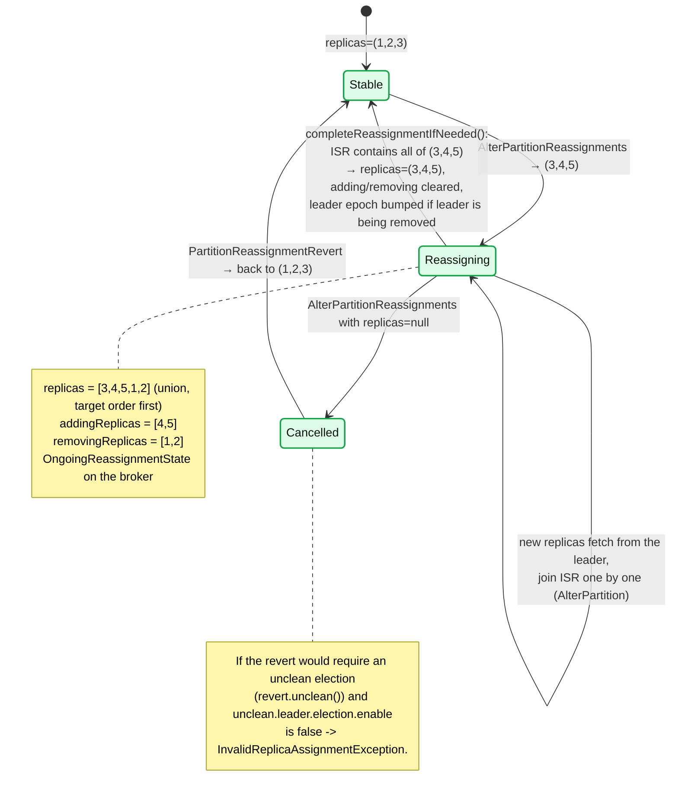
```mermaid
stateDiagram-v2
  [*] --> Stable: replicas=(1,2,3)
  Stable --> Reassigning: AlterPartitionReassignments → (3,4,5)
  note right of Reassigning
    replicas = [3,4,5,1,2] (union, target order first)
    addingReplicas = [4,5]
    removingReplicas = [1,2]
    OngoingReassignmentState on the broker
  end note
  Reassigning --> Reassigning: new replicas fetch from the leader,<br/>join ISR one by one (AlterPartition)
  Reassigning --> Stable: completeReassignmentIfNeeded():<br/>ISR contains all of (3,4,5)<br/>→ replicas=(3,4,5), adding/removing cleared,<br/>leader epoch bumped if leader is being removed
  Reassigning --> Cancelled: AlterPartitionReassignments with replicas=null
  Cancelled --> Stable: PartitionReassignmentRevert → back to (1,2,3)
  note right of Cancelled
    If the revert would require an unclean election
    (revert.unclean()) and unclean.leader.election.enable
    is false -> InvalidReplicaAssignmentException.
  end note

  class Stable,Reassigning,Cancelled service

  classDef service  fill:#dcfce7,stroke:#16a34a,stroke-width:2px,color:#111
```

**What to notice**

- The intermediate assignment is the **union**, so RF is temporarily higher and disk/network usage
  temporarily higher on both old and new brokers.
- Cancellation is `replicas: null` in the RPC (`kafka-reassign-partitions.sh --cancel`). It reverts
  to the original assignment, and can be **refused** if reverting would need an unclean election.
- A reassignment that merely reorders existing replicas (e.g. to change the preferred leader) skips
  stages 1–2 and completes immediately.
- If completing the reassignment changes the leader, the leader that submitted the triggering
  `AlterPartition` gets `NEW_LEADER_ELECTED` — an error *and* a committed record, the one place in
  the controller where both happen.

### 14.2 Throttles

Four configs, all dynamic, plus one for log-dir moves:

| config | scope | default | meaning |
|---|---|---|---|
| `leader.replication.throttled.rate` | **broker** (dynamic only) | `Long.MAX_VALUE` | B/s cap on outbound replication for throttled replicas where this broker is leader |
| `follower.replication.throttled.rate` | **broker** (dynamic only) | `Long.MAX_VALUE` | B/s cap on inbound replication for throttled replicas where this broker is follower |
| `leader.replication.throttled.replicas` | **topic** | `""` (empty) | `partitionId:brokerId,...` or `*` |
| `follower.replication.throttled.replicas` | **topic** | `""` (empty) | same form |
| `replica.alter.log.dirs.io.max.bytes.per.second` | **broker** (dynamic only) | `Long.MAX_VALUE` | intra-broker log-dir moves |

- The rate is *only* applied to replicas named in the `*.replicas` list. Setting the rate alone does
  nothing.
- `kafka-reassign-partitions.sh --execute --throttle <B/s>` sets **both** rates on all involved
  brokers and computes the `*.replicas` lists from the move map; `--verify` clears them once the
  reassignment completes. Forgetting to run `--verify` leaves throttles in place — a classic
  "replication is mysteriously slow forever" incident.
- Docs recommend keeping the limit **above 1 MB/s** for the rate accounting to behave.
- `ReplicaManager.shouldLeaderThrottle` refuses to throttle an **in-sync** replica, so a throttle
  cannot by itself push a healthy follower out of the ISR — but a throttle set too low will keep a
  *newly added* replica permanently out of the ISR, which is the usual way a reassignment stalls.

---

## 15. Rack awareness and follower fetching (KIP-392)

### 15.1 Placement

- `broker.rack` (default **null**). The KRaft controller's `StripedReplicaPlacer` buckets brokers by
  rack, walks the racks **round-robin** with a random start offset, and within each rack picks
  brokers round-robin with its own random offset. Unfenced brokers are exhausted before fenced ones,
  and the first replica (the preferred leader) is never placed on a fenced broker.
- Rack placement is the **highest-priority** goal, above per-broker balance. The class comment is
  explicit about the consequence: *"if you configure 10 brokers in rack A and B, and 1 broker in
  rack C, you will end up with a lot of partitions on that one broker in rack C."* Racks are assumed
  to be roughly equal size.
- **Mixed clusters do not fail.** Brokers without `broker.rack` are simply bucketed under an empty
  rack key, and *"in the simple case where broker racks have not been configured, this goal is a
  no-op"*. The only place Kafka refuses on inconsistent rack data is
  `kafka-reassign-partitions.sh --generate`, which throws `AdminOperationException("Not all brokers
  have rack information. Add --disable-rack-aware ...")` when *some* but not all brokers have a rack.
  Topic creation silently degrades.
- Rack awareness is a **placement-time** property only — nothing at runtime enforces that the *ISR*
  spans racks. If you need "committed in 2 AZs", you get it from placement + `min.insync.replicas`,
  and it is best-effort: a whole rack's replicas can fall out of the ISR and writes keep succeeding
  as long as `|ISR| ≥ min.insync.replicas`.

### 15.2 Follower fetching

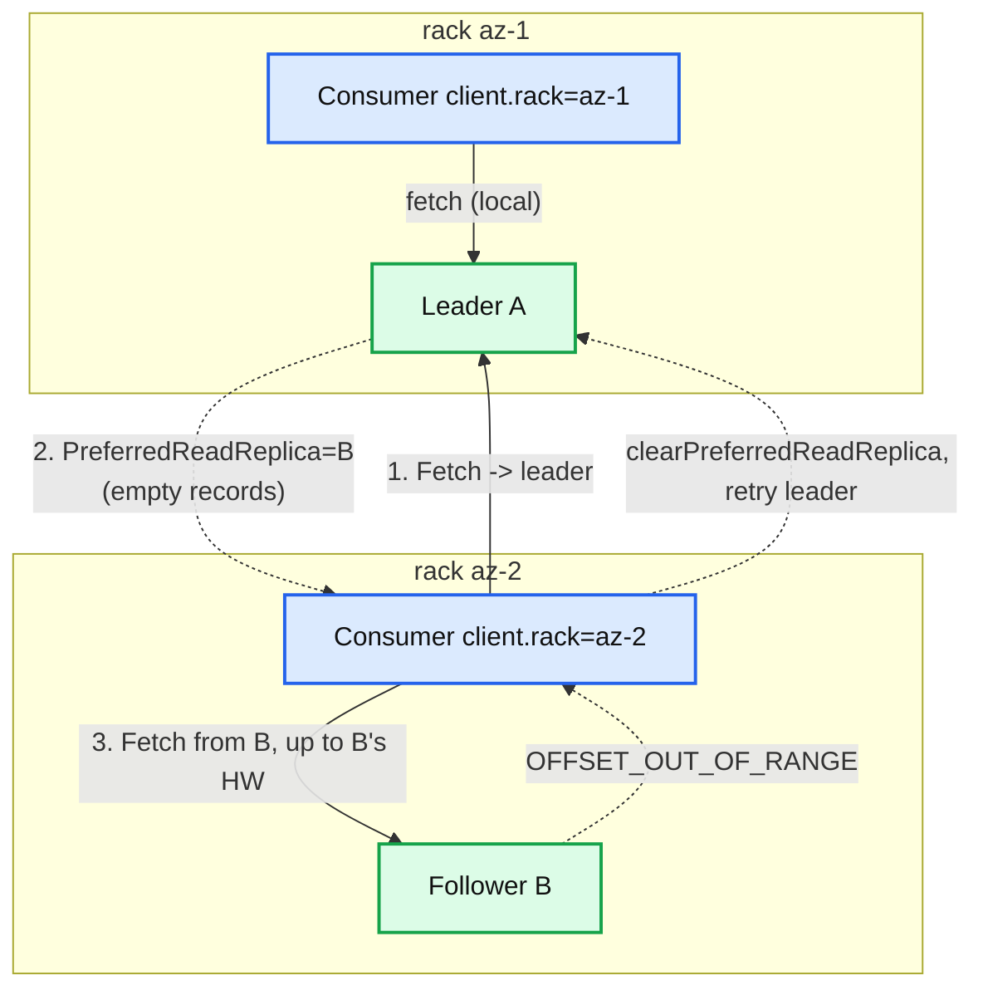
```mermaid
flowchart TD
  subgraph AZ1["rack az-1"]
    L["Leader A"]
    C1["Consumer client.rack=az-1"]
  end
  subgraph AZ2["rack az-2"]
    F["Follower B"]
    C2["Consumer client.rack=az-2"]
  end
  C1 -->|"fetch (local)"| L
  C2 -->|"1. Fetch -> leader"| L
  L -.->|"2. PreferredReadReplica=B<br/>(empty records)"| C2
  C2 -->|"3. Fetch from B, up to B's HW"| F
  F -.->|"OFFSET_OUT_OF_RANGE"| C2
  C2 -.->|"clearPreferredReadReplica, retry leader"| L

  class C1,C2 client
  class L,F service

  classDef client   fill:#dbeafe,stroke:#2563eb,stroke-width:2px,color:#111
  classDef service  fill:#dcfce7,stroke:#16a34a,stroke-width:2px,color:#111
  classDef store    fill:#ede9fe,stroke:#7c3aed,stroke-width:2px,color:#111
  classDef cache    fill:#fef3c7,stroke:#d97706,stroke-width:2px,color:#111
  classDef queue    fill:#cffafe,stroke:#0891b2,stroke-width:2px,color:#111
  classDef critical fill:#fee2e2,stroke:#dc2626,stroke-width:4px,color:#111
  classDef external fill:#e5e7eb,stroke:#6b7280,stroke-width:2px,color:#111,stroke-dasharray:4 3
  classDef decision fill:#fce7f3,stroke:#db2777,stroke-width:2px,color:#111
```

- **Broker:** `replica.selector.class`, default **`null`** = always the leader. Set to
  `org.apache.kafka.common.replica.RackAwareReplicaSelector` for rack-local reads.
- **Client:** `client.rack`, default **`""`**. Sent in the fetch request's `ClientMetadata`.
- **Lease:** the consumer caches the preferred replica for `metadata.max.age.ms` (**300000**), then
  re-asks the leader.

**The correctness caveat.** A follower serves client fetches only up to **its own high watermark**,
and per §5.1 that is at least one replication round trip behind the leader's HW. Consequences:

1. **Added end-to-end latency.** A rack-local consumer sees each record ≥ 1 fetch RTT later than a
   leader-local consumer. On a busy partition that is sub-millisecond to a few ms; on an idle
   partition, the follower's HW only advances when it next fetches, so tail latency can approach
   `replica.fetch.wait.max.ms` (500 ms).
2. **Not a consistency violation.** The follower's HW ≤ leader's HW and both are monotonic on a
   stable leader, so a consumer pinned to a follower sees a *prefix* of what the leader would serve.
   It never sees uncommitted data.
3. **But it is not monotonic across a switch.** If the consumer's preferred replica changes (lease
   expiry, `OFFSET_OUT_OF_RANGE`, replica leaves the ISR), it can move from a more-advanced source to
   a less-advanced one. The consumer's own `position` protects it from re-delivering records it has
   already fetched — it will simply get `OFFSET_OUT_OF_RANGE` or an empty response until the new
   source catches up, and `FetchCollector` clears the preferred replica and falls back to the leader
   on `OFFSET_OUT_OF_RANGE`.
4. **Only ISR members are offered** (`findPreferredReadReplica` filters on
   `partition.inSyncReplicaIds`), with the explicit comment that otherwise "the leader will
   continuously pick the lagging follower ... This can go on indefinitely."
5. **`read_committed` still works** — the follower computes its own LSO from its own transaction
   index below its own HW. **[inferred]: the follower serves with the same `FetchIsolation` logic;
   no separate mechanism exists.**

Cost model: the win is cross-AZ *egress* bytes (one replication stream per follower instead of one
consumer stream per consumer). The loss is latency and a much subtler failure mode when a follower
falls behind.

---

## 16. Delivery guarantees end to end

| `acks` | Producer waits for | Durable against | Loses data when |
|---|---|---|---|
| `0` | nothing (fire and forget) | nothing | any packet loss, any broker restart, leader change, full request queue. Not even "the broker got it". |
| `1` | leader's **local append** (page cache, not fsync) | a clean leader restart (page cache flushed by OS/`log.flush.*`) | leader crashes/loses power before followers replicate → committed-to-producer records vanish on failover. Also: with ELR on, an `acks=1` write while ISR < min ISR is **accepted but never becomes visible** (HW frozen). |
| `all` / `-1` | HW ≥ the record's offset, i.e. **every current ISR member has it in its log** (page cache) | loss of any `|ISR| − 1` replicas | (a) ISR had shrunk to 1 and `min.insync.replicas=1` → single-replica durability; (b) **unclean leader election**; (c) simultaneous power loss on all ISR members before any fsync; (d) all ISR replicas' disks lost. |

**The three-legged contract.** `acks=all` alone guarantees nothing useful. You need all three:

1. `acks=all` **and** `min.insync.replicas ≥ 2` **and** RF ≥ `min.insync.replicas + 1`
   (RF=3/min.isr=2 is the canonical setting — RF=2/min.isr=2 means *any* single broker restart stops
   writes).
2. `unclean.leader.election.enable=false` (the default). Enabling it converts the durability
   guarantee into a best-effort one.
3. `enable.idempotence=true` (default since 3.0) so that the retriable
   `NotEnoughReplicasAfterAppendException` and network retries do not duplicate.

**Flush settings.** Kafka deliberately does **not** fsync on the produce path:
`log.flush.interval.messages` = `Long.MAX_VALUE`, `log.flush.scheduler.interval.ms` =
`Long.MAX_VALUE`, `log.flush.interval.ms` unset. Durability comes from *replication*, not from the
disk. This is the right trade for correlated-failure-independent replicas and the wrong trade for a
rack that loses power as a unit — which is exactly why rack-aware placement matters, and why
`.kafka_cleanshutdown` / ELR's unclean-shutdown exclusion exists.

**What `acks=all` still does not give you.** It does not fsync; it does not guarantee the data is on
more than one *rack*; it does not survive an unclean election; and (pre-ELR) it does not stop a
stale replica from being elected once the ISR has collapsed. ELR closes the last of those.

---

## 17. Failure modes

| Failure | Detected by | Recovery | Blast radius |
|---|---|---|---|
| Follower slow / GC pause | `lastCaughtUpTimeMs` > 30 s, sampled every 15 s | ISR shrink; auto expand on catch-up | `acks=all` latency rises, then partition may go under-min-ISR |
| Follower dead | same | ISR shrink; controller fences the broker on session timeout | under-replicated partitions |
| Leader dead | controller broker session timeout | `handleBrokerFenced` → elect from ISR → ELR → last-known leader | brief unavailability (metadata propagation + client refresh); HW lag window with `OFFSET_NOT_AVAILABLE` |
| ISR collapses to leader only, then leader dies | controller | ELR election if enabled; otherwise offline or unclean | **data loss without ELR + unclean election enabled** |
| Log dir / disk failure | `LogDirFailureChannel`, `KafkaStorageException` | partitions on that dir go offline; broker notifies controller; ISR shrinks | per-log-dir, not per-broker (JBOD) |
| Unclean broker restart | missing `.kafka_cleanshutdown` | excluded from ISR and ELR; must re-replicate from scratch of the divergent suffix | that broker's replicas |
| Divergent log after unclean election | `OffsetsForLeaderEpoch` / `DivergingEpoch` | follower truncates to the epoch boundary; consumer gets `LogTruncationException` | offsets reused for different records |
| Controller unavailable | `AlterPartition` retries forever | ISR changes queue; **data path keeps working** | no ISR shrink/expand; `acks=all` unaffected as long as followers keep up |
| ISR thrash | `IsrShrinksPerSec`/`IsrExpandsPerSec` | see §9.5 | controller write amplification, cluster-wide |
| Reassignment stalled by a too-low throttle | new replica never joins ISR | raise/clear throttle, or `--cancel` | that reassignment |

---

## 18. Scalability and performance

- **The bottleneck is usually fetcher parallelism, not bandwidth.** One
  `ReplicaFetcherThread-i-<leader>` serialises `truncate → fetch → append` for all its partitions.
  A single slow partition (large batches, a log-dir stall) head-of-line-blocks every other partition
  on that thread. `num.replica.fetchers` is the fix; the hash `31*topic.hashCode + partition` spreads
  partitions but is not weight-aware, so hot partitions can collide.
- **Incremental fetch sessions** keep the per-request cost proportional to *changed* partitions, not
  total partitions. Without them, a broker following 5000 partitions would resend 5000 partition
  descriptors per request.
- **`replica.fetch.response.max.bytes` (10 MiB) is the real per-request ceiling**;
  `replica.fetch.max.bytes` (1 MiB) is per partition. With 4 fetchers × 10 MiB in flight per source
  broker, memory per source broker is bounded at ~40 MiB.
- **ISR changes are a controller write workload.** `O(shrinks + expands)` metadata records, each
  fanned out to every broker. This — not produce throughput — is what limits partition counts in
  practice.
- **The HW computation is on the hot path** and is written to avoid allocation
  (`remoteReplicasMap.forEach` with no intermediate collections, per the source comment). It is
  `O(RF)` per follower fetch.
- **Back-pressure** is entirely purgatory-based: `DelayedProduce` for `acks=all`, `DelayedFetch` for
  long polls, purged every `producer.purgatory.purge.interval.requests` / 
  `fetch.purgatory.purge.interval.requests` (both **1000**).
- **Hot spots:** a leader-heavy broker (why `auto.leader.rebalance.enable` exists); a partition whose
  followers are all cross-rack (why KIP-392 exists for the *read* side but there is no equivalent for
  replication — replication always goes to the leader).

---

## 19. Trade-offs and alternatives

| Dimension | Kafka (ISR) | Raft / Paxos (etcd, KRaft itself) | Chain replication |
|---|---|---|---|
| Replicas for `f` failures | `f+1` | `2f+1` | `f+1` |
| Commit latency | slowest replica **in the ISR** | median replica | full chain traversal |
| Membership | dynamic, externally arbitrated | fixed (joint consensus to change) | fixed |
| Needs an external consensus system | **yes** (KRaft) | no (self-contained) | yes (config manager) |
| Straggler behaviour | evicted after 30 s, then ignored | ignored immediately (majority) | blocks the chain |
| Split-brain protection | leader epoch + partition epoch, controller is sole writer | term + log matching | config manager epoch |

- **Why not quorum for data?** Kafka's own docs make the argument: with `2f+1` you pay 3× disk for
  single-failure tolerance, and commit latency tracks the *median* replica, which is better for
  tails but worse for cost. Kafka pushes the cost down to `f+1` by paying for a separate consensus
  system that it needs anyway for cluster metadata.
- **The cost of that choice** is exactly this document: the ISR is *soft* state that a partition
  leader proposes and a controller ratifies, so every failure mode is a question of "who knew what
  ISR, when". Raft has no equivalent of ISR thrash, unclean election, or ELR.
- **KRaft itself is Raft**, not ISR — the metadata log uses quorum commit. Kafka runs both models in
  one process for good reasons: metadata is small and needs strict consensus; partition data is huge
  and needs cheap replication.
- **Compared to Pulsar/BookKeeper:** BookKeeper uses a quorum write (`ackQuorum` of `writeQuorum`)
  with striping across bookies, so there is no leader-follower catch-up and no ISR; the trade is a
  more complex storage tier and no "read from the leader's page cache" locality.

---

## 20. Staff-level questions

1. A partition has RF=3, `min.insync.replicas=2`, `acks=all`. `IsrShrinksPerSec` shows a shrink every
   ~30 s on hundreds of partitions and the controller's metadata append rate has tripled. Producers
   see intermittent `NotEnoughReplicasException`. Walk from symptom to root cause, name the exact
   fields and scheduler involved, and say why lowering `replica.lag.time.max.ms` would make it worse.
2. Explain why `acks=all` alone did not prevent data loss before KIP-101, using a concrete offset
   trace. Then show precisely what `OffsetsForLeaderEpoch` returns in that trace and why it changes
   the outcome. What does KIP-279 add on top?
3. ELR is enabled. RF=3, `min.insync.replicas=2`. ISR = {A,B,C} → C lags out → B is fenced → A dies.
   List the metadata state (`isr`, `elr`, `lastKnownElr`) after each step, say who gets elected, and
   explain the invariant that makes that election safe. Now repeat with `eligible.leader.replicas.version=0`.
4. You enable `RackAwareReplicaSelector` and `client.rack` to cut cross-AZ egress. Your p99 consumer
   lag doubles on low-traffic topics but is unchanged on high-traffic ones. Explain the mechanism,
   including which HW is involved and which config sets the floor on the added latency.
5. Your team's runbook says "set `leader.imbalance.per.broker.percentage=30` before a rolling
   restart to avoid leadership churn." You are on 4.3. What actually happens when that line runs, why,
   and what is the correct 4.x equivalent? What does the KRaft controller use instead of a percentage?

---

## 21. Config reference — verified defaults (Kafka 4.3.1)

All values read from source unless noted. `ReplicationConfigs` =
`server-common/src/main/java/org/apache/kafka/server/config/ReplicationConfigs.java`, etc.

### Broker — replication

| Config | Default | Dynamic? | Source |
|---|---|---|---|
| `replica.lag.time.max.ms` | `30000` | cluster/broker | `ReplicationConfigs:55` |
| `num.replica.fetchers` | `1` | cluster/broker | `ReplicationConfigs:96` |
| `replica.fetch.max.bytes` | `1048576` (1 MiB) | read-only | `ReplicationConfigs:68` |
| `replica.fetch.response.max.bytes` | `10485760` (10 MiB) | read-only | `ReplicationConfigs:88` |
| `replica.fetch.min.bytes` | `1` | read-only | `ReplicationConfigs:80` |
| `replica.fetch.wait.max.ms` | `500` | read-only | `ReplicationConfigs:75` |
| `replica.fetch.backoff.ms` | `1000` | read-only | `ReplicationConfigs:84` |
| `replica.socket.timeout.ms` | `30000` | read-only | `ReplicationConfigs:60` |
| `replica.socket.receive.buffer.bytes` | `65536` | read-only | `ReplicationConfigs:64` |
| `replica.high.watermark.checkpoint.interval.ms` | `5000` | read-only | `ReplicationConfigs:103` |
| `replica.selector.class` | `null` (leader-only reads) | read-only | `ReplicationConfigs:173` |
| `follower.fetch.last.tiered.offset.enable` | `false` | **dynamic** (`DynamicBrokerConfig.DynamicReplicationConfig.RECONFIGURABLE_CONFIGS`) | `ReplicationConfigs:143` |
| `default.replication.factor` | `1` | read-only | `ReplicationConfigs:42` |
| `broker.rack` | `null` | read-only | `ServerConfigs:142` |
| `controlled.shutdown.enable` | `true` | read-only | `ServerConfigs:97` |
| `fetch.purgatory.purge.interval.requests` | `1000` | read-only | `ReplicationConfigs:107` |
| `producer.purgatory.purge.interval.requests` | `1000` | read-only | `ReplicationConfigs:111` |
| `controller.socket.timeout.ms` | `30000` | read-only | `ReplicationConfigs:38` |

### Leader election

| Config | Default | Scope | Source |
|---|---|---|---|
| `unclean.leader.election.enable` | `false` | broker + topic | `LogConfig:133` |
| `unclean.leader.election.interval.ms` | `300000` (5 min) | **internal** (`defineInternal`) | `ReplicationConfigs:123` |
| `auto.leader.rebalance.enable` | `true` | broker | `ReplicationConfigs:148` |
| `leader.imbalance.check.interval.seconds` | `300` | broker | `ReplicationConfigs:119` |
| `leader.imbalance.per.broker.percentage` | **removed in 4.0** (was `10`) | — | KAFKA-18743 |
| `MAX_ELECTIONS_PER_IMBALANCE` | `1000` (constant, not a config) | controller | `ReplicationControlManager:151` |

### Durability

| Config | Default | Scope | Source |
|---|---|---|---|
| `min.insync.replicas` | `1` | cluster + topic (broker-level removed when ELR on) | `ServerLogConfigs:155` |
| `log.flush.interval.messages` | `Long.MAX_VALUE` (`9223372036854775807`) | broker + topic | `ServerLogConfigs:101` |
| `log.flush.scheduler.interval.ms` | `Long.MAX_VALUE` | broker | `ServerLogConfigs:109` |
| `log.flush.interval.ms` | unset → falls back to scheduler interval | broker + topic | `ServerLogConfigs:112` |
| `acks` (producer) | `all` | producer | `ProducerConfig:393` |
| `enable.idempotence` (producer) | `true` | producer | ProducerConfig |

### ELR (KIP-966)

| Config | Default | Notes |
|---|---|---|
| `eligible.leader.replicas.version` | `1` (`ELRV_1`) on clusters **formatted** at MV ≥ `4.1-IV0`; `0` on clusters upgraded from < 4.1 until explicitly upgraded | `EligibleLeaderReplicasVersion`; `LATEST_PRODUCTION = ELRV_1` |
| `unclean.recovery.strategy` / `unclean.recovery.manager.enabled` | **do not exist in 4.3.1** | KIP-966 part 2 not implemented |

### Throttles (all dynamic)

| Config | Default | Scope |
|---|---|---|
| `leader.replication.throttled.rate` | `Long.MAX_VALUE` | broker (dynamic only) |
| `follower.replication.throttled.rate` | `Long.MAX_VALUE` | broker (dynamic only) |
| `replica.alter.log.dirs.io.max.bytes.per.second` | `Long.MAX_VALUE` | broker (dynamic only) |
| `leader.replication.throttled.replicas` | `""` (empty list) | topic |
| `follower.replication.throttled.replicas` | `""` (empty list) | topic |

### Client-side (relevant to this report)

| Config | Default | Source |
|---|---|---|
| `client.rack` (consumer) | `""` | `CommonClientConfigs:79` |
| `isolation.level` (consumer) | `read_uncommitted` | `ConsumerConfig:357` |
| `metadata.max.age.ms` | `300000` | `ConsumerConfig:454` |

---

## 22. Sources

**Source code (Apache Kafka 4.3.1 tag — every default above verified here)**

- `core/src/main/scala/kafka/cluster/Partition.scala` — HW, ISR expand/shrink, min-ISR checks, epoch handling
- `core/src/main/scala/kafka/server/ReplicaManager.scala` — schedulers, purgatories, `findPreferredReadReplica`
- `core/src/main/scala/kafka/server/AbstractFetcherThread.scala` — truncation state machine, `getOffsetTruncationState`
- `core/src/main/scala/kafka/server/ReplicaFetcherThread.scala`, `AbstractFetcherManager.scala`, `ReplicaFetcherManager.scala`
- `core/src/main/scala/kafka/server/AlterPartitionManager.scala`
- `metadata/src/main/java/org/apache/kafka/controller/PartitionChangeBuilder.java` — election + ELR rules
- `metadata/src/main/java/org/apache/kafka/controller/ReplicationControlManager.java` — `alterPartition`, reassignment, balancing
- `server-common/src/main/java/org/apache/kafka/server/common/EligibleLeaderReplicasVersion.java`
- `server-common/src/main/java/org/apache/kafka/server/config/{ReplicationConfigs,ServerConfigs,ServerLogConfigs,QuotaConfig}.java`
- `storage/src/main/java/org/apache/kafka/storage/internals/log/UnifiedLog.java`, `.../epoch/LeaderEpochFileCache.java`, `.../checkpoint/{LeaderEpochCheckpointFile,CleanShutdownFileHandler}.java`
- `clients/src/main/resources/common/message/{FetchRequest,FetchResponse,AlterPartitionRequest,DescribeTopicPartitionsResponse}.json`
- `metadata/src/main/resources/common/metadata/{PartitionRecord,PartitionChangeRecord}.json`
- `clients/src/main/java/org/apache/kafka/common/replica/RackAwareReplicaSelector.java`
- `clients/src/main/java/org/apache/kafka/clients/consumer/internals/{SubscriptionState,FetchCollector,OffsetFetcherUtils}.java`
- `tools/src/main/java/org/apache/kafka/tools/{LeaderElectionCommand,reassign/ReassignPartitionsCommand}.java`

**Official documentation**

- [Eligible Leader Replicas — Kafka 4.3 operations docs](https://kafka.apache.org/43/operations/eligible-leader-replicas/)
- [Eligible Leader Replicas — Kafka 4.1 operations docs](https://kafka.apache.org/41/operations/eligible-leader-replicas/)
- [Kafka broker configuration reference](https://kafka.apache.org/43/generated/kafka_config.html)
- [KRaft vs ZooKeeper (removed/changed configs)](https://kafka.apache.org/43/getting-started/zk2kraft/)
- [Downloads / release list](https://kafka.apache.org/community/downloads/)
- [Apache Kafka 4.1.0 release announcement](https://kafka.apache.org/blog/2025/09/04/apache-kafka-4.1.0-release-announcement/)

**KIPs**

- KIP-101 — Alter Replication Protocol to use Leader Epoch rather than High Watermark for truncation
- KIP-279 — Fix log divergence between leader and follower after fast leader fail over
- KIP-320 — Allow fetchers to detect and handle log truncation
- KIP-392 — Allow consumers to fetch from closest replica
- KIP-497 — Add inter-broker API to alter ISR (`AlterPartition`, replacing the leader's ZK write)
- KIP-704 — Send a hint to the partition leader to recover the partition (`LeaderRecoveryState`)
- KIP-841 — Fenced replicas should not be allowed to join the ISR (broker epoch in `AlterPartition` v3)
- KIP-860 — Add client-provided option to guard against replication factor change during partition reassignments
- KIP-966 — Eligible Leader Replicas (Part 1 shipped 4.0; Part 2 / Unclean Recovery **not** in 4.3.1)

**JIRA**

- [KAFKA-18743 — `leader.imbalance.per.broker.percentage` is not supported by KRaft](https://issues.apache.org/jira/browse/KAFKA-18743) (removal in 4.0)
- KAFKA-15021 — leader epoch bump on ISR shrink (fixed, hence the MV ≥ 3.6 no-op)

---

<!-- nav:start -->
[← 01 Log Storage](kafka-01-log-storage.md) · **[Index](README.md)** · [03 KRaft Controller →](kafka-03-kraft-controller.md)
<!-- nav:end -->
