# Kafka Deep Dive 03 — The KRaft Controller and the Metadata Plane

**Series baseline: Apache Kafka 4.3** — 4.3.0 released 2026-05-22, latest patch **4.3.1** released 2026-06-25. Every default, record schema, config name and code path below was verified against that release (`gradle.properties: version=4.3.1`).

Marking convention: claims are **[documented]** — read from source, official docs, or a KIP — unless marked **[inferred]** (my reading of the code's consequences) or **[unverified]** (a third-party or secondary claim this report could not confirm against a primary source).

Key version constants in this release:

| Constant | Value | Source |
|---|---|---|
| `MetadataVersion.LATEST_PRODUCTION` | `IBP_4_3_IV0` (feature level 30) | `server-common/.../MetadataVersion.java:154` |
| `MetadataVersion.MINIMUM_VERSION` | `IBP_3_3_IV3` (level 7) | `MetadataVersion.java:144` |
| Latest unstable MV | `IBP_4_4_IV0` (level 31) | `MetadataVersion.java:133` |
| `KRaftVersion.LATEST_PRODUCTION` | `KRAFT_VERSION_1` (KIP-853 dynamic quorums) | `server-common/.../KRaftVersion.java` |

---

<!-- nav:start -->
[← 02 Replication & ISR](kafka-02-replication-isr.md) · **[Index](README.md)** · [04 Producer →](kafka-04-producer.md)
<!-- nav:end -->

<!-- toc:start -->
<details>
<summary><b>Sections in this report (23)</b></summary>

- [1. Overview](#1-overview)
- [2. Why KRaft replaced ZooKeeper](#2-why-kraft-replaced-zookeeper)
- [3. Architecture](#3-architecture)
- [4. KRaft is not textbook Raft](#4-kraft-is-not-textbook-raft)
- [5. The `__cluster_metadata` topic](#5-the-__cluster_metadata-topic)
- [6. Data flow](#6-data-flow)
- [7. Quorum mechanics](#7-quorum-mechanics)
- [8. KIP-853 — dynamic quorum reconfiguration](#8-kip-853--dynamic-quorum-reconfiguration)
- [9. Snapshots](#9-snapshots)
- [10. The `QuorumController` internals — the deferred/batched commit model](#10-the-quorumcontroller-internals--the-deferredbatched-commit-model)
- [11. Metadata propagation to brokers](#11-metadata-propagation-to-brokers)
- [12. Broker lifecycle](#12-broker-lifecycle)
- [13. Combined vs isolated mode](#13-combined-vs-isolated-mode)
- [14. Feature flags, `metadata.version`, and the upgrade flow](#14-feature-flags-metadataversion-and-the-upgrade-flow)
- [15. KIP-1066 — cordoning (new in 4.3), controller-side](#15-kip-1066--cordoning-new-in-43-controller-side)
- [16. Guarantees](#16-guarantees)
- [17. Failure modes](#17-failure-modes)
- [18. Scalability and performance](#18-scalability-and-performance)
- [19. Trade-offs and alternatives](#19-trade-offs-and-alternatives)
- [20. Config reference — every knob, with verified defaults](#20-config-reference--every-knob-with-verified-defaults)
- [21. Operational tooling](#21-operational-tooling)
- [22. Staff-level questions](#22-staff-level-questions)
- [23. Sources](#23-sources)

</details>
<!-- toc:end -->

## 1. Overview

- **Problem solved.** Replace ZooKeeper as Kafka's metadata store *and* replace the ZK-era push-based control plane (`UpdateMetadata` / `LeaderAndIsr` / `StopReplica`) with a single replicated **event log** that every broker tails. Metadata becomes an ordered, offset-addressable stream rather than a set of znodes plus a fan-out RPC storm.
- **Key design bets.** (a) Metadata *is* a Kafka topic — `__cluster_metadata`, one partition, replicated by a Raft variant that reuses Kafka's own `Fetch` protocol and log machinery. (b) The controller is a **hot standby** design: standbys replay the same log, so failover is a leadership change, not a state reload. (c) The active controller runs a **single-threaded event loop over MVCC-style "timeline" data structures**, so it can compute against uncommitted state and roll back atomically.
- **Scale it operates at.** Confluent's lab result: **2 million partitions**, "10 times the maximum number of partitions for a cluster running ZooKeeper", with "near-instantaneous controller failover" ([Confluent KRaft Overview](https://docs.confluent.io/platform/current/kafka-metadata/kraft.html)). Apache's own guidance for controller sizing: "5GB of main memory and 5GB of disk space on the metadata log directory is sufficient" for a typical cluster (`docs/operations/kraft.md`).
- **ZooKeeper mode is gone.** Kafka 4.0 removed ZK mode entirely; 3.9 is the last bridge release. `ClusterControlManager.registerBroker` now hard-fails ZK brokers: `throw new BrokerIdNotRegisteredException("Controller does not support registering ZK brokers.")`.
- **What's new in 4.3 for this plane.** KIP-1219 (`controller.quorum.fetch.max.bytes`, `controller.quorum.fetch.snapshot.max.bytes`) and KIP-1066 cordoning (`cordoned.log.dirs`, gated on `metadata.version >= 4.3-IV0`).

---

## 2. Why KRaft replaced ZooKeeper

Four concrete, separable problems. Only the first is usually named; all four mattered.

### 2.1 Metadata propagation was O(partitions) per broker, per event

In ZK mode the controller **pushed** state. A single broker failure meant:

- The controller reads the affected partitions' state from ZooKeeper.
- It **writes back** the new leader/ISR for each affected partition — "the controller would need to write to ZooKeeper to update the metadata for each of the hosted partitions. This could take seconds or even more" ([Confluent, *Why ZooKeeper Was Replaced with KRaft*](https://www.confluent.io/blog/why-replace-zookeeper-with-kafka-raft-the-log-of-all-logs/)).
- It then sends `LeaderAndIsr` to every affected broker and `UpdateMetadata` to **every** broker in the cluster, each request carrying per-partition payload. "Most of the metadata change propagations between the controller and the brokers are linear with the number of topic partitions involved" (same source).

So the cost of one event scaled as `O(partitions × brokers)` in bytes and `O(partitions)` in ZK writes — and there was no way to send a *delta*: `UpdateMetadata` carried full state for the topics it touched.

In KRaft the controller appends a handful of `PartitionChangeRecord`s to one log. Brokers are already tailing that log; the incremental cost is the size of the delta, once, independent of broker count from the controller's perspective (each follower pulls it).

### 2.2 Controller failover reloaded all state from ZooKeeper

A new ZK-era controller had to bootstrap by "fetching all of the topic partition information across all of the ZooKeeper paths", creating "a long unavailability window". Documented numbers from the Apache blog for the 1.1.0 improvements ([Apache Kafka Supports 200K Partitions Per Cluster](https://blogs.apache.org/kafka/entry/apache-kafka-supports-more-partitions)):

| Operation | Kafka 1.0.0 | Kafka 1.1.0 (after async ZK + batching) |
|---|---|---|
| Controlled shutdown, 50k partitions / 5 brokers | **6.5 minutes** | **3 seconds** |
| Controller state reload on failover, 100k partitions / 5 brokers | **28 seconds** | **14 seconds** |

Those were the *optimized* ZK numbers, and 14 s of controller unavailability at 100k partitions was still a hard ceiling — it grows linearly with partition count. KRaft's `QuorumConfig` javadoc states the design intent explicitly:

> "This is part of a general design philosophy where we see changing the leader of a Raft cluster as a relatively quick operation. For example, the KIP-631 controller should be able to transition from standby to active without reloading all the metadata. **The standby is a "hot" standby, not a "cold" one.**"

That is why the Raft timeouts are aggressive by Kafka standards: `controller.quorum.fetch.timeout.ms=2000`, `controller.quorum.election.timeout.ms=1000`.

For the 2M-partition comparison, Confluent reports only that "for both controlled shutdown and uncontrolled failover, the latency was largely reduced with the Quorum Controller" and shows a chart without published figures. Widely-recirculated third-party numbers (~120 s → ~20–30 s controlled shutdown; ~450+ s → ~20–30 s uncontrolled recovery at 2M partitions, [OSO](https://oso.sh/blog/apache-kafkas-kraft-protocol-how-to-eliminate-zookeeper-and-boost-performance-by-8x/)) are **[unverified]** — third-party, not from an Apache or Confluent primary source. Treat the order of magnitude, not the digits, as the fact; do not quote the numbers.

### 2.3 The ZooKeeper write path was the throughput bottleneck

ZooKeeper serializes every write through its own leader with an fsync per transaction, and znode payloads are size-capped (~1 MB). Every ISR shrink/expand, every leader change, every topic config change was a ZK write. KRaft turns all of these into **appends to a Kafka log**, which is the one thing Kafka is unambiguously good at: sequential, batched, `append.linger.ms`-coalesced, with the batch flushed once. `controller.quorum.append.linger.ms=25` is exactly the batching knob — 25 ms of accumulation before the leader flushes to disk.

### 2.4 Two consensus systems to operate

ZK mode meant two clusters, two failure models, two sets of ACLs/TLS configs, two upgrade cadences, two JVMs to tune, two on-call runbooks. `docs/getting-started/zk2kraft.md` lists **21 removed `zookeeper.*` configs** plus `password.encoder.*`, `control.plane.listener.name`, `controlled.shutdown.max.retries`, `controlled.shutdown.retry.backoff.ms`, `reserved.broker.max.id`, `broker.id.generation.enable`, `inter.broker.protocol.version`, and `leader.imbalance.per.broker.percentage`.

### 2.5 What removal in 4.0 means for upgrade paths

- **There is no direct ZK → 4.x path.** `docs/operations/kraft.md`: "In order to migrate from ZooKeeper to KRaft you need to use a bridge release. The last bridge release is Kafka 3.9."
- The migration ladder is: `≤3.8` → **3.9 (ZK mode)** → 3.9 ZK-to-KRaft migration → **3.9 KRaft** → 4.x.
- Vestiges remain in the log format only: `ZkMigrationRecord` (apiKey 21) and `RegisterBrokerRecord.IsMigratingZkBroker` still exist so a 4.x controller can *replay* logs written during a 3.x migration, but the controller refuses to *create* new ZK-broker registrations.
- `inter.broker.protocol.version` is gone. Feature gating is now `metadata.version`, managed with `bin/kafka-features.sh` (§14).

---

## 3. Architecture

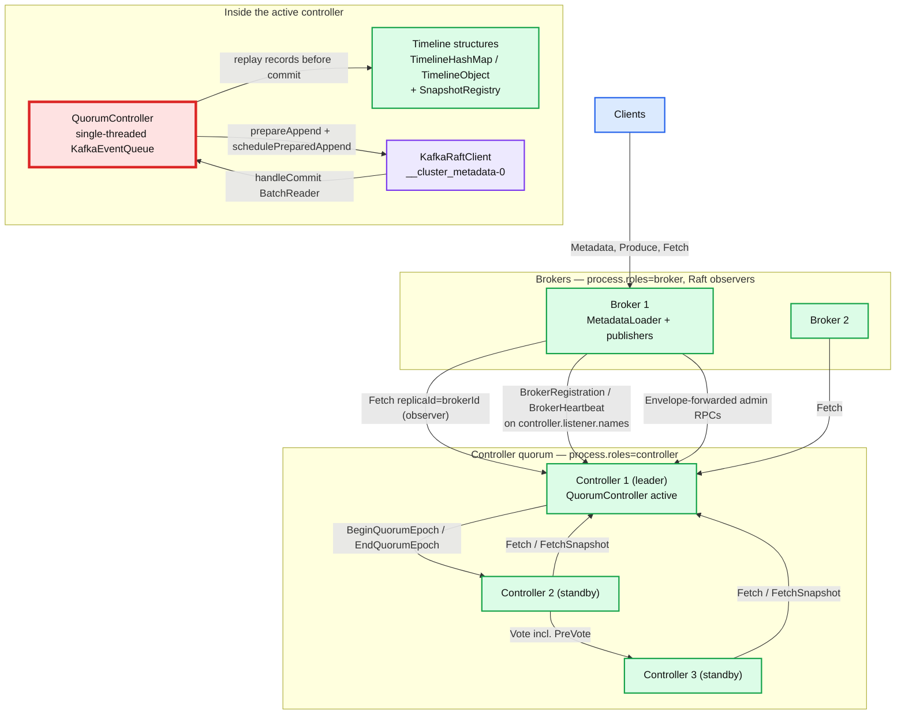

**What to notice**

- The controller quorum and the brokers are on **different protocols**: brokers replicate metadata via the *same* `Fetch` RPC used for ordinary partitions, but registration/heartbeat/admin go over the controller listener as regular Kafka RPCs.
- **All arrows into the leader are pulls.** The leader never pushes log data — not to standby controllers, not to brokers. `BeginQuorumEpoch`/`EndQuorumEpoch` are the only leader-initiated messages, and they carry no log data.
- The active controller's write path is *internal*: it replays records into timeline structures **before** they are committed, then hands them to the Raft client.
- Brokers are **observers**: they fetch the log but never vote and never count toward the high watermark.
- Combined mode collapses `C1I` and `B1` into one process (§13) — the same `SharedServer`, `MetadataLoader` and `KafkaRaftClient` instance.

---

## 4. KRaft is not textbook Raft

`KafkaRaftClient`'s own class javadoc is unusually candid:

> "This class implements a **Kafkaesque version of the Raft protocol**. Leader election is more or less pure Raft, but **replication is driven by replica fetching** and we use Kafka's log reconciliation protocol to truncate the log to a common point following each leader election."

### 4.1 The deliberate divergences

| Textbook Raft | KRaft | Why |
|---|---|---|
| Leader **pushes** `AppendEntries` to followers | Followers **pull** with `Fetch`; leader is passive | Reuses Kafka's existing fetch protocol, `FileRecords`/zero-copy path, purgatory, replica-lag tracking and log-truncation ("log reconciliation") machinery verbatim. One replication implementation, not two. |
| `AppendEntries` heartbeat asserts leadership | `BeginQuorumEpoch` asserts leadership | Because replication is pull-driven, a new leader has no way to *announce* itself: nobody is fetching from it yet. The javadoc states this directly: "This is not needed in usual Raft because the leader can use an empty data push to achieve the same purpose." |
| Leader step-down is implicit (timeout) | `EndQuorumEpoch` resigns gracefully and names preferred successors | Turns a `fetch.timeout.ms` wait into an immediate election. Used by `QuorumController.renounce()` → `raftClient.resign(epoch)`. |
| Log conflict resolution by `prevLogIndex`/`prevLogTerm` in `AppendEntries` | Truncation detection **piggybacked on `FetchResponse`** via leader-epoch/diverging-epoch fields | "Unlike partition replication, we also piggyback truncation detection on this API rather than through a separate truncation state." |
| Snapshot install pushed by leader (`InstallSnapshot`) | Follower pulls with `FetchSnapshot` after a `FetchResponse` names a snapshot ID | Same inversion. Triggered "when a FetchResponse includes a snapshot ID due to the follower's log end offset being less than the leader's log start offset." Uses `UnalignedRecords` because snapshot bytes are not offset-aligned. |
| Candidate bumps its term before soliciting votes | **Pre-vote (KIP-996)**: a `ProspectiveState` first sends `VoteRequest` with `PreVote=true`, which is *not persisted* and does not bump epochs | A partitioned-then-returned voter can otherwise force an epoch bump and depose a perfectly healthy leader. |
| Voters only | **Voters and observers** | Brokers must see all metadata but must not affect availability or the high watermark. |

### 4.2 The RPC set

| RPC | apiKey | Direction | Role |
|---|---|---|---|
| `Fetch` | 1 | follower/observer → leader | The replication primitive. Carries records, high watermark, current leader+epoch, divergence info, and possibly a snapshot ID. |
| `FetchSnapshot` | 59 | follower/observer → leader | Pull a byte range of a `<offset>-<epoch>.checkpoint` file. Bounded by `controller.quorum.fetch.snapshot.max.bytes`. |
| `Vote` | 52 | nominee → voters | v2 adds the `PreVote` bool and renames "candidate" to "replica"; v1 added `ReplicaDirectoryId` / `VoterDirectoryId` for KIP-853. |
| `BeginQuorumEpoch` | 53 | leader → voters | "Retried indefinitely for each voter until it acknowledges the request or a new election occurs." |
| `EndQuorumEpoch` | 54 | leader → voters | Graceful resignation; triggers immediate election. |
| `DescribeQuorum` | 55 | admin → leader | Backs `kafka-metadata-quorum.sh describe`. |
| `AddRaftVoter` / `RemoveRaftVoter` / `UpdateRaftVoter` | 80 / 81 / 82 | admin or self → leader | KIP-853 reconfiguration. `AddRaftVoter` and `RemoveRaftVoter` are listed on **both** `controller` and `broker` listeners. |

### 4.3 Raft replica state machine

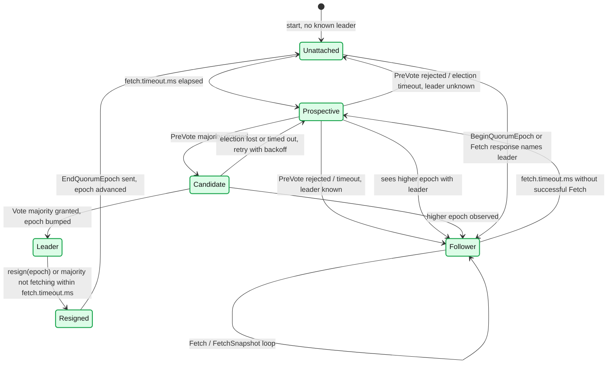

*(Classes: `UnattachedState`, `ProspectiveState`, `CandidateState`, `LeaderState`, `FollowerState`, `ResignedState`, orchestrated by `QuorumState`; `ProspectiveState` and `CandidateState` share the `NomineeState` interface.)*

**What to notice**

- `Prospective` is the KIP-996 pre-vote state and sits **in front of** `Candidate`. Its own javadoc: "Once started, it will send prevote requests… If majority votes granted, it will transition to candidate state."
- A pre-vote round **does not persist anything and does not bump the epoch** (`VoteRequest.PreVote` is documented "not persisted"). A flapping voter therefore cannot disturb a healthy leader.
- `Observer` is not a state in this machine — an observer is a replica whose ID is not in the current `VoterSet`; it lives permanently in the fetch loop and is excluded from election paths.
- The **leader also has a liveness obligation**: `controller.quorum.fetch.timeout.ms` is documented as both "maximum time without a successful fetch from the current leader before becoming a candidate" *and* "maximum time a leader can go without receiving valid fetch or fetchSnapshot request from a majority of the quorum before resigning."
- Election retries use binary exponential backoff bounded by `controller.quorum.election.backoff.max.ms` — "helps prevent gridlocked elections."

---

## 5. The `__cluster_metadata` topic

### 5.1 Shape

- **One topic, one partition**: `__cluster_metadata-0`, living in `metadata.log.dir` (defaults to the first entry of `log.dirs`). `KafkaRaftServer` explicitly checks "that the `__cluster_metadata-0` topic does not appear outside the metadata directory."
- It is a **real Kafka log** on disk — segments, indexes, the standard `RecordBatch` format — but it is not served to clients, not compacted, and not replicated by the ordinary replica fetcher. Its replication is `KafkaRaftClient`.
- **Its records are metadata records, not user records.** The value bytes are not opaque; they are versioned Kafka protocol messages generated from `metadata/src/main/resources/common/metadata/*.json` (`"type": "metadata"`), dispatched by the generated enum **`MetadataRecordType`**.

### 5.2 On-disk record framing

`AbstractApiMessageSerde` (used via `MetadataRecordSerde.INSTANCE`) frames each record value as:

```
[ frame_version | api_key | version | message ]
   uvarint (=1)   uvarint   uvarint   flexible-version encoded body
```

`DEFAULT_FRAME_VERSION = 1`; frame version 0 is explicitly rejected with `MetadataParseException`. The record **key is unused** — this is a log of events, not a compacted KV store, which is precisely why snapshots (§8) exist instead of log compaction.

Interleaved with these are Raft **control records**, deserialized by `ControlRecord`: `LEADER_CHANGE`, `SNAPSHOT_HEADER`, `SNAPSHOT_FOOTER`, `KRAFT_VERSION`, `KRAFT_VOTERS`. The last two are how KIP-853 persists quorum membership *inside the log itself*.

### 5.3 The record types that matter (Kafka 4.3.1, verified apiKeys)

| apiKey | Record | Valid versions | What it does |
|---|---|---|---|
| 0 | `RegisterBrokerRecord` | 0–4 | Full broker registration: `BrokerId`, `IncarnationId` (uuid), `BrokerEpoch`, `EndPoints`, `Features`, `Rack`, `Fenced` (**default true**), `InControlledShutdown`, tagged `LogDirs` (v3+), tagged nullable `CordonedLogDirs` (**v4+, new in 4.3**). |
| 1 | `UnregisterBrokerRecord` | 0 | Broker removed from the cluster. |
| 2 | `TopicRecord` | 0 | `Name` + `TopicId` (uuid). Topic identity only. |
| 3 | `PartitionRecord` | 0–2 | Full partition state: `Replicas`, `Isr`, `Adding/RemovingReplicas`, `Leader`, `LeaderEpoch`, `PartitionEpoch`, tagged `LeaderRecoveryState`, `Directories` (v1+, JBOD), `EligibleLeaderReplicas` / `LastKnownElr` (ELR, KIP-966). |
| 4 | `ConfigRecord` | 0 | `ResourceType`, `ResourceName`, `Name`, nullable `Value` — a null value *is* the delete. Dynamic broker/topic/cluster configs. |
| 5 | `PartitionChangeRecord` | 0–2 | **The hot path.** Every field is a tri-state delta: `Leader` = `-2` means "unchanged", `-1` means "no leader"; `Isr`/`Replicas`/`Directories`/`ELR` = `null` means "unchanged". This is what makes ISR churn cheap. |
| 7 / 8 | `FenceBrokerRecord` / `UnfenceBrokerRecord` | 0 | Legacy fencing records, superseded by apiKey 17 at newer MVs. |
| 9 | `RemoveTopicRecord` | 0 | Topic deletion by `TopicId`. |
| 10 / 26 | `DelegationTokenRecord` / `RemoveDelegationTokenRecord` | 0 | Delegation tokens. |
| 11 / 22 | `UserScramCredentialRecord` / `Remove…` | 0 | SCRAM credentials. |
| 12 | `FeatureLevelRecord` | 0 | `Name` + `FeatureLevel` (int16). **This is how `metadata.version` and `kraft.version` are stored.** Level 0 means "feature not supported." |
| 14 | `ClientQuotaRecord` | 0 | Client quotas. |
| 15 | `ProducerIdsRecord` | 0 | `BrokerId`, `BrokerEpoch`, `NextProducerId` — the controller hands out producer-ID *blocks*; this record durably advances the high-water mark of allocated IDs so a controller failover can never re-issue a block. |
| 17 | `BrokerRegistrationChangeRecord` | 0–3 | Cheap delta on an existing registration. `Fenced` is int8: **-1 = unfenced, 0 = no change, 1 = fenced**; `InControlledShutdown` int8; tagged `LogDirs` (v2+); tagged nullable `CordonedLogDirs` (**v3+, new in 4.3**). |
| 18 / 19 | `AccessControlEntryRecord` / `RemoveAccessControlEntryRecord` | 0 | ACLs stored in the metadata log — the basis of `StandardAuthorizer`. |
| 20 | `NoOpRecord` | 0 | Empty body. Written periodically by the active controller (§10.4) so the log — and therefore `LastAppliedRecordLagMs` and broker liveness accounting — keeps advancing on an idle cluster. |
| 21 | `ZkMigrationStateRecord` | 0 | Vestigial; replay-only in 4.x. |
| 23 / 24 / 25 | `BeginTransactionRecord` / `EndTransactionRecord` / `AbortTransactionRecord` | 0 | **Metadata transactions** (KIP-868), not producer transactions. Bracket a multi-batch atomic change too large for one batch. `Begin` has an optional `Name` for debugging. |
| 27 | `RegisterControllerRecord` | 0 | Controllers register themselves (KIP-919): `ControllerId`, `IncarnationId`, `EndPoints`, `Features`. This is what lets `DescribeCluster` on the controller listener return real endpoints. |
| 28 | `ClearElrRecord` | 0 | Clears eligible-leader-replica sets for one topic, or **all topics when `TopicName` is empty**. |

**Metadata transactions and the last stable offset.** `OffsetControlManager` maintains `lastStableOffset = min(transactionStartOffset - 1, lastCommittedOffset)` when a transaction is open. Readers — including every deferred write completion — are only released up to `lastStableOffset`, so a half-written transaction is never observable. `AbortTransactionRecord` replay calls `snapshotRegistry.revertToSnapshot(transactionStartOffset - 1)`: the in-memory state rewinds. And `BeginTransactionRecord` "cannot appear within a snapshot" — snapshots are always taken at a stable point.

---

## 6. Data flow

### 6.1 Write path — a controller mutation

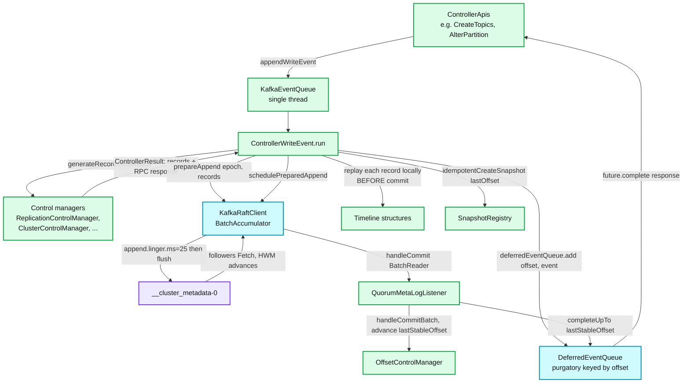

**What to notice**

- The records are **applied to in-memory state before they are committed** — `replay(...)` runs inside the appender callback, immediately after `prepareAppend` returns the offsets. The controller is therefore always reasoning about the *latest* state, including uncommitted records, which is what lets it pipeline back-to-back operations without waiting a replication round-trip each time.
- The client's future is *not* completed at append time. It is parked in `deferredEventQueue` keyed by the batch's last offset, and released only when `lastStableOffset` reaches it. **Linearizability is preserved even though computation ran ahead of commitment.**
- `snapshotRegistry.idempotentCreateSnapshot(lastOffset)` is taken per batch. That is the rollback point.
- A read-only write event (empty `records`) still waits for `deferredEventQueue.highestPendingOffset()` if the purgatory is non-empty — "this read was done from the latest in-memory state, which might contain uncommitted data." If the purgatory is empty it completes immediately with offset `-1`.
- `appendRecords` splits non-atomic results into batches of `maxRecordsPerBatch` (**default 10 000**, `QuorumController.DEFAULT_MAX_RECORDS_PER_BATCH`); atomic results larger than that are a hard `IllegalStateException`.

### 6.2 Read path — metadata reaching a broker

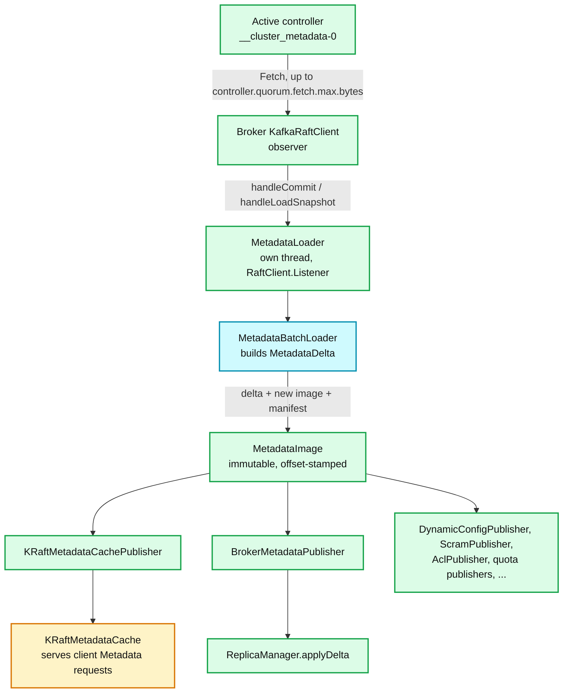

**What to notice**

- Brokers **subscribe**; nothing is pushed at them. The only "push-like" thing left is that a `FetchResponse` may tell a lagging broker to go get a snapshot instead.
- `MetadataLoader` "maintains its own thread, which is used to make all callbacks into publishers. **If a publisher A is installed before B, A will receive all callbacks before B**." Ordering of publishers is load-bearing: the metadata cache is updated before `ReplicaManager` acts on the delta.
- Each publisher receives `(MetadataDelta, MetadataImage, LoaderManifest)`. The **delta** is what makes application cheap; the **image** is a full immutable snapshot for anything needing a consistent point-in-time read.
- A newly installed publisher "receives a catch-up delta which contains the full state" — publishers can be added and removed at runtime without a restart.
- `MetadataLoader.catchingUp` suppresses all publishing until the loader has reached the high watermark, so a starting broker never briefly publishes a stale world view.

### 6.3 Contrast with the ZK-era push plane

| | ZooKeeper mode | KRaft mode |
|---|---|---|
| Transport | `LeaderAndIsr`, `UpdateMetadata`, `StopReplica` RPCs, controller → each broker | `Fetch` on `__cluster_metadata-0`, broker → controller |
| Direction | Push | Pull |
| Granularity | Full state for affected topics; `UpdateMetadata` fan-out to *all* brokers | Byte-delta since the broker's own offset |
| Ordering | Guarded by a controller epoch stamped on each RPC; out-of-order/stale RPCs discarded per-broker | Total order by log offset; a broker's position **is** an offset |
| Divergence detection | None — a broker that missed an RPC stayed wrong until the next full update | Impossible by construction: gaps cannot exist in a log |
| Observability of lag | Essentially none | `CurrentMetadataOffset` in every heartbeat; `MaxFollowerLag`, `LastAppliedRecordLagMs` |
| Cost of one controller failover | Reload all state from ZK, then re-push to everyone | Standby already has the state; leadership epoch changes |

---

## 7. Quorum mechanics

### 7.1 Static vs dynamic membership: the two config models

| | Static quorum (`kraft.version=0`) | Dynamic quorum (`kraft.version=1`, KIP-853) |
|---|---|---|
| Config key | `controller.quorum.voters=1@h1:9093,2@h2:9093,3@h3:9093` on **every** broker and controller | `controller.quorum.bootstrap.servers=h1:9093,h2:9093,h3:9093` |
| Semantics | The voter set **is** the config. Must be identical everywhere. | Bootstrap list is a *discovery hint*, "much like the `bootstrap.servers` configuration used by Kafka clients." It "need not contain all the controllers, but it should contain as many as possible." |
| Source of truth for membership | Static config file | `VotersRecord` control records **in the log itself** |
| Membership change | Rolling restart of every node with edited configs, with real split-brain risk | `AddRaftVoter` / `RemoveRaftVoter` RPC, one voter at a time |
| Chosen when | `controller.quorum.voters` is present at format time | `controller.quorum.voters` **absent** *and* one of `--standalone`, `--initial-controllers`, `--no-initial-controllers` given to `kafka-storage.sh format` |

`QuorumConfig`'s own doc on `controller.quorum.voters`: "This is the **old way** of defining membership for controller quorums and **should NOT be set** if using dynamic quorums."

The decision is made **at format time**, not at runtime — and there is a metric for people who get it wrong: `kafka.controller:type=…,name=IgnoredStaticVoters`.

### 7.2 The active controller

- Exactly one controller is the Raft **leader** of `__cluster_metadata-0`, and that node's `QuorumController` is the **active controller**. Everything else is a hot standby.
- `QuorumController.handleLeaderChange` is the whole story:
  - Was active, still leader in new epoch → just bump `curClaimEpoch`.
  - Was active, someone else is leader → `renounce()`: `raftClient.resign(epoch)`, `deferredEventQueue.failAll(NotControllerException)`, `offsetControl.deactivate()` which **reverts all timeline structures to `lastStableOffset`**, `clusterControl.deactivate()`, `periodicControl.deactivate()`.
  - Was standby, now leader → `claim(epoch, raftClient.logEndOffset())`.
- `claim()` **prepends** a `CompleteActivationEvent` to the event queue (the only use of `prepend` in the class, deliberately) so activation runs before any queued client request. `ActivationRecordsGenerator` emits the bootstrap/feature records needed, and `processBatchEndOffset` then calls `periodicControl.activate()` — periodic tasks only start once `metadata.version` is known correct.
- Failover is genuinely cheap **because there is no state reload**: the standby has been replaying the log all along. The only work is reverting uncommitted state and re-activating periodic tasks.

### 7.3 Quorum config knobs (all defaults verified in `QuorumConfig.java`)

| Config | Default | Meaning |
|---|---|---|
| `controller.quorum.voters` | `[]` (empty) | Static voter set, `{id}@{host}:{port}`. Deprecated by KIP-853. |
| `controller.quorum.bootstrap.servers` | `[]` (empty) | Discovery endpoints, `{host}:{port}`. Required in 4.x deployments per `docs/operations/kraft.md`: "Every broker and controller must set the `controller.quorum.bootstrap.servers` property." |
| `controller.quorum.election.timeout.ms` | **1000** | Max time without being able to fetch from the leader before triggering a new election. |
| `controller.quorum.fetch.timeout.ms` | **2000** | Follower: max time without a successful fetch before becoming a nominee. Leader: max time without a valid `Fetch`/`FetchSnapshot` from a **majority** before resigning. |
| `controller.quorum.election.backoff.max.ms` | **1000** | Ceiling on the binary exponential backoff between election attempts. |
| `controller.quorum.append.linger.ms` | **25** | How long the leader accumulates writes before flushing to disk. The single most important controller throughput/latency knob. |
| `controller.quorum.request.timeout.ms` | **2000** | Raft RPC timeout. |
| `controller.quorum.retry.backoff.ms` | **20** | Raft RPC retry backoff. |
| `controller.quorum.auto.join.enable` | **false** | KIP-853: controller automatically issues `AddRaftVoter` for itself. |
| `controller.quorum.fetch.max.bytes` | **1048576** (1 MiB) | **KIP-1219, new in 4.3.** Max data per `Fetch`. "Always returns at least one batch even if it is greater than `controller.quorum.fetch.max.bytes`." |
| `controller.quorum.fetch.snapshot.max.bytes` | **1048576** (1 MiB) | **KIP-1219, new in 4.3.** Max data per `FetchSnapshot`. |

> Before KIP-1219 both of these were hard-coded, which made snapshot transfer to a cold-starting controller unnecessarily slow on fat pipes and unnecessarily bursty on thin ones. They are `LOW` importance in the `ConfigDef` but they are the two knobs that govern **catch-up time**, which is exactly what you tune when adding a voter to a large cluster.

Not in `QuorumConfig` but in the same plane: `KafkaRaftClient.MAX_BATCH_SIZE_BYTES = 8 * 1024 * 1024` (8 MiB), the largest record batch the metadata log will accept, and the size of each buffer in the `BatchMemoryPool(5, MAX_BATCH_SIZE_BYTES)`.

### 7.4 Leader election with pre-vote

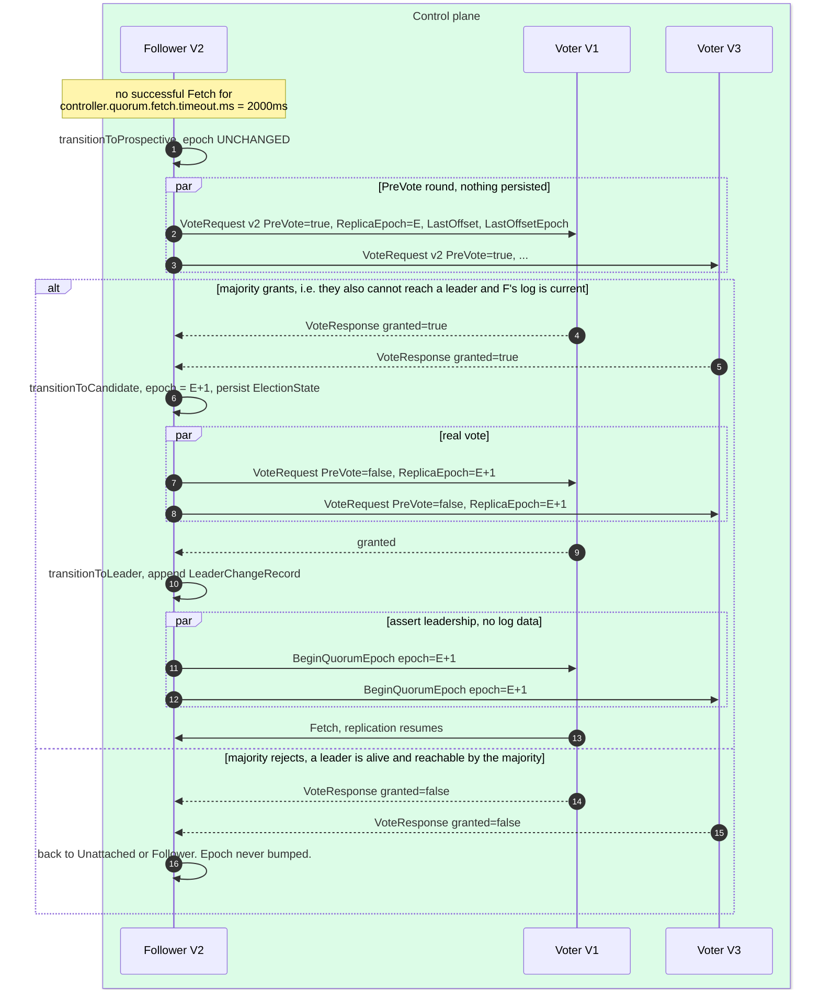

**What to notice**

- The **entire left branch is free** in the rejection case: no epoch bump, no disk write, no disruption to the sitting leader. That is the whole point of KIP-996.
- `BeginQuorumEpoch` exists solely because followers are pull-driven: without it, a fresh leader would sit silently while followers keep timing out against a dead one.
- A voter grants only if the nominee's `(LastOffsetEpoch, LastOffset)` is at least as current as its own — standard Raft log-completeness, carried in `VoteRequest` per-partition data.
- `EndQuorumEpoch` (not shown) is the graceful path: a resigning leader tells voters to elect immediately, naming `PreferredSuccessors`, skipping the 2 s fetch timeout.

---

## 8. KIP-853 — dynamic quorum reconfiguration

**Maturity in 4.3.1: production.** `KRaftVersion.LATEST_PRODUCTION = KRAFT_VERSION_1`, and `KRAFT_VERSION_1`'s `bootstrapMetadataVersion` is `IBP_3_9_IV0`. The docs date the static→dynamic *upgrade* path to 4.1: "Apache Kafka 4.1 added support for upgrading a cluster from a static controller configuration to a dynamic controller configuration."

### 8.1 What changed vs the static model

- **Membership lives in the log**, as `KRaftVersionRecord` and `VotersRecord` control records — the same log the membership governs. `kafka-storage.sh format --standalone` writes a bootstrap snapshot at `00000000000000000000-0000000000.checkpoint` containing exactly those two control records, making that node the sole voter.
- **Voters are identified by `(id, directoryId)`, not just `id`.** `ReplicaKey` carries both; `VoteRequest` v1+ carries `ReplicaDirectoryId` and `VoterDirectoryId`. `kafka-storage.sh format` writes a random `directory.id` into `meta.properties`. This is what makes "controller 3 was rebuilt from blank disks" distinguishable from "controller 3 restarted" — a re-formatted node has a new directory ID and is *not* the old voter, so it cannot inherit its votes. Under the static model, a wiped controller silently re-joined as itself, which is precisely how you lose committed metadata.
- `--initial-controllers "0@controller-0:1234:<uuid>,1@…"` bootstraps a multi-voter quorum; the replica-description format is `id@host:port:directoryId`.
- New nodes are formatted `--no-initial-controllers`.

### 8.2 The add-voter protocol

`AddVoterHandler`'s javadoc enumerates the invariants; the enforced ones:

1. No other voter-change operation pending (`leaderState.isOperationPending`) → else `REQUEST_TIMED_OUT`.
2. The leader has established a high watermark and committed its current epoch → else `REQUEST_TIMED_OUT`.
3. `kraft.version >= 1` → else `UNSUPPORTED_VERSION`.
4. **No uncommitted `VotersRecord`**: `votersEntry.offset() < highWatermark` → else `REQUEST_TIMED_OUT`. *One membership change at a time, fully committed, is the classic Raft joint-consensus-avoidance rule.*
5. New voter supports the current `kraft.version` → else `INVALID_REQUEST`.
6. **New voter is caught up to the leader's log end offset** → else `REQUEST_TIMED_OUT` ("Aborting add voter operation for {} at {} since it is lagging behind").
7. Append the new `VotersRecord`. **The KRaft internal listener applies it while still uncommitted** — the new voter counts immediately.
8. Wait for it to commit **using a majority of the new voter set**.

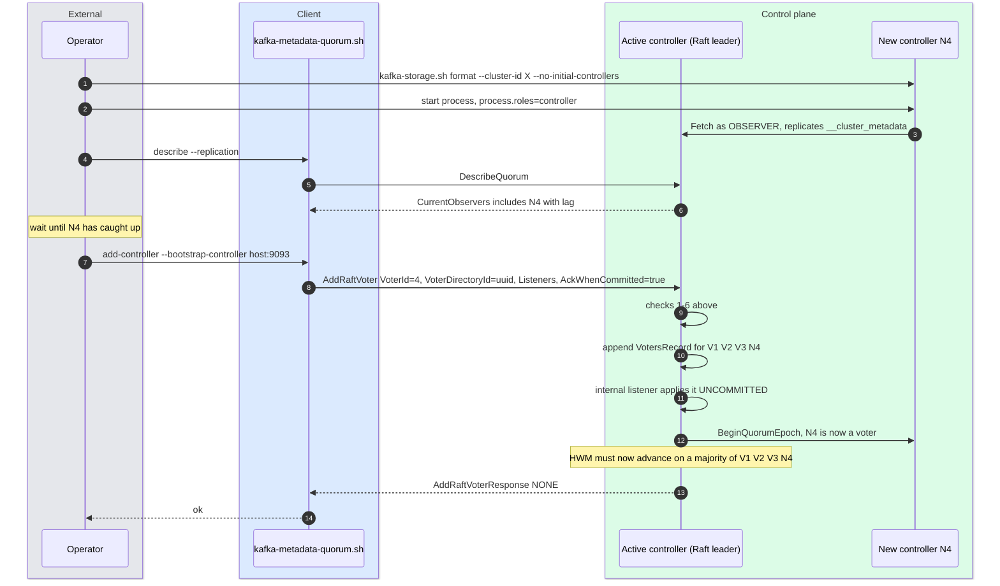

**What to notice**

- The catch-up happens **as an observer, before the RPC** — this is why you provision, start, and *watch* the new controller before adding it. Adding a cold node would immediately shrink effective availability, because the majority denominator grows before the new member can contribute.
- `AckWhenCommitted` (added in `AddRaftVoterRequest` v1) lets a caller return as soon as the leader writes locally rather than waiting for commit — useful for the `controller.quorum.auto.join.enable` self-join path.
- **Remove before shutdown**: "Use the `remove-controller` command before shutting down the controller to have it removed from the quorum first." Removing after the fact means the quorum spends the interim with a dead member counted in its majority.
- `RemoveRaftVoter` requires `--controller-id` **and** `--controller-directory-id` — you cannot remove "controller 3", only "this specific incarnation of controller 3".
- Both RPCs are listed on the `broker` listener too, so `--bootstrap-server` works as well as `--bootstrap-controller`; the broker forwards.

### 8.3 Static → dynamic upgrade

```bash
# 1. confirm current level
bin/kafka-features.sh --bootstrap-controller localhost:9093 describe
#    kraft.version FinalizedVersionLevel: 0  -> static

# 2. raise the feature level
bin/kafka-features.sh --bootstrap-server localhost:9092 upgrade --feature kraft.version=1
#    or: upgrade --release-version 4.1

# 3. only then edit configs: drop controller.quorum.voters,
#    add controller.quorum.bootstrap.servers on ALL nodes
```

Order matters: the feature upgrade must be finalized *before* the static voter config is removed, otherwise nodes lose their only means of finding the quorum.

---

## 9. Snapshots

### 9.1 Why snapshots and not compaction

Log compaction retains the last record **per key**. The metadata log has no meaningful keys — `AbstractApiMessageSerde` writes only a value — and more importantly its records are **deltas, not states**: a `PartitionChangeRecord` says "ISR changed to X", which is meaningless without every prior record for that partition. Compaction would either retain everything or corrupt the state machine.

Instead KRaft does **state-machine snapshotting**, the standard Raft answer: serialize the *materialized* state (the `MetadataImage`) at a committed offset, then discard log prefix.

### 9.2 File format and naming

`Snapshots.java`:

- Name: `<20-digit zero-padded endOffset>-<10-digit zero-padded epoch>.checkpoint`, e.g. `00000000000000007228-0000000001.checkpoint`. `OFFSET_WIDTH = 20`, `EPOCH_WIDTH = 10`, no grouping separators — so lexical sort equals offset order.
- In-progress: `<name>.checkpoint.part` (`PARTIAL_SUFFIX`), written to a temp file and atomically renamed. A crash mid-write leaves a `.part` that is ignored.
- Being deleted: `<name>.checkpoint.deleted`, removed after `internal.metadata.delete.delay.millis`.
- Lives **in the partition directory itself** — `snapshotDir(logDir) == logDir`, i.e. `__cluster_metadata-0/`.
- The snapshot ID `(endOffset, epoch)` is **exclusive** of `endOffset`: the snapshot contains everything *up to but not including* that offset.
- Special case: `Snapshots.BOOTSTRAP_SNAPSHOT_ID = (0, 0)` → `00000000000000000000-0000000000.checkpoint`, written by `kafka-storage.sh format`, holding only `KRaftVersionRecord` + `VotersRecord`. The docs warn: "`00000000000000000000-0000000000.checkpoint` does not contain cluster metadata."
- Contents are framed by `SnapshotHeaderRecord` … metadata records … `SnapshotFooterRecord` (Raft control records).

### 9.3 When a snapshot is taken

`SnapshotGenerator` is itself a `MetadataPublisher` — snapshots are generated by watching the same image stream everyone else watches. Per `publishLogDelta`:

```
bytesSinceLastSnapshot += manifest.numBytes()
if bytesSinceLastSnapshot >= metadata.log.max.record.bytes.between.snapshots   # default 20 MiB
    emit
elif metadata.log.max.snapshot.interval.ms != 0
     and now - lastSnapshotTime >= metadata.log.max.snapshot.interval.ms       # default 1 hour
    emit
```

Two extra guards: it will not schedule while `eventQueue` is non-empty (avoid piling up), and it will not emit unless `manifest.provenance().isOffsetBatchAligned()` — a snapshot must sit on a batch boundary.

Both **controllers and brokers** generate their own snapshots: `SnapshotGenerator` is built in `SharedServer`, which is common to `ControllerServer` and `BrokerServer`. A broker's snapshot is what lets *it* restart fast; it does not serve snapshots to anyone.

### 9.4 Loading, and serving a lagging follower

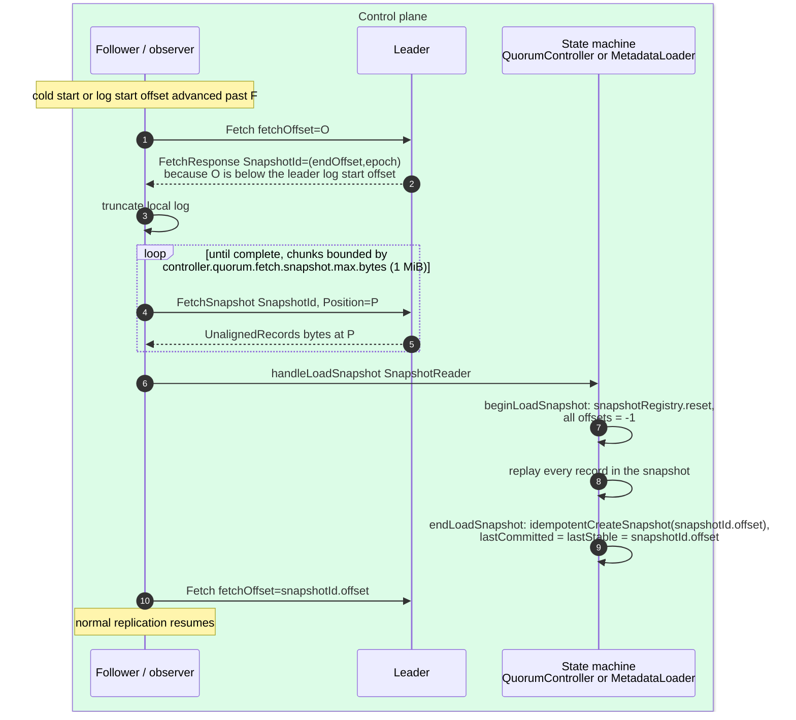

**What to notice**

- `FetchSnapshot` uses `UnalignedRecords` — the response is a byte range at `Position`, not offset-aligned records, because a snapshot is a file, not a log.
- `OffsetControlManager.beginLoadSnapshot` **wipes the entire in-memory world** (`snapshotRegistry.reset()`) before replaying. Loading a snapshot is not a merge; it is a replace.
- On process start the same path runs from the local `.checkpoint` file: read newest snapshot, then replay log records after it. `kafka.server:type=MetadataLoader,name=HandleLoadSnapshotCount` counts these.
- The retention knobs are **soft** by design: `metadata.max.retention.bytes` (100 MiB) and `metadata.max.retention.ms` (7 days) — "Since at least one snapshot must exist before any logs can be deleted, this is a soft limit."

### 9.5 Snapshot-related configs (verified in `MetadataLogConfig.java`)

| Config | Default | Notes |
|---|---|---|
| `metadata.log.max.record.bytes.between.snapshots` | **20971520** (20 MiB) | Bytes of committed log since the last snapshot before generating a new one. |
| `metadata.log.max.snapshot.interval.ms` | **3600000** (1 hour) | Time-based trigger. **0 disables time-based generation.** |
| `metadata.log.dir` | `null` → first entry of `log.dirs` | Where `__cluster_metadata-0` lives. Put it on its own device on controllers. |
| `metadata.log.segment.bytes` | **1073741824** (1 GiB) | Minimum enforced: 8 MiB. |
| `metadata.log.segment.ms` | **604800000** (7 days) | |
| `metadata.max.retention.bytes` | **104857600** (100 MiB) | Combined log + snapshots. Soft. |
| `metadata.max.retention.ms` | **604800000** (7 days) | Soft. |
| `metadata.max.idle.interval.ms` | **500** | How often the active controller writes `NoOpRecord`. **0 disables.** |

---

## 10. The `QuorumController` internals — the deferred/batched commit model

This is the most interesting engineering in KRaft, and it is what actually delivers the throughput that made 2M partitions viable.

### 10.1 The problem

A controller must be **linearizable** (a client that gets "topic created" must never see it vanish) and **fast** (thousands of ISR changes/sec). Naively, every mutation costs a full replication round trip before you can compute the next one, because the next decision depends on the previous state. That serializes controller throughput at `1 / replication_latency`.

### 10.2 The solution: MVCC in-memory state + an offset-keyed purgatory

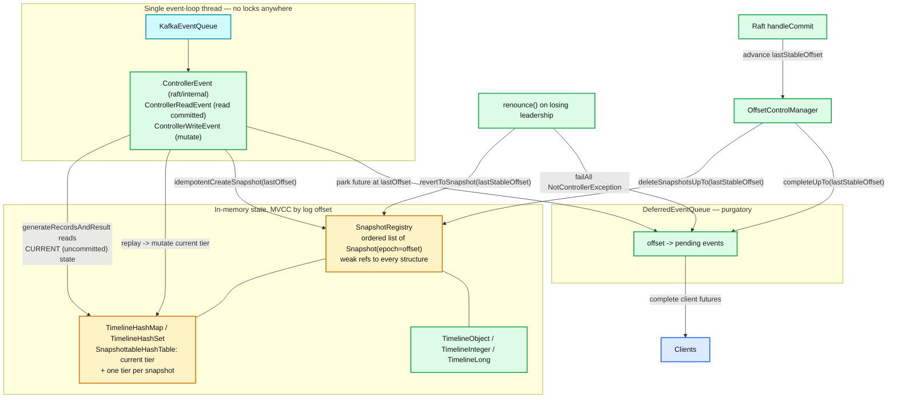

**What to notice**

- **There is exactly one thread.** `SnapshottableHashTable`: "All of these classes require external synchronization." The external synchronization *is* the single-threaded event loop. No locks, no volatile reads on the hot path.
- **Snapshot epochs are log offsets.** `snapshotRegistry.idempotentCreateSnapshot(lastOffset)` after every scheduled append; `deleteSnapshotsUpTo(lastStableOffset)` as commits land. Memory held for uncommitted versions is bounded by replication lag.
- **Rollback is a single call.** `renounce()` → `offsetControl.deactivate()` → `snapshotRegistry.revertToSnapshot(lastStableOffset)`. Every timeline structure in the registry rewinds together, atomically. There is no undo log, no per-manager cleanup, no partial state.
- **Reads and writes see different worlds on purpose.** `generateRecordsAndResult` reads the *current* tier (uncommitted); `ControllerReadEvent` and any client response read only what has passed `lastStableOffset`.
- `DeferredEventQueue` is keyed by offset, so completing everything up to an offset is one ordered sweep.

### 10.3 How `TimelineHashMap` actually works

From `SnapshottableHashTable`'s javadoc:

- The **current tier** is stored in the fields inherited from `BaseHashTable` (separate chaining). Historical values live in **snapshot tiers**.
- "We handle divergences between the current state and historical state by **copying a reference to elements that have been deleted or overwritten into the most recent snapshot tier**." Copy-on-write, but only for *changed* entries — an unchanged partition costs nothing per snapshot.
- "Snapshot tiers will be null if they don't contain anything" — a snapshot in which nothing changed is free.
- Each element carries a **start epoch** identifying when it was inserted, which determines snapshot membership.
- Lookup at epoch E: check the current tier first; if its `startEpoch` reaches back to E, return it. Otherwise walk snapshot tiers from E forward. "If we encounter the object in a snapshot tier but its epoch is too new, we know that its value at epoch E must be null."
- The registry holds only **weak references**, so a discarded control manager's structures can be collected.
- Iteration over a snapshot is safe **concurrently with mutation of the current state** — which is what lets long-running reads (e.g. `DescribeTopics` over a huge cluster) not block the write path.

The class hierarchy, from the source:

```
       Revertable       BaseHashTable
             ↑              ↑
          SnapshottableHashTable → SnapshotRegistry → Snapshot
              ↑             ↑
  TimelineHashSet       TimelineHashMap
```

Concrete example from `ClusterControlManager`:
`private final TimelineHashMap<Integer, Long> registerBrokerRecordOffsets;` — the offset at which each broker's `RegisterBrokerRecord` landed, needed to decide unfencing (§12). It is versioned like everything else, so a renounced controller's speculative registrations vanish with the rollback.

### 10.4 The event loop and periodic tasks

Three event classes, all on one queue:

| Class | Purpose | Completion |
|---|---|---|
| `ControllerEvent` | Internal/Raft callbacks (`handleCommit`, `handleLeaderChange`, `handleSnapshot`) | Synchronous |
| `ControllerReadEvent<T>` | Read committed state for an API | Completes immediately with the read value |
| `ControllerWriteEvent<T>` | Mutation | Deferred to `lastStableOffset >= resultAndOffset.offset()` |

`PeriodicTaskControlManager` schedules recurring `ControllerWriteEvent`s **only while active**:

| Task | Period | Effect |
|---|---|---|
| `writeNoOpRecord` | `metadata.max.idle.interval.ms` = **500 ms** | Appends `NoOpRecord`. Registered only if the interval is non-zero. |
| `maybeFenceStaleBroker` | `max(1ms, broker.session.timeout.ms / 8)` = **1125 ms** at defaults | "We sample 8 times per broker timeout period, so we'll generally fence a broker in no more than **112.5%** of the given broker session timeout." Fences **one broker per invocation** — "so that the effect of fencing each broker is visible to the system prior to processing the next one." |
| `electPreferred` | `leader.imbalance.check.interval.seconds` | `maybeBalancePartitionLeaders` |
| `electUnclean` | `unclean.leader.election.interval.ms` = **5 min** (internal config) | `maybeElectUncleanLeaders` for leaderless partitions |
| `expireDelegationTokens` | delegation token check interval | |
| `generatePeriodicPerformanceMessage` | `controller.performance.sample.period.ms` = **60000** (internal) | Logs event-queue statistics; `controller.performance.always.log.threshold.ms` = **2000** (internal) forces an error log for any event slower than that. |

Fencing one broker at a time is a deliberate blast-radius control: a rack-wide network blip must not cause the controller to emit leadership changes for every partition on every broker in that rack in a single batch.

### 10.5 Controller-side metrics that matter

| MBean | What it tells you |
|---|---|
| `kafka.controller:type=KafkaController,name=ActiveControllerCount` | Must sum to exactly **1** across the quorum. |
| `kafka.controller:type=ControllerEventManager,name=EventQueueTimeMs` | Backlog. Rising = controller is the bottleneck. |
| `…,name=EventQueueProcessingTimeMs` | Per-event cost. |
| `…,name=AvgIdleRatio` | Headroom on the single thread. Falling toward 0 = saturated. |
| `kafka.controller:type=KafkaController,name=LastAppliedRecordOffset` / `LastCommittedRecordOffset` | Their **difference is the uncommitted backlog** on the active controller — i.e. how much timeline state is speculative. |
| `…,name=LastAppliedRecordLagMs` | "For active Controllers the value of this lag is always zero." On standbys, this is your controller-replication lag. |
| `…,name=TimedOutBrokerHeartbeatCount` | Sessions expired. Only the active controller increments. |
| `…,name=NewActiveControllersCount` | Election churn. "A transition to the 'no leader' state is not counted here." |
| `…,name=EventQueueOperationsTimedOutCount` | Requests that never got processed. |
| `kafka.server:type=raft-metrics,name=current-state` | `leader` / `candidate` / `voted` / `follower` / `unattached` / `observer`. |
| `…,name=uncommitted-voter-change` | 1 while a KIP-853 reconfiguration is in flight. |
| `…,name=number-of-voters`, `number-of-observers`, `number-unknown-voter-connections` | Quorum shape. |
| `kafka.controller:type=…,name=IgnoredStaticVoters` | You left `controller.quorum.voters` set on a dynamic quorum. |

---

## 11. Metadata propagation to brokers

### 11.1 Components

| Component | Location | Responsibility |
|---|---|---|
| `KafkaRaftClient` (observer) | `raft/` | Fetches `__cluster_metadata-0`. Never votes. |
| `MetadataLoader` | `metadata/.../image/loader/` | `RaftClient.Listener`. Owns a thread. Converts batches/snapshots into `MetadataDelta` + `MetadataImage` + `LoaderManifest`, then calls publishers **in installation order**. |
| `MetadataBatchLoader` | same | Accumulates records into a delta, respecting metadata transactions. |
| `MetadataImage` / `MetadataDelta` | `metadata/.../image/` | Immutable offset-stamped full state; and the diff. |
| `MetadataPublisher` implementations | various | See below. |
| `KRaftMetadataCache` | `metadata/.../KRaftMetadataCache.java` | The broker's answer to client `Metadata` requests. Updated by `KRaftMetadataCachePublisher.setImage`. |

Publishers installed on a **broker** (`BrokerServer.scala`, in order): `MetadataVersionConfigValidator`, `BrokerMetadataPublisher`, `DynamicConfigPublisher`, `DynamicClientQuotaPublisher`, `DynamicTopicClusterQuotaPublisher`, `ScramPublisher`, `DelegationTokenPublisher`, `AclPublisher`, `BrokerRegistrationTracker`.

On a **controller** (`ControllerServer.scala`): `KRaftMetadataCachePublisher`, `FeaturesPublisher`, `ControllerRegistrationsPublisher`, `ControllerRegistrationManager`, `DynamicConfigPublisher`, `DynamicClientQuotaPublisher`, `DynamicTopicClusterQuotaPublisher`, `ScramPublisher`, `DelegationTokenPublisher`, `ControllerMetadataMetricsPublisher`, `AclPublisher`.

### 11.2 `BrokerMetadataPublisher.onMetadataUpdate`

Order inside one callback (`BrokerMetadataPublisher.scala`):

1. `metadataCache.setImage(newImage)` — client-visible metadata updates **first**.
2. On first publish only: `initializeManagers(newImage)` — start `ReplicaManager`, then the group / transaction / share coordinators, sizing each from `metadataCache.numPartitions(...)` for its internal topic.
3. `replicaManager.applyDelta(topicsDelta, newImage)` — create/delete/reassign local replicas, start/stop fetchers, change leaders. **This is the KRaft replacement for `LeaderAndIsr` + `StopReplica`.**
4. `groupCoordinator.onElection` / `onResignation` for `__consumer_offsets` partitions this broker gained or lost.
5. `groupCoordinator.onMetadataUpdate(delta, newImage)`.
6. `_firstPublish = false; firstPublishFuture.complete(null)`.

`BrokerServer` startup blocks on `firstPublishFuture` with `startupDeadline` — a broker does not open for business until it has applied a complete metadata image at least once. (`server.max.startup.time.ms`, default `Long.MAX_VALUE` = no limit, "should be used for testing only".)

### 11.3 Broker-side lag metrics

| MBean | Meaning |
|---|---|
| `kafka.server:type=broker-metadata-metrics,name=last-applied-record-offset` | Where this broker is in the metadata log. |
| `…,name=last-applied-record-timestamp` | Append timestamp of that record. |
| `…,name=last-applied-record-lag-ms` | now − that timestamp. **The number to alert on.** This is why `NoOpRecord` exists: without periodic writes on an idle cluster this metric would climb spuriously. |
| `…,name=metadata-load-error-count` | Errors building a `MetadataDelta`. |
| `…,name=metadata-apply-error-count` | Errors in `BrokerMetadataPublisher` applying an image. |
| `kafka.server:type=MetadataLoader,name=CurrentMetadataVersion` | Effective MV. |
| `…,name=HandleLoadSnapshotCount` | How often this node had to fall back to a snapshot — a nonzero rate in steady state means the node cannot keep up with log retention. |
| `…,name=CurrentControllerId` | Who this node thinks is active. |
| `…,name=FinalizedLevel` (tagged `featureName`) | Per-feature finalized level. |
| `kafka-metadata-quorum.sh describe --status` → `MaxFollowerLag`, `MaxFollowerLagTimeMs` | Leader's view of the worst replica. |

Also: every `BrokerHeartbeat` carries `CurrentMetadataOffset`, so the **controller** always knows every broker's metadata position — a form of observability that had no ZK-mode equivalent.

---

## 12. Broker lifecycle

### 12.1 The pieces

- **`BrokerRegistration` (apiKey 62)** — sent once at startup by `BrokerLifecycleManager.sendBrokerRegistration()`. Carries `BrokerId`, a per-process-random `IncarnationId` (`Uuid.randomUuid()` held in a `final` field), listeners, supported feature ranges (must include `metadata.version` or the controller throws `InvalidRegistrationException`), rack, log-dir UUIDs, and `PreviousBrokerEpoch` for clean-shutdown detection.
- **Broker epoch** — assigned by the controller as `offsetControl.nextWriteOffset()`, i.e. **the log offset at which the `RegisterBrokerRecord` will land**. Monotonic, cluster-unique, and directly comparable to metadata offsets. This is elegant: the epoch *is* a position in the metadata timeline.
- **`BrokerHeartbeat` (apiKey 63)** — every `broker.heartbeat.interval.ms`. Carries `BrokerEpoch`, `CurrentMetadataOffset`, `WantFence`, `WantShutDown`, tagged `OfflineLogDirs` (v1+), tagged `CordonedLogDirs` (**v2+, new in 4.3**, "null before the broker reaches the RECOVERY state"). Response carries `IsCaughtUp`, `IsFenced`, `ShouldShutDown`.
- **Incarnation IDs** are the anti-zombie mechanism. In `ClusterControlManager.registerBroker`: if an existing registration for that ID still `hasValidSession`, and the incoming `IncarnationId` differs → `DuplicateBrokerRegistrationException` with the operator-friendly message "If the broker was recently restarted this should self-resolve once the heartbeat manager expires the broker's session." Same incarnation ID → this is a *re-registration* of the same process; the epoch and fenced/shutdown flags are preserved ("Amending registration of broker {}… Broker epoch remains {}").

### 12.2 Broker state machine (broker's own view)

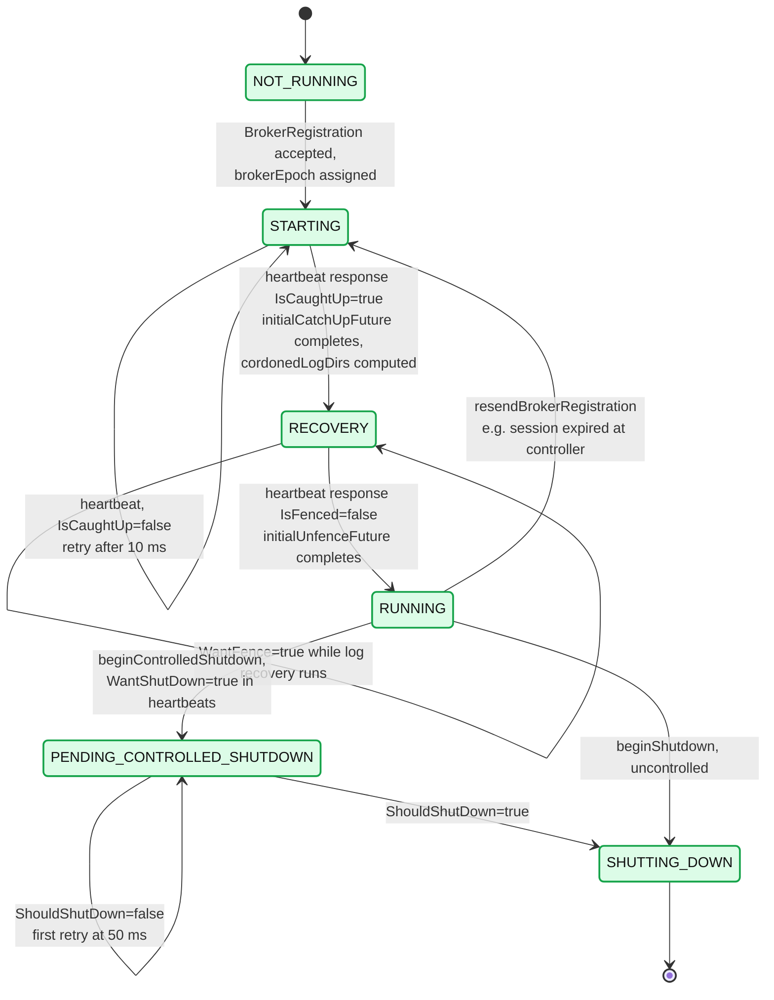

*(`org.apache.kafka.metadata.BrokerState`: NOT_RUNNING=0, STARTING=1, RECOVERY=2, RUNNING=3, PENDING_CONTROLLED_SHUTDOWN=6, SHUTTING_DOWN=7, UNKNOWN=127.)*

### 12.3 Controller-side broker control state machine

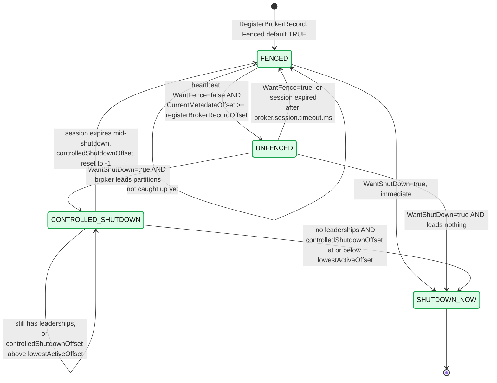

*(`BrokerHeartbeatManager.BrokerControlState` / `calculateNextBrokerState`.)*

**What to notice**

- **A broker is born fenced.** `RegisterBrokerRecord.Fenced` has `"default": "true"`. Fenced means: not a valid leader, excluded from replica placement, invisible in client metadata.
- **The unfence condition is an offset comparison, not a timer**: `request.currentMetadataOffset() >= registerBrokerRecordOffset`. A broker may not serve until it has seen *its own registration record* — and therefore everything the controller knew at that moment. This is the mechanism that makes stale-metadata serving structurally impossible.
- `FENCED → SHUTDOWN_NOW` is immediate: a fenced broker leads nothing, so there is nothing to move.
- `UNFENCED → SHUTDOWN_NOW` when the broker leads nothing — the controller checks `hasLeaderships` rather than blindly running the controlled-shutdown dance.
- `CONTROLLED_SHUTDOWN` waits on **two** conditions: all leaderships moved, *and* `controlledShutdownOffset <= lowestActiveOffset` — i.e. every other active broker has consumed the metadata describing the leadership moves. Without the second condition, producers could still be routing to the departing broker.
- Fencing is driven by `BrokerHeartbeatTracker.maybeRemoveExpired()` against `broker.session.timeout.ms`, sampled 8× per timeout, **one broker per pass**.

### 12.4 Registration and unfencing sequence

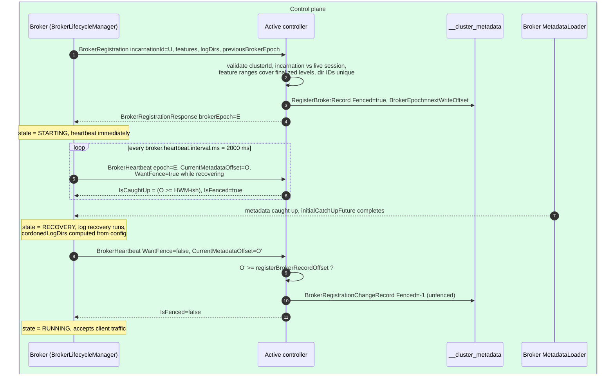

### 12.5 Controlled shutdown through heartbeats

There is no `ControlledShutdownRequest` in KRaft. Shutdown is a **field in the heartbeat**, which means it is retried for free, is idempotent, and cannot be lost.

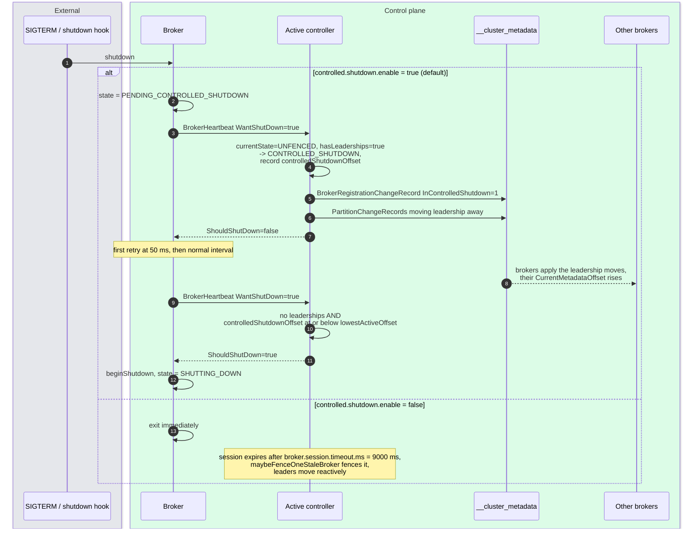

**What to notice**

- `lowestActiveOffset` is the minimum `CurrentMetadataOffset` across all active brokers. The departing broker is released only once **the slowest remaining broker** has seen the leadership moves — a genuine barrier, not a sleep.
- If the session expires mid-shutdown, `BrokerHeartbeatManager.touch` resets `controlledShutdownOffset = -1`: "If a broker is fenced, it leaves controlled shutdown. On its next heartbeat, it will start over." Safe, idempotent, no stuck state.
- `controlled.shutdown.enable` default **true** (`ServerConfigs`). `controlled.shutdown.max.retries` and `controlled.shutdown.retry.backoff.ms` were **removed** in KRaft — the heartbeat loop *is* the retry.
- Known sharp edge: KAFKA-14292, "KRaft broker controlled shutdown can be delayed indefinitely" if some other broker is itself stuck and never advances `lowestActiveOffset`.

---

## 13. Combined vs isolated mode

`process.roles` ∈ {`broker`, `controller`, `broker,controller`}. Combined = one JVM, one `SharedServer`, one `KafkaRaftClient`, one `MetadataLoader`; the controller is a Raft *voter* rather than an observer, and `QuorumController` runs alongside `BrokerServer`.

**Apache's guidance, verbatim** (`docs/operations/kraft.md`):

> "Kafka server's `process.roles` should be set to either `broker` or `controller` but not both. Combined mode can be used in development environments, but it should be avoided in critical deployment environments."

> "The key disadvantage is that the controller will be less isolated from the rest of the system. For example, **it is not possible to roll or scale the controllers separately from the brokers in combined mode**. Combined mode is not recommended in critical deployment environments."

Why it degrades at scale (partly **[inferred]**, marked as such):

| Failure/scaling axis | Isolated | Combined |
|---|---|---|
| Rolling restart | Roll controllers, then brokers; quorum never at risk from broker work | Every broker roll is also a **quorum roll**. With 3 combined nodes you can only ever restart one at a time. |
| Resource contention | Controller has dedicated heap, page cache, disk, network | Broker page-cache pressure and GC pauses hit the Raft thread. A **2 s** `controller.quorum.fetch.timeout.ms` is not much GC headroom. **[inferred]** |
| Blast radius | A broker OOM kills a broker | A broker OOM kills a **voter**. Two such events on a 3-node quorum = total metadata unavailability. |
| Scaling | Add brokers freely; quorum stays at 3 or 5 | Adding brokers either grows the quorum (bad — majority latency grows) or creates two node classes anyway. |
| Disk | `metadata.log.dir` on its own device | Metadata log fsyncs compete with data-log writes. **[inferred]** |
| Security | Controller listener need not be reachable from the data plane | Controller port lives on every data node. |

Sizing: 3 controllers tolerate 1 failure, 5 tolerate 2; "For the KRaft controller cluster to withstand `N` concurrent failures the controller cluster must include `2N + 1` controllers." Beyond 5, majority-commit latency grows without buying meaningful availability.

---

## 14. Feature flags, `metadata.version`, and the upgrade flow

### 14.1 Why feature levels replaced `inter.broker.protocol.version`

`inter.broker.protocol.version` was a **static, per-broker config**. Consequences:

- Enabling a new format meant a **second full rolling restart** after the binary upgrade.
- Nothing enforced agreement. A broker with a stale IBP was a silent correctness hazard.
- It gated only *inter-broker* behavior; it could say nothing about controller-side record formats, because the controller state lived in ZooKeeper, whose schema was untyped.

Feature levels fix all three:

- `metadata.version` is **cluster-wide state**, stored as a `FeatureLevelRecord` in the metadata log. There is exactly one value, and it is replicated like everything else.
- It is changed by an **RPC** (`UpdateFeatures`), no restart.
- It is **enforced at registration**: `ClusterControlManager.registerBroker` walks the broker's advertised `[MinSupportedVersion, MaxSupportedVersion]` ranges and rejects the broker if any finalized feature falls outside. A broker too old to understand the finalized MV **cannot join**.
- Record schemas are versioned against it directly — e.g. `featureControl.metadataVersionOrThrow().registerBrokerRecordVersion()` chooses which `RegisterBrokerRecord` version to write.

`docs/getting-started/zk2kraft.md`: "Removed broker protocol version-related configurations… In KRaft mode, Kafka uses `metadata.version` to control the feature level of the cluster, which can be managed using `bin/kafka-features.sh`."

### 14.2 The features in 4.3.1

| Feature | Levels present | Notes |
|---|---|---|
| `metadata.version` | `IBP_3_3_IV3` (7) … `IBP_4_4_IV0` (31); production ceiling `IBP_4_3_IV0` (30) | Gates record schemas and controller behavior. |
| `kraft.version` | 0, 1 | 1 = KIP-853 dynamic quorums; `LATEST_PRODUCTION`. |
| `group.version`, `transaction.version`, `eligible.leader.replicas.version`, `share.version`, `streams.version` | — | Each has its own `FeatureLevelRecord`, own `FinalizedLevel` metric. |

Notable MV milestones visible in `MetadataVersion.java`:

- `IBP_3_7_IV2` — JBOD support for KRaft (`Directories` in `PartitionRecord`)
- `IBP_4_0_IV1` — ELR metadata records (KIP-966); `ClearElrRecord` added
- `IBP_4_1_IV0` — ELR **on by default** for new clusters
- `IBP_4_2_IV0` / `IBP_4_2_IV1` — share groups (KIP-932) / streams groups (KIP-1071) on by default
- `IBP_4_3_IV0` — **cordoned log dirs** (KIP-1066); `RegisterBrokerRecord` → v4, `BrokerRegistrationChangeRecord` → v3

Versions above `LATEST_PRODUCTION` require `unstable.feature.versions.enable=true`. MVs are **never reused**: `IBP_3_7_IV3` was reserved for ELR, abandoned, and left as a dead level rather than recycled.

### 14.3 The `--release-version` flow

```bash
# what will this release set?
bin/kafka-features.sh version-mapping --release-version 4.3

# describe finalized levels
bin/kafka-features.sh --bootstrap-server localhost:9092 describe
bin/kafka-features.sh --bootstrap-controller localhost:9093 describe

# upgrade everything to a release's levels
bin/kafka-features.sh --bootstrap-server localhost:9092 upgrade --release-version 4.3

# or one feature
bin/kafka-features.sh --bootstrap-server localhost:9092 upgrade --feature kraft.version=1

# downgrade (safe = metadata-preserving only)
bin/kafka-features.sh ... downgrade --release-version 4.1
bin/kafka-features.sh ... downgrade --release-version 4.1 --unsafe   # may destroy metadata
bin/kafka-features.sh ... downgrade --release-version 4.1 --dry-run
```

`FeatureCommand` rejects `--release-version` combined with other feature flags ("Can not specify `release-version` with other feature flags"). Downgrade defaults to **safe** (`UpgradeType.SAFE_DOWNGRADE`); `--unsafe` is `UNSAFE_DOWNGRADE`, which "may irreversibly destroy metadata" — a downgrade past an MV that introduced records means those records can no longer be represented.

The correct upgrade order for a cluster:

1. Roll all controllers to the new binary (they keep the old finalized MV).
2. Roll all brokers to the new binary.
3. **Only then** `upgrade --release-version <new>`. Doing it earlier finalizes a level some node cannot support, and that node's registration will be rejected.

---

## 15. KIP-1066 — cordoning (new in 4.3), controller-side

Cordoning marks a log directory as "do not place new partitions here" without failing it — the decommissioning primitive Kafka lacked.

- **Config**: `cordoned.log.dirs`, default `[]`. "A comma-separated list of the directories that are cordoned. Entries in this list must be entries in `log.dirs` or `log.dir`. This can also be set to `*` to cordon all log directories" (`CORDONED_LOG_DIRS_ALL = "*"`). Cordoning **all** dirs on a broker is effectively "cordon this broker".
- **Gate**: `MetadataVersion.IBP_4_3_IV0`. `ConfigurationControlManager` returns `DISABLED_CORDONED_LOG_DIRS_ERROR` below that MV.
- **Propagation**: broker → controller through the heartbeat. `BrokerHeartbeatRequest` v2 tagged field `CordonedLogDirs`, "null before the broker reaches the RECOVERY state". `BrokerLifecycleManager.sendBrokerHeartbeat` only populates it once `initialCatchUpFuture` has completed successfully **and** `cordonedLogDirsSupported.get()` is true — the broker must have read the current metadata before it can translate configured paths into directory UUIDs.
- **Storage**: `RegisterBrokerRecord` v4 tagged field 1 and `BrokerRegistrationChangeRecord` v3 tagged field 3, both nullable with default null. `BrokerRegistration`: "This defaults to null indicating the broker has not yet sent its cordoned log dirs" — **null and empty-list are distinct**: "unknown" vs "none cordoned". A placement algorithm must not treat an unreported broker as fully available.
- **Two write paths, asymmetric validation** (`ConfigurationControlManager.isCordonedLogDirsInvalid`): normally an `IncrementalAlterConfigs` for `cordoned.log.dirs` is **forwarded by the broker**, which can validate that each path really is in its `log.dirs`. A request sent straight to the controller cannot be validated — the controller has paths, not directories — so **controllers only accept updates that *remove* entries**. You can always un-cordon from the controller; you can only cordon through the owning broker. That is the right asymmetry: the safe direction is unrestricted, the dangerous one requires local validation.

Controller-side effect (**[inferred]** — placement code not fully read here): cordoned directories are excluded from `metadata/.../placement` decisions for new partitions and reassignment targets, while existing replicas on them keep serving. The decommission recipe becomes: cordon → wait for reassignments to drain the directory → remove the disk, with no unavailability window.

---

## 16. Guarantees

| Guarantee | Mechanism |
|---|---|
| **Metadata linearizability** | All mutations are appends to one Raft-replicated partition, applied by one thread in offset order. Client futures release only at `lastStableOffset`. |
| **At most one active controller** | Raft leadership. `handleLeaderChange` forces `renounce()` on any epoch change; `curClaimEpoch` is checked at the top of every `ControllerWriteEvent.run()` and throws `NotControllerException` if stale. |
| **Metadata durability** | Majority commit. `controller.quorum.append.linger.ms` bounds the flush delay; the high watermark advances only on a majority of voters' fetch positions. |
| **No split brain on membership** | KIP-853 allows one uncommitted `VotersRecord` at a time; `(id, directoryId)` identity means a reformatted node is not the old voter. |
| **No stale metadata served to clients** | A broker is fenced until `CurrentMetadataOffset >= registerBrokerRecordOffset`; `MetadataLoader.catchingUp` suppresses publishing until the HWM is reached; `BrokerServer` blocks on `firstPublishFuture`. |
| **No zombie brokers** | `IncarnationId` + `DuplicateBrokerRegistrationException` while a session is live; broker epoch = registration offset, checked on every heartbeat (`checkBrokerEpoch`). |
| **Atomic multi-record changes** | `ControllerResult.isAtomic()` → one batch (≤ `maxRecordsPerBatch` = 10 000, ≤ 8 MiB); larger ones use metadata transactions with `lastStableOffset` hiding the interim. |
| **Rollback of speculative state** | `SnapshotRegistry.revertToSnapshot(lastStableOffset)` on renounce; `revertToSnapshot(transactionStartOffset - 1)` on abort. |
| **Producer-ID uniqueness across failover** | `ProducerIdsRecord` durably records `NextProducerId` before a block is handed out. |
| **Ordering of broker-side application** | `MetadataLoader` publishes to publishers strictly in installation order, on one thread. |

---

## 17. Failure modes

| Failure | Detection | Recovery | Blast radius |
|---|---|---|---|
| Active controller crashes | Voters' `controller.quorum.fetch.timeout.ms` (2 s) expires | Pre-vote → vote → new leader → `claim()` → `CompleteActivationEvent`. **No state reload.** | Metadata *writes* pause for ~1 leader election. Reads, produce and consume are unaffected: brokers keep serving from their local image. |
| Active controller partitioned but alive | Leader itself resigns if it cannot get fetches from a majority within `fetch.timeout.ms` | Old leader steps down; `renounce()` fails all pending futures with `NotControllerException` | Clients retry against the new controller; no double-write, because the old leader's appends cannot commit. |
| Minority of controllers down | `DescribeQuorum`, `number-of-voters`, `MaxFollowerLag` | Automatic; quorum unaffected | None. |
| **Majority of controllers down** | `ActiveControllerCount` = 0 clusterwide | Manual — restore controllers | **Metadata is frozen.** No topic creation, no leader election, no ISR changes. Existing leaders keep serving produce/fetch. A broker failure during this window leaves partitions leaderless indefinitely. This is the one that matters. |
| Broker crash | `broker.session.timeout.ms` (9 s), sampled every ~1.125 s | `maybeFenceOneStaleBroker` fences **one broker per pass**; `PartitionChangeRecord`s move leadership | Partitions led by that broker are briefly leaderless; one-at-a-time fencing prevents a metadata storm on a correlated failure. |
| Broker slow / metadata-lagging | `CurrentMetadataOffset` in heartbeats; `last-applied-record-lag-ms`; `MaxFollowerLagTimeMs` | Stays fenced (if starting) or blocks another broker's controlled shutdown via `lowestActiveOffset` | A single stuck broker can stall an unrelated broker's controlled shutdown (KAFKA-14292). |
| Broker falls behind log retention | `HandleLoadSnapshotCount` increments | `FetchSnapshot` full transfer, then resume | Longer catch-up; bounded by `controller.quorum.fetch.snapshot.max.bytes`. |
| Corrupt/unreplayable metadata record | `fatalFaultHandler.handleFault(...)` in `replay` | **Process exits.** Active controller: "Unable to apply %s record at offset %d on active controller." Broker: `metadata-apply-error-count`. | Deliberate fail-fast: a controller with divergent in-memory state is worse than a dead one. |
| Duplicate broker ID | `DuplicateBrokerRegistrationException` on registration | Self-resolves after the old session expires | New broker retries per `initial.broker.registration.timeout.ms` (60 s) then exits. |
| Reformatted controller rejoins | `(id, directoryId)` mismatch → not recognized as the old voter | Must be re-added via `AddRaftVoter` | KIP-853 prevents the silent committed-data loss the static model allowed. |
| `--unsafe` feature downgrade | — | None | May "irreversibly destroy metadata". |
| Combined-mode broker OOM | — | Restart | Kills a **voter**; two such on a 3-node quorum = metadata unavailable. |

---

## 18. Scalability and performance

**Where the bottlenecks are, in order:**

1. **The single controller event-loop thread.** Everything — every heartbeat, every `AlterPartition`, every `CreateTopics` — funnels through one thread. Watch `ControllerEventManager AvgIdleRatio` and `EventQueueTimeMs`. There is no horizontal scaling here by design; the mitigation is that per-event work is small (timeline map operations) and batching is aggressive.
2. **Metadata log append latency.** Governed by `controller.quorum.append.linger.ms` (25 ms) and majority fsync. Raising linger raises throughput and raises tail latency for every controller RPC.
3. **Broker heartbeat load.** `N_brokers / broker.heartbeat.interval.ms` requests/sec at the active controller — at defaults, 1000 brokers = 500 heartbeats/sec, all on the one thread. Heartbeats are cheap (they mutate "soft state" only, per the `ControllerWriteOperation` javadoc: "There are cases where this function modifies the 'soft state' of the controller. Mainly, this happens when we process cluster heartbeats") but they are not free.
4. **Snapshot generation.** A full `MetadataImage` serialization at 2M partitions is large; hence `isOffsetBatchAligned` and empty-event-queue guards to keep it off the critical path.
5. **Catch-up bandwidth for a new/lagging node.** Now tunable via KIP-1219's two configs.

**Batching and back-pressure levers:**

- `maxRecordsPerBatch` = 10 000 records; `MAX_BATCH_SIZE_BYTES` = 8 MiB; `BatchAccumulator` + `append.linger.ms` coalesce.
- `PartitionChangeRecord`'s tri-state deltas keep the common case (ISR shrink) to a handful of bytes rather than a full `PartitionRecord`.
- **One stale broker fenced per pass** — deliberate rate-limiting of the most expensive event type.
- `metadata.max.idle.interval.ms` `NoOpRecord`s cost ~2 records/sec of log volume and buy accurate lag metrics.
- `controller.quorum.fetch.max.bytes` bounds per-response memory on the leader.

**Hot spots and sharp edges:**

- Timeline structures hold **every version between `lastStableOffset` and the newest uncommitted offset**. If replication stalls while the controller keeps accepting writes, memory grows with the uncommitted backlog — watch `LastAppliedRecordOffset − LastCommittedRecordOffset`.
- Controllers hold **all** cluster metadata in heap. The 5 GB guidance is for a "typical" cluster; 2M partitions is not typical.
- `metadata.log.dir` should be a dedicated device on controllers — `append.linger.ms` batching is only as good as the fsync underneath it.
- Growing the quorum past 5 raises commit latency (bigger majority) without materially improving availability.

---

## 19. Trade-offs and alternatives

**Why pull-based replication instead of push?** The decisive argument is *code reuse*, not protocol elegance. Push would have meant a second replication implementation next to the one Kafka already had — separate flow control, separate zero-copy path, separate truncation handling, separate purgatory, separate metrics. Pull let KRaft inherit `FileRecords`, `FetchRequest`, log reconciliation and the replica-lag machinery unchanged. The costs are real and were paid deliberately: `BeginQuorumEpoch` exists only because a pull-based leader cannot announce itself, and a new leader's latency to *learn* it is leading is bounded by follower fetch timing rather than its own send. Both were judged cheaper than a second replication stack.

**Why a log instead of a KV store (etcd, ZooKeeper)?** A KV store gives you watches and gets; a log gives you a **totally ordered, offset-addressable, replayable history**. Offsets then become a universal currency: broker epoch = registration offset; "caught up" = an offset comparison; controlled-shutdown completion = an offset barrier; metadata lag = an offset difference. None of those have clean analogues in a KV watch model. The price is that you need snapshots instead of compaction, and readers must materialize state themselves.

**Why snapshots rather than compaction?** Records are deltas without meaningful keys (§9.1). Compaction is simply not applicable.

**Comparable systems:**

| System | Metadata plane | How it differs from KRaft |
|---|---|---|
| **Kubernetes** | etcd (Raft) + watch-based informers | etcd pushes watch events; consumers keep caches keyed by resource version. Similar "controller reconciles from a cache" shape, but the store is a KV with per-key revisions, not an append log, and API server + etcd are separate processes. |
| **Pulsar** | ZooKeeper (→ etcd/oxia) + BookKeeper for data | Retains the two-system split KRaft eliminated; brokers are stateless over Bookies. |
| **TiKV / CockroachDB** | Raft per range, plus a placement driver | Many Raft groups vs KRaft's single metadata group. Scales metadata horizontally; KRaft deliberately does not, betting that one partition suffices for cluster metadata. |
| **Spanner** | Paxos groups + TrueTime | External consistency via bounded clock uncertainty; KRaft needs none of this because a single log gives total order for free. |
| **etcd/Raft proper** | Leader-push `AppendEntries` + `InstallSnapshot` | The textbook baseline KRaft inverts. |
| **Kafka's own data plane** | ISR replication, not quorum | Interesting contrast: Kafka partitions use ISR (all in-sync replicas must ack) while `__cluster_metadata` uses majority quorum. Different failure/latency trade-off inside one product, chosen per workload. |

**What KRaft gave up:** ZooKeeper's ecosystem of external tooling and its ability to be shared across systems; the option to inspect/repair metadata with generic ZK tools (replaced by `kafka-metadata-shell.sh` and `kafka-dump-log.sh --cluster-metadata-decoder`); and horizontal scalability of the metadata plane itself — one partition, one thread, one active controller is a deliberate ceiling.

---

## 20. Config reference — every knob, with verified defaults

**Raft quorum** (`org.apache.kafka.raft.QuorumConfig`)

| Config | Type | Default | Importance |
|---|---|---|---|
| `controller.quorum.voters` | list | `[]` | HIGH — static quorums only, do **not** set with dynamic |
| `controller.quorum.bootstrap.servers` | list | `[]` | HIGH |
| `controller.quorum.election.timeout.ms` | int | `1000` | HIGH |
| `controller.quorum.fetch.timeout.ms` | int | `2000` | HIGH |
| `controller.quorum.election.backoff.max.ms` | int | `1000` | HIGH |
| `controller.quorum.append.linger.ms` | int | `25` | MEDIUM |
| `controller.quorum.request.timeout.ms` | int | `2000` | MEDIUM |
| `controller.quorum.retry.backoff.ms` | int | `20` | LOW |
| `controller.quorum.auto.join.enable` | boolean | `false` | LOW |
| `controller.quorum.fetch.max.bytes` | int | `1048576` | LOW — **KIP-1219, 4.3** |
| `controller.quorum.fetch.snapshot.max.bytes` | int | `1048576` | LOW — **KIP-1219, 4.3** |

**Metadata log and snapshots** (`org.apache.kafka.raft.MetadataLogConfig`)

| Config | Type | Default | Importance |
|---|---|---|---|
| `metadata.log.dir` | string | `null` → first `log.dirs` entry | HIGH |
| `metadata.log.max.record.bytes.between.snapshots` | long | `20971520` (20 MiB) | HIGH |
| `metadata.log.max.snapshot.interval.ms` | long | `3600000` (1 h); `0` disables | HIGH |
| `metadata.log.segment.bytes` | int | `1073741824` (1 GiB), min 8 MiB | HIGH |
| `metadata.log.segment.ms` | long | `604800000` (7 d) | HIGH |
| `metadata.max.retention.bytes` | long | `104857600` (100 MiB), soft | HIGH |
| `metadata.max.retention.ms` | long | `604800000` (7 d), soft | HIGH |
| `metadata.max.idle.interval.ms` | int | `500`; `0` disables `NoOpRecord` | LOW |
| `internal.metadata.log.segment.bytes` | int | `null` | internal, testing only |
| `internal.metadata.max.batch.size.in.bytes` | int | `8388608` (8 MiB) | internal |
| `internal.metadata.delete.delay.millis` | long | `60000` (`ServerLogConfigs.LOG_DELETE_DELAY_MS_DEFAULT`) | internal |

**KRaft roles and broker lifecycle** (`org.apache.kafka.raft.KRaftConfigs`)

| Config | Type | Default | Importance |
|---|---|---|---|
| `process.roles` | list | **required**, ∈ {`broker`,`controller`} | HIGH |
| `node.id` | int | **required**, ≥ 0 | HIGH |
| `controller.listener.names` | list | **required** | HIGH |
| `sasl.mechanism.controller.protocol` | string | `GSSAPI` | HIGH |
| `broker.heartbeat.interval.ms` | int | `2000` | MEDIUM |
| `broker.session.timeout.ms` | int | `9000` | MEDIUM |
| `initial.broker.registration.timeout.ms` | int | `60000` | MEDIUM |
| `controller.performance.sample.period.ms` | long | `60000` | internal |
| `controller.performance.always.log.threshold.ms` | long | `2000` | internal |
| `server.max.startup.time.ms` | long | `Long.MAX_VALUE` | internal, testing only |

**Adjacent server configs touching this plane**

| Config | Default | Source |
|---|---|---|
| `controlled.shutdown.enable` | `true` | `ServerConfigs.CONTROLLED_SHUTDOWN_ENABLE_DEFAULT` |
| `cordoned.log.dirs` | `[]`; `*` cordons all | `ServerLogConfigs.CORDONED_LOG_DIRS_DEFAULT` — **KIP-1066, 4.3** |
| `unclean.leader.election.interval.ms` | `300000` (5 min) | `ReplicationConfigs`, internal |
| `unstable.feature.versions.enable` | `false` | required for MV > `LATEST_PRODUCTION` |

**Non-config constants worth knowing**

| Constant | Value | Where |
|---|---|---|
| `QuorumController.DEFAULT_MAX_RECORDS_PER_BATCH` | `10000` | `QuorumController.java:179` |
| `KafkaRaftClient.MAX_BATCH_SIZE_BYTES` | `8388608` (8 MiB) | `KafkaRaftClient.java:173` |
| `maybeFenceStaleBrokerPeriodNs` | `max(1ms, sessionTimeout/8)` = 1125 ms | `QuorumController.java:1659` |
| Snapshot filename widths | offset 20 digits, epoch 10 digits | `Snapshots.java` |
| Metadata record frame version | `1` | `AbstractApiMessageSerde` |

---

## 21. Operational tooling

```bash
# quorum status: leader, epoch, HWM, voters with directoryIds, observers, lag
bin/kafka-metadata-quorum.sh --bootstrap-server localhost:9092 describe --status
bin/kafka-metadata-quorum.sh --bootstrap-controller localhost:9093 describe --replication

# membership (kraft.version >= 1)
bin/kafka-metadata-quorum.sh --bootstrap-controller localhost:9093 add-controller
bin/kafka-metadata-quorum.sh --bootstrap-server localhost:9092 \
    remove-controller --controller-id 3 --controller-directory-id <uuid>

# decode the log or a snapshot
bin/kafka-dump-log.sh --cluster-metadata-decoder \
    --files metadata_log_dir/__cluster_metadata-0/00000000000000000000.log
bin/kafka-dump-log.sh --cluster-metadata-decoder \
    --files metadata_log_dir/__cluster_metadata-0/00000000000000000100-0000000001.checkpoint

# browse materialized state
bin/kafka-metadata-shell.sh --snapshot .../00000000000000007228-0000000001.checkpoint
>> ls /            # brokers  local  metadataQuorum  topicIds  topics
>> cat /topics/foo/0/data

# controller log levels (note: entity-type is broker-loggers even for controllers)
bin/kafka-configs.sh --bootstrap-controller localhost:9093 \
    --entity-type broker-loggers --entity-name 1 --alter \
    --add-config org.apache.kafka.raft.KafkaNetworkChannel=TRACE
```

---

## 22. Staff-level questions

1. **The active controller applies records to its in-memory state before those records are committed by Raft. Why is that safe, and exactly what happens to that speculative state when the controller loses leadership mid-flight?**
   *Because the speculative state is versioned: `snapshotRegistry.idempotentCreateSnapshot(lastOffset)` runs per batch, and no client ever observes state beyond `lastStableOffset` — write futures sit in `deferredEventQueue` keyed by offset, and even zero-record "read" operations wait on `highestPendingOffset()`. On losing leadership, `renounce()` calls `raftClient.resign`, `deferredEventQueue.failAll(NotControllerException)`, and `offsetControl.deactivate()` → `snapshotRegistry.revertToSnapshot(lastStableOffset)`, which rewinds every registered timeline structure at once. The new leader replays the committed log and reaches the same state.*

2. **A broker restarts. Trace precisely why it cannot serve a stale partition leader map to clients, naming the offsets and records involved.**
   *`RegisterBrokerRecord` is written with `Fenced=true` and `BrokerEpoch = nextWriteOffset`, i.e. the offset it lands at. `ClusterControlManager` remembers that offset in a `TimelineHashMap` (`registerBrokerRecordOffsets`). Unfencing requires `heartbeat.currentMetadataOffset >= registerBrokerRecordOffset` — the broker must have replayed its own registration and therefore everything the controller knew at that instant. Independently, `MetadataLoader.catchingUp` suppresses all publishing until the HWM is reached, and `BrokerServer` blocks startup on `brokerMetadataPublisher.firstPublishFuture`. Three independent barriers.*

3. **You have a 3-node combined-mode cluster and need to double broker capacity. Why is this architecturally awkward, and what does an isolated deployment buy you that horizontal broker scaling alone does not?**
   *In combined mode every broker is a voter, so adding brokers either grows the quorum (raising majority-commit latency and offering no availability benefit past 5) or creates a two-class deployment you should have had from the start. Rolling any broker rolls a voter, so with 3 nodes you can only restart one at a time and each restart temporarily halves your fault tolerance. Isolation decouples the two scaling axes entirely — and per the docs, "it is not possible to roll or scale the controllers separately from the brokers in combined mode."*

4. **Why does KRaft need snapshots rather than log compaction, and what does the `<offset>-<epoch>.checkpoint` naming buy you that a single `snapshot.bin` would not?**
   *Metadata records are deltas with no meaningful key — `PartitionChangeRecord` says "ISR changed to X", meaningless without its predecessors — so compaction cannot preserve the state machine. Snapshots serialize the materialized `MetadataImage` instead. The name encodes the exclusive end offset and the epoch at which it was taken, zero-padded to fixed widths so lexical order equals offset order. That makes snapshots directly comparable to log positions: a `FetchResponse` can name a snapshot ID, a follower can decide whether its own snapshot is newer, retention can reason about "at least one snapshot must exist before any logs can be deleted", and multiple snapshots can coexist during transfer. `.part` and `.deleted` suffixes make creation and deletion crash-safe.*

5. **KIP-853 identifies voters by `(id, directoryId)` rather than `id`. What concrete disaster does the directory ID prevent, and why can `AddRaftVoter` only ever add one voter at a time?**
   *Under static quorums, a controller whose disks were wiped and reformatted rejoined as "controller 3" with an empty log and full voting rights — with two such nodes, a majority could elect a leader that had lost committed metadata (this is exactly why `kafka-storage.sh` refuses to auto-format: "If a majority of the controllers were able to start with an empty log directory, a leader might be able to be elected with missing committed data"). A random `directory.id` written at format time makes the reformatted node a different voter, which must be explicitly added. One-at-a-time is the standard single-server-change rule that avoids joint consensus: `AddVoterHandler` refuses if any operation is pending or if the last `VotersRecord` is still above the high watermark, so old and new configurations can never both hold a majority.*

---

## 23. Sources

**Primary — Apache Kafka 4.3.1 source (read directly for this report)**

- `raft/src/main/java/org/apache/kafka/raft/` — `KafkaRaftClient.java` (protocol javadoc, `MAX_BATCH_SIZE_BYTES`), `QuorumConfig.java` (all quorum defaults), `KRaftConfigs.java`, `MetadataLogConfig.java`, `QuorumState.java`, `ProspectiveState.java` (KIP-996), `ControlRecord.java`
- `raft/src/main/java/org/apache/kafka/raft/internals/` — `AddVoterHandler.java` (KIP-853 invariants), `RemoveVoterHandler.java`, `BatchAccumulator.java`, `KafkaRaftMetrics.java`
- `raft/src/main/java/org/apache/kafka/snapshot/Snapshots.java` — checkpoint naming
- `metadata/src/main/java/org/apache/kafka/controller/` — `QuorumController.java`, `OffsetControlManager.java`, `ClusterControlManager.java`, `BrokerHeartbeatManager.java`, `ReplicationControlManager.java`, `ConfigurationControlManager.java` (KIP-1066 validation), `metrics/QuorumControllerMetrics.java`
- `metadata/src/main/resources/common/metadata/*.json` — all 27 metadata record schemas with apiKeys and valid versions
- `metadata/src/main/java/org/apache/kafka/image/loader/MetadataLoader.java`, `image/publisher/SnapshotGenerator.java`, `metadata/BrokerState.java`, `metadata/MetadataRecordSerde.java`
- `server-common/src/main/java/org/apache/kafka/timeline/` — `SnapshotRegistry.java`, `SnapshottableHashTable.java` (MVCC design javadoc)
- `server-common/src/main/java/org/apache/kafka/server/common/` — `MetadataVersion.java`, `KRaftVersion.java`, `serialization/AbstractApiMessageSerde.java`, `config/ServerConfigs.java`, `config/ServerLogConfigs.java`
- `server/src/main/java/org/apache/kafka/server/BrokerLifecycleManager.java`
- `core/src/main/scala/kafka/server/` — `SharedServer.scala`, `BrokerServer.scala`, `ControllerServer.scala`, `metadata/BrokerMetadataPublisher.scala`
- `clients/src/main/resources/common/message/` — `VoteRequest.json`, `BrokerHeartbeatRequest/Response.json`, `AddRaftVoterRequest.json`, `RemoveRaftVoterRequest.json`, `FetchSnapshotRequest.json`
- `tools/src/main/java/org/apache/kafka/tools/` — `FeatureCommand.java`, `MetadataQuorumCommand.java`
- `docs/operations/kraft.md`, `docs/operations/monitoring.md`, `docs/getting-started/zk2kraft.md`

**KIPs**

- [KIP-500: Replace ZooKeeper with a Self-Managed Metadata Quorum](https://cwiki.apache.org/confluence/display/KAFKA/KIP-500%3A+Replace+ZooKeeper+with+a+Self-Managed+Metadata+Quorum)
- [KIP-595: A Raft Protocol for the Metadata Quorum](https://cwiki.apache.org/confluence/display/KAFKA/KIP-595%3A+A+Raft+Protocol+for+the+Metadata+Quorum)
- [KIP-630: Kafka Raft Snapshot](https://cwiki.apache.org/confluence/display/KAFKA/KIP-630%3A+Kafka+Raft+Snapshot)
- [KIP-631: The Quorum-based Kafka Controller](https://cwiki.apache.org/confluence/display/KAFKA/KIP-631%3A+The+Quorum-based+Kafka+Controller)
- [KIP-853: KRaft Controller Membership Changes](https://cwiki.apache.org/confluence/display/KAFKA/KIP-853%3A+KRaft+Controller+Membership+Changes)
- [KIP-996: Pre-Vote](https://cwiki.apache.org/confluence/display/KAFKA/KIP-996:+Pre-Vote)
- [KIP-1066: Mechanism to cordon brokers and log directories](https://cwiki.apache.org/confluence/spaces/KAFKA/pages/311627566/KIP-1066+Mechanism+to+cordon+brokers+and+log+directories)
- [KIP-1219: Configurations for KRaft Fetch and FetchSnapshot Byte Size](https://cwiki.apache.org/confluence/display/KAFKA/KIP-1219%3A+Configurations+for+KRaft+Fetch+and+FetchSnapshot+Byte+Size)

**Papers and background**

- Ongaro & Ousterhout, *In Search of an Understandable Consensus Algorithm (Extended Version)* — the Raft baseline KRaft diverges from: https://raft.github.io/raft.pdf

**Blogs and docs (external claims marked where used)**

- [Apache Kafka Supports 200K Partitions Per Cluster](https://blogs.apache.org/kafka/entry/apache-kafka-supports-more-partitions) — the ZK-era 6.5 min → 3 s and 28 s → 14 s figures
- [Confluent: Why ZooKeeper Was Replaced with KRaft](https://www.confluent.io/blog/why-replace-zookeeper-with-kafka-raft-the-log-of-all-logs/) — O(partitions) propagation, controller-failover bootstrap cost
- [Confluent Documentation: KRaft Overview](https://docs.confluent.io/platform/current/kafka-metadata/kraft.html) — 2M partitions ≈ 10× ZK maximum; near-instantaneous failover
- [Apache Kafka 4.3.0 Release Announcement](https://kafka.apache.org/blog/2026/05/22/apache-kafka-4.3.0-release-announcement/)
- [Confluent: Apache Kafka 4.3 released](https://www.confluent.io/blog/apache-kafka-4-3-release/)
- [OSO: Apache Kafka's KRaft Protocol](https://oso.sh/blog/apache-kafkas-kraft-protocol-how-to-eliminate-zookeeper-and-boost-performance-by-8x/) — **third-party, unverified** 2M-partition shutdown/recovery figures
- [KAFKA-14292: KRaft broker controlled shutdown can be delayed indefinitely](https://issues.apache.org/jira/browse/KAFKA-14292)

---

<!-- nav:start -->
[← 02 Replication & ISR](kafka-02-replication-isr.md) · **[Index](README.md)** · [04 Producer →](kafka-04-producer.md)
<!-- nav:end -->
