# Kafka Internals — 04: The Producer Client

**Series baseline: Apache Kafka 4.3** — 4.3.0 released 2026-05-22, latest patch **4.3.1** released 2026-06-25 (tag `4.3.1`, commit `26b251a`).
Every default in this report was verified against that release, not taken from memory or from older docs. Source paths are given so each claim is checkable.

Marking convention:
- **[documented]** — stated in source/javadoc/KIP, verifiable at the cited path.
- **[inferred]** — my reading of the code's consequences, not stated anywhere.
- **[verified-4.3.1]** — a default or constant literally read from the 4.3.1 tree; a stronger form of **[documented]**.

---

<!-- nav:start -->
[← 03 KRaft Controller](kafka-03-kraft-controller.md) · **[Index](README.md)** · [05 Consumer & Rebalance →](kafka-05-consumer-rebalance.md)
<!-- nav:end -->

<!-- toc:start -->
<details>
<summary><b>Sections in this report (16)</b></summary>

- [1. Overview](#1-overview)
- [2. Architecture](#2-architecture)
- [3. Data flow](#3-data-flow)
- [4. Sequences of operations](#4-sequences-of-operations)
- [5. State machines](#5-state-machines)
- [6. Component deep dives](#6-component-deep-dives)
- [7. KIP-890 — transaction protocol V2](#7-kip-890--transaction-protocol-v2)
- [8. Exactly-once semantics: what EOS does and does not give you](#8-exactly-once-semantics-what-eos-does-and-does-not-give-you)
- [9. Delivery, retries and ordering](#9-delivery-retries-and-ordering)
- [10. Error classification](#10-error-classification)
- [11. Metrics that matter](#11-metrics-that-matter)
- [12. Scalability, bottlenecks and tuning](#12-scalability-bottlenecks-and-tuning)
- [13. Trade-offs and alternatives](#13-trade-offs-and-alternatives)
- [14. Config reference — verified defaults (Kafka 4.3.1)](#14-config-reference--verified-defaults-kafka-431)
- [15. Staff-level questions](#15-staff-level-questions)
- [16. Sources](#16-sources)

</details>
<!-- toc:end -->

## 1. Overview

- The producer is a **buffering, batching, asynchronous client**. `send()` does not do I/O: it serialises, picks a partition, appends into an in-memory batch, and returns a `Future`. A single background `Sender` thread does all network work.
- The core design bet is **amortisation over latency**: records for one partition accumulate into a `ProducerBatch` (one compressed `RecordBatch` on the wire and on disk); batches destined for the same broker are coalesced into one `ProduceRequest`. Kafka 4.0 pushed this further by flipping `linger.ms` from `0` to `5` **[verified-4.3.1]**, trading 5 ms of artificial delay for materially better batching.
- The only real back-pressure mechanism is the **`BufferPool`**: `buffer.memory` (32 MB) is a hard allocation ceiling; when it is exhausted the *user thread* blocks in `BufferPool.allocate` for up to `max.block.ms` (60 s) and then throws `BufferExhaustedException`. There is no other flow control — no credit scheme, no broker-driven throttle other than quota `throttle_time_ms`.
- **Idempotence is on by default** (`enable.idempotence=true` **[verified-4.3.1]**), which silently forces `acks=all`, `retries>0`, and `max.in.flight.requests.per.connection<=5`. Most production Kafka today is running the idempotent path whether or not the operator chose it.
- **Transactions** layer a 2PC protocol on top: a `TransactionCoordinator` per `transactional.id`, durable state in `__transaction_state`, and control records (markers) written into every data partition. In 4.3.1 the default protocol for a freshly formatted cluster is **transaction protocol V2 (KIP-890)**, which bumps the producer epoch on *every* transaction and eliminates the client's `AddPartitionsToTxn`/`AddOffsetsToTxn` round trips.

---

## 2. Architecture

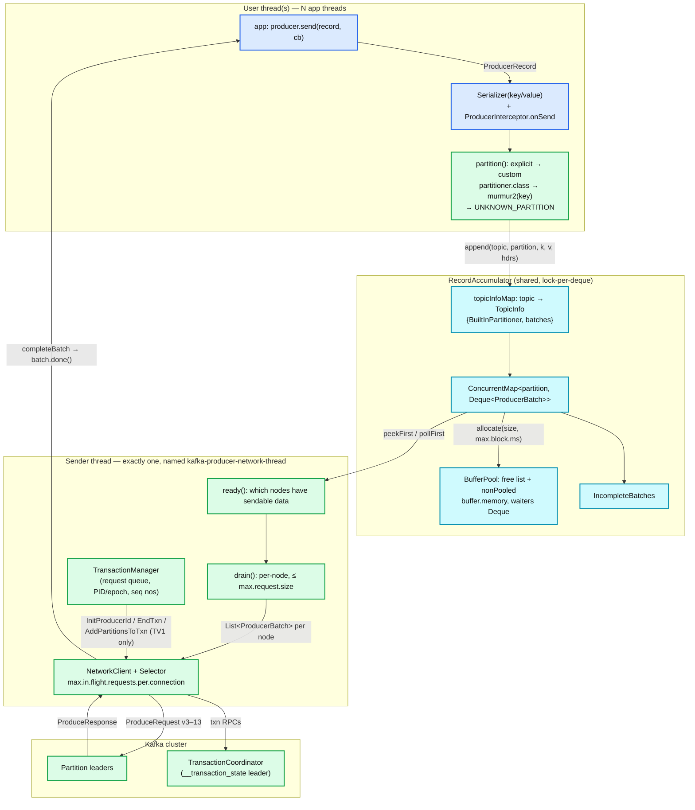

**What to notice**
- Only two thread kinds touch state: any number of user threads (append side) and exactly **one** `Sender` thread (drain side). Contention is a `synchronized(deque)` per partition, deliberately kept tiny (`RecordAccumulator.partitionReady` has an explicit comment about KAFKA-16226 lock-contention).
- The partitioner is *not* fully in the user thread: with the built-in partitioner and no key, `partition()` returns `RecordMetadata.UNKNOWN_PARTITION` and the real choice happens **inside `RecordAccumulator.append`**, under the deque lock, so it can see queue depth.
- `TransactionManager` lives on the `Sender` thread's side but is `synchronized` and is poked by the user thread (`maybeAddPartition`, `beginTransaction`, …).
- The user thread never opens a socket. It can still *block*: on metadata (`waitOnMetadata`) and on buffer allocation — both bounded by the same `max.block.ms` budget.
- `ProduceRequest` is `validVersions 3-13` in 4.3.1 **[verified-4.3.1]** (`clients/src/main/resources/common/message/ProduceRequest.json`); v13 carries topic IDs instead of topic names.

---

## 3. Data flow

### 3.1 Send path (user thread)

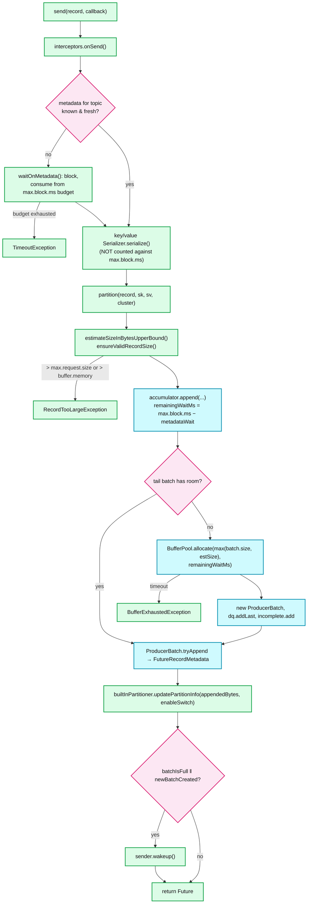

**What to notice**
- Serialization happens **after** the metadata wait and is explicitly *not* charged to `max.block.ms` (`MAX_BLOCK_MS_DOC`: "blocking in the user-supplied serializers or partitioner is not counted"). A slow serializer is unbounded latency.
- `ensureValidRecordSize` fires **before** any buffer is taken, comparing the *estimated upper bound of the serialized size* against `max.request.size` (1 MB) and `buffer.memory`. So `RecordTooLargeException` from the client is a purely local, pre-flight check. `MESSAGE_TOO_LARGE` from the broker (`message.max.bytes`, default `1024*1024 + 12 = 1048588` **[verified-4.3.1]**, `ServerLogConfigs.MAX_MESSAGE_BYTES_DEFAULT`) is a different, post-flight failure that triggers batch splitting.
- The `max.block.ms` budget is **shared**: `remainingWaitMs = max(0, maxBlockTimeMs − waitedOnMetadataMs)`. A metadata stall eats the allocation budget.
- Allocation size is `max(batch.size, estimatedSizeUpperBound(record))` — a single record larger than `batch.size` gets its own non-poolable buffer.
- `sender.wakeup()` is only called when the batch became full or a new batch was created. Otherwise the `Sender` finds the data on its next `linger.ms`-driven poll.

### 3.2 Back-pressure: the BufferPool (the producer's only real one)

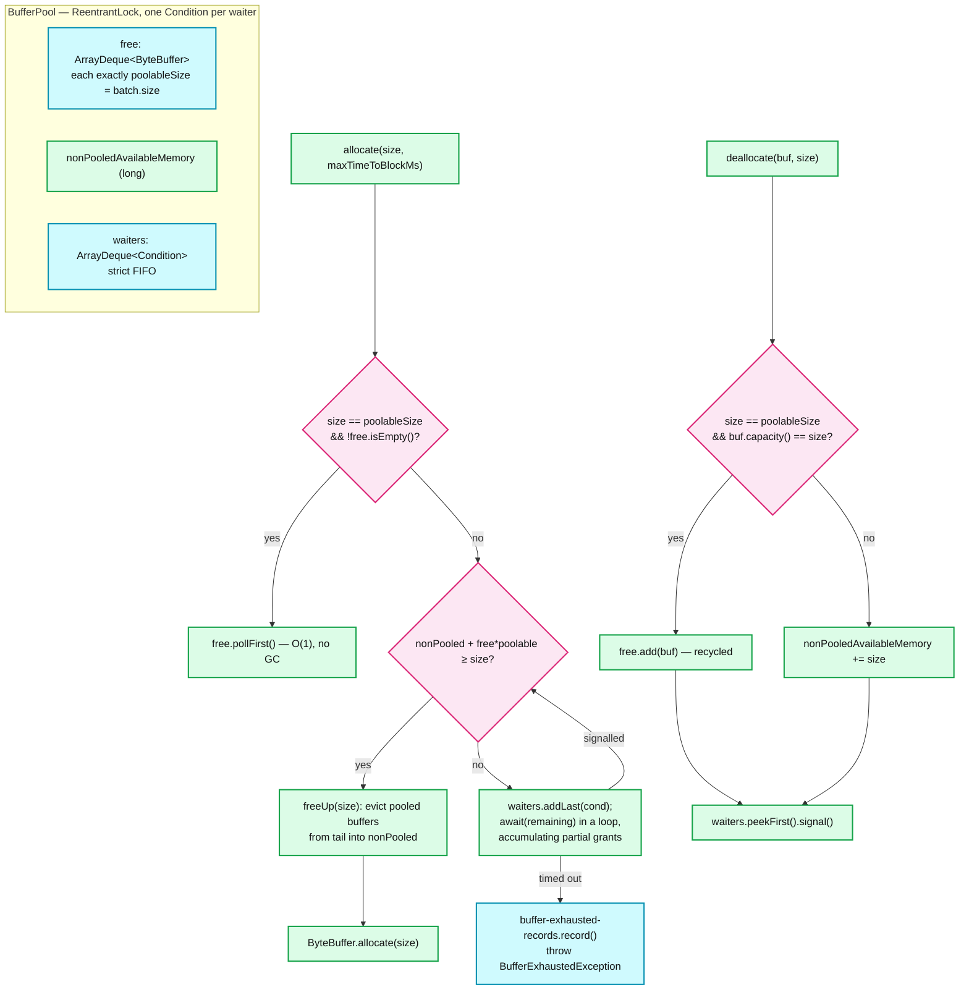

**What to notice**
- Two pools in one: an exact-size **free list** of `batch.size` buffers (recycled, zero GC churn) and a `nonPooledAvailableMemory` counter for everything else. Oversized records allocate from the counter and are never recycled.
- Waiting is **FIFO and fair** — `waiters` is a deque of per-thread `Condition`s and only the head is signalled. This prevents a large allocation from starving behind a stream of small ones.
- A waiter accumulates memory **incrementally** (`accumulated += got` per wake-up). It holds reservation while waiting; if it throws, the `finally` returns `accumulated` to the pool. **[documented]** `BufferPool.allocate`, lines ~137–189.
- `RecordAccumulator.partitionReady` sets `exhausted = this.free.queued() > 0`, and `batchReady` treats an exhausted pool as "everything is ready to send now" — i.e. **buffer pressure short-circuits `linger.ms`**. That is the feedback loop that drains the pool.
- Diagnostics: `buffer-available-bytes`, `buffer-total-bytes`, `waiting-threads`, `bufferpool-wait-ratio`, `bufferpool-wait-time-ns-total`, `buffer-exhausted-rate` **[verified-4.3.1]**.

### 3.3 Drain path (Sender thread)

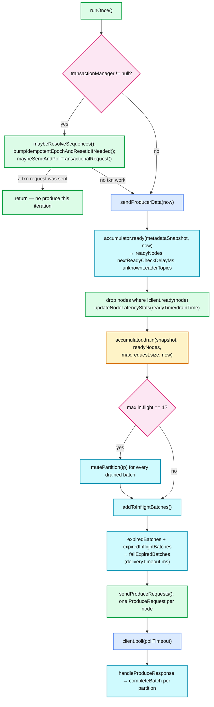

**What to notice**
- **Transactional work pre-empts produce work.** If any txn request is in flight or queued, `runOnce` returns early — data batches wait. This is why a slow/unreachable coordinator stalls the whole producer.
- `drain` is **per node**, and `maxSize` is `max.request.size`. The loop breaks when `size + batch.estimatedSizeInBytes() > maxSize && !ready.isEmpty()`, so **a single batch bigger than `max.request.size` still goes out alone** (comment: "rare case … due to compression").
- Each node has its own `drainIndex` into its partition list, advanced round-robin, so no partition permanently starves.
- `guaranteeMessageOrder` is set from `maxInflightRequests == 1` **[verified-4.3.1]** (`KafkaProducer.newSender`), and only then are partitions muted. With idempotence and in-flight ≤ 5, ordering comes from sequence numbers, not from muting.
- Delivery-timeout expiry is checked on **both** queues: undrained accumulator batches and already-in-flight batches. In-flight expiry does *not* deallocate the buffer (KAFKA-19012 — the `NetworkClient` may still be reading it).

---

## 4. Sequences of operations

### 4.1 Produce with idempotence (the default path)

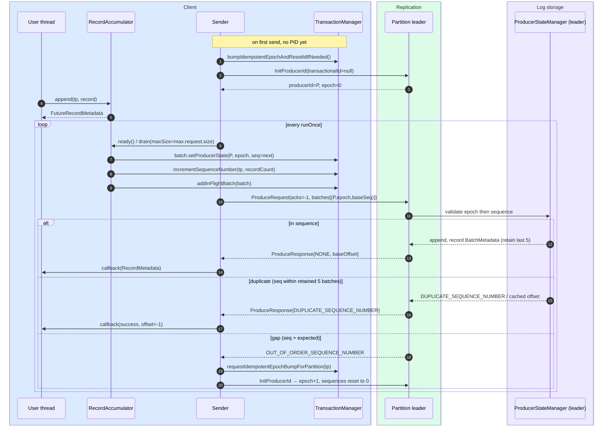

**What to notice**
- The `(PID, epoch, baseSequence)` triple is stamped **at drain time, under the deque lock**, not at `send()` time. A batch that is re-enqueued for retry keeps its sequence (`if (producerIdAndEpoch != null && !batch.hasSequence())`) — reassigning it would create a duplicate.
- `DUPLICATE_SEQUENCE_NUMBER` is reported to the application as **success with an invalid offset** (`Sender.completeBatch` explicitly: "The only thing we can do is to return success to the user and not return a valid offset and timestamp"). Callers that persist the returned offset must handle `-1`.
- On `OUT_OF_ORDER_SEQUENCE_NUMBER` with a real gap, the *idempotent* (non-transactional) producer self-heals by bumping its own epoch and restarting sequences at 0; the *transactional* producer instead transitions to an abortable error.
- `shouldStopDrainBatchesForPartition` collapses the effective in-flight count to **1 for a partition that is retrying** — so the "5 in flight" only applies on the happy path.

### 4.2 Transaction — full two-phase commit (protocol V2 / TV2, the 4.3 default)

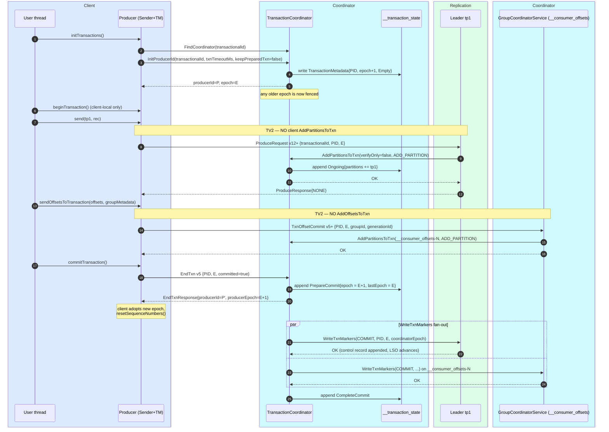

**What to notice**
- The **commit point is `PrepareCommit` durably written to `__transaction_state`** (with `acks=all` and `transaction.state.log.min.isr=2`). Everything after that is forward recovery: a coordinator failover replays the log, sees `PrepareCommit`, and re-drives `WriteTxnMarkers`. `CompleteCommit` is only a garbage-collection marker.
- `EndTxn` returns to the client **before** the markers are all written. `commitTransaction()` therefore returns while `read_committed` consumers may still not see the data. **[inferred]** — "committed" means "will be committed", not "is visible".
- In TV2, `EndTxn` v5's response carries the **new** `producerId`/`producerEpoch` (`EndTxnHandler`: `if (endTxnResponse.data().producerId() != -1) { setProducerIdAndEpoch(...); resetSequenceNumbers(); }`). Epoch bump happens **per transaction**, not per producer session.
- Epoch overflow: at `Short.MAX_VALUE` the coordinator allocates `nextProducerId` and returns `(P', epoch=0)` (`TransactionMetadata.prepareAbortOrCommit` + `prepareComplete`) **[verified-4.3.1]**.
- The partition is registered with the coordinator by the **partition leader**, not by the client — this is the structural change that KIP-890 made (see §7).

### 4.3 Transaction — protocol V1 (TV0/TV1, pre-KIP-890 shape)

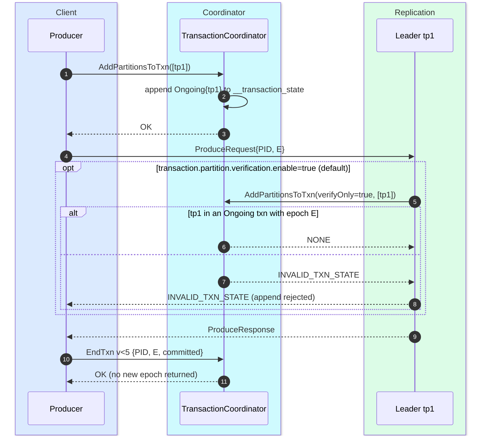

**What to notice**
- One extra client→coordinator round trip **per new partition per transaction**, plus (with verification on) one broker→coordinator round trip per partition per transaction.
- The epoch is unchanged across transactions in TV1 — the source of the zombie problems in §7.
- `AddPartitionsToTxnManager.produceRequestVersionToTransactionSupportedOperation`: `version > 11 → ADD_PARTITION` (TV2), `> 10 → GENERIC_ERROR_SUPPORTED`, else `DEFAULT_ERROR` **[verified-4.3.1]**. `verifyOnly` is set to `!supportsEpochBump`, so verification only exists on the non-TV2 path.

---

## 5. State machines

### 5.1 ProducerBatch

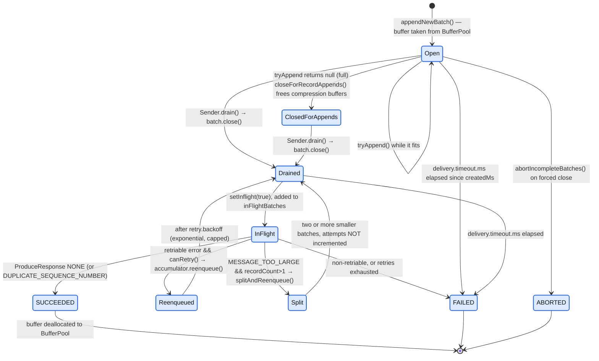

**What to notice**
- `FinalState` is literally `{ABORTED, FAILED, SUCCEEDED}` **[verified-4.3.1]** (`ProducerBatch.java:64`). Transitions `FAILED→SUCCEEDED` and `ABORTED→SUCCEEDED` are *allowed and logged* — the broker may have accepted a batch the client already gave up on. That is precisely the duplicate window that idempotence closes.
- `delivery.timeout.ms` is measured from **`batch.createdMs`** — the moment the batch was created, not the moment the record was appended to it and not the moment it was sent. A record appended late into a long-lingering batch has less than the full budget. **[inferred]**
- Batch splitting on `MESSAGE_TOO_LARGE` does **not** consume a retry attempt.
- `closeForRecordAppends()` (frees the compression stream buffers) is separate from `close()` (writes the `RecordBatch` header). Closing happens **outside** the deque lock in `drainBatchesForOneNode` because "close() is particularly expensive".

### 5.2 Client-side `TransactionManager.State`

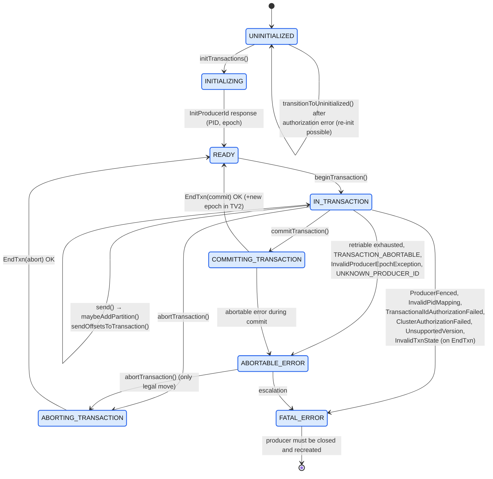

**What to notice**
- Only two recovery shapes exist: **abortable** (call `abortTransaction()`, keep the producer) and **fatal** (close the producer; a `transactional.id` restart re-fences via `InitProducerId`).
- `maybeTransitionToErrorState` converts **any** `RetriableException` that survived retries, and `InvalidTxnStateException`, into `TransactionAbortableException` for transactional producers **[verified-4.3.1]** — a deliberate choice to prevent silent duplicate delivery.
- Authorization failures are special-cased back to `UNINITIALIZED` so the user does not have to reconstruct the producer (`Sender.shouldHandleAuthorizationError`).

### 5.3 Coordinator-side `TransactionState` (durable, in `__transaction_state`)

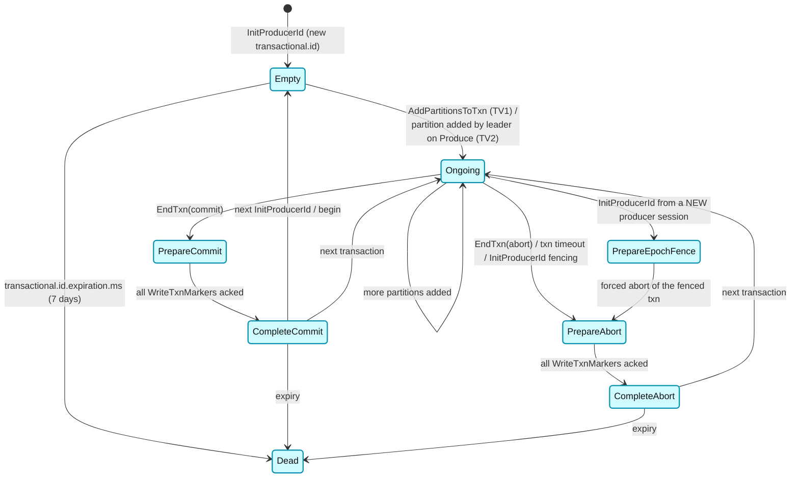

**What to notice**
- Legal predecessors are encoded as a map in `TransactionState.java` **[verified-4.3.1]**: e.g. `PREPARE_COMMIT` may only be entered from `ONGOING`; `PREPARE_ABORT` from `{ONGOING, PREPARE_EPOCH_FENCE, EMPTY, COMPLETE_COMMIT, COMPLETE_ABORT}` (the last three exist so TV2 can abort a transaction with no partitions added).
- `expirationAllowed` is `true` only for `EMPTY`, `COMPLETE_COMMIT`, `COMPLETE_ABORT` **[verified-4.3.1]** — an `Ongoing` transaction is never expired away by `transactional.id.expiration.ms`, only by `transaction.timeout.ms`.
- `PrepareEpochFence` is how a restarting producer with the same `transactional.id` kills the previous incarnation's in-flight transaction.

---

## 6. Component deep dives

### 6.1 `KafkaProducer` — the façade

**Responsibility.** Config validation, serializer/interceptor/partitioner plumbing, metadata waiting, record-size validation, and lifecycle (`close`, `flush`, transactional API).

**Threading.** Thread-safe and *intended* to be shared. `send()` may be called from any number of threads; the only shared mutable structures are `RecordAccumulator` (fine-grained locks) and `ProducerMetadata` (synchronized).

**Config coupling done at construction** (`ProducerConfig.postProcessAndValidateIdempotenceConfigs`) **[verified-4.3.1]**:
- `acks` is normalised: `"all"` → `"-1"`.
- If `enable.idempotence` was left at its `true` default and `retries==0` or `acks!=-1`, **idempotence is silently disabled** and only an INFO line is logged.
- If `enable.idempotence=true` was set *explicitly* and those conflict, a `ConfigException` is thrown.
- `max.in.flight.requests.per.connection > 5` with idempotence **always** throws, explicit or not.
- `transactional.id` without idempotence → `ConfigException`.
- `transaction.two.phase.commit.enable=true` together with an explicit `transaction.timeout.ms` → `ConfigException` (2PC transactions never expire).
- `client.id`, if unset, becomes `producer-<transactional.id>` or `producer-<seq>`.

**`configureDeliveryTimeout`** — if `delivery.timeout.ms < linger.ms + request.timeout.ms`: throw if the user set it explicitly, otherwise silently raise it to `linger.ms + request.timeout.ms` with a WARN **[verified-4.3.1]**.

**`flush()`** marks all incomplete batches ready (ignoring `linger.ms`) and blocks until every one reaches a final state. It does *not* fail on error — errors surface through the individual futures/callbacks.

**`close(Duration)`** — a zero timeout means force-close: in-flight transactional requests are failed and `abortIncompleteBatches()` runs. A non-zero timeout drains: the `Sender` keeps running `runOnce` while `hasUndrained() || inFlightRequestCount() > 0 || hasPendingTransactionalRequests()`, then aborts any still-open transaction.

### 6.2 `RecordAccumulator`

**Data structures** (`clients/.../internals/RecordAccumulator.java`):
```
topicInfoMap : CopyOnWriteMap<String topic, TopicInfo>
TopicInfo    : { ConcurrentMap<Integer partition, Deque<ProducerBatch>> batches,
                 BuiltInPartitioner builtInPartitioner }
free         : BufferPool
incomplete   : IncompleteBatches (a synchronized HashSet, for flush()/abort())
muted        : Set<TopicPartition>   // only used when max.in.flight == 1
nodesDrainIndex : Map<String nodeId, Integer>
nodeStats    : CopyOnWriteMap<Integer nodeId, NodeLatencyStats{readyTimeMs, drainTimeMs}>
```

**Concurrency model.** `ArrayDeque` per partition, guarded by `synchronized(dq)`. Appenders take the tail, the `Sender` takes the head. `appendsInProgress` (an `AtomicInteger`) exists solely so `abortIncompleteBatches` can wait out racing appends. `partitionReady` does the absolute minimum inside the lock (peek head, read size, compute backoff) precisely because it is the hot path at high partition counts.

**`ready()` — when is a node sendable?** A partition contributes its leader to `readyNodes` when it is not muted, not backing off, and *any* of: the record set is full (`deque.size() > 1 || head.isFull()`), it has lingered `linger.ms`, the `BufferPool` is exhausted, the accumulator is closing, or a transaction is completing. `nextReadyCheckDelayMs` is folded into the `client.poll` timeout so the `Sender` sleeps exactly until the next linger deadline.

**Retry back-off.** `shouldBackoff` uses an **exponential** back-off keyed on `batch.attempts()` — `retry.backoff.ms` (100 ms) growing to `retry.backoff.max.ms` (1000 ms) with `RETRY_BACKOFF_EXP_BASE = 2` and `RETRY_BACKOFF_JITTER = 0.2` **[verified-4.3.1]**. Crucially, back-off is **skipped entirely if the partition leader changed** (`hasLeaderChangedForTheOngoingRetry`) — retrying against a new leader immediately is the right move.

**Batch splitting.** `splitAndReenqueue(bigBatch)` re-encodes the batch into `targetSplitBatchSize = batch.size` chunks and pushes them onto the **front** of the deque, preserving order. Used only for `MESSAGE_TOO_LARGE`.

### 6.3 `BuiltInPartitioner` — KIP-794 sticky + adaptive

**Where it lives.** It is *not* a `Partitioner` implementation. It is a utility owned by `RecordAccumulator`, **one instance per topic**, invoked from inside `append()` under the deque lock. `partitioner.class` defaults to `null` **[verified-4.3.1]**; setting any partitioner disables all three `partitioner.*` knobs.

**Partition selection order** (`KafkaProducer.partition`):
1. `record.partition() != null` → use it.
2. `partitioner.class` set → delegate (negative result → `IllegalArgumentException`).
3. `serializedKey != null && !partitioner.ignore.keys` → `Utils.toPositive(Utils.murmur2(key)) % numPartitions` **[verified-4.3.1]**. Note: **all** partitions, not just available ones — this is what makes keyed partitioning stable across topic-level outages.
4. Otherwise → `UNKNOWN_PARTITION`, deferred to `BuiltInPartitioner`.

**`murmur2`** is Kafka's own 32-bit MurmurHash2 with seed `0x9747b28c` (`org.apache.kafka.common.utils.Utils.murmur2`). It is a **public compatibility contract** — librdkafka, Sarama and kafka-python reimplement it so keyed records from any client land on the same partition.

**Sticky behaviour, precisely.** `StickyPartitionInfo { int index; AtomicInteger producedBytes; }` is held in an `AtomicReference`. On each successful append:

```
producedBytes += appendedBytes           // estimated size delta of this record
enableSwitch  = allBatchesFull(deque)    // i.e. deque.peekLast() == null || last.isFull()
if (producedBytes >= stickyBatchSize && enableSwitch) || (producedBytes >= 2*stickyBatchSize):
        stickyPartitionInfo.set(new StickyPartitionInfo(nextPartition(cluster)))
```
where `stickyBatchSize == batch.size` **[verified-4.3.1]** (`createBuiltInPartitioner(logContext, topic, batchSize)`).

So the rule is: **switch after producing ≥ `batch.size` bytes to the current partition, but only at a batch boundary; force the switch unconditionally at 2 × `batch.size`.** The `enableSwitch` guard exists to avoid fractional batches under high `linger.ms` — the source comment works the example: `linger.ms=500, batch.size=16KB, 12KB/500ms` would otherwise alternate 12 KB and 4 KB batches; with the guard you get a steady stream of 12 KB batches.

**Race handling.** The partition is peeked *before* the deque lock is taken (you must know which deque to lock). After locking, `partitionChanged()` re-checks `stickyPartitionInfo.get() != partitionInfo`; if another thread switched, `append` `continue`s the outer loop and starts over. There is also a "switch was disabled but now all batches are full" re-check.

**Adaptive selection (`partitioner.adaptive.partitioning.enable=true` by default).** On every `ready()` pass, `partitionReady` collects the per-partition `deque.size()` into `queueSizes[]` and hands them to `updatePartitionLoadStats`, which builds a **cumulative frequency table** by inverting queue depth:
```
queue sizes  0 3 1   →  invert with (max+1)=4:  4 1 3   →  running sum: 4 5 8
random ∈ [0,8):  0-3 → p0,  4 → p1,  5-7 → p2
```
`nextPartition` then does a binary search on that table. Shallow queue ⇒ higher weight ⇒ a faster broker gets proportionally more traffic. Adaptive is **skipped** (falls back to uniform-random over *available* partitions) when: stats are null, fewer than 2 partitions exist, all queue sizes are equal, or the producer has not yet created a deque for every partition of the topic.

**`partitioner.availability.timeout.ms` (default `0` = disabled)** **[verified-4.3.1]**. When > 0, `NodeLatencyStats` per node track `readyTimeMs` (last time the node had sendable data) and `drainTimeMs` (last time we actually drained to it). If `readyTimeMs − drainTimeMs > partitioner.availability.timeout.ms`, that node's partitions are **dropped from the CFT** (`--queueSizesIndex`) and receive no new unkeyed traffic. It requires adaptive partitioning to be on.

**What KIP-794 removed.** The KIP-480 sticky partitioner switched partitions on **new batch creation** (`Partitioner.onNewBatch`). Two defects: (a) a slow broker got the *same number of batches* as a fast one, so its queue grew without bound and its records' latency blew up; (b) with `linger.ms=0` and many partitions, batches were created constantly, so "sticky" degenerated toward round-robin. `DefaultPartitioner` and `UniformStickyPartitioner` were deprecated in 3.3 and **removed in 4.0**; in 4.3.1 the only shipped `Partitioner` implementation is `RoundRobinPartitioner` **[verified-4.3.1]** (`ls clients/.../producer/` → `Partitioner.java`, `RoundRobinPartitioner.java`), and its javadoc still warns about the KAFKA-9965 uneven-distribution bug.

### 6.4 `Sender` — the single I/O thread

**Loop.** `run()` → `runOnce()` → (txn work | `sendProducerData` + `client.poll`). One `Sender` per `KafkaProducer`, named `kafka-producer-network-thread | <client.id>`.

**Poll timeout selection** (`sendProducerData` tail): `min(nextReadyCheckDelayMs, notReadyTimeout, nextBatchExpiryTimeMs − now)`, forced to `0` if any node has data ready. This is what makes `linger.ms` cheap — the thread sleeps in `epoll` exactly until the next deadline rather than spinning.

**In-flight tracking** is two-layered:
1. `NetworkClient.InFlightRequests` — per-connection, bounded by `max.in.flight.requests.per.connection`, gates `client.ready(node)`.
2. `Sender.inFlightBatches : Map<TopicPartition, List<ProducerBatch>>` — used only for delivery-timeout expiry of already-sent batches.
3. `TransactionManager.txnPartitionMap` — per-partition `inflightBatchesBySequence`, a priority queue ordered by base sequence, used for sequence bookkeeping on failure.

**Response handling.** `handleProduceResponse` resolves each partition response back to its `ProducerBatch` (by topic ID for v13, by name below), then `completeBatch`. `NOT_LEADER_OR_FOLLOWER` / `FENCED_LEADER_EPOCH` responses carry `currentLeader` + `nodeEndpoints`, which the producer folds straight into its metadata (`metadata.updatePartitionLeadership`) instead of waiting for a metadata refresh — a meaningful latency win during leader elections.

**`acks=0`.** `client.newClientRequest(..., expectResponse = acks != 0, ...)`. No response is expected; every batch is completed with `Errors.NONE` and `baseOffset = -1` the moment the bytes hit the socket buffer.

### 6.5 `TransactionManager` (client side)

**Responsibilities.** PID/epoch ownership, per-partition sequence numbers, the transactional request queue (a `PriorityQueue<TxnRequestHandler>`; `EndTxn` has its own priority), coordinator lookup, and error classification.

**Sequence state per partition** lives in `TxnPartitionMap` → `TxnPartitionEntry`:
```
nextSequence            : int   // next base sequence to assign
lastAckedSequence       : int
lastAckedOffset         : long
inflightBatchesBySequence : PriorityQueue<ProducerBatch> ordered by baseSequence
producerIdAndEpoch      : the (PID, epoch) this partition's sequences belong to
```
Sequence numbers are `int`, monotonically increasing, and **reset to 0 whenever the epoch changes**.

**Why `max.in.flight.requests.per.connection <= 5`.** The constant is spelled out in `ProducerConfig`:
```java
// max.in.flight ... The value 5 is aligned with ProducerStateEntry#NUM_BATCHES_TO_RETAIN.
private static final int MAX_IN_FLIGHT_REQUESTS_PER_CONNECTION_FOR_IDEMPOTENCE = 5;
```
and `ProducerStateEntry.NUM_BATCHES_TO_RETAIN = 5` **[verified-4.3.1]**. The broker keeps a **5-entry `ArrayDeque<BatchMetadata>` per producer per partition**. Duplicate detection works by scanning that deque for a matching `(firstSeq, lastSeq)` and replaying the cached `(offset, timestamp)`. With more than 5 requests in flight, a retry of the oldest could arrive after its metadata has been evicted — the broker would then see a sequence *below* the expected next one with no cached entry and could neither dedupe it nor return the original offset. Five is therefore a **memory/throughput compromise on the broker**, exported as a client constraint. **[documented + inferred]**

Ordering with 5 in flight is preserved by the broker, not the client: any batch whose `baseSequence != expectedNextSequence` is rejected with `OUT_OF_ORDER_SEQUENCE_NUMBER`, so a request that overtakes its predecessor cannot be appended. The client then re-drains in order, and `shouldStopDrainBatchesForPartition` throttles the retrying partition to one in-flight batch until the sequence resolves.

### 6.6 Broker-side `ProducerStateManager`

`storage/src/main/java/org/apache/kafka/storage/internals/log/ProducerStateManager.java` (+ `ProducerStateEntry`, `ProducerAppendInfo`).

- **Per log (partition), a map `producerId → ProducerStateEntry`.** Each entry: `producerEpoch`, `coordinatorEpoch`, `lastTimestamp`, `currentTxnFirstOffset`, and the 5-deep `batchMetadata` deque of `BatchMetadata{lastSeq, lastOffset, offsetDelta, timestamp}`.
- **Snapshot format on disk:** `<offset>.snapshot` files alongside the log segments, so recovery does not have to re-scan the whole log. `.txnindex` per segment holds aborted-transaction entries.
- **Validation order** (`ProducerAppendInfo.append`): `checkProducerEpoch` then `checkSequence`.
  - `checkProducerEpoch`: `invalidEpoch = (TV >= 2) ? epoch <= current : epoch < current` **[verified-4.3.1]**. TV2's `<=` is the zombie fence. Violation → `InvalidProducerEpochException` (client-visible `INVALID_PRODUCER_EPOCH`, abortable — it replaced the old fatal `PRODUCER_FENCED` on the produce path back in 2.7).
  - `checkSequence`: gaps → `OutOfOrderSequenceException`; exact replay found in the 5-entry deque → `DuplicateSequenceException` (`DUPLICATE_SEQUENCE_NUMBER`); if `currentEntry.producerEpoch() == NO_PRODUCER_EPOCH` (all state gone), **any** sequence is accepted.
  - TV2-specific rule: a verification entry that `supportsEpochBump()` rejects `appendFirstSeq != 0` when there is no existing producer state.
- **`UnknownProducerIdException`** is raised when the broker has no entry for the PID — because retention/`DeleteRecords` removed the segments that carried it, or the partition moved. The client's `TransactionManager.canRetry` handles three sub-cases: `logStartOffset == -1` → just retry; `lastAckedOffset < logStartOffset` → the head was truncated, restart sequences from 0 (transactional) or bump the epoch (idempotent); otherwise, idempotent producers bump and retry.
- **Expiry:** `producer.id.expiration.ms` = **86400000 (24 h)** **[verified-4.3.1]**, swept every `producer.id.expiration.check.interval.ms` = **600000 (10 min)**. A PID with an ongoing transaction is never expired. Losing PID state after 24 h idle is exactly what produces `UNKNOWN_PRODUCER_ID` on a sporadic producer.
- Do not confuse it with `transactional.id.expiration.ms` = **604800000 (7 days)** **[verified-4.3.1]**, which is the *coordinator's* retention of `TransactionMetadata` for an idle `transactional.id`.

### 6.7 `TransactionCoordinator` and `__transaction_state`

- One coordinator per `transactional.id`, located by `FindCoordinator(type=TRANSACTION)`; the owning partition is `abs(hash(transactionalId)) % transaction.state.log.num.partitions`. **[documented]**
- `__transaction_state` is a **compacted** internal topic. Key = `transactional.id`; value = `TransactionMetadata{producerId, prevProducerId, nextProducerId, producerEpoch, lastProducerEpoch, txnTimeoutMs, state, topicPartitions, txnStartTimestamp, txnLastUpdateTimestamp, clientTransactionVersion}` **[verified-4.3.1]** (`TransactionMetadata.java`, `TransactionLog.java`).
- Defaults **[verified-4.3.1]** (`TransactionLogConfig`, `TransactionStateManagerConfig`): `num.partitions=50`, `replication.factor=3`, `min.isr=2`, `segment.bytes=104857600`, `load.buffer.size=5242880`, `transaction.max.timeout.ms=900000 (15 min)`, `transaction.abort.timed.out.transaction.cleanup.interval.ms=10000`, `transaction.remove.expired.transaction.cleanup.interval.ms=3600000`.
- **`transaction.timeout.ms` (client, default 60000) vs `transaction.max.timeout.ms` (broker, default 900000).** The client proposes its timeout in `InitProducerId`; if it exceeds the broker cap the request fails with `InvalidTxnTimeoutException`. The clock **starts when the first partition is added**, not at `beginTransaction()` **[verified-4.3.1]** (`TRANSACTION_TIMEOUT_DOC`). On expiry the coordinator drives `PrepareAbort` → `WriteTxnMarkers(ABORT)`; the producer discovers this as `InvalidProducerEpochException`/`PRODUCER_FENCED`.
- `TransactionMarkerChannelManager` is a broker-internal send thread that fans `WriteTxnMarkers` (v1–2) out to every partition leader in `topicPartitions`, retrying on `NOT_LEADER_OR_FOLLOWER` until each returns success, then appends `CompleteCommit`/`CompleteAbort`. `coordinatorEpoch` in the marker fences a stale coordinator that lost the `__transaction_state` partition.
- **2PC / KIP-939** is present in 4.3.1: `transaction.two.phase.commit.enable` on both broker and client (default `false` **[verified-4.3.1]**), `InitProducerId` v6 carries `enable2Pc`/`keepPreparedTxn`, and `PreparedTxnState` exists client-side. A 2PC transaction never expires, which is why an explicit `transaction.timeout.ms` alongside it is a `ConfigException`.

### 6.8 Control records, LSO and `read_committed`

- A commit/abort marker is a **control record**: a `RecordBatch` with the control bit set, containing one record whose key is `ControlRecordType` (`ABORT=0`, `COMMIT=1`). It **occupies an offset** — this is why offsets in a transactional topic have gaps that consumers must not interpret as data loss.
- **LSO (last stable offset)** = `min(highWatermark, firstUnstableOffset)`, where `firstUnstableOffset` is the first offset of the earliest still-open transaction on that partition (tracked in `ProducerStateManager` via `currentTxnFirstOffset`). `read_committed` fetches are truncated at the LSO. A single hung transaction pins the LSO and blocks *all* `read_committed` consumers of that partition, however much committed data sits behind it — the classic "hanging transaction" outage.
- The `.txnindex` per segment stores `AbortedTxn{producerId, firstOffset, lastOffset, lastStableOffset}`. A `read_committed` `FetchResponse` carries the list of aborted transactions overlapping the returned range; the **consumer** filters those records out client-side. The broker does not strip them.

---

## 7. KIP-890 — transaction protocol V2

### 7.1 What was actually broken

Two distinct defects, both rooted in the fact that the producer epoch was bumped **only on `InitProducerId`**, i.e. once per producer *session*, not once per *transaction*.

**(a) Hanging transactions.** Adding a partition to a transaction (client → coordinator) and writing data to that partition (client → partition leader) are separate, unordered paths. A delayed/retried `ProduceRequest` from a zombie could reach the partition leader **after** the coordinator had already written `PrepareCommit` and the leader had already appended the marker. The leader had no way to reject it: the batch's epoch equalled the last epoch it had seen in its own log, and `checkProducerEpoch` used `<`. The result was transactional data appended **after** its own commit marker, with no marker to follow it. `firstUnstableOffset` pinned there permanently → LSO frozen → every `read_committed` consumer on that partition stalls until an operator manually writes a marker (`kafka-transactions.sh abort`).

**(b) A zombie adding a partition to a transaction it does not own.** `AddPartitionsToTxn` was fenced only by `(PID, epoch)`. Within one producer session the epoch is constant, so a *delayed* `AddPartitionsToTxn` belonging to transaction *N* could be processed by the coordinator after transaction *N* had ended and transaction *N+1* had begun. The partition (and any data written to it under the old, still-valid epoch) would then be committed as part of *N+1* — an atomicity violation, not just a liveness one.

### 7.2 The fixes

**Part 1 (shipped 3.6, still on the TV0/TV1 path in 4.3.1) — server-side verification.** Before appending a transactional batch, the partition leader asks the coordinator `AddPartitionsToTxn(verifyOnly=true)`; if that partition is not in an `Ongoing` transaction at that epoch, the append is rejected with `INVALID_TXN_STATE`. Controlled by `transaction.partition.verification.enable` (default `true` **[verified-4.3.1]**), with `add.partitions.to.txn.retry.backoff.ms=20` / `.max.ms=100`. This closes (a) at the cost of one extra broker→coordinator RPC per (producer, partition, transaction). It does **not** fix (b).

**Part 2 (TV2) — epoch bump per transaction.** `TransactionMetadata.prepareAbortOrCommit` sets `producerEpoch = producerEpoch + 1` on **every** commit and abort when `clientTransactionVersion.supportsEpochBump()`; `EndTxn` v5 returns the new `(producerId, producerEpoch)` to the client, which adopts it and calls `resetSequenceNumbers()`. On overflow at `Short.MAX_VALUE`, `nextProducerId` is allocated and the client gets `(P', 0)`.

Consequences:
- Every transaction has a **unique** epoch. A zombie from transaction *N* is now fenced by ordinary epoch comparison, both at the coordinator and at the partition leader. Defect (b) disappears structurally.
- `checkProducerEpoch` tightens to `epoch <= current` for TV≥2 **[verified-4.3.1]**, so even a same-epoch straggler is rejected. Defect (a) disappears without the extra verification RPC — hence `verifyOnly = !supportsEpochBump`.
- The client's `AddPartitionsToTxn` and `AddOffsetsToTxn` RPCs are **gone**. Partitions are registered by the *partition leader* on the first `ProduceRequest` (v12+, `TransactionSupportedOperation.ADD_PARTITION`) and by the *group coordinator* on `TxnOffsetCommit` (v5+) **[verified-4.3.1]**. That removes one client round trip per new partition per transaction, which is the dominant per-transaction cost in a Kafka Streams EOS topology with many output partitions.
- A new error class `TRANSACTION_ABORTABLE` / `TransactionAbortableException` lets brokers say "abort this transaction" instead of forcing the client into a fatal state.

**Client-side edge case handled:** a cluster upgraded to TV2 mid-life. `maybeUpdateTransactionV2Enabled` reads the finalized `transaction.version` from `ApiVersions`; a `false → true` transition sets `clientSideEpochBumpRequired`, so `beginCompletingTransaction` enqueues an `InitProducerId` after the `EndTxn` and the *next* transaction starts on a fresh epoch **[verified-4.3.1]**.

### 7.3 Maturity in 4.3.1

- `TransactionVersion.LATEST_PRODUCTION = TV_2` **[verified-4.3.1]**. `TV_1` and `TV_2` both bootstrap at `IBP_4_0_IV2`; `MetadataVersion.LATEST_PRODUCTION = IBP_4_3_IV0`. `Feature.defaultVersion(mv)` returns the highest version whose `bootstrapMetadataVersion <= mv`, so a **freshly formatted 4.3 cluster runs `transaction.version=2` by default**.
- A cluster **upgraded** from 3.x keeps its finalized feature level (typically `0`) and stays on the TV1 protocol until an operator runs `kafka-features upgrade --feature transaction.version=2`. This is the single most common reason a 4.x cluster is still paying for `AddPartitionsToTxn` and verification. **[inferred]**
- TV2 is still receiving correctness fixes: 4.3.1 carries **KAFKA-19999** — "TV2 idempotent marker retry detection" in `checkProducerEpoch`, which suppresses `InvalidProducerEpochException` when a duplicate `WriteTxnMarkers` arrives at the *same* epoch with no ongoing transaction (coordinator reload of `PREPARE_*`, or a lost marker response). The code even carries an explicit escape hatch for producers that "start transaction with MAX_VALUE" "in some buggy scenarios" **[verified-4.3.1]**. Treat TV2 as production-default but not yet folklore-free: the epoch-per-transaction change touched marker idempotency in ways that took several releases to shake out.
- `transaction.version` is a **KRaft feature flag**, downgradable only if no metadata records depend on the higher level. Verify with `kafka-features describe`.

---

## 8. Exactly-once semantics: what EOS does and does not give you

**What it guarantees.**
1. **Idempotent produce, per partition, per producer session-epoch.** Retries of the same `(PID, epoch, sequence)` are deduplicated by the broker, so a network-level retry does not duplicate the record in the log.
2. **Atomic multi-partition write.** All records written between `beginTransaction()` and `commitTransaction()` — across any number of topic-partitions — become visible to `read_committed` consumers together, or none do.
3. **Atomic offset commit.** `sendOffsetsToTransaction` writes the consumer's offsets into `__consumer_offsets` **inside the same transaction**, so "I consumed input offset X" and "I produced output Y" commit or abort as one unit. This is the whole of consume-transform-produce EOS.
4. **Zombie fencing.** A restarted instance with the same `transactional.id` bumps the epoch via `InitProducerId` and permanently fences the previous incarnation. Under TV2 this also happens per transaction.
5. **Ordering per partition** for a given producer, preserved across retries with up to 5 in-flight requests.

**What it does not guarantee.**
- **Not end-to-end dedup for external sinks.** Writing to a database, S3, or an HTTP endpoint from inside a transaction is outside the atom. The classic failure: commit the Kafka transaction, crash before the external write; or external write succeeds, Kafka transaction aborts. Sinks must be idempotent themselves (upsert on a key derived from the record) or implement their own 2PC. Kafka's transaction gives you nothing here.
- **Not deduplication of application-level resends.** `send()`ing the same logical event twice from application code produces two records with two different sequences. EOS deduplicates *transport* retries, not *business* retries.
- **Not cross-producer or cross-session semantics** beyond `transactional.id` fencing. Two producers with different `transactional.id`s writing "the same" event both succeed.
- **Not global ordering.** Ordering is per partition. A transaction spanning 10 partitions makes no claim about interleaving between them.
- **Not isolation for `read_uncommitted` consumers** (the default `isolation.level`). Uncommitted and later-aborted records are fully visible to them.
- **Not durability beyond `min.insync.replicas`.** `acks=all` means "all *in-sync* replicas", and the ISR can shrink to one. Without `min.insync.replicas >= 2` on the *data* topics, a committed transaction can still be lost with a single broker failure. This is a producer-side config that is not a producer config.
- **Not survival of PID state loss.** After `producer.id.expiration.ms` (24 h) or a log-head truncation, the broker forgets the PID; a subsequent duplicate is undetectable.
- **Not "no duplicates ever delivered".** A consumer that commits offsets outside the transaction, or a `read_committed` consumer that crashes after processing but before committing, still reprocesses. EOS moves the burden, it does not remove it.

---

## 9. Delivery, retries and ordering

### 9.1 The timeout budget

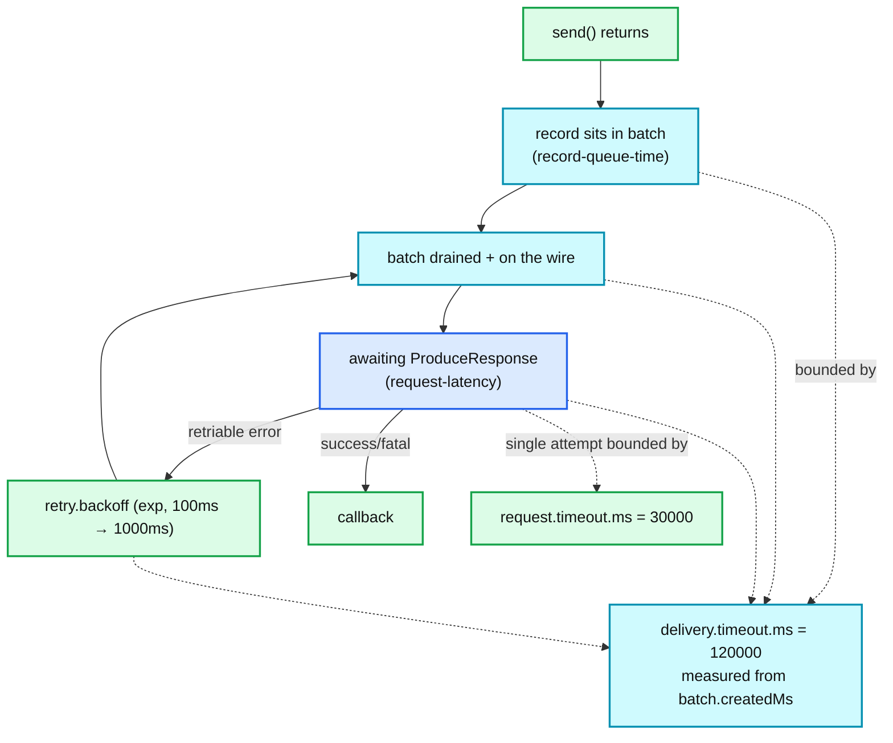

- **`delivery.timeout.ms` (120 s) is the only knob that matters** for "how long until I hear back". It subsumes lingering + all retries + all request timeouts. `retries` defaults to `Integer.MAX_VALUE` **[verified-4.3.1]** precisely so that the count is *not* the limiting factor — the docs say outright: "Users should generally prefer to leave this config unset and instead use `delivery.timeout.ms`".
- `request.timeout.ms` (30 s) bounds **one attempt**. The doc adds a subtle production note: it should exceed the broker's `replica.lag.time.max.ms` (default 30 s) "to reduce the possibility of message duplication due to unnecessary producer retries".
- `max.block.ms` (60 s) bounds only the **user thread** inside `send()`/`partitionsFor()`/txn methods. It is disjoint from `delivery.timeout.ms`.
- Constraint enforced at construction: `delivery.timeout.ms >= linger.ms + request.timeout.ms`.

### 9.2 Ordering

- **With `enable.idempotence=true`** (default): ordering is preserved for any `max.in.flight.requests.per.connection` in `[1,5]`. The broker rejects out-of-sequence batches, so a reordered retry cannot be appended; the client re-drains in order and throttles the affected partition to one in-flight batch until sequences resolve.
- **Without idempotence, `max.in.flight > 1`, `retries > 0`**: reordering is possible and is documented as such. Concretely: batches B1 and B2 are both in flight to the same partition; B1 fails with `NOT_LEADER_OR_FOLLOWER` and is re-enqueued, B2 succeeds and is appended. B1's retry lands **after** B2. The log order is B2, B1.
- **Without idempotence, `max.in.flight == 1`**: ordering holds via partition muting (`guaranteeMessageOrder`), at a large throughput cost.
- **Batch splitting preserves order** (split batches are pushed onto the deque head).
- **`acks=0` gives no ordering guarantee across a reconnect** — batches are completed at the socket, so a connection failure silently drops them. **[inferred]**

---

## 10. Error classification

| Exception | Class | Where raised | Producer behaviour |
|---|---|---|---|
| `TimeoutException` (metadata) | thrown from `send()` | `waitOnMetadata` exceeded `max.block.ms` | user thread throws synchronously |
| `TimeoutException` (delivery) | delivered to callback/future | `failExpiredBatches` after `delivery.timeout.ms` | batch → `FAILED`; if transactional and `inRetry()`, `markSequenceUnresolved` |
| `BufferExhaustedException` | thrown from `send()` | `BufferPool.allocate` timed out | subclass of `TimeoutException`; increments `buffer-exhausted-rate` |
| `RecordTooLargeException` | thrown from `send()` | client pre-flight vs `max.request.size` / `buffer.memory` | never sent; not retriable |
| `MESSAGE_TOO_LARGE` (broker) | — | broker `message.max.bytes` | if `recordCount > 1`: **split and retry** without consuming an attempt; else fail |
| `UnknownTopicOrPartitionException` | **retriable** (`InvalidMetadataException`) | broker | retry + force metadata update; WARN mentions missing topic *or* missing `Describe` ACL |
| `NotLeaderOrFollowerException`, `FencedLeaderEpochException` | **retriable** | broker | retry; leader taken from `currentLeader`/`nodeEndpoints` in the response, no metadata round trip |
| `NetworkException`, `RequestTimedOutException`, `NotEnoughReplicas*`, `CoordinatorNotAvailable`, `NotCoordinator` | **retriable** | — | retried until `delivery.timeout.ms` |
| `OutOfOrderSequenceException` | conditionally retriable | broker `checkSequence` | idempotent: bump own epoch, restart sequences at 0, retry. Transactional: → `ABORTABLE_ERROR` |
| `DuplicateSequenceException` / `DUPLICATE_SEQUENCE_NUMBER` | terminal-but-successful | broker, replay found in the 5-entry cache | reported as **success with `offset = -1`** |
| `UnknownProducerIdException` | conditionally retriable | broker has no PID state (expired / truncated / moved) | see `canRetry`: retry, or restart sequences, or bump epoch; transactional → abortable |
| `InvalidProducerEpochException` | **abortable** (transactional) | broker `checkProducerEpoch`, `epoch < current` (TV1) or `<= current` (TV2) | `abortTransaction()` then continue. Replaced fatal `PRODUCER_FENCED` on the produce path in 2.7 |
| `ProducerFencedException` | **fatal** | coordinator: another producer took this `transactional.id` | close the producer; a second instance owns the id |
| `TransactionAbortableException` / `TRANSACTION_ABORTABLE` | **abortable** | broker (KIP-890) | `abortTransaction()`. During an *abort* it is escalated to fatal to avoid an abort loop |
| `InvalidPidMappingException`, `InvalidTxnStateException` (on `EndTxn`), `TransactionalIdAuthorizationException`, `ClusterAuthorizationException`, `UnsupportedVersionException` | **fatal** | coordinator | producer unusable; auth errors alone reset to `UNINITIALIZED` so it can be re-initialised |
| `SerializationException` | thrown from `send()` | user serializer | not retriable, not counted against `max.block.ms` |
| `IllegalStateException` | thrown from `send()` | e.g. `maybeAddPartition` outside `IN_TRANSACTION` | API misuse |

**Rule of thumb.** In a transactional producer, treat exactly three outcomes: *retriable* (the client handles it), *abortable* (you call `abortTransaction()` and retry the unit of work), *fatal* (you close and recreate the producer). Everything in `Sender`/`TransactionManager` funnels into that trichotomy, and `maybeTransitionToErrorState` deliberately converts exhausted-retriable into abortable rather than letting it look like a plain send failure.

---

## 11. Metrics that matter

All under `kafka.producer:type=producer-metrics,client-id=*` unless noted; `record-*` also appear per-topic under `producer-topic-metrics`.

| Metric | Diagnoses | Read it as |
|---|---|---|
| `record-queue-time-avg` / `-max` | time from batch creation to drain | ≈ `linger.ms` on a healthy idle producer. Much higher ⇒ the `Sender` is behind: broker slow, `max.in.flight` saturated, or one thread cannot keep up |
| `request-latency-avg` / `-max` | broker-side produce latency incl. replication | rising with `acks=all` ⇒ ISR replication or disk pressure on the leader. Compare against `produce-throttle-time-avg` to separate quota throttling |
| `batch-size-avg` | actual bytes per batch | far below `batch.size` ⇒ `linger.ms` too low, too many partitions, or the sticky partitioner is switching too eagerly. This is the single best throughput-tuning signal |
| `records-per-request-avg` | records per `ProduceRequest` | low with high `record-send-rate` ⇒ you are paying per-request overhead |
| `buffer-available-bytes` | headroom in `buffer.memory` | trending to 0 ⇒ back-pressure imminent |
| `waiting-threads`, `bufferpool-wait-ratio` | user threads blocked in `allocate` | any sustained non-zero value means `send()` is blocking your application |
| `buffer-exhausted-rate` | `max.block.ms` expiries | non-zero ⇒ you are dropping sends. Raise `buffer.memory` or slow the producer |
| `record-error-rate` | permanently failed records | should be 0. Cross-check per-topic to localise |
| `record-retry-rate` | retried records | steady non-zero is normal during leader elections; sustained high ⇒ instability |
| `compression-rate-avg` | compressed/uncompressed ratio | near 1.0 with compression on ⇒ payloads are incompressible or batches are too small to compress well |
| `record-size-avg` / `-max` | payload distribution | for sizing `batch.size` and predicting `RecordTooLargeException` |
| `batch-split-rate` | `MESSAGE_TOO_LARGE` splits | non-zero ⇒ `max.request.size` exceeds the broker's `message.max.bytes`; fix the mismatch |
| `flush-time-ns-total`, `txn-commit-time-ns-total`, `txn-begin-*`, `txn-init-*`, `txn-send-offsets-*`, `txn-abort-*` | user-thread blocking time in each API | **[verified-4.3.1]** (`KafkaProducerMetrics`). The right way to attribute EOS latency to a specific transactional call |
| `metadata-wait-time-ns-total` | time blocked on `waitOnMetadata` | high ⇒ metadata churn or unknown topics |
| `record-send-rate`, `byte-rate` | throughput | baseline |

---

## 12. Scalability, bottlenecks and tuning

### 12.1 Structural bottlenecks

- **One `Sender` thread per producer.** Compression happens on the *user* thread (into the batch), but batch `close()`, request construction, TLS and the `epoll` loop are all on the single `Sender`. Above roughly a few hundred MB/s per producer instance, or with expensive TLS, the answer is *more producer instances*, not more config. **[inferred]**
- **`max.in.flight × batch payload` per connection** caps in-flight bytes per broker. With `max.in.flight=5` and 1 MB requests, that is 5 MB per broker in flight; on a high-BDP link (cross-region) this is the throughput ceiling. Increasing `max.request.size` and `batch.size` raises it; increasing `max.in.flight` past 5 forfeits idempotence.
- **Partition count vs batching.** For a fixed record rate, doubling partitions halves the bytes per partition per `linger.ms` and therefore halves `batch-size-avg`. The sticky partitioner exists to fight this; it is why "more partitions = more throughput" is false past a point.
- **Hot keys.** Keyed records go to `murmur2(key) % numPartitions` over **all** partitions. A skewed key space is a skewed partition load, and neither adaptive partitioning nor `partitioner.availability.timeout.ms` helps — they only apply to unkeyed records.
- **Transactions serialise the `Sender`.** `runOnce` returns early while a txn request is outstanding. High transaction rates (small transactions) therefore cost far more than the marker overhead suggests. TV2's removal of `AddPartitionsToTxn`/`AddOffsetsToTxn` is the main mitigation; the other is *larger* transactions (commit every N records / T ms, not per record).
- **Marker fan-out.** Each commit writes one control record to *every* partition touched. A transaction touching 100 partitions writes 100 markers plus the `__transaction_state` entries. Keep the partition set per transaction small.

### 12.2 Three-way trade-off: throughput vs latency vs durability

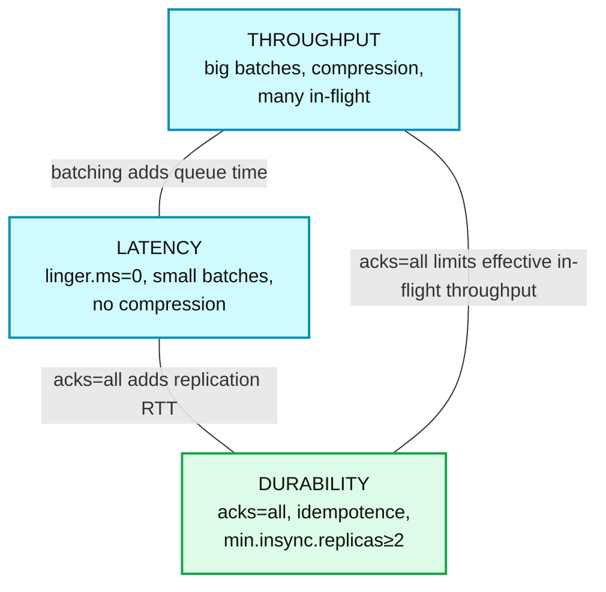

**Corner A — maximum throughput** (log/telemetry ingest, tolerant of a few ms and of rare loss):
```properties
acks=1                       # or all if you cannot lose data; costs replication RTT
enable.idempotence=false     # required, since acks!=all disables it anyway
batch.size=262144            # 256 KB
linger.ms=50
compression.type=lz4         # or zstd for ratio over CPU
compression.lz4.level=1      # trade ratio for CPU
buffer.memory=134217728      # 128 MB
max.request.size=4194304     # 4 MB — must be <= broker message.max.bytes
max.in.flight.requests.per.connection=10
delivery.timeout.ms=300000
```
Expect `batch-size-avg` close to `batch.size` and `records-per-request-avg` in the thousands. Ordering is **not** guaranteed here.

**Corner B — minimum latency** (request/response, interactive):
```properties
acks=1
enable.idempotence=false
linger.ms=0
batch.size=16384
compression.type=none
max.in.flight.requests.per.connection=5
request.timeout.ms=10000
delivery.timeout.ms=15000    # fail fast; must be >= linger + request.timeout
max.block.ms=5000
partitioner.adaptive.partitioning.enable=true
partitioner.availability.timeout.ms=5000   # steer away from slow brokers
```
Note that `linger.ms=0` is now a **deliberate deviation** from the 4.x default of 5.

**Corner C — maximum durability / EOS** (financial, ledgers, Streams EOS):
```properties
enable.idempotence=true      # default in 4.x
acks=all                     # forced
transactional.id=<stable-per-instance-id>
transaction.timeout.ms=60000                 # <= broker transaction.max.timeout.ms (900000)
max.in.flight.requests.per.connection=5
retries=2147483647           # default
delivery.timeout.ms=120000
linger.ms=10                 # transactions batch well; give them a chance
compression.type=zstd
# broker/topic side — not producer configs, but part of the guarantee:
#   min.insync.replicas=2   (topic), replication.factor=3
#   transaction.state.log.replication.factor=3, transaction.state.log.min.isr=2
#   unclean.leader.election.enable=false
```
The `transactional.id` **must be stable across restarts of the same logical instance** (e.g. `app-<taskId>`), otherwise fencing does nothing and zombies survive.

**Reference — the 4.3.1 out-of-the-box producer** is already `acks=all`, `enable.idempotence=true`, `linger.ms=5`, `batch.size=16384`, `compression.type=none`. That default is a durability-first, mildly-batched profile. The single highest-leverage change for most workloads is turning on compression and raising `batch.size`.

---

## 13. Trade-offs and alternatives

- **Client-side batching vs broker-side buffering.** Kafka pushes batching entirely into the client, so the broker's write path is `sendfile`-friendly and the batch travels compressed from producer to disk to consumer *untouched*. Cost: the producer holds unacknowledged data in heap, and a producer crash loses it. RabbitMQ/ActiveMQ take the opposite position (broker-side accumulation, publisher confirms per message) and pay for it in broker CPU. Pulsar sits in between — client batching, but a broker/BookKeeper split that re-materialises entries.
- **Sequence numbers vs a distributed dedup store.** Idempotence is implemented as a **bounded, per-partition, per-producer sliding window of 5 batches**, not as a dedup index. That is why the 5-in-flight cap exists and why PID expiry breaks dedup after 24 h idle. The alternative — a durable dedup index keyed by message id — is what most "exactly once" systems do and costs far more memory and write amplification. Kafka chose an O(1)-per-producer scheme with explicit, documented limits.
- **Transactions as coordinator + markers vs true 2PC over data partitions.** Kafka's coordinator is a *single* log-backed decision point; the data partitions never vote. So "prepare" is a one-sided durable write to `__transaction_state`, and the marker fan-out is pure forward recovery. This makes commit O(1) round trips regardless of partition count (the fan-out is async and off the client's critical path), but it means `commitTransaction()` returns before visibility. XA-style 2PC would give synchronous visibility at the cost of a real voting phase.
- **Epoch-per-transaction (TV2) vs verification RPCs (TV1+verification).** Both fix hanging transactions. Verification is a *runtime* cost paid forever (one RPC per partition per transaction); epoch bumping is a *protocol* change that costs one extra `__transaction_state` write per transaction and a client-visible epoch change. Kafka chose the protocol change — cheaper at steady state, but it required a feature flag, a client upgrade, and several rounds of marker-idempotency fixes.
- **`murmur2` as a public contract.** Freezing a specific non-cryptographic hash into the wire behaviour makes multi-language clients interoperable but forecloses ever changing the hash. Compare Cassandra's Murmur3Partitioner, which is equally frozen for the same reason.
- **Sticky-until-`batch.size` vs round-robin.** Round-robin maximises fairness and minimises per-partition skew; sticky maximises batch density. KIP-794 essentially concluded that batch density dominates for throughput and that fairness should be *load-weighted* (CFT over queue depths) rather than uniform. `RoundRobinPartitioner` survives only for workloads that genuinely need uniform spread, and it still carries the KAFKA-9965 bug.

---

## 14. Config reference — verified defaults (Kafka 4.3.1)

### Producer client (`ProducerConfig.java`)

| Config | Type | Default (4.3.1) | Notes |
|---|---|---|---|
| `bootstrap.servers` | list | *(required)* | |
| `key.serializer` / `value.serializer` | class | *(required)* | |
| `acks` | string | **`all`** | normalised to `-1`; forced to `all` by idempotence |
| `enable.idempotence` | boolean | **`true`** | silently disabled if `retries=0` or `acks!=all` and it was not set explicitly |
| `retries` | int | **`2147483647`** (`Integer.MAX_VALUE`) | prefer `delivery.timeout.ms` |
| `max.in.flight.requests.per.connection` | int | **`5`** | hard cap of 5 when idempotence is on; `==1` enables partition muting |
| `batch.size` | int | **`16384`** (16 KB) | also the `BufferPool` poolable size and the sticky-partition switch threshold |
| `linger.ms` | long | **`5`** | changed from `0` in 4.0 |
| `buffer.memory` | long | **`33554432`** (32 MB) | |
| `max.block.ms` | long | **`60000`** | user-thread bound: metadata + buffer allocation + txn APIs |
| `max.request.size` | int | **`1048576`** (1 MB) | per-request cap and per-record pre-flight cap |
| `delivery.timeout.ms` | int | **`120000`** | must be ≥ `linger.ms + request.timeout.ms` |
| `request.timeout.ms` | int | **`30000`** | per attempt |
| `retry.backoff.ms` | long | **`100`** | exponential base |
| `retry.backoff.max.ms` | long | **`1000`** | exponential cap |
| `compression.type` | string | **`none`** | `none`/`gzip`/`snappy`/`lz4`/`zstd` |
| `compression.gzip.level` | int | **`-1`** (`Deflater.DEFAULT_COMPRESSION`) | valid `1..9` or `-1` |
| `compression.lz4.level` | int | **`9`** | valid `1..17` |
| `compression.zstd.level` | int | **`3`** | valid `-131072..22` |
| `partitioner.class` | class | **`null`** | `null` ⇒ built-in partitioner; setting it disables all `partitioner.*` knobs below |
| `partitioner.adaptive.partitioning.enable` | boolean | **`true`** | KIP-794 load-weighted selection |
| `partitioner.availability.timeout.ms` | long | **`0`** (disabled) | requires adaptive partitioning |
| `partitioner.ignore.keys` | boolean | **`false`** | `true` ⇒ keys do not influence partitioning |
| `transactional.id` | string | **`null`** | implies `enable.idempotence=true` |
| `transaction.timeout.ms` | int | **`60000`** | must be ≤ broker `transaction.max.timeout.ms` |
| `transaction.two.phase.commit.enable` | boolean | **`false`** | KIP-939; incompatible with an explicit `transaction.timeout.ms` |
| `metadata.max.age.ms` | long | **`300000`** | |
| `metadata.max.idle.ms` | long | **`300000`** | min 5000 |
| `connections.max.idle.ms` | long | **`540000`** (9 min) | deliberately below the broker's 10 min |
| `reconnect.backoff.ms` / `.max.ms` | long | **`50`** / **`1000`** | |
| `socket.connection.setup.timeout.ms` / `.max.ms` | long | **`10000`** / **`30000`** | |
| `send.buffer.bytes` / `receive.buffer.bytes` | int | **`131072`** / **`32768`** | |
| `client.id` | string | **`""`** → `producer-<transactional.id or seq>` | |
| `interceptor.classes` | list | **`[]`** | |
| `enable.metrics.push` | boolean | **`true`** | KIP-714 client telemetry |
| `metrics.recording.level` | string | **`INFO`** | |
| `metrics.sample.window.ms` / `metrics.num.samples` | | **`30000`** / **`2`** | |
| `metadata.recovery.strategy` | string | **`rebootstrap`** | `CommonClientConfigs.DEFAULT_METADATA_RECOVERY_STRATEGY` |

### Broker / cluster configs that govern producer semantics

| Config | Default (4.3.1) | Source |
|---|---|---|
| `transaction.state.log.num.partitions` | **`50`** | `TransactionLogConfig` |
| `transaction.state.log.replication.factor` | **`3`** | `TransactionLogConfig` |
| `transaction.state.log.min.isr` | **`2`** | `TransactionLogConfig` |
| `transaction.state.log.segment.bytes` | **`104857600`** (100 MB) | `TransactionLogConfig` |
| `transaction.state.log.load.buffer.size` | **`5242880`** (5 MB) | `TransactionLogConfig` |
| `transaction.max.timeout.ms` | **`900000`** (15 min) | `TransactionStateManagerConfig` |
| `transactional.id.expiration.ms` | **`604800000`** (7 days) | `TransactionStateManagerConfig` |
| `transaction.abort.timed.out.transaction.cleanup.interval.ms` | **`10000`** | `TransactionStateManagerConfig` |
| `transaction.remove.expired.transaction.cleanup.interval.ms` | **`3600000`** (1 h) | `TransactionStateManagerConfig` |
| `transaction.two.phase.commit.enable` | **`false`** | `TransactionStateManagerConfig` |
| `producer.id.expiration.ms` | **`86400000`** (24 h) | `TransactionLogConfig` |
| `producer.id.expiration.check.interval.ms` | **`600000`** (10 min) | `TransactionLogConfig` |
| `transaction.partition.verification.enable` | **`true`** | `TransactionLogConfig` (only effective below TV2) |
| `add.partitions.to.txn.retry.backoff.ms` / `.max.ms` | **`20`** / **`100`** | `AddPartitionsToTxnConfig` |
| `message.max.bytes` | **`1048588`** (`1 MB + 12`) | `ServerLogConfigs.MAX_MESSAGE_BYTES_DEFAULT` |
| `transaction.version` (KRaft feature) | **`2`** on a cluster formatted at MV `4.3-IV0`; **unchanged** on an upgraded cluster | `TransactionVersion.LATEST_PRODUCTION`, `MetadataVersion.LATEST_PRODUCTION` |

---

## 15. Staff-level questions

1. **Why is `max.in.flight.requests.per.connection` capped at exactly 5 for the idempotent producer, and what breaks at 6?**
   Because the broker retains `ProducerStateEntry.NUM_BATCHES_TO_RETAIN = 5` batch metadata entries per producer per partition. With 6 in flight, a retry of the oldest batch can arrive after its `BatchMetadata` has been evicted from the 5-deep deque; the broker then cannot recognise it as a duplicate nor replay its cached offset, and depending on what else landed it will either accept a duplicate or reject with `OUT_OF_ORDER_SEQUENCE_NUMBER`. `ProducerConfig` throws a `ConfigException` rather than let you find out.

2. **A `read_committed` consumer on one partition has been stuck for hours while `read_uncommitted` consumers see new data. What is happening, what causes it, and how did KIP-890 fix it?**
   The LSO is pinned by an open (hanging) transaction: `firstUnstableOffset` points at a transactional batch that has no marker after it. Pre-KIP-890 this happened when a delayed `ProduceRequest` from a zombie was appended *after* the commit marker — the leader could not fence it because the epoch was only bumped per producer session and `checkProducerEpoch` used `<`. Fixes: (part 1) broker-side verification via `AddPartitionsToTxn(verifyOnly=true)`; (part 2, TV2) epoch bump on every commit/abort plus `epoch <= current` fencing, which makes the zombie's epoch strictly stale. Recovery for an already-hung partition is `kafka-transactions.sh abort`.

3. **`commitTransaction()` returned successfully. Is the data visible to `read_committed` consumers? Is it durable?**
   Durable: yes — the commit point is the `PrepareCommit` record in `__transaction_state`, written with `acks=all` under `transaction.state.log.min.isr`. Visible: not necessarily — `EndTxn` returns before `WriteTxnMarkers` has been acked by every partition leader, and the LSO on each data partition only advances once its marker lands. A coordinator failover between the two replays the log and re-drives the markers, so it is a liveness delay, not a correctness hole.

4. **Explain precisely when the default partitioner switches partitions, and why it is not simply "every `batch.size` bytes".**
   `producedBytes` accumulates the estimated size of appends to the current sticky partition. The switch fires when `producedBytes >= batch.size` **and** the deque's last batch is full, **or** unconditionally at `producedBytes >= 2 * batch.size`. The `enableSwitch` guard exists because switching mid-batch under a high `linger.ms` produces alternating full and fractional batches (the source works the 12 KB/4 KB example); the 2× cap prevents a mixed keyed/unkeyed stream from disabling the switch indefinitely. The *next* partition is chosen by weighted random over an inverted-queue-depth cumulative frequency table when adaptive partitioning is on.

5. **A producer that sends once an hour intermittently fails with `UNKNOWN_PRODUCER_ID`. Diagnose it.**
   Two candidates. (a) `producer.id.expiration.ms` (24 h) — but that needs a full day of idleness, so it fits a daily job, not an hourly one. (b) Far more likely: log retention or `DeleteRecords` advanced `logStartOffset` past the last offset this producer wrote, so the partition's `ProducerStateManager` no longer has an entry. `TransactionManager.canRetry` handles this: if `lastAckedOffset < response.logStartOffset` it restarts sequences at 0 (transactional) or bumps the epoch (idempotent) and retries, so the send usually succeeds — but idempotence across that boundary is gone. A third, rarer cause is a leader move to a broker that has not yet rebuilt producer state from snapshots.

6. *(bonus, and the one people get wrong)* **You have `enable.idempotence=true`, `acks=all`, and transactions. Does that give end-to-end exactly-once into your Postgres sink?**
   No. EOS is per-partition atomic append plus atomic offset commit *inside Kafka*. A write to Postgres from inside the transaction is outside the atom in both directions. You need an idempotent sink (upsert keyed on something derived from the record, or a processed-offsets table written in the same Postgres transaction as the data) — which is exactly what Kafka Connect's exactly-once sink support and the "offsets in the sink" pattern do.

---

## 16. Sources

**Source code (Apache Kafka 4.3.1, tag `4.3.1`, commit `26b251a`)**
- `clients/src/main/java/org/apache/kafka/clients/producer/ProducerConfig.java` — every client default and the idempotence config-validation logic
- `clients/src/main/java/org/apache/kafka/clients/producer/KafkaProducer.java` — `doSend`, `partition`, `ensureValidRecordSize`, `configureDeliveryTimeout`, `newSender`
- `clients/src/main/java/org/apache/kafka/clients/producer/internals/RecordAccumulator.java` — `append`, `ready`, `partitionReady`, `drainBatchesForOneNode`, `shouldStopDrainBatchesForPartition`
- `.../internals/BufferPool.java` — allocation, fair FIFO waiting, deallocation
- `.../internals/BuiltInPartitioner.java` — KIP-794 sticky + adaptive CFT, `partitionForKey`
- `.../internals/Sender.java` — `run`/`runOnce`, `sendProducerData`, `completeBatch`, `canRetry`, `sendProduceRequest`, `SenderMetrics`
- `.../internals/TransactionManager.java` — state machine, `maybeAddPartition`, `beginCompletingTransaction`, `EndTxnHandler`, `canRetry`, `handleFailedBatch`
- `.../internals/ProducerBatch.java`, `TxnPartitionMap.java`, `TxnPartitionEntry.java`, `KafkaProducerMetrics.java`, `SenderMetricsRegistry.java`
- `clients/src/main/java/org/apache/kafka/common/compress/` and `common/record/internal/CompressionType.java` — compression level defaults
- `storage/src/main/java/org/apache/kafka/storage/internals/log/ProducerStateManager.java`, `ProducerStateEntry.java` (`NUM_BATCHES_TO_RETAIN = 5`), `ProducerAppendInfo.java` (`checkProducerEpoch`, `checkSequence`), `TransactionIndex.java`, `LogFileUtils.java` (`.txnindex`)
- `transaction-coordinator/src/main/java/org/apache/kafka/coordinator/transaction/` — `TransactionLogConfig.java`, `TransactionStateManagerConfig.java`, `TransactionState.java`, `TransactionMetadata.java`, `AddPartitionsToTxnConfig.java`
- `core/src/main/scala/kafka/coordinator/transaction/` — `TransactionCoordinator.scala`, `TransactionStateManager.scala`, `TransactionMarkerChannelManager.scala`
- `server/src/main/java/org/apache/kafka/server/transaction/AddPartitionsToTxnManager.java` — `TransactionSupportedOperation`, `verifyOnly`
- `server-common/src/main/java/org/apache/kafka/server/common/TransactionVersion.java`, `Feature.java`, `MetadataVersion.java`
- `clients/src/main/resources/common/message/{Produce,EndTxn,AddPartitionsToTxn,AddOffsetsToTxn,TxnOffsetCommit,WriteTxnMarkers,InitProducerId}Request.json` — wire versions

**KIPs**
- KIP-98 — Exactly Once Delivery and Transactional Messaging (PID, epoch, sequences, coordinator, markers)
- KIP-185 — Make exactly-once in-order delivery the default (`enable.idempotence`)
- KIP-91 — `delivery.timeout.ms`
- KIP-360 — Improve reliability of idempotent/transactional producer (epoch bump on `UNKNOWN_PRODUCER_ID`)
- KIP-447 — Producer scalability for exactly-once semantics (`ConsumerGroupMetadata`, per-instance fencing)
- KIP-480 — Sticky Partitioner (superseded)
- KIP-794 — Strictly Uniform Sticky Partitioner (`partitioner.adaptive.partitioning.enable`, `partitioner.availability.timeout.ms`, `partitioner.ignore.keys`)
- KIP-854 / KIP-580 — exponential `retry.backoff.max.ms`
- KIP-890 — Transactions Server-Side Defense (verification, then TV2 epoch-per-transaction)
- KIP-939 — Support Participation in 2PC (`transaction.two.phase.commit.enable`, `InitProducerId` v6)
- KIP-1084 / KAFKA-19999 — TV2 marker-retry idempotency hardening
- KAFKA-9965 — `RoundRobinPartitioner` uneven distribution

**Docs**
- https://kafka.apache.org/documentation/#producerconfigs
- https://kafka.apache.org/documentation/#semantics
- https://kafka.apache.org/40/javadoc/org/apache/kafka/clients/producer/KafkaProducer.html

---

<!-- nav:start -->
[← 03 KRaft Controller](kafka-03-kraft-controller.md) · **[Index](README.md)** · [05 Consumer & Rebalance →](kafka-05-consumer-rebalance.md)
<!-- nav:end -->
