# Kafka Deep Dive 05 — The Consumer, Consumer Groups and Rebalance Protocols

**Series baseline: Apache Kafka 4.3** — 4.3.0 released 2026-05-22, latest patch **4.3.1** released 2026-06-25. All defaults below were verified against that release (`gradle.properties` `version=4.3.1`, i.e. the 4.3 maintenance branch), not taken from secondary docs. Where the shipped code and a KIP title disagree, the code wins and the discrepancy is called out.

Marking convention: **[documented]** — read from source, official docs, or a KIP; **[inferred]** — my reading of the code's consequences, not stated anywhere; **[unverified]** — could not be confirmed against a primary source.

---

<!-- nav:start -->
[← 04 Producer](kafka-04-producer.md) · **[Index](README.md)** · [06 Broker Pipeline →](kafka-06-broker-request-pipeline.md)
<!-- nav:end -->

<!-- toc:start -->
<details>
<summary><b>Sections in this report (13)</b></summary>

- [1. Overview](#1-overview)
- [2. Architecture](#2-architecture)
- [3. Data flow](#3-data-flow)
- [4. Sequence of operations](#4-sequence-of-operations)
- [5. State machines](#5-state-machines)
- [6. Component deep dives](#6-component-deep-dives)
- [7. Guarantees](#7-guarantees)
- [8. Failure modes](#8-failure-modes)
- [9. Scalability & performance](#9-scalability--performance)
- [10. Trade-offs & alternatives](#10-trade-offs--alternatives)
- [11. Staff-level questions](#11-staff-level-questions)
- [12. Sources](#12-sources)
- [Appendix — Verified config reference (Apache Kafka 4.3)](#appendix--verified-config-reference-apache-kafka-43)

</details>
<!-- toc:end -->

## 1. Overview

- **Problem solved.** Distribute the partitions of a set of topics across a dynamic set of consumer processes, track how far each partition has been consumed, and survive process death — without any external coordination service.
- **Key design bets.** (a) Offsets are *data*, stored in a compacted Kafka topic (`__consumer_offsets`), not in a separate store. (b) One broker per group is the **group coordinator**, elected by hashing the group id onto a partition of that topic, so coordination scales with partition count and inherits Kafka's own replication. (c) Membership is lease-based (heartbeat + session timeout), not lock-based.
- **The big architectural inversion (KIP-848).** Classic rebalancing computes the assignment *on a client* (the group leader) behind a global synchronization barrier. The new `consumer` protocol computes it *on the broker* and converges each member independently via per-member epochs. This removes the stop-the-world barrier entirely.
- **Two protocols ship side by side in 4.3.** `group.protocol=classic` (default) drives `ClassicKafkaConsumer` + JoinGroup/SyncGroup/Heartbeat. `group.protocol=consumer` drives `AsyncKafkaConsumer` + `ConsumerGroupHeartbeat`. KIP-848 is **GA since 4.0** but **not the client default in 4.3** — 5.0 flips the default, 6.0 removes `classic` from `KafkaConsumer`. **[documented]**
- **A third group type is now production-ready.** Share groups (KIP-932, "Queues for Kafka") became production-ready in **4.2** (`ShareVersion.LATEST_PRODUCTION = SV_1`, bootstrap `IBP_4_2_IV0`). They abandon partition ownership entirely in favour of per-record acquisition locks. **[documented]**
- **Scale.** A single group coordinator shard serves all groups hashing to one `__consumer_offsets` partition; a broker runs `group.coordinator.threads=4` processing threads across its leader partitions. Groups of tens of thousands of members are the target of KIP-848's incremental design.

---

## 2. Architecture

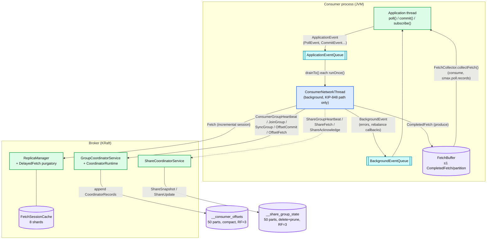

**What to notice**

- The application thread never touches the network in the KIP-848 path — it only exchanges events over two `BlockingQueue`s with `ConsumerNetworkThread`. In the classic path there is no background thread at all (except the classic `HeartbeatThread`); `poll()` itself drives IO.
- The coordinator is *not* a separate service. It is a state machine hosted on whichever broker leads the `__consumer_offsets` partition the group hashes to, so coordinator failover is just partition leader failover.
- Offsets and group metadata share one topic and one log; share-group state lives in a *different* topic with a *different* cleanup policy (`delete` + coordinator-driven pruning, not `compact`). **[documented]**
- `FetchBuffer` is the only shared mutable structure between the two client threads on the fetch path, and it holds at most one `CompletedFetch` per partition — that is the prefetch depth.
- The `FetchSessionCache` is broker-global and sharded 8 ways; it is what makes steady-state `Fetch` requests tiny.

---

## 3. Data flow

### 3.1 Fetch (read) path

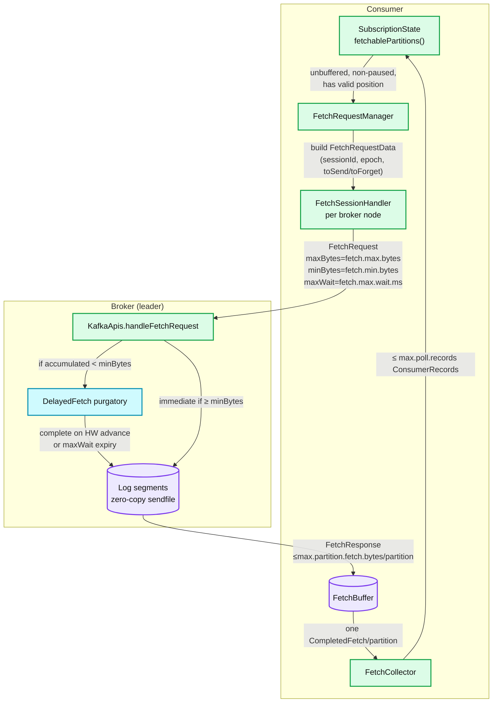

**What to notice**

- `fetchablePartitions(isNotBuffered)` excludes partitions that already have a `CompletedFetch` sitting in the buffer — this is the whole of the prefetch policy. One request in flight per broker node (`nodesWithPendingFetchRequests`). **[documented]**
- Byte limits nest: `fetch.max.bytes` (per response, 50 MiB) ≥ `max.partition.fetch.bytes` (per partition, 1 MiB); the broker additionally caps at its own `fetch.max.bytes` (55 MiB). None is a hard limit for a single oversized record batch — the first batch is always returned so the consumer cannot stall.
- `max.poll.records` (500) is purely client-side slicing of already-buffered data. It changes *processing* batch size, never network batch size — which is why it is the correct knob for `max.poll.interval.ms` problems.
- `fetch.min.bytes=1` + `fetch.max.wait.ms=500` means the default consumer is latency-optimised: the delayed-fetch purgatory almost never holds a request.

### 3.2 Offset commit (write) path

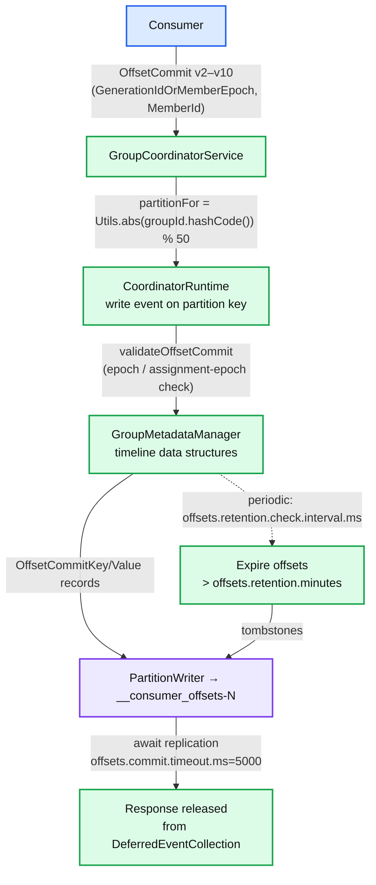

**What to notice**

- The write is *speculative then durable*: the coordinator applies records to in-memory timeline structures immediately (uncommitted reads see them) but parks the response until the records commit. A read (`OffsetFetch`) only sees committed state.
- Group→partition mapping is `Utils.abs(groupId.hashCode()) % offsets.topic.num.partitions`. It uses `String.hashCode`, so it is stable across JVMs and releases — which is exactly why `offsets.topic.num.partitions` "should not change after deployment". **[documented]**
- `offsets.commit.timeout.ms` is a coordinator-side *append* timeout applied to all coordinator writes, not just offset commits. **[documented]**
- Expiry is a background sweep, not compaction: the coordinator writes tombstones, and the log cleaner later removes them.

### 3.3 KIP-848 target-assignment path (server-side)

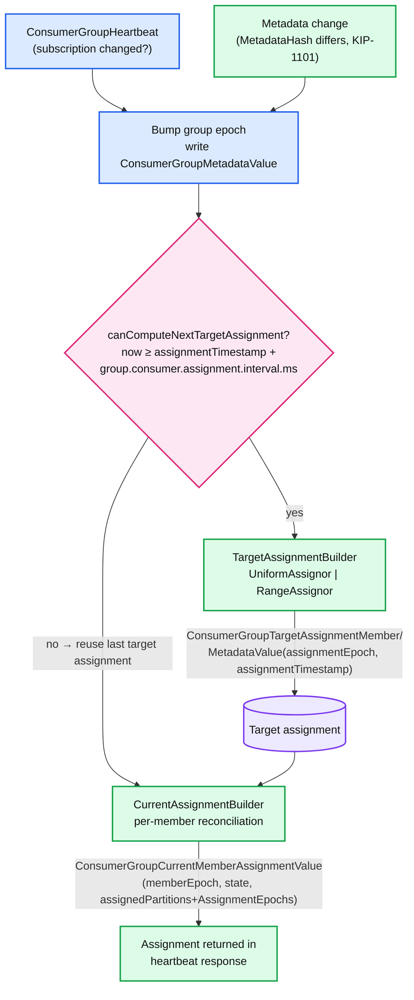

**What to notice**

- Three epochs, three different things: **group epoch** (bumped on any membership/subscription/metadata change), **assignment epoch** (the group epoch at which the target assignment was last computed), **member epoch** (how far an individual member has converged).
- KIP-1263 (new in 4.3) inserts the `GATE`: many rapid group-epoch bumps (a rolling restart, a fleet scale-up) now coalesce into one assignment computation per `group.consumer.assignment.interval.ms` (default **1000 ms**; previously the effective value was 0). `AssignmentTimestamp` is a new tagged field on `ConsumerGroupTargetAssignmentMetadataValue`. **[documented]**
- KIP-1263 also allows the assignor to run **off** the request thread (`group.consumer.assignor.offload.enable=true`) on the `group.coordinator.background.threads` pool (default **2**), so a slow assignor no longer blocks other groups on the same partition shard. **[documented]**
- Reconciliation is per-member and lock-free with respect to other members: the coordinator never waits for the whole group.

---

## 4. Sequence of operations

### 4.1 Classic (eager) rebalance — JoinGroup / SyncGroup

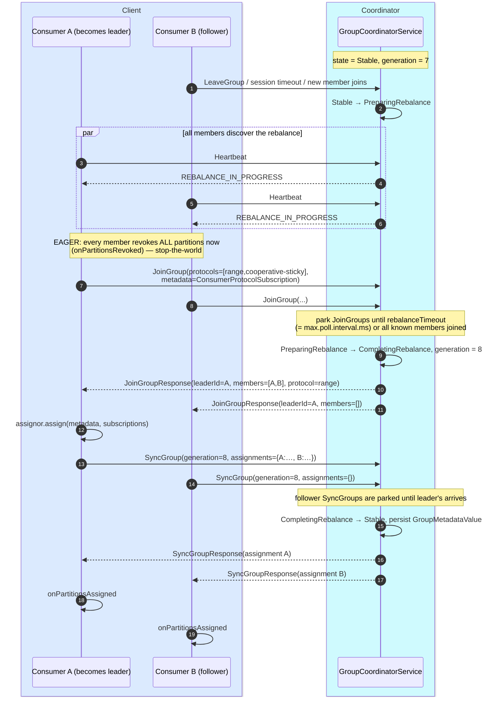

**What to notice**

- **Why the leader assigns.** The coordinator is protocol-agnostic: it forwards opaque `Metadata` bytes and gets back opaque assignment bytes. That let Kafka Streams ship arbitrarily complex assignment logic (task placement, standby replicas, cooperative handoff) as a client jar with **zero broker change**. The cost is a synchronization barrier and an untrusted, unversioned assignor.
- **Two timeouts, two failure detectors.** `session.timeout.ms` (45 s) is checked against `Heartbeat` arrivals on the background `HeartbeatThread` (every `heartbeat.interval.ms`, 3 s). `max.poll.interval.ms` (300 s) is checked *by the client itself* and is sent to the coordinator as `RebalanceTimeoutMs`; exceeding it makes the consumer send `LeaveGroup`.
- `group.initial.rebalance.delay.ms` (3 s) applies **only to the first rebalance of an empty group**: it holds `PreparingRebalance` open so a starting fleet joins once instead of *n* times.
- The generation id is the fencing token. Any `OffsetCommit` carrying a stale generation fails `ILLEGAL_GENERATION` → `CommitFailedException`.
- Everything between "REBALANCE_IN_PROGRESS" and the last `onPartitionsAssigned` is **downtime for the whole group**.

### 4.2 KIP-848 heartbeat + reconciliation

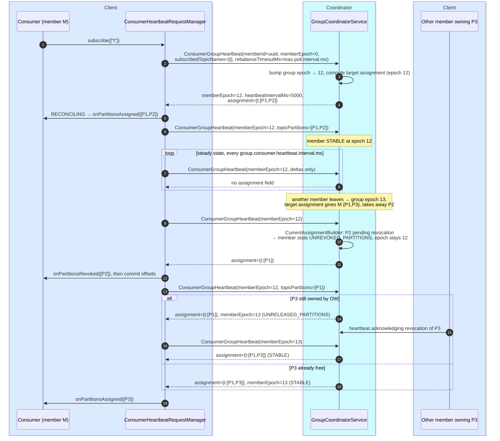

**What to notice**

- One RPC replaces three. `ConsumerGroupHeartbeat` (apiKey 68, v0–1) carries subscription, owned partitions, rack, rebalance timeout and assignor choice; every field is **delta-encoded** — `null`/`-1` means "unchanged since last heartbeat", so steady-state heartbeats are tiny. **[documented]**
- Since v1 (KIP-1082) the **client generates its own member id** (a UUID kept for the process lifetime), so a member id survives a coordinator failover round-trip.
- The member's epoch **does not advance** while it still owns partitions that must be revoked. That is the entire safety argument: a partition is never assigned to a new owner before the old owner has acknowledged giving it up, and no global barrier is needed to establish that.
- `UNRELEASED_PARTITIONS` is the "I've moved to the new epoch but I'm still waiting on someone else's revocation" state. The member is productive on what it does hold while it waits.
- `heartbeatIntervalMs` comes back **in the response** — the broker owns the cadence (`group.consumer.heartbeat.interval.ms`, 5000, clamped to \[5000, 15000]).

### 4.3 Coordinator failover

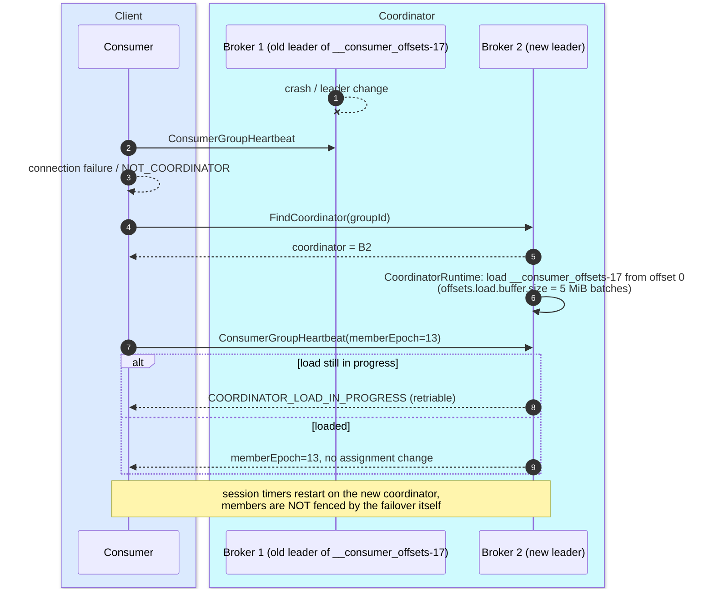

**What to notice**

- Recovery time is dominated by replaying the whole `__consumer_offsets` partition. That is why `offsets.topic.segment.bytes` is a small **100 MiB** — it keeps the compacted tail short and the load fast. **[documented]**
- `COORDINATOR_LOAD_IN_PROGRESS`, `COORDINATOR_NOT_AVAILABLE` and `NOT_COORDINATOR` are all retriable; the consumer re-runs `FindCoordinator` and keeps its epoch. Fetching continues throughout — only commits and heartbeats stall.
- Because member state is persisted (`ConsumerGroupCurrentMemberAssignmentValue`), KIP-848 failover does **not** trigger a rebalance. Classic failover reloads `GroupMetadataValue` and likewise preserves the generation.

---

## 5. State machines

### 5.1 Classic group state machine (broker side)

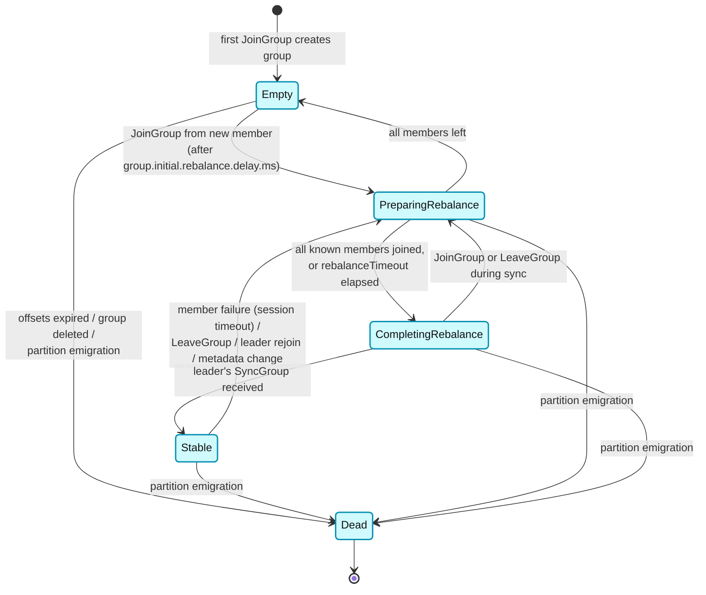

**What to notice**

- `PreparingRebalance` responds `REBALANCE_IN_PROGRESS` to heartbeats *and* to `OffsetCommit` in `CompletingRebalance` — the window in which `CommitFailedException` is manufactured.
- `Empty` is a real, useful state: a group that only uses Kafka for offset storage (manual `assign()`) lives here permanently, and its offsets still expire after `offsets.retention.minutes`.
- Valid predecessors are enforced in code (`ClassicGroupState.validPreviousStates`), so an out-of-order transition is a hard error, not a silently tolerated race. **[documented]**
- `Dead` is terminal and precedes metadata cleanup; "partition emigration" means this broker stopped leading the `__consumer_offsets` partition.

### 5.2 KIP-848 member state machine — **client** (`MemberState`)

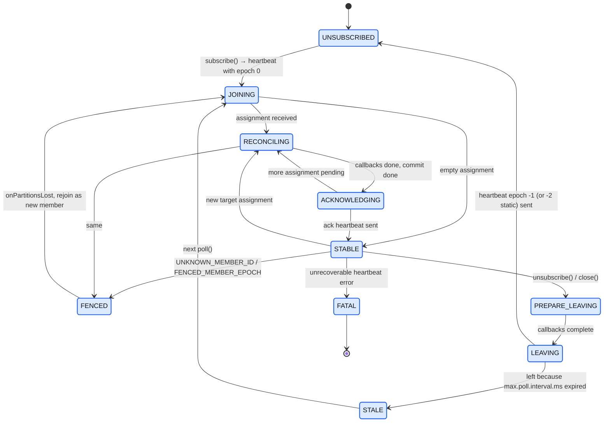

**What to notice**

- `ACKNOWLEDGING` exists solely to force an **immediate** heartbeat rather than waiting out the interval — it is how the client shortens reconciliation latency. **[documented]**
- `STALE` is the `max.poll.interval.ms` eviction state. The member leaves, invokes `onPartitionsLost` (not `onPartitionsRevoked` — offsets are *not* committed), and only rejoins when the application calls `poll()` again. This is the modern shape of the eviction loop.
- Epoch sentinels on the wire: `0` = join, `-1` = leave, `-2` = static member will rejoin. **[documented]**
- `FENCED` always means "start over as a new member with no partitions", after `onPartitionsLost`.

### 5.3 KIP-848 member state machine — **broker** (`modern.MemberState`)

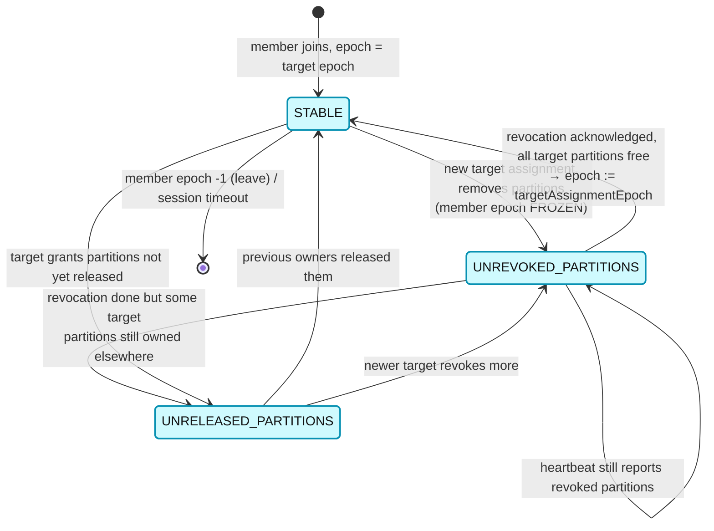

**What to notice**

- Only three real states (plus `UNKNOWN` for forward compatibility). Compare to the classic protocol, where the *group* has five states and every member is coupled to all others.
- The epoch freeze in `UNREVOKED_PARTITIONS` is the safety invariant. `computeNextAssignment()` literally keeps `memberEpoch` and only sets `partitionsPendingRevocation`. **[documented]**
- `UNKNOWN` (byte 127) is reached only after a coordinator downgrade reading a future state byte; the member is force-fenced and re-reconciled from scratch. **[documented]**
- These states are persisted in `ConsumerGroupCurrentMemberAssignmentValue.State`, so they survive coordinator failover.

### 5.4 Share-group record state (KIP-932)

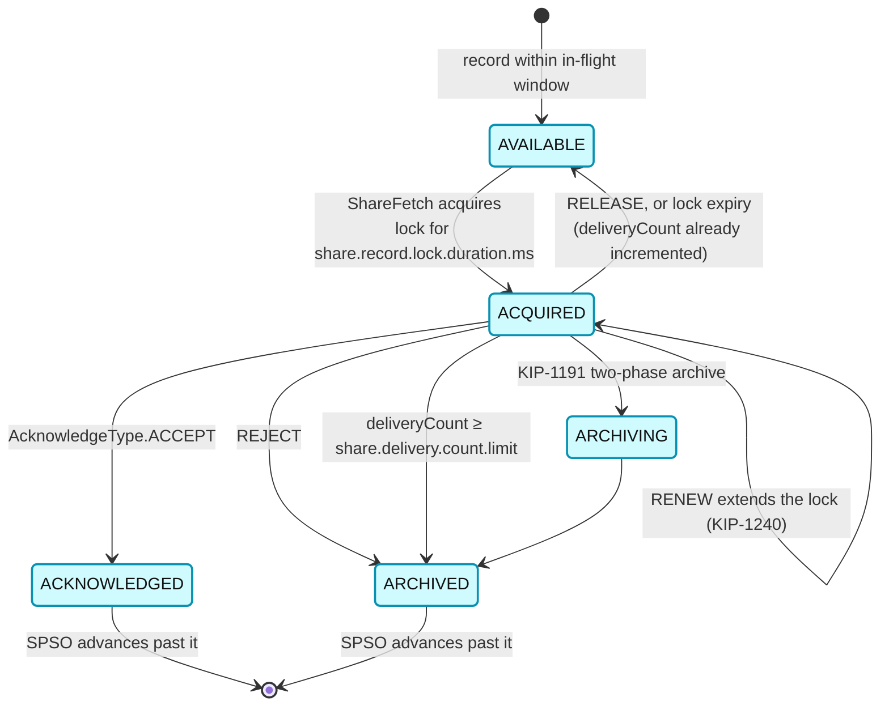

**What to notice**

- `ACKNOWLEDGED` and `ARCHIVED` are terminal — `RecordState.validateTransition` rejects any move out of them. **[documented]**
- Lock expiry and `RELEASE` are the same transition; the difference is only that expiry is timer-driven. Either way `deliveryCount` has already been charged.
- `RENEW` (`AcknowledgeType` id 4, `share.renew.acknowledge.enable=true`) is new in 4.3 and lets a long-running handler keep a lock without inflating `share.record.lock.duration.ms` for everyone.
- The share-partition start offset (SPSO) only advances over a **prefix** of terminal-state records — that is what bounds the in-flight state that must be persisted.

---

## 6. Component deep dives

### 6.1 `KafkaConsumer` and the two implementations

**Responsibility.** `KafkaConsumer` is a thin façade. `ConsumerDelegateCreator` reads `group.protocol` and returns `AsyncKafkaConsumer` for `consumer`, `ClassicKafkaConsumer` otherwise. **[documented]**

**`ClassicKafkaConsumer` — the single-threaded design and its pathology.**

- One thread does everything except heartbeating: metadata, coordinator discovery, fetching, offset commits, deserialization, and the user's processing (between `poll()` calls).
- A separate `HeartbeatThread` (inside `AbstractCoordinator`) sends `Heartbeat` on `heartbeat.interval.ms`. This is precisely the split that created the bug class: **liveness (heartbeat) was decoupled from progress (poll)**. A consumer stuck for 10 minutes in a slow handler kept heartbeating happily while making no progress, so the group never healed.
- KIP-62 (Kafka 0.10.1) introduced `max.poll.interval.ms` and `RebalanceTimeoutMs` to close that hole: the client watches its own poll cadence and self-evicts. The consequence is the classic failure mode — the consumer leaves, the group rebalances, the consumer finishes processing, tries to commit, and gets `CommitFailedException` for a stale generation.
- The `HeartbeatThread` also pauses itself when the poll interval is exceeded, so the same event is detected on both sides.

**`AsyncKafkaConsumer` — the new threading model (KIP-848 path).**

- Two threads, two queues. The application thread enqueues `ApplicationEvent`s (`PollEvent`, `AsyncCommitEvent`, `SyncCommitEvent`, `SubscriptionChangeEvent`, `UnsubscribeEvent`…). `ConsumerNetworkThread.runOnce()` does: `processApplicationEvents()` → for each `RequestManager` call `poll(now)` and hand `UnsentRequest`s to `NetworkClientDelegate` → `networkClientDelegate.poll(timeout, now)` → `maybeFailOnMetadataError`. **[documented]**
- `RequestManagers` is the registry: `CoordinatorRequestManager`, `CommitRequestManager`, `ConsumerHeartbeatRequestManager`, `ConsumerMembershipManager`, `OffsetsRequestManager`, `TopicMetadataRequestManager`, `FetchRequestManager` (plus the Share and Streams variants). Each is a small state machine polled every loop. **[documented]**
- Heartbeating is no longer a bare timer: `AbstractHeartbeatRequestManager.poll()` first updates a `pollTimer` seeded from `max.poll.interval.ms`, and if it has expired transitions the member to leave. Next-poll delay is `min(pollTimer.remaining()/2, timeToNextHeartbeat)`. **[documented]**
- **What this does and does not fix.** It fixes: `poll()` no longer has to be called to make coordinator progress during blocking operations, callbacks are invoked from the application thread via `BackgroundEventQueue` (so user code cannot block the network thread), and `close()`/`commitSync()` no longer deadlock on the poll loop. It does **not** remove `max.poll.interval.ms` — a slow processor still self-evicts, because that is the only signal that the application is alive.

**`Fetcher` / `FetchBuffer` / `FetchCollector` split.**

| Class | Runs on | Job |
|---|---|---|
| `AbstractFetch` / `FetchRequestManager` (async) or `Fetcher` (classic) | network thread | choose fetchable partitions, build `FetchRequest` via `FetchSessionHandler`, handle responses into `CompletedFetch` |
| `FetchBuffer` | shared, thread-safe | queue of `CompletedFetch`, **at most one per partition** |
| `FetchCollector` | application thread | drain `CompletedFetch`, decompress, CRC-check, deserialize into `ConsumerRecord`, honour `max.poll.records`, advance `SubscriptionState` positions |

Deserialization on the application thread is deliberate: a broken deserializer must not kill the network thread, and deserialization cost is charged to the caller's `max.poll.interval.ms` budget.

### 6.2 Fetch mechanics and KIP-227 incremental fetch sessions

**The problem KIP-227 solved.** Full `FetchRequest`s enumerate every assigned partition on every request. At 1000 partitions and 10 ms fetch intervals a single consumer was sending megabytes/second of partition metadata for mostly-idle partitions.

**The session.** On the first request the client sends `sessionId=0, epoch=0` (FULL). The broker allocates a `FetchSession`, returns a `sessionId` and epoch 1, and remembers the partition set and each partition's fetch offset. Subsequent INCREMENTAL requests send only `toSend` (partitions whose offset changed) and `toForget` (partitions removed); the response returns only partitions with new data.

**Cache structure (4.3).**

- `max.incremental.fetch.session.cache.slots` = **1000**, split across `NumFetchSessionCacheShards` = **8** shards; a session id deterministically maps to a shard via `sessionIdRange = Int.MaxValue / 8`. Eviction is considered **only within a shard**. **[documented]**
- Eviction requires the victim to be unused for at least `MIN_INCREMENTAL_FETCH_SESSION_EVICTION_MS` = **120000 ms**, and follows a privileged/unprivileged split (follower fetches are privileged and can evict consumer sessions; the reverse is not true). **[documented]**

**Errors and the client's obligation.**

| Error | Meaning | Client action |
|---|---|---|
| `FETCH_SESSION_ID_NOT_FOUND` | session was evicted or broker restarted | fall back to a FULL fetch (`sessionId=0, epoch=0`) |
| `INVALID_FETCH_SESSION_EPOCH` | client and broker epochs diverged (lost/duplicated request) | fall back to a FULL fetch |
| `FETCH_SESSION_TOPIC_ID_ERROR` | topic id mismatch (topic recreated) | refresh metadata, FULL fetch |

`FetchSessionHandler` handles all three transparently; the operational symptom is a spike in the `IncrementalFetchSessionEvictionsPerSec` meter plus a spike in fetch request size. The fix is to raise `max.incremental.fetch.session.cache.slots` (remembering the /8 sharding — 1000 slots means **125 per shard**).

**Broker-side delayed fetch.** If the accumulated response is smaller than `fetch.min.bytes`, `KafkaApis` parks the request in the `DelayedFetch` purgatory keyed by the fetched partitions. It completes when the high watermark advances enough or `fetch.max.wait.ms` elapses. `fetch.purgatory.purge.interval.requests` = **1000** controls how often completed-but-not-yet-reaped entries are swept. **[documented]** With the default `fetch.min.bytes=1` the purgatory path is effectively a long-poll for *empty* partitions only.

### 6.3 Offset management

**`__consumer_offsets`.**

- Created on demand with `cleanup.policy=compact`, `offsets.topic.num.partitions=50`, `offsets.topic.replication.factor=3`, `segment.bytes=100 MiB`, `compression.type=none`. **[documented]**
- **Why 50?** No design document justifies the number. **[inferred]** The constraints it balances: it must be large enough that group-coordinator load spreads across a reasonably sized cluster (each partition = one coordinator shard, and one broker's coordinator work is `#leader partitions × groups`), and small enough that a small cluster does not pay 50 × RF logs. It is effectively immutable because `partitionFor` hashes modulo it — changing it re-homes every existing group and orphans its committed offsets.
- Record types on this topic: `OffsetCommitKey/Value` (per group/topic/partition), `GroupMetadataKey/Value` (classic groups), and the KIP-848 family (`ConsumerGroupMetadata`, `ConsumerGroupMemberMetadata`, `ConsumerGroupTargetAssignmentMetadata/Member`, `ConsumerGroupCurrentMemberAssignment`, `ConsumerGroupRegularExpression`), plus the Share and Streams families. Compaction keeps the newest value per key; deletion is via tombstone. **[documented]**
- `OffsetCommitValue` v4 adds a tagged `topicId` — the offsets topic is migrating to topic ids so a delete-and-recreate of a topic invalidates old offsets. **[documented]**

**RPCs.** `OffsetCommit` v2–v10; **v9+ is required for members using the consumer group protocol** and carries `GenerationIdOrMemberEpoch` + `MemberId`. `OffsetFetch` mirrors it. A member on the new protocol sending `OffsetCommit` < v9 gets `UNSUPPORTED_VERSION`. **[documented]**

**Auto-commit and its exact windows.**

`enable.auto.commit=true` (default) commits the *current positions* — i.e. everything already returned by `poll()` — on a timer of `auto.commit.interval.ms=5000`, evaluated inside `poll()` (classic) or on the network thread (async), and once more on `close()`/before revocation.

| Configuration | Duplicate window | Loss window |
|---|---|---|
| auto-commit, defaults | Up to `auto.commit.interval.ms` (5 s) of processed-but-uncommitted records are re-delivered after a crash. | **None from auto-commit itself** — positions only advance for records that `poll()` returned. |
| auto-commit + processing in a background thread/executor | Same 5 s duplicate window. | **Unbounded**: `poll()` advances the position and the timer commits it while your executor is still working. This is the classic silent data-loss configuration. |
| `commitSync()` after processing | From the last successful commit to the crash — bounded by your batch. | None. |
| `commitSync()` *before* processing | None. | The whole in-flight batch. |
| `commitAsync()` after processing | Same as `commitSync` plus any in-flight commit lost at crash. | None. |

`auto.offset.reset` (default `latest`) applies only when there is **no valid committed offset** — never committed, or the committed offset fell off the log (`OFFSET_OUT_OF_RANGE`). Values in 4.3: `earliest`, `latest`, `none`, and `by_duration:<ISO-8601 duration>` (KIP-1106) which resets to `now - duration`. **[documented]** The `latest` default combined with a partition count increase is a documented delivery-loss hazard.

**Retention.** `offsets.retention.minutes` = **10080** (7 days). For a subscribed group the clock starts when the group becomes **empty**; for a standalone (`assign()`) consumer it starts at the last commit — which is why manually-assigned consumers silently lose offsets after a week of idleness. A `DeleteGroups` or topic deletion removes offsets immediately with no grace period. The sweep runs every `offsets.retention.check.interval.ms` = **600000**. **[documented]**

### 6.4 Incremental cooperative rebalancing (KIP-429)

Cooperative rebalancing keeps the classic JoinGroup/SyncGroup machinery but changes what a member does with the result.

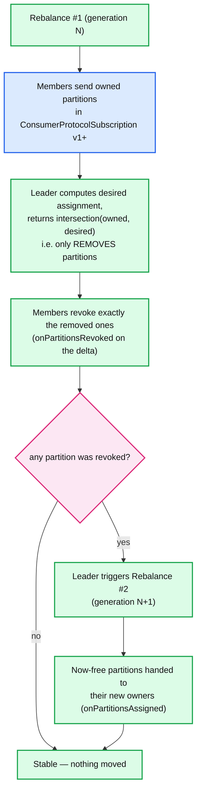

**What to notice**

- **Why two rebalances are unavoidable.** The leader can only *revoke* safely in round 1, because it cannot know that the previous owner has actually stopped consuming until that owner reports its new owned-set. Round 2 is the confirmation that the partitions are free. KIP-848 removes the second round by moving this handshake into per-member epochs on the broker.
- The protocol carries the extra state in `ConsumerProtocolSubscription`: **v1** added `OwnedPartitions`, **v2** added `GenerationId` (so the leader can detect an out-of-date `OwnedPartitions` from a zombie), **v3** added `RackId`. **[documented]**
- Members that lose nothing keep consuming through both rounds — that is the entire benefit.
- `onPartitionsLost` (as opposed to `onPartitionsRevoked`) exists because of cooperative mode: it signals "you no longer own these and must not commit for them".

**Upgrade path off `RangeAssignor`/`RoundRobinAssignor`/`StickyAssignor`.** Two rolling restarts, because a group must never have two members disagreeing about eagerness:

1. Roll 1: set `partition.assignment.strategy=[<current>, CooperativeStickyAssignor]`. The group still negotiates `<current>` (protocol selection picks the first strategy supported by *all* members), so behaviour is unchanged, but every member now *advertises* cooperative support.
2. Roll 2: set `partition.assignment.strategy=[CooperativeStickyAssignor]`. On the first rebalance after the last member is upgraded, the negotiated protocol flips to cooperative.

In 4.3 the client default is already `[RangeAssignor, CooperativeStickyAssignor]` **[documented]**, so a fresh 4.x deployment is one step from cooperative — but note that the *negotiated* protocol is still `range` (eager) unless you drop `RangeAssignor` from the list.

### 6.5 Static membership (KIP-345)

- Setting `group.instance.id` makes a member **static**: its identity is the instance id, not the ephemeral member id. **[documented]**
- On restart, the returning member re-uses its previous assignment as long as it comes back within `session.timeout.ms`. With `group.protocol=consumer` it announces the restart with member epoch **-2** ("static member will rejoin") instead of -1. **[documented]**
- **What it avoids:** the rebalance on a *planned, fast* restart (rolling deploy, k8s pod recreate, JVM upgrade). With `n` static instances, a rolling restart causes **zero** rebalances instead of `2n`.
- **What it does not avoid:** (a) rebalances from scale-up/scale-down or topic-metadata changes — membership still changed; (b) the eviction itself if the restart takes longer than `session.timeout.ms` — you must raise `session.timeout.ms` above your restart time, which directly slows down genuine failure detection; (c) duplicate processing — a returning static member resumes from the last committed offset like anyone else; (d) split-brain — two live processes with the same `group.instance.id` produce `UNRELEASED_INSTANCE_ID`/`FENCED_INSTANCE_ID`, and one of them is fenced.
- The trade-off is explicit: static membership converts *rebalance cost* into *failure-detection latency*.

### 6.6 KIP-848 — the next-generation consumer rebalance protocol

**Maturity and defaults in 4.3 (verified).**

| Question | Answer in 4.3 | Evidence |
|---|---|---|
| Is KIP-848 GA? | **Yes**, GA since 4.0 | `docs/operations/consumer-rebalance-protocol.md` **[documented]** |
| Enabled on the broker by default? | **Yes** — `GroupVersion.LATEST_PRODUCTION = GV_1` (bootstrap `IBP_4_0_IV0`) | `server-common/.../GroupVersion.java` **[documented]** |
| Client default `group.protocol`? | **`classic`** — `DEFAULT_GROUP_PROTOCOL = GroupProtocol.CLASSIC` | `ConsumerConfig.java:115` **[documented]** |
| When does the client default change? | **5.0** defaults to `consumer`; **6.0** removes `classic` from `KafkaConsumer` | KIP-1274 timeline in the 4.3 docs **[documented]** |

**KIP-1274 in 4.3** does not change any default — it adds a startup log line. The shipped text (`ClassicKafkaConsumer.java:221`) is:

```
****************************************************************
* The consumer rebalance protocol (KIP-848) is production-ready!
* Set the consumer configuration group.protocol=consumer to try it out.
* See https://kafka.apache.org/documentation/#consumer_rebalance_protocol
****************************************************************
```

It is suppressed when the assignor list contains `StreamsPartitionAssignor` (Streams has its own protocol, KIP-1071). **[documented]**

**Server-side assignment.** `group.consumer.assignors` defaults to `[uniform, range]`, and the **first entry is the default** unless the client names one via `group.remote.assignor` (default `null`). **[documented]**

- **`UniformAssignor`** — balances partitions evenly across members; the sticky-and-uniform successor to `CooperativeStickyAssignor`. It has a homogeneous fast path (all members subscribe to the same topics) and a general path.
- **`RangeAssignor`** (server-side) — co-partitioning-preserving: partition *i* of every subscribed topic goes to the same member, which is what join-style consumers rely on.
- Custom assignors implement `ConsumerGroupPartitionAssignor` and are named by **full class name** in `group.consumer.assignors` — i.e. they are deployed to the **broker**, not the client. Client-side assignors are explicitly out of scope (KAFKA-18327), and rack-aware assignment is still incomplete (KAFKA-19387). **[documented]**

Documented mapping when migrating: `RangeAssignor → range`; `CooperativeStickyAssignor`, `StickyAssignor`, `RoundRobinAssignor → uniform`. **[documented]**

**Configs the new protocol takes away from the client.** With `group.protocol=consumer` these are unusable: `session.timeout.ms`, `heartbeat.interval.ms`, `partition.assignment.strategy`, and `enforceRebalance()`. **[documented]** They move to the broker as `group.consumer.session.timeout.ms` (45000, clamped \[45000, 60000]) and `group.consumer.heartbeat.interval.ms` (5000, clamped \[5000, 15000]), overridable **per group** via the group configs `consumer.session.timeout.ms` / `consumer.heartbeat.interval.ms`. **[documented]** `max.poll.interval.ms` stays on the client and is sent as `RebalanceTimeoutMs`.

**KIP-1251 — assignment epochs (new in 4.3).**

- Problem: fencing used `clientMemberEpoch == brokerMemberEpoch`. A background heartbeat can bump the broker's member epoch *while the member still owns every partition it is committing for*. The commit then fails spuriously. For **transactional** offset commits this is fatal: the producer cannot see the consumer's heartbeat thread, so the transaction aborts.
- Fix: track an epoch **per assigned partition** — the epoch at which that partition was granted. The in-memory assignment becomes `Map<Uuid topicId, Map<Integer partition, Integer assignmentEpoch>>`, and the record gains a tagged, nullable `AssignmentEpochs` array on `ConsumerGroupCurrentMemberAssignmentValue.TopicPartitions` (aligned with `Partitions`). Legacy records default to the current member epoch, preserving the old safety property. **[documented]**
- New validation rule: `assignmentEpoch ≤ clientMemberEpoch ≤ brokerMemberEpoch`. A newer-than-broker epoch is still `STALE_MEMBER_EPOCH` (or `ILLEGAL_GENERATION` for classic members); an older one is now checked per partition instead of rejected outright. **[documented]**
- Net effect: zombie commits are still fenced (their partitions have been re-granted at a higher assignment epoch), but honest commits during a concurrent heartbeat succeed.

**KIP-1263 — assignment batching and offload (new in 4.3).**

- `group.consumer.assignment.interval.ms` = **1000** (min 0, max 15000; previously effectively 0). `canComputeNextTargetAssignment()` returns true only if there is no prior assignment, the interval is 0, or `now ≥ assignmentTimestamp + interval`. Otherwise the last target assignment is reused and the group converges on the next heartbeat. **[documented]**
- `group.consumer.assignor.offload.enable` = **true**: assignment runs on the coordinator's background pool, sized by the new `group.coordinator.background.threads` = **2**. **[documented]**
- `AssignmentTimestamp` added as a tagged field to `ConsumerGroupTargetAssignmentMetadataValue`. **[documented]**
- Equivalents exist for share and streams groups (`group.share.assignment.interval.ms`, `group.streams.assignment.interval.ms`, and the matching offload flags).

**KIP-1237 — `group.coordinator.rebalance.protocols` deprecated.** Annotated `@Deprecated(since = "4.3", forRemoval = true)` in `GroupCoordinatorConfig`, default `[classic, consumer, streams]`, removal in **5.0**. From 5.0 all protocols are always enabled and gating moves entirely to the feature flags `group.version`, `streams.version`, `share.version` managed by `kafka-features.sh`. **[documented]**

**Migration path from classic.**

- **Offline:** stop every consumer (group becomes `Empty`), restart with `group.protocol=consumer`. Empty-group conversion in both directions is *always* allowed regardless of policy.
- **Online:** roll consumers with `group.protocol=consumer`. The first new-protocol member converts the group `Classic → Consumer`; the coordinator interoperates the remaining classic members (they keep speaking JoinGroup/SyncGroup while the coordinator drives the assignment). **Precondition: the classic group must use an assignor that does not embed custom metadata** — so plain `RangeAssignor`/`RoundRobinAssignor`/`(Cooperative)StickyAssignor` are fine, Kafka Streams is not. **[documented]**
- Downgrade is the mirror image; the group converts back when the last `consumer`-protocol member leaves.
- Gated by `group.consumer.migration.policy` = **`bidirectional`** (also `upgrade`, `downgrade`, `disabled`). Under `disabled`, a classic member cannot join or rejoin a non-empty consumer group; an already-mixed group rejects its classic members on their next rejoin. **[documented]**

### 6.7 Share groups / Queues for Kafka (KIP-932)

**Maturity in 4.3.** Production-ready since **4.2** (`ShareVersion.LATEST_PRODUCTION = SV_1`, bootstrap `IBP_4_2_IV0`). Preview in 4.1 (required explicitly enabling `share.version=1`), early access in 4.0. On a cluster upgraded with `kafka-features.sh upgrade --release-version 4.3`, share groups are on. **[documented]** 4.2.1 fixed a critical deadlock in the share-group path (KAFKA-20505) — 4.2.0 should be skipped. **[documented]**

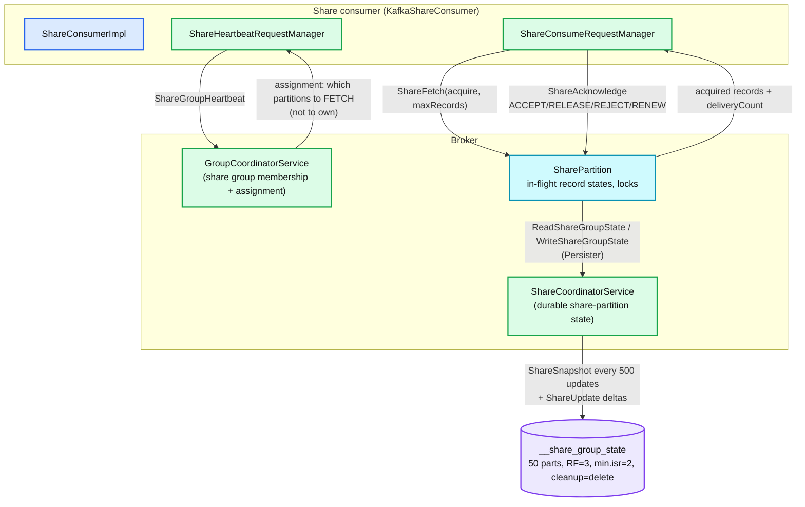

**What to notice**

- **No partition ownership.** The share-group assignment tells a member which partitions it may *fetch from*; multiple members can fetch the same partition concurrently. Records, not partitions, are the unit of exclusivity — via a time-bounded acquisition lock.
- **Two coordinators.** The `GroupCoordinatorService` owns membership/assignment (records in `__consumer_offsets`); the `ShareCoordinatorService` owns durable per-share-partition delivery state (records in `__share_group_state`). They are separate `CoordinatorRuntime` instances with separate thread pools.
- `__share_group_state` uses `cleanup.policy=delete` plus coordinator-driven pruning every `share.coordinator.state.topic.prune.interval.ms` (5 min), not compaction — because a periodic `ShareSnapshot` makes all prior records for that share-partition redundant. **[documented]**
- `ShareSnapshotValue` carries `SnapshotEpoch`, `StateEpoch`, `LeaderEpoch`, `StartOffset` (SPSO), `DeliveryCompleteCount` (KIP-1226) and `StateBatches[]` of `(firstOffset, lastOffset, deliveryState, deliveryCount)`. State is stored as **ranges**, not per record — that is what keeps the state small. **[documented]**

**Acknowledgement modes.** `share.acknowledgement.mode` = **`implicit`** (default). Implicit: the next `poll()` implicitly ACCEPTs everything the previous `poll()` returned. Explicit: the application must call `acknowledge(record, type)` for every record in the batch before the next `poll()`, or the batch fails. **[documented]**

**Acquire mode.** `share.acquire.mode` = **`batch_optimized`** (default) or `record_limit`. `batch_optimized` acquires whole record batches (cheaper state, may exceed `max.poll.records`); `record_limit` respects an exact record count at the cost of finer-grained state. **[documented]**

**Delivery counts.** `group.share.delivery.count.limit` = **5** (broker min 2, max 10; per-group override `share.delivery.count.limit`, new in KIP-1240). Every acquisition increments the count; on `RELEASE` or lock expiry the record returns to `AVAILABLE` and will be redelivered; when the count reaches the limit the record is `ARCHIVED` — i.e. **poison-pill handling is built in**, with no DLQ topic. **[documented]**

**Locks.** `group.share.record.lock.duration.ms` = **30000** (min 15000, max 60000; per-group `share.record.lock.duration.ms`). `group.share.partition.max.record.locks` = **2000** (min 100, max 4000) bounds the in-flight window per share-partition — this is the back-pressure mechanism: once the window is full no further records are acquirable until acknowledgements let the SPSO advance. **[documented]**

**KIP-1240 additions in 4.3.** New *group*-level configs `share.delivery.count.limit`, `share.partition.max.record.locks`, `share.renew.acknowledge.enable` (default **true**), each with broker-level min/max bounds, plus improved group-config validation. `AcknowledgeType.RENEW` (id 4) is the client-visible half. **[documented]**

**How this differs fundamentally from consumer groups.**

| | Consumer group | Share group |
|---|---|---|
| Unit of assignment | partition (exclusive) | none — partitions are shared |
| Unit of progress | committed offset per partition | per-record state + SPSO |
| Ordering | per-partition total order | **none** |
| Max useful consumers | = partition count | unbounded (`group.share.max.size` = 200) |
| Redelivery | rewind the whole partition | per record, counted, bounded |
| Failure of one record | blocks the partition | archived after N attempts |
| Durable state size | O(partitions) | O(in-flight records), snapshot+delta |

### 6.8 The `GroupCoordinator` runtime

The Scala `GroupCoordinator` is gone. 4.3 ships a Java `group-coordinator` module plus a shared `coordinator-common` runtime, also used by the `share-coordinator` and the transaction coordinator.

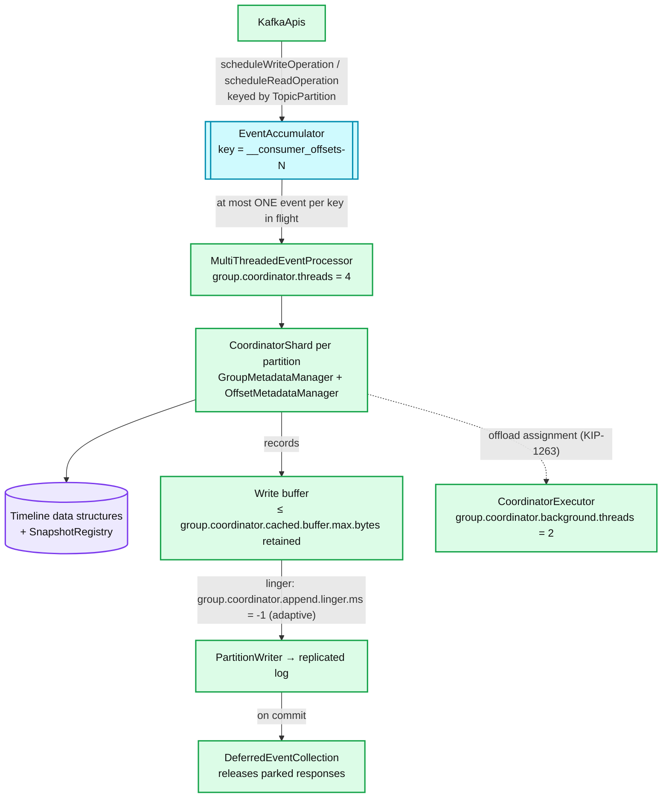

**What to notice**

- **Not literally one event loop per partition.** It is a fixed thread pool (`group.coordinator.threads` = **4**) fed by an `EventAccumulator` that guarantees *events sharing a partition key are never processed concurrently*. **[documented]** The effect is per-partition serialization (so a shard needs no locks) with far fewer threads than partitions. Threads poll with a 300 ms timeout.
- **Hard state vs soft state.** Hard state lives in timeline collections backed by a `SnapshotRegistry`. A **write** operation reads the *latest (uncommitted)* view; a **read** operation reads only the *committed* view. On an append failure the runtime reverts to the last committed snapshot — that is how a failed write leaves no trace.
- `group.coordinator.append.linger.ms` = **-1** means *adaptive*: the runtime picks a linger that minimises latency for the observed workload rather than a fixed accumulation delay. Transactional writes are never accumulated. **[documented]**
- **KIP-1196 naming correction.** The KIP is titled "Introduce `group.coordinator.append.max.buffer.size`", and several release write-ups repeat that name. The **shipped configs are `group.coordinator.cached.buffer.max.bytes` and `share.coordinator.cached.buffer.max.bytes`** (KAFKA-19519), default `1 MiB + Records.LOG_OVERHEAD` = **1048588** bytes each. **[documented]** They cap the write buffer the coordinator *retains for reuse* between appends; a buffer larger than the cap is dropped rather than pooled, bounding coordinator heap when a single group produces an outsized record batch. Setting it above the max message size makes every buffer recyclable and defeats the limit. **[documented]**
- The `CoordinatorRuntime` is generic (`<S extends CoordinatorShard<U>, U>`); the group coordinator, share coordinator and transaction coordinator are three instantiations, which is why they all gained `append.linger.ms`, `cached.buffer.max.bytes` and threads configs in lockstep.

---

## 7. Guarantees

| Guarantee | Mechanism |
|---|---|
| **At-least-once delivery** (consumer groups, default) | Offsets committed after processing; a crash re-delivers from the last commit. Nothing in the consumer provides exactly-once by itself. |
| **At-most-once** | Commit before processing (`commitSync()` then process). Explicit opt-in. |
| **Exactly-once (read-process-write)** | Not a consumer feature: requires `isolation.level=read_committed` + `sendOffsetsToTransaction()` on the producer. KIP-1251 is what makes this reliable under the new protocol. |
| **Partition exclusivity** (consumer groups) | Classic: generation-id fencing at the coordinator + a global barrier. KIP-848: the member epoch is frozen until revocation is acknowledged, so a partition's new owner is granted it only after the old owner reports not owning it. |
| **Ordering** | Per partition, per assignment. Preserved across a rebalance only because exclusivity is preserved. Share groups explicitly give this up. |
| **Offset durability** | `__consumer_offsets` RF=3 + `offsets.commit.timeout.ms` — the response is withheld until the record commits, so a successful `commitSync()` means replicated. |
| **Zombie fencing on commit** | Classic: `ILLEGAL_GENERATION` on stale generation. KIP-848: `STALE_MEMBER_EPOCH`, relaxed by KIP-1251 to `assignmentEpoch ≤ clientEpoch ≤ brokerEpoch`. |
| **Static identity uniqueness** | `FENCED_INSTANCE_ID` / `UNRELEASED_INSTANCE_ID` when two processes claim one `group.instance.id`. |
| **Share-group record exclusivity** | Time-bounded acquisition lock (`share.record.lock.duration.ms`) — *not* a guarantee of single delivery; expiry redelivers. Share groups are at-least-once with a bounded attempt count. |

---

## 8. Failure modes

| Failure | Detection | Recovery | Blast radius |
|---|---|---|---|
| **Rebalance storm** (classic) | Rebalance rate metric; repeated `PreparingRebalance` | Root causes: `session.timeout.ms` too low vs GC pauses; flapping members; eager assignor. Fix with cooperative or KIP-848, static membership, longer session timeout. | **Whole group** — every member stops consuming on every round. |
| **`max.poll.interval.ms` eviction loop** | `WARN Consumer poll timeout has expired…`; group members churn | Consumer self-evicts, rebalance, consumer returns, processes slowly, evicts again — a stable oscillation. Fix: cut `max.poll.records`, raise `max.poll.interval.ms`, or move work off the poll thread. | Whole group (classic); with KIP-848 only the affected member's partitions move. |
| **Coordinator unavailable** | `COORDINATOR_NOT_AVAILABLE` / `NOT_COORDINATOR` / `COORDINATOR_LOAD_IN_PROGRESS` | `FindCoordinator` + retry. Loading time ∝ `__consumer_offsets` partition size. | Commits and heartbeats stall for groups on that partition; **fetching continues**. |
| **`CommitFailedException`** | Thrown from `commitSync()` / commit callback | Sources in 4.3: `UNKNOWN_MEMBER_ID`; `STALE_MEMBER_EPOCH`; `REBALANCE_IN_PROGRESS`/`ILLEGAL_GENERATION` (classic); "Coordinator unknown and consumer is closing". **[documented]** Not retriable — the work must be redone under the new assignment. | One member; the offsets are simply not advanced, so records are re-processed. |
| **Duplicate processing after rebalance** | Lag drops then re-rises; downstream duplicates | Inherent to at-least-once. Bound it by committing in `onPartitionsRevoked`, or make the sink idempotent. | Records between last commit and revocation, per moved partition. |
| **Silent offset loss** | Lag jumps to 0 or to the head with no consumption | `offsets.retention.minutes` expiry on an idle group, or `auto.offset.reset=latest` after `OFFSET_OUT_OF_RANGE`. | Whole group; unrecoverable without manual offset reset. |
| **Fetch session thrash** | `IncrementalFetchSessionEvictionsPerSec`; fetch request size climbs | Too many consumers/followers per broker for 1000 slots ÷ 8 shards. Raise `max.incremental.fetch.session.cache.slots`. | Broker-wide CPU/network overhead; correctness unaffected. |
| **Slow custom server-side assignor** (KIP-848) | Coordinator event-queue latency metrics | Pre-4.3 it blocked a coordinator thread. In 4.3, `group.consumer.assignor.offload.enable=true` moves it to the background pool and the interval gate batches invocations. | Was: all groups on the same `__consumer_offsets` partition. Now: mostly contained. |
| **Share-group in-flight window full** | `ShareFetch` returns nothing despite lag | An unacknowledged batch holds `group.share.partition.max.record.locks` slots until locks expire (up to 30 s). | One share-partition; other partitions unaffected. |
| **Mixed-protocol group blocked** | Classic member rejected on rejoin | `group.consumer.migration.policy=disabled` on an already-mixed group. Set it to `bidirectional`/`upgrade`. | Classic members only. |

---

## 9. Scalability & performance

- **Coordinator work per group is O(members × rebalances).** Classic protocol: each rebalance is `2 × members` RPCs plus a full assignment payload transiting the coordinator twice (leader → coordinator → all followers). At 10 000 members this payload dominates. KIP-848: one RPC per member per heartbeat interval, delta-encoded, and the assignment is computed once server-side and delivered incrementally.
- **The stop-the-world barrier is the classic protocol's hard scaling limit.** Rebalance duration ≥ slowest member's response, bounded by `rebalanceTimeoutMs` (= `max.poll.interval.ms`, 5 min by default). One slow member stalls thousands.
- **Coordinator partitioning.** 50 `__consumer_offsets` partitions × `group.coordinator.threads=4` per broker. Hot spot: a single very large group is confined to **one** shard and therefore one thread at a time — group size, not group count, is the scaling risk. KIP-1263's batching and offload are direct mitigations.
- **Fetch batching.** `fetch.min.bytes`/`fetch.max.wait.ms` trade latency for request rate; incremental fetch sessions cut the *metadata* cost of high partition counts; `max.partition.fetch.bytes` bounds per-partition memory (client heap ≈ `max.partition.fetch.bytes × assigned partitions` worst case).
- **Back-pressure.** Consumer groups have none beyond `pause()`/`resume()` and the one-buffered-fetch-per-partition rule. Share groups have real back-pressure: the in-flight lock window.
- **Offsets topic write rate.** `auto.commit.interval.ms=5000` × groups × partitions is a real load; compaction plus the small 100 MiB segment size keeps the compacted tail bounded so coordinator load stays fast.
- **`group.initial.rebalance.delay.ms`** converts an O(n) startup rebalance cascade into one rebalance for a cold fleet — a 3 second cost for a large saving.

---

## 10. Trade-offs & alternatives

| Decision | Why | Cost | Alternative |
|---|---|---|---|
| Offsets in a Kafka topic | Reuses replication, compaction, and the existing log; no external dependency | Coordinator recovery = replaying a log; group→partition hash is effectively frozen | ZooKeeper (pre-0.9) — did not scale to high commit rates |
| Client-side assignment (classic) | Ships arbitrary assignment logic (Streams) with no broker change; brokers stay protocol-agnostic | Global barrier; unversioned, untrusted assignor; leader is a bottleneck | Server-side assignment (KIP-848) |
| Server-side assignment (KIP-848) | Removes the barrier; broker knows metadata already; enables incremental convergence | Custom assignors must be deployed to brokers; no client-side assignors; rack-awareness incomplete | Keep classic (deprecated path) |
| Epoch-frozen revocation instead of a barrier | Only the members that lose partitions pause | Reconciliation may take several heartbeat intervals (5 s each) to fully converge | Two-round cooperative rebalance (KIP-429) |
| Lease-based liveness (session timeout) | Simple, no external failure detector | Detection latency = `session.timeout.ms`; GC pauses look like death | Explicit failure detector / external membership (e.g. ZooKeeper ephemerals) |
| Share groups instead of a broker-side queue | Reuses the log; adds only a state overlay | No ordering; state grows with in-flight records; two coordinators | RabbitMQ/SQS-style broker queue; Pulsar shared subscriptions (closest analogue — Pulsar tracks per-message acks in a cursor, Kafka in range-encoded snapshots) |

**Comparable systems.** Pulsar shared subscriptions provide per-message acknowledgement natively but pay for it with a managed-cursor structure per subscription. Kinesis uses a lease table in DynamoDB (client-library-side, effectively "static membership everywhere") — simpler failover, external dependency, no cooperative handoff. NATS JetStream consumer groups use explicit per-message ack with redelivery, close to Kafka share groups, but without partition-level ordering as an option.

---

## 11. Staff-level questions

1. A member's `poll()` loop takes 8 minutes on one batch. Trace exactly what happens under `group.protocol=classic` versus `group.protocol=consumer`, naming the state transitions, which callback fires (`onPartitionsRevoked` vs `onPartitionsLost`), whether offsets are committed, and which other members stop consuming.
2. KIP-848 grants a partition to a new owner without any global barrier. State the precise invariant that prevents two members from consuming the same partition, and name the field in `ConsumerGroupCurrentMemberAssignmentValue` that persists it across coordinator failover.
3. Why does KIP-1251 need a *per-partition* epoch rather than simply relaxing the member-epoch comparison to `≤`? Construct the zombie-commit scenario that a plain `≤` would let through.
4. You run 4000 consumers against 200 brokers and see `IncrementalFetchSessionEvictionsPerSec` climbing. Compute the per-shard slot budget under the defaults and explain why raising `max.incremental.fetch.session.cache.slots` to 1200 may not help.
5. A team enables `enable.auto.commit=true` and hands each `poll()` batch to a thread pool. Explain the loss window, why it is unbounded rather than bounded by `auto.commit.interval.ms`, and what the smallest correct change is.
6. Compare the failure containment of a slow *client-side* assignor (classic, leader) against a slow *server-side* assignor (KIP-848) before and after KIP-1263, naming the config that changed the answer.
7. Share groups and consumer groups can both consume the same topic. Explain why a share group needs a second internal topic with `cleanup.policy=delete` while consumer-group offsets live in a compacted one.

---

## 12. Sources

**Primary — Apache Kafka 4.3 source (`apache/kafka`, branch `4.3`, `version=4.3.1`)**

- `clients/src/main/java/org/apache/kafka/clients/consumer/ConsumerConfig.java` — every client default
- `clients/src/main/java/org/apache/kafka/clients/consumer/internals/` — `AsyncKafkaConsumer`, `ClassicKafkaConsumer`, `ConsumerNetworkThread`, `RequestManagers`, `AbstractFetch`, `FetchBuffer`, `FetchCollector`, `MemberState`, `AbstractHeartbeatRequestManager`, `CommitRequestManager`, `ConsumerDelegateCreator`
- `clients/src/main/resources/common/message/` — `ConsumerGroupHeartbeatRequest/Response.json` (apiKey 68, v0–1), `JoinGroupRequest.json`, `OffsetCommitRequest.json` (v2–10), `ConsumerProtocolSubscription.json` (v0–3)
- `group-coordinator/src/main/java/org/apache/kafka/coordinator/group/GroupCoordinatorConfig.java`, `GroupConfig.java`, `GroupCoordinatorService.java`, `GroupMetadataManager.java`
- `group-coordinator/src/main/java/org/apache/kafka/coordinator/group/modern/consumer/CurrentAssignmentBuilder.java`, `ConsumerGroup.java`, `modern/MemberState.java`, `classic/ClassicGroupState.java`, `modern/share/ShareGroupConfig.java`
- `group-coordinator/src/main/resources/common/message/` — coordinator record schemas
- `coordinator-common/src/main/java/org/apache/kafka/coordinator/common/runtime/` — `CoordinatorRuntime`, `EventAccumulator`, `MultiThreadedEventProcessor`
- `share-coordinator/src/main/java/org/apache/kafka/coordinator/share/ShareCoordinatorConfig.java`, `share-coordinator/src/main/resources/common/message/ShareSnapshotValue.json`
- `server/src/main/java/org/apache/kafka/server/FetchSession.java`, `FetchSessionCacheShard.java`, `share/fetch/RecordState.java`
- `server-common/src/main/java/org/apache/kafka/server/config/ServerConfigs.java`, `server/.../ReplicationConfigs.java`
- `server-common/src/main/java/org/apache/kafka/server/common/GroupVersion.java`, `ShareVersion.java`
- `core/src/main/scala/kafka/server/BrokerServer.scala`, `KafkaBroker.scala`
- `docs/operations/consumer-rebalance-protocol.md`, `docs/getting-started/upgrade.md`

**KIPs**

- [KIP-62 — Allow consumer to send heartbeats from a background thread](https://cwiki.apache.org/confluence/display/KAFKA/KIP-62%3A+Allow+consumer+to+send+heartbeats+from+a+background+thread)
- [KIP-227 — Introduce Incremental FetchRequests to Increase Partition Scalability](https://cwiki.apache.org/confluence/display/KAFKA/KIP-227%3A+Introduce+Incremental+FetchRequests+to+Increase+Partition+Scalability)
- [KIP-345 — Introduce static membership protocol to reduce consumer rebalances](https://cwiki.apache.org/confluence/display/KAFKA/KIP-345%3A+Introduce+static+membership+protocol+to+reduce+consumer+rebalances)
- [KIP-429 — Kafka Consumer Incremental Rebalance Protocol](https://cwiki.apache.org/confluence/display/KAFKA/KIP-429%3A+Kafka+Consumer+Incremental+Rebalance+Protocol)
- [KIP-848 — The Next Generation of the Consumer Rebalance Protocol](https://cwiki.apache.org/confluence/x/HhD1D)
- [KIP-932 — Queues for Kafka](https://cwiki.apache.org/confluence/x/4hA0Dw)
- [KIP-1196 — Introduce group.coordinator.append.max.buffer.size config](https://cwiki.apache.org/confluence/x/hA5JFg) (shipped as `*.cached.buffer.max.bytes`, KAFKA-19519)
- [KIP-1237 — Deprecate group.coordinator.rebalance.protocols](https://cwiki.apache.org/confluence/x/jIqmFw)
- [KIP-1240 — New share group configurations](https://cwiki.apache.org/confluence/x/tIHMFw)
- [KIP-1251 — Assignment epochs for consumer groups](https://cwiki.apache.org/confluence/spaces/KAFKA/pages/399279344/KIP-1251+Assignment+epochs+for+consumer+groups)
- [KIP-1263 — Group Coordinator Assignment Batching and Offload](https://cwiki.apache.org/confluence/x/DIE8G)
- [KIP-1274 — Deprecate and remove support for Classic rebalance protocol in KafkaConsumer](https://cwiki.apache.org/confluence/display/KAFKA/KIP-1274%3A+Deprecate+and+remove+support+for+Classic+rebalance+protocol+in+KafkaConsumer)

**Release material**

- [Apache Kafka 4.3.0 Release Announcement](https://kafka.apache.org/blog/2026/05/22/apache-kafka-4.3.0-release-announcement/)
- [Apache Kafka 4.2.0 Release Announcement](https://kafka.apache.org/blog/2026/02/17/apache-kafka-4.2.0-release-announcement/)
- [Confluent — Apache Kafka 4.3 released](https://www.confluent.io/blog/apache-kafka-4-3-release/)
- [Apache Kafka 4.3 upgrade notes](https://kafka.apache.org/43/getting-started/upgrade/)

---

## Appendix — Verified config reference (Apache Kafka 4.3)

### Consumer client (`ConsumerConfig`)

| Config | Default | Notes |
|---|---|---|
| `group.protocol` | `classic` | `consumer` selects `AsyncKafkaConsumer` + KIP-848 |
| `group.remote.assignor` | `null` | server-side assignor name; only with `group.protocol=consumer` |
| `group.instance.id` | `null` | static membership (KIP-345) |
| `partition.assignment.strategy` | `[RangeAssignor, CooperativeStickyAssignor]` | classic only; unusable with `group.protocol=consumer` |
| `session.timeout.ms` | `45000` | classic only |
| `heartbeat.interval.ms` | `3000` | classic only |
| `max.poll.interval.ms` | `300000` | both protocols; sent as `RebalanceTimeoutMs` |
| `max.poll.records` | `500` | client-side slicing only |
| `fetch.min.bytes` | `1` | |
| `fetch.max.wait.ms` | `500` | |
| `fetch.max.bytes` | `52428800` (50 MiB) | |
| `max.partition.fetch.bytes` | `1048576` (1 MiB) | |
| `enable.auto.commit` | `true` | |
| `auto.commit.interval.ms` | `5000` | |
| `auto.offset.reset` | `latest` | also `earliest`, `none`, `by_duration:<ISO-8601>` |
| `isolation.level` | `read_uncommitted` | |
| `request.timeout.ms` | `30000` | |
| `default.api.timeout.ms` | `60000` | |
| `metadata.max.age.ms` | `300000` | |
| `connections.max.idle.ms` | `540000` | |
| `share.acknowledgement.mode` | `implicit` | share consumer |
| `share.acquire.mode` | `batch_optimized` | share consumer; or `record_limit` |

### Broker — group coordinator & offsets (`GroupCoordinatorConfig`)

| Config | Default | Notes |
|---|---|---|
| `group.coordinator.rebalance.protocols` | `classic,consumer,streams` | **deprecated 4.3**, removed 5.0 (KIP-1237) |
| `group.coordinator.threads` | `4` | request-processing pool |
| `group.coordinator.background.threads` | `2` | **new in 4.3** (KIP-1263) |
| `group.coordinator.append.linger.ms` | `-1` | -1 = adaptive |
| `group.coordinator.cached.buffer.max.bytes` | `1048588` (1 MiB + log overhead) | **new in 4.3** (KIP-1196) |
| `offsets.topic.num.partitions` | `50` | immutable in practice |
| `offsets.topic.replication.factor` | `3` | |
| `offsets.topic.segment.bytes` | `104857600` (100 MiB) | |
| `offsets.topic.compression.codec` | `none` | |
| `offsets.load.buffer.size` | `5242880` (5 MiB) | |
| `offsets.commit.timeout.ms` | `5000` | applies to all coordinator writes |
| `offset.metadata.max.bytes` | `4096` | |
| `offsets.retention.minutes` | `10080` (7 days) | |
| `offsets.retention.check.interval.ms` | `600000` | |
| `group.min.session.timeout.ms` | `6000` | classic |
| `group.max.session.timeout.ms` | `1800000` | classic |
| `group.initial.rebalance.delay.ms` | `3000` | classic, first rebalance of an empty group |
| `group.max.size` | `Integer.MAX_VALUE` | classic |

### Broker — KIP-848 consumer groups

| Config | Default | Min / Max default |
|---|---|---|
| `group.consumer.session.timeout.ms` | `45000` | min `45000` / max `60000` |
| `group.consumer.heartbeat.interval.ms` | `5000` | min `5000` / max `15000` |
| `group.consumer.assignors` | `uniform, range` | first = default |
| `group.consumer.migration.policy` | `bidirectional` | `upgrade`, `downgrade`, `disabled` |
| `group.consumer.assignment.interval.ms` | `1000` | min `0` / max `15000` — **new in 4.3** |
| `group.consumer.assignor.offload.enable` | `true` | **new in 4.3** |
| `group.consumer.regex.refresh.interval.ms` | `600000` | |
| `group.consumer.max.size` | `Integer.MAX_VALUE` | |

### Broker — share groups (KIP-932 / KIP-1240)

| Config | Default | Min / Max default |
|---|---|---|
| `group.share.max.size` | `200` | |
| `group.share.session.timeout.ms` | `45000` | `45000` / `60000` |
| `group.share.heartbeat.interval.ms` | `5000` | `5000` / `15000` |
| `group.share.assignors` | `simple` | single entry only |
| `group.share.record.lock.duration.ms` | `30000` | `15000` / `60000` |
| `group.share.delivery.count.limit` | `5` | `2` / `10` |
| `group.share.partition.max.record.locks` | `2000` | `100` / `4000` |
| `group.share.max.share.sessions` | `2000` | |
| `group.share.assignment.interval.ms` | `1000` | `0` / `15000` |
| `group.share.assignor.offload.enable` | `true` | |
| `group.share.initialize.retry.interval.ms` | `30000` | |
| `group.share.persister.class.name` | `org.apache.kafka.server.share.persister.DefaultStatePersister` | |
| `share.fetch.purgatory.purge.interval.requests` | `1000` | |

### Broker — share coordinator (`ShareCoordinatorConfig`)

| Config | Default |
|---|---|
| `share.coordinator.state.topic.num.partitions` | `50` |
| `share.coordinator.state.topic.replication.factor` | `3` |
| `share.coordinator.state.topic.min.isr` | `2` |
| `share.coordinator.state.topic.segment.bytes` | `104857600` |
| `share.coordinator.state.topic.compression.codec` | `none` |
| `share.coordinator.threads` | `1` |
| `share.coordinator.snapshot.update.records.per.snapshot` | `500` |
| `share.coordinator.write.timeout.ms` | `5000` |
| `share.coordinator.load.buffer.size` | `5242880` |
| `share.coordinator.append.linger.ms` | `-1` |
| `share.coordinator.state.topic.prune.interval.ms` | `300000` |
| `share.coordinator.cold.partition.snapshot.interval.ms` | `300000` |
| `share.coordinator.cached.buffer.max.bytes` | `1048588` — **new in 4.3** (KIP-1196) |

### Broker — fetch path

| Config | Default | Notes |
|---|---|---|
| `max.incremental.fetch.session.cache.slots` | `1000` | split across **8** shards → 125/shard |
| `fetch.max.bytes` | `57671680` (55 MiB) | broker-side cap |
| `fetch.purgatory.purge.interval.requests` | `1000` | |
| *(constant)* `MIN_INCREMENTAL_FETCH_SESSION_EVICTION_MS` | `120000` | not configurable |
| *(constant)* `NumFetchSessionCacheShards` | `8` | not configurable |

### Group-level configs (settable per group with `kafka-configs.sh --entity-type groups`)

`consumer.session.timeout.ms`, `consumer.heartbeat.interval.ms`, `consumer.assignment.interval.ms`, `consumer.assignor.offload.enable`, `share.session.timeout.ms`, `share.heartbeat.interval.ms`, `share.record.lock.duration.ms`, `share.delivery.count.limit`, `share.partition.max.record.locks`, `share.auto.offset.reset` (default `latest`), `share.isolation.level` (default `read_uncommitted`), `share.renew.acknowledge.enable` (default `true`), `share.assignment.interval.ms`, `share.assignor.offload.enable`, plus the `streams.*` equivalents. Each is bounded by the matching `group.<type>.min.*` / `group.<type>.max.*` broker config. **[documented]**

---

<!-- nav:start -->
[← 04 Producer](kafka-04-producer.md) · **[Index](README.md)** · [06 Broker Pipeline →](kafka-06-broker-request-pipeline.md)
<!-- nav:end -->
