# Kafka 06 — The Broker Request Pipeline: Network Layer, Purgatory, Quotas, Security

> **Scope**: how a single request physically moves through a broker process — socket accept → network thread → request queue → I/O thread → `KafkaApis` → (maybe purgatory) → response queue → socket write. Plus the three cross-cutting systems that intercept that path: back-pressure, quotas, and security.
>
> **Series baseline: Apache Kafka 4.3** — 4.3.0 released 2026-05-22, latest patch **4.3.1** released 2026-06-25. All code references, class names, defaults and metric names below were verified against that release (`core`, `server`, `server-common`, `clients`, `metadata`, `raft`, `group-coordinator` modules). Items marked **[documented]** come from source or official KIPs. Items marked **[inferred]** are operational judgement, not code.
>
> **Series note**: [report 01](kafka-01-log-storage.md) covers the log; 02 replication; 03 KRaft; 04 producer; 05 consumer/groups. This report assumes those. Where a path leaves this report's scope (e.g. what `ReplicaManager.appendRecords` does to the log), it says so and stops.

---

<!-- nav:start -->
[← 05 Consumer & Rebalance](kafka-05-consumer-rebalance.md) · **[Index](README.md)** · [07 Streams & Connect →](kafka-07-streams-connect.md)
<!-- nav:end -->

<!-- toc:start -->
<details>
<summary><b>Sections in this report (14)</b></summary>

- [1. Overview](#1-overview)
- [2. Architecture — the full thread hand-off](#2-architecture--the-full-thread-hand-off)
- [3. Data flow](#3-data-flow)
- [4. Sequences](#4-sequences)
- [5. The request lifecycle with timings — the practical table](#5-the-request-lifecycle-with-timings--the-practical-table)
- [6. State machines](#6-state-machines)
- [7. Component deep dives](#7-component-deep-dives)
- [8. Failure modes](#8-failure-modes)
- [9. Scalability and performance](#9-scalability-and-performance)
- [10. Trade-offs and alternatives](#10-trade-offs-and-alternatives)
- [11. Config reference — every knob, with verified defaults](#11-config-reference--every-knob-with-verified-defaults)
- [12. Metric cheat-sheet](#12-metric-cheat-sheet)
- [13. Staff-level questions](#13-staff-level-questions)
- [14. Sources](#14-sources)

</details>
<!-- toc:end -->

## 1. Overview

- **The problem**: a Kafka broker must sustain millions of requests/sec across tens of thousands of connections on a handful of cores, while some requests (`acks=all` produce, long-poll fetch) are *inherently* slow because they wait on other machines or on future data. Blocking a thread per waiting request does not scale.
- **Design bet #1 — split the threads by cost class.** A small pool of NIO `Processor` threads does only socket I/O and protocol framing (cheap, latency-critical). A separate pool of "I/O threads" (`KafkaRequestHandler`) does all request semantics (expensive, throughput-critical). They meet at one bounded `ArrayBlockingQueue`.
- **Design bet #2 — never park a thread on a wait.** Any request that cannot be answered now is turned into a `DelayedOperation`, parked in a **purgatory** keyed by what it is waiting for, and the I/O thread returns to the queue immediately. Completion is driven by external events (a replica's fetch advances the HW; a new append arrives), with a **hierarchical timing wheel** as the timeout backstop.
- **Design bet #3 — one in-flight request per connection, enforced at the socket.** After handing a request to the queue, the `Processor` *mutes* the channel. This makes back-pressure automatic and end-to-end: a slow broker stops reading, TCP windows close, and producers/consumers block in their own send buffers rather than piling unbounded work on the broker.
- **Design bet #4 — throttle with latency, not errors.** Quota enforcement holds the response and mutes the channel for a computed delay, then sends a normal success response carrying `throttle_time_ms`. Clients see slowness, never failure, so no retry storm amplifies an overload.
- **Scale it operates at** [inferred, from defaults and common production sizing]: default 3 network threads and 8 I/O threads per broker; a 500-deep request queue; production brokers commonly run 8–16 network threads and 16–32 I/O threads at 10k+ connections and 100k+ req/s.

### Premise corrections up front

Three things commonly stated about this area are **wrong for Kafka 4.x**, and this report uses the correct forms:

| Commonly said | Actual in 4.3.1 |
|---|---|
| `max.connections.creation.rate` | The config is **`max.connection.creation.rate`** (singular "connection") — `SocketServerConfigs.MAX_CONNECTION_CREATION_RATE_CONFIG` |
| `purgatory.purge.interval.requests` | No such config. There are **four separate** ones: `producer.`, `fetch.`, `delete.records.`, and `share.fetch.purgatory.purge.interval.requests` |
| `DelayedJoin` is a purgatory operation | **Removed.** The new group coordinator (KIP-848, Java `group-coordinator` module) uses `CoordinatorRuntime`'s own `CoordinatorTimer`. Only stale comments referencing `DelayedJoin` remain in `DelayedOperation.java` and `KafkaApis.scala:257` |
| `AclAuthorizer` is the ZK authorizer | **Fully removed** in 4.0 with ZooKeeper. `StandardAuthorizer` is the only built-in |

---

## 2. Architecture — the full thread hand-off

This is the diagram to draw in an interview.

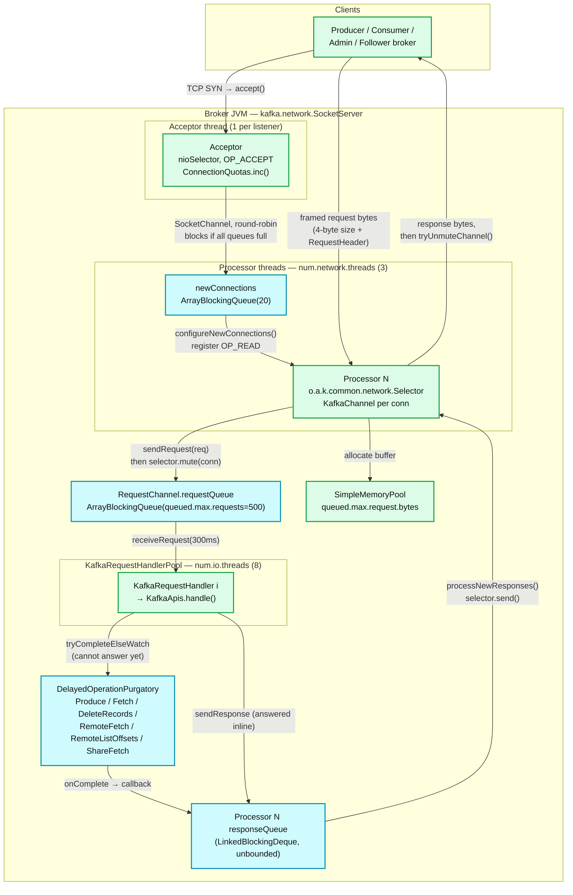

**What to notice**

- **Exactly two queue crossings** per request: `requestQueue` (bounded, shared) and the per-`Processor` `responseQueue` (unbounded). Every latency metric in §5 is a measurement between two of these hops.
- **The `Acceptor` never touches request bytes.** It accepts, applies connection quotas, and hands the raw `SocketChannel` to a `Processor` round-robin (`Processor.ConnectionQueueSize = 20`, hard-coded). If every processor's `newConnections` queue is full it blocks on the last one — visible as `AcceptorBlockedPercent`.
- **`selector.mute(connectionId)` immediately after `sendRequest`** is the single most important line in the pipeline (`SocketServer.scala:1041`). One in-flight request per connection, enforced in the broker, is what makes back-pressure work.
- **The response queue is unbounded but bounded in practice**: a connection can hold at most one in-flight request, so `responseQueue` depth ≤ connections on that processor.
- **The memory pool is optional.** `queued.max.request.bytes = -1` by default ⇒ `MemoryPool.NONE`, i.e. no byte-based admission control; only the 500-request count limit applies.

### Where the controller fits (KRaft)

In KRaft, a *controller* node runs its own `SocketServer` on `controller.listener.names` with its own `RequestChannel` and its own `KafkaRequestHandlerPool` running `ControllerApis` instead of `KafkaApis`. In combined mode (`process.roles=broker,controller`) both exist in one JVM.

> **4.3 change [documented]**: `KafkaRequestHandlerPoolFactory` now shares one `aggregateThreads` counter across pools, so the classic `RequestHandlerAvgIdlePercent` remains an aggregate, and two new per-pool meters were added: **`BrokerRequestHandlerAvgIdlePercent`** and **`ControllerRequestHandlerAvgIdlePercent`** (`KafkaRequestHandler.scala:239–249`). On a combined node this finally lets you tell broker-side saturation from controller-side saturation.

---

## 3. Data flow

### 3.1 Request path (bytes → `KafkaApis`)

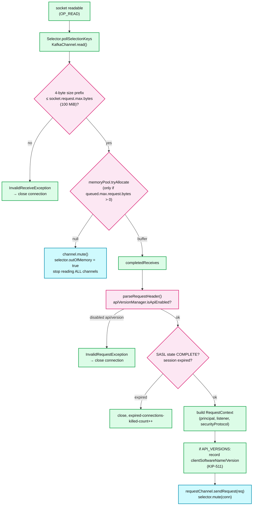

**What to notice**

- **Size check precedes allocation.** `socket.request.max.bytes` (100 MiB) is enforced on the length prefix before a byte of payload is buffered — a malformed/hostile length cannot OOM the broker.
- **Memory-pool exhaustion mutes *every* channel**, not just the greedy one (`Selector.java:457–465` unmutes them all when pressure clears). This is a blunt global brake; that bluntness is why `queued.max.request.bytes` is off by default.
- **API-version rejection closes the connection**, it does not return an error response. Only `ApiVersions` itself gets a courtesy `UNSUPPORTED_VERSION` body (§7.2).
- **`RequestContext` is built once** and carries the authenticated `KafkaPrincipal` forward; authorization in `KafkaApis` never re-reads the socket.
- The `Request` object holds `startTimeNanos` from this moment — `TotalTimeMs` is measured from here, *before* the queue.

### 3.2 Response path (`KafkaApis` → bytes)

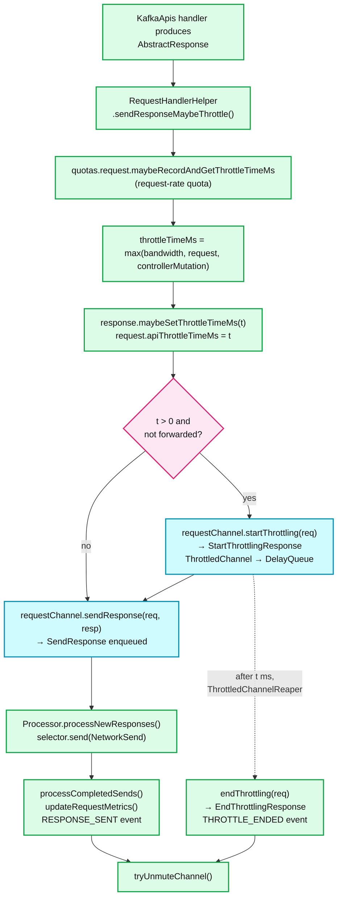

**What to notice**

- **Throttling and response-sending are independent.** The response is written immediately with `throttle_time_ms` set; the *channel* stays muted until the delay elapses. Modern clients (≥ 2.0, KIP-219) also self-throttle on receiving the field, so the mute is belt-and-braces for old clients.
- **The channel only unmutes when both conditions hold**: response fully sent **and** throttle expired. That is exactly why `KafkaChannel` needs a 5-state mute machine (§6.1) rather than a boolean.
- **Forwarded requests are not throttled twice.** `!request.isForwarded` guards the throttle so a broker→controller forwarded write is quota'd once, at the entry broker.
- `updateRequestMetrics` runs in `processCompletedSends`, i.e. on the **network thread** — so a stalled network thread also stalls your metrics.

---

## 4. Sequences

### 4.1 `acks=all` produce — the canonical purgatory case

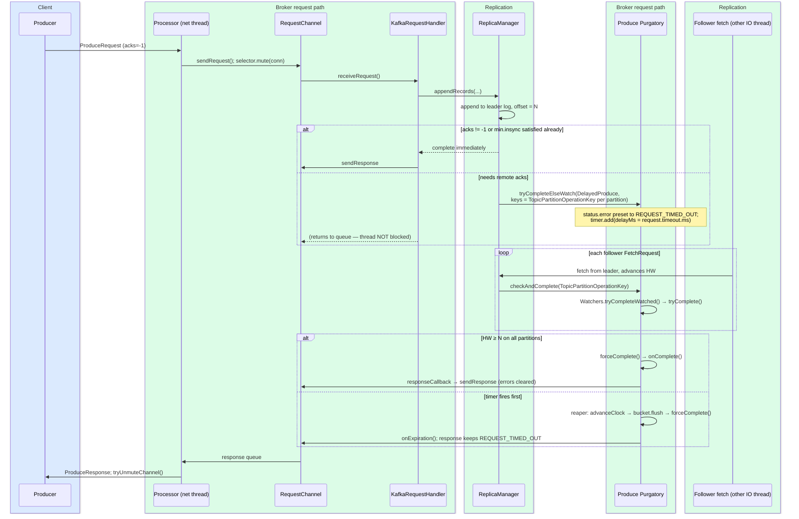

**What to notice**

- **`DelayedProduce` pre-sets every partition's error to `REQUEST_TIMED_OUT`** in its constructor and clears it on success (`DelayedProduce.java:107–113`). Expiry therefore needs no extra work — the response is already correct.
- **Completion is event-driven, not polled.** Follower fetches call `checkAndComplete` on the exact `TopicPartitionOperationKey`; only operations watching that key are re-checked.
- **The I/O thread is released before the wait.** `apiLocalCompleteTimeNanos` is stamped when `KafkaApis.handle()` returns; everything after is `RemoteTimeMs`.
- The timer is the **backstop**, not the mechanism. In a healthy cluster essentially every `DelayedProduce` completes via `tryComplete`, never via the reaper.

### 4.2 Long-poll fetch

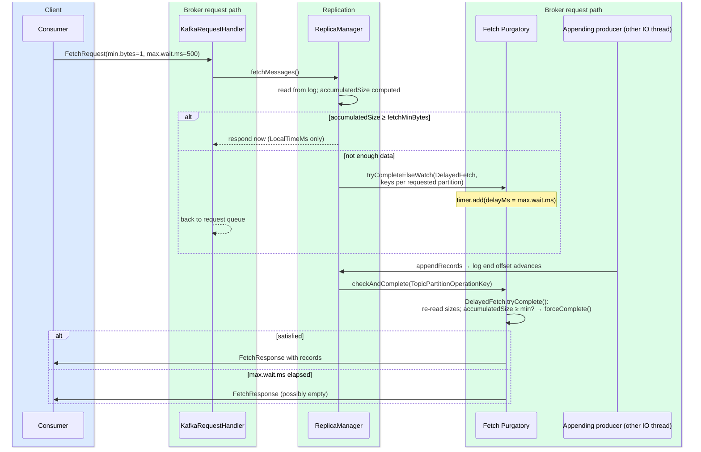

**What to notice**

- **An idle consumer group holds one purgatory entry per consumer, permanently.** `PurgatorySize{delayedOperation=Fetch}` roughly tracks *idle consumers + idle followers*, so a large steady-state value is normal and healthy — see §8.2 for how to read it.
- **`DelayedFetch.tryComplete` re-reads partition sizes** and short-circuits (`return forceComplete()`) on leadership change, log-start-offset moves, epoch mismatch, and offset-out-of-range — errors are delivered promptly rather than after `max.wait.ms`.
- Every replica fetch from a follower is *also* a long-poll fetch in the same purgatory; `num.replica.fetchers` × partitions contributes to the same counter.

### 4.3 Connection setup: TLS + SASL + ApiVersions

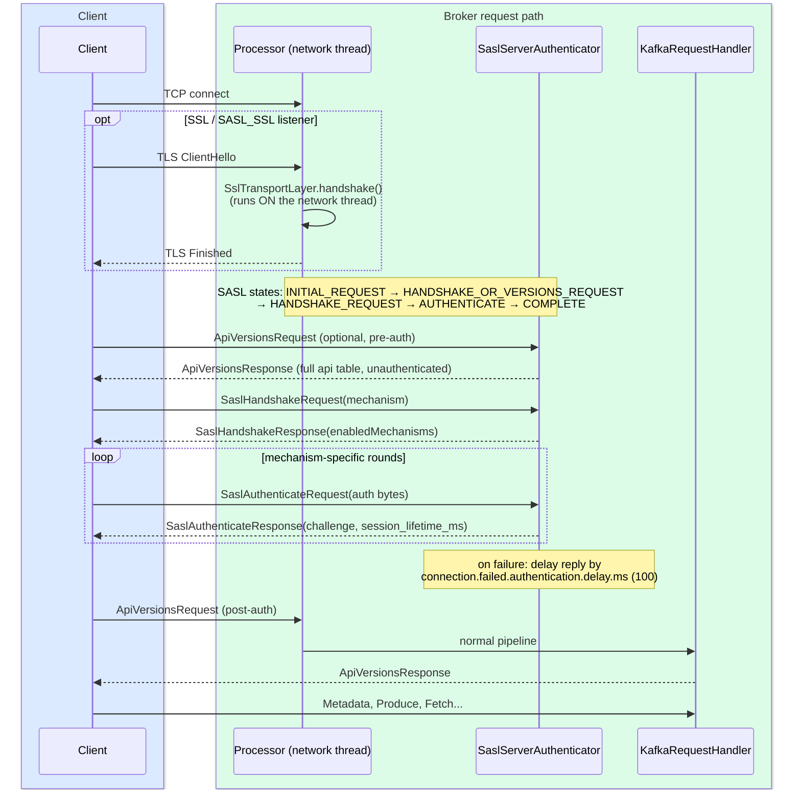

**What to notice**

- **TLS handshakes and SASL rounds run on the `Processor` (network) thread.** They never reach the request queue or an I/O thread — which is precisely why a connection storm on a TLS listener starves *reads for every other connection on that processor*.
- **`ApiVersions` is answered before authentication** and deliberately returns the broker's full API table (`KafkaApis.handleApiVersionsRequest` documents this as accepted information leakage; use `ssl.client.auth=required` if that matters).
- **`SaslAuthenticate` v1+ carries `session_lifetime_ms`** — the basis of re-authentication (`connections.max.reauth.ms`, default `0` = disabled). With it enabled, an expired session is detected in `processCompletedReceives` and the connection is closed (`expired-connections-killed-count`).
- **Failed auth responses are deliberately delayed 100 ms** (`connection.failed.authentication.delay.ms`) to blunt credential brute-forcing.

### 4.4 Quota throttle in detail

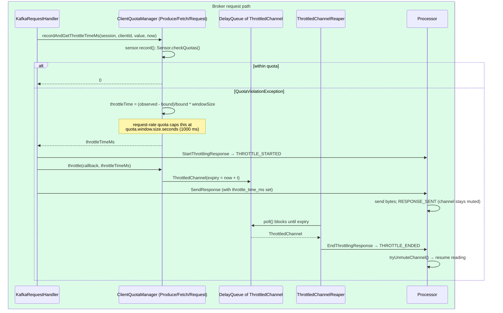

**What to notice**

- **The throttle formula is exact** (`QuotaUtils.throttleTime`): to bring observed rate `O` down to bound `T` over window `W`, delay `X = (O − T)/T × W`. It is *self-correcting*, not a fixed penalty.
- **`ThrottledChannelReaper` is one thread per quota type** (`Produce`, `Fetch`, `Request`, `ControllerMutation`) using a plain `DelayQueue` — throttles are few and coarse, so no timing wheel is needed here.
- **Delay is applied *after* recording**, so a single huge request can overshoot the quota and be paid back over subsequent windows. Bandwidth quotas are therefore average-rate, not burst-proof.
- **Nothing errors.** The client sees a successful response with a larger latency. This is the answer to "why does throttling appear as latency rather than errors" (§7.4).

---

## 5. The request lifecycle with timings — the practical table

Kafka publishes seven histograms per API key under
`kafka.network:type=RequestMetrics,name=<Metric>,request=<ApiKey>`.
The formulas below are read verbatim from `RequestChannel.scala:213–220`.

```
startTimeNanos ──► requestDequeueTimeNanos ──► apiLocalCompleteTimeNanos ──► responseCompleteTimeNanos ──► responseDequeueTimeNanos ──► endTimeNanos
                │                            │                             │                              │                            │
                └── RequestQueueTimeMs ──────┴── LocalTimeMs ──────────────┴── RemoteTimeMs ──────────────┴── ResponseQueueTimeMs ─────┴── ResponseSendTimeMs
                                                                    ThrottleTimeMs is recorded separately (apiThrottleTimeMs)
TotalTimeMs = endTimeNanos − startTimeNanos
```

| Phase (JMX `name=`) | Measured as | What it actually means | **When this phase dominates, the real problem is…** |
|---|---|---|---|
| `RequestQueueTimeMs` | `requestDequeue − start` | Time sitting in the 500-slot `requestQueue` waiting for a free I/O thread | **I/O threads are saturated.** Check `RequestHandlerAvgIdlePercent` (< 0.3 = starved). Cause is usually slow disk on produce, or too few `num.io.threads`. Raising `queued.max.requests` makes it *worse* (deeper queue, same service rate) — raise `num.io.threads` or fix the disk |
| `LocalTimeMs` | `apiLocalComplete − requestDequeue` | The I/O thread doing actual work: log append/`fsync`, index lookups, page-cache reads, decompression, **message-format conversion**, `StandardAuthorizer` lookups, metadata-cache reads | **Disk or CPU on this broker.** Correlate with `MessageConversionsTimeMs` (down-conversion for old clients — always fixable by upgrading clients) and `TemporaryMemoryBytes`. Watch for `log.flush.interval.messages` forcing sync flushes, or a lock-contended partition |
| `RemoteTimeMs` | `responseComplete − apiLocalComplete` | Time parked in **purgatory** waiting on someone else | **Produce**: slow/lagging followers, or `min.insync.replicas` marginal → look at ISR shrink rate and follower `LocalTimeMs`. **Fetch**: usually *benign* — it is `fetch.max.wait.ms` on an idle topic. Judge by whether `RemoteTimeMs` ≈ `max.wait.ms` (benign) or is erratic (real) |
| `ThrottleTimeMs` | `apiThrottleTimeMs` | Quota-imposed delay before the channel is unmuted | **You hit a quota.** Which one: compare `Produce`/`Fetch` `byte-rate` vs `Request` `request-time` sensors, or `ControllerMutation` `tokens`. Note it is recorded but does *not* add to `LocalTimeMs`/`RemoteTimeMs` |
| `ResponseQueueTimeMs` | `responseDequeue − responseComplete` | Response built, waiting for its `Processor` to pick it up | **Network threads are saturated.** Check `NetworkProcessorAvgIdlePercent`. Classic causes: TLS encryption cost, too few `num.network.threads`, or one processor hosting a hot connection |
| `ResponseSendTimeMs` | `end − responseDequeue` | Actually writing bytes to the socket | **The client or the network.** A slow/paused consumer whose TCP receive window is closed, an undersized `socket.send.buffer.bytes`, cross-AZ/WAN latency, or a very large fetch response. Rarely a broker fault |
| `TotalTimeMs` | `end − start` | Sum of the above | The number your SLO is written against |

**How to use it in an incident** [inferred]: pull all seven percentiles for the one API key that regressed, find the phase whose *delta* explains the regression, and only then look at that phase's row. Looking at `TotalTimeMs` alone tells you nothing actionable.

Two companion metrics on the same MBean matter:

- **`MessageConversionsTimeMs`** — non-zero means a client is old enough to require record-format down-conversion. This is charged to `LocalTimeMs`, allocates heap, and defeats zero-copy on fetch.
- **`TemporaryMemoryBytes`** — bytes allocated for decompression/conversion during the request. Sustained high values on produce mean you are recompressing (broker `compression.type` ≠ producer's).

---

## 6. State machines

### 6.1 `KafkaChannel` mute state — the back-pressure automaton

From `KafkaChannel.java:84–113` [documented].

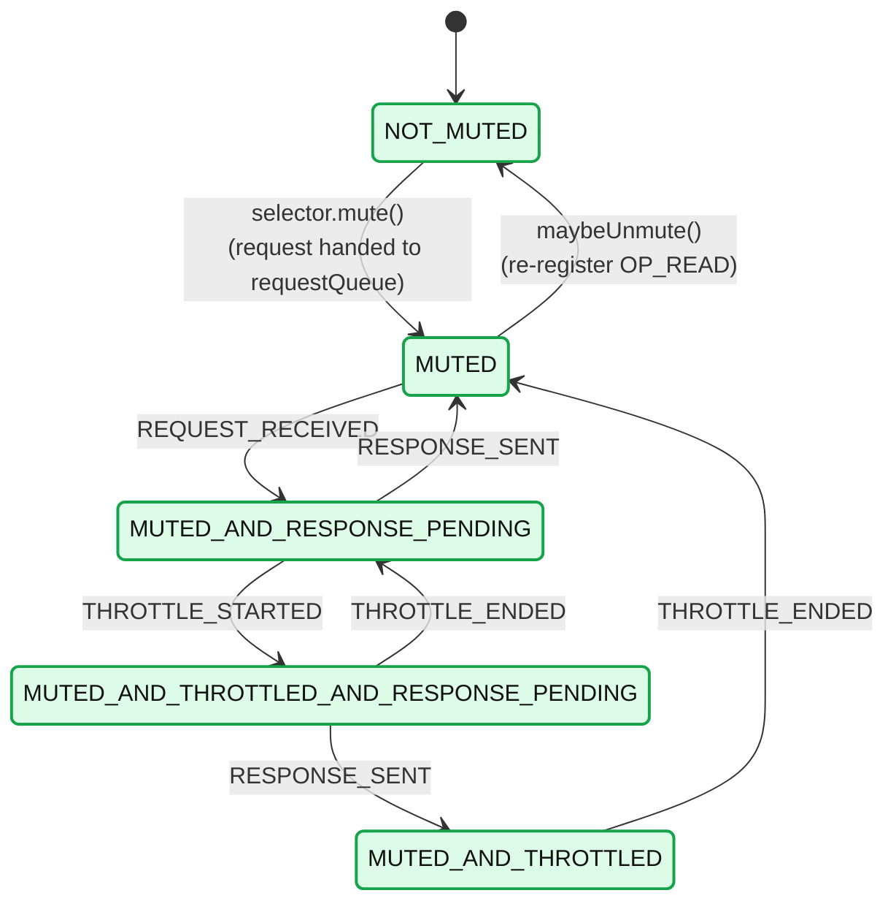

**What to notice**

- **`NOT_MUTED` is reachable only from `MUTED`.** Both the response *and* the throttle must have resolved; the two orderings (`THROTTLE_ENDED` first vs `RESPONSE_SENT` first) are why the diamond exists.
- **`acks=0` produce takes the `NoOpResponse` branch**: no bytes are sent, but the channel still transits `RESPONSE_SENT` so it can be unmuted and pipelined requests read.
- **The memory pool mutes at a different layer** (`Selector.outOfMemory`), tracked by `explicitlyMutedChannels` so pool recovery does not accidentally unmute a channel muted for throttling.

### 6.2 `DelayedOperation` lifecycle

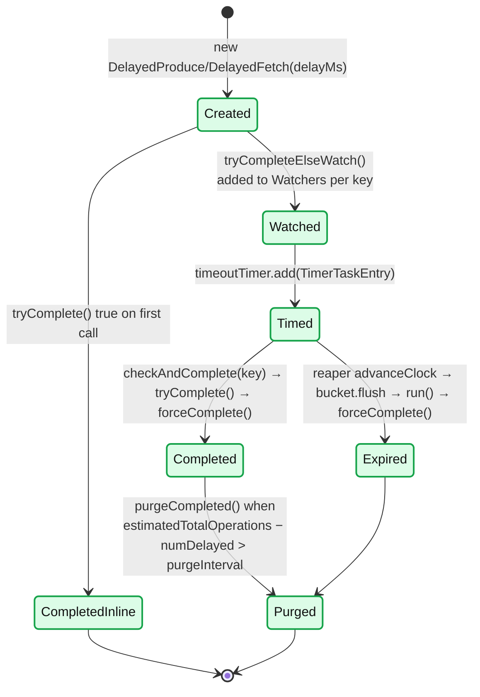

**What to notice**

- **`forceComplete()` is the single completion gate** and is CAS-like: it takes the operation's `ReentrantLock`, re-checks `completed`, cancels the timer entry, and calls `onComplete()` **exactly once**. Concurrent completers get `false`.
- **`tryComplete()` is a *predicate*; `forceComplete()` is the *action*.** Subclasses call `forceComplete()` from inside `tryComplete()` when the predicate holds.
- **"Completed" ≠ "removed".** A completed operation stays in its watcher lists until a purge sweeps it — this is why `PurgatorySize` > `NumDelayedOperations` normally.
- `safeTryCompleteOrElse` exists to avoid the classic deadlock: the purgatory documents that `checkAndComplete()` must be called *without* holding the caller's lock.

### 6.3 `SaslServerAuthenticator`

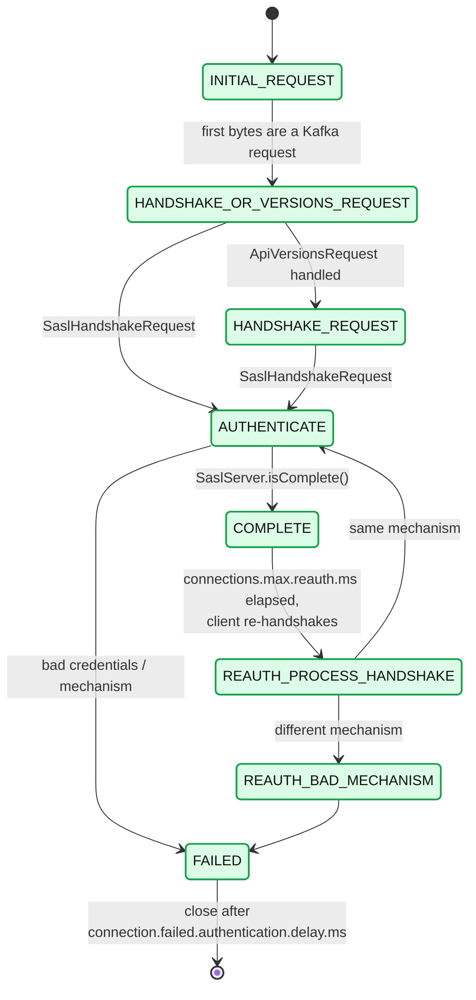

**What to notice**

- Re-authentication **rejoins the normal flow at `AUTHENTICATE`**, so mechanism-specific code is not duplicated.
- Switching mechanisms on re-auth is explicitly a failure (`REAUTH_BAD_MECHANISM`).
- All of this executes on the network thread; a slow OAuth token endpoint on the *client* side lengthens `AUTHENTICATE` and occupies a broker processor slot for the duration.

---

## 7. Component deep dives

### 7.1 `SocketServer`, `Acceptor`, `Processor`

**Responsibility** — own all sockets; frame requests; enforce connection limits; write responses. Never interpret request semantics.

**Structure** (4.3.1): the Scala `kafka.network.SocketServer` holds the runtime; a small Java `org.apache.kafka.network.SocketServer` holds constants and the reconfigurable-config sets. `SocketServerConfigs` holds every socket-layer config.

**Threading model**

| Thread | Count | Loop body |
|---|---|---|
| `Acceptor` (`data-plane-kafka-socket-acceptor-<listener>-<port>`) | 1 per listener | `acceptNewConnections()` (`nioSelector.select(500)`) then `closeThrottledConnections()` |
| `Processor` (`data-plane-kafka-network-thread-<id>-<listener>-<n>`) | `num.network.threads` **per listener** | `configureNewConnections` → `processNewResponses` → `poll(300ms)` → `processCompletedReceives` → `processCompletedSends` → `processDisconnected` → `closeExcessConnections` |
| `KafkaRequestHandler` (`data-plane-kafka-request-handler-<i>`) | `num.io.threads` | `receiveRequest(300)` → `KafkaApis.handle()` → `tryCompleteActions()` |

> **Sizing gotcha [documented]**: `num.network.threads` is **per listener**, not per broker. Three listeners at the default 3 = 9 processor threads plus 3 acceptors.

**Internal data structures**

- `newConnections`: `ArrayBlockingQueue<SocketChannel>(20)` per processor. `Processor.ConnectionQueueSize = 20` is a compile-time constant.
- `inflightResponses`: `Map[connectionId, Response]` — needed because metrics are updated on send *completion*, which may be a later poll.
- `explicitlyMutedChannels` (in `Selector`): distinguishes application-level mutes from memory-pressure mutes.
- `keysWithBufferedRead`: TLS-specific — decrypted bytes may already sit in the SSL buffer with no `OP_READ` event pending, so these keys are polled explicitly. Without this, TLS connections would stall.

**Poll timing**: `selector.poll(300)` normally; `poll(0)` when `newConnections` is non-empty so new connections are configured without a 300 ms delay.

**Failure handling**: `Processor.run` catches **all** `Throwable`s to avoid losing a network thread — a lost processor would silently orphan every connection assigned to it. Per-channel errors call `processChannelException`, which closes just that channel.

**Zero-copy and TLS** [documented, `PlaintextTransportLayer.java:213` vs `SslTransportLayer.java:1003`]:

- `PlaintextTransportLayer.transferFrom()` = `fileChannel.transferTo(position, count, socketChannel)` — a true `sendfile(2)`; log bytes go page cache → NIC without entering the JVM heap.
- `SslTransportLayer.transferFrom()` must `read()` file bytes into a buffer, encrypt through `SSLEngine.wrap`, and write ciphertext. **Enabling TLS removes zero-copy for fetch responses entirely** and converts fetch throughput from a page-cache-bound to a CPU-bound workload. This is the single largest performance consequence of the security section.

### 7.2 `RequestChannel` and `KafkaApis`

**`RequestChannel`** holds:
- `requestQueue: ArrayBlockingQueue[BaseRequest](queued.max.requests)` — **shared by all processors**.
- `callbackQueue: ArrayBlockingQueue[BaseRequest](queued.max.requests)` — for async handler continuations (`CallbackRequest`), so a handler that awaits a `CompletableFuture` (group coordinator, transaction coordinator) resumes on an I/O thread with correct timing accounting via `callbackRequestDequeueTimeNanos`.
- Five response types: `SendResponse`, `NoOpResponse`, `CloseConnectionResponse`, `StartThrottlingResponse`, `EndThrottlingResponse`.

**`sendRequest` uses `put()`, i.e. it blocks.** When the queue is full the network thread stops accepting new requests — the back-pressure origin (§8.1).

**`KafkaApis.handle`** is a single `match` on `request.header.apiKey` (≈90 arms in 4.3). Three dispatch shapes:

1. **Handled locally** — `PRODUCE`, `FETCH`, `METADATA`, `LIST_OFFSETS`, `OFFSET_COMMIT`, share-group APIs…
2. **`forwardToController(request)`** — every cluster-mutating admin API: `CREATE_TOPICS`, `DELETE_TOPICS`, `CREATE_PARTITIONS`, `CREATE_ACLS`, `DELETE_ACLS`, `ALTER_CLIENT_QUOTAS`, `ALTER_USER_SCRAM_CREDENTIALS`, `ALTER_PARTITION_REASSIGNMENTS`, `ELECT_LEADERS`, `UPDATE_FEATURES`, `ADD_RAFT_VOTER`, `REMOVE_RAFT_VOTER`. Wrapped in an `Envelope` carrying the original principal.
3. **Async, returning `CompletableFuture`** — group/share/streams coordinator APIs, chained `.exceptionally(handleError)`.

The `finally` block always runs `replicaManager.tryCompleteActions()` (draining the `DelayedActionQueue` so purgatory completions triggered by this request fire without holding locks) and stamps `apiLocalCompleteTimeNanos` if unset.

**API keys and versions worth knowing** (from `clients/src/main/resources/common/message/*.json`, 4.3.1):

| API | key | `validVersions` in 4.3 | Flexible from | Note |
|---|---|---|---|---|
| `Produce` | 0 | **3–13** | v9 | Min bumped to 3 (KIP-896 dropped pre-2.1 clients) |
| `Fetch` | 1 | **4–18** | v12 | v18 current; topic IDs from v13 |
| `ListOffsets` | 2 | 1–11 | v6 | |
| `Metadata` | 3 | 0–13 | v9 | |
| `ApiVersions` | 18 | **0–4** | v3 | v4 current; `< 4` gets the legacy response shape |
| `JoinGroup` | 11 | 0–9 | v6 | classic protocol; deprecated by KIP-1274 |
| `ConsumerGroupHeartbeat` | 68 | 0–1 | v0 | KIP-848 |
| `ShareFetch` | 78 | 1–2 | v0 | KIP-932 |

**API version negotiation** [documented]

- Every Java client sends `ApiVersions` as its first request after (re-)authentication and intersects the broker's `[minVersion, maxVersion]` per key with its own, choosing the highest common version per API.
- The **broker never negotiates downward mid-connection.** If a client sends a version the broker does not support, `parseRequestHeader` throws `InvalidRequestException` and the **connection is closed** with no error response.
- The **one exception** is `ApiVersions` itself: `handleApiVersionsRequest` checks `hasUnsupportedRequestVersion` and replies with `UNSUPPORTED_VERSION` **using v0 framing**, so a newer client can still discover an older broker. This bootstrap is the only reason cross-version clients work at all.
- **`api.version.request` is a librdkafka config, not a Java one** (with `api.version.fallback.ms` and `broker.version.fallback`). Setting it `false` makes librdkafka assume a version from `broker.version.fallback` rather than asking — a legacy escape hatch that is a common source of "works in Java, fails in Python/Go" incidents.
- **KIP-511**: the `ApiVersions` request carries `clientSoftwareName`/`clientSoftwareVersion`, intercepted on the **network thread** (`SocketServer.scala:1031`) and attached to `ClientInformation`. It surfaces in `DeprecatedRequestsPerSec` tags — the correct way to find old clients before an upgrade.

### 7.3 The purgatory

**Responsibility** — hold operations that cannot complete now, complete them when their precondition becomes true, and expire them on timeout — all without a thread per operation.

**The six purgatories on a broker** (`ReplicaManager.scala:184–207`) [documented]:

| Name | Operation | Purge interval config | Default |
|---|---|---|---|
| `Produce` | `DelayedProduce` | `producer.purgatory.purge.interval.requests` | 1000 |
| `Fetch` | `DelayedFetch` | `fetch.purgatory.purge.interval.requests` | 1000 |
| `DeleteRecords` | `DelayedDeleteRecords` | `delete.records.purgatory.purge.interval.requests` | **1** |
| `RemoteFetch` | `DelayedRemoteFetch` | *(hard-coded 0)* | 0 — purge every sweep, because each op pins a `RemoteLogReadResult` up to `fetch.max.bytes` |
| `RemoteListOffsets` | `DelayedRemoteListOffsets` | *(default ctor)* | 1000 |
| `ShareFetch` | `DelayedShareFetch` | `share.fetch.purgatory.purge.interval.requests` | 1000 |

Plus `DelayedFuturePurgatory`, used for `AlterReplicaLogDirs`.

#### Architecture

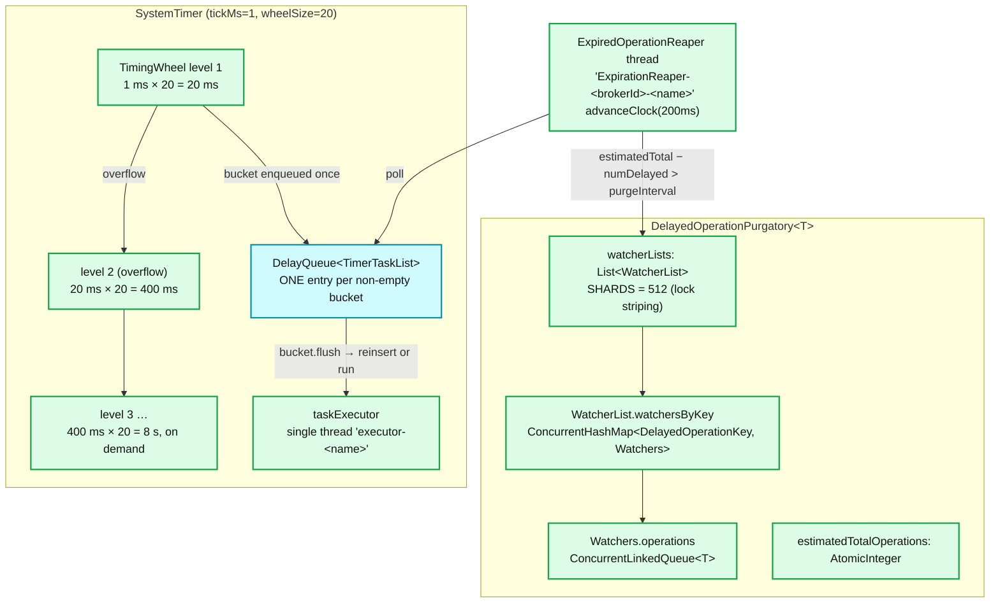

**What to notice**

- **512 watcher shards** exist purely for lock striping (`watcherList(key) = watcherLists[abs(key.hashCode) % 512]`); each shard has its own `ReentrantLock`.
- **The `DelayQueue` holds *buckets*, not tasks.** With `wheelSize=20`, at most 20 entries per level are ever in the `DelayQueue` — so the `O(log n)` `DelayQueue` cost is paid on ~60 buckets, not on 500k operations. This is the whole trick.
- **`taskCounter` is shared across all wheel levels**, so `NumDelayedOperations` is a single atomic read.
- **The reaper does double duty**: advance the clock *and* decide whether to purge completed-but-still-watched entries.

#### Why the timing wheel beats a `DelayQueue` of N operations

| | `DelayQueue`/`java.util.Timer` (priority queue) | Hierarchical timing wheel |
|---|---|---|
| Insert (start-timer) | `O(log N)` in the number of *operations* | **`O(1)`** into the bucket (`O(m)` including overflow-wheel hops, `m` ≈ 3) |
| Delete / cancel | `O(log N)` | **`O(1)`** — `TimerTaskEntry` is a node in a doubly-linked `TimerTaskList`, unlinked in place |
| Expiry scan | Per-item | Per-**bucket**: one `DelayQueue` entry covers a whole time range |
| Range | Unbounded | `tickMs × wheelSize` per level; overflow wheels created **on demand** |

At 500k in-flight fetches, `log₂(500000) ≈ 19` comparisons *per insert and per cancel* versus a constant array index — and the overwhelmingly common case in Kafka is **cancel before expiry** (`forceComplete()` calls `cancel()`), which is exactly where the wheel's `O(1)` delete wins hardest. The class doc states this explicitly: *"works especially well when operations are completed before they time out."*

Concrete geometry with `tickMs=1, wheelSize=20`: level 1 covers 0–20 ms, level 2 up to 400 ms, level 3 up to 8 s, level 4 up to 160 s. A 30 s `request.timeout.ms` produce lands in level 4 and is cascaded down as time advances.

#### `tryComplete` vs `forceComplete`

- **`tryComplete()`** — subclass predicate. Cheap, may be called many times, must be side-effect-free until it decides to complete. Called from `tryCompleteElseWatch` (once, optimistically) and from `checkAndComplete(key)` (every time a watched key sees an event).
- **`forceComplete()`** — the one-shot action. Sets `completed`, **cancels the timer entry**, and invokes `onComplete()`. Idempotent across threads by construction.
- **`onExpiration()`** — extra hook run only on the timeout path (e.g. bumping `ExpiresPerSec`).

#### The purge mechanism, and why it exists

A completed operation is removed from the *timer* immediately (`cancel()`) but remains in every `Watchers` queue it was added to. The reaper sweeps when:

```
estimatedTotalOperations − numDelayed() > purgeInterval
```

`estimatedTotalOperations` counts operations ever watched; `numDelayed()` is the live timer count. Their difference approximates "completed but still referenced". Left unswept, those references pin request/response objects and leak heap. This is why `RemoteFetch` uses `purgeInterval = 0` — each entry can pin up to `fetch.max.bytes` of tiered-storage read result.

#### Reading purgatory metrics

`kafka.server:type=DelayedOperationPurgatory,name=PurgatorySize,delayedOperation=<Produce|Fetch|…>` and `name=NumDelayedOperations`.

- **`NumDelayedOperations`** = genuinely pending (timer count). This is the real signal.
- **`PurgatorySize`** = total watcher-list entries, ≥ `NumDelayedOperations`, inflated by completed-not-yet-purged entries and by operations watching multiple partitions (one entry *per key*).
- **`PurgatorySize{Fetch}` is legitimately large** — it is roughly (idle consumers + follower fetchers) × partitions-per-fetch. Alert on *rate of change*, not absolute value.
- **`PurgatorySize{Produce}` should be near zero in a healthy cluster.** It is the best leading indicator you have: it rises the instant followers stop keeping up, *before* ISR shrinks and *before* producers time out. A rising Produce purgatory with flat `LocalTimeMs` means the problem is on the followers, not this broker.
- `kafka.server:type=DelayedProduceMetrics,name=ExpiresPerSec` — non-zero means requests are timing out rather than completing; correlate with `UnderReplicatedPartitions`.

### 7.4 Quotas

Four `ClientQuotaManager` instances per broker (`QuotaFactory.QuotaManagers`): `Produce`, `Fetch`, `Request`, `ControllerMutation`, plus `LeaderReplication`, `FollowerReplication`, `AlterLogDirsReplication`, and (with tiered storage) `RLMCopy`/`RLMFetch`.

#### Quota entity hierarchy

Quotas are configured on `ClientQuotaEntity` combinations, stored as **metadata records** in KRaft (`ClientQuotaRecord`) and applied by `ClientQuotaMetadataManager`. Precedence, most to least specific:

1. `/config/users/<user>/clients/<client-id>`
2. `/config/users/<user>/clients/<default>`
3. `/config/users/<user>`
4. `/config/users/<default>/clients/<client-id>`
5. `/config/users/<default>/clients/<default>`
6. `/config/users/<default>`
7. `/config/clients/<client-id>`
8. `/config/clients/<default>`

**The first match wins outright** — quotas do not compose or sum. `<default>` is a literal sentinel entity (`DEFAULT_USER_ENTITY`, `DEFAULT_USER_CLIENT_ID`). `quotaTypesEnabled` is a bitmask (`CLIENT_ID_QUOTA_ENABLED=1`, `USER_QUOTA_ENABLED=2`, `USER_CLIENT_ID_QUOTA_ENABLED=4`, `CUSTOM_QUOTAS=8`) used to skip metric lookups when no quota of a shape is configured — a real hot-path optimisation.

#### The four client quota types

| Type | Config key | Metric | Measurable | Throttle formula | Cap |
|---|---|---|---|---|---|
| Produce bandwidth | `producer_byte_rate` | `Produce:byte-rate` | `Rate` (sampled) | `(O−T)/T × W` | none |
| Fetch bandwidth | `consumer_byte_rate` | `Fetch:byte-rate` | `Rate` | `(O−T)/T × W` | none |
| Request rate (KIP-124) | `request_percentage` | `Request:request-time` | `Rate` | `(O−T)/T × W` | **`quota.window.size.seconds` (1 s)** via `boundedThrottleTime` |
| Controller mutation (KIP-599) | `controller_mutation_rate` | `ControllerMutation:tokens` + `mutation-rate` | **`TokenBucket`** | `−value / bound × 1000` | none |

All four default to effectively unlimited (`Long.MAX_VALUE` for byte rates, `Integer.MAX_VALUE` as a double for the two rate quotas).

**Sampled-rate implementation.** `Rate` keeps `quota.window.num = 11` samples of `quota.window.size.seconds = 1` each — an ~10-second sliding window (the 11th is the partially-filled current sample). `Sensor.checkQuotas()` throws `QuotaViolationException` carrying observed value, bound, and metric; `QuotaUtils.throttleTime` derives the delay. A larger `quota.window.num` smooths bursts but lengthens the memory of a violation; a larger `quota.window.size.seconds` makes enforcement coarser and burstier.

**Request-rate quota semantics** (`ClientRequestQuotaManager`): the quota unit is **percent of one thread-second**, i.e. `NANOS_TO_PERCENTAGE_PER_SECOND = 100.0 / 1e9`. `request_percentage = 200` means two full threads' worth of processing time. What is charged:

- `request.requestThreadTimeNanos()` = `apiLocalCompleteTimeNanos − requestDequeueTimeNanos` — **I/O-thread time only**.
- Plus, via `setRecordNetworkThreadTimeCallback`, the **network-thread time** for that request, recorded when the send completes.
- **Not** purgatory wait time — a long-poll fetch costs almost nothing against a request quota, which is exactly right.
- **Exempt requests** (inter-broker, controller traffic; anything sent via `sendResponseExemptThrottle`) are recorded to a separate `exempt-request-time` sensor and never throttled. This is why a request quota cannot accidentally strangle replication.

**Controller mutation quota (KIP-599)** is the odd one out and deliberately so: topic creation/deletion is bursty and expensive, so a **token bucket** (allowing a genuine burst up to the accumulated tokens, then hard-limiting) fits better than a sampled rate. Rate is accumulated by **number of partitions created or deleted**, not number of requests. Two enforcement flavours exist:

- `StrictControllerMutationQuota` — rejects with `THROTTLING_QUOTA_EXCEEDED` once exhausted. Used when `header.apiVersion() >= strictSinceVersion` (the client is new enough to understand the error and retry sanely).
- `PermissiveControllerMutationQuota` — accepts the mutation but reports throttle time. Used for older clients that would treat the error as fatal.

#### Why throttling appears as latency, not errors

Three reinforcing reasons:

1. **The broker's own mechanism is a delay, not a rejection** — `throttle()` schedules a `ThrottledChannel` and mutes the socket. There is no error code in the response for bandwidth or request-rate quotas.
2. **Errors would amplify.** A throttled client that receives an error retries, adding *more* load exactly when the broker is overloaded. A throttled client that receives a slow success naturally slows down — the control loop is stable.
3. **`throttle_time_ms` (KIP-219) makes clients self-throttle**, so the broker's channel mute is only needed for old clients. The client-side sensors `produce-throttle-time-avg`/`fetch-throttle-time-avg` are where the truth lives.

**Diagnosing**: broker-side `kafka.server:type={Produce,Fetch,Request},name=throttle-time,user=…,client-id=…` and `byte-rate`/`request-time`. `ThrottleTimeMs` on `RequestMetrics` tells you *that* you were throttled; the per-client sensors tell you *which quota*.

#### Replication quotas — and how they differ

`ReplicationQuotaManager` (`QuotaType.LEADER_REPLICATION` / `FOLLOWER_REPLICATION` / `ALTER_LOG_DIRS_REPLICATION`) is a **different mechanism**, not a variant:

| | Client quotas | Replication quotas |
|---|---|---|
| Interface | `maybeRecordAndGetThrottleTimeMs → int` | **`isQuotaExceeded(): boolean`** + `record(long)` |
| Rate stat | `Rate` (or `TokenBucket`) | **`SimpleRate`** |
| Enforcement | Delay response, mute channel, report `throttle_time_ms` | **Fetcher omits throttled partitions from the next fetch** |
| Scope | per user / client-id | per broker, per direction, over an explicitly enumerated partition set |
| Selection | implicit (whoever sends) | explicit: `leader.replication.throttled.replicas` / `follower.replication.throttled.replicas` (list of `partition:brokerId`, or `*`) |
| Configured on | `users`/`clients` entities | **broker configs** `leader.replication.throttled.rate` / `follower.replication.throttled.rate` |
| Default | unlimited | unlimited (`Long.MAX_VALUE`) |
| Windows | `quota.window.num=11`, `quota.window.size.seconds=1` | `replication.quota.window.num=11`, `replication.quota.window.size.seconds=1` |

**Why the difference matters**: a replication fetch cannot be "delayed and retried" the way a client request can without stalling ISR progress and risking spurious ISR shrink. Instead, `record()` *always* accepts the bytes (it deliberately ignores the quota when recording) and the *next* fetch simply skips throttled partitions. Replication throttling degrades reassignment speed, never correctness. Sensor expiry is also longer: `ReplicationQuotaManagerConfig.INACTIVE_SENSOR_EXPIRATION_TIME_SECONDS = 3600`.

**Operational trap** [inferred]: replication throttles set during a partition reassignment are *not* removed automatically if the reassignment is cancelled or the tooling dies. A cluster that "can never catch up on replication" months later is very often carrying stale `*.replication.throttled.rate` and `*.throttled.replicas` configs.

### 7.5 Security

#### Listeners

| Config | Default | Meaning |
|---|---|---|
| `listeners` | `PLAINTEXT://:9092` | Sockets the broker binds |
| `advertised.listeners` | `null` → falls back to `listeners` | What is published in metadata records and returned in `MetadataResponse`. **Must be resolvable by clients**, which is why it differs from `listeners` behind NAT/k8s |
| `listener.security.protocol.map` | identity map of all `SecurityProtocol` values: `PLAINTEXT:PLAINTEXT,SSL:SSL,SASL_PLAINTEXT:SASL_PLAINTEXT,SASL_SSL:SASL_SSL` | Maps arbitrary listener *names* to protocols, enabling e.g. `INTERNAL:SSL,EXTERNAL:SSL` on two ports |
| `inter.broker.listener.name` | `null` (then `security.inter.broker.protocol`, default `PLAINTEXT`) | Which listener replication and inter-broker RPCs use. Mutually exclusive with `security.inter.broker.protocol` |
| `controller.listener.names` | *(required in KRaft)* | Listener(s) for the controller quorum. Defaults to `PLAINTEXT` in the protocol map if unmapped |

Per-listener config overrides use the lowercased listener prefix: `listener.name.internal.ssl.keystore.location`, `listener.name.sasl_ssl.oauthbearer.sasl.jaas.config`, etc.

**The `isPrivilegedListener` flag** on `RequestContext` marks the inter-broker listener; some APIs (e.g. forwarded envelopes) are only honoured there.

#### TLS

- Handshake runs on the network thread (§4.3) — the starvation vector in §8.3.
- `ssl.client.auth` default **`none`**; `required` gives mTLS and moves authentication before any Kafka protocol byte.
- `principal.builder.class` default `DefaultKafkaPrincipalBuilder`; `ssl.principal.mapping.rules` maps X.509 DNs to principal names.
- `ssl.allow.dn.changes` / `ssl.allow.san.changes` both default `false` — a certificate rotation that changes DN/SAN is rejected as a reconfiguration unless explicitly permitted.
- **Zero-copy loss** (§7.1) is the dominant cost, not the handshake, at steady state.

#### SASL

`sasl.enabled.mechanisms` defaults to **`[GSSAPI]`** only. Mechanisms:

| Mechanism | Credential | Where secrets live | Notes |
|---|---|---|---|
| `PLAIN` | username/password | broker JAAS file (static) or custom callback handler | Only safe over `SASL_SSL`; no rotation without restart unless you supply a callback handler |
| `SCRAM-SHA-256` / `SCRAM-SHA-512` | salted challenge-response | **KRaft metadata records** (`UserScramCredentialRecord`), managed via `AlterUserScramCredentials` | Password never crosses the wire; rotatable at runtime |
| `GSSAPI` | Kerberos | KDC + keytab | `sasl.kerberos.principal.to.local.rules` maps principals |
| `OAUTHBEARER` | JWT | external IdP | JWKS validation on the broker; see below |

`sasl.server.max.receive.size` = **524288** (512 KiB) bounds pre-auth receives — an unauthenticated client cannot make the broker buffer 100 MiB.

**Re-authentication**: `connections.max.reauth.ms` default **`0`** (disabled). Set positive and the broker sends `session_lifetime_ms` in `SaslAuthenticateResponse` v1+; a connection not re-authenticated in time is closed on next use. Essential for OAUTHBEARER, where the whole point is short-lived tokens; without it, a connection authenticated with a 5-minute token stays valid forever.

#### OAUTHBEARER and KIP-1258 (new in 4.3)

Kafka's OAuth client obtains a token from `sasl.oauthbearer.token.endpoint.url` using the `client_credentials` grant. Historically the *client* authenticated to the IdP with a long-lived `client_id`/`client_secret`. KIP-1139 (**4.1**) added the `urn:ietf:params:oauth:grant-type:jwt-bearer` grant (`JwtBearerJwtRetriever`); **KIP-1258 (4.3)** wires client assertions into the `client_credentials` grant, per RFC 7523 §2.2.

The token request becomes (`ClientAssertionRequestFormatter`) [documented, source-verified]:

```
Content-Type: application/x-www-form-urlencoded
client_assertion_type=urn:ietf:params:oauth:client-assertion-type:jwt-bearer
client_assertion=<signed JWT>
grant_type=client_credentials
```

`ClientCredentialsRequestFormatterFactory.create()` implements an explicit **three-tier preference**:

1. **File-based assertion** — if `sasl.oauthbearer.assertion.file` is set, read a pre-minted JWT from disk (typically projected by a workload-identity sidecar).
2. **Locally generated assertion** — else if `sasl.oauthbearer.assertion.claim.iss` is set, sign a JWT in-process with `sasl.oauthbearer.assertion.private.key.file`.
3. **Client secret** — else fall back to `client_id`/`client_secret`.

If both (1) and (2) are configured, the file wins and a warning is logged.

| Config | Default |
|---|---|
| `sasl.oauthbearer.assertion.algorithm` | `RS256` (also `ES256`) |
| `sasl.oauthbearer.assertion.claim.exp.seconds` | `300` |
| `sasl.oauthbearer.assertion.claim.nbf.seconds` | `60` |
| `sasl.oauthbearer.assertion.claim.jti.include` | `false` |
| `sasl.oauthbearer.assertion.file` / `.template.file` / `.private.key.file` / `.private.key.passphrase` / `.claim.iss` / `.claim.sub` / `.claim.aud` | *(unset)* |
| `org.apache.kafka.sasl.oauthbearer.allowed.urls` / `.allowed.files` | `""` — **allowlists; must be set** or URL/file-based OAuth config is rejected |

**Why it matters** [inferred]: it removes the last long-lived shared secret from Kafka client configuration. A pod with a workload-identity-projected key file authenticates with 5-minute assertions and nothing durable to leak.

#### Delegation tokens

For frameworks that fan work out to many short-lived tasks (Spark, Flink) without distributing Kerberos keytabs. A client authenticates once, calls `CreateDelegationToken`, and ships the token to workers, which authenticate via `SCRAM-SHA-256`/`512` using the token HMAC.

| Config | Default |
|---|---|
| `delegation.token.secret.key` | *(unset; required to enable)* |
| `delegation.token.max.lifetime.ms` | `604800000` (7 days) |
| `delegation.token.expiry.time.ms` | `86400000` (24 h) |
| `delegation.token.expiry.check.interval.ms` | `3600000` (1 h) |

`KafkaApis` explicitly guards `CREATE/RENEW/EXPIRE_DELEGATION_TOKEN` so a connection authenticated *with* a delegation token cannot mint further tokens — no privilege chaining.

#### Authorization: `StandardAuthorizer`

**`AclAuthorizer` no longer exists** — removed in 4.0 with ZooKeeper. In KRaft, ACLs are **metadata records** (`AccessControlEntryRecord` / `RemoveAccessControlEntryRecord`) in `__cluster_metadata`, replicated to every broker and materialised into `StandardAuthorizerData`. Consequences: ACL changes propagate at metadata-log speed, every broker has a full local copy, and `authorize()` is a pure in-memory operation on the request path.

`authorizer.class.name` default **`""`** (no authorizer — everything allowed). Set to `org.apache.kafka.metadata.authorizer.StandardAuthorizer` to enable.

**The ACL index and prefix matching** — the clever part:

`aclsByResource` is a `NavigableSet<StandardAcl>` sorted by **resource type, then REVERSE resource name**. To authorize topic `foobar`:

```
1. TOPIC rn=gar    PREFIX
2. TOPIC rn=foobar PREFIX   ← tailSet starts here
3. TOPIC rn=foob   LITERAL
4. TOPIC rn=foo    PREFIX
5. TOPIC rn=fb     PREFIX   ← diverges; jump…
7. TOPIC rn=f      PREFIX   ← …to here
8. TOPIC rn=eeee   LITERAL  ← stop
```

Reverse-name ordering places every prefix of `foobar` **contiguously after** it. The scan walks forward while names remain prefixes; on divergence (`matchesUpTo`) it re-seeks a new `tailSet` at the divergence point rather than scanning the whole type section. Result: prefixed-ACL evaluation costs `O(log n + matching prefixes)`, not `O(n)`. A second pass handles the wildcard bucket (stored as `LITERAL` name `*`).

**Evaluation order**:
1. `super.users` → immediate `ALLOWED` (`SuperUserRule`). Semicolon-separated `User:CN=...;User:admin` — **semicolons, not commas**, because DNs contain commas.
2. Any matching `DENY` → `DENIED` (deny always wins; checked before the wildcard pass short-circuits).
3. Any matching `ALLOW` → `ALLOWED`.
4. No match → `defaultResult`, which is `ALLOWED` iff `allow.everyone.if.no.acl.found=true`, else **`DENIED`** (the default).

**Resource pattern types**: `LITERAL` (exact, or `*` for all), `PREFIXED` (KIP-290), `MATCH`/`ANY` (query-only, for `DescribeAcls`).

**Metrics** (KIP-1078 style plugin metrics): `authorization-allowed-rate-per-minute`, `authorization-denied-rate-per-minute`, `authorization-request-rate-per-minute`. The denied rate is the alertable one — a spike means a misconfigured client, and each denial still costs a full `LocalTimeMs` scan.

**Startup ordering** [documented]: `StandardAuthorizer` exposes `initialLoadFuture`, completed once ACLs are loaded to the initial high watermark. `early.start.listeners` controls which listeners may serve before that — without care, a broker could briefly authorize against an empty ACL set. This is a real fail-open window worth understanding.

---

## 8. Failure modes

| # | Failure | Symptom / detection | Mechanism | Recovery | Blast radius |
|---|---|---|---|---|---|
| 1 | **Request-queue saturation** | `RequestQueueSize` pinned at `queued.max.requests` (500); `RequestQueueTimeMs` p99 ≫ `LocalTimeMs`; `RequestHandlerAvgIdlePercent` → 0 | I/O threads cannot drain; `sendRequest` uses `put()` so network threads block; TCP windows close | Add `num.io.threads` (dynamic, `resizeThreadPool`); fix the underlying slow disk/CPU. **Do not raise `queued.max.requests`** — deeper queue, same drain rate, worse latency | Whole broker: every client on it, plus follower fetches → ISR shrink → cluster-wide |
| 2 | **Purgatory explosion (Produce)** | `PurgatorySize{Produce}` and `NumDelayedOperations{Produce}` climbing; `RemoteTimeMs{Produce}` rising; `DelayedProduceMetrics:ExpiresPerSec` > 0 | Followers not fetching fast enough to advance HW; every `acks=all` produce parks | Fix follower lag (network, disk, `num.replica.fetchers`); heap pressure from pinned request objects is secondary. Purge intervals don't help — those are for *completed* ops | Producers on all leader partitions of this broker; timeouts at `request.timeout.ms` |
| 3 | **Purgatory heap growth (RemoteFetch)** | Old-gen growth correlated with tiered-storage fetches | Each `DelayedRemoteFetch` pins a `RemoteLogReadResult` sized up to the broker's `fetch.max.bytes` (default 55 MiB; the in-code comment saying "50 MB" is stale) | Already mitigated by hard-coded `purgeInterval = 0`; if still growing, reduce `fetch.max.bytes` or remote-read concurrency | Broker heap → GC pauses → everything |
| 4 | **Network-thread starvation from TLS handshakes** | `NetworkProcessorAvgIdlePercent` → 0 while `RequestHandlerAvgIdlePercent` stays high; `ResponseQueueTimeMs` and `ResponseSendTimeMs` rise; `connection-creation-rate` spike | Handshakes run **on** the processor loop; a reconnect storm makes one processor spend its whole poll cycle on RSA/ECDHE | Raise `num.network.threads`; set `max.connection.creation.rate`; find the flapping client (`connection-close-rate`, KIP-511 client tags). Prefer ECDSA certs and TLS session resumption | Every connection assigned to the affected processor(s) |
| 5 | **Connection storm / exhaustion** | `connection-count` at `max.connections`; `AcceptorBlockedPercent` > 0; clients see connection refused/reset | Acceptor blocks in `ConnectionQuotas.inc → waitForConnectionSlot`; per-IP limit throws `TooManyConnectionsException` (immediate close); rate limit throws `ConnectionThrottledException` (**delayed** close via `throttledSockets`) | Set `max.connections.per.ip`, `max.connections.per.ip.overrides`, `max.connection.creation.rate` (all **dynamically reconfigurable**, no restart); per-IP `connection_creation_rate` quota for finer control | Listener-wide; can lock out healthy clients since limits are not per-tenant |
| 6 | **Quota-induced latency cliff** | `ThrottleTimeMs` jumps from 0 to hundreds of ms; client `produce-throttle-time-avg` spikes; **no error rate change** | Sampled `Rate` over 11×1 s windows: a burst that fits in one window can push observed rate far above bound, and `(O−T)/T × W` scales the delay proportionally | Raise the quota, or smooth the client (`linger.ms`, `batch.size`). Increasing `quota.window.num` smooths but lengthens the penalty memory | Only the offending user/client-id — quotas are the one mechanism here with *bounded* blast radius, which is the point |
| 7 | **`ApiVersions` mismatch** | Client cannot connect; broker log `InvalidRequestException: Received request for disabled api with key N and version V`; connection closed with no response | `parseRequestHeader` rejects out-of-range versions at the network layer, before the request queue | Upgrade the client. Kafka 4.x dropped support for clients older than 2.1 (`Produce` min v3, `Fetch` min v4). For librdkafka, check `api.version.request=true` and remove `broker.version.fallback` | Per-client; looks like a network fault, which is why it burns hours |
| 8 | **Memory-pool exhaustion** | `MemoryPoolAvailable` → 0; `MemoryPoolAvgDepletedPercent` > 0; throughput collapses across all connections at once | `queued.max.request.bytes` reached → `Selector` mutes **every** channel until pressure clears | Raise the limit or leave it at `-1`. It is a last-resort OOM guard, not a throughput control | Whole broker, instantly and globally — hence off by default |
| 9 | **Authorizer fail-open at startup** | Brief window of unauthorized access after broker restart | ACLs load asynchronously from the metadata log; `initialLoadFuture` not yet complete | Keep client-facing listeners out of `early.start.listeners`; do not add them for faster startup | Security exposure, seconds-scale |
| 10 | **Stale replication throttles** | Reassignments never finish; `LeaderReplication`/`FollowerReplication` `byte-rate` pinned at bound | `leader.replication.throttled.rate` + `*.throttled.replicas` left behind by a cancelled reassignment | `kafka-configs --alter --delete-config` on both broker and topic configs | Replication only; silent for months |

---

## 9. Scalability and performance

**The bottleneck ladder** [inferred, but grounded in the metrics above] — in the order you actually hit them:

1. **I/O threads** (`num.io.threads`) — the first ceiling on almost every cluster. Watch `RequestHandlerAvgIdlePercent`; below ~0.3 you are starved. Dynamically resizable.
2. **Disk / page cache** — shows as `LocalTimeMs` on `Produce`. No thread count fixes this.
3. **Network threads** (`num.network.threads`) — the ceiling on TLS clusters and high-connection-count clusters. Watch `NetworkProcessorAvgIdlePercent`. Remember it is *per listener*.
4. **Followers** — shows as `RemoteTimeMs`/`PurgatorySize{Produce}`. Fixed on other machines.
5. **The single acceptor per listener** — only a ceiling during connection storms (`AcceptorBlockedPercent`).

**What batching buys**: the pipeline cost is largely *per request*, not per record. A producer with `linger.ms=5` and `batch.size=64KB` sending 10× fewer, larger requests uses roughly 10× less of every phase in §5 except `ResponseSendTimeMs`. This is why request-rate quotas (per-request cost) and bandwidth quotas (per-byte cost) both exist — they price different scarce resources.

**Back-pressure is end-to-end and needs no explicit protocol**: mute-on-receive → bounded request queue → blocking `put()` → network thread stops polling → OS receive buffer fills → TCP zero-window → producer's `send()` blocks on `buffer.memory`. Every layer is already flow-controlled; Kafka just declines to break the chain.

**Hot spots**

- **A single hot partition serialises on its leader's log lock** and cannot be spread across I/O threads. Partitioning is the only fix.
- **One processor can host a disproportionately hot connection.** Assignment is round-robin by *connection count*, not by traffic — a single fat consumer can dominate one processor while others idle. `IdlePercent` is tagged per processor (`networkProcessor=N`); comparing across tags exposes this.
- **`fetch.max.bytes = 55 MiB` (server default `fetch.max.bytes`)** bounds a single fetch response; `max.request.partition.size.limit = 2000` bounds partitions per request — both exist to stop one request monopolising a thread.
- **`max.incremental.fetch.session.cache.slots = 1000`** bounds incremental-fetch sessions per broker; beyond it, clients silently fall back to full fetches and per-request cost jumps.

---

## 10. Trade-offs and alternatives

| Decision | Alternative | Why Kafka chose this |
|---|---|---|
| Two thread pools joined by a bounded queue | Thread-per-connection; or one unified event loop | Thread-per-connection dies at 10k+ connections. A unified loop would let one slow disk append stall all socket I/O. The split lets each pool be sized for its own cost profile and made dynamically resizable |
| Purgatory + timing wheel | Thread-per-waiting-request; or a `DelayQueue` of operations | 500k in-flight long-polls is routine. `O(1)` insert/cancel and per-bucket expiry are what make it free. Cost: an extra indirection and a subtle "completed but watched" garbage class needing the purge sweep |
| Mute-one-request-per-connection | Allow N in-flight per connection | Bounds broker work per connection with zero protocol support and preserves per-connection ordering (which Kafka's idempotent producer depends on). Cost: a single connection cannot pipeline, so throughput per connection is latency-bound — mitigated by client-side batching |
| Throttle via delay, not error | Return `THROTTLING_QUOTA_EXCEEDED` | Errors trigger retries, which amplify overload. Delay is a stable control loop. Cost: throttling is invisible to naive dashboards, and clients that ignore `throttle_time_ms` still get muted |
| Token bucket for controller mutations, sampled rate for data | One mechanism for both | Topic creation is inherently bursty (a Streams app creating 50 changelogs at once); a sampled rate would either reject legitimate bursts or be set uselessly high |
| ACLs as metadata records with a reverse-sorted index | External policy service; or a ZK-watched cache | Authorization is on the hot path; a network hop per request is impossible. Full local replication + `O(log n)` prefix lookup keeps `LocalTimeMs` flat. Cost: ACL changes are eventually consistent, and there is a startup fail-open window |
| TLS terminated in-broker | Sidecar/L4 proxy termination | Preserves the client principal for authorization and delegation tokens. Cost: **loses `sendfile` zero-copy**, the single biggest performance sacrifice in the whole design |

**How other systems differ** [inferred]

- **RabbitMQ** uses an Erlang process per connection/channel; the scheduler makes that cheap, but there is no equivalent of Kafka's purgatory because consumers are push-based.
- **Pulsar** (Netty, `EventLoopGroup` + separate ordered executors) is structurally the closest analogue: Netty's event loop ≈ `Processor`, its ordered executor ≈ I/O threads. Pulsar's broker is stateless over BookKeeper, so it has no `DelayedProduce` equivalent — durability waits happen in the bookie client instead.
- **NATS/Redis** are single-threaded event loops: far simpler, but they cannot absorb a slow `fsync` without stalling everything, which is precisely the case Kafka's split exists to handle.

---

## 11. Config reference — every knob, with verified defaults

All defaults read from Kafka 4.3.1 source. **D** = dynamically reconfigurable without restart.

### Network layer (`SocketServerConfigs`)

| Config | Default | Notes |
|---|---|---|
| `num.network.threads` | `3` | **Per listener.** D (per-listener) |
| `num.io.threads` | `8` | `ServerConfigs`. D via `resizeThreadPool` |
| `queued.max.requests` | `500` | Shared `ArrayBlockingQueue` depth |
| `queued.max.request.bytes` | `-1` | `-1` ⇒ `MemoryPool.NONE`; >0 ⇒ `SimpleMemoryPool` |
| `socket.request.max.bytes` | `104857600` (100 MiB) | Checked on the length prefix |
| `socket.send.buffer.bytes` | `102400` (100 KiB) | `-1` = OS default |
| `socket.receive.buffer.bytes` | `102400` (100 KiB) | |
| `socket.listen.backlog.size` | `50` | TCP accept backlog |
| `listeners` | `PLAINTEXT://:9092` | |
| `advertised.listeners` | `null` → `listeners` | |
| `listener.security.protocol.map` | identity map over all `SecurityProtocol` values | |
| `max.connections` | `Integer.MAX_VALUE` | D, per-listener overridable |
| `max.connections.per.ip` | `Integer.MAX_VALUE` | D |
| `max.connections.per.ip.overrides` | `""` | D |
| **`max.connection.creation.rate`** | `Integer.MAX_VALUE` | D, per-listener. *Singular "connection"* |
| `connections.max.idle.ms` | `600000` (10 min) | `-1` disables idle expiry |
| `connection.failed.authentication.delay.ms` | `100` | Anti-brute-force |
| `Processor.ConnectionQueueSize` | `20` | **Not configurable** |
| `SystemTimer` tickMs / wheelSize | `1` / `20` | **Not configurable** |

### Purgatory

| Config | Default |
|---|---|
| `producer.purgatory.purge.interval.requests` | `1000` |
| `fetch.purgatory.purge.interval.requests` | `1000` |
| `delete.records.purgatory.purge.interval.requests` | `1` |
| `share.fetch.purgatory.purge.interval.requests` | `1000` |
| RemoteFetch purge interval | `0` (hard-coded) |
| Reaper `advanceClock` timeout | `200 ms` (hard-coded) |

### Quotas (`QuotaConfig`)

| Config | Default |
|---|---|
| `quota.window.num` | `11` |
| `quota.window.size.seconds` | `1` |
| `replication.quota.window.num` | `11` |
| `replication.quota.window.size.seconds` | `1` |
| `alter.log.dirs.replication.quota.window.num` | `11` |
| `alter.log.dirs.replication.quota.window.size.seconds` | `1` |
| `controller.quota.window.num` | `11` |
| `controller.quota.window.size.seconds` | `1` |
| `client.quota.callback.class` | `null` |
| `producer_byte_rate` (entity) | `Long.MAX_VALUE` |
| `consumer_byte_rate` (entity) | `Long.MAX_VALUE` |
| `request_percentage` (entity) | `Integer.MAX_VALUE` as double |
| `controller_mutation_rate` (entity) | `Integer.MAX_VALUE` as double |
| `connection_creation_rate` (IP entity) | `Integer.MAX_VALUE` |
| `leader.replication.throttled.rate` / `follower.replication.throttled.rate` | `Long.MAX_VALUE` |
| `leader.replication.throttled.replicas` / `follower.replication.throttled.replicas` | `[]` |
| `replica.alter.log.dirs.io.max.bytes.per.second` | `Long.MAX_VALUE` |

### Security

| Config | Default |
|---|---|
| `authorizer.class.name` | `""` (none) |
| `super.users` | `""` — **semicolon-separated** |
| `allow.everyone.if.no.acl.found` | `false` |
| `ssl.client.auth` | `none` |
| `principal.builder.class` | `DefaultKafkaPrincipalBuilder` |
| `ssl.principal.mapping.rules` | `DEFAULT` |
| `ssl.allow.dn.changes` / `ssl.allow.san.changes` | `false` |
| `sasl.enabled.mechanisms` | `[GSSAPI]` |
| `sasl.mechanism.inter.broker.protocol` | `GSSAPI` |
| `sasl.mechanism.controller.protocol` | `GSSAPI` |
| `sasl.server.max.receive.size` | `524288` (512 KiB) |
| `connections.max.reauth.ms` | `0` (disabled) |
| `inter.broker.listener.name` | `null` |
| `security.inter.broker.protocol` | `PLAINTEXT` |
| `delegation.token.secret.key` | *(unset)* |
| `delegation.token.max.lifetime.ms` | `604800000` (7 d) |
| `delegation.token.expiry.time.ms` | `86400000` (24 h) |
| `delegation.token.expiry.check.interval.ms` | `3600000` (1 h) |
| `sasl.oauthbearer.assertion.algorithm` | `RS256` |
| `sasl.oauthbearer.assertion.claim.exp.seconds` | `300` |
| `sasl.oauthbearer.assertion.claim.nbf.seconds` | `60` |
| `sasl.oauthbearer.assertion.claim.jti.include` | `false` |
| `org.apache.kafka.sasl.oauthbearer.allowed.urls` / `.allowed.files` | `""` |

### Related sizing knobs referenced above

| Config | Default |
|---|---|
| `max.incremental.fetch.session.cache.slots` | `1000` |
| `fetch.max.bytes` (broker) | `57671680` (55 MiB) |
| `max.request.partition.size.limit` | `2000` |
| `num.replica.fetchers` | `1` |
| `replica.fetch.max.bytes` | `1048576` (1 MiB) |
| `replica.fetch.response.max.bytes` | `10485760` (10 MiB) |
| `replica.socket.receive.buffer.bytes` | `65536` (64 KiB) |
| `background.threads` | `10` |
| `request.timeout.ms` (broker-side) | `30000` |

---

## 12. Metric cheat-sheet

| Purpose | MBean |
|---|---|
| Request queue depth | `kafka.network:type=RequestChannel,name=RequestQueueSize` |
| Response queue depth | `kafka.network:type=RequestChannel,name=ResponseQueueSize[,processor=N]` |
| Per-phase latency | `kafka.network:type=RequestMetrics,name={RequestQueueTimeMs,LocalTimeMs,RemoteTimeMs,ThrottleTimeMs,ResponseQueueTimeMs,ResponseSendTimeMs,TotalTimeMs},request=<ApiKey>` |
| Request rate / errors | `kafka.network:type=RequestMetrics,name={RequestsPerSec,ErrorsPerSec,RequestBytes},request=<ApiKey>` |
| Old clients (KIP-511) | `kafka.network:type=RequestMetrics,name=DeprecatedRequestsPerSec,...,clientSoftwareName=…` |
| Conversion cost | `kafka.network:type=RequestMetrics,name={MessageConversionsTimeMs,TemporaryMemoryBytes},request=…` |
| Network thread idle | `kafka.network:type=SocketServer,name=NetworkProcessorAvgIdlePercent` |
| Per-processor idle | `kafka.network:type=Processor,name=IdlePercent,networkProcessor=N` |
| I/O thread idle | `kafka.server:type=KafkaRequestHandlerPool,name=RequestHandlerAvgIdlePercent` (+ `BrokerRequestHandlerAvgIdlePercent` / `ControllerRequestHandlerAvgIdlePercent`, 4.3+) |
| Acceptor blocked | `kafka.network:type=Acceptor,name=AcceptorBlockedPercent,listener=…` |
| Memory pool | `kafka.network:type=SocketServer,name={MemoryPoolAvailable,MemoryPoolUsed}` + `MemoryPoolAvgDepletedPercent` |
| Purgatory | `kafka.server:type=DelayedOperationPurgatory,name={PurgatorySize,NumDelayedOperations},delayedOperation=<Produce\|Fetch\|DeleteRecords\|RemoteFetch\|RemoteListOffsets\|ShareFetch>` |
| Produce expiry | `kafka.server:type=DelayedProduceMetrics,name=ExpiresPerSec` |
| Connections | `kafka.server:type=socket-server-metrics,listener=…` → `connection-count`, `connection-creation-rate`, `connection-close-rate`, `failed-authentication-rate`, `successful-reauthentication-rate`, `reauthentication-latency-avg` |
| Expired connections killed | `kafka.network:type=SocketServer,name=ExpiredConnectionsKilledCount` |
| Quotas | `kafka.server:type={Produce,Fetch,Request,ControllerMutation},name={byte-rate,request-time,throttle-time,tokens},user=…,client-id=…` |
| Replication quotas | `kafka.server:type={LeaderReplication,FollowerReplication},name=byte-rate` |
| Authorizer | plugin metrics: `authorization-{allowed,denied,request}-rate-per-minute` |

---

## 13. Staff-level questions

1. **`TotalTimeMs` p99 for `Produce` jumped from 15 ms to 400 ms; `RequestQueueTimeMs`, `LocalTimeMs` and `ResponseSendTimeMs` are unchanged while `RemoteTimeMs` accounts for all of it. Which machine has the problem, and what is the single next metric you pull?**
   *Not this broker.* `RemoteTimeMs` is purgatory wait, so the leader is fine and the followers are not acknowledging. Pull `PurgatorySize{delayedOperation=Produce}` and `UnderReplicatedPartitions` on this broker, then `LocalTimeMs{Fetch}` on the follower brokers. The trap is "high latency on broker X ⇒ fix broker X."

2. **Why does a hierarchical timing wheel beat a `DelayQueue` here, when a `DelayQueue` is `O(log n)` and `log₂(500000)` is only 19?**
   Because the dominant operation is **cancel**, not expire — `forceComplete()` cancels the timer entry, and cancel is `O(1)` in the wheel (unlink a node) versus `O(log n)` heap sift. And Kafka *still uses* a `DelayQueue` — but of ~60 *buckets*, not 500k tasks, so the log-factor is paid on a constant. Candidates who say "wheels replace the DelayQueue" have not read `SystemTimer`.

3. **A client on a `SASL_SSL` listener reports intermittent connect failures during a deploy, while brokers show high CPU and `NetworkProcessorAvgIdlePercent` near 0 but `RequestHandlerAvgIdlePercent` at 0.9. Explain the mechanism and name three mitigations.**
   TLS handshakes and SASL rounds execute **on the `Processor` loop**, never reaching the request queue — so I/O threads idle while network threads burn on asymmetric crypto. Mitigations: raise `num.network.threads`; set `max.connection.creation.rate` (dynamic, no restart) to shed the storm at the acceptor; fix the client's reconnect behaviour (identify it via KIP-511 `DeprecatedRequestsPerSec` tags or `connection-close-rate`). Bonus: ECDSA certs and session resumption cut per-handshake cost.

4. **You enable a `request_percentage` quota of 100 for a tenant. Their long-poll consumers with `fetch.max.wait.ms=500` are unaffected, but their `DescribeTopicPartitions` calls get throttled hard. Why is that the correct behaviour, and what would break if request quotas charged wall-clock time instead?**
   The quota charges `requestThreadTimeNanos` (I/O-thread time) plus network-thread time — **not** purgatory wait. A long poll consumes microseconds of thread time and 500 ms of wall clock, so it costs ~nothing; a metadata call consumes real CPU. Charging wall-clock would make every idle consumer look like a heavy user, throttle idle clients into starvation, and make the quota unusable. Also note inter-broker traffic is routed through `sendResponseExemptThrottle` into the `exempt-request-time` sensor, so a request quota can never strangle replication.

5. **Your organisation mandates TLS everywhere. Quantify what you lose in the broker request pipeline, and name the one design decision that makes the loss unavoidable rather than an implementation gap.**
   You lose `sendfile` zero-copy on the fetch path: `PlaintextTransportLayer.transferFrom` is `FileChannel.transferTo` straight to the socket, whereas `SslTransportLayer.transferFrom` must read log bytes into a buffer and run them through `SSLEngine.wrap`. Fetch-heavy brokers shift from page-cache/DMA-bound to CPU-bound, and heap/GC pressure rises. It is unavoidable because **Kafka terminates TLS in-broker on purpose** — the authenticated `KafkaPrincipal` must reach `StandardAuthorizer` on the request path, which an L4 proxy terminating TLS elsewhere cannot provide. The alternative (proxy termination + trusted principal header) trades a real security property for throughput. Kernel TLS (kTLS) would close the gap; Kafka does not use it.

---

## 14. Sources

**Primary — Apache Kafka 4.3.1 source** (every default and mechanism above was read from these files):

- `core/src/main/scala/kafka/network/SocketServer.scala` — `Acceptor`, `Processor`, `ConnectionQuotas`, memory pool wiring
- `core/src/main/scala/kafka/network/RequestChannel.scala` — request/response types, timing formulas (L213–220), queue definitions
- `core/src/main/scala/kafka/server/KafkaRequestHandler.scala` — handler pool, idle meters, `KafkaRequestHandlerPoolFactory`
- `core/src/main/scala/kafka/server/KafkaApis.scala` — API dispatch table, `handleApiVersionsRequest`
- `core/src/main/scala/kafka/server/RequestHandlerHelper.scala` — throttle application
- `core/src/main/scala/kafka/server/ReplicaManager.scala` (L164–207) — the six purgatories
- `core/src/main/scala/kafka/server/DelayedFetch.scala`
- `core/src/main/java/kafka/server/{QuotaFactory,ClientRequestQuotaManager,ReplicationQuotaManager}.java`
- `server/src/main/java/org/apache/kafka/network/SocketServerConfigs.java` — all socket-layer defaults
- `server/src/main/java/org/apache/kafka/server/quota/{ClientQuotaManager,ControllerMutationQuotaManager,ThrottledChannel}.java`
- `server/src/main/java/org/apache/kafka/server/purgatory/{DelayedProduce,DelayedDeleteRecords}.java`
- `server-common/src/main/java/org/apache/kafka/server/purgatory/{DelayedOperationPurgatory,DelayedOperation}.java`
- `server-common/src/main/java/org/apache/kafka/server/util/timer/{TimingWheel,SystemTimer,TimerTaskList}.java`
- `server-common/src/main/java/org/apache/kafka/server/config/{QuotaConfig,ServerConfigs,DelegationTokenManagerConfigs}.java`
- `server/src/main/java/org/apache/kafka/server/config/ReplicationConfigs.java`
- `server/src/main/java/org/apache/kafka/network/metrics/RequestMetrics.java` — metric names
- `clients/src/main/java/org/apache/kafka/common/network/{Selector,KafkaChannel,PlaintextTransportLayer,SslTransportLayer}.java`
- `clients/src/main/java/org/apache/kafka/common/security/authenticator/SaslServerAuthenticator.java`
- `clients/src/main/java/org/apache/kafka/common/security/oauthbearer/internals/secured/{ClientCredentialsRequestFormatterFactory,ClientAssertionRequestFormatter}.java`
- `clients/src/main/java/org/apache/kafka/common/config/{SaslConfigs.java,internals/BrokerSecurityConfigs.java}`
- `metadata/src/main/java/org/apache/kafka/metadata/authorizer/{StandardAuthorizer,StandardAuthorizerData}.java`
- `clients/src/main/resources/common/message/*.json` — API version ranges

**KIPs**

- KIP-72 — Allow putting a bound on memory consumed by incoming requests (`queued.max.request.bytes`)
- KIP-124 — Request rate quotas
- KIP-219 — Improve quota communication (`throttle_time_ms` before muting)
- KIP-290 — Support for prefixed ACLs
- KIP-306 / KIP-402 — `connection.failed.authentication.delay.ms`, `max.connections`, `socket.listen.backlog.size`
- KIP-368 — Allow SASL connections to periodically re-authenticate
- KIP-511 — Collect and expose client name and version
- KIP-599 — Throttle create/delete topic operations (controller mutation quotas, token bucket)
- KIP-612 — Ability to limit connection creation rate on brokers
- KIP-848 — The next generation of the consumer rebalance protocol (removes `DelayedJoin`)
- KIP-896 — Remove old client protocol API versions in Kafka 4.0
- KIP-932 — Queues for Kafka (share groups, `DelayedShareFetch`)
- KIP-1139 — Add support for OAuth jwt-bearer grant type
- **KIP-1258 — Add Support for OAuth Client Assertion to `client_credentials` Grant Type** (Kafka 4.3)

**Official docs and release notes**

- [Apache Kafka Documentation — Configuration](https://kafka.apache.org/documentation/#configuration)
- [Apache Kafka Documentation — Security](https://kafka.apache.org/documentation/#security)
- [Apache Kafka Documentation — Operations / Quotas](https://kafka.apache.org/documentation/#design_quotas)
- [Apache Kafka 4.3.0 Release Announcement](https://kafka.apache.org/blog/2026/05/22/apache-kafka-4.3.0-release-announcement/) (22 May 2026; 25 KIPs)
- [KIP-1258 wiki page](https://cwiki.apache.org/confluence/display/KAFKA/KIP-1258:+Add+Support+for+OAuth+Client+Assertion+to+client_credentials+Grant+Type)
- Original purgatory design write-up: *Apache Kafka, Purgatory, and Hierarchical Timing Wheels* (LinkedIn Engineering) — the source of the wheel design now in `TimingWheel.java`

---

<!-- nav:start -->
[← 05 Consumer & Rebalance](kafka-05-consumer-rebalance.md) · **[Index](README.md)** · [07 Streams & Connect →](kafka-07-streams-connect.md)
<!-- nav:end -->
