# Kafka Internals — 07: Kafka Streams and Kafka Connect

**Series baseline: Apache Kafka 4.3** — 4.3.0 released 2026-05-22, latest patch **4.3.1** released 2026-06-25. All defaults, KIP maturity claims and API names in this report are verified against that release (`streams`/`connect` source at tag `4.3.1`, plus the 4.3 documentation set at `kafka.apache.org/43/…`) unless explicitly marked.

Markers used throughout:
- **[documented]** — read from the 4.3 source tree, the Apache Kafka 4.3 docs, a KIP, or the release announcement.
- **[inferred]** — reasoned from documented behaviour or from absence in the 4.3 release notes; not stated directly.
- **[unverified]** — believed correct but not confirmable against a 4.3 primary source; treat as a hypothesis.

---

<!-- nav:start -->
[← 06 Broker Pipeline](kafka-06-broker-request-pipeline.md) · **[Index](README.md)** · [08 Scale & Operations →](kafka-08-scale-and-operations.md)
<!-- nav:end -->

<!-- toc:start -->
<details>
<summary><b>Sections in this report (25)</b></summary>

- [0. Why these two are one report](#0-why-these-two-are-one-report)
- [A1. Overview](#a1-overview)
- [A2. The topology model](#a2-the-topology-model)
- [A3. Runtime architecture (one `KafkaStreams` instance)](#a3-runtime-architecture-one-kafkastreams-instance)
- [A4. Data flow](#a4-data-flow)
- [A5. Sequences](#a5-sequences)
- [A6. State machines](#a6-state-machines)
- [A7. Component deep dives](#a7-component-deep-dives)
- [A8. Kafka Streams config table (verified against the 4.3 config reference)](#a8-kafka-streams-config-table-verified-against-the-43-config-reference)
- [A9. Kafka Streams failure modes](#a9-kafka-streams-failure-modes)
- [B1. Overview](#b1-overview)
- [B2. Architecture](#b2-architecture)
- [B3. Rebalance protocol](#b3-rebalance-protocol)
- [B4. Connector and task lifecycle](#b4-connector-and-task-lifecycle)
- [B5. Source connector data flow](#b5-source-connector-data-flow)
- [B6. Sink connector data flow](#b6-sink-connector-data-flow)
- [B7. Converters, SMTs, and plugin isolation](#b7-converters-smts-and-plugin-isolation)
- [B8. MirrorMaker 2 as a Connect application](#b8-mirrormaker-2-as-a-connect-application)
- [B9. Kafka Connect config tables (verified against the 4.3 config reference)](#b9-kafka-connect-config-tables-verified-against-the-43-config-reference)
- [B10. Kafka Connect failure modes](#b10-kafka-connect-failure-modes)
- [C1. Guarantees](#c1-guarantees)
- [C2. Scalability and performance](#c2-scalability-and-performance)
- [C3. Trade-offs and alternatives](#c3-trade-offs-and-alternatives)
- [C4. Staff-level questions](#c4-staff-level-questions)
- [C5. Sources](#c5-sources)

</details>
<!-- toc:end -->

## 0. Why these two are one report

Kafka Streams and Kafka Connect are the two *client-side frameworks* Apache Kafka ships on top of the producer/consumer/admin clients. They solve mirror-image problems and, importantly, they share almost no code:

| | Kafka Streams | Kafka Connect |
|---|---|---|
| Shape | A **library** you embed in your JVM app | A **service** (worker cluster) you deploy |
| Job | Kafka → compute → Kafka | External system ↔ Kafka |
| Unit of parallelism | `StreamTask` (subtopology × partition) | `Task` (connector-defined, `tasks.max`) |
| State | Local RocksDB + changelog topics | Source offsets in a Kafka topic; sink state is the external system |
| Coordination | Group protocol (`classic` assignor **or** broker-side `streams` protocol) | Custom `connect` group protocol over the group coordinator |
| Control plane | The app itself | REST API + `__connect-configs` topic |
| EOS mechanism | Transactional producer per **thread** (KIP-447) | Transactional producer per **source task** (KIP-618) |

They are covered together because the *same* Staff-level question applies to both: **where does the durable, authoritative state live, and what happens to it during a rebalance?** The answers differ instructively.

---

# PART A — KAFKA STREAMS

## A1. Overview

- **Problem solved**: stateful stream processing with no external cluster. All coordination, state replication and fault tolerance are built from Kafka primitives (consumer groups, compacted topics, transactions).
- **Key design bet #1 — the changelog**: local state is a *materialized cache*; the authoritative copy is a compacted Kafka topic. Recovery = replay a compacted topic. This trades restore time for zero external dependencies.
- **Key design bet #2 — partition = unit of everything**: parallelism, ordering, state ownership and failover are all keyed on the input partition. A task is `subtopology × partition`, and it is the *only* writer of its state.
- **Key design bet #3 — the group protocol is the scheduler**. There is no master. Assignment is computed by whichever member the coordinator elects leader (classic), or by the broker itself (KIP-1071 `streams` protocol).
- **Scale**: tasks scale to the partition count of the widest source topic; instances scale to the task count. Per-instance state is bounded by local disk, routinely 10s–100s of GB of RocksDB.

---

## A2. The topology model

### A2.1 Objects

| Object | Role |
|---|---|
| `Topology` | The immutable DAG. Built directly (Processor API) or compiled from the DSL. |
| `InternalTopologyBuilder` | Holds node factories, state-store factories, source/sink topic sets; computes subtopologies. |
| `ProcessorNode` | One vertex. Wraps a `Processor`, its children, and the state stores it connects to. |
| Source node | Wraps a consumer-side deserialization step for one or more input topics. |
| Sink node | Wraps a producer-side serialization step + a topic name or `TopicNameExtractor`. |
| Subtopology | A maximal connected component of the graph after cutting at repartition topics. |
| `StreamTask` | One instance of one subtopology, bound to one partition number. Task ID = `<subtopologyId>_<partitionId>`. |

### A2.2 Stream/table duality

- **`KStream<K,V>`** — an unbounded *record stream*. Every record is an independent fact (INSERT semantics).
- **`KTable<K,V>`** — a *changelog stream*. Each record is an UPSERT for its key; a `null` value is a tombstone (DELETE). A KTable is always backed by a state store, and the store *is* the table.
- **`GlobalKTable<K,V>`** — fully replicated on **every** instance. Read by a dedicated `GlobalStreamThread` using a consumer that `assign()`s all partitions (no group membership), bootstrapped to the end of the topic **before** processing starts.
- Duality: `table.toStream()` emits the changelog; `stream.groupByKey().reduce(...)` materializes a table. The changelog topic of a KTable *is* the KTable, serialized.

### A2.3 DSL → Processor API compilation

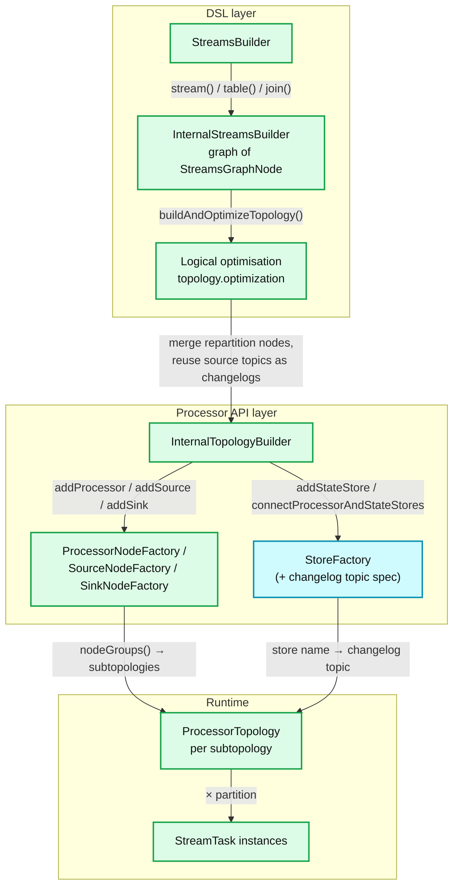
```mermaid
flowchart TB
  subgraph DSL["DSL layer"]
    SB["StreamsBuilder"]
    ISB["InternalStreamsBuilder<br/>graph of StreamsGraphNode"]
    OPT["Logical optimisation<br/>topology.optimization"]
  end
  subgraph PAPI["Processor API layer"]
    ITB["InternalTopologyBuilder"]
    NF["ProcessorNodeFactory /<br/>SourceNodeFactory / SinkNodeFactory"]
    SSF["StoreFactory<br/>(+ changelog topic spec)"]
  end
  subgraph RT["Runtime"]
    TOPO["ProcessorTopology<br/>per subtopology"]
    TASK["StreamTask instances"]
  end

  SB -->|"stream() / table() / join()"| ISB
  ISB -->|"buildAndOptimizeTopology()"| OPT
  OPT -->|"merge repartition nodes,<br/>reuse source topics as changelogs"| ITB
  ITB -->|"addProcessor / addSource / addSink"| NF
  ITB -->|"addStateStore / connectProcessorAndStateStores"| SSF
  NF -->|"nodeGroups() → subtopologies"| TOPO
  SSF -->|"store name → changelog topic"| TOPO
  TOPO -->|"× partition"| TASK

  class SB,ISB,OPT,ITB,NF,TOPO,TASK service
  class SSF queue

  classDef client   fill:#dbeafe,stroke:#2563eb,stroke-width:2px,color:#111
  classDef service  fill:#dcfce7,stroke:#16a34a,stroke-width:2px,color:#111
  classDef store    fill:#ede9fe,stroke:#7c3aed,stroke-width:2px,color:#111
  classDef cache    fill:#fef3c7,stroke:#d97706,stroke-width:2px,color:#111
  classDef queue    fill:#cffafe,stroke:#0891b2,stroke-width:2px,color:#111
  classDef critical fill:#fee2e2,stroke:#dc2626,stroke-width:4px,color:#111
  classDef external fill:#e5e7eb,stroke:#6b7280,stroke-width:2px,color:#111,stroke-dasharray:4 3
  classDef decision fill:#fce7f3,stroke:#db2777,stroke-width:2px,color:#111
```

**What to notice**
- The DSL is a *thin* front end: every operator becomes one or more `ProcessorNode`s (`KStreamFilter`, `KStreamMapValues`, `KTableSource`, `KStreamKStreamJoin`, `KStreamAggregate`…). There is no separate runtime for the DSL.
- `topology.optimization=all` does two big rewrites: **reuse the source topic as the changelog** for `builder.table()` (no separate changelog topic), and **merge repartition nodes** so a key change followed by several aggregations creates one repartition topic, not N.
- Subtopologies are computed *structurally* (`nodeGroups()`), not configured. You cut the graph wherever a repartition topic sits.
- Store factories carry the changelog topic spec — this is why store naming is a durable, breaking decision.
- `ensure.explicit.internal.resource.naming` (default `false`) makes Streams **fail** if any internal topic or store gets an auto-generated name — turn it on for any app you intend to evolve.

### A2.4 Subtopologies and task derivation

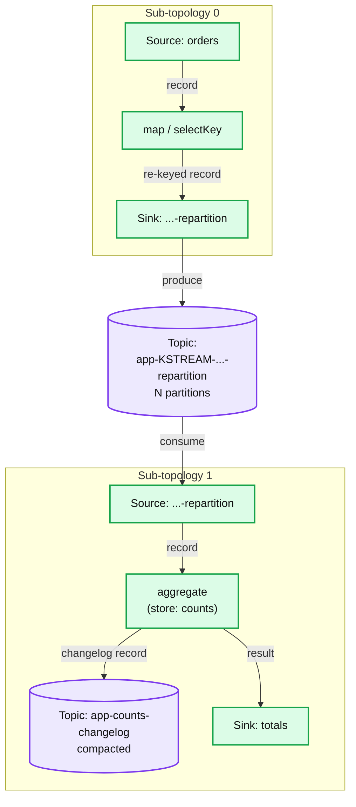
```mermaid
flowchart TD
  subgraph ST0["Sub-topology 0"]
    S0["Source: orders"] -->|"record"| M0["map / selectKey"]
    M0 -->|"re-keyed record"| SK0["Sink: ...-repartition"]
  end
  RP[("Topic:<br/>app-KSTREAM-...-repartition<br/>N partitions")]
  subgraph ST1["Sub-topology 1"]
    S1["Source: ...-repartition"] -->|"record"| AGG["aggregate<br/>(store: counts)"]
    AGG -->|"changelog record"| CL[("Topic: app-counts-changelog<br/>compacted")]
    AGG -->|"result"| SK1["Sink: totals"]
  end
  SK0 -->|"produce"| RP
  RP -->|"consume"| S1

  class S0,M0,SK0,S1,AGG,SK1 service
  class RP,CL store

  classDef client   fill:#dbeafe,stroke:#2563eb,stroke-width:2px,color:#111
  classDef service  fill:#dcfce7,stroke:#16a34a,stroke-width:2px,color:#111
  classDef store    fill:#ede9fe,stroke:#7c3aed,stroke-width:2px,color:#111
  classDef cache    fill:#fef3c7,stroke:#d97706,stroke-width:2px,color:#111
  classDef queue    fill:#cffafe,stroke:#0891b2,stroke-width:2px,color:#111
  classDef critical fill:#fee2e2,stroke:#dc2626,stroke-width:4px,color:#111
  classDef external fill:#e5e7eb,stroke:#6b7280,stroke-width:2px,color:#111,stroke-dasharray:4 3
  classDef decision fill:#fce7f3,stroke:#db2777,stroke-width:2px,color:#111
```

**What to notice**
- The repartition topic is a **real Kafka topic** and a real network round-trip; it is the price of `selectKey`/`groupBy`.
- Sub-topology 0 and 1 are assigned **independently**. Task `0_3` and task `1_3` may live on different instances.
- Task count for a subtopology = max partition count across its source topics. Co-partitioning (same partition count + same partitioner) is *required* for joins and is checked at startup.
- The changelog topic is `<application.id>-<storeName>-changelog`, `cleanup.policy=compact` (windowed stores use `compact,delete`).
- Repartition topics are `cleanup.policy=delete` and are actively **purged**: Streams issues `deleteRecords` up to the committed offset every `repartition.purge.interval.ms` (30 000).

---

## A3. Runtime architecture (one `KafkaStreams` instance)

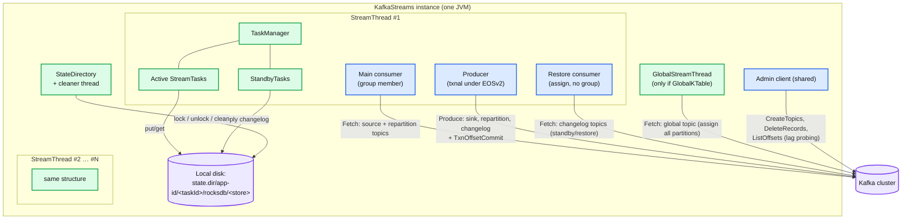
```mermaid
flowchart TB
  subgraph KS["KafkaStreams instance (one JVM)"]
    direction TB
    subgraph T1["StreamThread #1"]
      MC1["Main consumer<br/>(group member)"]
      TM1["TaskManager"]
      RC1["Restore consumer<br/>(assign, no group)"]
      P1["Producer<br/>(txnal under EOSv2)"]
      TM1 --- AT1["Active StreamTasks"]
      TM1 --- SB1["StandbyTasks"]
    end
    subgraph T2["StreamThread #2 … #N"]
      X["same structure"]
    end
    GT["GlobalStreamThread<br/>(only if GlobalKTable)"]
    SD["StateDirectory<br/>+ cleaner thread"]
    AC["Admin client (shared)"]
    SDIR[("Local disk:<br/>state.dir/app-id/&lt;taskId&gt;/rocksdb/&lt;store&gt;")]
  end

  BR[("Kafka cluster")]

  MC1 -->|"Fetch: source + repartition topics"| BR
  P1 -->|"Produce: sink, repartition, changelog<br/>+ TxnOffsetCommit"| BR
  RC1 -->|"Fetch: changelog topics (standby/restore)"| BR
  GT -->|"Fetch: global topic (assign all partitions)"| BR
  AC -->|"CreateTopics, DeleteRecords,<br/>ListOffsets (lag probing)"| BR
  AT1 -->|"put/get"| SDIR
  SB1 -->|"apply changelog"| SDIR
  SD -->|"lock / unlock / clean"| SDIR

  class MC1,RC1,P1,AC client
  class TM1,AT1,SB1,X,GT,SD service
  class SDIR,BR store

  classDef client   fill:#dbeafe,stroke:#2563eb,stroke-width:2px,color:#111
  classDef service  fill:#dcfce7,stroke:#16a34a,stroke-width:2px,color:#111
  classDef store    fill:#ede9fe,stroke:#7c3aed,stroke-width:2px,color:#111
  classDef cache    fill:#fef3c7,stroke:#d97706,stroke-width:2px,color:#111
  classDef queue    fill:#cffafe,stroke:#0891b2,stroke-width:2px,color:#111
  classDef critical fill:#fee2e2,stroke:#dc2626,stroke-width:4px,color:#111
  classDef external fill:#e5e7eb,stroke:#6b7280,stroke-width:2px,color:#111,stroke-dasharray:4 3
  classDef decision fill:#fce7f3,stroke:#db2777,stroke-width:2px,color:#111
```

**What to notice**
- The **main consumer** and the **restore consumer** are different clients. Only the main consumer is a group member; the restore consumer uses `assign()` so restoring never triggers a rebalance.
- Under `exactly_once_v2` there is **one producer per StreamThread**, not per task (that is the whole point of KIP-447). Under `at_least_once` there is also one producer per thread.
- `GlobalStreamThread` is outside the task model entirely: no assignment, no standby, no EOS participation.
- The admin client is what makes KIP-441 possible — it reads changelog end offsets to compute task lag.
- One task directory holds *all* stores of that task plus the `.lock` and (historically) the `.checkpoint` file. Ownership of the directory is enforced by a file lock, which is why two instances on the same `state.dir` with the same `application.id` conflict.

---

## A4. Data flow

### A4.1 Record path through a StreamThread

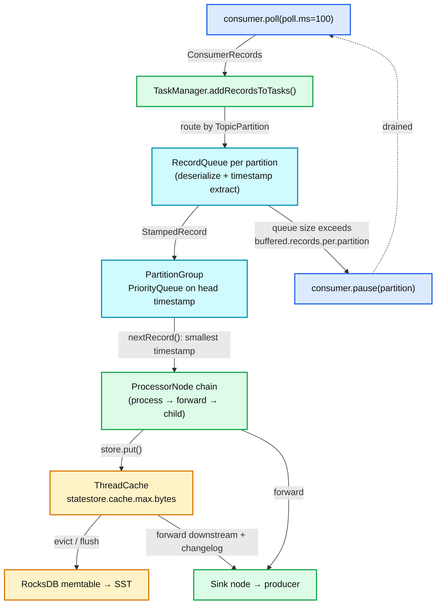
```mermaid
flowchart TB
  POLL["consumer.poll(poll.ms=100)"] -->|"ConsumerRecords"| ADD["TaskManager.addRecordsToTasks()"]
  ADD -->|"route by TopicPartition"| RQ["RecordQueue per partition<br/>(deserialize + timestamp extract)"]
  RQ -->|"StampedRecord"| PG["PartitionGroup<br/>PriorityQueue on head timestamp"]
  PG -->|"nextRecord(): smallest timestamp"| PROC["ProcessorNode chain<br/>(process → forward → child)"]
  PROC -->|"store.put()"| CACHE["ThreadCache<br/>statestore.cache.max.bytes"]
  CACHE -->|"evict / flush"| ROCKS["RocksDB memtable → SST"]
  CACHE -->|"forward downstream + changelog"| SINK["Sink node → producer"]
  PROC -->|"forward"| SINK
  RQ -->|"queue size exceeds<br/>buffered.records.per.partition"| PAUSE["consumer.pause(partition)"]
  PAUSE -.->|"drained"| POLL

  class POLL,PAUSE client
  class ADD,PROC,SINK service
  class CACHE,ROCKS cache
  class RQ,PG queue

  classDef client   fill:#dbeafe,stroke:#2563eb,stroke-width:2px,color:#111
  classDef service  fill:#dcfce7,stroke:#16a34a,stroke-width:2px,color:#111
  classDef store    fill:#ede9fe,stroke:#7c3aed,stroke-width:2px,color:#111
  classDef cache    fill:#fef3c7,stroke:#d97706,stroke-width:2px,color:#111
  classDef queue    fill:#cffafe,stroke:#0891b2,stroke-width:2px,color:#111
  classDef critical fill:#fee2e2,stroke:#dc2626,stroke-width:4px,color:#111
  classDef external fill:#e5e7eb,stroke:#6b7280,stroke-width:2px,color:#111,stroke-dasharray:4 3
  classDef decision fill:#fce7f3,stroke:#db2777,stroke-width:2px,color:#111
```

**What to notice**
- **Deserialization happens on the way into the queue**, not at processing time. That is why `DeserializationExceptionHandler` fires here and can skip a record before any processor sees it.
- The `PartitionGroup` is the heart of event-time correctness: it always hands the processor the *globally smallest-timestamp* buffered record across all of the task's input partitions, approximating a merge of time-ordered streams.
- The `ThreadCache` is a *dedup and rate-reduction* layer, not a correctness layer. It suppresses intermediate results for the same key; setting `statestore.cache.max.bytes=0` makes every update emit downstream.
- Back-pressure is per-partition `consumer.pause()` driven by `buffered.records.per.partition` (1000). There is no global credit scheme.
- Changelog writes go through the **same producer** as sink writes — which is precisely what makes atomic EOS possible.

### A4.2 Timestamp-based record choosing and idling

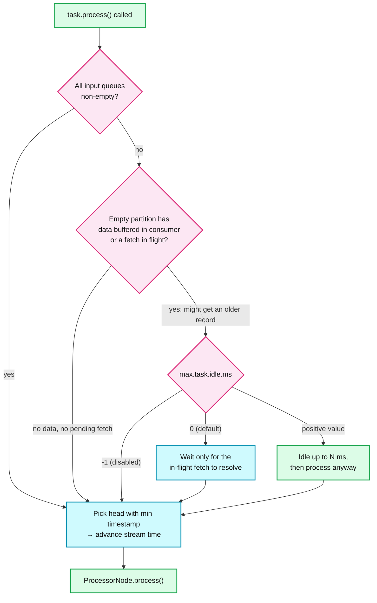
```mermaid
flowchart TB
  START["task.process() called"] --> Q{"All input queues<br/>non-empty?"}
  Q -->|"yes"| PICK["Pick head with min timestamp<br/>→ advance stream time"]
  Q -->|"no"| LAG{"Empty partition has<br/>data buffered in consumer<br/>or a fetch in flight?"}
  LAG -->|"no data, no pending fetch"| PICK
  LAG -->|"yes: might get an older record"| IDLE{"max.task.idle.ms"}
  IDLE -->|"-1 (disabled)"| PICK
  IDLE -->|"0 (default)"| WAITFETCH["Wait only for the<br/>in-flight fetch to resolve"]
  IDLE -->|"positive value"| WAITMS["Idle up to N ms,<br/>then process anyway"]
  WAITFETCH --> PICK
  WAITMS --> PICK
  PICK --> FWD["ProcessorNode.process()"]

  class START,WAITMS,FWD service
  class PICK,WAITFETCH queue
  class Q,LAG,IDLE decision

  classDef client   fill:#dbeafe,stroke:#2563eb,stroke-width:2px,color:#111
  classDef service  fill:#dcfce7,stroke:#16a34a,stroke-width:2px,color:#111
  classDef store    fill:#ede9fe,stroke:#7c3aed,stroke-width:2px,color:#111
  classDef cache    fill:#fef3c7,stroke:#d97706,stroke-width:2px,color:#111
  classDef queue    fill:#cffafe,stroke:#0891b2,stroke-width:2px,color:#111
  classDef critical fill:#fee2e2,stroke:#dc2626,stroke-width:4px,color:#111
  classDef external fill:#e5e7eb,stroke:#6b7280,stroke-width:2px,color:#111,stroke-dasharray:4 3
  classDef decision fill:#fce7f3,stroke:#db2777,stroke-width:2px,color:#111
```

**What to notice**
- **Stream time is per-task, monotonically non-decreasing**: `max(stream time, timestamp of record just processed)`. It never moves backwards and it never advances on wall-clock alone. A task with no input has frozen stream time — windows will not close, `PunctuationType.STREAM_TIME` punctuators will not fire.
- `max.task.idle.ms=0` does **not** mean "never idle". It means "do not idle beyond waiting for data Kafka has already been asked for". `-1` is the true opt-out and reintroduces out-of-order join results.
- A positive `max.task.idle.ms` buys ordering at the cost of latency: a genuinely idle partition stalls the whole task for that long, *every* iteration.
- `PunctuationType.WALL_CLOCK_TIME` is the escape hatch when stream time is stuck, and is driven from the thread loop, not from records.
- This is the single most common source of "my join drops records" and "my windows never emit" reports.

### A4.3 Restore path (active task) and standby path


```mermaid
flowchart TD
  subgraph RESTORE["Active task restore"]
    A1["Task assigned"] -->|"read offset from<br/>StateStore (KIP-1035)"| A2["StoreChangelogReader<br/>register(changelogPartition, startOffset)"]
    A2 -->|"restoreConsumer.assign + seek"| A3["Poll changelog batch"]
    A3 -->|"store.restoreBatch()<br/>(bypasses cache and changelogging)"| A4["RocksDB bulk load"]
    A4 -->|"offset == endOffset?"| A5{"Caught up?"}
    A5 -->|"no"| A3
    A5 -->|"yes"| A6["Task → RUNNING<br/>StateRestoreListener.onRestoreEnd"]
  end
  subgraph STANDBY["StandbyTask (continuous)"]
    B1["Assigned as standby"] --> B2["restoreConsumer polls changelog"]
    B2 -->|"apply to local store"| B3["Local replica warm"]
    B3 -->|"report offset sum in<br/>next JoinGroup subscription"| B4["Assignor sees low lag"]
    B3 --> B2
  end

  class B2 client
  class A1,A2,A4,A6,B1,B3,B4 service
  class A3 queue
  class A5 decision

  classDef client   fill:#dbeafe,stroke:#2563eb,stroke-width:2px,color:#111
  classDef service  fill:#dcfce7,stroke:#16a34a,stroke-width:2px,color:#111
  classDef store    fill:#ede9fe,stroke:#7c3aed,stroke-width:2px,color:#111
  classDef cache    fill:#fef3c7,stroke:#d97706,stroke-width:2px,color:#111
  classDef queue    fill:#cffafe,stroke:#0891b2,stroke-width:2px,color:#111
  classDef critical fill:#fee2e2,stroke:#dc2626,stroke-width:4px,color:#111
  classDef external fill:#e5e7eb,stroke:#6b7280,stroke-width:2px,color:#111,stroke-dasharray:4 3
  classDef decision fill:#fce7f3,stroke:#db2777,stroke-width:2px,color:#111
```

**What to notice**
- Restore uses `restoreBatch()`, which writes **directly** to the store, bypassing the `ThreadCache` and, critically, bypassing changelogging (a restore must not re-produce to the changelog).
- The restore consumer reads with `auto.offset.reset=none` semantics on changelogs; a missing offset means "wipe and restore from earliest".
- Standby tasks are the *same* mechanism running forever. The only difference is that a standby never processes input records and never produces output.
- The offset a standby has reached is reported back to the assignor — that is the input to KIP-441. Warm-up replicas are standbys the assignor created *temporarily*, beyond `num.standby.replicas`.
- `num.standby.replicas=0` by default. Every stateful production deployment should set it to at least 1, or accept full-restore failover.

---

## A5. Sequences

### A5.1 The StreamThread main loop with an EOS commit

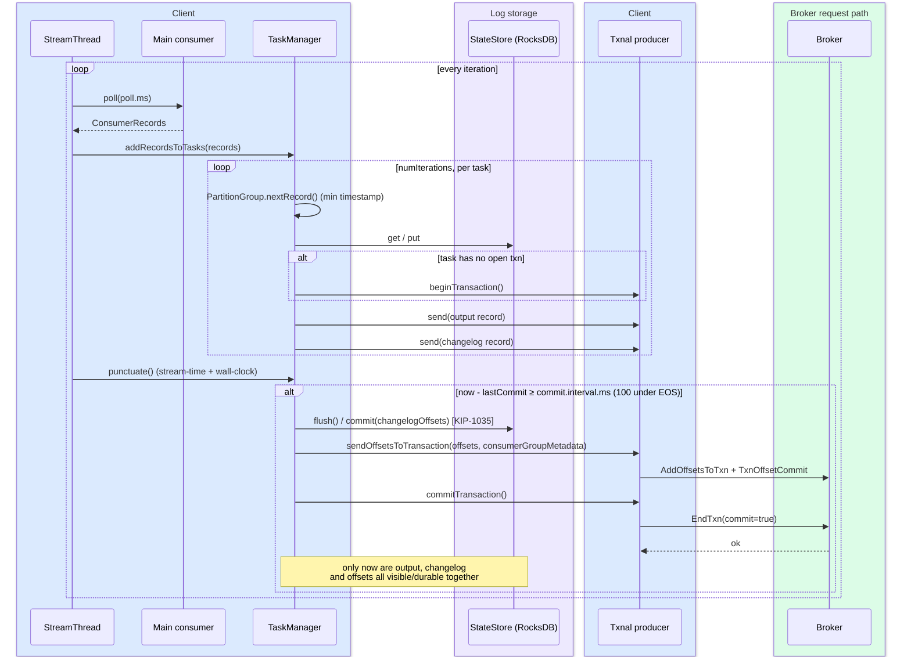
```mermaid
sequenceDiagram
  box rgb(219,234,254) Client
    participant T as StreamThread
    participant C as Main consumer
    participant TM as TaskManager
  end
  box rgb(237,233,254) Log storage
    participant S as StateStore (RocksDB)
  end
  box rgb(219,234,254) Client
    participant P as Txnal producer
  end
  box rgb(220,252,231) Broker request path
    participant B as Broker
  end

  loop every iteration
    T->>C: poll(poll.ms)
    C-->>T: ConsumerRecords
    T->>TM: addRecordsToTasks(records)
    loop numIterations, per task
      TM->>TM: PartitionGroup.nextRecord() (min timestamp)
      TM->>S: get / put
      alt task has no open txn
        TM->>P: beginTransaction()
      end
      TM->>P: send(output record)
      TM->>P: send(changelog record)
    end
    T->>TM: punctuate() (stream-time + wall-clock)
    alt now - lastCommit ≥ commit.interval.ms (100 under EOS)
      TM->>S: flush() / commit(changelogOffsets) [KIP-1035]
      TM->>P: sendOffsetsToTransaction(offsets, consumerGroupMetadata)
      P->>B: AddOffsetsToTxn + TxnOffsetCommit
      TM->>P: commitTransaction()
      P->>B: EndTxn(commit=true)
      B-->>P: ok
      Note over TM,S: only now are output, changelog<br/>and offsets all visible/durable together
    end
  end
```

**What to notice**
- The transaction spans **three different kinds of write**: output topics, changelog topics, and the consumer offset commit. All three land or none do.
- `sendOffsetsToTransaction` takes `ConsumerGroupMetadata` (group id + generation + member id). This is KIP-447's core change: the **group coordinator** fences zombies by generation, so a single producer can safely commit offsets for many tasks.
- `commit.interval.ms` under EOS is the end-to-end latency floor, because downstream `read_committed` consumers cannot see anything until `EndTxn`.
- State store flush ordering matters: the store must be flushed *before* the transaction commits, otherwise a crash could leave committed output with unwritten state.
- Punctuation runs on the thread, outside per-record processing, and can also produce and mutate state inside the same transaction.

### A5.2 Rebalance with warm-up replicas (KIP-441, classic protocol)

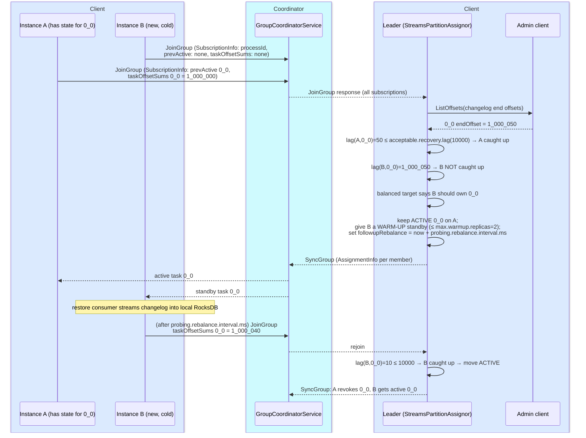
```mermaid
sequenceDiagram
  box rgb(219,234,254) Client
    participant M1 as Instance A (has state for 0_0)
    participant M2 as Instance B (new, cold)
  end
  box rgb(207,250,254) Coordinator
    participant GC as GroupCoordinatorService
  end
  box rgb(219,234,254) Client
    participant L as Leader (StreamsPartitionAssignor)
    participant AC as Admin client
  end

  M2->>GC: JoinGroup (SubscriptionInfo: processId,<br/>prevActive: none, taskOffsetSums: none)
  M1->>GC: JoinGroup (SubscriptionInfo: prevActive 0_0,<br/>taskOffsetSums 0_0 = 1_000_000)
  GC-->>L: JoinGroup response (all subscriptions)
  L->>AC: ListOffsets(changelog end offsets)
  AC-->>L: 0_0 endOffset = 1_000_050
  L->>L: lag(A,0_0)=50 ≤ acceptable.recovery.lag(10000) → A caught up
  L->>L: lag(B,0_0)=1_000_050 → B NOT caught up
  L->>L: balanced target says B should own 0_0
  L->>L: keep ACTIVE 0_0 on A#59;<br/>give B a WARM-UP standby (≤ max.warmup.replicas=2)#59;<br/>set followupRebalance = now + probing.rebalance.interval.ms
  L-->>GC: SyncGroup (AssignmentInfo per member)
  GC-->>M1: active task 0_0
  GC-->>M2: standby task 0_0
  Note over M2: restore consumer streams changelog into local RocksDB
  M2->>GC: (after probing.rebalance.interval.ms) JoinGroup<br/>taskOffsetSums 0_0 = 1_000_040
  GC-->>L: rejoin
  L->>L: lag(B,0_0)=10 ≤ 10000 → B caught up → move ACTIVE
  L-->>GC: SyncGroup: A revokes 0_0, B gets active 0_0
```

**What to notice**
- **No stop-the-world restore.** The naive assignor would have handed 0_0 to B immediately and blocked processing for the length of a full restore. KIP-441 keeps the active task where the state already is.
- The trigger for the follow-up rebalance is entirely **client-side**: the leader stuffs a `followupRebalanceDeadline` into the assignment, and members call `enforceRebalance()` when it expires.
- `acceptable.recovery.lag` (10 000 records) is the "close enough" threshold. Too low and tasks never migrate; too high and you migrate onto stale state and stall on restore anyway.
- `max.warmup.replicas` (2) is a **rate limit on rebalance-induced restore traffic**, not a replication factor. Raising it speeds convergence and costs broker bandwidth.
- Probing rebalances repeat every `probing.rebalance.interval.ms` (600 000 = 10 min) until the assignment is balanced. A permanently-unbalanced cluster rebalances forever — watch for that.

### A5.3 KIP-1071: the broker-side streams rebalance protocol

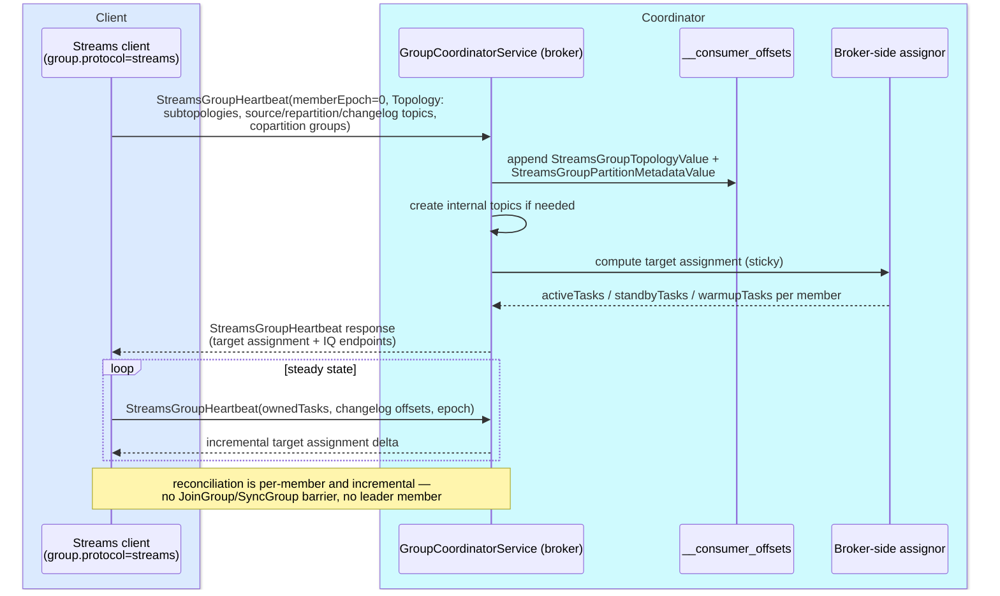
```mermaid
sequenceDiagram
  box rgb(219,234,254) Client
    participant S as Streams client<br/>(group.protocol=streams)
  end
  box rgb(207,250,254) Coordinator
    participant GCo as GroupCoordinatorService (broker)
    participant CO as __consumer_offsets
    participant AS as Broker-side assignor
  end

  S->>GCo: StreamsGroupHeartbeat(memberEpoch=0, Topology:<br/>subtopologies, source/repartition/changelog topics,<br/>copartition groups)
  GCo->>CO: append StreamsGroupTopologyValue +<br/>StreamsGroupPartitionMetadataValue
  GCo->>GCo: create internal topics if needed
  GCo->>AS: compute target assignment (sticky)
  AS-->>GCo: activeTasks / standbyTasks / warmupTasks per member
  GCo-->>S: StreamsGroupHeartbeat response<br/>(target assignment + IQ endpoints)
  loop steady state
    S->>GCo: StreamsGroupHeartbeat(ownedTasks, changelog offsets, epoch)
    GCo-->>S: incremental target assignment delta
  end
  Note over S,GCo: reconciliation is per-member and incremental —<br/>no JoinGroup/SyncGroup barrier, no leader member
```

**What to notice — and the maturity caveat**
- **Maturity in 4.3, stated plainly**: the protocol is **production-ready** on the broker side — `StreamsVersion.LATEST_PRODUCTION = SV_1` with `bootstrapMetadataVersion = IBP_4_2_IV1`, so `streams.version=1` is default-on for clusters *formatted* at MV ≥ `4.2-IV1` (an upgraded cluster needs `kafka-features.sh upgrade --feature streams.version=1`); `group.coordinator.rebalance.protocols` (deprecated in 4.3, removed in 5.0) also includes `streams` by default. It first shipped as **early access in 4.1** and became generally available in **4.2**. Clients still must **opt in** with `group.protocol=streams` — the Streams client default is `classic` (`StreamsConfig.DEFAULT_GROUP_PROTOCOL`). [documented]
- **The catch that decides your choice today**: the 4.3 docs state under limitations, verbatim, *"High Availability Assignor: Only the sticky assignor is supported."* The code agrees — `StreamsConfig.verifyStreamsProtocolCompatibility` warns *"Warmup replicas are not supported yet with the streams protocol and will be ignored"* and ignores `num.standby.replicas` (standbys become a broker-side group config). Choosing `group.protocol=streams` in 4.3 therefore means **giving up KIP-441** — no warm-up replicas, no probing rebalances, no lag-aware placement. For a large stateful app that is a straight downgrade in failover behaviour. [documented]
- Other 4.3 limitations [documented]: **static membership** rejected (`group.instance.id` set with `group.protocol=streams` throws `ConfigException`), **no regex/pattern subscription**, **no online migration** between `classic` and `streams` (offline migration only — shut everything down, wait out `session.timeout.ms`, switch config, restart), and **significant topology changes require a brand-new streams group**.
- Migration hazard: the docs carry an explicit warning against classic→streams migration on **4.2.0** because of broker-side bug **KAFKA-20254**. 4.3 is the first release where the migration path is recommended. [documented]
- Design significance: the topology moves *into the broker*. The coordinator knows about subtopologies, copartition groups and changelog topics, so it can create internal topics and validate copartitioning centrally instead of every client re-deriving it. Assignment stops being "whatever the elected member computed".
- **Staff recommendation for 4.3**: stateless or lightly-stateful apps benefit now (faster, incremental, no leader bottleneck); heavily-stateful apps should stay on `classic` until the HA assignor lands broker-side.

---

## A6. State machines

### A6.1 `KafkaStreams` client state

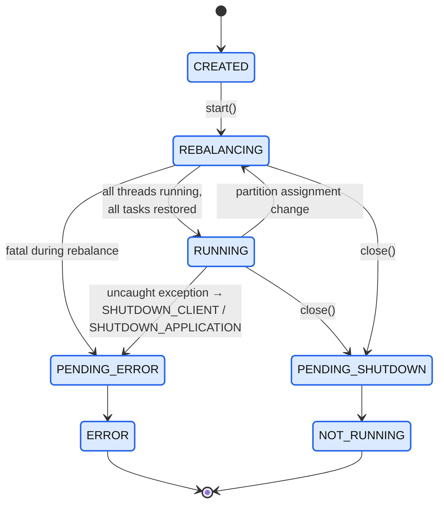
```mermaid
stateDiagram-v2
  [*] --> CREATED
  CREATED --> REBALANCING: start()
  REBALANCING --> RUNNING: all threads running,<br/>all tasks restored
  RUNNING --> REBALANCING: partition assignment change
  REBALANCING --> PENDING_ERROR: fatal during rebalance
  RUNNING --> PENDING_ERROR: uncaught exception →<br/>SHUTDOWN_CLIENT / SHUTDOWN_APPLICATION
  RUNNING --> PENDING_SHUTDOWN: close()
  REBALANCING --> PENDING_SHUTDOWN: close()
  PENDING_SHUTDOWN --> NOT_RUNNING
  PENDING_ERROR --> ERROR
  ERROR --> [*]
  NOT_RUNNING --> [*]

  class CREATED,REBALANCING,RUNNING,PENDING_ERROR,PENDING_SHUTDOWN,NOT_RUNNING,ERROR client

  classDef client   fill:#dbeafe,stroke:#2563eb,stroke-width:2px,color:#111
```

**What to notice**
- `RUNNING` means *every* thread is running **and** every assigned task has finished restoring. A single restoring task holds the whole client in `REBALANCING` — this is why health checks keyed on `state() == RUNNING` fail every deploy on stateful apps.
- `REBALANCING` is also the startup state, so "stuck in REBALANCING" and "stuck restoring" look identical from outside; use `StateRestoreListener` to tell them apart.
- `ERROR` is terminal. There is no self-healing path back — the process must be restarted by your supervisor. `REPLACE_THREAD` avoids reaching `ERROR` for thread-local faults.
- `PENDING_ERROR`/`PENDING_SHUTDOWN` exist so `close()` and listener callbacks run before the client goes terminal.

### A6.2 `Task` lifecycle (active and standby)

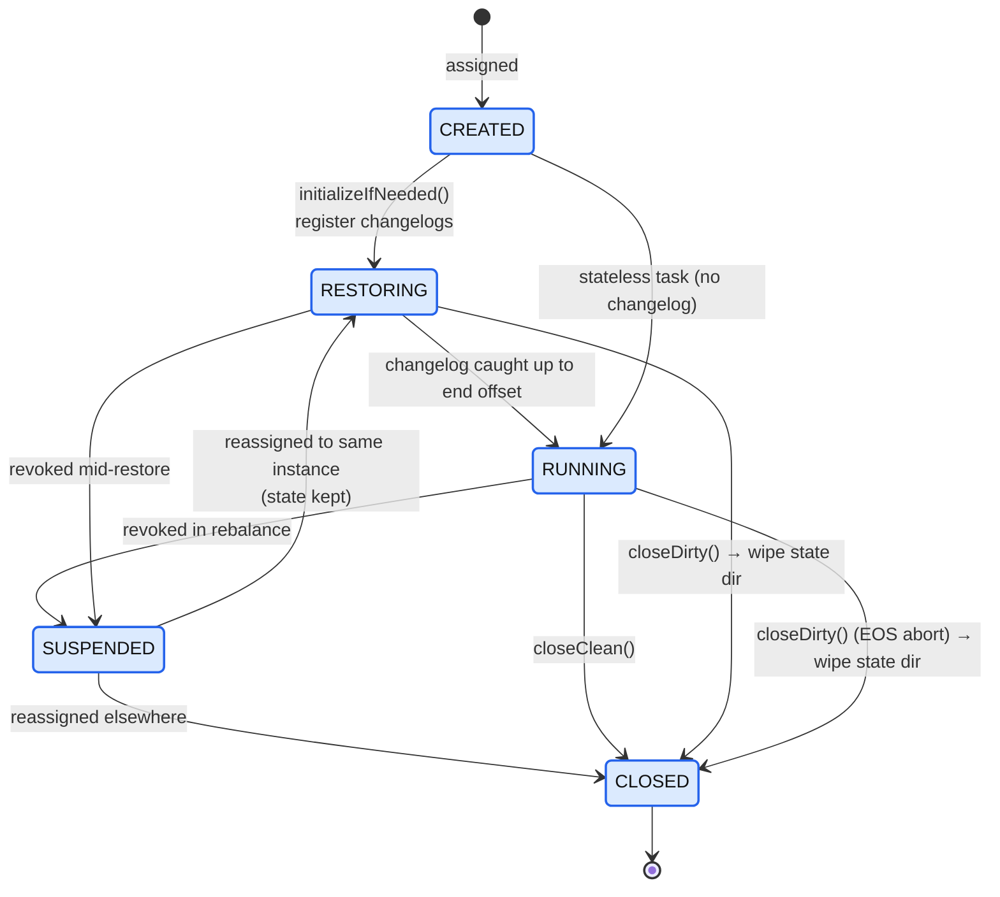
```mermaid
stateDiagram-v2
  [*] --> CREATED: assigned
  CREATED --> RESTORING: initializeIfNeeded()<br/>register changelogs
  RESTORING --> RUNNING: changelog caught up to end offset
  CREATED --> RUNNING: stateless task (no changelog)
  RUNNING --> SUSPENDED: revoked in rebalance
  RESTORING --> SUSPENDED: revoked mid-restore
  SUSPENDED --> RESTORING: reassigned to same instance<br/>(state kept)
  SUSPENDED --> CLOSED: reassigned elsewhere
  RUNNING --> CLOSED: closeClean()
  RESTORING --> CLOSED: closeDirty() → wipe state dir
  RUNNING --> CLOSED: closeDirty() (EOS abort) → wipe state dir
  CLOSED --> [*]

  class CREATED,RESTORING,RUNNING,SUSPENDED,CLOSED client

  classDef client   fill:#dbeafe,stroke:#2563eb,stroke-width:2px,color:#111
```

**What to notice**
- `SUSPENDED` is what makes cooperative rebalancing cheap: a revoked-then-reassigned task keeps its RocksDB instance open and skips restore entirely.
- `closeDirty()` is the destructive path. Under `exactly_once_v2`, a task that fails with an aborted transaction historically had to **wipe its local state directory** and fully restore, because uncommitted writes may already sit in RocksDB. This is exactly the cost KIP-1035 (and, later, KIP-892) attacks.
- A stateless task goes `CREATED → RUNNING` with no restore, which is why stateless Streams apps rebalance in milliseconds and stateful ones do not.

---

## A7. Component deep dives

### A7.1 `StreamThread` and `TaskManager`

**Responsibility.** `StreamThread` owns the poll/process/punctuate/commit loop and its clients. `TaskManager` owns the set of `StreamTask`/`StandbyTask` objects, handles assignment changes, and drives `StoreChangelogReader`.

**Concurrency model.**
- Each `StreamThread` is single-threaded over its tasks — **no task is ever touched by two threads**. This is what lets processors and stores be written without locks.
- `num.stream.threads` (default **1**) sets threads per instance. Total parallelism ceiling = number of tasks; extra threads idle.
- Tasks are *not* pinned to threads across rebalances, but within an instance the `TaskManager` prefers to keep a task on the thread that already has it.
- `KafkaStreams.addStreamThread()` / `removeStreamThread()` allow runtime elasticity without restarting the client.

**Failure handling.** An exception escaping the loop goes to `StreamsUncaughtExceptionHandler`, which returns one of:
- `REPLACE_THREAD` — kill and recreate just this thread (tasks are redistributed by a rebalance).
- `SHUTDOWN_CLIENT` — this instance goes to `ERROR`; others take over.
- `SHUTDOWN_APPLICATION` — the instance writes an error code into its next assignment so **all** instances shut down. Use for poison-pill-class bugs.

**`task.timeout.ms`** bounds how long a task retries on retriable client errors (e.g. `TimeoutException`) before the error is escalated. [unverified default]

### A7.2 `PartitionGroup` and `RecordQueue`

- One `RecordQueue` per input `TopicPartition` of the task, each an `ArrayDeque<StampedRecord>` fed by deserialization + `TimestampExtractor` (default `FailOnInvalidTimestamp`).
- `PartitionGroup` holds a `PriorityQueue<RecordQueue>` ordered by each queue's **head record timestamp**, so `nextRecord()` is O(log P).
- Per-queue "partition time" = max timestamp seen in that queue; task **stream time** = max across processed records.
- `buffered.records.per.partition` (1000) triggers `consumer.pause()` on that partition; the thread resumes it when drained. `input.buffer.max.bytes` gives a byte-based ceiling across the thread. [unverified default]
- Idling logic is in `PartitionGroup.readyToProcess()`, governed by `max.task.idle.ms` — see A4.2.

### A7.3 State stores

**The type hierarchy**

| Interface | Key | Backing layout |
|---|---|---|
| `KeyValueStore<K,V>` | `K` | One RocksDB column family; key = serialized `K` |
| `TimestampedKeyValueStore<K,V>` | `K` | Value prefixed with an 8-byte timestamp |
| `WindowStore<K,V>` | `K` + window start | **Segmented**: `RocksDBSegmentedBytesStore`; key = `<K><windowStart(8B)><seqnum(4B)>` |
| `SessionStore<K,AGG>` | `K` + (start,end) | Segmented; key = `<K><end(8B)><start(8B)>` |
| `VersionedKeyValueStore<K,V>` | `K` + timestamp | "Latest value" store + segmented history |

**Segmented stores.** A window/session store is physically N RocksDB databases ("segments"), each covering a time range. Retention expiry is a **segment drop** — deleting a whole RocksDB instance — not a per-key delete. This is why window retention is coarse and why shrinking retention does not reclaim space until segments roll.

**Changelog topics.**
- Name: `<application.id>-<storeName>-changelog`.
- `cleanup.policy=compact` for key-value stores; `compact,delete` with `retention.ms` derived from window size + grace + `windowstore.changelog.additional.retention.ms` for windowed stores.
- Override any topic property with the `topic.` prefix in Streams config, e.g. `topic.min.insync.replicas=2`, `topic.segment.bytes=…`. `replication.factor` defaults to **-1** (use the broker default) — **set this explicitly**; RF=1 changelogs mean permanent data loss on a broker failure.
- Writes go through the task's producer, in the EOS transaction when EOS is on.

**Checkpointing, and what KIP-1035 changed.**

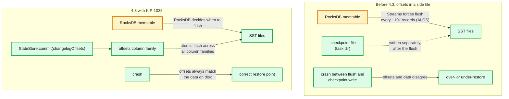
```mermaid
flowchart TB
  subgraph OLD["Before 4.3: offsets in a side file"]
    O1["RocksDB memtable"] -->|"Streams forces flush<br/>every ~10k records (ALOS)"| O2["SST files"]
    O3[".checkpoint file<br/>(task dir)"] -.->|"written separately,<br/>after the flush"| O2
    O4["crash between flush and<br/>checkpoint write"] -->|"offsets and data disagree"| O5["over- or under-restore"]
  end
  subgraph NEW["4.3 with KIP-1035"]
    N1["RocksDB memtable"] -->|"RocksDB decides when to flush"| N2["SST files"]
    N3["offsets column family"] -->|"atomic flush across<br/>all column families"| N2
    N4["StateStore.commit(changelogOffsets)"] --> N3
    N5["crash"] -->|"offsets always match<br/>the data on disk"| N6["correct restore point"]
  end

  class O2,O3,O4,O5,N2,N3,N4,N5 service
  class N6 service
  class O1,N1 cache

  classDef client   fill:#dbeafe,stroke:#2563eb,stroke-width:2px,color:#111
  classDef service  fill:#dcfce7,stroke:#16a34a,stroke-width:2px,color:#111
  classDef store    fill:#ede9fe,stroke:#7c3aed,stroke-width:2px,color:#111
  classDef cache    fill:#fef3c7,stroke:#d97706,stroke-width:2px,color:#111
  classDef queue    fill:#cffafe,stroke:#0891b2,stroke-width:2px,color:#111
  classDef critical fill:#fee2e2,stroke:#dc2626,stroke-width:4px,color:#111
  classDef external fill:#e5e7eb,stroke:#6b7280,stroke-width:2px,color:#111,stroke-dasharray:4 3
  classDef decision fill:#fce7f3,stroke:#db2777,stroke-width:2px,color:#111
```

**What to notice**
- KIP-1035 adds `managesOffsets()`, `commit(Map<TopicPartition,Long>)` and `committedOffset(TopicPartition)` to `StateStore`, deprecating `flush()`. The RocksDB implementation keeps changelog offsets in a **dedicated column family** and enables RocksDB **atomic flush**, so offsets and data reach disk together. [documented]
- Why it matters for restore correctness: previously the `.checkpoint` file was written *after* the store flush, and a crash in between left the recorded offset ahead of or behind the actual persisted data — replaying from the wrong point either duplicates or **silently drops** changelog updates.
- Secondary win: Streams no longer force-flushes the memtable on commit (it used to, roughly every 10 000 records under ALOS, overriding your `RocksDBConfigSetter` tuning). RocksDB now controls its own flush cadence — a real throughput improvement for write-heavy stores.
- **Migration/downgrade hazard [documented]**: existing `.checkpoint` files are migrated into the stores automatically on first startup of 4.3. Downgrading **from 4.3.x to 4.2.x or older requires deleting local state directories**, because older versions cannot open a RocksDB database that has the offsets column family. Plan a downgrade as a full restore.
- KIP-1035 is the prerequisite for **KIP-892 (transactional state stores)**, which would remove the "wipe and restore on EOS failure" penalty. KIP-892 is **not** in 4.3 — it does not appear in the 4.3 release notes. [inferred]

**Other 4.3 state-store changes**
- **KIP-1250** — new metrics reporting the **number of keys in in-memory state stores**, closing a long-standing blind spot (RocksDB had `KIP-607` property metrics; in-memory stores had none). Exact metric name not re-verified against the 4.3 metrics reference. [documented for the capability; **[unverified]** for the metric name]
- **KIP-1259** — `state.cleanup.dir.max.age.ms` (default **-1**, disabled). On startup, delete any task state directory not modified within this age. Aimed at containerised deployments with persistent volumes that accumulate orphaned task dirs after repeated rescheduling. Distinct from `state.cleanup.delay.ms` (600 000), which removes dirs for tasks *this instance no longer owns* while running.
- **KIP-1271 / KIP-1285** — **headers in state stores**. KIP-1271 extends the **Processor API** with headers-aware store suppliers (new `…WithHeaders` suppliers and matching builders); KIP-1285 exposes the capability to the **DSL**. Motivation: record headers (correlation ids, tracing context, routing metadata) previously vanished the moment a record was materialized into a table, breaking end-to-end tracing across a stateful operator. The DSL opt-in is `dsl.store.format` (`StreamsConfig.DSL_STORE_FORMAT_CONFIG`), default `DEFAULT`, set to `HEADERS` to get headers-aware stores. [documented]

### A7.4 `RocksDBConfigSetter` and memory

RocksDB memory is **off-heap** and invisible to JVM heap limits — the #1 cause of container OOM-kills in Streams.

Per store instance, by default: a block cache, a write buffer (memtable) set, index/filter blocks, and an iterator arena. **Per store × per task**, so a 32-task instance with 3 stores each has ~96 RocksDB databases.

```java
public class BoundedMemoryConfig implements RocksDBConfigSetter {
  // one cache and one write-buffer manager SHARED across all stores
  private static final Cache CACHE = new LRUCache(512L * 1024 * 1024);
  private static final WriteBufferManager WBM = new WriteBufferManager(128L * 1024 * 1024, CACHE);

  @Override public void setConfig(String storeName, Options options, Map<String, Object> configs) {
    BlockBasedTableConfig t = (BlockBasedTableConfig) options.tableFormatConfig();
    t.setBlockCache(CACHE);
    t.setCacheIndexAndFilterBlocks(true);           // charge index/filter to the cache
    t.setPinTopLevelIndexAndFilter(true);
    options.setTableFormatConfig(t);
    options.setWriteBufferManager(WBM);             // charge memtables to the cache too
    options.setMaxWriteBufferNumber(2);
    options.setWriteBufferSize(16L * 1024 * 1024);
  }
  @Override public void close(String storeName, Options options) { /* do NOT close CACHE/WBM */ }
}
```

**What to notice**
- Sharing one `Cache` + `WriteBufferManager` across all stores converts "N × per-store budget" into "one global budget" — the only reliable way to bound Streams off-heap memory.
- `close()` must **not** close the shared objects; they outlive individual stores.
- `statestore.cache.max.bytes` (10 485 760) is the *Streams* record cache, a completely different budget from the RocksDB block cache. Both matter.
- Bulk-loading during restore uses different RocksDB options internally (larger memtables, disabled auto-compaction), so restore memory can exceed steady-state memory.

### A7.5 `StreamsPartitionAssignor` and `HighAvailabilityTaskAssignor`

**Wire format** (classic protocol): `SubscriptionInfo` carries `processId` (a per-JVM UUID persisted in the state dir), previous active/standby task ids, `taskOffsetSums` (per-task changelog progress), the `application.server` endpoint, client tags for rack awareness, and a uniqueField to defeat subscription dedup. `AssignmentInfo` carries active tasks, standby tasks, `partitionsByHost` (for interactive queries), an error code, and the follow-up rebalance deadline.

**Assignor algorithm (KIP-441)**
1. Read changelog **end offsets** via the admin client.
2. `lag(client, task) = endOffset − reportedOffsetSum`. Missing state ⇒ lag = full topic size (`Task.LATEST_OFFSET` marks a currently-active owner as lag 0).
3. A client is **caught up** for a task if `lag ≤ acceptable.recovery.lag` (10 000).
4. Compute the *balanced* target assignment (even task counts, respecting `processId` and rack constraints).
5. For each task whose balanced owner is not caught up: assign **active** to a caught-up client, and give the balanced owner a **warm-up** standby — capped at `max.warmup.replicas` (2) per rebalance.
6. Assign `num.standby.replicas` regular standbys.
7. If any warm-ups were issued, set the follow-up (probing) rebalance for `now + probing.rebalance.interval.ms` (600 000).

`task.assignor.class` lets you replace this entirely (default: the high-availability assignor). `rack.aware.assignment.strategy` (default `none`) adds cross-rack traffic minimisation on top.

### A7.6 Exactly-once

| | EOS v1 (`exactly_once`, removed) | EOS v2 (`exactly_once_v2`) |
|---|---|---|
| Producers | **One per task** | **One per StreamThread** |
| `transactional.id` | `<app.id>-<taskId>` | `<app.id>-<processId>` |
| Fencing | Producer-level, via `transactional.id` per task | **Group-coordinator-level**, via consumer generation in `TxnOffsetCommit` (KIP-447) |
| Cost | O(tasks) producers, O(tasks) txn markers per commit | O(threads) producers, one txn per thread-commit |
| Scaling | Broke down at high task counts | Scales with threads, not partitions |

- `processing.guarantee=exactly_once_v2` (default `at_least_once`). Requires broker ≥ 2.5 for KIP-447 semantics.
- `commit.interval.ms` default becomes **100 ms** under EOS (vs 30 000 for ALOS), because commit latency *is* visibility latency for `read_committed` consumers.
- `transaction.timeout.ms` Streams default **10 000**. If a commit interval plus processing time exceeds it, the coordinator aborts the transaction and the task fails.
- Streams forces `enable.idempotence=true`, `max.in.flight.requests.per.connection=5`, `acks=all`, `isolation.level=read_committed` on its own clients under EOS.
- **Downstream consumers must set `isolation.level=read_committed`** — EOS is not end-to-end unless the reader cooperates.
- What is in the transaction: sink-topic records + repartition-topic records + **changelog records** + the offset commit. That is the entire durable footprint of one processing step.
- EOS does *not* make side effects (HTTP calls, DB writes) exactly-once. It makes Kafka-to-Kafka state transitions atomic.

### A7.7 Error handling

| Hook | Config | Default | Fires when | Return values |
|---|---|---|---|---|
| `DeserializationExceptionHandler` | `deserialization.exception.handler` | `LogAndFailExceptionHandler` | Record cannot be deserialized on the way into a `RecordQueue` | `CONTINUE` / `FAIL` |
| `ProductionExceptionHandler` | `production.exception.handler` | `DefaultProductionExceptionHandler` | Producer send fails, or serialization fails on the way out (KIP-399) | `CONTINUE` / `FAIL` / `RETRY` |
| `ProcessingExceptionHandler` | `processing.exception.handler` | `LogAndFailProcessingExceptionHandler` | A user `Processor`/DSL lambda throws (KIP-1033) | `CONTINUE` / `FAIL` |
| `StreamsUncaughtExceptionHandler` | `setUncaughtExceptionHandler()` | Shut down the client | Anything escaping the thread loop | `REPLACE_THREAD` / `SHUTDOWN_CLIENT` / `SHUTDOWN_APPLICATION` |

**Correction — there is no default difference between the old and new config name.** `StreamsConfig` defines *both* `deserialization.exception.handler` and the deprecated `default.deserialization.exception.handler` with the **same** default, `LogAndFailExceptionHandler` (`streams/.../StreamsConfig.java`, both `.define(...)` calls). Any config reference showing `LogAndContinueExceptionHandler` for the new name is a docs artifact, not behaviour: migrating from the old name to the new one does **not** flip a poison-pill record from "crash" to "skip". If both names are set, the new one wins and Streams logs a warning. [documented]

**KIP-1270 (new in 4.3)** — `processing.exception.handler.global.enabled` (default **false**). Before this, the `ProcessingExceptionHandler` covered `StreamThread` processing only; an exception in the `GlobalStreamThread` (the thread maintaining a `GlobalKTable` or global store) bypassed it and killed the client. Setting it to `true` routes global-thread processing exceptions through the same handler. It is opt-in and defaulted off to preserve existing behaviour.

### A7.8 Interactive queries

**IQv1**
```java
ReadOnlyKeyValueStore<String, Long> store =
    streams.store(StoreQueryParameters.fromNameAndType("counts", QueryableStoreTypes.keyValueStore())
                                      .enableStaleStores());          // serve during rebalance/restore
KeyQueryMetadata md = streams.queryMetadataForKey("counts", key, Serdes.String().serializer());
```
- `QueryableStoreTypes`: `keyValueStore`, `timestampedKeyValueStore`, `windowStore`, `timestampedWindowStore`, `sessionStore`.
- `application.server` (`host:port`, default empty) is gossiped in `AssignmentInfo` so every instance knows every other instance's endpoint. Streams gives you the routing metadata; **you** must implement the RPC layer.
- `StreamsMetadata` / `KafkaStreams.metadataForAllStreamsClients()` enumerate instances and their local stores; `queryMetadataForKey()` returns the active host plus standby hosts for a key.
- `enableStaleStores()` is what lets you serve reads from a standby or a still-restoring active task — the difference between "degraded reads" and "503 during every rebalance".

**IQv2** (`KafkaStreams.query(StateQueryRequest)`) is a typed, pluggable query framework: `KeyQuery`, `RangeQuery`, `WindowKeyQuery`, `WindowRangeQuery`, with `StateQueryResult` carrying per-partition results and **position bounds** (`PositionBound`), which let a caller demand "at least as fresh as offset X on partition P" — real read-your-writes across the RPC layer. IQv2 is still marked `@Evolving` and is documented in javadoc rather than in the 4.3 developer guide; treat the surface as unstable. [inferred from its absence in the 4.3 IQ developer-guide page]

### A7.9 `streams-scala` deprecation (KIP-1244)

The `kafka-streams-scala` module (`org.apache.kafka.streams.scala`) is **deprecated in 4.3.0 and will be removed in 5.0** [documented]. Rationale: the Scala wrapper duplicated the Java DSL surface, lagged it by releases, and multiplied the build matrix across Scala versions. Apache ships a migration guide (`/43/streams/developer-guide/scala-migration/`). Action: migrate to the Java DSL — Scala 3 interop with the Java DSL is good enough that the wrapper no longer earns its maintenance cost.

---

## A8. Kafka Streams config table (verified against the 4.3 config reference)

| Config | Default | Why it matters |
|---|---|---|
| `application.id` | *(required)* | Group id, internal topic prefix, state dir name. Changing it orphans all state. |
| `num.stream.threads` | `1` | Per-instance parallelism. Ceiling is the task count. |
| `num.standby.replicas` | `0` | **Set ≥ 1 for any stateful app.** 0 means failover = full restore. |
| `processing.guarantee` | `at_least_once` | `exactly_once_v2` for atomic output+state+offsets. |
| `commit.interval.ms` | `30000` ALOS / `100` EOS | Under EOS this is your end-to-end latency floor. |
| `transaction.timeout.ms` | `10000` | Must exceed commit interval + worst-case processing. |
| `poll.ms` | `100` | Max block in `consumer.poll()` per iteration. |
| `max.task.idle.ms` | `0` | `-1` disables idling (out-of-order joins). `>0` trades latency for ordering. |
| `buffered.records.per.partition` | `1000` | Per-partition pause threshold. |
| `statestore.cache.max.bytes` | `10485760` | Streams record cache (dedup). Separate from RocksDB block cache. `0` = emit every update. |
| `acceptable.recovery.lag` | `10000` | "Caught up" threshold for KIP-441. |
| `max.warmup.replicas` | `2` | Rate limit on rebalance-driven restore traffic. |
| `probing.rebalance.interval.ms` | `600000` | How often to re-check warm-up progress. |
| `task.assignor.class` | High-availability task assignor | Replaceable assignment policy. |
| `rack.aware.assignment.strategy` | `none` | `min_traffic` / `balance_subtopology` to cut cross-AZ cost. |
| `replication.factor` | `-1` | **-1 = use broker default.** Set explicitly; RF=1 changelogs lose state permanently. |
| `state.cleanup.delay.ms` | `600000` | Delete state dirs for tasks this instance no longer owns. |
| `state.cleanup.dir.max.age.ms` | `-1` (disabled) | **KIP-1259 (4.3)** — purge stale task dirs on startup. |
| `repartition.purge.interval.ms` | `30000` | `deleteRecords` cadence on repartition topics. |
| `deserialization.exception.handler` | `LogAndFailExceptionHandler` | Same default as the deprecated `default.deserialization.exception.handler`; see A7.7. |
| `production.exception.handler` | `DefaultProductionExceptionHandler` | Fail on produce error by default. |
| `processing.exception.handler` | `LogAndFailProcessingExceptionHandler` | KIP-1033 user-code exceptions. |
| `processing.exception.handler.global.enabled` | `false` | **KIP-1270 (4.3)** — extend the handler to `GlobalStreamThread`. |
| `group.protocol` | `classic` | `streams` opts into KIP-1071 — **but loses the HA assignor in 4.3**. |
| `default.dsl.store` | `ROCKS_DB` | `IN_MEMORY` for small, fast-restoring stores. |
| `dsl.store.suppliers.class` | `BuiltInDslStoreSuppliers.RocksDBDslStoreSuppliers` | Pluggable DSL store backing. |
| `ensure.explicit.internal.resource.naming` | `false` | Set `true` to forbid auto-generated internal names. |
| `log.summary.interval.ms` | `120000` | Periodic thread/task summary logging. |
| `application.server` | `""` | `host:port` published for interactive-query routing. |
| `upgrade.from` | `null` | Two-bounce upgrade lever; also relevant to the KIP-1035 downgrade path. |
| `default.timestamp.extractor` | `FailOnInvalidTimestamp` | `UsePartitionTimeOnInvalidTimestamp` for records with no timestamp. |

---

## A9. Kafka Streams failure modes

| Failure | Detection | Recovery | Blast radius |
|---|---|---|---|
| **Restore storm** — many tasks restore at once after a mass restart or a scale-out with `num.standby.replicas=0` | `restore-*` metrics, `StateRestoreListener`, tasks stuck `RESTORING` | Wait; the app is down until changelogs replay. Prevent with standbys + KIP-441 warm-ups | Whole application; hours for large state |
| **RocksDB off-heap OOM** — container killed with plenty of free JVM heap | SIGKILL/OOMKilled with no Java stack trace; RSS ≫ `-Xmx` | Shared `Cache` + `WriteBufferManager` in `RocksDBConfigSetter`; cap tasks per instance | One instance → cascading rebalances |
| **Repartition topic proliferation** — every `selectKey`/`groupBy` spawns a topic; partition count multiplies | Topic count growth; broker partition-count alarms | `topology.optimization=all`; restructure to key once; explicit `Repartitioned` naming | Cluster-wide metadata pressure |
| **Task idling stall** — a low-volume input partition freezes a join | Latency spike; `task-idle-ratio`; stream time not advancing | Lower/disable `max.task.idle.ms`, or synthesise heartbeats into the sparse topic | One task |
| **Rebalance-induced state loss** — a task moves to a cold instance and full-restores | `RESTORING` tasks after a routine deploy | KIP-441 (classic protocol); static membership + `group.instance.id`; graceful shutdown so `state.cleanup.delay.ms` does not fire | Task-level, but repeated across a rolling deploy |
| **Probing rebalance loop** — assignment never converges (e.g. unreachable balance target) | Rebalances exactly every `probing.rebalance.interval.ms`, forever | Investigate lag reporting; raise `acceptable.recovery.lag` or `max.warmup.replicas` | Continuous low-grade disruption |
| **EOS transaction timeout** — commit exceeds `transaction.timeout.ms` | `ProducerFencedException`, `InvalidProducerEpochException`, task dies dirty | Raise `transaction.timeout.ms`; lower per-iteration work | Task wipes state and restores |
| **Poison pill** | `LogAndFail*` kills the thread, or `LogAndContinue*` silently drops data | Explicit handler + a DLQ sink from the handler; never rely on the default | Silent data loss is the worse outcome |
| **Changelog RF=1** (from `replication.factor=-1` on a broker with `default.replication.factor=1`) | Only discovered when a broker dies | Nothing — the state is gone; rebuild from source topics | Permanent state loss |
| **KIP-1035 downgrade** — rolling back 4.3 → 4.2 | Stores fail to open (unknown column family) | Delete local state dirs, accept full restore | Whole application |

---

# PART B — KAFKA CONNECT

## B1. Overview

- **Problem solved**: move data between Kafka and external systems without writing bespoke producer/consumer apps, with pluggable connectors, at-least-once (or exactly-once) delivery, and centrally-managed configuration.
- **Key design bet #1 — Kafka is the control plane.** Connector configs, source offsets and connector status all live in **compacted Kafka topics**. A worker cluster has no database and no leader election of its own beyond the group coordinator.
- **Key design bet #2 — a connector is a *config*, not a process.** You POST a config; the framework decides how many tasks run and where. Restarting a worker moves work, not configuration.
- **Key design bet #3 — offsets are the connector's, not Kafka's.** Source connectors define opaque `sourcePartition`/`sourceOffset` maps (e.g. `{db: "x", table: "t"} → {lsn: 12345}`). Connect only stores them.
- **Scale**: tens to hundreds of workers; a task is single-threaded; `tasks.max` per connector bounds parallelism (for sinks, effectively capped by the topic partition count).

---

## B2. Architecture

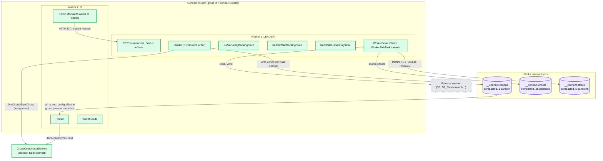
```mermaid
flowchart TB
  subgraph CL["Connect cluster (group.id = connect-cluster)"]
    subgraph W1["Worker 1 (LEADER)"]
      R1["REST /connectors, /status, /offsets"]
      H1["Herder (DistributedHerder)"]
      CB1["KafkaConfigBackingStore"]
      OB1["KafkaOffsetBackingStore"]
      SB1["KafkaStatusBackingStore"]
      T1["WorkerSourceTask / WorkerSinkTask threads"]
    end
    subgraph W2["Worker 2..N"]
      R2["REST (forwards writes to leader)"]
      H2["Herder"]
      T2["Task threads"]
    end
  end
  subgraph KT["Kafka internal topics"]
    CT[("__connect-configs<br/>compacted, 1 partition")]
    OT[("__connect-offsets<br/>compacted, 25 partitions")]
    ST[("__connect-status<br/>compacted, 5 partitions")]
  end
  GC["GroupCoordinatorService<br/>(protocol type: connect)"]
  EXT["External system<br/>(DB, S3, Elasticsearch…)"]

  R2 -->|"HTTP 307 / signed forward"| R1
  H1 -->|"write connector+task configs"| CT
  CT -->|"tail to end; config offset in<br/>group protocol metadata"| H2
  T1 -->|"source offsets"| OT
  T1 -->|"RUNNING / FAILED / PAUSED"| ST
  H1 -->|"JoinGroup/SyncGroup (assignment)"| GC
  H2 -->|"JoinGroup/SyncGroup"| GC
  T1 <-->|"read / write"| EXT

  class R1,H1,CB1,OB1,SB1,T1,R2,H2 service
  class T2,GC service
  class CT,OT,ST store
  class EXT external

  classDef client   fill:#dbeafe,stroke:#2563eb,stroke-width:2px,color:#111
  classDef service  fill:#dcfce7,stroke:#16a34a,stroke-width:2px,color:#111
  classDef store    fill:#ede9fe,stroke:#7c3aed,stroke-width:2px,color:#111
  classDef cache    fill:#fef3c7,stroke:#d97706,stroke-width:2px,color:#111
  classDef queue    fill:#cffafe,stroke:#0891b2,stroke-width:2px,color:#111
  classDef critical fill:#fee2e2,stroke:#dc2626,stroke-width:4px,color:#111
  classDef external fill:#e5e7eb,stroke:#6b7280,stroke-width:2px,color:#111,stroke-dasharray:4 3
  classDef decision fill:#fce7f3,stroke:#db2777,stroke-width:2px,color:#111
```

**What to notice**
- **`__connect-configs` must be a single partition** and compacted. It is a total order of configuration events; the offset of a worker's read position is carried in the group protocol so the leader can detect stale workers (`worker.sync.timeout.ms` 3 000, then back off `worker.unsync.backoff.ms` 300 000).
- The **leader worker** is just the group leader: it computes assignment and is the only writer of connector/task configs. Non-leader REST writes are forwarded to it — signed with a rotating session key under `connect.protocol=sessioned` (`inter.worker.key.ttl.ms` 3 600 000).
- `__connect-offsets` is compacted with **25 partitions** by default and is keyed by `[connectorName, sourcePartition]`. Sink connectors do **not** use it — their offsets are ordinary consumer-group offsets.
- `__connect-status` (5 partitions, compacted) is a fan-out topic: any worker writes state changes, every worker reads them so `/status` answers correctly from any node.
- All three topics need `cleanup.policy=compact` and a replication factor of 3 (defaults). Creating them with `delete` policy is a classic, and eventually fatal, misconfiguration.
- **Standalone mode** replaces all three with a local file (`offset.storage.file.filename`) and has no group, no leader, and no REST-based distribution — suitable only for single-node/dev.

---

## B3. Rebalance protocol

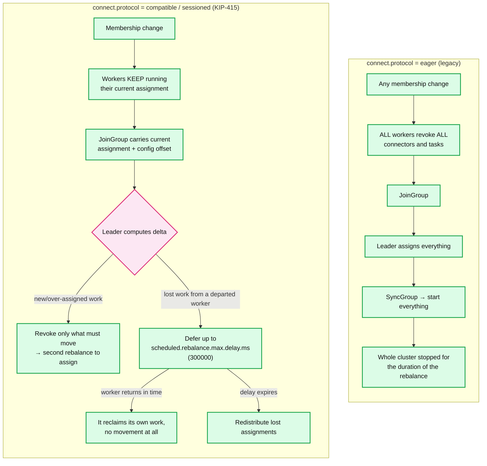
```mermaid
flowchart TB
  subgraph EAGER["connect.protocol = eager (legacy)"]
    direction TB
    E1["Any membership change"] --> E2["ALL workers revoke ALL<br/>connectors and tasks"]
    E2 --> E3["JoinGroup"] --> E4["Leader assigns everything"]
    E4 --> E5["SyncGroup → start everything"]
    E5 --> E6["Whole cluster stopped for<br/>the duration of the rebalance"]
  end
  subgraph COOP["connect.protocol = compatible / sessioned (KIP-415)"]
    direction TB
    C1["Membership change"] --> C2["Workers KEEP running<br/>their current assignment"]
    C2 --> C3["JoinGroup carries current<br/>assignment + config offset"]
    C3 --> C4{"Leader computes delta"}
    C4 -->|"new/over-assigned work"| C5["Revoke only what must move<br/>→ second rebalance to assign"]
    C4 -->|"lost work from a departed worker"| C6["Defer up to<br/>scheduled.rebalance.max.delay.ms<br/>(300000)"]
    C6 -->|"worker returns in time"| C7["It reclaims its own work,<br/>no movement at all"]
    C6 -->|"delay expires"| C8["Redistribute lost assignments"]
  end

  class E1,E2,E3,E4,E5,E6,C1,C2 service
  class C3,C5,C6,C7,C8 service
  class C4 decision

  classDef client   fill:#dbeafe,stroke:#2563eb,stroke-width:2px,color:#111
  classDef service  fill:#dcfce7,stroke:#16a34a,stroke-width:2px,color:#111
  classDef store    fill:#ede9fe,stroke:#7c3aed,stroke-width:2px,color:#111
  classDef cache    fill:#fef3c7,stroke:#d97706,stroke-width:2px,color:#111
  classDef queue    fill:#cffafe,stroke:#0891b2,stroke-width:2px,color:#111
  classDef critical fill:#fee2e2,stroke:#dc2626,stroke-width:4px,color:#111
  classDef external fill:#e5e7eb,stroke:#6b7280,stroke-width:2px,color:#111,stroke-dasharray:4 3
  classDef decision fill:#fce7f3,stroke:#db2777,stroke-width:2px,color:#111
```

**What to notice**
- `connect.protocol` valid values are **`eager`, `compatible`, `sessioned`**, default **`sessioned`** [documented]. `sessioned` = incremental cooperative **plus** session-key signing of inter-worker REST requests (KIP-507). `compatible` negotiates down to `eager` if any member is old.
- `scheduled.rebalance.max.delay.ms` (300 000 = 5 min) is the single most valuable Connect knob for rolling restarts: a bouncing worker gets its own connectors and tasks back with **zero** reassignment, so a rolling deploy causes no data movement.
- Cooperative rebalancing in Connect needs **two rounds** when work must move (revoke, then assign) — the same shape as the cooperative consumer assignor.
- The **config offset** is part of the protocol metadata. A worker that has not caught up on `__connect-configs` cannot be safely assigned work, so the leader forces it to re-sync first.
- The leader is a role, not a node type: any worker can be leader, and losing the leader costs one rebalance.

### B3.1 Config distribution sequence

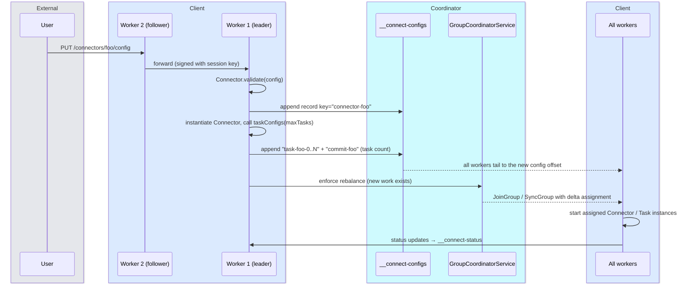
```mermaid
sequenceDiagram
  box rgb(229,231,235) External
    participant U as User
  end
  box rgb(219,234,254) Client
    participant W2 as Worker 2 (follower)
    participant W1 as Worker 1 (leader)
  end
  box rgb(207,250,254) Coordinator
    participant CT as __connect-configs
    participant GC as GroupCoordinatorService
  end
  box rgb(219,234,254) Client
    participant WN as All workers
  end

  U->>W2: PUT /connectors/foo/config
  W2->>W1: forward (signed with session key)
  W1->>W1: Connector.validate(config)
  W1->>CT: append record key="connector-foo"
  W1->>W1: instantiate Connector, call taskConfigs(maxTasks)
  W1->>CT: append "task-foo-0..N" + "commit-foo" (task count)
  CT-->>WN: all workers tail to the new config offset
  W1->>GC: enforce rebalance (new work exists)
  GC-->>WN: JoinGroup / SyncGroup with delta assignment
  WN->>WN: start assigned Connector / Task instances
  WN->>W1: status updates → __connect-status
```

**What to notice**
- The **commit record** is what makes a task-config change atomic: workers ignore `task-foo-N` records until the matching `commit-foo` record with the task count arrives. A crash mid-write leaves the old task set intact.
- `Connector.taskConfigs(maxTasks)` runs **only on the leader**, in the Connector instance — which is why a connector's `start()` may talk to the external system (to enumerate tables, shards, files) before any task exists.
- Configuration is versioned by log offset, not by a version field. "Which config is live" is answered by "how far have you read the config topic".
- Deleting a connector writes a **tombstone** to `__connect-configs`; compaction eventually removes it.

---

## B4. Connector and task lifecycle

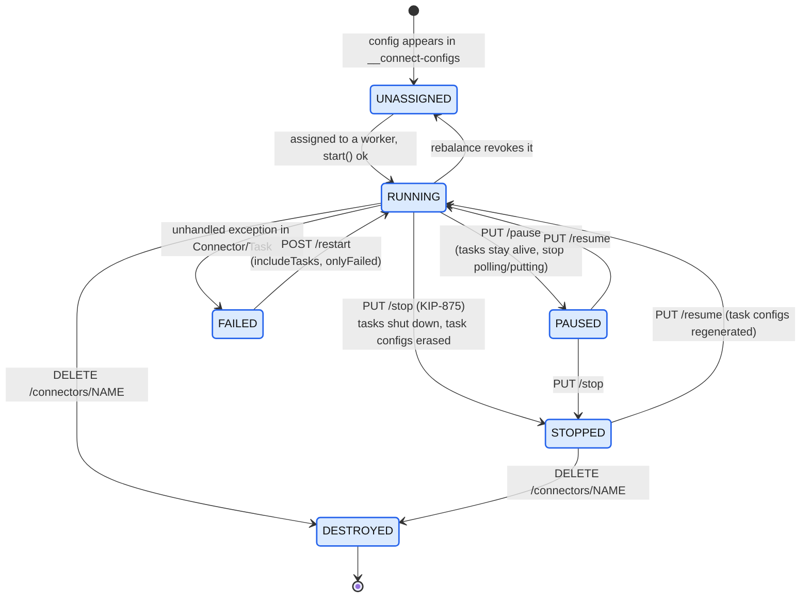
```mermaid
stateDiagram-v2
  [*] --> UNASSIGNED: config appears in __connect-configs
  UNASSIGNED --> RUNNING: assigned to a worker, start() ok
  RUNNING --> PAUSED: PUT /pause<br/>(tasks stay alive, stop polling/putting)
  PAUSED --> RUNNING: PUT /resume
  RUNNING --> STOPPED: PUT /stop (KIP-875)<br/>tasks shut down, task configs erased
  PAUSED --> STOPPED: PUT /stop
  STOPPED --> RUNNING: PUT /resume (task configs regenerated)
  RUNNING --> FAILED: unhandled exception in Connector/Task
  FAILED --> RUNNING: POST /restart<br/>(includeTasks, onlyFailed)
  RUNNING --> UNASSIGNED: rebalance revokes it
  RUNNING --> DESTROYED: DELETE /connectors/NAME
  STOPPED --> DESTROYED: DELETE /connectors/NAME
  DESTROYED --> [*]

  class UNASSIGNED,RUNNING,PAUSED,STOPPED,FAILED,DESTROYED client

  classDef client   fill:#dbeafe,stroke:#2563eb,stroke-width:2px,color:#111
```

**What to notice**
- **`PAUSED` vs `STOPPED` (KIP-875)** is the important distinction. `PAUSED` keeps tasks instantiated and **keeps consuming resources** — consumers stay in the sink connector's group, producers stay open, a rebalance still assigns them. `STOPPED` shuts tasks down, erases the task configs (task count → 0) and frees the resources, while retaining the connector config.
- `STOPPED` is a **precondition** for the offset-management endpoints: `PATCH /connectors/{name}/offsets` and `DELETE /connectors/{name}/offsets` require the connector to be stopped, because rewriting offsets under a running task is unsafe.
- **`FAILED` is per-instance.** A failed *task* does not fail the connector, and a failed connector does not stop its running tasks. `/status` reports both independently — always check `tasks[].state`, not just the connector state.
- `RestartRequest` (KIP-745): `POST /connectors/{name}/restart?includeTasks=<bool>&onlyFailed=<bool>` writes a **restart-request record to the config topic**; the leader reads it and restarts the matching instances cluster-wide, returning `202 Accepted` with the expected post-restart status. Without `includeTasks` it restarts only the Connector object, which is almost never what you want for a stuck pipeline.
- There is no automatic retry of a `FAILED` task. Connect deliberately does not restart failed tasks on its own — that is an operator decision (and a monitoring gap in most deployments).

---

## B5. Source connector data flow

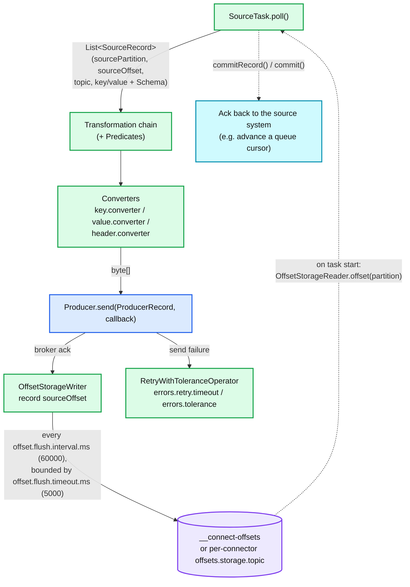
```mermaid
flowchart TB
  ST["SourceTask.poll()"] -->|"List&lt;SourceRecord&gt;<br/>(sourcePartition, sourceOffset,<br/>topic, key/value + Schema)"| SMT["Transformation chain<br/>(+ Predicates)"]
  SMT --> CONV["Converters<br/>key.converter / value.converter /<br/>header.converter"]
  CONV -->|"byte[]"| PROD["Producer.send(ProducerRecord, callback)"]
  PROD -->|"broker ack"| OW["OffsetStorageWriter<br/>record sourceOffset"]
  PROD -->|"send failure"| ERR["RetryWithToleranceOperator<br/>errors.retry.timeout / errors.tolerance"]
  OW -->|"every offset.flush.interval.ms (60000),<br/>bounded by offset.flush.timeout.ms (5000)"| OT[("__connect-offsets<br/>or per-connector offsets.storage.topic")]
  OT -.->|"on task start:<br/>OffsetStorageReader.offset(partition)"| ST
  ST -.->|"commitRecord() / commit()"| ACK["Ack back to the source system<br/>(e.g. advance a queue cursor)"]

  class PROD client
  class ST,SMT,CONV,OW,ERR service
  class OT store
  class ACK queue

  classDef client   fill:#dbeafe,stroke:#2563eb,stroke-width:2px,color:#111
  classDef service  fill:#dcfce7,stroke:#16a34a,stroke-width:2px,color:#111
  classDef store    fill:#ede9fe,stroke:#7c3aed,stroke-width:2px,color:#111
  classDef cache    fill:#fef3c7,stroke:#d97706,stroke-width:2px,color:#111
  classDef queue    fill:#cffafe,stroke:#0891b2,stroke-width:2px,color:#111
  classDef critical fill:#fee2e2,stroke:#dc2626,stroke-width:4px,color:#111
  classDef external fill:#e5e7eb,stroke:#6b7280,stroke-width:2px,color:#111,stroke-dasharray:4 3
  classDef decision fill:#fce7f3,stroke:#db2777,stroke-width:2px,color:#111
```

**What to notice**
- **Offsets are committed after the produce is acknowledged**, on a timer, not per record. Default `at_least_once`: a crash between the last ack and the next flush replays everything since the last flush — up to a minute of data by default.
- `SourceTask.poll()` is expected to **block** until records are available; returning an empty list in a tight loop burns CPU. The framework calls it on a single dedicated thread per task.
- `commitRecord(SourceRecord, RecordMetadata)` is the hook for acknowledging back to the source (deleting an SQS message, advancing a JMS cursor). It fires per record after the produce ack.
- **SMTs and converters run in the task thread**, so an expensive SMT directly reduces throughput. Predicates (KIP-585) gate an SMT: `TopicNameMatches`, `HasHeaderKey`, `RecordIsTombstone`, each with `negate`.
- **The DLQ does not apply to source connectors** — `errors.deadletterqueue.topic.name` is sink-only. A source connector with `errors.tolerance=all` silently drops bad records instead.

### B5.1 Exactly-once source (KIP-618)

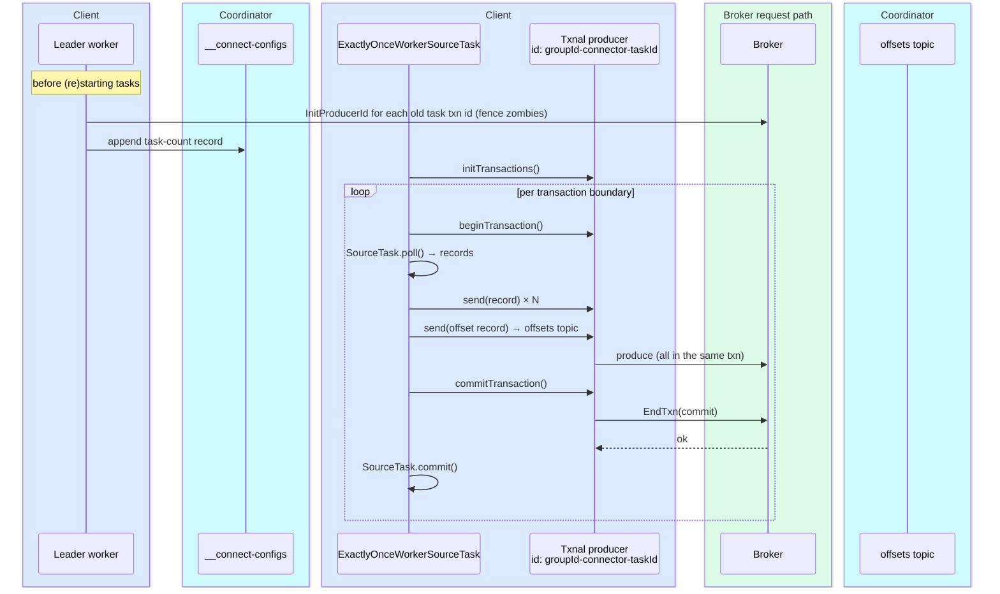
```mermaid
sequenceDiagram
  box rgb(219,234,254) Client
    participant L as Leader worker
  end
  box rgb(207,250,254) Coordinator
    participant CT as __connect-configs
  end
  box rgb(219,234,254) Client
    participant T as ExactlyOnceWorkerSourceTask
    participant P as Txnal producer<br/>id: groupId-connector-taskId
  end
  box rgb(220,252,231) Broker request path
    participant B as Broker
  end
  box rgb(207,250,254) Coordinator
    participant OT as offsets topic
  end

  Note over L: before (re)starting tasks
  L->>B: InitProducerId for each old task txn id (fence zombies)
  L->>CT: append task-count record
  T->>P: initTransactions()
  loop per transaction boundary
    T->>P: beginTransaction()
    T->>T: SourceTask.poll() → records
    T->>P: send(record) × N
    T->>P: send(offset record) → offsets topic
    P->>B: produce (all in the same txn)
    T->>P: commitTransaction()
    P->>B: EndTxn(commit)
    B-->>P: ok
    T->>T: SourceTask.commit()
  end
```

**What to notice**
- **Offsets move inside the transaction.** With EOS enabled, source offsets are written to the offsets topic **by the transactional producer**, so records and their offsets commit atomically. This is the whole trick — it removes the "produced but not offset-committed" replay window.
- `exactly.once.source.support` is a **worker** config with three values and requires **two rolling upgrades**: `disabled` → `preparing` (every worker learns the new offsets topic / fencing behaviour) → `enabled`. Skipping the `preparing` round on a live cluster is unsafe.
- **Zombie fencing** is explicit: before starting a connector's tasks, the leader calls `InitProducerId` against every task's transactional id, bumping the epoch so any surviving old task is fenced. The task count is recorded in the config topic so the leader knows how many ids to fence.
- **ACLs required** [documented]: workers need `Write`/`Describe` on TransactionalId `connect-cluster-${groupId}`; each task needs `Write`/`Describe` on `${groupId}-${connector}-${taskId}`.
- `transaction.boundary` (connector-level) = **`poll`** (default — one transaction per `poll()` return), `interval` (commit every `transaction.boundary.interval.ms`, falling back to `offset.flush.interval.ms` when unset), or `connector` (the connector calls `TransactionContext` itself to define boundaries). [documented — `SourceConnectorConfig` defines it with `TransactionBoundary.DEFAULT`, and `SourceTask.TransactionBoundary.DEFAULT = POLL`]
- Per-connector `exactly.once.support` = `requested` (default, best-effort) or `required` (fail to start unless `SourceConnector.exactlyOnceSupport()` returns `SUPPORTED`). [unverified default]
- EOS source connectors get a **dedicated per-connector offsets topic** by default (`offsets.storage.topic`), with the cluster-global topic read as a fallback for pre-existing offsets.
- **There is no exactly-once sink.** A sink's idempotence is the external system's problem; Connect gives you offsets in `preCommit()` so you can implement it yourself.

---

## B6. Sink connector data flow

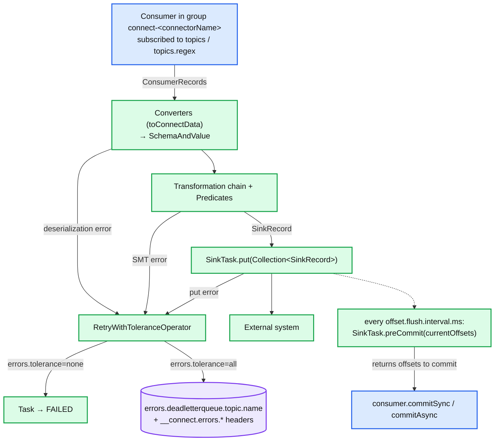
```mermaid
flowchart TB
  C["Consumer in group connect-&lt;connectorName&gt;<br/>subscribed to topics / topics.regex"] -->|"ConsumerRecords"| CONV["Converters (toConnectData)<br/>→ SchemaAndValue"]
  CONV -->|"deserialization error"| RTO["RetryWithToleranceOperator"]
  CONV --> SMT["Transformation chain + Predicates"]
  SMT -->|"SMT error"| RTO
  SMT -->|"SinkRecord"| PUT["SinkTask.put(Collection&lt;SinkRecord&gt;)"]
  PUT -->|"put error"| RTO
  PUT --> EXT["External system"]
  RTO -->|"errors.tolerance=none"| FAIL["Task → FAILED"]
  RTO -->|"errors.tolerance=all"| DLQ[("errors.deadletterqueue.topic.name<br/>+ __connect.errors.* headers")]
  PRE["every offset.flush.interval.ms:<br/>SinkTask.preCommit(currentOffsets)"] -->|"returns offsets to commit"| CMT["consumer.commitSync / commitAsync"]
  PUT -.-> PRE

  class C,CMT client
  class CONV,RTO,SMT,PUT,EXT,FAIL,PRE service
  class DLQ store

  classDef client   fill:#dbeafe,stroke:#2563eb,stroke-width:2px,color:#111
  classDef service  fill:#dcfce7,stroke:#16a34a,stroke-width:2px,color:#111
  classDef store    fill:#ede9fe,stroke:#7c3aed,stroke-width:2px,color:#111
  classDef cache    fill:#fef3c7,stroke:#d97706,stroke-width:2px,color:#111
  classDef queue    fill:#cffafe,stroke:#0891b2,stroke-width:2px,color:#111
  classDef critical fill:#fee2e2,stroke:#dc2626,stroke-width:4px,color:#111
  classDef external fill:#e5e7eb,stroke:#6b7280,stroke-width:2px,color:#111,stroke-dasharray:4 3
  classDef decision fill:#fce7f3,stroke:#db2777,stroke-width:2px,color:#111
```

**What to notice**
- **The consumer group is `connect-<connectorName>`.** That means sink offsets are ordinary consumer offsets in `__consumer_offsets` — inspectable and resettable with `kafka-consumer-groups.sh`, and *not* stored in `__connect-offsets`. It also means a sink connector's parallelism is capped by the topic's partition count, regardless of `tasks.max`.
- **`preCommit()` is the correctness hook.** Its return value is what actually gets committed. A sink that buffers internally must return only the offsets it has genuinely durably written; returning the passed-in offsets (the default implementation, which just calls `flush()`) claims everything in `put()` is durable.
- `SinkTask.open()` / `close()` fire on partition assignment/revocation — the place to open per-partition writers (files, batches) and flush them.
- The **DLQ is sink-only** and is written by a separate producer. `errors.deadletterqueue.context.headers.enable=true` adds `__connect.errors.topic`, `.partition`, `.offset`, `.exception.class.name`, `.exception.message`, `.stacktrace` headers — without it, the DLQ record is nearly undiagnosable.
- `errors.tolerance=all` with **no DLQ configured is silent data loss**. Always pair them.
- `errors.retry.timeout=0` means "do not retry at all" by default; a transient sink outage fails the task immediately.

---

## B7. Converters, SMTs, and plugin isolation

### B7.1 Converters

```
interface Converter {
  byte[]         fromConnectData(String topic, Schema schema, Object value);  // out
  SchemaAndValue toConnectData(String topic, byte[] value);                    // in
}
```

| Converter | Ships with | Schema handling |
|---|---|---|
| `JsonConverter` | Apache | `schemas.enable=true` (default) wraps every record as `{"schema":{...},"payload":{...}}` — self-describing but hugely verbose. `false` gives plain JSON and a `null` Connect schema. |
| `StringConverter` / `ByteArrayConverter` | Apache | No schema. `ByteArrayConverter` is the pass-through for binary mirroring. |
| `SimpleHeaderConverter` | Apache | **Default `header.converter`**; infers a schema from the string form of each header. |
| `AvroConverter` / `ProtobufConverter` / `JsonSchemaConverter` | Confluent (not Apache) | Schema Registry; 5-byte wire prefix (`0x00` magic byte + 4-byte big-endian schema id) followed by the payload. |

- Key and value converters are configured **independently**, at worker level with per-connector override. The classic production bug is a worker-level `JsonConverter` with `schemas.enable=true` inflating payloads 5–10×.
- Converters are also the schema-evolution boundary: `AvroConverter` enforces registry compatibility at write time; `JsonConverter` enforces nothing.

### B7.2 SMTs and predicates

- `Transformation<R extends ConnectRecord<R>>` with `R apply(R record)`. Built-ins include `InsertField`, `ReplaceField`, `MaskField`, `ValueToKey`, `HoistField`, `ExtractField`, `Cast`, `Flatten`, `TimestampConverter`, `TimestampRouter`, `RegexRouter`, `Filter`, `InsertHeader`, `DropHeaders`, `HeaderFrom`.
- Chained by name: `transforms=a,b` then `transforms.a.type=…`.
- Predicates (KIP-585): `predicates=isFoo`, `predicates.isFoo.type=org.apache.kafka.connect.transforms.predicates.TopicNameMatches`, then `transforms.a.predicate=isFoo` and optionally `transforms.a.negate=true`.
- SMTs are **per-record and synchronous**. They cannot join, aggregate, or look ahead — if you need that, the answer is Kafka Streams, not an SMT.

### B7.3 Classloader isolation

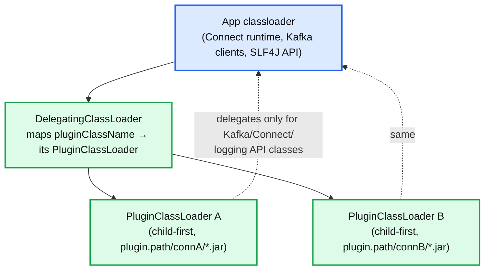
```mermaid
flowchart TB
  APP["App classloader<br/>(Connect runtime, Kafka clients, SLF4J API)"]
  DCL["DelegatingClassLoader<br/>maps pluginClassName → its PluginClassLoader"]
  PCL1["PluginClassLoader A<br/>(child-first, plugin.path/connA/*.jar)"]
  PCL2["PluginClassLoader B<br/>(child-first, plugin.path/connB/*.jar)"]

  APP --> DCL
  DCL --> PCL1
  DCL --> PCL2
  PCL1 -.->|"delegates only for Kafka/Connect/<br/>logging API classes"| APP
  PCL2 -.->|"same"| APP

  class APP client
  class DCL,PCL1,PCL2 service

  classDef client   fill:#dbeafe,stroke:#2563eb,stroke-width:2px,color:#111
  classDef service  fill:#dcfce7,stroke:#16a34a,stroke-width:2px,color:#111
  classDef store    fill:#ede9fe,stroke:#7c3aed,stroke-width:2px,color:#111
  classDef cache    fill:#fef3c7,stroke:#d97706,stroke-width:2px,color:#111
  classDef queue    fill:#cffafe,stroke:#0891b2,stroke-width:2px,color:#111
  classDef critical fill:#fee2e2,stroke:#dc2626,stroke-width:4px,color:#111
  classDef external fill:#e5e7eb,stroke:#6b7280,stroke-width:2px,color:#111,stroke-dasharray:4 3
  classDef decision fill:#fce7f3,stroke:#db2777,stroke-width:2px,color:#111
```

**What to notice**
- `PluginClassLoader` is **child-first**: a plugin's bundled `jackson` or `guava` wins over the runtime's. This is what lets two connectors depend on incompatible library versions in one JVM.
- Classes in the Connect/Kafka/logging API packages are always delegated to the parent, so `SourceRecord` and friends are the *same* class across the boundary.
- `Plugins.compareAndSwapLoaders()` swaps the **thread context classloader** around every call into plugin code. Plugins that spawn their own threads and rely on the TCCL break here — a recurring connector bug.
- `plugin.discovery` (KIP-898) = `only_scan` | **`hybrid_warn`** (default) | `hybrid_fail` | `service_load`. `service_load` uses `ServiceLoader` manifests and skips reflective scanning — dramatically faster worker startup, but only if every plugin ships manifests.
- **KIP-1273 (4.3)** introduces a `ConnectPlugin` interface that **all** Connect plugin types implement, giving a uniform surface (notably `version()`) across `Connector`, `Task`, `Converter`, `HeaderConverter`, `Transformation`, `Predicate`, `ConfigProvider`, `ConnectRestExtension` and `ConnectorClientConfigOverridePolicy`. Motivation: before this, "what version is this plugin and what does it accept" was answered differently (or not at all) per type, making `/connector-plugins` and validation inconsistent. [documented for the interface and intent; the exact implementing-type list is **[unverified]**]

---

## B8. MirrorMaker 2 as a Connect application

```mermaid
flowchart TB
  subgraph SRC["Source cluster: us-west"]
    ST1[("topic1")]
    HB[("heartbeats")]
    OS[("mm2-offset-syncs.us-east.internal<br/>(offset-syncs.topic.location=source)")]
    CO1[("__consumer_offsets")]
  end
  subgraph MM["MirrorMaker 2 (Connect workers)"]
    MSC["MirrorSourceConnector"]
    MCC["MirrorCheckpointConnector"]
    MHC["MirrorHeartbeatConnector"]
  end
  subgraph TGT["Target cluster: us-east"]
    ST2[("us-west.topic1")]
    HB2[("us-west.heartbeats")]
    CP[("us-west.checkpoints.internal")]
    CO2[("__consumer_offsets")]
  end

  ST1 -->|"consume"| MSC
  MSC -->|"produce (+ topic configs, ACLs)"| ST2
  MSC -->|"upstream↔downstream offset pairs<br/>every offset.lag.max=100"| OS
  OS --> MCC
  CO1 -->|"list group offsets"| MCC
  MCC -->|"translated offsets<br/>every emit.checkpoints.interval.seconds=60"| CP
  MCC -->|"if sync.group.offsets.enabled=true"| CO2
  MHC -->|"every emit.heartbeats.interval.seconds=1"| HB
  HB -->|"replicated by MirrorSourceConnector"| HB2

  class MSC,MCC,MHC service
  class ST1,HB,OS,CO1,ST2,HB2,CP,CO2 store

  classDef client   fill:#dbeafe,stroke:#2563eb,stroke-width:2px,color:#111
  classDef service  fill:#dcfce7,stroke:#16a34a,stroke-width:2px,color:#111
  classDef store    fill:#ede9fe,stroke:#7c3aed,stroke-width:2px,color:#111
  classDef cache    fill:#fef3c7,stroke:#d97706,stroke-width:2px,color:#111
  classDef queue    fill:#cffafe,stroke:#0891b2,stroke-width:2px,color:#111
  classDef critical fill:#fee2e2,stroke:#dc2626,stroke-width:4px,color:#111
  classDef external fill:#e5e7eb,stroke:#6b7280,stroke-width:2px,color:#111,stroke-dasharray:4 3
  classDef decision fill:#fce7f3,stroke:#db2777,stroke-width:2px,color:#111
```

**What to notice**
- MM2 is *literally* three Connect source connectors. Run it on an existing Connect cluster, or via the dedicated `connect-mirror-maker.sh` driver, which spins up its own embedded Connect clusters with internal topics `mm2-configs.<target>.internal`, `mm2-offsets.<target>.internal`, `mm2-status.<target>.internal`. [unverified — internal topic names not re-confirmed against 4.3]
- **Offset translation is approximate by design.** `MirrorSourceConnector` periodically emits `(upstreamOffset, downstreamOffset)` pairs into the offset-syncs topic — at most every `offset.lag.max` (100) records. `MirrorCheckpointConnector` interpolates from the nearest sync, so a failed-over consumer may replay up to ~`offset.lag.max` records. MM2 is at-least-once across clusters.
- `offset-syncs.topic.location` defaults to **`source`**, so the sync topic lives on the source cluster and is named after the *target* (`mm2-offset-syncs.<target>.internal`). Set it to `target` when the source cluster is read-only to MM2.
- `sync.group.offsets.enabled` is **`false`** by default. Without it, MM2 writes checkpoints but never touches the target's `__consumer_offsets` — consumers must use `RemoteClusterUtils` to translate offsets themselves at failover time.
- Heartbeats every **1 second** make end-to-end replication lag directly measurable (`heartbeats` timestamp vs now on the target).

### B8.1 Naming and active/active

- `DefaultReplicationPolicy`: remote topic = `<sourceAlias><separator><topic>`, `replication.policy.separator` default **`.`** → `us-west.topic1`.
- **Cycle prevention** falls out of the naming: `MirrorSourceConnector` asks the `ReplicationPolicy` for a topic's origin and refuses to re-replicate a topic that originated in the target cluster. Defining `A->B` and `B->A` in one config file therefore needs no `topics.exclude` gymnastics.
- Active/active consumption pattern: subscribe to `topic1|.*\.topic1` so a consumer reads local *and* mirrored data, with no ambiguity about origin.
- `IdentityReplicationPolicy` keeps the original topic name (MM1 parity, simpler consumer config) — but it **destroys cycle prevention**, so it is only safe for strictly unidirectional replication.
- `RemoteClusterUtils`: `translateOffsets(props, targetAlias, groupId, timeout)` for a single group; **KIP-1239 (4.3)** adds a batch `translateOffsets()` that translates committed offsets for **several consumer groups at once**, cutting the round-trips in a large failover from O(groups) to O(1) — a meaningful RTO improvement when a DR runbook has to move hundreds of groups. [documented]
- **KIP-1280 (4.3)**: `metric.names.formats` on `MirrorSourceConnector` and `MirrorCheckpointConnector`, default **`legacy`**, opts into KIP-877-style metric names. Legacy names are deprecated for removal in **5.0** — switch and update dashboards before then. [documented]

---

## B9. Kafka Connect config tables (verified against the 4.3 config reference)

### Worker (distributed)

| Config | Default | Notes |
|---|---|---|
| `group.id` | *(required)* | Connect cluster identity. Also the transactional-id prefix under EOS. |
| `connect.protocol` | `sessioned` | Values `eager`, `compatible`, `sessioned`. |
| `scheduled.rebalance.max.delay.ms` | `300000` | Deferral window for a departed worker's tasks. The rolling-restart knob. |
| `rebalance.timeout.ms` | `60000` | Max time for workers to rejoin. |
| `session.timeout.ms` | `10000` | Worker liveness. |
| `heartbeat.interval.ms` | `3000` | Worker heartbeat cadence. |
| `worker.sync.timeout.ms` | `3000` | Time to catch up on the config topic before backing off. |
| `worker.unsync.backoff.ms` | `300000` | Backoff after failing to sync configs. |
| `inter.worker.key.ttl.ms` | `3600000` | Session-key rotation period (`sessioned`). |
| `offset.flush.interval.ms` | `60000` | Source offset commit **and** sink `preCommit` cadence. |
| `offset.flush.timeout.ms` | `5000` | Bound on a single offset flush. |
| `task.shutdown.graceful.timeout.ms` | `5000` | Grace period before a task is force-stopped. |
| `config.storage.topic` | *(required)* | **Must be single-partition + compacted.** |
| `config.storage.replication.factor` | `3` | |
| `offset.storage.topic` | *(required)* | Compacted. |
| `offset.storage.partitions` | `25` | |
| `offset.storage.replication.factor` | `3` | |
| `status.storage.topic` | *(required)* | Compacted. |
| `status.storage.partitions` | `5` | |
| `status.storage.replication.factor` | `3` | |
| `exactly.once.source.support` | `disabled` | `disabled` → `preparing` → `enabled`, two rolling upgrades. |
| `plugin.discovery` | `hybrid_warn` | `service_load` for fastest startup. |
| `header.converter` | `org.apache.kafka.connect.storage.SimpleHeaderConverter` | |
| `key.converter` / `value.converter` | *(required)* | No default; set at worker level, override per connector. |
| `listeners` | `http://:8083` | REST bind address. |
| `topic.creation.enable` | `true` | Allows source connectors to create their target topics. |
| `connector.client.config.override.policy` | `All` | `None` / `Principal` / `All`. `All` lets a connector override any client config. |
| `response.http.headers.config` | `""` | Security headers on the REST API. |
| `config.providers` | `""` | Externalised secrets (`${file:…}`, `${vault:…}`). |

### Connector-level

| Config | Default | Notes |
|---|---|---|
| `tasks.max` | `1` | Sinks are additionally capped by partition count. |
| `tasks.max.enforce` | `true` *(deprecated)* | Fails a connector that returns more task configs than `tasks.max`. |
| `errors.tolerance` | `none` | `all` tolerates — **pair with a DLQ or you lose data silently**. |
| `errors.retry.timeout` | `0` | Zero = no retries at all. |
| `errors.retry.delay.max.ms` | `60000` | Exponential backoff ceiling. [documented] |
| `errors.log.enable` | `false` | |
| `errors.log.include.messages` | `false` | Logs record keys/values — a PII hazard. |
| `errors.deadletterqueue.topic.name` | `""` (disabled) | **Sink connectors only.** |
| `errors.deadletterqueue.topic.replication.factor` | `3` | [documented] |
| `errors.deadletterqueue.context.headers.enable` | `false` | Turn on — without it a DLQ record has no diagnostics. [documented] |
| `transaction.boundary` | `poll` | `poll` / `interval` / `connector` (EOS source). `SourceTask.TransactionBoundary.DEFAULT = POLL`. [documented] |
| `transaction.boundary.interval.ms` | `null` (unset) → falls back to `offset.flush.interval.ms` | [documented] |
| `exactly.once.support` | `requested` | `required` fails the connector if it cannot do EOS. [documented] |

### MirrorMaker 2

| Config | Default | Notes |
|---|---|---|
| `replication.policy.class` | `org.apache.kafka.connect.mirror.DefaultReplicationPolicy` | `IdentityReplicationPolicy` loses cycle prevention. |
| `replication.policy.separator` | `.` | |
| `replication.factor` | `2` | RF of **replicated** topics. Raise to 3. |
| `checkpoints.topic.replication.factor` | `3` | |
| `offset-syncs.topic.replication.factor` | `3` | |
| `heartbeats.topic.replication.factor` | `3` | |
| `refresh.topics.interval.seconds` | `600` | New-topic discovery lag. |
| `refresh.groups.interval.seconds` | `600` | |
| `emit.checkpoints.enabled` | `true` | |
| `emit.checkpoints.interval.seconds` | `60` | Failover offset freshness. |
| `emit.heartbeats.enabled` | `true` | |
| `emit.heartbeats.interval.seconds` | `1` | |
| `sync.group.offsets.enabled` | `false` | **Off by default** — turn on for automatic failover offsets. |
| `sync.group.offsets.interval.seconds` | `60` | |
| `sync.topic.configs.enabled` | `true` | |
| `sync.topic.acls.enabled` | `true` | |
| `offset-syncs.topic.location` | `source` | `target` when the source is read-only. |
| `offset.lag.max` | `100` | Offset-sync granularity ⇒ replay bound at failover. |
| `consumer.poll.timeout.ms` | `1000` | |
| `metric.names.formats` | `legacy` | **KIP-1280 (4.3)** — opt into KIP-877 names; legacy removed in 5.0. |
| `tasks.max` | `1` | Docs recommend ≥ 2 (preferably higher) for real replication. |
| `topics` | `.*` | |
| `groups` | `.*` | |

---

## B10. Kafka Connect failure modes

| Failure | Detection | Recovery | Blast radius |
|---|---|---|---|
| **Config topic not compacted / multi-partition** | Connectors vanish or resurrect after retention; workers disagree on config | Recreate the topic correctly and restore configs; there is no in-place fix for partition count | Whole cluster; silent config loss |
| **Eager rebalance storm** — `connect.protocol=eager` on a large cluster | Every membership change stops all tasks | Move to `sessioned`; raise `scheduled.rebalance.max.delay.ms` | Whole cluster, seconds to minutes each time |
| **Failed task not restarted** — Connect never auto-restarts | `/status` shows `tasks[].state=FAILED` while the connector shows `RUNNING` | Alert on **task** state, not connector state; `POST /restart?includeTasks=true&onlyFailed=true` | One partition-set of one connector; often unnoticed for days |
| **`errors.tolerance=all` with no DLQ** | Records disappear, no error anywhere | Configure the DLQ + context headers; alert on DLQ rate | Silent, unbounded data loss |
| **Source offset replay after crash** | Duplicates downstream | Enable EOS source (KIP-618), or make the sink idempotent | Up to `offset.flush.interval.ms` (60 s) of records |
| **Sink `preCommit()` over-reports** — connector commits offsets for buffered-not-durable records | Data loss on task restart with no error | Fix `preCommit()` to return only durable offsets | Silent loss at every restart |
| **Converter/schema mismatch** — `JsonConverter` reading Avro bytes | Immediate task `FAILED` with `DataException` | Correct converter; DLQ for mixed-format topics | One connector |
| **Classloader conflict** — plugin and runtime disagree on a shared library | `NoSuchMethodError` / `LinkageError` at task start | Correct `plugin.path` layout (one directory per plugin, not a shared lib dir) | One connector; can destabilise a worker |
| **EOS source upgrade skipped `preparing`** | Zombie tasks double-write | Roll back to `disabled`, redo the two-phase upgrade | Duplicate data in output topics |
| **MM2 offset translation gap** | Consumers replay after failover | Lower `offset.lag.max`; enable `sync.group.offsets.enabled` | Up to `offset.lag.max` records per group |
| **MM2 replication cycle** — `IdentityReplicationPolicy` in active/active | Topics grow without bound; infinite loop | Use `DefaultReplicationPolicy`, or explicit `topics.exclude` | Cluster-wide storage exhaustion |

---

# CROSS-CUTTING

## C1. Guarantees

| Guarantee | Kafka Streams | Kafka Connect |
|---|---|---|
| **Delivery** | ALOS by default; EOS via `exactly_once_v2` covering output + changelog + offsets in one transaction | Source: ALOS by default, EOS via KIP-618. **Sink: at-least-once only** — idempotence is the external system's job |
| **Ordering** | Per key, per partition, within a subtopology. Broken by any repartition (new key ⇒ new partition) | Per partition end-to-end for sinks; source ordering is whatever the connector emits |
| **Consistency of state** | Local store is eventually consistent with the changelog; after KIP-1035 the persisted offset always matches the persisted data | Source offsets are eventually consistent with produced data (ALOS) or atomic with it (EOS) |
| **Durability** | Only what is in the changelog survives instance loss. Governed by changelog RF and `min.insync.replicas` | Only what is in `__connect-configs`/`__connect-offsets` survives worker loss |
| **Availability during rebalance** | Cooperative + KIP-441 warm-ups keep active tasks serving; IQ can serve stale reads from standbys | Incremental cooperative keeps unaffected tasks running; `scheduled.rebalance.max.delay.ms` avoids movement entirely on a bounce |
| **Time semantics** | Event time via `TimestampExtractor`; stream time is per-task and record-driven | None — Connect has no time model |

## C2. Scalability and performance

- **Streams parallelism ceiling is the partition count** of the widest source topic in each subtopology. Adding threads or instances past the task count does nothing. Repartitioning a live app's topics is a data-migration project, so pick partition counts for 3 years out.
- **Streams throughput bottlenecks**, in the order they usually bite: (1) RocksDB write amplification and compaction stalls, (2) changelog produce under EOS (`commit.interval.ms=100` means 10 transactions/sec/thread and a txn marker per changelog partition), (3) repartition topic round-trips, (4) `ThreadCache` misses causing downstream fan-out.
- **Hot partitions** are unfixable inside Streams — a skewed key routes to one task, and that task is one thread. The mitigations are all upstream: salt the key, or pre-aggregate.
- **Connect source parallelism** is whatever the connector declares in `taskConfigs()`, bounded by `tasks.max`. **Connect sink parallelism** is `min(tasks.max, partitions)`. A sink with `tasks.max=32` on an 8-partition topic runs 24 idle tasks that still consume assignment slots.
- **Connect back-pressure** is `consumer.max.poll.records` and `max.poll.interval.ms`: a slow `put()` that exceeds `max.poll.interval.ms` gets the task kicked from its group, which looks like a rebalance loop.
- **Batching** is the single biggest Connect lever: batch on the sink side inside `put()` and only advance `preCommit()` when the batch lands.

## C3. Trade-offs and alternatives

- **Changelog-to-Kafka vs replicated local state (Flink/Samza style)**: Streams gets zero external dependencies and free durability from the log, at the cost of restore time proportional to state size, and a hard coupling between state layout and topic layout. Flink's checkpoint/savepoint model to object storage restores faster for very large state and supports rescaling; Streams cannot rescale a keyed store beyond its partition count.
- **KIP-441 warm-ups vs Flink savepoint rescale**: both avoid stop-the-world, but Streams' version is *incremental and continuous* (probing rebalances) rather than a coordinated barrier. That is cheaper, but convergence is not bounded.
- **KIP-1071 broker-side assignment vs client-side assignor**: moving assignment into the coordinator kills the "leader member computes everything" scalability wall and removes the JoinGroup/SyncGroup barrier — the same win KIP-848 gave consumers. The 4.3 cost is the missing HA assignor, which is a real regression for stateful apps. This is a *temporary* trade-off, not a permanent design one.
- **Connect vs writing your own consumer**: Connect buys you config management, offset handling, rebalancing, DLQs, SMTs and a REST control plane. It costs you a JVM cluster to operate, a plugin/classloader model to debug, and single-threaded tasks. Below ~3 pipelines, a plain consumer app is often simpler.
- **Connect vs Streams for transformation**: SMTs are per-record and stateless by construction. Any join, aggregation or windowing belongs in Streams (or ksqlDB/Flink). Attempting stateful logic in an SMT is the most common Connect design error.
- **MM2 vs Cluster Linking (Confluent) / uReplicator**: MM2 is a Connect app, so it re-produces records and therefore **changes offsets**, requiring translation. Cluster Linking preserves offsets by replicating at the log level — simpler failover, but proprietary and less flexible about topic renaming.

## C4. Staff-level questions

1. **You run `exactly_once_v2` with 200 partitions and 4 instances. Your p99 end-to-end latency is 400 ms and you cannot explain it.** Walk the transaction path and name the two configs that set the floor, and explain why raising `commit.interval.ms` to 1 s would make throughput *better* and latency *worse* — and what `read_committed` on the downstream consumer has to do with it.
2. **In Kafka 4.3, argue for or against setting `group.protocol=streams` on a 2 TB-of-state, 300-task application.** Name the specific capability you lose, what it costs you during a node failure, and what would have to change in a later release to flip your answer.
3. **A join in your topology intermittently drops records that clearly exist in both input topics.** Explain the mechanism using `PartitionGroup`, stream time and `max.task.idle.ms`, and describe the two fixes and the latency each one costs.
4. **Explain precisely why KIP-1035 is a *correctness* fix and not just a performance fix.** Describe the exact crash interleaving that produced a wrong restore point before 4.3, and state what an operator must do differently when downgrading from 4.3 to 4.2.
5. **A Connect sink connector reports `RUNNING` while its output has been frozen for six hours.** Enumerate the states and endpoints you would check in order, explain why the connector state is the wrong signal, and describe how `preCommit()` could make this failure silent and lossy rather than merely stalled.

---

## C5. Sources

**Apache Kafka 4.3 documentation (primary, all defaults verified here)**
- [Apache Kafka 4.3.0 Release Announcement](https://kafka.apache.org/blog/2026/05/22/apache-kafka-4.3.0-release-announcement/)
- [Kafka Streams configuration reference (4.3)](https://kafka.apache.org/43/streams/developer-guide/config-streams/)
- [Kafka Streams upgrade guide (4.3)](https://kafka.apache.org/43/streams/upgrade-guide/)
- [Streams Rebalance Protocol (4.3)](https://kafka.apache.org/43/streams/developer-guide/streams-rebalance-protocol/) — KIP-1071 maturity and limitations
- [Interactive Queries (4.3)](https://kafka.apache.org/43/streams/developer-guide/interactive-queries/)
- [Migrating from Streams Scala to the Java API (4.3)](https://kafka.apache.org/43/streams/developer-guide/scala-migration/)
- [Kafka Connect configuration reference (4.3)](https://kafka.apache.org/43/configuration/kafka-connect-configs/)
- [Kafka Connect user guide (4.3)](https://kafka.apache.org/43/kafka-connect/user-guide/)
- [MirrorMaker configuration reference (4.3)](https://kafka.apache.org/43/configuration/mirrormaker-configs/)
- [Geo-Replication / Cross-Cluster Data Mirroring (4.3)](https://kafka.apache.org/43/operations/geo-replication-cross-cluster-data-mirroring/)

**KIPs**
- [KIP-1035: StateStore managed changelog offsets](https://cwiki.apache.org/confluence/display/KAFKA/KIP-1035:+StateStore+managed+changelog+offsets) (and [KAFKA-17411](https://issues.apache.org/jira/browse/KAFKA-17411))
- [KIP-1071: Streams Rebalance Protocol](https://cwiki.apache.org/confluence/display/KAFKA/KIP-1071:+Streams+Rebalance+Protocol)
- [KIP-1244: Drop support for streams-scala in Kafka 5.0 (deprecate in 4.3)](https://cwiki.apache.org/confluence/pages/viewpage.action?pageId=399278767)
- [KIP-892: Transactional Semantics for StateStores](https://cwiki.apache.org/confluence/display/KAFKA/KIP-892:+Transactional+Semantics+for+StateStores) — *not in 4.3*
- [KIP-848: The Next Generation of the Consumer Rebalance Protocol](https://cwiki.apache.org/confluence/display/KAFKA/KIP-848%3A+The+Next+Generation+of+the+Consumer+Rebalance+Protocol) — the pattern KIP-1071 follows
- [KIP-898: Modernize Connect plugin discovery](https://cwiki.apache.org/confluence/display/KAFKA/KIP-898:+Modernize+Connect+plugin+discovery)
- [KIP-607: RocksDB property metrics](https://cwiki.apache.org/confluence/display/KAFKA/KIP-607:+Add+Metrics+to+Kafka+Streams+to+Report+Properties+of+RocksDB)
- KIP-1250 (in-memory store size metric), KIP-1259 (`state.cleanup.dir.max.age.ms`), KIP-1270 (`processing.exception.handler.global.enabled`), KIP-1271 / KIP-1285 (headers in state stores), KIP-1273 (`ConnectPlugin`), KIP-1239 (batch `RemoteClusterUtils.translateOffsets()`), KIP-1280 (`metric.names.formats`) — all summarised in the 4.3 release announcement above.
- Historical, referenced for design lineage: KIP-441 (HA task assignor), KIP-447 (EOS producer-per-thread), KIP-415 (incremental cooperative Connect rebalancing), KIP-507 (session-key signing), KIP-618 (EOS source connectors), KIP-745 (`RestartRequest`), KIP-875 (`STOPPED` state + offset endpoints), KIP-585 (SMT predicates), KIP-671 (`StreamsUncaughtExceptionHandler`), KIP-695 (`max.task.idle.ms` semantics), KIP-1033 (`ProcessingExceptionHandler`), KIP-877 (Connect/MM2 metrics framework).

**Secondary (cross-checks on 4.3 KIP maturity)**
- [Confluent: Apache Kafka 4.3 released — 25 KIPs](https://www.confluent.io/blog/apache-kafka-4-3-release/)
- [Factor House: Apache Kafka 4.3.0 — a guide for platform engineers](https://factorhouse.io/articles/apache-kafka-4-3-0/)
</content>
</invoke>

---

<!-- nav:start -->
[← 06 Broker Pipeline](kafka-06-broker-request-pipeline.md) · **[Index](README.md)** · [08 Scale & Operations →](kafka-08-scale-and-operations.md)
<!-- nav:end -->
