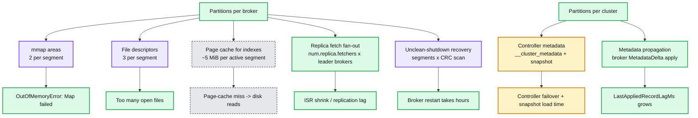
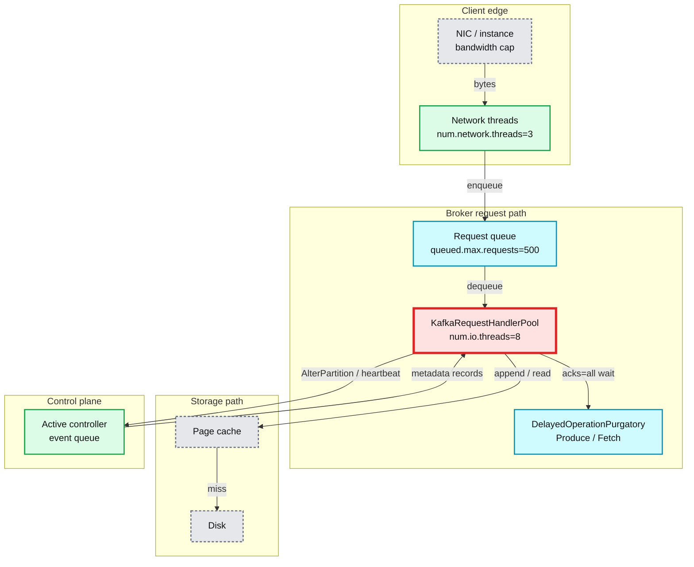
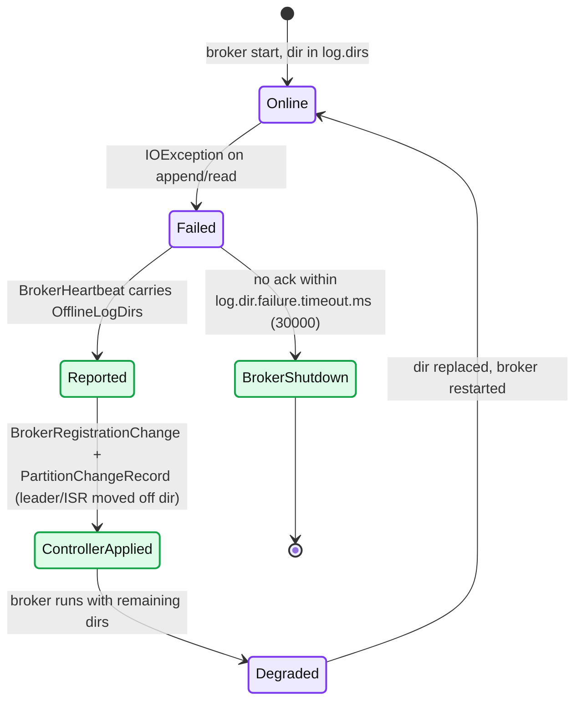
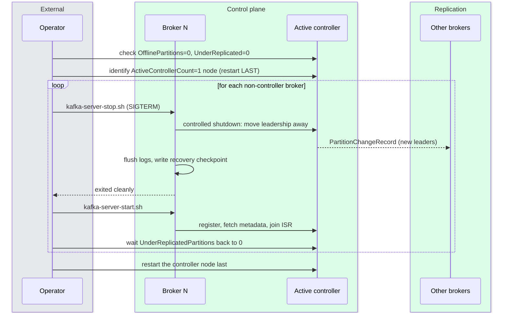
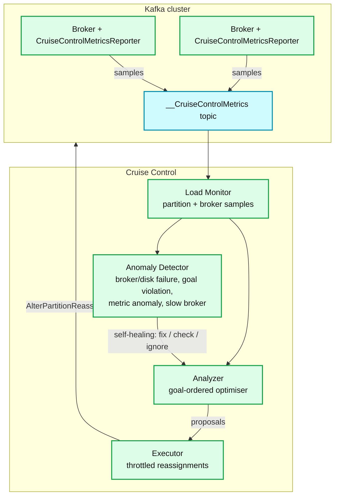

# Kafka 08 — Scale, Performance and Operations

> Report 08 of the Apache Kafka deep-dive series. **Series baseline: Apache Kafka 4.3** — 4.3.0 released 2026-05-22, latest patch **4.3.1** released 2026-06-25. Everything here is against that release unless a version is named; defaults were verified against its source tree (`ServerLogConfigs`, `ServerConfigs`, `ReplicationConfigs`, `SocketServerConfigs`, `KRaftConfigs`, `QuorumConfig`, `LogConfig`, `CleanerConfig`), not taken from memory.
>
> **[documented]** = stated in Apache Kafka docs/source or a cited vendor doc. **[inferred]** = derived arithmetic or field experience; the derivation is shown so you can re-run it with your own numbers.

---

<!-- nav:start -->
[← 07 Streams & Connect](kafka-07-streams-connect.md) · **[Index](README.md)** · [09 Version Delta →](kafka-09-version-delta.md)
<!-- nav:end -->

<!-- toc:start -->
<details>
<summary><b>Sections in this report (16)</b></summary>

- [1. Overview](#1-overview)
- [2. The scale envelope](#2-the-scale-envelope)
- [3. Where a Kafka cluster actually saturates — in order](#3-where-a-kafka-cluster-actually-saturates--in-order)
- [4. Capacity planning arithmetic](#4-capacity-planning-arithmetic)
- [5. Metric reference](#5-metric-reference)
- [6. Consumer lag: what it is and what it is not](#6-consumer-lag-what-it-is-and-what-it-is-not)
- [7. OS and JVM tuning](#7-os-and-jvm-tuning)
- [8. Operations runbook](#8-operations-runbook)
- [9. Consumer-side and quota controls worth knowing](#9-consumer-side-and-quota-controls-worth-knowing)
- [10. Cruise Control and the rebalancing gap](#10-cruise-control-and-the-rebalancing-gap)
- [11. Multi-datacenter](#11-multi-datacenter)
- [12. Failure modes](#12-failure-modes)
- [13. Cost model](#13-cost-model)
- [14. Trade-offs and where Kafka's operational model is weak](#14-trade-offs-and-where-kafkas-operational-model-is-weak)
- [15. Staff-level questions](#15-staff-level-questions)
- [16. Sources](#16-sources)

</details>
<!-- toc:end -->

## 1. Overview

- Kafka's scale story is **not** "how many messages per second" — a single broker on modern hardware saturates its NIC long before it saturates its CPU. The real limits are **partition count** (metadata, file descriptors, mmap areas, fetch fan-out) and **network egress amplification**.
- KRaft moved the partition ceiling from "tens of thousands" to "millions" by turning cluster metadata into a replicated log that every controller already has in memory, removing the ZooKeeper read-and-reload step from controller failover. Confluent's lab test ran **2 million partitions**, "10 times the maximum number of partitions for a cluster running ZooKeeper". [documented]
- The dominant *cost* driver in cloud Kafka is not compute or disk — it is **cross-AZ network**, because replication factor 3 deterministically multiplies every written byte by 2 across zone boundaries.
- Apache Kafka ships **no rebalancer**. Partition placement is decided once at topic-creation time and never revisited. This is the single largest operational gap in the project and the reason Cruise Control exists.
- Everything you monitor collapses to about a dozen metrics. The rest is forensics.

---

## 2. The scale envelope

### 2.1 Documented partition numbers

| Claim | Number | Source |
|---|---|---|
| ZK-mode recommended max per broker | **4,000 partitions** | Confluent, *Apache Kafka Supports 200K Partitions Per Cluster* |
| ZK-mode recommended max per cluster | **200,000 partitions** | same |
| ZK controlled shutdown, 5 brokers × 10k partitions | 6.5 min (1.0.0) → **3 s** (1.1.0) | same |
| ZK controller state reload, 5 brokers, 100k partitions | 28 s (1.0.0) → **14 s** (1.1.0) | same |
| KRaft lab test | **2,000,000 partitions**, "10× the maximum … for a cluster running ZooKeeper" | Confluent *KRaft Overview* |
| KRaft controller sizing | **5 GB RAM + 5 GB disk** on the metadata log dir is "sufficient" for a typical cluster | Apache Kafka docs, *KRaft → Deploying Considerations* |
| KRaft quorum size | 3 or 5 controllers; tolerates `N` failures with `2N+1` voters | Apache Kafka docs, *KRaft* |
| LinkedIn reference cluster | 60 brokers, 50k partitions (RF 2), 800k msg/s, 300 MB/s in, 1 GB/s+ out, 90th-pct GC pause ≈ 21 ms | Apache Kafka docs, *Java Version* |

**The honest reading of "2 million partitions":** that number measures *controller metadata capacity and failover time*, not a workload you should run. The 200k/4k ZK guidance was a **controller-failover-time** limit; KRaft removes that specific bottleneck and leaves you with the broker-side limits below, which KRaft does nothing about. Per-broker partition guidance did not become 10× more generous. [inferred]

### 2.2 Per-partition cost, itemised

For one partition on one broker, with `log.segment.bytes` = 1 GiB (default) and `S` segments retained:

| Resource | Cost | Mechanism |
|---|---|---|
| File descriptors | `3 × S` (`.log`, `.index`, `.timeindex`; `+1` per segment with a `.txnindex`) | `FileRecords` holds the `.log` channel open; `mmap()` keeps a reference to the index file that `close()` does not release [documented, Kafka OS docs] |
| **mmap areas** (`vm.max_map_count`) | **`2 × S`** | "each log segment uses 2 map areas … creating 50000 partitions on a broker will result allocation of 100000 map areas and likely cause broker crash with `OutOfMemoryError (Map failed)`" [documented] |
| Index page cache (active segment) | `segment.bytes / log.index.interval.bytes` entries × (8 B offset + 12 B time) | `OffsetIndex.ENTRY_SIZE = 8`, `TimeIndex.ENTRY_SIZE = 12`; default `log.index.interval.bytes = 4096` |
| Index file size on disk (active segment) | preallocated to `log.index.size.max.bytes` = **10 MiB** each, trimmed on roll | `AbstractIndex` → `raf.setLength(roundDownToExactMultiple(maxIndexSize, entrySize()))` on create; `trimToValidSize()` on close |
| Replica-fetcher share | `1 / num.replica.fetchers` of a thread, per leader broker | `AbstractFetcherManager.getFetcherId()` = `hash(tp) % numFetchersPerBroker`, keyed by `BrokerIdAndFetcherId` |
| Controller metadata | one `PartitionRecord` + a `PartitionChangeRecord` per ISR/leader change | `__cluster_metadata` |

**Worked index arithmetic.** A full 1 GiB segment at `log.index.interval.bytes=4096` produces `1 GiB / 4096 = 262,144` index entries → **2 MiB** offset index + **3 MiB** time index = 5 MiB of index that must stay hot for a binary search to not hit disk. A broker with 2,000 active partitions therefore wants ~10 GiB of page cache **for indexes alone**, before a single record byte is cached. [inferred]

**Worked FD / map-area arithmetic.** 2,000 partitions × 30 GiB each = 30 segments per partition:

```
fds       = 2000 × 30 × 3 = 180,000        → 100,000 nofile is NOT enough
map areas = 2000 × 30 × 2 = 120,000        → default vm.max_map_count ≈ 65,530 → broker crashes
```

This is exactly the failure the Kafka docs warn about, and it is the most common "we scaled partitions and the broker died with `Map failed`" incident. [inferred from documented mechanism]

> **Mitigation the source gives you:** `LazyIndex` defers the `mmap()` of a segment's indexes until something actually reads that segment. A cold, never-read historical segment costs an fd but *not* a map area until touched — which is why a cold-read storm can push `vm.max_map_count` over the edge at 03:00 on a broker that was fine all day. [inferred from `LazyIndex.java`]

### 2.3 Why each ceiling exists



**What to notice**
- Two of the five broker-side limits (`mmap`, `fds`) are *OS* limits, not Kafka limits — they fail hard and abruptly, not gracefully.
- Only the two right-hand cluster-level boxes are what KRaft improved. KRaft did **not** make a broker able to host more partitions.
- Recovery time scales with *segments*, not partitions — so `log.segment.bytes` is an availability knob, not just a storage knob.
- Fetch fan-out scales with the number of *distinct leader brokers* you follow, which grows with cluster size, not with partition count alone.

### 2.4 Practical guidance

| Situation | Guidance | Why |
|---|---|---|
| Default, no special tuning | ≤ **4,000 partitions/broker** | The original ZK-era number survives because it is roughly where FD/map-area/index-cache pressure starts on a stock box. [inferred] |
| Tuned (`nofile ≥ 500k`, `vm.max_map_count ≥ 262144`, big page cache) | 10k–20k partitions/broker is achievable | Confluent's own guidance is `vm.max_map_count` ≥ 262144 |
| Cluster total, KRaft | 200k is comfortable; 1M+ is demonstrated but exotic | Controller memory ≈ 5 GB documented for typical clusters |
| Partitions with heavy transaction use | lower — producer state and `.txnindex` add per-partition cost | `ProducerIdCount` metric exists for exactly this |

---

## 3. Where a Kafka cluster actually saturates — in order

This is the order in which real clusters hit walls. Each row names the *one* metric that proves it.

| # | Bottleneck | Diagnostic metric | Threshold / read |
|---|---|---|---|
| 1 | **Network bandwidth** (cloud instances cap *aggregate* in+out) | `kafka.server:type=BrokerTopicMetrics,name=BytesInPerSec` + `BytesOutPerSec` + `ReplicationBytesInPerSec` + `ReplicationBytesOutPerSec` | Sum all four; compare to the instance's documented bandwidth, not the NIC's nameplate |
| 2 | **Disk write throughput** | `kafka.log:type=LogFlushStats,name=LogFlushRateAndTimeMs` (99th pct), plus OS `%util` / `await` | Flush time rising with flat byte rate = the device is the limit |
| 3 | **Page-cache miss → disk *reads*** | OS: `iostat` read throughput ≫ 0 on a write-mostly cluster; correlate with `RemoteTimeMs`/`LocalTimeMs` on `FetchConsumer` | Healthy Kafka does almost **no** disk reads; any sustained read I/O means consumers fell out of cache |
| 4 | **Request handler (I/O) thread pool** | `kafka.server:type=KafkaRequestHandlerPool,name=RequestHandlerAvgIdlePercent` | 0–1, **ideally > 0.3** [documented]; < 0.2 → raise `num.io.threads` (default **8**) |
| 5 | **Request queue backing up** | `kafka.network:type=RequestChannel,name=RequestQueueSize` | Approaching `queued.max.requests` (default **500**) means handlers are the constraint and back-pressure has reached the network threads |
| 6 | **Network thread idle ratio** | `kafka.network:type=SocketServer,name=NetworkProcessorAvgIdlePercent` | 0–1, **ideally > 0.3** [documented]; low with healthy handlers usually means TLS/compression on the network threads → raise `num.network.threads` (default **3**) |
| 7 | **Replication fetch fan-out** | `kafka.server:type=ReplicaFetcherManager,name=MaxLag,clientId=Replica`; `IsrShrinksPerSec` | Lag should be "proportional to the maximum batch size of a produce request" [documented]. Persistent lag → raise `num.replica.fetchers` (default **1**) |
| 8 | **Controller metadata processing** | `kafka.controller:type=ControllerEventManager,name=EventQueueTimeMs` / `EventQueueProcessingTimeMs`; `kafka.server:type=broker-metadata-metrics` `last-applied-record-lag-ms` | Rising event-queue time under topic churn/reassignment; rising broker metadata lag = brokers are behind the controller |



**What to notice**
- The queue between network threads and handlers (`RequestQueueSize`) is the **only** place back-pressure is visible before latency explodes — watch it, not just latency.
- Purgatory sits *off* the handler thread; a large `PurgatorySize` on Fetch is normal (`fetch.max.wait.ms`), a large one on Produce means `acks=all` followers are slow.
- The control-plane edge is bidirectional: a saturated broker delays heartbeats, and a slow controller delays metadata, and each makes the other look guilty.
- Disk appears only as the *miss* path from page cache. If that arrow is hot, your working set no longer fits in RAM.

---

## 4. Capacity planning arithmetic

### 4.1 The amplification formula

Let `I` = client (producer) bytes/s arriving at one broker for the partitions it **leads**, `RF` = replication factor, `C` = number of consumer groups that read everything.

```
egress_per_broker   = I × (RF − 1)          ← leader → followers
                    + I × C                 ← leader → consumers

ingress_per_broker  = I                     ← producers
                    + I × (RF − 1)          ← as a follower of other brokers' leaders

total NIC bytes/s   = I × (2·RF − 1 + C)
```

The `(2·RF − 1 + C)` factor is the number that kills cloud bills and instance choices. With RF=3 and 3 consumer groups it is **8×**.

### 4.2 Worked example

Cluster: **6 brokers**, cluster-wide client ingress **100 MB/s** (on the wire, post-compression), **RF = 3**, **3 consumer groups**, **7-day retention**, even leadership.

```
I  (per broker, as leader)      = 100 / 6            = 16.7 MB/s
replication out                 = 16.7 × 2           = 33.3 MB/s
replication in                  = 16.7 × 2           = 33.3 MB/s
consumer out                    = 16.7 × 3           = 50.0 MB/s
────────────────────────────────────────────────────────────────
total per broker                                     = 133.3 MB/s  (= 8 × I)  ≈ 1.07 Gbps
```

On an instance with a 10 Gbps *aggregate* cap (1.25 GB/s) that is ~11% — fine. Double the consumer groups to 6 and it becomes 216 MB/s (13×I). Lose a broker and the survivors each absorb 20% more. **Plan for `N−1` brokers at peak, not `N` at average.**

### 4.3 Disk sizing from retention

```
bytes_stored_per_broker = (cluster_ingress × RF / brokers) × retention_seconds
                        = (100 MB/s × 3 / 6) × 604,800 s
                        = 50 MB/s × 604,800
                        = 30,240,000 MB ≈ 30.2 TB per broker
```

Provision to **≤ 70% full** (leaving room for a reassignment to land, and for `retention.check.interval.ms` = 5 min of lag in deletion) → **~43 TB per broker**. This is the number that pushes teams to 1–3 day retention or to tiered storage (§13).

Add for overhead: index files (`~0.5%` at default `log.index.interval.bytes`), the `.txnindex` if transactional, and the fact that `log.retention.bytes` (default **−1**, unlimited) is per-*partition*, not per-broker — a common and expensive misreading.

### 4.4 Partition count

The standard rule is `partitions ≥ max(t/p, t/c)` where `t` is target throughput, `p` is measured per-partition produce throughput and `c` is measured per-consumer-instance consume throughput.

```
t = 100 MB/s
p = 10 MB/s per partition (measure on YOUR hardware with kafka-producer-perf-test.sh)
c =  5 MB/s per consumer instance
partitions ≥ max(100/10, 100/5) = max(10, 20) = 20   → round to 24 (divisible by 2,3,4,6,8,12)
```

Round to a number with many divisors so that consumer-group sizes divide evenly. Then sanity-check against §2.2: 24 partitions × RF 3 = 72 replicas spread over 6 brokers = 12 replicas/broker for this topic. Multiply by your topic count and compare to the per-broker partition budget.

### 4.5 The recovery-time bound on segment size

After an **unclean** shutdown, `LogManager` recovers every log from its `recovery-point-offset-checkpoint` (rewritten every `log.flush.offset.checkpoint.interval.ms` = **60,000 ms**) forward: it re-reads the tail, CRC-validates every batch, and rebuilds the offset and time indexes. Worst case per partition is one full segment.

```
work    = partitions × segment.bytes                 (upper bound)
threads = num.recovery.threads.per.data.dir × log.dirs   (default 2 per dir in 4.3)
time    = work / (threads × per_thread_scan_rate)
```

With 2,000 partitions, 1 GiB segments, 1 data dir, 2 recovery threads, ~150 MB/s of CRC-validated sequential scan per thread:

```
2,000 GiB / (2 × 150 MB/s) ≈ 2,048,000 MB / 300 MB/s ≈ 6,827 s ≈ 1.9 hours
```

Cut `log.segment.bytes` to 256 MiB and the bound drops to ~28 minutes; raise `num.recovery.threads.per.data.dir` to 8 and it drops further. Monitor progress live with `kafka.log:type=LogManager,name=remainingLogsToRecover` and `remainingSegmentsToRecover`. [inferred arithmetic; mechanism and metrics documented]

> Note the default `num.recovery.threads.per.data.dir` is **2** in Kafka 4.3 (it was 1 historically). On a JBOD box, threads are *per data dir*, so 10 disks × 2 = 20 recovery threads.

---

## 5. Metric reference

Grouped by MBean domain. "Normal" values quoted in the Apache Kafka monitoring docs are marked **[documented]**; the rest are operating ranges. [inferred]

### 5.1 Replication and availability — `kafka.server:type=ReplicaManager`

| Metric | Meaning | Healthy | Abnormal means |
|---|---|---|---|
| `UnderReplicatedPartitions` | `\|ISR\| < \|all replicas\|` on this broker | **0** [documented] | A follower is behind or dead. Sustained > 0 = you are one failure from data loss. Page on this. |
| `UnderMinIsrPartitionCount` | `\|ISR\| < min.insync.replicas` | **0** [documented] | `acks=all` produces are **already failing** with `NOT_ENOUGH_REPLICAS`. This is a customer-visible outage. |
| `AtMinIsrPartitionCount` | `\|ISR\| == min.insync.replicas` | **0** [documented] | One more ISR shrink and writes stop. The best early-warning metric Kafka has. |
| `OfflineReplicaCount` | Replicas on offline log dirs | **0** [documented] | A disk died (see §8). |
| `PartitionCount` | Partitions hosted | "mostly even across brokers" [documented] | Skew = a placement problem no in-tree tool will fix (§10). |
| `LeaderCount` | Partitions led | "mostly even across brokers" [documented] | Leader skew concentrates client traffic; run preferred-leader election. |
| `IsrShrinksPerSec` / `IsrExpandsPerSec` | ISR membership churn | **0** in steady state [documented] | Flapping: a follower is repeatedly crossing `replica.lag.time.max.ms` (**30,000 ms**). Usually GC, disk, or an over-subscribed `num.replica.fetchers`. |
| `FailedIsrUpdatesPerSec` | `AlterPartition` rejections | **0** [documented] | Stale leader epoch — the broker thinks it leads a partition it no longer leads. |
| `ReassigningPartitions` | Reassigning leaders on this broker | 0 when idle | Non-zero outside a planned reassignment = someone left a reassignment running. |
| `ProducerIdCount` | Live producer IDs in replicas on this broker | bounded | Unbounded growth = idempotent producers being recreated per request (a client bug); costs heap and snapshot size. |

### 5.2 Fetcher lag — `kafka.server:type=ReplicaFetcherManager` / `FetcherLagMetrics`

| Metric | Meaning | Healthy | Abnormal means |
|---|---|---|---|
| `ReplicaFetcherManager,name=MaxLag,clientId=Replica` | Max messages a follower on this broker is behind its leader | "proportional to the maximum batch size of a produce request" [documented] | Growing monotonically = the follower cannot keep up. During a throttled reassignment this is the metric the docs tell you to watch. |
| `FetcherLagMetrics,name=ConsumerLag,clientId=…,topic=…,partition=…` | Per-partition follower lag | decreasing during catch-up [documented] | Flat during a reassignment ⇒ the throttle is below `max(BytesInPerSec)` and replication will **never** finish [documented]. |

### 5.3 Controller — `kafka.controller:*`

| Metric | Meaning | Healthy | Abnormal means |
|---|---|---|---|
| `KafkaController,name=ActiveControllerCount` | Active controllers on this node | Exactly **one node in the cluster reports 1** [documented] | Sum over cluster ≠ 1 → either no controller (writes to metadata stall) or, transiently, a failover in flight. |
| `KafkaController,name=OfflinePartitionsCount` | Non-internal partitions with **no leader** | **0** | These partitions are hard-down for both produce and consume. Highest-severity Kafka metric. |
| `KafkaController,name=GlobalPartitionCount` / `GlobalTopicCount` | Cluster totals as seen by the controller | your budget from §2 | The number to alert on for partition-count explosion. |
| `KafkaController,name=PreferredReplicaImbalanceCount` | Partitions not led by their preferred replica | ~0 with `auto.leader.rebalance.enable=true` (default) | Leadership drifted after a restart; `leader.imbalance.check.interval.seconds` = **300**. |
| `KafkaController,name=FencedBrokerCount` / `ActiveBrokerCount` | Broker registration state | fenced = 0 | A fenced broker missed heartbeats (`broker.session.timeout.ms` = **9,000 ms**, heartbeat every **2,000 ms**). |
| `KafkaController,name=TimedOutBrokerHeartbeatCount` | Heartbeats that timed out | flat | Rising = controller overload or network trouble; precedes spurious leader elections. |
| `KafkaController,name=MetadataErrorCount` | Errors applying metadata log records | **0** | Non-zero is a bug or corruption; the controller's view diverged. |
| `KafkaController,name=LastAppliedRecordOffset` / `LastCommittedRecordOffset` | Metadata log progress | applied ≈ committed | A gap = the controller is behind its own committed log. |
| `KafkaController,name=LastAppliedRecordLagMs` | Wall-clock lag applying metadata | **always 0 on the active controller** [documented]; small on standbys | Large on a standby = that standby will be slow to take over. |
| `KafkaController,name=NewActiveControllersCount` | Times this node saw a new controller elected | flat | Incrementing = controller flapping. |
| `ControllerEventManager,name=EventQueueTimeMs` / `EventQueueProcessingTimeMs` | Controller queue wait / processing | low ms | The controller-side equivalent of `RequestHandlerAvgIdlePercent`. |
| `ControllerStats,name=LeaderElectionRateAndTimeMs` | Leader elections | "non-zero when there are broker failures" [documented] | Non-zero with no failure = flapping brokers or a network partition. |
| `ControllerStats,name=UncleanLeaderElectionsPerSec` | Leaders elected from out-of-ISR replicas | **0** [documented] | **You have lost committed data.** Default `unclean.leader.election.enable=false`; if this is non-zero someone turned it on. |
| `ControllerStats,name=ElectionFromEligibleLeaderReplicasPerSec` | ELR-based elections (KIP-966) | **0** [documented] | Non-zero = the cluster fell below min-ISR and recovered via the ELR set instead of going unclean. |

### 5.4 Request path — `kafka.network:type=RequestMetrics,request={Produce\|FetchConsumer\|FetchFollower\|…}`

`TotalTimeMs` decomposes, and the sum is where you localise a latency regression:

```
TotalTimeMs ≈ RequestQueueTimeMs   (waiting for a request handler)
            + LocalTimeMs          (leader-side processing: append, index, validate)
            + RemoteTimeMs         (waiting for followers — acks=all — or for fetch.max.wait.ms)
            + ThrottleTimeMs       (quota enforcement; tracked as its own histogram)
            + ResponseQueueTimeMs  (waiting for a network thread)
            + ResponseSendTimeMs   (socket write, incl. TLS)
```

(Verified against `RequestChannel.scala`: `requestQueueTimeMs`, `apiLocalTimeMs`, `apiRemoteTimeMs`, `apiThrottleTimeMs`, `responseQueueTimeMs`, `responseSendTimeMs`, `totalTimeMs`.)

| Phase high → | Diagnosis |
|---|---|
| `RequestQueueTimeMs` | Handler starvation. Check `RequestHandlerAvgIdlePercent` and `RequestQueueSize`. |
| `LocalTimeMs` | Disk/page-cache or CRC/compression cost. This is the metric the Kafka docs used to prove **XFS 160 ms vs ext4 250 ms+** for append latency. |
| `RemoteTimeMs` (Produce) | Followers are slow — expected non-zero for `acks=-1` [documented]. Correlate with `MaxLag`. |
| `RemoteTimeMs` (FetchConsumer) | Normal — it is `fetch.max.wait.ms` on an empty partition. Do **not** alert on it. |
| `ResponseQueueTimeMs` / `ResponseSendTimeMs` | Network threads or a slow/backed-up client socket. |
| `ThrottleTimeMs` | Quotas engaged. Cross-check `kafka.server:type={Produce\|Fetch},user=…,client-id=…` `throttle-time`. |

Also here: `RequestsPerSec` (by `request` + `version` — use it to find clients on deprecated API versions before an upgrade), `ErrorsPerSec,request=…,error=…` (`error=NONE` counts successes, so compute an error *ratio*), `RequestBytes`, `TemporaryMemoryBytes`, `MessageConversionsTimeMs`.

### 5.5 Throughput and errors — `kafka.server:type=BrokerTopicMetrics`

| Metric | Meaning | Watch for |
|---|---|---|
| `BytesInPerSec` / `BytesOutPerSec` (optional `topic=`) | Client traffic | Sum with the two replication metrics for real NIC use. Also the input to the throttle-safety rule `max(BytesInPerSec) > throttle` ⇒ replication stalls [documented]. |
| `ReplicationBytesInPerSec` / `ReplicationBytesOutPerSec` | Inter-broker traffic | Should be ≈ `(RF−1) × BytesInPerSec`. A mismatch means leadership skew. |
| `MessagesInPerSec` | Record rate | Divide `BytesInPerSec / MessagesInPerSec` for average record size — the fastest way to spot a client that stopped batching. |
| `TotalProduceRequestsPerSec` / `TotalFetchRequestsPerSec` | Request rate | Rising with flat bytes = clients shrank their batches (`linger.ms` / `fetch.min.bytes` misconfigured). |
| `FailedProduceRequestsPerSec` | Failed produces | **Should be ~0.** Non-zero with `UnderMinIsr` > 0 = the min-ISR outage. Non-zero alone = auth, size, or invalid-record errors. |
| `FailedFetchRequestsPerSec` | Failed fetches | Non-zero → usually `OFFSET_OUT_OF_RANGE` (consumer fell off retention) or auth. |
| `ProduceMessageConversionsPerSec` / `FetchMessageConversionsPerSec` | Down/up-conversion of record batches | **0.** Any non-zero value means an old client is forcing the broker to re-encode batches on the heap — this destroys zero-copy send and is the single biggest silent CPU tax in Kafka. Pair with `TemporaryMemoryBytes` and `MessageConversionsTimeMs`. |
| `BytesRejectedPerSec` | Batches over `max.message.bytes` (default 1 MiB + overhead) | Non-zero = a producer is being rejected outright. |
| `NoKeyCompactedTopicRecordsPerSec`, `InvalidMagicNumberRecordsPerSec`, `InvalidMessageCrcRecordsPerSec`, `InvalidOffsetOrSequenceRecordsPerSec` | Validation failures | **0** [documented]. CRC failures point at hardware or a broken client. |
| `ReassignmentBytesInPerSec` / `ReassignmentBytesOutPerSec` | Reassignment traffic | "0; non-zero when a partition reassignment is in progress" [documented] — a good "is anything moving?" check. |

### 5.6 Threads, queues, purgatory

| Metric | Healthy | Note |
|---|---|---|
| `kafka.server:type=KafkaRequestHandlerPool,name=RequestHandlerAvgIdlePercent` | 0–1, **> 0.3** [documented] | Default `num.io.threads=8`. Dynamically reconfigurable. |
| `kafka.network:type=SocketServer,name=NetworkProcessorAvgIdlePercent` | 0–1, **> 0.3** [documented] | Default `num.network.threads=3`. |
| `kafka.network:type=RequestChannel,name=RequestQueueSize` | ≪ `queued.max.requests` (**500**) | The back-pressure gauge. |
| `kafka.server:type=DelayedOperationPurgatory,name=PurgatorySize,delayedOperation=Produce` | "non-zero if ack=-1 is used" [documented] | Growth = followers slow. |
| `kafka.server:type=DelayedOperationPurgatory,name=PurgatorySize,delayedOperation=Fetch` | "size depends on `fetch.wait.max.ms` in the consumer" [documented] | Large is normal; ignore. |
| `kafka.network:type=SocketServer,name=ExpiredConnectionsKilledCount` | "ideally 0 when re-authentication is enabled" [documented] | Clients not re-authenticating. |

### 5.7 Log / storage — `kafka.log:*`

| Metric | Meaning | Note |
|---|---|---|
| `kafka.log:type=LogFlushStats,name=LogFlushRateAndTimeMs` | fsync rate and duration | With default flush settings Kafka relies on the OS; this measures the background flush. A rising 99th pct is your earliest disk-degradation signal. |
| `kafka.log:type=LogManager,name=OfflineLogDirectoryCount` | Offline dirs | **0** [documented] |
| `kafka.log:type=LogManager,name=LogDirectoryOffline` | 1 = offline, 0 = online | Per-dir version of the above (JBOD). |
| `kafka.log:type=LogManager,name=remainingLogsToRecover` / `remainingSegmentsToRecover` | Recovery progress after unclean shutdown | The only way to answer "how much longer?" during a restart. |
| `kafka.log:type=Log,name=Size,topic=…,partition=…` | Partition bytes on disk | Per-partition disk attribution. |
| `kafka.log:type=Log,name=NumLogSegments,…` | Segment count | Multiply by 2 for map areas, 3 for fds (§2.2). |
| `kafka.log:type=Log,name=LogStartOffset` / `LogEndOffset` | Offset range | `LogEndOffset` is the denominator for externally computed lag (§6). |
| **`kafka.log:type=Log,name=RetentionSizeInPercent,topic=…,partition=…`** | **New in 4.3 (KIP-1257)** — partition size as a % of `retention.bytes` | Returns **0** when `retention.bytes` is unlimited/unset or the topic is tiered. **May exceed 100%** between retention checks. |
| **`kafka.log.remote:type=RemoteLogManager,name=RetentionSizeInPercent,…`** | Tiered equivalent (KIP-1257) | Reported by `RemoteLogManager` for tiered topics. |
| **`kafka.log.remote:type=RemoteLogManager,name=LocalRetentionSizeInPercent,…`** | Local disk as % of `local.retention.bytes` (KIP-1257) | The metric that tells you whether tiering is keeping up with local disk. |

> **Why KIP-1257 matters:** before 4.3 you had `Log,name=Size` in bytes and had to join it against topic config in your monitoring system to know whether a partition was near its cap. Now the ratio is computed broker-side. It only works if you actually **set** `retention.bytes` — the default is `-1` (unlimited), which returns 0 and hides the problem (§12, "unbounded-retention topic").

### 5.8 KRaft — quorum, controller, broker

**`kafka.server:type=raft-metrics`** (attributes, on every voter and observer):

| Attribute | Meaning |
|---|---|
| `current-state` | `leader` \| `candidate` \| `prospective` \| `voted` \| `follower` \| `unattached` \| `observer` |
| `current-leader`, `current-epoch`, `current-vote` | Quorum identity; `-1` = unknown |
| `high-watermark`, `log-end-offset`, `log-end-epoch` | Metadata-log replication position |
| `number-of-voters`, `number-of-observers`, `uncommitted-voter-change` | KIP-853 dynamic quorum state |
| `commit-latency-avg` / `commit-latency-max` | ms to commit a metadata record — **the** control-plane latency metric |
| `election-latency-avg` / `election-latency-max` | ms to elect a leader — controller failover time |
| `append-records-rate`, `fetch-records-rate` | Metadata log write/read rate |
| `poll-idle-ratio-avg` | Raft IO thread idle ratio — the controller's `RequestHandlerAvgIdlePercent` |
| `number-unknown-voter-connections` | "always 0" [documented] |

**Metadata loading:**

| Metric | Meaning |
|---|---|
| `kafka.server:type=MetadataLoader,name=CurrentMetadataVersion` | Effective `metadata.version` feature level. **Alert on this changing unexpectedly**, and check it before/after every upgrade. |
| `kafka.server:type=MetadataLoader,name=HandleLoadSnapshotCount` | Snapshots loaded since start |
| `kafka.server:type=SnapshotEmitter,name=LatestSnapshotGeneratedBytes` | Size of the latest snapshot — your real "how big is cluster metadata" number |
| `kafka.server:type=SnapshotEmitter,name=LatestSnapshotGeneratedAgeMs` | Age; compare to `metadata.log.max.snapshot.interval.ms` (**1 h**) |

**Broker-side metadata:** `kafka.server:type=broker-metadata-metrics` with `last-applied-record-offset`, `last-applied-record-timestamp`, `last-applied-record-lag-ms`, `metadata-load-error-count`, `metadata-apply-error-count`. A broker with a growing `last-applied-record-lag-ms` is serving **stale** leadership information to clients.

> **Naming correction:** there is no metric literally named `MetadataLag` in Apache Kafka 4.3 (grep of the 4.3 tree finds none). Vendor control planes surface a metric by that name; in Apache Kafka the equivalents are the controller's `LastAppliedRecordLagMs`, the broker's `last-applied-record-lag-ms`, and the quorum's `high-watermark` vs `log-end-offset`. `kafka-metadata-quorum.sh describe --status` also prints `MaxFollowerLag` and `MaxFollowerLagTimeMs`. [documented]

### 5.9 Group coordinator — `kafka.server:type=group-coordinator-metrics`

`num-partitions,state={loading|active|failed}` (any `failed` `__consumer_offsets` partition is an incident), `partition-load-time-max`/`-avg` (how long a coordinator failover takes — this is the consumer-group outage window), `thread-idle-ratio-avg`, `offset-commit-rate`, `offset-expiration-rate`, `consumer-group-rebalance-rate`/`-count`, plus `kafka.server:type=GroupMetadataManager,name=NumOffsets` and `NumGroups[...]` per classic-group state. Kafka 4.3 adds coordinator **buffer size** configs with metrics (KIP-1196).

### 5.10 KIP-877 — plugin metrics

KIP-877 adds the **`Monitorable`** interface: a plugin (Authorizer, Partitioner, ReplicaSelector, ConfigProvider, SslEngineFactory, serializers/deserializers, interceptors, and Connect connectors/tasks/transformations/converters/predicates) receives a `PluginMetrics` instance and registers its own metrics. They land in group **`plugins`**, tagged with `config` + `class` for broker/client plugins and `connector`/`task`/`transformation` for Connect. Practical consequence: **your custom Authorizer's latency is now a first-class metric** instead of being invisible inside `LocalTimeMs`. KIP-1280 extends the same mechanism to MirrorMaker 2.

### 5.11 The alert set that actually matters

If you can only alert on ten things:

1. `OfflinePartitionsCount > 0` (controller) — hard outage
2. `UnderMinIsrPartitionCount > 0` — writes failing
3. `AtMinIsrPartitionCount > 0` — one shrink from failing
4. `UnderReplicatedPartitions > 0` for > 10 min — durability at risk
5. `UncleanLeaderElectionsPerSec > 0` — data loss occurred
6. `sum(ActiveControllerCount) != 1` — control plane broken
7. `RequestHandlerAvgIdlePercent < 0.2` — saturation
8. `OfflineLogDirectoryCount > 0` — disk died
9. `broker-metadata-metrics:last-applied-record-lag-ms` high — stale metadata
10. Consumer lag SLO per critical group (see §6)

---

## 6. Consumer lag: what it is and what it is not

### 6.1 Two different computations

**Client-side `records-lag` / `records-lag-max`** (`kafka.consumer:type=consumer-fetch-manager-metrics`, and per-partition with `topic=`/`partition=` tags). From `SubscriptionState.partitionLag()`:

```java
READ_UNCOMMITTED: lag = highWatermark   − position.offset
READ_COMMITTED:   lag = lastStableOffset − position.offset
```

Two properties that surprise people:

1. `position` is the **next fetch offset**, not the last committed offset. A consumer that has fetched 10,000 records into its buffer but committed none reports lag ≈ 0.
2. `highWatermark` is whatever came back in the **last fetch response** for that partition, and `recordPartitionLag()` is only called in `FetchCollector` when records are actually collected in `poll()`. **A stuck consumer's `records-lag-max` freezes at its last value rather than rising.** This is the single most dangerous property of client-side lag.

**External / Burrow-style lag** (also what `kafka-consumer-groups.sh --describe` prints). From `ConsumerGroupCommand.getLag()`:

```java
lag = logEndOffset − committedOffset     // and skipped entirely when committedOffset == -1
```

`logEndOffset` comes from a `ListOffsets(latest)` call; `committedOffset` from the group's `__consumer_offsets` state.

### 6.2 Why they disagree

| Cause | Client `records-lag` | External lag |
|---|---|---|
| Consumer buffered but not committed | ~0 | large |
| Consumer hung / not polling | **frozen at last value** | grows correctly |
| Consumer dead, group empty | metric disappears with the process | grows correctly |
| `read_committed` with an open transaction | measured against LSO (smaller) | measured against LEO (larger) |
| Partition with no traffic | not updated (no fetch response collected) | 0, correctly |
| Rebalance in flight | resets as partitions are revoked | continuous |

**Rule:** alert on **external** lag (it is the only one that rises when the consumer is dead, which is the case you care about), and use **client** lag for per-instance diagnosis of *which* consumer is slow.

### 6.3 What lag does not tell you

- **Lag is in records, not time.** 1M records of 100-byte events is seconds; 1M records of 1 MB blobs is an hour. Derive *time* lag by comparing the record timestamp of the last consumed record against wall clock — or by using `kafka-consumer-groups.sh` output alongside `kafka-get-offsets.sh --time <ms>` to find the offset for a timestamp.
- **Lag is not a health check.** Zero lag with zero throughput (a stopped producer) looks identical to zero lag with healthy throughput.
- **Lag is not comparable across partitions.** A single hot partition can carry all the lag while the group average looks fine — always alert on `max` over partitions, not `sum` or `avg`.
- **Lag on a compacted topic is close to meaningless** — compaction moves the LEO independently of consumption.

---

## 7. OS and JVM tuning

### 7.1 Heap and page cache

- **Give the JVM a small heap; give everything else to the page cache.** Documented Kafka arguments:
  ```
  -Xmx6g -Xms6g -XX:MetaspaceSize=96m -XX:+UseG1GC
  -XX:MaxGCPauseMillis=20 -XX:InitiatingHeapOccupancyPercent=35 -XX:G1HeapRegionSize=16M
  -XX:MinMetaspaceFreeRatio=50 -XX:MaxMetaspaceFreeRatio=80 -XX:+ExplicitGCInvokesConcurrent
  ```
  Confluent's rule: **no more than 6 GB heap**; on a 32 GB machine that leaves 28–30 GB for filesystem cache.
- **The shipped default is `-Xmx1G -Xms1G`** (`bin/kafka-server-start.sh`). It is a development default. Every production deployment must override `KAFKA_HEAP_OPTS`.
- **GC**: G1 with `MaxGCPauseMillis=20`. LinkedIn's reference: 90th-percentile pause ≈ **21 ms**, < 1 young GC/s, at 60 brokers / 50k partitions / 300 MB/s in / 1 GB/s+ out. Kafka 4.3 supports Java 17, 21 and 25 and recommends the latest LTS. ZGC/Shenandoah are viable if your heap is large for other reasons, but a 6 GB Kafka heap does not need them.
- **Page-cache sizing** [documented rule of thumb]: `write_throughput × 30 s` is the minimum buffer for active readers and writers. Add the index working set from §2.2. In practice: size RAM so that your slowest consumer's typical lag window stays resident.

### 7.2 Kernel

| Setting | Value | Why |
|---|---|---|
| `vm.swappiness` | **1** (not 0) | Confluent: "set to a very low value, such as 1"; 0 disables swap entirely and removes the safety net before OOM-kill. Swapping a broker is worse than any GC pause. |
| `vm.max_map_count` | **≥ 262144** | 2 map areas per log segment. Default ~65,530 crashes brokers with `OutOfMemoryError (Map failed)` [documented]. |
| `nofile` (file descriptors) | **≥ 100,000** as a *starting point*; compute from §2.2 | "at least (number_of_partitions)×(partition_size/segment_size) … in addition to connections" [documented] |
| `vm.dirty_background_ratio` | low (e.g. **5**) | Start background writeback early so dirty pages trickle out instead of arriving as a stall. |
| `vm.dirty_ratio` | higher (e.g. **60–80**) | The hard ceiling at which *writers block*. Raising it absorbs bursts; the trade-off is more unflushed data lost on power failure — acceptable because "durability in Kafka does not require syncing data to disk, as a failed node will always recover from its replicas" [documented]. |
| `net.core.rmem_max` / `wmem_max` | ≥ your BDP (see below) | Caps what `socket.*.buffer.bytes` can request. |
| `noatime` mount option | always | "eliminate a significant number of filesystem writes, especially … bootstrapping consumers" [documented] |

### 7.3 Socket buffers and BDP

Defaults: `socket.send.buffer.bytes` = `socket.receive.buffer.bytes` = **102,400** (100 KiB); `replica.socket.receive.buffer.bytes` = **65,536**.

Bandwidth-delay product sets the floor for a single TCP stream:

```
BDP = bandwidth × RTT
1 Gbps × 1 ms   = 125 KB      → 100 KiB default is borderline
1 Gbps × 50 ms  = 6.25 MB     → default caps you at ~1.6% of the link
10 Gbps × 50 ms = 62.5 MB     → hopeless without tuning
```

The Kafka docs point at BDP explicitly for cross-datacenter links: "it may be necessary to increase the TCP socket buffer sizes for the producer, consumer, and broker using `socket.send.buffer.bytes` and `socket.receive.buffer.bytes`". Set `-1` to inherit the OS default, and raise `net.core.{r,w}mem_max` first or the `setsockopt` is silently clamped. Within a single AZ (RTT ≈ 0.2 ms) the defaults are fine — this is a WAN/MM2 concern.

### 7.4 Filesystem

**XFS**, per the Kafka docs' own comparison: "XFS resulted in much better local times (**160 ms vs. 250 ms+** for the best EXT4 configuration), as well as lower average wait times … less variability". XFS needs no tuning (`largeio` and `nobarrier` are the only knobs worth considering, and both are usually no-ops).

ext4 is "serviceable" but needs `data=writeback`, possibly journal-off, `nobh`, `delalloc`, `commit=<n>`, `fast_commit` — and the docs warn these "are generally unsafe in a failure scenario, and will result in much more data loss and corruption" in a multi-failure event such as a rack power loss.

**Mount `noatime` on all data directories.** Do not share the Kafka data disks with application logs or OS activity.

### 7.5 Flush policy

Leave `log.flush.interval.messages` (`Long.MAX_VALUE`) and `log.flush.interval.ms` (unset) alone. The docs are unambiguous: "We recommend using the default flush settings which disable application fsync entirely … the guarantees provided by replication are stronger than sync to local disk." Application-level fsync "is less efficient in its disk usage pattern … and it can introduce latency as fsync in most Linux filesystems blocks writes to the file."

### 7.6 RAID vs JBOD

| | RAID 10 | JBOD (`log.dirs` with multiple dirs) |
|---|---|---|
| Balancing | Better — balances at the block layer | Round-robin **per partition**; skewed partitions skew disks [documented] |
| Usable capacity | 50% (RAID 10) | 100% |
| Write throughput | "usually a big performance hit for write throughput" [documented] | Full |
| Disk failure | Survives, but "rebuilding the RAID array is so I/O intensive that it effectively disables the server" [documented] | Only that dir's replicas go offline |
| Recovery threads | 1 dir × `num.recovery.threads.per.data.dir` | N dirs × threads → **N× parallel recovery** |
| Vendor caveat | Confluent calls RAID 10 the "sleep at night" option | **Tiered Storage and Self-Balancing (vendor builds) require a single mount point** |

**Opinion:** with RF ≥ 3 and rack awareness, RAID's redundancy is redundant. JBOD gives you the capacity, the write throughput and the parallel recovery. Use RAID 10 only if your ops model cannot tolerate per-disk partition-level failure handling, or if you need tiered storage on a vendor build that requires one mount point.

### 7.7 JBOD in KRaft (KIP-858)

Early access in **3.7.0**, production-ready in **3.8.0** ("Since this version, JBOD in KRaft is no longer considered an early access feature").



**What to notice**
- Each dir carries a `directory.id` UUID in its `meta.properties`, so Kafka tracks directories across mount-path changes.
- Failures are **batched into the broker heartbeat** (`OfflineLogDirs` field), not sent as one giant RPC — this is what makes JBOD viable at high partition counts.
- The controller treats a failed dir exactly like a partial broker failure: it rewrites leader/ISR for the affected replicas via `PartitionChangeRecord`.
- `AssignReplicasToDirs` is the reverse RPC — brokers propose which dir holds which replica, and stay **fenced** until the metadata matches. A broker stuck fenced after a JBOD change is usually stuck here.
- `log.dir.failure.timeout.ms` (**30,000**) is a suicide timer: if the broker cannot tell the controller about the failure, it shuts itself down rather than serve partitions the controller thinks are healthy.

---

## 8. Operations runbook

### 8.1 Rolling restart



Ordering constraints and the reasons for them:

1. **Never start with under-replicated partitions.** You have no headroom; taking a broker down while a replica is already out of ISR can push a partition under min-ISR.
2. **`controlled.shutdown.enable=true`** (default). It migrates leadership before exit and flushes logs so the restart skips recovery. Controlled shutdown "will only succeed if *all* the partitions hosted on the broker have replicas … and at least one of these replicas is alive" [documented] — so an RF=1 topic anywhere in the cluster silently breaks controlled shutdown for whichever broker holds it.
3. **`kafka-server-stop.sh`, never `kill -9`.** A hard kill costs you the recovery time computed in §4.5.
4. **Wait for `UnderReplicatedPartitions` to return to 0** between brokers, not for the process to be up. The broker is "up" long before its replicas have caught up.
5. **Restart the active controller last** so you pay for at most one controller failover. In KRaft with dedicated controllers, roll the controller quorum separately (and one at a time, verifying quorum health with `kafka-metadata-quorum.sh describe --status` between each).
6. **Combined-mode (`process.roles=broker,controller`) makes this impossible** to do cleanly — "it is not possible to roll or scale the controllers separately from the brokers in combined mode" [documented]. This is the operational reason combined mode is not recommended in production.
7. After the roll, run preferred-leader election if `PreferredReplicaImbalanceCount` has not self-corrected (`auto.leader.rebalance.enable=true`, checked every `leader.imbalance.check.interval.seconds` = 300).

### 8.2 Broker replacement / decommission (4.3 flow, KIP-1066)

Kafka 4.3 introduced **cordoning**, which finally gives you a supported "stop putting new partitions here" primitive:

```bash
# 1. Cordon all log dirs on the broker (no new partitions land here)
bin/kafka-configs.sh --bootstrap-server localhost:9092 --alter \
  --add-config cordoned.log.dirs="*" --entity-type brokers --entity-name 1

# 2. Move every partition off it (you must author the plan yourself — see §10)
bin/kafka-reassign-partitions.sh --bootstrap-server localhost:9092 \
  --execute --reassignment-json-file drain-broker-1.json --throttle 50000000

# 3. Verify (this also REMOVES the throttle)
bin/kafka-reassign-partitions.sh --bootstrap-server localhost:9092 \
  --verify --reassignment-json-file drain-broker-1.json

# 4. Shut down, then unregister
bin/kafka-cluster.sh unregister --bootstrap-server localhost:9092 --id 1
```

The docs state plainly: "The partition reassignment tool does not have the ability to automatically generate a reassignment plan for decommissioning brokers yet." You write the JSON. See §10.

For a single **log directory**, the same flow with `cordoned.log.dirs=/data/dir1`, then — because the broker is down — uncordon via `--bootstrap-controller`, edit `log.dirs`, restart.

### 8.3 Partition reassignment with throttles

```bash
bin/kafka-reassign-partitions.sh --bootstrap-server localhost:9092 --execute \
  --reassignment-json-file plan.json \
  --throttle 50000000 --replica-alter-log-dirs-throttle 100000000
```

Five configs are set for you: broker-level `leader.replication.throttled.rate`, `follower.replication.throttled.rate`, `replica.alter.log.dirs.io.max.bytes.per.second`; topic-level `leader.replication.throttled.replicas`, `follower.replication.throttled.replicas`.

Three rules the docs make explicit:

1. **Always run `--verify` when it finishes.** That is what removes the throttle. A forgotten throttle silently rate-limits *normal* replication and will eventually cause ISR shrinks that look like a hardware problem.
2. **`max(BytesInPerSec) > throttle` ⇒ replication never completes.** The follower can never catch up to a moving target.
3. **Watch `FetcherLagMetrics,name=ConsumerLag`**: "The lag should constantly decrease during replication." Flat lag = raise the throttle with `--additional --execute`.

Also: leader throttles are applied to *all pre-existing replicas*; follower throttles only to *move destinations*. Reassignment traffic is visible separately via `ReassignmentBytesIn/OutPerSec`.

### 8.4 KRaft controller membership (KIP-853, Kafka 3.9+)

Static vs dynamic is fixed **at format time**: dynamic if `controller.quorum.voters` is absent and one of `--standalone` / `--initial-controllers` / `--no-initial-controllers` was given. Check with:

```bash
bin/kafka-features.sh --bootstrap-controller localhost:9093 describe
# kraft.version FinalizedVersionLevel: 0 → static;  ≥ 1 → dynamic
```

**Add a controller:** provision + format with `--no-initial-controllers`, start it, watch it catch up with `kafka-metadata-quorum.sh describe --replication`, *then*:

```bash
bin/kafka-metadata-quorum.sh --command-config config/controller.properties \
  --bootstrap-controller localhost:9093 add-controller
```

**Remove a controller — before shutting it down:**

```bash
bin/kafka-metadata-quorum.sh --bootstrap-controller localhost:9093 \
  remove-controller --controller-id <id> --controller-directory-id <directory-id>
```

**Replace a controller disk:** do **not** format the replacement until a majority of controllers hold all committed data. Use `describe --replication`, wait for small `Lag` and for `LastFetchTimestamp` ≈ `LastCaughtUpTimestamp` on a majority, then `kafka-storage.sh format`. Formatting early can elect a leader that is missing committed data. `--ignore-formatted` is only for combined mode where *just* the metadata dir was lost.

### 8.5 Upgrading `metadata.version`

```bash
bin/kafka-features.sh --bootstrap-server localhost:9092 describe
bin/kafka-features.sh --bootstrap-server localhost:9092 upgrade --release-version 4.3
bin/kafka-features.sh --bootstrap-server localhost:9092 upgrade --feature kraft.version=1
```

Order that matters:

1. Roll **all** nodes onto the new binaries first. `metadata.version` gates record formats; bumping it while old nodes are running breaks them.
2. Bump `metadata.version` only after the whole cluster is on the new version and healthy.
3. Verify with `kafka.server:type=MetadataLoader,name=CurrentMetadataVersion` on every node.
4. Downgrades of `metadata.version` are limited and version-specific — treat the bump as one-way unless you have verified otherwise.
5. `inter.broker.protocol.version` no longer exists in KRaft; `metadata.version` replaces it. Other feature flags upgrade the same way (`transaction.version=2` for KIP-890 Transactions Server Side Defense, `kraft.version=1` for dynamic quorums, `group.version`, `share.version`).

### 8.6 Tool inventory (`bin/`, Kafka 4.3)

| Tool | What it is actually for |
|---|---|
| `kafka-topics.sh` | Create/describe/alter/delete topics. `--describe --under-replicated-partitions` / `--unavailable-partitions` are the triage flags. |
| `kafka-configs.sh` | Dynamic broker/topic/user/client configs, quotas, throttles, **cordoning**. Supports `--bootstrap-controller` for when brokers are down. |
| `kafka-reassign-partitions.sh` | Move replicas between brokers and between log dirs; applies/removes throttles. |
| `kafka-leader-election.sh` | `--election-type preferred|unclean`. Replaced `kafka-preferred-replica-election.sh`. |
| `kafka-consumer-groups.sh` | Describe groups, **external lag**, reset offsets (`--to-datetime`, `--shift-by`, `--to-earliest`), delete groups/offsets. |
| `kafka-groups.sh` / `kafka-share-groups.sh` / `kafka-streams-groups.sh` | Group listing across the new group types (consumer, share, streams). |
| `kafka-get-offsets.sh` | Offsets for earliest/latest/a timestamp — the way to convert time to offsets. |
| `kafka-log-dirs.sh` | Per-broker, per-log-dir, per-partition sizes. Your disk-attribution tool. |
| `kafka-dump-log.sh` | Decode segments; `--cluster-metadata-decoder` decodes `__cluster_metadata` and snapshots. |
| `kafka-metadata-quorum.sh` | `describe --status` / `describe --replication`; `add-controller` / `remove-controller`. |
| `kafka-metadata-shell.sh` | Interactive `ls`/`cat` over a metadata snapshot. |
| `kafka-storage.sh` | `random-uuid`, `format` (`--standalone`, `--initial-controllers`, `--no-initial-controllers`, `--ignore-formatted`). |
| `kafka-features.sh` | Describe/upgrade/downgrade feature flags including `metadata.version`. |
| `kafka-cluster.sh` | `cluster-id`, `unregister --id <n>` (removes a decommissioned broker from metadata). |
| `kafka-transactions.sh` | `list`, `describe`, `describe-producers`, **`find-hanging`**, **`abort`**, `forceTerminateTransaction`. |
| `kafka-delete-records.sh` | Truncate a partition's prefix (GDPR/erroneous data). |
| `kafka-acls.sh`, `kafka-delegation-tokens.sh` | Authorization. |
| `kafka-client-metrics.sh` | Client-side telemetry subscriptions (KIP-714). |
| `kafka-producer-perf-test.sh`, `kafka-consumer-perf-test.sh`, `kafka-share-consumer-perf-test.sh`, `kafka-e2e-latency.sh` | Benchmarking; use these to measure `p` and `c` for §4.4. |
| `kafka-replica-verification.sh` | Verify replicas agree — for suspected divergence. |
| `kafka-broker-api-versions.sh` | What API versions each broker supports — pre-upgrade compatibility check. |
| `kafka-jmx.sh` | Query JMX from the shell without a full agent. |
| `connect-mirror-maker.sh` | MirrorMaker 2. (`kafka-mirror-maker.sh` / MM1 was removed in 4.0.) |

---

## 9. Consumer-side and quota controls worth knowing

- **Quotas** (`kafka-configs.sh --entity-type users|clients`): `producer_byte_rate`, `consumer_byte_rate`, `request_percentage`. Enforced by delaying responses; observe via `kafka.server:type={Produce|Fetch|Request},user=…,client-id=…` → `throttle-time`. Quotas are the only in-tree defence against a single bad client saturating a broker.
- `max.connections`, `max.connections.per.ip`, `max.connection.creation.rate` all default to `Integer.MAX_VALUE` — i.e. **unbounded by default**. A reconnect storm from a misconfigured client fleet will take the network threads down. Set them.
- `max.incremental.fetch.session.cache.slots` = **1000**: when exhausted, consumers silently fall back to full fetch requests, which multiplies fetch cost at high partition counts.
- `max.request.partition.size.limit` = **2000**: caps partitions per request.

---

## 10. Cruise Control and the rebalancing gap

### 10.1 The gap

Apache Kafka decides replica placement **once**, at topic creation (rack-aware round-robin), and never revisits it. It has no notion of per-partition load. Consequently:

- A new broker joins and receives **zero** traffic until you hand-write a reassignment plan.
- A decommission requires you to author the plan — the docs say so explicitly, twice, in §8.2's flow.
- Hot partitions stay hot forever.
- `auto.leader.rebalance.enable` only restores *preferred leadership*; it does not move data or consider load.

This is a real gap. Every production Kafka operator either runs Cruise Control, runs a vendor's self-balancing feature, or has written their own planner. There is no in-tree answer, and the reason is structural: a rebalancer needs a load model, a metrics history and a long-running optimiser — components the broker deliberately does not host.

### 10.2 What Cruise Control does

LinkedIn's Cruise Control sits **outside** the cluster and drives it through the Admin API.



**Goal model** — hard goals must be satisfied, soft goals are optimised in priority order:

- **Hard (capacity):** `ReplicaCapacityGoal`, `DiskCapacityGoal`, `NetworkInboundCapacityGoal`, `NetworkOutboundCapacityGoal`, `CpuCapacityGoal`
- **Soft (distribution):** `RackAwareGoal`, `ReplicaDistributionGoal`, `DiskUsageDistributionGoal`, `NetworkInbound/OutboundUsageDistributionGoal`, `CpuUsageDistributionGoal`, `LeaderReplicaDistributionGoal`, `LeaderBytesInDistributionGoal`, `TopicReplicaDistributionGoal`

Goals are pluggable and ordered; the analyzer proposes, and you can dry-run (`/rebalance?dryrun=true`) before executing. The **Anomaly Detector** handles broker failures, goal violations, metric anomalies, disk failures and slow brokers, with `fix` / `check` / `ignore` responses — that is the "self-healing" claim.

**Where it sits:** external process, needs its own metrics topic and a broker-side reporter JAR, holds a load model in memory, and executes through the same `AlterPartitionReassignments` API you would use by hand. It is not magic — it is the planner Kafka doesn't ship, plus throttled execution.

**Caveats worth stating:** Cruise Control's model is only as good as its sample window (cold-start after restart), it will happily move terabytes if you let it, and its rack-awareness goal is soft by default — verify it against your AZ layout before trusting it.

---

## 11. Multi-datacenter

### 11.1 Three shapes

| Approach | What it is | When it works | Cost/risk |
|---|---|---|---|
| **Stretch cluster** | One cluster, brokers in ≥3 AZs of one region, `broker.rack` = AZ | Same-region only; RTT ≪ 1 ms | Full cross-AZ replication cost; a synchronous write path across zones |
| **MirrorMaker 2** (Apache) | Connect-based async replication between clusters, with `offset-syncs`, `checkpoints`, `heartbeats` topics and `RemoteClusterUtils` for offset translation | Cross-region, DR, aggregation, migration | Async — RPO > 0; offsets are *translated*, not identical; topic renaming (`source.topic`) unless using `IdentityReplicationPolicy` |
| **Cluster Linking** | **A Confluent (vendor) feature, not Apache Kafka.** Broker-to-broker replication that preserves offsets byte-for-byte | Vendor platforms only | Vendor lock-in; not available in Apache Kafka at any version |

The Apache docs are blunt about the single-cluster-over-WAN case: "It is generally *not* advisable to run a *single* Kafka cluster that spans multiple datacenters over a high-latency link. This will incur very high replication latency for Kafka writes."

### 11.2 Rack awareness across AZs

Set `broker.rack=<az-id>`. Kafka then spreads replicas across `min(#racks, replication_factor)` racks at topic-create/alter/reassign time. Two documented constraints:

- Leader count stays constant per broker regardless of rack distribution — so throughput stays balanced.
- **Configure an equal number of brokers per rack.** "Racks with fewer brokers will get more replicas, meaning they will use more storage and put more resources into replication." A 3-AZ cluster with 4/3/3 brokers is already imbalanced.

### 11.3 KIP-392 follower fetching — the cross-AZ mitigation

By default consumers fetch from the **leader**, so ~2/3 of consumer traffic crosses AZ boundaries in a 3-AZ cluster. KIP-392 lets a consumer read from an in-sync **follower** in its own zone:

```properties
# broker
replica.selector.class=org.apache.kafka.common.replica.RackAwareReplicaSelector
broker.rack=us-east-1a
# consumer
client.rack=us-east-1a
```

The broker's `ReplicaSelector` returns a preferred read replica in the client's rack; the consumer redirects subsequent fetches there. Default is `null` = "an implementation that returns the leader" [documented].

**What it does not fix:** producer writes still go to the leader (~2/3 cross-AZ), and replication is unchanged. Follower fetching removes the *consumer* third of the bill only. Also note the consumer now reads from a replica whose high watermark may lag the leader's — latency-sensitive consumers see slightly older data.

Kafka 4.3 adds **KIP-1023** (`follower.fetch.last.tiered.offset.enable`, default `false`): an empty follower skips to the last tiered offset instead of replicating history from the leader — which collapses the cost and duration of adding a broker to a tiered cluster.

---

## 12. Failure modes

| Failure | Detection | Recovery | Blast radius |
|---|---|---|---|
| **Broker disk full** | `Log,name=Size` / `RetentionSizeInPercent` (4.3); `kafka-log-dirs.sh`; broker logs `No space left on device` | Broker marks the dir offline. Reduce `retention.ms`/`retention.bytes` on the largest topics, or reassign partitions away. **Do not delete segment files by hand.** | All partitions on that dir go offline; if RF ≥ 3 the cluster survives with reduced redundancy |
| **Log dir failure (JBOD)** | `LogManager,name=LogDirectoryOffline=1`, `OfflineLogDirectoryCount>0`, `ReplicaManager,name=OfflineReplicaCount>0` | Controller moves leadership/ISR off the dir via `PartitionChangeRecord` (KIP-858). Replace disk, restart broker, let replicas rebuild. If the broker can't report within `log.dir.failure.timeout.ms` (30 s) it self-terminates. | One dir's replicas; whole broker if it's the only dir or the metadata dir |
| **ISR collapse** | `AtMinIsrPartitionCount` → `UnderMinIsrPartitionCount` > 0; `IsrShrinksPerSec` spike | Find the lagging follower (`MaxLag`, `FetcherLagMetrics`). Usually GC, disk, or throttle. Fix the follower — **do not** enable unclean election reflexively. | `acks=all` produces fail with `NOT_ENOUGH_REPLICAS`; consumers unaffected until the leader also dies |
| **Controller failover** | `NewActiveControllersCount` increments; `raft-metrics election-latency-max` | Automatic. KRaft standbys hold the metadata in memory, so failover is sub-second in healthy clusters. | Metadata *writes* (topic create, leader election, reassignment) pause; data path unaffected |
| **Split brain** | Structurally prevented: Raft requires a majority and every record carries an epoch. Symptom of an attempted split: `FailedIsrUpdatesPerSec` (stale leader epoch) | None needed. The real risk is **operator-induced**: formatting a replacement controller before a majority has the committed data, which can elect a leader missing committed records | Cluster-wide metadata corruption if the operator error occurs |
| **Hanging transaction** | Consumers with `read_committed` stall at a fixed offset while LEO advances; LSO frozen; `PurgatorySize` normal | `kafka-transactions.sh find-hanging --broker <id>` then `abort --topic … --partition … --start-offset …`. `AddPartitionsToTxnManager,name=VerificationFailureRate` is the related health metric | All `read_committed` consumers of that partition block indefinitely; `read_uncommitted` unaffected |
| **`__consumer_offsets` partition corruption / slow load** | `group-coordinator-metrics:num-partitions,state=failed > 0`; `partition-load-time-max` in the tens of seconds | Coordinator failover reloads from the log. If a partition is genuinely corrupt, the affected groups must reset offsets. Keep the topic RF ≥ 3 and min-ISR 2 | Every consumer group whose `group.id` hashes to that partition cannot commit or fetch offsets |
| **Cold-read storm poisons the page cache** | Sustained disk **read** I/O; `FetchConsumer` `LocalTimeMs` jumps; `RequestHandlerAvgIdlePercent` falls; tail-reading consumers' lag rises for no reason | Throttle the offender with a `consumer_byte_rate` quota. Long-term: tiered storage moves cold reads off the broker's page cache path entirely | Every consumer on that broker — this is how one backfill job degrades an entire cluster |
| **Unbounded-retention topic** | `retention.bytes = -1` (the default) and a long `retention.ms`; `Log,name=Size` growth; `RetentionSizeInPercent` returns **0** and therefore hides it | Set `retention.bytes` on every topic as policy, precisely so KIP-1257's percentage metric works. Then alert on `RetentionSizeInPercent > 85` | Fills the disk → log dir offline → §row 1 and 2 |
| **Partition-count explosion** | `KafkaController,name=GlobalPartitionCount` growth; usually `auto.create.topics.enable=true` (**default true**) plus a client typo loop | Disable auto-create in production. Delete the junk topics. Watch `vm.max_map_count` and `nofile` headroom | Every broker: FD exhaustion, `Map failed` OOM, controller metadata bloat, longer failover |
| **Throttle left engaged after reassignment** | Steady `UnderReplicatedPartitions`; `leader/follower.replication.throttled.rate` present in `kafka-configs.sh --describe --entity-type brokers` | Run `kafka-reassign-partitions.sh --verify`, or delete the configs manually | Replication cluster-wide runs at the stale throttle; looks exactly like a slow-disk incident |

---

## 13. Cost model

### 13.1 What Kafka actually costs, in order

**1. Cross-AZ network. 2. Disk. 3. Compute.** Most teams budget in the reverse order.

AWS charges **$0.01/GB in each direction** for inter-AZ transfer — an effective **$0.02/GB**. GCP charges $0.01/GB cross-zone egress. With RF=3 spread over 3 AZs, *every byte written produces 2 GB of cross-AZ traffic per GB* — deterministically, before any consumer reads it.

A published worked example for a **100 MiB/s cluster with 3 consumer groups**:

| Component | Monthly |
|---|---|
| Producer cross-AZ (~2/3 of writes hit a leader in another AZ) | ~$3,460 |
| Replication cross-AZ (RF=3) | ~$10,360 |
| Consumer cross-AZ (3 groups) | ~$10,360 |
| **Total unoptimised** | **~$24,000** |
| With KIP-392 fetch-from-follower | **~$14,000** |
| *(reference)* EC2 instances | ~$3,000 |
| *(reference)* EBS storage | ~$2,000 |

Network is **~5× the compute bill**, and it hides in the AWS invoice under "EC2-Other".

### 13.2 Levers, in order of effect

1. **Compression** at the producer (`compression.type=zstd` or `lz4`) — this is the only lever that reduces *all three* of network, disk and page-cache pressure simultaneously. Do it once at the producer and let brokers store the compressed batches (`compression.type=producer` is the broker default).
2. **KIP-392 follower fetching** — removes the consumer third of cross-AZ. Roughly 40% off the example above.
3. **Fewer consumer groups reading the same data** — the `C` term is linear. Fan-out via a downstream stream processor instead of N independent groups.
4. **Shorter retention + tiered storage** — see below.
5. **RF** — going from 3 to 2 halves replication cost and roughly doubles your risk. Almost never worth it for a primary cluster; sometimes correct for a reprocessable derived topic.

### 13.3 How tiered storage changes the model

KIP-405 splits storage into a **local tier** (broker disks, sized by `local.retention.ms` / `local.retention.bytes`) and a **remote tier** (object storage, sized by `retention.ms` / `retention.bytes`).

Consequences:

- **Disk cost collapses.** The §4.3 example (30 TB/broker for 7 days) becomes ~1 TB/broker of local hot data plus object storage at roughly an order of magnitude lower $/GB — and object storage is already replicated, so you stop paying RF=3 for cold bytes on block storage.
- **Elasticity improves dramatically.** Adding or replacing a broker no longer means replicating 30 TB. KIP-1023 (`follower.fetch.last.tiered.offset.enable`, 4.3) lets an empty follower skip straight to the last tiered offset.
- **Cold reads move off the broker's page cache.** The cold-read-storm failure mode is mitigated at the source: historical reads become `RemoteStorageManager` fetches, not disk reads competing with tail traffic.
- **What you pay instead:** object-store GET/PUT request charges (which is why segment size matters again), higher and more variable latency for historical reads, and the operational surface of a `RemoteStorageManager` implementation — **Apache Kafka ships no production `RemoteStorageManager`**; you use a vendor's or write one. Kafka 4.3 adds KIP-1235 (min-ISR for the remote-log-metadata topic) and KIP-1208 (admin-client config prefix) to harden this path.
- **Monitor it with** `kafka.log.remote:type=RemoteLogManager,name=LocalRetentionSizeInPercent` (KIP-1257): if local usage sits near 100%, tiering is not keeping up and you are one burst from a full disk.

---

## 14. Trade-offs and where Kafka's operational model is weak

| Design choice | Bought | Paid |
|---|---|---|
| No fsync on the write path | Throughput and predictable latency | Correlated power loss across a rack can lose unflushed data; durability leans entirely on replication |
| Page cache instead of an in-process cache | Zero-copy sends, no GC pressure from data, warm cache across restarts | One cold-reading consumer can evict everyone's working set; no per-tenant cache isolation |
| Static partition placement | Simple, deterministic, no background rebalancer to debug | **No load balancing at all** — the Cruise Control gap (§10) |
| Partition as the unit of parallelism | Simple ordering guarantees | Partition count is a hard, forward-only, expensive-to-change decision that couples throughput, ordering, consumer parallelism and OS limits |
| KRaft replaces ZooKeeper | 10× metadata scale, order-of-magnitude faster failover, one system to operate | A new quorum to size, roll and back up; combined mode is a trap; `metadata.version` becomes an upgrade-ordering constraint |
| Leader-only reads (by default) | Strong read-your-writes semantics | Cross-AZ egress bill; KIP-392 trades a little staleness to fix it |
| JBOD over RAID | Capacity, write throughput, parallel recovery | Per-disk failure handling complexity; skewed partitions skew disks |

---

## 15. Staff-level questions

1. **Your cluster has 3,000 partitions/broker and you plan to double it. Walk through every limit you will hit and the exact sysctl/config you must change first, with the arithmetic.**
   *(Expect: `2 × segments × partitions` vs `vm.max_map_count`; `3 × segments × partitions` vs `nofile`; index page-cache working set; recovery-time bound from `log.segment.bytes` and `num.recovery.threads.per.data.dir`; replica-fetcher thread count = `num.replica.fetchers × leader brokers`.)*

2. **`records-lag-max` on a consumer is flat at 500 while your dashboard's external lag is climbing through 4 million. Which is right, and why do they disagree?**
   *(Expect: client lag = HW − fetch position, only updated when `poll()` collects records, so it freezes on a hung consumer; external lag = LEO − committed offset and keeps rising. Alert on external; diagnose with client.)*

3. **A 100 MB/s cluster, RF=3, 3 consumer groups, 3 AZs. Derive the monthly cross-AZ bill and the two changes that cut it most.**
   *(Expect: `2·RF − 1 + C = 8×` amplification; $0.02/GB effective; producer/replication/consumer split; KIP-392 follower fetching plus producer-side compression; note replication cost is irreducible without changing RF or topology.)*

4. **`UnderReplicatedPartitions` has been 40 for six hours across the cluster, no broker is down, and `IsrShrinksPerSec` is quiet. What is your first hypothesis?**
   *(Expect: a replication throttle left engaged after a reassignment — `--verify` was never run. Confirm via `kafka-configs.sh --describe --entity-type brokers` showing `leader/follower.replication.throttled.rate`, and `max(BytesInPerSec) > throttle` meaning replication can never converge.)*

5. **You must roll a 30-broker KRaft cluster with 5 dedicated controllers onto a new `metadata.version`. Give the ordering and every check between steps — and explain what breaks if you bump `metadata.version` first.**
   *(Expect: binaries everywhere first, controllers and brokers rolled separately, `UnderReplicatedPartitions` back to 0 between brokers, active controller last, quorum health via `kafka-metadata-quorum.sh describe --status`, then `kafka-features.sh upgrade`, then verify `CurrentMetadataVersion` on every node. Bumping first emits record types older nodes cannot parse; downgrade is limited.)*

---

## 16. Sources

**Apache Kafka 4.3.0 source and docs** (read directly from the 4.3.0 tree):
- `docs/operations/monitoring.md` — the full JMX metric tables (broker, group coordinator, tiered storage, KRaft quorum/controller/broker, client, share group)
- `docs/operations/hardware-and-os.md` — FD limits, `vm.max_map_count`, RAID vs JBOD, flush policy, XFS vs ext4 (160 ms vs 250 ms+), KRaft controller disk replacement
- `docs/operations/basic-kafka-operations.md` — graceful shutdown, leader balancing, rack awareness, decommissioning via cordoning, reassignment throttles, quotas
- `docs/operations/kraft.md` — process roles, controller sizing (5 GB RAM / 5 GB disk), static vs dynamic quorums, `add-controller` / `remove-controller`, debugging tools
- `docs/operations/java-version.md` — JVM args, LinkedIn cluster reference numbers, GC pause figures
- `docs/operations/tiered-storage.md`, `docs/operations/datacenters.md`
- Config defaults: `ServerLogConfigs.java`, `ServerConfigs.java`, `ReplicationConfigs.java`, `SocketServerConfigs.java`, `KRaftConfigs.java`, `MetadataLogConfig.java`, `QuorumConfig.java`, `LogConfig.java`, `CleanerConfig.java`
- Mechanism: `RequestChannel.scala` (request phase timers), `FetchMetricsManager.java` / `FetchCollector.java` / `SubscriptionState.java` (client lag), `ConsumerGroupCommand.java` (`getLag`), `AbstractFetcherManager.scala` (fetcher thread keying), `AbstractIndex.java` / `OffsetIndex.java` / `TimeIndex.java` / `LazyIndex.java` (index sizes and mmap), `KafkaRaftMetrics.java` (raft metric names)

**KIPs**
- [KIP-1257: Partition Size Percentage Metrics for Storage Monitoring](https://cwiki.apache.org/confluence/spaces/KAFKA/pages/404160816/KIP-1257+Partition+Size+Percentage+Metrics+for+Storage+Monitoring) — new in 4.3
- [KIP-877: Mechanism for plugins and connectors to register metrics](https://cwiki.apache.org/confluence/display/KAFKA/KIP-877:+Mechanism+for+plugins+and+connectors+to+register+metrics)
- [KIP-858: Handle JBOD broker disk failure in KRaft](https://cwiki.apache.org/confluence/display/KAFKA/KIP-858:+Handle+JBOD+broker+disk+failure+in+KRaft)
- [KIP-853: KRaft Controller Membership Changes](https://cwiki.apache.org/confluence/display/KAFKA/KIP-853:+KRaft+Controller+Membership+Changes)
- KIP-392 (follower fetching), KIP-405 (tiered storage), KIP-966 (eligible leader replicas), KIP-890 (transactions server-side defense), KIP-1066 (cordoning), KIP-1023 (follower fetch from tiered offset), KIP-1196 (coordinator buffer metrics), KIP-1219 (KRaft fetch byte size), KIP-1235 (tiered metadata topic min-ISR), KIP-1280 (MM2 on KIP-877)

**Release announcements**
- [Apache Kafka 4.3.0 Release Announcement](https://kafka.apache.org/blog/2026/05/22/apache-kafka-4.3.0-release-announcement/)
- [Apache Kafka 3.8.0 Release Announcement](https://kafka.apache.org/blog/2024/07/29/apache-kafka-3.8.0-release-announcement/) — JBOD in KRaft no longer early access
- [Apache Kafka 3.9.0 Release Announcement](https://kafka.apache.org/blog/2024/11/06/apache-kafka-3.9.0-release-announcement/) — dynamic KRaft quorums
- [KRaft vs ZooKeeper (Kafka 4.0 docs)](https://kafka.apache.org/40/getting-started/zk2kraft/)

**Vendor and third-party (marked as such in-text)**
- [Confluent: Apache Kafka Supports 200K Partitions Per Cluster](https://www.confluent.io/blog/apache-kafka-supports-200k-partitions-per-cluster/) — 4,000/broker, 200,000/cluster, shutdown/reload timings
- [Confluent: KRaft Overview](https://docs.confluent.io/platform/current/kafka-metadata/kraft.html) — 2 million partitions, 10× ZooKeeper
- [Confluent: Running Kafka in Production](https://docs.confluent.io/platform/7.4/kafka/deployment.html) — 6 GB heap, `vm.max_map_count ≥ 262144`, 100k FDs, RAID 10 guidance
- [Confluent: Best Practices for Kafka Production Deployments](https://docs.confluent.io/platform/current/kafka/post-deployment.html) — `vm.swappiness=1`, rolling restart procedure
- [Confluent Developer: Kafka Control Plane](https://developer.confluent.io/courses/architecture/control-plane/) — metadata log and snapshot behaviour
- [LinkedIn Cruise Control](https://github.com/linkedin/cruise-control) — goals, Load Monitor / Analyzer / Anomaly Detector / Executor, self-healing
- [AutoMQ: The Hidden Cloud Cost You Never Noticed in Your Kafka Bill](https://www.automq.com/blog/kafka-cross-az-hidden-cost) — $0.01/GB each direction, worked 100 MiB/s cost breakdown
- [Factor House: Kafka scaling best practices](https://factorhouse.io/articles/kafka-scaling-best-practices/) — `max(t/p, t/c)` partition sizing, compression throughput figures, operator scale examples

---

<!-- nav:start -->
[← 07 Streams & Connect](kafka-07-streams-connect.md) · **[Index](README.md)** · [09 Version Delta →](kafka-09-version-delta.md)
<!-- nav:end -->
