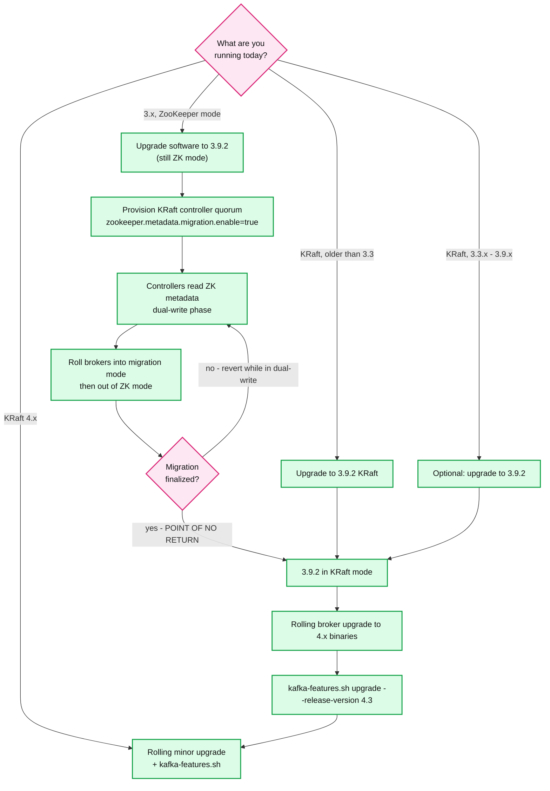

# Kafka Deep Dive 09 — Version Delta Appendix (3.5 → 4.3)

> **Series baseline: Apache Kafka 4.3** — 4.3.0 released 2026-05-22, latest patch **4.3.1** released 2026-06-25. Defaults are verified against that release.
> As of 2026-09-06, **4.4.0 is not released** — code freeze was 2026-08-12, release "no earlier than 2026-09-09". There is no 5.0 branch.
> Every default quoted elsewhere in this series is a **4.3 default** unless that report says otherwise. This document is the errata layer.

Marking convention:
- **[documented]** — read from the 4.3 source tree, an Apache release announcement, the official upgrade guide, the config reference, or a KIP wiki page.
- **[inferred]** — a reasonable reading of the sources, not stated in those words. Treat as a hypothesis, not a citable fact.
- **[unverified]** — genuinely ambiguous in the sources and not confirmable against 4.3 source; flagged rather than guessed.

---

<!-- nav:start -->
[← 08 Scale & Operations](kafka-08-scale-and-operations.md) · **[Index](README.md)** · →
<!-- nav:end -->

<!-- toc:start -->
<details>
<summary><b>Sections in this report (9)</b></summary>

- [1. Overview](#1-overview)
- [2. Release timeline (3.5 → pinned)](#2-release-timeline-35--pinned)
- [3. The 4.0 breaking-change wall](#3-the-40-breaking-change-wall)
- [4. Feature maturity matrix](#4-feature-maturity-matrix)
- [5. Per-report errata](#5-per-report-errata)
- [6. In flight for 4.4 and 5.0](#6-in-flight-for-44-and-50)
- [7. Upgrade playbooks](#7-upgrade-playbooks)
- [8. Quoting rules](#8-quoting-rules)
- [9. Sources](#9-sources)

</details>
<!-- toc:end -->

## 1. Overview

- Kafka's 3.5 → 4.3 arc is one long **removal of the ZooKeeper era**, one long **rollout of server-side group coordination** (KIP-848 → KIP-932 → KIP-1071), and the maturation of **tiered storage**. Almost every "surprising" default change in the series traces to one of these three.
- **4.0 (2025-03-18) is the wall.** It is not a normal major release: it deletes an entire operating mode (ZooKeeper), deletes two message formats, raises the wire-protocol floor to 2.1, raises Java to 17 on the broker, and removes ~60 public APIs, configs, tools and metrics in one shot.
- **The 4.x line is additive, not breaking.** 4.1, 4.2, 4.3 add features and change essentially no defaults that matter (one exception: ELR turning on for new clusters in 4.1). A 4.0 → 4.3 rolling upgrade is boring; a 3.x → 4.0 upgrade is a project.
- The single most-misquoted numbers in this series are **`linger.ms`** (0 before 4.0, **5** from 4.0) and **`metadata.recovery.strategy`** (`none` before 4.0, **`rebootstrap`** from 4.0). Both changed silently, both change latency/failover behaviour, neither is in most blog posts.
- `group.protocol` is **still `classic` by default in 4.3** [documented]. The consumer rebalance protocol has been GA since 4.0 but is opt-in; the default flips in 5.0 (KIP-1274).

---

## 2. Release timeline (3.5 → pinned)

Dates verified against the Apache Kafka release-announcement index.

### 2.1 Major (feature) releases

| Version | Date | Headline change |
|---|---|---|
| **3.5.0** | 2023-06-15 | **ZooKeeper marked deprecated**; ZK→KRaft migration ships as **early access** (KIP-866); SCRAM for KRaft (KIP-900); KIP-903 stops stale replicas rejoining ISR; MM2 full distributed mode (KIP-710); Connect offsets REST API (KIP-875) |
| **3.6.0** | 2023-10-10 | **Tiered storage (KIP-405) early access**; **ZK→KRaft migration declared production-ready**; KIP-890 part 1 (transaction server-side defense); KRaft metadata transactions (KIP-868) |
| **3.7.0** | 2024-02-27 | **KIP-848 early access**; **JBOD-in-KRaft (KIP-858) early access**; **client telemetry (KIP-714)**; Java 11 deprecated for brokers/tools (KIP-1013) |
| **3.8.0** | 2024-07-29 | **KIP-848 preview**; **JBOD-in-KRaft production-ready**; tiered storage works with JBOD (still EA); compression level configs (KIP-390); official Docker image (KIP-1028); client rebootstrap (KIP-899) |
| **3.9.0** | 2024-11-06 | **Final 3.x release / the ZK bridge release**; **tiered storage GA** (+KIP-950 per-topic disable, KIP-956 quotas, KIP-1005 remote offsets); **dynamic KRaft quorums (KIP-853)**; `unclean.leader.election.enable` supported in KRaft |
| **4.0.0** | 2025-03-18 | **ZooKeeper mode removed**; KRaft only; **KIP-848 GA** (opt-in); **KIP-932 share groups early access**; KIP-890 part 2; **KIP-966 ELR preview**; KIP-896 protocol floor = 2.1; Java 17 brokers / Java 11 clients; Log4j2; message formats v0/v1 gone |
| **4.1.0** | 2025-09-04 | **Share groups → preview**; **KIP-1071 Streams rebalance protocol early access**; **ELR on by default for new clusters**; plugin metrics via `Monitorable` (KIP-877); rack-aware assignment at scale (KIP-1101); OAuth jwt-bearer (KIP-1139) |
| **4.2.0** | 2026-02-17 | **Share groups production-ready** (KIP-1222 RENEW, KIP-1206 acquire modes, KIP-1226 lag metrics); **KIP-1071 production-ready for core feature set**; Streams DLQ (KIP-1034); CLI arg standardisation (KIP-1147); metric naming `kafka.COMPONENT` (KIP-1100); `controller.quorum.auto.join.enable` |
| **4.3.0** | 2026-05-22 | 25 KIPs. Tiered-storage follower fetch from tiered offset (KIP-1023), **log-directory cordoning (KIP-1066)**, assignment epochs (KIP-1251), coordinator buffer configs (KIP-1196), OAuth client assertions (KIP-1258), headers-aware state stores (KIP-1271/1285). **Deprecations for 5.0: `kafka-streams-scala` (KIP-1244), `group.coordinator.rebalance.protocols` (KIP-1237), legacy MirrorMaker metrics (KIP-1280), classic rebalance protocol notice (KIP-1274)** |

### 2.2 Patch releases in the same window

| Version | Date | | Version | Date |
|---|---|---|---|---|
| 3.5.1 | 2023-07-21 | | 3.9.1 | 2025-05-20 |
| 3.6.1 | 2023-12-07 | | 4.0.1 | 2025-10-13 |
| 3.5.2 | 2023-12-11 | | 4.1.1 | 2025-11-12 |
| 3.6.2 | 2024-04-04 | | 3.9.2 | 2026-02-21 |
| 3.7.1 | 2024-06-28 | | 4.0.2 | 2026-03-16 |
| 3.8.1 | 2024-10-29 | | 4.1.2 | 2026-03-17 |
| 3.7.2 | 2024-12-13 | | 4.2.1 | 2026-05-30 |
| | | | **4.3.1** | **2026-06-25** |

> Note the ordering trap: **3.9.0 (Nov 2024) shipped *before* 4.0.0 (Mar 2025), but 3.9.1/3.9.2 shipped *after***. "Latest 3.x" and "the 3.x you should migrate from" are not the same artifact. Migrate from **3.9.2**, not 3.9.0.

### 2.3 Timeline diagram

```mermaid
flowchart TD
  subgraph ZK["ZooKeeper era — ZK mode available"]
    direction LR
    A["3.5.0<br/>2023-06-15<br/>ZK deprecated<br/>ZK→KRaft migration EA"]
    B["3.6.0<br/>2023-10-10<br/>Tiered storage EA<br/>Migration GA"]
    C["3.7.0<br/>2024-02-27<br/>KIP-848 EA<br/>JBOD-KRaft EA"]
    D["3.8.0<br/>2024-07-29<br/>KIP-848 preview<br/>JBOD-KRaft GA"]
    E["3.9.0<br/>2024-11-06<br/>Tiered storage GA<br/>KIP-853 quorums<br/>BRIDGE RELEASE"]
  end
  subgraph KR["KRaft-only era — ZK mode removed"]
    direction LR
    F["4.0.0<br/>2025-03-18<br/>ZK removed<br/>KIP-848 GA<br/>protocol floor 2.1"]
    G["4.1.0<br/>2025-09-04<br/>Share groups preview<br/>ELR default-on<br/>KIP-1071 EA"]
    H["4.2.0<br/>2026-02-17<br/>Share groups GA<br/>KIP-1071 GA"]
    I["4.3.0<br/>2026-05-22<br/>PINNED<br/>5.0 deprecations land"]
  end
  A --> B --> C --> D --> E
  E -->|"migrate to KRaft FIRST<br/>then upgrade software"| F
  F --> G --> H --> I
  I -.->|"target 2026-09<br/>not yet released"| J["4.4.0"]
  J -.->|"no date announced"| K["5.0<br/>removals land"]

  class A,C,D,E,F,G,H,I service
  class J,K service
  class B external

  classDef client   fill:#dbeafe,stroke:#2563eb,stroke-width:2px,color:#111
  classDef service  fill:#dcfce7,stroke:#16a34a,stroke-width:2px,color:#111
  classDef store    fill:#ede9fe,stroke:#7c3aed,stroke-width:2px,color:#111
  classDef cache    fill:#fef3c7,stroke:#d97706,stroke-width:2px,color:#111
  classDef queue    fill:#cffafe,stroke:#0891b2,stroke-width:2px,color:#111
  classDef critical fill:#fee2e2,stroke:#dc2626,stroke-width:4px,color:#111
  classDef external fill:#e5e7eb,stroke:#6b7280,stroke-width:2px,color:#111,stroke-dasharray:4 3
  classDef decision fill:#fce7f3,stroke:#db2777,stroke-width:2px,color:#111
```



**What to notice**

- The only edge that crosses the subgraph boundary carries a precondition, not just an arrow: the ZK→KRaft migration must complete **inside the 3.x box**.
- Every "GA" label sits one or two releases after its "EA" label — Kafka's house rule is EA → preview → production over 2–3 releases. Budget your adoption accordingly.
- 3.9 is a terminal node in the ZK subgraph *and* the only sane on-ramp to 4.x. Nothing else in 3.x should be your migration base.
- The dotted edges are unreleased. Anything you read about 5.0 is a KIP target, not a shipped fact.

---

## 3. The 4.0 breaking-change wall

This is the section to read twice. 4.0 removes things that have been deprecated for up to eight years, and it does so all at once.

### 3.1 ZooKeeper mode removed

**What is gone [documented]:** "Apache Kafka 4.0 only supports KRaft mode — ZooKeeper mode has been removed." This is not a deprecation with a fallback flag. There is no `zookeeper.connect`, no ZK-backed broker, no `--zookeeper` CLI path, no `kafka.admin.ZkSecurityMigrator`, and no `config/kraft` directory (KRaft is now the only mode, so its property files moved to the normal `config/` location).

**What is also gone, and catches people out [documented]:** the **ZK→KRaft migration code itself was removed in 4.0**. You cannot use a 4.0 binary to perform the migration. The migration is a 3.x-only capability. Therefore:

> **You cannot go 3.x-ZK → 4.x. You must go 3.x-ZK → 3.x-KRaft → 4.x.** The migration and the major-version upgrade are two separate, sequential projects, and the migration must finish first, on 3.x binaries.

**Which 3.x releases can perform the migration** [documented]:

| Release | ZK→KRaft migration status |
|---|---|
| 3.4.0 | Early access (first appearance of KIP-866) |
| 3.5.x | **Early access** — "only suitable for testing in non-production environments" |
| 3.6.0 | **Production-ready**, but the announcement itself advises upgrading to **3.6.2 or 3.7.1** first for important bug fixes. JBOD clusters **cannot** be migrated. |
| 3.7.x | Production-ready |
| 3.8.x | Production-ready |
| **3.9.x** | Production-ready; **the recommended bridge release** — the final 3.x, with the most migration bug fixes after "thousands of clusters" of real-world testing |
| 4.0+ | **Removed** |

**Version floor for the upgrade itself [documented]:** broker upgrades to 4.x require KRaft mode and **software and metadata versions of at least 3.3.x** (the release where KRaft was marked production-ready, KIP-833). Clusters on KRaft older than 3.3.x must first upgrade to 3.9.x. In practice the guide's recommendation for *every* pre-4.0 cluster is: **get to 3.9.x, then jump**.



**What to notice**

- The only reversible part of the ZK story is the **dual-write phase**. Once migration is finalized, ZK is gone and the rollback is restore-from-backup, not a config flip.
- There is no arrow from the ZK box directly to the 4.x box. That missing arrow is the whole section.
- JBOD clusters have an extra ordering constraint on older bridge releases (3.6 could not migrate them); 3.9 is the safe base because JBOD-in-KRaft has been production-ready since 3.8.
- `kafka-features.sh upgrade` is a *separate* step after the rolling restart — the binaries can be 4.3 while `metadata.version` is still 3.9. That gap is your rollback window.

### 3.2 Minimum client / broker compatibility (KIP-896 + KIP-1124)

**KIP-896 — removal of old protocol API versions [documented].** 4.0 brokers no longer serve request versions used by clients older than **2.1**. Symmetrically, 4.0 *clients* no longer speak to brokers older than **2.1**.

> **The floor is 2.1, in both directions.** Clients (including Connect and Kafka Streams, which embed the Java clients) must be **≥ 2.1** before you upgrade brokers to 4.0; brokers must be **≥ 2.1** before you upgrade Java clients to 4.0.

**KIP-1124 — the documented upgrade path [documented].** Status: **Accepted**. It is a documentation KIP: it adds to the upgrade guide the explicit statement that "2.1 becomes the oldest supported version compatible with 4.0", and defines the multi-hop bridge versions for clients and Streams apps that are older than that. Clients at **2.0 and below are incompatible with 4.0 brokers** and must be upgraded through an intermediate version first.

- Practical read: audit **every** client in the fleet — including non-Java clients (librdkafka-based, Sarama, kafka-python) and every Connect worker — before touching a broker. A single 0.10 client that has been quietly working for years will hard-fail on the day you roll the first 4.0 broker. [inferred]
- The failure is a protocol-version negotiation failure at connect time, not a slow degradation. [inferred]

**KIP-724 — message format v0/v1 removed [documented].** 4.0 brokers do not accept and do not store the v0/v1 record formats. The consequence people miss: **broker-side down-conversion is gone**. Pre-0.11 clients relied on the broker converting v2 batches down to v0/v1 on fetch; that path no longer exists.

**`log.message.format.version` / `message.format.version` removed [documented].** Both the broker config and the topic config were deleted in 4.0. There is nothing to set, and any config file or automation that sets them will fail broker startup. Message format is now unconditionally v2.

**`inter.broker.protocol.version` [documented]/[inferred].** In KRaft, the IBP is no longer the upgrade lever — `metadata.version` (managed via `kafka-features.sh`) is [documented]. A statically configured `inter.broker.protocol.version` is not the mechanism that gates a KRaft rolling upgrade; the finalized feature level is [inferred]. If your 3.x runbooks pin IBP as step 1 and step N of every upgrade, those runbooks do not apply to a KRaft cluster.

### 3.3 Java version requirements [documented]

| Component | Before 4.0 | 4.0 and later |
|---|---|---|
| Kafka clients, Kafka Streams | Java 8 | **Java 11** |
| Brokers, Connect, tools | Java 8 / 11 | **Java 17** |

- Java 8 support removed entirely; Java 11 removed for brokers/Connect/tools (deprecated in 3.7 by KIP-1013, removed in 4.0 by KIP-750).
- **Java 23 support added** in 4.0.
- **Scala 2.12 support removed** in 4.0 — server binaries are Scala 2.13 only.
- Jakarta EE / JavaEE 10 upgrade (KIP-1032) — matters if you embed Connect's REST layer or ship your own JAX-RS providers.

### 3.4 Removed configs [documented]

| Config | Replacement |
|---|---|
| `log.message.format.version`, `message.format.version` | none — format is v2 |
| `log.message.timestamp.difference.max.ms` | `log.message.timestamp.before.max.ms` / `.after.max.ms` |
| `delegation.token.master.key` | `delegation.token.secret.key` |
| `offsets.commit.required.acks` | none (deprecated in 3.8 by KIP-1041) |
| `metrics.jmx.blacklist`, `metrics.jmx.whitelist` | `metrics.jmx.exclude` / `metrics.jmx.include` |
| `auto.include.jmx.reporter` | none |
| MirrorMaker2: `use.incremental.alter.configs`, `add.source.alias.to.metrics` | none |
| MirrorMaker2: `config.properties.blacklist`, `topics.blacklist`, `groups.blacklist` | `*.exclude` variants |
| `ReplaceField` SMT: `whitelist`, `blacklist` | `include` / `exclude` |

### 3.5 Removed public APIs [documented]

**Producer**
- `DefaultPartitioner`, `UniformStickyPartitioner` classes removed. `Partitioner.onNewBatch()` removed.
- `sendOffsetsToTransaction(Map<TopicPartition, OffsetAndMetadata>, String)` removed (use the `ConsumerGroupMetadata` overload).

**Consumer**
- `poll(long)` removed → `poll(Duration)`.
- `committed(TopicPartition)` and `committed(TopicPartition, Duration)` removed.
- `MockConsumer.setException(KafkaException)` removed.

**Admin**
- `alterConfigs()` removed → `incrementalAlterConfigs()`.
- `DeleteTopicsResult.values()`, `DescribeTopicsResult.values()`, `DescribeTopicsResult.all()` and the `Map<String, KafkaFuture<TopicDescription>>` constructor removed.
- `TopicListing(String, boolean)` constructor removed.
- `ListConsumerGroupOffsetsOptions.topicPartitions(List<TopicPartition>)` removed.
- `UpdateFeaturesOptions.dryRun()` methods removed; `FeatureUpdate(short, boolean)` constructor and `FeatureUpdate.allowDowngrade()` removed.

**Common / misc**
- `NotLeaderForPartitionException` removed (use `NotLeaderOrFollowerException`).
- `JmxReporter(String)` constructor removed.
- `DescribeLogDirsResponse.LogDirInfo` / `.ReplicaInfo` removed.
- `oauthbearer.secured.OAuthBearerLoginCallbackHandler` / `...ValidatorCallbackHandler` removed (moved out of `.secured`).
- `kafka.common.MessageReader`, `kafka.serializer.Decoder`, and the `kafka.tools.*MessageFormatter` / `kafka.coordinator.*MessageFormatter` classes removed.

**Connect**
- `SinkTask.onPartitionsRevoked(Collection)` / `onPartitionsAssigned(Collection)` removed.
- `SourceTask.commitRecord(SourceRecord)` removed.
- Redundant task-configs endpoint removed (KIP-970).

**Streams**
- **"All public APIs deprecated in Apache Kafka 3.6 or earlier have been removed"** — with the sole exceptions of `JoinWindows.of()` and `JoinWindows#grace()`. The most commonly hit casualty is `KStream#transformValues()` → rewrite to `KStream#processValues()`.

### 3.6 Removed tools, tool options, and the `--zookeeper` era [documented]

- **MirrorMaker 1 (MM1)** and its classes removed entirely. Use MirrorMaker 2.
- `kafka.admin.ZkSecurityMigrator` removed.
- `kafka-acls`: `--authorizer`, `--authorizer-properties`, `--zk-tls-config-file` removed.
- `kafka-console-consumer`: `--whitelist` removed → `--include`.
- `kafka-replica-verification`: `--topic-white-list` removed.
- `kafka-verifiable-consumer`: `--broker-list` removed.
- `ConfigCommand`: `--force` removed (in 4.1); `kafka-topics --delete-config` deprecated.
- Old-package redirections removed: `kafka.admin.FeatureCommand`, `kafka.tools.ClusterTool`, `kafka.tools.EndToEndLatency`, `kafka.tools.StateChangeLogMerger`, `kafka.tools.StreamsResetter`, `kafka.tools.JmxTool`.
- `--bootstrap-server` now accepts **comma-separated values only** — space-separated lists that used to work will fail.
- Every `--zookeeper` flag on every tool is gone as a consequence of ZK removal; the universal replacement is `--bootstrap-server` (brokers) or `--bootstrap-controller` (controller-only operations). [D for removal, I for the `--bootstrap-controller` framing]

### 3.7 Removed metrics and modules [documented]

- Metrics removed: `bufferpool-wait-time-total`, `io-waittime-total`, `iotime-total` (the `-ns`-suffixed replacements had been added earlier).
- `KafkaLog4jAppender` removed; logging migrated **Log4j → Log4j2** (KIP-653). Your `log4j.properties` is not read; you need `log4j2.yaml`/`log4j2.properties`. This breaks essentially every existing Kafka logging config.
- **Scala 2.12 module set removed** (server artifacts are `_2.13` only).
- `kafka-streams-scala` is *not* removed in 4.0 — it is deprecated in **4.3** and targeted for removal in **5.0** (KIP-1244).

### 3.8 Behaviour changes that are not removals [documented]

- `enable.idempotence` **no longer silently falls back** when `max.in.flight.requests.per.connection > 5` (or other conflicting settings). Previously the producer quietly disabled idempotence; now the conflicting configuration is an error. Silent EOS loss became a loud startup failure — an improvement, but it will break configs that "worked".
- `Admin.describeConsumerGroups` used to return a `ConsumerGroupDescription` in state `DEAD` for an unknown group id; it now throws **`GroupIdNotFoundException`**.
- `kafka-configs.sh --alter --delete-config` no longer requires the key to exist (deleting a missing key is a no-op) — this landed in **4.3**.

---

## 4. Feature maturity matrix

Legend: **EA** = early access (not for production) · **Preview** = testable, not production-supported · **GA** = production-ready, opt-in · **Default-on** = enabled without action · **—** = not present in the release · **Removed**.

| Feature | 3.5 | 3.6 | 3.7 | 3.8 | 3.9 | 4.0 | 4.1 | 4.2 | 4.3 |
|---|---|---|---|---|---|---|---|---|---|
| **KRaft mode** (KIP-500/833) | GA | GA | GA | GA | GA | **Default-on (only mode)** | Default-on | Default-on | Default-on |
| **ZK→KRaft migration** (KIP-866) | EA | GA | GA | GA | GA (bridge) | **Removed** | Removed | Removed | Removed |
| **Tiered storage** (KIP-405) | — | EA | EA | EA (+JBOD) | **GA** | GA | GA | GA | GA |
| **KIP-848 consumer rebalance** | — | — | EA | Preview | Preview [unverified] | **GA** (opt-in `group.protocol=consumer`) | GA | GA | GA (deprecation notice for `classic`) |
| **KIP-932 share groups (queues)** | — | — | — | — | — | **EA** | **Preview** | **GA** (`ShareVersion.LATEST_PRODUCTION = SV_1`, bootstrap `IBP_4_2_IV0`) | GA — default-on for clusters formatted at MV ≥ `4.2-IV0` |
| **KIP-853 dynamic KRaft quorums** | — | — | — | — | **GA** (new clusters only) | GA | GA | GA (+`controller.quorum.auto.join.enable`, default `false`) | GA (+dynamic configs for dynamic-quorum controllers) |
| **KIP-966 Eligible Leader Replicas** | — | — | — | — | — | **Preview** (part 1) | **Default-on for new clusters** (part 1) | Default-on (part 1) | Part 1 only: `EligibleLeaderReplicasVersion.LATEST_PRODUCTION = ELRV_1`, bootstrap `IBP_4_1_IV0` — default-on **only** for clusters formatted at MV ≥ `4.1-IV0`. **Part 2 (Unclean Recovery) is not in 4.3** |
| **KIP-890 transactions v2** | — | Part 1 (server-side defense) | Part 1 | Part 1 | Part 1 | **Part 2; `TransactionVersion.LATEST_PRODUCTION = TV_2`, bootstrap `IBP_4_0_IV2`** | GA | GA | GA — default **only** on clusters formatted at MV ≥ `4.0-IV2`; an upgraded cluster stays on TV1 until `kafka-features upgrade --feature transaction.version=2` |
| **KIP-858 JBOD in KRaft** | — | — | **EA** | **GA** | GA | GA | GA | GA | GA |
| **KIP-1071 Streams broker-side rebalance** | — | — | — | — | — | — | **EA** (disabled by default) | **GA (core feature set)** | Broker side production/default-on (`StreamsVersion.LATEST_PRODUCTION = SV_1`, bootstrap `IBP_4_2_IV1`); **clients still opt in** with `group.protocol=streams` (client default `classic`). Only the sticky assignor is supported, so KIP-441 warm-ups are unavailable |
| **KIP-714 client telemetry** | — | — | **Shipped** [unverified] | Shipped | Shipped | Shipped (+KIP-1076 app metrics) | Shipped (+KIP-877 `Monitorable`) | Shipped | Shipped |
| **KIP-1150 diskless / object-storage topics** | — | — | — | — | — | — | — | — | **Not shipped** — KIP **Accepted**, no target release |

**Ambiguity notes (do not paper over these):**

- **KIP-848 in 3.9 [unverified]** — 3.8 is explicitly labelled "preview, not recommended for production" in the KIP-848 preview release notes. The 3.9 release announcement and 3.9 notable-changes do **not** restate a status change. The honest statement is: *it was preview in 3.8, nothing documents a promotion in 3.9, and GA is claimed in 4.0.* Do not say "GA in 3.9".
- **KIP-966 in 4.2/4.3 [documented]** — resolved against 4.3 source: `EligibleLeaderReplicasVersion.LATEST_PRODUCTION = ELRV_1` with `bootstrapMetadataVersion = IBP_4_1_IV0`, so part 1 is default-on **only** for clusters *formatted* at MV ≥ `4.1-IV0`; an upgraded cluster keeps its finalized level until `kafka-features.sh upgrade --feature eligible.leader.replicas.version=1`. **Part 2 (Unclean Recovery) is not in 4.3** — no `unclean.recovery.*` config, no `UncleanRecoveryManager`, no `GetReplicaLogInfo` RPC in the 4.3.1 tree. Say "ELR part 1", not "ELR". See [report 02](kafka-02-replication-isr.md) §13.
- **KIP-714 [unverified]** — it shipped in 3.7 with broker-side support and was never labelled EA or preview in the release announcement, but neither was it announced as GA. It is best described as "shipped in 3.7 and extended in 4.0/4.1", not as a maturity ladder.
- **ELR + existing clusters** — "enabled by default on the **new** clusters" is load-bearing. An upgraded cluster does not get ELR by flipping binaries; the `eligible.leader.replicas.version` feature must be finalized. [documented]
- **KIP-1150** — Accepted as an umbrella KIP with sub-KIPs **KIP-1163 (Diskless Core)** and **KIP-1164 (Diskless Coordinator)**, each with its own discussion and vote. No target release is stated on the wiki. Anyone telling you diskless Kafka is "in 4.x" is wrong.

---

## 5. Per-report errata

What changed under each sibling report, so a reader on 3.x or 4.0 knows which of its numbers do not apply.

### 5.1 Errata for [Report 01](kafka-01-log-storage.md) — Log storage

| Item | Before | From | Note |
|---|---|---|---|
| Message format v0/v1 | supported, broker down-converts | **removed in 4.0** (KIP-724) | v2 only; no down-conversion path exists |
| `log.message.format.version` / topic `message.format.version` | valid configs | **removed in 4.0** | setting them fails startup |
| `log.message.timestamp.difference.max.ms` | valid | **removed in 4.0** | → `log.message.timestamp.before.max.ms` / `.after.max.ms` |
| `message.timestamp.after.max.ms` | `Long.MAX_VALUE` | **1 hour, from 4.0** | future-dated records are now **rejected**; a clock-skewed producer that used to work now gets errors |
| `num.recovery.threads.per.data.dir` | `1` | **`2`, from 4.0** | halves unclean-restart recovery time on multi-dir brokers; the 4.3 config reference confirms `2` |
| `log.cleaner.enable` | settable `false` | **deprecated in 4.1** | do not set `false`; on removal `log.cleaner.threads` gets a minimum of 1 |
| `cleanup.policy` | must be non-empty | **empty value allowed from 4.2** | empty = infinite retention, no deletion and no compaction |
| Tiered storage | EA 3.6–3.8 | **GA in 3.9** | anything you read about tiered storage written before Nov 2024 describes an EA feature |
| Tiered storage + JBOD | unsupported | **3.8** | |
| Per-topic disable of tiered storage | impossible | **3.9** (KIP-950) | |
| Tiered storage quotas | none | **3.9** (KIP-956) | copy/fetch rate limits |
| `remote.log.manager.thread.pool.size` | the knob (default `2`) | **deprecated in 4.2** | renamed to `remote.log.manager.follower.thread.pool.size` (same default `2`); the copier and expiration pools (`10` each) are separate configs |
| `remote.log.metadata.topic.min.isr` | n/a | **new in 4.3**, default `2` | |
| `remote.log.metadata.admin.` config prefix | n/a | **new in 4.3** (KIP-1208) | |
| `follower.fetch.last.tiered.offset.enable` | n/a | **new in 4.3**, default `false`, dynamic (KIP-1023) | lets a follower bootstrap from the tiered offset instead of the local log start |
| Log-directory cordoning | n/a | **new in 4.3** (KIP-1066) | drain a disk/broker before decommission |

### 5.2 Errata for [Report 02](kafka-02-replication-isr.md) — Replication and ISR

| Item | Before | From | Note |
|---|---|---|---|
| Stale replica rejoining ISR | possible (data-loss window) | **fixed in 3.5** (KIP-903) | uses leader epoch to reject stale fetchers |
| `unclean.leader.election.enable` in KRaft | not supported | **3.9** | one documented behaviour difference vs ZK when enabling it dynamically |
| `unclean.leader.election.enable` default | `false` | `false` | **unchanged** — safe to quote across the whole range |
| Eligible Leader Replicas | n/a | **preview 4.0; default-on for new clusters 4.1** | changes which replicas are electable after a full ISR loss |
| Broker-level `min.insync.replicas` | honoured | **cleared when ELR activates (4.1)** | configure at cluster level instead; a broker-level value silently disappearing is a real 4.1 upgrade surprise |
| `min.insync.replicas` default | `1` | `1` | **unchanged** — and still the most common production misconfiguration |
| `num.replica.fetchers` | no lower bound enforced | **lower bound of 1 from 4.2** | `0` used to be accepted |
| Preferred-leader election storms | n/a | KIP-1358 **under discussion**, not shipped | gradual/gated election in the KRaft controller |

### 5.3 Errata for [Report 03](kafka-03-kraft-controller.md) — KRaft

| Item | Before | From | Note |
|---|---|---|---|
| ZooKeeper mode | available (default before 3.x's late releases) | **removed in 4.0** | |
| ZK→KRaft migration | 3.4 EA → 3.6 GA | **removed in 4.0** | see §3.1 |
| `config/kraft/` directory | separate property files | **gone in 4.0** | KRaft configs are the normal `config/` files |
| Dynamic controller quorums (KIP-853) | static `controller.quorum.voters` only | **3.9** | requires formatting with `--standalone` or `--initial-controllers`; **3.9 could not convert an existing static quorum to dynamic** |
| `controller.quorum.auto.join.enable` | n/a | **new in 4.2**, default `false` | |
| Dynamic broker configs on dynamic-quorum controllers | not supported | **4.3** | |
| KRaft pre-vote | n/a | **4.0** (KIP-996) | suppresses spurious elections from a partitioned node |
| Metadata transactions | n/a | **3.6** (KIP-868) | atomic multi-record metadata changes |
| KRaft fetch/snapshot byte-size controls | fixed | **4.3** (KIP-1219) | |
| Controller / MetadataLoader idle-ratio metrics | n/a | **4.2** (KIP-1190, KIP-1229) | |
| SCRAM in KRaft | n/a | **3.5** (KIP-900) | |
| Upgrade lever | `inter.broker.protocol.version` (ZK era) | **`metadata.version` via `kafka-features.sh`** | different mental model, different rollback story |

### 5.4 Errata for [Report 04](kafka-04-producer.md) — Producer

| Config | 3.5–3.9 | 4.0–4.3 | Why it matters |
|---|---|---|---|
| **`linger.ms`** | **`0`** | **`5`** | The single most impactful silent default change in 4.0. Every latency number measured on 3.x with default settings is not comparable to 4.x. The rationale [documented] is that larger batches usually give similar or lower end-to-end latency. |
| **`metadata.recovery.strategy`** | **`none`** (added 3.8, KIP-899) | **`rebootstrap`** (4.0, KIP-1102) | Clients now re-resolve `bootstrap.servers` when all known brokers are unreachable instead of failing. Changes failover behaviour behind a VIP/DNS. |
| `acks` | `all` | `all` | **Unchanged since 3.0.** Not a 4.x change — do not attribute it to 4.0. |
| `enable.idempotence` | `true` | `true` | **Unchanged since 3.0.** What changed in 4.0 is the **failure mode**: conflicting configs no longer silently disable idempotence. |
| `max.in.flight.requests.per.connection` | `5` | `5` | **Unchanged.** The 4.0 change is that `>5` with idempotence on is now an error rather than a silent downgrade. |
| `partitioner.class` | `null` | `null` | **Unchanged**; `null` means the built-in sticky/adaptive partitioner (behaviour set by KIP-794 in **3.3**, not 4.0). What 4.0 removed are the *named* classes `DefaultPartitioner` and `UniformStickyPartitioner`, plus `Partitioner.onNewBatch()`. Configs naming those classes fail on 4.0. |
| `batch.size` | `16384` | `16384` | Unchanged |
| `delivery.timeout.ms` | `120000` | `120000` | Unchanged |
| `retries` | `Integer.MAX_VALUE` | `Integer.MAX_VALUE` | Unchanged |
| `compression.type` | `none` | `none` | Unchanged; **compression *level*** became configurable in **3.8** (KIP-390) |
| `flush()` | callable from a callback (deadlock risk) | **throws in 4.1** | deadlock detection added |
| `sendOffsetsToTransaction(Map, String)` | deprecated | **removed 4.0** | |
| `transaction.version` | 1 | **2 on clusters formatted at MV ≥ `4.0-IV2`** | KIP-890 part 2. `TransactionVersion.LATEST_PRODUCTION = TV_2`, `bootstrapMetadataVersion = IBP_4_0_IV2` — a cluster **upgraded** from 3.x keeps its finalized level and stays on TV1 until `kafka-features upgrade --feature transaction.version=2`. Once raised, producers upgrade dynamically on reconnect, **no producer restart required**, and **downgrade is supported** |

### 5.5 Errata for [Report 05](kafka-05-consumer-rebalance.md) — Consumer and rebalance

| Item | Before | From | Note |
|---|---|---|---|
| `group.protocol` | n/a | added with KIP-848; **default `classic` through 4.3** | GA since 4.0 but **opt-in**. KIP-1274 flips the default to `consumer` in **5.0** and removes `classic` in **6.0**. |
| Server-side enablement of KIP-848 | n/a | `group.version` feature flag + `group.coordinator.rebalance.protocols` | `group.coordinator.rebalance.protocols` default in 4.3 is `classic,consumer,streams`; **the config itself is deprecated in 4.3** for removal in 5.0 (KIP-1237) |
| `group.consumer.assignors` | n/a | default `[uniform, range]` | server-side assignor set for the new protocol; the **first entry is the default** unless a client names one via `group.remote.assignor` |
| Downgrade after using KIP-848 | n/a | **only down to 3.4.1+** | the `__consumer_offsets` records written by the new protocol are not readable by older coordinators |
| `poll(long)` | deprecated | **removed 4.0** | |
| `committed(TopicPartition)` / `(TopicPartition, Duration)` | deprecated | **removed 4.0** | |
| `Admin.describeConsumerGroups` on unknown group | returned `DEAD` | **throws `GroupIdNotFoundException` in 4.0** | breaks "does this group exist?" probes |
| `ConsumerGroupState` enum | current | **deprecated in 4.0** → `GroupState` | |
| `Admin.listConsumerGroups()` | current | **deprecated 4.1** → `listGroups(ListGroupsOptions.forConsumerGroups())` | |
| Leave-group on close | always | **controllable from 4.1** (KIP-1092); Streams `CloseOptions` in 4.2 (KIP-1153) | matters for rolling restarts under the new protocol |
| Consumer topic metrics | per-topic names mangled | **KIP-1109 unified names in 4.1**; old ones removed in **5.0** | dashboards will break at 5.0 |
| Duration-based offset reset | n/a | **4.0** (KIP-1106) | `auto.offset.reset` accepts a duration |
| Rack-aware assignment memory | O(members×partitions) blowups | **4.1** (KIP-1101) | makes hundreds of members per group practical |
| Assignment epochs | n/a | **4.3** (KIP-1251) | reduces spurious member fencing |
| `session.timeout.ms` = 45000, `max.poll.interval.ms` = 300000, `auto.offset.reset` = `latest`, `enable.auto.commit` = `true` | | | **Unchanged across 3.5→4.3** — safe to quote |
| Share groups | n/a | EA 4.0 → preview 4.1 → **GA 4.2** | 4.2 adds `RENEW` acks (KIP-1222), `ShareAcquireMode` soft/strict limits (KIP-1206), lag metrics (KIP-1226); 4.3 adds more group configs (KIP-1240) and DLQ lands in 4.4 (KIP-1191) |

### 5.6 Errata for [Report 06](kafka-06-broker-request-pipeline.md) — Request pipeline and protocol

| Item | Before | From | Note |
|---|---|---|---|
| Protocol version floor | ~0.10 clients still worked | **2.1 from 4.0** (KIP-896) | both directions: 4.0 brokers refuse <2.1 clients; 4.0 clients refuse <2.1 brokers |
| Broker-side down-conversion | supported for v0/v1 fetches | **removed 4.0** | the CPU/heap cost model of down-conversion no longer applies |
| `ListOffsets` API | up to v10 | **v11 in 4.3** | |
| Client rebootstrap | n/a | added **3.8** (KIP-899), **default `rebootstrap` from 4.0** (KIP-1102) | |
| Metric naming | inconsistent prefixes | **`kafka.COMPONENT` convention from 4.2** (KIP-1100) | dashboard-breaking; plan a metrics migration with the 4.2 upgrade |
| Plugin metrics | none | **`Monitorable` interface, 4.1** (KIP-877) | producers, consumers, admin, connectors |
| Removed client metrics | `bufferpool-wait-time-total`, `io-waittime-total`, `iotime-total` | **removed 4.0** | use the `-ns` variants |
| Misrouted-connection detection | n/a | KIP-1242, **4.4** | |
| Yammer metrics in `GroupCoordinatorMetrics` | current | **deprecated, KIP-1301, 4.4** | |

### 5.7 Errata for [Report 07](kafka-07-streams-connect.md) — Streams and Connect

| Item | Before | From | Note |
|---|---|---|---|
| Streams public API surface | many deprecated methods | **everything deprecated in ≤3.6 removed in 4.0** except `JoinWindows.of()` / `JoinWindows#grace()` | `transformValues()` → `processValues()` is the common break |
| `kafka-streams-scala` | supported | **deprecated 4.3, removal targeted 5.0** (KIP-1244) | |
| Streams rebalance protocol | client-side assignment only | **KIP-1071 EA in 4.1 → production-ready core in 4.2** | Broker side is production/default-on in 4.3 (`StreamsVersion.LATEST_PRODUCTION = SV_1`, bootstrap `IBP_4_2_IV1`); **clients still opt in** with `group.protocol=streams` (Streams client default is `classic`). Only the sticky assignor is supported, so **KIP-441 warm-up replicas are ignored** under the streams protocol. 4.2 release notes explicitly **recommend against classic→streams group migrations in 4.2.0** |
| Streams DLQ in exception handlers | n/a | **4.2** (KIP-1034) | |
| `ProductionExceptionHandler` RETRY | n/a | **4.0** (KIP-1065) | |
| Custom task assignment | n/a | **3.8** (KIP-924) | |
| Versioned state stores | n/a | **3.5** (KIP-889) | |
| StateStore-managed changelog offsets | n/a | **4.3** (KIP-1035) | |
| Headers in state stores | n/a | **4.3** (KIP-1271/1285), new `dsl.store.format` | |
| Transactional state stores | n/a | KIP-892 **Accepted, planned 4.4** | |
| MirrorMaker 1 | supported | **removed 4.0** | |
| MM2 `*.blacklist` configs | supported | **removed 4.0** → `*.exclude` | |
| MM2 metric names | legacy | **KIP-1280 renames in 4.3; legacy removed in 5.0** | |
| MM2 offset translation | per-record | **batch translation 4.3** (KIP-1239) | |
| Connect offsets REST API | n/a | **3.5** (KIP-875) | |
| Connect REST PATCH | n/a | **3.8** (KIP-477) | |
| Connect multi-version plugins | one version per plugin | **4.1** (KIP-891) | |
| Connect task-configs endpoint | present | **removed 4.0** (KIP-970) | |
| Connect internal-topic replication control | fixed | **4.0** (KIP-1074, KIP-1089) | |
| Connect plugin discoverability | limited | **4.3** (KIP-1273) | |
| Connect client override policy | none/principal/all | **allowlist policy added 4.2** (KIP-1188) | |
| Logging | Log4j | **Log4j2 from 4.0** (KIP-653) | `KafkaLog4jAppender` removed; every logging config must be rewritten |

### 5.8 Errata for [Report 08](kafka-08-scale-and-operations.md) — Scale and operations

| Item | Before | From | Note |
|---|---|---|---|
| Java runtime | 8 everywhere | **17 broker/Connect/tools, 11 clients/Streams, from 4.0** | this is often the actual blocker in an enterprise 4.0 upgrade |
| Scala | 2.12 + 2.13 | **2.13 only from 4.0** | |
| Official Docker image | none | **3.8** (KIP-1028) | |
| `kafka-groups.sh` (all group types) | n/a | **4.0** (KIP-1043 / KIP-1099) | replaces per-type group tooling |
| CLI argument standardisation | mixed `--broker-list`, `--bootstrap-server`, `--zookeeper` | **`--bootstrap-server` everywhere from 4.2** (KIP-1147) | |
| `--bootstrap-server` parsing | space- and comma-tolerant | **comma-separated only from 4.0** | |
| JMX filter configs | `metrics.jmx.blacklist` / `whitelist`, `auto.include.jmx.reporter` | **removed 4.0** | |
| Partition-size-percentage metrics | n/a | **4.3** (KIP-1257) | capacity planning against disk |
| Broker / log-dir cordoning | n/a | **4.3** (KIP-1066) | first-class decommission primitive |
| CIDR-based host ACLs | exact host match only | KIP-1276, **4.4** | |
| `broker.id` | current | **deprecated, KIP-1232, 4.4** | `node.id` is the KRaft-era name |
| Feature finalization | `inter.broker.protocol.version` rolling restart | **`kafka-features.sh upgrade --release-version X.Y`** | see §7.3 |

---

## 6. In flight for 4.4 and 5.0

**Read the health warning first:** a "target release" in a KIP wiki is an aspiration recorded by the KIP author, not a commitment. KIPs slip a release routinely, and 4.4 itself already slipped — the Future Release Plan page carried 4.4.0 as **September 2026** with a **KIP freeze of 2026-07-08, feature freeze 2026-07-29, code freeze 2026-08-12, release no earlier than 2026-09-09** (release manager: Omnia Ibrahim). Nothing below has shipped as of 2026-09-06.

### 6.1 Planned for 4.4.0

Statuses as recorded on the 4.4.0 release plan.

| KIP | Title | Recorded state |
|---|---|---|
| 1071 | Streams rebalance protocol — further features | In progress toward completion |
| 1191 | Dead-letter queues for share groups | Complete |
| 1241 | Reduce tiered-storage redundancy with delayed upload | Complete |
| 1242 | Detection and handling of misrouted connections | Complete |
| 1245 | Enforce `application.server` format at config level | Complete |
| 1276 | CIDR-based host patterns for ACLs | Complete |
| 1283 | Clarify `KafkaStreams#cleanUp` semantics | Complete |
| 1284 | `CloseOptions.DEFAULT` for Kafka Streams | Implemented |
| 1299 | Use key range in `ProducerPerformance` | Complete |
| 1301 | Deprecate Yammer-based metrics in `GroupCoordinatorMetrics` | Complete |
| 1321 | Headers-aware `StreamPartitioner` | Complete |
| 1323 | Share group offset initialization | Complete |
| 1340 | Expose mapped key in Streams–GlobalKTable joins | Complete |
| 1356 | IQv2 for headers-aware state stores | Major features merged |
| 1357 | Broker-side custom assignors for streams groups | Complete |
| 1209 | Control internal topic creation in Kafka Connect | Major features merged |
| 892 | Transactional semantics for state stores | Accepted |
| 909 | DNS resolution failure should not fail clients | Accepted |
| 1170 | Unify cluster metadata bootstrapping | Accepted |
| 1200 | Deprecate `ClientQuotaCallback#updateClusterMetadata` | Complete |
| 1220 | Unify `kafka-broker-api-versions` into cluster-tool | Accepted |
| 1232 | Deprecate `broker.id` | Accepted |
| 1291 | Extended I/O metrics collection | Accepted |
| 1319 | Align `TxnOffsetCommit` API with `OffsetCommit` API | Accepted |
| 1331 | Streams group topology description plugin | Accepted |
| 1332 | Dynamic memory allocation for the producer | Accepted (Preview) |

### 6.2 Announced for 5.0 — removals already deprecated in 4.3

These are the ones you must plan for now, because the deprecation warning is already in your 4.3 logs.

| KIP | What is deprecated in 4.3 | What happens in 5.0 | State |
|---|---|---|---|
| **KIP-1244** | `kafka-streams-scala` module | **Removed** | Accepted, deprecation shipped in 4.3 |
| **KIP-1237** | broker config `group.coordinator.rebalance.protocols` | **Removed** | Accepted, deprecation shipped in 4.3 |
| **KIP-1280** | legacy MirrorMaker metric names | **Removed** — migrate to the new names now | Accepted, renames shipped in 4.3 |
| **KIP-1274** | classic rebalance protocol (phase 1: informational message in 4.3) | **Phase 2 in 5.0**: `group.protocol` default flips `classic` → `consumer`, and `classic` is deprecated with a warning. **Phase 3 in 6.0**: setting `group.protocol=classic` throws `ConfigException` | Accepted |
| **KIP-1109** | old per-topic consumer metric names (deprecated in 4.1) | **Removed** | Deprecation shipped in 4.1 |

> The KIP-1274 default flip is the largest behavioural change queued for 5.0. Any consumer that has never set `group.protocol` explicitly will change rebalance protocol on a 5.0 client upgrade. **Set `group.protocol` explicitly in every application now**, whichever value you want — that single line makes the 5.0 upgrade a no-op for you.

### 6.3 Accepted, no target release

| KIP | Title | State | Target |
|---|---|---|---|
| **1150** | Diskless topics (Kafka on object storage) | **Accepted** | **None stated.** Split into **KIP-1163 (Diskless Core)** and **KIP-1164 (Diskless Coordinator)**, each voted separately. Follow-on work (topic type changing, broker roles) has no KIPs yet. |
| 966 part 2 | Eligible Leader Replicas, remainder (Unclean Recovery) | **Not in 4.3** — verified absent from the 4.3.1 tree; no documented ship release | — |

### 6.4 Under discussion (June 2026 KIP batch)

Not accepted; do not plan around these.

- **KIP-1357** — broker-side custom assignors for streams groups (subsequently recorded as Complete for 4.4).
- **KIP-1358** — gradual and gated preferred-leader election in the KRaft controller, to cut latency spikes when many leaders move at once.
- **KIP-1360** — cluster synchronous mirroring: synchronous cross-cluster replication for zero-RPO DR.

---

## 7. Upgrade playbooks

### 7.1 3.x-ZooKeeper → 4.x-KRaft

Two projects, in this order. Do not interleave them.

**Phase A — get to the bridge release (still ZooKeeper)**
1. **Audit clients first.** Every producer, consumer, Connect worker, Streams app, and non-Java client must be **≥ 2.1**; anything older must be upgraded via its own intermediate hop (KIP-1124). Do this before anything else — it is usually the long pole.
2. Rolling-upgrade brokers to **3.9.2** in ZooKeeper mode, following normal 3.x IBP rules.
3. Bake. Confirm no client is emitting deprecated-API warnings.
   *Rollback:* normal 3.x rolling downgrade. Fully supported.

**Phase B — migrate to KRaft (still on 3.9.2 binaries)**
4. Provision a KRaft controller quorum sized for the cluster; format it with the migration settings and point it at the existing ZK ensemble (`zookeeper.metadata.migration.enable=true`).
5. Controllers ingest ZK metadata; the cluster enters **dual-write mode** — the controller is authoritative but ZK is still written.
6. Roll brokers into migration mode, then roll them again out of ZK mode.
7. **Finalize.**
   *Rollback:* possible **only while in dual-write mode** — revert the brokers and controllers and ZK is still current. After finalization there is **no rollback**; recovery is restore-from-backup. Treat finalization as the point of no return and hold at step 6 as long as you need.

**Phase C — the major upgrade**
8. Rolling-upgrade brokers to 4.x binaries. Java 17 must be on every broker host, Java 11+ on every client host. Rewrite Log4j configs to Log4j2 **before** this step, or brokers start with no usable logging.
9. Remove every deleted config from your property files first (§3.4) — a stale `log.message.format.version` fails startup.
10. Bake with `metadata.version` still at 3.9.
    *Rollback here is real:* the binaries are 4.x but the metadata is 3.9, so you can roll back to 3.9.2 binaries.
11. Finalize: `bin/kafka-features.sh --bootstrap-server <b> upgrade --release-version 4.3`.
    *After this, cluster metadata downgrade is not supported for 4.3 (it contains metadata changes).*

### 7.2 4.x minor → 4.x minor (e.g. 4.1 → 4.3)

1. Read the notable-changes list for **every** intervening release, not just the target.
2. Rolling restart brokers onto the new binaries, one at a time. No IBP dance, no ordering constraint beyond "one broker at a time, wait for URPs to clear".
3. Verify behaviour and performance.
4. Finalize: `bin/kafka-features.sh --bootstrap-server localhost:9092 upgrade --release-version 4.3`.

*Rollback:* between steps 2 and 4 you can roll the binaries back freely — this is why step 3 exists and why finalization is deliberately a separate, manual command. After step 4, see §7.3.

Version-specific gotchas inside the 4.x line:
- **→ 4.1**: ELR part 1 activates for new clusters and **broker-level `min.insync.replicas` is cleared** when it activates. Move that setting to cluster level first.
- **→ 4.2**: metric names change to the `kafka.COMPONENT` convention (KIP-1100). Update dashboards and alerts in the same change window or you will lose observability exactly when you need it. Also: do **not** migrate Streams apps from classic to streams groups on 4.2.0.
- **→ 4.3**: `group.coordinator.rebalance.protocols` and `kafka-streams-scala` begin emitting deprecation warnings.

### 7.3 `metadata.version` upgrade with `kafka-features.sh`

```bash
# What is finalized right now
bin/kafka-features.sh --bootstrap-server localhost:9092 describe

# Finalize everything the new binaries support, as one named release version
bin/kafka-features.sh --bootstrap-server localhost:9092 upgrade --release-version 4.3

# Attempt a downgrade (only works if no intervening metadata changes)
bin/kafka-features.sh --bootstrap-server localhost:9092 downgrade --release-version 4.2
```

Notes:
- `--release-version X.Y` is a bundle: it sets `metadata.version` **and** the other feature flags to the levels that release supports. In 4.3 the production feature set is exactly `kraft.version`, `transaction.version`, `group.version`, `eligible.leader.replicas.version`, `share.version`, `streams.version` (`server-common/.../Feature.java`, `PRODUCTION_FEATURES`). The set is version-specific — check `kafka-features.sh describe` on your own cluster rather than quoting a list from an older release. [documented]
- **Downgrade is only possible when there are no metadata changes between the two versions.** The 4.3 upgrade guide states plainly that **cluster metadata downgrade is not supported for 4.3** because 4.3 contains metadata changes. Assume in general that **`metadata.version` upgrades are one-way**.
- **Practical rule:** the binaries are your rollback plan; `metadata.version` is not. Keep the gap between step 2 (roll binaries) and step 4 (finalize) as long as your change process allows — days, not minutes.
- Exception worth knowing: **`transaction.version` downgrade *is* supported** [documented] — producers re-negotiate on their first transaction after becoming aware of the change, without a restart. Not all feature flags behave alike.
- Consumer-group caveat: once a group has used the KIP-848 protocol, the cluster can only be downgraded to **3.4.1 or later**.

### 7.4 Migrating a consumer fleet from `classic` to `consumer` group protocol

Preconditions: brokers on 4.0+ with the `consumer` protocol enabled server-side (`group.version` finalized; `group.coordinator.rebalance.protocols` including `consumer` — default in 4.3).

**Online (rolling, no downtime) [documented]**
1. Pick one non-critical group. Set `group.protocol=consumer` on its consumers.
2. Roll the consumers. **The group converts from `Classic` to `Consumer` as soon as the first upgraded member joins**; the remaining classic members keep working through the conversion.
3. Watch: rebalance duration, assignment churn, `max.poll.interval.ms` violations, and lag.
4. Widen to the rest of the fleet, group by group.

**Offline (simplest, if you can stop the group)**
1. Stop all consumers in the group; the empty group is automatically converted on restart with the new config.

**Rollback [documented]:** genuinely supported and symmetric — set `group.protocol=classic` and roll back. **The group converts from `Consumer` back to `Classic` when the last member using the new protocol leaves.** This is one of the few Kafka migrations with a clean reverse gear; use it as your safety net rather than trying to plan every edge case up front.

Things to change while you are in there:
- Drop `partition.assignment.strategy` from the config of migrated apps — assignment is server-side now, driven by `group.consumer.assignors` (default `[uniform, range]`, first entry wins) and optionally `group.remote.assignor`.
- Set `group.protocol` **explicitly** even where you keep `classic`, so KIP-1274's 5.0 default flip does not move you without a code change.
- Note that Streams applications are a **separate** migration (KIP-1071 streams groups), with its own flag and its own caveat about not migrating on 4.2.0.

---

## 8. Quoting rules

How to use the numbers in this series without getting caught out.

**Stable across 3.5 → 4.3 — quote these freely, no version qualifier needed**

- `acks=all` and `enable.idempotence=true` (both since **3.0**, so "the modern default" is correct; "new in 4.0" is wrong).
- `max.in.flight.requests.per.connection=5`, `batch.size=16384`, `delivery.timeout.ms=120000`, `retries=Integer.MAX_VALUE`, `buffer.memory=32MB`, `compression.type=none`.
- `session.timeout.ms=45000`, `heartbeat.interval.ms=3000`, `max.poll.interval.ms=300000`, `auto.offset.reset=latest`, `enable.auto.commit=true`, `fetch.max.bytes=50MiB`, `max.partition.fetch.bytes=1MiB`.
- `min.insync.replicas=1`, `unclean.leader.election.enable=false`, `partitioner.class=null`.
- Structural facts: the v2 record batch layout, sparse `.index`/`.timeindex`, high watermark vs log end offset, leader epoch fencing, the ISR + `min.insync.replicas` durability contract, `__consumer_offsets` as a compacted topic, the controller's metadata log as the source of truth.

**Version-specific — always say which release**

- `linger.ms` — **0 before 4.0, 5 from 4.0**.
- `metadata.recovery.strategy` — **`none` before 4.0, `rebootstrap` from 4.0**.
- `num.recovery.threads.per.data.dir` — **1 before 4.0, 2 from 4.0**.
- `message.timestamp.after.max.ms` — **unbounded before 4.0, 1 hour from 4.0**.
- `group.protocol` — **`classic` through 4.3, `consumer` from 5.0** (KIP-1274).
- ELR — **off before 4.1, on for new clusters from 4.1** (part 1 only).
- Anything about ZooKeeper, IBP, or message-format down-conversion — **3.x only**.
- Every maturity claim (EA / preview / GA) — meaningless without the release number.

**Discipline for an interview or a design review**

1. **Lead with the version.** "In 4.3 the default is X" beats "the default is X". It signals you know defaults move, which is the actual competence being tested.
2. **Separate the value from the mechanism.** "`acks=all` has been the default since 3.0; what 4.0 changed is that a conflicting idempotence config is now a hard error instead of a silent downgrade." The second half is where the engineering is.
3. **Never quote a default you would not also change.** If you cannot say what you would set it to and why, you are reciting, not reasoning.
4. **Flag your uncertainty explicitly.** "ELR part 1 is default-on for new clusters from 4.1; I am not sure part 2 has shipped" is a strong answer. Confidently asserting the wrong maturity level is the failure mode.
5. **Distinguish "removed" from "deprecated".** `kafka-streams-scala` is deprecated in 4.3, not removed; `DefaultPartitioner` is removed in 4.0, not deprecated. The difference is whether your build breaks today or at the next major.
6. **When someone quotes a benchmark, ask which `linger.ms` it ran with.** Half the 3.x-vs-4.x latency comparisons on the internet are measuring that one default change.

---

## 9. Sources

**Release announcements (dates and headline features)**
- [Apache Kafka release announcements index](https://kafka.apache.org/blog/releases/)
- [3.5.0](https://kafka.apache.org/blog/2023/06/15/apache-kafka-3.5.0-release-announcement/) · [3.6.0](https://kafka.apache.org/blog/2023/10/10/apache-kafka-3.6.0-release-announcement/) · [3.7.0](https://kafka.apache.org/blog/2024/02/27/apache-kafka-3.7.0-release-announcement/) · [3.8.0](https://kafka.apache.org/blog/2024/07/29/apache-kafka-3.8.0-release-announcement/) · [3.9.0](https://kafka.apache.org/blog/2024/11/06/apache-kafka-3.9.0-release-announcement/)
- [4.0.0](https://kafka.apache.org/blog/2025/03/18/apache-kafka-4.0.0-release-announcement/) · [4.1.0](https://kafka.apache.org/blog/2025/09/04/apache-kafka-4.1.0-release-announcement/) · [4.2.0](https://kafka.apache.org/blog/2026/02/17/apache-kafka-4.2.0-release-announcement/) · [4.3.0](https://kafka.apache.org/blog/2026/05/22/apache-kafka-4.3.0-release-announcement/) · [4.3.1](https://kafka.apache.org/blog/2026/06/25/apache-kafka-4.3.1-release-announcement/)

**Official upgrade and configuration reference**
- [Upgrading — Kafka 4.3 docs](https://kafka.apache.org/43/getting-started/upgrade/) (notable changes for 4.0, 4.1, 4.2, 4.3; ZK removal; `kafka-features.sh`; downgrade support)
- [Upgrading — Kafka 4.1 docs](https://kafka.apache.org/41/getting-started/upgrade/) (KIP-1124 client-path wording)
- [Upgrading — Kafka 3.9 docs](https://kafka.apache.org/39/getting-started/upgrade/)
- [Producer configs 4.3](https://kafka.apache.org/43/configuration/producer-configs/) · [Producer configs 3.9](https://kafka.apache.org/39/configuration/producer-configs/) · [Consumer configs 4.3](https://kafka.apache.org/43/configuration/consumer-configs/) · [Broker configs 4.3](https://kafka.apache.org/43/configuration/broker-configs/)
- [Consumer Rebalance Protocol — 4.3 operations docs](https://kafka.apache.org/43/operations/consumer-rebalance-protocol/)
- [Transaction Protocol — 4.0 operations docs](https://kafka.apache.org/40/operations/transaction-protocol/)

**KIP wiki**
- [KIP-1124: Providing a clear Kafka Client upgrade path for 4.x](https://cwiki.apache.org/confluence/display/KAFKA/KIP-1124:+Providing+a+clear+Kafka+Client+upgrade+path+for+4.x) — Accepted
- [KIP-1274: Deprecate and remove Classic rebalance protocol in KafkaConsumer](https://cwiki.apache.org/confluence/display/KAFKA/KIP-1274%3A+Deprecate+and+remove+support+for+Classic+rebalance+protocol+in+KafkaConsumer) — Accepted; 4.3 / 5.0 / 6.0 phasing
- [KIP-1150: Diskless Topics](https://cwiki.apache.org/confluence/display/KAFKA/KIP-1150:+Diskless+Topics) — Accepted; sub-KIPs 1163, 1164; no target release
- [KIP-1030: Change constraints and default values for various configurations](https://cwiki.apache.org/confluence/display/KAFKA/KIP-1030:+Change+constraints+and+default+values+for+various+configurations)
- [KIP-848 preview release notes](https://cwiki.apache.org/confluence/display/KAFKA/The+Next+Generation+of+the+Consumer+Rebalance+Protocol+(KIP-848)+-+Preview+Release+Notes)
- [Release Plan 4.4.0](https://cwiki.apache.org/confluence/display/KAFKA/Release+Plan+4.4.0) · [Future release plan](https://cwiki.apache.org/confluence/display/KAFKA/Future%20release%20plan)

**Corroborating**
- [KAFKA-16368 — update default `linger.ms` to 5 for KIP-1030](https://github.com/apache/kafka/pull/18080) (merged to the 4.0 branch)
- [Kafka Monthly Digest: June 2026 — Red Hat Developer](https://developers.redhat.com/blog/2026/07/01/kafka-monthly-digest-june-2026) (4.4 timeline, KIP-1356/1357/1358/1360 under discussion)
- [Confluent: Apache Kafka 4.3 release](https://www.confluent.io/blog/apache-kafka-4-3-release/) (5.0 deprecation list)

---

<!-- nav:start -->
[← 08 Scale & Operations](kafka-08-scale-and-operations.md) · **[Index](README.md)** · →
<!-- nav:end -->
