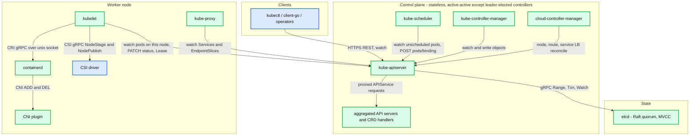
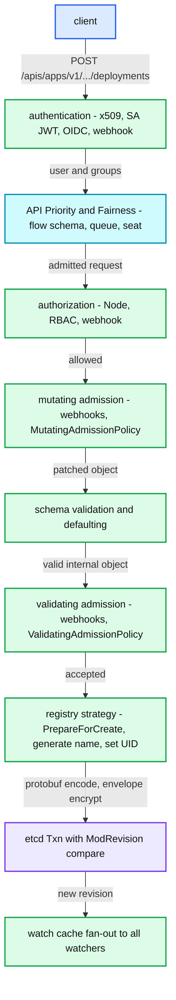
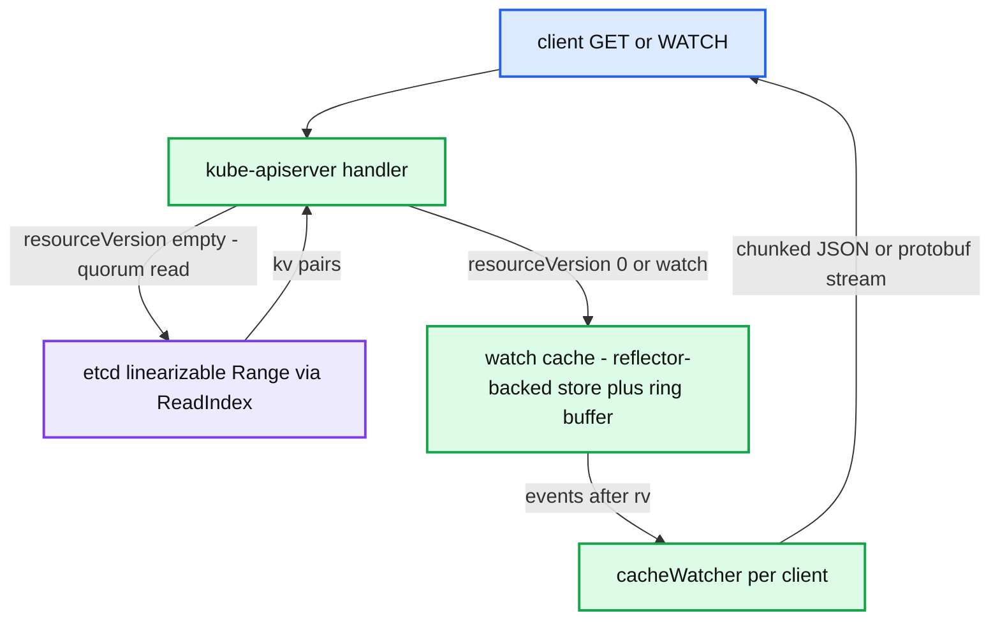
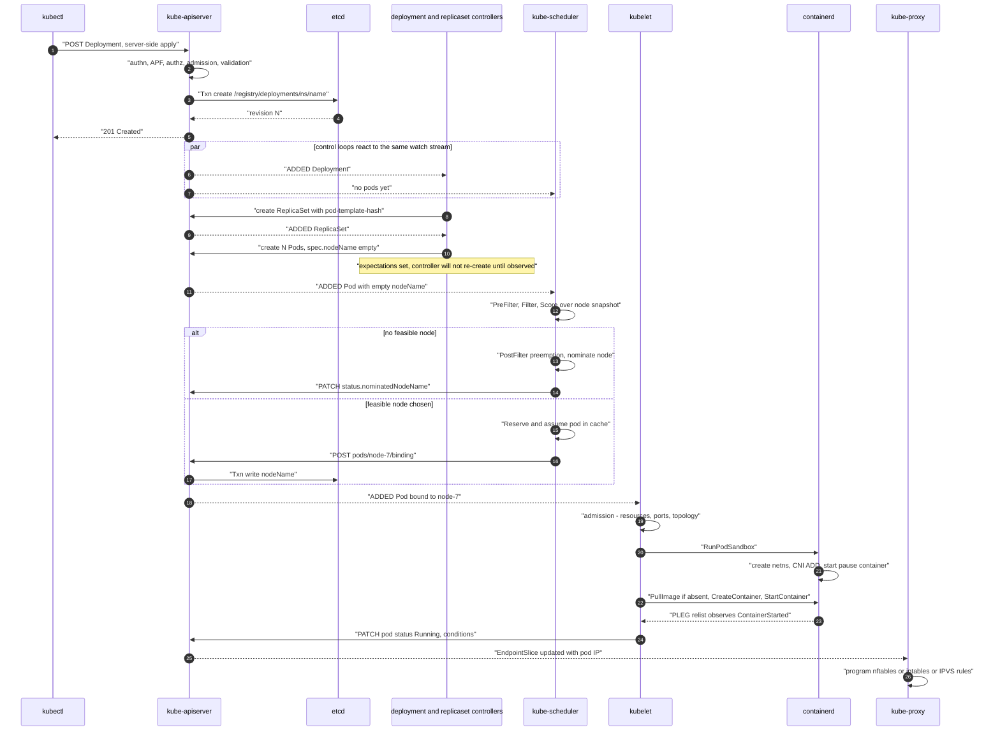
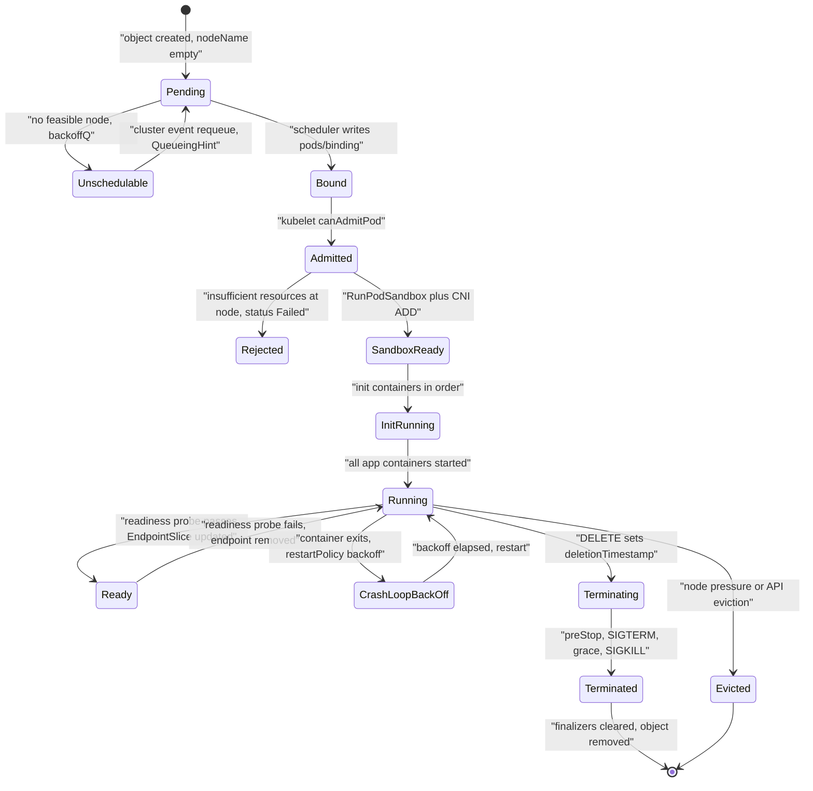

# Kubernetes — Overview and Reading Map

**Series baseline: Kubernetes v1.34.** Deltas through v1.37 are catalogued in [`kubernetes-09-delta-since-1.34.md`](kubernetes-09-delta-since-1.34.md). Read that file's errata before quoting any number from the other reports in an interview or a design review.

---

<!-- nav:start -->
← · **[Index](README.md)** · [01 API Server & etcd →](kubernetes-01-apiserver-etcd.md)
<!-- nav:end -->

<!-- toc:start -->

<b>Sections in this report (10)</b>

- [1. Overview](#1-overview)
- [2. Architecture](#2-architecture)
- [3. Data flow — the two paths that matter](#3-data-flow--the-two-paths-that-matter)
- [4. Sequence — `kubectl apply` to a running container](#4-sequence--kubectl-apply-to-a-running-container)
- [5. State machine — the pod, end to end](#5-state-machine--the-pod-end-to-end)
- [6. The series — what is in each report](#6-the-series--what-is-in-each-report)
- [7. Suggested reading order](#7-suggested-reading-order)
- [8. The six ideas that generalise](#8-the-six-ideas-that-generalise)
- [9. Staff-level questions across the whole system](#9-staff-level-questions-across-the-whole-system)
- [10. Sources](#10-sources)

<!-- toc:end -->

## 1. Overview

- **Problem solved.** Kubernetes is a *reconciliation engine over a replicated, watchable object store*. It is not a container runtime, a scheduler, or a network — those are pluggable. The durable contribution is the control model: declare desired state as versioned API objects, and let independent controllers drive observed state toward it.
- **Key design bet #1 — one shared datastore, many dumb agents.** Every component talks only to kube-apiserver; none talk to each other. Component-to-component coupling is replaced by coupling to the object model, which is versioned, validated and auditable.
- **Key design bet #2 — level-triggered reconciliation, not event processing.** Controllers act on *current observed state*, not on the event that woke them. A dropped, duplicated or reordered event costs latency, never correctness. This is the single most important idea in the system.
- **Key design bet #3 — extension over feature accretion.** CRI, CNI, CSI, DRA, CRDs, admission webhooks, CEL policy and scheduler plugins exist so the core never has to know about a specific runtime, network, disk, device or workload type.
- **Scale it operates at.** The upstream supported envelope is 5,000 nodes / 150,000 pods / `min(110, 10×cores)` pods per node, with SLOs of p99 ≤ 1s for non-list API calls and p99 ≤ 5s for pod startup (excluding image pull). Beyond that, the answer is more clusters, not a bigger one.

**The one-sentence version:** *etcd holds the truth, the apiserver guards and publishes it, and every other component is a loop that watches a slice of it and makes reality match.*

---

## 2. Architecture

**What to notice**

- **There is exactly one write path into the cluster's truth.** No component writes to etcd directly except kube-apiserver — that is what makes admission, RBAC, auditing and encryption-at-rest total rather than advisory.
- **Nothing in the diagram is a request/response chain between peers.** The scheduler does not call the kubelet. It writes a `Binding`; the kubelet notices. Removing an arrow between two components and replacing it with the object store is the recurring refactor in this system's history.
- **The control plane is stateless.** Run three apiservers behind a load balancer and they are interchangeable; the only leader-elected processes are kube-controller-manager, cloud-controller-manager and kube-scheduler, and leadership there is an optimisation against duplicated work, not a correctness requirement (reconciliation is idempotent).
- **Every node-local subsystem is an interface, not an implementation.** containerd, Calico and the EBS CSI driver are all replaceable without the control plane knowing.

---

## 3. Data flow — the two paths that matter

### 3.1 Write path (any object)

**What to notice**

- **Order is load-bearing.** APF sits *before* authorization, so a flood of unauthorized requests still gets queued and shed rather than melting the authorizer. Mutating admission runs before schema validation so a webhook cannot be bypassed by sending an invalid object.
- **The write is a compare-and-swap.** `GuaranteedUpdate` reads, applies the mutation, and commits with a `ModRevision` compare; a conflict returns HTTP 409 and the client re-reads. There are no locks anywhere in Kubernetes.
- **Encryption and audit are on this path, not beside it.** That is only possible because there is a single writer.
- **The last hop is the interesting one.** One etcd revision becomes an event delivered to every watcher — this fan-out, not the write itself, is what limits cluster size.

### 3.2 Read path

**What to notice**

- **`resourceVersion` is the whole API.** `""` means "give me the newest, quorum-read"; `"0"` means "anything you have cached is fine"; a specific value means "start here". Nearly every scalability incident in Kubernetes is somebody doing an unpaginated `""` LIST of a large resource.
- **The watch cache exists to keep etcd out of the read path.** One reflector per resource feeds an in-memory store plus a bounded ring buffer (100 → 102,400 entries, sized dynamically); thousands of watchers are then served from RAM.
- **"too old resource version" is normal, not an error.** It means the client fell off the end of the ring and must relist — which is exactly the thundering herd you get when an apiserver restarts.

---

## 4. Sequence — `kubectl apply` to a running container

This is the trace to be able to draw on a whiteboard from memory. It crosses every report in the series.

**What to notice**

- **No component was told to do anything.** Each one watched an object change and acted. The "orchestration" is emergent.
- **Binding is a write, not an RPC.** The scheduler's output is a two-field object; the kubelet's input is a watch event. Either can restart mid-flight without a protocol.
- **The scheduler's `assume` is optimistic.** It updates its own cache before the API write lands, so the next scheduling cycle sees the capacity as consumed. If the bind fails, `Unreserve` unwinds it — a classic optimistic-concurrency pattern applied to a cache.
- **The kubelet re-runs admission locally.** The scheduler's decision is advisory; the node has the final say, because the scheduler's view is a snapshot and the node's is the truth.
- **Readiness and endpoint programming are the long tail.** The pod is "Running" long before traffic reaches it — probe success → EndpointSlice write → kube-proxy sync is where rollout glitches actually live.

---

## 5. State machine — the pod, end to end

**What to notice**

- **`Running` and `Ready` are different states with different owners.** The kubelet owns `Running`; the probe manager plus the EndpointSlice controller own whether traffic arrives.
- **Deletion is cooperative, not immediate.** `deletionTimestamp` plus finalizers means "everyone who registered interest must ack" — which is exactly why a stuck finalizer wedges a namespace forever.
- **Eviction is two unrelated mechanisms wearing one word.** Node-pressure eviction is the kubelet unilaterally killing pods; API-initiated eviction is a `pods/eviction` request that respects PodDisruptionBudgets. Confusing them is a common interview failure.
- **There is no `Rescheduled` transition.** A pod is bound exactly once. "Rescheduling" is a new pod object created by a controller — which is why bare pods never move.

---

## 6. The series — what is in each report

| # | Report | Covers | Read it when you need to reason about |
|---|--------|--------|----------------------------------------|
| 01 | [`kubernetes-01-apiserver-etcd.md`](kubernetes-01-apiserver-etcd.md) | etcd Raft/MVCC/bbolt, apiserver handler chain, APF, admission, API machinery, server-side apply, watch cache | Control-plane latency, LIST blowups, etcd sizing, watch semantics, upgrade/storage versions |
| 02 | [`kubernetes-02-controllers.md`](kubernetes-02-controllers.md) | Reflector, DeltaFIFO, informers, workqueues, leader election, every built-in controller, garbage collector, finalizers | Writing an operator, controller hot loops, stuck deletes, rollout semantics, node eviction behaviour |
| 03 | [`kubernetes-03-scheduler.md`](kubernetes-03-scheduler.md) | Scheduling framework, queues and backoff, filter/score plugins, preemption, cache and snapshot, binding cycle | Pending pods, placement policy, topology spread, priority design, gang-scheduling gaps |
| 04 | [`kubernetes-04-kubelet-node-runtime.md`](kubernetes-04-kubelet-node-runtime.md) | syncLoop and podWorkers, PLEG, CRI, containerd and runc, cgroups and QoS, eviction, probes, device/CPU/topology managers | Pod startup latency, OOM and throttling, node NotReady, image pull cost, GPU and NUMA placement |
| 05 | [`kubernetes-05-networking.md`](kubernetes-05-networking.md) | CNI, IPAM, Services and EndpointSlices, kube-proxy iptables/IPVS/nftables/eBPF, CoreDNS, NetworkPolicy, Gateway API | Connection resets on deploy, DNS latency, conntrack exhaustion, service scale limits, mesh decisions |
| 06 | [`kubernetes-06-storage.md`](kubernetes-06-storage.md) | PV/PVC binding, VolumeBinding plugin, attach/detach, CSI spec and sidecars, mount paths, snapshots, expansion | Stuck volumes, multi-attach, StatefulSet fencing, storage on Kubernetes viability |
| 07 | [`kubernetes-07-extensibility-security.md`](kubernetes-07-extensibility-security.md) | CRDs, aggregation, admission webhooks, CEL policy, authn/authz, RBAC, SA tokens, PSA, secrets encryption, PKI | Platform design, policy engines, workload identity, multi-tenancy, cert outages |
| 08 | [`kubernetes-08-autoscaling-and-scale.md`](kubernetes-08-autoscaling-and-scale.md) | HPA/VPA/Cluster Autoscaler/Karpenter/KEDA, descheduler, PDBs, quota, the 5k-node envelope | Capacity and cost, autoscaler thrash, drain deadlocks, what saturates first at scale |
| 09 | [`kubernetes-09-delta-since-1.34.md`](kubernetes-09-delta-since-1.34.md) | v1.35 → v1.37 feature-gate movement, removals, per-report errata | Before trusting any specific default or gate stage in reports 01–08 |
| — | [`patterns.md`](patterns.md) | Cross-system distributed-systems patterns and which systems use each | Comparing Kubernetes to Kafka, Spanner, Borg, S3 in a design discussion |

---

## 7. Suggested reading order

1. **01 (apiserver/etcd)** and **02 (controllers)** first, together. Every other subsystem is an instance of these two. If you only ever internalise the object store plus reconciliation loop, you can derive most of the rest.
2. **03 (scheduler)** next — it is the cleanest worked example of the pattern: watch, decide, write one field.
3. **04 (kubelet)** — the largest surface, and the one where Linux knowledge pays off. This is where most production incidents actually originate.
4. **05 (networking)** — the hardest to reason about because the dataplane is invisible from the API. Budget the most time here.
5. **06, 07, 08** in any order, driven by what your current work touches.
6. **09** last, then keep it open whenever quoting a number.

---

## 8. The six ideas that generalise

These are the transferable takeaways — the reason this system is worth studying even if you never run it.

- **Level-triggered beats edge-triggered for control systems.** Edge-triggered designs must make the message bus reliable, ordered and exactly-once. Level-triggered designs make the *state* authoritative and let the transport be lossy. Kubernetes chose the second and got crash-safety for free.
- **A single guarded write path buys you everything cross-cutting.** Authn, authz, admission, validation, audit, encryption, quota, versioning and conversion are all implementable exactly once because nothing bypasses kube-apiserver.
- **Optimistic concurrency scales where locking does not.** `resourceVersion` compare-and-swap plus retry, everywhere, with zero distributed locks. The cost is that callers must handle 409, and that a "lock" (leader election Lease) is an availability optimisation, not a fencing guarantee — a stalled leader can still write. Know this gap; it is a favourite interview probe.
- **Caches with explicit staleness contracts.** The watch cache, the informer cache and the scheduler snapshot are all deliberately stale, with a documented mechanism (revalidation, admission at the node, `assume`/`Unreserve`) that makes staleness safe rather than merely unlikely.
- **Interfaces at the blast-radius boundary.** CRI/CNI/CSI/DRA exist exactly where a vendor-specific bug would otherwise take down the control plane. The sidecar model in CSI is the same idea applied again: keep third-party code out of the trusted process.
- **Extension mechanisms are ranked by their failure mode.** In-process CEL policy < admission webhook < aggregated API server, in increasing order of what breaks when it is down. Choosing the weakest extension point that does the job is a Staff-level judgement call, and [report 07](kubernetes-07-extensibility-security.md) has the table.

---

## 9. Staff-level questions across the whole system

Five questions that span reports; the per-subsystem reports have five more each.

1. **A `kubectl get pods -A` in a 5,000-node cluster times out and the apiserver's memory doubles. Walk through what happened and three fixes at different layers.**
   Unpaginated LIST of ~150,000 pods: the apiserver decodes every object from etcd (or from the watch cache) into Go structs, then re-encodes to JSON. Fixes: force pagination/`limit` and use protobuf; serve from the watch cache with a consistent-read snapshot rather than etcd; classify that flow into a low-priority APF level so it sheds instead of starving writes; and long-term, move offenders to `WatchList` streaming so the initial state arrives as a stream with bounded memory.

2. **Why can two kube-controller-managers both believe they hold the lease, and why is that not a correctness bug?**
   Leader election is a Lease with renew deadline 10s inside a 15s duration; a paused or partitioned leader can wake up and still issue writes because there is no fencing token validated at the apiserver. It is tolerable only because reconciliation is idempotent and level-triggered — both leaders compute the same desired state from the same observed state. It *is* a bug for any controller with side effects outside Kubernetes (billing, cloud API calls), which is why those must be independently idempotent.

3. **A rolling update drops ~0.5% of requests despite a readiness probe and `maxUnavailable: 0`. Diagnose it.**
   Endpoint removal and pod termination race: the `preStop`/SIGTERM path starts as soon as the DELETE lands, but EndpointSlice update → kube-proxy sync → every node's dataplane is eventually consistent and takes hundreds of milliseconds to seconds at scale. Established conntrack entries also keep flowing to a terminating pod. Fixes: a `preStop` sleep longer than the propagation delay, `terminationGracePeriodSeconds` large enough to drain, graceful shutdown in the app, and `trafficDistribution`/terminating-endpoint support so proxies drain rather than drop.

4. **You need to enforce "no image from an untrusted registry". Compare doing it with a validating webhook, a ValidatingAdmissionPolicy, and an aggregated API server, on availability and latency.**
   CEL policy runs in-process: no network hop, no certificate to rotate, no availability coupling, bounded by a CEL cost budget — the right default. A webhook adds an RPC on every matching write (default 10s timeout) and a hard availability dependency under `failurePolicy: Fail`, including the classic deadlock where the webhook's own pods cannot be admitted. An aggregated API server is not the right tool at all here — it serves new resources, it does not intercept existing ones.

5. **Design a 20,000-node platform. What do you do, and what is the first thing that breaks if you try one cluster?**
   Shard into multiple clusters (region- and failure-domain-aligned, provisioned with Cluster API), with a fleet control plane for placement and a multi-cluster service mesh or MCS API for cross-cluster discovery. In one cluster, the earliest saturations are etcd watch fan-out and database size, apiserver memory under LIST/watch load, kube-proxy sync time versus Service count, and the scheduler's single-threaded scheduling cycle. The honest answer is that upstream tests to 5,000 nodes and everything above that is your own SLO to defend.

---

## 10. Sources

- [Kubernetes documentation — Concepts and Reference](https://kubernetes.io/docs/concepts/)
- [Kubernetes Enhancement Proposals (KEPs)](https://github.com/kubernetes/enhancements/tree/master/keps)
- [kubernetes/kubernetes source](https://github.com/kubernetes/kubernetes)
- [SIG Scalability — scalability thresholds and SLOs](https://github.com/kubernetes/community/tree/master/sig-scalability)
- [Kubernetes releases](https://kubernetes.io/releases/)
- Burns, Grant, Oppenheimer, Brewer, Wilkes — *Borg, Omega, and Kubernetes*, ACM Queue 2016
- Verma et al. — *Large-scale cluster management at Google with Borg*, EuroSys 2015
- Per-subsystem sources are listed in each report's section 12.

---

<!-- nav:start -->
← · **[Index](README.md)** · [01 API Server & etcd →](kubernetes-01-apiserver-etcd.md)
<!-- nav:end -->
