# Kubernetes Internals 01 — kube-apiserver and etcd: the storage and API layer

**Target version:** Kubernetes **v1.34** (paired with **etcd 3.6.5** — `build/dependencies.yaml` and `kubeadm` `DefaultEtcdVersion`). All defaults, flag names and feature-gate stages below were read from the `release-1.34` branch of `kubernetes/kubernetes`, `main` of `etcd-io/etcd`, and `kubernetes/enhancements`. Later Kubernetes releases exist; nothing here is extrapolated forward. **[documented]** unless a claim is explicitly marked **[inferred]**.

---

<!-- nav:start -->
[← 00 Overview](kubernetes-00-overview.md) · **[Index](README.md)** · [02 Controllers →](kubernetes-02-controllers.md)
<!-- nav:end -->

<!-- toc:start -->

<b>Sections in this report (12)</b>

- [1. Overview](#1-overview)
- [2. Architecture](#2-architecture)
- [3. Data flow](#3-data-flow)
- [4. Sequence of operations](#4-sequence-of-operations)
- [5. State machines](#5-state-machines)
- [6. Component deep dives](#6-component-deep-dives)
- [7. Guarantees](#7-guarantees)
- [8. Failure modes](#8-failure-modes)
- [9. Scalability & performance](#9-scalability--performance)
- [10. Trade-offs & alternatives](#10-trade-offs--alternatives)
- [11. Staff-level questions](#11-staff-level-questions)
- [12. Sources](#12-sources)

<!-- toc:end -->

## 1. Overview

- **Problem solved.** Kubernetes needs a single, strongly-consistent, watchable object store that ~10 controller binaries and every node agent can level-trigger against, plus a schema-versioned REST façade in front of it that survives 15 years of API evolution without breaking clients.
- **Key design bet #1 — one Raft log, no sharding.** The entire cluster state lives in one etcd keyspace under `/registry`. Consistency is bought at the cost of a hard write ceiling (one leader, one fsync path) and a **2 GiB** default backend quota.
- **Key design bet #2 — the apiserver absorbs read load, etcd only takes writes.** A per-resource in-memory `cacher` (watch cache) fed by a single reflector serves nearly all GETs, LISTs and WATCHes. In v1.34 `ConsistentListFromCache` went **GA** and `ListFromCacheSnapshot` went **beta**, so even linearizable and historical LISTs are served from RAM.
- **Key design bet #3 — internal versions + conversion.** Every built-in type has a hub "internal" version; wire versions convert in and out of it, which is what makes `v1beta1`→`v1` migration a compile-time problem rather than a data-migration problem.
- **Scale it operates at.** SIG-Scalability's supported envelope: **5,000 nodes**, **150,000 pods**, **10,000 namespaces**, ≤150k objects per resource type, ≤1.5 MB per object, ≤1.5 GB total; SLO: p99 ≤ **1 s** for mutating single-object calls and `scope=resource` reads, ≤ **30 s** for namespace/cluster-scoped LISTs. Google's 130k-node GKE run pushed **~1,000 pod creations/s**, **1M+ objects**, **13,000 QPS** of Lease updates — on a Spanner-backed store, not etcd.

---

## 2. Architecture

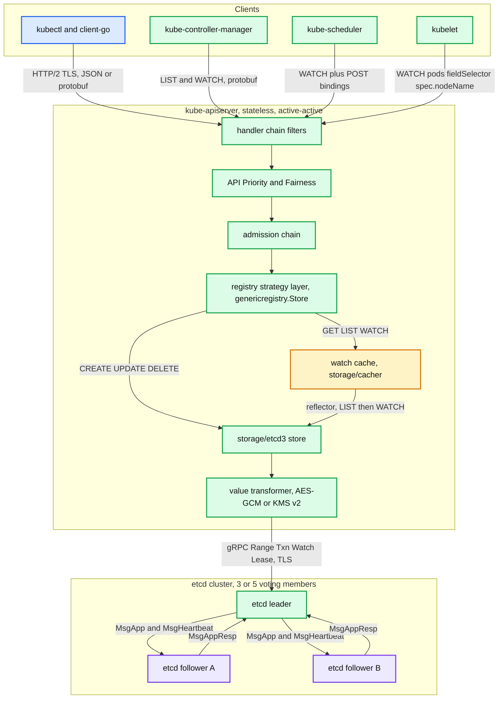
```mermaid
flowchart TD
  subgraph Clients["Clients"]
    KUBECTL["kubectl and client-go"]
    KCM["kube-controller-manager"]
    SCHED["kube-scheduler"]
    KUBELET["kubelet"]
  end

  subgraph APIServer["kube-apiserver, stateless, active-active"]
    CHAIN["handler chain filters"]
    APF["API Priority and Fairness"]
    ADM["admission chain"]
    REG["registry strategy layer, genericregistry.Store"]
    CACHER["watch cache, storage/cacher"]
    STORE["storage/etcd3 store"]
    TRANS["value transformer, AES-GCM or KMS v2"]
  end

  subgraph EtcdCluster["etcd cluster, 3 or 5 voting members"]
    E1["etcd leader"]
    E2["etcd follower A"]
    E3["etcd follower B"]
  end

  KUBECTL -->|"HTTP/2 TLS, JSON or protobuf"| CHAIN
  KCM -->|"LIST and WATCH, protobuf"| CHAIN
  SCHED -->|"WATCH plus POST bindings"| CHAIN
  KUBELET -->|"WATCH pods fieldSelector spec.nodeName"| CHAIN
  CHAIN --> APF
  APF --> ADM
  ADM --> REG
  REG -->|"GET LIST WATCH"| CACHER
  REG -->|"CREATE UPDATE DELETE"| STORE
  CACHER -->|"reflector, LIST then WATCH"| STORE
  STORE --> TRANS
  TRANS -->|"gRPC Range Txn Watch Lease, TLS"| E1
  E1 -->|"MsgApp and MsgHeartbeat"| E2
  E1 -->|"MsgApp and MsgHeartbeat"| E3
  E2 -->|"MsgAppResp"| E1
  E3 -->|"MsgAppResp"| E1

  class KUBECTL client
  class KCM,SCHED,KUBELET,CHAIN,APF,ADM,REG,STORE service
  class TRANS,E1 service
  class E2,E3 store
  class CACHER cache

  classDef client   fill:#dbeafe,stroke:#2563eb,stroke-width:2px,color:#111
  classDef service  fill:#dcfce7,stroke:#16a34a,stroke-width:2px,color:#111
  classDef store    fill:#ede9fe,stroke:#7c3aed,stroke-width:2px,color:#111
  classDef cache    fill:#fef3c7,stroke:#d97706,stroke-width:2px,color:#111
  classDef queue    fill:#cffafe,stroke:#0891b2,stroke-width:2px,color:#111
  classDef critical fill:#fee2e2,stroke:#dc2626,stroke-width:4px,color:#111
  classDef external fill:#e5e7eb,stroke:#6b7280,stroke-width:2px,color:#111,stroke-dasharray:4 3
  classDef decision fill:#fce7f3,stroke:#db2777,stroke-width:2px,color:#111
```

**What to notice**

- Reads and writes diverge *inside* the apiserver: the registry layer talks to `cacher` for GET/LIST/WATCH and punches through to `etcd3.store` for mutations. `cacher` is a decorator implementing the same `storage.Interface`.
- There is exactly **one** reflector per (resource, apiserver) pair feeding the cache — N clients watching pods cost etcd one watch stream, not N.
- Encryption-at-rest sits *below* the storage layer and *above* gRPC, so etcd never sees plaintext and the watch cache holds decrypted objects.
- Every apiserver instance is a full peer: no leader, no sticky sessions, no shared memory. All coordination is in etcd.
- Followers never serve Kubernetes traffic directly; the etcd client fans out over all `--etcd-servers` endpoints and the server forwards writes and `ReadIndex` to the leader.

---

## 3. Data flow

### 3.1 Write path

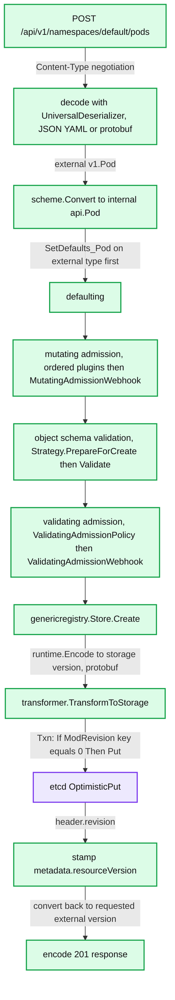
```mermaid
flowchart TD
  A["POST /api/v1/namespaces/default/pods"] -->|"Content-Type negotiation"| B["decode with UniversalDeserializer, JSON YAML or protobuf"]
  B -->|"external v1.Pod"| C["scheme.Convert to internal api.Pod"]
  C -->|"SetDefaults_Pod on external type first"| D["defaulting"]
  D --> E["mutating admission, ordered plugins then MutatingAdmissionWebhook"]
  E --> F["object schema validation, Strategy.PrepareForCreate then Validate"]
  F --> G["validating admission, ValidatingAdmissionPolicy then ValidatingAdmissionWebhook"]
  G --> H["genericregistry.Store.Create"]
  H -->|"runtime.Encode to storage version, protobuf"| I["transformer.TransformToStorage"]
  I -->|"Txn: If ModRevision key equals 0 Then Put"| J["etcd OptimisticPut"]
  J -->|"header.revision"| K["stamp metadata.resourceVersion"]
  K -->|"convert back to requested external version"| L["encode 201 response"]

  class A,B,C,D,E,F,G,H service
  class I,K,L service
  class J store

  classDef client   fill:#dbeafe,stroke:#2563eb,stroke-width:2px,color:#111
  classDef service  fill:#dcfce7,stroke:#16a34a,stroke-width:2px,color:#111
  classDef store    fill:#ede9fe,stroke:#7c3aed,stroke-width:2px,color:#111
  classDef cache    fill:#fef3c7,stroke:#d97706,stroke-width:2px,color:#111
  classDef queue    fill:#cffafe,stroke:#0891b2,stroke-width:2px,color:#111
  classDef critical fill:#fee2e2,stroke:#dc2626,stroke-width:4px,color:#111
  classDef external fill:#e5e7eb,stroke:#6b7280,stroke-width:2px,color:#111,stroke-dasharray:4 3
  classDef decision fill:#fce7f3,stroke:#db2777,stroke-width:2px,color:#111
```

**What to notice**

- Defaulting runs on the **external** type, before conversion to internal — that is why `v1beta1` and `v1` can default differently for the same field.
- Mutating admission runs on the *internal* object; the webhook plugin converts out to the admission review version and back.
- The create transaction is `ModRevision(key) == 0`, not `CreateRevision`, so a resurrected key after delete still passes; uniqueness is guaranteed by the key not existing.
- `resourceVersion` returned to the client is the etcd **`header.revision` of the whole store**, not a per-key counter — this is what makes cross-resource watch resumption coherent.
- `--storage-media-type` defaults to `application/vnd.kubernetes.protobuf` in `kube-apiserver` (the generic apiserver library default is `application/json`; `pkg/controlplane/apiserver/options/options.go` overrides it).

### 3.2 Read path

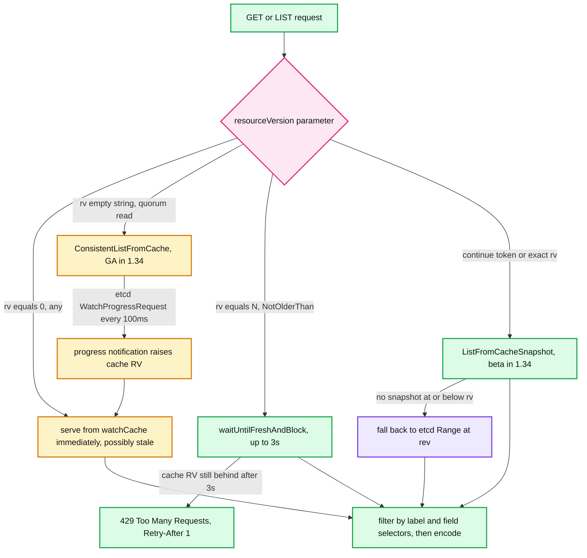
```mermaid
flowchart TD
  R["GET or LIST request"] --> RV{"resourceVersion parameter"}
  RV -->|"rv equals 0, any"| C0["serve from watchCache immediately, possibly stale"]
  RV -->|"rv empty string, quorum read"| CQ["ConsistentListFromCache, GA in 1.34"]
  RV -->|"rv equals N, NotOlderThan"| CN["waitUntilFreshAndBlock, up to 3s"]
  RV -->|"continue token or exact rv"| CS["ListFromCacheSnapshot, beta in 1.34"]

  CQ -->|"etcd WatchProgressRequest every 100ms"| PN["progress notification raises cache RV"]
  PN --> C0
  CN -->|"cache RV still behind after 3s"| TMO["429 Too Many Requests, Retry-After 1"]
  CS -->|"no snapshot at or below rv"| FALL["fall back to etcd Range at rev"]
  C0 --> OUT["filter by label and field selectors, then encode"]
  CN --> OUT
  CS --> OUT
  FALL --> OUT

  class R,CN,CS,TMO,OUT service
  class FALL store
  class C0,CQ,PN cache
  class RV decision

  classDef client   fill:#dbeafe,stroke:#2563eb,stroke-width:2px,color:#111
  classDef service  fill:#dcfce7,stroke:#16a34a,stroke-width:2px,color:#111
  classDef store    fill:#ede9fe,stroke:#7c3aed,stroke-width:2px,color:#111
  classDef cache    fill:#fef3c7,stroke:#d97706,stroke-width:2px,color:#111
  classDef queue    fill:#cffafe,stroke:#0891b2,stroke-width:2px,color:#111
  classDef critical fill:#fee2e2,stroke:#dc2626,stroke-width:4px,color:#111
  classDef external fill:#e5e7eb,stroke:#6b7280,stroke-width:2px,color:#111,stroke-dasharray:4 3
  classDef decision fill:#fce7f3,stroke:#db2777,stroke-width:2px,color:#111
```

**What to notice**

- `resourceVersion=0` means "any version you have, don't block" — it is the cheapest read and the one informers use on initial list; it can legally return an *older* state than a previous read from the same client.
- `resourceVersion=""` (unset) historically meant "quorum read from etcd". With `ConsistentListFromCache` GA in v1.34 it is answered from the cache after a cheap etcd `WatchProgressRequest` confirms the cache has caught up to the current revision.
- The 100 ms `progressRequestPeriod` (`storage/cacher/progress/watch_progress.go`) only fires while at least one request is waiting — it is demand-driven, not a background poll.
- `waitUntilFreshAndBlock` has a hard `blockTimeout = 3 * time.Second`; on expiry the client gets a 429 with `Retry-After: 1`, not a stale answer.
- Snapshot lookup is "next-smaller revision" in a B-tree of `resourceVersion -> lazily-cloned btree`; a miss falls back to a real etcd `Range` at that revision, which can then hit `mvcc: required revision has been compacted`.

### 3.3 Watch / async path

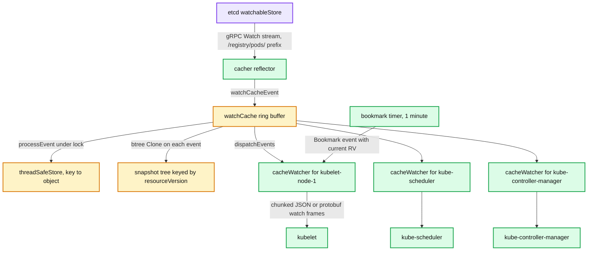
```mermaid
flowchart TD
  ETCD["etcd watchableStore"] -->|"gRPC Watch stream, /registry/pods/ prefix"| REFL["cacher reflector"]
  REFL -->|"watchCacheEvent"| WC["watchCache ring buffer"]
  WC -->|"processEvent under lock"| STORE2["threadSafeStore, key to object"]
  WC -->|"btree Clone on each event"| SNAP["snapshot tree keyed by resourceVersion"]
  WC -->|"dispatchEvents"| CW1["cacheWatcher for kubelet-node-1"]
  WC --> CW2["cacheWatcher for kube-scheduler"]
  WC --> CW3["cacheWatcher for kube-controller-manager"]
  CW1 -->|"chunked JSON or protobuf watch frames"| K1["kubelet"]
  CW2 --> K2["kube-scheduler"]
  CW3 --> K3["kube-controller-manager"]
  BM["bookmark timer, 1 minute"] -->|"Bookmark event with current RV"| CW1

  class REFL,CW1,CW2,CW3,K1,K2,K3,BM service
  class ETCD store
  class WC,STORE2,SNAP cache

  classDef client   fill:#dbeafe,stroke:#2563eb,stroke-width:2px,color:#111
  classDef service  fill:#dcfce7,stroke:#16a34a,stroke-width:2px,color:#111
  classDef store    fill:#ede9fe,stroke:#7c3aed,stroke-width:2px,color:#111
  classDef cache    fill:#fef3c7,stroke:#d97706,stroke-width:2px,color:#111
  classDef queue    fill:#cffafe,stroke:#0891b2,stroke-width:2px,color:#111
  classDef critical fill:#fee2e2,stroke:#dc2626,stroke-width:4px,color:#111
  classDef external fill:#e5e7eb,stroke:#6b7280,stroke-width:2px,color:#111,stroke-dasharray:4 3
  classDef decision fill:#fce7f3,stroke:#db2777,stroke-width:2px,color:#111
```

**What to notice**

- One etcd watch, N `cacheWatcher`s. Fan-out cost is O(watchers) in apiserver CPU, O(1) in etcd.
- Each `cacheWatcher` has a bounded input channel; a slow client that fills it is **terminated**, not allowed to back-pressure the shared ring buffer.
- Bookmarks (`defaultBookmarkFrequency = time.Minute`) let idle watchers advance their `resourceVersion` so a reconnect after a quiet hour does not hit "too old resource version".
- Snapshots are `github.com/google/btree` `Clone()` — copy-on-write, storing pointers to objects already retained for watch history. Measured overhead in the 5k-node test: **~300 MB (1.3% of memory in use)**, **+7 GB allocations (0.2%)** (KEP-4988).
- The reflector uses `SeparateCacheWatchRPC` — deprecated and default **false** since v1.33 — so the cache watch shares the same gRPC connection as regular traffic by default in v1.34.

---

## 4. Sequence of operations

### 4.1 Create a Pod with admission

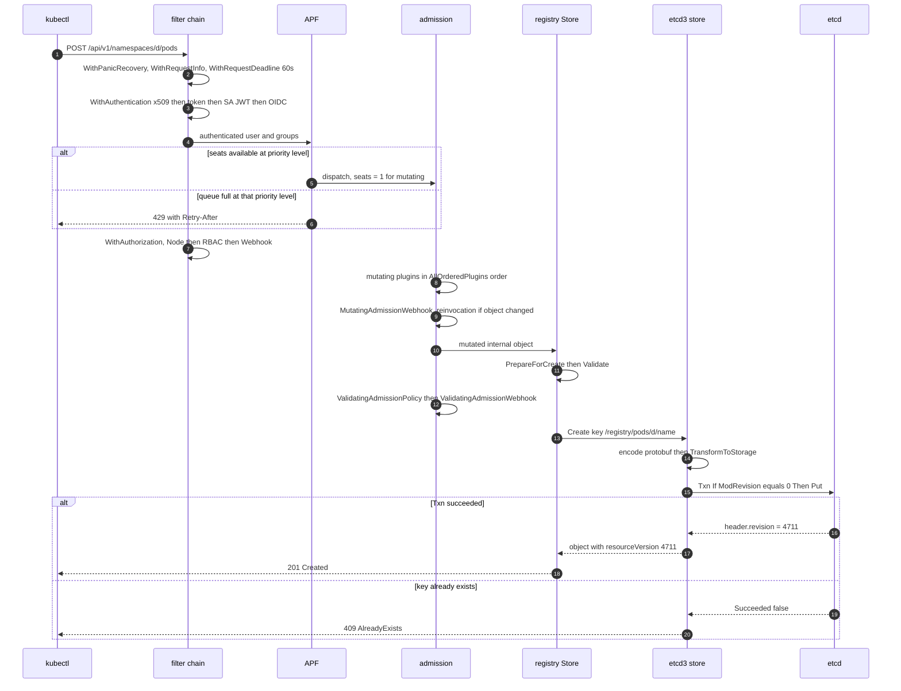
```mermaid
sequenceDiagram
    autonumber
    participant C as kubectl
    participant F as filter chain
    participant P as APF
    participant A as admission
    participant R as registry Store
    participant S as etcd3 store
    participant E as etcd

    C->>F: POST /api/v1/namespaces/d/pods
    F->>F: WithPanicRecovery, WithRequestInfo, WithRequestDeadline 60s
    F->>F: WithAuthentication x509 then token then SA JWT then OIDC
    F->>P: authenticated user and groups
    alt seats available at priority level
        P->>A: dispatch, seats = 1 for mutating
    else queue full at that priority level
        P-->>C: 429 with Retry-After
    end
    F->>F: WithAuthorization, Node then RBAC then Webhook
    A->>A: mutating plugins in AllOrderedPlugins order
    A->>A: MutatingAdmissionWebhook, reinvocation if object changed
    A->>R: mutated internal object
    R->>R: PrepareForCreate then Validate
    A->>A: ValidatingAdmissionPolicy then ValidatingAdmissionWebhook
    R->>S: Create key /registry/pods/d/name
    S->>S: encode protobuf then TransformToStorage
    S->>E: Txn If ModRevision equals 0 Then Put
    alt Txn succeeded
        E-->>S: header.revision = 4711
        S-->>R: object with resourceVersion 4711
        R-->>C: 201 Created
    else key already exists
        E-->>S: Succeeded false
        S-->>C: 409 AlreadyExists
    end
```

**What to notice**

- Authorization runs **after** APF in the wrapping order of `DefaultBuildHandlerChain`, so an unauthorized request still consumes a seat — deliberate, because RBAC evaluation itself is not free.
- Validation is sandwiched *between* mutating and validating admission: webhooks cannot make an object that fails schema validation reach etcd, and validating webhooks see the exact bytes that will be stored.
- Reinvocation policy means a mutating webhook can be called twice in one request if a later webhook changed the object.
- The 60 s deadline (`--request-timeout`) is installed by `WithRequestDeadline` outside the timeout filter; APF is given `c.RequestTimeout/4` = **15 s** as its maximum queue wait.

### 4.2 Watch establishment against the cacher

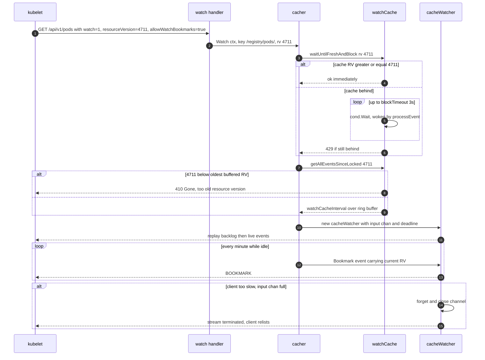
```mermaid
sequenceDiagram
    autonumber
    participant K as kubelet
    participant H as watch handler
    participant CA as cacher
    participant WC as watchCache
    participant CW as cacheWatcher

    K->>H: GET /api/v1/pods with watch=1, resourceVersion=4711, allowWatchBookmarks=true
    H->>CA: Watch ctx, key /registry/pods/, rv 4711
    CA->>WC: waitUntilFreshAndBlock rv 4711
    alt cache RV greater or equal 4711
        WC-->>CA: ok immediately
    else cache behind
        loop up to blockTimeout 3s
            WC->>WC: cond.Wait, woken by processEvent
        end
        WC-->>CA: 429 if still behind
    end
    CA->>WC: getAllEventsSinceLocked 4711
    alt 4711 below oldest buffered RV
        WC-->>K: 410 Gone, too old resource version
    else
        WC-->>CA: watchCacheInterval over ring buffer
    end
    CA->>CW: new cacheWatcher with input chan and deadline
    CW-->>K: replay backlog then live events
    loop every minute while idle
        CA->>CW: Bookmark event carrying current RV
        CW-->>K: BOOKMARK
    end
    alt client too slow, input chan full
        CW->>CW: forget and close channel
        CW-->>K: stream terminated, client relists
    end
```

**What to notice**

- `410 Gone` is produced by the *ring buffer*, not etcd: the requested RV fell off the front of the 100..102,400-entry window. Clients respond by relisting from `rv=0`.
- The initial replay is fed from `getAllEventsSinceLocked`; `initProcessThreshold = 500ms` gates a warning log when that replay is slow.
- `allowWatchBookmarks=true` is what makes long-lived idle watches survivable; without it a quiet resource guarantees a 410 on reconnect once the buffer wraps.
- A `cacheWatcher` is single-goroutine (`process`) reading a buffered channel; the dispatcher never blocks on a slow client — it drops the watcher.
- With `WatchList` (KEP-3157, beta and default **true** again in v1.34), the same endpoint with `sendInitialEvents=true&resourceVersionMatch=NotOlderThan` streams the initial state as ADDED events terminated by a bookmark, replacing the LIST entirely.

### 4.3 Optimistic-concurrency update and conflict

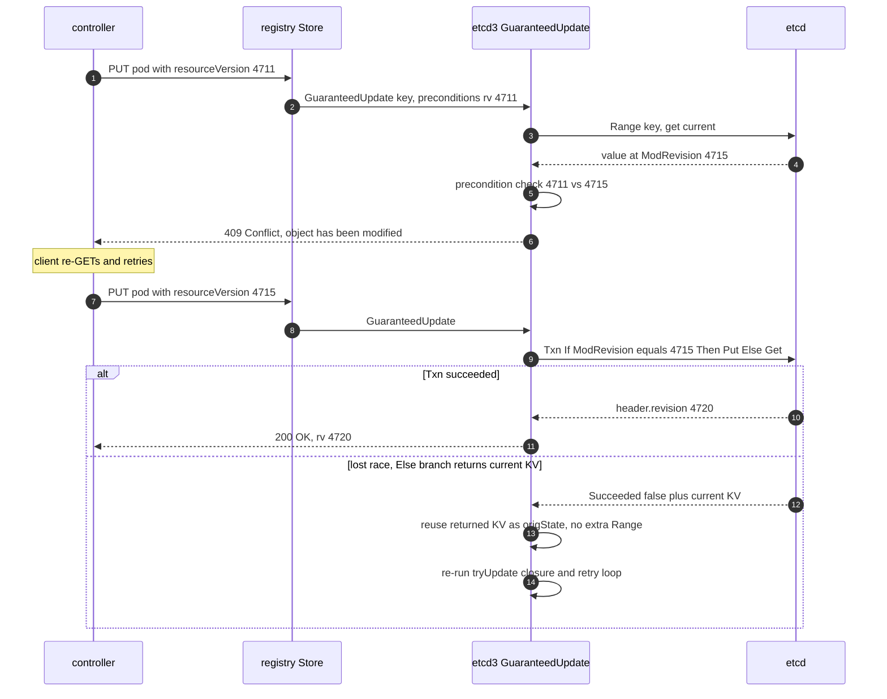
```mermaid
sequenceDiagram
    autonumber
    participant C as controller
    participant R as registry Store
    participant S as etcd3 GuaranteedUpdate
    participant E as etcd

    C->>R: PUT pod with resourceVersion 4711
    R->>S: GuaranteedUpdate key, preconditions rv 4711
    S->>E: Range key, get current
    E-->>S: value at ModRevision 4715
    S->>S: precondition check 4711 vs 4715
    S-->>C: 409 Conflict, object has been modified
    Note over C: client re-GETs and retries
    C->>R: PUT pod with resourceVersion 4715
    R->>S: GuaranteedUpdate
    S->>E: Txn If ModRevision equals 4715 Then Put Else Get
    alt Txn succeeded
        E-->>S: header.revision 4720
        S-->>C: 200 OK, rv 4720
    else lost race, Else branch returns current KV
        E-->>S: Succeeded false plus current KV
        S->>S: reuse returned KV as origState, no extra Range
        S->>S: re-run tryUpdate closure and retry loop
    end
```

**What to notice**

- Two different conflict layers: the **user-visible** precondition (`resourceVersion` in the submitted object → HTTP 409) and the **internal** retry loop inside `GuaranteedUpdate` used by server-side controllers such as status updaters.
- `PutOptions{GetOnFailure: true}` puts an `OpGet` in the transaction's `Else` branch, so a lost race costs one RTT, not two.
- If `tryUpdate` produces byte-identical data and the stored value is not stale, `GuaranteedUpdate` **short-circuits with no write at all** — this is why no-op status updates do not bump `resourceVersion`.
- `ModRevision` comparison is the entire concurrency-control mechanism: Kubernetes has no locks, no leases on objects, no row versions beyond this.

### 4.4 etcd compaction and defragmentation

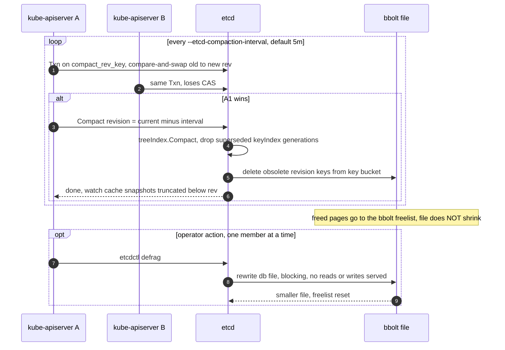
```mermaid
sequenceDiagram
    autonumber
    participant A1 as kube-apiserver A
    participant A2 as kube-apiserver B
    participant E as etcd
    participant B as bbolt file

    loop every --etcd-compaction-interval, default 5m
        A1->>E: Txn on compact_rev_key, compare-and-swap old to new rev
        A2->>E: same Txn, loses CAS
        alt A1 wins
            A1->>E: Compact revision = current minus interval
            E->>E: treeIndex.Compact, drop superseded keyIndex generations
            E->>B: delete obsolete revision keys from key bucket
            E-->>A1: done, watch cache snapshots truncated below rev
        end
    end
    Note over B: freed pages go to the bbolt freelist, file does NOT shrink
    opt operator action, one member at a time
        A1->>E: etcdctl defrag
        E->>B: rewrite db file, blocking, no reads or writes served
        B-->>E: smaller file, freelist reset
    end
```

**What to notice**

- **Compaction** frees *revisions* inside the file; **defragmentation** frees *disk*. Compacting alone never reduces `etcd_mvcc_db_total_size_in_bytes`; it reduces `..._in_use_bytes`.
- The `compact_rev_key` CAS is how N apiservers elect a single compactor without a lock — the loser simply does nothing. KEP-4988 additionally **watches** that key so every apiserver truncates its watch-cache snapshots at the same revision, preserving conformance.
- `defrag` is stop-the-world per member. Doing it on all members at once takes the cluster down; do it serially, leader last.
- Two independent compactors — apiserver's `--etcd-compaction-interval` (default **5m**) and etcd's own `--auto-compaction-retention` (default **0**, disabled) — will fight. Pick one; if you set etcd's, set the apiserver's to `0`.
- Split-etcd setups (`--etcd-servers-overrides`) run a **separate** compaction loop per storage config; a misconfigured events etcd silently never compacts.

### 4.5 etcd leader election and linearizable read

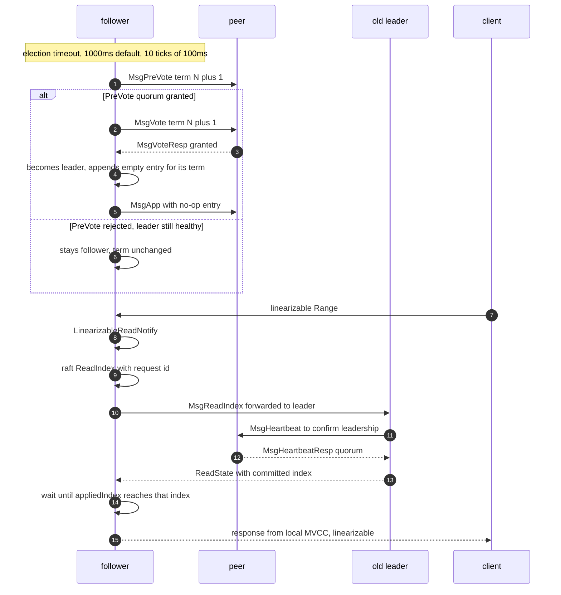
```mermaid
sequenceDiagram
    autonumber
    participant F as follower
    participant P as peer
    participant L as old leader
    participant C as client

    Note over F: election timeout, 1000ms default, 10 ticks of 100ms
    F->>P: MsgPreVote term N plus 1
    alt PreVote quorum granted
        F->>P: MsgVote term N plus 1
        P-->>F: MsgVoteResp granted
        F->>F: becomes leader, appends empty entry for its term
        F->>P: MsgApp with no-op entry
    else PreVote rejected, leader still healthy
        F->>F: stays follower, term unchanged
    end
    C->>F: linearizable Range
    F->>F: LinearizableReadNotify
    F->>F: raft ReadIndex with request id
    F->>L: MsgReadIndex forwarded to leader
    L->>P: MsgHeartbeat to confirm leadership
    P-->>L: MsgHeartbeatResp quorum
    L-->>F: ReadState with committed index
    F->>F: wait until appliedIndex reaches that index
    F-->>C: response from local MVCC, linearizable
```

**What to notice**

- `PreVote: true` is the **default** in etcd's embed config — a partitioned member cannot bump the cluster term and force a spurious election on rejoin.
- `ReadIndex` gives linearizability **without a Raft log write**: heartbeat quorum + wait-for-apply. This is why quorum reads are cheap enough that Kubernetes used them for every unset-`resourceVersion` read for a decade.
- `readIndexRetryTime = 500ms` in `server/etcdserver/read/read.go`; a leader change re-sends the ReadIndex on `firstCommitInTerm`.
- Any member can serve a linearizable read; it forwards the ReadIndex, not the data.
- Heartbeat 100 ms / election 1000 ms defaults assume a low-RTT LAN. Cross-AZ is fine; cross-region needs both raised or you get election churn.

---

## 5. State machines

### 5.1 `cacheWatcher` lifecycle

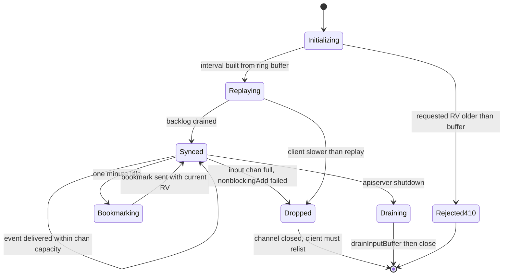
```mermaid
stateDiagram-v2
    [*] --> Initializing
    Initializing --> Replaying : interval built from ring buffer
    Initializing --> Rejected410 : requested RV older than buffer
    Replaying --> Synced : backlog drained
    Synced --> Synced : event delivered within chan capacity
    Synced --> Bookmarking : one minute idle
    Bookmarking --> Synced : bookmark sent with current RV
    Synced --> Dropped : input chan full, nonblockingAdd failed
    Replaying --> Dropped : client slower than replay
    Dropped --> [*] : channel closed, client must relist
    Synced --> Draining : apiserver shutdown
    Draining --> [*] : drainInputBuffer then close
    Rejected410 --> [*]
```

**What to notice**

- There is no back-pressure path back into `watchCache`; the only outcomes for a slow client are "drop" or "drain on shutdown".
- `Rejected410` is the terminal state that generates the famous `too old resource version` error and the client-side relist storm.
- `Draining` exists only when `--shutdown-watch-termination-grace-period` is > 0 (default **0**, i.e. watches are cut immediately).
- Bookmarks are scheduled per-watcher in `watcherBookmarkTimeBuckets`, not broadcast — an active watcher never pays for a bookmark it does not need.

### 5.2 etcd member / Raft role

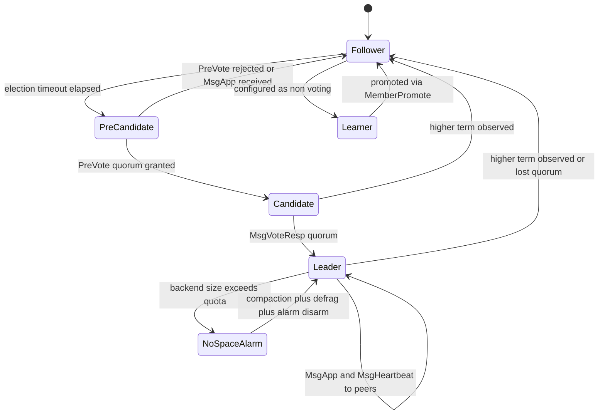
```mermaid
stateDiagram-v2
    [*] --> Follower
    Follower --> PreCandidate : election timeout elapsed
    PreCandidate --> Candidate : PreVote quorum granted
    PreCandidate --> Follower : PreVote rejected or MsgApp received
    Candidate --> Leader : MsgVoteResp quorum
    Candidate --> Follower : higher term observed
    Leader --> Follower : higher term observed or lost quorum
    Leader --> Leader : MsgApp and MsgHeartbeat to peers
    Follower --> Learner : configured as non voting
    Learner --> Follower : promoted via MemberPromote
    Leader --> NoSpaceAlarm : backend size exceeds quota
    NoSpaceAlarm --> Leader : compaction plus defrag plus alarm disarm
```

**What to notice**

- `NOSPACE` is a **cluster-wide alarm**, not a per-member condition: once raised, *every* member rejects writes until it is explicitly disarmed with `etcdctl alarm disarm`.
- Learners replicate but do not vote and do not count toward quorum — the safe way to add a member to a 3-node cluster without briefly needing 3-of-4.
- Losing quorum leaves the old leader unable to commit but still serving serializable reads; linearizable reads block on `ReadIndex`.
- `PreCandidate` is a real state only because `PreVote` is on by default; without it a flapping member causes term inflation and repeated leader churn.

### 5.3 APF request lifecycle

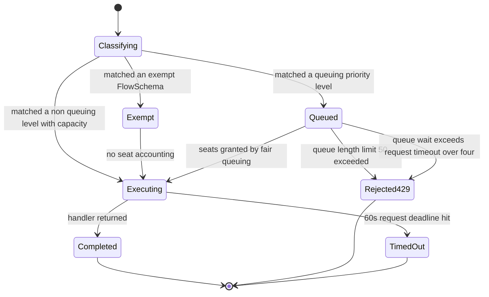
```mermaid
stateDiagram-v2
    [*] --> Classifying
    Classifying --> Exempt : matched an exempt FlowSchema
    Classifying --> Queued : matched a queuing priority level
    Classifying --> Executing : matched a non queuing level with capacity
    Exempt --> Executing : no seat accounting
    Queued --> Executing : seats granted by fair queuing
    Queued --> Rejected429 : queue length limit 50 exceeded
    Queued --> Rejected429 : queue wait exceeds request timeout over four
    Executing --> Completed : handler returned
    Executing --> TimedOut : 60s request deadline hit
    Completed --> [*]
    Rejected429 --> [*]
    TimedOut --> [*]
```

**What to notice**

- Classification is by `FlowSchema` in ascending `matchingPrecedence`; the flow *distinguisher* (user or namespace) then hashes into `Queues` via shuffle sharding.
- Rejection is a 429 with `Retry-After` computed per priority level, not a fixed value — unlike the legacy max-in-flight filter which always sends `Retry-After: 1`.
- The queue-wait bound handed to APF is `RequestTimeout/4` = **15 s** with default `--request-timeout=60s`.
- `Exempt` requests bypass seat accounting entirely; that is why a misconfigured exempt FlowSchema can starve everything else.

### 5.4 Lifecycle of one MVCC key revision

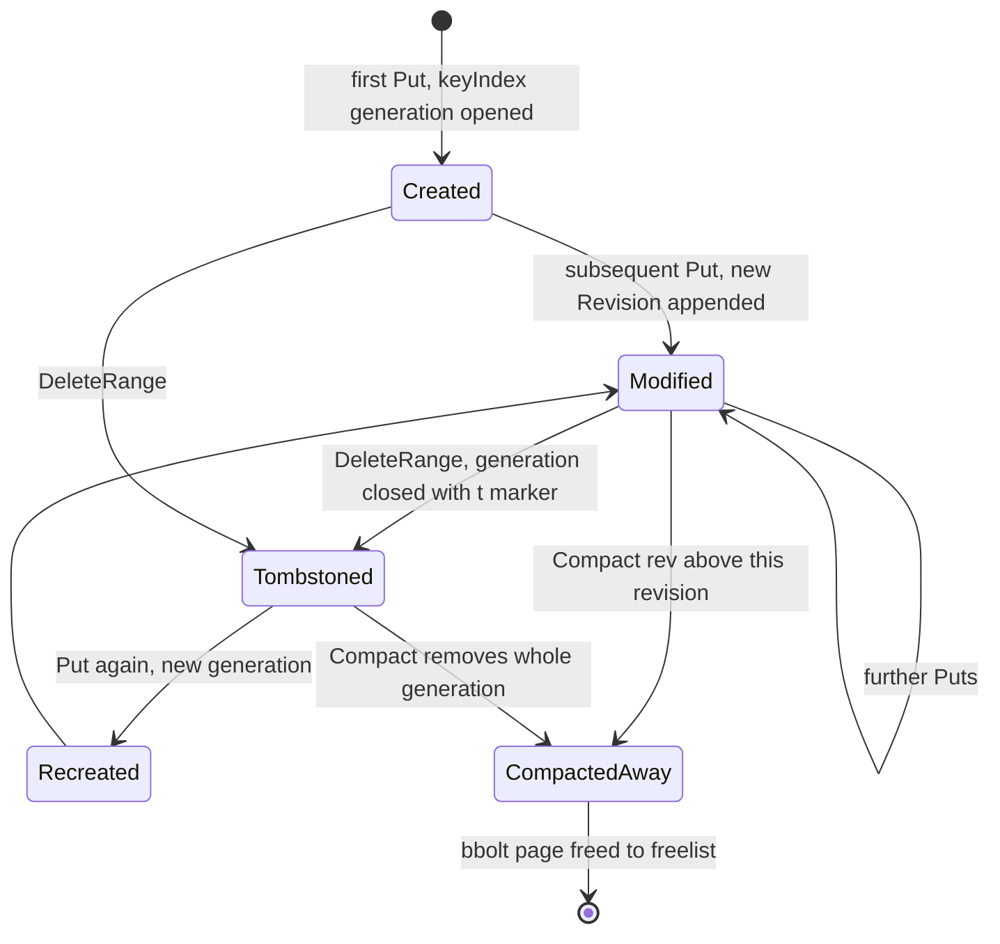
```mermaid
stateDiagram-v2
    [*] --> Created : first Put, keyIndex generation opened
    Created --> Modified : subsequent Put, new Revision appended
    Modified --> Modified : further Puts
    Modified --> Tombstoned : DeleteRange, generation closed with t marker
    Created --> Tombstoned : DeleteRange
    Tombstoned --> Recreated : Put again, new generation
    Recreated --> Modified
    Modified --> CompactedAway : Compact rev above this revision
    Tombstoned --> CompactedAway : Compact removes whole generation
    CompactedAway --> [*] : bbolt page freed to freelist
```

**What to notice**

- A `keyIndex` holds *generations*; a delete closes a generation with a tombstone-marked revision rather than removing anything.
- `create` revision, `mod` revision and `version` (per-key counter) all come from the `keyIndex`, not from the value — Kubernetes exposes only `mod` as `metadata.resourceVersion`.
- Compaction removes superseded revisions but always keeps the *latest* revision of a live key, whatever the compact point.
- Freed bbolt pages return to the freelist and are reused; the `.db` file only shrinks on `defrag`.

---

## 6. Component deep dives

### 6.1 etcd Raft, WAL and snapshots

**Responsibility.** Turn client mutations into a totally-ordered, durably-replicated log; expose `Range`, `Put`, `DeleteRange`, `Txn`, `Compact`, `Watch`, `Lease*` over gRPC (`etcdserverpb.KV`, `Watch`, `Lease`, `Maintenance`, `Cluster`).

**Data structures and algorithms.**
- `raft.RawNode` is a pure state machine: in = `Message` (`MsgApp`, `MsgAppResp`, `MsgVote`, `MsgPreVote`, `MsgHeartbeat`, `MsgSnap`, `MsgReadIndex`), out = `Ready{Entries, CommittedEntries, Messages, HardState, Snapshot, ReadStates}`. No I/O, no timers — the `etcdserver` drives it.
- `raftNode.start` loop: persist `Ready.Entries` + `HardState` to WAL → `fsync` → send `Messages` → apply `CommittedEntries` to the MVCC store → `Advance()`.
- Peer transport is `rafthttp` over HTTP/2 with two channels per peer: a **pipeline** for large/one-shot messages (snapshots) and a **stream** for the steady MsgApp/heartbeat flow.

**On-disk format.**
- WAL: append-only `*.wal` segment files of records `{Type, Crc, Data}`, types `metadataType`, `entryType`, `stateType`, `crcType`, `snapshotType`. Segments are pre-allocated (64 MiB) so writes never extend the file; `--max-wals` default **5**.
- Snapshots: `*.snap` = a serialized bbolt-backed store state plus the Raft `ConfState` and index. Taken every `--snapshot-count` = **10000** applied entries; `--snapshot-catchup-entries` = **5000** entries retained after truncation so a briefly-slow follower gets `MsgApp` instead of `MsgSnap`.

**Concurrency and threading.** One goroutine drives the Raft `Ready` loop; a separate `applyAll` path applies committed entries; gRPC handlers run per-stream. The WAL fsync is on the critical path of the Ready loop — a slow disk stalls replication for the whole cluster.

**Failure handling.** Follower behind by more than `snapshot-catchup-entries` → leader sends `MsgSnap` (whole DB). Leader loss → election after `--election-timeout` (1000 ms). Corrupt WAL tail → truncated at last valid CRC on restart.

**Production knobs.**

| Flag | Default | Note |
|---|---|---|
| `--heartbeat-interval` | `100` ms | one Raft tick |
| `--election-timeout` | `1000` ms | keep ≥ 10× heartbeat, ≥ 5× RTT |
| `--snapshot-count` | `10000` | lower ⇒ more frequent, smaller snapshots |
| `--snapshot-catchup-entries` | `5000` | raise to avoid MsgSnap storms |
| `--max-wals` | `5` | WAL segments retained |
| `--max-request-bytes` | `1572864` (1.5 MiB) | ties to the 1.5 MB object threshold |
| `--max-txn-ops` | `128` | |
| `--warning-apply-duration` | `100ms` | source of "apply entries took too long" |
| `--warning-unary-request-duration` | `300ms` | |
| `--quota-backend-bytes` | `0` → **2 GiB** | > **8 GiB** logs a warning; not a hard cap |
| `--pre-vote` | `true` | |

### 6.2 etcd MVCC: `treeIndex` + bbolt

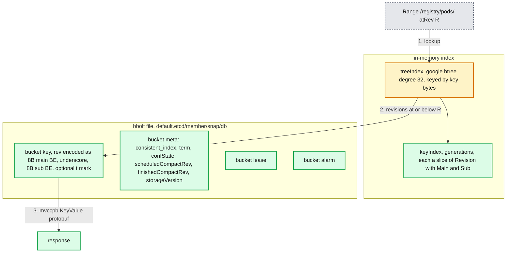
```mermaid
flowchart TD
  subgraph Memory["in-memory index"]
    TI["treeIndex, google btree degree 32, keyed by key bytes"]
    KI["keyIndex, generations, each a slice of Revision with Main and Sub"]
    TI --> KI
  end
  subgraph Disk["bbolt file, default.etcd/member/snap/db"]
    KB["bucket key, rev encoded as 8B main BE, underscore, 8B sub BE, optional t mark"]
    MB["bucket meta: consistent_index, term, confState, scheduledCompactRev, finishedCompactRev, storageVersion"]
    LB["bucket lease"]
    AB["bucket alarm"]
  end
  REQ["Range /registry/pods/ atRev R"] -->|"1. lookup"| TI
  TI -->|"2. revisions at or below R"| KB
  KB -->|"3. mvccpb.KeyValue protobuf"| RESP["response"]

  class KI,KB,MB,LB,AB,RESP service
  class TI cache
  class REQ external

  classDef client   fill:#dbeafe,stroke:#2563eb,stroke-width:2px,color:#111
  classDef service  fill:#dcfce7,stroke:#16a34a,stroke-width:2px,color:#111
  classDef store    fill:#ede9fe,stroke:#7c3aed,stroke-width:2px,color:#111
  classDef cache    fill:#fef3c7,stroke:#d97706,stroke-width:2px,color:#111
  classDef queue    fill:#cffafe,stroke:#0891b2,stroke-width:2px,color:#111
  classDef critical fill:#fee2e2,stroke:#dc2626,stroke-width:4px,color:#111
  classDef external fill:#e5e7eb,stroke:#6b7280,stroke-width:2px,color:#111,stroke-dasharray:4 3
  classDef decision fill:#fce7f3,stroke:#db2777,stroke-width:2px,color:#111
```

**What to notice**

- Two levels: **key → revisions** lives in RAM, **revision → value** lives on disk. Every read is an index lookup followed by point gets on a *revision-ordered* B+tree, which is why historical reads cost the same as current ones.
- Because bbolt is keyed by revision, writes are **append-mostly at the end of the keyspace** — near-sequential page allocation, good write locality.
- The whole `treeIndex` must be rebuilt from bbolt at startup. Restart time on a large DB is dominated by this scan, not by WAL replay. **[documented behaviour, timing inferred]**
- `consistent_index` in the `meta` bucket is what makes apply idempotent across restarts: entries at or below it are skipped on replay.
- `mvccpb.KeyValue` carries `create_revision`, `mod_revision`, `version`, `lease` — Kubernetes uses `mod_revision` (and the response header revision) and ignores the rest.

**Concurrency.** bbolt is single-writer / multi-reader MVCC: one write transaction at a time, readers see a consistent snapshot. etcd batches writes into a `batchTx` committed every `--backend-batch-interval` (100 ms) or `--backend-batch-limit` (10000 ops). `--backend-bbolt-freelist-type` defaults to `map`.

**Failure handling.** `mvcc: database space exceeded` (`codes.ResourceExhausted`) once `db_total_size` > quota; the `NOSPACE` alarm blocks *all* writes cluster-wide. Recovery is: compact → defrag every member → `etcdctl alarm disarm`.

### 6.3 etcd watch: `watchableStore`

**Responsibility.** Serve `Watch` streams with the guarantees Kubernetes depends on: *ordered* (revision-increasing), *reliable* (no gaps), *atomic* (all events of one revision delivered together).

**Data structures.**
- `watcherGroup` = `watcherSetByKey` (exact-key map) + `adt.IntervalTree` (red-black interval tree) for range watchers. Kubernetes uses range watchers exclusively (`/registry/pods/` prefix).
- Three sets: **`synced`** (caught up to `currentRev`), **`unsynced`** (replaying history), **`victims`** (batches that blocked on a full channel).
- Per-watcher channel `chanBufLen = 128`; `maxWatchersPerSync = 512` watchers moved per sync pass; `watchBatchMaxRevs = 1000` distinct revisions per batch.

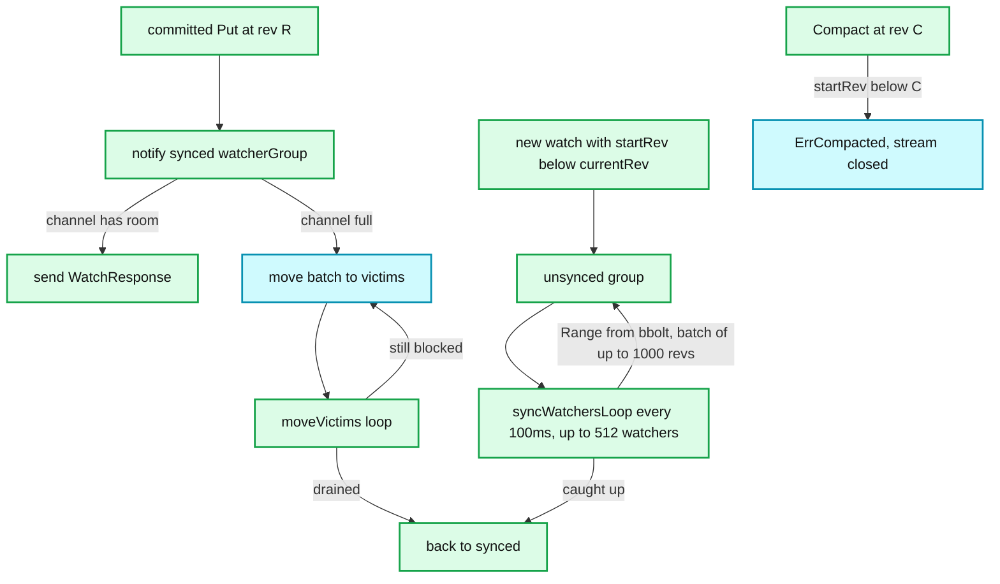
```mermaid
flowchart TD
  PUT["committed Put at rev R"] --> NOTIFY["notify synced watcherGroup"]
  NOTIFY -->|"channel has room"| SEND["send WatchResponse"]
  NOTIFY -->|"channel full"| VIC["move batch to victims"]
  VIC --> VLOOP["moveVictims loop"]
  VLOOP -->|"drained"| SYNCED["back to synced"]
  VLOOP -->|"still blocked"| VIC
  NEW["new watch with startRev below currentRev"] --> UNS["unsynced group"]
  UNS --> SYNCLOOP["syncWatchersLoop every 100ms, up to 512 watchers"]
  SYNCLOOP -->|"Range from bbolt, batch of up to 1000 revs"| UNS
  SYNCLOOP -->|"caught up"| SYNCED
  COMPACT["Compact at rev C"] -->|"startRev below C"| CANCEL["ErrCompacted, stream closed"]

  class PUT,NOTIFY,SEND,VLOOP,SYNCED,NEW,UNS,SYNCLOOP service
  class COMPACT service
  class VIC,CANCEL queue

  classDef client   fill:#dbeafe,stroke:#2563eb,stroke-width:2px,color:#111
  classDef service  fill:#dcfce7,stroke:#16a34a,stroke-width:2px,color:#111
  classDef store    fill:#ede9fe,stroke:#7c3aed,stroke-width:2px,color:#111
  classDef cache    fill:#fef3c7,stroke:#d97706,stroke-width:2px,color:#111
  classDef queue    fill:#cffafe,stroke:#0891b2,stroke-width:2px,color:#111
  classDef critical fill:#fee2e2,stroke:#dc2626,stroke-width:4px,color:#111
  classDef external fill:#e5e7eb,stroke:#6b7280,stroke-width:2px,color:#111,stroke-dasharray:4 3
  classDef decision fill:#fce7f3,stroke:#db2777,stroke-width:2px,color:#111
```

**What to notice**

- History replay for an unsynced watcher is a **bbolt range scan over the revision bucket**, filtered by the watcher's key range — cheap in revisions, expensive if the revision gap is huge.
- Victims exist so one blocked client cannot stall the commit path; the cost is unbounded memory growth in `victims` if the client never drains. **[documented mechanism; the unbounded-growth risk is inferred]**
- `mvcc: required revision has been compacted` on a watch is fatal to that stream — the apiserver's reflector turns it into a full relist, which is the origin of most "apiserver storms after compaction".
- Progress notifications (`--watch-progress-notify-interval`, default **10m**, plus on-demand `WatchProgressRequest`) advance an idle watcher's revision; Kubernetes uses the on-demand form every **100 ms** while a consistent read is waiting.
- `syncWatchersLoop` runs every 100 ms regardless of load — the floor on how long a resumed watch takes to catch up.

### 6.4 etcd leases (used by Kubernetes for Events TTL and, indirectly, nothing else)

- `LeaseGrant(TTL)` → `LeaseID`; keys attached via `OpPut(..., WithLease(id))`; `LeaseKeepAlive` is a bidirectional stream refreshing the TTL. On expiry the leader issues a `LeaseRevoke` Raft entry that deletes every attached key atomically.
- Kubernetes attaches leases only for objects with a storage TTL — in practice **Events** (`--event-ttl`, default 1h). `coordination.k8s.io/Lease` objects (node heartbeats, leader election) are ordinary keys with no etcd lease; their expiry is evaluated by clients against `renewTime`.
- `etcd3.leaseManager` (`--lease-reuse-duration-seconds`, default **60**) reuses one etcd lease for all objects created within the reuse window, so 10k events/min cost ~1 lease/min rather than 10k leases. Lease objects themselves are the largest source of etcd write QPS in big clusters.
- `maxPendingRevokes = 16` bounds concurrent revocations; a mass expiry is serialized.

### 6.5 kube-apiserver request pipeline

The exact v1.34 wrapping in `DefaultBuildHandlerChain` (`staging/src/k8s.io/apiserver/pkg/server/config.go`), **outermost first**:

1. `WithAuditInit` — allocates the audit event and `Audit-ID`.
2. `WithPanicRecovery` — converts a panic into 500 and logs with `RequestInfo`.
3. `WithMuxAndDiscoveryComplete` — 503s requests that arrive before all API groups are installed (prevents spurious 404s during startup).
4. `WithRequestReceivedTimestamp`, `WithRequestInfo` — parses the path into `RequestInfo{APIGroup, Version, Resource, Subresource, Namespace, Name, Verb}`. Everything downstream keys off this.
5. `WithRoutine` — optional, `APIServingWithRoutine` alpha since v1.30, default off.
6. `WithLatencyTrackers`, `WithHTTPLogging`.
7. `WithRetryAfter` (only if `--shutdown-send-retry-after`), `WithHSTS`, `WithCacheControl`.
8. `WithProbabilisticGoaway` — `--goaway-chance` sends HTTP/2 GOAWAY to a fraction of requests so long-lived client connections rebalance across apiservers.
9. `WithWatchTerminationDuringShutdown` (if grace period > 0), `WithWaitGroup`.
10. `WithRequestDeadline` — installs `--request-timeout` (**60 s**) on the context; per-request `?timeout=` may shorten it.
11. `WithTimeoutForNonLongRunningRequests` — runs the rest in a goroutine and returns 504 on deadline.
12. `WithWarningRecorder`, `WithCORS`.
13. `WithAuthentication` — union authenticator: client x509 (`--client-ca-file`), bearer static token, bootstrap token, service-account JWT (`--service-account-key-file`, bound tokens validated against the API), OIDC / structured `AuthenticationConfiguration` (`StructuredAuthenticationConfiguration` **GA in v1.34**), `TokenReview` webhook, anonymous.
14. `WithTracing` (`APIServerTracing` **GA in v1.34**).
15. `WithAudit` — stages `RequestReceived`, `ResponseStarted`, `ResponseComplete`, `Panic`; backends `log` and `webhook`, batching or blocking mode.
16. `WithImpersonation`.
17. `WithPriorityAndFairness` (or `WithMaxInFlightLimit` when `--enable-priority-and-fairness=false`).
18. `WithAuthorization` — ordered union from `--authorization-mode`: `Node`, `RBAC`, `ABAC`, `Webhook`, `AlwaysAllow`/`AlwaysDeny`; structured `AuthorizationConfiguration` GA since v1.32.

**What to notice**

- The order is *reverse* of the source, because each `handler = Wrap(handler)` puts the new filter outside.
- Audit is initialized outermost so even a panic or an auth failure produces an audit event.
- APF sits **inside** audit and impersonation but **outside** authorization — rejected requests are still audited.
- The legacy limiter is a pure counter pair: `--max-requests-inflight` **400** and `--max-mutating-requests-inflight` **200**. With APF enabled (the default; `APIPriorityAndFairness` GA since v1.29) their *sum*, **600**, becomes the server's total concurrency budget in seats.

### 6.6 API Priority and Fairness

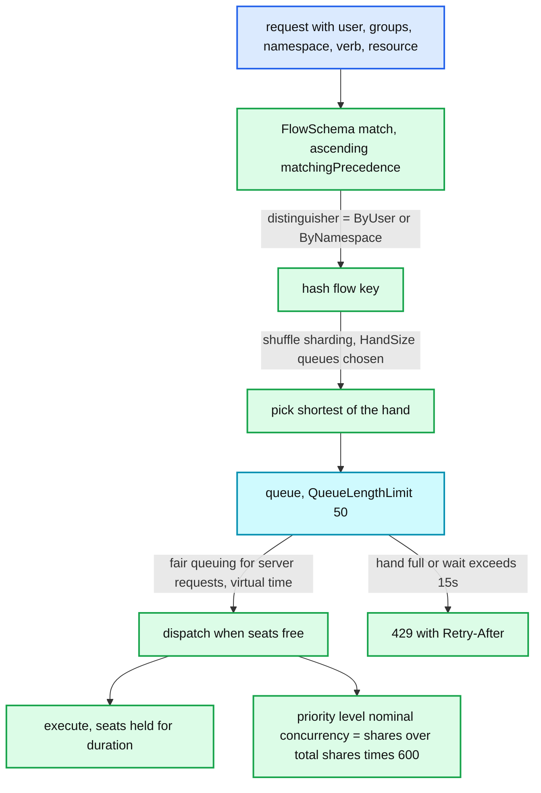
```mermaid
flowchart TD
  REQ["request with user, groups, namespace, verb, resource"] --> FS["FlowSchema match, ascending matchingPrecedence"]
  FS -->|"distinguisher = ByUser or ByNamespace"| HASH["hash flow key"]
  HASH -->|"shuffle sharding, HandSize queues chosen"| PICK["pick shortest of the hand"]
  PICK --> Q["queue, QueueLengthLimit 50"]
  Q -->|"fair queuing for server requests, virtual time"| DISP["dispatch when seats free"]
  DISP --> EXEC["execute, seats held for duration"]
  Q -->|"hand full or wait exceeds 15s"| REJ["429 with Retry-After"]
  DISP --> PL["priority level nominal concurrency = shares over total shares times 600"]

  class REQ client
  class FS,HASH,PICK,DISP,EXEC,REJ,PL service
  class Q queue

  classDef client   fill:#dbeafe,stroke:#2563eb,stroke-width:2px,color:#111
  classDef service  fill:#dcfce7,stroke:#16a34a,stroke-width:2px,color:#111
  classDef store    fill:#ede9fe,stroke:#7c3aed,stroke-width:2px,color:#111
  classDef cache    fill:#fef3c7,stroke:#d97706,stroke-width:2px,color:#111
  classDef queue    fill:#cffafe,stroke:#0891b2,stroke-width:2px,color:#111
  classDef critical fill:#fee2e2,stroke:#dc2626,stroke-width:4px,color:#111
  classDef external fill:#e5e7eb,stroke:#6b7280,stroke-width:2px,color:#111,stroke-dasharray:4 3
  classDef decision fill:#fce7f3,stroke:#db2777,stroke-width:2px,color:#111
```

**What to notice**

- Bootstrap priority levels and their `NominalConcurrencyShares`: `exempt` **0** (unlimited), `node-high` **40** (64 queues, handSize 6), `system` **30** (64/6), `leader-election` **10** (16 queues, handSize **4**), `workload-high` **40** (128/6), `workload-low` **100** (128/6), `global-default` **20** (128/6), `catch-all` **5**. All use `QueueLengthLimit: 50`.
- Shuffle sharding with `HandSize=6` over 128 queues means two flows collide on *all six* queues with probability ~`1/C(128,6)` ≈ 1 in 5.4 billion — that is the isolation guarantee.
- Seat cost: `MinimumSeats=1`; a LIST costs `ceil(objects/ObjectsPerSeat=100)` seats capped at `MaximumListSeatsLimit`, which is **10** normally but **100** when `SizeBasedListCostEstimate` (**beta, default on in v1.34**) is enabled. A mutating request additionally pays `watches/WatchesPerSeat=10` seats for the fan-out, capped at 10, plus `5ms` per watcher of extra duration.
- `leader-election` gets its own level with a small hand precisely so that a controller-manager stampede cannot starve leader-election renewals and cascade into control-plane failover.
- Key metrics: `apiserver_flowcontrol_rejected_requests_total`, `..._request_wait_duration_seconds`, `..._current_inqueue_requests`, `..._priority_level_seat_utilization`.

### 6.7 API machinery: scheme, codecs, conversion, apply

- **`runtime.Scheme`** maps `GroupVersionKind ↔ reflect.Type`, holds conversion funcs, defaulting funcs and field-label conversions. `pkg/api/legacyscheme.Scheme` is the kube-apiserver's instance.
- **Internal vs external.** `pkg/apis/core` is the internal hub (`__internal`); `staging/src/k8s.io/api/core/v1` is external. N external versions need N conversions, not N².  Conversions are code-generated (`zz_generated.conversion.go`) with hand-written overrides.
- **Codec chain.** `serializer.CodecFactory` → `json.Serializer` (also YAML via a converting reader), `protobuf.Serializer` (magic prefix `k8s\x00` + `runtime.Unknown{TypeMeta, Raw}`), and `versioning.codec` which wraps a serializer with encode/decode-time conversion. `--storage-media-type` picks the *storage* codec independently of the wire codec. `CBORServingAndStorage` is alpha since v1.32 and off.
- **Streaming collection encoders.** `StreamingCollectionEncodingToJSON` and `...ToProtobuf` went **GA in v1.34** — list responses are encoded item-by-item into the response writer instead of materializing one giant buffer. This is the single biggest apiserver memory win of the release for large LISTs.
- **Patch types.**

| Content-Type | Semantics | Arrays |
|---|---|---|
| `application/json-patch+json` | RFC 6902 op list | index-based, fragile |
| `application/merge-patch+json` | RFC 7386 | replace whole array |
| `application/strategic-merge-patch+json` | k8s-only, uses `patchStrategy`/`patchMergeKey` struct tags | merge by key, e.g. containers by `name` |
| `application/apply-patch+yaml` | Server-Side Apply | merge by key + **field ownership** |

- **Server-Side Apply** (GA v1.22): `metadata.managedFields[]` records `{manager, operation, apiVersion, fieldsType: FieldsV1, fieldsV1, subresource}`. Each field is owned by exactly one applier; an apply that changes a field owned by someone else returns **409 Conflict** unless `?force=true`. `JSONPatchMaxCopyBytes` and `MaxRequestBodyBytes` both default to **3 MiB**.
- **OpenAPI & discovery.** OpenAPI v2 at `/openapi/v2`, v3 at `/openapi/v3/<group>/<version>` (GA v1.27). Aggregated discovery (GA v1.30) collapses the O(#groups) discovery round-trips into one `/apis` request returning `APIGroupDiscoveryList` when the client sends the right `Accept` — this is what made `kubectl` startup on CRD-heavy clusters bearable.

### 6.8 `k8s.io/apiserver/pkg/storage/etcd3` store

**Key layout.** `--etcd-prefix` (default `/registry`) + `/<group>/<resource>/<namespace>/<name>`; core group has an empty group segment, so pods are `/registry/pods/default/nginx` and deployments are `/registry/deployments/default/web`. Cluster-scoped resources drop the namespace: `/registry/minions/node-1` (nodes keep their historic plural). CRs live at `/registry/<crd-group>/<plural>/<ns>/<name>`.

**Interfaces.** `storage.Interface`: `Create`, `Delete`, `Watch`, `Get`, `GetList`, `GuaranteedUpdate`, `Count`, `ReadinessCheck`, `RequestWatchProgress`.

**Algorithms.**
- `Create` → `OptimisticPut(key, data, expectedRevision=0)`.
- `GuaranteedUpdate` → read-modify-write loop with `OptimisticPut(key, data, origState.rev, GetOnFailure: true)`; retries on `Succeeded==false` reusing the `Else` branch's `OpGet` result.
- `Delete` → `OptimisticDelete(key, rev, GetOnFailure: true)` with preconditions.
- `GetList` paginates with `limit`, doubling from the requested limit up to `maxLimit = 10000` when the client passes no limit but the response is being filtered.
- The `continue` token encodes `{rv, start key}`; a continued list is a `Range` at the *original* revision, which is exactly the case that hits `ErrCompacted` after a compaction and now falls to `ListFromCacheSnapshot`.

**Wire format.** Value bytes = optional transformer prefix (`k8s:enc:aescbc:v1:<keyname>:`, `k8s:enc:aesgcm:v1:...`, `k8s:enc:secretbox:v1:...`, `k8s:enc:kms:v2:...`) + protobuf-encoded `runtime.Unknown` wrapping the storage-version object.

**Config knobs.**

| Flag | Default |
|---|---|
| `--etcd-prefix` | `/registry` |
| `--storage-media-type` | `application/vnd.kubernetes.protobuf` (kube-apiserver) |
| `--etcd-compaction-interval` | `5m` |
| `--etcd-count-metric-poll-period` | `1m` |
| `--etcd-db-metric-poll-interval` | `30s` |
| `--etcd-healthcheck-timeout` | `2s` |
| `--etcd-readycheck-timeout` | `2s` |
| `--lease-reuse-duration-seconds` | `60` |
| `--delete-collection-workers` | `1` |
| `--watch-cache` | `true` |
| `--default-watch-cache-size` | `100` |
| `--etcd-servers-overrides` | *(empty)*; format `group/resource#url1;url2` |
| `--storage-backend` | `etcd3` |

### 6.9 The watch cache (`storage/cacher`)

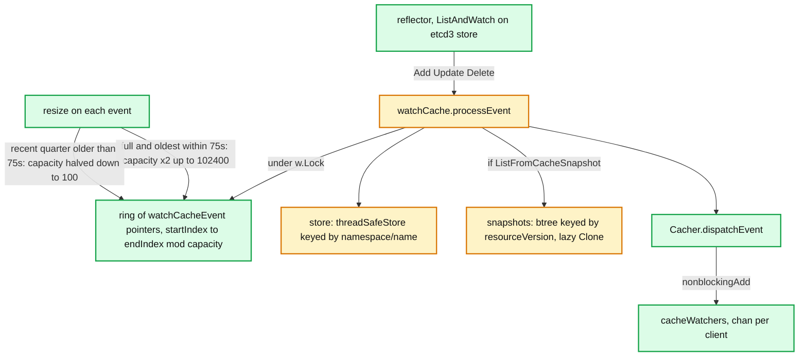
```mermaid
flowchart TD
  RE["reflector, ListAndWatch on etcd3 store"] -->|"Add Update Delete"| WCP["watchCache.processEvent"]
  WCP -->|"under w.Lock"| RING["ring of watchCacheEvent pointers, startIndex to endIndex mod capacity"]
  WCP --> TS["store: threadSafeStore keyed by namespace/name"]
  WCP -->|"if ListFromCacheSnapshot"| SNAPS["snapshots: btree keyed by resourceVersion, lazy Clone"]
  WCP --> DISP["Cacher.dispatchEvent"]
  DISP -->|"nonblockingAdd"| CWS["cacheWatchers, chan per client"]
  RESIZE["resize on each event"] -->|"full and oldest within 75s: capacity x2 up to 102400"| RING
  RESIZE -->|"recent quarter older than 75s: capacity halved down to 100"| RING

  class RE,RING,DISP,CWS,RESIZE service
  class WCP,TS,SNAPS cache

  classDef client   fill:#dbeafe,stroke:#2563eb,stroke-width:2px,color:#111
  classDef service  fill:#dcfce7,stroke:#16a34a,stroke-width:2px,color:#111
  classDef store    fill:#ede9fe,stroke:#7c3aed,stroke-width:2px,color:#111
  classDef cache    fill:#fef3c7,stroke:#d97706,stroke-width:2px,color:#111
  classDef queue    fill:#cffafe,stroke:#0891b2,stroke-width:2px,color:#111
  classDef critical fill:#fee2e2,stroke:#dc2626,stroke-width:4px,color:#111
  classDef external fill:#e5e7eb,stroke:#6b7280,stroke-width:2px,color:#111,stroke-dasharray:4 3
  classDef decision fill:#fce7f3,stroke:#db2777,stroke-width:2px,color:#111
```

**What to notice**

- `capacity` starts at `defaultLowerBoundCapacity = 100` and grows/shrinks by 2× per event, bounded by `defaultUpperBoundCapacity = 100*1024 = 102,400`. It is **not** the `--default-watch-cache-size` flag's static 100 any more; that flag now only gates whether a resource is cached.
- `eventFreshDuration` = `DefaultEventFreshDuration` = `defaultBookmarkFrequency (1m) + 15s` = **75 s**, and `kube-apiserver` raises it to `max(75s, --request-timeout + 15s)`. The ring is sized to hold *at least* that much history, so a client that reconnects within a bookmark interval never 410s.
- Snapshots are compacted by watching `compact_rev_key` (KEP-4988), so cached history never outlives etcd's — this is what keeps the "410 after compaction" conformance behaviour identical with the cache on or off.
- `DetectCacheInconsistency` (**beta, on by default in v1.34**) hashes the cache and a same-revision etcd LIST every 5 minutes; on mismatch it purges snapshots and falls back to etcd for that resource until the next successful check. Metrics: `storage_consistency_checks_total`, `apiserver_storage_hash`.
- `WatchCacheInitializationPostStartHook` is beta but **default false** in v1.34; `ResilientWatchCacheInitialization` went **GA in v1.34**, so a cache that fails to initialize no longer wedges the resource.

**Concurrency.** One reflector goroutine writes; a `sync.RWMutex` + `sync.Cond` guards the ring and wakes `waitUntilFreshAndBlock` waiters; each `cacheWatcher` owns a goroutine draining its buffered channel. `dispatchEvent` holds the lock only long enough to append and `nonblockingAdd` to every watcher.

**resourceVersion semantics** (the table every Staff engineer should have memorized):

| Param | `resourceVersionMatch` | Meaning | Served from |
|---|---|---|---|
| `rv=0` | — | any version, do not block | cache, possibly stale |
| unset (`""`) | — | quorum / linearizable | cache via progress notify (GA v1.34), else etcd |
| `rv=N` | `NotOlderThan` | at least N | cache, block up to 3 s |
| `rv=N` | `Exact` | exactly N | snapshot (beta v1.34) or etcd at rev N; 410 if compacted |

### 6.10 Encryption at rest and KMS v2

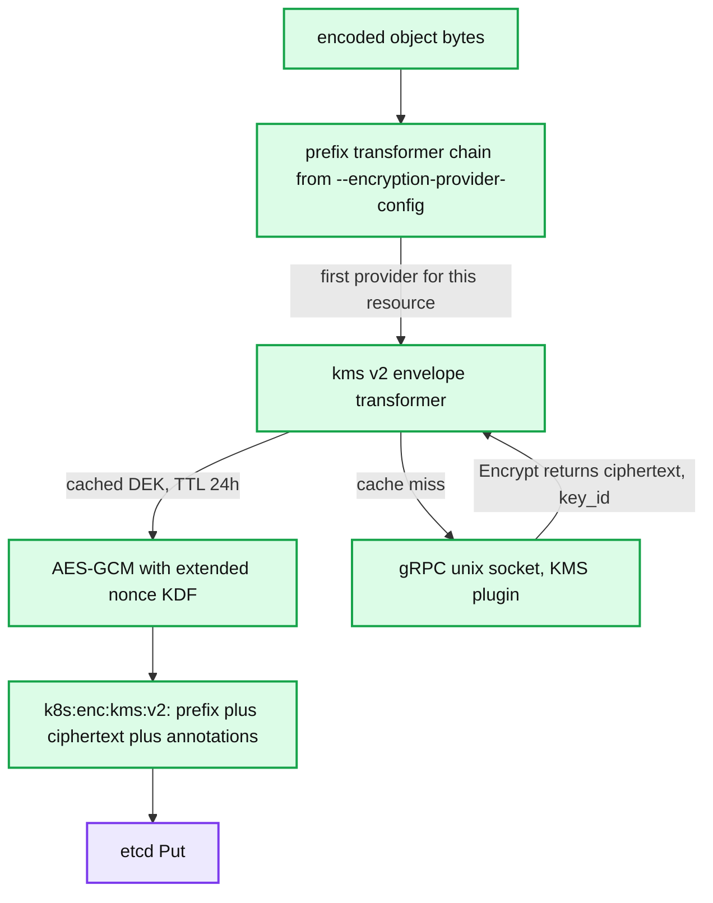
```mermaid
flowchart TD
  OBJ["encoded object bytes"] --> T["prefix transformer chain from --encryption-provider-config"]
  T -->|"first provider for this resource"| KMS["kms v2 envelope transformer"]
  KMS -->|"cached DEK, TTL 24h"| AES["AES-GCM with extended nonce KDF"]
  KMS -->|"cache miss"| PLUGIN["gRPC unix socket, KMS plugin"]
  PLUGIN -->|"Encrypt returns ciphertext, key_id"| KMS
  AES --> OUT["k8s:enc:kms:v2: prefix plus ciphertext plus annotations"]
  OUT --> ETCDW["etcd Put"]

  class OBJ,T,KMS,AES,PLUGIN,OUT service
  class ETCDW store

  classDef client   fill:#dbeafe,stroke:#2563eb,stroke-width:2px,color:#111
  classDef service  fill:#dcfce7,stroke:#16a34a,stroke-width:2px,color:#111
  classDef store    fill:#ede9fe,stroke:#7c3aed,stroke-width:2px,color:#111
  classDef cache    fill:#fef3c7,stroke:#d97706,stroke-width:2px,color:#111
  classDef queue    fill:#cffafe,stroke:#0891b2,stroke-width:2px,color:#111
  classDef critical fill:#fee2e2,stroke:#dc2626,stroke-width:4px,color:#111
  classDef external fill:#e5e7eb,stroke:#6b7280,stroke-width:2px,color:#111,stroke-dasharray:4 3
  classDef decision fill:#fce7f3,stroke:#db2777,stroke-width:2px,color:#111
```

**What to notice**

- Provider order in `--encryption-provider-config` matters: the **first** provider encrypts, **all** providers can decrypt (matched by prefix). Putting `identity` first disables encryption for that resource; putting it last is how you migrate.
- KMS v2 (GA v1.29) encrypts the DEK **once per key rotation**, not per object: `cacheTTL = 24h` for the read cache, `kmsv2PluginWriteDEKSourceMaxTTL = 3m` for the write DEK seed. KMS v1 is deprecated (`KMSv1` gate default **false** since v1.29).
- The `authenticatedDataString(key)` is the etcd key itself, bound as AEAD additional data — a ciphertext moved to a different key fails to decrypt. This is the defence against etcd-level cut-and-paste.
- Annotations are capped at **32 kB** total; `key_id` changes drive automatic re-encryption on next write and are surfaced in `apiserver_envelope_encryption_key_id_hash_total`.
- `--encryption-provider-config-automatic-reload` re-reads the file and rebuilds transformers; the `kms-providers` healthz check flips within 10 s (`kmsv2PluginHealthzNegativeInterval`).

### 6.11 HA: multiple apiservers, quorum sizing, the `kubernetes` Service

- Apiservers are **stateless and active-active**. There is no apiserver leader; the only per-instance state is caches. Clients load-balance via an external LB or, for in-cluster clients, the `kubernetes.default.svc` ClusterIP.
- The `kubernetes` Service's Endpoints/EndpointSlice is maintained by the **lease endpoint reconciler** (`--endpoint-reconciler-type=lease`, the default; alternatives `master-count` — needs `--apiserver-count` — and `none`). Each apiserver writes a lease key under `/registry/masterleases/<ip>` with a TTL (`--kubernetes-service-node-port` unrelated); the reconciler unions the live leases into the Endpoints object. Failure detection is TTL-based, so a hard-crashed apiserver stays in Endpoints for up to the lease TTL.
- **Quorum sizing.** 3 members tolerate 1 failure, 5 tolerate 2. Even counts add no fault tolerance and add write latency (larger quorum). 7+ is rarely worth it: every write waits for `ceil((n+1)/2)` fsyncs.
- **Splitting events.** `--etcd-servers-overrides=/events#https://etcd-events:2379` moves the highest-churn, lowest-value resource to its own etcd cluster. This is the single most effective etcd scaling lever and is standard on 1000+ node clusters. It creates a *second* compaction loop and a second `NOSPACE` blast radius.
- `--goaway-chance` (0 by default; ~0.001 typical) forces HTTP/2 clients to reconnect occasionally so a rolling apiserver restart does not leave all watches pinned to one instance.

---

## 7. Guarantees

- **Linearizability per key and across keys.** Every mutation is a Raft-committed transaction; `Range` with `serializable=false` uses `ReadIndex`. Kubernetes reads with unset `resourceVersion` are linearizable; with v1.34's `ConsistentListFromCache` the linearizability is preserved by proving cache freshness via `WatchProgressRequest` before answering, not by weakening the contract.
- **Durability.** A write is acknowledged after `fsync` of the WAL on a quorum of members. `--unsafe-no-fsync` exists and must never be used. A lost minority loses nothing; a lost quorum requires restore from snapshot.
- **Ordering.** One global monotonically-increasing revision. Watch events are delivered in revision order, and all events of one revision arrive in the same `WatchResponse` (atomicity). Kubernetes surfaces the revision as `resourceVersion`, giving informers a total order across *all* resources on the same etcd.
- **Watch reliability.** No gaps between the RV a watch starts at and the events delivered — unless that RV has been compacted (etcd `ErrCompacted`) or has fallen out of the apiserver ring buffer (`410 Gone`), both of which are explicit errors rather than silent gaps.
- **Optimistic concurrency.** `Txn` with `ModRevision` compare gives exactly-once semantics for a compare-and-swap update; the API surfaces it as `metadata.resourceVersion` and 409.
- **Availability.** Reads survive apiserver loss (any peer answers) and etcd minority loss. Writes require etcd quorum. Nothing in Kubernetes degrades to eventual consistency — the system chooses CP, and unavailability is the visible failure mode.
- **What is *not* guaranteed.** Read-your-writes across apiservers when reading with `rv=0` (a different apiserver's cache may be behind); cross-object transactions (there are none above single-key `Txn`); and any ordering between an admission webhook's side effects and the etcd write.

---

## 8. Failure modes

| Failure | Detection | Recovery | Blast radius |
|---|---|---|---|
| **Slow disk / fsync** | `etcd_disk_wal_fsync_duration_seconds` p99 > 10 ms; logs `apply entries took too long`, `failed to send out heartbeat on time` | Faster disk (local NVMe), raise `--heartbeat-interval`/`--election-timeout`, reduce write QPS | Whole cluster: writes stall, then leader loses heartbeat deadlines and elections start |
| **Leader election churn** | `etcd_server_leader_changes_seen_total` climbing; `etcd_server_has_leader` flapping | Fix network/disk; ensure `PreVote` on; widen election timeout for cross-AZ | All writes stall for the election window; apiserver 500s |
| **`NOSPACE` / `mvcc: database space exceeded`** | gRPC `ResourceExhausted`; `etcd_server_quota_backend_bytes` vs `etcd_mvcc_db_total_size_in_bytes`; alarm listed by `etcdctl alarm list` | compact → `defrag` each member serially → `etcdctl alarm disarm` | **Cluster-wide write outage.** Reads still work. Nodes go NotReady as Lease updates fail |
| **Compaction/defrag mismatch** | DB size stays flat after compaction | Run `defrag`; schedule it off-peak, one member at a time | `defrag` blocks that member entirely for its duration |
| **Split etcd compaction** | events etcd grows unboundedly | Confirm each storage config has its own compaction loop; set `--etcd-compaction-interval` globally | events etcd hits quota; Events writes fail; main cluster unaffected |
| **Watch-cache thundering herd on apiserver restart** | `apiserver_init_events_total` spike; simultaneous full LISTs of every resource against etcd | `--goaway-chance` to spread reconnects; stagger apiserver restarts; `ListFromCacheSnapshot` + streaming encoders reduce cost per LIST | etcd read amplification; apiserver memory spike |
| **"too old resource version" storm** | `410` rate; `apiserver_watch_cache_capacity` at upper bound | Raise `--request-timeout` (raises `eventFreshDuration`); ensure clients send `allowWatchBookmarks` | Every affected informer relists — N × full LIST |
| **LIST-all-pods memory blowup** | apiserver RSS spike, OOMKill; `apiserver_request_body_size_bytes` | APF seat cost by size (`SizeBasedListCostEstimate`, beta v1.34), streaming encoders (GA v1.34), force clients to paginate or use `rv=0` | Single apiserver OOM; clients fail over, herd repeats |
| **Slow/failing admission webhook** | `apiserver_admission_webhook_admission_duration_seconds`; 504s | `failurePolicy: Ignore`, tight `timeoutSeconds`, `namespaceSelector` to scope | Every write to matched resources blocks up to the webhook timeout, consuming APF seats |
| **APF starvation / 429s** | `apiserver_flowcontrol_rejected_requests_total`, `..._request_wait_duration_seconds` | Add a FlowSchema for the noisy client at `workload-low`; raise `--max-requests-inflight` sum | Confined to the priority level by design — that is the point |
| **etcd quorum loss** | `etcd_server_has_leader=0` on all members | Restore from `etcdctl snapshot restore` on a new cluster, or remove failed members if a majority survives | Full write outage; apiserver reads from cache continue until caches go stale |

---

## 9. Scalability & performance

**Where the ceilings actually are.**
- **etcd write throughput.** Single leader, one WAL fsync per Raft batch. On decent NVMe, expect low thousands of writes/s at p99 < 25 ms. The `--backend-batch-interval` (100 ms) / `--backend-batch-limit` (10000) batching is what turns many small Puts into one bbolt commit.
- **etcd DB size.** 2 GiB default quota, 8 GiB practical maximum. Above ~8 GiB, `treeIndex` rebuild on restart and defrag duration become operationally intolerable. SIG-Scalability's stated envelope is **1.5 GB total** and **1.5 MB per object**.
- **apiserver memory.** Historically dominated by LIST: one full list of 150k pods materialized as internal objects plus a JSON buffer is single-digit GB. v1.34's streaming collection encoders (GA) and cache snapshots (beta) are aimed exactly here.
- **apiserver CPU.** Dominated by (a) protobuf/JSON encoding for watch fan-out, (b) conversion between internal and external types, (c) RBAC evaluation. Watch fan-out is O(watchers × events).

**Partitioning levers, in order of effectiveness.**
1. `--etcd-servers-overrides=/events#...` — Events are ~50%+ of write volume in a busy cluster.
2. Separate etcd for CRDs of a noisy operator (same mechanism, `group/resource#servers`).
3. More apiserver replicas — scales reads and watch fan-out linearly; does nothing for writes.
4. Client-side: `fieldSelector=spec.nodeName` on kubelet pod watches (cuts per-node event volume from cluster-wide to node-local), `resourceVersion=0` on initial lists, `limit`+`continue` pagination.

**Batching and back-pressure.**
- etcd batches Raft entries per `Ready` cycle and bbolt writes per `--backend-batch-interval`.
- The apiserver applies back-pressure only at APF (queue then 429). Below APF there is none: a slow watcher is dropped, a slow etcd just makes requests time out at 60 s.
- `--max-requests-inflight` 400 + `--max-mutating-requests-inflight` 200 = **600 seats** total under APF. A single 150k-pod LIST costs `min(150000/100, 100)` = **100 seats** with `SizeBasedListCostEstimate` on — one sixth of the whole server.

**Hot spots.**
- `coordination.k8s.io/Lease` node heartbeats: one write per node per `--node-lease-duration-seconds/4` (kubelet renews every 10 s by default) — 5,000 nodes ⇒ ~500 writes/s of pure heartbeat. Google's 130k-node run needed **13,000 QPS** just for leases.
- Events during a rollout or node failure.
- `EndpointSlice` churn for large Services (`#Endpoints per service` threshold is **250** for a reason).
- The `default` namespace's `kubernetes` Endpoints object, rewritten by every apiserver's lease reconciler.

**Numbers worth memorizing.**

| Quantity | Value |
|---|---|
| Supported nodes / pods / namespaces | 5,000 / 150,000 / 10,000 |
| Pods per node | `min(110, 10 × cores)` |
| Max object size | 1.5 MB (etcd `--max-request-bytes` 1,572,864) |
| p99 mutating API latency SLO | ≤ 1 s |
| p99 LIST latency SLO, namespace/cluster scope | ≤ 30 s |
| etcd default quota / max | 2 GiB / 8 GiB |
| APF total seats | 600 |
| Watch cache ring | 100 → 102,400 entries, ≥ 75 s of history |
| Bookmark interval | 60 s |
| Watch-cache freshness block timeout | 3 s |
| On-demand progress request period | 100 ms |

---

## 10. Trade-offs & alternatives

- **One Raft group vs. sharded consensus.** Kubernetes gets a single global revision (hence coherent cross-resource watches and trivially correct informers) at the cost of a hard write ceiling. Spanner-class systems shard and pay with distributed transactions and TrueTime; Google's 130k-node GKE cluster replaced etcd with a Spanner-backed store precisely because the single-Raft ceiling binds first. `--etcd-servers-overrides` is the sanctioned escape hatch and is really manual sharding with no cross-shard consistency.
- **Watch cache vs. reading etcd.** Caching in the apiserver moves the read amplification problem from etcd (bounded, precious) to apiserver RAM (elastic, replicated). The cost is a whole class of "cache is stale/inconsistent" bugs, which is why v1.34 ships `DetectCacheInconsistency` on by default. Contrast with a design where clients read replicas directly — no cache layer, but no filtering, no admission, and no version conversion either.
- **Optimistic concurrency vs. locks.** `ModRevision` CAS + client retry is lock-free and survives client death with zero cleanup. The cost is 409 storms under contention (classic on a hot `Node.status` or a single `EndpointSlice`), which callers must handle with backoff. A lock-based design would need lease reclamation on every crash.
- **Internal hub version vs. schema-on-read.** Conversion functions are ~100k lines of generated Go and the reason a v1.34 apiserver still serves objects written by a v1.16 client. The alternative (store the wire version verbatim, convert lazily) is what CRDs do with conversion webhooks — cheaper to build, far worse to operate.
- **APF vs. simple max-in-flight.** Max-in-flight is one global counter: one runaway controller starves everything. APF costs a control loop, two new API types, and real conceptual complexity; it buys per-tenant isolation that no amount of tuning a counter can. It is the same argument as WFQ vs. FIFO in a router.
- **Comparable systems.** ZooKeeper (ZAB, hierarchical znodes, no MVCC history, watches are one-shot — the one-shot watch is exactly what made it painful for controller patterns); Consul (Raft + MVCC + blocking queries, very similar shape, weaker transaction story); FoundationDB (sharded, real multi-key transactions, no built-in watch fan-out at etcd's granularity). etcd's differentiator for Kubernetes is *ordered, gap-free, resumable range watches with a global revision* — not raw KV performance.

---

## 11. Staff-level questions

**Q1. A client does `GET /api/v1/pods?resourceVersion=0` twice against a 3-replica apiserver and the second call returns *fewer* pods. Is this a bug?**
No. `rv=0` means "any version you have, do not block", and the two calls may land on different apiservers whose watch caches are at different revisions — or even the same apiserver after a cache re-initialization. The contract only forbids going backwards within a *single* watch stream. If you need monotonicity, either pin to a `resourceVersion` with `resourceVersionMatch=NotOlderThan`, or use an unset `resourceVersion` (linearizable, served from cache with a progress-notify freshness proof since v1.34), accepting the higher cost.

**Q2. etcd raised `NOSPACE`. Walk through recovery and explain why compaction alone is not enough.**
`NOSPACE` is a cluster-wide alarm raised when the **bbolt file size** exceeds `--quota-backend-bytes`. Compaction deletes superseded *revisions* from the MVCC keyspace, returning bbolt pages to the freelist — `db_total_size_in_use_bytes` drops but `db_total_size_in_bytes` (the file) does not, because bbolt never truncates. So: (1) `etcdctl compact <rev>` (or confirm the apiserver's 5-minute loop is running and not fighting `--auto-compaction-retention`); (2) `etcdctl defrag` **one member at a time**, followers first, leader last, since defrag blocks that member entirely; (3) `etcdctl alarm disarm`, because the alarm is sticky and no write succeeds until it is cleared. Then find the cause — usually Events not split out, a runaway CRD, or a controller hot-looping updates.

**Q3. Why does the apiserver need `WatchProgressRequest` at all if it already has a watch on etcd?**
Because a watch tells you about *changes*, not about the *absence* of changes. For a linearizable read served from cache the apiserver must prove "my cache reflects everything committed up to the current global revision". Without a signal, a quiet resource leaves the cache's `resourceVersion` arbitrarily far behind the store's revision and the apiserver cannot distinguish "nothing happened" from "I am lagging". `RequestProgress` on the watch stream makes etcd emit a bookmark carrying the current revision, which is a cheap `ReadIndex`-class operation rather than a full range read. The apiserver issues it every 100 ms *only while a consistent read is waiting*, then answers from RAM. That mechanism (KEP-2340) is what let `ConsistentListFromCache` reach GA in v1.34.

**Q4. A `GuaranteedUpdate` on a Node status is retrying dozens of times per second. What is happening and how do you find it?**
`GuaranteedUpdate` retries internally whenever the `Txn`'s `ModRevision` compare fails, i.e. someone else wrote the same key between the read and the write. On Node objects the usual culprits are multiple controllers patching `status` (kubelet, node-problem-detector, a cloud controller, a metrics agent) plus a status updater that computes a *different* value each iteration — a timestamp or a map with non-deterministic ordering — so the short-circuit "data unchanged, skip the write" path never triggers. Diagnose with `etcd_debugging_mvcc_put_total` per key prefix, apiserver `apiserver_storage_transformation_operations_total`, and audit logs filtered to that resource. Fix by making the update idempotent, moving contended fields to a subresource or a separate object, and adding jitter to the controllers' resync periods.

**Q5. You have 5,000 nodes and etcd is at 6 GiB with p99 fsync at 30 ms. Rank your interventions.**
(1) Split Events to a dedicated etcd via `--etcd-servers-overrides=/events#...` — typically the single largest source of both write QPS and DB growth, and it has its own failure domain. (2) Move etcd to local NVMe with a dedicated device for the WAL; 30 ms fsync is a disk problem, not a tuning problem, and every other lever is downstream of it. (3) Verify exactly one compaction loop is running (apiserver's 5 m or etcd's `--auto-compaction-retention`, not both) and schedule serial `defrag`. (4) Audit object counts per resource with `apiserver_storage_objects` — find the CRD or Secret sprawl pushing 6 GiB. (5) Only then tune Raft: raise `--heartbeat-interval`/`--election-timeout` to stop election churn while you fix the disk, and raise `--snapshot-catchup-entries` so a briefly-slow follower gets `MsgApp` rather than a full `MsgSnap`. Adding etcd members is *not* on this list — it increases quorum size and makes writes slower.

---

## 12. Sources

**Kubernetes source (`github.com/kubernetes/kubernetes`, branch `release-1.34`)**
- `staging/src/k8s.io/apiserver/pkg/server/config.go` — `DefaultBuildHandlerChain`, all `Config` defaults (400/200/60s/1800s/3 MiB)
- `staging/src/k8s.io/apiserver/pkg/server/options/etcd.go` — `EtcdOptions`, `ParseEtcdServersOverrides`
- `staging/src/k8s.io/apiserver/pkg/storage/storagebackend/config.go` — `DefaultCompactInterval`, `DefaultEventsHistoryWindow`
- `staging/src/k8s.io/apiserver/pkg/storage/etcd3/store.go` — `Create`, `GuaranteedUpdate`, `maxLimit`
- `staging/src/k8s.io/apiserver/pkg/storage/cacher/cacher.go`, `watch_cache.go`, `cache_watcher.go`, `progress/watch_progress.go`
- `staging/src/k8s.io/apiserver/pkg/features/kube_features.go` — feature-gate version tables
- `staging/src/k8s.io/apiserver/pkg/apis/flowcontrol/bootstrap/default.go` — priority levels and shares
- `staging/src/k8s.io/apiserver/pkg/util/flowcontrol/request/config.go` — seat cost defaults
- `staging/src/k8s.io/apiserver/pkg/server/options/encryptionconfig/config.go`, `.../envelope/kmsv2/envelope.go`
- `pkg/kubeapiserver/options/plugins.go` — `AllOrderedPlugins`, `DefaultOffAdmissionPlugins`
- `pkg/controlplane/apiserver/options/options.go` — protobuf storage media type, events history window
- `pkg/controlplane/reconcilers/reconcilers.go` — endpoint reconciler types
- `build/dependencies.yaml` — etcd 3.6.5

**etcd source (`github.com/etcd-io/etcd`, `main`)**
- `server/storage/quota.go` — `DefaultQuotaBytes` 2 GiB, `MaxQuotaBytes` 8 GiB
- `server/storage/mvcc/index.go`, `revision.go`, `watchable_store.go`, `watcher_group.go`
- `server/storage/schema/bucket.go` — bucket names and meta keys
- `server/embed/config.go`, `server/etcdserver/server.go` — snapshot/heartbeat/election defaults
- `server/etcdserver/read/read.go` — `LinearizableReadLoop`, `readIndexRetryTime`
- `client/v3/kubernetes/client.go` — `OptimisticPut`/`OptimisticDelete` `ModRevision` transactions
- `api/v3rpc/rpctypes/error.go` — `ErrCompacted`, `ErrFutureRev`, `ErrNoSpace`

**KEPs**
- KEP-2340 Consistent Reads from Cache — alpha 1.28, beta 1.31, **stable 1.34** (`ConsistentListFromCache`)
- KEP-4988 Snapshottable API Server Cache — alpha 1.33, **beta 1.34** (`ListFromCacheSnapshot`, `DetectCacheInconsistency`)
- KEP-3157 Watch List / streaming list — alpha 1.27, beta 1.32, default flipped off in 1.33 and back **on in 1.34**
- KEP-1040 API Priority and Fairness — alpha 1.18, beta 1.20, stable 1.29
- KEP-555 Server-Side Apply — stable 1.22; KEP-2896 OpenAPI v3 — stable 1.27; KEP-3352 Aggregated Discovery — stable 1.30; KEP-365 Paginated Lists — stable 1.29; KEP-1904 Efficient Watch Resumption — stable 1.24; KEP-3299 KMS v2 — stable 1.29

**Docs, SLOs and papers**
- `kubernetes/community/sig-scalability/slos/api_call_latency.md` and `configs-and-limits/thresholds.md`
- etcd v3.6 operations guide, `op-guide/configuration.md`
- kubernetes.io blog, "Kubernetes v1.34: Snapshottable API server cache" (2025-09-09)
- Google Cloud blog, "How we built a 130,000-node GKE cluster"
- Ongaro & Ousterhout, *In Search of an Understandable Consensus Algorithm* (Raft), USENIX ATC 2014 — `MsgApp`/`MsgVote`, log matching, the `ReadIndex` optimization in §6.4

---

### Version caveats

- Everything is pinned to **v1.34** as requested. Feature-gate stages were read from the v1.34 gate tables, so "GA in 1.34" claims are exact.
- `WatchCacheInitializationPostStartHook` is beta but **default false** in v1.34 — commonly misreported as on.
- **[inferred]** claims, restated: treeIndex-rebuild dominating etcd startup on large DBs; unbounded `victims` growth for a permanently-blocked etcd watcher; the practical operational ceiling of ~8 GiB (etcd only *warns* above `MaxQuotaBytes`, it does not refuse to start).

---

<!-- nav:start -->
[← 00 Overview](kubernetes-00-overview.md) · **[Index](README.md)** · [02 Controllers →](kubernetes-02-controllers.md)
<!-- nav:end -->
