# Kubernetes Internals 02 — The Controller Plane

Target: **Kubernetes v1.34**. Facts are marked **[documented]** when taken from kubernetes.io, a KEP, or the v1.34 source tree, and **[inferred]** when they are my reading of behaviour rather than an explicit statement. All defaults below were read out of `release-1.34` source, not memory.

---

<!-- nav:start -->
[← 01 API Server & etcd](kubernetes-01-apiserver-etcd.md) · **[Index](README.md)** · [03 Scheduler →](kubernetes-03-scheduler.md)
<!-- nav:end -->

<!-- toc:start -->

<b>Sections in this report (12)</b>

- [1. Overview](#1-overview)
- [2. Architecture](#2-architecture)
- [3. Data flow](#3-data-flow)
- [4. Sequence of operations](#4-sequence-of-operations)
- [5. State machines](#5-state-machines)
- [6. Component deep dives](#6-component-deep-dives)
- [7. Guarantees](#7-guarantees)
- [8. Failure modes](#8-failure-modes)
- [9. Scalability and performance](#9-scalability-and-performance)
- [10. Trade-offs and alternatives](#10-trade-offs-and-alternatives)
- [11. Staff-level questions](#11-staff-level-questions)
- [12. Sources](#12-sources)

<!-- toc:end -->

## 1. Overview

- **Problem**: turn declarative intent (`spec`) into cluster reality (`status`) across ~10⁵ objects, with no transactions, no global lock, and participants (kubelets, controllers) that crash, partition, and restart arbitrarily.
- **Design bet 1 — level-triggered reconciliation.** A controller never trusts the event that woke it; it re-reads the whole object and drives the world toward `spec`. Events are a *latency optimisation* over polling, not the source of truth. **[documented]** (`contributors/devel/sig-api-machinery/controllers.md`)
- **Design bet 2 — shared cache, per-controller queue.** One `Reflector` per (GVR, namespace-scope) feeds one in-memory `Indexer` shared by every controller in the process; each controller keeps its own deduplicating `workqueue` of *keys*, never objects.
- **Design bet 3 — optimistic concurrency, not locks.** All writes are `resourceVersion`-checked; a conflict (HTTP 409) is a normal, retryable outcome, and the retry re-reads state, so lost updates degrade to extra work rather than corruption.
- **Scale**: kube-controller-manager runs ~45 controllers in one process (`cmd/kube-controller-manager/names/controller_names.go` lists 47 names in 1.34 **[documented]**) against a 5 000-node / 150 000-pod cluster, from a default client budget of **20 QPS / 30 burst** (`--kube-api-qps` / `--kube-api-burst`) **[documented]** — a budget that is essentially always raised in real clusters.

---

## 2. Architecture

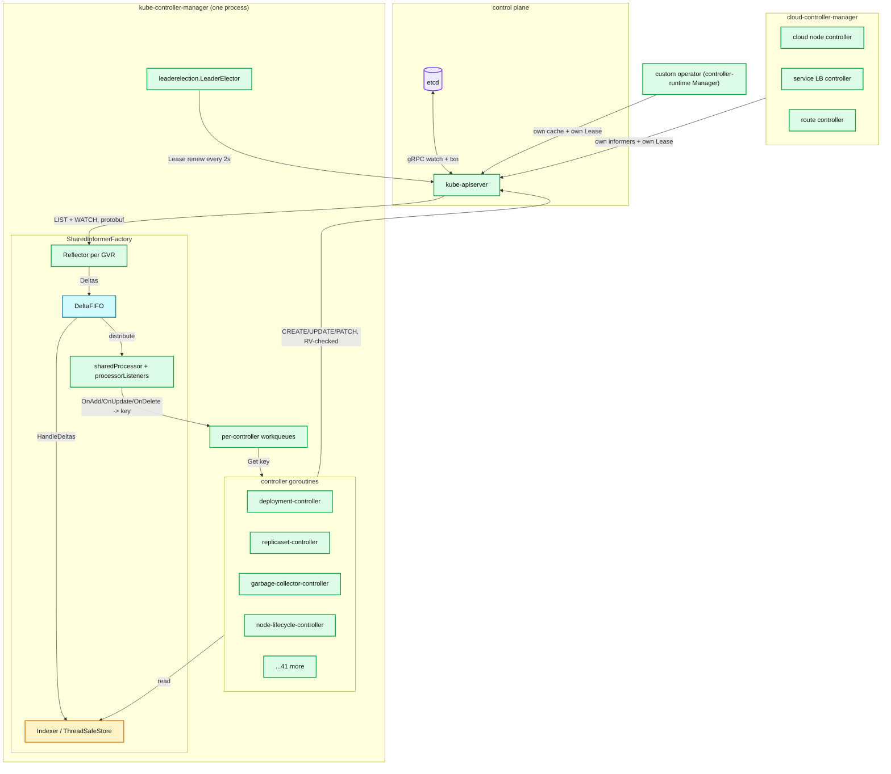

**What to notice**

- There is exactly **one** watch connection per GVR per process, not one per controller — that is the entire point of the shared informer factory.
- Controllers **read from the cache** and **write to the apiserver**; they never read-your-write, so every controller must tolerate its own write not yet being visible.
- The workqueue is the only place backpressure exists inside the process; the apiserver's Priority & Fairness plus the client-side `--kube-api-qps` limiter are the outbound backpressure.
- Leader election is per-process, not per-controller: losing the lease stops all 45 controllers together.
- cloud-controller-manager is a *separate process with a separate lease*, sharing nothing but the apiserver.

---

## 3. Data flow

### 3a. Informer / event ingestion path

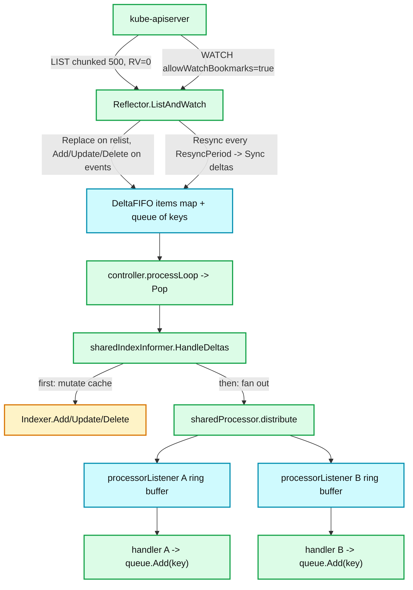

**What to notice**

- The **Indexer is updated before listeners are notified** (`processDeltas` in `shared_informer.go`), so a handler that immediately lists the cache always sees at least the object it was told about. **[documented]**
- `DeltaFIFO` is keyed: repeated changes to one object collapse into one queue slot holding a `Deltas` slice, so a hot object costs one dequeue, not N.
- A `Sync` delta (from resync) carries the *cache copy*, not a fresh server read — resync is a re-delivery, not a re-list. **[documented]**
- Each listener has its **own unbounded ring buffer**; a slow handler grows memory instead of blocking the shared pipeline.
- `Replace()` (after a relist) synthesises `Deleted` deltas with `DeletedFinalStateUnknown` for objects the cache knows but the new list lacks — this is how missed delete events are recovered.

### 3b. Reconcile / write path

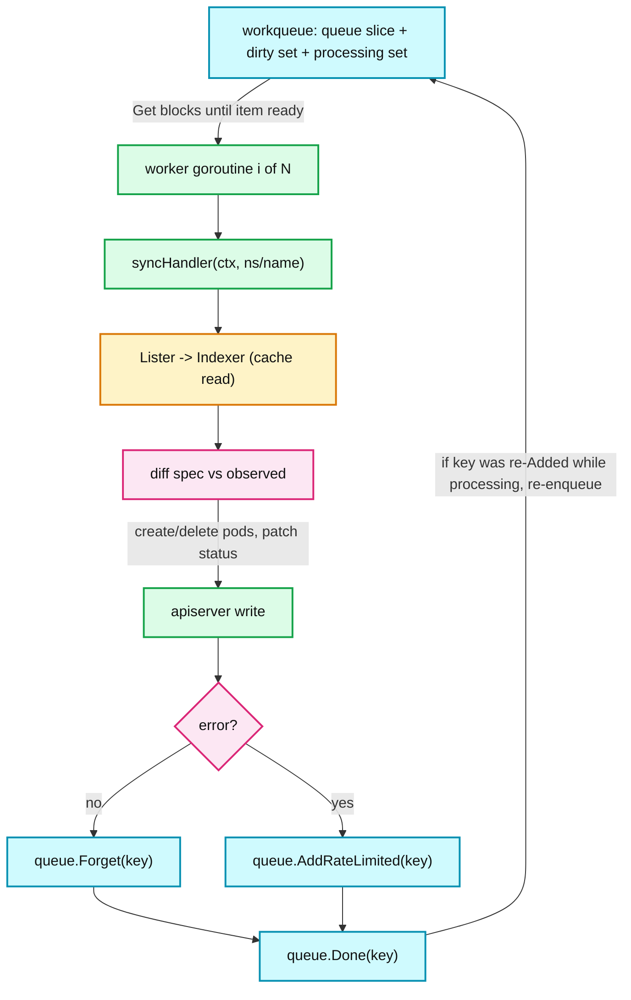

**What to notice**

- `Get` → `Done` is the critical section: the same key can never be processed by two workers concurrently, which is what lets controllers skip their own internal locking.
- `Forget` only clears the **rate limiter's** failure counter; it does not remove the key from the queue. Forgetting on success is mandatory or backoff never resets.
- Writes are `resourceVersion`-checked; a 409 conflict is treated exactly like any other error and re-queued with backoff.
- Status patches use `status` subresource where available, so a controller writing status cannot accidentally clobber spec.
- A key re-added *during* processing is remembered in `dirty` and re-queued at `Done` — a single trailing reconcile, not one per event.

---

## 4. Sequence of operations

### 4a. Informer startup and initial list/watch

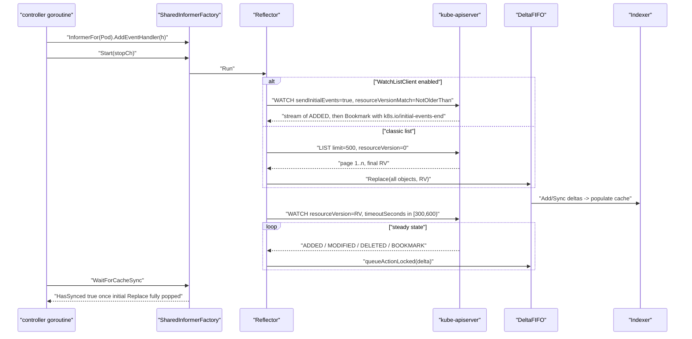

**What to notice**

- `HasSynced` means "every item from the *initial* `Replace` has been popped and handled" — not "the cache is current". **[documented]** (`DeltaFIFO.hasSynced_locked`)
- Watch timeout is randomised in `[minWatchTimeout, 2*minWatchTimeout)` with `defaultMinWatchTimeout = 5m` **[documented]**, which de-synchronises reconnects across controllers.
- `WatchList` (server side) is **beta, default on in 1.34**; `WatchListClient` (client-go) is **beta, default off** — so most 1.34 clusters still do the classic chunked LIST. **[documented]**
- The initial LIST is served at `resourceVersion=0`, i.e. from the apiserver watch cache — cheap for etcd, but may be slightly stale.
- Bookmarks let the Reflector advance its RV without traffic, so a reconnect after a quiet period does not trigger a 410 relist.

### 4b. Deployment rollout

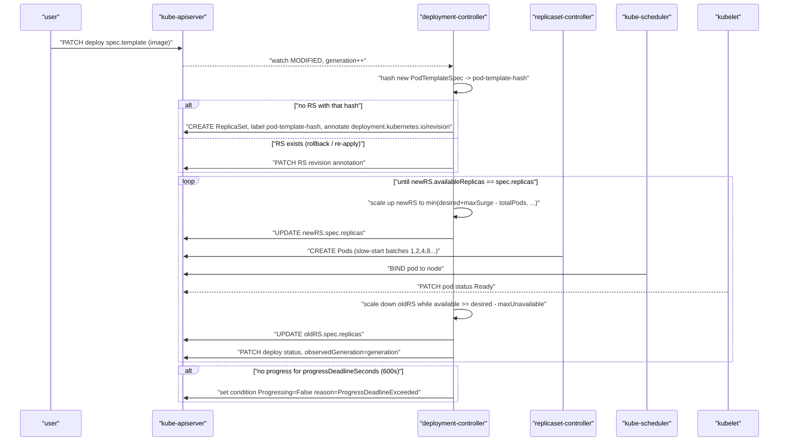

**What to notice**

- The rollout identity is the **`pod-template-hash`** label (`apps.DefaultDeploymentUniqueLabelKey = "pod-template-hash"` **[documented]**), computed over the pod template; identical templates reuse the existing ReplicaSet, which is why "rollback" is just re-selecting an old RS.
- `maxSurge` and `maxUnavailable` both default to **25 %** for Deployments **[documented]** (`pkg/apis/apps/v1/defaults.go`); `revisionHistoryLimit` **10**, `progressDeadlineSeconds` **600**.
- The Deployment controller never touches Pods. It only sets `spec.replicas` on ReplicaSets — a clean two-level control loop.
- `deployment.kubernetes.io/desired-replicas` and `max-replicas` annotations are written onto each RS so a *paused/aborted* rollout can be reconstructed without the Deployment.
- `ProgressDeadlineExceeded` is a **condition**, not an abort: the controller keeps trying.

### 4c. Workqueue retry with backoff

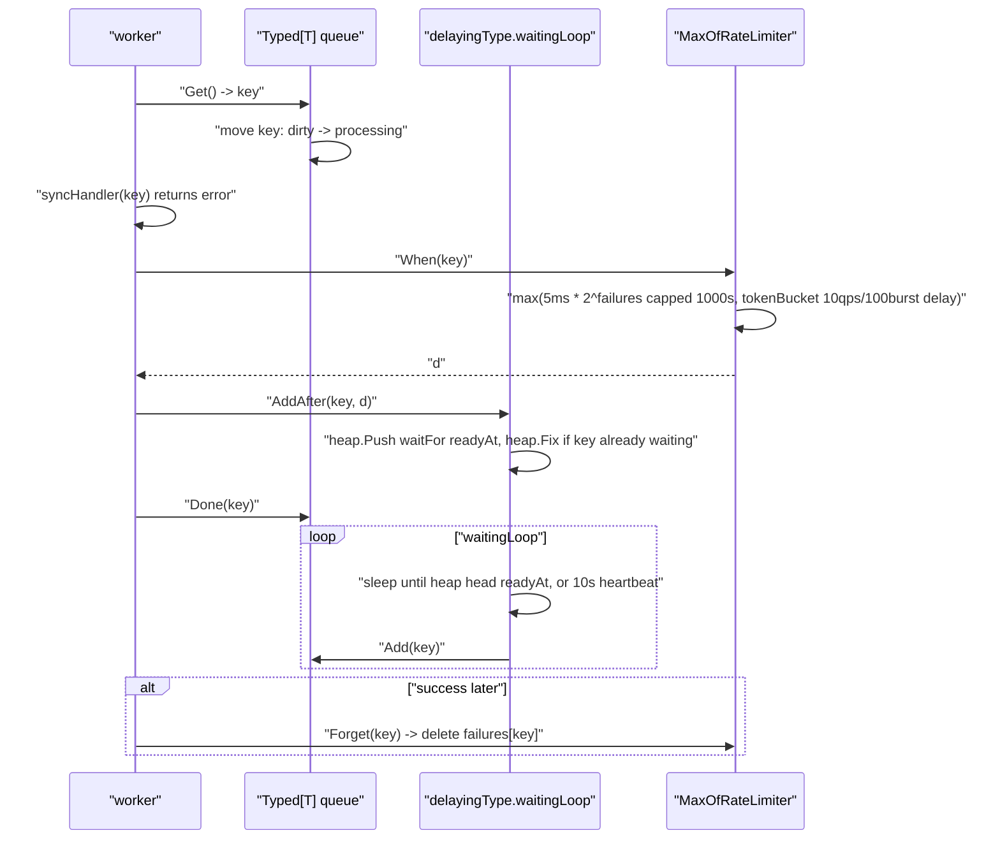

**What to notice**

- Default rate limiter is `MaxOfRateLimiter(ItemExponentialFailureRateLimiter(5ms, 1000s), BucketRateLimiter(10 qps, 100 burst))` **[documented]** (`DefaultTypedControllerRateLimiter`), i.e. **per-item exponential** *and* **process-wide token bucket**, whichever delay is larger.
- `AddAfter` on an already-waiting key uses `heap.Fix` to keep only the **earliest** ready time — retries do not multiply.
- `waitingForAddCh` is buffered at **1000**; `maxWait` heartbeat is **10 s** **[documented]** (`delaying_queue.go`).
- Controllers cap retries themselves: `deployment_controller.go` uses `maxRetries = 15` **[documented]**, which with the 5 ms base is roughly 2.7 h of cumulative backoff before the key is dropped and only a resync will bring it back.
- The Job controller deliberately overrides the default: `NewTypedItemExponentialFailureRateLimiter(DefaultJobApiBackOff=1s, MaxJobApiBackOff=1m)` **[documented]**, because Job syncs are expensive and 1000 s is far too long for a batch workload.

### 4d. Leader election handover

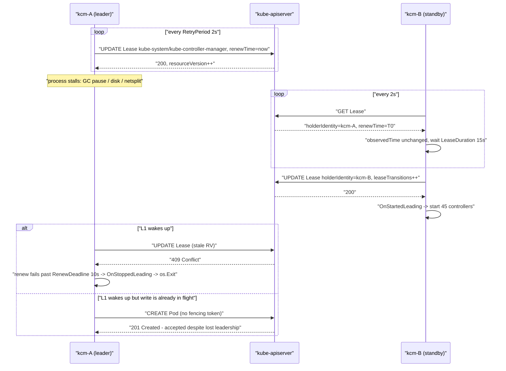

**What to notice**

- Defaults for kube-controller-manager and kube-scheduler: `--leader-elect-lease-duration` **15 s**, `--leader-elect-renew-deadline` **10 s**, `--leader-elect-retry-period` **2 s**, `--leader-elect-resource-lock` **`leases`** **[documented]** (`component-base/config/v1alpha1/defaults.go`, `controller-manager/config/v1alpha1/defaults.go`).
- Validation enforces `LeaseDuration > RenewDeadline > RetryPeriod * JitterFactor(1.2)` **[documented]**; violating it fails at startup, not at runtime.
- **There is no fencing token.** The old leader's *writes* are ordinary authenticated API calls; the apiserver has no idea leadership moved. Safety comes only from the old leader voluntarily exiting when renewal fails — and from `LeaseDuration > RenewDeadline` giving it time to notice first.
- Clock skew matters only *locally*: the elector compares `observedTime` measured on **its own clock** against `LeaseDuration`, not the leader's `renewTime` against `now`. **[documented]** (`leaderelection.go` comments) So skew between nodes is tolerated; a jumping local clock is not.
- Coordinated Leader Election (KEP-4355, `LeaseCandidate` in `coordination.k8s.io/v1beta1`) is **beta but default-off** in 1.34 (`CoordinatedLeaderElection` gate) **[documented]**; it lets the apiserver *pick* the leader from declared candidates by compatibility version, for skewed upgrades.

### 4e. Cascading delete via the garbage collector

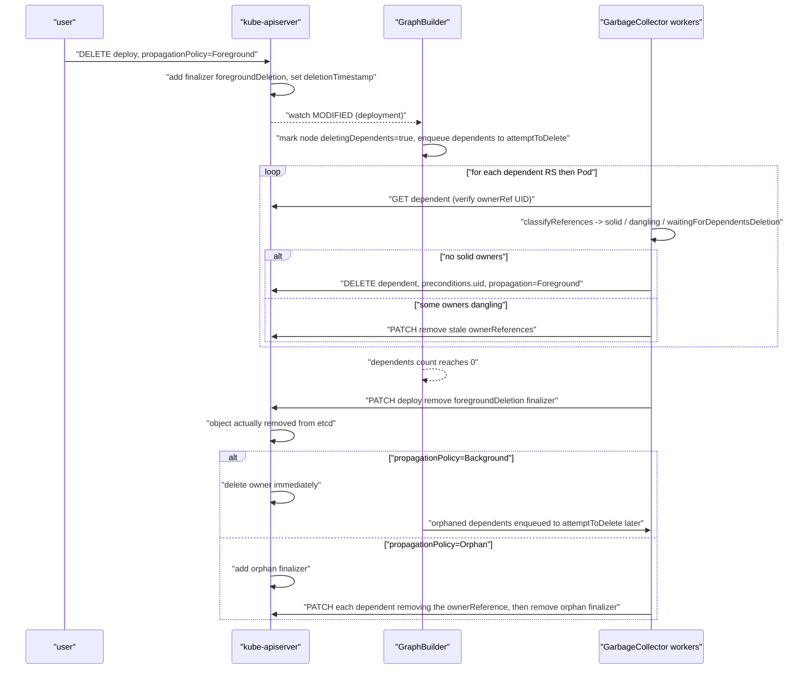

**What to notice**

- The GC is **discovery-driven**: it runs a `monitor` (informer) per deletable GVR, resynced on discovery changes (`--concurrent-gc-syncs` default **20** **[documented]**), so CRDs are garbage-collected without code changes.
- `attemptToDelete` and `attemptToOrphan` are two separate rate-limited queues fed by a single `graphChanges` queue; only `GraphBuilder` mutates `uidToNode`, which is why that map needs no coarse lock.
- Deletion is UID-precondition-guarded: an ownerRef to a *recreated* object with the same name but new UID is "dangling" and gets pruned, not honoured.
- Foreground deletion blocks on the `foregroundDeletion` finalizer; `blockOwnerDeletion: true` on a child's ownerRef is what makes the parent wait, and setting it requires `delete` permission on the owner (the `OwnerReferencesPermissionEnforcement` admission plugin). **[documented]**
- Cross-scope ownership is illegal: a **namespaced owner cannot own a cluster-scoped dependent**, and an owner in namespace A cannot own an object in namespace B; such refs are treated as dangling and the dependent is GC'd. **[documented]**

---

## 5. State machines

### 5a. Workqueue item

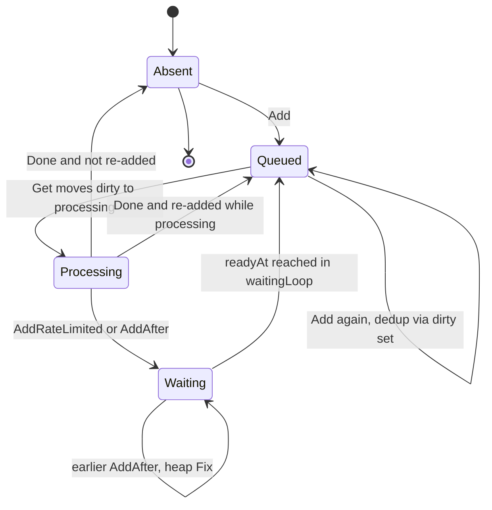

**What to notice**

- Three sets, one invariant: an item in `queue` is in `dirty` and **not** in `processing`.
- Re-adding a key that is being processed does not enqueue it twice; it is remembered and re-queued exactly once at `Done`.
- `Waiting` lives in the *delaying* wrapper, not the base queue, so `Len()` does not count delayed items — a low `workqueue_depth` with high latency usually means items are parked in the heap.
- `Forget` touches only the rate limiter; it is orthogonal to this state machine.

### 5b. Leader election

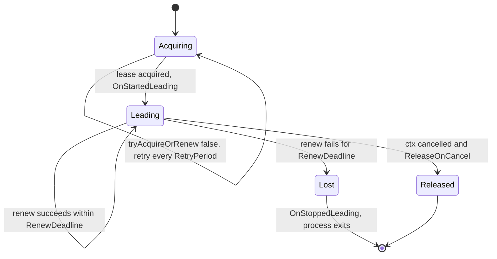

**What to notice**

- `Leading` → `Lost` is driven by a **local** deadline (`PollUntilContextTimeout(RetryPeriod, RenewDeadline)`), so a partitioned leader self-demotes without hearing from anyone.
- The gap `LeaseDuration - RenewDeadline = 5 s` is the safety margin: a challenger waits 15 s of observed staleness, the incumbent gives up after 10 s.
- `Released` is best-effort; a crashed leader leaves the lease to expire.
- `leaseTransitions` in the Lease object is the observable handover counter — a good alert signal.

### 5c. Deployment / ReplicaSet rollout

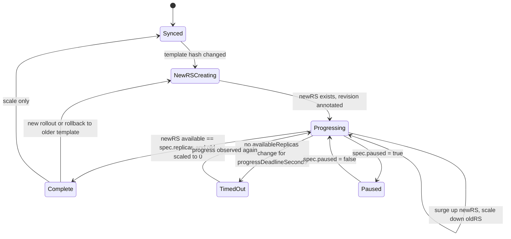

**What to notice**

- `TimedOut` is not terminal — `ProgressDeadlineExceeded` sets `Progressing=False` but reconciliation continues; only a human or a CD system aborts.
- A rollback re-enters `NewRSCreating` and finds the **existing** old RS by hash, so `deployment.kubernetes.io/revision` moves forward even though the template moves backward.
- `Paused` freezes scaling of both RSes but not status updates.
- `Complete` requires old RSes at 0 replicas, but they are retained up to `revisionHistoryLimit=10`.

### 5d. Job and its Pods, from the controller's view

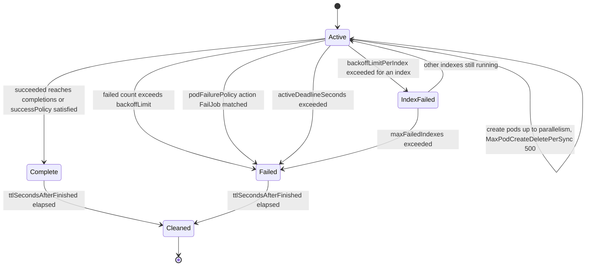

**What to notice**

- Every Job-owned Pod carries the finalizer `batch.kubernetes.io/job-tracking`; the controller removes it only after counting the Pod into `status.succeeded`/`status.failed`, which is what makes counting exact rather than "whatever Pods still exist". **[documented]** (`JobTrackingWithFinalizers`, GA since 1.26)
- `status.uncountedTerminatedPods` holds at most `MaxUncountedPods = 500` UIDs per list **[documented]**; that is the batch size of the count-then-unfinalize protocol.
- `backoffLimit` defaults to **6**; per-index backoff (`JobBackoffLimitPerIndex`) is **GA in 1.33**, `JobSuccessPolicy` **GA in 1.33**, `JobPodReplacementPolicy` **GA in 1.34**, `JobManagedBy` still **beta** in 1.34. **[documented]**
- Pod failure backoff is separate from API backoff: `DefaultJobPodFailureBackOff = 10s`, `MaxJobPodFailureBackOff = 10m`. **[documented]**

---

## 6. Component deep dives

### 6.1 The reconciliation model itself

- **Responsibility**: define what "correct" means for one resource kind, as a pure-ish function `reconcile(key) error` that reads observed state and issues idempotent writes.
- **Level vs edge**: an edge-triggered system acts on the *transition*; a level-triggered one acts on the *current level*. Kubernetes is **edge-triggered with a level-driven fallback** — watch events give low latency, periodic resync and relist guarantee that a dropped or mis-handled edge is eventually corrected. **[documented]**
- **Idempotency**: every reconcile must be safe to run N times. The mechanisms are (a) name determinism (`<rs-name>-<hash>`, `<sts>-<ordinal>`), (b) `ownerReferences` + label selectors for adoption instead of bookkeeping, (c) expectations to avoid double-creating within one uncertainty window.
- **observedGeneration**: the apiserver increments `metadata.generation` on every **spec** change; a controller copies it into `status.observedGeneration` after acting. `generation != observedGeneration` means "controller has not caught up", and is the only reliable staleness signal available to a client. **[documented]**
- **Config knobs**: `--min-resync-period` default **12 h** **[documented]** — `app.ResyncPeriod()` returns `MinResyncPeriod * (rand.Float64() + 1)`, i.e. a fresh value in `[T, 2T)` per informer, so 45 controllers do not resync in lockstep. **[documented]** (`cmd/kube-controller-manager/app/controllermanager.go`)
- **Failure handling**: no reconcile may block indefinitely; anything slow must be split across syncs with a `RequeueAfter`-style delay, because a blocked worker consumes one of only ~5 slots.

### 6.2 Reflector (`k8s.io/client-go/tools/cache/reflector.go`)

- **Responsibility**: keep a `ReflectorStore` (in practice a `DeltaFIFO`) faithful to the apiserver for one `ListerWatcher`.
- **Algorithm**: `ListAndWatch` = chunked LIST (`limit=500` via `pager.ListPager`) at `resourceVersion=0` → `Replace(items, RV)` → `WATCH` from that RV in a loop, updating `lastSyncResourceVersion` on every event and bookmark.
- **On-wire**: `application/vnd.kubernetes.protobuf` by default for in-tree components (`RecommendedDefaultClientConnectionConfiguration` sets `ContentType` to protobuf **[documented]**); watch is a chunked HTTP/2 stream of `metav1.WatchEvent`.
- **Relist**: `isExpiredError(err)` (HTTP 410 `Gone`, "too old resource version") makes the Reflector drop its RV and re-LIST from scratch — this is the single most important recovery path, and it is exactly what produces a `Replace` storm on the DeltaFIFO.
- **`WatchErrorHandler`**: `DefaultWatchErrorHandler` logs expired-RV at V(4) and other errors at higher severity; operators override it to bump metrics or to `os.Exit` on permanent RBAC failure (a very common operator bug is *not* overriding it, so a 403 becomes an infinite silent retry).
- **`ResyncPeriod`**: if non-zero, a timer calls `store.Resync()`, which re-enqueues every cached object as a `Sync` delta. It costs zero API traffic.
- **Concurrency**: one goroutine for `ListAndWatch`, one for the resync timer; `lastSyncResourceVersion` guarded by `RWMutex`.
- **Knobs**: `MinWatchTimeout` (default **5 m**, actual timeout random in `[T, 2T)`) **[documented]**; `WatchListClient` client-go gate (beta, **default off** in 1.34) switches LIST to a streaming watch with `sendInitialEvents=true`, cutting peak apiserver memory for large lists. **[documented]**

### 6.3 DeltaFIFO (`delta_fifo.go`)

- **Responsibility**: a FIFO of *keys* whose values are `Deltas` (`[]Delta`), preserving per-object ordering while deduplicating across objects.
- **Data structures**: `items map[string]Deltas`, `queue []string` (key order), `knownObjects KeyListerGetter` (the Indexer).
- **Delta types in 1.34**: `Added`, `Updated`, `Deleted`, `Replaced`, `Sync`. **[documented]** `Replaced` is emitted only when `EmitDeltaTypeReplaced` is set (shared informers set it); otherwise `Replace()` emits `Sync`.
- **`Replace(list, rv)`**: sets the queue for every object in `list`, then walks `knownObjects` and, for each key **not** in `list`, appends `Deleted{DeletedFinalStateUnknown{key, cachedObj}}`. This is the only way a missed DELETE is ever noticed.
- **`dedupDeltas`**: collapses two consecutive `Deleted` deltas, preferring the concrete object over `DeletedFinalStateUnknown`. Notably it does **not** collapse `Updated` deltas — a hot object accumulates a long `Deltas` slice until popped. **[documented]**
- **Concurrency**: single `sync.Mutex` + `sync.Cond`; `Pop` runs the process function **while holding the lock**, which is why the Indexer update and the listener fan-out are atomic with respect to the queue.
- **Failure handling**: if the process function returns `ErrRequeue`, the deltas are pushed back to the front of the queue, preserving order.
- **Production symptom**: `DeltaFIFO` growth is unbounded; a handler that blocks makes the process OOM rather than drop events — deliberate, since dropping would break the level guarantee.

### 6.4 Indexer / ThreadSafeStore (`thread_safe_store.go`, `index.go`)

- **Responsibility**: the read side. `Indexer` = `Store` + secondary indices.
- **Data structures**: `items map[string]interface{}` keyed by `MetaNamespaceKeyFunc` (`<namespace>/<name>`, or `<name>` for cluster-scoped), plus `Indices map[string]Index` where `Index = map[string]sets.String` (index value → set of object keys).
- **Default index**: `cache.NamespaceIndex` (`"namespace"`) via `MetaNamespaceIndexFunc`, which is what makes `Lister().Pods(ns).List(sel)` a map lookup plus a label filter, not a full scan.
- **Concurrency**: one `sync.RWMutex` over items and all indices. Every read (`List`, `ByIndex`) takes `RLock`; every delta write takes `Lock`. At 150 000 pods this lock is the hottest in the process and the reason listers must not be called in tight loops.
- **Aliasing hazard**: the store hands out **pointers into the cache**. Mutating a listed object corrupts every other controller's view. `NewCacheMutationDetector` catches this but is off unless `KUBE_CACHE_MUTATION_DETECTOR=true`. **[documented]**
- **Knobs**: `TransformFunc` on the informer (e.g. `TransformStripManagedFields`) is the standard memory reduction for large clusters, applied *before* the object enters the cache.

### 6.5 SharedIndexInformer and sharedProcessor (`shared_informer.go`)

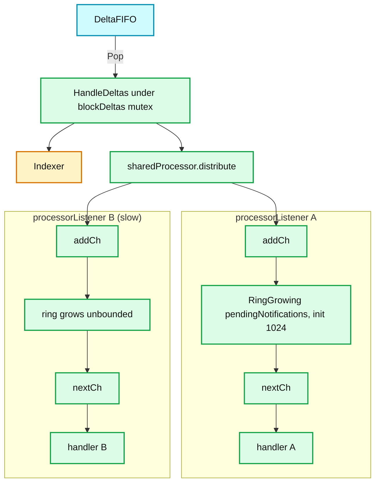

- **Responsibility**: one cache, many handlers, each with its own resync period.
- **`processorListener`**: two goroutines — `pop()` moves notifications from `addCh` into `nextCh`, spilling into an unbounded `buffer.RingGrowing` (`initialBufferSize = 1024` **[documented]**) whenever the handler is behind; `run()` synchronously invokes `OnAdd/OnUpdate/OnDelete`.
- **Blocking behaviour**: `distribute` writes to `addCh`, which `pop` always drains, so **a slow handler never blocks the shared pipeline — it grows memory instead**. That is the designed trade-off and the classic operator memory leak. **[documented]** (comment on `pendingNotifications`)
- **Resync**: `sharedProcessor.shouldResync()` asks every listener whether its `nextResync` has passed; only listeners that say yes receive the resulting `Sync` deltas. `minimumResyncPeriod = 1s` **[documented]**; the informer's `resyncCheckPeriod` is the GCD-ish lower bound (`determineResyncPeriod`).
- **`blockDeltas` mutex**: held across `HandleDeltas` and across `AddEventHandler`, so a handler added at runtime gets a synthetic `Add` for every object already in the cache before any new delta is delivered — no gap, no duplicate ordering problem.
- **`HasSynced` semantics**: informer-level `HasSynced` is about the *initial list*; the per-handler `ResourceEventHandlerRegistration.HasSynced()` additionally requires that handler to have consumed the initial batch. **[documented]**

### 6.6 SharedInformerFactory

- **Responsibility**: memoise `informers.GenericInformer` per (GVR, tweakListOptions, namespace), so N controllers share one watch.
- **Contract**: informers must all be requested **before** `Start()`; `Start` is idempotent for already-started informers, and `WaitForCacheSync` returns a map keyed by reflect type.
- **Variants**: `NewSharedInformerFactoryWithOptions(WithNamespace, WithTweakListOptions, WithTransform)`. `WithTransform` is the memory lever; `WithNamespace` is the sharding lever for operators.
- **kube-controller-manager** builds one factory plus a second, **metadata-only** factory (`metadatainformer`) used by the garbage collector and quota so those do not pay for full object bodies. **[documented]**
- **Failure mode**: requesting an informer after `Start` silently never syncs unless `Start` is called again — a very common operator bug. **[inferred]**

### 6.7 workqueue (`k8s.io/client-go/util/workqueue`)

- **`Typed[T].Interface`**: `Add`, `Len`, `Get`, `Done`, `ShutDown`, `ShutDownWithDrain`. Three collections: `queue []T` (order), `dirty sets.Set[T]` (should be processed), `processing sets.Set[T]` (in flight). **[documented]**
- **Two guarantees for free**: dedup (Add of a queued key is a no-op) and **no concurrent processing of the same key** (Get removes from `dirty`, adds to `processing`; a re-Add during processing is re-queued only at `Done`).
- **`DelayingInterface`**: `AddAfter(item, d)` pushes onto `waitForPriorityQueue` (a `container/heap`) via a 1000-slot channel; `waitingLoop` sleeps to the head's `readyAt` with a **10 s** `maxWait` heartbeat; duplicate keys are merged with `heap.Fix` keeping the earliest time.
- **`RateLimitingInterface`**: `AddRateLimited`, `Forget`, `NumRequeues`. Default limiter as in 4c.
- **Metrics** (`workqueue` subsystem): `depth`, `adds_total`, `queue_duration_seconds`, `work_duration_seconds`, `unfinished_work_seconds`, `longest_running_processor_seconds`, `retries_total`. **[documented]**
- **Reading them**: rising `queue_duration_seconds` with flat `work_duration_seconds` ⇒ not enough workers (`--concurrent-*-syncs`). Rising `work_duration_seconds` ⇒ slow API or slow handler. Rising `retries_total` with flat `depth` ⇒ a hot-looping key.

### 6.8 Expectations (`pkg/controller/controller_utils.go`)

- **Problem solved**: after `CREATE pod`, the informer cache does not yet contain it. A naive `len(cachedPods) < desired` re-creates the same pod on the next sync — an unbounded pod storm.
- **`ControllerExpectations`**: a `cache.Store` of `ControlleeExpectations{add, del int64, key, timestamp}`. `ExpectCreations(key, n)` sets `add=n`; each `CreationObserved` decrements. `SatisfiedExpectations(key)` is true when `add<=0 && del<=0`, **or** when the record is older than `ExpectationsTimeout = 5 minutes` **[documented]**, **or** when no record exists.
- **`UIDTrackingControllerExpectations`**: wraps the above with a `uidStore` of the exact **pod UIDs** the ReplicaSet asked to delete, so a delete event for an unrelated pod cannot satisfy the expectation. Used by the ReplicaSet controller. **[documented]**
- **The 5-minute timeout is the safety valve**: expectations are an *optimisation with a leak*, and the timeout bounds the leak. A controller stuck with unmet expectations does nothing for up to 5 minutes — visible as a Deployment that stalls and then abruptly resumes.
- **Slow start**: `slowStartBatch` creates pods in batches of `1, 2, 4, 8, ...` (`SlowStartInitialBatchSize = 1` **[documented]**) so a template that fails admission burns one API call, not 5 000. `BurstReplicas = 500` caps a single ReplicaSet sync (250 for DaemonSet). **[documented]**

### 6.9 controller-runtime (the operator path)

- **`Manager`**: owns a shared `Cache` (informers), a `Client` (cache-backed reads, direct writes), leader election, metrics/health servers, and a runnable graph. Defaults: `LeaseDuration 15s`, `RenewDeadline 10s`, `RetryPeriod 2s`, `GracefulShutdownTimeout 30s`. **[documented]** (`pkg/manager/manager.go`)
- **`Reconciler`**: `Reconcile(ctx context.Context, req ctrl.Request) (ctrl.Result, error)`. `req` is only `{Namespace, Name}` — the framework enforces level-triggering by construction: you cannot see the event.
- **Result handling** (`pkg/internal/controller/controller.go`): `err != nil` → `AddRateLimited`; `Result.RequeueAfter > 0` → `Forget` then `AddAfter`; otherwise `Forget`. Note `RequeueAfter` **resets** the backoff counter — mixing it with error returns for the same failure gives you a fixed-interval hot loop instead of backoff. **[documented]**
- **Builder**: `For(&v1.Foo{})` (primary), `Owns(&v1.Pod{})` (secondary mapped via ownerRef to the primary key), `Watches(&src, handler.EnqueueRequestsFromMapFunc(f))` (arbitrary mapping). `WithEventFilter`/`predicate.GenerationChangedPredicate` drops status-only updates.
- **Concurrency**: `MaxConcurrentReconciles` defaults to **1** **[documented]** — an operator that is slow per object is serialised until you raise it. `CacheSyncTimeout` defaults to 2 minutes.
- **vs raw client-go**: controller-runtime gives you ownerRef mapping, predicates, a unified client, and leader election for free; you give up control over queue construction (though `NewQueue`/`RateLimiter` are injectable) and you get one cache per manager, which by default watches **all namespaces for every type you touch** — the number-one operator memory surprise. Fix with `cache.Options{ByObject: {..: {Field/Label selectors}}}`.
- **1.34-era addition**: `UsePriorityQueue` (`priorityqueue` package) lets low-priority resyncs sit behind user-triggered events — alpha-ish, opt-in. **[documented]**

### 6.10 Leader election (`k8s.io/client-go/tools/leaderelection`)

- **Lock**: `coordination.k8s.io/v1` `Lease` in `kube-system` (`kube-controller-manager`, `kube-scheduler`). `LeaderElectionRecord` fields: `holderIdentity`, `leaseDurationSeconds`, `acquireTime`, `renewTime`, `leaderTransitions`.
- **Algorithm**: `acquire` polls `tryAcquireOrRenew` every `RetryPeriod` with `JitterFactor 1.2`; on success, `renew` polls until a renewal fails for `RenewDeadline`, then calls `OnStoppedLeading` (kube-controller-manager's callback is `klog.Fatalf`, i.e. process exit).
- **Fencing hazard**: nothing stops a stalled-then-resumed leader from completing an in-flight write. Mitigations in practice: (a) all controller writes are idempotent and RV-checked, so a stale write usually 409s; (b) `OnStoppedLeading` exits the process rather than trying to quiesce. There is **no** epoch/fencing token on the API path.
- **Clock skew**: comparisons are against the observer's own monotonic-ish clock (`observedTime`), so cross-node skew is harmless; a local clock step (NTP jump, VM migration) can cause spurious loss or spurious acquisition.
- **Coordinated Leader Election**: candidates create `LeaseCandidate` objects declaring `binaryVersion`/`emulationVersion`/`preferredStrategy`; the apiserver's `leaderelection` controller writes `spec.preferredHolder` on the Lease and the current leader yields. Beta, **off by default** in 1.34. **[documented]**

### 6.11 Deployment controller (`pkg/controller/deployment/`)

- **Files**: `deployment_controller.go` (queue, event handlers), `sync.go` (RS selection), `rolling.go` (surge math), `recreate.go`, `progress.go`, `util/deployment_util.go`.
- **RS selection**: hash `PodTemplateSpec` (FNV-1a, collision-avoidance counter) → `pod-template-hash` label added to the RS selector **and** to the pod template. Deployments select RSes by their own label selector, then match on hash.
- **Rolling math**: `maxSurge`/`maxUnavailable` resolved from percentages against `spec.replicas` (surge rounds **up**, unavailable rounds **down**), so 25 %/25 % on 4 replicas = surge 1, unavailable 1. Scale-up bound: `min(maxSurge + replicas - currentTotal, ...)`. Proportional scaling across multiple RSes during a mid-rollout scale uses `deployment.kubernetes.io/max-replicas`.
- **Annotations**: `deployment.kubernetes.io/revision`, `desired-replicas`, `max-replicas`. **[documented]**
- **Progress**: `progressDeadlineSeconds` (600) measured from the last `Progressing` condition `lastUpdateTime`; failure sets `reason=ProgressDeadlineExceeded`. **[documented]**
- **Rollback**: `kubectl rollout undo` patches the Deployment template back to an old RS's template; the controller finds the existing RS by hash and scales it up. The in-API `spec.rollbackTo` field was removed in `apps/v1`.
- **Knobs**: `--concurrent-deployment-syncs` default **5** **[documented]**; `maxRetries = 15`.

### 6.12 ReplicaSet controller (`pkg/controller/replicaset/`)

- **Reconcile**: `SatisfiedExpectations(key)` → list pods via cache → `claimPods` (adopt matching orphans, release non-matching) → `diff = len(activePods) - *spec.replicas` → create or delete.
- **Adoption**: `PodControllerRefManager` sets/clears `ownerReferences` with `Controller: true`; adoption is refused if the RS has a `deletionTimestamp`.
- **Deletion ordering** (`ActivePodsWithRanks.Less`, 8 rules, in order) **[documented]**: unassigned before assigned → `Pending < Unknown < Running` → not-ready before ready → **lower `controller.kubernetes.io/pod-deletion-cost` first** → more colocated ready pods first ("doubled up") → ready for less time first → more container restarts first → newer first. Ties broken by UID under `LogarithmicScaleDown`.
- **`pod-deletion-cost`** is an annotation, integer, `PodDeletionCost` feature gate **beta (default on) since 1.22** — still beta in 1.34. **[documented]**
- **Concurrency**: `--concurrent-replicaset-syncs` default **5**; `BurstReplicas = 500`; `statusUpdateRetries = 1`.
- **Failure mode**: expectation leak. If a pod create succeeds at the apiserver but the response is lost, `CreationObserved` still fires from the informer, so this self-heals; if the create genuinely fails, `slowStartBatch` decrements expectations explicitly.

### 6.13 StatefulSet controller (`pkg/controller/statefulset/`)

- **Identity**: pod name `<sts>-<ordinal>`, stable DNS via the governing headless Service, PVC name `<volumeClaimTemplate>-<sts>-<ordinal>`. Revision tracked with `ControllerRevision` objects and the `controller-revision-hash` label (`apps.ControllerRevisionHashLabelKey`). **[documented]**
- **`podManagementPolicy`**: `OrderedReady` (default) = "monotonic" mode — create ordinal *i* only when *i-1* is Running **and** Ready (and Available if `minReadySeconds`); delete in **descending** ordinal, one at a time. `Parallel` drops the barrier entirely. **[documented]** (`stateful_set_control.go`)
- **Update**: `RollingUpdate` with `partition` (default 0) walks ordinals from highest down to `partition`, replacing pods whose `controller-revision-hash` is stale. `maxUnavailable` for StatefulSets is still gated by `MaxUnavailableStatefulSet` (not GA).
- **PVC retention**: `persistentVolumeClaimRetentionPolicy.{whenDeleted,whenScaled}`, both defaulting to **`Retain`** **[documented]**; `Delete` sets an ownerRef from the StatefulSet (whenDeleted) or the Pod (whenScaled) onto the PVC and lets the GC do the work. `StatefulSetAutoDeletePVC` is **GA and locked in 1.32**. **[documented]**
- **Knobs**: `--concurrent-statefulset-syncs` default **5**. **[documented]**
- **Failure mode**: an unschedulable ordinal *i* under `OrderedReady` blocks all higher ordinals forever — by design, and the most common "my StatefulSet is stuck" ticket.

### 6.14 DaemonSet controller (`pkg/controller/daemon/`)

- **Reconcile**: for every Node, run the scheduler's `NodeAffinity`/taint predicates against the DS pod template to decide "should run here"; compare with pods actually present; create with a `spec.nodeAffinity` pinning `metadata.name` to that node (DaemonSet pods are scheduled by kube-scheduler, not by the DS controller, since 1.12).
- **Update**: `RollingUpdate` with `maxUnavailable` default **1** and `maxSurge` default **0** **[documented]**; revisions stored as `ControllerRevision` with `controller-revision-hash`.
- **Backoff**: `failedPodsBackoff *flowcontrol.Backoff` keyed by `<ds>/<node>` prevents a CrashLooping node from being hammered; GC'd on `BackoffGCInterval`.
- **Knobs**: `--concurrent-daemonset-syncs` default **2** **[documented]** (lowest of the workload controllers — DS syncs are O(nodes)); `BurstReplicas = 250`. **[documented]**

### 6.15 Job controller (`pkg/controller/job/`)

- **Counting protocol**: adopt pod → add finalizer `batch.kubernetes.io/job-tracking` → on terminal pod, append UID to `status.uncountedTerminatedPods` → update Job status → remove finalizers → clear the uncounted list. Guarantees exact counts across controller restarts and pod GC. **[documented]**
- **Indexed jobs**: `completionMode: Indexed`; index in the annotation/label `batch.kubernetes.io/job-completion-index` and in `$JOB_COMPLETION_INDEX`; `status.completedIndexes` is a compressed range string. `backoffLimitPerIndex` + `maxFailedIndexes` → `status.failedIndexes`.
- **Pod Failure Policy**: `spec.podFailurePolicy.rules[]` with `onExitCodes` / `onPodConditions` and actions `FailJob`, `FailIndex`, `Ignore`, `Count`. GA since 1.31.
- **Batching**: `syncJobBatchPeriod` coalesces rapid pod events; `MaxPodCreateDeletePerSync = 500` bounds a single sync. **[documented]**
- **Knobs**: `--concurrent-job-syncs` default **5** **[documented]**; queue limiter 1 s → 1 min.
- **`managedBy`** (beta in 1.34) lets an external controller (e.g. Kueue/MultiKueue) own the Job status; the built-in controller then **skips** it entirely — a genuinely new escape hatch for multi-cluster batch. **[documented]**

### 6.16 CronJob controller v2 (`pkg/controller/cronjob/cronjob_controllerv2.go`)

- **v2 design**: informer + workqueue + `AddAfter(nextScheduleTimeDuration)` instead of v1's 10-second global polling loop over all CronJobs. Scales to thousands of CronJobs. **[documented]**
- **Missed schedules**: `mostRecentScheduleTime` walks from `status.lastScheduleTime`; if `numberOfMissedSchedules > 100` it gives up, emits a warning event, and waits for the next schedule rather than firing a backlog. **[documented]**
- **`startingDeadlineSeconds`**: a schedule older than the deadline is skipped and counted as missed. Unset means "no deadline", which combined with a long controller outage is what triggers the >100 path.
- **Requeue padding**: `nextScheduleDelta = 100ms` is added to the computed wake-up so the controller does not wake a hair early and recompute. **[documented]**
- **Knobs**: `--concurrent-cron-job-syncs` default **5**. **[documented]** `concurrencyPolicy` ∈ `Allow|Forbid|Replace`.

### 6.17 Node lifecycle and taint-eviction controllers

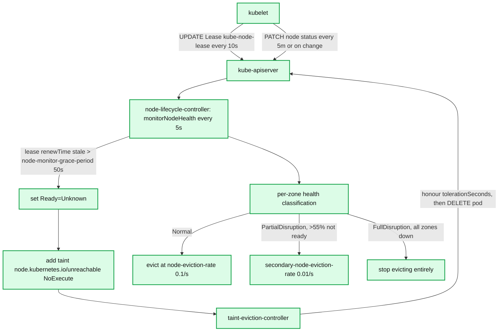

- **Heartbeats**: kubelet renews a `coordination.k8s.io` Lease in namespace `kube-node-lease` every **10 s** (`nodeStatusUpdateFrequency`, `nodeLeaseDurationSeconds = 40`) and PATCHes full node status only every **5 m** (`nodeStatusReportFrequency`) or on change. **[documented]** (`pkg/kubelet/apis/config/v1beta1/defaults.go`)
- **Detection**: `monitorNodeHealth` runs every `--node-monitor-period` (**5 s** **[documented]**, defaulted in `KubeCloudSharedConfiguration`). A node whose lease and status are both stale for `--node-monitor-grace-period` (**50 s** in 1.34 — raised from the long-standing 40 s **[documented]**, `pkg/controller/nodelifecycle/config/v1alpha1/defaults.go`) gets `Ready=Unknown`; `--node-startup-grace-period` is **60 s**.
- **Eviction rate limiting**: per-zone `RateLimitedTimedQueue`. `--node-eviction-rate` **0.1/s**, `--secondary-node-eviction-rate` **0.01/s**, `--large-cluster-size-threshold` **50**, `--unhealthy-zone-threshold` **0.55**. **[documented]** In a zone at or below 50 nodes, the secondary rate is implicitly **0** — small clusters simply stop evicting when unhealthy.
- **Zone states**: `Normal`, `PartialDisruption`, `FullDisruption` (all nodes not-ready in every zone ⇒ the controller assumes the *control plane* is wrong and stops evicting). This is the master-network-partition safety valve.
- **Split in 1.34**: `SeparateTaintEvictionController` is **GA and locked to default in 1.34** **[documented]**, so `taint-eviction-controller` is now a distinct controller (`--controllers=-taint-eviction-controller` can disable it independently). `--pod-eviction-timeout` (5 m) is legacy and unused on the taint path.
- **Pod-side contract**: pods get default tolerations for `node.kubernetes.io/not-ready` and `unreachable` with `tolerationSeconds: 300`, so actual pod deletion is ~50 s + 300 s after a node dies.

### 6.18 EndpointSlice, ServiceAccount, TTL-after-finished, PodGC, ResourceQuota, Namespace

- **EndpointSlice controller**: watches Services + Pods + Nodes, packs ready addresses into `discovery.k8s.io/v1` EndpointSlices, `--max-endpoints-per-slice` default **100** **[documented]**. Uses a placement heuristic that prefers filling existing slices to minimise slice churn (each slice write is a watch event to every kube-proxy). `--concurrent-service-endpoint-syncs` default **5**. The legacy `endpoints-controller` still mirrors to `v1.Endpoints`; `endpointslice-mirroring-controller` handles hand-written Endpoints.
- **ServiceAccount controller**: ensures a `default` ServiceAccount exists in every namespace. **Token controller**: in 1.34 the legacy secret-based token flow is vestigial — tokens come from the `TokenRequest` API projected by kubelet; `legacy-serviceaccount-token-cleaner-controller` deletes auto-generated legacy tokens unused for `--legacy-service-account-token-clean-up-period` (**365 d** **[documented]**). `--concurrent-serviceaccount-token-syncs` default **5**.
- **ttl-after-finished-controller**: watches Jobs with `spec.ttlSecondsAfterFinished`, `AddAfter` until expiry, deletes with a UID+RV precondition. `--concurrent-ttl-after-finished-syncs` default **5**. **[documented]**
- **pod-garbage-collector-controller**: deletes terminated pods above `--terminated-pod-gc-threshold` (**12500** **[documented]**), orphaned pods bound to deleted nodes, unscheduled terminating pods, and (with `PodDisruptionConditions`) marks them `DisruptionTarget`.
- **resourcequota-controller**: two loops — an event-driven one on quota objects and a `--resource-quota-sync-period` (**5 m**) full replenishment loop driven by a `QuotaMonitor` over all quota-tracked GVRs. `--concurrent-resource-quota-syncs` default **5**. Usage is *recomputed*, never incrementally trusted, precisely because admission-time reservations can leak.
- **namespace-controller**: on `deletionTimestamp`, discovers all namespaced GVRs, deletes their contents group-by-group, then removes the `kubernetes` finalizer from `spec.finalizers`. `--concurrent-namespace-syncs` default **10** **[documented]**. `OrderedNamespaceDeletion` (KEP-5080) is **GA and locked in 1.34** **[documented]**: Pods are now deleted *before* other resources, so NetworkPolicies outlive the workloads they protect during teardown.

### 6.19 Garbage collector (`pkg/controller/garbagecollector/`)

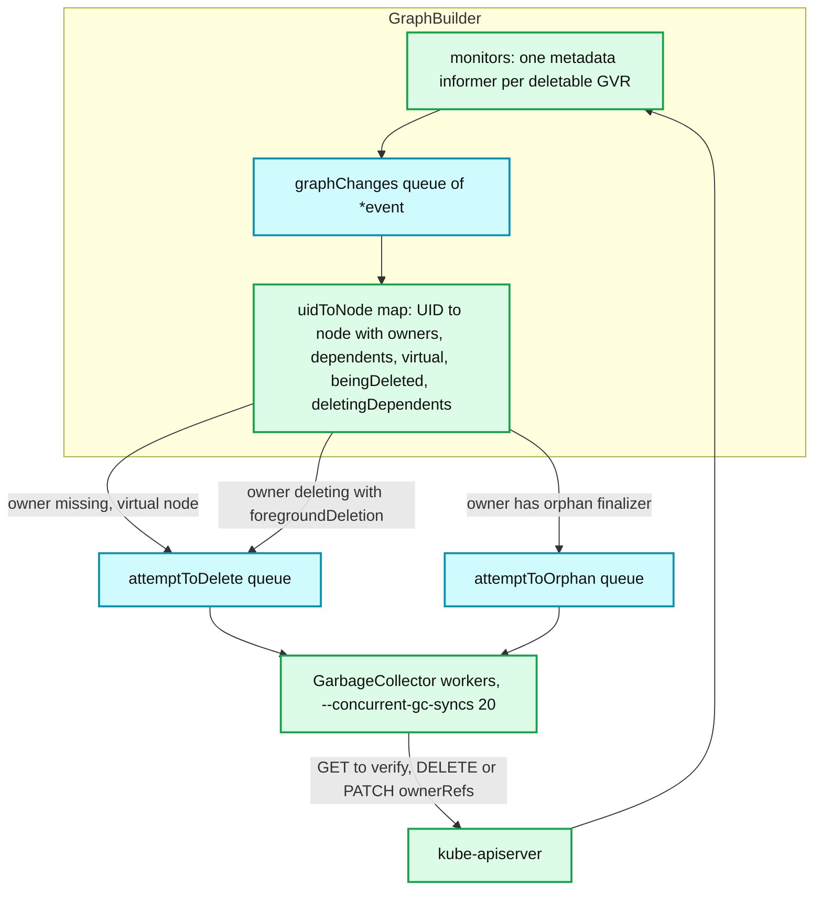

- **Graph**: `uidToNode` maps UID → `node{identity, owners []OwnerReference, dependents map[*node]struct{}, virtual bool, beingDeleted, deletingDependents}`. Only the `GraphBuilder` goroutine mutates it, so `concurrentUIDToNode` needs only a light mutex for readers.
- **Virtual nodes**: when a dependent names an owner UID the graph has not seen (informer lag, or a resource the GC does not watch), a `virtual: true` node is inserted and enqueued for verification against the apiserver. This is how the GC avoids deleting children of owners it merely hasn't observed yet.
- **`classifyReferences`**: each ownerRef is `solid` (owner exists and is not deleting-dependents), `dangling` (owner gone), or `waitingForDependentsDeletion`. Any solid owner ⇒ keep the object and prune the stale refs. No solid owners ⇒ delete.
- **Propagation policy chosen per delete** (`garbagecollector.go`): `Foreground` if the item itself has the `foregroundDeletion` finalizer or any owner is waiting on it; `Orphan` if the item has the orphan finalizer; else `Background`. Deletes carry `Preconditions{UID}` so a recreated object is never deleted by a stale decision.
- **Finalizer names**: `metav1.FinalizerDeleteDependents` = `foregroundDeletion`, `metav1.FinalizerOrphanDependents` = `orphan`. Both are added by the **apiserver** on DELETE according to `deleteOptions.propagationPolicy`, and removed by the GC.
- **`blockOwnerDeletion`**: only meaningful with foreground deletion; setting it on a child requires `update` on the owner's `finalizers` subresource, enforced by the `OwnerReferencesPermissionEnforcement` admission plugin. **[documented]**
- **Scope rules**: cluster-scoped dependents may only have cluster-scoped owners; namespaced dependents may only have owners in the same namespace or cluster-scoped owners. Violations are treated as dangling and the dependent is deleted — the classic "my CRD's children vanished" bug. **[documented]**
- **Knobs**: `--concurrent-gc-syncs` **20**, `--enable-garbage-collector` **true**. **[documented]**

### 6.20 Finalizers

- **Semantics**: `metadata.finalizers` is an ordered list of opaque strings. DELETE on an object with a non-empty list sets `metadata.deletionTimestamp` and returns 200 with the object still present; the object is removed from etcd only when the list empties. Finalizer names must be `domain/name` for non-core finalizers (validated).
- **Contract for a controller**: on `deletionTimestamp != nil && contains(myFinalizer)`, do external cleanup, then **patch** the finalizer out. Never write the whole object back (you will clobber concurrent finalizer additions) — use a JSON-patch `test`+`remove` on `/metadata/finalizers`.
- **Deadlock modes**: (a) the finalizer's controller is deleted/scaled to zero → object never goes away; (b) the finalizer's controller is *inside* the namespace being deleted → circular wait; (c) an aggregated APIService for a CR is unavailable → the namespace controller cannot list that resource and reports `NamespaceContentRemaining` / `DiscoveryFailed` forever.
- **Debugging**: `kubectl get ns X -o jsonpath='{.status.conditions}'` names the exact failing group; `kubectl api-resources` + `kubectl get apiservice | grep False` finds the broken aggregation. `kubectl get <res> -A -o json | jq '.items[] | select(.metadata.deletionTimestamp) | {n:.metadata.name, f:.metadata.finalizers}'` finds the stuck objects.
- **Escape hatch**: patching `metadata.finalizers` to `[]` skips the cleanup the finalizer existed to do (leaked cloud LBs, leaked volumes). For namespaces specifically, `spec.finalizers` must be cleared via the `/finalize` subresource, not a normal patch.

### 6.21 kube-controller-manager process structure

- **Shape**: one binary, one process, one leader. `NewControllerInitializers()` returns a map name → init func; each starts one or more goroutines plus one workqueue. All share `ControllerContext{InformerFactory, ObjectOrMetadataInformerFactory, RESTMapper, ClientBuilder}`.
- **Client identity**: each controller gets its own client (`ClientBuilder.ClientOrDie(name)`) so audit logs and per-controller RBAC are meaningful — but all share the same `--kube-api-qps`/`--kube-api-burst` **per client**, not globally. **[inferred]**
- **Sync concurrency defaults (v1.34, all `--concurrent-*-syncs`)** **[documented]**: deployment **5**, replicaset **5**, statefulset **5**, daemonset **2**, job **5**, cronjob **5**, endpoint **5**, service-endpoint (EndpointSlice) **5**, gc **20**, namespace **10**, resourcequota **5**, ttl-after-finished **5**, serviceaccount-token **5**.
- **Other generic defaults**: `--min-resync-period` **12 h**, `--controller-start-interval` **0 s**, `--controllers` **`*`**, `--leader-elect-resource-lock` **`leases`**, client `ContentType` **protobuf**. **[documented]**
- **Why 20 QPS is wrong for big clusters**: a 5 000-node cluster's node-lifecycle, endpointslice and GC controllers alone can want hundreds of writes/second during a rollout or a zone failure. At 20 QPS the symptom is `rest_client_rate_limiter_duration_seconds` climbing into seconds and every workqueue's `queue_duration_seconds` rising together. Typical production setting is 100–500 QPS with burst 2× QPS, backed by apiserver Priority & Fairness to protect etcd.
- **Metrics that matter**: `workqueue_depth{name=...}`, `workqueue_queue_duration_seconds`, `workqueue_work_duration_seconds`, `workqueue_retries_total`, `workqueue_unfinished_work_seconds`, `rest_client_request_duration_seconds{verb,host}`, `rest_client_requests_total{code}` (watch for 409/429), `rest_client_rate_limiter_duration_seconds`, `leader_election_master_status`, and per-controller `*_sync_duration_seconds`. **[documented]**

### 6.22 cloud-controller-manager and the out-of-tree provider model

- **Why**: in-tree cloud code coupled Kubernetes releases to provider releases and put provider credentials in kube-controller-manager. KEP-2395 removed all in-tree providers; the last (`--cloud-provider` legacy) code paths were deleted by 1.31. **[documented]**
- **What moved**: `cloud-node-controller` (initialise `spec.providerID`, node labels/addresses, remove `node.cloudprovider.kubernetes.io/uninitialized` taint), `cloud-node-lifecycle-controller` (delete Node objects for instances that no longer exist), `service-controller` (Type=LoadBalancer), `route-controller` (pod CIDR routes).
- **Handshake**: kubelet starts with `--cloud-provider=external`, which registers the Node with the `uninitialized:NoSchedule` taint; nothing schedules there until the CCM removes it. This is the whole coupling surface.
- **Defaults**: CCM has its **own** `--kube-api-qps` **20** / burst **30** and its own Lease; `--node-monitor-period` **5 s**, `--route-reconciliation-period` **10 s**, `--node-status-update-frequency` **5 m**. **[documented]** (`k8s.io/cloud-provider/config/v1alpha1/defaults.go`)
- **Interface**: providers implement `cloudprovider.Interface` (`Instances`/`InstancesV2`, `LoadBalancer`, `Routes`, `Zones`) and link it into a CCM binary via `app.NewCloudControllerManagerCommand` — the same controller framework, different repo and release cadence.

---

## 7. Guarantees

- **Eventual convergence, not immediate correctness.** Given a quiescent spec and a working apiserver, controllers converge. No bound on how long.
- **At-least-once reconciliation.** A key may be reconciled any number of times for one change (event + resync + retry). Reconcile functions **must** be idempotent; "already done" must be cheap.
- **No ordering across objects.** Two objects have independent queues positions and possibly independent controllers. Nothing orders "Service created" before "Endpoints updated" except causality through the API.
- **Per-key mutual exclusion, within one process.** The workqueue guarantees one worker per key at a time. Across processes it guarantees nothing — that is what leader election is for, and leader election has no fencing.
- **Optimistic concurrency, not lost-update prevention by locking.** Writes carry `resourceVersion`; a concurrent write yields 409 and the loser re-reads. Lost updates happen only when a controller does read-modify-**write-without-RV** (e.g. a full `Update` built from a stale cache read) — hence the rule: patch, don't update; and never write back an object obtained from a lister without a deep copy.
- **Cache reads are stale by construction.** `Lister` results lag the apiserver by the watch delay plus queue depth. A controller must never treat "not in cache" as "does not exist" for correctness-critical decisions — that is exactly what expectations and UID preconditions exist to paper over.
- **Status is advisory.** `status.observedGeneration` is the only handshake; conditions are hints, not state machines.
- **Deletion is guaranteed only after finalizers clear.** `deletionTimestamp` is a request, not a fact.

---

## 8. Failure modes

| Failure | Detection | Recovery | Blast radius |
|---|---|---|---|
| **Hot loop** — controller writes an object, its own watch event re-triggers it | `workqueue_adds_total` and `rest_client_requests_total` linear in time; `retries_total` flat (no errors!) | Compare desired vs observed before writing; use `GenerationChangedPredicate`; never write status unconditionally | Burns the whole `--kube-api-qps` budget, starving every other controller in the process |
| **Stuck finalizer** | Object with `deletionTimestamp` older than minutes; `Namespace` condition `NamespaceFinalizersRemaining` | Fix/restore the owning controller; last resort patch finalizers out (accepting the leak) | One object, or an entire namespace and everything in it |
| **Expectation leak** — expected create/delete never observed | Controller idle while `spec != status`; resumes exactly 5 min later | `ExpectationsTimeout = 5m` self-heals | One workload object, 5-minute stall |
| **Informer cache staleness / desync** | `rest_client_requests_total{code="410"}` spikes; reconcile decisions based on vanished objects | Reflector relists and `Replace()` synthesises the missing deletes | Whole process, one relist storm |
| **Slow event handler** | RSS growth with flat object count; `pendingNotifications` ring growth (no direct metric — infer from heap profile) | Move work into the workqueue; never do I/O in `OnUpdate` | OOMKill of the controller process |
| **Split-brain leaders** | `leader_election_master_status == 1` on two replicas; `leaderTransitions` churning | None automatic — rely on RV conflicts and old leader's `Fatalf`; shorten `RenewDeadline` at the cost of flapping | Duplicate pods/LBs created during the overlap window |
| **Thundering-herd resync** | Sawtooth in `workqueue_depth` and apiserver CPU every N hours | `--min-resync-period` 12 h with per-informer jitter in `[T,2T)`; stagger operators' `SyncPeriod` | Apiserver latency spike, cluster-wide |
| **Client-side throttling** | `rest_client_rate_limiter_duration_seconds` p99 in seconds; log line `Waited for … due to client-side throttling` | Raise `--kube-api-qps`/`--kube-api-burst`; rely on APF to protect the apiserver | Every controller in the process slows together |
| **Node-lifecycle mass eviction on a control-plane partition** | Many nodes → `Ready=Unknown` simultaneously | Zone `FullDisruption` state stops eviction entirely | Bounded by design; if zones are misconfigured (no `topology.kubernetes.io/zone`), the whole cluster is one zone |

---

## 9. Scalability and performance

- **Memory is dominated by informer caches.** Cost ≈ (objects × decoded size) per watched GVR per process. Pods are the worst offender; `managedFields` alone is often 20–40 % of a Pod object. Levers, in order of effectiveness: a `TransformFunc` stripping `managedFields`/annotations, metadata-only informers (`metadatainformer`, what the GC and quota use), field/label-selector-scoped caches, namespace-scoped caches.
- **The single `ThreadSafeStore` RWMutex** is the in-process contention point at 10⁵ objects. Symptom: reconcile CPU dominated by `List`. Fix: add a purpose-built index (`AddIndexers`) instead of listing-and-filtering.
- **API QPS is the hard ceiling.** 20/30 by default; every controller's writes, plus the GC's verification GETs, plus quota's replenishment come out of it. Raising it moves the bottleneck to the apiserver, where **Priority & Fairness** (`system-leader-election`, `workload-high`, `workload-low` flow schemas) decides who actually gets served.
- **Watch fan-out is the apiserver's cost, not yours.** One extra controller process with full Pod informers adds one more full serialisation stream per event; at 150 000 pods this is why "just run another operator" is not free.
- **Sharding strategies for custom controllers** (none of these are built in):
  - *By namespace*: N managers each with `cache.Options{DefaultNamespaces: {...}}`. Simple, uneven load.
  - *By label*: a `shard=k` label selector on the cache plus an external assigner. Requires a labeller controller.
  - *Consistent hashing over a shared cache*: all replicas watch everything, but only reconcile keys where `hash(key) % N == myIndex`. Cheap CPU sharding, **no** memory sharding.
  - *Lease-per-shard*: N leader-election Leases named `ctrl-shard-<i>`; each replica holds one. Gives failover per shard.
- **Batching wins**: `slowStartBatch` (1,2,4,8…), `syncJobBatchPeriod`, EndpointSlice packing, `MaxUncountedPods=500`. Every one of these exists to convert "N API calls" into "log N or 1".
- **Back-pressure is implicit**: the queue absorbs it, the rate limiter shapes it, and the only real signal is `workqueue_queue_duration_seconds`. There is no mechanism to tell producers (users, kubelets) to slow down.

---

## 10. Trade-offs and alternatives

**Level- vs edge-triggered**

| | Level-triggered (Kubernetes) | Edge-triggered (queue of commands) |
|---|---|---|
| Recovery from a lost message | Automatic (next resync/relist) | Requires durable queue + acks + DLQ |
| Correctness after controller downtime | Converges from current state | Must replay backlog, in order |
| Cost | Full state in memory; periodic re-evaluation | O(1) memory, O(events) work |
| Ordering | None needed across objects | Must be preserved, often per-key |
| Debuggability | "read the object" tells you everything | Must reconstruct from event history |
| Weakness | Cannot express "do X exactly once"; no audit of intent | Fragile under partition; queue is a second source of truth |

**Controllers vs an orchestrator with a database + queue** (the AWS-style approach: Step Functions, or an internal workflow engine over DynamoDB + SQS)

- Workflow engines give **exactly-once step semantics, ordered execution, and per-execution history** — things Kubernetes deliberately does not provide. If your operation is "charge the card, then provision", you want the workflow engine.
- Kubernetes gives **self-healing without an execution record**: kill every controller, restore them, and the cluster converges. A workflow engine with a lost execution record does nothing.
- The dividing line is whether the desired end state is expressible as data. Deployments are; "refund this transaction" is not.
- Hybrid in practice: operators that need workflow semantics encode the workflow **in the CR status as a state machine** (`status.phase` + conditions) and let level-triggered reconciliation drive it — which works, but loses the queue's ordering guarantee and re-introduces "is my status stale?" (hence `observedGeneration`).

**vs Nomad**

- Nomad's scheduler is a **single leader** running Raft with an internal, ordered evaluation queue (`evals`) and optimistic plan submission to the Raft log. Ordering and exactly-once are much easier because everything funnels through one replicated log.
- Kubernetes trades that for pluggability: any component can be a controller, on any resource, without touching the core.

**vs Borg**

- Borgmaster is monolithic: the scheduler, the "Borglet" tracker and the config machinery are one replicated service with Paxos-backed state, and the equivalent of controllers are internal subsystems, not independent clients.
- Kubernetes' externalised controller model is directly descended from the lesson that Borgmaster's monolith was hard to extend; the price is the level-triggered/no-transactions constraints described throughout this document.

**Other trade-offs made**

- **No transactions** ⇒ no way to atomically create a Deployment and its Service. Accepted; every controller must tolerate partial state.
- **Shared informer, unbounded listener buffers** ⇒ OOM instead of event loss. Accepted; correctness beats availability of the controller process.
- **Leader election without fencing** ⇒ a brief double-write window. Accepted because all writes are idempotent and RV-checked.

---

## 11. Staff-level questions

**1. A Deployment is stuck at 3/5 ready. `kubectl describe` shows no events for 4 minutes, then it suddenly progresses. What happened, mechanically?**
Almost certainly an **expectation leak** in the ReplicaSet controller: it issued creates or deletes, recorded `ExpectCreations/ExpectDeletions`, and never observed the matching informer events (dropped watch, or pods created then immediately deleted by another actor and coalesced). `SatisfiedExpectations` returns false, so `syncReplicaSet` returns early doing nothing — no events, no errors. After `ExpectationsTimeout = 5 min` the record is considered expired, the sync proceeds, and progress resumes. Corroborate with `workqueue_depth{name="replicaset"}` being non-zero while `workqueue_work_duration_seconds` is near zero.

**2. Your operator returns `ctrl.Result{RequeueAfter: 10 * time.Second}` together with a non-nil error when a downstream API is down. What is wrong?**
controller-runtime evaluates `err != nil` **first**: it calls `AddRateLimited` and the `RequeueAfter` is silently discarded (the source comment says exactly this). So you get exponential backoff, not 10 s — which is usually fine. The genuinely broken variant is the opposite: returning `RequeueAfter` with a **nil** error on every failure. That path calls `Forget(req)`, resetting the exponential counter, so a persistent failure becomes a fixed-rate hot loop at your chosen interval forever, with `retries_total` flat and `adds_total` linear. Rule: errors for failures, `RequeueAfter` only for "I succeeded, check again later".

**3. Two kube-controller-managers briefly believe they are leader. Can this create duplicate Pods, and what actually prevents disaster?**
Yes, briefly. There is no fencing token; the apiserver accepts writes from the demoted leader. The protections are layered: (a) the demoted leader's `renew` fails after `RenewDeadline` 10 s and `OnStoppedLeading` calls `klog.Fatalf`, so the window is bounded by 10 s plus whatever stalled it; (b) `LeaseDuration 15s > RenewDeadline 10s` means the challenger waits 5 s longer than the incumbent's own give-up point; (c) ReplicaSet creates are name-random but **expectation- and diff-guarded**, so the next sync of the surviving leader sees `diff > 0` and deletes the extras using the deletion-ordering rules. The residue is a transient over-provision, not corruption. Genuinely dangerous cases are controllers with external side effects (cloud LBs, DNS), which is why those must be idempotent on a stable key derived from the object UID.

**4. A 4 000-node cluster loses network to one zone of 900 nodes. Walk through what the node-lifecycle controller does and why it does not evict 900 nodes' worth of pods at once.**
Node leases in that zone stop being renewed. Within `--node-monitor-period` 5 s the controller notices; after `--node-monitor-grace-period` 50 s each node's `Ready` flips to `Unknown` and gets the `node.kubernetes.io/unreachable:NoExecute` taint. `handleDisruption` classifies the zone: with >`--unhealthy-zone-threshold` 0.55 of the zone's nodes not-ready and the zone larger than `--large-cluster-size-threshold` 50, the zone enters `PartialDisruption` and its `RateLimitedTimedQueue` is re-limited from `--node-eviction-rate` 0.1/s to `--secondary-node-eviction-rate` 0.01/s — 100 s per node. If *every* zone were unhealthy, the state becomes `FullDisruption` and eviction stops entirely, on the assumption that the control plane, not the nodes, is broken. Separately, pods only actually get deleted by the (now GA-and-separate in 1.34) `taint-eviction-controller` after their `tolerationSeconds: 300` default toleration expires.

**5. You add a CRD whose CRs own Pods via `ownerReferences`. Deleting a CR leaves the Pods running. Give three distinct causes.**
(a) **Scope mismatch** — the CR is cluster-scoped and the Pods are namespaced, or the CR is in a different namespace: the GC classifies those refs as *dangling* rather than honouring them, and (worse) may prune the refs. (b) **`ownerReferences` written without `controller`/`blockOwnerDeletion` and the delete used the default `Background` policy with the GC lagging** — the GC's `attemptToDelete` is asynchronous and rate-limited (`--concurrent-gc-syncs` 20); if the CRD was added recently, the GC's `resyncMonitors` may not have a monitor for it yet, or discovery failed and `garbagecollector_controller` logs `failed to sync`. (c) **The CR has a finalizer whose controller removed it without cascading**, or the deletion used `propagationPolicy: Orphan` (explicitly, or via an old client library default), which adds the `orphan` finalizer and makes the GC *strip* the ownerReferences instead of deleting the children. Diagnose with `kubectl get --raw /metrics | grep garbage_collector`, the GC's `graph_builder` debug endpoint (`/debug/controllers/garbagecollector/graph`), and by checking whether the Pods' `ownerReferences` were removed (orphan) or left intact (never processed).

---

## 12. Sources

**Docs**
- Controllers concept — https://kubernetes.io/docs/concepts/architecture/controller/
- Garbage collection / owners and dependents — https://kubernetes.io/docs/concepts/architecture/garbage-collection/ , https://kubernetes.io/docs/concepts/overview/working-with-objects/owners-dependents/
- Finalizers — https://kubernetes.io/docs/concepts/overview/working-with-objects/finalizers/
- Node heartbeats and leases — https://kubernetes.io/docs/concepts/architecture/nodes/
- kube-controller-manager flag reference — https://kubernetes.io/docs/reference/command-line-tools-reference/kube-controller-manager/
- cloud-controller-manager — https://kubernetes.io/docs/concepts/architecture/cloud-controller/
- Coordinated Leader Election — https://kubernetes.io/docs/concepts/cluster-administration/coordinated-leader-election/
- `LeaseCandidate` API — https://kubernetes.io/docs/reference/kubernetes-api/coordination/lease-candidate-v1beta1/

**KEPs**
- KEP-4355 Coordinated Leader Election — https://github.com/kubernetes/enhancements/tree/master/keps/sig-api-machinery/4355-coordinated-leader-election
- KEP-3157 Watch List (streaming initial list) — https://github.com/kubernetes/enhancements/tree/master/keps/sig-api-machinery/3157-watch-list
- KEP-2395 Removing in-tree cloud providers — https://github.com/kubernetes/enhancements/tree/master/keps/sig-cloud-provider/2395-removing-in-tree-cloud-providers
- KEP-3939 (Job) / KEP-3329 Pod Failure Policy / KEP-3850 backoffLimitPerIndex / KEP-3998 JobSuccessPolicy / KEP-4368 JobManagedBy — under https://github.com/kubernetes/enhancements/tree/master/keps/sig-apps/
- KEP-1847 StatefulSet PVC auto-delete — https://github.com/kubernetes/enhancements/tree/master/keps/sig-apps/1847-autoremove-statefulset-pvcs
- KEP-5080 Ordered namespace deletion — https://github.com/kubernetes/enhancements/tree/master/keps/sig-api-machinery/5080-ordered-namespace-deletion
- KEP-3902 Separate taint eviction controller — https://github.com/kubernetes/enhancements/tree/master/keps/sig-node/3902-decoupling-taint-manager-from-node-lifecycle-controller

**client-go (`release-1.34`)**
- `tools/cache/reflector.go`, `delta_fifo.go`, `shared_informer.go`, `thread_safe_store.go`, `index.go`, `controller.go`
- `util/workqueue/queue.go`, `delaying_queue.go`, `rate_limiting_queue.go`, `default_rate_limiters.go`
- `tools/leaderelection/leaderelection.go`, `tools/leaderelection/resourcelock/`

**kubernetes/kubernetes (`release-1.34`)**
- `cmd/kube-controller-manager/app/{controllermanager.go,options/}` , `cmd/kube-controller-manager/names/controller_names.go`
- `pkg/controller/controller_utils.go` (expectations, `ActivePodsWithRanks`, `slowStartBatch`)
- `pkg/controller/deployment/{deployment_controller.go,sync.go,rolling.go,progress.go,util/deployment_util.go}`
- `pkg/controller/replicaset/replica_set.go`
- `pkg/controller/statefulset/{stateful_set.go,stateful_set_control.go}`
- `pkg/controller/daemon/daemon_controller.go`
- `pkg/controller/job/job_controller.go` , `pkg/controller/cronjob/{cronjob_controllerv2.go,utils.go}`
- `pkg/controller/nodelifecycle/node_lifecycle_controller.go` , `pkg/controller/tainteviction/`
- `pkg/controller/garbagecollector/{garbagecollector.go,graph_builder.go,graph.go}`
- `pkg/controller/namespace/`, `pkg/controller/resourcequota/`, `pkg/controller/podgc/`, `pkg/controller/ttlafterfinished/`, `pkg/controller/endpointslice/`
- `pkg/controller/*/config/v1alpha1/defaults.go` (all `--concurrent-*-syncs` values)
- `pkg/apis/apps/v1/defaults.go` (maxSurge/maxUnavailable/progressDeadlineSeconds/PVC retention)
- `pkg/features/kube_features.go` (feature-gate maturity table)
- `staging/src/k8s.io/component-base/config/v1alpha1/defaults.go` (leader election + client connection defaults)
- `staging/src/k8s.io/controller-manager/config/v1alpha1/defaults.go` (`MinResyncPeriod`, resource lock)
- `staging/src/k8s.io/cloud-provider/config/v1alpha1/defaults.go` (CCM defaults)
- `staging/src/k8s.io/component-base/metrics/prometheus/{workqueue,restclient}/metrics.go` (metric names)

**controller-runtime (`release-0.22`)**
- `pkg/manager/{manager.go,internal.go}` , `pkg/controller/controller.go` , `pkg/internal/controller/controller.go` , `pkg/builder/controller.go` , `pkg/cache/cache.go` , `pkg/predicate/predicate.go`

---

<!-- nav:start -->
[← 01 API Server & etcd](kubernetes-01-apiserver-etcd.md) · **[Index](README.md)** · [03 Scheduler →](kubernetes-03-scheduler.md)
<!-- nav:end -->
