# Kubernetes Internals 03 — kube-scheduler

**Target version:** Kubernetes v1.34 (source verified against `release-1.34` @ `963b0d5f8`, Aug 2026 patch tip).
**Convention:** **[documented]** = stated in upstream docs/KEPs or read directly from source in this branch. **[inferred]** = my reasoning, not upstream text.

> **Three corrections to widely-repeated folklore, verified in this branch:**
> 1. The queue and cache no longer live in `pkg/scheduler/internal/…`. Since v1.32 they are `pkg/scheduler/backend/queue/scheduling_queue.go` and `pkg/scheduler/backend/cache/cache.go`. **[documented]**
> 2. The "30 s assumed-pod TTL" is **gone**. `pkg/scheduler/scheduler.go:64` reads `durationToExpireAssumedPod time.Duration = 0`, and `0` means *never expire* — changed because of [kubernetes#106361](https://github.com/kubernetes/kubernetes/issues/106361), where expiry raced with slow binds and double-counted resources. **[documented]**
> 3. `scheduler_pod_scheduling_duration_seconds` no longer exists; it was replaced by `scheduler_pod_scheduling_sli_duration_seconds`. **[documented]**

---

<!-- nav:start -->
[← 02 Controllers](kubernetes-02-controllers.md) · **[Index](README.md)** · [04 Node & kubelet →](kubernetes-04-kubelet-node-runtime.md)
<!-- nav:end -->

<!-- toc:start -->
<details>
<summary><b>Sections in this report (12)</b></summary>

- [1. Overview](#1-overview)
- [2. Architecture](#2-architecture)
- [3. Data flow](#3-data-flow)
- [4. Sequence of operations](#4-sequence-of-operations)
- [5. State machines](#5-state-machines)
- [6. Component deep dives](#6-component-deep-dives)
- [7. Guarantees](#7-guarantees)
- [8. Failure modes](#8-failure-modes)
- [9. Scalability & performance](#9-scalability--performance)
- [10. Trade-offs & alternatives](#10-trade-offs--alternatives)
- [11. Staff-level questions](#11-staff-level-questions)
- [12. Sources](#12-sources)

</details>
<!-- toc:end -->

## 1. Overview

- kube-scheduler solves **online bin-packing under hard and soft constraints**: pods arrive one at a time, placement is irrevocable without preemption, and the scheduler never sees the future arrival stream. It is deliberately a *greedy* algorithm — no global optimum is attempted.
- The core loop is **single-threaded by design**: `ScheduleOne` picks one pod, runs filter → score → assume, then hands off binding to a goroutine. Serialization is what makes the in-memory cache a correct model of the cluster without transactions.
- **Two-phase decomposition**: *filter* (predicates — reduce N nodes to feasible set, short-circuit per node) then *score* (priorities — rank the feasible set 0–100 per plugin, weighted sum). Filtering is cheap-per-node and parallel; scoring is expensive and therefore capped by `percentageOfNodesToScore`.
- Everything since v1.19 is a **Scheduling Framework plugin** (KEP-624). The "scheduler" is a thin driver; all policy — resources, affinity, spread, volumes, preemption, DRA — is plugins registered at fixed extension points.
- Scale envelope: 5 000 nodes / 150 000 pods, with the SIG-Scalability SLO being **p99 stateless-pod startup latency ≤ 5 s per cluster-day** (excludes image pull, init containers, and any pod requiring preemption). Steady-state throughput in `scheduler_perf` on 500 nodes is **~230–270 pods/s** for the default profile. **[documented]**

---

## 2. Architecture

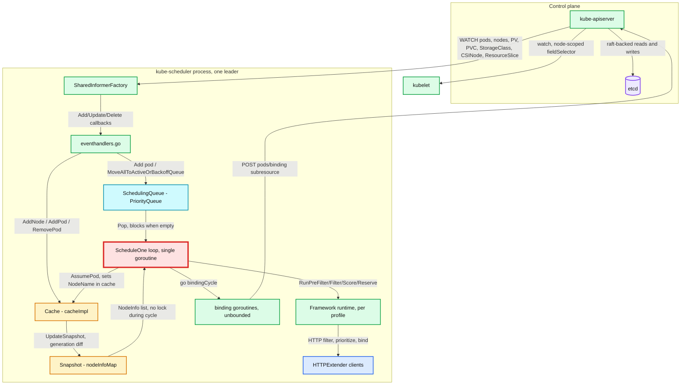

**What to notice**

- Two independent write paths into the scheduler's state: **informer events** mutate the Cache asynchronously; **`AssumePod`** mutates it synchronously from the scheduling cycle. Both take `cacheImpl.mu`.
- The **Snapshot** is the only thing the scheduling cycle reads. It is refreshed once per cycle (`UpdateSnapshot`) and then read lock-free — this is what allows Filter/Score to fan out across 16 goroutines safely.
- **Binding never touches the Cache's node accounting** — the resources were already charged at assume time. Binding only issues the API call and unwinds on failure.
- **Extenders sit inside the framework runtime**, not beside it; they are invoked after in-tree Filter and after in-tree Score, over HTTP with a 5 s default timeout.
- Only the **leader** runs this loop (`leaderElection.resourceLock: leases`, `kube-system/kube-scheduler`); followers hold informers cold and idle.

---

## 3. Data flow

### 3.1 Scheduling cycle — serial, one pod at a time

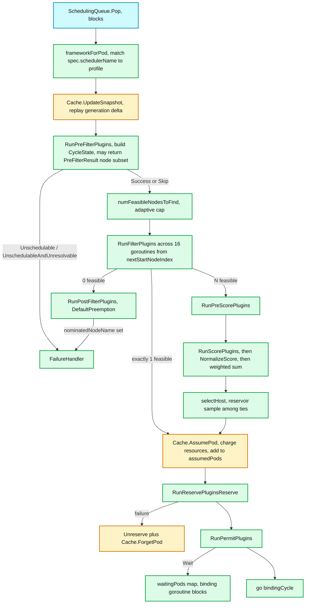

**What to notice**

- **`UpdateSnapshot` is inside the cycle**, so every pod sees a consistent point-in-time cluster view — including pods assumed by *previous* cycles that have not bound yet.
- **`AssumePod` is the commit point of the scheduling cycle.** After it, the pod's resources are charged in the cache and the next pod cannot double-book them; the API server does not know yet.
- The **short-circuit at exactly one feasible node** skips PreScore/Score entirely — a real optimization for small or heavily-constrained clusters.
- **PostFilter runs only when zero nodes are feasible**, and it does not schedule the pod; it sets `status.nominatedNodeName` and expects the pod to succeed on a *later* cycle.
- `Unreserve` + `ForgetPod` is the universal undo. It appears in three places: Reserve failure, Permit rejection, and any binding-cycle failure.

### 3.2 Binding cycle — one goroutine per pod, unbounded concurrency

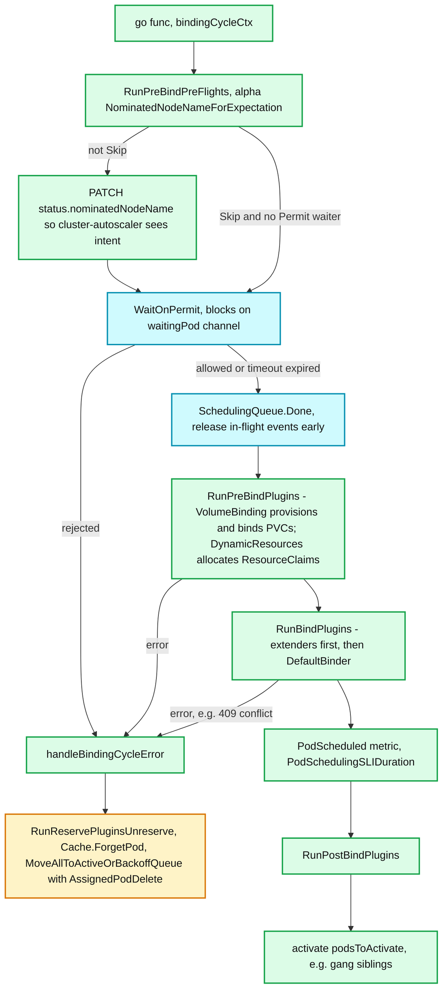

**What to notice**

- **Concurrency asymmetry is the whole point**: one scheduling cycle at a time, unbounded binding cycles. Binding is I/O-bound (PVC provisioning can take a minute); scheduling is CPU-bound over a shared mutable cache.
- `SchedulingQueue.Done(uid)` is called **before** PreBind, deliberately: it frees the pod's in-flight event list early to cut memory on busy clusters. The comment in `bindingCycle` is explicit that a PreBind/Bind failure after this point sends the pod to **backoffQ**, not to `unschedulablePods`.
- **Permit is the last point at which a pod can be declared *unschedulable*.** Everything after is an error, retried through backoff.
- Forgetting an assumed pod emits a synthetic **`AssignedPodDelete`** cluster event, because from every other pending pod's perspective resources just came back.
- `VolumeBinding.PreBind` blocks up to `bindTimeoutSeconds: 600` waiting for PVCs to reach `Bound` — a single slow storage backend can pin 600 s worth of binding goroutines.

---

## 4. Sequence of operations

### 4.1 Normal schedule + bind

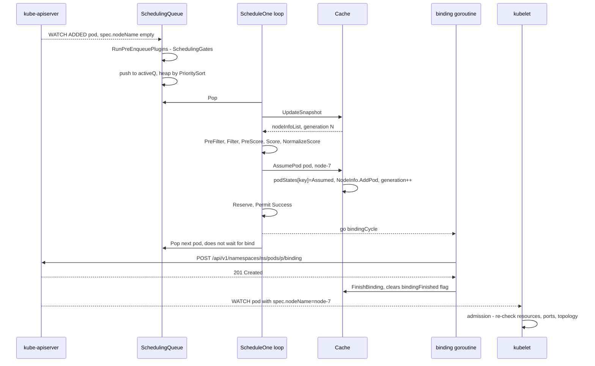

**What to notice**

- Only **one round-trip to the API server** per successful schedule: the `Binding` create. The scheduler never `PUT`s the whole pod.
- The `Binding` object writes `pod.spec.nodeName` through the `pods/binding` subresource, which is the *only* way to set that field on an existing pod (the field is otherwise immutable).
- The loop **returns to `Pop` immediately after handoff**; scheduling throughput is decoupled from apiserver write latency.
- **kubelet admission is the real backstop.** If the cache was stale and node-7 cannot actually host the pod, kubelet rejects it with `OutOfcpu`/`OutOfmemory` and the pod goes `Failed` — it is not rescheduled by the scheduler.

### 4.2 Unschedulable pod → backoff → cluster-event requeue

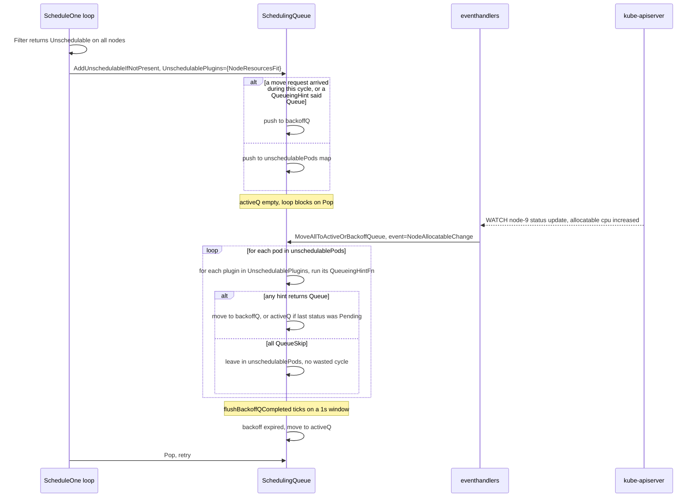

**What to notice**

- **QueueingHint (KEP-4247) went GA in v1.34** — `SchedulerQueueingHints` is `GA` at `1.34` in `pkg/features/kube_features.go`. Before it, *any* relevant cluster event flushed *all* unschedulable pods into backoff, burning cycles on pods that could not possibly have become schedulable. **[documented]**
- Only the plugins recorded in `UnschedulablePlugins` are consulted. A pod rejected by `NodeResourcesFit` is not woken by a `PersistentVolume` add.
- `flushUnschedulablePodsLeftover` still exists as a **safety net**: it runs every **30 s** and moves any pod that has sat in `unschedulablePods` longer than `podMaxInUnschedulablePodsDuration` (**5 min**). It is the fallback for a plugin with a buggy or missing hint. **[documented]**
- Backoff is `podInitialBackoffSeconds << (attempts-1)`, capped at `podMaxBackoffSeconds` — **1 s → 2 s → 4 s → 8 s → 10 s → 10 s …** with defaults 1 and 10.
- `backoffQ` expiry is quantized to a **1 s ordering window** (`backoffQOrderingWindowDuration`) so that pods expiring within the same second are drained in QueueSort order rather than in raw expiry order.

### 4.3 Preemption

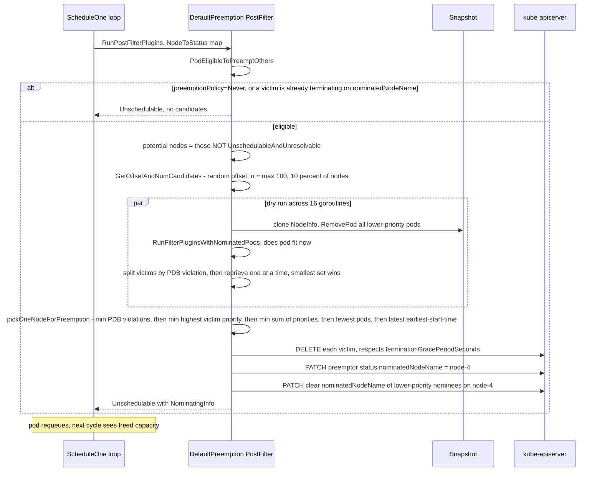

**What to notice**

- Preemption **never binds the pod**. It creates room and nominates; the pod re-enters the queue and competes again. A different pod can legitimately steal the freed room — the code comments call this "harmless".
- **The victim search is a minimality search, not a greedy sweep.** All lower-priority pods are removed, then re-added one at a time (`reprievePod`) — PDB-violating candidates first, so PDB-safe pods get reprieved preferentially. **[documented]**
- **PDBs are a ranking input, not a hard constraint.** `NumPDBViolations` is counted and used as the *first* tiebreak in `pickOneNodeForPreemption`, but a node whose only feasible victim set violates a PDB is still a valid candidate.
- The candidate shortlist is `max(MinCandidateNodesAbsolute=100, nodes × MinCandidateNodesPercentage=10%)` starting from a **random offset** — on 5 000 nodes only ~500 are dry-run, which bounds the cost but means preemption is not optimal either.
- `SchedulerAsyncPreemption` (**Beta since 1.33**) moves the victim-deletion API calls into background goroutines so the scheduling loop is not blocked on N deletes; `scheduler_preemption_goroutines_duration_seconds` tracks it. **[documented]**

### 4.4 Volume binding at PreBind

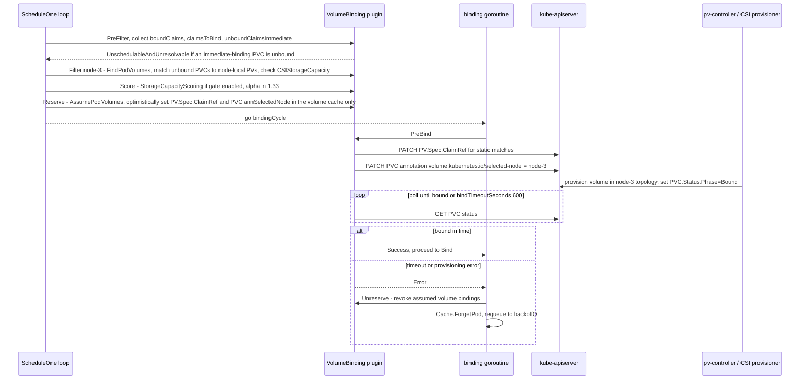

**What to notice**

- `WaitForFirstConsumer` inverts the normal ordering: the **scheduler picks the node first**, then the provisioner creates the volume in that node's topology. This is why volume binding must straddle Filter (feasibility), Reserve (optimistic claim), and PreBind (the actual API writes).
- `Reserve` writes only to the plugin's **in-memory assume cache**, so a Reserve failure costs nothing on the API server. `PreBind` is where the writes become real.
- The 600 s `bindTimeoutSeconds` is per-pod inside a binding goroutine. It does **not** block scheduling of other pods, but it does hold the node's resources charged in the scheduler cache the whole time.
- `VolumeZone` and `NodeVolumeLimits`/`CSILimits` are *separate* plugins: zone-label matching for already-bound PVs, and per-node attachable-volume counts sourced from `CSINode.spec.drivers[].allocatable.count`.

### 4.5 Bind conflict — the assumed-state unwind

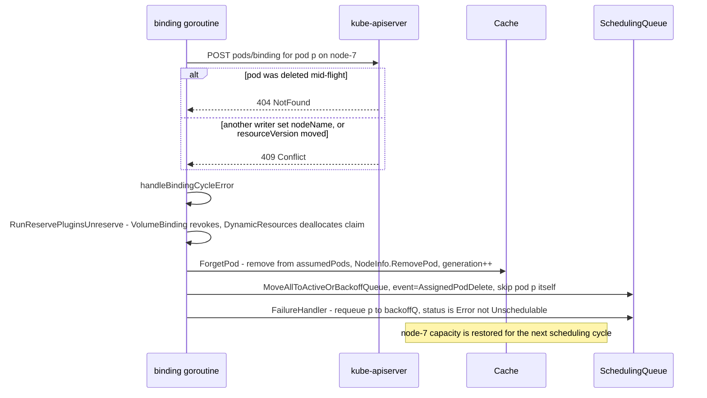

**What to notice**

- A bind failure is classified as **Error**, so the pod goes to `backoffQ` and retries with exponential backoff — it is *not* parked in `unschedulablePods`, because nothing about the cluster proved it unschedulable.
- The synthetic `AssignedPodDelete` move is **deferred** when the status is a rejection, specifically so `MoveAllToActiveOrBackoffQueue` does not re-add the pod itself as an in-flight event and bounce it back into backoff twice.
- If `ForgetPod` itself fails (pod already bound elsewhere), the error is logged and swallowed — the cache would then be *ahead* of reality, and self-heals on the next informer update for that node.
- **There is no rollback of the API write.** If the bind partially succeeded, the pod is bound and the scheduler's unwind is a no-op that the informer will correct.

---

## 5. State machines

### 5.1 Pod scheduling states

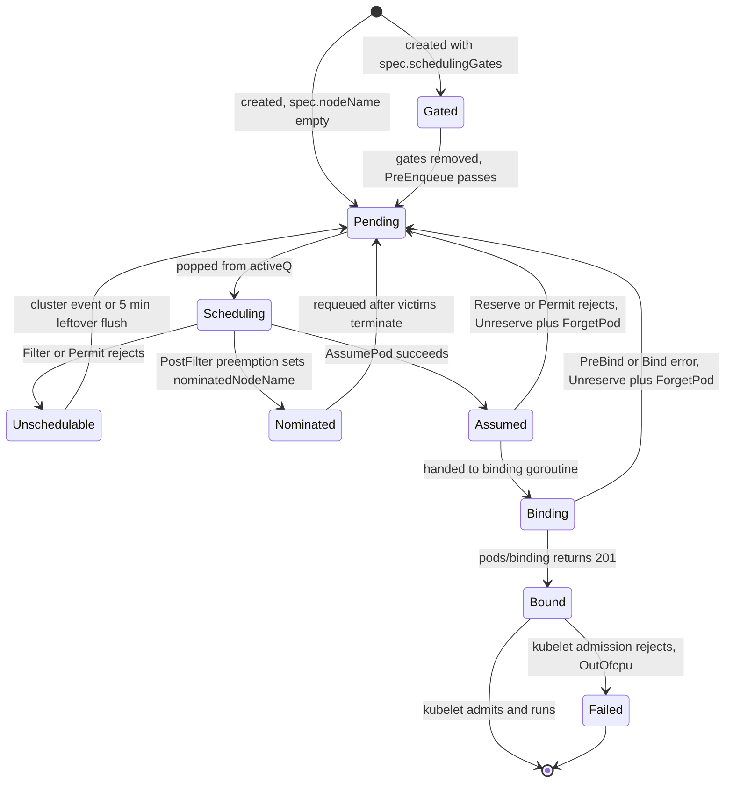

**What to notice**

- **`Assumed` is a scheduler-only state** with no API representation. Nothing outside the scheduler process can observe it — this is the source of every "the dashboard says the node has room but the scheduler disagrees" incident.
- **`Nominated` is API-visible** (`pod.status.nominatedNodeName`) precisely so cluster-autoscaler and other controllers do not scale up for a pod that already has room reserved by preemption.
- The `Bound → Failed` edge is the only place the loop truly gives up; the scheduler does not retry a pod kubelet rejected.
- `Gated` is enforced by the `SchedulingGates` plugin at **PreEnqueue** — a gated pod never enters `activeQ`, never consumes a scheduling cycle, and shows in `scheduler_pending_pods{queue="gated"}`.

### 5.2 Queue states

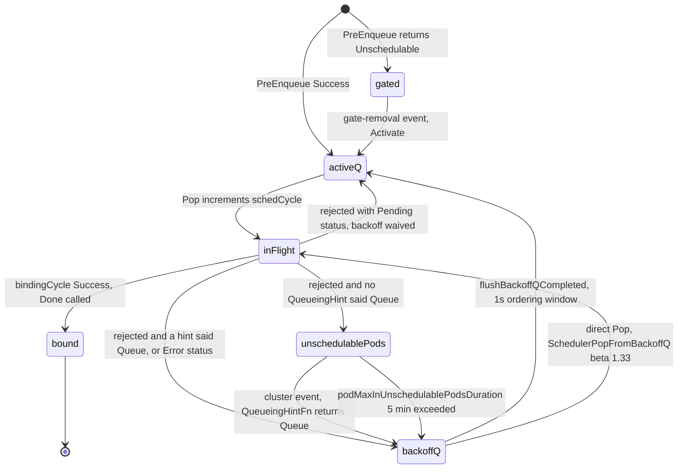

**What to notice**

- `activeQ` is a **heap ordered by the QueueSort plugin** — exactly one QueueSort plugin may be registered per profile. Default `PrioritySort`: descending `spec.priority`, then ascending `creationTimestamp`.
- `backoffQ` is a **separate heap ordered by backoff expiry**, with a secondary comparison using the same `activeQLessFn` inside each 1 s window.
- `unschedulablePods` is a **plain map, not a heap** — nothing pops from it; pods only leave via an event-driven move or the leftover flush.
- `SchedulerPopFromBackoffQ` (Beta, 1.33) lets the loop pop straight from `backoffQ` when `activeQ` is empty, rather than idling until the window tick — a real latency win in low-throughput clusters. **[documented]**
- `inFlightEvents` (a `container/list`) records every cluster event that arrives *while* a pod is being scheduled, so the requeue decision after a failure is evaluated against events the cycle raced with. This is the correctness core of KEP-4247.

---

## 6. Component deep dives

### 6.1 SchedulingQueue — `pkg/scheduler/backend/queue/scheduling_queue.go`

**Responsibility.** Admission control (PreEnqueue), ordering (QueueSort), retry policy (backoff), and event-driven wakeup.

**Data structures** (verified in `PriorityQueue` struct):

| Field | Type | Purpose |
|---|---|---|
| `activeQ` | `activeQueuer` wrapping a `heap.Heap` | ready-to-schedule pods, QueueSort order |
| `backoffQ` | `backoffQueuer`, two heaps | pods serving a penalty |
| `unschedulablePods` | `map[string]*QueuedPodInfo` | tried and failed, awaiting an event |
| `nominator` | embedded | `nominatedPods` per node + `nominatedPodToNode` |
| `inFlightPods` | `map[types.UID]*list.Element` | pods popped but not `Done` |
| `inFlightEvents` | `*list.List` | interleaved pods and cluster events |
| `queueingHintMap` | `map[profile]map[ClusterEvent][]QueueingHintFunction` | KEP-4247 dispatch table |
| `moveRequestCycle` | `int64` | pre-hints fallback; slated for removal now that hints are GA |

**Algorithms.**
- **Backoff**: `calculateBackoffDuration(count)` → `count==0 ? 0 : min(initial << (count-1), max)`. Defaults 1 s / 10 s ⇒ saturates at attempt 5. **[documented]**
- **Requeue decision**: for each unschedulable pod, intersect the event with the pod's `UnschedulablePlugins`; run each plugin's `QueueingHintFn(logger, pod, oldObj, newObj)`; if **any** returns `Queue`, requeue. Errors from a hint are treated conservatively as `Queue`. **[documented]**
- **Lock order is documented in the source and is load-bearing**: `PriorityQueue.lock > activeQueue.lock > backoffQueue.lock > nominator.nLock`.

**Concurrency.** `Pop` blocks on a `sync.Cond`; informer goroutines push. Two background goroutines from `Run`: the backoff flusher aligned to the 1 s window, and `flushUnschedulablePodsLeftover` on a 30 s `wait.Until`.

**Failure handling.** A pod whose plugins register no `EventsToRegister` for the reason it failed will sit in `unschedulablePods` until the 5-minute flush — which is exactly why the flush was kept after hints went GA.

**Production knobs.**

| Knob | Default | Notes |
|---|---|---|
| `podInitialBackoffSeconds` | `1` | KubeSchedulerConfiguration v1 |
| `podMaxBackoffSeconds` | `10` | |
| `podMaxInUnschedulablePodsDuration` | `5m` | not exposed in v1 config; internal option only |
| `backoffQOrderingWindowDuration` | `1s` | compile-time const |
| `SchedulerQueueingHints` | **GA in 1.34** | gate locked on |
| `SchedulerPopFromBackoffQ` | Beta since 1.33 | on by default |

### 6.2 Cache and Snapshot — `pkg/scheduler/backend/cache/`

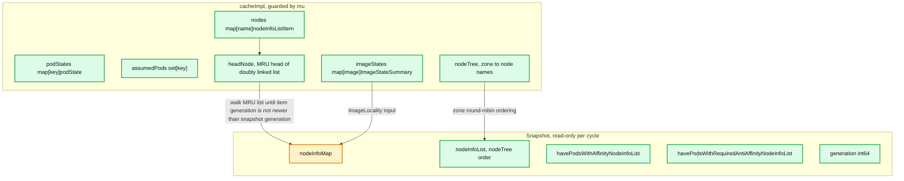

**What to notice**

- The **MRU doubly-linked list plus a monotonically increasing `generation`** makes `UpdateSnapshot` an *incremental* operation: walk from `headNode` and stop at the first node whose generation is ≤ the snapshot's. On a 5 000-node cluster where 3 nodes changed, only 3 `NodeInfo`s are rebuilt. **[documented]**
- `nodeInfoList` is materialized in **`nodeTree` (zone) order**, so the round-robin `nextStartNodeIndex` sweep naturally spreads across zones instead of hammering one rack. **[documented]**
- The two side lists (`havePodsWithAffinity…`) let InterPodAffinity iterate only nodes that actually host affinity-bearing pods — a large constant-factor win.
- `podState.bindingFinished` exists so the (now-disabled) expiry path could never evict a pod mid-bind; with `durationToExpireAssumedPod = 0` it is vestigial but still maintained. **[inferred]**

**Key methods.** `AssumePod` (charge resources, mark assumed), `FinishBinding` (mark bind complete), `ForgetPod` (uncharge — errors if the pod is not assumed), `AddPod`/`UpdatePod`/`RemovePod` (informer-driven; `AddPod` on an assumed pod converts it to a real pod without double-charging).

**Failure handling.** The background `cleanupAssumedPods` goroutine runs every `cleanAssumedPeriod = 1s` but is a no-op with a zero TTL. Divergence is corrected only by informer events — the cache is eventually consistent with the API server, never transactionally so.

### 6.3 Scheduling Framework — KEP-624

Extension points **in execution order**, with in-tree implementers as registered by `getDefaultPlugins()` in `pkg/scheduler/apis/config/v1/default_plugins.go`:

| # | Extension point | Cycle | In-tree plugins | Notes |
|---|---|---|---|---|
| 1 | **PreEnqueue** | queue | `SchedulingGates`, `DynamicResources` | runs before `activeQ`; failure ⇒ `gated` |
| 2 | **QueueSort** | queue | `PrioritySort` | exactly one allowed |
| 3 | **PreFilter** | sched | `NodeAffinity`, `NodePorts`, `NodeResourcesFit`, `PodTopologySpread`, `InterPodAffinity`, `VolumeBinding`, `VolumeRestrictions`, `NodeVolumeLimits`, `DynamicResources` | may return a `PreFilterResult` node subset; `Skip` disables its Filter |
| 4 | **Filter** | sched | all of the above plus `NodeName`, `NodeUnschedulable`, `TaintToleration`, `VolumeZone` | per-node, parallel, short-circuits |
| 5 | **PostFilter** | sched | `DefaultPreemption`, `DynamicResources` | only when 0 feasible nodes |
| 6 | **PreScore** | sched | `TaintToleration`, `NodeAffinity`, `PodTopologySpread`, `InterPodAffinity`, `VolumeBinding`, `NodeResourcesFit` | `Skip` disables its Score |
| 7 | **Score** | sched | `NodeResourcesFit` (w=1), `NodeResourcesBalancedAllocation` (1), `ImageLocality` (1), `TaintToleration` (3), `NodeAffinity` (2), `PodTopologySpread` (2), `InterPodAffinity` (2), `VolumeBinding` | raw score any int64 |
| 8 | **NormalizeScore** | sched | `PodTopologySpread`, `InterPodAffinity`, `ImageLocality` (implicit) | must map to `[0,100]` |
| 9 | **Reserve** | sched | `VolumeBinding`, `DynamicResources` | paired with Unreserve |
| 10 | **Permit** | sched | *(none in-tree)* | `Wait` + timeout; the gang-scheduling hook |
| 11 | **PreBindPreFlight** | bind | `VolumeBinding`, `DynamicResources` | new in 1.34, alpha `NominatedNodeNameForExpectation` |
| 12 | **PreBind** | bind | `VolumeBinding`, `DynamicResources` | the API-write phase |
| 13 | **Bind** | bind | `DefaultBinder` | first non-`Skip` plugin wins |
| 14 | **PostBind** | bind | *(none in-tree)* | best-effort cleanup |
| — | **Unreserve** | both | `VolumeBinding`, `DynamicResources` | idempotent undo |

**Status codes** (`staging/src/k8s.io/kube-scheduler/framework/interface.go`) — note there are **seven** in 1.34, not six:

| Code | Meaning | Queue consequence |
|---|---|---|
| `Success` | plugin passed; a `nil` status is also Success | continue |
| `Error` | internal/unexpected failure | requeue **without** recording `UnschedulablePlugins` ⇒ near-immediate retry via backoff |
| `Unschedulable` | pod does not fit here, but PostFilter (preemption) might help | backoff, `UnschedulablePlugins` recorded |
| `UnschedulableAndUnresolvable` | no PostFilter plugin could change this | backoff; node excluded from preemption candidates |
| `Wait` | Permit only — hold the pod in `waitingPods` | binding goroutine blocks |
| `Skip` | PreFilter/PreScore ⇒ skip paired Filter/Score; Bind ⇒ decline to bind | continue |
| `Pending` | scheduling succeeded but an external component must act first | requeue to **activeQ directly, backoff waived** |

**MultiPoint.** The default config registers plugins once under `multiPoint`; the framework expands each into every extension point that plugin's Go type implements, preserving order. Disabling `NodeResourcesFit` at `score` while keeping it at `filter` requires an explicit `disabled` entry.

**Parallelism.** `parallelize.Parallelizer` wraps `workqueue.ParallelizeUntil` with `parallelism: 16` (default) and chunk sizing to reduce contention. It is used by Filter fan-out, Score fan-out, InterPodAffinity/PodTopologySpread PreFilter/PreScore, and preemption's candidate dry-run.

### 6.4 Resource and topology plugins

**NodeResourcesFit.**
- *Filter*: for each requested resource, `requested + podRequest <= allocatable`. Also enforces pod count and extended resources. `ignoredResources`/`ignoredResourceGroups` args let you exempt device-plugin resources.
- *Score strategies* (`ScoringStrategy.Type`, default **`LeastAllocated`**, resources `cpu:1, memory:1`):
  - `LeastAllocated` — `Σ wᵢ · (capacityᵢ − requestedᵢ)/capacityᵢ · 100 / Σ wᵢ`. Spreads load; the default because it maximizes headroom for bursty pods.
  - `MostAllocated` — the complement. Bin-packs; what you want under cluster-autoscaler to let empty nodes scale in.
  - `RequestedToCapacityRatio` — a user-supplied piecewise-linear `shape` over utilization %, plus per-resource weights. This is how you express "pack GPUs but spread CPU".
- `NodeResourcesBalancedAllocation` is a *separate* scoring plugin (weight 1) penalizing nodes where CPU and memory utilization diverge — it exists to stop `LeastAllocated` from creating CPU-starved / memory-rich fragments.

**NodeAffinity / NodeName / NodeUnschedulable / TaintToleration / NodePorts.** Cheap, O(1)-ish per node. `NodeAffinity` also scores `preferredDuringSchedulingIgnoredDuringExecution` terms (weight 2). `TaintToleration` carries the **highest default score weight (3)** — a deliberate statement that avoiding `PreferNoSchedule` taints outranks packing. `NodeUnschedulable` returns `UnschedulableAndUnresolvable` for cordoned nodes, which also removes them from preemption candidates.

**PodTopologySpread.**
- Per constraint, build `TopologyPairToPodCounts`. Filter admits node *n* iff `matchNum(n) + selfMatch − minMatchNum ≤ maxSkew`.
- `minDomains` changes `minMatchNum`: if the number of *eligible* domains is below `minDomains`, `minMatchNum` is forced to **0**, which makes the skew constraint reject nodes in already-populated domains and thereby forces spread into new (possibly not-yet-existing) domains. GA in 1.34 — the `MinDomainsInPodTopologySpread` gate no longer exists in `pkg/features/kube_features.go` and the API field carries no gate caveat. **[documented]**
- `whenUnsatisfiable: DoNotSchedule` ⇒ Filter; `ScheduleAnyway` ⇒ Score only.
- **Default constraints** when the pod declares none and `defaultingType: System` (the default): `kubernetes.io/hostname` with `maxSkew: 3, ScheduleAnyway`, and `topology.kubernetes.io/zone` with `maxSkew: 5, ScheduleAnyway`. **[documented — `systemDefaultConstraints` in `podtopologyspread/plugin.go`]**
- `matchLabelKeys` (Beta since 1.27) appends e.g. `pod-template-hash` to the selector so a rolling update's old and new ReplicaSets do not spread against each other.

**InterPodAffinity — the expensive one.**
- PreFilter builds three `topologyToMatchedTermCount` maps: `existingAntiAffinityCounts` (anti-affinity terms of *existing* pods that this pod might violate), `affinityCounts`, `antiAffinityCounts`.
- Building them requires, for each of N nodes, iterating that node's pods and evaluating label selectors — hence **O(pods × nodes)** in the worst case, or more precisely O(Σ_nodes |pods(node)| × |terms|). It is parallelized with `parallelizer.Until` and narrowed by the snapshot's `havePodsWithRequiredAntiAffinityNodeInfoList`, but it remains the dominant cost in large clusters with widely-scoped affinity.
- Scoring normalizes to `[0,100]` via `(score − min)/(max − min)`; `hardPodAffinityWeight: 1` decides how much a *required* affinity term also contributes to the soft score.
- **Staff-level rule of thumb:** an anti-affinity term with `topologyKey: kubernetes.io/hostname` and a namespace-wide selector on a 5 000-node cluster is the single most reliable way to destroy scheduler throughput. **[inferred]**

**ImageLocality.** Scores nodes by the summed size of the pod's images already present, scaled by the fraction of nodes that have the image (so ubiquitous base images contribute little). Clamped to `[23 MB, 1000 MB × numContainers]` before mapping to `[0,100]`. **[documented]**

**Storage plugins.** `VolumeRestrictions` (RWO conflicts, `ReadWriteOncePod` enforcement), `VolumeZone` (bound PV zone labels must match the node), `NodeVolumeLimits`/CSI limits (per-driver attachable-volume ceiling from `CSINode.spec.drivers[].allocatable.count`).

**DynamicResourceAllocation.** `resource.k8s.io/v1` — `ResourceClaim`, `ResourceClaimTemplate`, `DeviceClass`, `ResourceSlice` — **graduated to GA in v1.34** (`DynamicResourceAllocation` gate `GA` at `1.34`). With *structured parameters*, drivers publish device inventory as `ResourceSlice` objects and the **scheduler itself** performs allocation, so there is no third-party controller in the scheduling path. Plugin surface: `PreEnqueue`, `PreFilter`, `Filter`, `PostFilter`, `Reserve`, `Unreserve`, `PreBindPreFlight`, `PreBind`. `Filter` per node can be slow enough to need its own budget — `DynamicResourcesArgs.filterTimeout`, default **10 s**, gate `DRASchedulerFilterTimeout` (**Beta in 1.34**). Adjacent gates in 1.34: `DRAPrioritizedList` Beta, `DRAAdminAccess` Beta, `DRAConsumableCapacity` Alpha, `DRADeviceBindingConditions` Alpha, `DRADeviceTaints`/`DRAPartitionableDevices` Alpha. **[documented]**

**SchedulingGates.** `PodSchedulingReadiness` GA since 1.30. `spec.schedulingGates` is a list of opaque strings; a `PreEnqueue` rejection while any remain. Gates can only be *removed*, never added, after creation — this is the primitive Kueue uses to hold jobs out of the queue entirely.

### 6.5 DefaultPreemption

Covered in §4.3. Configuration and limits:

| Knob | Default | Effect |
|---|---|---|
| `minCandidateNodesPercentage` | `10` | shortlist size as % of nodes |
| `minCandidateNodesAbsolute` | `100` | floor on shortlist |
| `pod.spec.priorityClassName` → `spec.priority` | none | resolved by the `Priority` admission plugin |
| `pod.spec.preemptionPolicy` | `PreemptLowerPriority` | `Never` ⇒ pod can be preempted but never preempts |
| `PriorityClass.globalDefault` | false | at most one may be true |
| `SchedulerAsyncPreemption` | Beta (1.33) | victim deletion off the critical path |

**Known limitations [documented in KEP/issue history, and visible in the code]:**
- **No cross-node gang preemption.** `SelectVictimsOnNode` operates on a single `NodeInfo`; a pod needing room freed on two nodes simultaneously cannot be satisfied.
- **PDB violations are counted, not blocked.** A `minAvailable` PDB will be violated if that is the only way to place a higher-priority pod.
- **Preemption does not consider the scoring function.** It picks the node that is cheapest *to preempt on*, not the node that would score best.
- **Nomination is advisory.** `RunFilterPluginsWithNominatedPods` makes later cycles account for nominated pods on a node, but nothing reserves the capacity — a lower-priority pod scheduled normally can take it.

### 6.6 Binder and extenders

**DefaultBinder** constructs `v1.Binding{ObjectMeta: {ns, name, uid}, Target: ObjectReference{Kind: "Node", Name: n}}` and POSTs to `pods/binding`. Content type is **protobuf** (`application/vnd.kubernetes.protobuf`), QPS 50 / Burst 100 by default — a real throughput ceiling worth raising on large clusters. With `SchedulerAsyncAPICalls` (**Beta in 1.34**), binds and status patches go through an `APIDispatcher` queue instead of blocking the goroutine; `scheduler_pending_async_api_calls` is the gauge to watch. **[documented]**

**Extenders** (legacy, `pkg/scheduler/extender.go`) are HTTP webhooks configured with `urlPrefix`, `filterVerb`, `prioritizeVerb`, `preemptVerb`, `bindVerb`, `weight`, `managedResources`, `ignorable`, `nodeCacheCapable`, `httpTimeout` (**default 5 s**). They run *after* in-tree plugins at Filter and Score. Compared with framework plugins they are strictly worse: an extra network hop inside the serialized cycle, no access to `CycleState`, no Reserve/Permit/Unreserve, and `ignorable: false` means a slow extender stalls **all** scheduling. Use them only when you cannot rebuild the scheduler binary.

**Multiple profiles vs. a second scheduler.** One binary can serve many `profiles[]`, each with a distinct `schedulerName`, its own plugin set and `pluginConfig`; they share one queue, one cache, and one serialized loop — so profiles isolate *policy*, not *throughput*. A genuinely separate scheduler Deployment isolates throughput and blast radius, but the two schedulers have independent caches and will race on the same nodes, resolved only by kubelet admission.

---

## 7. Guarantees

**What the scheduler guarantees [documented]:**
- A pod is bound to **at most one** node. `pods/binding` is a create against an immutable field; a second bind gets a 409.
- Every hard constraint expressed by an enabled Filter plugin **held at decision time** against the snapshot.
- Pods are **considered** in QueueSort order (priority desc, then creation time asc) — a fairness statement about *attempt order*, not about outcomes.
- A pod that is popped is either bound, requeued, or explicitly failed; it is never silently dropped (`inFlightPods` + `Done()` enforce this).

**What it explicitly does *not* guarantee:**
- **No global optimum, ever.** Greedy online placement with a per-cycle node-sampling cap. Two pods submitted in a different order can produce a different, worse packing, and nothing rebalances afterwards (that is descheduler territory).
- **No atomic gang placement in 1.34.** Permit + `WaitOnPermit` gives you the *mechanism* to hold pods, but no in-tree plugin implements all-or-nothing, and there is no deadlock avoidance.
- **No priority inversion protection.** A high-priority pod can be blocked behind resources held by an assumed-but-not-yet-bound low-priority pod for the duration of a 600 s volume bind.
- **Cache correctness is only eventual.** The cache may be *ahead* of the API server (assumed pods) or *behind* it (informer lag). **kubelet admission is the backstop**: it re-runs resource, port, and topology checks against the node's real state and fails the pod rather than overcommitting.
- **Nominated capacity is not reserved.** See §6.5.

---

## 8. Failure modes

| Failure | Detection | Recovery | Blast radius |
|---|---|---|---|
| **Permanently pending pods** — no node satisfies a hard constraint (taint, zone, extended resource) | `scheduler_pending_pods{queue="unschedulable"}` climbing and flat; `scheduler_schedule_attempts_total{result="unschedulable"}` rate | none automatic; cluster-autoscaler may scale up if `nominatedNodeName` is empty | one workload, but the 5-min flush burns cycles cluster-wide |
| **Missing/incorrect QueueingHint** in an out-of-tree plugin | pods stuck exactly ~5 min per retry; `scheduler_queueing_hint_execution_duration_seconds` absent for that plugin | 30 s leftover flusher | latency, not correctness |
| **Preemption thrash** — victims respawn (they are ReplicaSet-managed) and get preempted again | `scheduler_preemption_attempts_total` rate ≫ `scheduler_preemption_victims` count settling | fix PriorityClasses; `preemptionPolicy: Never` on the aggressor | cluster-wide churn, PDB violations, restart storms |
| **Cache/actual divergence** — informer lag, or an assumed pod whose bind silently failed | kubelet `OutOfcpu` events; `scheduler_cache_size` vs. real pod count | informer resync corrects; the pod goes `Failed` | node-local overcommit until corrected |
| **Scheduler restart storm** — leader loses lease, new leader starts with an empty cache | `scheduler_pending_pods{queue="active"}` spike; `leader_election_master_status` flapping | informers resync all pods and nodes before `ScheduleOne` starts; all previously-assumed-but-unbound pods are lost and rescheduled | seconds-to-minutes of scheduling stall on a large cluster |
| **Extender timeout** with `ignorable: false` | `scheduler_scheduling_attempt_duration_seconds` p99 pinned near the 5 s timeout | none; every cycle pays it | **total throughput collapse** — this is the worst one, because it is serialized |
| **DRA Filter slowness** with many `ResourceSlice`s | `scheduler_framework_extension_point_duration_seconds{extension_point="Filter"}` p99 | `filterTimeout` (10 s) aborts the node | per-cycle latency |
| **Unbounded binding goroutines** on a slow storage backend | `scheduler_goroutines{operation="binding"}` climbing; memory growth | none; capped only by `bindTimeoutSeconds` (600 s) | memory + assumed resources held hostage |

---

## 9. Scalability & performance

**The bottleneck is the serialized scheduling cycle.** Everything else — informers, binding, preemption deletion — is parallel. Per-cycle cost is roughly:

```
T_cycle ≈ T_snapshot(Δnodes) + T_prefilter(pods) + N_scored/parallelism × (T_filter + T_score) + T_assume
```

**Node fan-out control — `percentageOfNodesToScore`.** Default `0` means *adaptive*, computed in `numFeasibleNodesToFind`:

```go
if numAllNodes < 100 { return numAllNodes }          // minFeasibleNodesToFind
if percentage == 0 {
    percentage = 50 - numAllNodes/125
    if percentage < 5 { percentage = 5 }             // minFeasibleNodesPercentageToFind
}
numNodes = numAllNodes * percentage / 100
if numNodes < 100 { return 100 }
```

Concrete values **[documented — computed from source]**:

| Cluster nodes | adaptive % | nodes actually filtered |
|---|---|---|
| 100 | 50 | 100 (floor) |
| 500 | 46 | 230 |
| 1 000 | 42 | 420 |
| 2 000 | 34 | 680 |
| 3 000 | 26 | 780 |
| 5 000 | 10 | 500 |
| ≥ 5 625 | 5 (floor) | 5 % of N |

Note the curve is **non-monotonic** — 4 000 nodes filters 720 while 5 000 filters 500. That is a consequence of the linear `50 − N/125` term, not a tuned intent. **[inferred]**

**Round-robin start index.** `sched.nextStartNodeIndex = (nextStartNodeIndex + processedNodes) % len(allNodes)` after every cycle. Without it, sampling would always inspect the same prefix of the node list and pack the first few hundred nodes to death. Combined with the `nodeTree`-ordered snapshot list, consecutive pods sweep across zones. **[documented]**

**Parallelism.** `parallelism: 16` by default, independent of GOMAXPROCS. Raising it helps only if Filter/Score are the cost; it does nothing for PreFilter, extenders, or the API write.

**Plugin cost ranking (large clusters) [inferred from algorithm shape, corroborated by upstream perf issues]:**
1. `InterPodAffinity` — O(pods × nodes) in PreFilter/PreScore for broad selectors.
2. `PodTopologySpread` — O(pods × domains) plus a full recount when `topologyKey` is `hostname`.
3. `DynamicResources` Filter — proportional to `ResourceSlice` device count.
4. `NodeResourcesFit` / `TaintToleration` / `NodeAffinity` — effectively free.

**Observed throughput [documented].** Upstream `scheduler_perf` and third-party benchmarks put the default profile at **~230–270 pods/s on 500 nodes**; adding gang-scheduling logic via out-of-tree plugins drops this by one to two orders of magnitude (≈20 pods/s with Go plugins, ≈3–4 pods/s via Lua). Enabling broad InterPodAffinity has a comparable effect. The SIG-Scalability SLO is deliberately about **p99 pod startup latency ≤ 5 s per cluster-day for schedulable stateless pods**, explicitly excluding image pull, init containers, and anything requiring preemption — i.e. the SLO measures the scheduler's *latency*, not its *throughput*.

**Back-pressure.** There is none, structurally. If pods arrive faster than they schedule, `activeQ` grows without bound; the only signals are `scheduler_pending_pods{queue="active"}` and `scheduler_queue_incoming_pods_total`.

**Metrics that matter.**

| Metric | Labels | Stability | Use |
|---|---|---|---|
| `scheduler_pending_pods` | `queue={active,backoff,unschedulable,gated}` | STABLE | queue health at a glance |
| `scheduler_schedule_attempts_total` | `result={scheduled,unschedulable,error}, profile` | STABLE | error-rate SLI |
| `scheduler_scheduling_attempt_duration_seconds` | `result, profile` | STABLE | cycle latency incl. binding |
| `scheduler_scheduling_algorithm_duration_seconds` | — | ALPHA | scheduling cycle only |
| `scheduler_framework_extension_point_duration_seconds` | `extension_point, status, profile` | STABLE | **the plugin-cost attribution metric** |
| `scheduler_plugin_execution_duration_seconds` | `plugin, extension_point, status` | ALPHA | sampled at `pluginMetricsSamplePercent`, not every cycle |
| `scheduler_pod_scheduling_sli_duration_seconds` | `attempts` | BETA | end-to-end queue-entry → bound (replaces the removed `pod_scheduling_duration_seconds`) |
| `scheduler_pod_scheduling_attempts` | — | STABLE | retries per pod |
| `scheduler_preemption_attempts_total`, `scheduler_preemption_victims` | — | STABLE | thrash detection |
| `scheduler_goroutines` | `operation={binding,…}` | ALPHA | binding backlog |
| `scheduler_unschedulable_pods` | `plugin, profile` | ALPHA | **which plugin is rejecting** |
| `scheduler_inflight_events` | `event` | ALPHA | KEP-4247 memory pressure |

---

## 10. Trade-offs & alternatives

| Dimension | **Monolithic** (Borg, Kubernetes) | **Two-level** (Mesos, YARN) | **Shared-state optimistic** (Omega) |
|---|---|---|---|
| Who sees cluster state | one scheduler, full view | resource manager offers *slices*; frameworks see only what is offered | every scheduler sees full state, resolves by optimistic concurrency |
| Placement quality | best — global view | worst — a framework cannot see resources it was not offered | good |
| Concurrency | serialized (Kubernetes) or sharded (Borg) | parallel across frameworks | parallel, with conflict/retry |
| Failure mode | scheduler is a throughput bottleneck | offer starvation, hoarding | livelock under contention on hot resources |
| Kubernetes' choice | ✅ | ❌ | partially, via extenders/second schedulers |

**Borg — what Kubernetes kept and dropped [documented, Verma et al., EuroSys 2015].**
- *Kept*: priority bands + preemption; a scoring phase distinct from feasibility; equivalence classes as the idea behind `PreFilter` caching; the "one scheduler per cell" monolith; and quota admission upstream of scheduling.
- *Kept in spirit*: Borg's **relaxed randomization** — score a random subset until "enough" nodes are found — is exactly `percentageOfNodesToScore` + `nextStartNodeIndex`.
- *Dropped*: Borg's **resource reclamation** (scheduling against predicted usage rather than requests) has no Kubernetes equivalent; Kubernetes schedules strictly on `requests`, which is why cluster utilization is typically far below Borg's. This is arguably the single biggest capability gap.
- *Dropped*: Borg's `alloc` (a pre-reserved resource envelope that jobs move into) — Kubernetes has no first-class reservation object, which is why gang scheduling has been so awkward to retrofit.

**Omega.** Shared-state optimistic concurrency with per-scheduler private copies and transactional commits. Kubernetes' assumed-pod cache is a *degenerate one-scheduler* version of the same idea: an optimistic local commit (`AssumePod`) validated later (kubelet admission) rather than by a transaction. Running two schedulers over the same nodes puts you into real Omega territory — with no conflict-detection layer.

**Sparrow (SOSP 2013).** Fully decentralized, batch sampling + late binding, targeting sub-second tasks at ~100 ms scale. Kubernetes deliberately does not go here: it needs rich constraints (affinity, topology, volumes, devices) that a two-probe sampler cannot evaluate, and its pods live for hours, so per-decision cost amortizes.

**YARN.** Two-level with a central `ResourceManager` and per-job `ApplicationMaster`s. YARN has real gang support (`AllocateRequest` with relaxed locality) because the AM is a first-class actor. Kubernetes pushed that role out to controllers (Kueue, Volcano) rather than into the scheduler.

**Gang/batch gaps and the ecosystem answer.** As of **v1.34 there is no in-tree gang scheduling**. KEP-4671 (`Workload` + `PodGroup` objects in `scheduling.k8s.io`, plus `pod.spec.schedulingGroup`, gate `GenericWorkload`) targeted **alpha in v1.35**, not 1.34. **[documented]** Today's answers:
- **Kueue** — job-level queueing and quota above the scheduler; holds jobs with `schedulingGates` / suspended Jobs and admits whole workloads. Does not change placement.
- **Volcano** — a full replacement scheduler with `PodGroup`, `minAvailable`, gang plugin, and job-level preemption/backfill.
- **`coscheduling` plugin** (scheduler-plugins repo) — in-framework gang via `PodGroup` CRD, `PreFilter` (are `minMember` pods present?) + `Permit` (`Wait` until the gang is complete) + a timeout. Costs throughput badly, as the benchmark numbers in §9 show.
- **DRA for GPUs** — GA in 1.34; replaces the opaque `nvidia.com/gpu` extended-resource counter with structured device selection (topology, sharing, partitioning) that the scheduler itself resolves.
- **Topology-aware placement for ML** — no in-tree answer in 1.34 beyond `PodTopologySpread` and node labels; NVIDIA/Google-style rack-and-NVLink-aware placement is handled by DRA device attributes plus custom Score plugins.

---

## 11. Staff-level questions

**Q1. The scheduling cycle is single-threaded. Why not shard it by node range and run K cycles in parallel?**
Because every plugin that reasons about *relationships between pods* — InterPodAffinity, PodTopologySpread, and any gang logic — needs a consistent global view of both bound and assumed pods. Sharding by node would let two shards independently place pods that jointly violate a `maxSkew` or an anti-affinity term, and there is no conflict-detection or rollback layer (Omega has one; Kubernetes does not). The cheaper wins were taken instead: parallelize *within* the cycle (`parallelism: 16` across Filter/Score), cap the node fan-out (`percentageOfNodesToScore`), and move all I/O out of the cycle (async binding, async preemption, `SchedulerAsyncAPICalls`). Sharding by *profile* or running a second scheduler moves the correctness burden onto kubelet admission.

**Q2. A pod is stuck `Pending` for exactly 5 minutes at a time, then briefly retries, then goes back to pending. What is happening?**
Its rejecting plugin has no `QueueingHintFn` registered for the cluster event that would actually make it schedulable — so it lands in `unschedulablePods` and is only rescued by `flushUnschedulablePodsLeftover`, which ticks every 30 s and evicts anything older than `podMaxInUnschedulablePodsDuration` (5 min). Confirm with `scheduler_unschedulable_pods{plugin=...}` to identify the plugin, and check whether that plugin's `EventsToRegister` covers the event type you are producing. In 1.34 with `SchedulerQueueingHints` GA, an in-tree plugin exhibiting this is a bug; an out-of-tree plugin exhibiting it is a missing hint.

**Q3. Your cluster shows nodes with free capacity, yet pods sit pending and kubelet is throwing `OutOfcpu` on the nodes that do get picked. Explain the mechanism.**
Two distinct symptoms of the same assumed-pod window. The scheduler charges resources at `AssumePod`, before the API server knows anything, so its cache is *ahead* of every external observer — the "free capacity" you see is already spoken for. Meanwhile, if the cache is *behind* (informer lag after a scheduler restart, or a bind whose `ForgetPod` failed), it can place a pod on a node that is genuinely full, and kubelet admission — which re-checks against real node state — rejects it as `OutOfcpu`. The pod goes `Failed`, not back into the queue. Note that since the assumed-pod TTL was set to `0` (never expire) to fix kubernetes#106361, an assumed pod whose binding goroutine is wedged on a 600 s `bindTimeoutSeconds` holds that capacity for the full ten minutes.

**Q4. When would you set `percentageOfNodesToScore: 100`, and what does it cost?**
When placement quality dominates throughput and the cluster is small enough that the cost is bounded — GPU/ML fleets where a bad node choice costs hours of training time, or clusters with strong topology constraints where the adaptive 5–10 % sample keeps missing the one good node. The cost is linear in node count on the serialized path: at 5 000 nodes you go from filtering 500 nodes to 5 000, a 10× increase in the dominant per-cycle term, which shows up directly in `scheduler_framework_extension_point_duration_seconds{extension_point="Filter"}` and collapses throughput. The nuance to raise in an interview: the adaptive default already returns *all* nodes below 100, and the sampling stops at the first `numNodes` **feasible** nodes — so in a lightly-loaded cluster the cap rarely binds. It hurts most exactly when the cluster is full, which is when you least want to be slow.

**Q5. Design gang scheduling for a 512-GPU training job on stock Kubernetes 1.34. What breaks?**
Mechanism: a `PreFilter` that fails fast unless the whole `PodGroup` exists, plus a `Permit` plugin returning `Wait` until `minMember` pods have all reached Permit, then releasing them together. What breaks: (a) **deadlock** — two gangs each holding half the GPUs in Permit, neither able to complete, with no in-tree deadlock detection; you need a Permit timeout plus full-gang rollback via `Unreserve`. (b) **Throughput** — each waiting pod pins a binding goroutine, and the serialized cycle still admits one pod at a time; measured cost is a 10–50× throughput drop. (c) **Resource hoarding** — Permit-waiting pods are `Assumed`, so their GPUs are charged and invisible to everyone else for the whole wait. (d) **Preemption is per-node**, so a gang cannot preempt a gang. The production answer in 1.34 is to move admission *above* the scheduler — Kueue holding the job with `schedulingGates` until quota exists — or to run Volcano, and to note that KEP-4671 brings `Workload`/`PodGroup` in-tree starting 1.35.

---

## 12. Sources

**Papers**
- Verma, Pedrosa, Korupolu, Oppenheimer, Tune, Wilkes. *Large-scale cluster management at Google with Borg.* EuroSys 2015. https://research.google/pubs/pub43438/
- Schwarzkopf, Konwinski, Abd-El-Malek, Wilkes. *Omega: flexible, scalable schedulers for large compute clusters.* EuroSys 2013. https://research.google/pubs/pub41684/
- Ousterhout, Wendell, Zaharia, Stoica. *Sparrow: Distributed, Low Latency Scheduling.* SOSP 2013. https://cs.stanford.edu/~matei/papers/2013/sosp_sparrow.pdf
- Hindman et al. *Mesos: A Platform for Fine-Grained Resource Sharing in the Data Center.* NSDI 2011.
- Vavilapalli et al. *Apache Hadoop YARN: Yet Another Resource Negotiator.* SoCC 2013.

**KEPs**
- KEP-624 — Scheduling Framework: https://github.com/kubernetes/enhancements/tree/master/keps/sig-scheduling/624-scheduling-framework
- KEP-4247 — Per-plugin QueueingHint (GA in 1.34): https://github.com/kubernetes/enhancements/tree/master/keps/sig-scheduling/4247-queueinghint
- KEP-4381 — DRA structured parameters: https://github.com/kubernetes/enhancements/issues/4381
- KEP-4671 — Gang Scheduling via `Workload`/`PodGroup` (alpha 1.35): https://github.com/kubernetes/enhancements/tree/master/keps/sig-scheduling/4671-gang-scheduling
- KEP-3521 — Pod Scheduling Readiness (`schedulingGates`, GA 1.30)
- KEP-3022 — `minDomains` in PodTopologySpread (GA; gate removed by 1.34)

**Source (kubernetes/kubernetes, `release-1.34`)**
- `pkg/scheduler/schedule_one.go` — `ScheduleOne`, `schedulingCycle`, `bindingCycle`, `numFeasibleNodesToFind`, `nextStartNodeIndex`
- `pkg/scheduler/scheduler.go` — `durationToExpireAssumedPod = 0`
- `pkg/scheduler/backend/queue/{scheduling_queue,active_queue,backoff_queue,unschedulable_pods,nominator}.go`
- `pkg/scheduler/backend/cache/{cache,snapshot,node_tree}.go`
- `pkg/scheduler/framework/{runtime,preemption,parallelize}/`
- `pkg/scheduler/framework/plugins/` — one directory per plugin
- `pkg/scheduler/apis/config/v1/{defaults,default_plugins}.go` — every default in this document
- `pkg/scheduler/metrics/metrics.go` — metric names, labels, stability levels
- `staging/src/k8s.io/kube-scheduler/framework/interface.go` — `Code`, `Status`, `QueueingHint`
- `pkg/features/kube_features.go` — feature-gate maturity per release
- `test/integration/scheduler_perf/` — the upstream throughput benchmark

**Docs**
- Scheduler Performance Tuning: https://kubernetes.io/docs/concepts/scheduling-eviction/scheduler-perf-tuning/
- Scheduling Framework: https://kubernetes.io/docs/concepts/scheduling-eviction/scheduling-framework/
- KubeSchedulerConfiguration v1: https://kubernetes.io/docs/reference/config-api/kube-scheduler-config.v1/
- Kubernetes v1.34: DRA has graduated to GA: https://kubernetes.io/blog/2025/09/01/kubernetes-v1-34-dra-updates/
- SIG-Scalability pod startup latency SLO: https://github.com/kubernetes/community/blob/master/sig-scalability/slos/pod_startup_latency.md
- Kueue: https://kueue.sigs.k8s.io/ · Volcano: https://volcano.sh/ · scheduler-plugins: https://github.com/kubernetes-sigs/scheduler-plugins

---

<!-- nav:start -->
[← 02 Controllers](kubernetes-02-controllers.md) · **[Index](README.md)** · [04 Node & kubelet →](kubernetes-04-kubelet-node-runtime.md)
<!-- nav:end -->
