# Kubernetes Internals 04 — The Node: kubelet, CRI, containerd, and the Linux Mechanics Underneath

**Target release: Kubernetes v1.34.** Where a mechanism changed in v1.35–v1.37 the report says so explicitly. Every number below was checked against `kubernetes/kubernetes` `release-1.34` source, `k8s.io/cri-api`, the generated `KubeletConfiguration v1beta1` reference, or the containerd/runc docs; each is tagged **[documented]** (in upstream docs/source) or **[inferred]** (my reading of code or behaviour, not stated as contract).

---

<!-- nav:start -->
[← 03 Scheduler](kubernetes-03-scheduler.md) · **[Index](README.md)** · [05 Networking →](kubernetes-05-networking.md)
<!-- nav:end -->

<!-- toc:start -->
<details>
<summary><b>Sections in this report (12)</b></summary>

- [1. Overview](#1-overview)
- [2. Architecture](#2-architecture)
- [3. Data flow](#3-data-flow)
- [4. Sequence of operations](#4-sequence-of-operations)
- [5. State machines](#5-state-machines)
- [6. Component deep dives](#6-component-deep-dives)
- [7. Guarantees](#7-guarantees)
- [8. Failure modes](#8-failure-modes)
- [9. Scalability and performance](#9-scalability-and-performance)
- [10. Trade-offs and alternatives](#10-trade-offs-and-alternatives)
- [11. Staff-level questions](#11-staff-level-questions)
- [12. Sources](#12-sources)

</details>
<!-- toc:end -->

## 1. Overview

- **The node is a reconciler, not an executor.** kubelet never receives an imperative "start container" RPC. It watches a *desired* pod set, observes *actual* container state via the runtime, and drives one toward the other — the same control-loop shape as every controller, but with a hard local-state authority: the node, not the API server, is the source of truth for what is actually running. **[documented]**
- **Three independent pod sources are merged into one channel.** apiserver watch, static manifest files (`--pod-manifest-path`/`staticPodPath`), and an HTTP endpoint (`--manifest-url`/`staticPodURL`) all feed a single `chan kubetypes.PodUpdate`. This is why a kubelet with a broken apiserver connection still runs the control plane's own static pods. **[documented]**
- **Concurrency is per-pod, not global.** `podWorkers` runs exactly one goroutine per pod UID with a three-phase state machine (sync → terminating → terminated). Everything else in kubelet — PLEG, probes, volumes, eviction — is a producer that pokes those workers. **[documented]**
- **The runtime boundary is CRI: two gRPC services over a Unix socket.** `RuntimeService` and `ImageService` on `unix:///run/containerd/containerd.sock` by default. Below that line, kubelet knows nothing about overlayfs, shims, or `clone(2)` flags. **[documented]**
- **Scale it operates at:** 110 pods/node default (`--max-pods=110`), ~5000 nodes/cluster, pod startup SLO of p99 ≤ 5s for schedulable stateless pods *excluding image pull and init containers*. The exclusions are the whole story — image pull is the dominant real-world latency and is deliberately outside the SLO. **[documented]**

---

## 2. Architecture

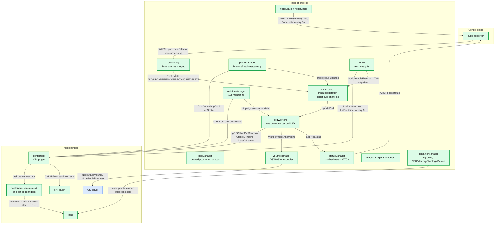

**What to notice**

- `syncLoop` is the only place channels are read; every subsystem is a *producer* into it. That single-consumer design is why a slow `HandlePodCleanups` (housekeeping) blocks new pod starts — hence the 1s `housekeepingWarningDuration` alarm. **[documented]**
- PLEG and probes both reach the runtime independently of podWorkers, so runtime latency shows up in three different metrics.
- `statusManager` is the only writer of pod status to the API server; podWorkers never PATCH directly. This is what makes status writes batchable.
- The lease path (`NL`) is deliberately separate from the status path: a 40s-timeout liveness signal must not be coupled to a 5-minute status write.
- Nothing in kubelet talks to `runc`. The chain is kubelet → containerd → shim → runc, and each hop is a different IPC mechanism (gRPC, ttrpc, exec+pipe).

---

## 3. Data flow

### 3.1 Pod create path

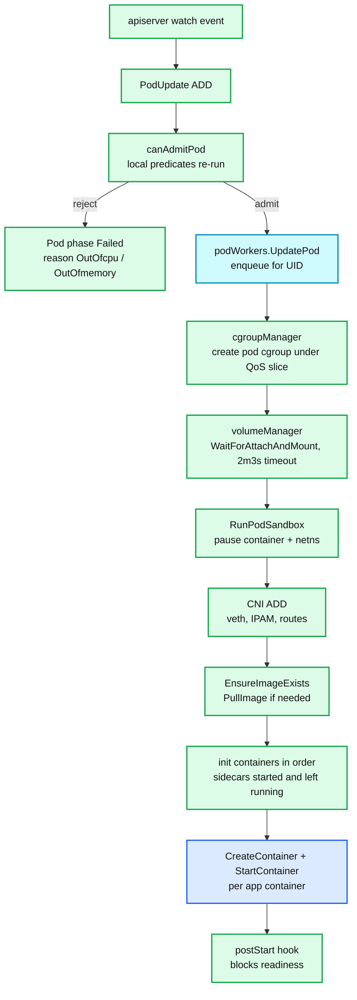

**What to notice**

- Admission runs **on the node again**, after the scheduler already decided. The node has information the scheduler does not: actual allocatable after `--kube-reserved`, device plugin availability, topology alignment. A pod can be scheduled and then locally rejected with `OutOfcpu`. **[documented]**
- The pod cgroup is created **before** any container exists, so limits are in force from the first `clone(2)`.
- Volumes are mounted before the sandbox, but the network is attached *inside* `RunPodSandbox` — CNI is the runtime's job, not kubelet's, since dockershim was removed.
- Image pull happens *after* the sandbox exists. A sandbox stuck on CNI therefore delays every image pull for that pod.
- Sidecars (restartable init containers, `restartPolicy: Always` on an init container) do **not** block the next init container on completion — only on `Started`. `SidecarContainers` is GA and locked since v1.33. **[documented]**

### 3.2 Status report path

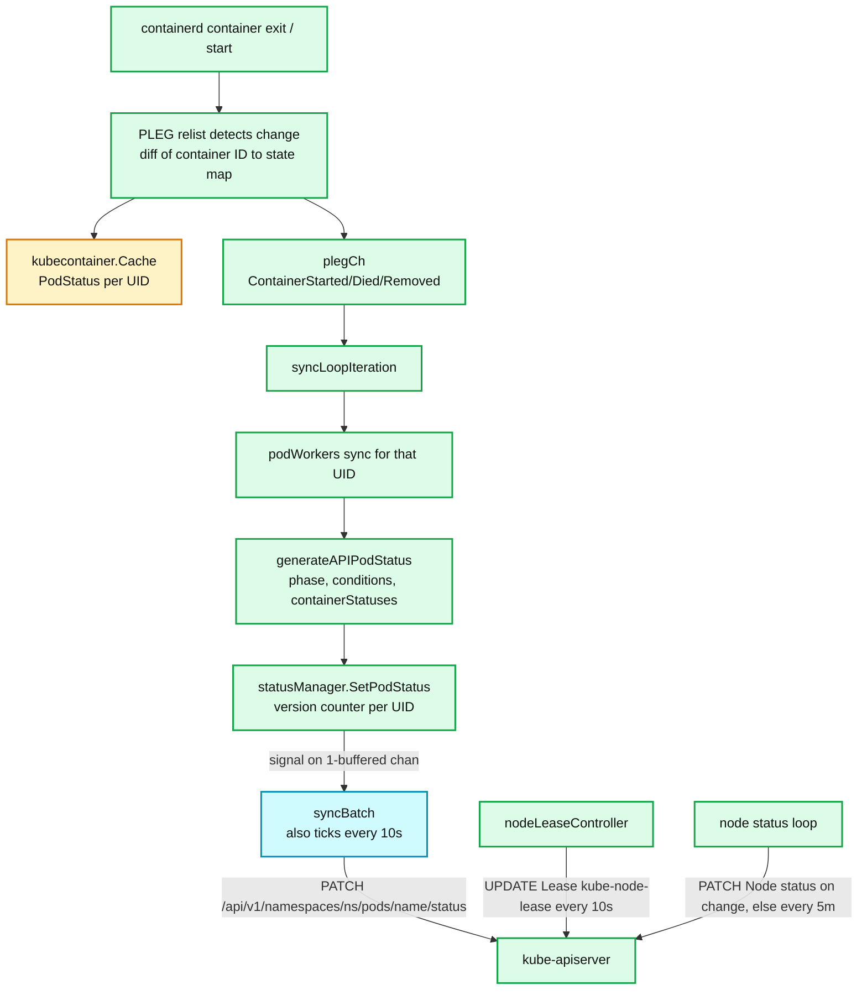

**What to notice**

- `statusManager` keeps `apiStatusVersions map[MirrorPodUID]uint64` and drops a write whose version the API server already has — this is the batching mechanism, not a timer. **[documented]**
- `podStatusChannel` is `chan struct{}` with capacity 1: a coalescing doorbell, so N status changes between ticks collapse into one `syncBatch`. **[documented]**
- The 10s `syncPeriod` in `status_manager.go` is a *floor* for reconciliation, distinct from `--node-status-update-frequency` (also 10s) which governs node objects. **[documented]**
- Lease renew interval is derived: `nodeLeaseRenewIntervalFraction = 0.25` × `nodeLeaseDurationSeconds` (40) = 10s. Failed renews retry with backoff from 200ms capped at 7s. **[documented]**
- Full `Node.status` writes are 5-minutely (`nodeStatusReportFrequency: "5m"`) *unless something changed* — a condition flip forces an immediate write. This is why `MemoryPressure` propagates in seconds even though status writes are nominally 5m apart. **[documented]**

---

## 4. Sequence of operations

### 4.1 Pod creation: watch event → running container

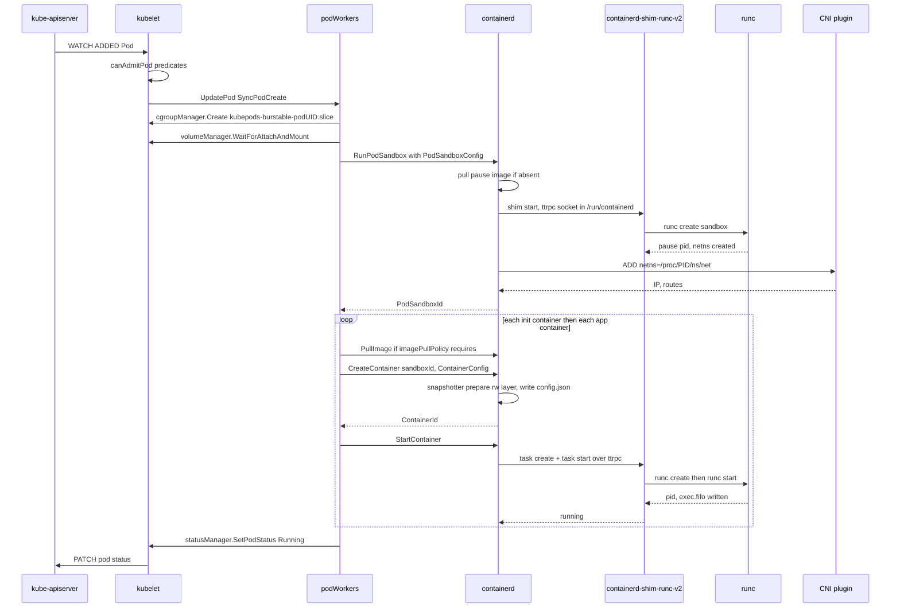

**What to notice**

- `RunPodSandbox` is one CRI call but internally does shim launch, `runc` invocation, and CNI ADD — most "pod stuck in ContainerCreating" incidents live inside this single RPC. **[documented]**
- The shim is started **once per sandbox** and then reused for every container in the pod via ttrpc `task` calls.
- `CreateContainer` and `StartContainer` are separate RPCs deliberately: kubelet can create, then apply resource updates, then start.
- `runc create` + `runc start` is a two-stage split so the container process exists (namespaces, cgroups, seccomp applied) but blocks on `exec.fifo` until started — that is how "created" is a real, observable state.
- Everything after sandbox creation is serialized by the pod worker. Two containers in a pod never start concurrently.

### 4.2 Image pull

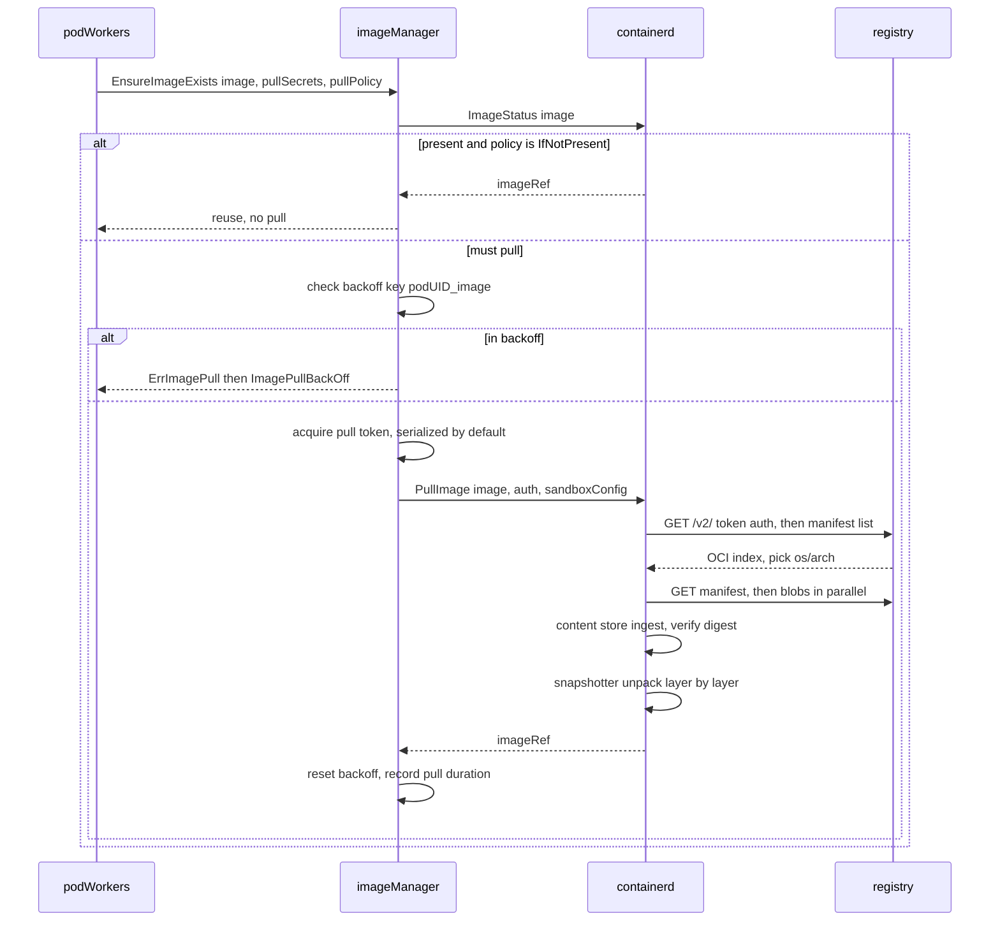

**What to notice**

- Back-off is keyed `podUID_image`, so two pods pulling the same failing image back off independently. Base 10s (`imageBackOffPeriod`), cap 300s (`MaxImageBackOff`). **[documented]**
- `--serialize-image-pulls` defaults **true**, which means one pull at a time per node. `maxParallelImagePulls` (default `nil` = unlimited) can only be set when `serializeImagePulls: false`. **[documented]**
- Layer *download* is parallel inside containerd even when kubelet serializes *pulls*; the serialization is at the CRI `PullImage` boundary.
- Unpack is sequential per image and is usually disk-bound, not network-bound, on large images.
- v1.34 added `KubeletServiceAccountTokenForCredentialProviders` (beta, on by default) so credential providers can use a SA-bound token instead of node-wide credentials. **[documented]**

### 4.3 Probe failure and restart

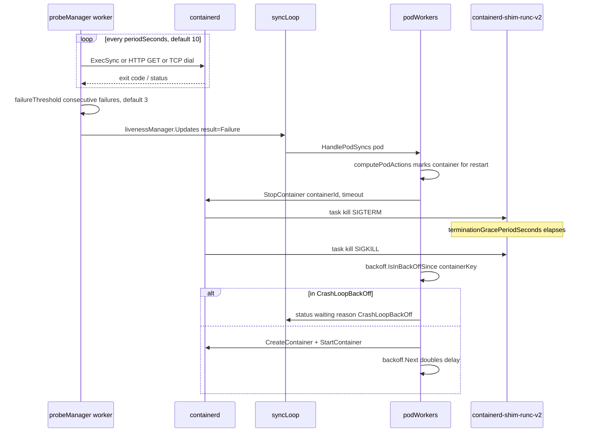

**What to notice**

- A liveness failure does not kill the container directly; it publishes a result that wakes `syncLoop`, which reruns the whole pod sync. Restart is a *derived* action of `computePodActions`. **[documented]**
- Backoff is per-container-key and exponential from `initialCrashLoopBackOff = 10s` to `MaxCrashLoopBackOff = 300s` in v1.34. **[documented]**
- Alpha `ReduceDefaultCrashLoopBackOffDecay` (from v1.33) changes those to **1s initial / 60s max**; `KubeletCrashLoopBackOffMax` (alpha in 1.32–1.34, beta from 1.35) exposes `crashLoopBackOff.maxContainerRestartPeriod` (1s–300s). Neither is on by default in v1.34. **[documented]**
- Readiness failures do **not** restart anything — they flip `Ready` via `statusManager.SetContainerReadiness`, which removes the pod from Endpoints.
- Startup probes suppress liveness and readiness entirely until they succeed once; `failureThreshold × periodSeconds` is the real slow-start budget.

### 4.4 Graceful deletion with preStop

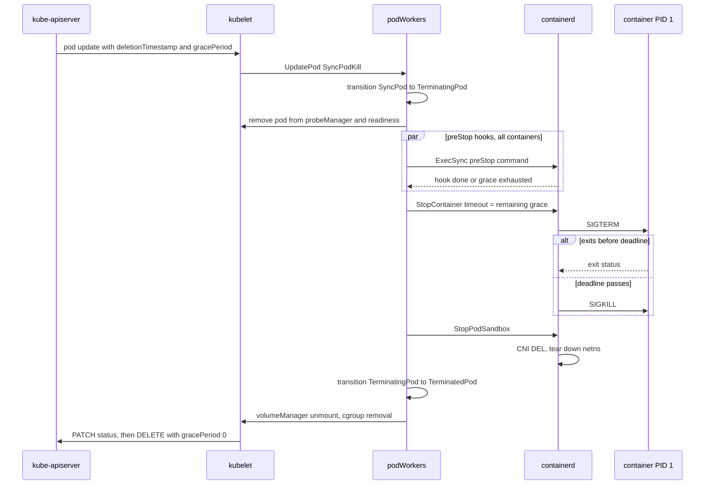

**What to notice**

- `preStop` runs **inside** `terminationGracePeriodSeconds`, not in addition to it. A 20s preStop with a 30s grace leaves 10s for SIGTERM. **[documented]**
- The pod is removed from Endpoints via readiness *before* SIGTERM, but that removal is asynchronous across kube-proxy on every node — the classic source of 500s during rollout, and why a `sleep` preStop is still common practice.
- Only when `SyncTerminatedPod` returns without error is the pod "finished on the node"; only then does kubelet send the final `DELETE` with grace 0 that actually removes the API object. **[documented]**
- Sidecars are terminated **after** the main containers, in reverse order — that is the point of KEP-753.
- `StopPodSandbox` is what runs CNI DEL; a failing CNI DEL leaves the pod stuck terminating even though all containers are dead.

### 4.5 Eviction under memory pressure

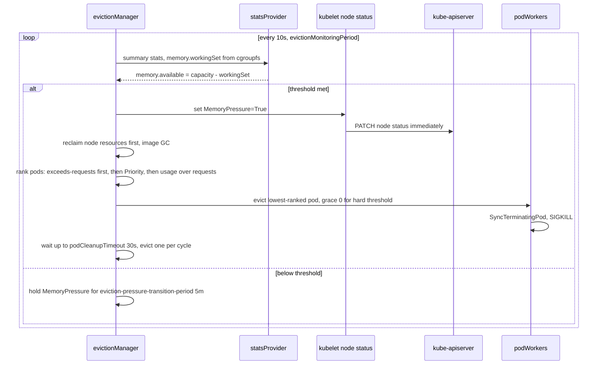

**What to notice**

- Eviction evicts **one pod per monitoring cycle** and re-measures — it is deliberately not a batch reclaim. **[inferred from `eviction_manager.go` synchronize loop]**
- Hard thresholds use grace period **0**; soft thresholds use `min(eviction-soft-grace-period, eviction-max-pod-grace-period)`, and if `eviction-max-pod-grace-period` is unset, pods are killed immediately anyway. **[documented]**
- Node-level reclaim (dead containers, unused images) is attempted *before* any pod dies.
- `MemoryPressure=True` is written immediately, not on the 5m cadence; the control plane maps it to `node.kubernetes.io/memory-pressure:NoSchedule`. **[documented]**
- The 5m `eviction-pressure-transition-period` is one-directional damping: it delays clearing the condition, keeping the taint on a flapping node.

---

## 5. State machines

### 5.1 Pod worker

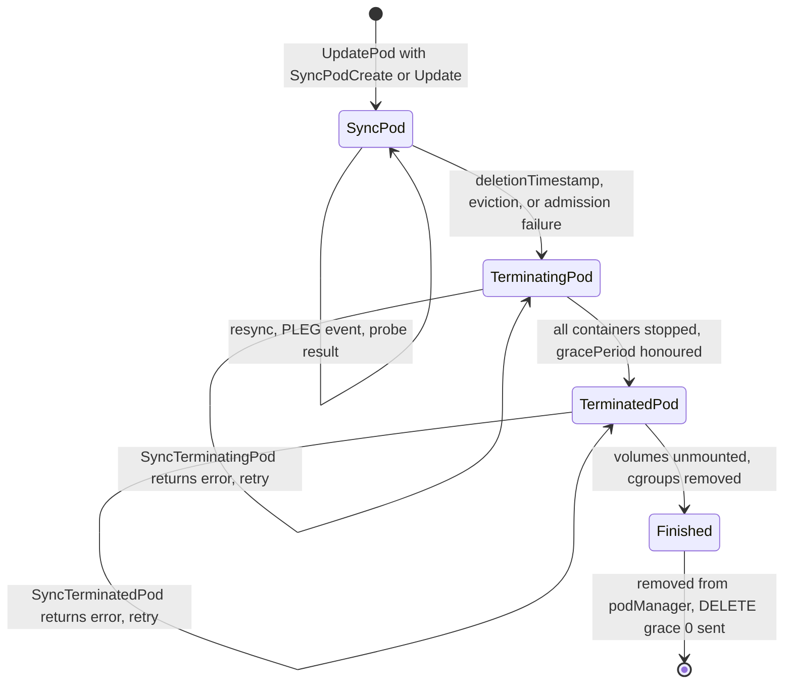

**What to notice**

- The three states are the literal `PodWorkerState` enum: `SyncPod`, `TerminatingPod`, `TerminatedPod`. **[documented]**
- Transitions are one-way. A pod that entered `TerminatingPod` can never return to `SyncPod`, even if the delete is somehow retracted — this is why "recreate with same name" gets a new UID and a new worker.
- Each phase has its own retry loop with `backOffPeriod` (10s, jittered) — a wedged unmount retries forever in `TerminatedPod`, which is exactly the "pod stuck Terminating" shape.
- `Finished` is not an enum value; it is `ShouldPodBeFinished()` returning true. **[inferred]**
- A static pod's mirror pod is deleted in the terminated phase, which is why `kubectl get pod` can show a control-plane static pod gone while the container still runs.

### 5.2 Container

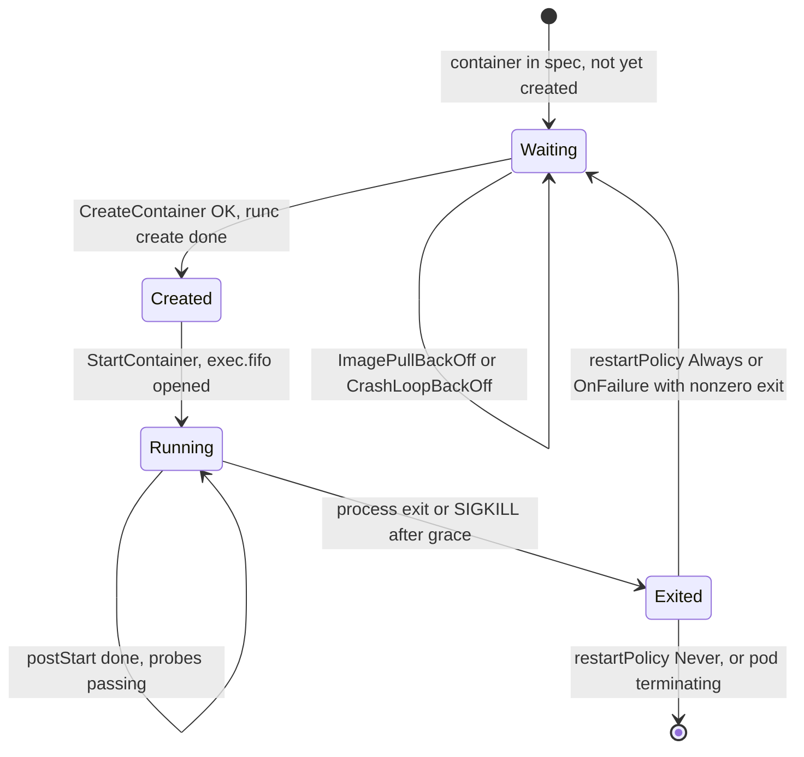

**What to notice**

- `Created` is real and observable: `runc create` has applied namespaces, cgroups, seccomp and pivoted root, but PID 1 is blocked reading `exec.fifo`. **[documented]**
- CRI reports only `CONTAINER_CREATED`, `CONTAINER_RUNNING`, `CONTAINER_EXITED`, `CONTAINER_UNKNOWN` — kubelet synthesizes `Waiting` from the absence of a container plus a backoff record. **[documented]**
- An OOM kill lands in `Exited` with reason `OOMKilled` and exit code 137; it is `restartPolicy` that decides what happens next, not the eviction manager.
- `ContainerRestartRules` (alpha in v1.34, beta v1.35) adds per-exit-code restart rules, breaking the assumption that `restartPolicy` is pod-wide. **[documented]**
- The dead container is *retained* until container GC (`ContainerGCPeriod` 1m, `minDeadContainerInPod` 1) so `kubectl logs --previous` works.

### 5.3 Node conditions and lease

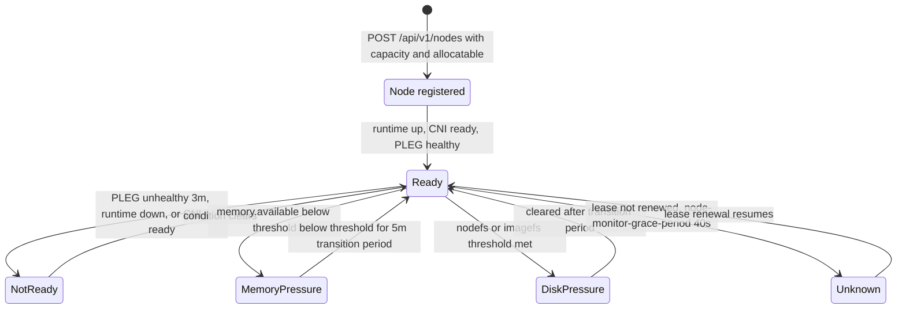

**What to notice**

- `Ready=Unknown` is written by **node-lifecycle-controller** in the control plane after the lease goes stale, not by kubelet. kubelet writing `NotReady` and the controller writing `Unknown` are two different failure signatures. **[documented]**
- The lease is the liveness signal (40s budget, 10s renew); the `Node.status` write is the *content* signal (5m). Separating them is what made 5000-node clusters affordable. **[documented]**
- `PLEG is not healthy` fires when the last successful relist is older than `genericPlegRelistThreshold = 3m`, and flips `Ready=False`. **[documented]**
- Pressure conditions and `Ready` are orthogonal — a node can be `Ready=True` and `MemoryPressure=True` simultaneously, which is exactly when the scheduler taint matters.
- `--node-status-max-images` (default 50) caps the image list in status; without it, node objects on image-heavy nodes bloat etcd. **[documented]**

---

## 6. Component deep dives

### 6.1 syncLoop and podWorkers

**Responsibility.** `syncLoop` is the single consumer of all node events; `podWorkers` is the per-pod serializer that owns actual pod state.

**Interfaces.** `syncLoopIteration(ctx, configCh, handler, syncCh, housekeepingCh, plegCh)` selects over: `configCh` (`PodUpdate`), `plegCh`, `syncCh` (`--sync-frequency`, 1m), `livenessManager.Updates()`, `readinessManager.Updates()`, `startupManager.Updates()`, `containerManager.Updates()` (device reallocation), and `housekeepingCh` (`housekeepingPeriod = 2s`). **[documented]**

**Data structures.**
- `podManager`: authoritative desired set, keyed by UID, plus the static-pod → mirror-pod mapping.
- `podWorkers.podSyncStatuses map[types.UID]*podSyncStatus`: `startedAt`, `terminatingAt`, `terminatedAt`, `gracePeriod`, `activeUpdate`, `working`, `pendingUpdate`.
- A one-slot pending update per pod: a burst of N updates while a worker is busy collapses into the newest. **[documented]**

**Concurrency model.** One goroutine per pod UID, created on first `UpdatePod`, exiting only when the pod is finished and removed. Sync errors requeue via `workQueue.Enqueue(uid, wait.Jitter(backOffPeriod, jitterFactor))` with `backOffPeriod = 10s`. **[documented]**

**Failure handling.** If `runtimeState.runtimeErrors()` is non-nil, the whole `syncLoop` sleeps with exponential backoff 100ms → 5s and skips *all* pod synchronization — a runtime outage freezes reconciliation globally rather than producing partial state. **[documented]**

**Production knobs.** `--sync-frequency` 1m, `--max-pods` 110, `--pods-per-core` 0 (disabled), `--runtime-request-timeout` 2m. **[documented]**

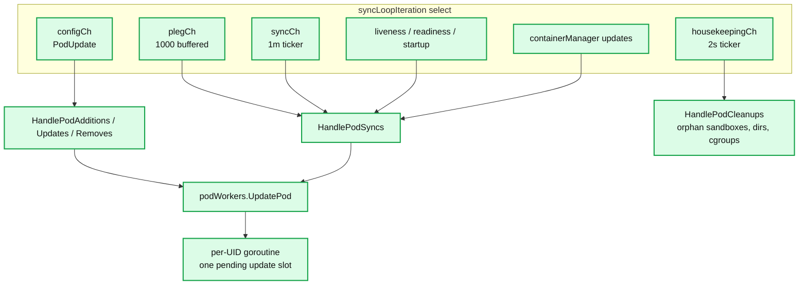

**What to notice**

- Go `select` picks pseudorandomly among ready channels — there is no priority between a delete and a probe result. **[documented]**
- `housekeepingCh` at 2s with a 1s warning threshold is the tightest budget in kubelet; `HandlePodCleanups` blocks pod starts while it runs.
- The 1000-slot PLEG channel is the shock absorber for a slow `syncLoop`; overflow is counted by `kubelet_pleg_discard_events`.
- `HandlePodCleanups` is what removes orphaned sandboxes and `/var/lib/kubelet/pods/<uid>` directories after a kubelet restart.
- Admission failures are terminal: the pod goes to `Failed` locally and is never retried on that node.

### 6.2 PLEG

**Responsibility.** Detect container state changes the API server never told kubelet about (crashes, OOM kills, runtime-side restarts) and turn them into `PodLifecycleEvent`s.

**Algorithm (generic PLEG).** Every `genericPlegRelistPeriod = 1s`: call `ListPodSandbox` + `ListContainers` (via `GetPods(all=true)`), build `map[containerID]plegContainerState`, diff against the previous map, emit `ContainerStarted`/`ContainerDied`/`ContainerRemoved`/`ContainerChanged`, and for pods with changes call `PodSandboxStatus` + `ContainerStatus` to refresh `kubecontainer.Cache`. **[documented]**

**Health.** `Healthy()` returns an error when `now - relistTime > genericPlegRelistThreshold = 3m` — surfaced as the `PLEG is not healthy` NodeReady=False. `--runtime-request-timeout` 2m means a single hung CRI call can consume most of that budget. **[documented]**

**Evented PLEG (KEP-3386).** Adds CRI `GetContainerEvents(GetEventsRequest) returns (stream ContainerEventResponse)`. When enabled, generic PLEG is kept as a **safety net** but slowed to `eventedPlegRelistPeriod = 300s` with `eventedPlegRelistThreshold = 10m`; the evented path uses the 1s period as its fallback relist. Max 5 stream reconnect retries (`eventedPlegMaxStreamRetries`), after which it falls back to generic PLEG. **[documented]**

**Maturity — the important part.** `EventedPLEG` is **still alpha, default false, since v1.26** in the v1.34-era gate table. It was beta-with-default-off in v1.27 and was *demoted* back to alpha after correctness bugs (notably containerd 2.0 adaptation, k/k #129990). Treat it as not production-ready in v1.34. **[documented]**

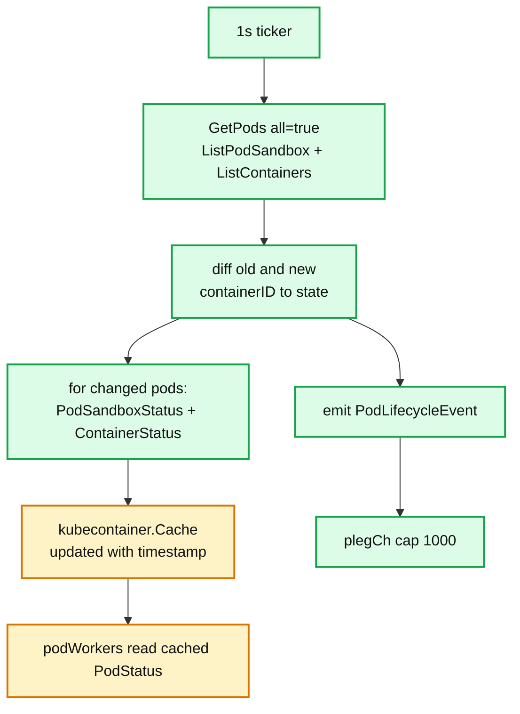

**What to notice**

- Cost is O(containers on node) per second, and each changed pod triggers extra per-container status RPCs — this is the quadratic-feeling term that made 110 pods a practical ceiling on slow runtimes. **[inferred]**
- `kubelet_pleg_relist_duration_seconds` p99 approaching 1s means relists overlap; approaching 180s means the node is about to go NotReady.
- The cache carries a timestamp; podWorkers wait for a cache entry *newer* than the event they are handling, so a stale relist stalls syncs.
- PLEG polls rather than subscribing because CRI originally had no event stream and dockershim could not provide one reliably.
- Evented PLEG does not remove polling — it demotes it to a 5-minute reconciliation, keeping correctness if events are lost.

### 6.3 CRI client

**Interfaces.** Two gRPC services on one socket (`--container-runtime-endpoint`, default `unix:///run/containerd/containerd.sock`; `--image-service-endpoint` defaults to the same). The v1.34 `RuntimeService` surface: `Version`, `RunPodSandbox`, `StopPodSandbox`, `RemovePodSandbox`, `PodSandboxStatus`, `ListPodSandbox`, `CreateContainer`, `StartContainer`, `StopContainer`, `RemoveContainer`, `ListContainers`, `ContainerStatus`, `UpdateContainerResources`, `ReopenContainerLog`, `ExecSync`, `Exec`, `Attach`, `PortForward`, `ContainerStats`, `ListContainerStats`, `PodSandboxStats`, `ListPodSandboxStats`, `UpdateRuntimeConfig`, `Status`, `CheckpointContainer`, `GetContainerEvents`, `ListMetricDescriptors`, `ListPodSandboxMetrics`, `RuntimeConfig`, `UpdatePodSandboxResources`. `ImageService`: `ListImages`, `ImageStatus`, `PullImage`, `RemoveImage`, `ImageFsInfo`. **[documented — verified against `release-1.34` `api.proto`]**

> Post-1.34 the proto gains `StreamContainers`, `StreamPodSandboxes`, `StreamContainerStats`, `StreamPodSandboxStats`, `StreamPodSandboxMetrics`, `StreamImages`, `CheckpointPod`, `RestorePod`. Do not assume these in a 1.34 cluster. **[documented]**

**Streaming redirect.** `Exec`, `Attach`, `PortForward` are *not* data-carrying RPCs. They return a **URL** to a streaming server hosted by the runtime; kubelet then redirects or proxies the client to it. `ExecSync` is the only synchronous one and is what probes use. `--streaming-connection-idle-timeout` defaults to 4h. **[documented]**

**Sandbox and pause.** `RunPodSandbox` creates the namespaces that containers join. In containerd this is the `pause` container — `registry.k8s.io/pause:3.10.1` for the 1.34 tree — a static ~700KB binary whose entire job is to `pause()` and reap zombies as PID 1 of the pod's PID namespace. It holds the network namespace open so app containers can crash and restart without losing the pod IP. **[documented]**

**On-wire format.** gogo-protobuf over gRPC over a Unix socket, `runtime.v1` package. Version negotiation via `Version()`; `v1alpha2` was removed in Kubernetes 1.26 and containerd 2.0. **[documented]**

**Failure handling.** Every call is bounded by `--runtime-request-timeout` (2m). `kubelet_runtime_operations_errors_total` by `operation_type` is the first metric to check when pods hang.

**What to notice**

- `UpdateContainerResources` is what makes In-Place Pod Resize possible without a restart; `UpdatePodSandboxResources` (added for pod-level resources) updates the sandbox cgroup. **[documented]**
- `RuntimeConfig` is how the runtime tells kubelet its cgroup driver — the basis of `KubeletCgroupDriverFromCRI`, **GA in v1.34**. **[documented]**
- `CheckpointContainer` (CRIU-based) exists but is alpha and containerd support is partial.
- `ContainerStats`/`PodSandboxStats` are the CRI-native replacement for embedded cAdvisor; `PodAndContainerStatsFromCRI` moves the summary API onto them.
- All calls are per-container/per-pod; there is no transactional "create pod" RPC, which is why partial pod state after a crash is normal and cleanup is idempotent by design.

### 6.4 containerd

**Daemon shape.** containerd is a plugin host. `/etc/containerd/config.toml` (version 3 in containerd 2.x) loads plugins by ID: `io.containerd.content.v1.content`, `io.containerd.metadata.v1.bolt`, `io.containerd.snapshotter.v1.overlayfs`, `io.containerd.runtime.v2.task`, `io.containerd.grpc.v1.cri` (split in containerd 2.0 into `io.containerd.cri.v1.runtime` and `io.containerd.cri.v1.images`). **[documented]**

**On-disk layout** (`root = /var/lib/containerd`): **[documented]**

```
/var/lib/containerd/
├── io.containerd.content.v1.content/{blobs,ingest}   # content-addressed layer blobs
├── io.containerd.metadata.v1.bolt/meta.db            # boltdb: images, containers, leases, snapshots
├── io.containerd.runtime.v2.task/<ns>/               # per-task bundle metadata
└── io.containerd.snapshotter.v1.overlayfs/{metadata.db,snapshots}
```

**Ephemeral state** (`state = /run/containerd`): `containerd.sock`, `debug.sock`, and per-task bundles `io.containerd.runtime.v2.task/<ns>/<id>/{config.json,init.pid,log.json,rootfs/}`. Kubernetes containers live in the `k8s.io` namespace. **[documented]**

**Content store + snapshotters.** Layers are stored as content-addressed blobs; a snapshotter turns them into filesystem *snapshots*. overlayfs is default: each layer is a directory, the container rootfs is an overlay mount with the image layers as `lowerdir` and a fresh `upperdir` as the writable layer. Alternatives: `btrfs`, `zfs`, `devmapper`, and `stargz`/`nydus` for lazy pulling.

**The shim.** `containerd-shim-runc-v2`, **one per pod sandbox** in Kubernetes (grouping via the `io.kubernetes.cri.sandbox-id` annotation). It speaks **ttrpc** (a protobuf RPC with no HTTP/2 framing, for low memory) on a socket in `/run/containerd`. It:
- is the parent of container processes and reaps them,
- holds stdio FIFOs and writes the CRI log file `/var/log/pods/<ns>_<pod>_<uid>/<container>/<n>.log`,
- **survives containerd restarts** — containerd reconnects to the shim's socket and re-reads task state. This is the entire reason for the shim's existence: upgrading or crashing containerd must not kill running pods. **[documented]**

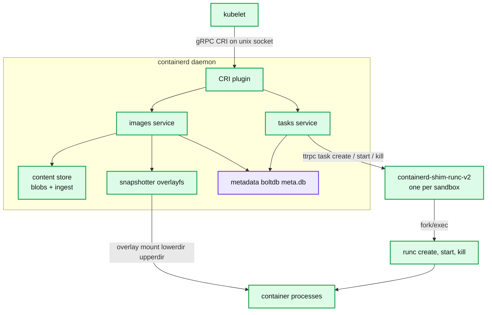

**What to notice**

- Killing containerd does not kill pods; killing the shim kills that pod's containers. Blast radius is one sandbox.
- boltdb `meta.db` is a single-writer B+tree — heavy image churn serializes on it. **[inferred]**
- `config.json` in the bundle is the OCI runtime spec; reading it is the fastest way to see the exact namespaces, mounts, seccomp and cgroup path a container got.
- CRI-O uses `conmon` for the same role, with one conmon per *container* rather than per sandbox.
- containerd 2.0 removed CRI `v1alpha2` and config version 2 support paths, so a containerd 2.x upgrade requires Kubernetes ≥ 1.26.

### 6.5 runc and cgroups

**runc's two-stage start.** `runc create` → parent writes the container config, `clone(2)`s into new namespaces via the `nsexec` C constructor (which runs before the Go runtime starts threads, because `setns`/`unshare` on a multithreaded process is unsafe), then `runc init` inside the container: applies cgroups, mounts, `pivot_root(2)` into the new rootfs, sets capabilities, seccomp filter, AppArmor/SELinux label, `no_new_privs`, then blocks reading `exec.fifo`. `runc start` opens the FIFO's write end, unblocking `execve(2)` of the entrypoint. **[documented]**

**Namespaces created:** `mnt`, `pid`, `ipc`, `uts`, `net`, `cgroup`, optionally `user` (`UserNamespacesSupport` — beta default-on since v1.33). In Kubernetes, containers in a pod **share** the sandbox's `net`, `ipc`, `uts` namespaces (and `pid` if `shareProcessNamespace`), and get their own `mnt` and `pid`. **[documented]**

**Why `pivot_root` not `chroot`:** `chroot` is escapable from a process holding an open fd on an outer directory; `pivot_root` plus unmounting the old root removes the outer mount tree entirely.

**cgroup layout (systemd driver, cgroup v2):** **[documented]**

```
/sys/fs/cgroup/kubepods.slice/
├── kubepods-besteffort.slice/kubepods-besteffort-pod<uid>.slice/cri-containerd-<cid>.scope
├── kubepods-burstable.slice/kubepods-burstable-pod<uid>.slice/...
└── kubepods-pod<uid>.slice/...            # Guaranteed pods sit directly under kubepods.slice
```

With `cgroupfs` driver the same tree is `/sys/fs/cgroup/kubepods/{besteffort,burstable}/pod<uid>/<cid>`.

**Requests and limits → cgroup files:**

| Spec field | cgroup v1 | cgroup v2 |
|---|---|---|
| `cpu.request` | `cpu.shares` = `millicores × 1024 / 1000` (min 2) | `cpu.weight` = `(shares × 9999 / 262142) + 1` |
| `cpu.limit` | `cpu.cfs_quota_us` / `cpu.cfs_period_us` (100000µs) | `cpu.max "<quota> 100000"` |
| `memory.request` | none (scheduling only) | `memory.min`/`memory.low` only under MemoryQoS |
| `memory.limit` | `memory.limit_in_bytes` | `memory.max` |
| — | — | `memory.high` when `memoryThrottlingFactor` set (MemoryQoS) |

**QoS classes.** `Guaranteed` = every container sets requests == limits for cpu *and* memory. `BestEffort` = no requests or limits anywhere. `Burstable` = everything else. QoS determines cgroup placement and `oom_score_adj`: **[documented]**

| QoS | `oom_score_adj` |
|---|---|
| Guaranteed | −997 |
| Burstable | `min(max(2, 1000 − (1000 × memRequest / machineMemory)), 999)` |
| BestEffort | 1000 |

`system-node-critical` priority pods also get −997.

**CFS throttling.** With a limit set, the container gets a quota per 100ms period. A burst that exhausts quota is *stalled to the end of the period*, showing up as `nr_throttled` in `cpu.stat` and as p99 latency spikes — the single most common "CPU limit hurts more than it helps" production finding. `DisableCPUQuotaWithExclusiveCPUs` (beta, default on since 1.33) removes CFS quota from containers with exclusive CPUs under the static policy. **[documented]**

**OOM.** cgroup v2 sets `memory.oom.group=1` by default so the whole container cgroup dies together; `singleProcessOOMKill: true` restores cgroup-v1-style per-process kills. **[documented]**

**Alternative runtimes.** `crun` (C, faster start, lower memory), `youki` (Rust), `gVisor`/`runsc` (userspace kernel intercepting syscalls via ptrace or KVM — big syscall overhead, strong isolation), `Kata Containers` (a real VM per pod via QEMU/Cloud Hypervisor, `kata-runtime` as a shim). Selected per-pod with `runtimeClassName` → CRI `runtime_handler` → containerd `[plugins.'io.containerd.cri.v1.runtime'.containerd.runtimes.<name>]`. **[documented]**

**What to notice**

- `nsexec` running as a C constructor before Go's runtime is the subtlest correctness detail in runc; it is why runc cannot simply be rewritten in idiomatic Go.
- The systemd driver exists because two writers to the same cgroup tree (systemd and kubelet) diverge; `KubeletCgroupDriverFromCRI` GA in 1.34 finally removes the manual-mismatch failure mode. **[documented]**
- Guaranteed pods sit directly under `kubepods.slice`, not under a QoS sub-slice — there is no `kubepods-guaranteed.slice`.
- `oom_score_adj` is set per *container*, so the kernel picks a victim inside the pod; it is not a pod-level decision.
- Memory requests do nothing at runtime in the default configuration. Only limits and eviction protect memory; that asymmetry with CPU surprises people constantly.

### 6.6 volumeManager

**Responsibility.** Reconcile mounted volumes on the node against the volumes the running pods need.

**Data structures.** `desiredStateOfWorld` (populated from `podManager` every 100ms) and `actualStateOfWorld` (what is attached/mounted). The `reconciler` loop runs every `reconcilerLoopSleepPeriod = 100ms` and issues attach/mount/unmount/detach operations through `operationexecutor`, which serializes per volume with `nestedpendingoperations`. **[documented]**

**Timeouts.** `WaitForAttachAndMount` blocks up to `podAttachAndMountTimeout = 2m3s` (deliberately offset from 2m so the timeout is recognizable in logs), polling every 300ms; a single attach waits up to `waitForAttachTimeout = 10m`. **[documented]**

**On-disk.** `/var/lib/kubelet/pods/<pod-uid>/volumes/<plugin>/<volume>` and `/var/lib/kubelet/plugins/<driver>/` for CSI sockets; the driver registers via the kubelet plugin registration socket at `/var/lib/kubelet/plugins_registry/`.

**Failure handling.** Reconciler retries forever with exponential backoff per volume. Unmount failures block the pod worker's `TerminatedPod` phase — the canonical "pod stuck Terminating with no containers" case.

**Knobs.** `--root-dir` `/var/lib/kubelet`, `--volume-plugin-dir` `/usr/libexec/kubernetes/kubelet-plugins/volume/exec/`. **[documented]**

### 6.7 probeManager

**Responsibility.** Run liveness, readiness, and startup probes; publish results into `syncLoop`.

**Model.** One `worker` goroutine per (pod, container, probe type), each on its own `periodSeconds` ticker. Results go into a `resultsManager` per probe type, whose `Updates()` channel `syncLoop` selects on. **[documented]**

**Probe handlers.** `exec` → CRI `ExecSync` (a real process in the container — the most expensive probe by far); `httpGet` → an HTTP client in kubelet against the pod IP; `tcpSocket` → a dial; `grpc` → the standard gRPC health checking protocol (GA since 1.27).

**Defaults.** `initialDelaySeconds: 0`, `periodSeconds: 10`, `timeoutSeconds: 1`, `successThreshold: 1`, `failureThreshold: 3`. `terminationGracePeriodSeconds` can be overridden per probe. **[documented]**

**What to notice**

- `timeoutSeconds: 1` is too tight for most `exec` probes; an exec probe costs a container fork through the whole CRI/shim/runc path.
- Startup probes gate both other probes, which is the correct fix for slow-starting apps — not a large `initialDelaySeconds` on liveness.
- Probe failures are edge-triggered into `syncLoop`, so a flapping probe generates pod syncs at probe frequency.

### 6.8 evictionManager

**Responsibility.** Keep the node alive by killing pods before the kernel does.

**Algorithm.** Every `evictionMonitoringPeriod = 10s`: fetch summary stats, compute each signal, compare against hard and soft thresholds, set/clear node conditions with 5m transition damping, attempt node-level reclaim, then rank and evict **one** pod, waiting up to `podCleanupTimeout = 30s`. **[documented]**

**Signals.** `memory.available` (= `capacity − workingSet`, from cgroupfs, excluding `inactive_file`), `nodefs.available`, `nodefs.inodesFree`, `imagefs.available`, `imagefs.inodesFree`, `containerfs.available`, `containerfs.inodesFree`, `pid.available`, `allocatableMemory.available`. **[documented]**

**Default hard thresholds** (from `KubeletConfiguration` defaults): **[documented]**

```yaml
evictionHard:
  memory.available:  "100Mi"
  nodefs.available:  "10%"
  nodefs.inodesFree: "5%"
  imagefs.available: "15%"
```

Docs additionally list `imagefs.inodesFree<5%`. Setting *any* `evictionHard` key replaces the whole map with zeros for unset keys unless `MergeDefaultEvictionSettings: true` — a very common misconfiguration. **[documented]**

**Ranking.** (1) usage exceeds requests, (2) Pod Priority, (3) usage relative to requests. So `BestEffort`/`Burstable` over requests die first, ordered by Priority then by overage; `Guaranteed` and under-request `Burstable` die last, ordered by Priority. For inode and PID starvation, Priority alone is used because there are no requests for those. **[documented]**

**Allocatable.** `Allocatable = Capacity − kube-reserved − system-reserved − eviction-hard(memory)`. `--enforce-node-allocatable` defaults to `["pods"]`, meaning kubelet sets a limit on `kubepods.slice` itself. **[documented]**

**Eviction vs the OOM killer.**

| | kubelet eviction | kernel OOM killer |
|---|---|---|
| Trigger | 10s polled threshold | instantaneous allocation failure |
| Unit killed | whole pod | one container cgroup (or one process) |
| Ordering | requests/Priority/overage | `oom_score` + `oom_score_adj` |
| Aftermath | pod ends `Failed`, rescheduled elsewhere | container restarts in place per `restartPolicy` |
| Grace | soft thresholds honour grace | none |

The 10s poll is a real gap: `--kernel-memcg-notification` uses memcg event notification to close it. **[documented]**

**What to notice**

- `active_file` counting against `memory.available` means heavy local-disk I/O can taint a node with `MemoryPressure` (k/k #43916). **[documented]**
- Node-level reclaim (image GC) runs *before* pods die — a disk-pressure node may quietly delete every unused image first.
- Evictions are API-visible as pods in `Failed` with reason `Evicted`; API-initiated eviction (`/eviction` subresource, PDB-respecting) is a completely different mechanism in the control plane.
- `HugepageAwareEviction` subtracts hugepage capacity from `memory.available`, fixing delayed evictions on hugepage nodes. **[documented]**

### 6.9 imageManager and image GC

**imageManager.** `EnsureImageExists` implements `imagePullPolicy` (`Always` / `IfNotPresent` / `Never`; defaulted to `Always` for `:latest`, `IfNotPresent` otherwise), resolves pull secrets and credential providers, enforces backoff, and calls CRI `PullImage`. Serialization is a token channel created when `serialized == true`. **[documented]**

**imageGC.** Runs every `ImageGCPeriod = 5m`. When image filesystem usage exceeds `imageGCHighThresholdPercent = 85`, delete unused images oldest-last-used-first until usage falls below `imageGCLowThresholdPercent = 80`. Images younger than `imageMinimumGCAge = 2m` are exempt. `imageMaximumGCAge` defaults to `"0s"` (disabled) and, when set, deletes images unused for that long regardless of disk pressure. **[documented]**

**containerGC.** `ContainerGCPeriod = 1m`, keeping `minDeadContainerInPod = 1` dead container per pod so `--previous` logs survive. The old `--maximum-dead-containers*` and `--minimum-container-ttl-duration` flags are deprecated in favour of eviction. **[documented]**

**Registry rate limits.** `--registry-qps` 5, `--registry-burst` 10. **[documented]**

**What to notice**

- Image GC and disk eviction share the same `imagefs` signal, so image GC is also the first reclaim step under `DiskPressure`.
- `KubeletEnsureSecretPulledImages` (alpha 1.33–1.34, beta 1.35) closes the long-standing hole where a pod without pull secrets could use an image another pod had already pulled. **[documented]**
- Serialized pulls protect a shared NIC but make a 50-pod node with 50 distinct images a strictly sequential startup.
- `kubelet_image_pull_duration_seconds` is bucketed by image size, which is the metric to graph before blaming the scheduler for slow starts.

### 6.10 Device, CPU, Memory, and Topology managers

All four live under `containerManager` and are consulted at admission and at container-create time; all four are *hints* into one `TopologyManager` decision.

**Device Plugin API.** A plugin registers over `/var/lib/kubelet/device-plugins/kubelet.sock`, then serves `ListAndWatch` (a server-stream of device health/IDs) and `Allocate` (returns env vars, device nodes, mounts to inject into the container). `GetPreferredAllocation` and `PreStartContainer` are optional. Plugin restarts are handled by re-registration; kubelet keeps a checkpoint at `/var/lib/kubelet/device-plugins/kubelet_internal_checkpoint`. **[documented]**

**CPU Manager.** `--cpu-manager-policy` default `none`. The `static` policy gives *exclusive* whole CPUs to containers in `Guaranteed` pods whose CPU request is an integer, taking them out of the shared pool by writing `cpuset.cpus`. Reconciles every `--cpu-manager-reconcile-period` 10s; state checkpointed at `/var/lib/kubelet/cpu_manager_state`. Policy options (`full-pcpus-only`, `distribute-cpus-across-numa`, `align-by-socket`, `strict-cpu-reservation`) are GA-gated by `CPUManagerPolicyOptions` (stable/locked since 1.33). **[documented]**

**Memory Manager.** `--memory-manager-policy` default `None`; the `Static` policy pins container memory to NUMA nodes and requires `reservedMemory` to be configured consistently with node allocatable.

**Topology Manager.** `--topology-manager-policy` default `none`; options `best-effort`, `restricted`, `single-numa-node`. `--topology-manager-scope` default `container`, alternative `pod`. It collects `TopologyHint` bitmasks from CPU, Memory, and Device managers, intersects them, and either admits the pod on an aligned NUMA node or rejects it with `TopologyAffinityError`. **[documented]**

**DRA on the node.** GA in v1.34 (`DynamicResourceAllocation` stable, default on). kubelet calls the driver's `DRAPlugin` service: `NodePrepareResources` before containers start and `NodeUnprepareResources` after they stop, over a socket in `/var/lib/kubelet/plugins/`. `KubeletPodResourcesDynamicResources` reaches beta in 1.34 so `PodResources` List/Get include DRA claims. **[documented]**

**In-Place Pod Resize (KEP-1287).** `InPlacePodVerticalScaling` is **beta, default on, in v1.33–v1.34**, and **GA/locked in v1.35**. kubelet applies changes via CRI `UpdateContainerResources` and reports `.status.resize`; memory *decreases* are the constrained case (cannot shrink below current usage without a restart). `resizePolicy` per container chooses `NotRequired` or `RestartContainer`. **[documented]**

**HugePages.** Exposed as `hugepages-2Mi` / `hugepages-1Gi` resources, must be pre-allocated on the node, requests must equal limits, and they are backed by `hugetlb` cgroup limits — not counted in `memory.limit`.

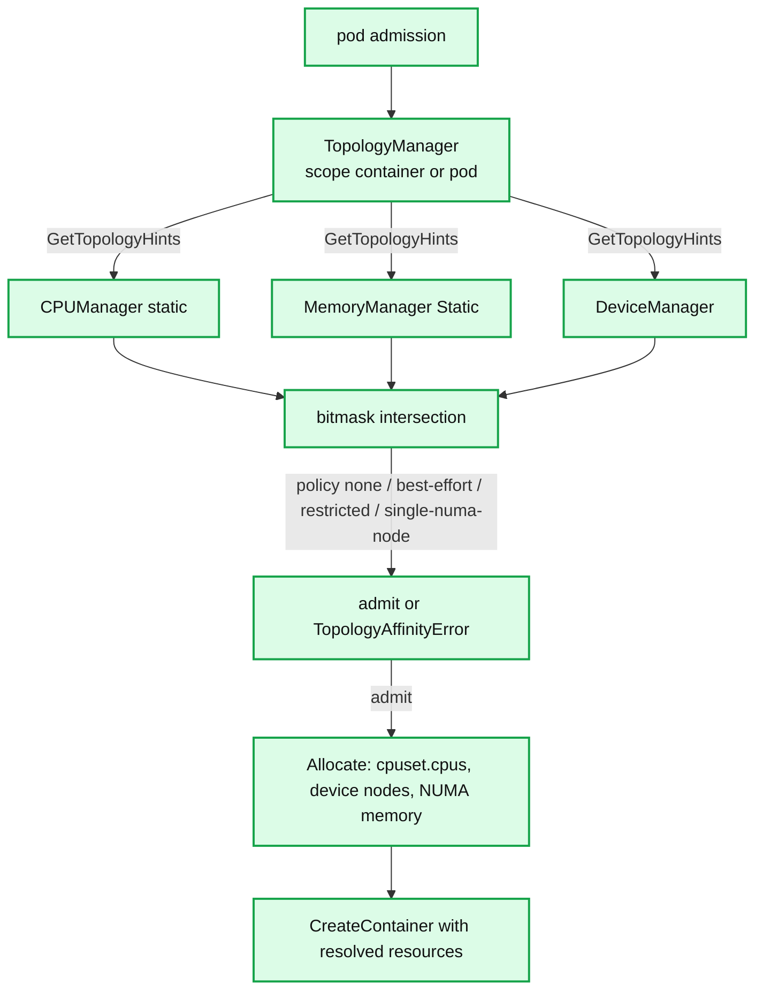

**What to notice**

- Topology alignment is an **admission-time** decision on the node; the scheduler has no NUMA view in v1.34, so a pod can be scheduled and then locally rejected — repeatedly, on every node.
- `single-numa-node` turns a NUMA-fragmented node into an unschedulable one for wide pods; `restricted` is the usual production compromise.
- CPU manager state is checkpointed because losing exclusive assignments across a kubelet restart would silently share pinned CPUs.
- DRA replaces the device plugin model for complex devices (partitionable GPUs, per-claim configuration) but does not remove it — both coexist in 1.34.

---

## 7. Guarantees

- **At-most-one pod worker per UID.** All actions for a pod are serialized; there is no interleaving of create and delete for the same UID. **[documented]**
- **Local admission is authoritative.** Once `canAdmitPod` rejects, the pod is `Failed` on this node permanently; the control plane must reschedule a new pod. **[documented]**
- **Termination ordering is guaranteed within a pod:** probes removed → preStop → SIGTERM → grace → SIGKILL → sandbox stop → volumes unmounted → cgroups removed. Sidecars stop after main containers, in reverse order. **[documented]**
- **Node status is eventually consistent, not fresh.** A `Ready=True` node object may be up to 5 minutes stale in its non-condition content; only the lease carries a 40s freshness guarantee. **[documented]**
- **Nothing guarantees container state is reflected in the API within a bound.** PLEG is 1s-polled, status writes are batched; a crash-restart cycle faster than ~1s can be entirely invisible in `kubectl`. **[inferred]**
- **Cgroup limits are enforced from container start,** because the pod cgroup precedes the sandbox. Requests are *not* enforced for memory at all in the default configuration. **[documented]**
- **Image content integrity** is guaranteed by digest verification in the content store; tag-to-digest resolution is not, which is why `imagePullPolicy: Always` on a mutable tag is a real change-control mechanism.

---

## 8. Failure modes

| Failure | Detection | Recovery | Blast radius |
|---|---|---|---|
| **PLEG unhealthy** — relist older than 3m | `kubelet_pleg_last_seen_seconds` staleness; `Ready=False` | kubelet keeps retrying; usually requires runtime restart | Whole node: no new pods, existing containers keep running |
| **CRI socket unreachable** | `runtimeState.runtimeErrors()`; syncLoop backs off 100ms→5s | Reconnect; pods keep running under their shims | Whole node's reconciliation frozen |
| **containerd crash/upgrade** | shim outlives it, containerd reattaches to shim sockets | No pod restarts | Nearly zero — this is the shim's purpose |
| **Shim killed** | task exits; PLEG sees `ContainerDied` | podWorker recreates containers | One pod |
| **Volume unmount wedged** | pod stuck in `TerminatedPod` phase | reconciler retries forever | One pod, but it blocks the UID's cgroup and disk cleanup |
| **CNI ADD fails** | `RunPodSandbox` errors; `kubelet_run_podsandbox_errors_total` | sandbox retried with backoff | One pod; if the CNI daemon is down, every new pod on the node |
| **Registry unavailable** | `ErrImagePull` → `ImagePullBackOff`, 10s→300s | backoff retry | Pods needing that image; with serialized pulls it also delays unrelated pulls behind it |
| **Node memory exhaustion faster than 10s poll** | kernel OOM kill before eviction | container restarts per `restartPolicy` | One container; possibly a Guaranteed one if it is the largest user |
| **kubelet crash** | lease stops renewing; `Ready=Unknown` after 40s | on restart, all pods arrive as `ADD` and are re-admitted; orphans cleaned by `HandlePodCleanups` | Node marked unreachable; pods evicted by node-lifecycle-controller after `--pod-eviction-timeout` |
| **Disk full on nodefs** | `DiskPressure`, `nodefs.available<10%` | image GC, then pod eviction by disk usage | Node-wide; log writes fail first |
| **Eviction misconfiguration** — partial `evictionHard` map | silently zeroed thresholds | `MergeDefaultEvictionSettings: true` | Node runs to OOM without evicting |

---

## 9. Scalability and performance

- **`--max-pods` 110 is a kubelet-side cap**, not a kernel one. It bounds PLEG relist cost, cAdvisor housekeeping, status payload size, and the pod worker goroutine count. Nodes running 200–500 pods work but need PLEG tuning and usually CRI-native stats. **[documented]**
- **PLEG cost scales with total containers, polled at 1Hz.** Each relist is `ListPodSandbox` + `ListContainers`, plus per-changed-pod `PodSandboxStatus`/`ContainerStatus`. On a 110-pod node with 3 containers each, that is ~440 objects enumerated every second, forever, even when idle. This is precisely the waste Evented PLEG targets — still alpha in v1.34. **[documented]**
- **Image pull is the dominant pod startup latency,** which is why the official SLO explicitly excludes it. Levers: smaller images, `IfNotPresent`, pre-pulled base layers, `--serialize-image-pulls=false` with `maxParallelImagePulls`, and lazy-pull snapshotters (stargz/nydus) that start containers before layers finish. **[documented]**
- **Status write amplification.** Without lease heartbeats, 5000 nodes × 10s status writes would be ~500 writes/s of multi-KB Node objects into etcd. Leases reduce that to tiny objects; `--node-status-max-images` 50 caps the remaining bloat. **[documented]**
- **The single-consumer `syncLoop` is the node's serialization point.** `kubelet_pod_worker_duration_seconds` measures per-pod work, but a long `HandlePodCleanups` (housekeeping, 2s ticker, 1s warning) stalls *everything*. **[documented]**
- **CFS throttling is the most common silent performance bug** — quota refilled every 100ms means a bursty service with a 1-core limit can be stalled repeatedly despite low average utilization. Check `container_cpu_cfs_throttled_periods_total`.
- **Metrics to watch:** `kubelet_pod_worker_duration_seconds`, `kubelet_pod_start_sli_duration_seconds`, `kubelet_pleg_relist_duration_seconds`, `kubelet_pleg_relist_interval_seconds`, `kubelet_runtime_operations_duration_seconds{operation_type}`, `kubelet_runtime_operations_errors_total`, `kubelet_image_pull_duration_seconds`, `kubelet_evictions{eviction_signal}`, `kubelet_running_pods`, `kubelet_working_pods`, `kubelet_cgroup_manager_duration_seconds`. Endpoints: `/metrics` (kubelet internals), `/metrics/resource` (lightweight pod/container CPU+memory for metrics-server), `/metrics/cadvisor` (full cAdvisor set), `/stats/summary` (the Summary API the eviction manager itself consumes). **[documented]**

---

## 10. Trade-offs and alternatives

**Agent-per-node vs central agentless control.**
- kubelet's design bet: the node owns local truth and survives control-plane partition. Static pods make the control plane itself bootstrappable by the same mechanism.
- Cost: ~120MB of Go runtime and a full watch connection on every node, plus a per-node upgrade surface. An agentless design (SSH/remote exec) would centralize logic but lose partition tolerance and add O(nodes) control-plane fan-out.
- Nomad takes a similar agent approach; serverless container platforms (Fargate, Cloud Run) hide the node entirely and pay for it with a much narrower feature surface.

**CRI vs dockershim.**
- Kubernetes 1.0–1.20 embedded Docker support in kubelet (`dockershim`). Docker itself shelled out to containerd, which shelled out to runc — kubelet → dockerd → containerd → shim → runc, four hops with two of them adding nothing.
- CRI (1.5, alpha) let kubelet talk to containerd directly. dockershim was deprecated in 1.20 and **removed in 1.24**. Net effect: one fewer daemon, no Docker-specific code in kubelet, and a stable extension point that gVisor and Kata could implement.
- Cost: `docker ps` no longer shows Kubernetes containers; `crictl` became the node debugging tool, and a whole generation of runbooks broke.

**Shim-per-sandbox vs daemon-owned processes.**
- If containerd directly parented container processes, restarting containerd would reparent them to init and lose stdio, exit codes, and lifecycle control — an unacceptable coupling for a component that gets upgraded.
- The shim costs ~10MB RSS per pod (a real cost at 110 pods) and one extra IPC hop, in exchange for containerd being a *restartable* daemon.
- CRI-O's `conmon` makes the opposite granularity choice — one monitor per container, more processes, simpler per-container semantics.

**Borglet comparison.**
- Borglet is Borg's node agent and is the direct ancestor of kubelet: same declarative-assignment model, same local enforcement of limits, same "node is authoritative for actual state".
- Key differences: Borgmaster **polls** Borglets rather than Borglets watching (a link-level checkpointing scheme to bound master load), Borg used chroot+cgroups (later lmctfy) instead of a pluggable runtime interface, and Borg allocs (the pod ancestor) allowed task rescheduling *within* an alloc — which pods deliberately do not.
- The lesson Kubernetes imported: a stateless master reading node-reported state scales; the lesson it rejected: polling from the master, replaced by watch + lease.

**Polling PLEG vs event streams.**
- Polling is robust against lost events and runtime restarts, and requires nothing of the runtime. It costs a permanent per-second CPU floor proportional to pod count.
- Evented PLEG inverts this but must handle stream gaps, which is exactly why it retains a slow relist and why it has spent four releases in alpha.

---

## 11. Staff-level questions

**1. A node reports `Ready=False` with `PLEG is not healthy: pleg was last seen active 4m12s ago`. Walk the diagnosis.**
The generic PLEG goroutine has not completed a relist within `genericPlegRelistThreshold` (3m). Since a relist is `ListPodSandbox` + `ListContainers` + per-changed-pod status calls, all bounded by `--runtime-request-timeout` (2m), the cause is nearly always the runtime: containerd blocked on the boltdb metadata lock, a hung `overlayfs` mount, or a wedged shim not answering ttrpc. Check `kubelet_pleg_relist_duration_seconds` p99, then `kubelet_runtime_operations_duration_seconds{operation_type="list_containers"}`, then `crictl --timeout=5s ps` — if `crictl` hangs too, the fault is below CRI. Note pods keep *running*; only reconciliation stops. Restarting containerd is safe for running pods (shims survive) and usually clears it.

**2. Why does setting a CPU limit sometimes make a service slower than setting none?**
A limit becomes `cpu.cfs_quota_us` over a 100ms `cpu.cfs_period_us`. A service that needs 500ms of CPU in a burst but has a 1-core quota gets 100ms of runtime per period and is stalled for the remaining 900ms across five periods, adding hundreds of milliseconds of tail latency even though average utilization is trivial. Multi-threaded runtimes make it worse: quota is consumed by all threads in parallel, so a GC pause across 16 threads burns the period's budget in 6ms. Requests (`cpu.shares`/`cpu.weight`) provide proportional protection under contention without a ceiling, which is why "requests yes, limits no" is a defensible production policy for latency-sensitive services. Check `container_cpu_cfs_throttled_periods_total / container_cpu_cfs_periods_total`.

**3. A Guaranteed pod was OOM-killed on a node with plenty of free memory. How?**
`Guaranteed` means requests == limits, so the container's `memory.max` is its own limit — it was killed by *its own* cgroup limit, not by node pressure. The `oom_score_adj = −997` only affects who the *global* OOM killer picks under node-wide pressure; it does nothing for a per-cgroup limit breach. On cgroup v2 with `memory.oom.group=1` (default) the entire container cgroup is killed together, so a sidecar dies with the main process. Distinguish the two by checking whether the node had `MemoryPressure` and whether `memory.events`'s `oom_kill` incremented on the container cgroup versus the node.

**4. Why does kubelet re-run scheduling predicates locally after the scheduler already placed the pod?**
Because the scheduler's view is stale and incomplete. It works from the Node object (up to 5 minutes old for non-condition content), it does not know device plugin health, it has no NUMA topology view in v1.34, and it does not know about pods the kubelet admitted since the last status write. `canAdmitPod` re-checks allocatable resources, device availability, topology alignment, node ports, and OS/arch. The trade-off is that a locally rejected pod fails permanently on that node with `OutOfcpu` rather than being retried — and if the mismatch is systematic (e.g. `single-numa-node` on a fragmented node) the pod can bounce across nodes indefinitely.

**5. If containerd is restarted for a security patch, what happens to running pods, and why?**
Nothing, by design. Container processes are children of `containerd-shim-runc-v2`, one per pod sandbox, not of containerd. The shim holds the stdio FIFOs, the task state, and the ttrpc socket under `/run/containerd/io.containerd.runtime.v2.task/k8s.io/<id>/`. On restart, containerd's task service reconnects to each shim socket and re-reads state, so `ListContainers` reports the same containers. Only during the restart window do CRI calls fail; kubelet's `syncLoop` backs off 100ms→5s and resumes. Contrast with restarting a *shim*: that kills its sandbox's containers, and PLEG surfaces it as `ContainerDied` on the next relist. This decoupling is why containerd can be upgraded in place while dockershim-era Docker upgrades required draining the node.

---

## 12. Sources

**Upstream source (verified against `release-1.34`)**
- `pkg/kubelet/kubelet.go` — `syncLoop`, `syncLoopIteration`, all timing constants (`genericPlegRelistPeriod` 1s, `genericPlegRelistThreshold` 3m, `eventedPlegRelistPeriod` 300s, `plegChannelCapacity` 1000, `housekeepingPeriod` 2s, `evictionMonitoringPeriod` 10s, `backOffPeriod` 10s, `imageBackOffPeriod` 10s, `MaxImageBackOff` 300s, `initialCrashLoopBackOff` 10s, `reducedInitialCrashLoopBackOff` 1s, `reducedMaxCrashLoopBackOff` 60s, `nodeLeaseRenewIntervalFraction` 0.25, `ContainerGCPeriod` 1m, `ImageGCPeriod` 5m)
- `pkg/kubelet/pod_workers.go` — `PodWorkerState` = {`SyncPod`, `TerminatingPod`, `TerminatedPod`}, `podSyncStatus`
- `pkg/kubelet/pleg/generic.go` — relist algorithm, `RelistDuration`, `Healthy()`
- `pkg/kubelet/status/status_manager.go` — `syncPeriod` 10s, `apiStatusVersions`, `podStatusChannel`
- `pkg/kubelet/images/image_manager.go` — `EnsureImageExists`, backoff key `podUID_image`
- `pkg/kubelet/volumemanager/volume_manager.go` — `reconcilerLoopSleepPeriod` 100ms, `podAttachAndMountTimeout` 2m3s, `waitForAttachTimeout` 10m
- `pkg/kubelet/eviction/eviction_manager.go` — `podCleanupTimeout` 30s, `podCleanupPollFreq` 1s
- `pkg/kubelet/metrics/metrics.go` — metric key names
- `staging/src/k8s.io/cri-api/pkg/apis/runtime/v1/api.proto` — the v1.34 RPC surface
- `staging/src/k8s.io/kubelet/pkg/apis/dra/v1beta1/api.proto` — `NodePrepareResources` / `NodeUnprepareResources`
- `staging/src/k8s.io/kubelet/config/v1beta1/types.go` — `CrashLoopBackOffConfig`
- `build/pause/Makefile` — `TAG = 3.10.1`

**Official documentation**
- Node-pressure Eviction — https://kubernetes.io/docs/concepts/scheduling-eviction/node-pressure-eviction/
- kubelet flag reference — https://kubernetes.io/docs/reference/command-line-tools-reference/kubelet/
- `KubeletConfiguration` v1beta1 — https://kubernetes.io/docs/reference/config-api/kubelet-config.v1beta1/
- Nodes / node status / leases — https://kubernetes.io/docs/concepts/architecture/nodes/, https://kubernetes.io/docs/reference/node/node-status/, https://kubernetes.io/docs/concepts/architecture/leases/
- Graceful node shutdown — https://kubernetes.io/docs/concepts/cluster-administration/node-shutdown/
- Switching to Evented PLEG — https://kubernetes.io/docs/tasks/administer-cluster/switch-to-evented-pleg/
- Reserve Compute Resources — https://kubernetes.io/docs/tasks/administer-cluster/reserve-compute-resources/
- CPU Management Policies — https://kubernetes.io/docs/tasks/administer-cluster/cpu-management-policies/
- Topology Manager — https://kubernetes.io/docs/tasks/administer-cluster/topology-manager/
- About cgroup v2 — https://kubernetes.io/docs/concepts/architecture/cgroups/
- Feature gate stage files — https://github.com/kubernetes/website/tree/main/content/en/docs/reference/command-line-tools-reference/feature-gates
- Kubernetes v1.34 release announcement — https://kubernetes.io/blog/2025/08/27/kubernetes-v1-34-release/
- DRA GA in v1.34 — https://kubernetes.io/blog/2025/09/01/kubernetes-v1-34-dra-updates/

**KEPs**
- KEP-3386 Evented PLEG — https://github.com/kubernetes/enhancements/tree/master/keps/sig-node/3386-kubelet-evented-pleg
- KEP-753 Sidecar containers — https://kubernetes.io/docs/concepts/workloads/pods/sidecar-containers/
- KEP-1287 In-place pod vertical scaling
- KEP-4603 Tune CrashLoopBackOff — https://github.com/kubernetes/enhancements/blob/master/keps/sig-node/4603-tune-crashloopbackoff/README.md

**Runtimes**
- containerd operations guide (directory layout, plugins) — https://github.com/containerd/containerd/blob/main/docs/ops.md
- containerd CRI plugin config — https://github.com/containerd/containerd/blob/main/docs/cri/config.md
- runc cgroup v2 docs — https://github.com/opencontainers/runc/blob/main/docs/cgroup-v2.md
- OCI Runtime Specification — https://github.com/opencontainers/runtime-spec

**Scalability**
- Pod startup latency SLI/SLO — https://github.com/kubernetes/community/blob/master/sig-scalability/slos/pod_startup_latency.md

**Prior art**
- Verma et al., *Large-scale cluster management at Google with Borg*, EuroSys 2015 (Borglet, allocs, the polling design kubelet replaced with watch+lease)

---

<!-- nav:start -->
[← 03 Scheduler](kubernetes-03-scheduler.md) · **[Index](README.md)** · [05 Networking →](kubernetes-05-networking.md)
<!-- nav:end -->
