# Kubernetes Internals 05 — The Network: veth pair to Gateway API

**Target: Kubernetes v1.34** (with v1.33/v1.35 deltas called out). Facts marked **[documented]** (upstream docs/KEP/source) or **[inferred]** (my reading, closed-source, or community-reported).

---

<!-- nav:start -->
[← 04 Node & kubelet](kubernetes-04-kubelet-node-runtime.md) · **[Index](README.md)** · [06 Storage →](kubernetes-06-storage.md)
<!-- nav:end -->

<!-- toc:start -->
<details>
<summary><b>Sections in this report (12)</b></summary>

- [1. Overview](#1-overview)
- [2. Architecture](#2-architecture)
- [3. Data flow](#3-data-flow)
- [4. Sequence of operations](#4-sequence-of-operations)
- [5. State machines](#5-state-machines)
- [6. Component deep dives](#6-component-deep-dives)
- [7. Guarantees](#7-guarantees)
- [8. Failure modes](#8-failure-modes)
- [9. Scalability & performance](#9-scalability--performance)
- [10. Trade-offs & alternatives](#10-trade-offs--alternatives)
- [11. Staff-level questions](#11-staff-level-questions)
- [12. Sources](#12-sources)

</details>
<!-- toc:end -->

## 1. Overview

- **The model is a constraint, not an implementation.** Kubernetes mandates: every Pod gets a cluster-unique IP; Pod↔Pod traffic crosses **without NAT**; node agents (kubelet, node daemons) can reach every Pod on that node without NAT. Kubernetes ships *no* implementation of this — it is delegated wholesale to CNI. **[documented]**
- **Why that bet.** It kills the port-mapping/service-discovery contortions of the Docker-links era: applications see the same IP:port inside and outside the Pod, so anything that embeds its own address in a payload (Cassandra gossip, Kafka `advertised.listeners`, Erlang distribution, SIP) works unmodified.
- **Two planes, deliberately split.** *Pod connectivity* (CNI: address the Pod, route to it) and *Service virtual IPs* (kube-proxy or an eBPF replacement: DNAT a VIP to a backend). They are independently swappable — Calico + kube-proxy/nftables, Cilium + no kube-proxy, AWS VPC CNI + kube-proxy/iptables are all valid.
- **ClusterIP is a lie the kernel tells.** No process ever binds a ClusterIP. It exists only as a DNAT rule (iptables/nftables), an IPVS virtual server, or an eBPF map entry. There is no proxy hop in the default modes — connections are rewritten, not terminated.
- **Scale it operates at.** SIG-Scalability targets 5,000 nodes / 150,000 Pods / 300,000 containers per cluster; the network-programming SLI (`kubeproxy_network_programming_duration_seconds`) is the canonical measure of Service→dataplane propagation. **[documented]** The iptables dataplane is the historical bottleneck: at 100k endpoints on one Service, a kube-proxy iptables full-table sync measured **~88.5 s** versus **~1.4 s** for nftables. **[documented]**
- **2026 state of the art.** nftables kube-proxy is **GA since v1.34** (KEP-3866; alpha 1.29, beta 1.31, GA 1.33) but **iptables remains the default mode**; Gateway API has displaced Ingress as the extension point; eBPF dataplanes (Cilium, Calico BPF) increasingly delete kube-proxy entirely. **[documented]**

---

## 2. Architecture

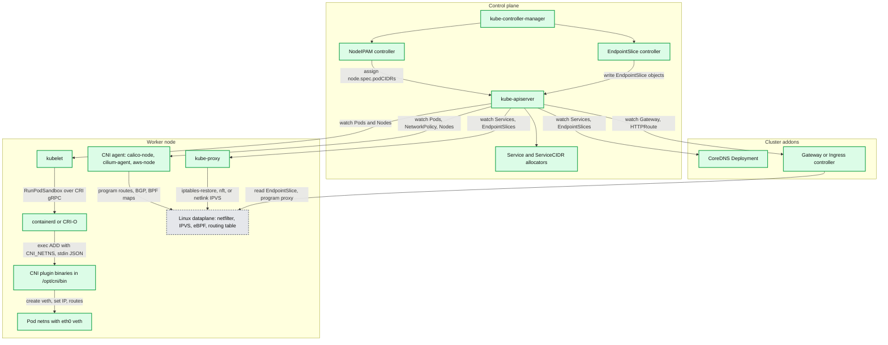

**What to notice**

- The apiserver is the only integration point: every dataplane agent is an independent informer-driven controller, so they converge at different rates and can disagree transiently.
- `kubelet` never touches the network itself — it delegates to the CRI runtime, which is the actual CNI caller. Networking failures surface as `RunPodSandbox` errors, not kubelet network errors. **[documented]**
- kube-proxy and the CNI agent both write to the same kernel tables. Ordering between them is *not* coordinated — this is the root of most "policy allowed it but the packet still dropped" incidents.
- NodeIPAM (in kube-controller-manager) is optional: cloud CNIs (AWS VPC CNI) and Calico's own IPAM bypass `node.spec.podCIDRs` entirely.
- CoreDNS is just another API client. DNS is a Service like any other, which is why DNS failures and Service-dataplane failures share root causes.

---

## 3. Data flow

### 3.1 Pod → Pod, same node

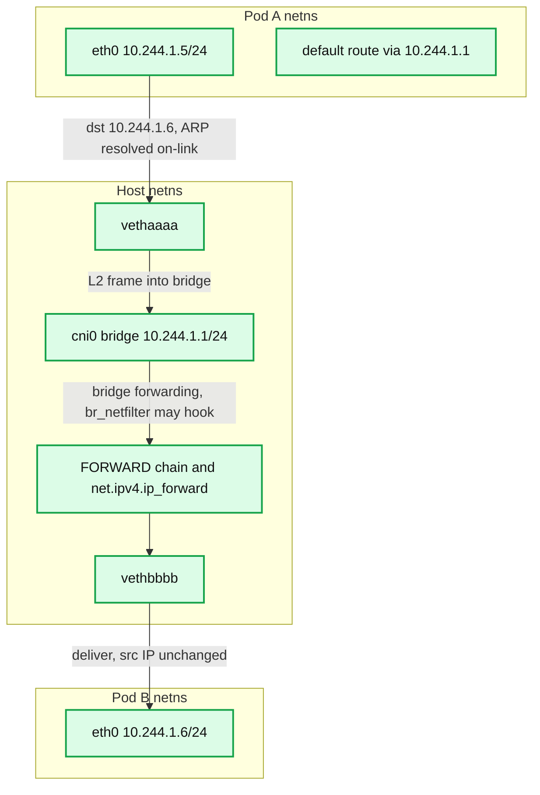

**What to notice**

- Same-subnet Pods are **L2-adjacent**: no routing decision, no NAT, no conntrack entry unless `br_netfilter`/`bridge-nf-call-iptables=1` pushes bridged frames through netfilter (which Kubernetes requires so NetworkPolicy and kube-proxy see them). **[documented]**
- Cilium and Calico in "no bridge" mode instead give each veth host side a `/32` route and set `proxy_arp` — traffic is routed, not bridged, so `cni0` does not exist and `br_netfilter` is irrelevant.
- Source IP is preserved end to end; this is the "no NAT" clause of the model.
- MTU is inherited from the bridge/veth config, *not* negotiated. A wrong MTU here fails silently for large packets only.

### 3.2 Pod → Pod, cross node with VXLAN overlay

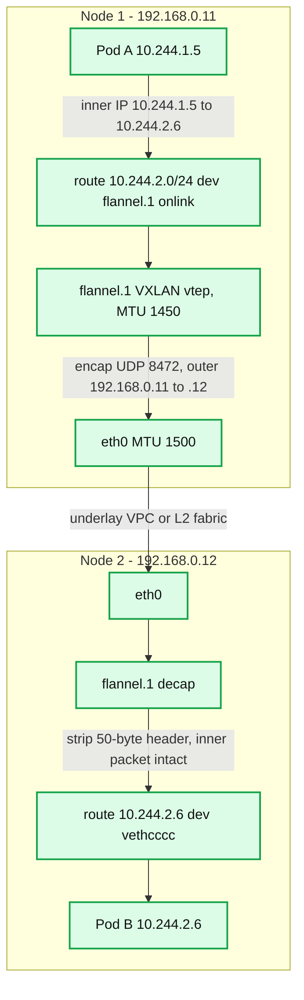

**What to notice**

- **Encapsulation overhead is fixed and must be subtracted from MTU**: VXLAN 50 bytes (IPv4) / 70 (IPv6), IP-in-IP 20, WireGuard 60, Geneve ~50+options. Flannel/Calico default the overlay device to 1450 on a 1500 underlay. **[documented]**
- The outer UDP port is the fingerprint: Linux VXLAN standard is 4789; **Flannel uses 8472** (a pre-standard Linux default it kept for compatibility). **[documented]**
- The FDB/ARP entries for the remote VTEP are programmed by the agent from the node list — no VXLAN multicast learning. **[documented]**
- Native-routing modes (Calico BGP, AWS VPC CNI, Cilium `routingMode=native`) delete this diagram entirely: the underlay routes Pod CIDRs, MTU stays 1500, and per-packet cost drops.
- Path MTU discovery through the overlay is the classic blackhole: TCP handshakes succeed (small packets), bulk transfer stalls.

### 3.3 Pod → ClusterIP (iptables DNAT path)

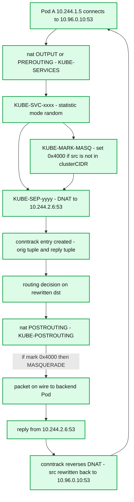

**What to notice**

- The DNAT decision happens **once per connection**, in the `nat` table, which netfilter only consults for packets in state `NEW`. Every subsequent packet is rewritten by **conntrack**, not by rules — this is why changing Service endpoints does not move existing connections.
- `KUBE-MARK-MASQ` sets bit `0x4000` (`--iptables-masquerade-bit 14`, default 14) **[documented]**; `KUBE-POSTROUTING` masquerades only marked packets. Without it, a Pod talking to a backend on a *different* node via a VIP would get an asymmetric reply path.
- Load balancing is **per-connection random**, not round-robin: `-m statistic --mode random --probability 1/n`, then `1/(n-1)`, … with the last endpoint unconditional.
- The client sees the ClusterIP as the reply source because conntrack un-DNATs — any path that loses the conntrack entry (table full, node reboot, `conntrack -F`) breaks established connections.
- Session affinity `ClientIP` adds `-m recent` (iptables) / a named set (nftables) keyed on source IP with `sessionAffinityConfig.clientIP.timeoutSeconds` default **10800 s (3h)**. **[documented]**

### 3.4 External → NodePort / LoadBalancer

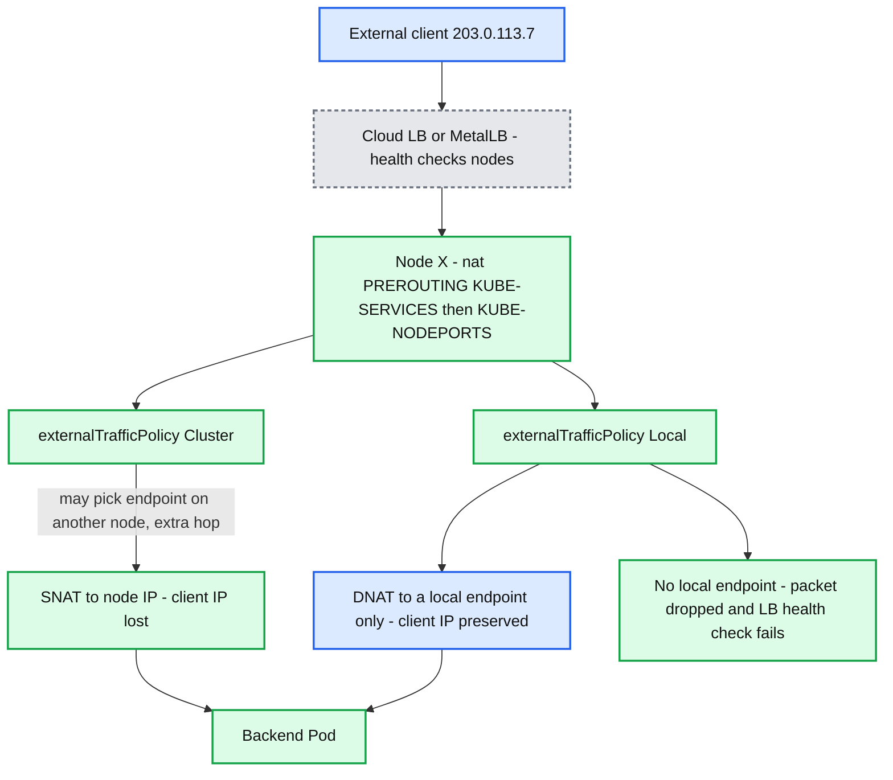

**What to notice**

- `externalTrafficPolicy: Cluster` (default) SNATs so the reply returns via the ingress node; that costs the real client IP and adds up to one extra node hop.
- `Local` skips SNAT and only DNATs to node-local endpoints. Traffic distribution becomes *per-node endpoint count*, so uneven Pod placement means uneven load. **[documented]**
- With `Local`, kube-proxy serves the LB **health check node port** (`spec.healthCheckNodePort`) so the cloud LB removes nodes with zero local endpoints — this is what prevents the drop path. **[documented]**
- `ProxyTerminatingEndpoints` (GA v1.28) makes kube-proxy fall back to *terminating but serving* local endpoints when all local endpoints are terminating, which is what gives `Local` zero-downtime rolling updates. **[documented]**
- `internalTrafficPolicy: Local` is the in-cluster twin: ClusterIP traffic only goes to node-local endpoints, and **fails closed** (no fallback) if there are none. **[documented]**

---

## 4. Sequence of operations

### 4.1 Pod sandbox network setup via CNI ADD

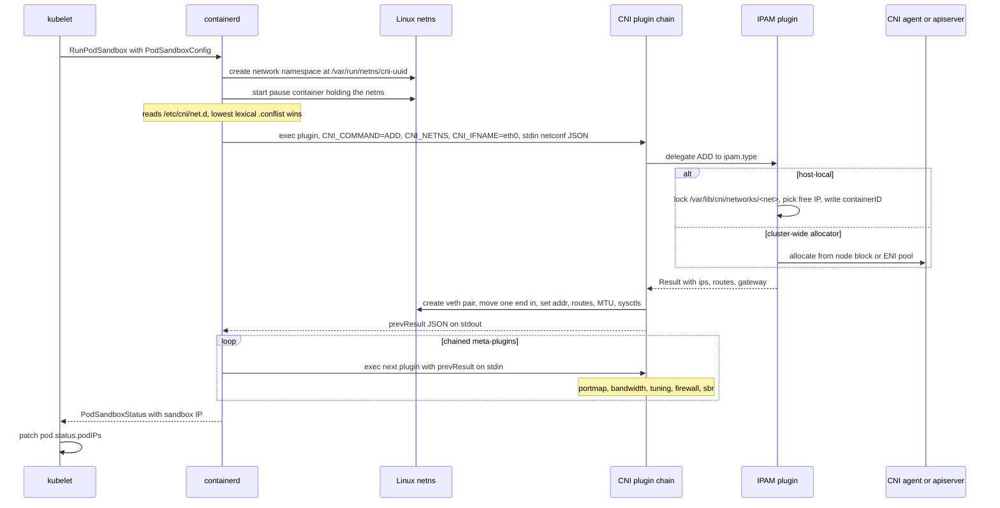

**What to notice**

- The **pause container** exists solely to pin the netns (and PID ns) so app containers can crash-loop without losing the IP. `CNI_CONTAINERID` is the *sandbox* ID, not an app container ID. **[documented]**
- CNI is a **process exec + JSON on stdin/stdout** contract, not a daemon API. Latency of ADD is on the Pod-startup critical path, and a hung plugin hangs sandbox creation.
- Chaining passes `prevResult` forward; each plugin may mutate it. `portmap` (hostPort), `bandwidth` (tc `tbf`/`ifb` from `kubernetes.io/ingress-bandwidth` annotations), `tuning` (per-Pod sysctls), `firewall`, `sbr` are the standard meta-plugins. **[documented]**
- CNI **1.1.0** adds `GC` (runtime tells the plugin the full set of live attachments so it can reap leaked IPs/devices) and `STATUS` (plugin reports "I am ready to serve ADD", so the runtime can back-pressure instead of failing). Implemented in libcni v1.2.0. **[documented]** Runtime adoption is uneven — treat `GC` as available but not universally exercised. **[inferred]**
- `DEL` **must be idempotent** and is retried; failure to make DEL idempotent is the number-one source of IP leaks.

Real config — a chained Flannel `.conflist` in `/etc/cni/net.d/10-flannel.conflist`:

```json
{
  "name": "cbr0",
  "cniVersion": "1.0.0",
  "plugins": [
    {
      "type": "flannel",
      "delegate": {
        "hairpinMode": true,
        "isDefaultGateway": true,
        "ipMasq": false
      }
    },
    {
      "type": "portmap",
      "capabilities": { "portMappings": true }
    },
    {
      "type": "bandwidth",
      "capabilities": { "bandwidth": true }
    }
  ]
}
```

### 4.2 Service creation → EndpointSlice → kube-proxy rules

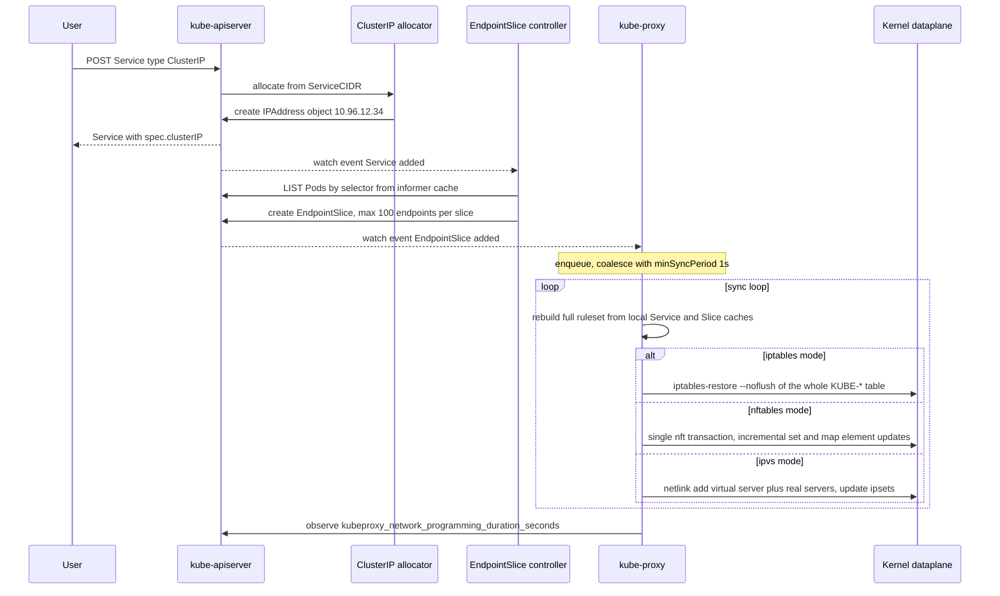

**What to notice**

- ClusterIP allocation moved from an in-etcd bitmap to first-class **`ServiceCIDR` and `IPAddress`** objects (`networking.k8s.io/v1`, KEP-1880 MultiCIDRServiceAllocator, GA in v1.33). A default `ServiceCIDR` named `kubernetes` mirrors `--service-cluster-ip-range`; extra ServiceCIDRs can be added live and are removed via a finalizer once drained. **[documented]**
- The EndpointSlice controller is **level-driven off informer caches** — it never reads Pods from etcd on the hot path. `--endpointslice-updates-batch-period` (default `0s`) trades propagation latency for apiserver write amplification. **[documented]**
- kube-proxy's iptables mode **rewrites the entire KUBE-\* ruleset** on every sync; there is no incremental mode. `--iptables-min-sync-period` default **1s** is the coalescing floor; `--iptables-sync-period` default **30s** is the forced resync. **[documented]**
- nftables mode uses **one atomic transaction with element-level set/map updates** — the reason it is O(changed) instead of O(total). **[documented]**
- The end-to-end SLI is `kubeproxy_network_programming_duration_seconds` (time from endpoint change observed to rules programmed) — the metric to alert on.

### 4.3 A DNS lookup end to end

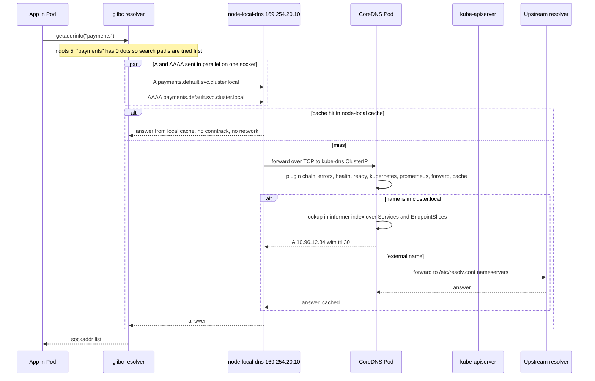

**What to notice**

- `ndots:5` means any name with fewer than 5 dots is tried against **every** search-path suffix first. `payments.default.svc.cluster.local.` (4 dots) still goes through the search list — an external name like `api.stripe.com` (2 dots) costs 3 failed NXDOMAIN round trips per family before the absolute try. **[documented]**
- glibc sends **A and AAAA in parallel from the same source port**. That is the ingredient for the conntrack insert race (§8.3).
- CoreDNS's `kubernetes` plugin holds informers over Services, EndpointSlices and Namespaces and answers from an in-memory index — no apiserver call per query. **[documented]**
- Default record TTL from the `kubernetes` plugin is **5 s** (`ttl` option, range 0–3600); the `cache` plugin bounds positive/negative caching independently. **[documented]**
- NodeLocal DNSCache listens on link-local **169.254.20.10** on a dummy interface with `NOTRACK` rules, so cache hits create **zero conntrack entries**, and forwards upstream over **TCP** to sidestep UDP races. **[documented]**

Real Pod `/etc/resolv.conf` (`dnsPolicy: ClusterFirst`):

```
search default.svc.cluster.local svc.cluster.local cluster.local ec2.internal
nameserver 10.96.0.10
options ndots:5
```

### 4.4 Rolling update: endpoint churn and (absent) connection draining

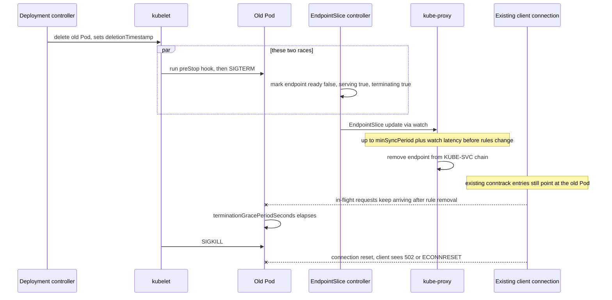

**What to notice**

- **kube-proxy does not drain connections.** Removing an endpoint deletes the DNAT rule for *new* connections only; established conntrack entries continue to the doomed Pod. This is the single most common cause of 502s during deploys.
- The mitigation is a `preStop` sleep (5–15 s) longer than the worst-case endpoint propagation, so the Pod keeps serving while rules converge. This is a workaround, not a guarantee.
- The Pod-delete and endpoint-removal paths are **concurrent and unordered**: SIGTERM can land before kube-proxy has removed the rule on some nodes.
- `terminating` + `serving` endpoints exist precisely so proxies *can* keep sending to draining backends when there is nothing else — used by `ProxyTerminatingEndpoints` and by meshes.
- Long-lived connections (gRPC, HTTP/2, database pools) never rebalance on their own; you need client-side `MAX_CONNECTION_AGE`, a mesh, or an L7 proxy.

---

## 5. State machines

### 5.1 Endpoint readiness / terminating

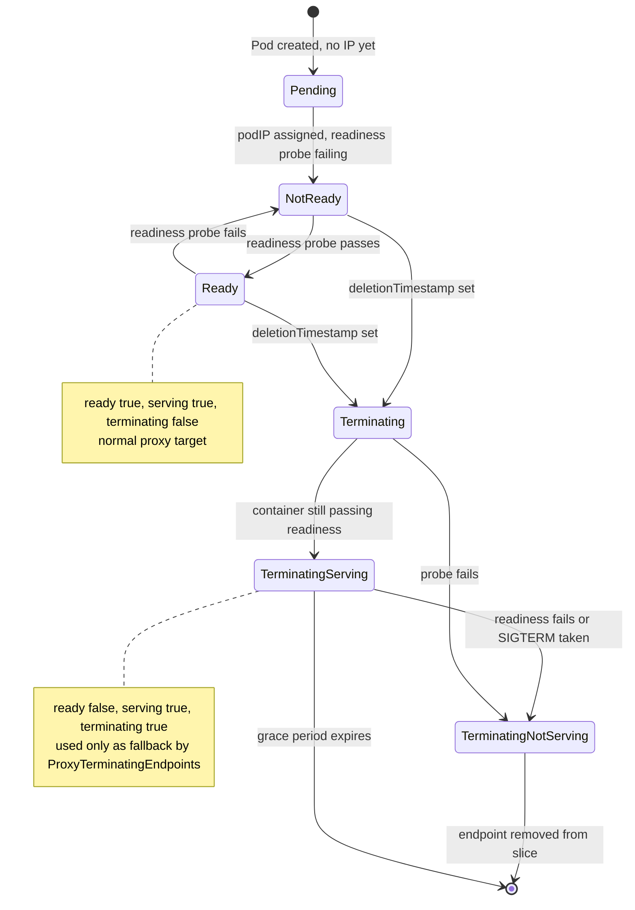

**What to notice**

- `ready` is a *derived* convenience field: `serving && !terminating` — except when `publishNotReadyAddresses: true`, where it is forced true regardless. **[documented]**
- `serving` and `terminating` were split out precisely because `ready` collapsed two orthogonal facts and made graceful shutdown impossible to express.
- A Pod with `publishNotReadyAddresses` (headless StatefulSets, Kafka/Cassandra peer discovery) is published before it is healthy — intentional, so peers can resolve each other during bootstrap.
- Nothing in this machine is synchronous with the proxy; each transition is a watch event with its own propagation delay.

### 5.2 Conntrack entry lifecycle (TCP, DNAT'd)

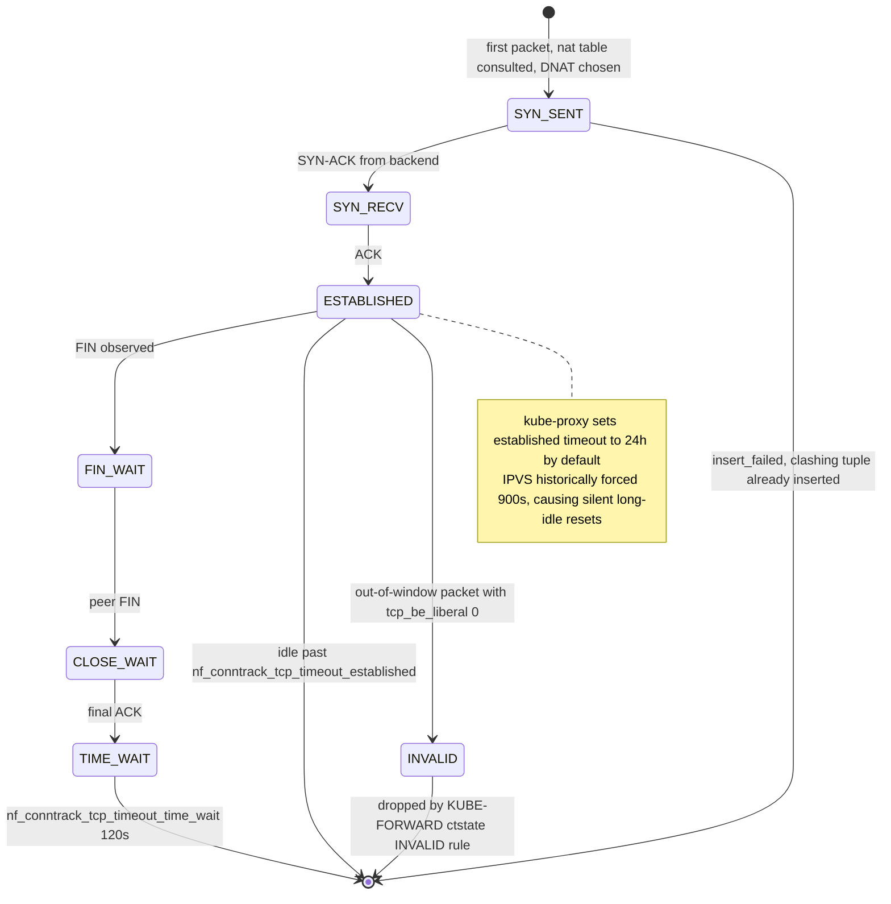

**What to notice**

- The DNAT mapping lives in the conntrack entry, not in the ruleset. Entry eviction = connection death, with no TCP RST to explain it.
- `--conntrack-tcp-timeout-established` default **24h**, `--conntrack-tcp-timeout-close-wait` default **1h**. **[documented]** The classic IPVS bug was the kernel's IPVS `tcp` timeout of **900 s** (15 min) silently killing idle long-lived connections; kube-proxy's `--ipvs-tcp-timeout` (default `0s` = leave kernel value) is the knob. **[documented]**
- `insert_failed` counts lost races on tuple insertion — the mechanism behind the 25 ms/5 s DNS delays.
- `nf_conntrack_tcp_be_liberal=1` stops dropping out-of-window packets as INVALID; needed on asymmetric paths and behind some cloud LBs. kube-proxy exposes `--conntrack-tcp-be-liberal`. **[documented]**
- Table exhaustion (`nf_conntrack_max`) drops **new** connections while existing ones survive — the failure looks like intermittent connect timeouts, not a hard outage.

---

## 6. Component deep dives

### 6.1 CNI plugin

- **Responsibility.** Given a netns path and a network config, make the Pod reachable per the model, and release everything on DEL.
- **Interface.** Exec of a binary in `--cni-bin-dir` (default `/opt/cni/bin`), config from `--cni-conf-dir` (default `/etc/cni/net.d`, **lowest lexically-sorted `.conflist`/`.conf` wins**). Env: `CNI_COMMAND`, `CNI_CONTAINERID`, `CNI_NETNS`, `CNI_IFNAME`, `CNI_ARGS`, `CNI_PATH`. Config JSON on stdin, `Result` JSON on stdout, non-zero exit + `{"code","msg","details"}` on error. **[documented]**
- **Verbs.** `ADD`, `DEL`, `CHECK` (spec 0.4.0), `VERSION`, plus `GC` and `STATUS` (spec **1.1.0**). **[documented]**
- **Data structures.** `Result` carries `interfaces[]` (name, mac, sandbox), `ips[]` (address, gateway, `interface` index), `routes[]`, `dns{nameservers,domain,search,options}`.
- **Device options.** `veth` (default; one syscall-cheap pair per Pod, host side in the host netns), `ipvlan` L2/L3 (shares parent MAC — no bridge, no broadcast, but hostile to some L2 fabrics), `macvlan` (own MAC per Pod, needs promiscuous mode / MAC limits on the fabric, and the host cannot talk to its own macvlan children without a shim), `eBPF-attached veth` (Cilium: `tc` ingress/egress programs on the host side of the veth, so packets are redirected with `bpf_redirect_peer` and skip most of the host stack).
- **Concurrency.** The runtime serializes per-sandbox; multiple sandboxes can run ADD concurrently. `host-local` IPAM serializes via a **flock on the datastore directory**, which is a real contention point on 250-Pod nodes. **[inferred]**
- **Failure handling.** ADD failure ⇒ sandbox creation fails, kubelet retries with backoff; the runtime is expected to issue `DEL` to clean up. A crash between IPAM allocate and datastore write leaks the IP.
- **Production knobs.** MTU (must match overlay), `hairpinMode` (needed for a Pod reaching itself via its own Service VIP), `ipMasq` (leave false when kube-proxy handles masquerade), `--cni-cache-dir` (`/var/lib/cni/results`, holds the cached result used for DEL/CHECK).

### 6.2 IPAM

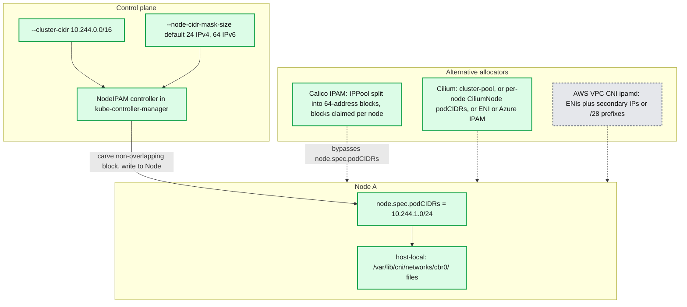

**What to notice**

- `--node-cidr-mask-size` default **24** (IPv4) / **64** (IPv6); `--allocate-node-cidrs` default `false`, `--cidr-allocator-type` default `RangeAllocator`. **[documented]**
- The arithmetic is a hard cap: `/16` cluster CIDR with `/24` per node = **256 nodes maximum**, forever. This is the most common irreversible cluster-design mistake — changing it requires rebuilding.
- `host-local` is **node-scoped and file-backed**; it cannot detect that another node holds the same IP, which is safe only because blocks are disjoint. Its leak mode is orphaned files after an ungraceful reboot (fix: wipe `/var/lib/cni/networks/*` on boot, or rely on CNI `GC`).
- Calico's block allocator (default 64-address blocks per node, borrowing across nodes when exhausted) trades route-table compactness for flexibility; strict affinity turns it back into fixed per-node blocks.
- **AWS VPC CNI** allocates *VPC* IPs: secondary IPs on ENIs, or `/28` prefixes with `ENABLE_PREFIX_DELEGATION=true` (16 IPs per prefix). Max pods ≈ `ENIs × (IPsPerENI − 1)` in secondary mode, `ENIs × (IPsPerENI − 1) × 16` with prefixes. `WARM_IP_TARGET`/`MINIMUM_IP_TARGET` override `WARM_PREFIX_TARGET` and give finer control at the cost of more EC2 API calls. **[documented]** Its failure mode is *subnet* IP exhaustion — a Kubernetes problem caused by VPC design.

### 6.3 kube-proxy — iptables mode

- **Responsibility.** Translate Services + EndpointSlices into netfilter rules; own conntrack sysctls.
- **Chain structure.** `nat` table: `PREROUTING`/`OUTPUT` → `KUBE-SERVICES` → per-service `KUBE-SVC-<hash>` → per-endpoint `KUBE-SEP-<hash>`; `KUBE-NODEPORTS` appended at the end of `KUBE-SERVICES`; `KUBE-MARK-MASQ` sets `0x4000`; `KUBE-POSTROUTING` masquerades marked packets. `filter` table: `KUBE-FORWARD` (drops `ctstate INVALID`), `KUBE-EXTERNAL-SERVICES`, `KUBE-FIREWALL`.

Real dump (`iptables-save -t nat`, trimmed, from a kubeadm cluster):

```
:KUBE-SERVICES - [0:0]
:KUBE-NODEPORTS - [0:0]
:KUBE-POSTROUTING - [0:0]
:KUBE-MARK-MASQ - [0:0]
:KUBE-SVC-NPX46M4PTMTKRN6Y - [0:0]
:KUBE-SEP-SXIVWICOYRO3JIB2 - [0:0]

-A PREROUTING -m comment --comment "kubernetes service portals" -j KUBE-SERVICES
-A OUTPUT -m comment --comment "kubernetes service portals" -j KUBE-SERVICES
-A POSTROUTING -m comment --comment "kubernetes postrouting rules" -j KUBE-POSTROUTING

-A KUBE-SERVICES -d 10.96.0.1/32 -p tcp -m comment --comment "default/kubernetes:https cluster IP" -m tcp --dport 443 -j KUBE-SVC-NPX46M4PTMTKRN6Y
-A KUBE-SERVICES -d 10.96.0.10/32 -p udp -m comment --comment "kube-system/kube-dns:dns cluster IP" -m udp --dport 53 -j KUBE-SVC-TCOU7JCQXEZGVUNU
-A KUBE-SERVICES -m comment --comment "kubernetes service nodeports; NOTE: this must be the last rule in this chain" -m addrtype --dst-type LOCAL -j KUBE-NODEPORTS

-A KUBE-SVC-NPX46M4PTMTKRN6Y ! -s 10.244.0.0/16 -d 10.96.0.1/32 -p tcp -m tcp --dport 443 -j KUBE-MARK-MASQ
-A KUBE-SVC-NPX46M4PTMTKRN6Y -m comment --comment "default/kubernetes:https -> 192.168.0.11:6443" -j KUBE-SEP-SXIVWICOYRO3JIB2

-A KUBE-SVC-TCOU7JCQXEZGVUNU -m statistic --mode random --probability 0.50000000000 -j KUBE-SEP-AAAA
-A KUBE-SVC-TCOU7JCQXEZGVUNU -j KUBE-SEP-BBBB

-A KUBE-SEP-SXIVWICOYRO3JIB2 -s 192.168.0.11/32 -j KUBE-MARK-MASQ
-A KUBE-SEP-SXIVWICOYRO3JIB2 -p tcp -m tcp -j DNAT --to-destination 192.168.0.11:6443

-A KUBE-MARK-MASQ -j MARK --or-mark 0x4000
-A KUBE-POSTROUTING -m mark ! --mark 0x4000/0x4000 -j RETURN
-A KUBE-POSTROUTING -j MARK --xor-mark 0x4000
-A KUBE-POSTROUTING -m comment --comment "kubernetes service traffic requiring SNAT" -j MASQUERADE --random-fully
```

- **Algorithm.** Every sync builds the complete `KUBE-*` ruleset in a buffer and pipes it to `iptables-restore --noflush --counters`. There is **no incremental update** — cost is O(services + endpoints) per sync regardless of how much changed.
- **The probability trick.** `--probability 1/n`, `1/(n−1)`, …, unconditional last ⇒ uniform selection in expectation, evaluated linearly.
- **Concurrency.** Single-threaded sync loop behind a `BoundedFrequencyRunner`: `--iptables-min-sync-period 1s` (floor), `--iptables-sync-period 30s` (forced periodic). Under churn, syncs coalesce.
- **Failure handling.** `iptables-restore` failure ⇒ retry next sync; the previous ruleset stays (fail-static, so the dataplane keeps serving stale-but-working rules). kube-proxy holds the `xtables` lock — contention with a node firewall agent stalls both.
- **Knobs and defaults.** `--masquerade-all=false`, `--iptables-masquerade-bit=14`, `--nodeport-addresses=[]` (all local addrs), `--conntrack-max-per-core=32768`, `--conntrack-min=131072`, `--conntrack-tcp-timeout-established=24h`, `--conntrack-tcp-timeout-close-wait=1h`. **[documented]**
- **The O(n) problem.** Rule count grows ~linearly with services and endpoints; both **per-packet traversal** (linear chain walk in `KUBE-SERVICES`) and **per-sync programming** degrade. At 100k endpoints, syncs took ~88.5 s and pegged a CPU. **[documented]**

### 6.4 kube-proxy — IPVS mode

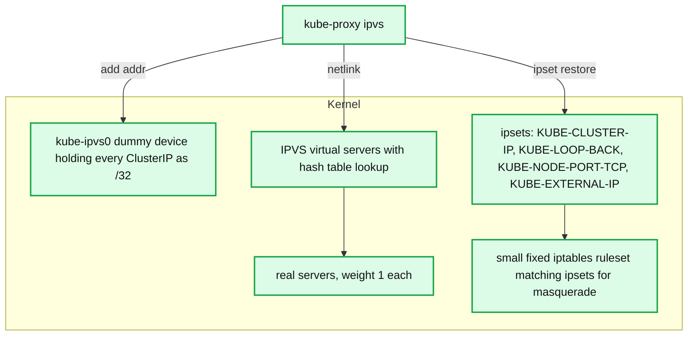

**What to notice**

- ClusterIPs are bound to the dummy `kube-ipvs0` so the kernel treats them as local and hands them to IPVS — that is the only reason `ip addr` shows hundreds of `/32`s.
- IPVS lookup is a **hash table**, effectively O(1), so per-packet cost stops depending on service count. Rule *programming* also becomes incremental via netlink.
- **ipsets replace rule explosion** for the auxiliary matches (masquerade, node ports, loopback hairpin) — a handful of iptables rules match set membership instead of thousands of literal rules.
- Schedulers: `rr` (default), `wrr`, `lc`, `wlc`, `sh`, `dh`, `sed`, `nq`, `mh` (Maglev). `sh` gives client-IP affinity without conntrack state; `mh` gives consistent hashing (minimal disruption on backend change). **[documented]**
- IPVS still **depends on iptables** for masquerade/policy, so it does not escape the nftables migration; it also inherits the 900 s IPVS TCP idle timeout unless `--ipvs-tcp-timeout` is set. **[documented]**

### 6.5 kube-proxy — nftables mode (KEP-3866)

- **Status.** Alpha v1.29, beta v1.31, **GA v1.33**; still **not the default** in v1.34 (iptables remains default; KEP-5343 tracks flipping it). Requires Linux **≥5.13**. **[documented]**
- **Structure.** A single table `ip kube-proxy` (and `ip6 kube-proxy`) — deliberately separate from other components' tables, since nftables tables are independent rather than shared like iptables' `nat`/`filter`.
- **Verdict maps are the whole point.** Instead of a linear chain of per-service match rules:

```
table ip kube-proxy {
  map service-ips {
    type ipv4_addr . inet_proto . inet_service : verdict
    elements = {
      10.96.0.1 . tcp . 443    : goto service-NPX46M4PTMTKRN6Y,
      10.96.0.10 . udp . 53    : goto service-TCOU7JCQXEZGVUNU
    }
  }
  map service-nodeports {
    type inet_proto . inet_service : verdict
    elements = { tcp . 30080 : goto service-FXIYYABC }
  }
  chain services {
    ip daddr . meta l4proto . th dport vmap @service-ips
  }
  chain service-TCOU7JCQXEZGVUNU {
    numgen random mod 2 vmap { 0 : goto endpoint-AAAA, 1 : goto endpoint-BBBB }
  }
  chain endpoint-AAAA {
    ip saddr 10.244.2.6 jump mark-for-masquerade
    meta l4proto udp dnat to 10.244.2.6:53
  }
}
```

- **Why it scales.** Map lookup is hash-based (O(1) per packet, not O(services)); updates are **element add/delete inside one atomic `nft` transaction**, so control-plane cost is O(changed), not O(total). Measured: 100k endpoints, sync ~1.4 s steady-state vs ~88.5 s for iptables. **[documented]**
- **Behavior changes to plan for.** (a) **NodePorts on `127.0.0.1` are gone** — iptables mode needed `route_localnet=1`, which nftables mode refuses on security grounds. (b) `--nodeport-addresses` defaults to the interface holding the default route rather than "all local IPs". (c) Traffic to unallocated ClusterIPs is dropped, and to invalid ports on live ClusterIPs is rejected, instead of leaking to the host. **[documented]**
- **Migration.** Both modes can be A/B'd per node (kube-proxy DaemonSet with a node-selector), and switching modes cleans up the other mode's rules on start. Mixed-mode clusters are supported during rollout. **[documented]**

### 6.6 kube-proxy — Windows kernelspace, and eBPF replacements

- **Windows `kernelspace`** programs **HNS (Host Networking Service)** load-balancing policies via VFP (Virtual Filtering Platform) in the vSwitch — no netfilter, no conntrack knobs. DSR is supported on recent Windows Server builds. Feature parity lags: no IPVS, limited `externalTrafficPolicy` semantics historically. **[documented]** / **[inferred]** on current parity.
- **Cilium kube-proxy replacement.** Services live in BPF maps (`cilium_lb4_services_v2`, `cilium_lb4_backends_v3`, `cilium_lb4_reverse_sk`). **Socket-level LB** attaches to cgroup hooks `connect(2)`/`sendmsg(2)`/`recvmsg(2)`, so the ClusterIP is translated **before a packet exists** — zero per-packet NAT and no conntrack entry for the VIP. NodePort/LB traffic is handled at `tc` ingress or **XDP** (`loadBalancer.acceleration=native`, kernel ≥5.8). Backend selection `random` (default) or `maglev` (consistent hashing, table 251–131071). Return path `snat` (default), `dsr` (dispatch `opt`/`geneve`/`ipip`), or `hybrid` (DSR for TCP, SNAT for UDP). **[documented]**
- **Calico eBPF dataplane.** Felix compiles and attaches TC programs to host and workload interfaces, implementing both policy and Service LB, preserving client source IP for `externalTrafficPolicy: Cluster` via DSR. Replaces kube-proxy when enabled. **[documented]**
- **Trade-off.** eBPF replacements delete conntrack-table and rule-count problems, but move debugging into `bpftool`/`cilium-dbg` — `iptables-save` tells you nothing, and kernel version becomes a hard dependency.

### 6.7 EndpointSlice controller

- **Responsibility.** Maintain the set of EndpointSlice objects for every Service with a selector; keep slices ≤ `--max-endpoints-per-slice` (**default 100**, max 1000). **[documented]**
- **Data structures.** Informer caches for Services, Pods, Nodes and EndpointSlices; per-Service a reconciler that diffs desired endpoints against existing slices.
- **Algorithm (the interesting part).** It is a bin-packing problem optimized for **write minimization**, not slice count: place changed endpoints into existing slices with free capacity, prefer updating few slices over rebalancing, and only create/delete slices when necessary. The cost model is apiserver writes — each slice update is a full object write and a watch fan-out to every kube-proxy and CoreDNS.
- **Labels/ownership.** `kubernetes.io/service-name`, `endpointslice.kubernetes.io/managed-by=endpointslice-controller.k8s.io`, plus an ownerRef to the Service. **[documented]**
- **Mirroring controller.** For hand-written `Endpoints` objects (no selector), `endpointslicemirroring` copies them into slices (skipped when labeled `endpointslice.kubernetes.io/skip-mirror=true`), capped at 1000 addresses per subset. **[documented]**
- **Topology / traffic distribution.** `spec.trafficDistribution` supersedes the old `service.kubernetes.io/topology-mode: Auto` hints. In v1.34: `PreferClose` (now aliased/renamed **`PreferSameZone`**) and **`PreferSameNode`** — beta in v1.34, GA in v1.35. **[documented]** The proxy filters endpoints by `hints.forZones`/`forNodes`; if hints are absent for any endpoint, the proxy falls back to all endpoints (fail-open).
- **Failure handling.** A slice write conflict just re-reconciles. The dangerous mode is **slice churn**: a large Service under rolling update produces a stream of slice writes that fan out to every node, which is why `--endpointslice-updates-batch-period` exists.
- **Truncation.** Services above 1000 endpoints per slice get `endpoints.kubernetes.io/over-capacity: truncated` on the legacy `Endpoints` object; slices themselves are not truncated. **[documented]**

### 6.8 CoreDNS

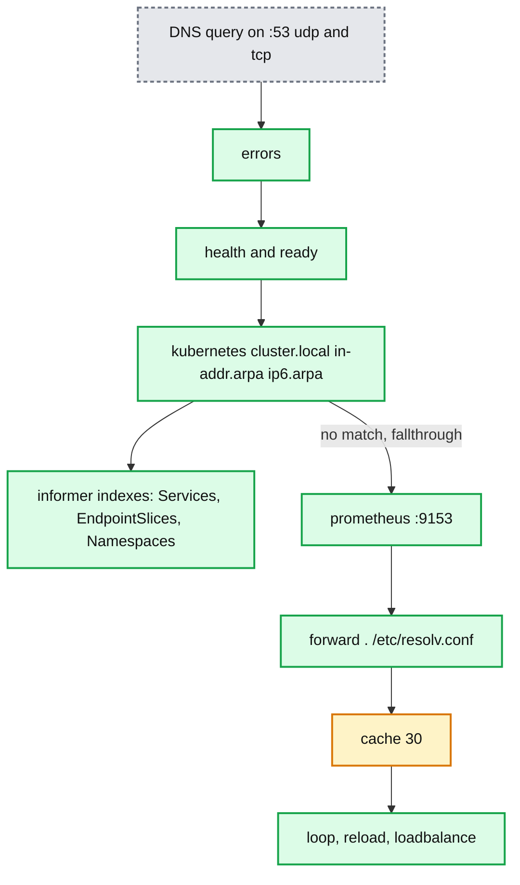

**What to notice**

- The Corefile is an **ordered chain**; each plugin either answers or calls the next. Order is semantics, not style — putting `cache` before `kubernetes` would cache cluster records with the wrong policy.
- The `kubernetes` plugin watches **Services and EndpointSlices** (it moved off `Endpoints`), so DNS convergence has the same propagation latency as kube-proxy. **[documented]**
- Records served: `A`/`AAAA` for `svc.ns.svc.cluster.local`; `SRV` for `_port._proto.svc.ns.svc.cluster.local`; `PTR` for `in-addr.arpa`; headless Services return one A per ready endpoint; Pod records `1-2-3-4.ns.pod.cluster.local` are `disabled` by default (`insecure` returns the encoded IP unverified, `verified` checks a Pod actually exists at the cost of a Pod informer). **[documented]**
- `ExternalName` Services become **CNAME** records, resolved by CoreDNS via `forward` — the one Service type with no dataplane rule at all.
- `autopath` short-circuits the `ndots:5` search-path walk server-side by inspecting the client Pod's namespace and answering the *final* name on the first query — big win, but requires a Pod informer (memory) and breaks if the client's search path differs.
- **Scaling.** `cluster-proportional-autoscaler` sizes the CoreDNS Deployment as `replicas = max(ceil(cores × 1/coresPerReplica), ceil(nodes × 1/nodesPerReplica))`. **[documented]** Practical guidance: CoreDNS is CPU-bound on parsing; scale replicas, then add NodeLocal DNSCache, then reduce `ndots`.

### 6.9 NetworkPolicy engine

- **API semantics (the part people get wrong).** A Pod is **default-allow** until at least one NetworkPolicy selects it; from then on it is **default-deny for that direction only** (`policyTypes`). Multiple policies are **additive/union** — there is no deny rule, no priority, no ordering. **[documented]**
- **Implementation.** Calico Felix renders policy into iptables chains (`cali-tw-<iface>`, `cali-fw-<iface>`) plus ipsets of selector-matched Pod IPs; in eBPF mode into per-interface TC programs and BPF maps. Cilium renders into per-endpoint policy maps keyed by **identity** (a numeric label-set identity carried in the packet via VXLAN metadata or IP option), not IP — which is why Cilium policy scales with *label diversity*, not Pod count. **[documented]**
- **What the core API cannot express.** Egress to FQDNs; any L7 (HTTP method/path, gRPC service); explicit deny; policy precedence/tiers; cluster-wide policy that a namespace owner cannot override.
- **Vendor extensions.** Calico `GlobalNetworkPolicy`/`NetworkPolicy` with tiers, order, `Deny`, and `Domains` egress rules; Cilium `CiliumNetworkPolicy`/`CiliumClusterwideNetworkPolicy` with `toFQDNs` (DNS-proxy-driven), `toEntities` (world, cluster, host), and L7 rules enforced by an embedded **Envoy**.
- **AdminNetworkPolicy (KEP-2091).** Out-of-tree CRDs in `kubernetes-sigs/network-policy-api`. Cluster-admin tiers with explicit `Allow` / `Deny` / `Pass` actions evaluated **before** (Admin tier) and **after** (Baseline tier) namespace NetworkPolicy; `Pass` delegates the decision to the namespace policy. As of the v0.2.0 API release the two resources were **consolidated into a single `ClusterNetworkPolicy` CRD with a `tier` field (Admin|Baseline)**, `Allow` renamed to `Accept`, `ports` replaced by `protocols`. API version **v1alpha2** — still alpha, still out-of-tree, **not GA in v1.34**. **[documented]**
- **Production reality.** Policy enforcement is per-node and eventually consistent; a Pod can receive traffic in the window between IP assignment and policy programming. Cilium's `enable-policy-audit-mode` and Calico's staged policies exist to de-risk rollouts.

### 6.10 Gateway / Ingress controller

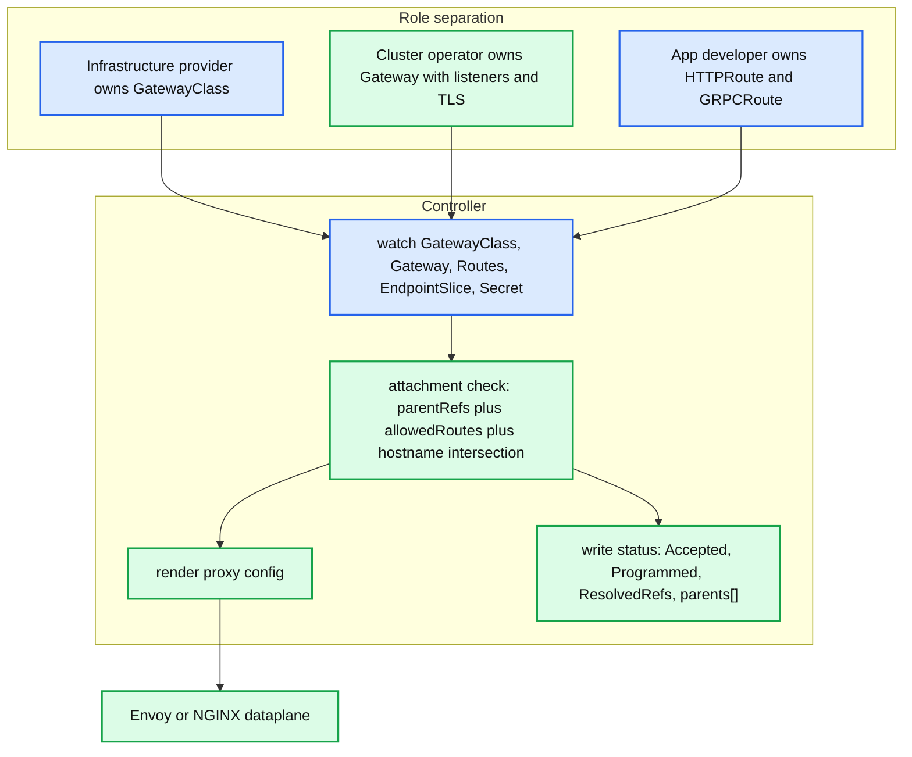

**What to notice**

- Ingress's failure was **annotation sprawl**: every controller invented its own dialect for timeouts, rewrites, canary, mTLS, because the spec had only host/path/backend. Gateway API replaces that with typed fields plus explicit extension points (`filters`, policy attachment).
- **Attachment is bidirectional and consent-based**: a Route names `parentRefs`; the Gateway's `listeners[].allowedRoutes` decides which namespaces/kinds may attach. Neither side can unilaterally bind — this is the multi-tenancy primitive Ingress lacked.
- **Status is the API.** `Accepted`, `Programmed`, `ResolvedRefs` conditions per parent are how a developer learns their Route was rejected. A controller that does not write status is unusable.
- **Maturity (verified).** `v1` GA: `GatewayClass`, `Gateway`, `HTTPRoute` (v1.0, Oct 2023), `GRPCRoute` (v1.1). **`BackendTLSPolicy` moved to the Standard channel in Gateway API v1.4** (Oct 2025). **Gateway API v1.5 (Feb 2026)** promoted **ListenerSet**, **TLSRoute**, HTTPRoute **CORS filter**, client-certificate validation, TLS cert selection and `ReferenceGrant` v1 to Standard. **[documented]** `TCPRoute`/`UDPRoute` and GAMMA mesh binding remained Experimental at that point; I could **not verify** any release later than v1.5.x, so treat "TCPRoute is Standard" claims as unverified. **[inferred]**
- **Implementations.** Envoy Gateway (reference-grade, Envoy xDS), Istio (Gateway API is its primary ingress API now), Contour, NGINX Gateway Fabric, Cilium Gateway API (Envoy embedded in the CNI), plus cloud-native GKE/AWS implementations that program the *cloud* LB rather than an in-cluster proxy.

**Service mesh, briefly.** Sidecar meshes (Istio classic, Linkerd) put a per-Pod proxy in the netns via `iptables` REDIRECT or a CNI plugin, giving mTLS identity (SPIFFE), L7 retries/timeouts, and per-request load balancing that *does* rebalance long-lived connections. **Ambient mode** splits this: a per-node `ztunnel` (Rust, L4 mTLS via HBONE/CONNECT over mTLS) plus an optional per-namespace `waypoint` (Envoy, L7) — removing the sidecar tax and the "restart every Pod to upgrade the mesh" problem, at the cost of weaker per-Pod isolation. Mesh **complements** CNI/kube-proxy for L4 connectivity and **replaces** them for load balancing and policy at L7. Cilium's mesh does L4 identity in eBPF and delegates L7 to Envoy only when a policy needs it.

---

## 7. Guarantees

**Guaranteed**

- Every Pod gets an IP unique in the cluster; Pod→Pod is NAT-free; node→Pod (same node) works. **[documented]**
- ClusterIP is stable for the Service's lifetime (it is an allocated `IPAddress` object, released only on delete).
- DNS names `svc.ns.svc.cluster.local` resolve to the ClusterIP; headless names resolve to ready Pod IPs.
- A Service without a matching NetworkPolicy is reachable by everything; once selected, only listed peers may connect (per direction).
- kube-proxy converges: the dataplane is **level-triggered**, so a missed event self-heals at the next full sync (30 s default).

**Explicitly not guaranteed**

- **No connection draining.** Endpoint removal affects new connections only; in-flight connections to a deleted endpoint are severed by Pod death, not managed.
- **No enforcement ordering.** Nothing sequences CNI IP assignment, NetworkPolicy programming, and kube-proxy rule programming. A Pod can be reachable before its policy is enforced. **[inferred, but structurally unavoidable]**
- **No load-balancing fairness.** iptables/nftables pick per *connection*, uniformly at random; one client with one long-lived HTTP/2 connection pins one backend forever.
- **No source-IP preservation** for `externalTrafficPolicy: Cluster`, and none at all for Pod→ClusterIP cross-node (masquerade fires).
- **No MTU negotiation, no path-MTU guarantee** across overlays.
- **No atomicity across nodes.** A Service update lands on 5,000 nodes at 5,000 different times; there is no barrier.
- **No guaranteed policy for hostNetwork Pods** — they bypass the Pod netns and most CNI policy enforcement.

---

## 8. Failure modes

### 8.1 Conntrack table full

- **Symptom.** `nf_conntrack: table full, dropping packet` in dmesg; intermittent connect timeouts under load; `conntrack -S` shows rising `drop`/`early_drop`.
- **Detection.** `nf_conntrack_count` vs `nf_conntrack_max`; kube-proxy exports its computed max.
- **Cause.** `--conntrack-max-per-core 32768` × cores, floored at `--conntrack-min 131072`. A 4-core node gets 131,072 entries — trivially exhausted by a load generator or an NAT gateway workload. **[documented]**
- **Blast radius.** Node-wide, all namespaces. Existing connections survive; new ones fail.
- **Fixes.** Raise per-core, shorten `nf_conntrack_tcp_timeout_time_wait`, use Cilium socket-LB (no conntrack entry for ClusterIP), or `NOTRACK` high-volume flows.

### 8.2 iptables sync latency at 10k services

- **Symptom.** `kubeproxy_sync_proxy_rules_duration_seconds` in the tens of seconds; new Services take minutes to become reachable; kube-proxy at 100% of one core.
- **Cause.** Full-table rebuild + `iptables-restore` on every sync; per-packet linear traversal of `KUBE-SERVICES`.
- **Historical mitigation.** Raise `--iptables-min-sync-period` to 5–10 s to coalesce (trading freshness for CPU) — the KEP notes nftables removes the need for `minSyncPeriod: 10s` on 1,000-node clusters. **[documented]**
- **Real fix.** Switch mode: nftables (GA 1.33) or an eBPF replacement. IPVS fixes the per-packet cost but not the iptables dependency.

### 8.3 DNS meltdown (the 25 ms / 5 s problem)

- **Mechanism.** glibc sends A and AAAA **in parallel from the same source port** to the same ClusterIP. Both packets are `NEW`; both traverse the `nat` table concurrently on different CPUs; both may pick different backends; conntrack insertion of the second tuple **races** and one is dropped as `insert_failed`. The client waits for the glibc resolver timeout — commonly **5 s**, or ~25 ms when a fast retransmit path applies. **[documented]**
- **Detection.** `conntrack -S | grep insert_failed` climbing; CoreDNS latency histograms fine while application-observed DNS latency is bimodal at ~5 s.
- **Fixes, in order of preference.** (1) **NodeLocal DNSCache** — `NOTRACK` on the link-local path removes conntrack from the equation entirely and forwards upstream over TCP. (2) `options single-request-reopen` (separate socket per query) or `single-request` (serialize) via `dnsConfig`. (3) `use-vc` to force TCP. (4) Cilium socket-LB, which never creates the racing conntrack entry.
- **Amplifier.** `ndots:5` multiplies every external lookup by the search-path length, so the race gets ~3× more chances per name.
- **Second-order meltdown.** CoreDNS OOM/eviction under this load ⇒ every Pod's DNS fails ⇒ retry storm ⇒ cascading. Set CoreDNS PDBs, resource requests, and anti-affinity.

### 8.4 CNI IP leak

- **Symptom.** `failed to allocate for range 0: no IP addresses available in range set` on a node with far fewer Pods than its `/24`.
- **Cause.** `DEL` not called or failing (kubelet crash, node reboot, runtime restart), leaving `host-local` reservation files or agent-side allocations orphaned.
- **Detection.** Compare `ls /var/lib/cni/networks/<net> | wc -l` to running sandboxes.
- **Fix.** CNI **`GC`** verb (spec 1.1) exists exactly for this — the runtime hands the plugin the authoritative live set. Otherwise: clean the datastore on boot, or run the CNI's own reconciler (`calicoctl ipam release --leaked`, `cilium-dbg` GC).

### 8.5 MTU blackholes

- **Symptom.** TCP handshake and small requests succeed; large POSTs, TLS handshakes with big certificate chains, or image pulls hang.
- **Cause.** Pod MTU 1500 over a VXLAN device with effective 1450; ICMP "fragmentation needed" filtered by a cloud security group or a firewall, so PMTUD never converges.
- **Detection.** `ping -M do -s 1472` from Pod to cross-node Pod; `tcpdump` showing retransmits of full-size segments only.
- **Fix.** Set the CNI MTU explicitly below the underlay minus encapsulation; enable TCP MSS clamping on the overlay device; do not rely on PMTUD in clouds.

### 8.6 Asymmetric routing with `externalTrafficPolicy: Local`

- **Symptom.** Traffic works via the LB but breaks when a client reaches the NodePort directly, or resets appear on nodes with multiple NICs.
- **Cause.** No SNAT (that's the point) means the reply leaves via the route table's best path, which may not be the ingress interface; `rp_filter=1` or a stateful firewall drops it. Conntrack marks out-of-window packets INVALID and `KUBE-FORWARD` drops them.
- **Fix.** `rp_filter=2` (loose), policy routing per interface, `--conntrack-tcp-be-liberal=true`, or move to DSR-aware dataplanes.

---

## 9. Scalability & performance

- **Rule count vs latency (iptables).** Rules ≈ `O(#services + #endpoints)`; per-packet cost is a linear walk of `KUBE-SERVICES` until the ClusterIP matches. Published community benchmarks show iptables per-connection latency and CPU rising sharply past a few thousand Services while IPVS stays flat. **[documented — Tigera/Calico iptables-vs-IPVS study]**
- **The headline number.** One Service, **100,000 endpoints**, kind v0.22 on n2d-standard-48: iptables first sync ~**4.5 s**, subsequent syncs ~**88.5 s**, kube-proxy saturating a CPU and requests timing out; nftables ~**10–11.5 s** first sync, ~**1.4–1.5 s** subsequent, no measurable added CPU, and a second Service serving **6,334 rps** at p50 14 ms / p99 37 ms throughout. **[documented]**
- **Endpoint update propagation.** Path is: Pod ready → EndpointSlice controller reconcile (batched by `--endpointslice-updates-batch-period`) → apiserver write → watch fan-out to N nodes → kube-proxy coalescing (`minSyncPeriod` 1 s) → sync duration. On a large cluster the dominant terms are watch fan-out and sync duration, not controller latency. Measure with `kubeproxy_network_programming_duration_seconds` (p99).
- **Write amplification.** `--max-endpoints-per-slice 100` is a deliberate trade: smaller slices ⇒ more objects but each update touches fewer bytes and fewer watchers re-parse. Raising it to 1000 reduces object count but makes every endpoint change rewrite a 1000-entry object to every node.
- **eBPF vs iptables.** Cilium's socket-LB removes per-packet NAT for ClusterIP entirely (translation happens at `connect()`), eliminating both the DNAT cost and the conntrack entry. XDP NodePort handling processes packets before `skb` allocation. Vendor-published figures claim large gains; treat specific percentages as **[inferred]** unless you reproduce them — the *structural* wins (O(1) map lookup, no full-table rewrite, no conntrack for ClusterIP) are the defensible claims.
- **DNS.** QPS per CoreDNS replica is CPU-bound and roughly linear in cores; `ndots:5` inflates query volume ~3–4× for external names. NodeLocal DNSCache converts most queries into a local memory hit with no network, no conntrack, no CoreDNS CPU.
- **Hot spots.** (a) A single Service with tens of thousands of endpoints (headless StatefulSets, Prometheus targets) — worst case for every proxy. (b) `externalTrafficPolicy: Local` with skewed Pod placement. (c) One node running all replicas of a hot Service. (d) The apiserver watch cache during mass Pod churn — network objects are among the highest-fanout resources in the cluster.
- **Back-pressure.** kube-proxy coalesces (`minSyncPeriod`), the EndpointSlice controller batches, CoreDNS caches. None of these is a true back-pressure signal to the producer — a deploy of 10,000 Pods will generate the work regardless.

---

## 10. Trade-offs & alternatives

**Overlay vs BGP vs cloud-native routing**

| Dimension | Overlay (VXLAN/Geneve/IPIP) | BGP (Calico + BIRD, kube-router) | Cloud-native (AWS VPC CNI, GKE alias IPs, Azure CNI) |
|---|---|---|---|
| Underlay requirement | None — works on any L3 | Fabric must peer BGP or share L2 | Cloud SDN must support per-Pod addresses |
| MTU | Reduced (50–70 B) | Full 1500 | Full 1500 |
| Per-packet cost | Encap/decap per packet | None | None |
| Pod IP visibility outside cluster | No (needs egress NAT) | Yes | Yes — Pods are first-class VPC IPs |
| Scaling limit | Node count in the mesh, FDB size | Route table size, BGP session count | **Subnet IP exhaustion**, ENI/IP-per-instance caps |
| Debuggability | `tcpdump` shows outer headers only | Standard routing tools | Cloud flow logs work directly |
| Good fit | On-prem with an opaque fabric; multi-cloud | Datacenter with a routed fabric and network team | Single-cloud, need VPC security groups / direct addressability |

**iptables vs IPVS vs nftables vs eBPF**

| | iptables | IPVS | nftables | eBPF (Cilium/Calico) |
|---|---|---|---|---|
| Per-packet lookup | O(services), linear | O(1) hash | O(1) verdict map | O(1) map; ClusterIP resolved at `connect()` |
| Rule programming | Full-table rewrite | Incremental netlink | Incremental, atomic txn | Incremental map writes |
| Depends on iptables | — | **Yes** (masquerade/policy) | No | No |
| LB algorithms | random only | rr, wrr, lc, wlc, sh, dh, sed, nq, mh | random only | random, maglev |
| Kernel floor | any | any | **≥5.13** | ≥5.8 (XDP), higher for some features |
| Status in v1.34 | **default** | GA, maintenance | **GA**, not default | Out-of-tree, production-grade |
| Debug story | `iptables-save` | `ipvsadm -Ln` | `nft list ruleset` | `cilium-dbg`, `bpftool` |
| Pick it when | You want the boring default | Thousands of Services, stuck on iptables-era tooling | New clusters, RHEL9+/iptables-deprecated hosts | You want policy + LB + observability in one, and control kernel versions |

**Sidecar mesh vs ambient/eBPF mesh**

- **Sidecar**: strongest isolation (proxy shares the Pod's failure domain and identity), per-Pod resource cost (~50–100 MB + CPU), upgrades require Pod restarts, and `iptables` REDIRECT in the netns adds two hops per request.
- **Ambient**: per-node `ztunnel` for L4 mTLS, per-namespace `waypoint` for L7 — pay for L7 only where you use it, upgrade without restarting apps, but a node-level proxy is a shared failure and blast-radius domain, and per-Pod resource attribution gets fuzzy.
- **eBPF-native (Cilium)**: L4 identity and policy in-kernel with no proxy hop; L7 still needs Envoy, so it is ambient-shaped in practice.
- **When mesh is the wrong answer**: if the requirement is only "encrypt Pod-to-Pod", WireGuard or IPsec in the CNI is dramatically cheaper than any mesh.

**Dual-stack, Multus, MCS**

- **Dual-stack** is GA (since v1.23): `Node.spec.podCIDRs` and `Service.spec.clusterIPs` are ordered lists; `ipFamilyPolicy` ∈ {`SingleStack`, `PreferDualStack`, `RequireDualStack`}; EndpointSlices are **per address family**, so a dual-stack Service has ≥2 slices. **[documented]** The practical trap: the first family in `ipFamilies` is the "primary" and legacy single-value fields (`clusterIP`, `podIP`) expose only that one.
- **Multus** is a *meta*-CNI: it runs the cluster default CNI for `eth0` and then attaches additional interfaces from `NetworkAttachmentDefinition` CRDs (SR-IOV VF, macvlan, host-device). Kubernetes has no API for a Pod's second interface — Services, NetworkPolicy and DNS all remain bound to the primary IP. Use it for NFV/telco dataplanes, not general workloads.
- **MCS API (KEP-1645)** — `ServiceExport` (opt-in per cluster) and `ServiceImport` (synthesized in importing clusters), with DNS under `.clusterset.local`. It is **out-of-tree in `kubernetes-sigs/mcs-api`, still `v1alpha1`** and implemented by fleet products (GKE MCS, Cilium ClusterMesh, Submariner, AWS Cloud Map controller) rather than upstream. **[documented]** Cilium ClusterMesh takes the alternative route: share identities and Service backends directly between clusters via a KV store, with global Services annotated `service.cilium.io/global: "true"`.

---

## 11. Staff-level questions

**Q1. A rolling update of a 200-replica Service causes a burst of 502s at the edge even though readiness probes are correct. Explain the mechanism and the fix.**
Endpoint removal is asynchronous with Pod termination: kube-proxy removes the DNAT rule only after the EndpointSlice write propagates and its sync fires (batch period + watch latency + `minSyncPeriod` + sync duration), while kubelet may already have sent SIGTERM. Existing conntrack entries also keep steering in-flight connections to the dying Pod, and kube-proxy performs no draining. Fix: `preStop` sleep exceeding worst-case propagation (measure `kubeproxy_network_programming_duration_seconds` p99), `terminationGracePeriodSeconds` greater than that plus request timeout, graceful shutdown in the app, and for `externalTrafficPolicy: Local` rely on `ProxyTerminatingEndpoints` (GA 1.28) to keep terminating-but-serving local endpoints in rotation.

**Q2. You have 12,000 Services and kube-proxy iptables sync takes 40 s. Rank your options and state the risk of each.**
(1) Switch to **nftables mode** — GA since 1.33, incremental atomic updates, O(1) verdict-map lookup; risk is the ≥5.13 kernel floor and three behavior changes (no `127.0.0.1` NodePorts, narrower default `--nodeport-addresses`, rejection of traffic to unallocated ClusterIPs). (2) Switch to **IPVS** — O(1) forwarding and incremental netlink programming, but still depends on iptables for masquerade and inherits the 900 s IPVS TCP idle timeout. (3) **Cilium/Calico eBPF kube-proxy replacement** — removes the problem class entirely; risk is a large operational change and kernel-version coupling. (4) Stopgap: raise `--iptables-min-sync-period` to 5–10 s — reduces CPU but directly increases endpoint propagation latency, which worsens Q1.

**Q3. Why does `externalTrafficPolicy: Local` preserve the client IP, and what does it cost you?**
Because kube-proxy skips the masquerade for that Service and only DNATs to node-local endpoints, so the reply's source is the backend Pod and the return path goes out the same node without needing SNAT to steer it back. Costs: load is distributed per-node rather than per-Pod (skewed placement ⇒ skewed load), nodes with zero local endpoints must be pulled from the LB via `healthCheckNodePort`, and the no-SNAT return path is vulnerable to `rp_filter`/asymmetric-routing drops on multi-NIC nodes.

**Q4. Applications report bimodal DNS latency: mostly 1 ms, occasionally exactly 5 s. Diagnose it.**
This is the conntrack DNAT insert race. glibc issues A and AAAA in parallel from one source port; both are `NEW`, traverse the `nat` table on different CPUs, may DNAT to different CoreDNS Pods, and the second conntrack insert loses the race and is dropped — visible as a rising `insert_failed` in `conntrack -S`. The 5 s is the resolver's retry timeout, not server latency, which is why CoreDNS histograms look healthy. Fix by removing conntrack from the path: NodeLocal DNSCache (link-local + `NOTRACK` + TCP upstream), or `single-request-reopen`/`use-vc` via `dnsConfig`, or an eBPF socket-LB dataplane. Reduce `ndots` to cut the number of races.

**Q5. Why did Kubernetes never define connection draining in the Service API, and what would break if it did?**
Because kube-proxy is not a proxy: it programs stateless DNAT and delegates per-connection state to conntrack, which has no application-layer notion of "request complete." Draining requires terminating connections (L7 proxy) or tracking in-flight requests — both would force a userspace hop into the default dataplane, adding latency and a per-node failure domain for all traffic. The API instead exposes the *facts* (`serving`, `terminating`) and lets L7 proxies, meshes, or `preStop` hooks implement the policy. The honest framing: draining is an L7 concern, and Services are an L3/L4 abstraction.

---

## 12. Sources

**Specifications and KEPs**
- CNI Specification v1.1.0 (verbs, netconf, Result, GC/STATUS) — https://www.cni.dev/docs/spec/
- CNI releases / libcni v1.2.0 — https://github.com/containernetworking/cni/releases
- KEP-3866 nftables kube-proxy backend (design, verdict maps, behavior changes, graduation) — https://github.com/kubernetes/enhancements/blob/master/keps/sig-network/3866-nftables-proxy/README.md and https://github.com/kubernetes/enhancements/issues/3866
- KEP-5343 nftables-to-default — https://github.com/kubernetes/enhancements/tree/master/keps/sig-network/5343-nftables-to-default
- KEP-1880 Multiple Service CIDRs (ServiceCIDR/IPAddress) — https://github.com/kubernetes/enhancements/issues/1880
- KEP-3015 PreferSameZone / PreferSameNode traffic distribution — https://github.com/kubernetes/enhancements/issues/3015
- KEP-1669 ProxyTerminatingEndpoints — https://github.com/kubernetes/enhancements/issues/1669
- KEP-2091 AdminNetworkPolicy — https://github.com/kubernetes/enhancements/tree/master/keps/sig-network/2091-admin-network-policy
- KEP-1645 Multi-Cluster Services API — https://github.com/kubernetes/enhancements/tree/master/keps/sig-multicluster/1645-multi-cluster-services-api

**Upstream documentation and source**
- EndpointSlices concept doc (slice sizing, conditions, mirroring) — https://github.com/kubernetes/website/blob/main/content/en/docs/concepts/services-networking/endpoint-slices.md
- kube-proxy flags and defaults — https://manpages.debian.org/testing/kubernetes-node/kube-proxy.1.en.html
- kube-controller-manager flags and defaults — https://manpages.debian.org/testing/kubernetes-master/kube-controller-manager.1.en.html
- NodeLocal DNSCache addon README — https://github.com/kubernetes/kubernetes/blob/master/cluster/addons/dns/nodelocaldns/README.md
- CoreDNS `kubernetes` plugin README — https://github.com/coredns/coredns/blob/master/plugin/kubernetes/README.md
- Virtual IPs and Service Proxies — https://kubernetes.io/docs/reference/networking/virtual-ips/
- network-policy-api releases (ClusterNetworkPolicy v1alpha2) — https://github.com/kubernetes-sigs/network-policy-api/releases
- Gateway API releases — https://github.com/kubernetes-sigs/gateway-api/releases

**Blogs, benchmarks and analysis**
- "NFTables mode for kube-proxy" (Kubernetes blog, 2025-02-28) — https://kubernetes.io/blog/2025/02/28/nftables-kube-proxy/
- aojea, "kube-proxy nftables and iptables vs a Service with 100k endpoints" — https://gist.github.com/aojea/f9ca1a51e2afd03621744c95bfdab5b8
- "Gateway API v1.4: New Features" — https://www.kubernetes.io/blog/2025/11/06/gateway-api-v1-4/
- "Gateway API v1.5: Moving features to Stable" — https://kubernetes.io/blog/2026/04/21/gateway-api-v1-5/
- "Racy conntrack and DNS lookup timeouts" — https://lambda.lt/blog/2018/racy_conntrack.html and https://github.com/weaveworks/weave/issues/3287
- "Advancements in Kubernetes Traffic Engineering" (v1.26) — https://kubernetes.io/blog/2022/12/30/advancements-in-kubernetes-traffic-engineering/
- Cilium: Kubernetes without kube-proxy — https://docs.cilium.io/en/stable/network/kubernetes/kubeproxy-free/
- Calico eBPF data plane — https://docs.tigera.io/calico/latest/operations/ebpf/enabling-ebpf
- Tigera, "Comparing kube-proxy modes: iptables or IPVS?" — https://www.tigera.io/blog/comparing-kube-proxy-modes-iptables-or-ipvs/
- AWS VPC CNI prefix and IP targets — https://github.com/aws/amazon-vpc-cni-k8s/blob/master/docs/prefix-and-ip-target.md
- Kubernetes upstream SLOs — https://docs.aws.amazon.com/eks/latest/best-practices/kubernetes_upstream_slos.html

---

<!-- nav:start -->
[← 04 Node & kubelet](kubernetes-04-kubelet-node-runtime.md) · **[Index](README.md)** · [06 Storage →](kubernetes-06-storage.md)
<!-- nav:end -->
