# Kubernetes Internals 06 — Storage: Volume Lifecycle, PV/PVC Binding, CSI, and Node-Side Plumbing

**Baseline: Kubernetes v1.34** (source read from `kubernetes/kubernetes` `release-1.34`). Facts taken from source or upstream docs are marked **[documented]**; anything reconstructed from behaviour or design intent is **[inferred]**. Post-1.34 deltas are called out inline.

---

<!-- nav:start -->
[← 05 Networking](kubernetes-05-networking.md) · **[Index](README.md)** · [07 Extensibility & Security →](kubernetes-07-extensibility-security.md)
<!-- nav:end -->

<!-- toc:start -->
<details>
<summary><b>Sections in this report (12)</b></summary>

- [1. Overview](#1-overview)
- [2. Architecture](#2-architecture)
- [3. Data flow](#3-data-flow)
- [4. Sequence of operations](#4-sequence-of-operations)
- [5. State machines](#5-state-machines)
- [6. Component deep dives](#6-component-deep-dives)
- [7. Guarantees](#7-guarantees)
- [8. Failure modes](#8-failure-modes)
- [9. Scalability & performance](#9-scalability--performance)
- [10. Trade-offs & alternatives](#10-trade-offs--alternatives)
- [11. Staff-level questions](#11-staff-level-questions)
- [12. Sources](#12-sources)

</details>
<!-- toc:end -->

## 1. Overview

- Kubernetes deliberately owns **no** storage. It owns a *lifecycle state machine* (PV/PVC/VolumeAttachment/CSIStorageCapacity) and delegates every actual byte-moving operation to an out-of-process CSI driver over a unix-socket gRPC.
- The design bet: **the control plane never links vendor code**. Vendor logic lives in a driver Pod; the Kubernetes-aware glue lives in *sidecars* (`external-provisioner`, `external-attacher`, `external-resizer`, `external-snapshotter`, `node-driver-registrar`, `livenessprobe`) which are the only components that touch the API server. This is why CSI shipped as a set of sidecars and not as an apiserver extension.
- The mount path is a **three-stage funnel**: cloud-level attach (`ControllerPublishVolume`) → per-node global mount (`NodeStageVolume`, once per node per volume) → per-pod bind mount (`NodePublishVolume`, once per pod). Only the last is pod-scoped, which is what makes RWX-on-one-node cheap and RWO-across-nodes expensive.
- Every controller in the path is a **level-triggered reconciler over a desired/actual world of state**, not an event-driven state machine. There is no distributed transaction and no fencing token anywhere; at-most-one-writer for RWO is enforced by the AttachDetachController's in-memory cache, not by the storage backend.
- Scale it operates at: tens of thousands of PVs per cluster, ~25–128 attached volumes per node (cloud-dependent, advertised via `CSINode.spec.drivers[].allocatable.count`), attach latency 5–60s per volume on cloud block storage, and one `syncVolume`/`syncClaim` worker pair in kube-controller-manager driving all of it.

---

## 2. Architecture

```mermaid
flowchart TD
  subgraph CP["Control plane"]
    API["kube-apiserver"]
    ETCD["etcd"]
    PVC_CTRL["PersistentVolumeController<br/>in kube-controller-manager"]
    ADC["AttachDetachController<br/>in kube-controller-manager"]
    SCHED["kube-scheduler<br/>VolumeBinding plugin"]
    SNAPC["snapshot-controller<br/>out-of-tree CRD controller"]
  end

  subgraph CTRLPOD["CSI controller Deployment"]
    PROV["external-provisioner"]
    ATT["external-attacher"]
    RES["external-resizer"]
    SNAP["external-snapshotter"]
    CDRV["CSI driver<br/>Controller service"]
  end

  subgraph NODE["Node"]
    KUBELET["kubelet volumeManager"]
    REG["node-driver-registrar"]
    NDRV["CSI driver<br/>Node service"]
    CRI["containerd"]
  end

  BACKEND[("Storage backend<br/>SAN, cloud disk API, Ceph")]

  API <--> ETCD
  PVC_CTRL -- "watch PVC and PV, patch claimRef and phase" --> API
  SCHED -- "PreBind writes pvc annotation volume.kubernetes.io/selected-node" --> API
  ADC -- "create and delete VolumeAttachment, patch node.status.volumesAttached" --> API
  PROV -- "watch PVC with storage-provisioner annotation, create PV" --> API
  ATT -- "watch VolumeAttachment, set status.attached" --> API
  RES -- "watch PVC status.capacity mismatch" --> API
  SNAP -- "watch VolumeSnapshotContent" --> API
  SNAPC -- "watch VolumeSnapshot CRs" --> API
  PROV -- "gRPC CreateVolume and DeleteVolume" --> CDRV
  ATT -- "gRPC ControllerPublishVolume" --> CDRV
  RES -- "gRPC ControllerExpandVolume and ControllerModifyVolume" --> CDRV
  SNAP -- "gRPC CreateSnapshot" --> CDRV
  CDRV -- "vendor API calls" --> BACKEND
  REG -- "Registration gRPC on plugins_registry" --> KUBELET
  KUBELET -- "gRPC NodeStageVolume and NodePublishVolume" --> NDRV
  NDRV -- "mount and iscsi login" --> BACKEND
  KUBELET -- "CRI CreateContainer with bind mounts" --> CRI

  class API,PVC_CTRL,ADC,SCHED,PROV,ATT,RES,SNAP service
  class CDRV,KUBELET,REG,NDRV,CRI service
  class ETCD,BACKEND store
  class SNAPC cache

  classDef client   fill:#dbeafe,stroke:#2563eb,stroke-width:2px,color:#111
  classDef service  fill:#dcfce7,stroke:#16a34a,stroke-width:2px,color:#111
  classDef store    fill:#ede9fe,stroke:#7c3aed,stroke-width:2px,color:#111
  classDef cache    fill:#fef3c7,stroke:#d97706,stroke-width:2px,color:#111
  classDef queue    fill:#cffafe,stroke:#0891b2,stroke-width:2px,color:#111
  classDef critical fill:#fee2e2,stroke:#dc2626,stroke-width:4px,color:#111
  classDef external fill:#e5e7eb,stroke:#6b7280,stroke-width:2px,color:#111,stroke-dasharray:4 3
  classDef decision fill:#fce7f3,stroke:#db2777,stroke-width:2px,color:#111
```

**What to notice**

- The CSI driver never talks to the API server; only sidecars do. That is the entire security argument for the sidecar model — driver RBAC is zero.
- There are **two** independent reconcilers racing toward the same goal: ADC (cluster-side, owns `VolumeAttachment`) and kubelet volumeManager (node-side, owns mounts). They coordinate only through `node.status.volumesAttached` and `VolumeAttachment.status.attached`.
- `external-attacher` exists purely because `ControllerPublishVolume` must be called from *somewhere with cluster credentials*; ADC deliberately does not speak CSI. **[documented]**
- The snapshot API is CRDs installed separately (`snapshot.storage.k8s.io`), with the `snapshot-controller` deployed once per cluster and `external-snapshotter` once per driver. **[documented]**
- `containerd` receives already-mounted host paths; it has no storage logic at all.

---

## 3. Data flow

### 3.1 Provision + bind path (dynamic, `WaitForFirstConsumer`)

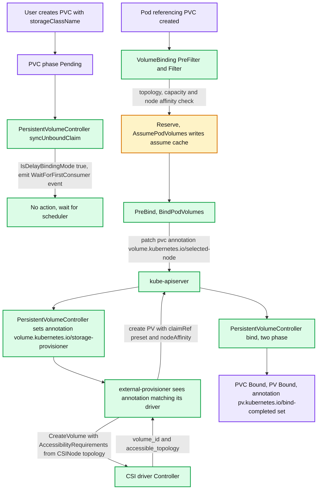

**What to notice**

- Under `WaitForFirstConsumer` the *scheduler*, not the PV controller, picks the node — provisioning is deliberately delayed so the volume is created in the right zone/rack. **[documented]**
- The scheduler does not create the PV. It writes one annotation and polls; `external-provisioner` does the CreateVolume. `BindPodVolumes` polls with a 1s interval up to `--bind-timeout-seconds`, default **600** (`pkg/scheduler/apis/config/v1/defaults.go`). **[documented]**
- The PV controller sets `volume.kubernetes.io/storage-provisioner` (and legacy `volume.beta.kubernetes.io/storage-provisioner`) — that annotation is the *only* dispatch mechanism telling one of N provisioners "this PVC is yours". **[documented]**
- `AnnBoundByController = pv.kubernetes.io/bound-by-controller` marks bindings the controller made (vs. user pre-binding), so a failed bind can be safely rolled back. **[documented]**
- Static binding takes the same `bind()` path; it just skips the provisioner.

### 3.2 Attach + mount path

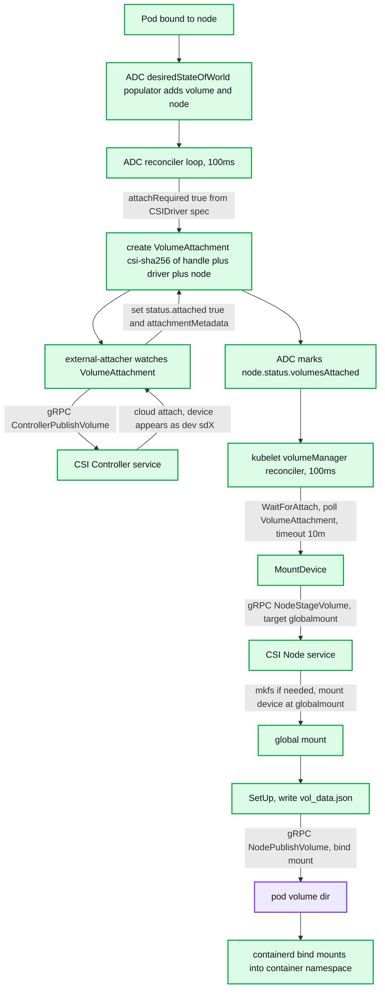

**What to notice**

- `NodeStageVolume` runs **once per volume per node**; `NodePublishVolume` runs **once per pod**. Two pods on one node sharing an RWX PVC share one global mount. **[documented]**
- The `VolumeAttachment` name is deterministic: `"csi-" + hex(sha256(volumeHandle + driverName + nodeName))` — `getAttachmentName()` in `pkg/volume/csi/csi_attacher.go:593`. This makes attach idempotent under controller restart. **[documented]**
- Kubelet blocks in `WaitForAttach` for `waitForAttachTimeout = 10 * time.Minute` (`pkg/kubelet/volumemanager/volume_manager.go:88`), while pod startup surfaces `FailedMount` after `podAttachAndMountTimeout = 2m3s`. That gap is why you see `Unable to attach or mount volumes` events long before the attach actually gives up. **[documented]**
- If `CSIDriver.spec.attachRequired` is `false`, ADC and the attacher are skipped entirely — no VolumeAttachment object is ever created.
- `vol_data.json` is written *before* `NodePublishVolume` so an unmount can proceed even if publish fails halfway. **[documented]**

### 3.3 Delete / unmount path

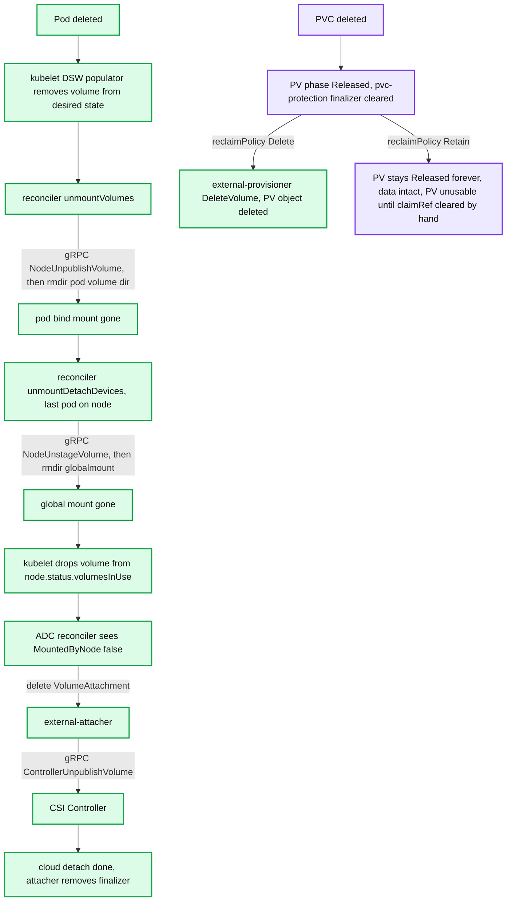

**What to notice**

- Unmount is strictly ordered `NodeUnpublish` → `NodeUnstage` → detach. Skipping a step is the single most common source of "volume is still attached" incidents.
- `node.status.volumesInUse` is kubelet's *only* way to tell ADC "I am done"; if kubelet is dead, that signal never arrives — this is exactly the case force-detach exists for.
- **Reclaim-policy footgun:** `Delete` is the default reclaim policy for *dynamically provisioned* PVs. Deleting the PVC destroys the backend volume. `Retain` leaves the PV in `Released` with a stale `claimRef` and it will never rebind — you must manually null `spec.claimRef`. **[documented]**
- `Recycle` is deprecated and only ever worked for HostPath/NFS; treat it as dead.
- `HonorPVReclaimPolicy` went **GA and locked in 1.33**, so from 1.34 deleting the PV *before* the PVC still honours `Delete` and calls `DeleteVolume` (previously it could leak the backend volume). **[documented — `pkg/features/kube_features.go:1313`]**

---

## 4. Sequence of operations

### 4.1 Dynamic provisioning with `WaitForFirstConsumer`

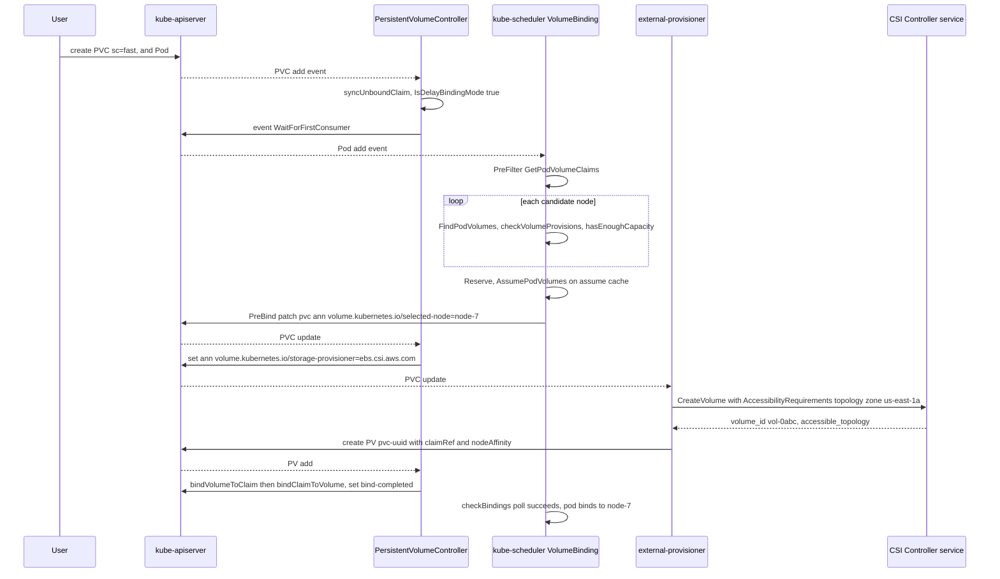

**What to notice**

- Two annotations, two controllers, one handshake. The scheduler writes `selected-node`; the PV controller translates it into `storage-provisioner`; the provisioner translates that into a `CreateVolume`.
- `hasEnoughCapacity()` (`binder.go:969`) consults `CSIStorageCapacity` objects published by `external-provisioner --enable-capacity`; without them the scheduler assumes infinite capacity and you get late `ProvisioningFailed`. **[documented]**
- The scheduler's `PreBind` is *not* transactional: if provisioning fails, `Unreserve` reverts the assume cache and the pod is requeued, but the `selected-node` annotation stays. `external-provisioner` must be idempotent on the volume name.
- `--strict-topology` on the provisioner controls whether only the selected node's topology segment is passed as `requisite`, or the whole cluster's segments as `preferred`. **[documented]**
- `--immediate-topology` defaults to **true**, so even Immediate binding passes cluster topology to `CreateVolume`. **[documented]**

### 4.2 Attach + stage + publish on pod start

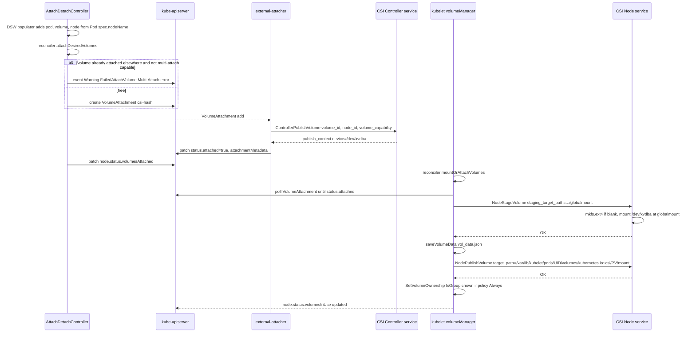

**What to notice**

- The attacher writes `attachmentMetadata` (e.g. the device name); kubelet passes it back verbatim as `publish_context` on `NodeStageVolume`. That is the only channel from controller-side to node-side of the same driver. **[documented]**
- `NodeStageVolume` is where `mkfs` happens for `volumeMode: Filesystem`. For `volumeMode: Block` there is no staging filesystem; the device is symlinked under `/var/lib/kubelet/pods/<uid>/volumeDevices/kubernetes.io~csi/<specName>`. **[documented — `pkg/volume/csi/csi_block.go:62`]**
- `fsGroup` chown happens after publish, in kubelet, unless `CSIDriver.spec.fsGroupPolicy: File` delegates it to the driver.
- Both node RPCs must be idempotent: kubelet retries every 100ms forever on failure with exponential backoff per-operation.
- ADC checks `IsOperationPending` *before* `GetAttachState` — the ordering is a fix for kubernetes#93902, a real TOCTOU that double-attached volumes. **[documented — `reconciler.go:335`]**

### 4.3 Volume expansion (online)

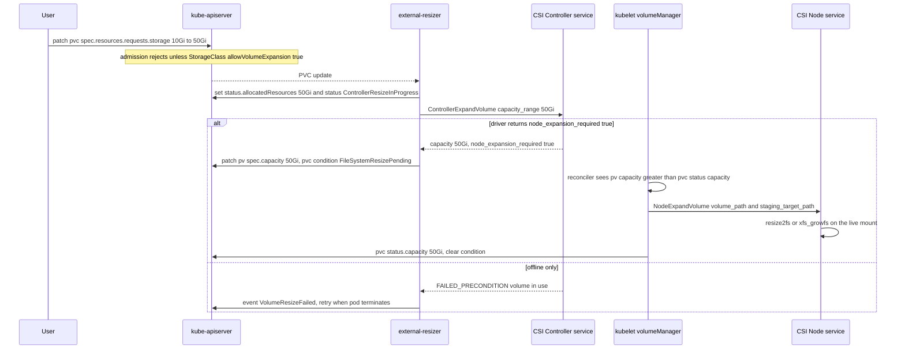

**What to notice**

- Shrink is never supported; the API server rejects a decrease. **[documented]**
- `RecoverVolumeExpansionFailure` is **GA and locked in v1.34** (`pkg/features/kube_features.go:1622`). It adds `status.allocatedResources` and `status.allocatedResourceStatuses` so a user can *reduce* a failed expansion request back down to a feasible value — before this, a typo of `100Ti` wedged the PVC permanently. **[documented]**
- The new status values: `ControllerResizeInProgress`, `ControllerResizeInfeasible`, `NodeResizeInProgress`, `NodeResizeInfeasible`; conditions `ControllerResizeError` / `NodeResizeError` (`staging/src/k8s.io/api/core/v1/types.go:665-689`). **[documented]**
- `external-resizer --handle-volume-inuse-error` defaults **true**, meaning the resizer watches *all pods in all namespaces* to know whether the PVC is in use — a real memory cost on large clusters. Set false for drivers with online expansion. **[documented]**
- Offline expansion requires the pod to be deleted; that is a driver capability, not a Kubernetes choice.

### 4.4 Snapshot creation

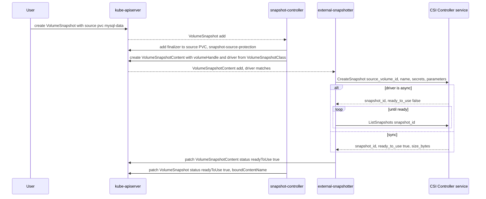

**What to notice**

- Two controllers, deliberately: `snapshot-controller` is driver-agnostic and runs once per cluster; `external-snapshotter` runs once per driver and is the only one that speaks CSI. **[documented]**
- The `VolumeSnapshot` CRDs are **not** in kube-apiserver by default — a cluster without them installed will silently accept nothing. This is the number-one snapshot support ticket.
- CSI `CreateSnapshot` guarantees only **crash consistency**. Nothing in this flow quiesces the application; a MySQL snapshot taken this way is equivalent to pulling the power cord. Application quiescing is out of scope for CSI by design.
- `--snapshot-orphan-sweep-interval` (default `5m`) on external-provisioner exists because a provisioner crash mid-snapshot-restore leaves the source-protection finalizer stuck. **[documented]**
- VolumeGroupSnapshot (`v1beta2` CRDs) provides multi-volume write-order consistency where the backend supports it; still opt-in via a sidecar flag. **[documented]**

### 4.5 Node failure with a stuck RWO volume

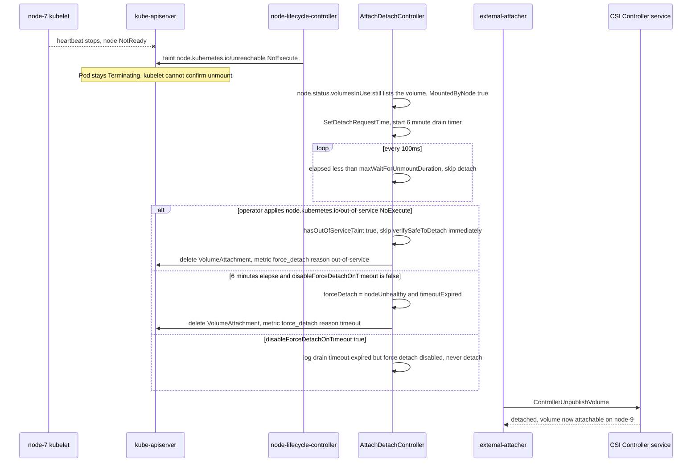

**What to notice**

- The 6-minute timer is `TimerConfig.ReconcilerMaxWaitForUnmountDuration = 6 * time.Minute` (`pkg/controller/volume/attachdetach/attach_detach_controller.go:92`). It is **not** configurable by flag. **[documented]**
- Force-detach is still enabled by default in v1.34. `--disable-force-detach-on-timeout` (default `false`) turns it off; the taint path then becomes the *only* recovery. **[documented — `cmd/kube-controller-manager/app/options/attachdetachcontroller.go:40`]**
- Force-detach is a **data-corruption risk by construction**: the old node may still have dirty page cache for that filesystem. If the node comes back and flushes, you get split-brain writes. The out-of-service taint is the safe path because the operator asserts the node is truly gone.
- `node.kubernetes.io/out-of-service` with `NoExecute` also force-deletes the pods, releasing the PVC for the replacement pod. **[documented — `staging/src/k8s.io/api/core/v1/well_known_taints.go:51`]**
- Nothing here is a fencing token. The storage backend is never told "reject writes from node-7".

---

## 5. State machines

### 5.1 PersistentVolume phases

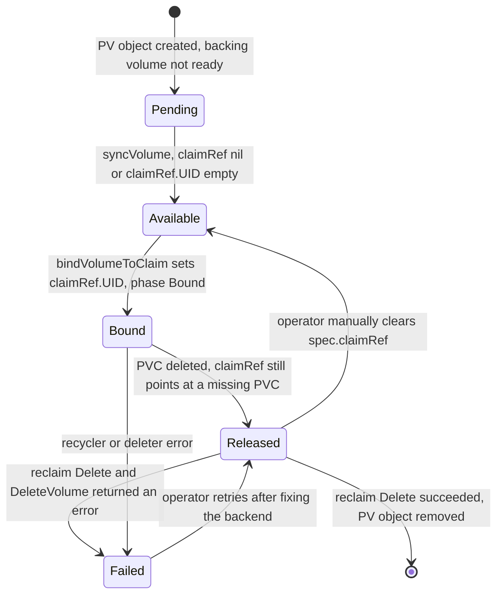

**What to notice**

- `Available` is reachable from `Released` **only by hand**. There is no automatic re-cycling of a `Retain` PV. **[documented — `syncVolume` at `pv_controller.go:562`]**
- On a `not found` claim, the controller re-checks the informer cache *then* does a live API GET before declaring `Released`, to avoid reclaiming a PV because of a lagging watch. **[documented — `pv_controller.go:606-625`]**
- `Failed` means the reclaim operation failed, not that the data is gone.
- `status.lastPhaseTransitionTime` (GA since 1.31) gives you the dwell time in each phase — use it for stuck-PV alerting.
- `kubernetes.io/pv-protection` finalizer keeps a Bound PV from disappearing while in use.

### 5.2 PersistentVolumeClaim phases

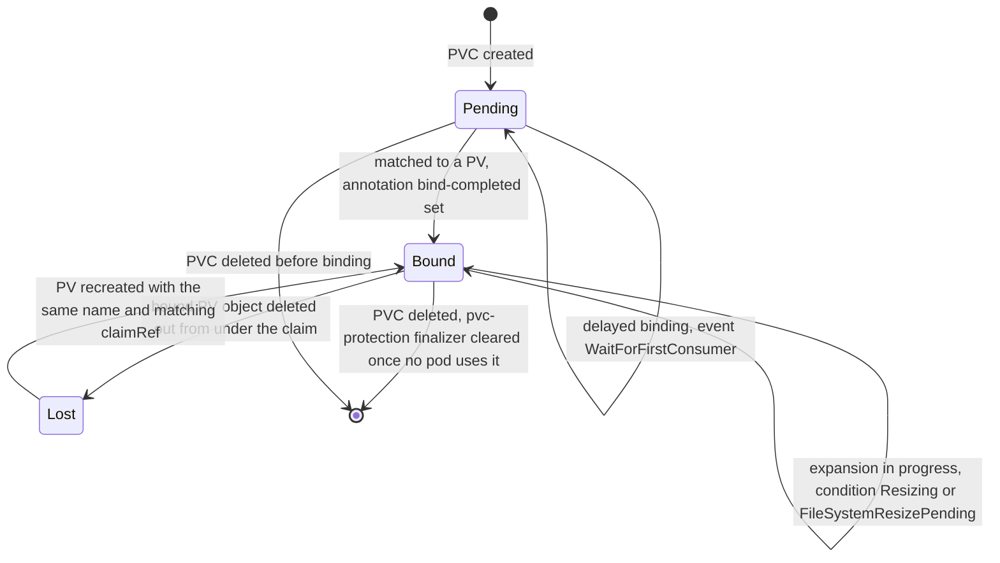

**What to notice**

- PVC has only three phases; everything interesting lives in `status.conditions` and `status.allocatedResourceStatuses`.
- `Lost` is not recoverable in practice — it means someone deleted a Bound PV.
- `kubernetes.io/pvc-protection` finalizer blocks deletion while any pod references the PVC; a stuck `Terminating` PVC almost always means a lingering pod object.
- `AnnBindCompleted` is the branch discriminator in `syncClaim`: present → `syncBoundClaim`, absent → `syncUnboundClaim` (`pv_controller.go:251`). **[documented]**

### 5.3 VolumeAttachment

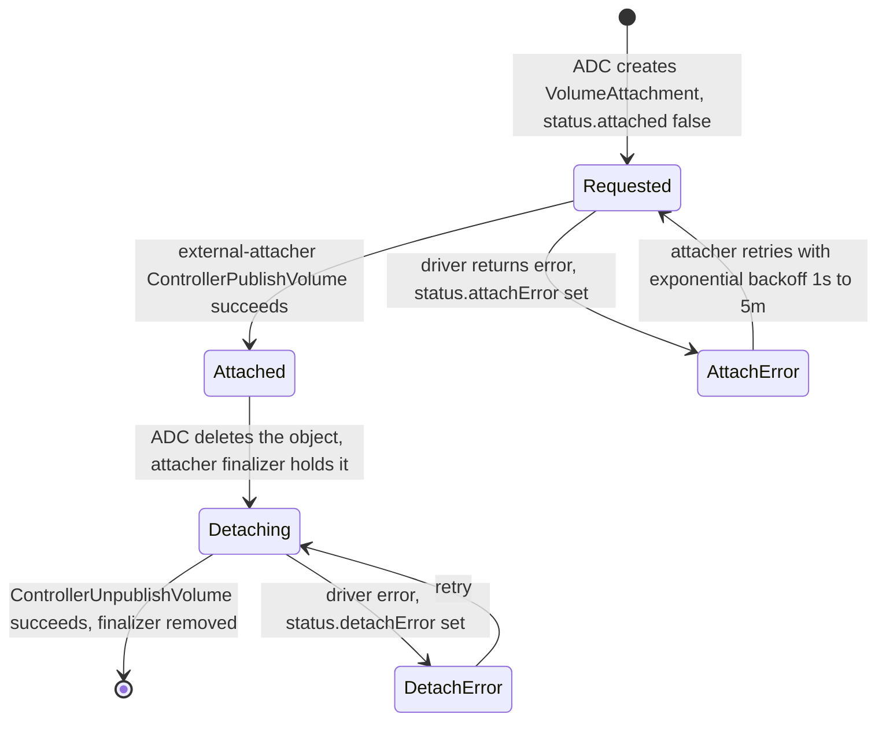

**What to notice**

- Deletion is *requested* by ADC but *completed* by the attacher removing its finalizer — that is why a crashed attacher leaves `VolumeAttachment` objects in `Terminating` forever and blocks the volume from moving nodes.
- Backoff bounds come from `--retry-interval-start` (1s) and `--retry-interval-max` (5m). **[documented]**
- `--reconcile-sync` (default `1m`) makes the attacher periodically re-`ListVolumes` and correct drift between its view and the driver's. **[documented]**
- There is no "detached" terminal state stored — the object simply goes away.

---

## 6. Component deep dives

### 6.1 PersistentVolumeController

- **Responsibility.** Bind PVCs to PVs, trigger dynamic provisioning by annotation, run reclaim on release. Lives in kube-controller-manager (`pkg/controller/volume/persistentvolume/pv_controller.go`).
- **Interfaces.** Watches `PersistentVolume`, `PersistentVolumeClaim`, `StorageClass`, `Node`, `Pod`. Writes PV `spec.claimRef`, PV/PVC `status.phase`, and annotations.
- **Data structures.** `persistentVolumeOrderedIndex` (`index.go`) — a `cache.Indexer` with an `accessmodes` index, keyed by stringified access-mode sets, each bucket **sorted ascending by capacity**. `findBestMatchForClaim` → `findByClaim` walks `allPossibleMatchingAccessModes()` from fewest-modes to most and binary-searches for the smallest PV ≥ request. Result: smallest-sufficient-fit, and a RWO claim will prefer a RWO-only PV over a RWO+ROX+RWX one. **[documented]**
- **Matching predicates** (`checkVolumeSatisfyClaim`, `pv_controller.go:259`): deletionTimestamp nil, capacity ≥ request, `storageClassName` equal, `volumeAttributesClassName` equal (when the gate is on), `volumeMode` equal, access modes superset, plus `spec.selector` label match and `claimRef` free-or-matching.
- **Two-phase bind** (`bind()`, `pv_controller.go:1094`): (1) `bindVolumeToClaim` sets `pv.spec.claimRef` incl. UID and `AnnBoundByController`, then `updateVolumePhase(Bound)`; (2) `bindClaimToVolume` sets `pvc.spec.volumeName` and `AnnBindCompleted`, then `updateClaimStatus(Bound)`. Each step is a separate API write, so a crash between them is normal and the next `syncVolume` repairs it. The `claimRef.UID` is the anti-ABA guard — a recreated PVC of the same name has a different UID and will not silently inherit the PV.
- **Concurrency.** Two workqueues (`volumeQueue`, `claimQueue`) with a **single worker goroutine each** (`volumeWorker`, `claimWorker`). All binding decisions are serialized cluster-wide. Full resync every `--pvclaimbinder-sync-period`, default **15s** (`pkg/controller/volume/persistentvolume/config/v1alpha1/defaults.go:39`); the kube-controller-manager flag default surfaced in tests is 15s as well. **[documented]**
- **Failure handling.** Everything is level-triggered; a lost write just means the next sync retries. `updateVolumeMigrationAnnotationsAndFinalizers` runs first on every sync to keep `pv.kubernetes.io/migrated-to` correct across CSI-migration toggles.
- **Knobs.** `--pvclaimbinder-sync-period=15s`, `--enable-dynamic-provisioning=true`, `--concurrent-... ` does *not* exist for this controller (single worker is not tunable) — a real scale limit.

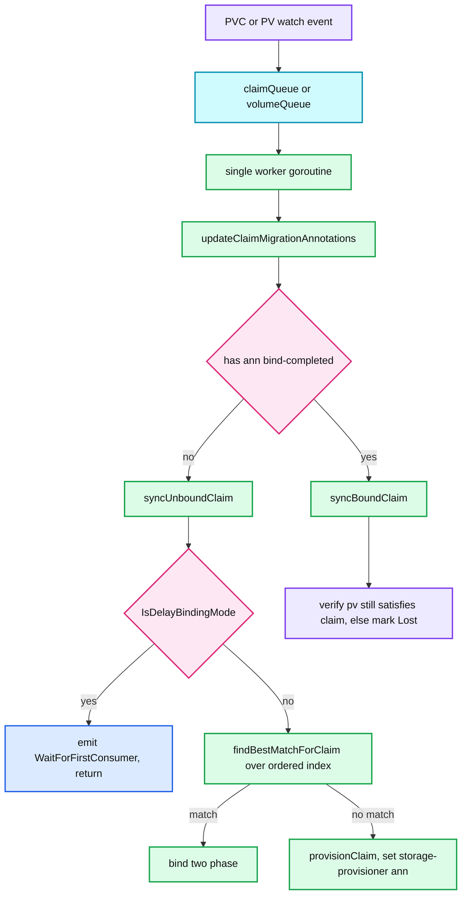

**What to notice**

- One worker per queue means bind throughput is a hard serial bottleneck at ~thousands of PVCs.
- The ordered index makes match cost O(log n) per access-mode bucket, not O(n) over all PVs.
- `provisionClaim` for CSI takes the *external* path (`provisionClaimOperationExternal`): it only writes an annotation, it never calls a provisioner.
- Delayed-binding claims are short-circuited before any matching work is done.

### 6.2 VolumeBinding scheduler plugin

- **Responsibility.** Make node selection storage-aware: node affinity of existing PVs, topology feasibility of to-be-provisioned volumes, and remaining capacity.
- **Extension points implemented** (`volume_binding.go`): `PreFilter`, `Filter`, `PreScore`, `Score`, `Reserve`, `PreBindPreFlight`, `PreBind`, `Unreserve`, plus `EventsToRegister` with queueing hints for `CSINode`, `PVC`, `StorageClass`, `CSIStorageCapacity`, `CSIDriver` changes.
- **Data structures.** `assumecache.AssumeCache` for PVs and PVCs — an informer-backed store that lets the scheduler pretend a binding already happened so the *next* pod in the same scheduling cycle sees consistent state. `PodVolumeClaims` splits claims into `boundClaims`, `unboundClaimsDelayBinding`, `unboundClaimsImmediate`.
- **Algorithm.** `FindPodVolumes` (`binder.go:280`) per node: `checkBoundClaims` (PV `nodeAffinity` must match the node), `findMatchingVolumes` (same smallest-fit logic as the PV controller but node-scoped), `checkVolumeProvisions` → `hasEnoughCapacity` against `CSIStorageCapacity` filtered by `nodeHasAccess` (topology label match). Conflict reasons are typed strings: `ErrReasonBindConflict`, `ErrReasonNodeConflict`, `ErrReasonNotEnoughSpace`, `ErrReasonPVNotExist`.
- **Scoring.** `buildScorerFunction` (`scorer.go`) turns per-class `requested/capacity` utilization into a score via a broken-linear `FunctionShape`, averaged across storage classes with equal weight. Gated by `StorageCapacityScoring`, **alpha, default off in 1.34** (`pkg/features/kube_features.go:1770`). **[documented]**
- **Concurrency.** `Filter` runs in the scheduler's parallel node-evaluation goroutines and is read-only against the assume caches. `PreBind` runs in the **async bind goroutine**, so a slow provision does not block the scheduling cycle — this is the whole reason `PreBind` exists instead of doing it in `Reserve`.
- **Failure handling.** `bindAPIUpdate` writes PV `claimRef` and PVC `selected-node`; `checkBindings` then polls with `wait.PollUntilContextTimeout(ctx, time.Second, bindTimeout, ...)`. On timeout, `Unreserve` → `RevertAssumedPodVolumes` and the pod is requeued.
- **Knobs.** `bindTimeoutSeconds` in `VolumeBindingArgs`, default **600**. `MutableCSINodeAllocatableCount` (beta, default off in 1.34) lets the driver refresh `allocatable.count` periodically via `nodeAllocatableUpdatePeriodSeconds`. **[documented]**

### 6.3 AttachDetachController

- **Responsibility.** Decide *which volumes should be attached to which nodes*, and create/delete `VolumeAttachment` objects. It never speaks CSI.
- **Data structures.** `DesiredStateOfWorld` (nodes → volumes → pods, built by the `populator` from scheduled Pods) and `ActualStateOfWorld` (attached volumes with `MountedByNode`, `DetachRequestedTime`, `AttachedConfirmed`). Attach state is a tri-state: `AttachStateAttached`, `AttachStateUncertain`, `AttachStateDetached` — "uncertain" exists because a timed-out `ControllerPublishVolume` may or may not have attached.
- **Reconciler loop.** `loopPeriod = 100ms` (`DefaultTimerConfig`), detach pass first then `attachDesiredVolumes`. Populator loop `1m`, full pod relist every `3m`. **[documented — `attach_detach_controller.go:91-94`]**
- **Multi-attach.** In `attachDesiredVolumes`, if `!util.IsMultiAttachAllowed(spec)` and `GetNodesForAttachedVolume` returns any node, it emits `FailedAttachVolume` "Volume is already exclusively attached to one node" and refuses. `SetMultiAttachError` dedupes the event. **This in-memory check is the entire at-most-one-writer enforcement for RWO.** **[documented — `reconciler.go:349-357`]**
- **Force detach.** As in §4.5: `forceDetach = !nodeIsHealthy && (elapsed > 6m) && !disableForceDetachOnTimeout`, or unconditional skip of `verifySafeToDetach` when the node carries `node.kubernetes.io/out-of-service`. Metrics: `attachdetach_controller_forced_detaches{reason="timeout"|"out-of-service"}`.
- **Ordering safety.** Before every detach it calls `RemoveVolumeFromReportAsAttached` + `UpdateNodeStatusForNode` and *aborts the detach if the status write fails*, re-adding the volume. This ensures `node.status.volumesAttached` is never optimistic. **[documented — `reconciler.go:248-266`]**
- **Concurrency.** One reconciler goroutine; each attach/detach is dispatched to `operationexecutor`, which keeps a per-`(volumeName, nodeName)` (or per-`volumeName` for non-multi-attach) pending-operation map and exponential backoff. So attaches to *different* nodes are parallel; attaches of the *same* RWO volume are strictly serialized.
- **Knobs.** `--attach-detach-reconcile-sync-period` (default **1m**, must be > 1s), `--disable-attach-detach-reconcile-sync` (default false), `--disable-force-detach-on-timeout` (default false). **[documented]**

### 6.4 kubelet volumeManager + reconciler

- **Responsibility.** Make the node's mounts match the pods admitted on this node. Owns `NodeStage`/`NodePublish` and their inverses, `fsGroup`, SELinux labelling, and `node.status.volumesInUse`.
- **Structure.** `desiredStateOfWorldPopulator` (loop `100ms`) reads the pod manager; `reconciler` (loop `100ms`) diffs DSW against ASW.
- **Reconcile order** (`reconciler.go:33`) and it matters: `unmountVolumes` → `mountOrAttachVolumes` → `unmountDetachDevices` → `cleanOrphanVolumes`. Unmount-before-mount is explicit so a volume moving between two pods *on the same node* is released before it is re-taken. Unmounts are gated on `readyToUnmount()` — ASW reconstruction must be complete first, otherwise a kubelet restart would unmount live volumes.
- **Reconstruction after restart.** `reconstructVolumes` walks `/var/lib/kubelet/pods/*/volumes/*/*` on disk, reads `vol_data.json` in each, and rebuilds ASW via `ConstructVolumeSpec`. `volumesNeedUpdateFromNodeStatus` holds volumes whose `devicePath` can only come from `node.status.volumesAttached`; `updateLastSyncTime` (and therefore `volumesInUse` reporting) is withheld until that list drains. **[documented — `pkg/kubelet/volumemanager/reconciler/reconstruct.go`]**
- **On-disk layout.**

```
/var/lib/kubelet/
├── plugins_registry/
│   └── ebs.csi.aws.com-reg.sock                # created by node-driver-registrar
├── plugins/
│   ├── ebs.csi.aws.com/
│   │   └── csi.sock                            # created by the CSI node driver
│   └── kubernetes.io/csi/
│       └── ebs.csi.aws.com/
│           └── 9f2b1c...e41/                   # sha256(volumeHandle)
│               ├── globalmount                 # NodeStageVolume staging_target_path
│               └── vol_data.json
└── pods/
    └── 3f1a9c7e-2b44-4d0e-9a11-0c7d6e5f8a20/   # pod UID
        ├── volumes/
        │   ├── kubernetes.io~csi/
        │   │   └── pvc-8c1e-.../
        │   │       ├── mount                   # NodePublishVolume target_path
        │   │       └── vol_data.json
        │   ├── kubernetes.io~empty-dir/cache/
        │   └── kubernetes.io~projected/kube-api-access-x7k2p/
        ├── volumeDevices/
        │   └── kubernetes.io~csi/
        │       └── pvc-4a7f-...                # symlink to the raw block device
        ├── volume-subpaths/
        │   └── config/app/0                    # bind mount per subPath, per container
        └── containers/
```

  `globalmount` comes from `makeDeviceMountPath` = `<pluginDir>/<driver>/<sha256(volumeHandle)>/globalmount` (`csi_attacher.go:598-623`); the per-pod path is `GetCSIMounterPath(targetPath)` = `.../mount` (`csi_util.go:176`). **[documented]**

  `vol_data.json` keys are exactly: `specVolID`, `volumeHandle`, `driverName`, `nodeName`, `attachmentID`, `volumeLifecycleMode`, and `seLinuxMountContext` (`csi_mounter.go:44-60`). **[documented]**

- **Concurrency.** One reconciler goroutine dispatching into `operationexecutor`; per-volume operations are serialized by a `nestedpendingoperations` map keyed on `(volumeName, podName, nodeName)`. Mounts for different volumes proceed in parallel.
- **Knobs / constants** (compile-time, not flags): `reconcilerLoopSleepPeriod=100ms`, `desiredStateOfWorldPopulatorLoopSleepPeriod=100ms`, `podAttachAndMountTimeout=2m3s`, `podAttachAndMountRetryInterval=300ms`, `waitForAttachTimeout=10m`. **[documented — `volume_manager.go:59-88`]** CSI gRPC call timeout is `csiTimeout = 2m` unless the driver's `CSIDriver` object overrides it via the registration handler's `pluginClientTimeout`. **[documented — `csi_plugin.go:56`]**

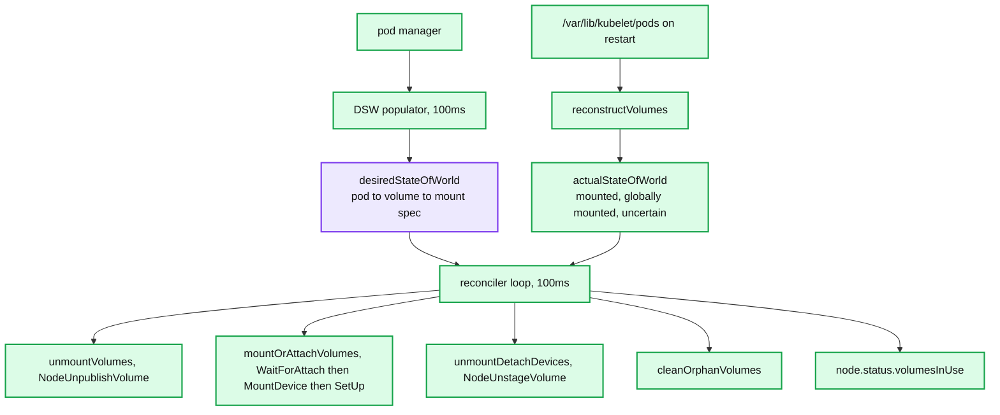

**What to notice**

- ASW is rebuilt from disk, not from the API server — kubelet must be able to clean up after itself with no control plane.
- `volumesInUse` reporting is intentionally withheld until reconstruction finishes, to prevent a restarted kubelet from telling ADC "nothing is mounted".
- The `mount` and `globalmount` leaves are ordinary directories that become mountpoints; `rmdir` (not `RemoveAll`) is used on cleanup so a still-mounted path fails loudly instead of deleting user data. **[documented — `kubelet_volumes.go:117-135`]**

### 6.5 node-driver-registrar

- **Responsibility.** Tell kubelet that a driver exists and where its socket is. Zero API-server interaction, therefore **zero RBAC**. **[documented]**
- **Protocol.** Creates `/var/lib/kubelet/plugins_registry/<driver>-reg.sock` implementing the kubelet `pluginregistration.v1` `Registration` service (`GetInfo`, `NotifyRegistrationStatus`). Kubelet's plugin watcher inotifies that directory, dials the reg socket, gets `{type: CSIPlugin, name, endpoint, supported_versions}`, then dials the driver's own socket and calls `GetPluginInfo` and `NodeGetInfo`.
- **Effect.** Kubelet creates/updates the `CSINode` object with `spec.drivers[].nodeID`, `topologyKeys`, and `allocatable.count` from `NodeGetInfo`'s `max_volumes_per_node`.
- **Failure handling.** `--mode=kubelet-registration-probe` as an exec liveness probe is the documented workaround for registration silently wedging (kubernetes-csi/node-driver-registrar#143). Without it, a driver can look Running and be invisible to kubelet.
- **Knobs.** `--csi-address` (in-pod path, e.g. `/csi/csi.sock`), `--kubelet-registration-path` (host path kubelet will dial), `--timeout` default **1s**, `--http-endpoint` for `/healthz`. **[documented]**

### 6.6 CSI sidecars

| Sidecar | Watches | Calls | Key defaults **[documented]** |
|---|---|---|---|
| `external-provisioner` | PVC with matching `storage-provisioner` ann; PV with matching `provisioned-by` | `CreateVolume`, `DeleteVolume`, `GetCapacity` | `--timeout=15s`, `--worker-threads=100`, `--retry-interval-start=1s`, `--retry-interval-max=5m`, `--volume-name-prefix=pvc`, `--capacity-poll-interval=1m`, `--capacity-ownerref-level=1`, `--prevent-volume-mode-conversion=true` |
| `external-attacher` | `VolumeAttachment` | `ControllerPublishVolume`, `ControllerUnpublishVolume`, `ListVolumes` | `--timeout=15s`, `--worker-threads=10`, `--reconcile-sync=1m`, `--retry-interval-max=5m` |
| `external-resizer` | PVC where `spec.resources` > `status.capacity` | `ControllerExpandVolume`, `ControllerModifyVolume` | `--timeout=10s`, `--workers=10`, `--handle-volume-inuse-error=true` |
| `external-snapshotter` | `VolumeSnapshotContent` for its driver | `CreateSnapshot`, `DeleteSnapshot`, `ListSnapshots` | `--csi-address=/run/csi/socket` |
| `livenessprobe` | — | `Probe` | exposes `/healthz` for the driver container's own liveness probe |
| `node-driver-registrar` | — | `GetPluginInfo` | `--timeout=1s` |

- **Leader election.** All controller-side sidecars support `--leader-election` with `--leader-election-lease-duration=15s`, `--renew-deadline=10s`, `--retry-period=5s`. Election is **per sidecar**, using a `Lease` named after the driver — so the provisioner leader and the attacher leader can be in different pods. That is fine because their state lives entirely in API objects.
- **Why sidecars at all.** Three reasons: (1) the driver gets no cluster credentials; (2) Kubernetes-version-specific API handling (annotations, finalizers, CRDs) is upgraded independently of the driver; (3) the same driver binary works on Nomad/Mesos/standalone with no Kubernetes types linked in. **[documented — kubernetes-csi/docs]**
- **Failure mode common to all.** Exponential backoff on CSI errors; a driver returning a *non-final* gRPC code (`DeadlineExceeded`, `Unavailable`) causes an infinite idempotent retry, which is exactly why the spec mandates idempotency by `name`/`volume_id`.

### 6.7 CSI driver — Controller and Node plugins

- **Wire format.** gRPC over a unix domain socket. Three services: `Identity` (`GetPluginInfo`, `GetPluginCapabilities`, `Probe`), `Controller`, `Node`. **[documented — csi.proto]**
- **Controller RPCs.** `CreateVolume`, `DeleteVolume`, `ControllerPublishVolume`, `ControllerUnpublishVolume`, `ValidateVolumeCapabilities`, `ListVolumes`, `GetCapacity`, `ControllerGetCapabilities`, `CreateSnapshot`, `DeleteSnapshot`, `ListSnapshots`, `ControllerExpandVolume`, `ControllerGetVolume`, `ControllerModifyVolume`.
- **Node RPCs.** `NodeStageVolume`, `NodeUnstageVolume`, `NodePublishVolume`, `NodeUnpublishVolume`, `NodeGetVolumeStats`, `NodeExpandVolume`, `NodeGetCapabilities`, `NodeGetInfo`.
- **Post-1.34 / spec-head note:** CSI spec HEAD adds `ControllerGetVolumeHealth`, `NodeGetVolumeHealth`, `NodeGetStorageHealth`, `GetSnapshot`, `CreateVolumeGroupSnapshot`/`DeleteVolumeGroupSnapshot`/`GetVolumeGroupSnapshot`, and the snapshot-metadata RPCs `GetMetadataAllocated`/`GetMetadataDelta`. These are not consumed by kubelet in v1.34. **[documented — spec master `csi.proto`; consumption status inferred]**
- **Idempotency contract.** `CreateVolume` keyed on `name` must return the same volume for the same name+parameters or `ALREADY_EXISTS` if incompatible. `ControllerPublishVolume` on an already-published volume must return `OK`. `NodeStageVolume` on an already-staged path must return `OK`. Non-idempotency here surfaces as duplicate cloud disks and orphaned mounts. **[documented — CSI spec]**
- **CSIDriver object as the driver's contract with kubelet** (`storage/v1` `CSIDriverSpec`): `attachRequired`, `podInfoOnMount`, `volumeLifecycleModes`, `storageCapacity`, `fsGroupPolicy`, `tokenRequests`, `requiresRepublish`, `seLinuxMount`, `nodeAllocatableUpdatePeriodSeconds`. **[documented]**
- **`fsGroupPolicy`**: `ReadWriteOnceWithFSType` (default), `File`, `None`. With `File`, kubelet skips the chown and the driver is responsible. This is the escape hatch for the chown storm (§9).
- **Cloning.** `pvc.spec.dataSource` (or `dataSourceRef`) pointing at another PVC makes `external-provisioner` pass `CreateVolumeRequest.volume_content_source = VolumeContentSource_Volume`; pointing at a `VolumeSnapshot` sets `VolumeContentSource_Snapshot`. Both require the source to be in the same namespace and the same driver; `--prevent-volume-mode-conversion=true` (default) blocks Block↔Filesystem conversion on restore. **[documented]**
- **Topology.** `StorageClass.allowedTopologies` restricts `CreateVolume`'s `AccessibilityRequirements.requisite` to an operator-chosen set of segments; the segment keys must match `CSINode.spec.drivers[].topologyKeys` reported from `NodeGetInfo.accessible_topology`. Mismatched keys are the classic "provisioned in the wrong zone" bug. **[documented]**
- **Volume health.** `CSIVolumeHealth` is still **alpha, default off, and has been since 1.21** (`pkg/features/kube_features.go:1162`) — treat node-side health reporting via `NodeGetVolumeStats` abnormal conditions as effectively unavailable in v1.34. **[documented]**
- **`seLinuxMount: true`** lets kubelet pass `-o context=` on mount instead of recursively relabelling. Gate `SELinuxMount` is **beta, default off in 1.34**; `SELinuxChangePolicy` is **beta, default on**; `SELinuxMountReadWriteOncePod` is **beta, default on since 1.28**. Pod field `spec.securityContext.seLinuxChangePolicy` takes `MountOption` or `Recursive`. **[documented — `pkg/features/kube_features.go:1671-1685`]**
- **Concurrency.** The spec makes no parallelism guarantee; in practice sidecars issue up to `--worker-threads` concurrent calls, and kubelet issues one call per volume at a time. Drivers must serialize per-`volume_id` internally.

### 6.8 snapshot-controller

- **Responsibility.** Reconcile the driver-agnostic half of snapshots: bind `VolumeSnapshot` ↔ `VolumeSnapshotContent`, manage the source PVC protection finalizer, populate `status.readyToUse` and `restoreSize`.
- **API surface.** CRDs in group `snapshot.storage.k8s.io`: `VolumeSnapshot` (namespaced), `VolumeSnapshotContent` (cluster-scoped), `VolumeSnapshotClass` (cluster-scoped), plus `VolumeGroupSnapshot*` at `v1beta2`. **These are not built into kube-apiserver** — they ship with external-snapshotter and must be installed by the distro. **[documented]**
- **Concurrency.** Two workqueues (snapshot, content) with exponential backoff; leader-elected, one active replica per cluster.
- **Failure handling.** Deletion policy on `VolumeSnapshotClass` (`Delete` | `Retain`) governs whether removing the `VolumeSnapshot` removes the backend snapshot — the exact same footgun as PV reclaim policy, in a second place.
- **What it does not do.** No quiescing, no ordering across volumes (outside VolumeGroupSnapshot), no verification that the snapshot is restorable.

---

## 7. Guarantees

- **Durability.** Kubernetes guarantees nothing. Durability is whatever the backend provides; the API only guarantees that `DeleteVolume` is not called while a PV is `Bound` and protected by `kubernetes.io/pv-protection`. **[documented]**
- **At-most-one-writer (RWO).** Guaranteed *only* by the AttachDetachController's refusal to create a second `VolumeAttachment`, and by most block backends refusing a second attach. It is **not** guaranteed under force-detach, under a partitioned kubelet that still has the filesystem mounted, or for RWX/file-backed volumes.
- **RWOP (`ReadWriteOncePod`).** GA since 1.29; enforced by kube-scheduler + kubelet admission — a second pod referencing the PVC is not admitted. This is the only access mode with real single-*pod* enforcement, and it is enforced in the control plane, not at the block layer. **[documented]**
- **Access modes generally.** `ReadWriteOnce`, `ReadOnlyMany`, `ReadWriteMany` are **matching hints for the binder**, not enforcement. Nothing stops two pods on the same node from both writing to an RWO ext4 mount — and doing so corrupts it. RWO means "one *node*", not "one pod".
- **Mount ordering.** Guaranteed: all volumes for a pod are mounted before any container (including init containers) starts. Not guaranteed: ordering *among* volumes, or that `subPath` sources exist before the mount.
- **Bind stability.** Once `pv.spec.claimRef.UID` is set, the PV will never bind to a different PVC, even one with the same namespace/name. **[documented]**
- **Expansion.** Guaranteed monotonic (no shrink). Not guaranteed atomic: the PV can report the new size while the filesystem on the node has not been grown yet — that window is the `FileSystemResizePending` condition.
- **Explicitly not guaranteed.** Fencing. There is no storage-level epoch/token. A node that loses its lease can keep writing until the backend or the operator stops it.

---

## 8. Failure modes

| Failure | Detection | Recovery | Blast radius |
|---|---|---|---|
| Pod stuck `Terminating`, volume never unmounts | `kubectl describe pod` shows no events; `mount \| grep <pv>` on node | Find the process holding the mount (`fuser -m`); most often a container that ignored SIGTERM, or a `subPath` bind held by a zombie | One pod; blocks the PVC for its replacement |
| Multi-attach deadlock | `Warning FailedAttachVolume ... Volume is already exclusively attached to one node` | Delete the old pod (force if needed); if the node is gone, apply `node.kubernetes.io/out-of-service:NoExecute` | One StatefulSet replica; can cascade if an operator retries hard |
| Force-detach data corruption | Silent. Detect after the fact by fsck errors or DB corruption | Prevention only: `--disable-force-detach-on-timeout=true` plus a non-graceful-shutdown runbook | The volume's entire dataset |
| Expansion stuck | PVC condition `FileSystemResizePending` never clears, or `ControllerResizeInfeasible` | With `RecoverVolumeExpansionFailure` (GA in 1.34) reduce `spec.resources.requests.storage` back toward `status.allocatedResources`; check `external-resizer` logs | One PVC |
| `orphaned pod "<uid>" found, but volume paths are still present` in kubelet log | Repeating kubelet error, `/var/lib/kubelet/pods/<uid>` never removed | The pod object is gone but a mount remains; unmount manually then `rmdir`. Never `rm -rf` — that deletes through the mount into the backing store | One node's disk; noisy logs mask real errors |
| CSI driver crash-loop | Driver DaemonSet `CrashLoopBackOff`; all pods with that driver's PVCs stuck at `ContainerCreating` | Fix driver; note kubelet retries mounts forever at 100ms so recovery is automatic once the socket returns | Every stateful pod using that driver on affected nodes |
| `VolumeAttachment` stuck `Terminating` | Object has `deletionTimestamp` and an `external-attacher` finalizer | Attacher is dead or its `ControllerUnpublish` fails; fix the attacher. Removing the finalizer by hand skips the backend detach and risks multi-attach | Blocks failover of that volume |
| Snapshot inconsistent | Restore fails or DB replays a broken log | CSI gives crash consistency only; quiesce in the app (`FLUSH TABLES WITH READ LOCK`, `fsfreeze`, a pre-hook) before snapshotting | Every restore from that snapshot |
| PV `Released` and never reused | PV phase `Released` with a stale `claimRef` | Reclaim policy `Retain`: clear `spec.claimRef` to return it to `Available` | Capacity leak |

---

## 9. Scalability & performance

- **Per-node attach limits.** Advertised via `CSINode.spec.drivers[].allocatable.count` from `NodeGetInfo.max_volumes_per_node`, and enforced by the `NodeVolumeLimits` scheduler plugin. Real caps: AWS Nitro ~26–128 depending on instance and ENI count, GCE PD 16–128, Azure Disk = 2× vCPU capped by SKU. Hitting the cap manifests as unschedulable pods with `node(s) exceed max volume count`.
- **`MutableCSINodeAllocatableCount`** (beta, default off in 1.34) lets a driver refresh that count at runtime via `CSIDriver.spec.nodeAllocatableUpdatePeriodSeconds` — important on instance types where the limit varies with attached ENIs. **[documented]**
- **Serialized attach latency.** For a single RWO volume, `operationexecutor` serializes on `volumeName` alone (not `volumeName+node`), so a detach from node A and an attach to node B for the same volume are strictly sequential. Failover latency ≈ detach RTT + attach RTT + up to 100ms of reconciler jitter + kubelet's next 100ms tick. On cloud block storage that is typically 20–60s, and up to 6m+ if the old node is dead and you wait for the force-detach timer.
- **Mount storms after node reboot.** Every pod's volumes are reconstructed from disk, then re-staged and re-published. With 50 volumes on a node and a driver that takes 2s per `NodeStageVolume`, kubelet's parallel `operationexecutor` helps, but iSCSI/multipath drivers serialize on the initiator and you see multi-minute node-ready-to-pods-ready gaps.
- **fsGroup chown storms.** With `fsGroupChangePolicy: Always` (the default) kubelet recursively `lchown`s the entire volume on **every** pod start. On a 500 GB volume with millions of inodes this is tens of minutes. `pkg/volume/volume_linux.go:119` literally logs *"Setting volume ownership for %s is taking longer than expected, consider using OnRootMismatch"*. Fix: `fsGroupChangePolicy: OnRootMismatch` (checks only the top-level dir's owner and mode), or `CSIDriver.spec.fsGroupPolicy: None`/`File`. **[documented]**
- **SELinux relabel storms** are the same problem: recursive `chcon` on every mount. `seLinuxChangePolicy: MountOption` + `CSIDriver.spec.seLinuxMount: true` turns it into a single `-o context=` mount option — O(1) instead of O(inodes). **[documented]**
- **Control-plane bottlenecks.** The PV controller runs **one** claim worker and **one** volume worker; the ADC runs one reconciler goroutine. At ~10k PVCs, bind latency becomes visible. `external-provisioner --worker-threads=100` is the parallel part; the binder is not.
- **Hot spots.** `CSIStorageCapacity` objects are one per (storage class × topology segment) per driver; with many classes and zones this is a meaningful watch load on kube-scheduler.

---

## 10. Trade-offs & alternatives

- **Why out-of-tree CSI with sidecars.** In-tree drivers meant vendor code in the kube-controller-manager binary: a bug in a storage driver crashed the control plane, vendor release cadence was pinned to Kubernetes releases, and vendor credentials lived in core components. CSI moves all of it into pods with narrow RBAC and independent versioning. The cost is operational sprawl — a driver is now a Deployment + a DaemonSet + 4–6 sidecars + CRDs.
- **CSI migration status at v1.34.** All cloud in-tree plugins are **removed from `pkg/volume/`**: AWS EBS, GCE PD, Azure Disk, Azure File, Cinder, vSphere. Only translation shims survive in `staging/src/k8s.io/csi-translation-lib/plugins/` to rewrite existing in-tree PV specs to CSI. Remaining in-tree volume plugins are: `configmap`, `secret`, `projected`, `downwardapi`, `emptydir`, `hostpath`, `local`, `nfs`, `iscsi`, `fc`, `image`, `git_repo` (deprecated), `portworx`, `flexvolume` (deprecated), and `csi` itself. **[documented — directory listing of `release-1.34`]** `CSIMigrationPortworx` is GA/locked since 1.33 and scheduled for removal in 1.36. **[documented]**
- **vs. Docker volume plugins.** Node-local, no attach/mount split, no topology, no dynamic provisioning — it could not express "create a disk in us-east-1a because that's where the pod will land".
- **vs. Mesos.** Mesos' persistent volumes were reservations against an agent's local disk: strong locality, no cross-node mobility. Kubernetes chose mobility and pays for it with the attach/detach state machine and force-detach hazards.
- **vs. "no PV at all".** S3-backed analytics, Snowflake-style storage/compute separation, Kafka tiered storage: the pod is stateless and durability is an HTTP call. Strictly simpler — no attach, no fencing, no multi-attach — and correct whenever object-store latency is acceptable.
- **Block vs. file vs. object for stateful workloads.** Block (EBS/PD/Ceph RBD) gives you POSIX + low latency but RWO and slow failover. File (EFS/Azure Files/CephFS/NFS) gives RWX and instant failover but weak/absent POSIX locking semantics and much worse fsync latency — the classic reason "Postgres on NFS" goes wrong. Object gives infinite scale and no POSIX at all.
- **Distributed storage on Kubernetes.** *Rook/Ceph* runs Ceph as operator-managed pods, exposing RBD (block, RWO) and CephFS (file, RWX) via `ceph-csi` — maximum capability, maximum operational surface (mon quorum, OSD rebalance, PG tuning). *Longhorn* uses one lightweight per-volume controller with synchronous replicas behind an iSCSI frontend; replication factor is the only durability knob. *OpenEBS Mayastor* uses SPDK + NVMe-oF for user-space poll-mode replication and is the only one targeting NVMe-class latency.
- **Why databases on Kubernetes work now.** Not because volumes got better. Because the pattern changed: replication moved *into the application* (Postgres streaming replication, Kafka ISR, Cassandra quorums), storage moved to **local NVMe** via local PVs with node affinity (no attach, no detach, no fencing problem), and an **operator** owns failover semantics that Kubernetes primitives cannot express. The volume is then just a fast disk that happens to be pinned to a node.

### StatefulSet storage semantics

- `volumeClaimTemplates` produce PVCs named **`<template-name>-<statefulset-name>-<ordinal>`**, e.g. `data-mysql-0`. The name is stable across pod recreation — that is the entire identity guarantee.
- `persistentVolumeClaimRetentionPolicy` (`whenDeleted` / `whenScaled`, each `Retain` | `Delete`) is **GA and locked since v1.32** (`StatefulSetAutoDeletePVC`). Default `Retain` for both, meaning scaling down leaves PVCs behind on purpose. **[documented]**
- StatefulSet + RWO gives at-most-one-writer **by convention only**: the controller creates pod N+1 only after pod N is Running-and-Ready, and ADC refuses a second attach. Neither is a fence. A partitioned node running `mysql-0` with the volume still mounted, plus a force-detach and a new `mysql-0` elsewhere, is split-brain.
- **The fencing gap.** There is no storage fencing token in the CSI spec or the Kubernetes API. The operational workaround is the non-graceful node shutdown flow: the operator (or an automation) applies `node.kubernetes.io/out-of-service:NoExecute` to assert the node is dead, which force-deletes pods and skips `verifySafeToDetach`. Applying it to a node that is merely partitioned is how you cause the corruption you were trying to avoid.

### Local and ephemeral storage

- `emptyDir` on disk lives in `/var/lib/kubelet/pods/<uid>/volumes/kubernetes.io~empty-dir/<name>` and counts against ephemeral-storage. With `medium: Memory` it is a tmpfs and **counts against the pod's memory limit** (`SizeMemoryBackedVolumes` GA/locked since 1.32) — before that, a tmpfs could OOM the node without being attributed. **[documented]**
- `hostPath` is the classic escalation primitive: mounting `/var/lib/kubelet` or `/etc/kubernetes` from a pod is root on the node. Should be blocked by Pod Security Admission `baseline`/`restricted`.
- **Local PVs** are statically provisioned PVs with `spec.local.path` plus a **required** `spec.nodeAffinity`. Almost always `volumeBindingMode: WaitForFirstConsumer`, because binding before scheduling would pin the pod to an arbitrary node. There is no dynamic provisioner in-tree; `sig-storage-local-static-provisioner` fills that role.
- **Ephemeral-storage** `requests`/`limits` are enforced by kubelet: exceeding the limit evicts the pod; node-level `nodefs.available` / `imagefs.available` eviction thresholds evict by usage rank. Enforcement is by periodic `du`-style accounting unless `LocalStorageCapacityIsolationFSQuotaMonitoring` (**beta, default off in 1.34**) enables project quotas. **[documented]**
- `LocalStorageCapacityIsolation` is no longer a feature gate — it is the kubelet config field `localStorageCapacityIsolation`, **default `true`** (`pkg/kubelet/apis/config/v1beta1/defaults.go:301`). Set false only on rootless environments. **[documented]**

### Ephemeral volume flavours

- **Generic ephemeral volumes** (`pod.spec.volumes[].ephemeral.volumeClaimTemplate`): the `ephemeral-volume-controller` creates a real PVC named **`<pod-name>-<volume-name>`** (`staging/src/k8s.io/component-helpers/storage/ephemeral/ephemeral.go:41`) owned by the pod, so it goes through the entire normal PV/CSI pipeline — provisioning, topology, snapshots, expansion — and is garbage-collected with the pod. **[documented]**
- **CSI inline ephemeral volumes** (`pod.spec.volumes[].csi`): no PVC, no PV, no attach. Only `NodePublishVolume` is called, with parameters straight from the pod spec. Requires `CSIDriver.spec.volumeLifecycleModes` to include `Ephemeral`. Use only for driver-generated content (secrets-store CSI, cert injection) — there is no capacity accounting and the pod spec becomes a driver API surface.

### subPath

- `subPath` bind-mounts a sub-directory of a volume into the container, materialised as `/var/lib/kubelet/pods/<uid>/volume-subpaths/<volume>/<container>/<index>`.
- **CVE-2017-1002101**: subPath handling followed symlinks in the volume, letting a container read/write arbitrary host files. **CVE-2021-25741**: a symlink-exchange race between the check and the mount reintroduced host filesystem access. Both were fixed by resolving the path inside the container's mount namespace and re-verifying. **[documented]**
- `subPathExpr` (downward-API expansion) exists so you don't have to hardcode pod names; it does not change the security model.
- Operational gotcha independent of security: a container using `subPath` does **not** receive updates to a ConfigMap/Secret projected through it, because the bind mount is taken once.

---

## 11. Staff-level questions

**1. A StatefulSet pod's node partitions but the kubelet keeps running. The pod is `Terminating`, the replacement is `Pending` with a Multi-Attach error. Six minutes later the volume force-detaches and the new pod starts. What can go wrong, and what would you deploy to prevent it?**
The old kubelet still has the filesystem mounted and may hold dirty page cache. Force-detach removes the cloud attachment but does not stop the old node from having written, or from writing on reconnect if the device path is reused. Result: two writers' worth of metadata in one ext4/xfs, i.e. silent corruption. Prevention: `--disable-force-detach-on-timeout=true` on kube-controller-manager, plus an automated non-graceful-shutdown path that only applies `node.kubernetes.io/out-of-service:NoExecute` after an out-of-band assertion (cloud API instance-terminated, BMC power state, or a real fence). The correct fix at the storage layer is a fencing token, which CSI does not have.

**2. Why does `NodeStageVolume` exist at all, given `NodePublishVolume` could mount the device directly?**
Because a volume can be used by multiple pods on one node, and mkfs/mount/iSCSI-login/multipath-setup are node-scoped and expensive. Staging factors the once-per-node work out of the once-per-pod work: `NodeStageVolume` mounts at `.../<sha256(handle)>/globalmount`, and each pod gets a cheap bind mount. It is also the correctness boundary for unmount ordering — `NodeUnstageVolume` may only run after the *last* `NodeUnpublishVolume`, which is what kubelet's `unmountVolumes` → `unmountDetachDevices` ordering enforces.

**3. `volumeBindingMode: Immediate` on a zonal StorageClass in a 3-zone cluster. Describe the failure and why `WaitForFirstConsumer` fixes it.**
Immediate provisions the volume as soon as the PVC exists, before any pod is scheduled, so the provisioner picks a zone arbitrarily. The scheduler then must place the pod in that zone. If the zone has no capacity, or the pod has affinity elsewhere, the pod is permanently unschedulable with `node(s) had volume node affinity conflict` — and you cannot move the volume. `WaitForFirstConsumer` inverts the order: the scheduler picks the node first (running `Filter` against topology and `CSIStorageCapacity`), writes `volume.kubernetes.io/selected-node`, and only then does `external-provisioner` call `CreateVolume` with the right `AccessibilityRequirements`. The cost is that the PVC sits `Pending` until a consumer exists, which breaks naive "pre-provision then deploy" workflows.

**4. A 2 TB PVC with 40 million files takes 25 minutes to mount. Diagnose and fix.**
Almost certainly the `fsGroup` recursive chown: kubelet's `SetVolumeOwnership` walks every inode on every pod start when `fsGroupChangePolicy` is `Always` (the default). Confirm via the kubelet log line "Setting volume ownership for ... is taking longer than expected". Fixes, in order of preference: set `pod.spec.securityContext.fsGroupChangePolicy: OnRootMismatch` (checks only the volume root's owner/mode and skips if it matches); or set `CSIDriver.spec.fsGroupPolicy: File` so the driver applies ownership at mount time; or drop `fsGroup` and bake correct ownership into the image/init. The same class of problem exists for SELinux recursive relabelling — solved by `seLinuxChangePolicy: MountOption` with a driver that sets `CSIDriver.spec.seLinuxMount: true`, turning O(inodes) into one mount option.

**5. Why are `external-provisioner` and `external-attacher` separate processes with separate leader elections, rather than one controller?**
Their state is entirely in API objects (`PV`, `VolumeAttachment`), so there is no shared in-memory state requiring co-location; independent leases mean a wedged attacher does not stop provisioning. They have different failure and latency profiles — `CreateVolume` can take minutes, `ControllerPublishVolume` seconds — so separate `--timeout` and `--worker-threads` tuning matters (100 vs. 10 by default). They also have different RBAC: the provisioner needs write on PV and StorageClass, the attacher only on VolumeAttachment. And crucially, a driver that does not support attach simply omits the attacher sidecar, which would be impossible in a monolith.

---

## 12. Sources

- CSI specification and `csi.proto` — https://github.com/container-storage-interface/spec
- Kubernetes `release-1.34` source, in particular:
  - `pkg/controller/volume/persistentvolume/pv_controller.go`, `index.go`
  - `pkg/controller/volume/attachdetach/attach_detach_controller.go`, `reconciler/reconciler.go`
  - `pkg/scheduler/framework/plugins/volumebinding/{binder,volume_binding,scorer,assume_cache}.go`
  - `pkg/kubelet/volumemanager/{volume_manager.go,reconciler/,populator/}`
  - `pkg/volume/csi/{csi_plugin,csi_attacher,csi_mounter,csi_block,csi_util}.go`
  - `pkg/features/kube_features.go` (feature-gate versioned stages)
  - `staging/src/k8s.io/api/storage/v1/types.go`, `staging/src/k8s.io/component-helpers/storage/volume/pv_helpers.go`
  - `cmd/kube-controller-manager/app/options/attachdetachcontroller.go`
- kubernetes-csi sidecar docs — https://kubernetes-csi.github.io/docs/ and the [`README.md`](README.md) of `external-provisioner`, `external-attacher`, `external-resizer`, `external-snapshotter`, `node-driver-registrar`
- KEP-1710 SELinux relabeling; KEP-3756 SELinuxChangePolicy; KEP-1790 RecoverVolumeExpansionFailure; KEP-3751 VolumeAttributesClass; KEP-1847 non-graceful node shutdown; KEP-1698 generic ephemeral volumes; KEP-1472 CSIStorageCapacity
- Kubernetes blog, "Kubernetes v1.34: VolumeAttributesClass for Volume Modification GA" — https://kubernetes.io/blog/2025/09/08/kubernetes-v1-34-volume-attributes-class/
- SIG-Storage volume plugin FAQ — https://github.com/kubernetes/community/blob/main/sig-storage/volume-plugin-faq.md
- CVE-2017-1002101, CVE-2021-25741 (subPath)

---

<!-- nav:start -->
[← 05 Networking](kubernetes-05-networking.md) · **[Index](README.md)** · [07 Extensibility & Security →](kubernetes-07-extensibility-security.md)
<!-- nav:end -->
