# Kubernetes Internals 07 — Extensibility and Security

**Baseline: Kubernetes v1.34** (source read at tag `release-1.34`, v1.34.11). Post-1.34 deltas are marked inline. Facts are tagged **[documented]** when they come from source or official docs, **[inferred]** when they are my reading of behaviour that is not stated as a contract.

---

<!-- nav:start -->
[← 06 Storage](kubernetes-06-storage.md) · **[Index](README.md)** · [08 Autoscaling & Scale →](kubernetes-08-autoscaling-and-scale.md)
<!-- nav:end -->

<!-- toc:start -->
<details>
<summary><b>Sections in this report (12)</b></summary>

- [1. Overview](#1-overview)
- [2. Architecture](#2-architecture)
- [3. Data flow](#3-data-flow)
- [4. Sequence of operations](#4-sequence-of-operations)
- [5. State machines](#5-state-machines)
- [6. Component deep dives](#6-component-deep-dives)
- [7. Guarantees](#7-guarantees)
- [8. Failure modes](#8-failure-modes)
- [9. Scalability and performance](#9-scalability-and-performance)
- [10. Trade-offs and alternatives](#10-trade-offs-and-alternatives)
- [11. Staff-level questions](#11-staff-level-questions)
- [12. Sources](#12-sources)

</details>
<!-- toc:end -->

## 1. Overview

- **Kubernetes is a policy-free control loop engine with pluggable policy.** Almost nothing about workload admission, identity, or resource semantics is hardcoded: it is delegated to CRDs, webhooks, CEL policies, and authorizer/authenticator chains that ship as configuration, not code.
- **Two extension axes.** *API surface* extension (CRDs, aggregated API servers) adds new object types; *behaviour* extension (admission, authn/authz, CRI/CNI/CSI/DRA, scheduler plugins) intercepts the paths that already exist.
- **The design bet: the apiserver is the only trust boundary that matters.** Every extension is reachable only through kube-apiserver request handling, so one pipeline — authn → audit → impersonation → APF → authz → admission → storage — carries all of it.
- **Security is a composition of small authorizers, not a policy language.** RBAC has no deny, no conditions, no ABAC-style attributes; it is a pure union of allow-rules with short-circuit semantics. Anything richer must be a webhook or CEL.
- **The largest unfixed gap is the shared kernel.** Pod Security Admission, seccomp, SELinux and user namespaces raise the cost of a container escape; none of them make a namespace a security boundary against a determined tenant.
- **Scale it operates at.** Admission runs synchronously on every write; a webhook's 10 s default timeout is a write-path availability dependency across every object it matches. CEL policies evaluate in-process in single-digit milliseconds under a 10M-unit runtime cost budget **[documented]**.

### The extension surface map

| Extension point | What it can change | Blast radius | Latency cost |
|---|---|---|---|
| **CustomResourceDefinition** | New types served from etcd by `apiextensions-apiserver`; schema, defaulting, CEL validation, subresources | Own group/resource; a bad CRD adds discovery + watch load to the apiserver | ~0 for reads; CEL validation bounded at 10M cost units per object (≈1 s worst case) |
| **Aggregated API server** (`APIService`) | Whole group/version, arbitrary backing store | Group/version, **plus** cluster-wide discovery: an unavailable APIService makes `kubectl get all` fail | Full proxy hop; 5 s discovery probe timeout in the availability controller |
| **MutatingAdmissionWebhook** | Object contents on any matched write | Every matched write in the cluster; `failurePolicy: Fail` makes it a hard dependency | 10 s default `timeoutSeconds`, 30 s max; **serial** across webhooks |
| **ValidatingAdmissionWebhook** | Accept/reject on any matched write | Same as above | Same timeouts; **parallel** across webhooks |
| **ValidatingAdmissionPolicy** (GA 1.30, `admissionregistration.k8s.io/v1`) | Accept/reject/warn/audit via CEL | Matched resources; no network dependency | In-process CEL; 1M per-expression, 10M per-binding runtime budget |
| **MutatingAdmissionPolicy** (Beta, **off by default** in 1.34) | Object contents via CEL `ApplyConfiguration` or `JSONPatch` | Matched resources | In-process CEL, same budgets |
| **Authentication webhook / `AuthenticationConfiguration`** | Who the caller is | Entire cluster — a broken authn config locks everyone out | Per-request unless cached |
| **Authorization webhook / `AuthorizationConfiguration`** | Every allow decision | Entire cluster | Per-request; cached by allow/deny TTL |
| **CRI (containerd, CRI-O)** | Container lifecycle, isolation (runsc, kata) | One node | gRPC on a unix socket |
| **CNI** | Pod networking | One node's pods | Exec per sandbox create |
| **CSI** | Volume attach/mount | Pods using the driver | gRPC; mount latency |
| **DRA driver / device plugin** | Device allocation | Pods requesting the resource | Scheduling + node prepare |
| **Scheduler plugin (in-tree framework)** | Filter/Score/Reserve/PreBind decisions | Scheduling throughput cluster-wide | In-process, per-node per-pod |
| **Scheduler extender (HTTP)** | Filter/prioritize via HTTP | Scheduling throughput | Network hop per scheduling cycle — effectively deprecated by the plugin framework |
| **Cloud provider (`cloud-controller-manager`)** | Node lifecycle, LoadBalancer, routes | Node registration and Service type LoadBalancer | Async |
| **kubectl plugin** (`kubectl-<name>` on PATH) | Client-side only | The one operator's shell | None server-side |
| **Operator** (controller + CRD) | Any resource its ServiceAccount can touch | Whatever RBAC it was granted — usually far too much | Async reconcile |

---

## 2. Architecture

### 2.1 The extension surface

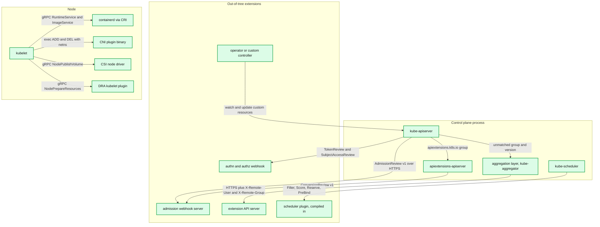

**What to notice**

- `apiextensions-apiserver` and `kube-aggregator` are **libraries linked into the same binary** as kube-apiserver, chained as delegates: generic apiserver → aggregator → apiextensions → 404 handler **[documented]**.
- Everything on the right-hand side is reached *from* the apiserver on the request path (webhooks) or *toward* it (operators). Only node-level extensions are out-of-band.
- The scheduler is the odd one out: its extension model is compile-time Go plugins, not a network protocol — the HTTP extender path exists but is legacy.
- A single webhook server can serve admission, conversion, and authorization endpoints; the apiserver does not care, but each has a different failure blast radius.
- Nothing here can intercept `etcd` directly; the encryption transformer is the last in-process stage.

### 2.2 The request security pipeline

Order below is the *execution* order. In `staging/src/k8s.io/apiserver/pkg/server/config.go:DefaultBuildHandlerChain` the wrappers are applied inside-out, so the source reads in reverse **[documented]**.

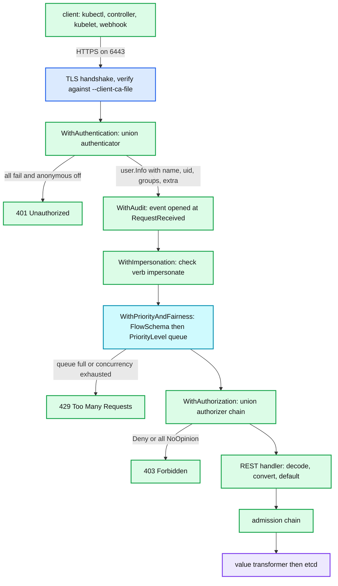

**What to notice**

- **APF runs before authorization** — an unauthenticated-but-authenticated-as-anonymous flood is queued and shed before RBAC ever evaluates, but authz cost is *not* what APF protects you from; it protects etcd and the handler.
- Impersonation is a *filter*, not an authenticator: `WithImpersonation` re-authorizes the original user for `impersonate` on `users`, `groups`, `serviceaccounts` and `userextras/<key>`, then replaces `user.Info` wholesale **[documented]**.
- Audit opens the event *before* authorization, which is why 403s are auditable with the full attribute set.
- Admission is not a filter in the chain — it runs inside the REST storage layer, so it sees the decoded, defaulted, internal-version object.
- The encryption transformer sits between the registry and etcd; nothing after it can inspect plaintext.

---

## 3. Data flow

### 3.1 authn → authz → admission → storage

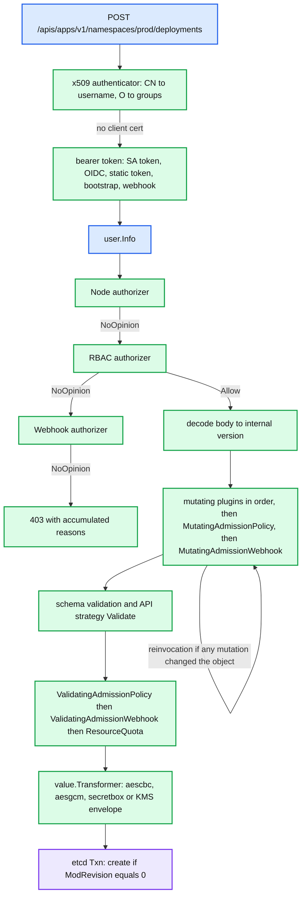

**What to notice**

- Authorizers are a **union with short-circuit**: the first `Allow` or `Deny` wins; `NoOpinion` falls through. Node authorizer runs first in the default `--authorization-mode=Node,RBAC` **[documented]**.
- Schema validation sits **between** mutation and validating admission — this is why a mutating webhook cannot produce an object that fails structural validation and still reach a validating webhook.
- `ResourceQuota` is deliberately the last validating plugin (`AllOrderedPlugins` in `pkg/kubeapiserver/options/plugins.go`), so quota is charged against the final, fully-mutated object **[documented]**.
- Reinvocation loops the *entire* mutating chain at most one extra time — not to a fixed point.
- Encryption happens per-object on the write path; the key material never reaches admission.

### 3.2 CRD request path vs aggregated APIService path

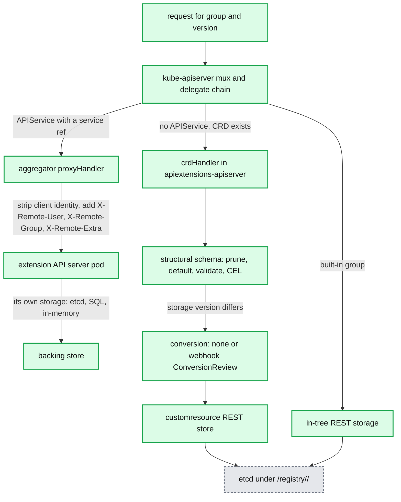

**What to notice**

- Aggregated APIs bypass **everything** the apiserver does for storage: no etcd path, no encryption-at-rest config, no APF accounting inside the extension server unless it links `k8s.io/apiserver` itself.
- The aggregator authenticates the *end user* and then re-asserts identity as headers signed only by mutual TLS with the front-proxy CA — the extension server must be configured with `--requestheader-client-ca-file` or it will trust forged headers **[documented]**.
- CRDs get pruning and defaulting for free; aggregated servers must implement them.
- The conversion webhook sits on the **read** path too: a down conversion webhook makes stored objects unreadable at any version other than the storage version.
- Both terminate in the same etcd, so both are subject to the same ~1.5 MiB practical object ceiling and the 3 MiB `MaxRequestBodyBytes` default **[documented]**.

---

## 4. Sequence of operations

### 4.1 A write request through authn, authz, APF and admission

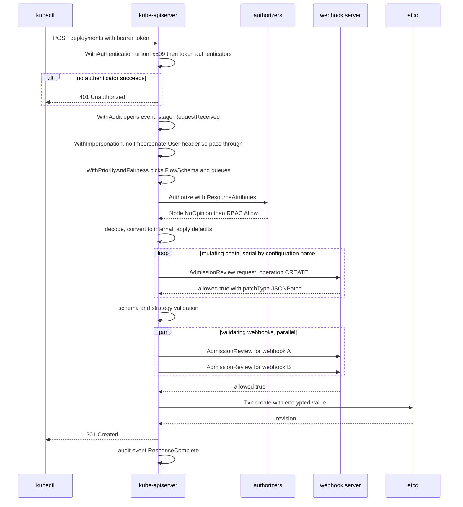

**What to notice**

- Mutating webhooks are dispatched **serially** in `sort.SliceStable(..., ByName)` order over configurations; validating webhooks fan out in goroutines with a buffered error channel **[documented]** (`admission/plugin/webhook/{mutating,validating}/dispatcher.go`).
- The per-webhook context deadline is `timeoutSeconds`, but the *request* deadline is `--request-timeout` (60 s default) — a chain of five 10 s webhooks can exhaust it.
- Defaults are applied on decode, before admission: a mutating webhook always sees defaulted fields, which is why "set it only if unset" webhooks misbehave on fields with non-empty defaults.
- Audit annotations are written by webhooks under keys like `mutation.webhook.admission.k8s.io/round_0_index_2` **[documented]**.
- APF admission happens once; a webhook-induced retry is a *new* request and re-queues.

### 4.2 A mutating webhook with reinvocation

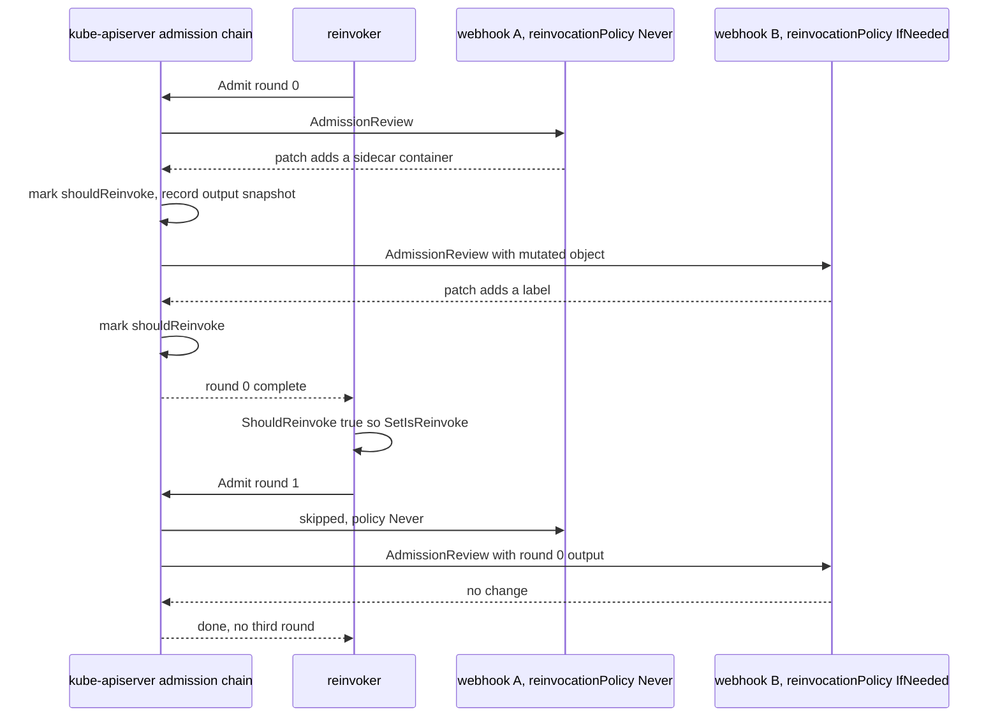

**What to notice**

- `newReinvocationHandler` in `apiserver/pkg/admission/reinvocation.go` calls `Admit` **at most twice** — there is no fixed-point iteration **[documented]**.
- In-tree mutating plugins are *always* re-run in round 1; only webhooks consult `reinvocationPolicy`.
- Round 1 is entered if **any** webhook mutated in round 0, even one whose own policy is `Never`.
- `webhookReinvokeContext.IsOutputChangedSinceLastWebhookInvocation` re-enables previously-invoked webhooks when an in-tree plugin changed the object between rounds **[documented]**.
- Consequence: a webhook that is not idempotent under a second call with its own output will duplicate sidecars. Idempotency is the webhook author's obligation.

### 4.3 ValidatingAdmissionPolicy evaluation

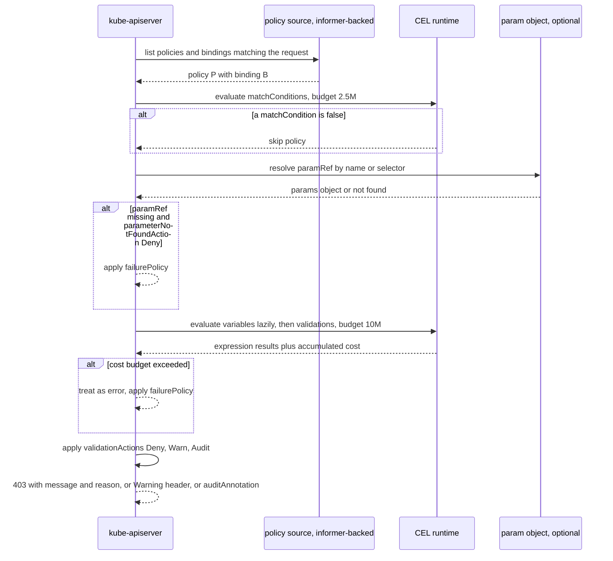

**What to notice**

- Everything is in-process: no TLS, no cert rotation, no network failure mode. The only "unavailability" is a compile error, which is caught at policy admission time.
- `matchConditions` have their own smaller budget (`RuntimeCELCostBudgetMatchConditions = 2500000`) so a cheap match gate cannot be used to burn the validation budget **[documented]**.
- `variables` are lazily evaluated and memoised per request; referencing a variable twice costs once **[documented]**.
- `validationActions` is set on the **binding**, not the policy — the same policy can be Warn in one namespace set and Deny in another.
- `failurePolicy` on a VAP only governs *runtime errors*; `Deny` actions still apply under `failurePolicy: Ignore` only if evaluation succeeded.

A real policy that blocks privileged containers and enforces a registry allow-list:

```yaml
apiVersion: admissionregistration.k8s.io/v1
kind: ValidatingAdmissionPolicy
metadata:
  name: workload-baseline.example.com
spec:
  failurePolicy: Fail
  paramKind:
    apiVersion: config.example.com/v1
    kind: RegistryPolicy
  matchConstraints:
    resourceRules:
      - apiGroups:   ["apps", ""]
        apiVersions: ["v1"]
        operations:  ["CREATE", "UPDATE"]
        resources:   ["deployments", "statefulsets", "pods"]
  matchConditions:
    - name: skip-system-namespaces
      expression: '!(request.namespace in ["kube-system", "kube-node-lease"])'
  variables:
    - name: containers
      expression: >-
        has(object.spec.template)
          ? object.spec.template.spec.containers
          : object.spec.containers
    - name: allowed
      expression: params.spec.allowedRegistries
  validations:
    - expression: >-
        variables.containers.all(c,
          !has(c.securityContext) ||
          !has(c.securityContext.privileged) ||
          c.securityContext.privileged == false)
      message: "privileged containers are not permitted"
      reason: Forbidden
    - expression: >-
        variables.containers.all(c,
          variables.allowed.exists(r, c.image.startsWith(r)))
      messageExpression: >-
        "image must come from one of: " + variables.allowed.join(", ")
      reason: Forbidden
    # transition rule: once a workload is compliant it may not regress
    - expression: >-
        !oldObject.hasValue() ||
        variables.containers.all(c, !c.image.contains(":latest"))
      message: "cannot introduce a :latest tag on update"
      optionalOldSelf: true
---
apiVersion: admissionregistration.k8s.io/v1
kind: ValidatingAdmissionPolicyBinding
metadata:
  name: workload-baseline-prod
spec:
  policyName: workload-baseline.example.com
  validationActions: ["Deny", "Audit"]
  paramRef:
    name: default-registries
    namespace: policy-system
    parameterNotFoundAction: Deny
  matchResources:
    namespaceSelector:
      matchLabels:
        tier: production
```

### 4.4 A projected ServiceAccount token being minted and refreshed

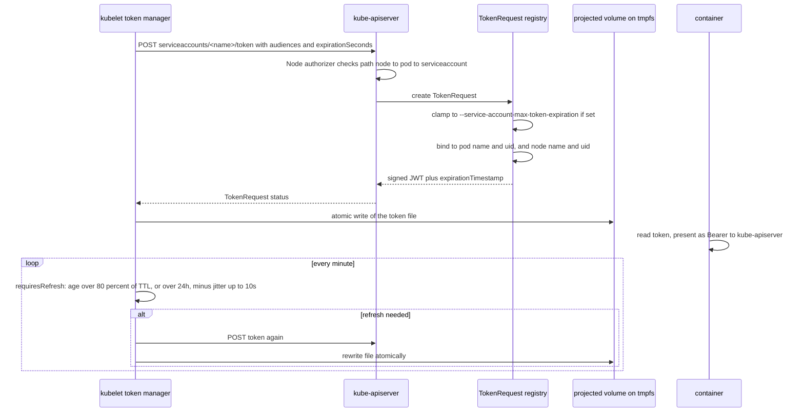

**What to notice**

- `requiresRefresh` in `pkg/kubelet/token/token_manager.go` refreshes at **80 % of the requested TTL** and unconditionally after `maxTTL = 24h`, both offset by a random jitter up to `maxJitter = 10s` **[documented]**.
- The application must **re-read the file**; the kubelet rewrites it in place. Long-lived clients that cached the token at startup break at the 1-hour mark — the classic bound-token migration bug.
- Default `expirationSeconds` for a `ServiceAccountToken` projection is **3600** (`SetDefaults_ServiceAccountTokenProjection` sets `hour`) **[documented]**.
- `--service-account-extend-token-expiration` defaults to **true**, and a token requested at exactly `WarnOnlyBoundTokenExpirationSeconds = 3607` for a kube audience is silently extended to `ExpirationExtensionSeconds = 24*365*3600` (one year) with a `warnafter` claim, so legacy in-cluster clients keep working while `serviceaccount_stale_tokens_total` counts them **[documented]**.
- Node binding (`ServiceAccountTokenNodeBinding`, GA 1.33) means a token stolen from a pod is invalid once the *node* object is gone, not just the pod.

A decoded projected token (payload only, whitespace added):

```json
{
  "aud": ["https://kubernetes.default.svc.cluster.local"],
  "exp": 1789012345,
  "iat": 1789008745,
  "iss": "https://oidc.eks.eu-west-1.amazonaws.com/id/EXAMPLED539D4633E53DE1B71EXAMPLE",
  "jti": "7c2e6a4b-1f3d-4a8e-9c11-6b5f0d2a8e41",
  "kubernetes.io": {
    "namespace": "payments",
    "node":           { "name": "ip-10-0-3-17", "uid": "0f2d1a90-6c7e-4b53-9a11-2f7c9b1d0e44" },
    "pod":            { "name": "ledger-7d9f8c6b5-x2kqv", "uid": "b3c4a512-77e2-4a1c-8f96-1d20c7a4e0aa" },
    "serviceaccount": { "name": "ledger", "uid": "8a1e77d0-2c3b-4f19-b0a7-91e5cf30d2b6" }
  },
  "nbf": 1789008745,
  "sub": "system:serviceaccount:payments:ledger"
}
```

- `sub` is the *only* identity the apiserver derives a username from: `system:serviceaccount:<ns>:<name>`, with groups `system:serviceaccounts` and `system:serviceaccounts:<ns>`.
- `jti` (GA since 1.32 via `ServiceAccountTokenJTI`) is surfaced in audit as `authentication.kubernetes.io/credential-id`, which is what lets you trace a leaked token to its issuance.
- `kubernetes.io.node` is populated by `ServiceAccountTokenPodNodeInfo` (GA 1.32) and is what EKS/GKE node-attestation flows key on **[documented]**.

### 4.5 kubelet TLS bootstrap via CSR

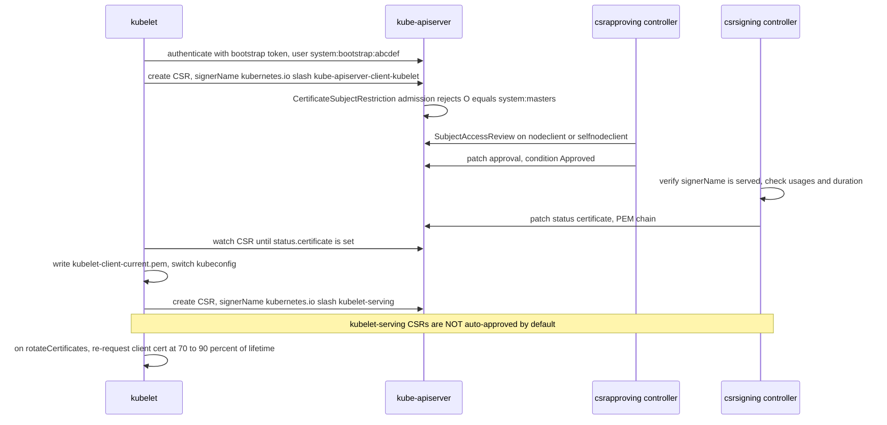

**What to notice**

- Three admission plugins gate the CSR API and are **on by default**: `CertificateApproval`, `CertificateSigning`, `CertificateSubjectRestriction` **[documented]** (`DefaultOffAdmissionPlugins` excludes them).
- `CertificateApproval` requires the approver to hold `approve` on `signers` for that exact `signerName`; `CertificateSigning` does the same for `sign`. This is why a generic `certificatesigningrequests/approval` grant is not sufficient.
- `serverTLSBootstrap: true` in the KubeletConfiguration issues `kubelet-serving` CSRs, but the in-tree approver deliberately refuses them — the node's claimed IPs/DNS cannot be verified. You need an external approver or a cloud one.
- `rotateCertificates: true` handles the *client* cert; `serverTLSBootstrap` handles the *serving* cert. They are independent and frequently mismatched in the field.
- The `Failed` condition is terminal: a signer that cannot issue sets `Failed` and the CSR is never retried; the kubelet creates a new one.

### 4.6 KMS v2 envelope decrypt on read

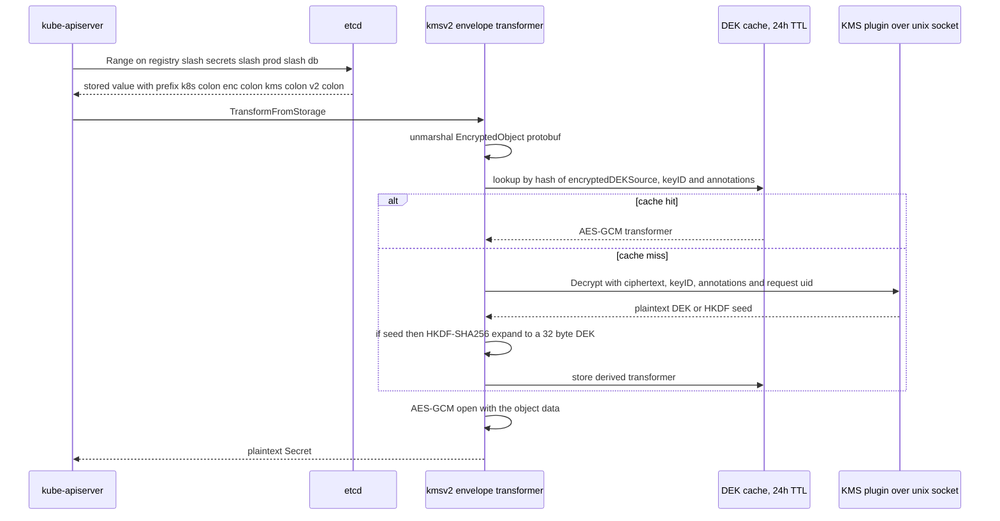

**What to notice**

- The on-disk record is a protobuf `EncryptedObject{encryptedData, keyID, encryptedDEKSource, annotations, encryptedDEKSourceType}` — not opaque bytes **[documented]** (`kmsv2/v2/api.proto`).
- `encryptedDEKSourceType` is `AES_GCM_KEY` or `HKDF_SHA256_XNONCE_AES_GCM_SEED`; the seed mode lets one KMS `Encrypt` call back an unbounded number of derived DEKs, which is what makes KMS v2 cheap at write time.
- The cache is keyed on the *ciphertext* of the DEK source, so two objects sealed with the same DEK share one AES-GCM transformer; `cacheTTL = 24h` **[documented]**.
- On the write path the apiserver polls `Status` (`kmsv2PluginHealthzPositiveInterval = 1m`, negative 10 s) and rotates the local DEK when `keyID` changes; if the plugin errors it will **coast on the current DEK for at most `kmsv2PluginWriteDEKSourceMaxTTL = 3m`** and then fail writes **[documented]**.
- Reads are allowed indefinitely on the cached state; this asymmetry is deliberate — a KMS outage degrades writes long before it degrades reads.
---

## 5. State machines

### 5.1 CertificateSigningRequest

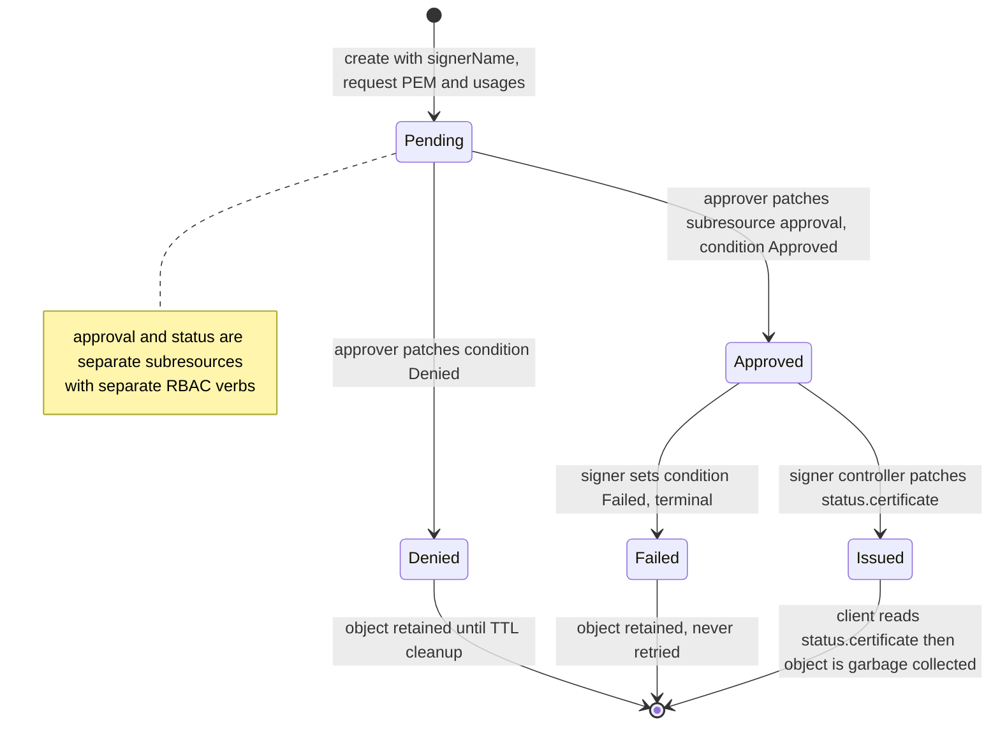

**What to notice**

- `Approved` and `Denied` are mutually exclusive and both terminal for the approval decision; only `Approved` can progress.
- Issuance is not a condition — it is `status.certificate` becoming non-empty. Clients watch for that field, not for a phase.
- `Failed` (added in `certificates/v1`) exists so a signer can report a permanent error without leaving the CSR pending forever.
- The `csrcleaner` controller in kube-controller-manager deletes CSRs one hour after they reach a terminal state **[documented]**.
- There is no "Revoked": Kubernetes has **no certificate revocation**. Rotating the CA is the only revocation mechanism.

### 5.2 CRD version and storage migration

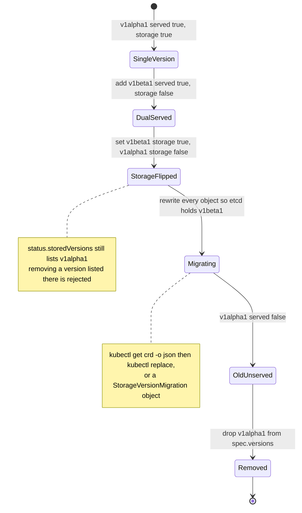

**What to notice**

- `status.storedVersions` is the safety interlock: the apiserver refuses to remove a version that is still listed, so you cannot orphan objects in etcd **[documented]**.
- Exactly one version may have `storage: true`; flipping it does not rewrite anything — old objects stay in the old encoding until touched.
- The `storagemigration.k8s.io/v1alpha1` `StorageVersionMigration` API automates the rewrite behind the `StorageVersionMigrator` feature gate (**alpha, off** in 1.34) **[documented]**.
- Every read of an object stored in a non-requested version invokes the conversion webhook — a slow webhook shows up as a *read* latency regression, which is counter-intuitive.
- After migration you must manually trim `status.storedVersions` (a `PUT` on the CRD status subresource) before the old version can be deleted.

### 5.3 Webhook `failurePolicy` outcomes

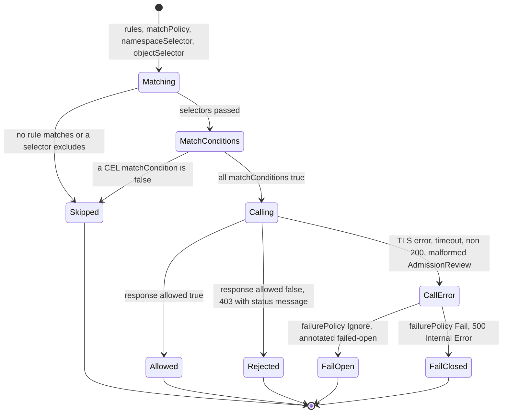

**What to notice**

- A CEL error inside `matchConditions` is a **call error**, not a skip — it takes the `failurePolicy` branch. This surprises people who use `matchConditions` as a cheap filter.
- `failurePolicy: Ignore` failures are recorded as audit annotations (`failed-open.validating.webhook.admission.k8s.io/...`) and increment `apiserver_admission_webhook_fail_open_count` **[documented]**.
- `matchPolicy: Equivalent` (the default) means a rule on `apps/v1 deployments` also matches a request arriving at `apps/v1beta1` and converts it — `Exact` does not, and is a common silent bypass.
- `sideEffects` is not enforced at call time; it is a **declaration** that lets the apiserver decide whether to call the webhook during `dryRun`. `None` and `NoneOnDryRun` are the only accepted values in `admissionregistration.k8s.io/v1`.
- A rejection carries the webhook's `status.message` verbatim to the client, which is the only observability most users get.

---

## 6. Component deep dives

### 6.1 apiextensions-apiserver

- **Responsibility.** Serve `apiextensions.k8s.io` (the `CustomResourceDefinition` type) *and* dynamically serve every custom resource defined by a CRD. It is the last delegate before the 404 handler.
- **Interfaces.** `crdHandler` (`pkg/apiserver/customresource_handler.go`) is an `http.Handler` that resolves group/version/resource on every request against a CRD informer, then dispatches into a per-CRD `crdInfo` holding storage, strategies, and compiled CEL programs.

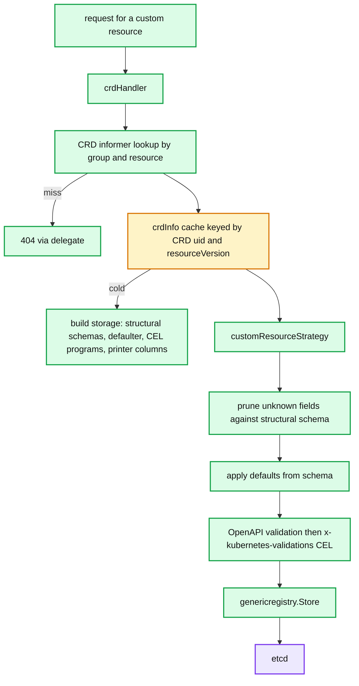

**What to notice**

- The CRD informer is consulted on **every** request; a CRD update invalidates `crdInfo` and forces a full rebuild including CEL compilation.
- Pruning happens before defaulting, so a default cannot resurrect a field the schema does not declare.
- CEL runs last, after OpenAPI validation, so expressions can assume types are already correct.
- There is one `genericregistry.Store` per CRD version — the same code path built-in types use, which is why CRs get watch cache, APF accounting and encryption for free.

- **Data structures.** `schema.Structural` is a *converted*, non-recursive form of the OpenAPI v3 schema: `Properties map[string]Structural`, `Items *Structural`, plus `Extensions{XPreserveUnknownFields, XEmbeddedResource, XListType, XMapType}` and `ValidationExtensions{XValidations}` **[documented]** (`pkg/apiserver/schema/structural.go`).
- **Structural schema rules.** Every field is typed at exactly one place in the `allOf`/`anyOf`/`oneOf` tree; `type` is required on every node except under `x-kubernetes-preserve-unknown-fields`. Non-structural schemas are rejected at CRD admission — that is what makes pruning safe.
- **Pruning.** Unknown fields are silently dropped on write (`schema/pruning`), which is why a typo'd field in a CR is not an error. `x-kubernetes-preserve-unknown-fields: true` disables pruning **for that subtree** and costs you server-side apply fidelity and CEL type information.
- **Defaulting.** `default:` is applied after pruning and after conversion, on both read and write paths, and is itself validated at CRD admission time.
- **`x-kubernetes-list-type`.** `atomic` (replace whole list), `set` (unique scalars, merge by value), `map` (merge by `x-kubernetes-list-map-keys`). This is the *only* input server-side apply and strategic merge have for custom resources — without it every list is atomic and two controllers editing different entries clobber each other.
- **CEL validation.** `x-kubernetes-validations` rules compile at CRD admission; the estimator enforces `StaticEstimatedCostLimit = 10_000_000` per expression and `StaticEstimatedCRDCostLimit = 100_000_000` for the whole schema **[documented]**. At runtime, `RuntimeCELCostBudget = 10_000_000` per object. `oldSelf` is available on update rules; `optionalOldSelf: true` makes `oldSelf` an `optional` type so the rule also runs on create (used for "you may not regress" rules).
- **Ratcheting validation.** `CRDValidationRatcheting` is **GA and locked on since 1.33** **[documented]**: on update, a schema violation in a subtree that is byte-identical to the old object is not reported. This is what lets you tighten a CRD schema without breaking existing objects.
- **Selectable fields.** `spec.versions[].selectableFields[].jsonPath` (GA 1.32) registers extra field selectors; the apiserver indexes them in the watch cache like built-in fields.
- **Subresources.** `/status` splits the strategy (spec is immutable via status, and vice versa) and gives the CR its own `status` update RBAC verb path; `/scale` with `specReplicasPath`, `statusReplicasPath`, `labelSelectorPath` makes the CR a target for HPA and `kubectl scale`.
- **Concurrency.** One `crdInfo` per CRD UID+resourceVersion, rebuilt on CRD change; a `sync.RWMutex`-guarded map plus a tear-down goroutine that waits for in-flight requests. Compiled CEL programs live in the `crdInfo`, so a CRD update is a full recompile **[documented]**.
- **Failure handling.** A conversion webhook error surfaces as a 500 on read *and* write. `NonStructuralSchema` and `NonStructuralSchemaCondition` mark CRDs that would have been rejected under current rules.
- **Production knobs.** No dedicated flags — CRD cost is expressed through the apiserver's watch cache and etcd. The knobs that matter are `--max-requests-inflight` (400), `--watch-cache-sizes`, and the CRD's own `served`/`storage` fields.
- **Why big CRDs hurt.** Each served CRD version adds an OpenAPI schema to the aggregated `/openapi/v3` document, a discovery entry, and a watch cache. A CRD with a 500 KB schema and 50k objects costs an OpenAPI rebuild on every CRD change, a per-object CEL compile-and-run, and a watch fan-out of the full object to every informer. Objects near the 1.5 MiB etcd limit make list-and-watch storms fatal.

### 6.2 Aggregation layer (kube-aggregator)

- **Responsibility.** Own the `apiregistration.k8s.io` group, maintain `APIService` objects, and proxy unmatched group/versions to an external server.
- **Interfaces.** `proxyHandler` (`pkg/apiserver/handler_proxy.go`) resolves the backend via a `ServiceResolver` (ClusterIP or endpoint-based), then wraps the round-tripper in `transport.NewAuthProxyRoundTripper(user, uid, groups, extra, rt)` **[documented]**.
- **On-wire format.** The proxied request carries the original path and body plus headers: `X-Remote-User`, `X-Remote-Group` (repeated), `X-Remote-Extra-<key>` (percent-encoded), and — with `RemoteRequestHeaderUID` (Beta, on, 1.33) — `X-Remote-Uid`. The client identity presented to the backend is the **front-proxy client cert**, not the end user's.
- **Trust model.** The extension server must run with `--requestheader-client-ca-file` (front-proxy CA) and `--requestheader-allowed-names=front-proxy-client`; kube-apiserver publishes both in `configmap/extension-apiserver-authentication` in `kube-system` so a library-based server can self-configure **[documented]**. Skipping this makes header spoofing trivial for anyone who can reach the pod. The apiserver side needs `--proxy-client-cert-file`/`--proxy-client-key-file`.
- **Availability.** `AvailableConditionController` (`controllers/status/remote/remote_available_controller.go`) probes `/` on the backend with a **5 s timeout** and sets `Available` with reasons `ServiceNotFound`, `MissingEndpoints`, `FailedDiscoveryCheck` **[documented]**.
- **Blast radius.** An unavailable `APIService` makes `/apis` a partial document with a failure entry, so `kubectl get all` and every full-discovery client errors or warns — this is why a down `metrics-server` breaks unrelated `kubectl` commands.
- **Concurrency.** One `atomic.Value` of `handlingInfo` per APIService, swapped on change; SPDY/WebSocket upgrades bypass the pooled round-tripper via a direct dial **[documented]**.
- **When to choose aggregation over CRDs.** Non-etcd storage (metrics-server keeps metrics in memory), custom verbs and protocols, arbitrary response shapes, high-churn objects you do not want in etcd, or your own authn/authz. CRDs otherwise: cheaper to operate, and they cannot break discovery.

### 6.3 Admission webhook plumbing

- **Responsibility.** Two admission plugins, `MutatingAdmissionWebhook` and `ValidatingAdmissionWebhook`, both default-on **[documented]**, that turn an `admission.Attributes` into an `AdmissionReview` and interpret the response.
- **Matching.** `rules` (apiGroups/apiVersions/resources/operations/scope) → `matchPolicy` (`Equivalent` default, converting the object to the rule's version) → `namespaceSelector` → `objectSelector` → `matchConditions` (CEL, since 1.28). The first three are index lookups; the last is evaluation.
- **On-wire format.** `AdmissionReview` in `admission.k8s.io/v1`. The response must echo `uid`.

```json
{
  "apiVersion": "admission.k8s.io/v1",
  "kind": "AdmissionReview",
  "request": {
    "uid": "0c4d2f9e-7c19-4c4a-9e3f-0f0b3a1d55c1",
    "kind":     {"group": "apps", "version": "v1", "kind": "Deployment"},
    "resource": {"group": "apps", "version": "v1", "resource": "deployments"},
    "requestKind":     {"group": "apps", "version": "v1", "kind": "Deployment"},
    "requestResource": {"group": "apps", "version": "v1", "resource": "deployments"},
    "name": "ledger",
    "namespace": "payments",
    "operation": "UPDATE",
    "userInfo": {
      "username": "system:serviceaccount:argocd:argocd-application-controller",
      "uid": "6f0a1b2c-3d4e-5f60-8192-a3b4c5d6e7f8",
      "groups": ["system:serviceaccounts", "system:serviceaccounts:argocd", "system:authenticated"],
      "extra": {"authentication.kubernetes.io/credential-id": ["JTI=7c2e6a4b-1f3d-4a8e-9c11-6b5f0d2a8e41"]}
    },
    "object":    {"apiVersion": "apps/v1", "kind": "Deployment", "metadata": {"name": "ledger"}},
    "oldObject": {"apiVersion": "apps/v1", "kind": "Deployment", "metadata": {"name": "ledger"}},
    "dryRun": false,
    "options": {"apiVersion": "meta.k8s.io/v1", "kind": "UpdateOptions", "fieldManager": "argocd-controller"}
  }
}
```

```json
{
  "apiVersion": "admission.k8s.io/v1",
  "kind": "AdmissionReview",
  "response": {
    "uid": "0c4d2f9e-7c19-4c4a-9e3f-0f0b3a1d55c1",
    "allowed": true,
    "patchType": "JSONPatch",
    "patch": "W3sib3AiOiJhZGQiLCJwYXRoIjoiL21ldGFkYXRhL2xhYmVscy9jb3N0LWNlbnRlciIsInZhbHVlIjoiZmluLTA0MiJ9XQ==",
    "warnings": ["image tag :latest is discouraged"],
    "auditAnnotations": {"policy": "cost-center-injected"}
  }
}
```

- The `patch` is base64-encoded **JSON Patch (RFC 6902)** — `patchType: JSONPatch` is the only value `v1` accepts. Decoded, the above is `[{"op":"add","path":"/metadata/labels/cost-center","value":"fin-042"}]`.
- `requestKind`/`requestResource` differ from `kind`/`resource` when `matchPolicy: Equivalent` converted the object; a webhook that ignores this will reject requests arriving at an older group version.
- **Concurrency model.** Mutating: strictly serial, configurations sorted by name (`sort.SliceStable(..., ByName)`), webhooks within a configuration in declaration order. Validating: one goroutine per relevant hook, results collected on a buffered channel of `2*len(hooks)`; a panic in a hook is recovered and converted to an internal error **[documented]**.
- **Defaults.** `failurePolicy: Fail`, `matchPolicy: Equivalent`, `timeoutSeconds: 10` (max 30), `namespaceSelector: {}`, `objectSelector: {}`, `service.port: 443`, and for mutating webhooks `reinvocationPolicy: Never` **[documented]** (`pkg/apis/admissionregistration/v1/defaults.go`).
- **Failure handling.** TLS/dial/timeout/non-2xx are "call errors" and take the `failurePolicy` branch. There is **no retry** — one attempt per webhook per admission round.
- **The webhook deadlock.** A webhook whose `rules` match `pods` in all namespaces with `failurePolicy: Fail` cannot be restarted after a full-cluster outage: the apiserver refuses to admit the webhook's own pod because the webhook is down. The escape hatch is `namespaceSelector` excluding the webhook's own namespace and `kube-system`:

```yaml
namespaceSelector:
  matchExpressions:
    - key: kubernetes.io/metadata.name
      operator: NotIn
      values: ["kube-system", "webhook-system"]
```

  `kubernetes.io/metadata.name` is set on every namespace automatically, so this needs no extra labelling **[documented]**.
- **Production knobs.** `timeoutSeconds` 1–3 s for anything on the pod path; scope `rules` to the narrowest resource set; never `failurePolicy: Fail` with `resources: ["*"]`; ≥3 replicas with a PDB and topology spread; monitor `apiserver_admission_webhook_admission_duration_seconds` and `apiserver_admission_webhook_rejection_count`.

### 6.4 CEL policy engine

- **Responsibility.** Compile and evaluate CEL for four consumers: CRD `x-kubernetes-validations`, webhook `matchConditions`, `ValidatingAdmissionPolicy`, and `MutatingAdmissionPolicy`.
- **Environment.** `apiserver/pkg/cel/environment` builds a *versioned* environment set: expressions compiled against a base environment plus feature-gated extension libraries, so a policy authored on 1.34 does not silently gain functions on upgrade. Libraries include `kubernetes.lists`, `kubernetes.regex`, `kubernetes.url`, `kubernetes.authz`, `kubernetes.quantity`, IP/CIDR, and `format` **[documented]**.
- **Cost model.** Static estimation at admission time, runtime accounting during evaluation. Constants (`apiserver/pkg/apis/cel/config.go`) **[documented]**:

| Constant | Value | Meaning |
|---|---|---|
| `PerCallLimit` | 1,000,000 | per-expression runtime ceiling (~0.1 s) |
| `RuntimeCELCostBudget` | 10,000,000 | total per VAP binding or per custom resource (~1 s) |
| `RuntimeCELCostBudgetMatchConditions` | 2,500,000 | total for `matchConditions`, per webhook or per binding |
| `MaxRequestSizeBytes` | 3 MiB | assumed max object size, feeds cost estimation |
| `MaxEvaluatedMessageExpressionSizeBytes` | 5 KiB | cap on `messageExpression` output |
| `CheckFrequency` | 100 | comprehension iterations between interrupt checks |

- `StrictCostEnforcementForVAP` and `StrictCostEnforcementForWebhooks` are **GA and locked on since 1.32** **[documented]** — estimated costs are enforced, so an unbounded `.all()` over an unbounded list fails at policy creation, not at request time.
- **VAP objects.** `ValidatingAdmissionPolicy` (what to check) and `ValidatingAdmissionPolicyBinding` (where, with which params, and what to do). Splitting them is what makes a policy reusable and parameterisable across tenants. `paramKind` may be a CRD or a built-in; `paramRef` selects by name or `selector`, with `parameterNotFoundAction: Deny|Allow`.
- **MutatingAdmissionPolicy.** Beta in 1.34 with the gate **off by default**; the API is `admissionregistration.k8s.io/v1beta1`. Two patch styles: `applyConfiguration` (a CEL expression returning an apply configuration object, merged with SSA semantics — safe, associative) and `jsonPatch` (`Object.spec.…` JSON Patch ops). *Post-1.34: GA and on by default in v1.36* **[documented]**.
- **Why in-process CEL beats a webhook.** No TLS certificate to rotate or expire; no pod to schedule (so no deadlock); no network timeout budget; failure modes are compile errors caught at write time; latency is microseconds-to-milliseconds instead of a network round trip; and the apiserver can evaluate it during its own bootstrap.
- **What CEL cannot do.** No I/O — no cluster lookups beyond the request object, `oldObject`, `params`, `namespaceObject`, `authorizer`, and `request`. No cross-object invariants ("no two Services may claim this hostname"). No mutation history. Those still need a webhook or a controller.
- **Versus OPA/Gatekeeper.** Gatekeeper is a Rego webhook with a `ConstraintTemplate`/`Constraint` split that VAP deliberately mirrors, plus an audit loop over *existing* objects and a replicated cache (`syncSet`) giving Rego cross-object lookups — two things VAP has no answer for. Its cost is the webhook: certs, availability, latency.
- **Versus Kyverno.** A webhook with a YAML-shaped DSL, generate and mutate-existing rules, built-in cosign verification, policy reports and background scans. It does far more than VAP and owns far more of your write path; it now compiles the VAP-expressible subset down to VAPs.
- **Practical split.** VAP for cheap per-object invariants on the hot path; a webhook (or Kyverno) for cross-object logic, signature verification, and generating companion objects.

### 6.5 RBAC authorizer

- **Responsibility.** Answer `Authorize(attributes) -> (Allow | Deny | NoOpinion, reason, error)` from `Role`, `ClusterRole`, `RoleBinding`, `ClusterRoleBinding`.
- **Algorithm.** `RBACAuthorizer.Authorize` calls `VisitRulesFor(user, namespace, visitor)`; the visitor returns `false` to stop on the first rule that allows. RBAC **never returns Deny** — it returns `Allow` or `NoOpinion` **[documented]** (`plugin/pkg/auth/authorizer/rbac/rbac.go`).
- **Rule matching.** `RuleAllows` checks verb ∈ `rule.Verbs` (or `*`), then either `NonResourceURLs` (prefix `/x/*`) or apiGroup + resource + optional `resourceNames` + optional `subresource` (encoded `resource/subresource`).
- **Resolution order.** For a namespaced request: matching `ClusterRoleBinding`s, then `RoleBinding`s in that namespace, each dereferencing a `Role` or `ClusterRole`. A dangling role reference is recorded as an error but does not fail the request.
- **Data structures.** Informer-driven listers with no index — every authorization is a linear scan over all `ClusterRoleBinding`s plus the namespace's `RoleBinding`s **[inferred from the lister-based `RoleGetter`/`ClusterRoleBindingLister`]**. Cost is O(bindings matching the user), and tens of thousands of bindings show up in `apiserver_request_duration_seconds`.
- **Aggregation.** A `ClusterRole` with `aggregationRule.clusterRoleSelectors` has its `rules` **overwritten** by the aggregation controller from every matching `ClusterRole`. `admin`, `edit`, `view` are aggregated — labelling your ClusterRole `rbac.authorization.k8s.io/aggregate-to-edit: "true"` is the supported way to grant CRD access to the default roles.
- **Privilege-escalation prevention.** Creating or updating a `Role`/`ClusterRole` calls `ConfirmNoEscalation` — you may only grant what you already hold — unless `EscalationAllowed` (you hold `escalate`, or you are `system:masters`). Creating a binding needs either the same containment check or the `bind` verb on the referenced role **[documented]** (`pkg/registry/rbac/escalation_check.go`, `.../policybased/storage.go`).
- **The verbs that are privileges.** `escalate`, `bind`, `impersonate`, `approve`+`sign` on `signers`, `create` on `serviceaccounts/token`, `update` on `*/finalizers`, and `create pods` in a namespace with a privileged ServiceAccount. Each is cluster-admin with extra steps.
- **`kubectl auth can-i`** issues a `SelfSubjectAccessReview`; `--list` issues a `SelfSubjectRulesReview`, which is documented as *incomplete* — webhook and Node authorizers cannot enumerate.
- **Production knobs.** `--authorization-mode=Node,RBAC` (kubeadm default) or `--authorization-config`. Watch `apiserver_authorization_decisions_total` by decision and authorizer.

### 6.6 Node authorizer

- **Responsibility.** Restrict each kubelet to only the objects its own pods reference. Runs first in the default chain and returns `NoOpinion` for anything that is not a `system:nodes`-group request.
- **Data structure — the graph.** An in-memory directed graph (`gonum/graph`) built by `graph_populator.go` from Pod, PV, PVC, ResourceClaim, ResourceSlice, VolumeAttachment, ServiceAccount and PodCertificateRequest informers. Vertex types in 1.34 **[documented]**: `configmap`, `resourceslice`, `node`, `pod`, `pvc`, `pv`, `resourceclaim`, `secret`, `volumeattachment`, `serviceAccount`, `podcertificaterequest`.

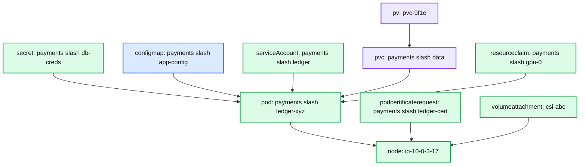

**What to notice**

- Edges point *toward* the node, so authorization is "is there a path from this object to me", not a per-object ACL.
- The Secret vertex has one edge per pod referencing it; deleting the last such pod removes the node's access on the next informer event.
- `serviceAccount` vertices exist only so the kubelet can mint tokens for SAs its pods actually use.
- `volumeattachment` and `podcertificaterequest` attach directly to the node, not through a pod — different authorization helpers handle them.

- **Algorithm.** `hasPathFrom(nodeName, startingType, ns, name)` does a bounded traversal from the object vertex to the node vertex. For the hot types a **destination index** (`vertexTypeWithAuthoritativeIndex`) caches the reachable node set so the common case is a set lookup, not a walk **[documented]**.
- **What it authorizes.** Read of secrets/configmaps/PVCs/PVs only via a path from a pod bound to that node; `create`/`update` of the node's own `Node` and `Node/status`; `create` on `serviceaccounts/token` only for SAs referenced by pods on that node; `Lease` in `kube-node-lease` only for its own name; `CSINode` only its own; `ResourceSlice` only those it published.
- **NodeRestriction admission.** The authorizer says "may write my Node object"; the `NodeRestriction` plugin says *what* it may write — it blocks a kubelet from setting labels outside the allowed prefixes (`kubernetes.io/`-restricted set), from removing its own taints, from updating other nodes' pods, and from creating mirror pods that reference API objects (`PreventStaticPodAPIReferences`, Beta on in 1.34) **[documented]**.
- **Failure handling.** Graph is rebuilt from informers on restart; during the initial sync the authorizer can deny legitimate requests, which the kubelet retries. `AuthorizeWithSelectors` (**GA and locked on in 1.34**) lets the authorizer see field/label selectors so a kubelet's `list pods` can be constrained to its own node **[documented]**.
- **Blast radius of getting this wrong.** Without Node+NodeRestriction, a single compromised kubelet credential reads every Secret in the cluster. This is the single highest-value authorizer in a multi-tenant cluster.

### 6.7 ServiceAccount tokens: TokenRequest and the token controller

- **Two mechanisms.** *Legacy*: the `tokens` controller creates a `kubernetes.io/service-account-token` Secret holding a non-expiring JWT. Auto-creation was removed in 1.24; manually created ones still work and are reaped by `LegacyServiceAccountTokenCleaner` after a year of non-use. *Modern*: `TokenRequest` (`POST /api/v1/namespaces/<ns>/serviceaccounts/<name>/token`).
- **TokenRequest registry** (`pkg/registry/core/serviceaccount/storage/token.go`) clamps `spec.expirationSeconds` to `--service-account-max-token-expiration` with a client warning, binds to `spec.boundObjectRef` (Pod, Secret or Node) after verifying it exists, adds pod→node info, and signs with `--service-account-signing-key-file` **[documented]**.
- **Read-side validation.** The SA token authenticator re-checks that the bound object exists **with the same UID** on every request (`ServiceAccountTokenNodeBindingValidation`, GA 1.32) — deleting a pod invalidates its token immediately, without waiting for expiry.
- **Projected volume.** `sources: [{serviceAccountToken: {path, audience, expirationSeconds}}]`, written to tmpfs and refreshed by the kubelet token manager (§4.4); `audience` defaults to `--api-audiences`.
- **OIDC discovery.** With `--service-account-issuer` set to an https URL the apiserver serves `/.well-known/openid-configuration` and `/openid/v1/jwks`. The `system:service-account-issuer-discovery` ClusterRole is bound to `system:serviceaccounts` by default, **not** to `system:unauthenticated` — external verifiers need an explicit binding **[documented]**.
- **How IRSA / Workload Identity actually work.** The cluster's JWKS is published at a public URL (an S3 bucket for EKS). AWS IAM registers it as an OIDC provider; a role's trust policy conditions on `sub == system:serviceaccount:<ns>:<name>` and `aud == sts.amazonaws.com`. The EKS Pod Identity Webhook injects a projected token with that audience plus `AWS_ROLE_ARN`/`AWS_WEB_IDENTITY_TOKEN_FILE`, and the SDK calls `AssumeRoleWithWebIdentity`. GKE Workload Identity and Azure Workload Identity are the same pattern against GKE's STS and Entra ID. **The apiserver is never in the exchange** — it only signs and publishes keys.
- **TokenReview** is the opposite direction: an extension server or authenticator webhook calls `POST /apis/authentication.k8s.io/v1/tokenreviews` (requires `system:auth-delegator`) to have the apiserver validate a token and return `user.Info`. Use it when you cannot verify JWTs yourself; projected tokens plus JWKS are better when you can, because they remove an apiserver round trip per request.

### 6.8 Pod Security Admission

- **Responsibility.** Enforce the three Pod Security Standards levels (`privileged`, `baseline`, `restricted`) at namespace granularity. Default-on plugin `PodSecurity` **[documented]**.
- **Configuration.** Namespace labels `pod-security.kubernetes.io/{enforce,audit,warn}` and `…/{enforce,audit,warn}-version` (a minor version like `v1.34`, or `latest`). Cluster defaults come from an `AdmissionConfiguration` file with a `PodSecurityConfiguration` (`defaults`, `exemptions.{usernames,runtimeClasses,namespaces}`).
- **Three independent outcomes.** `enforce` rejects the pod; `audit` adds an audit annotation; `warn` returns a `Warning:` header. Only `enforce` blocks, and it applies to **pod-creating** requests, not to the controllers that create them — a Deployment with a violating template is accepted, and its ReplicaSet's pod creations are rejected, which is why `warn` on the workload path matters.
- **Versioned pinning is the whole point.** Pinning `enforce-version: v1.31` means a cluster upgrade cannot introduce a new check that breaks existing workloads. `latest` means it can.
- **Checks (each with a `MinimumVersion`).** `privileged`, `hostNamespaces`, `hostPathVolumes`, `hostPorts`, `appArmorProfile`, `seLinuxOptions`, `procMount`, `seccompProfile` (baseline and restricted variants), `sysctls`, `capabilities` (baseline and restricted), `restrictedVolumes`, `runAsNonRoot`, `runAsUser`, `allowPrivilegeEscalation`, `windowsHostProcess`, and — **new in 1.34** — `hostProbesAndHostLifecycle` (baseline: forbids `httpGet.host`/`tcpSocket.host` in probes and lifecycle handlers, which were an SSRF vector from the kubelet) **[documented]**. The `ProbeHostPodSecurityStandards` gate is GA-and-locked in 1.34 and exists only to disable the check when emulating an earlier minor.
- **`restricted` in practice** requires `runAsNonRoot: true`, `allowPrivilegeEscalation: false`, `capabilities.drop: ["ALL"]`, `seccompProfile.type: RuntimeDefault`, volumes limited to the projected/ephemeral set, and no `runAsUser: 0`.
- **securityContext fields that carry real weight.** `readOnlyRootFilesystem: true` (not in `restricted`, but the highest-value field for defeating in-container tooling); `seccompProfile: RuntimeDefault`; `capabilities.drop: ALL` then add back only what you need; `appArmorProfile` (GA 1.31 as a first-class field, replacing the annotation); `seLinuxOptions` with `SELinuxChangePolicy`/`SELinuxMount` (Beta) to avoid recursive relabelling on large volumes.
- **User namespaces (KEP-127).** `spec.hostUsers: false`, gate `UserNamespacesSupport` **Beta and on by default since 1.33** **[documented]**; *post-1.34: GA and locked in v1.36*. Needs a CRI runtime with idmap-mount support and a recent kernel. What it fixes: root-in-container is UID 0 in the pod's user namespace but an unprivileged host UID, neutralising whole classes of CVEs that depend on host-UID-0 (e.g. runc fd escapes). What it does **not** fix: the kernel is still shared, so a kernel LPE still wins.
- **Container-escape threat model**, in rough order of danger: `privileged: true` (all capabilities and devices, no seccomp/AppArmor — one-line escape via a block device or cgroup `release_agent`); `hostPath` of `/` or the containerd/docker socket (direct container creation = node compromise); `hostPID` + `SYS_PTRACE` (read host process memory); `hostNetwork` (kubelet ports, cloud metadata at 169.254.169.254); `CAP_SYS_ADMIN`; `CAP_SYS_MODULE`; `procMount: Unmasked`.
- **PSP is gone** (removed in 1.25). PSA is deliberately less expressive: no mutation, no ordering ambiguity, namespace-scoped only. Mutating `securityContext` is now a VAP/MutatingAdmissionPolicy or webhook job.

### 6.9 Encryption at rest and the KMS plugin

- **Base fact.** A Secret in etcd is **base64-encoded, not encrypted**. An etcd snapshot is every Secret unless `--encryption-provider-config` is set.
- **Config shape.** An `apiserver.config.k8s.io/v1 EncryptionConfiguration` listing `resources`, each with an **ordered** provider list. The **first** provider encrypts; **all** are tried for decrypt, matched by storage prefix (`k8s:enc:aescbc:v1:<keyname>:`, `k8s:enc:kms:v2:<name>:`, …).

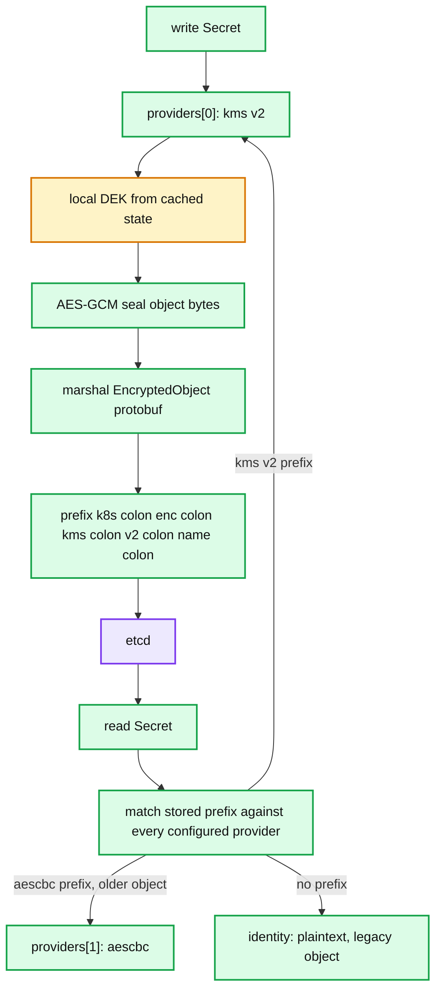

**What to notice**

- Only `providers[0]` ever encrypts; the rest exist solely so older ciphertexts stay readable.
- Objects written before encryption was enabled carry **no prefix** and are read by the `identity` matcher — they stay plaintext until rewritten.
- Removing a provider that still matches stored objects is unrecoverable data loss, which is what makes step 3 of the rotation mandatory.
- The prefix carries the provider *name*, so two `aescbc` providers with different keys coexist and are distinguished by keyname.

- **Providers.** `identity` (no-op), `secretbox` (XSalsa20-Poly1305), `aesgcm` (fast, **but the 32-byte nonce reuse risk means k8s docs restrict it to automated key rotation**), `aescbc` (AES-CBC with PKCS#7, no authentication — legacy), `kms` v1 (deprecated; gate `KMSv1` default **false** since 1.29) and `kms` v2.
- **KMS v2 design.** Per-object DEK (or HKDF-derived-from-seed), envelope-encrypted by the external KEK. `keyID` is stored with each object so the apiserver can tell when the KEK rotated; `Status` polling drives DEK rotation. `cacheTTL = 24h`, keyed on the DEK ciphertext hash; `KeyIDMaxSize = 1 KiB`, `annotationsMaxSize = 32 KiB` **[documented]**.
- **Health and coasting.** `kmsv2PluginHealthzPositiveInterval = 1m`, negative `10s`, and `kmsv2PluginWriteDEKSourceMaxTTL = 3m` — after 3 minutes of KMS errors, **writes fail**; reads keep working from cache indefinitely **[documented]**.
- **Rotation procedure.** (1) Add the new provider *second* and reload every apiserver so all of them can decrypt. (2) Promote it to first and reload again. (3) Rewrite every object: `kubectl get secrets --all-namespaces -o json | kubectl replace -f -`. (4) Only then remove the old provider. `--encryption-provider-config-automatic-reload=true` removes the restarts, but the file poll is on a timer, so still stagger steps 1 and 2.
- **Why the rewrite is mandatory.** Nothing rewrites objects on its own; removing a provider that still decrypts live objects makes them permanently unreadable — the most common self-inflicted data loss here.
- **Secrets Store CSI Driver.** Keeps material out of etcd: a CSI inline volume mounts secrets fetched from Vault/AWS Secrets Manager/Key Vault at pod start, authenticated with the pod's projected SA token. The optional `secretObjects` sync back into a Kubernetes Secret re-introduces the etcd exposure — skip it if you can.
- **`imagePullSecrets`.** A `kubernetes.io/dockerconfigjson` Secret referenced from the Pod or its ServiceAccount (the `ServiceAccount` plugin copies the SA's list onto the pod); the kubelet passes the credentials to the CRI `ImageService`. Anyone who can create a pod in the namespace can mount and read it — prefer node-level credential providers (`--image-credential-provider-config`), which never materialise a Secret.

### 6.10 CSR signer and cluster PKI

- **The kubeadm CA hierarchy.** Three independent roots **[documented]**: `ca` (apiserver serving cert, `apiserver-kubelet-client`, every kubeconfig client cert, and CSR-API-issued certs), `etcd/ca` (etcd server/peer/healthcheck plus `apiserver-etcd-client`), and `front-proxy-ca` (only `front-proxy-client`, for the aggregation layer). Separation means a compromised front-proxy key cannot mint kubelet client certs.
- **SANs that matter.** `apiserver.crt` must carry the `kubernetes.default.svc` cluster IP, the node IP, and every DNS name and load-balancer address clients use. Adding a load balancer later without regenerating it is a classic outage.
- **Identity mapping.** `CN` → username, each `O` → a group. `O=system:masters` is break-glass admin; `O=system:nodes, CN=system:node:<nodeName>` is a kubelet. The certificate *is* the identity — hence no revocation, and cert lifetime is the only rotation lever.
- **CSR API signers** (`certificates.k8s.io/v1`) **[documented]**: `kubernetes.io/kube-apiserver-client` (generic, **never auto-approved**), `kubernetes.io/kube-apiserver-client-kubelet` (auto-approved for `system:bootstrappers` on first request and `system:nodes` on renewal), `kubernetes.io/kubelet-serving` (**never auto-approved** in-tree), and the deprecated `kubernetes.io/legacy-unknown`.
- **The in-tree signer** (`csrsigning`) takes `--cluster-signing-cert-file`/`--cluster-signing-key-file` plus per-signer variants; `--cluster-signing-duration` defaults to **8760h (1 year)**, and a CSR may request less via `spec.expirationSeconds` (minimum 600 s).
- **kubelet rotation.** `rotateCertificates: true` renews the *client* cert at ~70–90 % of its lifetime into `kubelet-client-current.pem`. `serverTLSBootstrap: true` requests a *serving* cert instead of a self-signed one — required for verifiable `kubectl logs`/`exec`, and it needs an external approver.
- **Cert expiry as the classic outage.** kubeadm control-plane certs are 1-year; clusters that never upgrade never renew, and the whole control plane stops at once. Mitigation: `kubeadm certs check-expiration` in monitoring, `kubeadm certs renew all` in the upgrade path, alerts on `apiserver_client_certificate_expiration_seconds` and `kubelet_certificate_manager_client_ttl_seconds`.
- **`ClusterTrustBundle`** (`certificates.k8s.io/v1beta1`, gate **Beta but off** in 1.34): cluster-scoped PEM trust anchors for a signer, projectable into pods via `clusterTrustBundle` volume sources (`ClusterTrustBundleProjection`, also Beta-off). It answers "how does a workload learn the current CA bundle mid-rotation" without a ConfigMap-copying controller.
- **`PodCertificateRequest`** (**Alpha, off, in 1.34**): the kubelet requests a short-lived certificate *bound to a specific pod and service account*, delivered through a `podCertificate` projected volume — mTLS workload identity without a sidecar or mesh CA. The Node authorizer already carries the `podcertificaterequest` vertex type **[documented]**. *Post-1.34: Beta, still off, in v1.35.*
### 6.11 Authentication: the union authenticator and structured config

- **There is no user object.** The apiserver holds no user registry, password store, or group membership; `user.Info{Name, UID, Groups, Extra}` is derived per request and discarded. Hence no revocation, no "disable this user", no listing — you revoke by rotating a CA, an IdP key, or a ServiceAccount.
- **The union.** `--client-ca-file` x509, then bearer-token authenticators in registration order: ServiceAccount tokens, OIDC/structured JWT, static token file (`--token-auth-file` — no expiry, no revocation, do not use), bootstrap tokens (`--enable-bootstrap-token-auth`; `bootstrap.kubernetes.io/token` Secrets in `kube-system` mapping to `system:bootstrap:<id>` / `system:bootstrappers`), and webhook `TokenReview`. First success wins.
- **`AuthenticationConfiguration`** (`--authentication-config`, `apiserver.config.k8s.io/v1`) — `StructuredAuthenticationConfiguration` is **GA and locked on in 1.34** **[documented]**. Replaces the `--oidc-*` flags, supports **multiple JWT issuers**, and hot-reloads on file change.
- **CEL claim mappings.** `claimMappings.{username,groups,uid}.expression`, `extra[].valueExpression`, `claimValidationRules[].expression`, `userValidationRules[].expression`; the variables are `claims` and (for user rules) `user`. E.g. `username.expression: '"oidc:" + claims.email'`. `prefix` and `expression` are mutually exclusive.
- **Guardrail.** `userValidationRules` are the only place to stop an IdP minting `system:` identities: `'!user.username.startsWith("system:")'`. Without it a misconfigured IdP can claim `system:masters`.
- **Anonymous auth.** `--anonymous-auth=true` maps unauthenticated requests to `system:anonymous` / `system:unauthenticated`. `AnonymousAuthConfigurableEndpoints` is **GA and locked on in 1.34** **[documented]**: `anonymous.conditions[].path` restricts anonymous access to an explicit list (typically `/healthz`, `/livez`, `/readyz`), closing the hole where any accidental binding to `system:unauthenticated` is cluster-wide. Flag and config field are mutually exclusive.
- **`AuthorizationConfiguration`** (`--authorization-config`, GA since 1.32) **[documented]**: an ordered list of `Node`, `RBAC` and repeatable `Webhook` authorizers. Each webhook has `timeout`, `authorizedTTL` (**5m**), `unauthorizedTTL` (**30s**), `failurePolicy` (`NoOpinion` or `Deny`), `subjectAccessReviewVersion`, and **CEL `matchConditions`** over the `SubjectAccessReview` spec, so you pay the network hop only for requests the webhook cares about.
- **ABAC** (`--authorization-policy-file`) is a JSONL file of allow-only lines: no API, restart to change, poor service-account support. Legacy only.

### 6.12 The operator pattern

- **Definition.** A CRD encoding desired state plus a level-triggered controller that reconciles it — the built-in controller pattern applied to domain state (a database cluster, a certificate, a Kafka topic).
- **Maturity model** (Operator Framework, five levels): 1 Basic Install → 2 Seamless Upgrades → 3 Full Lifecycle (backup, restore, failover) → 4 Deep Insights (metrics, alerts) → 5 Auto Pilot (auto-scale, auto-remediate). Most operators in the wild are level 1–2.
- **Tooling.** `controller-runtime` supplies a shared-informer `Manager`, a cached `Client`, `Reconcile(ctx, req)` with rate-limited requeue, owner-reference `Owns()` watches, leader election and a webhook server. `kubebuilder` and Operator SDK scaffold on top; Operator SDK adds OLM packaging.
- **The non-obvious hard parts.** Reconcile must be idempotent and never rely on seeing an event; status is a derived projection, never an input; `metadata.generation` vs `status.observedGeneration` is how you avoid acting on stale spec; finalizers make deletion a two-phase protocol that strands namespaces when the operator is down; server-side apply with a stable `fieldManager` is the only way to co-own an object.
- **RBAC is where operators leak.** The `ClusterRole` generated from `kubebuilder` markers is routinely far wider than needed — `get secrets` at cluster scope plus `create pods` is cluster-admin equivalent.
- **When NOT to write one.** Static manifest → Helm/Kustomize. One-shot task → a Job. Cross-cluster coordination → a control plane outside Kubernetes. Large or high-churn data → an aggregated API server or an external store; etcd is not a database.

### 6.13 Supply chain and runtime security

- **Image signing.** Sigstore/cosign signatures are OCI artifacts stored alongside the image; verification is an admission-time decision. Kyverno `verifyImages`, Sigstore `policy-controller` and Connaisseur are all webhooks that resolve the tag to a digest and **mutate the pod spec to that digest** — without the rewrite the tag can be repointed after admission and the verification is theatre.
- **`ImagePolicyWebhook`** is the in-tree, default-off plugin using `imagepolicy.k8s.io/v1alpha1 ImageReview`. Coarse, no mutation, superseded by generic admission webhooks and VAP.
- **SBOMs** (SPDX/CycloneDX) attached as OCI referrers are for post-hoc CVE correlation. The admission rule worth writing is "image carries a signed SLSA provenance attestation from our builder", not "image has an SBOM".
- **`ImageVolume`** (`volumes[].image`, Beta **off by default** in 1.34) mounts an OCI artifact read-only without a registry-pulling init container — models, rule sets, WASM modules. *Post-1.34: Beta on in v1.35, GA and locked in v1.36* **[documented]**.
- **Runtime detection.** seccomp is prevention. Falco consumes eBPF/kernel-module syscall events and evaluates rules in userspace; Tetragon filters in-kernel with optional synchronous *enforcement* (kill/override at the syscall). Tetragon costs far less at high syscall volume; Falco's rule ecosystem is larger.
- **Audit logging.** `audit.k8s.io/v1 Policy` (`--audit-policy-file`), ordered rules, first match sets the level. Levels `None|Metadata|Request|RequestResponse`; stages `RequestReceived`, `ResponseStarted` (long-running), `ResponseComplete`, `Panic` **[documented]**. Practical policy: `None` for system-component `get`/`list`/`watch` on `endpoints`/`leases`/`events`; `RequestResponse` for `secrets`, RBAC objects, `certificatesigningrequests` and `admissionregistration.k8s.io`; `Metadata` for the rest; `omitStages: ["RequestReceived"]` halves volume.
- **CIS items that actually matter** (versus the 200 that do not): apiserver `--anonymous-auth=false`; `--authorization-mode` includes `Node,RBAC` and never `AlwaysAllow`; `--enable-admission-plugins` includes `NodeRestriction` (**not** on by default); `--encryption-provider-config` with a non-`identity` first provider; kubelet `--anonymous-auth=false`, `authorization.mode=Webhook`, `readOnlyPort=0`; etcd on mutual TLS with its own CA; no `system:masters` bindings beyond break-glass; `automountServiceAccountToken: false` on every namespace's `default` ServiceAccount.

### 6.14 Multi-tenancy

- **The namespace is not a security boundary.** It is a name scope plus an RBAC and quota attachment point. Nodes, the kernel, CRDs, cluster-scoped CR instances, PriorityClasses, StorageClasses and admission webhooks are all cluster-wide.
- **Soft multi-tenancy** = namespace-per-tenant + RBAC + `ResourceQuota` + `LimitRange` + default-deny NetworkPolicy + PSA `restricted` + tainted node pools. Sufficient when tenants are teams inside one trust domain.
- **`ResourceQuota`** runs as the *last* validating plugin and counts `requests.cpu`, `limits.memory`, `pods` and object counts (`count/deployments.apps`). It uses optimistic concurrency against etcd-derived usage, which is why quota under high write concurrency yields 409s rather than wrong accounting.
- **`LimitRange`** (the *mutating* `LimitRanger` plugin) injects defaults and enforces min/max per pod/container/PVC — the only reason pods without explicit requests get requests at all.
- **Hard multi-tenancy options.** (a) **Cluster-per-tenant** — the only complete answer, and expensive. (b) **Virtual control planes** (vcluster, Kamaji): a per-tenant apiserver whose pods are synced down into one namespace of a host cluster; the tenant gets real CRDs, RBAC and cluster-scoped objects, but the host kernel is still shared. (c) **Sandboxed runtimes** via `RuntimeClass`: gVisor (`runsc`, userspace kernel, notable syscall-heavy overhead) or Kata (per-pod microVM, ~100–200 ms extra startup, real hardware isolation).
- **The shared-kernel trust boundary.** Without (a) or (c), one kernel LPE ends the isolation. PSA, seccomp, AppArmor/SELinux and user namespaces raise the bar; they do not move the boundary.

---

## 7. Guarantees

**What the security model promises:**

- **Authentication**: every request carries an identity derived from a verifiable credential, or is `system:anonymous`. Mechanism: client-cert verification against `--client-ca-file`, JWT signature verification against a configured key set, or a `TokenReview` webhook.
- **Authorization**: no request reaches storage without an explicit `Allow`. Mechanism: `union` authorizer with default-deny at the end of the chain.
- **Admission**: every configured, matching, non-skipped policy is evaluated before persistence, mutating before validating. Mechanism: the ordered plugin chain terminated by `ResourceQuota`.
- **Encryption at rest**: with `--encryption-provider-config`, configured resources are ciphertext in etcd from the *next write* onward. Mechanism: `value.Transformer` between registry and etcd.
- **Node isolation of secrets**: with `Node,RBAC` + `NodeRestriction`, a kubelet reads only objects reachable from a pod bound to it. Mechanism: the node authorizer graph.
- **Token binding**: a projected token dies with its bound Pod or Node. Mechanism: bound-object UID re-validation on every authentication.

**What it explicitly does not promise:**

- **No revocation of x509 identities.** No CRL, no OCSP — a leaked cert is valid until expiry or CA rotation.
- **No confidentiality from a node.** Root on a node reads the Secrets of every pod scheduled there.
- **No isolation from the kernel.** A namespace is not a sandbox (§6.14).
- **No admission consistency across time.** Policies apply at write; existing objects are never re-evaluated, so tightening a VAP does not touch running pods.
- **No ordering guarantee among webhooks** beyond "mutating before validating" and "configurations sorted by name" — two webhooks writing the same field are resolved by their names.
- **No atomicity between admission and storage.** Cross-object invariants ("only one Service may own hostname X") are racy through admission and need a controller with a serialising resource.
- **No secrecy for base64.** Without an encryption provider, `etcdctl get` is the whole secret store.

---

## 8. Failure modes

### 8.1 Webhook deadlock
- **Breaks.** A `failurePolicy: Fail` webhook matching `pods` cluster-wide cannot be restarted once its own pods are gone; every pod creation, including the webhook's, gets a 500.
- **Detect.** Timeouts in `apiserver_admission_webhook_admission_duration_seconds`; `failed calling webhook` on ReplicaSet events.
- **Recover.** Delete the webhook configuration (`admissionregistration.k8s.io` is not itself matched by a sane rule set), let the webhook schedule, re-apply.
- **Prevent.** `namespaceSelector` excluding `kube-system` and the webhook's own namespace; never `resources: ["*"]` with `Fail`; control-plane tolerations; use VAP as the enforcement that cannot deadlock.
- **Blast radius.** All writes matching the rules — cluster bootstrap if `namespaces` is matched.

### 8.2 Expired certificates
- **Breaks.** Everything at once: nodes go `NotReady` (kubelet client cert rejected), controller-manager and scheduler cannot authenticate, `kubectl` fails.
- **Detect.** `apiserver_client_certificate_expiration_seconds`, `kubeadm certs check-expiration`, kubelet TLS handshake errors.
- **Recover.** `kubeadm certs renew all` plus static-pod restart and kubeconfig regeneration. If the *CA* expired, the cluster is re-PKI'd node by node.
- **Prevent.** Alert at 30 days; upgrade at least annually (kubeadm renews on upgrade); `rotateCertificates: true`.
- **Blast radius.** Total control-plane outage; running pods survive, nothing can change.

### 8.3 CRD conversion webhook down
- **Breaks.** Every read *and* write of that CR at a non-storage version returns 500 — including the owning operator and the garbage collector.
- **Detect.** `kubectl get <cr>` reporting `conversion webhook for … failed`; conversion webhook error metrics.
- **Recover.** Restore the webhook. If it is unrecoverable and only one version is in use, patching the CRD to `strategy: None` restores reads while returning objects with the wrong `apiVersion` — an integrity trade you make only mid-incident.
- **Prevent.** Do not serve multiple versions unless actively migrating; finish migrations and trim `status.storedVersions`.
- **Blast radius.** One CRD, but GC and every controller listing it stall.

### 8.4 RBAC escalation paths
- **Breaks.** A tenant with an apparently modest grant reaches cluster-admin.
- **Paths.** `create pods` where the default SA is bound to a privileged ClusterRole; `create pods` with `hostPath: /` or `privileged: true`; `escalate` or `bind` on roles; `impersonate`; `create` on `serviceaccounts/token` for a privileged SA; `update` on `*/finalizers`; `approve`+`sign` on `signers/kubernetes.io/kube-apiserver-client` (mint `O=system:masters`); `create certificatesigningrequests` plus an over-broad auto-approver.
- **Detect.** `RequestResponse` audit on RBAC objects; periodic `kubectl-who-can`/`rbac-tool` diffs; alert on any new binding to `cluster-admin` or `system:masters`.
- **Prevent.** PSA `restricted`; `automountServiceAccountToken: false`; never grant `escalate`/`bind`/`impersonate`; `CertificateSubjectRestriction` (on by default) blocks `O=system:masters` CSRs.

### 8.5 Aggregated API server down
- **Breaks.** The `APIService` goes `Available=False` with `FailedDiscoveryCheck`; full-discovery clients (`kubectl get all`, `kubectl api-resources`, Helm) error or warn; requests to that group 503.
- **Detect.** `kubectl get apiservices`; `aggregator_unavailable_apiservice`.
- **Recover.** Fix or delete the `APIService` — deletion is safe and instantly clears the discovery symptom.
- **Prevent.** ≥2 replicas with a PDB; never register an `APIService` for something optional.
- **Blast radius.** Cluster-wide discovery — this is why a broken `metrics-server` breaks unrelated tooling.

### 8.6 KMS unavailable
- **Breaks.** Reads keep working from the DEK cache indefinitely. Writes to encrypted resources fail once `kmsv2PluginWriteDEKSourceMaxTTL = 3m` elapses after the first `Status` failure. After an apiserver restart with a cold cache, **reads fail too**.
- **Detect.** `/healthz/kms-providers` red; stale `apiserver_envelope_encryption_key_id_hash_status_last_timestamp_seconds`; KMS operation errors.
- **Recover.** Restore the plugin. Do **not** restart apiservers while KMS is down — that converts a write outage into a read outage.
- **Prevent.** Run the plugin as a host process on each control-plane node over a unix socket, not across the network.
- **Blast radius.** All encrypted resources — usually `secrets`, sometimes everything.

---

## 9. Scalability and performance

- **Admission latency is a serial budget.** Added latency ≈ Σ(mutating webhooks) + max(validating webhooks) + CEL cost — mutating is serial by construction, validating fans out. Six mutating webhooks at 50 ms each add 300 ms before validation starts. Keep the mutating chain under ~100 ms p99 and total admission under ~250 ms, or `kubectl` and reconcile loops go visibly slow.
- **Webhook fan-out.** Every matching webhook is called for every matching request from every apiserver replica. A `rules: ["*"]` webhook on a 5,000-node cluster sees the node/lease/pod-status write rate — tens of thousands of QPS. Narrow with `resources`, `operations` (drop `UPDATE` if you only care about `CREATE`), `objectSelector`, and `matchConditions` — the cheapest filter that can see object contents.
- **CEL cost limits are the throughput contract.** 10M units ≈ 1 s; the static estimator refuses expressions that could exceed the 1M per-expression ceiling. A well-written VAP costs single-digit-thousand units. Nested comprehensions over unbounded lists are the quadratic trap the estimator exists to catch.
- **CRD watch cost.** Each CR change is serialised per-watcher. A 100 KB CR with 20 watching controllers costs 2 MB of encoding per change. Mitigate with `selectableFields` plus field-selector-scoped watches, splitting hot status into its own object, and never putting logs or metrics in a CR.
- **CRD count.** Each served version adds an OpenAPI v3 schema; the aggregated document is rebuilt on CRD change and served to every discovery client. Clusters past ~300 CRDs see multi-second discovery and measurable apiserver CPU on CRD churn **[inferred — the rebuild is documented, the threshold is field experience]**.
- **RBAC evaluation cost** is linear in bindings matching the user, and `system:authenticated` grants are evaluated for *every* request from *every* user. Prefer fewer, wider roles over many narrow bindings; use `--authorization-config` `matchConditions` so a webhook authorizer is not consulted per request.
- **Authorization webhook caching.** `authorizedTTL` 5 m / `unauthorizedTTL` 30 s **[documented]** — a revoked permission can persist for 5 minutes, and lowering the TTL raises webhook QPS linearly.
- **etcd object size.** etcd's `--max-request-bytes` default is 1.5 MiB; the apiserver's `MaxRequestBodyBytes` is **3 MiB** **[documented]**. Objects between the two are accepted by the apiserver and rejected by etcd — an obscure but real failure for large CRs and ConfigMaps.

---

## 10. Trade-offs and alternatives

### CRD vs aggregated API server

| Dimension | CRD | Aggregated APIService |
|---|---|---|
| Storage | etcd, apiserver-managed | yours: etcd, SQL, memory, remote |
| Schema/pruning/defaulting | free, structural schema | you implement it |
| Validation | OpenAPI + CEL | arbitrary Go |
| Server-side apply | works if `x-kubernetes-list-type` is right | you implement it |
| Availability coupling | none beyond the apiserver | down APIService breaks cluster discovery |
| Operational cost | a YAML file | a deployment, certs, HA, upgrades |
| Custom verbs / streaming | no | yes |
| High-churn or large objects | bad (etcd, watch fan-out) | fine |

Rule of thumb: CRD unless you need non-etcd storage, custom verbs, or object volumes etcd cannot hold. `metrics-server` and `custom-metrics` are aggregated because metrics must not be in etcd.

### Admission webhook vs CEL policy

| Dimension | Webhook | ValidatingAdmissionPolicy |
|---|---|---|
| Latency | network round trip, 10 s default timeout | in-process, microseconds |
| Availability | a new hard dependency on the write path | none |
| Certificates | serving cert + `caBundle` rotation | none |
| Expressiveness | arbitrary code, cross-object lookups, external calls | pure function of request, oldObject, params, namespace, authorizer |
| Mutation | yes, JSON Patch | MutatingAdmissionPolicy, Beta-off in 1.34, GA in 1.36 |
| Deadlock risk | real | none |
| Debuggability | your logs | `validationActions: Audit` + `auditAnnotations` |

Rule of thumb: express as VAP whatever is a pure function of the object; use a webhook only for cross-object logic, signature verification, or object generation. Many organisations run both: VAP as the enforcement backstop that cannot be turned off by an outage, a webhook for the rest.

### RBAC vs ABAC vs Zanzibar-style

- **RBAC**: allow-only, no conditions, no attributes beyond (verb, group, resource, subresource, name, namespace). Cheap, auditable, statically analysable. Cannot express "may delete a pod only if it carries their team label" — `resourceNames` is exact-match only.
- **ABAC**: attribute predicates, but file-based, restart-to-change, no API. Strictly worse ergonomics than a webhook.
- **Zanzibar-style** (SpiceDB/OpenFGA behind an authz webhook): relationship graphs — "X is an editor of namespace Y through team Z" — with consistency tokens. This is how ownership-based access works at thousands of tenants. Cost: every authorization becomes a network call to another distributed system on the apiserver's critical path; mitigate with `matchConditions` scoping and `authorizedTTL`.
- **Why Kubernetes chose RBAC**: authorization runs on every request at hundreds of thousands of QPS, must be available when everything else is down, and must be human-reviewable. Relationship graphs fail all three.

### "No users" vs an IAM system

- **Kubernetes' choice**: identity is externally asserted; the cluster stores only *bindings* to opaque name strings, which keeps the apiserver stateless with respect to identity and lets any IdP plug in.
- **Cost**: no revocation, no listing, silent typos (a `RoleBinding` to a misspelled user is valid and does nothing), and group membership must be re-asserted on every credential issuance.
- **IAM systems** own the principal, so they can revoke, list, audit last-use and attach session conditions — paid for with a centralised, cloud-coupled identity store Kubernetes could not assume.
- **The hybrid that ships**: EKS/GKE map cloud IAM principals to `user.Info` at the edge, so revocation happens in IAM and RBAC stays a pure binding table. Bound SA tokens plus OIDC discovery push the same idea the other way: the cluster becomes the IdP for the cloud.

---

## 11. Staff-level questions

**1. A mutating webhook injects a sidecar. A second, alphabetically earlier, sets resource requests on all containers. Why does the sidecar sometimes have no requests?**
Mutating webhooks run serially sorted by configuration name, so the requests webhook runs before the sidecar exists. Round 0 ends with `shouldReinvoke` set, so the reinvoker calls the chain once more — but only webhooks with `reinvocationPolicy: IfNeeded` are re-invoked. Set that on the requests webhook and make it idempotent. This is *not* a fixed point: exactly one extra round, so a three-deep dependency chain still loses. The robust fix is to make ordering irrelevant — a `LimitRange` default applied by the in-tree `LimitRanger`, or a MutatingAdmissionPolicy with `applyConfiguration`, which merges rather than patches.

**2. KMS v2 is configured and the plugin has been down for ten minutes. What still works, and what is the worst action to take?**
Reads of encrypted resources still work — the envelope transformer serves from the 24 h DEK cache and needs the plugin only on a miss. Writes fail after `kmsv2PluginWriteDEKSourceMaxTTL` (3 minutes) of failing `Status` calls. The worst action is restarting the apiservers: that empties the cache and converts a write outage into a *read* outage, taking down every controller that lists Secrets. Fix the plugin; restart nothing.

**3. Why does `kubectl get all` fail when `metrics-server` is down, and what does that say about aggregation vs CRDs?**
`kubectl get all` does full API discovery. The aggregator's `AvailableConditionController` probes each `APIService` backend with a 5 s timeout and sets `Available=False`/`FailedDiscoveryCheck`; the aggregated `/apis` document then carries a failure entry that discovery clients surface as an error. An `APIService` couples *cluster-wide discovery* to one pod's availability — a blast radius CRDs never have. Aggregate only when etcd-backed storage genuinely will not work, and always run the extension server HA with a PDB.

**4. A tenant has only `create` on `pods` in their namespace. Three distinct paths to cluster-admin, and the control that closes each.**
(a) Mount the namespace's `default` ServiceAccount token that some chart bound to a wide ClusterRole — closed by `automountServiceAccountToken: false` and binding hygiene, not by pod-level controls. (b) `hostPath: /` or `privileged: true`, then read `/var/lib/kubelet/pods/*/volumes/*~projected` or the kubelet client key and act as the node — closed by PSA `enforce: restricted`. (c) `hostNetwork: true` to reach cloud metadata or a node-local unauthenticated port — closed by PSA `baseline` plus a metadata hop limit or NetworkPolicy. Underneath all three, the Node authorizer bounds a node compromise to the Secrets of pods scheduled there, which is why `Node,RBAC` + `NodeRestriction` is the highest-leverage single setting.

**5. Enforce "every Deployment in `tier=production` uses our registry" with no new write-path availability risk, and measure violations before enforcing.**
Write a `ValidatingAdmissionPolicy` with the rule in CEL and a `paramKind` holding the registry list, so the allow-list is data rather than policy. Bind it first with `validationActions: ["Audit", "Warn"]` and a `namespaceSelector` on `tier: production`: `auditAnnotations` count violating writes without blocking, `Warn` puts it in front of engineers. Admission never re-evaluates *existing* objects, so run the same CEL offline over all Deployments (or use Kyverno/Gatekeeper background audit — the capability VAP lacks). At zero violations, flip the binding to `["Deny", "Audit"]`. No webhook, no certificate, no new failure mode, evaluated in-process under the 10M budget. Pinning the tag to a digest is the one part that still needs a mutating webhook or MutatingAdmissionPolicy, because it requires a registry lookup and an object rewrite.

---

## 12. Sources

**Source (read at `release-1.34`, v1.34.11)**
- `staging/src/k8s.io/apiserver/pkg/server/config.go` — `DefaultBuildHandlerChain`, `MaxRequestBodyBytes`
- `staging/src/k8s.io/apiserver/pkg/admission/reinvocation.go`, `attributes.go` — reinvocation semantics
- `staging/src/k8s.io/apiserver/pkg/admission/plugin/webhook/{mutating,validating}/dispatcher.go` — serial vs parallel dispatch
- `staging/src/k8s.io/apiserver/pkg/admission/configuration/{mutating,validating}_webhook_manager.go` — `ByName` ordering
- `staging/src/k8s.io/apiserver/pkg/apis/cel/config.go` — CEL cost constants
- `staging/src/k8s.io/apiserver/pkg/admission/plugin/policy/{validating,mutating}/` — VAP/MAP dispatchers
- `staging/src/k8s.io/apiserver/pkg/apis/apiserver/v1/types.go`, `defaults.go` — `AuthenticationConfiguration`, `AuthorizationConfiguration`, encryption config, webhook TTL defaults
- `staging/src/k8s.io/apiserver/pkg/server/options/encryptionconfig/config.go` — KMS probe intervals, `kmsv2PluginWriteDEKSourceMaxTTL`
- `staging/src/k8s.io/apiserver/pkg/storage/value/encrypt/envelope/kmsv2/{envelope.go,v2/api.proto}` — `EncryptedObject`, cache TTL
- `staging/src/k8s.io/apiextensions-apiserver/pkg/apiserver/{customresource_handler.go,schema/structural.go,conversion/webhook_converter.go}`
- `staging/src/k8s.io/apiextensions-apiserver/pkg/apis/apiextensions/validation/validation.go` — CRD CEL cost limits
- `staging/src/k8s.io/kube-aggregator/pkg/apiserver/handler_proxy.go`, `pkg/controllers/status/remote/remote_available_controller.go`
- `staging/src/k8s.io/apiserver/pkg/server/options/authentication.go` — `--requestheader-*`
- `plugin/pkg/auth/authorizer/rbac/rbac.go`, `plugin/pkg/auth/authorizer/node/{graph.go,node_authorizer.go}`
- `pkg/registry/rbac/escalation_check.go`, `pkg/registry/rbac/*/policybased/storage.go`
- `pkg/serviceaccount/claims.go`, `pkg/registry/core/serviceaccount/storage/token.go`, `pkg/kubelet/token/token_manager.go`
- `staging/src/k8s.io/pod-security-admission/policy/` — checks incl. `check_hostProbesAndhostLifecycle.go` (new in 1.34)
- `pkg/kubeapiserver/options/plugins.go` — `AllOrderedPlugins`, `DefaultOffAdmissionPlugins`
- `pkg/apis/admissionregistration/v1/defaults.go` — webhook defaults
- `pkg/features/kube_features.go`, `staging/src/k8s.io/apiserver/pkg/features/kube_features.go` — versioned feature-gate table (and `release-1.35`/`release-1.36` for post-1.34 notes)

**KEPs**
- KEP-2876 CRD Validation Expression Language; KEP-3937 CRD Validation Ratcheting; KEP-4358 CRD Field Selectors
- KEP-3488 ValidatingAdmissionPolicy; KEP-3962 MutatingAdmissionPolicy
- KEP-3221 Structured Authentication Config; KEP-3221/KEP-2799 Structured Authorization Config; KEP-4633 Anonymous Auth Configurable Endpoints
- KEP-1205 Bound Service Account Tokens; KEP-4193 Bound SA Token Improvements (JTI, node binding)
- KEP-2579 Pod Security Admission; KEP-127 Support User Namespaces; KEP-24 AppArmor GA
- KEP-3299 KMS v2; KEP-3257 ClusterTrustBundle; KEP-4317 PodCertificateRequest; KEP-4639 ImageVolume

**Docs**
- kubernetes.io: Extending Kubernetes; Custom Resources; API Aggregation Layer; Dynamic Admission Control; Validating Admission Policy; Authenticating; Authorization Overview; RBAC; Node Authorization; Pod Security Standards; Encrypting Confidential Data at Rest; Managing Certificates; Auditing
- Sigstore policy-controller, Kyverno, Gatekeeper documentation for the comparison in §6.4
- `sigs.k8s.io/controller-runtime` and the Operator Capability Levels model for §6.12

---

<!-- nav:start -->
[← 06 Storage](kubernetes-06-storage.md) · **[Index](README.md)** · [08 Autoscaling & Scale →](kubernetes-08-autoscaling-and-scale.md)
<!-- nav:end -->
