# Kubernetes Internals 08 — Autoscaling and the Limits of a Cluster

**Baseline: Kubernetes v1.34.** Out-of-tree components pinned at: cluster-autoscaler `cluster-autoscaler-release-1.34`, VPA `vertical-pod-autoscaler-1.6.0`, metrics-server `v0.8.0`, Karpenter (sigs.k8s.io/karpenter) `v1.8.1`, KEDA `v2.18.0`, descheduler `v0.34.0`. Every default below was read from source at those refs unless marked **[inferred]**.

---

<!-- nav:start -->
[← 07 Extensibility & Security](kubernetes-07-extensibility-security.md) · **[Index](README.md)** · [09 Version Delta →](kubernetes-09-delta-since-1.34.md)
<!-- nav:end -->

<!-- toc:start -->
<details>
<summary><b>Sections in this report (12)</b></summary>

- [1. Overview](#1-overview)
- [2. Architecture](#2-architecture)
- [3. Data flow](#3-data-flow)
- [4. Sequence of operations](#4-sequence-of-operations)
- [5. State machines](#5-state-machines)
- [6. Component deep dives](#6-component-deep-dives)
- [7. Guarantees](#7-guarantees)
- [8. Failure modes](#8-failure-modes)
- [9. Scalability and performance](#9-scalability-and-performance)
- [10. Trade-offs and alternatives](#10-trade-offs-and-alternatives)
- [11. Staff-level questions](#11-staff-level-questions)
- [12. Sources](#12-sources)

</details>
<!-- toc:end -->

## 1. Overview

- **Kubernetes ships no autoscaler that guarantees anything about latency.** HPA/VPA/CA/Karpenter are convergent control loops over lagging signals; the only contract is "eventually the replica count or node count reflects the last observed metric, subject to rate limits."
- **Three orthogonal axes, three independent controllers, no coordinator.** HPA moves `spec.replicas`, VPA moves `resources.requests`, CA/Karpenter move node count. Nothing arbitrates between them — HPA-on-CPU and VPA-on-CPU are a documented conflict, not a bug.
- **The scheduling substrate is the coupling.** Every autoscaler ultimately expresses its decision as pods that do or do not fit; CA and Karpenter both run the *actual scheduler framework* in-process to answer "would this pod fit on that node."
- **The official envelope is 5,000 nodes / 150,000 pods / 300,000 containers / ≤110 pods per node** [documented], and the binding constraint is almost never CPU on the nodes — it is etcd object count, apiserver LIST memory, and kube-proxy dataplane sync time.
- **Design bet that aged well:** autoscaling lives outside the API server as ordinary controllers using the `scale` subresource and aggregated metrics APIs, so the whole stack is replaceable (KEDA, Karpenter, custom recommenders) without a core change.
- **Design bet that aged badly:** utilization-driven horizontal scaling on CPU. Queue depth and concurrency are better signals for almost every real workload, which is why KEDA exists.

---

## 2. Architecture

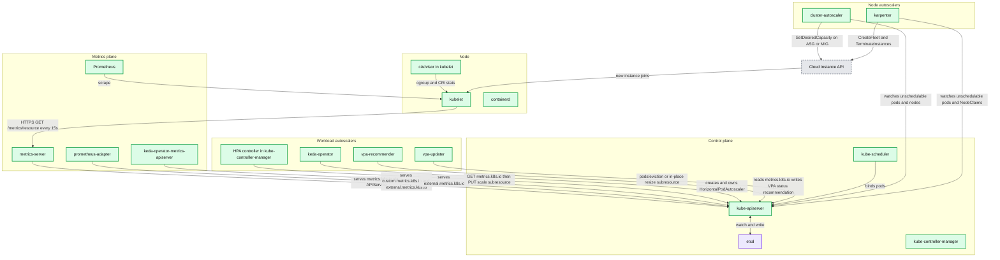

**What to notice**

- Both custom and external metrics reach the HPA through *aggregated APIServices*, not a side channel — the HPA client only ever speaks to `kube-apiserver`.
- KEDA does not scale anything itself: it creates an HPA and feeds it via `external.metrics.k8s.io`. The 0↔1 transition is the one thing KEDA does directly.
- CA talks to node-group abstractions (ASG/MIG desired capacity); Karpenter talks to the instance API directly. That single edge is the whole architectural difference.
- The scheduler is a *consumer* of the node autoscalers' output and simultaneously a *library* inside them.
- Nothing in this diagram closes the loop between VPA's recommendation and HPA's target — that is left to humans.

---

## 3. Data flow

### 3.1 Metrics collection path

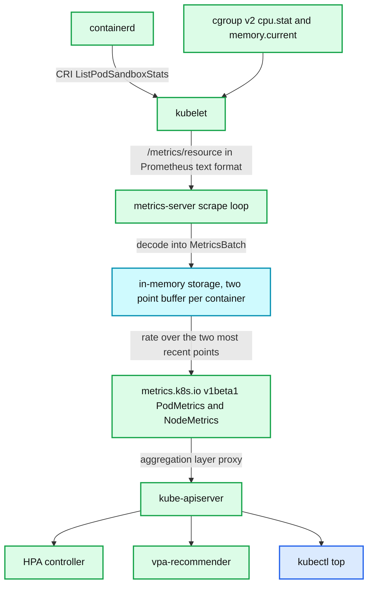

**What to notice**

- metrics-server stores exactly **two** samples per container and computes a rate; it has no history, so it cannot answer "what was CPU an hour ago." That is why VPA keeps its own histograms and its own checkpoints.
- The scrape interval is `--metric-resolution`, whose **code default is 60s** but whose **shipped manifest sets `--metric-resolution=15s`** — so the effective interval in a normal install is 15s. Validation rejects anything below 10s.
- The kubelet endpoint is `/metrics/resource`, overridable per-node with the `metrics.k8s.io/resource-metrics-path` annotation.
- A CPU value the HPA reads can be up to `metric-resolution + HPA sync period` stale — roughly 30s at defaults, before any application-level lag.
- metrics-server has no HA story for continuity: a restart loses all samples and every HPA reports `FailedGetResourceMetric` until two scrapes land.

### 3.2 Scale-up decision path

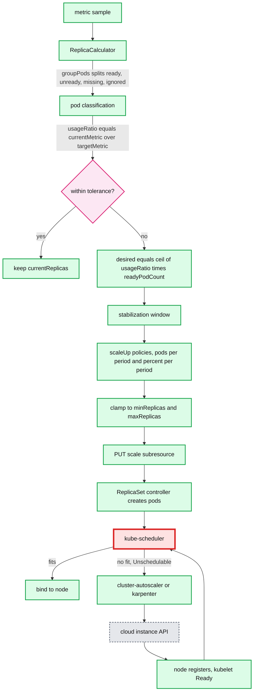

**What to notice**

- The divisor in the real formula is `readyPodCount`, not `currentReplicas` — the docs formula is the simplification that holds only when every pod is Ready and reporting.
- Tolerance is checked *before* the multiply, so a ratio of 1.09 produces literally no API write.
- Two independent throttles apply in series: the stabilization window (a min/max over recent recommendations) and the rate policies (pods-or-percent per period). They are not the same mechanism.
- The handoff to node autoscaling is *pod-shaped*, not resource-shaped: CA and Karpenter react to `Unschedulable` pods, never to cluster CPU utilization.
- End-to-end scale-up latency is the sum of metric staleness, HPA sync period, scheduler cycle, node provisioning (`--max-node-provision-time` budget 15m), image pull, and readiness probe — typically 2–5 minutes on a cold node.

### 3.3 Scale-down and consolidation path

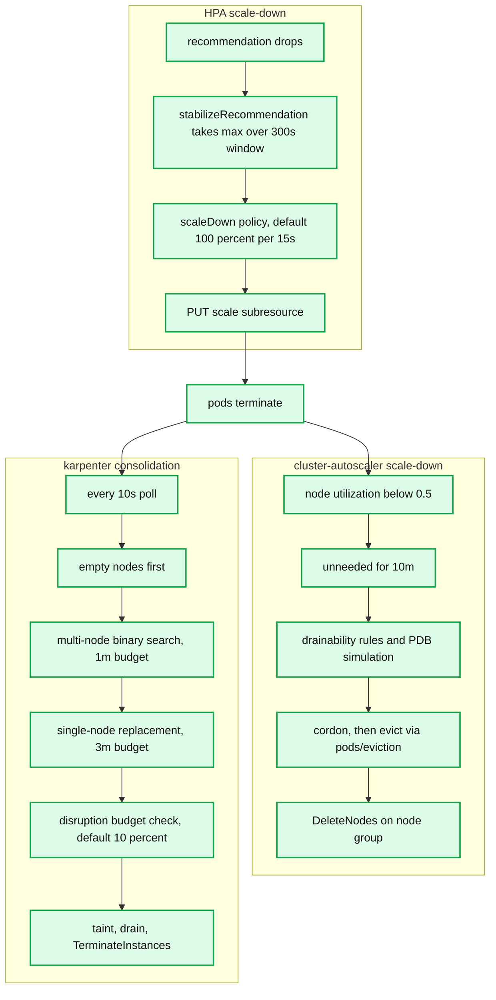

**What to notice**

- HPA scale-down defaults are deliberately asymmetric with scale-up: stabilization 0s up, 300s down.
- CA's scale-down candidate test is *utilization of requests*, not usage — a node full of over-requested idle pods is never a candidate.
- Karpenter tries the cheapest disruption first (empty), then the most valuable (multi-node), then the fallback (single-node); each has a hard wall-clock budget so a large cluster does not stall the loop.
- Both node autoscalers go through the **Eviction API**, so PDBs bind them. Neither issues a raw `DELETE` on a pod.
- The two loops interact: HPA removing pods creates the underutilization that CA/Karpenter then acts on, with a combined settling time measured in tens of minutes.

---

## 4. Sequence of operations

### 4.1 HPA scale-up, metric to running pods

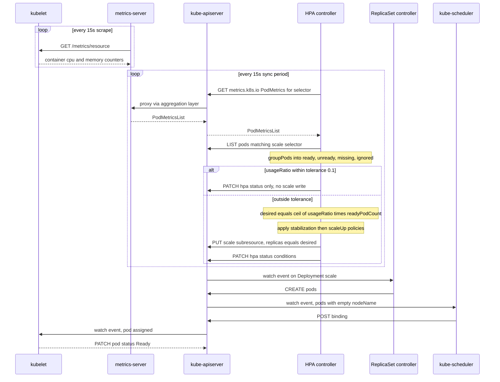

### 4.2 Cluster Autoscaler scale-up for an unschedulable pod

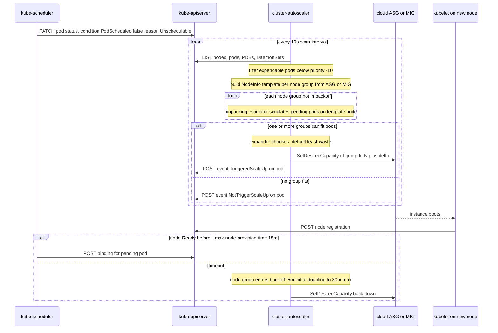

### 4.3 Karpenter consolidation

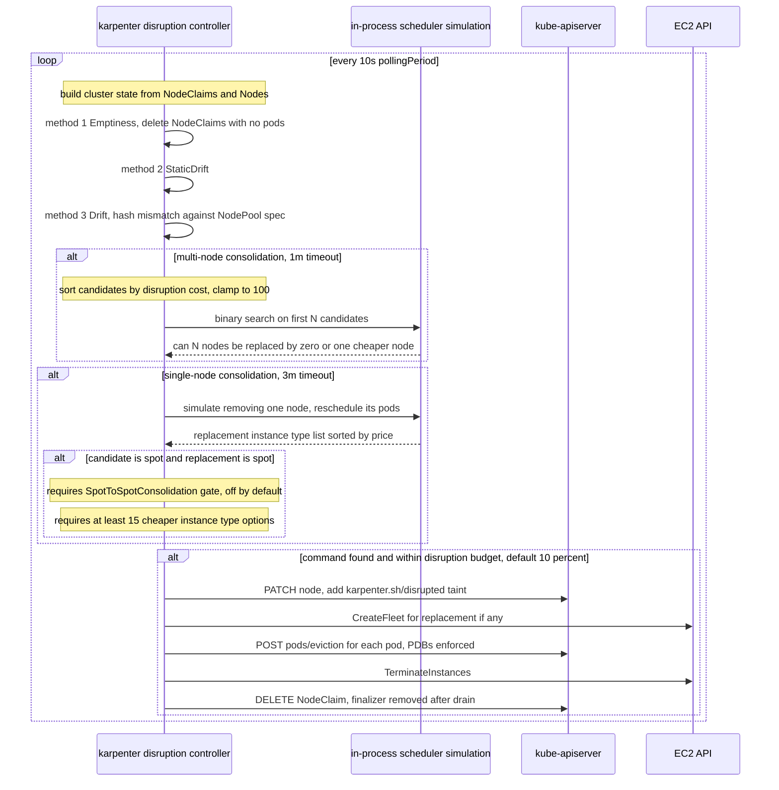

### 4.4 Node drain respecting PDBs

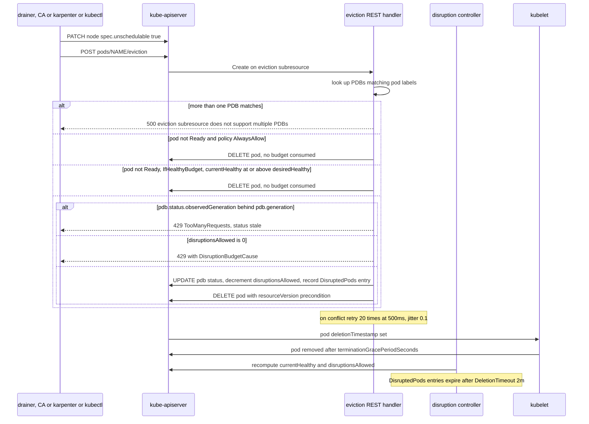

### 4.5 VPA in-place resize

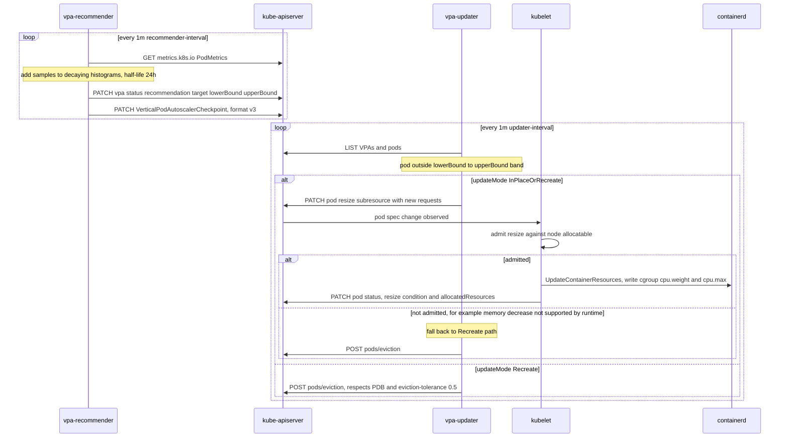

**What to notice across 4.1–4.5**

- Every write path that removes a pod goes through `pods/eviction`, and every one of them can be blocked indefinitely by a PDB with `disruptionsAllowed: 0`.
- The eviction handler's PDB decrement is optimistic-concurrency with a 20-step, 500ms, jitter-0.1 backoff — about 10 seconds of retry before it gives up. Parallel drainers on a tight PDB will see 429s, not corruption.
- CA's provisioning failure path is a *node-group backoff*, not a pod-level backoff: one bad instance type poisons the whole group for 5m→30m.
- Karpenter's consolidation is a search with wall-clock budgets, so on very large clusters it will silently return the best answer found in 1m/3m rather than the optimum.
- In-place resize is best-effort at the kubelet: if the node cannot admit it, the updater falls back to eviction, which re-couples VPA to PDBs.

---

## 5. State machines

### 5.1 HPA scaling state with stabilization

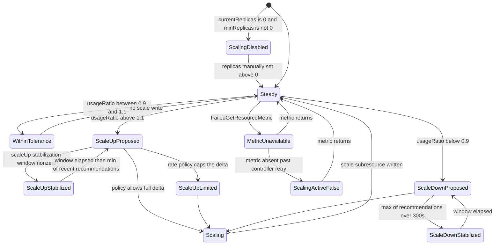

**What to notice**

- `ScalingDisabled` is a real trap state: an HPA pointed at a Deployment scaled to 0 will never scale it back up unless `minReplicas: 0` and `HPAScaleToZero` is enabled.
- Stabilization on scale-up takes the **minimum** of recent recommendations; on scale-down the **maximum**. Same buffer, opposite polarity.
- `MetricUnavailable` does **not** scale to zero or to `minReplicas` — the HPA freezes the replica count. This is the correct failure mode and surprises people who expect a fallback.
- The tolerance band is applied on the ratio, so it widens in absolute pod terms as replica count grows.

### 5.2 Node lifecycle under Cluster Autoscaler and Karpenter

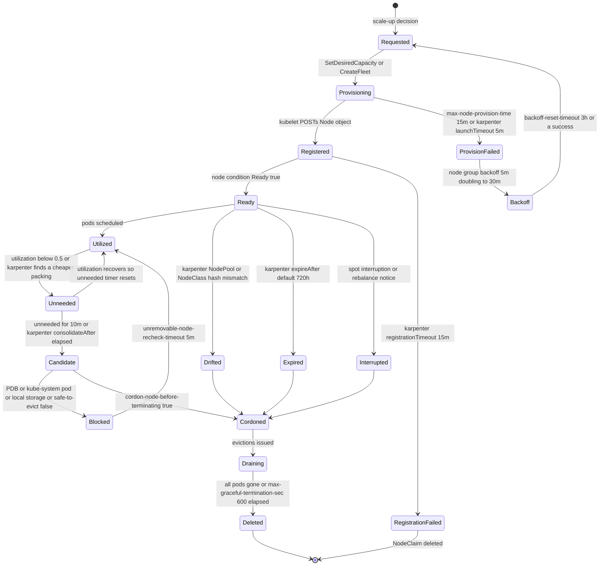

**What to notice**

- `Blocked` is the state that eats operator weeks: a node stuck there is invisible unless you watch `cluster_autoscaler_unremovable_nodes_count` or Karpenter's `Unconsolidatable` events.
- Karpenter has three additional exit paths CA lacks: drift, expiry, and interruption. Drift is the mechanism that makes AMI rollouts declarative.
- CA's backoff is per *node group*; Karpenter's is per *NodeClaim* plus an instance-type-offering-level unavailability cache. Karpenter degrades more gracefully when one instance type is capacity-constrained.
- The `unneeded` timer resets on any utilization recovery, so a workload that oscillates around 0.5 utilization will never scale down.

### 5.3 PDB disruption state

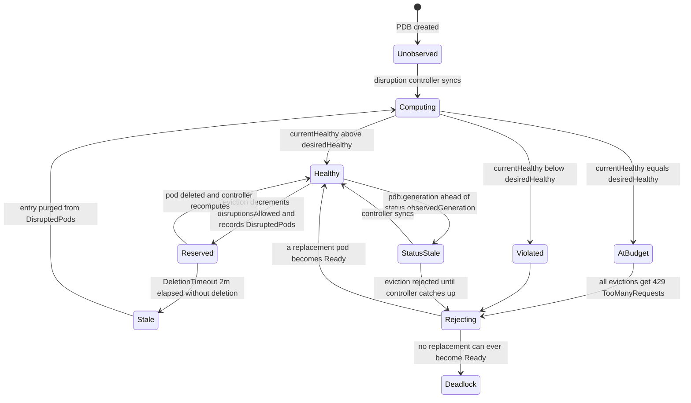

**What to notice**

- `Deadlock` is reachable purely by configuration: `minAvailable` equal to `spec.replicas`, or a `minAvailable` on a single-replica Deployment. Node drains then hang forever.
- The `DisruptedPods` map is a *reservation ledger* with a 2-minute TTL; if it exceeds `MaxDisruptedPodSize` (2000) the API server refuses all further evictions for that PDB.
- `StatusStale` gives an eviction a 429 even when budget exists — a legitimate transient during rapid scaling that clients must retry through.
- `unhealthyPodEvictionPolicy: AlwaysAllow` short-circuits `Rejecting` for not-Ready pods, which is the fix for the "CrashLoopBackOff pods block the drain" class of incident.

---

## 6. Component deep dives

### 6.1 HPA controller

**Responsibility and interfaces.** A controller inside `kube-controller-manager`. Reads `autoscaling/v2 HorizontalPodAutoscaler`, resolves `scaleTargetRef` through the RESTMapper to a resource supporting the `scale` subresource, reads metrics from `metrics.k8s.io`, `custom.metrics.k8s.io`, `external.metrics.k8s.io`, and writes `scale.spec.replicas` plus HPA status conditions.

**The formula.** The documented form is:

```
desiredReplicas = ceil( currentReplicas * ( currentMetricValue / desiredMetricValue ) )
```

The implementation in `pkg/controller/podautoscaler/replica_calculator.go` is:

```
usageRatio = currentMetricValue / desiredMetricValue
if tolerances.isWithin(usageRatio) { return currentReplicas }
desiredReplicas = ceil( usageRatio * readyPodCount )
```

with `isWithin(r)` defined as `(1.0 - scaleDownTolerance) <= r <= (1.0 + scaleUpTolerance)`.

**Worked example.** Deployment at 10 replicas, `averageUtilization: 70`, each pod `requests.cpu: 1000m`.

| Step | Value |
|---|---|
| Pods matching selector | 10 |
| Ready and reporting metrics | 8 |
| Pending | 1 (classified `unready`) |
| No metrics yet | 1 (classified `missing`) |
| Sum of CPU usage over the 8 ready pods | 7,600m |
| Sum of requests over those 8 pods | 8,000m |
| currentUtilization | 7600 / 8000 = 95% |
| usageRatio | 95 / 70 = 1.357 |
| Within tolerance (0.9–1.1)? | No |
| `scaleUpWithUnready`? | Yes (unready pods exist and ratio > 1) |
| Missing pods filled with | 0m (scale-up) |
| Unready pods filled with | 0m (scale-up) |
| Recomputed sum / requests | 7600 / 10000 = 76% |
| newUsageRatio | 76 / 70 = 1.086 |
| `isWithin(1.086)`? | **Yes** |
| Result | **stay at 10 replicas** |

That is the single most under-appreciated behaviour in the HPA: adding pods that have not yet reported metrics *dilutes* the observed ratio and can cancel the very scale-up that created them. It is deliberate anti-overshoot, and it makes the HPA slow exactly when a JVM fleet is warming up.

**JVM warmup pathology.** A JVM burns near-100% CPU for 30–90s during JIT compilation before serving useful traffic. With `--horizontal-pod-autoscaler-cpu-initialization-period` at 5m, any pod started within the last 5 minutes has its CPU sample discarded if it is not Ready *or* if the metric window predates the last readiness transition. So: warmup CPU is (correctly) ignored, but the new pods also do not count toward `readyPodCount`, so the ratio stays high and the HPA keeps adding replicas — and when they all finish warming simultaneously, utilization collapses and the 300s down-stabilization begins a slow retreat. Mitigations: scale on concurrency or queue depth instead of CPU; set a `scaleUp` stabilization window of 60–120s; use a startup probe so warmup time is not counted as Ready.

**Pod classification (`groupPods`).**

| Bucket | Condition | Treatment |
|---|---|---|
| `ignored` | `deletionTimestamp != nil` or `phase == Failed` | metric removed entirely |
| `unready` | `phase == Pending`; or for CPU, pod not Ready, or within `cpuInitializationPeriod` (5m) with a metric window older than the last readiness transition, or never-Ready within `initialReadinessDelay` (30s) | 0 on scale-up; excluded on scale-down |
| `missing` | pod present but no metric | scale-down: request × `max(100, targetUtilization)`%; scale-up: 0 |
| ready | everything else | counted |

Two guards then apply: if the refill flips the direction of the change, or if `newReplicas` crosses `currentReplicas` in the wrong direction, the controller returns `currentReplicas` unchanged.

**Scale-to-zero.** `HPAScaleToZero` is **alpha, default false, since v1.16 and unchanged in v1.34** — it has never graduated. With it off, `minReplicas` must be ≥ 1, and `currentReplicas == 0` sets condition `ScalingActive=False, reason=ScalingDisabled`. With it on, only `Object`, `Pods` and `External` metrics can drive 0→N: `getUsageRatioReplicaCount` special-cases `currentReplicas == 0` to `ceil(usageRatio)`, ignoring both `readyPodCount` and the tolerance band. Resource/ContainerResource metrics cannot, because there are no pods to measure.

**`behavior`, verified defaults.** From `pkg/apis/autoscaling/v2/defaults.go`:

```yaml
behavior:
  scaleUp:
    stabilizationWindowSeconds: 0
    selectPolicy: Max
    policies:
      - type: Pods
        value: 4
        periodSeconds: 15
      - type: Percent
        value: 100
        periodSeconds: 15
  scaleDown:
    # nil, and therefore --horizontal-pod-autoscaler-downscale-stabilization (300s)
    stabilizationWindowSeconds: 300
    selectPolicy: Max
    policies:
      - type: Percent
        value: 100
        periodSeconds: 15
```

A production `behavior` for a latency-sensitive service that must absorb spikes fast and retreat slowly:

```yaml
apiVersion: autoscaling/v2
kind: HorizontalPodAutoscaler
metadata:
  name: checkout-api
spec:
  scaleTargetRef:
    apiVersion: apps/v1
    kind: Deployment
    name: checkout-api
  minReplicas: 12
  maxReplicas: 400
  metrics:
    - type: Pods
      pods:
        metric:
          name: envoy_active_requests_per_pod
        target:
          type: AverageValue
          averageValue: "40"
    - type: Resource
      resource:
        name: cpu
        target:
          type: Utilization
          averageUtilization: 70
  behavior:
    scaleUp:
      stabilizationWindowSeconds: 0
      selectPolicy: Max
      policies:
        - type: Percent
          value: 100
          periodSeconds: 15
        - type: Pods
          value: 30
          periodSeconds: 15
    scaleDown:
      stabilizationWindowSeconds: 900
      selectPolicy: Min
      policies:
        - type: Percent
          value: 10
          periodSeconds: 60
        - type: Pods
          value: 5
          periodSeconds: 60
```

`selectPolicy: Min` on scale-down means the *most conservative* policy wins — at 400 replicas the 10%/60s policy allows 40 and the Pods policy allows 5, so 5 is used. `selectPolicy: Disabled` on `scaleDown` freezes the replica count at its high-water mark, which is the correct setting for a workload where scale-down is more dangerous than cost.

When multiple metrics are listed, each is evaluated independently and **the maximum desired replica count wins**. That makes a second metric a pure safety net; it can never lower the answer.

**Per-HPA tolerance (KEP-4951).** `HPAScalingRules.Tolerance` exists in the v1.34 API, gated by `HPAConfigurableTolerance`, **Alpha since v1.33, default false, still Alpha in v1.34**. `tolerancesForHpa()` returns the cluster-wide `--horizontal-pod-autoscaler-tolerance` for both directions unless the gate is on. Practical value: a large fleet wants a *tight* scale-up tolerance (0.02) and a *loose* scale-down tolerance (0.20) so it reacts fast and retreats reluctantly — impossible to express with one global knob.

**Concurrency.** `--concurrent-horizontal-pod-autoscaler-syncs` default **5** workers over a rate-limited workqueue; `--horizontal-pod-autoscaler-sync-period` default **15s** re-enqueues everything. The `recommendations`, `scaleUpEvents` and `scaleDownEvents` maps are guarded by separate mutexes and are **in-memory only** — a controller-manager restart or leader-election failover erases all stabilization history, and every HPA is free to scale down immediately on its next sync. On a cluster with thousands of HPAs this shows as a coordinated dip after every control-plane roll. [documented behaviour, consequence inferred]

**Production knobs.**

| Flag | Default | Note |
|---|---|---|
| `--horizontal-pod-autoscaler-sync-period` | `15s` | lower bound on reaction time |
| `--horizontal-pod-autoscaler-tolerance` | `0.1` | both directions unless KEP-4951 gate on |
| `--horizontal-pod-autoscaler-downscale-stabilization` | `5m` | used when `behavior.scaleDown.stabilizationWindowSeconds` is nil |
| `--horizontal-pod-autoscaler-cpu-initialization-period` | `5m` | discard window for CPU on young pods |
| `--horizontal-pod-autoscaler-initial-readiness-delay` | `30s` | treats early readiness flaps as initial |
| `--concurrent-horizontal-pod-autoscaler-syncs` | `5` | raise for >1000 HPAs |

Metric types: `Resource` (CPU/memory across the pod), `ContainerResource` (a named container only — GA, its feature gate was removed by v1.34), `Pods` (per-pod average of a custom metric), `Object` (a metric on one object, e.g. Ingress RPS), `External` (a metric with no in-cluster object, e.g. SQS depth).

### 6.2 metrics-server

**Responsibility and interfaces.** Implements `metrics.k8s.io/v1beta1` (`NodeMetrics`, `PodMetrics`), registered as an `APIService` so the aggregation layer proxies to it. It is not a monitoring system: no history, no alerting, no persistence, no query language.

**Internals.** A scrape loop enumerates nodes from an informer and issues `GET https://<node>:<port>/metrics/resource` in parallel, decoding Prometheus text format into a `MetricsBatch`. Storage is a `struct` behind a `sync.RWMutex` holding, per container, the **two most recent** cumulative CPU counters and the latest memory working-set gauge. A read computes CPU as `(c2 - c1) / (t2 - t1)`. Memory is a point-in-time gauge, not a rate.

**Wire format.** Scrape in: Prometheus text exposition. Serve out: standard Kubernetes JSON/protobuf over the aggregation layer, authenticated with the requesting user's identity via delegated authn/authz.

**Concurrency.** One scrape goroutine per node per tick, bounded by `--kubelet-request-timeout` (validated to be under 90% of `--metric-resolution`).

**Failure handling.** A node that fails to scrape simply has no entry; the HPA sees it as `missing` and applies the fill rules of §6.1. There is no backfill and no HA replication between metrics-server replicas — two replicas behind one Service give you two independent, unsynchronised caches.

**Knobs.**

| Flag | Code default | Shipped manifest |
|---|---|---|
| `--metric-resolution` | `60s` (min 10s) | `15s` |
| `--secure-port` | — | `10250` |
| `--kubelet-preferred-address-types` | — | `InternalIP,ExternalIP,Hostname` |
| `--kubelet-use-node-status-port` | — | set |

At 5,000 nodes with 15s resolution that is ~333 kubelet scrapes/second sustained; metrics-server memory scales with total container count, roughly 4 MiB per 1,000 pods. [inferred from the two-sample-per-container structure]

### 6.3 VPA — recommender, updater, admission controller

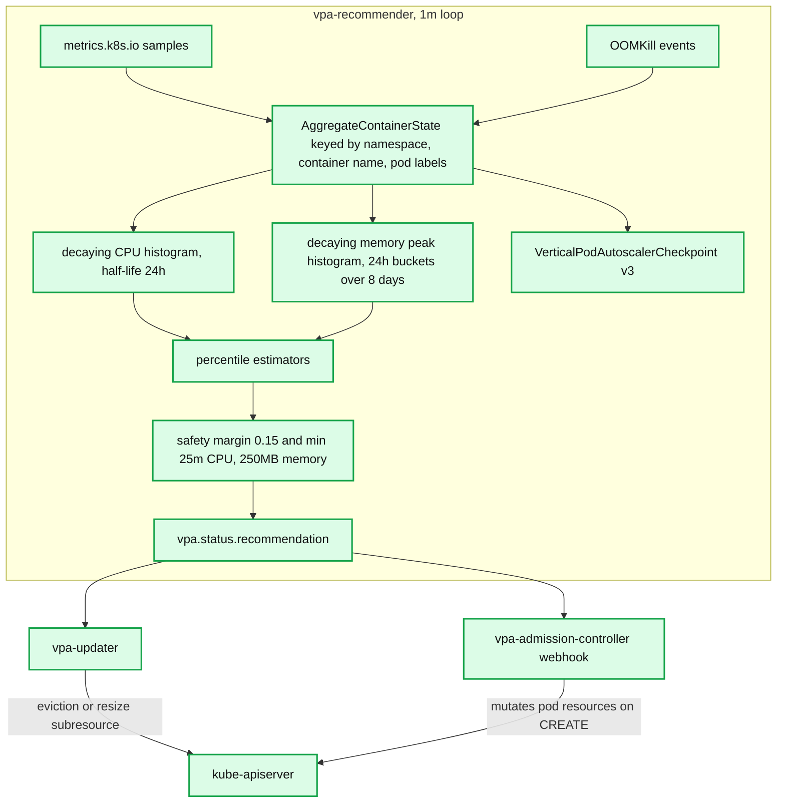

**What to notice**

- The aggregation key is (namespace, container name, pod label set) — **not** the VPA object. Two Deployments with a container of the same name and matching labels share one histogram.
- OOMKill events feed the same aggregate as metrics, which is how memory recommendations jump discontinuously rather than waiting for a percentile to drift.
- Checkpoints are the only durability: a recommender restart without them starts from an empty histogram and re-enters the wide-confidence-band state for ~24h.
- The recommender never touches pods. All disruption is the updater's, and all mutation is the webhook's — three processes, three failure domains.

**Recommender internals.** Two decaying histograms per aggregate:

| Constant | Value |
|---|---|
| CPU histogram range / first bucket | 0.01 → 1000 cores |
| Memory histogram range / first bucket | 10 MB → 1 TB |
| Bucket growth | 5% per bucket (`DefaultHistogramBucketSizeGrowth = 0.05`) |
| CPU decay half-life | 24h |
| Memory decay half-life | 24h |
| Memory aggregation interval | 24h, one peak per interval |
| Memory aggregation window | 8 intervals = **8 days** |
| `minSampleWeight` | 0.1 |
| `epsilon` | `0.001 × 0.1 = 1e-4` |
| OOM bump-up ratio | 1.2× |
| OOM minimum bump-up | 100 MB |
| Checkpoint format | `v3` |

Percentile targets, all read from `pkg/recommender/logic/recommender.go`:

| Output | CPU percentile | Memory percentile | Extra multiplier |
|---|---|---|---|
| `target` | **0.90** | **0.90** | ×1.15 safety margin |
| `lowerBound` | **0.50** | **0.50** | confidence multiplier `(0.001, −2.0)` over a 24h interval |
| `upperBound` | **0.95** | **0.95** | confidence multiplier `(1.0, +1.0)` over a 24h interval |

The confidence multipliers are the subtle part: with little history the upper bound is inflated and the lower bound deflated, so the "acceptable band" is wide and the updater does nothing. As history accumulates toward `--confidence-interval-cpu` (24h) the band tightens and evictions begin. This is what stops VPA from thrashing a freshly deployed workload.

Floors: `--pod-recommendation-min-cpu-millicores 25`, `--pod-recommendation-min-memory-mb 250`.

**Updater.** `--updater-interval 1m`. It evicts a pod only when its current request is outside `[lowerBound, upperBound]`. Guardrails: `--min-replicas 2` (never touch a single-replica workload), `--eviction-tolerance 0.5` (never disrupt more than half a replica set in one pass), `--eviction-rate-limit -1` (disabled by default) with `--eviction-rate-burst 1`. Eviction goes through `pods/eviction`, so PDBs bind — except when `--in-place-skip-disruption-budget` is set for in-place resizes.

**Admission controller.** A mutating webhook on pod CREATE that overwrites `resources.requests` with `vpa.status.recommendation.target`. This is the only component that acts in `Initial` mode, and it is on the critical path of every pod creation in scope — a failed webhook with `failurePolicy: Fail` stops pod creation cluster-wide for matching namespaces.

**Update modes.**

| Mode | Behaviour |
|---|---|
| `Off` | recommend only; the dry-run mode you should use first |
| `Initial` | apply at pod creation only |
| `Recreate` | apply at creation and evict pods to re-apply |
| `Auto` | **deprecated alias**; currently equivalent to `Recreate` |
| `InPlaceOrRecreate` | try the pod `resize` subresource; fall back to eviction |

**`InPlaceOrRecreate` / KEP-1287 status.** Cluster side: `InPlacePodVerticalScaling` is **Beta, default true since Kubernetes v1.33**, so it is on by default in v1.34. VPA side: the `InPlaceOrRecreate` feature gate was **Alpha in VPA 1.4, Beta (default true) in VPA 1.5, and GA/locked in VPA 1.6.0**. Related alpha gates in v1.34: `InPlacePodVerticalScalingExclusiveCPUs` (alpha, 1.32) and `InPlacePodVerticalScalingExclusiveMemory` (alpha, new in 1.34). `InPlacePodVerticalScalingAllocatedStatus` is Deprecated and slated for removal in 1.36.

**Why HPA-on-CPU and VPA-on-CPU conflict.** HPA computes utilization as `usage / request`. VPA moves `request` toward `usage × 1.15`. If VPA succeeds, utilization pins near 87% regardless of load, so the HPA's signal loses all information about demand — it is measuring VPA's tracking error, not traffic. The two loops then chase each other: VPA raises requests → utilization falls → HPA scales in → per-pod load rises → VPA raises requests again. The supported composition is HPA on a *demand* metric (RPS, queue depth, concurrency) and VPA on CPU/memory, with the HPA's resource metric removed entirely. VPA explicitly refuses to manage a resource that an HPA is also targeting only in the sense that the docs forbid it — there is no runtime interlock.

### 6.4 Cluster Autoscaler

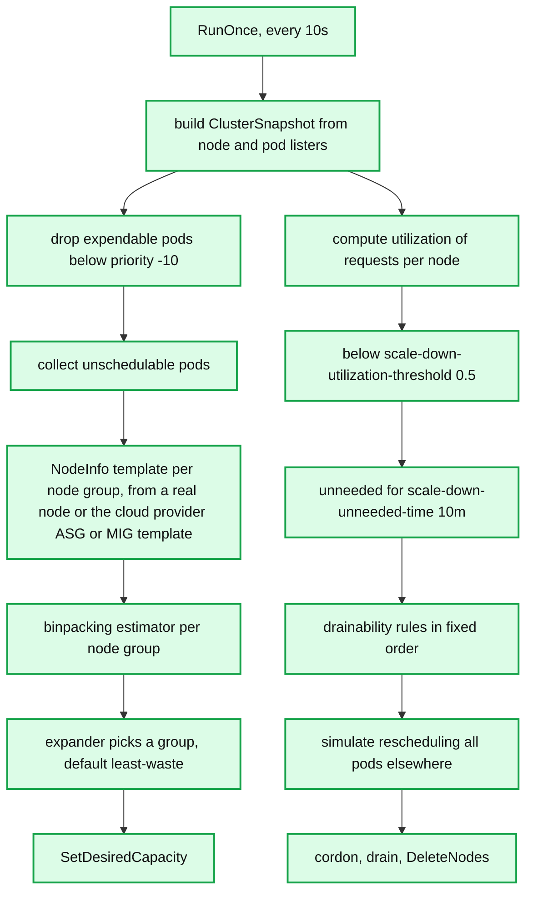

**What to notice**

- Scale-up and scale-down are evaluated in the **same** 10s iteration off the **same** snapshot, so they can never disagree about cluster state within a pass.
- Utilization is computed from **requests**, not usage — a node of idle, over-requested pods is never a scale-down candidate.
- Expendable pods (priority below `-10`) are filtered out before the unschedulable set is built, which is precisely what makes overprovisioning pause pods work.
- The template `NodeInfo` is the weakest link: for an empty node group it is synthesised from cloud metadata, and any mismatch produces a scale-up/scale-down loop that never converges.

**Node group templates.** For an empty node group CA cannot inspect a real node, so it synthesises a `NodeInfo` from the cloud provider's ASG/MIG launch template plus tag-encoded labels and taints. This is the source of the classic "CA thinks the node will have 8 CPUs and 2 GPUs but it does not" failure — the fix is provider-specific tags (`k8s.io/cluster-autoscaler/node-template/label/...`, `.../taint/...`, `.../resources/...`).

**Expanders** (`--expander`, comma-separated for tie-break chains): `random`, `most-pods`, `least-waste`, `price`, `priority`, `grpc`, plus `least-nodes`. **The v1.34 default is `least-waste`**, not `random` — this changed from the long-standing `random` default and is a common stale assumption. `priority` reads a `cluster-autoscaler-priority-expander` ConfigMap mapping integer priorities to node-group name regexes.

**Estimator:** `--estimator binpacking` (the only production option).

**Drainability rules, evaluated in this order** (`simulator/drainability/rules/rules.go`): `mirror` → `longterminating` → `replicacount` → `daemonset` → `safetoevict` → `terminal` → `replicated` → `system` → `notsafetoevict` → `localstorage` → `pdb`. What blocks scale-down in practice:

- A `kube-system` pod that is not a DaemonSet or mirror pod and has **no PDB** (`--skip-nodes-with-system-pods=true`). CoreDNS, metrics-server and the CA itself are the usual offenders. Since 1.31 CA will force-evict such pods after `--blocking-system-pod-distruption-timeout` (default **1h**), which softens but does not remove the problem.
- A pod with `emptyDir` or `hostPath` (`--skip-nodes-with-local-storage=true`), unless annotated `cluster-autoscaler.kubernetes.io/safe-to-evict-local-volumes: <comma-separated volume names>`.
- A pod annotated `cluster-autoscaler.kubernetes.io/safe-to-evict: "false"`.
- A PDB with `disruptionsAllowed: 0`.
- A pod not backed by a controller (`--skip-nodes-with-custom-controller-pods`).

`cluster-autoscaler.kubernetes.io/safe-to-evict: "true"` is the override that unblocks the first three.

**Verified flag table (release-1.34).**

| Flag | Default |
|---|---|
| `--scan-interval` | `10s` |
| `--scale-down-enabled` | `true` |
| `--scale-down-utilization-threshold` | `0.5` |
| `--scale-down-gpu-utilization-threshold` | `0.5` |
| `--scale-down-unneeded-time` | `10m` |
| `--scale-down-unready-time` | `20m` |
| `--scale-down-delay-after-add` | `10m` |
| `--scale-down-delay-after-delete` | `0s` |
| `--scale-down-delay-after-failure` | `3m` |
| `--scale-down-non-empty-candidates-count` | `30` |
| `--max-node-provision-time` | `15m` |
| `--max-graceful-termination-sec` | `600` |
| `--max-total-unready-percentage` | `45` |
| `--ok-total-unready-count` | `3` |
| `--expander` | `least-waste` |
| `--estimator` | `binpacking` |
| `--balance-similar-node-groups` | `false` |
| `--expendable-pods-priority-cutoff` | `-10` |
| `--unremovable-node-recheck-timeout` | `5m` |
| `--new-pod-scale-up-delay` | `0s` |
| `--initial-node-group-backoff-duration` | `5m` |
| `--max-node-group-backoff-duration` | `30m` |
| `--node-group-backoff-reset-timeout` | `3h` |
| `--max-scale-down-parallelism` | `10` |
| `--max-drain-parallelism` | `1` |
| `--cordon-node-before-terminating` | `true` |
| `--daemonset-eviction-for-occupied-nodes` | `true` |
| `--daemonset-eviction-for-empty-nodes` | `false` |
| `--skip-nodes-with-system-pods` | `true` |
| `--skip-nodes-with-local-storage` | `true` |
| `--blocking-system-pod-distruption-timeout` | `1h` |
| `--max-nodes-total` | `0` (unlimited) |
| `--node-deletion-batcher-interval` | `0s` |
| `--node-deletion-delay-timeout` | `2m` |

Implicit cluster ceilings: `DefaultMaxClusterCores = 5000 × 64 = 320,000`, `DefaultMaxClusterMemory = 5000 × 64 × 20 = 6,400,000 GB`.

**`--balance-similar-node-groups`** groups node groups that are "similar" within these ratios: allocatable difference ≤ **0.05**, free-resource difference ≤ **0.05**, memory capacity difference ≤ **0.015**. Essential for multi-AZ zonal ASGs — without it CA will happily put all new capacity in one AZ.

**Overprovisioning.** CA has no notion of headroom. The standard trick: a Deployment of `pause` pods with a `PriorityClass` of `-1` (below `--expendable-pods-priority-cutoff` of `-10`? No — the cutoff is `-10`, so use a value *below* `-10`, e.g. `-100`, to make them expendable). Real pods preempt them instantly, and their eviction leaves an unschedulable pause pod that triggers a scale-up. This converts CA's reactive scale-up into a pre-warmed buffer at the cost of one node's worth of spend. Use `preemptionPolicy: PreemptLowerPriority` on the real workload (the default) and `globalDefault: false` on the pause class.

**Concurrency model.** CA is fundamentally **single-goroutine per loop iteration** for the decision phase — snapshot, simulate, decide — with parallelism only in node deletion (`--max-scale-down-parallelism 10`, `--max-drain-parallelism 1`). At 5,000 nodes the snapshot and simulation phase is the dominant cost; CA is not designed to run below ~10s loops at that size.

### 6.5 Karpenter

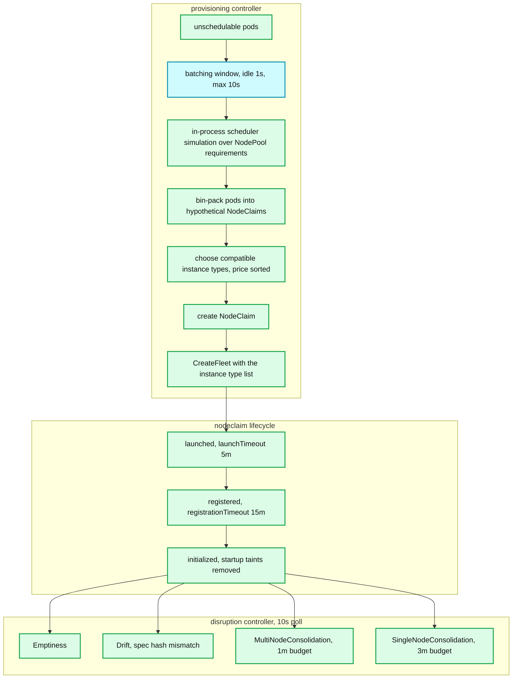

**What to notice**

- Instance type is chosen **after** bin-packing, not before. The pods define the node shape; there is no group to pick from.
- The batching window is the cost/latency dial: idle 1s, max 10s. Longer batching yields fewer, larger, cheaper nodes at the price of slower first-pod scheduling.
- `launchTimeout` (5m) and `registrationTimeout` (15m) are per-NodeClaim, so one bad launch never poisons a whole class of capacity the way CA's node-group backoff does.
- Disruption methods run in a fixed cheapest-first order and **only one method acts per pass** — the controller returns immediately after the first method produces a command.
- `expireAfter` is enforced by the lifecycle controller, not by a disruption method, so it does not consume a `Drifted` disruption budget.

**Architectural difference from CA, precisely.**

| Dimension | Cluster Autoscaler | Karpenter |
|---|---|---|
| Capacity abstraction | node group (ASG/MIG) with a fixed instance type | no groups; a `NodePool` is a *requirements* document |
| Instance selection | operator chooses per group; CA picks a group | Karpenter picks the type at launch from a price-sorted compatible list |
| Fit computation | simulate against one template node per group | simulate the actual pods, then derive the instance shape |
| Cloud call | `SetDesiredCapacity` | `CreateFleet` / `TerminateInstances` |
| Scale-down trigger | utilization < 0.5 for 10m | cost-based: is there a cheaper packing |
| Node replacement | none | drift, expiry, interruption |

**Consolidation, verified constants.**

| Constant | Value |
|---|---|
| `pollingPeriod` | `10s` |
| `consolidationTTL` | `15s` (validation window before executing a command) |
| `MultiNodeConsolidationTimeoutDuration` | `1m` |
| `SingleNodeConsolidationTimeoutDuration` | `3m` |
| multi-node candidate clamp | `100` |
| `MinInstanceTypesForSpotToSpotConsolidation` | `15` |

Multi-node consolidation does a **binary search on N** over a disruption-cost-sorted candidate list: "can the first N nodes be replaced by zero or one node?" That is `O(log N)` scheduling simulations rather than `O(2^N)` subsets.

**Spot-to-spot.** Gated by the `SpotToSpotConsolidation` feature gate, which is **off by default** (`FEATURE_GATES` default string: `NodeRepair=false,ReservedCapacity=true,SpotToSpotConsolidation=false,NodeOverlay=false,StaticCapacity=false`). When on, a spot node is only replaced by another spot node if there are at least **15** cheaper compatible instance type options — the guard exists because EC2's spot allocation strategy picks from the supplied list by availability, so consolidating to a narrow list lands you on the least-available capacity pool and raises your interruption rate. With `minValues` set in NodePool requirements the cap becomes `max(15, minInstanceTypes)`, capped at 100.

**NodePool API defaults, read from the CRD markers.**

| Field | Default |
|---|---|
| `spec.disruption.consolidationPolicy` | `WhenEmptyOrUnderutilized` |
| `spec.disruption.consolidateAfter` | `0s` |
| `spec.disruption.budgets` | `[{nodes: "10%"}]` |
| `spec.template.spec.expireAfter` | `720h` (30 days) |

Budgets accept `reasons: [Underutilized, Empty, Drifted]` and a `schedule`/`duration` pair for maintenance windows. `karpenter.sh/do-not-disrupt: "true"` on a pod or node opts out entirely.

**Note on expiry:** in v1.8 `Expiration` is **not** a disruption method. `NewMethods()` returns `[Emptiness, StaticDrift, Drift, MultiNodeConsolidation, SingleNodeConsolidation]`; `expireAfter` is enforced by the NodeClaim lifecycle controller, which deletes the NodeClaim directly. This matters because expiry therefore does not consume a `Drifted`-reason disruption budget.

**Interruption handling.** An SQS queue fed by EventBridge receives spot interruption warnings, scheduled change events, instance state changes and rebalance recommendations; Karpenter cordons and drains the node immediately on receipt, buying roughly the 2-minute spot notice window instead of losing pods hard.

**Operational knobs.** `BATCH_MAX_DURATION` **10s**, `BATCH_IDLE_DURATION` **1s** (longer batching → fewer, larger nodes), `KUBE_CLIENT_QPS` **200**, `KUBE_CLIENT_BURST` **300**, `registrationTimeout` **15m**, `launchTimeout` **5m**, `PREFERENCE_POLICY` `Respect`, `MIN_VALUES_POLICY` `Strict`.

**Failure handling.** Karpenter maintains an unavailable-offering cache keyed by (instance type, zone, capacity type) populated from `InsufficientInstanceCapacity` errors, so it fails over to the next-cheapest type within seconds rather than backing off a whole group like CA.

### 6.6 KEDA

**Responsibility.** Two deployments: `keda-operator` (reconciles `ScaledObject`/`ScaledJob`, owns the generated HPA, and performs 0↔1 transitions itself) and `keda-operator-metrics-apiserver` (an `APIService` for `external.metrics.k8s.io`).

**Mechanism.** For a `ScaledObject`, KEDA creates an HPA whose metrics are all `type: External`, pointing at KEDA's own metrics adapter. It sets `minReplicas` on that HPA to `max(1, spec.minReplicaCount)` and handles the 0↔1 edge outside the HPA — that is how KEDA delivers scale-to-zero without needing the alpha `HPAScaleToZero` gate.

**Activation vs scaling threshold.** Every scaler has a `threshold` (fed to the HPA as the target value) and an `activationThreshold` (evaluated by the operator). Below the activation threshold the operator scales to `idleReplicaCount` (or 0); above it, it scales to at least 1 and hands control to the HPA. This two-level design exists because the HPA's ratio arithmetic is undefined at zero replicas.

**Scalers.** v2.18.0 ships roughly **75** built-in scalers (counted from the `switch` in `pkg/scaling/scalers_builder.go`): Kafka consumer lag, SQS/`ApproximateNumberOfMessages`, RabbitMQ queue length, Prometheus query, Azure Service Bus, Redis list length, Cron, PostgreSQL, cloud-event sources, and so on.

**Defaults and fields.** `pollingInterval` 30s, `cooldownPeriod` 300s, `initialCooldownPeriod` 0, `idleReplicaCount` unset, `minReplicaCount` 1, `maxReplicaCount` **100** (`defaultHPAMaxReplicas`). `spec.advanced.horizontalPodAutoscalerConfig.behavior` passes a normal HPA `behavior` block straight through. `spec.fallback` supports `static`, `currentReplicas`, `currentReplicasIfHigher`, `currentReplicasIfLower` — a real answer to metric-source outages that the built-in HPA lacks.

**Event-driven vs utilization-driven.** Queue depth is a *leading* indicator of required capacity; CPU utilization is a *lagging* indicator of consumed capacity. For any worker pool draining a queue, `desiredReplicas = ceil(queueDepth / targetPerPod)` is directly meaningful and has no warmup pathology. That is why KEDA won the batch/worker segment outright.

**Failure modes.** Only one `ScaledObject` may target a given workload; a manually created HPA on the same target fights it. The metrics adapter is a single point of failure for every KEDA-driven HPA — when it is down every HPA reports `FailedGetExternalMetric` and freezes, which is why `fallback` matters.

### 6.7 Descheduler

**Why the scheduler alone cannot fix drift.** `kube-scheduler` makes an irrevocable placement decision at pod creation, using the cluster state at that instant. It never revisits it. Every subsequent event — node addition, node removal, pod deletion, label change, taint change, request change by VPA — invalidates prior decisions without any mechanism to re-evaluate them. The scheduler is a one-shot optimiser over a moving system.

**Policies (v0.34.0).**

| Plugin | What it does |
|---|---|
| `RemoveDuplicates` | evicts pods so no node holds more than one replica of the same owner where avoidable |
| `LowNodeUtilization` | evicts from nodes above `targetThresholds` toward nodes below `thresholds`; aborts if either set is empty |
| `HighNodeUtilization` | the inverse — evicts from nodes *below* `thresholds` to consolidate onto fewer nodes; pairs with CA/Karpenter for cost |
| `RemovePodsViolatingTopologySpreadConstraint` | evicts pods whose spread constraints are now violated |
| `RemovePodsViolatingNodeAffinity` / `NodeTaints` / `InterPodAntiAffinity` | re-enforce constraints that became false after the fact |
| `RemoveFailedPods`, `PodLifeTime` | hygiene |

Both utilization plugins measure **requests** by default, and their thresholds are percentages of node allocatable across `cpu`, `memory`, `pods` and extended resources; `useDeviationThresholds: true` reinterprets them as deviations from the cluster mean. Global safety valves `maxNoOfPodsToEvictPerNode`, `maxNoOfPodsToEvictPerNamespace` and `maxNoOfPodsToEvictTotal` all default to **unset/unlimited** — set them.

**Critical property:** the descheduler only *evicts*. It has no placement authority; where the pod lands is the scheduler's decision, and nothing guarantees it lands somewhere better. `HighNodeUtilization` plus a scheduler configured with `NodeResourcesFit` `MostAllocated` scoring is the combination that actually consolidates; without the scoring change you get eviction churn and no consolidation.

### 6.8 Disruption controller and the Eviction API

**Responsibility.** `pkg/controller/disruption` watches PDBs plus every pod-owning controller (`ReplicaSet`, `ReplicationController`, `Deployment`, `StatefulSet`, and any scale-capable custom resource) and maintains `pdb.status`.

**Computation** (`getExpectedPodCount` + `updatePdbStatus`):

```
expectedCount   = scale.spec.replicas of the owning controller (or count of matching pods if unmanaged)
desiredHealthy  = minAvailable                       # if minAvailable is an integer
                = ceil(expectedCount * pct)          # if minAvailable is a percentage
                = expectedCount - maxUnavailable     # if maxUnavailable is used, floored at 0
currentHealthy  = count of pods where IsPodReady(pod) and not in DisruptedPods within DeletionTimeout
disruptionsAllowed = max(0, currentHealthy - desiredHealthy)
```

`IsPodReady` is the definition of "healthy" — a `Running` pod failing its readiness probe counts as unhealthy.

**Eviction API vs raw DELETE.** `POST /api/v1/namespaces/NS/pods/NAME/eviction` runs the PDB check; `DELETE /api/v1/namespaces/NS/pods/NAME` does not. Nothing forces a client to use the former — a raw DELETE, a node deletion, or a kubelet eviction under memory pressure all bypass PDBs entirely. **PDBs constrain voluntary disruptions only, and only when the disrupting party is polite.**

**Verified constants.**

| Constant | Value | Location |
|---|---|---|
| `DeletionTimeout` | `2m` | `pkg/controller/disruption` |
| `stalePodDisruptionTimeout` | `2m` | same |
| `MaxDisruptedPodSize` | `2000` | `pkg/registry/core/pod/storage/eviction.go` |
| `EvictionsRetry` | `Steps: 20, Duration: 500ms, Factor: 1.0, Jitter: 0.1` | same |

**`unhealthyPodEvictionPolicy`.** GA — its feature gate is gone from `pkg/features` in v1.34 (graduated in v1.31).

- `IfHealthyBudget` (the default when nil): an unready pod may be evicted without consuming budget **only if** `currentHealthy >= desiredHealthy && desiredHealthy > 0`. Otherwise it must pass the normal budget check.
- `AlwaysAllow`: any not-Ready pod is deleted without consuming budget, unconditionally.

**The misconfiguration that blocks drains forever.** `minAvailable` equal to (or a percentage that rounds up to) `spec.replicas`. Then `desiredHealthy == expectedCount`, so `disruptionsAllowed` is permanently 0 and every eviction gets a 429. Runner-up: a `minAvailable: 1` PDB on a single-replica Deployment. Both survive indefinitely because nothing in the system reports "this PDB can never allow a disruption." The detection query is `kube_poddisruptionbudget_status_pod_disruptions_allowed == 0` sustained over 15 minutes; the structural fix is to standardise on `maxUnavailable: 1` (which is always satisfiable once `currentHealthy == expectedCount`) plus `unhealthyPodEvictionPolicy: AlwaysAllow`.

### 6.9 ResourceQuota controller and quota admission

Two distinct pieces:

**The controller** (`pkg/controller/resourcequota`) recomputes `status.used` from informers. `--resource-quota-sync-period` **5m**, `--concurrent-resource-quota-syncs` **5**. It also runs a *replenishment* path: watches on every quota-tracked resource enqueue the affected namespace's quotas when an object is deleted, so freed quota is returned in seconds, not on the 5-minute resync.

**The admission plugin** (`plugin/pkg/admission/resourcequota` over `apiserver/.../plugin/resourcequota`) is the enforcement point, and it is where the concurrency race is handled. It cannot simply read `status.used` — that value is stale by construction. Instead:

- Every admitted request becomes an `admissionWaiter` queued **by namespace**.
- Worker goroutines drain one namespace at a time (`inProgress` set + `dirtyWork` map), so all concurrent creations in a namespace are evaluated as a **batch against one snapshot** of the quota objects.
- `checkQuotas` evaluates each waiter against a running copy, then issues `UpdateStatus`. On a conflict it re-gets only the failed quotas and **recurses on the subset**, because the waiters that already succeeded were evaluated against a consistent snapshot.
- Each waiter blocks up to **10 seconds** (`time.After(10 * time.Second)`) before returning `resource quota evaluation timed out` as a 500.

This is the mechanism that makes quota atomic under a burst: quota admission is effectively **serialised per namespace**, which is also why a namespace under heavy churn plus quota shows elevated `apiserver_request_duration_seconds` on POST pods.

**Scopes and `scopeSelector`.** `Terminating`/`NotTerminating` (on `activeDeadlineSeconds`), `BestEffort`/`NotBestEffort`, and `PriorityClass` via `scopeSelector`. The last is the fleet-level primitive: a quota that only counts pods in the `high` PriorityClass lets you cap premium capacity per tenant while leaving best-effort work unbounded.

```yaml
apiVersion: v1
kind: ResourceQuota
metadata:
  name: tenant-a-premium
spec:
  hard:
    cpu: "2000"
    memory: 8Ti
    pods: "4000"
  scopeSelector:
    matchExpressions:
      - operator: In
        scopeName: PriorityClass
        values: ["tier-1-latency"]
```

A `ResourceQuota` on `cpu`/`memory` forces every pod in the namespace to declare requests *and* limits; `LimitRange` supplies defaults so existing manifests do not break:

```yaml
apiVersion: v1
kind: LimitRange
metadata:
  name: defaults
spec:
  limits:
    - type: Container
      default:            {cpu: 500m, memory: 512Mi}   # becomes limits
      defaultRequest:     {cpu: 100m, memory: 128Mi}   # becomes requests
      max:                {cpu: "8",  memory: 32Gi}
      maxLimitRequestRatio: {cpu: "4"}
```

---

## 7. Guarantees

**What is guaranteed:**

- **Convergence, not optimality.** Given a stable metric, HPA converges to a replica count whose observed ratio lies within the tolerance band. Nothing claims that count is minimal, cost-optimal, or reached quickly.
- **Bounded rate of change.** `behavior` policies and stabilization windows put a hard ceiling on replicas added or removed per period. This is a real guarantee and the only one with teeth.
- **Monotone respect for `minReplicas`/`maxReplicas`.** The clamp is applied last, after stabilization and rate limiting.
- **Eviction-API-mediated disruption respects PDBs.** Every well-behaved drainer (CA, Karpenter, `kubectl drain`, VPA updater) uses `pods/eviction`.
- **Quota is never oversubscribed by admission.** The per-namespace batching and conflict-retry make quota accounting exact against concurrent creates.
- **VPA recommendations are stable under sparse data.** The confidence multipliers guarantee the acceptable band is wide early, so no eviction happens on thin history.

**What is explicitly not guaranteed:**

- **No latency guarantee, at any layer.** There is no bound on metric-to-pod-running time. Nothing in the API even expresses one.
- **No guarantee a scale-up succeeds.** `maxReplicas` may be reached, quota may be exhausted, the cloud may return `InsufficientInstanceCapacity`, the node group may be in backoff.
- **No cross-autoscaler consistency.** HPA and VPA can and will fight; CA and Karpenter running together will fight.
- **No guarantee of scale-down.** A single unblockable pod pins a node indefinitely.
- **PDBs do not survive involuntary disruption.** Node crash, kernel OOM, kubelet eviction under `MemoryPressure`, and raw `DELETE` all bypass them.
- **No exactly-once semantics on stabilization.** The HPA's recommendation history is in-memory; a controller-manager restart resets it.

---

## 8. Failure modes

| Failure | Mechanism | Detection | Mitigation |
|---|---|---|---|
| **HPA flapping** | tolerance band too narrow relative to metric variance; scale-up and scale-down both fire within a period | `hpa_controller_...` scale events, `kube_horizontalpodautoscaler_status_desired_replicas` oscillating | raise `scaleDown.stabilizationWindowSeconds`; `selectPolicy: Min` on scale-down; per-HPA tolerance if the alpha gate is acceptable |
| **Metric staleness** | metrics-server restart, kubelet scrape failure, Prometheus adapter lag | HPA condition `ScalingActive=False`, reason `FailedGetResourceMetric` | HPA freezes replicas — correct. Alert on the condition; for KEDA use `spec.fallback` |
| **JVM warmup overshoot** | CPU high during JIT; new pods dilute the ratio, then the fleet is oversized when warmup completes | replica count sawtooth with a 5–10 minute period | startup probes; scale on concurrency; `scaleUp.stabilizationWindowSeconds: 60` |
| **HPA + VPA on CPU** | VPA drives `usage/request` to a constant; HPA loses its signal | requests climbing monotonically while replicas fall | never target the same resource; HPA on demand metrics, VPA on CPU/memory |
| **CA thrash** | `--scale-down-unneeded-time` shorter than the workload's demand period; node added then removed then added | `cluster_autoscaler_scaled_up_nodes_total` and `scaled_down_nodes_total` both high | raise `--scale-down-unneeded-time` to 20–30m; `--scale-down-delay-after-add 10m` already helps; pre-warm with overprovisioning pods |
| **PDB deadlock** | `disruptionsAllowed` permanently 0 | `kube_poddisruptionbudget_status_pod_disruptions_allowed == 0` for >15m | `maxUnavailable: 1` instead of `minAvailable: N`; `unhealthyPodEvictionPolicy: AlwaysAllow`; validating admission policy rejecting `minAvailable >= replicas` |
| **Node stuck undrainable** | kube-system pod without PDB, `emptyDir`, `safe-to-evict: false` | `cluster_autoscaler_unremovable_nodes_count`; Karpenter `Unconsolidatable` events | PDBs on every kube-system Deployment; `safe-to-evict-local-volumes` annotation; `--blocking-system-pod-distruption-timeout` |
| **Scale-to-zero cold start** | 0→1 requires KEDA activation, then a possible node provision, then image pull | p99 of first-request latency after idle | keep `minReplicaCount: 1` for latency-sensitive paths; pre-pull images via a DaemonSet; `idleReplicaCount` only on true batch work |
| **Quota exhaustion mid-rollout** | a rolling update needs `replicas + maxSurge` worth of quota; the surge exceeds `hard` | Deployment stuck, `FailedCreate` events with `exceeded quota` | headroom equal to `maxSurge`; or `maxSurge: 0` with `maxUnavailable: 1` |
| **Cloud API rate limits** | CA polling ASGs, or Karpenter `CreateFleet` storms during a large scale-up | provider throttling errors in autoscaler logs; scale-up latency spikes | raise `--scan-interval`; Karpenter `BATCH_MAX_DURATION` up to 30s for fewer, larger launches; split across accounts |
| **CA template mismatch** | empty node group's synthesised `NodeInfo` disagrees with the real instance | scale-up fires, node joins, pod still unschedulable, node scales back down in 10m — an infinite loop | provider `node-template` tags for labels, taints and extended resources |
| **Both CA and Karpenter running** | each sees the other's nodes as scale-down candidates | node count oscillation with no workload change | never run both against the same nodes; if migrating, restrict CA to explicit node groups |
| **Descheduler churn** | eviction with no placement authority; the pod returns to the same node | eviction rate high, distribution unchanged | pair `HighNodeUtilization` with `MostAllocated` scheduler scoring; always set `maxNoOfPodsToEvictTotal` |

---

## 9. Scalability and performance

### 9.1 The envelope

SIG-Scalability `thresholds.md` (current head), cross-checked against "Considerations for large clusters":

| Dimension | Namespace scope | Cluster scope |
|---|---|---|
| Nodes | n/a | **5,000** |
| Pods | 3,000 | **150,000** |
| Containers | n/a | **300,000** [documented in the large-cluster doc] |
| Pods per node | `min(110, 10 × #cores)` | same |
| Namespaces | n/a | 10,000 |
| Services | 5,000 | 10,000 |
| Endpoints per Service | **250** | n/a |
| Deployments | 2,000 | TBD |
| Non-Event objects per resource type | — | **150,000** |
| Event objects | — | 1,000,000 |
| Size per object | 1.5 MB | 1.5 MB |
| Total size per resource type | — | 1.5 GB |
| ServiceAccount tokens | 2,000 | 2,000 |
| Token verifications | 5,000 QPS | 5,000 QPS |

Properties of the envelope stated in the doc: it is **not a cube** (dimensions are coupled), **not convex**, and moving far along one axis shrinks your cross-section on the others. The thresholds are soft — crossing them degrades rather than fails.

### 9.2 The SLOs and how they are measured

| SLI | SLO | Status |
|---|---|---|
| Mutating API call latency per (resource, verb), 99th pct over 5 min | **≤ 1s** per cluster-day | Official |
| Read-only non-streaming API call latency, `scope=resource` | **≤ 1s** per cluster-day | Official |
| Read-only non-streaming API call latency, `scope=namespace` or `cluster` | **≤ 30s** per cluster-day | Official |
| Startup latency of schedulable stateless pods, excluding image pull and init containers, from creation timestamp to all containers reported started and observed via watch, 99th pct over 5 min | **≤ 5s** per cluster-day | Official |
| Stateful pod startup latency | provider-dependent | WIP |
| Network programming latency (Service/Endpoint change → dataplane) | unset | **WIP** |
| DNS programming latency | unset | **WIP** |

Note the 30s figure: the namespace/cluster-scope read SLO was raised from 5s because large LISTs legitimately take longer. Anyone quoting "1 second for all API calls" is quoting the resource-scope number only.

**Measurement.** `ClusterLoader2` (in `kubernetes/perf-tests`) drives the load-generation testsuite; the `density` and `load` tests produce the numbers. Measurements come from `apiserver_request_duration_seconds` (server-side only — the SLI explicitly excludes network and client time) and from a watch-based pod-startup measurement. Results are published to **perf-dash.k8s.io**. Since December 2025 the release-blocking scalability jobs run on **kops** rather than the older kube-up setup, on **sharded etcd** — meaning the official 5,000-node result assumes events (and often other resources) are on a separate etcd cluster. A single-etcd cluster will not reproduce it.

### 9.3 What saturates first, with mechanism

**1. etcd — object count, database size, watch fan-out.**
Mechanism: every object lives in a B-tree keyed by path; every write bumps a global revision; MVCC keeps all historical revisions until compaction. The apiserver runs compaction every `--etcd-compaction-interval` (**5m**), but compaction only marks revisions free — it does not shrink the file. Without `etcd defrag`, `db_total_size_in_bytes` grows monotonically toward `--quota-backend-bytes` (etcd's default 2 GiB; 8 GiB is the practical maximum), and hitting it puts the cluster into a read-only `NOSPACE` alarm.
Numbers: 150,000 non-Event objects per resource type, 1.5 GB total per type.
Mitigation: shard events to a separate etcd (`--etcd-servers-overrides=/events#https://...`); alert on `etcd_mvcc_db_total_size_in_use_in_bytes / etcd_mvcc_db_total_size_in_bytes`; schedule defrag; watch `etcd_disk_wal_fsync_duration_seconds` p99 (should stay under 10ms on NVMe) and `etcd_server_leader_changes_seen_total`.

**2. kube-apiserver — memory from LIST.**
Mechanism: an unpaginated `LIST pods` at cluster scope on a 150,000-pod cluster serialises every pod. Historically the apiserver built the entire response in memory before writing it, so a handful of concurrent full LISTs could OOM a 32 GiB apiserver. v1.34 has three fixes stacked:
- **Watch cache** serves LISTs from memory instead of etcd.
- `ConsistentListFromCache` — **GA and locked in v1.34** — lets even `resourceVersion=""` (fully consistent) LISTs be served from the watch cache using an etcd progress notification for the revision guarantee, removing the last reason to hit etcd for a LIST.
- `StreamingCollectionEncodingToJSON` and `StreamingCollectionEncodingToProtobuf` — both **GA and locked in v1.34** — encode collections item-by-item instead of materialising the whole response, which is the actual memory fix.
- `WatchList` (streaming initial state via `WATCH` with `sendInitialEvents`) is **Beta, default true in v1.34** — note it was flipped *off* in v1.33 because the streaming encoders proved better, then back on in v1.34.
- `ListFromCacheSnapshot` **Beta default true in v1.34**, `SizeBasedListCostEstimate` **Beta (new) in v1.34** (makes APF charge LIST requests by estimated response size), `BtreeWatchCache` **Beta since v1.32**.
- **APF**: `--max-requests-inflight` **400** and `--max-mutating-requests-inflight` **200** become the total seat budget distributed across PriorityLevelConfigurations. Watch `apiserver_flowcontrol_rejected_requests_total` and `apiserver_flowcontrol_current_inqueue_requests`.

**3. kube-controller-manager — client QPS.**
The generic client default is `--kube-api-qps` **20** and `--kube-api-burst` **30**. That is a small-cluster default and is the number-one throttling source on large clusters — symptom is `rest_client_rate_limiter_duration_seconds` becoming nonzero and workqueue depth climbing. At 5,000 nodes set 100/200 or higher. Per-controller worker counts (`--concurrent-deployment-syncs`, `--concurrent-endpoint-syncs`, `--concurrent-service-endpoint-syncs` **5**, `--concurrent-resource-quota-syncs` **5**, `--concurrent-horizontal-pod-autoscaler-syncs` **5**) all need raising in proportion. Monitor `workqueue_depth` and `workqueue_queue_duration_seconds` per controller.

**4. kube-scheduler — the single-threaded cycle.**
Mechanism: the scheduling *cycle* (filter → score → reserve → permit) is serial per pod; only the Filter and Score plugin evaluations across nodes are parallel (`Parallelism` default **16**). Throughput is therefore roughly `1 / cycle_time`, typically 100–300 pods/s.
The dominant lever is `percentageOfNodesToScore`, default **0 = adaptive**, computed as `percentage = 50 - numAllNodes/125`, floored at **5%**, with an absolute floor of **100 feasible nodes**. At 5,000 nodes that gives `50 - 40 = 10%` → 500 nodes examined. Setting it to 100 for better packing multiplies scheduling latency by 10.
Also: `PodInitialBackoffSeconds` **1**, `PodMaxBackoffSeconds` **10** — a pod that cannot be scheduled retries with capped backoff, so a large batch of permanently-unschedulable pods costs a bounded but nonzero amount of scheduler time forever.
Monitor `scheduler_scheduling_attempt_duration_seconds` and `scheduler_pending_pods`.

**5. kube-proxy — sync time vs Service count.**
Mechanism: in `iptables` mode a resync rewrites rules proportional to `#services × #endpoints`. `--proxy-mode=iptables` defaults `syncPeriod` **30s** and `minSyncPeriod` **1s**; a 10,000-Service cluster produces six-figure rule counts and `iptables-restore` runs measured in seconds, during which the dataplane is stale. This is exactly the WIP "network programming latency" SLI.
Mitigation: `nftables` mode (same 30s/1s defaults, but set-based matching gives roughly O(1) lookup and dramatically cheaper incremental updates), or `ipvs` (hash-table based). `--config-sync-period` is **15m**.
Conntrack: `tcpEstablishedTimeout` **24h**, `tcpCloseWaitTimeout` **1h**, and `nf_conntrack_max` is the hard ceiling — a node running out of conntrack entries drops connections silently. Monitor `kubeproxy_sync_proxy_rules_duration_seconds` and `node_nf_conntrack_entries` against `_limit`.

**6. EndpointSlice churn.**
`--max-endpoints-per-slice` default **100**, `--concurrent-service-endpoint-syncs` **5**. A 2,000-pod Service becomes 20 slices; a rolling update rewrites them repeatedly, and every rewrite is a watch event fanned out to every kube-proxy and every CoreDNS pod on all 5,000 nodes. This is the classic O(nodes × services) write amplification. The `EndpointSliceMirroring` and per-slice-size knobs trade update size against update count. Keep the documented 250-endpoints-per-Service threshold in mind and shard very large Services.

**7. DNS QPS and conntrack.**
CoreDNS QPS scales with pod count and with `ndots:5` amplification — each unqualified lookup expands into up to five queries against the search path. UDP DNS creates conntrack entries at exactly the rate of query volume, and the classic `DNAT` race on conntrack insertion produces 5-second resolution stalls. Mitigations: `NodeLocal DNSCache` (removes both the conntrack pressure and the cross-node hop), `dnsConfig.options: ndots: 1` for pods that use FQDNs, and autoscaling CoreDNS on request rate.

**8. Image registry bandwidth.**
A 5,000-node rollout of a 1 GiB image is 5 TiB of pulls. kubelet defaults `--registry-qps` **5** and `--registry-burst` **10** per node, `--serialize-image-pulls` true by default. Mitigations: regional pull-through caches, `imagePullPolicy: IfNotPresent`, pre-pull DaemonSets, image streaming/lazy-loading snapshotters (SOCI, stargz). Image pull time is explicitly **excluded** from the pod-startup SLO, which is why the SLO is met on clusters where users perceive slow starts.

**9. Node-level PLEG and cAdvisor.**
Generic PLEG relists the full container set every **1s** (`genericPlegRelistPeriod`), which is `O(containers on node)` CRI calls; on a 110-pod node with a slow runtime this produces the familiar `PLEG is not healthy` node flap. Evented PLEG (CRI container events) reduces the relist to every **300s** with a **10m** threshold and 5 stream retries. cAdvisor's cgroup walk is the other per-node cost and scales with container count.
Node status: `--node-status-update-frequency` **10s**, `--node-status-report-frequency` **5m** — meaning 5,000 nodes generate a lease update every 10s (500 writes/s just for leases) plus a full status PATCH every 5 minutes.

### 9.4 Tuning checklist for a 5,000-node cluster

| Component | Setting | Default | 5,000-node value | Why |
|---|---|---|---|---|
| etcd | `--quota-backend-bytes` | 2 GiB | `8589934592` (8 GiB) | headroom before NOSPACE |
| etcd | events cluster | shared | separate etcd via `--etcd-servers-overrides=/events#...` | events dominate write volume |
| etcd | defrag | none | weekly, rolling, one member at a time | compaction does not reclaim disk |
| kube-apiserver | `--etcd-compaction-interval` | `5m` | `5m` (keep) | more frequent raises etcd CPU |
| kube-apiserver | `--max-requests-inflight` | `400` | `1500` | APF seat budget |
| kube-apiserver | `--max-mutating-requests-inflight` | `200` | `600` | mutating seat budget |
| kube-apiserver | `--watch-cache-sizes` | auto | explicit for `pods`, `nodes`, `endpointslices` | avoid cache misses to etcd |
| kube-apiserver | replicas | 3 | 5+ behind an LB, ≥ 32 GiB each | LIST memory headroom |
| kube-controller-manager | `--kube-api-qps` / `--kube-api-burst` | `20` / `30` | `200` / `400` | the single biggest KCM bottleneck |
| kube-controller-manager | `--concurrent-service-endpoint-syncs` | `5` | `30` | EndpointSlice churn |
| kube-controller-manager | `--concurrent-deployment-syncs` | `5` | `30` | rollout throughput |
| kube-controller-manager | `--concurrent-horizontal-pod-autoscaler-syncs` | `5` | `20` | if >1,000 HPAs |
| kube-controller-manager | `--concurrent-resource-quota-syncs` | `5` | `20` | quota replenishment lag |
| kube-controller-manager | `--node-monitor-grace-period` | `50s` | `50s`–`80s` | raising reduces false NotReady under load |
| kube-scheduler | `percentageOfNodesToScore` | `0` (adaptive → 10%) | leave at `0`, or `5` if latency-bound | 100 costs 10× cycle time |
| kube-scheduler | `parallelism` | `16` | `32`–`64` with matching CPU | parallel filter/score |
| kube-scheduler | `--kube-api-qps` / burst | `50` / `100` | `200` / `400` | binding throughput |
| kube-proxy | `mode` | `iptables` | `nftables` | O(1) set matching, cheap incremental sync |
| kube-proxy | `minSyncPeriod` | `1s` | `1s` | already correct; do not raise blindly |
| kube-proxy | `nf_conntrack_max` | derived | `1048576`+ per node | silent connection drops |
| EndpointSlice | `--max-endpoints-per-slice` | `100` | `100` | raising cuts slice count but enlarges each watch event |
| kubelet | `--max-pods` | `110` | `110` (do not raise) | PLEG and cAdvisor cost |
| kubelet | `--node-status-report-frequency` | `5m` | `5m`–`10m` | halves full-status write volume |
| kubelet | evented PLEG | off | on where the runtime supports it | 1s → 300s relist |
| kubelet | `--serialize-image-pulls` | `true` | `false` + `--max-parallel-image-pulls 5` | rollout speed, with registry caching |
| CoreDNS | replicas | 2 | autoscale on QPS + NodeLocal DNSCache | conntrack + ndots amplification |
| metrics-server | `--metric-resolution` | manifest `15s` | `30s` if scrape cost dominates | 5,000 scrapes per interval |
| cluster-autoscaler | `--scan-interval` | `10s` | `20s`–`30s` | snapshot + simulate cost at 5k nodes |
| cluster-autoscaler | `--max-nodes-total` | `0` | explicit (e.g. `5200`) | blast-radius cap on runaway scale-up |
| cluster-autoscaler | `--balance-similar-node-groups` | `false` | `true` | multi-AZ correctness |
| cluster-autoscaler | `--expander` | `least-waste` | `priority,least-waste` | policy first, packing second |
| karpenter | `BATCH_MAX_DURATION` | `10s` | `20s`–`30s` | fewer, larger `CreateFleet` calls |
| karpenter | `KUBE_CLIENT_QPS` / burst | `200` / `300` | keep or raise | already tuned for scale |

---

## 10. Trade-offs and alternatives

### 10.1 Reactive utilization vs predictive vs queue-depth

| Approach | Signal | Latency to correct | Fails when |
|---|---|---|---|
| Reactive utilization (HPA on CPU) | lagging: consumed capacity | metric window + sync + pod start ≈ 60–180s | warmup-heavy workloads; non-CPU-bound work; VPA also active |
| Queue depth (KEDA) | leading: pending demand | poll interval + pod start ≈ 40–60s | no queue exists; queue depth is not proportional to work |
| Concurrency / in-flight requests | contemporaneous | sync + pod start | requires a service mesh or app-level metric |
| Predictive (KEDA `predictkube`, Google Autopilot, in-house forecasters) | forecast | can be **negative** — provision before demand | novel traffic patterns; forecast error is unbounded and silent |

The honest ranking for a request-serving fleet: concurrency > queue depth > RPS > CPU. Predictive is worth it only when your traffic has strong, stable periodicity and you can afford the false-positive cost.

### 10.2 Node groups vs just-in-time provisioning

| | Cluster Autoscaler | Karpenter |
|---|---|---|
| Instance diversity | one type per group; N types means N groups | one NodePool covers hundreds of types |
| Operator burden | high — every (type × zone × taint set) is a group | low — express requirements, not inventory |
| Cloud portability | broad, ~20 providers | AWS and Azure production-grade; others emerging |
| Simulation fidelity | template `NodeInfo` per group, can be wrong | real pods → real instance shape |
| Scale-down objective | utilization threshold | cost |
| Node replacement | none | drift / expiry / interruption |
| Failure isolation | node-group backoff (coarse) | per-offering unavailability cache (fine) |
| Maturity / blast radius | very mature, conservative | younger; consolidation is aggressive by default |

Choose CA when you need multi-cloud or already have deep ASG tooling, or when your compliance model requires pinned instance types. Choose Karpenter when instance-type flexibility is the point — spot diversification, right-sized nodes, declarative AMI rollout via drift.

### 10.3 Kubernetes autoscaling vs Borg Autopilot vs AWS ASG/ECS

| | Kubernetes | Borg Autopilot | AWS ASG / ECS Service Autoscaling |
|---|---|---|---|
| Vertical | VPA, opt-in, add-on, eviction-based (in-place now GA in VPA 1.6) | **default on**, integrated, uses a sliding-window + exponentially-weighted model | none for tasks; Fargate sizes at task definition |
| Horizontal | HPA, ratio-based | task-count recommender integrated with the same model | ASG target tracking = a PID-ish controller on a CloudWatch metric |
| Coordination | none — HPA and VPA conflict | one model produces both signals, no conflict by construction | none across services |
| Signal | instantaneous ratio | multi-week usage distribution with explicit OOM/throttle penalty terms | CloudWatch metric with 1-minute granularity |
| Safety | tolerance + stabilization + rate policies | limit-safety margins tuned per SLO class | cooldown periods |
| Result | good enough, needs tuning per workload | ~2/3 reduction in over-provisioning at Google scale, reported | simple, coarse, no bin-packing awareness |

The instructive contrast is **coordination**. Borg's Autopilot succeeded largely because one recommender emits both the vertical and horizontal signal, so the two can never disagree. Kubernetes deliberately split them into independent add-ons for extensibility and inherited an unresolvable conflict as the price. AWS ASG target tracking is a genuinely simpler control law (a proportional controller on a single CloudWatch metric with cooldowns) and is measurably worse at packing, because the ASG has no idea what is running on the instance.

### 10.4 Cost engineering

- **Bin-packing efficiency** = `sum(pod requests) / sum(node allocatable)`. Anything under 0.5 in steady state is a right-sizing problem, not a scheduling problem. Track `kube_pod_container_resource_requests` vs `container_cpu_usage_seconds_total` / `container_memory_working_set_bytes` — the gap *is* the waste.
- **Allocatable waste** is separate and often forgotten: `node capacity − allocatable` is system-reserved + kube-reserved + eviction thresholds, plus the DaemonSet tax. On a 2-vCPU node that overhead can be 25%; on a 64-vCPU node, 2%. This is the strongest argument for larger nodes, bounded by the 110-pod limit and blast radius.
- **Right-sizing feedback loop:** run VPA in `updateMode: Off` fleet-wide, export `vpa.status.recommendation.target`, and feed it into CI as a PR against the manifest. This gets the benefit of VPA's 8-day histograms without eviction risk and keeps requests in git.
- **Spot orchestration:** Karpenter with a wide instance-type list and `capacity-spread`; keep `SpotToSpotConsolidation` off unless you have modelled the interruption-rate cost. Diversity across instance types is the interruption hedge, which is exactly why the 15-instance-type floor exists.
- **Metrics to watch:** requests-vs-usage ratio per namespace; `node allocatable` waste; spot interruption rate; `cluster_autoscaler_unremovable_nodes_count`; Karpenter `karpenter_nodes_terminated_total` by reason; cost per unit of application work (the only metric that matters to finance).

---

## 11. Staff-level questions

**1. Your HPA is at 40 replicas targeting 70% CPU. Observed utilization is 95%, but the HPA is not scaling. Metrics are fresh. Why?**
Because `readyPodCount` is not 40. The controller classifies pods into ready/unready/missing/ignored; the 95% you are reading is the average over the *ready* subset. If unready pods exist and the ratio is above 1, the calculator refills unready and missing pods with **0** usage, recomputes the ratio over all pods, and if that new ratio lands inside the tolerance band it returns `currentReplicas`. So a fleet with several Pending or warming pods can pin itself. Second candidate: a `scaleUp` rate policy already exhausted for the current period (the default is 4 pods **or** 100% per 15s with `selectPolicy: Max`, so this is rare at defaults but common with a custom `Pods` policy). Check the `ScalingLimited` and `AbleToScale` conditions on the HPA — they name the exact reason.

**2. Enabling VPA on your CPU-bound service caused the HPA to scale in, then out, then in. Explain the loop and the fix.**
HPA utilization is `usage / request`. VPA drives `request` toward `usage × 1.15`, which pins utilization near 87% independent of load. So: VPA raises requests → measured utilization drops below target → HPA scales in → per-pod load rises → VPA raises requests again. The HPA is now measuring VPA's tracking error, not demand. The fix is to remove the resource metric from the HPA entirely and scale horizontally on a demand signal (in-flight requests, queue depth, RPS), leaving VPA to own CPU and memory. If you must keep CPU on the HPA, run VPA in `updateMode: Off` and apply its recommendations out-of-band through CI so requests are constant between deploys.

**3. A node has been cordoned for two hours and will not drain. Walk the diagnosis.**
Check `disruptionsAllowed` on every PDB matching pods on that node — if any is 0, that is the answer. Distinguish the two causes: `desiredHealthy == expectedCount` (a permanently unsatisfiable PDB, usually `minAvailable` equal to `replicas`, or `minAvailable: 1` on a single replica), versus pods that exist but are not `Ready` so `currentHealthy < desiredHealthy` (a CrashLoopBackOff blocking its own eviction — fixed by `unhealthyPodEvictionPolicy: AlwaysAllow`). Also check `pdb.status.observedGeneration` against `pdb.generation`: if the disruption controller is behind, the eviction handler returns 429 regardless of budget. Then the non-PDB blockers: a `kube-system` pod that is not a DaemonSet or mirror pod (CA honours `--skip-nodes-with-system-pods`, force-evicting only after `--blocking-system-pod-distruption-timeout`, default 1h), a pod with `emptyDir`/`hostPath` under `--skip-nodes-with-local-storage`, or `cluster-autoscaler.kubernetes.io/safe-to-evict: "false"`. Confirm with `cluster_autoscaler_unremovable_nodes_count` and the per-node reason in the CA log.

**4. You are at 4,200 nodes and pod startup p99 has gone from 4s to 45s. Where do you look, in order?**
First separate the phases, because the SLO excludes image pull for a reason. (a) `scheduler_pending_pods` and `scheduler_scheduling_attempt_duration_seconds` — if the scheduler is the bottleneck, someone probably set `percentageOfNodesToScore: 100`, which at 4,200 nodes is 10× the adaptive value of `50 - 4200/125 ≈ 16%`. (b) `apiserver_request_duration_seconds` for `POST pods` and `POST bindings`, plus `apiserver_flowcontrol_rejected_requests_total` — APF starvation from a badly-behaved client shows here. (c) `workqueue_depth` on the ReplicaSet controller and `rest_client_rate_limiter_duration_seconds` on kube-controller-manager — the 20 QPS / 30 burst client default is the single most common cause at this size. (d) etcd `wal_fsync` and `backend_commit` p99, and whether events are sharded. (e) Only then node-side: kubelet PLEG relist duration, image pull time, and registry throughput. The SLO measures creation-timestamp to containers-started via watch, so a slow *watch delivery* from an overloaded apiserver inflates the number even when nothing else is slow.

**5. Justify splitting into multiple clusters, and state precisely what it costs.**
The trigger is not node count — it is any of: etcd approaching 8 GiB or 150,000 objects of one type; blast radius (one apiserver outage taking down every service); an upgrade cadence you cannot make atomic; or a regulatory boundary. Multi-cluster buys hard fault isolation and independent upgrade schedules, and it is the only real answer once the envelope binds. What it costs: **N× control planes** (money and patching); **N× add-on fleets** (each cluster needs its own CoreDNS, CNI, ingress, observability agents, autoscaler); loss of a single scheduling domain, so bin-packing efficiency drops because headroom must now be reserved per cluster; cross-cluster service discovery becomes a real distributed-systems problem (multi-cluster Services / `ServiceExport`, or a mesh); and RBAC, quota, and policy must be reconciled by a fleet-level controller. On history: **KubeFed failed** because it tried to make the multi-cluster API look like a single-cluster API — a federated control plane with its own type registry that had to be extended for every resource, which never kept pace with upstream. The pattern that won is the opposite: keep each cluster a plain Kubernetes cluster, manage the *fleet* declaratively (Cluster API for lifecycle, GitOps for workloads, a mesh or MCS for traffic), and accept that the federation layer owns placement, not the API. Practically: cluster-per-region for latency and data residency; cluster-per-environment for blast radius; **not** cluster-per-team, because the per-cluster add-on tax dominates below a few hundred nodes.

---

## 12. Sources

**Kubernetes v1.34 source (release-1.34):**
- `pkg/controller/podautoscaler/replica_calculator.go` — `Tolerances`, `groupPods`, `GetResourceReplicas`, `getUsageRatioReplicaCount`
- `pkg/controller/podautoscaler/horizontal.go` — `stabilizeRecommendation`, `stabilizeRecommendationWithBehaviors`, `convertDesiredReplicasWithBehaviorRate`, `calculateScaleUpLimit`, `tolerancesForHpa`
- `pkg/controller/podautoscaler/config/v1alpha1/defaults.go` — HPA controller defaults
- `pkg/apis/autoscaling/v2/defaults.go` — `behavior` defaults
- `staging/src/k8s.io/api/autoscaling/v2/types.go` — `HPAScalingRules.Tolerance`
- `pkg/features/kube_features.go` — `HPAConfigurableTolerance`, `HPAScaleToZero`, `InPlacePodVerticalScaling*`, `PodLevelResources`
- `staging/src/k8s.io/apiserver/pkg/features/kube_features.go` — `ConsistentListFromCache`, `WatchList`, `ListFromCacheSnapshot`, `SizeBasedListCostEstimate`, `StreamingCollectionEncodingTo*`, `BtreeWatchCache`
- `pkg/controller/disruption/disruption.go` — `DeletionTimeout`, `getExpectedPodCount`, `updatePdbStatus`
- `pkg/registry/core/pod/storage/eviction.go` — `MaxDisruptedPodSize`, `EvictionsRetry`, `checkAndDecrement`
- `staging/src/k8s.io/api/policy/v1/types.go` — `UnhealthyPodEvictionPolicy`
- `pkg/controller/resourcequota/resource_quota_controller.go`, `staging/src/k8s.io/apiserver/pkg/admission/plugin/resourcequota/controller.go`
- `pkg/scheduler/schedule_one.go`, `pkg/scheduler/apis/config/v1/defaults.go` — adaptive `percentageOfNodesToScore`, `Parallelism`
- `pkg/proxy/apis/config/v1alpha1/defaults.go`, `pkg/controller/endpointslice/config/v1alpha1/defaults.go`
- `staging/src/k8s.io/apiserver/pkg/server/config.go`, `.../storagebackend/config.go`
- `pkg/kubelet/kubelet.go` (PLEG), `pkg/kubelet/apis/config/v1beta1/defaults.go`, `pkg/kubelet/cm/helpers_linux.go`
- `pkg/apis/scheduling/types.go`, `pkg/apis/scheduling/v1/helpers.go` — priority constants

**Autoscaler repo:**
- `cluster-autoscaler/config/flags/flags.go` and `config/const.go` @ `cluster-autoscaler-release-1.34`
- `cluster-autoscaler/simulator/drainability/rules/rules.go`, `utils/drain/drain.go`, `expander/expander.go`
- `vertical-pod-autoscaler/pkg/recommender/logic/recommender.go`, `pkg/recommender/model/aggregations_config.go`, `pkg/updater/main.go`, `pkg/features/versioned_features.go`, `pkg/apis/autoscaling.k8s.io/v1/types.go` @ `vertical-pod-autoscaler-1.6.0`

**Other components:**
- `kubernetes-sigs/metrics-server` @ `v0.8.0` — `cmd/.../options.go`, `pkg/scraper/client/resource/client.go`, `manifests/base/deployment.yaml`
- `kubernetes-sigs/karpenter` @ `v1.8.1` — `pkg/apis/v1/nodepool.go`, `pkg/controllers/disruption/{controller,consolidation,multinodeconsolidation,singlenodeconsolidation}.go`, `pkg/controllers/nodeclaim/lifecycle/liveness.go`, `pkg/operator/options/options.go`
- `kedacore/keda` @ `v2.18.0` — `apis/keda/v1alpha1/scaledobject_types.go`, `pkg/scaling/scalers_builder.go`
- `kubernetes-sigs/descheduler` @ `v0.34.0` — [`README.md`](README.md)

**SIG-Scalability:**
- `kubernetes/community/sig-scalability/configs-and-limits/thresholds.md`
- `kubernetes/community/sig-scalability/slos/{slos,api_call_latency,pod_startup_latency,network_programming_latency,dns_programming_latency}.md`
- `kubernetes/perf-tests` (ClusterLoader2), perf-dash.k8s.io

**KEPs referenced:** KEP-1287 (in-place pod vertical scaling), KEP-4951 (configurable HPA tolerance), KEP-3017 (`unhealthyPodEvictionPolicy`), KEP-2340 / KEP-3157 (consistent reads from cache), KEP-3157/#365 (streaming collection encoding).

**Docs:** kubernetes.io *Horizontal Pod Autoscaling*, *Considerations for large clusters*, *Specifying a Disruption Budget*, *Resource Quotas*, *Pod Priority and Preemption*; karpenter.sh concepts (disruption, NodePools); keda.sh scalers reference.

---

<!-- nav:start -->
[← 07 Extensibility & Security](kubernetes-07-extensibility-security.md) · **[Index](README.md)** · [09 Version Delta →](kubernetes-09-delta-since-1.34.md)
<!-- nav:end -->
