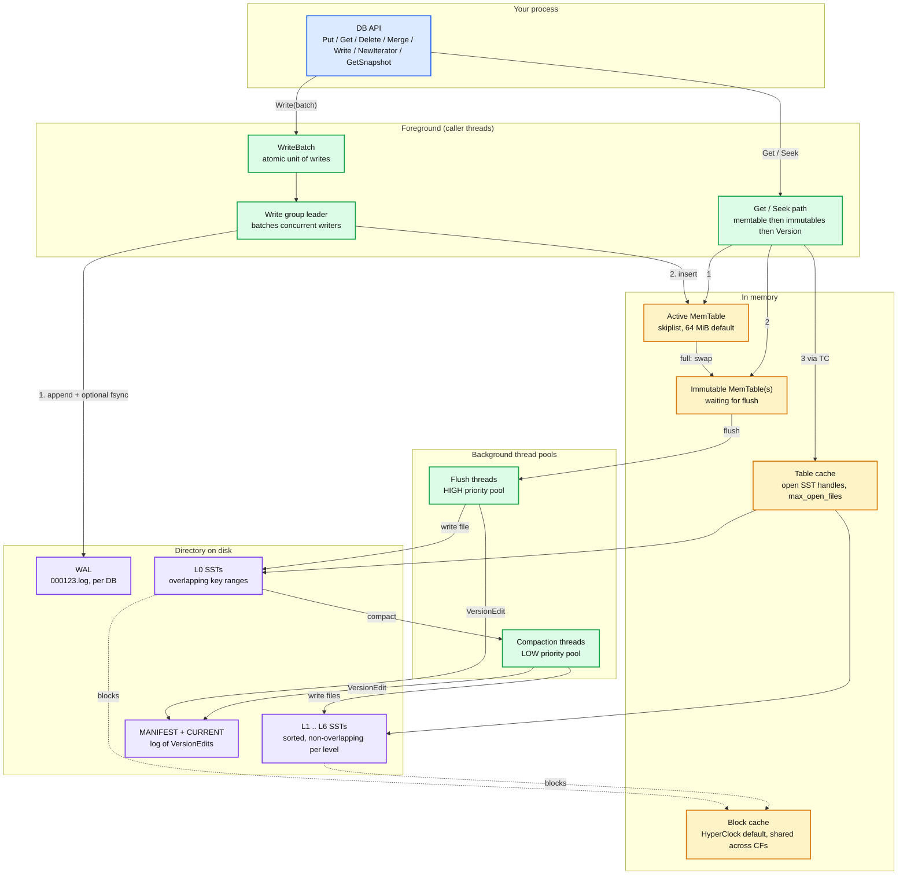
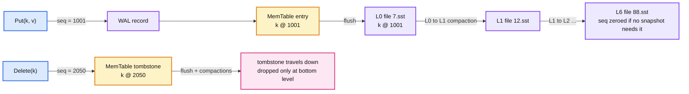

# RocksDB 00 — Overview and Reading Map

**Series baseline: RocksDB 11.x** (`main` at 11.10.0, 2026-08-28. Latest tagged release v11.8.1, 2026-08-07). Defaults are quoted from `include/rocksdb/options.h`, `include/rocksdb/advanced_options.h` and `include/rocksdb/table.h`. Claims from the project wiki or the FAST'21 paper are marked **[doc]**. Reasoned conclusions are marked **[inferred]**. Anything not checked against source is marked **[unverified]**.

> **This is a light-depth series.** RocksDB is a library, not a distributed system. The point is to know every feature and the shape of its implementation, not to memorise the source tree. Where the Kafka and Cassandra series go 1,000 lines per report, this one stays at 150 to 300.

---

<!-- nav:start -->
← · **[Index](README.md)** · [01 Write Path →](rocksdb-01-write-path.md)
<!-- nav:end -->

<!-- toc:start -->
<details>
<summary><b>Sections in this report (9)</b></summary>

- [1. Overview](#1-overview)
- [2. Architecture](#2-architecture)
- [3. Data flow in one diagram](#3-data-flow-in-one-diagram)
- [4. On-disk layout](#4-on-disk-layout)
- [5. The feature inventory](#5-the-feature-inventory)
- [6. The series](#6-the-series)
- [7. The four ideas that generalise](#7-the-four-ideas-that-generalise)
- [8. Staff-level questions across the whole system](#8-staff-level-questions-across-the-whole-system)
- [9. Sources](#9-sources)

</details>
<!-- toc:end -->

## 1. Overview

- **Problem solved.** RocksDB is an *embedded, persistent, ordered key-value store* built on a Log-Structured Merge tree (LSM). You link it into your process. It gives you `Put`, `Get`, `Delete`, `Merge`, ordered iteration, snapshots, atomic batches and optional transactions over byte-string keys and values. It does not give you a server, a wire protocol, replication or sharding.
- **Origin.** Forked from Google's LevelDB at Facebook in 2012, open-sourced 2013. The fork was driven by flash: LevelDB was tuned for spinning disks and a single writer thread. RocksDB's whole early history is "make the LSM saturate an SSD from many threads" **[doc]**.
- **Key design bet #1, writes are sequential and cheap.** A write is one append to a Write-Ahead Log (WAL) and one insert into an in-memory skiplist. No random disk IO on the write path, ever. The bill is paid later by background flush and compaction.
- **Key design bet #2, immutable files, merged in the background.** Sorted String Tables (SSTs) are written once and never modified. Deletes and overwrites are new records with a higher sequence number. Compaction merges files, drops shadowed records, and keeps read amplification bounded.
- **Key design bet #3, everything is a knob.** RocksDB exposes hundreds of options because Meta runs it under dozens of workloads (ZippyDB, MyRocks, stream processing state, ML feature stores). The default is leveled compaction tuned for a balanced read/write workload on flash. Almost every production user retunes it.
- **Key design bet #4, no policy above the storage engine.** No replication, no consensus, no schema, no query language. This is deliberate. It is why TiKV, CockroachDB (until 2020), YugabyteDB, MyRocks, Kafka Streams and Flink could each put a different distributed system on top of the same engine.
- **Scale it operates at.** One process, one directory. Meta runs it across its fleet as the engine under ZippyDB and MyRocks **[doc]**. Practical envelope per instance: hundreds of thousands of writes/s on NVMe, point reads in tens of microseconds on a block-cache hit, hundreds of microseconds to low milliseconds on a miss, and terabytes of data per instance.

**The one-sentence version:** *Every write is a WAL append plus a skiplist insert. A background thread flushes the skiplist to an immutable sorted file, other background threads merge those files down a pyramid of levels, and reads walk memory then the pyramid top-down, skipping files using bloom filters.*

---

## 2. Architecture



Reading the diagram:

- **Foreground vs background is the whole story.** Caller threads only touch the WAL and the memtable. Every disk read beyond the memtable goes through the table cache and the block cache. Every disk write beyond the WAL is done by a background pool.
- **The memtable and block cache are amber** because they are losable. The WAL and SSTs are purple because they are the durable truth.
- **MANIFEST is the metadata log.** It records which SST files exist at which level with which key range and sequence range. A `Version` is one point-in-time snapshot of that list. Flush and compaction each append a `VersionEdit`. Recovery replays MANIFEST to rebuild the current `Version`, then replays the WAL into a fresh memtable.
- **Nothing here is red.** In a single-process engine the bottleneck depends entirely on the workload. Report 05 names the three candidates: write stalls from compaction debt, block cache misses, and the single WAL writer.

---

## 3. Data flow in one diagram



- **Internal key = user key + 8 bytes.** The trailer packs a 56-bit sequence number and an 8-bit value type (`kTypeValue`, `kTypeDeletion`, `kTypeMerge`, `kTypeRangeDeletion`, and a few more). Sorting is by user key ascending, then sequence number *descending*, so the newest version of a key is found first.
- **A delete is a write.** The tombstone must reach the bottom level before it can be dropped, because a lower level could still hold an older value of the same key. This is where "why is my disk not shrinking after I deleted everything" comes from.
- **Sequence numbers are the consistency mechanism.** A snapshot is just a sequence number. A read at snapshot `s` ignores any entry with sequence `> s`. Compaction cannot drop an overwritten entry if a live snapshot sits between the old and new sequence numbers.

---

## 4. On-disk layout

```
mydb/
  CURRENT              -> "MANIFEST-000042"
  MANIFEST-000042      log of VersionEdits: add file, delete file, log number, next file number
  OPTIONS-000045       the options the DB was last opened with, for reproducibility
  000123.log           active WAL
  000119.log           older WAL, kept until every CF has flushed its data from it
  000101.sst           SST file, level recorded in MANIFEST not in the name
  000102.sst
  LOG                  human-readable info log, rotated
  LOCK                 flock, one process at a time
```

- **File numbers are a single monotonic counter** across `.log`, `.sst` and `MANIFEST`. That is why a WAL and an SST never share a number.
- **The level of an SST is not in the filename.** It lives in MANIFEST. Moving a file between levels (a *trivial move*, when there is no overlap) is a metadata-only `VersionEdit`.
- **`OPTIONS` file** is the reason a RocksDB directory can be reopened by a different binary with the same behaviour, and the reason `ldb` can inspect it.

---

## 5. The feature inventory

The full list, so nothing is missed. Each row points at the report that explains it.

| Feature | One line | Report |
|---|---|---|
| `Put` / `Get` / `Delete` / `SingleDelete` | Point operations on byte keys | 01, 02 |
| `WriteBatch` | Atomic multi-key, multi-CF write | 01 |
| WAL, `sync`, `disableWAL`, manual WAL flush | Durability dial per write | 01 |
| MemTable representations | Skiplist default, vector, hash-skiplist, hash-linklist | 01 |
| `WriteBufferManager` | Global memtable memory cap across DBs and CFs | 01, 05 |
| Write stalls | Backpressure when flush or compaction falls behind | 01, 05 |
| Iterators, `Seek`, `SeekForPrev`, prefix seek | Ordered scans, forward and backward | 02 |
| Snapshots | Read at a fixed sequence number | 02 |
| `MultiGet`, async IO | Batched point reads with IO overlap | 02 |
| Block-based SST, index and filter blocks, partitioned index | The file format | 02 |
| Bloom and Ribbon filters, prefix bloom | Skip files that cannot contain the key | 02 |
| Block cache, LRU and HyperClock, row cache | The read-side memory | 02, 05 |
| Compression per level, dictionary compression | Space vs CPU | 02, 03 |
| Leveled, universal, FIFO compaction | The three amplifications | 03 |
| Subcompactions, `max_background_jobs`, rate limiter | Compaction parallelism and throttling | 03 |
| Compaction filter | Drop or rewrite records during compaction | 03 |
| Periodic compaction, TTL | Age-driven rewrites | 03, 04 |
| Column families | Multiple keyspaces, one WAL | 04 |
| Transactions, pessimistic and optimistic, 2PC | Isolation above the engine | 04 |
| Merge operator | Read-modify-write without the read | 04 |
| `DeleteRange` | One tombstone for a key range | 04 |
| `SstFileWriter` + `IngestExternalFile` | Bulk load, skip WAL and memtable | 04 |
| Checkpoint, `BackupEngine` | Consistent copies via hard links | 04 |
| BlobDB (integrated) | Key-value separation for large values | 04 |
| User-defined timestamps | Application time as part of the key order | 04 |
| Secondary and read-only instances | Follow a primary's files from another process | 04 |
| Remote compaction (`CompactionService`) | Run compaction on another host | 04 |
| Tiered storage | Route cold levels to slower media | 04 |
| Statistics, perf context, `LOG`, `ldb`, `sst_dump` | Observability | 05 |

---

## 6. The series

| Report | What it is for |
|---|---|
| [01 Write Path](rocksdb-01-write-path.md) | How a `Put` becomes durable, the write group, WAL format, flush, stalls |
| [02 Read Path and SST](rocksdb-02-read-path-and-sst.md) | How a `Get` finds one version among many files, and the file format that makes it fast |
| [03 Compaction](rocksdb-03-compaction.md) | The engine's real design space: which files to merge, when, and what it costs |
| [04 Features](rocksdb-04-features.md) | Every feature above the core LSM, with a diagram of how each is layered on |
| [05 Operations and Trade-offs](rocksdb-05-operations-and-tradeoffs.md) | Memory budget, tuning recipes, failure modes, who embeds it, and staff questions |

Suggested order: 00, 01, 02, 03, then 04 as a menu, then 05 before an interview.

---

## 7. The four ideas that generalise

1. **Convert random writes into sequential writes, pay later with a merge.** Every LSM store, Cassandra, HBase, TiKV, Kafka's compacted topics in spirit, is this idea. The question a Staff interviewer asks is "what is your write amplification and where does it come from".
2. **Immutable files make concurrency and recovery trivial.** No in-place update means readers never lock, backups are hard links, and a crash can only lose the tail of the WAL.
3. **Sequence numbers are MVCC.** One monotonic counter gives snapshots, consistent iterators, transaction validation and safe compaction. Cassandra uses timestamps for the same job and pays for it with clock-skew bugs.
4. **A metadata log, not a metadata file.** MANIFEST is a log of edits, replayed at open. Kafka's KRaft metadata log and Kubernetes' etcd watch stream are the same shape at cluster scale.

---

## 8. Staff-level questions across the whole system

1. **"Why would I embed RocksDB instead of running a database?"** Because the caller already owns replication, partitioning and the network (a stream processor, a distributed SQL node, a service with local state). Adding a database server adds a hop, a process and a failure domain for no gain. The cost is that the caller now owns backup, tuning and memory accounting.

2. **"What breaks first under a sustained write burst?"** Compaction debt. L0 file count climbs past `level0_slowdown_writes_trigger` (20), writes are delayed to `delayed_write_rate`, then past `level0_stop_writes_trigger` (36) they block. The fix is never "raise the trigger". It is more compaction threads, a bigger L1, universal compaction, or admitting the disk is too slow.

3. **"You have 100 column families. What is the hidden cost?"** Each has its own memtable, so the memory budget is 100x unless a `WriteBufferManager` caps the sum. And the WAL is shared, so the least-frequently-written CF pins the oldest WAL and forces flushes of tiny memtables via `max_total_wal_size`.

4. **"A key was deleted a week ago. Why is it still on disk?"** The tombstone has not reached the bottom level, or a snapshot is holding it. Check `rocksdb.num-snapshots`, then look at the level distribution. Periodic compaction (default 30 days on leveled when a filter is set) is the safety net.

5. **"Leveled or universal for a write-heavy time-series workload?"** Universal, or FIFO if the data has a hard TTL and reads are recent-only. Leveled's 10x-per-level write amplification is paid for read latency this workload does not need. State the space cost: universal can temporarily hold ~2x live data during a full merge.

---

## 9. Sources

- [`facebook/rocksdb`](https://github.com/facebook/rocksdb) source, `include/rocksdb/options.h`, `advanced_options.h`, `table.h`, `db/db_impl/`, `db/version_set.cc`
- [RocksDB wiki](https://github.com/facebook/rocksdb/wiki), pages: *RocksDB Overview*, *Leveled Compaction*, *Universal Compaction*, *Write Stalls*, *Block Cache*, *MemTable*, *Write Ahead Log*
- Dong, Kryczka, Jin, Stumm. *Evolution of Development Priorities in Key-value Stores Serving Large-scale Applications: The RocksDB Experience.* FAST 2021
- O'Neil et al. *The Log-Structured Merge-Tree.* Acta Informatica 1996
- Chang et al. *Bigtable.* OSDI 2006 (the SSTable and memtable model that LevelDB copied)

---

<!-- nav:start -->
← · **[Index](README.md)** · [01 Write Path →](rocksdb-01-write-path.md)
<!-- nav:end -->
