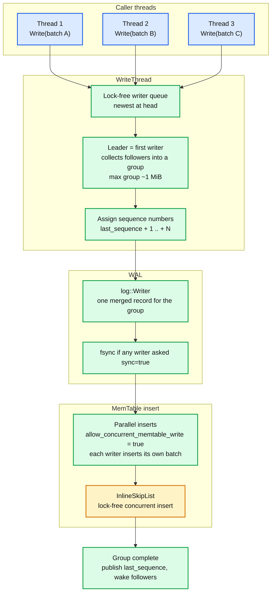
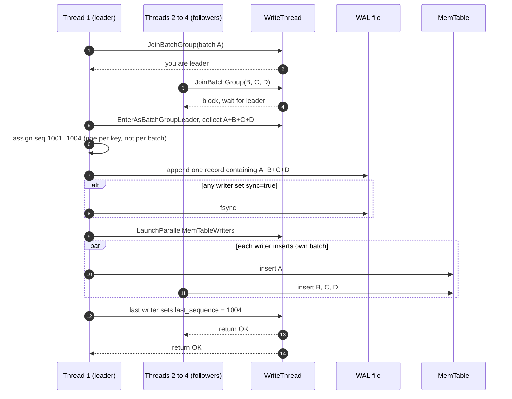
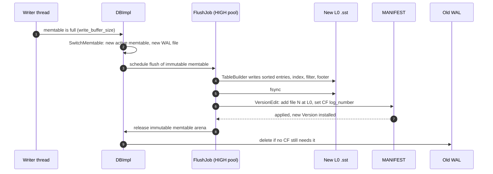
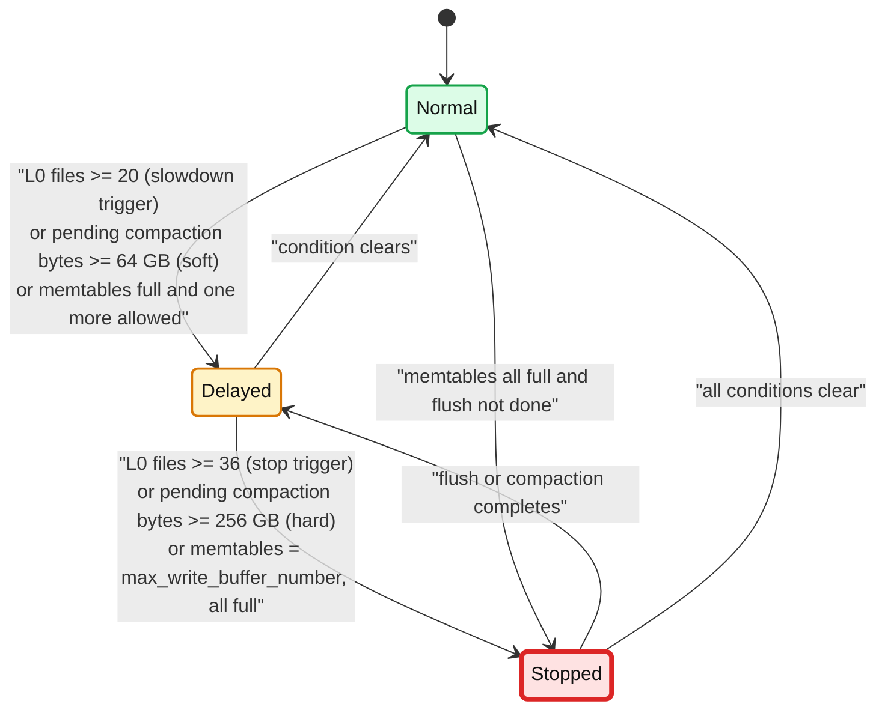

# RocksDB 01 — Write Path: WriteBatch, Write Groups, WAL, MemTable, Flush

**Baseline: RocksDB 11.x (main at 11.10.0).** Defaults from `include/rocksdb/options.h` and `advanced_options.h`. Implementation lives in `db/db_impl/db_impl_write.cc`, `db/write_thread.cc`, `db/log_writer.cc`, `db/memtable.cc`, `db/flush_job.cc`.

---

<!-- nav:start -->
[← 00 Overview](rocksdb-00-overview.md) · **[Index](README.md)** · [02 Read Path and SST →](rocksdb-02-read-path-and-sst.md)
<!-- nav:end -->

<!-- toc:start -->

<b>Sections in this report (10)</b>

- [1. Overview](#1-overview)
- [2. Architecture](#2-architecture)
- [3. Sequence: one Put from four threads](#3-sequence-one-put-from-four-threads)
- [4. The WAL](#4-the-wal)
- [5. The MemTable](#5-the-memtable)
- [6. Flush](#6-flush)
- [7. Write stalls: the backpressure state machine](#7-write-stalls-the-backpressure-state-machine)
- [8. Guarantees and failure modes](#8-guarantees-and-failure-modes)
- [9. Trade-offs](#9-trade-offs)
- [10. Staff-level questions](#10-staff-level-questions)

<!-- toc:end -->

## 1. Overview

- **What it is.** The path from `DB::Write(WriteOptions, WriteBatch*)` to "this data will survive a crash". Every public write call (`Put`, `Delete`, `Merge`, `DeleteRange`) is sugar over a one-entry `WriteBatch`.
- **Design bet.** Two sequential operations per write: append to the WAL, insert into the memtable. No disk read, no index update, no lock on user data. Concurrency comes from *batching writers together* (the write group), not from fine-grained locking.
- **The unit of atomicity is the `WriteBatch`.** All entries in a batch get consecutive sequence numbers and land in one WAL record. Either the whole record is recovered or none of it. This holds across column families.
- **Durability is a per-write dial.** `WriteOptions::sync = false` (default) means the WAL is written to the OS page cache and not fsynced. Process crash: safe. Power loss: you lose the unsynced tail. `sync = true` fsyncs per write group.

---

## 2. Architecture

- **Write group.** The first writer to arrive becomes leader. While it is working, later writers link themselves onto the queue and block. When the leader finishes its WAL append it takes everything that queued behind it as one group. This is how a single WAL writer serves many threads: the cost of one append plus one fsync is amortised over the group.
- **Three write modes**, chosen by options:
  - *Default* (`allow_concurrent_memtable_write = true`): leader writes the WAL for the whole group, then every writer inserts its own batch into the skiplist in parallel.
  - *Pipelined* (`enable_pipelined_write = true`): WAL writers and memtable writers are two separate queues, so the next group's WAL append overlaps with this group's memtable inserts.
  - *Unordered* (`unordered_write = true`): writes become visible out of sequence order. Only safe with `TransactionDB` using `WritePrepared`, which fixes visibility itself.
- **`two_write_queues`**: a second queue for WAL-only writes, used by `WritePrepared` transactions so commit markers do not wait behind data writes.

---

## 3. Sequence: one Put from four threads

- **Visibility.** `last_sequence` is published only after every memtable insert in the group completes. A reader that takes a snapshot in between sees nothing from this group. Writes are therefore *atomic per batch and ordered per group*.
- **Group size** is bounded (roughly 1 MiB of batch bytes) so a burst does not build one enormous group and starve latency.

---

## 4. The WAL

- **One WAL per DB, shared by all column families.** A new WAL file is created whenever any CF's memtable is switched. Old WAL files are deleted only when every CF has flushed all data that was logged in them. That is tracked per CF as `log_number` in MANIFEST.
- **Record format** (inherited from LevelDB): the file is a sequence of 32 KiB blocks. A record is `checksum (4) | length (2) | type (1) | payload`, where `type` is FULL, FIRST, MIDDLE or LAST so a payload can span blocks. Recovery reads records until a checksum fails or the file ends, then stops. `WALRecoveryMode` controls how strict that is (default `kPointInTimeRecovery`).
- **Durability options, in order of cost:**

| Option | Effect | Loses on |
|---|---|---|
| `disableWAL = true` | no WAL append at all | process crash loses unflushed memtable |
| `sync = false` (default) | append to page cache | power loss or kernel panic loses unsynced tail |
| `manual_wal_flush = true` + `FlushWAL(sync)` | caller controls when to write and sync | whatever the caller has not flushed |
| `sync = true` | fsync per write group | nothing, within the group's ack |

- **`max_total_wal_size`** (default 0, meaning 4x the sum of `write_buffer_size * max_write_buffer_number` across CFs). When total WAL bytes exceed it, the CF holding the oldest data is force-flushed so the old WAL can be deleted. This is the guard against a rarely-written CF pinning WALs forever.
- **`WAL_ttl_seconds` / `WAL_size_limit_MB`** keep archived WALs around for replication tail-readers (`GetUpdatesSince`).
- **No WAL compaction, no WAL index.** The WAL is only ever read in full during recovery. Its size is bounded by flush frequency, not by anything smart.

---

## 5. The MemTable

- **Default representation: `InlineSkipList`.** Concurrent lock-free inserts, ordered iteration, O(log n) lookup. Keys and values are copied into an arena owned by the memtable; nothing is freed until the whole memtable is dropped after flush.
- **Alternatives** via `memtable_factory`:
  - `VectorRepFactory`: append-only vector, sorted on flush. Fastest for bulk load, unusable for reads.
  - `HashSkipListRepFactory` and `HashLinkListRepFactory`: bucket by prefix, skiplist or linked list per bucket. Fast prefix lookup, no total order, so no cross-prefix iteration. Require `prefix_extractor`.
- **Sizing:** `write_buffer_size = 64 MiB` per CF. `max_write_buffer_number = 2`: one active plus one being flushed. If both are full and the flush has not finished, writes stop. Raising it to 3 or 4 absorbs flush latency spikes at the cost of memory.
- **`WriteBufferManager`**: an optional global budget across all CFs and DBs in the process. When the sum of memtable bytes crosses the limit it triggers a flush of the largest memtable, and can optionally *charge* memtable memory to the block cache so one number governs both.
- **Memtable bloom filter** (`memtable_prefix_bloom_size_ratio`): a bloom over the memtable's keys or prefixes, so a `Get` for a key that is not in the memtable skips the skiplist walk. Cheap and worth turning on.
- **Immutable memtables are still readable.** Reads check the active memtable, then each immutable one newest-first, then the SST files. `min_write_buffer_number_to_merge` (default 1) lets several immutables be merged into one L0 file, which reduces L0 file count at the cost of memory.

---

## 6. Flush

- **Flush is a single-pass write of a sorted structure**, so it is fast: read the skiplist in order, build blocks, write the file. No merge with existing files. That is why L0 files overlap each other.
- **Two thread pools.** Flushes go to the HIGH priority pool, compactions to LOW. `max_background_jobs = 2` sizes both together (RocksDB splits it, favouring flushes). A stalled flush is worse than a stalled compaction because it blocks writes directly, hence the priority.
- **`atomic_flush`** (default false): flush all CFs together so their L0 files represent one consistent point. Needed if the application requires cross-CF consistency after a crash *without* the WAL (for example with `disableWAL`).

---

## 7. Write stalls: the backpressure state machine

- **Delayed** means every write sleeps so that throughput is capped at `delayed_write_rate` (default 16 MiB/s), which RocksDB then ratchets down if the condition persists.
- **Stopped** means `Write()` blocks until a flush or compaction clears the condition. This is the state that shows up as a latency cliff in the caller's p99.
- **The three triggers map to three debts:** memtable debt (flush is slow), L0 debt (L0 to L1 compaction is slow), and total compaction debt (`estimated pending compaction bytes`, every level is behind).
- Stall events are logged in `LOG` and counted in `rocksdb.stall.micros`. This is the first metric to alert on for any RocksDB-backed service.

---

## 8. Guarantees and failure modes

| Guarantee | Holds when | Breaks when |
|---|---|---|
| Batch atomicity | always | never (single WAL record) |
| Ordering across batches | always for a single writer, per group otherwise | `unordered_write` |
| Durability of acked writes | `sync = true` | `sync = false` and power loss |
| Cross-CF consistency after crash | WAL enabled | `disableWAL` without `atomic_flush` |

Failure modes worth naming:

- **WAL corruption in the middle.** `kPointInTimeRecovery` stops at the first bad record and opens with everything before it. `kAbsoluteConsistency` refuses to open. `kSkipAnyCorruptedRecords` skips and continues, which can silently lose a batch.
- **Disk full during flush.** The flush fails, the immutable memtable stays, writes stop when the second memtable fills. RocksDB enters a background error state (`GetBGError`) and needs `Resume()` after space is freed.
- **Flush slower than ingest.** The classic. Symptoms: `Stopped` stalls, memory growth if `max_write_buffer_number` was raised. Root cause is almost always compaction debt starving flush IO, not flush itself.

---

## 9. Trade-offs

| Decision | Chosen | Alternative | Why |
|---|---|---|---|
| Group commit via leader | one WAL append per group | per-writer append with a lock | amortises fsync, keeps one sequential writer |
| Skiplist memtable | lock-free concurrent insert | B-tree or ART | simplest structure that supports ordered iteration and concurrent insert |
| Shared WAL across CFs | one file, one fsync | WAL per CF | cross-CF atomic batches, fewer fsyncs. Cost: WAL pinning by cold CFs |
| Default `sync = false` | throughput | `sync = true` | the embedding system usually replicates, so a single-node power loss is not the durability boundary |
| Stall instead of unbounded memory | bounded RSS | grow memtables | predictable memory beats occasional latency cliffs for a library |

---

## 10. Staff-level questions

1. **Your p99 write latency is 200 ms with spikes to 2 s, but average is 50 µs. What is it?** Write stalls. Check `rocksdb.stall.micros` and `LOG` for "Stalling writes" or "Stopping writes". Then find which trigger: L0 count, pending compaction bytes, or memtable count. Each points at a different fix (more compaction threads, bigger L1 or universal compaction, more memtables or faster flush).

2. **When is `disableWAL` acceptable?** When the data is reconstructible from elsewhere and the caller can tolerate losing everything since the last flush. Kafka Streams and Flink state stores do this because the changelog topic or the checkpoint is the durable copy. It roughly doubles write throughput on fsync-bound hardware.

3. **Why does a cold column family cause forced flushes of a hot one?** It does not. It is the reverse. The cold CF's tiny memtable holds data logged in an old WAL. That WAL cannot be deleted until the cold CF flushes. When total WAL bytes exceed `max_total_wal_size`, RocksDB force-flushes the CF with the *oldest* data, which is the cold one, producing a tiny L0 file. Many tiny L0 files then hurt reads. Fix: lower the cold CF's `write_buffer_size`, or accept it.

4. **Why is the write group leader not a bottleneck?** It is, for WAL bytes. A single thread does every WAL append, and that append is sequential IO. Pipelined write lets the next group's append overlap with memtable inserts. Past that, the only fix is fewer WAL bytes: smaller values, BlobDB, or `disableWAL`.

5. **What is the recovery time after a crash, and what determines it?** Replay MANIFEST (fast, metadata only) plus replay every live WAL into memtables (bounded by `max_total_wal_size`, so a few hundred MiB to a few GiB). Recovery does not rebuild SSTs or re-run compaction. If recovery is slow, the WALs are too big, meaning flushes were too infrequent.

---

<!-- nav:start -->
[← 00 Overview](rocksdb-00-overview.md) · **[Index](README.md)** · [02 Read Path and SST →](rocksdb-02-read-path-and-sst.md)
<!-- nav:end -->
