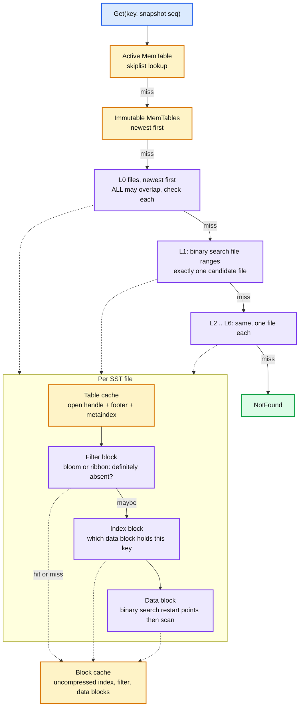
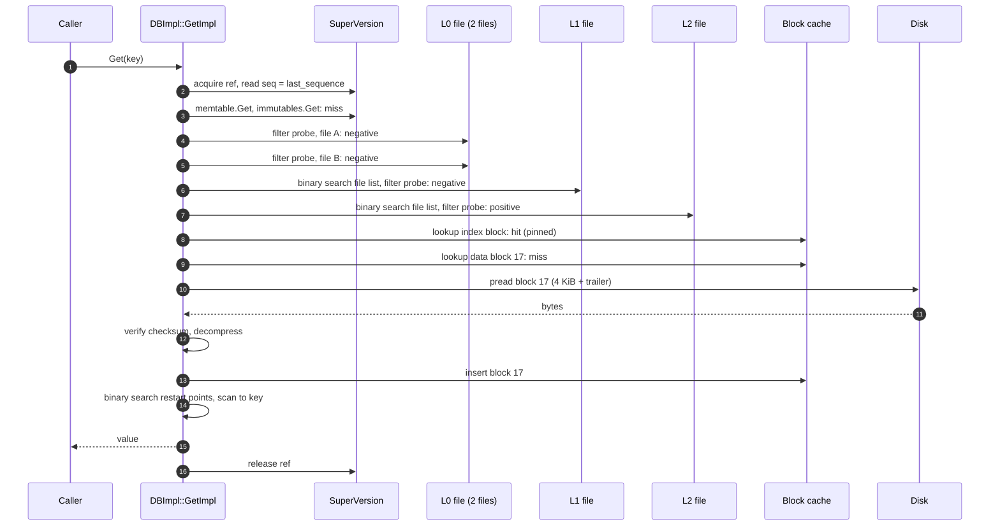

# RocksDB 02 — Read Path and the SST File Format

**Baseline: RocksDB 11.x (main at 11.10.0).** Defaults from `include/rocksdb/table.h` (`BlockBasedTableOptions`) and `options.h`. Implementation in `db/db_impl/db_impl.cc` (`GetImpl`), `db/version_set.cc` (`Version::Get`), `table/block_based/`.

---

<!-- nav:start -->
[← 01 Write Path](rocksdb-01-write-path.md) · **[Index](README.md)** · [03 Compaction →](rocksdb-03-compaction.md)
<!-- nav:end -->

<!-- toc:start -->
<details>
<summary><b>Sections in this report (10)</b></summary>

- [1. Overview](#1-overview)
- [2. Architecture: where a Get looks](#2-architecture-where-a-get-looks)
- [3. Sequence: a point lookup that misses the cache](#3-sequence-a-point-lookup-that-misses-the-cache)
- [4. The SST file format](#4-the-sst-file-format)
- [5. Filters](#5-filters)
- [6. Caches](#6-caches)
- [7. Iterators, snapshots and MultiGet](#7-iterators-snapshots-and-multiget)
- [8. Read amplification, by the numbers](#8-read-amplification-by-the-numbers)
- [9. Trade-offs](#9-trade-offs)
- [10. Staff-level questions](#10-staff-level-questions)

</details>
<!-- toc:end -->

## 1. Overview

- **What it is.** How `Get(key)` finds the newest version of a key that is at or below the read's sequence number, when that key may live in the memtable, several immutable memtables, several overlapping L0 files, and one file per level below.
- **Design bet.** Check the sources newest-first and stop at the first hit. Since sequence numbers only grow as you move from memtable to L0 to L6, the first version found is the newest. Every source that cannot contain the key is skipped by a bloom filter before any disk IO.
- **The file format is block-oriented.** A 4 KiB data block is the unit of IO, compression and caching. Index and filter blocks tell you which data block to read. The block cache holds *uncompressed* blocks so a hit costs no CPU.
- **Reads never block writes and writes never block reads.** The read takes a reference to the current `Version` (the list of live SSTs) and a `SuperVersion` (Version plus memtables). Compaction installs a new Version but the old one stays alive until the last reader drops it. Files are only deleted when no Version references them.

---

## 2. Architecture: where a Get looks



- **L0 is the expensive level.** Its files came straight from flush, so their key ranges overlap and every one must be checked. A `Get` on a DB with 20 L0 files does up to 20 filter probes before reaching L1. This is why `level0_file_num_compaction_trigger = 4` is low and why L0 growth is a stall trigger.
- **L1 and below cost one file each.** Files within a level are sorted and disjoint, so a binary search over the file list picks the single candidate. With `num_levels = 7` a worst-case miss touches L0 count plus 6 files.
- **Tombstones and merges change the walk.** A `kTypeDeletion` hit means "NotFound, stop". A `kTypeMerge` hit means "collect the operand and keep walking down until a base value or a tombstone", then apply the merge operator. Long merge chains are a read-latency trap; see report 04.

---

## 3. Sequence: a point lookup that misses the cache



- Three filter probes and one disk read for a key that lives in L2. Without filters it would be four disk reads (one per candidate file) plus index lookups.
- If `cache_index_and_filter_blocks = false` (default), index and filter blocks live in the table cache's per-file reader and are never evicted. That is simplest but unbounded memory for large DBs. Setting it to `true` puts them in the block cache with high priority and `pin_l0_filter_and_index_blocks_in_cache` keeps L0's resident.

---

## 4. The SST file format

```
<beginning of file>
[data block 1]        sorted entries, prefix-compressed, restart point every 16 keys
[data block 2]
...
[data block N]        each block: payload | compression type (1) | checksum (4)
[meta block: filter]  bloom or ribbon bits for every key in the file
[meta block: properties]  num entries, raw sizes, creation time, largest seqno, user props
[meta block: range deletion]  DeleteRange tombstones, if any
[meta block: compression dictionary]  optional
[metaindex block]     name -> BlockHandle for each meta block
[index block]         last key of each data block -> BlockHandle (offset, size)
[footer]              metaindex handle | index handle | format_version | magic (fixed 53 bytes)
<end of file>
```

- **Data block.** Keys are prefix-compressed against the previous key (`shared_len | unshared_len | value_len | unshared bytes | value`). Every 16th key (`block_restart_interval`) is stored in full as a *restart point*, and the block ends with an array of restart offsets. Lookup binary-searches the restart points, then scans forward at most 16 keys.
- **Index block.** One entry per data block, keyed by a *separator* that is >= the last key of that block and < the first key of the next. RocksDB shortens separators (`ShortestSeparator`) so the index is small. For files with many blocks, `kTwoLevelIndexSearch` (partitioned index) splits it into a top-level index over index partitions, so only the needed partition is loaded.
- **Data block hash index** (`data_block_index_type = kDataBlockBinaryAndHash`): adds a small hash table inside each data block for point lookups, trading ~1 byte per key of space for skipping the binary search.
- **Compression** is per block. `compression` default is Snappy when available. `bottommost_compression` lets the largest level use something slower and tighter (ZSTD). A compression dictionary (`max_dict_bytes`) trained on samples of the file improves ratio for small blocks.
- **Checksums** per block (CRC32c default, xxHash options) and a whole-file checksum in properties. Corruption is detected at read, not at write.
- **`format_version`** gates on-disk features (index key encoding, checksum coverage, footer layout, custom compression managers). Default is 7 since 10.11.0 (readable by >= 10.4.0). A newer RocksDB can read older formats. An older RocksDB cannot read newer ones, which is a real constraint during rolling upgrades of the embedding system.

---

## 5. Filters

- **Full bloom filter** (default when `filter_policy` is set): one bloom over all keys in the file, built at flush or compaction time, stored as one meta block. `NewBloomFilterPolicy(9.9)` gives ~1% false positive rate. The header recommends 9.9 bits per key, and 10 is the number everyone quotes. Filter lookups are `Get`-only unless `whole_key_filtering` is used with prefix seeks.
- **Ribbon filter** (`NewRibbonFilterPolicy`): same false-positive rate at ~30% less space, costing more CPU to build. The wiki's advice is bloom for the top levels (built often, short lived), ribbon for the bottom levels (built rarely, long lived) via `NewRibbonFilterPolicy(bloom_equivalent_bits, bloom_before_level)`.
- **Partitioned filter** (`partition_filters = true`): the filter is split into partitions indexed like the data blocks, so a multi-GB file does not need a multi-MB filter resident to probe one key.
- **Prefix bloom.** With a `prefix_extractor` (for example fixed 8 bytes), the filter is built over prefixes instead of whole keys. `Seek(prefix...)` can then skip files that have no key with that prefix. This is the mechanism that makes "scan all items for user X" cheap in a store that has no secondary indexes.
- **Memtable filter** (`memtable_prefix_bloom_size_ratio`) does the same job for the skiplist.

Filters are the single largest read-latency lever after the block cache. A DB without a filter policy does one index lookup plus one data-block read per candidate file. Set one.

---

## 6. Caches

| Cache | Holds | Sized by | Default |
|---|---|---|---|
| Block cache | uncompressed data, index, filter blocks | `BlockBasedTableOptions::block_cache` | 32 MiB HyperClockCache if unset (LRU before 10.7.0), meant to be replaced |
| Compressed block cache | compressed blocks, between block cache and OS page cache | `block_cache_compressed`, removed in 8.0.0 in favour of `SecondaryCache` | gone |
| Table cache | open file handles, footer, metaindex, optionally index and filter | `max_open_files` | -1, unlimited |
| Row cache | whole key-value pairs after a `Get` | `row_cache` | none |
| OS page cache | raw file bytes | kernel | on, unless `use_direct_reads` |

- **LRUCache** is sharded (`num_shard_bits`) to reduce mutex contention, with a high-priority pool for index and filter blocks. **HyperClockCache** is the lock-free replacement, production-ready and the default since 10.7.0, with much better throughput under many reader threads. The wiki now recommends it over LRU for everything.
- **Secondary cache** (`SecondaryCache`): a tier below the block cache, holding compressed or evicted blocks in local flash or a remote store. The NVM tier in Meta's CacheLib is the reference implementation.
- **Charging.** `CacheEntryRoleOptions` let memtables, filter construction memory, block-based table readers and compression dictionary building all be *charged* to the block cache, so one number bounds most of RocksDB's memory. Report 05 has the budget.
- **Direct IO** (`use_direct_reads`, `use_direct_io_for_flush_and_compaction`) bypasses the page cache so the block cache is the only cache. Removes double caching, makes memory accounting exact, and forces you to size the block cache correctly.

---

## 7. Iterators, snapshots and MultiGet

- **Iterator = a heap of iterators.** `NewIterator` builds a `MergingIterator` over one iterator per memtable, per L0 file, and one `LevelIterator` per level below (which opens files lazily). `Seek` seeks every child and pops the min. `Next` advances the child at the heap top. Above that, `DBIter` hides internal keys: it skips older versions, tombstones, and resolves merge chains, so the caller sees one entry per live user key.
- **Snapshot = a sequence number.** `GetSnapshot()` records `last_sequence` and registers it in a list. Reads at that snapshot skip every entry with a higher sequence. Compaction consults the snapshot list and keeps the newest version of a key *at or below each live snapshot*, plus the newest overall. A long-lived snapshot therefore pins space. `ReadOptions::snapshot` on an iterator gives repeatable reads; an iterator with no snapshot implicitly takes one at creation, so it is always consistent.
- **Prefix seek** (`ReadOptions::prefix_same_as_start`, `total_order_seek`): with a `prefix_extractor`, `Seek` uses the prefix bloom and iteration is only guaranteed within the prefix. Cheaper, and the usual way to model "rows of a table" on a KV store.
- **Iterator bounds** (`iterate_upper_bound`, `iterate_lower_bound`): tell the iterator where to stop so it does not read one block past the range and, more importantly, so it can skip whole files.
- **`SeekForPrev` and `Prev`** exist and work, but backward iteration is slower: prefix compression within a block only works forward, so `Prev` re-scans from the last restart point.
- **`MultiGet`**: batches point reads, sorts keys, groups them by file, probes the filter for all keys in a file at once, and issues the data block reads together. With `ReadOptions::async_io = true` on Linux, reads to different files are issued via io_uring (`FSReadRequest`) and overlapped. Typically 2 to 4x the throughput of a loop of `Get` calls on a cache-cold workload **[doc]**.
- **Tailing iterator** (`ReadOptions::tailing`): an iterator that sees new writes without being recreated, used by log-following consumers.

---

## 8. Read amplification, by the numbers

Point lookup, worst case, leveled compaction, 7 levels, `L0` at its trigger of 4 files:

| Source | Filter probes | Index lookups | Data block reads |
|---|---|---|---|
| Memtable + immutables | 0 to 2 (memtable bloom) | 0 | 0 |
| L0 (4 files) | 4 | 0 to 4 | 0 to 4 |
| L1 to L6 (one file each) | 6 | 0 to 6 | 0 to 6 |
| **Total for a miss with filters** | **10** | **~0.1** | **~0.1** |
| **Total for a miss without filters** | 0 | 10 | 10 |

With a 1% false positive rate per filter, a miss costs about 10 in-memory probes and 0.1 disk reads on average. A hit costs the probes up to the level where the key lives plus one data block read. This is why bloom filters are non-negotiable and why L0 count matters more than any other level.

Range scans have no filter help. A scan over N levels reads at least one block per level and the merging heap costs O(log N) per `Next`. Keeping L0 small and using prefix bloom for bounded scans are the only levers.

---

## 9. Trade-offs

| Decision | Chosen | Alternative | Why |
|---|---|---|---|
| Block cache holds uncompressed blocks | zero CPU on hit | cache compressed blocks, more of them | latency over hit rate. A secondary cache can add the compressed tier |
| Filters per file, not global | rebuilt on every compaction | one global filter | a global filter cannot handle deletes and would be rebuilt constantly |
| Prefix compression + restart points | small blocks, forward-fast | no compression | key space is repetitive in practice, 16-key scan is cheap |
| Index by separator not by first key | smaller index | full keys | separators are often 1 to 2 bytes |
| One file per level below L0 | O(levels) read amp | size-tiered (Cassandra STCS) | predictable read cost. Compaction pays for it, see 03 |

---

## 10. Staff-level questions

1. **Block cache hit rate is 99% but p99 read latency is 5 ms. Why?** The 1% misses are the tail, and each miss may be several IOs: index partition, filter partition, then data block, on a disk with queueing. Check `rocksdb.block.cache.index.miss` and `filter.miss` separately; if they are non-zero, index and filter blocks are being evicted, so pin them or raise their priority. Then check L0 count: a miss touches every L0 file.

2. **Why not just `mmap` the SST files and let the kernel cache them?** RocksDB supports `allow_mmap_reads` but it is not the default. The block cache holds *uncompressed* blocks, the page cache holds compressed bytes, so mmap alone means decompressing on every access. It also makes memory accounting invisible to the process and defeats direct IO. The kernel's LRU also does not know that a filter block is worth 100x a data block.

3. **A user reports that `Delete` followed by `Get` returns NotFound but an iterator still shows the key. What happened?** Almost certainly the iterator was created before the delete. An iterator holds an implicit snapshot at creation time. It is the documented behaviour, not a bug. The follow-up: why do iterators pin snapshots? Because a `MergingIterator` cannot be repositioned consistently if files underneath it change.

4. **Prefix bloom or whole-key bloom for a table keyed `user_id:item_id`?** Both, if reads are both `Get(user:item)` and `Seek(user:)`. Set `prefix_extractor` to the `user_id` length, keep `whole_key_filtering = true`. The filter then contains both prefix hashes and whole-key hashes at roughly double the bits. If memory is tight, prefix-only, because a prefix miss still eliminates the file for both operations.

5. **What does `format_version` mean for a rolling downgrade?** A newer RocksDB writes files an older one cannot open. During an upgrade of the embedding system, pin `format_version` to the old value until every node runs the new binary, then raise it. The same applies to enabling ribbon filters or a new compression type. Cassandra has the same problem with SSTable versions and solves it with `nodetool upgradesstables`; RocksDB has no equivalent tool, compaction eventually rewrites everything.

---

<!-- nav:start -->
[← 01 Write Path](rocksdb-01-write-path.md) · **[Index](README.md)** · [03 Compaction →](rocksdb-03-compaction.md)
<!-- nav:end -->
