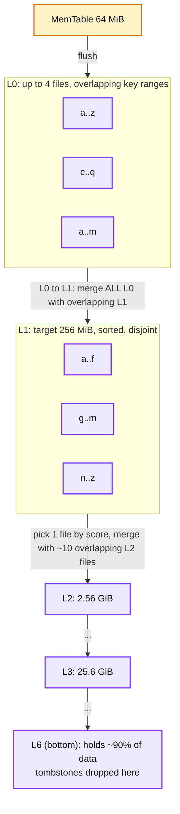
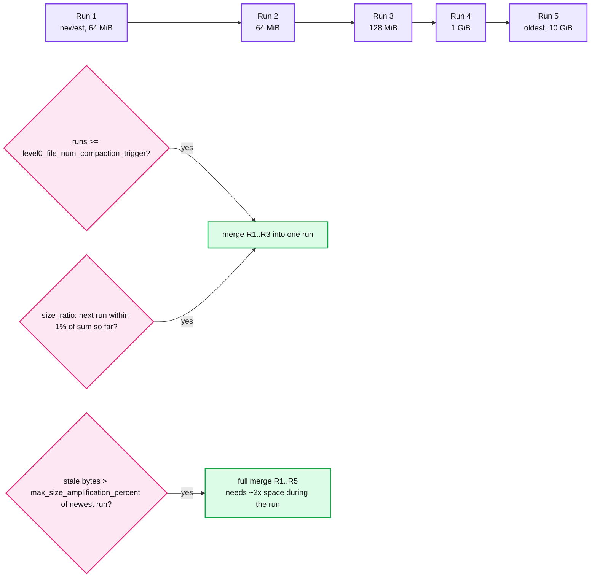
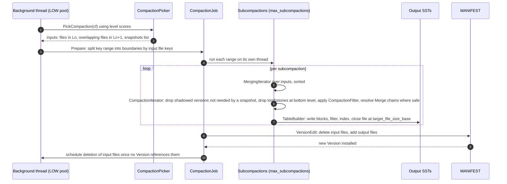
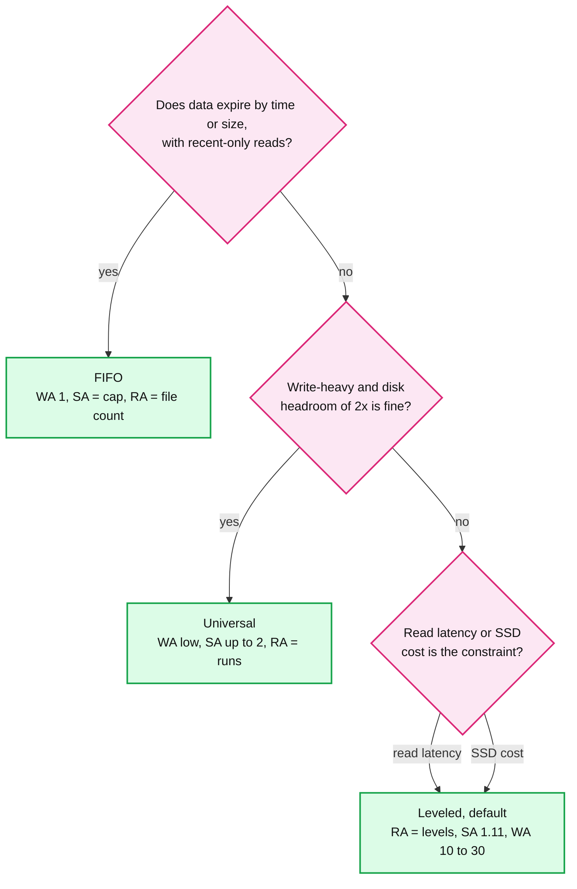

# RocksDB 03 — Compaction: Leveled, Universal, FIFO, and the Three Amplifications

**Baseline: RocksDB 11.x (main at 11.10.0).** Defaults from `include/rocksdb/advanced_options.h`. Implementation in `db/compaction/compaction_picker_level.cc`, `compaction_picker_universal.cc`, `compaction_picker_fifo.cc`, `compaction_job.cc`, `db/version_set.cc` (`VersionStorageInfo::ComputeCompactionScore`).

---

<!-- nav:start -->
[← 02 Read Path and SST](rocksdb-02-read-path-and-sst.md) · **[Index](README.md)** · [04 Features →](rocksdb-04-features.md)
<!-- nav:end -->

<!-- toc:start -->

<b>Sections in this report (10)</b>

- [1. Overview](#1-overview)
- [2. The three amplifications](#2-the-three-amplifications)
- [3. Leveled compaction](#3-leveled-compaction)
- [4. Universal compaction](#4-universal-compaction)
- [5. FIFO compaction](#5-fifo-compaction)
- [6. How a compaction job runs](#6-how-a-compaction-job-runs)
- [7. Knobs that matter](#7-knobs-that-matter)
- [8. Compaction filters, periodic compaction, TTL](#8-compaction-filters-periodic-compaction-ttl)
- [9. Trade-offs: picking a style](#9-trade-offs-picking-a-style)
- [10. Staff-level questions](#10-staff-level-questions)

<!-- toc:end -->

## 1. Overview

- **What it is.** The background process that merges SST files, drops shadowed versions and tombstones, and keeps the file count per level bounded so that reads stay O(levels).
- **Why it is the real design space.** The write path and read path are fixed by the LSM idea. Compaction is where RocksDB spends its engineering budget, because it is the dial between write amplification, read amplification and space amplification. The FAST'21 paper says the team's priorities moved from write amplification (2013, SSD wear) to space amplification (2015, SSD cost) to CPU efficiency (2019 onward) **[doc]**.
- **Three styles.** *Leveled* (default): each level is a sorted run of non-overlapping files, ten times bigger than the one above. *Universal*: a set of sorted runs merged when their count or size ratio crosses a threshold, like Cassandra's size-tiered. *FIFO*: no merging at all, oldest files are deleted when total size exceeds a cap.
- **Compaction is triggered by a score.** After every flush and compaction, RocksDB recomputes a score per level. Highest score above 1.0 gets compacted next. There is no timer, except periodic compaction.

---

## 2. The three amplifications

| Amplification | Definition | Leveled | Universal | FIFO |
|---|---|---|---|---|
| **Write** (WA) | disk bytes written per user byte | ~10 per level, low tens total | low single digits to ~10 | 1 |
| **Read** (RA) | files touched per point lookup, before filters | L0 count + one per level | number of sorted runs | number of files |
| **Space** (SA) | disk bytes per live byte | ~1.11 with dynamic level sizing | up to ~2 transiently | 1 plus expired data |

- **Leveled WA.** Compacting one L(n) file into L(n+1) rewrites ~10 overlapping L(n+1) files for every L(n) file, so each byte is rewritten ~10 times per level it passes through. Plus WAL and flush. Meta's fleet numbers for leveled are in the 10 to 30 range **[doc, FAST'21]**.
- **Leveled SA.** With `level_compaction_dynamic_level_bytes = true` (default since 8.4.0) the bottom level holds ~90% of data, the one above ~9%, so stale versions in upper levels are at most ~11% of live data. The wiki's number is 1.11 **[doc]**.
- **Universal SA.** A full merge reads every sorted run and writes one new one before deleting the old, so during that merge disk holds live data twice. `max_size_amplification_percent` (default 200) caps how stale data may accumulate before a full merge is forced.

The rule of thumb every interviewer wants: **you get to pick two.** Leveled buys low RA and SA with high WA. Universal buys low WA with higher RA and SA. FIFO buys WA of 1 by giving up SA and RA entirely.

---

## 3. Leveled compaction

**Sizing.** `max_bytes_for_level_base = 256 MiB` is the L1 target, `max_bytes_for_level_multiplier = 10`, `num_levels = 7`. Files are `target_file_size_base = 64 MiB` (`target_file_size_multiplier = 1`, so every level uses the same file size).

**Dynamic level sizing** (`level_compaction_dynamic_level_bytes = true`, default since 8.4.0). Instead of L1 = 256 MiB, L2 = 2.56 GiB and so on from the top, RocksDB sizes from the bottom: the last level's target is its actual size, and each level above is target/10. Levels that would be smaller than `max_bytes_for_level_base` are left empty. Result: the bottom level always holds ~90% of data regardless of total size, which is what pins SA at ~1.11. Without it, a 100 GiB DB has L1..L4 full and L5 partially full, and the second-to-last level can be as large as the last, giving SA up to 2.

**Scoring.**

- L0 score = number of L0 files / `level0_file_num_compaction_trigger` (4). Also considers total L0 bytes vs L1 target once files are large.
- L1+ score = level bytes / level target.
- L0 to L1 is special: it takes *all* L0 files (they overlap) plus every L1 file that overlaps them. This is the most expensive single compaction and the reason L0 is kept small. `level0_file_num_compaction_trigger` and `max_bytes_for_level_base` are the two knobs that control how big it gets.
- Within a level, file choice defaults to `kMinOverlappingRatio`: pick the file whose size divided by its overlap with the next level is smallest. This minimises write amplification per compaction.

**Trivial move.** If the chosen input file overlaps nothing in the next level, it is moved by a MANIFEST edit alone, no IO. Common after a bulk load in sorted order.

**Intra-L0 compaction.** When L0 to L1 is blocked (L1 is busy or huge), RocksDB may merge several L0 files into one larger L0 file to reduce the read-side file count without touching L1.

---

## 4. Universal compaction

- **A sorted run** is either one L0 file or one whole level. Runs are ordered by age. Universal compaction only ever merges *adjacent* runs, and only the newer ones into an older one. Older data is never mixed into newer runs.
- **Triggers, in order** (`CompactionOptionsUniversal`):
  1. Space amplification: if `(total bytes - newest run) / newest run > max_size_amplification_percent` (200), do a full merge.
  2. Size ratio: starting from the newest run, keep including the next run while it is within `size_ratio` percent (1%) of the accumulated size. Merge that prefix. This is what keeps runs at geometrically increasing sizes.
  3. Run count: if runs exceed `level0_file_num_compaction_trigger`, merge the oldest few to get under it.
- **Multi-level universal.** With `num_levels > 1`, the output of a merge goes to the lowest empty level that fits, so it is not all in L0. The file count in L0 stays low and the read path is the same as leveled's within each level.
- **Cost.** WA is lower than leveled because a byte is merged only when its run participates, roughly log-base-ratio of data size times. RA is the number of runs, typically 4 to 10. SA is the 2x spike during a full merge, which is why `max_size_amplification_percent` and disk headroom matter.

---

## 5. FIFO compaction

- **No merging.** New flushes land in L0 and stay there. When the total size exceeds `CompactionOptionsFIFO::max_table_files_size`, the oldest files are deleted. With `ttl` set, files older than the TTL are deleted regardless of size.
- **Optional intra-L0 merging** (`allow_compaction = true`) merges small L0 files to reduce file count for reads, but still never drops overwritten versions.
- **Use it for** time-series buffers, caches, and message logs where data expires and reads are recent-first. WA of 1, no compaction CPU, and a bloom filter per file keeps point reads acceptable.
- **Never use it when** keys are overwritten and you expect the old value to go away. It will not. Space is bounded only by the cap.

---

## 6. How a compaction job runs

- **The `CompactionIterator` is where correctness lives.** For each user key it sees versions newest-first. It keeps the newest, and the newest at or below every live snapshot. It drops a tombstone only at the bottom level *and* only if no snapshot needs it. It drops a `SingleDelete` as soon as it meets the one `Put` it cancels. It calls the `CompactionFilter` on the newest visible value.
- **Snapshots pin garbage.** If a snapshot from 2 hours ago is still open, every key overwritten since then keeps two versions. `rocksdb.num-snapshots` and `rocksdb.oldest-snapshot-time` are the metrics.
- **Subcompactions** (`max_subcompactions = 1`) split one job's key range so several threads write output in parallel. Worth raising for L0 to L1, which is otherwise single-threaded and the usual stall source.
- **Output file cut points.** Files are closed at `target_file_size_base` and also aligned to the next level's file boundaries (`compaction_pri` and grandparent overlap limit `max_compaction_bytes`), so the *next* compaction does not have to rewrite too much.

---

## 7. Knobs that matter

| Option | Default | What it controls |
|---|---|---|
| `max_background_jobs` | 2 | total flush + compaction threads. Set to number of cores you will give RocksDB |
| `max_subcompactions` | 1 | parallelism within one compaction |
| `level0_file_num_compaction_trigger` | 4 | when L0 to L1 starts |
| `level0_slowdown_writes_trigger` / `stop` | 20 / 36 | stall thresholds, see report 01 |
| `max_bytes_for_level_base` | 256 MiB | L1 target, so also L0 to L1 job size |
| `max_bytes_for_level_multiplier` | 10 | fan-out, trades WA against level count |
| `target_file_size_base` | 64 MiB | output file size, bigger is fewer files and bigger compactions |
| `max_compaction_bytes` | 25 x target file size | cap on one job's input bytes |
| `soft_pending_compaction_bytes_limit` / `hard` | 64 GB / 256 GB | stall on total compaction debt |
| `compaction_pri` | `kMinOverlappingRatio` | which file in a level to compact first |
| `rate_limiter` | none | cap MiB/s for flush and compaction writes so they do not starve foreground reads |
| `compaction_readahead_size` | 2 MiB | sequential read size during compaction, matters on HDD and network disks |
| `compression_per_level` / `bottommost_compression` | Snappy / disabled | cheap codec on hot levels, ZSTD on the bottom |

---

## 8. Compaction filters, periodic compaction, TTL

- **`CompactionFilter`** is a user callback invoked on every key-value as it passes through compaction. Return *keep*, *remove*, or *change value*. The common uses: application-level TTL (drop if timestamp in the value is old), lazy deletion of a whole tenant by key prefix, or migrating a value encoding. It sees only the newest visible version, and it must be deterministic because the same key may be filtered again at a lower level.
- **`periodic_compaction_seconds`**: force a file to be compacted once it is older than this, even if scores do not demand it. Default `0xfffffffffffffffe` means "auto", which resolves to 30 days on leveled compaction when a compaction filter is set. It guarantees the filter eventually sees every key, so TTL logic does not depend on write volume.
- **`ttl`**: same mechanism, same auto default of 30 days on leveled with block-based tables, but the file is compacted to the bottom level rather than just rewritten, so its tombstones get dropped.
- **Bottommost compaction of old data** is the answer to "I deleted everything and disk did not shrink". `CompactRange` with `bottommost_level_compaction = kForce` is the manual version.

---

## 9. Trade-offs: picking a style

| Decision | Chosen | Alternative | Why |
|---|---|---|---|
| Leveled as default | balanced RA and SA | universal | Meta's 2015 priority was SSD cost, so SA won |
| Dynamic level sizing on by default (8.4.0) | SA pinned at 1.11 | static sizing | the last level being smaller than the second-to-last was a common misconfiguration |
| Score-driven picking, no timer | reacts to load | scheduled compaction | compaction debt is what matters, time is a proxy. Periodic compaction is the exception for TTL |
| Compaction in-process, background pool | simple, no RPC | remote compaction | remote exists (report 04) for when CPU is the bottleneck on the serving host |
| Tombstones travel to the bottom | correctness | drop at first level with no older version | the engine cannot know a lower level has no older version without reading it |

---

## 10. Staff-level questions

1. **WA is 25 and the SSD is wearing out. Options?** In order of cheapness: raise `max_bytes_for_level_base` and lower the multiplier to 8 (fewer levels, each rewrite is bigger but there are fewer). Switch to universal (WA drops to single digits, budget 2x disk). Enable BlobDB for large values so they are written once and skip compaction (report 04). Reduce WAL bytes with `disableWAL` if the caller replicates. Each one trades something else, and the interviewer wants to hear which.

2. **L0 to L1 compaction takes 40 s and stalls writes. Why is it slow and what changes?** It is single-threaded by default and takes all L0 plus all overlapping L1, so its size is roughly L0 bytes plus `max_bytes_for_level_base`. Raise `max_subcompactions` to 4, and consider a smaller L1 target so each job is smaller and more frequent. Do not raise the L0 trigger; that makes the job bigger.

3. **Why does universal compaction need 2x disk and leveled does not?** A universal full merge reads all runs and writes one new run before deleting inputs. Leveled compacts one file plus ~10 overlapping files at a time, so its transient overhead is ~11 files, not the whole DB. This is the same reason Cassandra's STCS needs 50% headroom and LCS does not.

4. **A compaction filter drops keys older than 7 days. A key written 30 days ago is still readable. Why?** The filter runs only during compaction, and that key's file has not been compacted, because it is in a cold level where scores never exceed 1.0. `periodic_compaction_seconds` resolves to 30 days by default with a filter set; lower it to 1 day. Also check for a long-lived snapshot: the filter is not applied to versions a snapshot can still see.

5. **How would you explain "compaction debt" to an SRE writing the alert?** `rocksdb.estimate-pending-compaction-bytes` is how many bytes must be rewritten to bring every level under its target. It grows when ingest outpaces compaction throughput. Page at 50% of `soft_pending_compaction_bytes_limit` (32 GB by default), because at the soft limit writes are already being delayed, and at the hard limit they stop.

---

<!-- nav:start -->
[← 02 Read Path and SST](rocksdb-02-read-path-and-sst.md) · **[Index](README.md)** · [04 Features →](rocksdb-04-features.md)
<!-- nav:end -->
