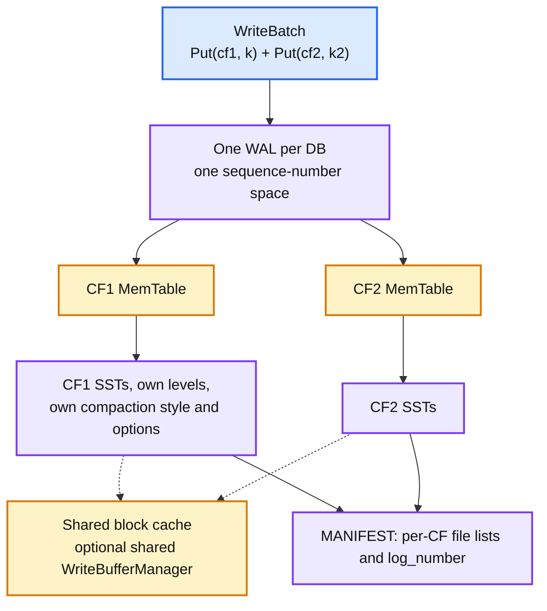
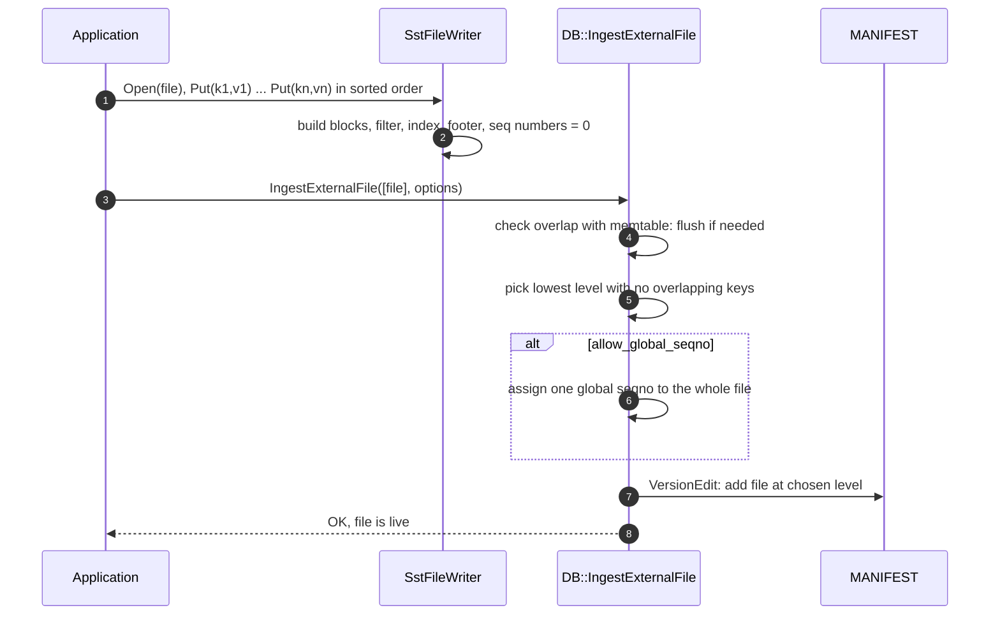
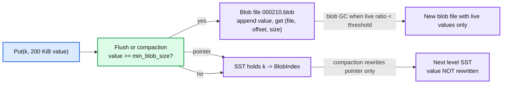

# RocksDB 04 — Features Above the Core LSM

**Baseline: RocksDB 11.x (main at 11.10.0).** Sources: `include/rocksdb/db.h`, `utilities/transactions/`, `utilities/checkpoint/`, `utilities/backup/`, `db/blob/`, `db/db_impl/db_impl_secondary.cc`, `include/rocksdb/merge_operator.h`, `include/rocksdb/sst_file_writer.h`. Each section is one feature: what it is, how it is layered onto the engine from reports 01 to 03, what it costs.

---

<!-- nav:start -->
[← 03 Compaction](rocksdb-03-compaction.md) · **[Index](README.md)** · [05 Operations and Trade-offs →](rocksdb-05-operations-and-tradeoffs.md)
<!-- nav:end -->

<!-- toc:start -->

<b>Sections in this report (13)</b>

- [1. Column families](#1-column-families)
- [2. Transactions](#2-transactions)
- [3. Merge operator](#3-merge-operator)
- [4. DeleteRange and SingleDelete](#4-deleterange-and-singledelete)
- [5. Bulk load: SstFileWriter and IngestExternalFile](#5-bulk-load-sstfilewriter-and-ingestexternalfile)
- [6. Checkpoint and BackupEngine](#6-checkpoint-and-backupengine)
- [7. BlobDB: key-value separation](#7-blobdb-key-value-separation)
- [8. User-defined timestamps](#8-user-defined-timestamps)
- [9. Secondary and read-only instances](#9-secondary-and-read-only-instances)
- [10. Remote compaction](#10-remote-compaction)
- [11. Tiered storage](#11-tiered-storage)
- [12. Smaller features worth knowing](#12-smaller-features-worth-knowing)
- [13. Staff-level questions](#13-staff-level-questions)

<!-- toc:end -->

## 1. Column families

- **What.** Independent keyspaces inside one DB, each with its own memtable, SST files, options (compaction style, compression, filters, comparator) and level structure. There is always a `default` CF.
- **Shared.** The WAL, the sequence number counter, MANIFEST, the block cache (if you pass the same object), the thread pools.
- **Why it exists.** Atomic writes across keyspaces (one `WriteBatch`, one WAL record), consistent snapshots across them (one sequence number), and per-keyspace tuning. MyRocks maps each index to a CF. TiKV uses `default`, `write`, `lock` and `raft` CFs for its MVCC layout.
- **Cost.** Memory scales with CF count unless a `WriteBufferManager` caps it. The shared WAL means a rarely-written CF pins old WALs, forcing tiny flushes via `max_total_wal_size` (report 01, question 3). Hundreds of CFs work. Thousands do not, because every flush and compaction decision iterates them.
- **Drop and create** are metadata operations. `DropColumnFamily` marks it in MANIFEST and files are deleted in the background.

---

## 2. Transactions

```mermaid
%% Where each transaction flavour puts its writes before commit
flowchart TB
  subgraph opt["OptimisticTransactionDB"]
    O1["Writes buffered in<br/>WriteBatchWithIndex"]
    O2["Commit: validate every read key's<br/>latest seq <= txn start seq"]
    O3["Conflict: Busy, caller retries"]
    O1 --> O2 --> O3
  end
  subgraph pes["TransactionDB (pessimistic)"]
    P1["Lock key in LockManager<br/>at Put or GetForUpdate"]
    P2["Writes buffered<br/>(WriteCommitted, default)"]
    P3["Commit: one WriteBatch to WAL + memtable, release locks"]
    P1 --> P2 --> P3
  end
  subgraph wp["TransactionDB with WritePrepared"]
    W1["Prepare: write data to WAL + memtable<br/>tagged with prepare seq"]
    W2["Commit table maps prepare seq to commit seq<br/>readers consult it"]
    W3["Commit: tiny WAL record, no data rewrite"]
    W1 --> W2 --> W3
  end

  class O1,O2,O3,P1,P2,P3,W1,W2,W3 service

  classDef client   fill:#dbeafe,stroke:#2563eb,stroke-width:2px,color:#111
  classDef service  fill:#dcfce7,stroke:#16a34a,stroke-width:2px,color:#111
  classDef store    fill:#ede9fe,stroke:#7c3aed,stroke-width:2px,color:#111
  classDef cache    fill:#fef3c7,stroke:#d97706,stroke-width:2px,color:#111
  classDef queue    fill:#cffafe,stroke:#0891b2,stroke-width:2px,color:#111
  classDef critical fill:#fee2e2,stroke:#dc2626,stroke-width:4px,color:#111
  classDef external fill:#e5e7eb,stroke:#6b7280,stroke-width:2px,color:#111,stroke-dasharray:4 3
  classDef decision fill:#fce7f3,stroke:#db2777,stroke-width:2px,color:#111
```

- **Both flavours are libraries on top of `DB`**, in `utilities/transactions/`. The core engine knows nothing about them except `two_write_queues` and `unordered_write`, which exist to make WritePrepared fast.
- **Optimistic.** No locks. The transaction records the sequence number of every key it read. At commit, RocksDB checks that none of those keys have a newer version in the memtable. If the memtable has already been flushed past the transaction's start, validation cannot be done and the commit fails conservatively. Good for low contention, short transactions.
- **Pessimistic (`TransactionDB`).** A `LockManager` holds point locks (and optionally range locks via `RangeLockManager`) in memory. `Put` or `GetForUpdate` takes the lock, waits up to `lock_timeout`, and deadlock detection is optional (`deadlock_detect`). Locks are held until commit or rollback. Used by MyRocks.
- **Write policies.** `WriteCommitted` (default): buffer everything, write at commit. Simple, but a large transaction holds its data in memory and its commit is one huge write group. `WritePrepared`: write data at `Prepare` with a *prepare* sequence number; a commit cache maps prepare seq to commit seq, and every reader consults it to decide visibility. Commit is then a tiny record. `WriteUnprepared`: like WritePrepared but writes can go to the DB even before `Prepare`, so a transaction's memory is bounded. MyRocks needed these for multi-GB transactions **[doc]**.
- **Two-phase commit.** `Prepare()` writes a prepare marker to the WAL. On recovery, prepared-but-uncommitted transactions are recovered as prepared and the caller (MySQL's XA coordinator) decides. This is what lets MyRocks participate in binlog group commit.
- **Isolation.** Snapshot isolation via `SetSnapshot`. Read-committed by default. No serialisable mode; the embedding system (CockroachDB, TiKV) implements that above RocksDB with its own timestamps.

---

## 3. Merge operator

- **What.** `Merge(key, operand)` appends an operand without reading the current value. The operator you register (`MergeOperator::FullMergeV2`, `PartialMergeMulti`) folds operands into a value later, at read time or during compaction.
- **How.** A `kTypeMerge` entry in the memtable and SST. On `Get`, the read path collects merge entries newest-first until it hits a `kTypeValue` or a tombstone, then calls `FullMergeV2(base, operands)`. On compaction, `PartialMerge` collapses adjacent operands when it can, and `FullMerge` is applied only when the base value is in the compaction's inputs.
- **Why.** Counters, list appends, set unions, JSON patches: read-modify-write without the read. Meta's use cases include feature counters and social graph edges **[doc]**. A `Put` of a 1 MiB list to add one element becomes a 20-byte `Merge`.
- **Cost.** Reads become O(chain length) until compaction folds it. A hot counter with 10,000 merges between compactions costs 10,000 operand reads on `Get`. The mitigation is `max_successive_merges` (fold in the memtable when the chain is short) and a `PartialMerge` that is associative so compaction can shrink chains without the base value.
- **Built-in operators** in `utilities/merge_operators/`: `UInt64AddOperator`, `StringAppendOperator`, `PutOperator`, `MaxOperator`, `BytesXOROperator`.

---

## 4. DeleteRange and SingleDelete

- **`DeleteRange(begin, end)`** writes one `kTypeRangeDeletion` tombstone covering a key range. It lives in a separate *range tombstone block* in each SST and a fragmented tombstone list in the memtable. Reads consult the range tombstones for every source before returning a point value. Compaction drops covered keys and, at the bottom level, the tombstone itself.
- **Why.** Dropping a tenant, a table, or a Raft log prefix in one write instead of iterating and deleting millions of keys. CockroachDB and TiKV use it for range deletion and Raft log truncation.
- **Cost.** Every read pays a range-tombstone lookup per source. Thousands of live range tombstones overlapping the same key range slow reads measurably. The wiki's advice is to keep them rare and let compaction clear them. `DeleteFilesInRange` is the metadata-only version for whole files that lie entirely inside the range.
- **`SingleDelete(key)`** is a cheaper tombstone with a contract: the key was written exactly once with `Put`, never with `Merge`, and never overwritten. Under that contract, compaction can drop both the tombstone and the `Put` the moment they meet, without carrying the tombstone to the bottom level. Kafka Streams and Flink use it for queue-like state. Violating the contract gives undefined results (old values can resurface).

---

## 5. Bulk load: SstFileWriter and IngestExternalFile

- **What.** Build an SST outside the DB, then link or copy it in as a live file at the deepest level that has no overlap. No WAL, no memtable, no L0, so no compaction cascade.
- **Why.** Backfills, restoring from a snapshot, migrating a shard, or loading a machine-learning feature table. TiKV and CockroachDB use it to receive Raft snapshots as files instead of replaying key by key.
- **Cost.** The file must be sorted and non-overlapping with itself. If it overlaps existing data at every level it lands in L0 and gets compacted like anything else. Ingestion briefly blocks writes while checking memtable overlap. `IngestExternalFiles` (plural) ingests into several CFs atomically.

---

## 6. Checkpoint and BackupEngine

- **`Checkpoint::CreateCheckpoint(dir)`**: a consistent, openable copy of the DB in another directory on the same filesystem. SSTs are *hard-linked* (instant, no space), MANIFEST and the current WAL are copied. Takes a flush or a WAL copy depending on `log_size_for_flush`. This is how you snapshot a running RocksDB without stopping writes.
- **`BackupEngine`**: incremental backups to another directory or `Env` (S3 via a custom `FileSystem`). Tracks which SSTs a previous backup already contains by name and checksum, so an incremental backup copies only new files. Supports `RestoreDBFromBackup`, backup verification, and garbage collection of old backups.
- **Why they work.** Immutable SSTs. A file that exists at checkpoint time will never change, so a hard link is a valid copy forever. Compare with a B-tree, where a consistent copy needs a lock or copy-on-write.
- **`ExportColumnFamily`**: checkpoint one CF as ingestible SST files, which combines with `IngestExternalFile` to move a CF between DBs.

---

## 7. BlobDB: key-value separation

- **What.** `enable_blob_files = true` (default false) with `min_blob_size` (default 0, so every value) writes values into append-only blob files during flush and compaction; the SST stores a small pointer. The WiscKey idea, integrated into the main engine since 6.18 to replace the older `utilities/blob_db` **[doc]**.
- **Why.** Compaction WA is paid per byte rewritten. If values are 100x larger than keys, keeping values out of compaction cuts WA by roughly that factor. Meta's motivating case was large-value stores under leveled compaction **[doc]**.
- **Cost.** A `Get` becomes two reads: SST then blob file. Blob files accumulate dead values, so *blob garbage collection* (`enable_blob_garbage_collection`, `blob_garbage_collection_age_cutoff`, `blob_garbage_collection_force_threshold`) rewrites old blob files during compaction, which reintroduces some WA. Range scans over values are slower because values are no longer sorted together. `blob_cache` (a separate cache) offsets the read cost.

---

## 8. User-defined timestamps

- **What.** The comparator can declare a fixed-width timestamp suffix on every key (`Comparator::timestamp_size()`). Reads take a timestamp and see the newest version at or below it. Keys sort by user key then timestamp descending, which is exactly how internal keys already sort by sequence number.
- **Why.** Systems that implement MVCC above RocksDB (TiKV, CockroachDB before Pebble) were encoding a timestamp into the key by hand and losing the ability to do prefix bloom, `SingleDelete`, and efficient compaction of old versions. Native timestamps let RocksDB understand versions and let the caller set a *full history TS low* below which old versions are garbage-collected by compaction.
- **Cost.** Still marked as under active development in `options.h`. Not every feature composes with it (transactions and merge have restrictions). The key grows by the timestamp width on every entry.

---

## 9. Secondary and read-only instances

- **`DB::OpenForReadOnly`**: opens the directory with no WAL, no compaction, no writes. Sees the state as of open. Multiple processes can do this while a primary writes, subject to the primary not deleting files they hold open (it does not, thanks to `Version` refs within the primary, but a separate process gets no such protection, so use a checkpoint if you need it stable).
- **`DB::OpenAsSecondary`**: a read-only instance that *follows* the primary. It tails the primary's MANIFEST for new files and tails the primary's WAL into its own memtable, on `TryCatchUpWithPrimary()`. This is how a reporting process, a search indexer, or a warm standby reads a live DB from another process on the same host or a shared filesystem.
- **Cost.** The secondary is always slightly behind. It cannot compact, so its read amplification is whatever the primary's is. The primary must not delete WALs the secondary has not read; this is what `WAL_ttl_seconds` and the secondary's catch-up cadence must be tuned for.

---

## 10. Remote compaction

- **What.** `CompactionService` is an interface: the primary serialises a compaction's inputs (file list, options, snapshot list) and hands it to a service that runs it elsewhere, returns the output file names, and the primary installs them via MANIFEST. `OpenAndCompact` is the entry point on the worker side.
- **Why.** On a busy serving host, compaction CPU competes with foreground requests. Meta runs a compaction pool separate from the serving fleet **[doc]**. It also lets compaction scale independently of storage.
- **Cost.** Input and output files must be visible to both sides (shared filesystem, or copied). Failure of the worker falls back to local compaction. Still evolving in the API.

---

## 11. Tiered storage

- **What.** Experimental since 7.5.0. `last_level_temperature` tags the bottom level's files as cold, and a `FileSystem` implementation can place cold files on cheaper media (HDD, network, object store). `preclude_last_level_data_seconds` keeps data younger than this out of the bottom level so recent data stays hot. `preserve_internal_time_seconds` records write time per SST so the age is knowable.
- **Why.** The bottom level holds ~90% of bytes and receives a small fraction of reads. Putting it on cheaper storage is the biggest cost lever after compression.
- **Cost.** Reads that hit the cold tier are slow. Compaction into the cold level crosses the media boundary. The feature is still labelled incomplete in `HISTORY.md` and needs a custom `FileSystem`.

---

## 12. Smaller features worth knowing

| Feature | One line |
|---|---|
| `Env` / `FileSystem` | All IO goes through an abstraction. Swap in encryption (`EncryptedEnv`), HDFS, S3 (via third-party plugins), or in-memory for tests |
| `WriteBatchWithIndex` | A batch that is also searchable, so a transaction can read its own uncommitted writes |
| `GetUpdatesSince(seq)` | Tail the WAL from a sequence number. The basis for third-party replication |
| `CompactRange` | Manual compaction of a key range, optionally to the bottom level |
| `GetApproximateSizes`, `GetProperty` | Size estimates and ~100 introspection properties (`rocksdb.stats`, `rocksdb.num-files-at-level0`, `rocksdb.estimate-live-data-size`) |
| `Statistics` and `PerfContext` | Global counters and histograms, and per-thread per-operation breakdowns |
| `EventListener` | Callbacks on flush, compaction, file deletion, stall, background error |
| `SstPartitionerFactory` | Cut output files at application-defined boundaries so a tenant's data never shares a file |
| `DBWithTTL` | Wrapper that appends a timestamp to every value and drops expired ones via compaction filter |
| `ldb`, `sst_dump`, `db_bench` | CLI: inspect, repair, dump, benchmark |
| Trace and replay | Record a workload's API calls and replay it against a different configuration |
| `OptionsUtil::LoadLatestOptions` | Reopen a DB with exactly the options it was last opened with |

---

## 13. Staff-level questions

1. **You need atomic updates across a "users" and an "emails" keyspace. CF or key prefix?** Both give atomicity via `WriteBatch`. CFs add separate compaction, separate memtables and the ability to drop one keyspace instantly. Prefixes keep memory flat and let one iterator scan both. Choose CFs when the keyspaces have different write rates, value sizes or lifetimes; choose prefixes when there are many small keyspaces (thousands of tenants), because CF count is the hidden cost.

2. **Pessimistic transactions with `WriteCommitted`: what is the memory and latency shape of a transaction that writes 10 million keys?** All 10 million entries sit in the transaction's `WriteBatchWithIndex` until commit, then commit is one write group with a 10-million-entry WAL record. Other writers stall behind it. That is why MyRocks moved to `WritePrepared` and later `WriteUnprepared`: data goes to the memtable as the transaction proceeds and commit is a marker.

3. **Merge operator for a counter: what breaks under a hot key?** Read latency, not write latency. A `Get` walks every merge operand since the last full merge. Set `max_successive_merges` so the memtable folds short chains, make `PartialMerge` associative so compaction folds without the base, and if the key is hot enough, keep the counter in the application and `Put` periodically instead.

4. **BlobDB or bigger `max_bytes_for_level_base` for 500 KiB values?** BlobDB. Level sizing changes how often a byte is rewritten; blob files change whether the value bytes are rewritten at all. With 500 KiB values, WA on values dominates everything, and the two-read `Get` cost is trivial relative to reading 500 KiB anyway. Watch blob GC and disk headroom.

5. **How would you take a consistent backup of a 2 TB RocksDB to S3 every hour?** `BackupEngine` with an S3-backed `FileSystem`, incremental. Hour one copies 2 TB. Each later hour copies only SSTs created since the last backup, which is roughly the compaction output volume, not the DB size. Checkpoint first if you need a local point-in-time copy for a restore test. Restore is a copy plus `Open`; no replay beyond the copied WAL.

---

<!-- nav:start -->
[← 03 Compaction](rocksdb-03-compaction.md) · **[Index](README.md)** · [05 Operations and Trade-offs →](rocksdb-05-operations-and-tradeoffs.md)
<!-- nav:end -->
