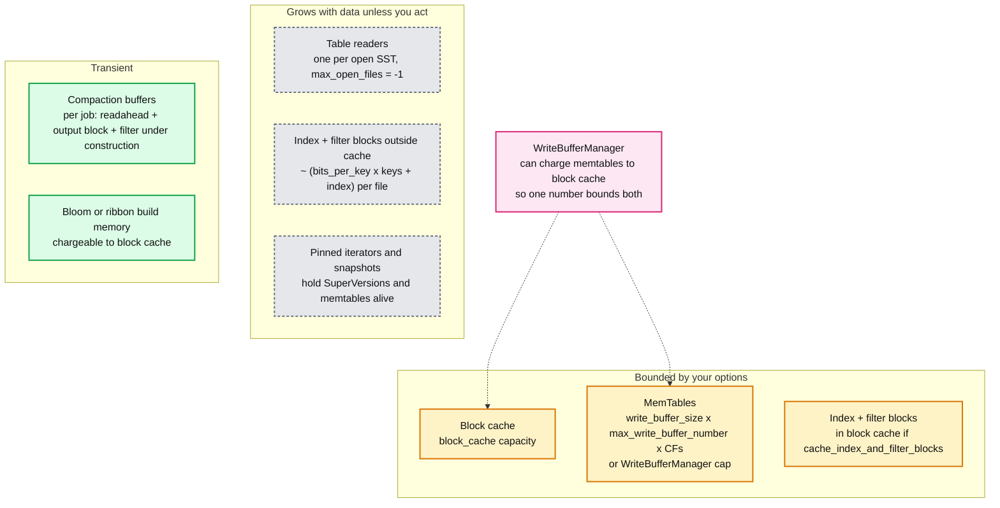

# RocksDB 05 — Operations, Tuning, Who Embeds It, and Trade-offs

**Baseline: RocksDB 11.x** (`main` at 11.10.0, 2026-08-28. Latest tagged release v11.8.1, 2026-08-07). Sources: `HISTORY.md`, the wiki pages *Memory Usage*, *Setup Options and Basic Tuning*, *RocksDB Tuning Guide*, *RocksDB Users and Use Cases*, and the FAST'21 paper.

---

<!-- nav:start -->
[← 04 Features](rocksdb-04-features.md) · **[Index](README.md)** · →
<!-- nav:end -->

<!-- toc:start -->
<details>
<summary><b>Sections in this report (10)</b></summary>

- [1. The memory budget](#1-the-memory-budget)
- [2. Where the bottleneck is, by workload](#2-where-the-bottleneck-is-by-workload)
- [3. Tuning recipes](#3-tuning-recipes)
- [4. What pages someone at 3am](#4-what-pages-someone-at-3am)
- [5. Failure modes](#5-failure-modes)
- [6. Who embeds it and how](#6-who-embeds-it-and-how)
- [7. Alternatives](#7-alternatives)
- [8. Patterns that generalise](#8-patterns-that-generalise)
- [9. Version notes that matter](#9-version-notes-that-matter)
- [10. Staff-level questions](#10-staff-level-questions)

</details>
<!-- toc:end -->

## 1. The memory budget



The single most common production incident with embedded RocksDB is "the process got OOM-killed and nobody knew RocksDB was using 40% of RAM". The rule:

1. Create **one** block cache and share it across every CF and every DB instance in the process.
2. Create **one** `WriteBufferManager` with a cap, and set `allow_stall = true` so writes pause instead of memory growing.
3. Set `cache_index_and_filter_blocks = true`, `pin_l0_filter_and_index_blocks_in_cache = true`, and charge filter construction and table readers to the cache via `CacheEntryRoleOptions`.
4. Now the block cache capacity is close to RocksDB's total RSS. Set it to what you can afford and verify with `rocksdb.block-cache-usage` plus `rocksdb.cur-size-all-mem-tables`.

Index and filter size rule of thumb: ~10 bits per key for the filter plus ~1 to 2% of data size for the index. A DB with 1 billion keys has ~1.2 GiB of filters. That is why they must be in the cache, not outside it.

---

## 2. Where the bottleneck is, by workload

RocksDB has no single red node. The thing that breaks first depends on what you ask of it.

| Workload | Breaks first | Symptom | Report |
|---|---|---|---|
| Sustained write ingest | Compaction throughput, then L0 to L1 job | write stalls, `rocksdb.stall.micros` | 01, 03 |
| Random point reads, data >> RAM | Block cache miss rate, then L0 file count | p99 read latency, `block.cache.data.miss` | 02 |
| Range scans | Sorted-run count, tombstones in range | scan throughput drops, `internal_delete_skipped_count` | 02, 03 |
| Many small writers, `sync = true` | The single WAL writer and fsync latency | write throughput flat with more threads | 01 |
| Large values | Compaction WA on value bytes | disk write bandwidth, SSD wear | 03, 04 |
| Many CFs or many DB instances | Memtable and filter memory | RSS growth, OOM | 05 section 1 |
| High CPU, read-heavy | LRU cache mutex, decompression, comparator calls | CPU flat-lined before disk | 02 |

The wiki's *RocksDB Tuning Guide* opens by saying most users should not tune, and that the defaults are set for a balanced workload on flash **[doc]**. In practice every serious embedding retunes the five things in the next section.

---

## 3. Tuning recipes

**Baseline for any production instance**

```
options.max_background_jobs        = number of cores you give RocksDB (4 to 8)
options.bytes_per_sync             = 1 MiB   (smooth out fsync bursts on flush and compaction)
options.compaction_pri             = kMinOverlappingRatio (already default)
table.block_cache                  = HyperClockCache, sized to budget, shared
table.filter_policy                = NewBloomFilterPolicy(10) or NewRibbonFilterPolicy(10, 2)
table.cache_index_and_filter_blocks = true, pin L0 in cache
table.block_size                   = 16 KiB for scan-heavy, 4 KiB default for point reads
options.compression                = LZ4 on upper levels, ZSTD on the bottom (bottommost_compression)
options.level_compaction_dynamic_level_bytes = true (already default since 8.4.0)
```

**Write-heavy, few reads** (ingest, logs, Kafka Streams changelog restore)

- Universal compaction, or leveled with `max_bytes_for_level_base = 1 GiB` and `level0_file_num_compaction_trigger = 8`.
- `write_buffer_size = 256 MiB`, `max_write_buffer_number = 4`, `min_write_buffer_number_to_merge = 2`.
- `max_subcompactions = 4`.
- `disableWAL = true` if the caller has a durable source; otherwise `sync = false` with periodic `FlushWAL(true)`.
- Consider `VectorRepFactory` memtable for pure bulk load.

**Read-heavy, point lookups** (feature store, cache, MyRocks primary key lookups)

- Block cache as large as affordable, HyperClockCache.
- `optimize_filters_for_hits = true` (skip building filters on the bottom level, since a miss rarely reaches it and the bottom level holds 90% of filter bytes).
- Ribbon filter on levels 2 and below for ~30% less filter memory.
- Row cache for very hot small keys.
- `use_direct_reads = true` if you sized the block cache for everything, to stop the page cache double-buffering.

**Scan-heavy** (secondary index, time-range queries)

- `block_size = 32 or 64 KiB`, `block_restart_interval = 64`.
- Prefix extractor plus `prefix_same_as_start` and `iterate_upper_bound` on every scan.
- Leveled, small L0, and periodic compaction so tombstones do not accumulate in scanned ranges.

**Space-constrained** (SSD cost)

- Leveled with dynamic level bytes (SA 1.11).
- ZSTD with a dictionary on the bottom level.
- Ribbon filters.
- BlobDB only if values are large and you can afford the blob GC overhead.

---

## 4. What pages someone at 3am

| Metric | Threshold | Meaning |
|---|---|---|
| `rocksdb.stall.micros` rate | > 0 sustained for 1 min | writes are being delayed or stopped |
| `rocksdb.num-files-at-level0` | > `level0_slowdown_writes_trigger` / 2 | L0 to L1 is behind |
| `rocksdb.estimate-pending-compaction-bytes` | > 50% of soft limit | total compaction debt |
| `rocksdb.cur-size-all-mem-tables` | near `WriteBufferManager` cap | flush is behind |
| `rocksdb.block-cache-usage` vs capacity, plus `block.cache.miss` rate | miss rate step change | working set outgrew cache or index/filter eviction |
| `rocksdb.num-snapshots` and `oldest-snapshot-time` | snapshot older than 10 min | something is leaking snapshots or iterators, pinning space and memtables |
| `rocksdb.background-errors` | > 0 | DB is in error state, writes are failing, needs `Resume()` |
| `rocksdb.estimate-live-data-size` vs disk used | ratio > 1.5 | space amplification, check snapshots and compaction style |
| `rocksdb.num-running-compactions` | 0 while pending bytes grow | compaction is not scheduled: thread pool exhausted or rate limiter too tight |

SLO shape for a single instance: p99 point read under 1 ms on cache miss to NVMe, p99 write under 1 ms with `sync = false`, zero stall seconds per hour. Anything the embedding system promises above that is a function of its own replication and fan-out.

---

## 5. Failure modes

| Failure | Blast radius | Recovery |
|---|---|---|
| Process crash | unsynced WAL tail lost if `sync = false` | reopen, WAL replay, seconds to minutes |
| Power loss with `sync = false` | same, plus possible torn last WAL record | `kPointInTimeRecovery` stops at the tear |
| Disk full | background error, writes fail | free space, `Resume()` |
| SST corruption (bit rot) | one file's blocks fail checksum on read | `ldb repair` rebuilds MANIFEST from surviving files; the data in the bad blocks is gone unless the embedding system replicates |
| MANIFEST corruption | DB will not open | `ldb repair` scans SSTs and rebuilds. Level assignment and some metadata is lost, compaction re-derives it |
| Compaction starvation | stalls, then stop | more threads, rate limiter off, manual `CompactRange` as last resort |
| Snapshot or iterator leak | unbounded space and memtable memory | find the leak; there is no server-side timeout |
| Options file mismatch across binary versions | open fails or behaviour changes | `LoadLatestOptions`, pin `format_version` during rolling upgrades |
| Two processes open the same directory | `LOCK` file refuses the second | by design |

RocksDB's stance is that it detects corruption and refuses to serve it, but it does not repair it. The layer above (replication) is where repair comes from. This is the same division of labour as a single Cassandra node's storage engine, and the opposite of a database like PostgreSQL, which owns both.

---

## 6. Who embeds it and how

| System | Uses RocksDB for | Notable choices |
|---|---|---|
| **MyRocks** (Meta, MariaDB, Percona) | InnoDB replacement for MySQL | one CF per index, `WritePrepared` / `WriteUnprepared` transactions, 2PC with binlog, reverse comparator CFs for descending indexes. Meta's motivation was ~50% less space than InnoDB **[doc]** |
| **ZippyDB** (Meta) | general KV store, Paxos-replicated shards | thousands of instances per host, shared block cache, `WriteBufferManager` |
| **TiKV** (PingCAP) | per-node store under Raft | CFs `default`, `write`, `lock`, `raft`; MVCC via key-encoded timestamps; `IngestExternalFile` for snapshots; `DeleteRange` for Raft log truncation. Titan is their BlobDB variant |
| **CockroachDB** | per-node store under Raft, until v20.2 (2020) | replaced by Pebble, a Go rewrite of RocksDB's format and design, to remove cgo overhead and own the roadmap |
| **YugabyteDB DocDB** | one RocksDB per tablet, heavily forked | added hybrid-time MVCC, document-level encoding, and their own compaction and backup paths |
| **Kafka Streams** | state stores (`KeyValueStore`, windowed stores) | `disableWAL` in effect, changelog topic is the durable copy; one RocksDB per store per partition |
| **Apache Flink** | `EmbeddedRocksDBStateBackend` | incremental checkpoints via `Checkpoint` hard links uploaded to DFS; one CF per state descriptor |
| **Ceph BlueStore** | object metadata and allocator state | on BlueFS, its own minimal filesystem; sharded CFs for different metadata types |
| **ArangoDB** | default storage engine since 3.7 | one CF per collection type |

What every one of these systems adds on top: replication, sharding, a schema or document model, and a global memory manager. What none of them changed: the WAL plus memtable plus leveled SST core. That is the strongest evidence of where RocksDB's abstraction boundary sits.

---

## 7. Alternatives

| Engine | Model | Pick it over RocksDB when |
|---|---|---|
| **LevelDB** | same LSM, single writer, no CFs, no transactions | you want the smallest possible dependency and write volume is tiny |
| **Pebble** (CockroachDB) | RocksDB-compatible LSM in Go | you are in Go and cgo cost matters. Reads and writes RocksDB files |
| **WiredTiger** (MongoDB) | B-tree with LSM option, MVCC, checkpointing | you need in-place update performance and long range scans on a B-tree |
| **LMDB** | copy-on-write B-tree, mmap, single writer | read-mostly, small data, zero-copy reads, no compaction wanted |
| **Sled, redb, fjall** | Rust-native engines | Rust project, small footprint. Less battle-tested |
| **SQLite** | B-tree, SQL | you need SQL and ACID in-process and write rates are modest |
| **Badger** (Dgraph) | Go LSM with WiscKey key-value separation from the start | Go, large values, write-heavy |
| **SpeeDB, Rocks-derived forks** | RocksDB with a different memtable and compaction | rarely; the deltas get upstreamed or the fork stalls |

The interviewer's version of this question is "LSM or B-tree?" The answer: LSM when writes dominate and SSD wear or write throughput is the constraint; B-tree when reads dominate, especially range scans, and in-place update keeps space amplification at 1. RocksDB is the LSM everyone reaches for because of its option surface and its embedders' collective operational experience, not because the core algorithm is unique.

---

## 8. Patterns that generalise

| Pattern | In RocksDB | Also in |
|---|---|---|
| Write-ahead log plus in-memory index, flush to immutable file | WAL + memtable + SST | Cassandra commitlog + memtable + SSTable, Kafka log segments (WAL only) |
| Background merge to bound read cost | compaction | Cassandra compaction, Kafka log compaction, Lucene segment merges |
| Metadata as a replayed edit log | MANIFEST + VersionEdit | KRaft metadata log, etcd revision log, Kubernetes resourceVersion |
| Monotonic sequence number as MVCC and snapshot | sequence number | Cassandra write timestamps (weaker: client clocks), Postgres XIDs, Kafka offsets |
| Probabilistic skip before IO | bloom and ribbon filters | Cassandra bloom filters, HBase, ClickHouse skip indexes |
| Group commit | write group leader | Kafka producer batching, MySQL binlog group commit |
| Backpressure via stalls, not queues | write stalls | Kafka quotas and `max.block.ms`, Kubernetes API priority and fairness |
| Immutable files make copies free | checkpoint hard links, incremental backup | Kafka tiered storage segment upload, Cassandra snapshots (also hard links) |
| Key-value separation | BlobDB | WiscKey, Badger, Titan, TiKV |
| Policy above, mechanism below | no replication in the engine | Kafka's replication is above the log, Cassandra's is above the storage engine, Kubernetes' scheduler is above the API server |

---

## 9. Version notes that matter

Verified against `HISTORY.md` on `main` (11.10.0, 2026-08-28). These are the changes most likely to make an older tutorial wrong.

| Version | Date | Change |
|---|---|---|
| 6.15 to 6.18 | 2020 to 2021 | Integrated BlobDB replaces `utilities/blob_db`; Ribbon filters land |
| 7.5.0 | 2022-07 | Tiered storage: `preclude_last_level_data_seconds`, experimental |
| 8.0.0 | 2023-02 | `block_cache_compressed` removed in favour of `SecondaryCache` |
| 8.4.0 | 2023-06 | `level_compaction_dynamic_level_bytes` defaults to **true** |
| 10.7.0 | 2025-09 | HyperClockCache is production-ready and becomes the **default** block cache when none is supplied |
| 10.11.0 | 2026-01 | `format_version` defaults to **7** (readable by >= 10.4.0) |
| 11.x | 2026 | drops reading `format_version < 2`; current line |

Practical consequences: any tutorial that says "set dynamic level bytes", "create an LRU cache", or "format_version 5" is describing pre-2023 defaults. During a rolling upgrade across a major version, pin `format_version` until every node is upgraded.

---

## 10. Staff-level questions

1. **Your service runs 200 RocksDB instances per host (one per shard). What do you share, and what do you not?** Share: one block cache, one `WriteBufferManager`, one `RateLimiter`, one `Env` thread pool. Do not share: WAL, MANIFEST, directories (each shard must be movable as a unit). This is the ZippyDB and TiKV shape. The hidden cost is the compaction thread pool: 200 instances with `max_background_jobs = 2` each is 400 threads; set the shared `Env`'s pool size instead.

2. **Explain why RocksDB does not do replication, and what it gives up.** Replication needs a decision about consensus, topology and failure detection that differs per system: Raft in TiKV, Paxos in ZippyDB, MySQL binlog in MyRocks, changelog topics in Kafka Streams. Putting one in the engine would make it wrong for most embedders. It gives up the ability to repair a corrupt file from a peer, so the engine's stance is "detect and refuse", and it gives up any built-in backup-to-peer. The embedding system's snapshot transfer is built on `Checkpoint` and `IngestExternalFile` instead.

3. **Migration: you are moving a service from an in-memory map with periodic full dumps to RocksDB. Rollout and rollback?** Dual-write behind a flag; serve reads from the map; verify RocksDB via async comparison on a sample. Flip reads to RocksDB per shard; keep the map warm for one release. Rollback is flipping the flag; the map is still current because dual-write continued. The RocksDB-specific risk is memory: measure RSS with the shared cache before rolling to a host with 200 shards. The zero-downtime piece is that RocksDB opens in seconds (MANIFEST plus WAL replay), so a restart is not a rebuild.

4. **Cost: what does RocksDB cost in engineering time that a managed database does not?** Memory accounting (section 1), compaction tuning per workload (section 3), backup you write yourself (report 04 section 6), version upgrades that touch on-disk format, and the absence of anyone else's dashboards. Budget one engineer-quarter for the first production embedding and ongoing on-call literacy. What it saves: a network hop, a fleet, and a team that runs the database.

5. **The interviewer says "RocksDB is just LevelDB with more options". Push back.** Concurrent memtable writes and pipelined WAL (LevelDB has one writer at a time), column families with a shared WAL, three compaction styles with subcompactions and dynamic sizing, pessimistic and optimistic transactions with 2PC, merge operators, range deletes, blob files, checkpoints and incremental backups, secondary instances, and a pluggable `FileSystem`. LevelDB is a proof of the LSM idea; RocksDB is a storage engine platform that a dozen databases are built on. The file format lineage is the only thing that stayed.

---

<!-- nav:start -->
[← 04 Features](rocksdb-04-features.md) · **[Index](README.md)** · →
<!-- nav:end -->
